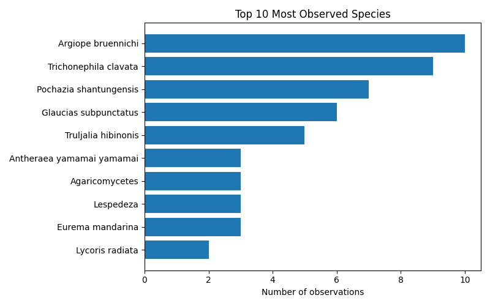
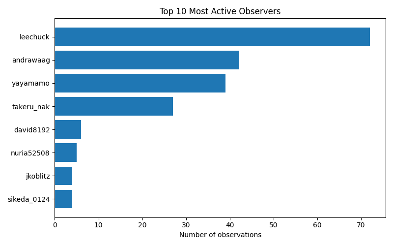

# iNaturalist Project Report: biohackathon-2025

- Total observations: 199
- Unique species observed: 146
- Unique observers: 8

## Wikipedia & Wikidata Coverage

- Species not on Wikidata: **8**
- Missing in [x]: **584**

- Missing in [x]: **584**

- Missing in [x]: **584**

- Missing in [x]: **584**

| Species | Wikidata | [x] | [x] | [x] | [x] |
|---|---|---|---|---|---|

| Acanthuridae | ✅ | ❌ | ❌ | ❌ | ❌ |
| Acromegalomma | ✅ | ❌ | ❌ | ❌ | ❌ |
| Acronicta pruinosa | ✅ | ❌ | ❌ | ❌ | ❌ |
| Agaricales | ✅ | ❌ | ❌ | ❌ | ❌ |
| Agaricomycetes | ✅ | ❌ | ❌ | ❌ | ❌ |
| Agaricus | ✅ | ❌ | ❌ | ❌ | ❌ |
| Aiolopus thalassinus tamulus | ✅ | ❌ | ❌ | ❌ | ❌ |
| Anatherum virginicum | ✅ | ❌ | ❌ | ❌ | ❌ |
| Anisoptera | ✅ | ❌ | ❌ | ❌ | ❌ |
| Antheraea yamamai | ✅ | ❌ | ❌ | ❌ | ❌ |
| Anthomyzidae | ✅ | ❌ | ❌ | ❌ | ❌ |
| Anura | ✅ | ❌ | ❌ | ❌ | ❌ |
| Aplonis panayensis | ✅ | ❌ | ❌ | ❌ | ❌ |
| Argiope bruennichi | ✅ | ❌ | ❌ | ❌ | ❌ |
| Argiopinae | ✅ | ❌ | ❌ | ❌ | ❌ |
| Bactra furfurana | ✅ | ❌ | ❌ | ❌ | ❌ |
| Boletaceae | ✅ | ❌ | ❌ | ❌ | ❌ |
| Boletales | ✅ | ❌ | ❌ | ❌ | ❌ |
| Boletellus | ✅ | ❌ | ❌ | ❌ | ❌ |
| Boletellus emodensis | ✅ | ❌ | ❌ | ❌ | ❌ |
| Camponotus obscuripes | ✅ | ❌ | ❌ | ❌ | ❌ |
| Canarium labiatum | ✅ | ❌ | ❌ | ❌ | ❌ |
| Chlaenius posticalis | ✅ | ❌ | ❌ | ❌ | ❌ |
| Clematis terniflora | ✅ | ❌ | ❌ | ❌ | ❌ |
| Clerodendrum trichotomum | ✅ | ❌ | ❌ | ❌ | ❌ |
| Conocephalus | ✅ | ❌ | ❌ | ❌ | ❌ |
| Corvus macrorhynchos japonensis | ✅ | ❌ | ❌ | ❌ | ❌ |
| Culicidae | ✅ | ❌ | ❌ | ❌ | ❌ |
| Culicinae | ✅ | ❌ | ❌ | ❌ | ❌ |
| Cupido argiades | ✅ | ❌ | ❌ | ❌ | ❌ |
| Cyprinus rubrofuscus | ✅ | ❌ | ❌ | ❌ | ❌ |
| Cyrtarachne | ✅ | ❌ | ❌ | ❌ | ❌ |
| Cyrtarachne bufo | ✅ | ❌ | ❌ | ❌ | ❌ |
| Cyrtarachne inaequalis | ✅ | ❌ | ❌ | ❌ | ❌ |
| Cyrtarachne nagasakiensis | ✅ | ❌ | ❌ | ❌ | ❌ |
| Danielithosia immaculata | ✅ | ❌ | ❌ | ❌ | ❌ |
| Desmodium paniculatum | ✅ | ❌ | ❌ | ❌ | ❌ |
| Dicranopteris | ✅ | ❌ | ❌ | ❌ | ❌ |
| Dryopteris | ✅ | ❌ | ❌ | ❌ | ❌ |
| Egretta | ✅ | ❌ | ❌ | ❌ | ❌ |
| Emoia atrocostata | ✅ | ❌ | ❌ | ❌ | ❌ |
| Eurema mandarina | ✅ | ❌ | ❌ | ❌ | ❌ |
| Fomitopsis dickinsii | ✅ | ❌ | ❌ | ❌ | ❌ |
| Glaucias subpunctatus | ✅ | ❌ | ❌ | ❌ | ❌ |
| Graptopsaltria nigrofuscata | ✅ | ❌ | ❌ | ❌ | ❌ |
| Gryllacrididae | ✅ | ❌ | ❌ | ❌ | ❌ |
| Gryllini | ✅ | ❌ | ❌ | ❌ | ❌ |
| Gymnopilus | ✅ | ❌ | ❌ | ❌ | ❌ |
| Gymnopilus orientispectabilis | ✅ | ❌ | ❌ | ❌ | ❌ |
| Harpalinae | ✅ | ❌ | ❌ | ❌ | ❌ |
| Harpalus griseus | ✅ | ❌ | ❌ | ❌ | ❌ |
| Hasarius adansoni | ✅ | ❌ | ❌ | ❌ | ❌ |
| Hemidactylus | ✅ | ❌ | ❌ | ❌ | ❌ |
| Hemistola veneta | ✅ | ❌ | ❌ | ❌ | ❌ |
| Heteropoda venatoria | ✅ | ❌ | ❌ | ❌ | ❌ |
| Hibiscus | ✅ | ❌ | ❌ | ❌ | ❌ |
| Hippobroma longiflora | ✅ | ❌ | ❌ | ❌ | ❌ |
| Holochlora japonica | ✅ | ❌ | ❌ | ❌ | ❌ |
| Hospitalitermes | ✅ | ❌ | ❌ | ❌ | ❌ |
| Illicium anisatum | ✅ | ❌ | ❌ | ❌ | ❌ |
| Lantana camara | ✅ | ❌ | ❌ | ❌ | ❌ |
| Lariniaria argiopiformis | ✅ | ❌ | ❌ | ❌ | ❌ |
| Laspeyria ruficeps | ✅ | ❌ | ❌ | ❌ | ❌ |
| Lepidodactylus lugubris | ✅ | ❌ | ❌ | ❌ | ❌ |
| Lepidoptera | ✅ | ❌ | ❌ | ❌ | ❌ |
| Lepisorus thunbergianus | ✅ | ❌ | ❌ | ❌ | ❌ |
| Leptocorisa chinensis | ✅ | ❌ | ❌ | ❌ | ❌ |
| Lespedeza | ✅ | ❌ | ❌ | ❌ | ❌ |
| Lespedeza cuneata | ✅ | ❌ | ❌ | ❌ | ❌ |
| Linckia laevigata | ✅ | ❌ | ❌ | ❌ | ❌ |
| Locusta migratoria | ✅ | ❌ | ❌ | ❌ | ❌ |
| Loxoblemmus arietulus | ✅ | ❌ | ❌ | ❌ | ❌ |
| Lycoris radiata | ✅ | ❌ | ❌ | ❌ | ❌ |
| Meimuna opalifera | ✅ | ❌ | ❌ | ❌ | ❌ |
| Monticola solitarius philippensis | ✅ | ❌ | ❌ | ❌ | ❌ |
| Motacilla alba lugens | ✅ | ❌ | ❌ | ❌ | ❌ |
| Musca | ✅ | ❌ | ❌ | ❌ | ❌ |
| Neptis pryeri | ✅ | ❌ | ❌ | ❌ | ❌ |
| Nyctereutes viverrinus | ✅ | ❌ | ❌ | ❌ | ❌ |
| Oncocera semirubella | ✅ | ❌ | ❌ | ❌ | ❌ |
| Orancistrocerus | ✅ | ❌ | ❌ | ❌ | ❌ |
| Ornebius kanetataki | ✅ | ❌ | ❌ | ❌ | ❌ |
| Oryctes rhinoceros | ✅ | ❌ | ❌ | ❌ | ❌ |
| Paguroidea | ✅ | ❌ | ❌ | ❌ | ❌ |
| Pantala flavescens | ✅ | ❌ | ❌ | ❌ | ❌ |
| Papilio agenor | ✅ | ❌ | ❌ | ❌ | ❌ |
| Papilio machaon | ✅ | ❌ | ❌ | ❌ | ❌ |
| Parapediasia teterrellus | ✅ | ❌ | ❌ | ❌ | ❌ |
| Passer montanus | ✅ | ❌ | ❌ | ❌ | ❌ |
| Pelagodes antiquadraria | ✅ | ❌ | ❌ | ❌ | ❌ |
| Periplaneta americana | ✅ | ❌ | ❌ | ❌ | ❌ |
| Phaneroptera falcata | ✅ | ❌ | ❌ | ❌ | ❌ |
| Phelotrupes | ✅ | ❌ | ❌ | ❌ | ❌ |
| Pholcidae | ✅ | ❌ | ❌ | ❌ | ❌ |
| Pholcus phalangioides | ✅ | ❌ | ❌ | ❌ | ❌ |
| Physopelta gutta | ✅ | ❌ | ❌ | ❌ | ❌ |
| Pinus | ✅ | ❌ | ❌ | ❌ | ❌ |
| Plantae | ✅ | ❌ | ❌ | ❌ | ❌ |
| Plestiodon latiscutatus | ✅ | ❌ | ❌ | ❌ | ❌ |
| Pochazia shantungensis | ✅ | ❌ | ❌ | ❌ | ❌ |
| Polyporaceae | ✅ | ❌ | ❌ | ❌ | ❌ |
| Pseudagrion pilidorsum | ✅ | ❌ | ❌ | ❌ | ❌ |
| Psychostrophia melanargia | ✅ | ❌ | ❌ | ❌ | ❌ |
| Pyraloidea | ✅ | ❌ | ❌ | ❌ | ❌ |
| Reynoutria japonica | ✅ | ❌ | ❌ | ❌ | ❌ |
| Rhipidura nigritorquis | ✅ | ❌ | ❌ | ❌ | ❌ |
| Rosoideae | ✅ | ❌ | ❌ | ❌ | ❌ |
| Rusicada privata | ✅ | ❌ | ❌ | ❌ | ❌ |
| Ruspolia lineosa | ✅ | ❌ | ❌ | ❌ | ❌ |
| Scarabaeidae | ✅ | ❌ | ❌ | ❌ | ❌ |
| Sicydiinae | ✅ | ❌ | ❌ | ❌ | ❌ |
| Sipyloidea chlorotica | ✅ | ❌ | ❌ | ❌ | ❌ |
| Solidago altissima | ✅ | ❌ | ❌ | ❌ | ❌ |
| Spatalia doerriesi | ✅ | ❌ | ❌ | ❌ | ❌ |
| Spiralisigna subpumilata | ✅ | ❌ | ❌ | ❌ | ❌ |
| Statilia maculata maculata | ✅ | ❌ | ❌ | ❌ | ❌ |
| Steatoda cingulata | ✅ | ❌ | ❌ | ❌ | ❌ |
| Sutorius eximius | ✅ | ❌ | ❌ | ❌ | ❌ |
| Sympetrum | ✅ | ❌ | ❌ | ❌ | ❌ |
| Sympetrum eroticum | ✅ | ❌ | ❌ | ❌ | ❌ |
| Tabaninae | ✅ | ❌ | ❌ | ❌ | ❌ |
| Takydromus tachydromoides | ✅ | ❌ | ❌ | ❌ | ❌ |
| Tenodera sinensis | ✅ | ❌ | ❌ | ❌ | ❌ |
| Tephritoidea | ✅ | ❌ | ❌ | ❌ | ❌ |
| Thelypteridoideae | ✅ | ❌ | ❌ | ❌ | ❌ |
| Tipulomorpha | ✅ | ❌ | ❌ | ❌ | ❌ |
| Todiramphus chloris | ✅ | ❌ | ❌ | ❌ | ❌ |
| Trametes cubensis | ✅ | ❌ | ❌ | ❌ | ❌ |
| Trametes versicolor | ✅ | ❌ | ❌ | ❌ | ❌ |
| Trichonephila clavata | ✅ | ❌ | ❌ | ❌ | ❌ |
| Trichoptera | ✅ | ❌ | ❌ | ❌ | ❌ |
| Tringa brevipes | ✅ | ❌ | ❌ | ❌ | ❌ |
| Truljalia | ✅ | ❌ | ❌ | ❌ | ❌ |
| Truljalia hibinonis | ✅ | ❌ | ❌ | ❌ | ❌ |
| Vespidae | ✅ | ❌ | ❌ | ❌ | ❌ |
| Yaginumia sia | ✅ | ❌ | ❌ | ❌ | ❌ |
| Zephyranthes carinata | ✅ | ❌ | ❌ | ❌ | ❌ |
| Zeuzera multistrigata | ✅ | ❌ | ❌ | ❌ | ❌ |
| Antheraea yamamai yamamai | ⚠️ | ❌ | ❌ | ❌ | ❌ |
| Arhopala japonica | ⚠️ | ❌ | ❌ | ❌ | ❌ |
| Chrysopa pallens-group | ⚠️ | ❌ | ❌ | ❌ | ❌ |
| Ficus microcarpa latifolia | ⚠️ | ❌ | ❌ | ❌ | ❌ |
| Fortiblatta fuliginosa | ⚠️ | ❌ | ❌ | ❌ | ❌ |
| Pueraria montana lobata | ⚠️ | ❌ | ❌ | ❌ | ❌ |
| Tracheophyta | ⚠️ | ❌ | ❌ | ❌ | ❌ |
| Xanthodermatei | ⚠️ | ❌ | ❌ | ❌ | ❌ |
| **Totals** |  | 584 | 584 | 584 | 584 |