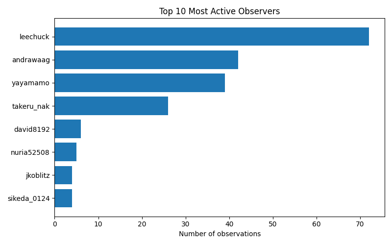

# iNaturalist Project Report: biohackathon-2025

- Total observations: 198
- Unique species observed: 147
- Unique observers: 8

## Wikipedia & Wikidata Coverage

- Species not on Wikidata: **8**
- Missing in en: **37**

- Missing in es: **76**

- Missing in ja: **76**

- Missing in ar: **96**

- Missing in nl: **56**

| Taxon | Wikidata | EN | ES | JA | AR | NL |
|---|---|---|---|---|---|---|
| Aiolopus thalassinus tamulus | ✅ | EN ❌ | ES ❌ | JA ❌ | AR ❌ | NL ❌ |
| Anatherum virginicum | ✅ | EN ❌ | ES ❌ | JA ❌ | AR ❌ | NL ❌ |
| Argiopinae | ✅ | EN ❌ | ES ❌ | JA ❌ | AR ❌ | NL ❌ |
| Corvus macrorhynchos japonensis | ✅ | EN ❌ | ES ❌ | JA ❌ | AR ❌ | NL ❌ |
| Danielithosia immaculata | ✅ | EN ❌ | ES ❌ | JA ❌ | AR ❌ | NL ❌ |
| Fomitopsis dickinsii | ✅ | EN ❌ | ES ❌ | JA ❌ | AR ❌ | NL ❌ |
| Gymnopilus orientispectabilis | ✅ | EN ❌ | ES ❌ | JA ❌ | AR ❌ | NL ❌ |
| Laspeyria ruficeps | ✅ | EN ❌ | ES ❌ | JA ❌ | AR ❌ | NL ❌ |
| Monticola solitarius philippensis | ✅ | EN ❌ | ES ❌ | JA ❌ | AR ❌ | NL ❌ |
| Papilio agenor | ✅ | EN ❌ | ES ❌ | JA ❌ | AR ❌ | NL ❌ |
| Pelagodes antiquadraria | ✅ | EN ❌ | ES ❌ | JA ❌ | AR ❌ | NL ❌ |
| Rusicada privata | ✅ | EN ❌ | ES ❌ | JA ❌ | AR ❌ | NL ❌ |
| Spiralisigna subpumilata | ✅ | EN ❌ | ES ❌ | JA ❌ | AR ❌ | NL ❌ |
| Thelypteridoideae | ✅ | EN ❌ | ES ❌ | JA ❌ | AR ❌ | NL ❌ |
| Acromegalomma | ✅ | [EN ✅](https://en.wikipedia.org/wiki/Acromegalomma) | ES ❌ | JA ❌ | AR ❌ | NL ❌ |
| Boletellus emodensis | ✅ | [EN ✅](https://en.wikipedia.org/wiki/Boletellus_emodensis) | ES ❌ | JA ❌ | AR ❌ | NL ❌ |
| Chlaenius posticalis | ✅ | EN ❌ | ES ❌ | JA ❌ | AR ❌ | [NL ✅](https://nl.wikipedia.org/wiki/Chlaenius_posticalis) |
| Eurema mandarina | ✅ | [EN ✅](https://en.wikipedia.org/wiki/Eurema_mandarina) | ES ❌ | JA ❌ | AR ❌ | NL ❌ |
| Glaucias subpunctatus | ✅ | EN ❌ | ES ❌ | [JA ✅](https://ja.wikipedia.org/wiki/%E3%83%84%E3%83%A4%E3%82%A2%E3%82%AA%E3%82%AB%E3%83%A1%E3%83%A0%E3%82%B7) | AR ❌ | NL ❌ |
| Lepisorus thunbergianus | ✅ | EN ❌ | ES ❌ | [JA ✅](https://ja.wikipedia.org/wiki/%E3%83%8E%E3%82%AD%E3%82%B7%E3%83%8E%E3%83%96) | AR ❌ | NL ❌ |
| Leptocorisa chinensis | ✅ | EN ❌ | ES ❌ | [JA ✅](https://ja.wikipedia.org/wiki/%E3%82%AF%E3%83%A2%E3%83%98%E3%83%AA%E3%82%AB%E3%83%A1%E3%83%A0%E3%82%B7) | AR ❌ | NL ❌ |
| Loxoblemmus arietulus | ✅ | EN ❌ | ES ❌ | JA ❌ | AR ❌ | [NL ✅](https://nl.wikipedia.org/wiki/Loxoblemmus_arietulus) |
| Motacilla alba lugens | ✅ | EN ❌ | ES ❌ | [JA ✅](https://ja.wikipedia.org/wiki/%E3%83%8F%E3%82%AF%E3%82%BB%E3%82%AD%E3%83%AC%E3%82%A4) | AR ❌ | NL ❌ |
| Orancistrocerus | ✅ | [EN ✅](https://en.wikipedia.org/wiki/Orancistrocerus) | ES ❌ | JA ❌ | AR ❌ | NL ❌ |
| Physopelta gutta | ✅ | EN ❌ | ES ❌ | [JA ✅](https://ja.wikipedia.org/wiki/%E3%82%AA%E3%82%AA%E3%83%9B%E3%82%B7%E3%82%AB%E3%83%A1%E3%83%A0%E3%82%B7) | AR ❌ | NL ❌ |
| Pochazia shantungensis | ✅ | [EN ✅](https://en.wikipedia.org/wiki/Pochazia_shantungensis) | ES ❌ | JA ❌ | AR ❌ | NL ❌ |
| Pseudagrion pilidorsum | ✅ | EN ❌ | ES ❌ | JA ❌ | AR ❌ | [NL ✅](https://nl.wikipedia.org/wiki/Pseudagrion_pilidorsum) |
| Sicydiinae | ✅ | [EN ✅](https://en.wikipedia.org/wiki/Sicydiinae) | ES ❌ | JA ❌ | AR ❌ | NL ❌ |
| Solidago altissima | ✅ | [EN ✅](https://en.wikipedia.org/wiki/Solidago_altissima) | ES ❌ | JA ❌ | AR ❌ | NL ❌ |
| Spatalia doerriesi | ✅ | EN ❌ | ES ❌ | JA ❌ | AR ❌ | [NL ✅](https://nl.wikipedia.org/wiki/Spatalia_doerriesi) |
| Statilia maculata maculata | ✅ | EN ❌ | [ES ✅](https://es.wikipedia.org/wiki/Statilia_maculata_maculata) | JA ❌ | AR ❌ | NL ❌ |
| Sutorius eximius | ✅ | [EN ✅](https://en.wikipedia.org/wiki/Sutorius_eximius) | ES ❌ | JA ❌ | AR ❌ | NL ❌ |
| Sympetrum eroticum | ✅ | EN ❌ | ES ❌ | JA ❌ | AR ❌ | [NL ✅](https://nl.wikipedia.org/wiki/Sympetrum_eroticum) |
| Trametes cubensis | ✅ | [EN ✅](https://en.wikipedia.org/wiki/Trametes_cubensis) | ES ❌ | JA ❌ | AR ❌ | NL ❌ |
| Acronicta pruinosa | ✅ | [EN ✅](https://en.wikipedia.org/wiki/Acronicta_pruinosa) | ES ❌ | JA ❌ | AR ❌ | [NL ✅](https://nl.wikipedia.org/wiki/Acronicta_pruinosa) |
| Anthomyzidae | ✅ | [EN ✅](https://en.wikipedia.org/wiki/Anthomyzidae) | ES ❌ | JA ❌ | AR ❌ | [NL ✅](https://nl.wikipedia.org/wiki/Anthomyzidae) |
| Canarium labiatum | ✅ | [EN ✅](https://en.wikipedia.org/wiki/Canarium_labiatum) | ES ❌ | JA ❌ | AR ❌ | [NL ✅](https://nl.wikipedia.org/wiki/Canarium_labiatum) |
| Clematis terniflora | ✅ | [EN ✅](https://en.wikipedia.org/wiki/Clematis_terniflora) | ES ❌ | [JA ✅](https://ja.wikipedia.org/wiki/%E3%82%BB%E3%83%B3%E3%83%8B%E3%83%B3%E3%82%BD%E3%82%A6) | AR ❌ | NL ❌ |
| Cyrtarachne bufo | ✅ | [EN ✅](https://en.wikipedia.org/wiki/Cyrtarachne_bufo) | ES ❌ | JA ❌ | AR ❌ | [NL ✅](https://nl.wikipedia.org/wiki/Cyrtarachne_bufo) |
| Cyrtarachne inaequalis | ✅ | [EN ✅](https://en.wikipedia.org/wiki/Cyrtarachne_inaequalis) | ES ❌ | JA ❌ | AR ❌ | [NL ✅](https://nl.wikipedia.org/wiki/Cyrtarachne_inaequalis) |
| Cyrtarachne nagasakiensis | ✅ | [EN ✅](https://en.wikipedia.org/wiki/Cyrtarachne_nagasakiensis) | ES ❌ | JA ❌ | AR ❌ | [NL ✅](https://nl.wikipedia.org/wiki/Cyrtarachne_nagasakiensis) |
| Gryllini | ✅ | [EN ✅](https://en.wikipedia.org/wiki/Gryllini) | ES ❌ | JA ❌ | [AR ✅](https://ar.wikipedia.org/wiki/%D8%AC%D8%AF%D8%AC%D8%AF%D8%A7%D9%88%D9%8A%D8%A9_%D8%AD%D9%82%D9%8A%D9%82%D9%8A%D8%A9) | NL ❌ |
| Harpalus griseus | ✅ | [EN ✅](https://en.wikipedia.org/wiki/Harpalus_griseus) | ES ❌ | JA ❌ | AR ❌ | [NL ✅](https://nl.wikipedia.org/wiki/Kleine_roodpoothalmkruiper) |
| Hemistola veneta | ✅ | EN ❌ | [ES ✅](https://es.wikipedia.org/wiki/Hemistola_veneta) | JA ❌ | AR ❌ | [NL ✅](https://nl.wikipedia.org/wiki/Hemistola_veneta) |
| Holochlora japonica | ✅ | [EN ✅](https://en.wikipedia.org/wiki/Holochlora_japonica) | ES ❌ | JA ❌ | AR ❌ | [NL ✅](https://nl.wikipedia.org/wiki/Holochlora_japonica) |
| Hospitalitermes | ✅ | [EN ✅](https://en.wikipedia.org/wiki/Hospitalitermes) | [ES ✅](https://es.wikipedia.org/wiki/Hospitalitermes) | JA ❌ | AR ❌ | NL ❌ |
| Lespedeza cuneata | ✅ | [EN ✅](https://en.wikipedia.org/wiki/Lespedeza_cuneata) | [ES ✅](https://es.wikipedia.org/wiki/Lespedeza_cuneata) | JA ❌ | AR ❌ | NL ❌ |
| Oncocera semirubella | ✅ | [EN ✅](https://en.wikipedia.org/wiki/Oncocera_semirubella) | ES ❌ | JA ❌ | AR ❌ | [NL ✅](https://nl.wikipedia.org/wiki/Prachtmot) |
| Ornebius kanetataki | ✅ | EN ❌ | ES ❌ | [JA ✅](https://ja.wikipedia.org/wiki/%E3%82%AB%E3%83%8D%E3%82%BF%E3%82%BF%E3%82%AD) | AR ❌ | [NL ✅](https://nl.wikipedia.org/wiki/Ornebius_kanetataki) |
| Phelotrupes | ✅ | [EN ✅](https://en.wikipedia.org/wiki/Phelotrupes) | [ES ✅](https://es.wikipedia.org/wiki/Phelotrupes) | JA ❌ | AR ❌ | NL ❌ |
| Plestiodon latiscutatus | ✅ | [EN ✅](https://en.wikipedia.org/wiki/Plestiodon_latiscutatus) | ES ❌ | [JA ✅](https://ja.wikipedia.org/wiki/%E3%82%AA%E3%82%AB%E3%83%80%E3%83%88%E3%82%AB%E3%82%B2) | AR ❌ | NL ❌ |
| Psychostrophia melanargia | ✅ | [EN ✅](https://en.wikipedia.org/wiki/Psychostrophia_melanargia) | ES ❌ | JA ❌ | AR ❌ | [NL ✅](https://nl.wikipedia.org/wiki/Psychostrophia_melanargia) |
| Sipyloidea chlorotica | ✅ | [EN ✅](https://en.wikipedia.org/wiki/Sipyloidea_sipylus) | ES ❌ | JA ❌ | AR ❌ | [NL ✅](https://nl.wikipedia.org/wiki/Sipyloidea_sipylus) |
| Tabaninae | ✅ | [EN ✅](https://en.wikipedia.org/wiki/Tabaninae) | ES ❌ | JA ❌ | [AR ✅](https://ar.wikipedia.org/wiki/%D9%86%D8%B9%D8%B1%D8%A7%D9%88%D8%A7%D8%AA) | NL ❌ |
| Trichonephila clavata | ✅ | [EN ✅](https://en.wikipedia.org/wiki/Trichonephila_clavata) | ES ❌ | JA ❌ | AR ❌ | [NL ✅](https://nl.wikipedia.org/wiki/Trichonephila_clavata) |
| Truljalia | ✅ | [EN ✅](https://en.wikipedia.org/wiki/Truljalia) | ES ❌ | JA ❌ | AR ❌ | [NL ✅](https://nl.wikipedia.org/wiki/Truljalia) |
| Truljalia hibinonis | ✅ | EN ❌ | ES ❌ | [JA ✅](https://ja.wikipedia.org/wiki/%E3%82%A2%E3%82%AA%E3%83%9E%E3%83%84%E3%83%A0%E3%82%B7) | AR ❌ | [NL ✅](https://nl.wikipedia.org/wiki/Truljalia_hibinonis) |
| Yaginumia sia | ✅ | EN ❌ | ES ❌ | [JA ✅](https://ja.wikipedia.org/wiki/%E3%82%BA%E3%82%B0%E3%83%AD%E3%82%AA%E3%83%8B%E3%82%B0%E3%83%A2) | AR ❌ | [NL ✅](https://nl.wikipedia.org/wiki/Yaginumia_sia) |
| Zeuzera multistrigata | ✅ | [EN ✅](https://en.wikipedia.org/wiki/Zeuzera_multistrigata) | ES ❌ | JA ❌ | AR ❌ | [NL ✅](https://nl.wikipedia.org/wiki/Zeuzera_multistrigata) |
| Bactra furfurana | ✅ | [EN ✅](https://en.wikipedia.org/wiki/Bactra_furfurana) | [ES ✅](https://es.wikipedia.org/wiki/Bactra_furfurana) | JA ❌ | AR ❌ | [NL ✅](https://nl.wikipedia.org/wiki/Getekende_biesbladroller) |
| Boletellus | ✅ | [EN ✅](https://en.wikipedia.org/wiki/Boletellus) | [ES ✅](https://es.wikipedia.org/wiki/Boletellus) | JA ❌ | AR ❌ | [NL ✅](https://nl.wikipedia.org/wiki/Boletellus) |
| Camponotus obscuripes | ✅ | [EN ✅](https://en.wikipedia.org/wiki/Camponotus_obscuripes) | ES ❌ | [JA ✅](https://ja.wikipedia.org/wiki/%E3%83%A0%E3%83%8D%E3%82%A2%E3%82%AB%E3%82%AA%E3%82%AA%E3%82%A2%E3%83%AA) | AR ❌ | [NL ✅](https://nl.wikipedia.org/wiki/Camponotus_obscuripes) |
| Clerodendrum trichotomum | ✅ | [EN ✅](https://en.wikipedia.org/wiki/Clerodendrum_trichotomum) | ES ❌ | [JA ✅](https://ja.wikipedia.org/wiki/%E3%82%AF%E3%82%B5%E3%82%AE) | AR ❌ | [NL ✅](https://nl.wikipedia.org/wiki/Clerodendrum_trichotomum) |
| Culicinae | ✅ | [EN ✅](https://en.wikipedia.org/wiki/Culicinae) | [ES ✅](https://es.wikipedia.org/wiki/Culicinae) | JA ❌ | [AR ✅](https://ar.wikipedia.org/wiki/%D8%A8%D8%B9%D9%88%D8%B6%D8%A7%D9%88%D8%A7%D8%AA) | NL ❌ |
| Desmodium paniculatum | ✅ | [EN ✅](https://en.wikipedia.org/wiki/Desmodium_paniculatum) | ES ❌ | [JA ✅](https://ja.wikipedia.org/wiki/%E3%82%A2%E3%83%AC%E3%83%81%E3%83%8C%E3%82%B9%E3%83%93%E3%83%88%E3%83%8F%E3%82%AE) | [AR ✅](https://ar.wikipedia.org/wiki/%D8%B9%D8%B1%D9%82%D9%8A%D8%B5_%D8%B9%D8%AB%D9%83%D9%88%D9%84%D9%8A) | NL ❌ |
| Dicranopteris | ✅ | [EN ✅](https://en.wikipedia.org/wiki/Dicranopteris) | [ES ✅](https://es.wikipedia.org/wiki/Dicranopteris) | JA ❌ | AR ❌ | [NL ✅](https://nl.wikipedia.org/wiki/Dicranopteris) |
| Emoia atrocostata | ✅ | [EN ✅](https://en.wikipedia.org/wiki/Emoia_atrocostata) | [ES ✅](https://es.wikipedia.org/wiki/Emoia_atrocostata) | [JA ✅](https://ja.wikipedia.org/wiki/%E3%83%9F%E3%83%A4%E3%82%B3%E3%83%88%E3%82%AB%E3%82%B2) | AR ❌ | NL ❌ |
| Graptopsaltria nigrofuscata | ✅ | [EN ✅](https://en.wikipedia.org/wiki/Graptopsaltria_nigrofuscata) | ES ❌ | [JA ✅](https://ja.wikipedia.org/wiki/%E3%82%A2%E3%83%96%E3%83%A9%E3%82%BC%E3%83%9F) | [AR ✅](https://ar.wikipedia.org/wiki/%D8%B2%D9%8A%D8%B2_%D8%A8%D9%86%D9%8A_%D9%83%D8%A8%D9%8A%D8%B1) | NL ❌ |
| Hasarius adansoni | ✅ | [EN ✅](https://en.wikipedia.org/wiki/Hasarius_adansoni) | ES ❌ | [JA ✅](https://ja.wikipedia.org/wiki/%E3%82%A2%E3%83%80%E3%83%B3%E3%82%BD%E3%83%B3%E3%83%8F%E3%82%A8%E3%83%88%E3%83%AA) | AR ❌ | [NL ✅](https://nl.wikipedia.org/wiki/Kasspringspin) |
| Hippobroma longiflora | ✅ | [EN ✅](https://en.wikipedia.org/wiki/Hippobroma_longiflora) | [ES ✅](https://es.wikipedia.org/wiki/Hippobroma_longiflora) | [JA ✅](https://ja.wikipedia.org/wiki/%E3%83%9B%E3%82%B7%E3%82%A2%E3%82%B6%E3%83%9F) | AR ❌ | NL ❌ |
| Lepidodactylus lugubris | ✅ | [EN ✅](https://en.wikipedia.org/wiki/Lepidodactylus_lugubris) | [ES ✅](https://es.wikipedia.org/wiki/Lepidodactylus_lugubris) | JA ❌ | AR ❌ | [NL ✅](https://nl.wikipedia.org/wiki/Lepidodactylus_lugubris) |
| Linckia laevigata | ✅ | [EN ✅](https://en.wikipedia.org/wiki/Linckia_laevigata) | [ES ✅](https://es.wikipedia.org/wiki/Linckia_laevigata) | JA ❌ | AR ❌ | [NL ✅](https://nl.wikipedia.org/wiki/Linckia_laevigata) |
| Meimuna opalifera | ✅ | [EN ✅](https://en.wikipedia.org/wiki/Meimuna_opalifera) | ES ❌ | [JA ✅](https://ja.wikipedia.org/wiki/%E3%83%84%E3%82%AF%E3%83%84%E3%82%AF%E3%83%9C%E3%82%A6%E3%82%B7) | [AR ✅](https://ar.wikipedia.org/wiki/%D8%B2%D9%8A%D8%B2_%D8%B1%D8%A7%D8%AC%D9%84) | NL ❌ |
| Neptis pryeri | ✅ | [EN ✅](https://en.wikipedia.org/wiki/Neptis_pryeri) | ES ❌ | [JA ✅](https://ja.wikipedia.org/wiki/%E3%83%9B%E3%82%B7%E3%83%9F%E3%82%B9%E3%82%B8) | AR ❌ | [NL ✅](https://nl.wikipedia.org/wiki/Neptis_pryeri) |
| Nyctereutes viverrinus | ✅ | [EN ✅](https://en.wikipedia.org/wiki/Japanese_raccoon_dog) | ES ❌ | JA ❌ | [AR ✅](https://ar.wikipedia.org/wiki/%D9%83%D9%84%D8%A8_%D8%B1%D8%A7%D9%83%D9%88%D9%86%D9%8A_%D9%8A%D8%A7%D8%A8%D8%A7%D9%86%D9%8A) | [NL ✅](https://nl.wikipedia.org/wiki/Japanse_wasbeerhond) |
| Oryctes rhinoceros | ✅ | [EN ✅](https://en.wikipedia.org/wiki/Oryctes_rhinoceros) | [ES ✅](https://es.wikipedia.org/wiki/Oryctes_rhinoceros) | [JA ✅](https://ja.wikipedia.org/wiki/%E3%82%B5%E3%82%A4%E3%82%AB%E3%83%96%E3%83%88) | AR ❌ | NL ❌ |
| Parapediasia teterrellus | ✅ | [EN ✅](https://en.wikipedia.org/wiki/Parapediasia_teterrellus) | ES ❌ | [JA ✅](https://ja.wikipedia.org/wiki/%E3%82%B7%E3%83%90%E3%83%84%E3%83%88%E3%82%AC) | AR ❌ | [NL ✅](https://nl.wikipedia.org/wiki/Parapediasia_teterrellus) |
| Phaneroptera falcata | ✅ | [EN ✅](https://en.wikipedia.org/wiki/Phaneroptera_falcata) | ES ❌ | [JA ✅](https://ja.wikipedia.org/wiki/%E3%83%84%E3%83%A6%E3%83%A0%E3%82%B7) | AR ❌ | [NL ✅](https://nl.wikipedia.org/wiki/Sikkelsprinkhaan) |
| Rhipidura nigritorquis | ✅ | [EN ✅](https://en.wikipedia.org/wiki/Philippine_pied_fantail) | [ES ✅](https://es.wikipedia.org/wiki/Rhipidura_nigritorquis) | JA ❌ | AR ❌ | [NL ✅](https://nl.wikipedia.org/wiki/Filipijnse_bonte_waaierstaart) |
| Ruspolia lineosa | ✅ | [EN ✅](https://en.wikipedia.org/wiki/Ruspolia_lineosa) | ES ❌ | [JA ✅](https://ja.wikipedia.org/wiki/%E3%82%AF%E3%82%B5%E3%82%AD%E3%83%AA) | AR ❌ | [NL ✅](https://nl.wikipedia.org/wiki/Ruspolia_lineosa) |
| Steatoda cingulata | ✅ | [EN ✅](https://en.wikipedia.org/wiki/Steatoda_cingulata) | ES ❌ | [JA ✅](https://ja.wikipedia.org/wiki/%E3%83%8F%E3%83%B3%E3%82%B2%E3%83%84%E3%82%AA%E3%82%B9%E3%83%8A%E3%82%AD%E3%82%B0%E3%83%A2) | AR ❌ | [NL ✅](https://nl.wikipedia.org/wiki/Steatoda_cingulata) |
| Takydromus tachydromoides | ✅ | [EN ✅](https://en.wikipedia.org/wiki/Takydromus_tachydromoides) | ES ❌ | [JA ✅](https://ja.wikipedia.org/wiki/%E3%83%8B%E3%83%9B%E3%83%B3%E3%82%AB%E3%83%8A%E3%83%98%E3%83%93) | AR ❌ | [NL ✅](https://nl.wikipedia.org/wiki/Takydromus_tachydromoides) |
| Tenodera sinensis | ✅ | [EN ✅](https://en.wikipedia.org/wiki/Chinese_mantis) | [ES ✅](https://es.wikipedia.org/wiki/Tenodera_sinensis) | JA ❌ | AR ❌ | [NL ✅](https://nl.wikipedia.org/wiki/Tenodera_sinensis) |
| Tephritoidea | ✅ | [EN ✅](https://en.wikipedia.org/wiki/Tephritoidea) | [ES ✅](https://es.wikipedia.org/wiki/Tephritoidea) | JA ❌ | [AR ✅](https://ar.wikipedia.org/wiki/%D8%B0%D8%A8%D8%A7%D8%A8_%D8%A7%D9%84%D9%81%D8%A7%D9%83%D9%87%D8%A9) | NL ❌ |
| Antheraea yamamai | ✅ | [EN ✅](https://en.wikipedia.org/wiki/Antheraea_yamamai) | [ES ✅](https://es.wikipedia.org/wiki/Antheraea_yamamai) | [JA ✅](https://ja.wikipedia.org/wiki/%E3%83%A4%E3%83%9E%E3%83%9E%E3%83%A6) | AR ❌ | [NL ✅](https://nl.wikipedia.org/wiki/Antheraea_yamamai) |
| Aplonis panayensis | ✅ | [EN ✅](https://en.wikipedia.org/wiki/Asian_glossy_starling) | [ES ✅](https://es.wikipedia.org/wiki/Aplonis_panayensis) | [JA ✅](https://ja.wikipedia.org/wiki/%E3%83%9F%E3%83%89%E3%83%AA%E3%82%AB%E3%83%A9%E3%82%B9%E3%83%A2%E3%83%89%E3%82%AD) | AR ❌ | [NL ✅](https://nl.wikipedia.org/wiki/Maleise_purperspreeuw) |
| Argiope bruennichi | ✅ | [EN ✅](https://en.wikipedia.org/wiki/Argiope_bruennichi) | [ES ✅](https://es.wikipedia.org/wiki/Argiope_bruennichi) | [JA ✅](https://ja.wikipedia.org/wiki/%E3%83%8A%E3%82%AC%E3%82%B3%E3%82%AC%E3%83%8D%E3%82%B0%E3%83%A2) | AR ❌ | [NL ✅](https://nl.wikipedia.org/wiki/Wespspin) |
| Conocephalus | ✅ | [EN ✅](https://en.wikipedia.org/wiki/Conocephalus) | [ES ✅](https://es.wikipedia.org/wiki/Conocephalus) | JA ❌ | [AR ✅](https://ar.wikipedia.org/wiki/%D8%AC%D9%86%D8%AF%D8%A8_%D8%B7%D9%88%D9%8A%D9%84_%D8%A7%D9%84%D9%82%D8%B1%D9%88%D9%86) | [NL ✅](https://nl.wikipedia.org/wiki/Conocephalus) |
| Cupido argiades | ✅ | [EN ✅](https://en.wikipedia.org/wiki/Short-tailed_blue) | [ES ✅](https://es.wikipedia.org/wiki/Cupido_argiades) | [JA ✅](https://ja.wikipedia.org/wiki/%E3%83%84%E3%83%90%E3%83%A1%E3%82%B7%E3%82%B8%E3%83%9F) | AR ❌ | [NL ✅](https://nl.wikipedia.org/wiki/Staartblauwtje) |
| Cyprinus rubrofuscus | ✅ | [EN ✅](https://en.wikipedia.org/wiki/Cyprinus_rubrofuscus) | [ES ✅](https://es.wikipedia.org/wiki/Cyprinus_rubrofuscus) | [JA ✅](https://ja.wikipedia.org/wiki/%E3%82%AD%E3%83%97%E3%83%AA%E3%83%8C%E3%82%B9%E3%83%BB%E3%83%AB%E3%83%96%E3%83%AD%E3%83%95%E3%82%B9%E3%82%AF%E3%82%B9) | AR ❌ | [NL ✅](https://nl.wikipedia.org/wiki/Cyprinus_rubrofuscus) |
| Cyrtarachne | ✅ | [EN ✅](https://en.wikipedia.org/wiki/Cyrtarachne) | [ES ✅](https://es.wikipedia.org/wiki/Cyrtarachne) | [JA ✅](https://ja.wikipedia.org/wiki/%E3%83%88%E3%83%AA%E3%83%8E%E3%83%95%E3%83%B3%E3%83%80%E3%83%9E%E3%82%B7%E5%B1%9E) | AR ❌ | [NL ✅](https://nl.wikipedia.org/wiki/Cyrtarachne) |
| Dryopteris | ✅ | [EN ✅](https://en.wikipedia.org/wiki/Dryopteris) | [ES ✅](https://es.wikipedia.org/wiki/Dryopteris) | JA ❌ | [AR ✅](https://ar.wikipedia.org/wiki/%D8%AE%D9%86%D8%B4%D8%A7%D8%B1_(%D8%AC%D9%86%D8%B3)) | [NL ✅](https://nl.wikipedia.org/wiki/Niervaren) |
| Egretta | ✅ | [EN ✅](https://en.wikipedia.org/wiki/Egretta) | [ES ✅](https://es.wikipedia.org/wiki/Egretta) | JA ❌ | [AR ✅](https://ar.wikipedia.org/wiki/%D8%A7%D8%A8%D9%86_%D8%A7%D9%84%D9%85%D8%A7%D8%A1_(%D8%AC%D9%86%D8%B3)) | [NL ✅](https://nl.wikipedia.org/wiki/Egretta) |
| Gryllacrididae | ✅ | [EN ✅](https://en.wikipedia.org/wiki/Gryllacrididae) | ES ❌ | [JA ✅](https://ja.wikipedia.org/wiki/%E3%82%B3%E3%83%AD%E3%82%AE%E3%82%B9%E7%A7%91) | [AR ✅](https://ar.wikipedia.org/wiki/%D8%AC%D8%AF%D8%A7%D8%AC%D8%AF_%D8%A7%D9%84%D9%88%D8%B1%D9%82_%D8%A7%D9%84%D9%85%D8%AF%D8%AD%D8%B1%D8%AC%D8%A9) | [NL ✅](https://nl.wikipedia.org/wiki/Gryllacrididae) |
| Gymnopilus | ✅ | [EN ✅](https://en.wikipedia.org/wiki/Gymnopilus) | [ES ✅](https://es.wikipedia.org/wiki/Gymnopilus) | JA ❌ | [AR ✅](https://ar.wikipedia.org/wiki/%D8%AE%D9%88%D9%86%D9%81) | [NL ✅](https://nl.wikipedia.org/wiki/Gymnopilus) |
| Harpalinae | ✅ | [EN ✅](https://en.wikipedia.org/wiki/Harpalinae) | [ES ✅](https://es.wikipedia.org/wiki/Harpalinae) | JA ❌ | [AR ✅](https://ar.wikipedia.org/wiki/%D9%87%D8%B1%D8%A8%D9%84%D9%88%D8%B3%D9%8A%D8%A9) | [NL ✅](https://nl.wikipedia.org/wiki/Harpalinae) |
| Hemidactylus | ✅ | [EN ✅](https://en.wikipedia.org/wiki/Hemidactylus) | [ES ✅](https://es.wikipedia.org/wiki/Hemidactylus) | JA ❌ | [AR ✅](https://ar.wikipedia.org/wiki/%D9%86%D8%B5%D9%81%D9%8A_%D8%A7%D9%84%D8%A3%D8%B5%D8%A7%D8%A8%D8%B9) | [NL ✅](https://nl.wikipedia.org/wiki/Halfvingergekko%27s) |
| Lariniaria argiopiformis | ✅ | [EN ✅](https://en.wikipedia.org/wiki/Lariniaria_argiopiformis) | [ES ✅](https://es.wikipedia.org/wiki/Lariniaria) | [JA ✅](https://ja.wikipedia.org/wiki/%E3%82%B3%E3%82%AC%E3%83%8D%E3%82%B0%E3%83%A2%E3%83%80%E3%83%9E%E3%82%B7) | AR ❌ | [NL ✅](https://nl.wikipedia.org/wiki/Lariniaria_argiopiformis) |
| Lespedeza | ✅ | [EN ✅](https://en.wikipedia.org/wiki/Lespedeza) | [ES ✅](https://es.wikipedia.org/wiki/Lespedeza) | [JA ✅](https://ja.wikipedia.org/wiki/%E3%83%8F%E3%82%AE%E5%B1%9E) | [AR ✅](https://ar.wikipedia.org/wiki/%D9%84%D9%8A%D8%B3%D8%A8%D9%8A%D8%AF%D9%8A%D8%B2%D8%A7) | NL ❌ |
| Lycoris radiata | ✅ | [EN ✅](https://en.wikipedia.org/wiki/Lycoris_radiata) | [ES ✅](https://es.wikipedia.org/wiki/Lycoris_radiata) | [JA ✅](https://ja.wikipedia.org/wiki/%E3%83%92%E3%82%AC%E3%83%B3%E3%83%90%E3%83%8A) | [AR ✅](https://ar.wikipedia.org/wiki/%D8%B2%D9%86%D8%A8%D9%82_%D8%A7%D9%84%D8%B9%D9%86%D9%83%D8%A8%D9%88%D8%AA_%D8%A7%D9%84%D8%A3%D8%AD%D9%85%D8%B1) | NL ❌ |
| Musca | ✅ | [EN ✅](https://en.wikipedia.org/wiki/Musca_(fly)) | [ES ✅](https://es.wikipedia.org/wiki/Musca_(mosca)) | JA ❌ | [AR ✅](https://ar.wikipedia.org/wiki/%D8%B0%D8%A8%D8%A7%D8%A8%D8%A9) | [NL ✅](https://nl.wikipedia.org/wiki/Musca_(geslacht)) |
| Pantala flavescens | ✅ | [EN ✅](https://en.wikipedia.org/wiki/Pantala_flavescens) | [ES ✅](https://es.wikipedia.org/wiki/Pantala_flavescens) | [JA ✅](https://ja.wikipedia.org/wiki/%E3%82%A6%E3%82%B9%E3%83%90%E3%82%AD%E3%83%88%E3%83%B3%E3%83%9C) | AR ❌ | [NL ✅](https://nl.wikipedia.org/wiki/Wereldzwerver) |
| Pholcus phalangioides | ✅ | [EN ✅](https://en.wikipedia.org/wiki/Pholcus_phalangioides) | [ES ✅](https://es.wikipedia.org/wiki/Pholcus_phalangioides) | JA ❌ | [AR ✅](https://ar.wikipedia.org/wiki/%D8%B9%D9%86%D9%83%D8%A8%D9%88%D8%AA_%D8%A7%D9%84%D8%A3%D9%82%D8%A8%D8%A7%D8%A1_%D8%B7%D9%88%D9%8A%D9%84_%D8%A7%D9%84%D8%AC%D8%B3%D8%AF) | [NL ✅](https://nl.wikipedia.org/wiki/Grote_trilspin) |
| Reynoutria japonica | ✅ | [EN ✅](https://en.wikipedia.org/wiki/Reynoutria_japonica) | [ES ✅](https://es.wikipedia.org/wiki/Fallopia_japonica) | [JA ✅](https://ja.wikipedia.org/wiki/%E3%82%A4%E3%82%BF%E3%83%89%E3%83%AA) | AR ❌ | [NL ✅](https://nl.wikipedia.org/wiki/Japanse_duizendknoop) |
| Rosoideae | ✅ | [EN ✅](https://en.wikipedia.org/wiki/Rosoideae) | [ES ✅](https://es.wikipedia.org/wiki/Rosoideae) | [JA ✅](https://ja.wikipedia.org/wiki/%E3%83%90%E3%83%A9%E4%BA%9C%E7%A7%91) | [AR ✅](https://ar.wikipedia.org/wiki/%D9%88%D8%B1%D8%AF%D8%A7%D9%88%D8%A7%D8%AA) | NL ❌ |
| Sympetrum | ✅ | [EN ✅](https://en.wikipedia.org/wiki/Sympetrum) | [ES ✅](https://es.wikipedia.org/wiki/Sympetrum) | [JA ✅](https://ja.wikipedia.org/wiki/%E8%B5%A4%E3%81%A8%E3%82%93%E3%81%BC) | AR ❌ | [NL ✅](https://nl.wikipedia.org/wiki/Heidelibellen) |
| Tipulomorpha | ✅ | [EN ✅](https://en.wikipedia.org/wiki/Tipulomorpha) | [ES ✅](https://es.wikipedia.org/wiki/Tipulomorpha) | JA ❌ | [AR ✅](https://ar.wikipedia.org/wiki/%D8%B7%D9%8A%D8%AB%D8%A7%D8%B1%D9%8A%D8%A7%D8%AA_%D8%A7%D9%84%D8%B4%D9%83%D9%84) | [NL ✅](https://nl.wikipedia.org/wiki/Tipulomorpha) |
| Todiramphus chloris | ✅ | [EN ✅](https://en.wikipedia.org/wiki/Collared_kingfisher) | [ES ✅](https://es.wikipedia.org/wiki/Todiramphus_chloris) | [JA ✅](https://ja.wikipedia.org/wiki/%E3%83%8A%E3%83%B3%E3%83%A8%E3%82%A6%E3%82%B7%E3%83%A7%E3%82%A6%E3%83%93%E3%83%B3) | AR ❌ | [NL ✅](https://nl.wikipedia.org/wiki/Witkraagijsvogel) |
| Tringa brevipes | ✅ | [EN ✅](https://en.wikipedia.org/wiki/Grey-tailed_tattler) | [ES ✅](https://es.wikipedia.org/wiki/Tringa_brevipes) | [JA ✅](https://ja.wikipedia.org/wiki/%E3%82%AD%E3%82%A2%E3%82%B7%E3%82%B7%E3%82%AE) | AR ❌ | [NL ✅](https://nl.wikipedia.org/wiki/Siberische_grijze_ruiter) |
| Zephyranthes carinata | ✅ | [EN ✅](https://en.wikipedia.org/wiki/Zephyranthes_carinata) | [ES ✅](https://es.wikipedia.org/wiki/Zephyranthes_carinata) | [JA ✅](https://ja.wikipedia.org/wiki/%E3%82%B5%E3%83%95%E3%83%A9%E3%83%B3%E3%83%A2%E3%83%89%E3%82%AD) | [AR ✅](https://ar.wikipedia.org/wiki/%D8%B2%D9%86%D8%A8%D9%82_%D9%86%D8%B3%D9%8A%D9%85%D9%8A) | NL ❌ |
| Acanthuridae | ✅ | [EN ✅](https://en.wikipedia.org/wiki/Acanthuridae) | [ES ✅](https://es.wikipedia.org/wiki/Acanthuridae) | [JA ✅](https://ja.wikipedia.org/wiki/%E3%83%8B%E3%82%B6%E3%83%80%E3%82%A4%E7%A7%91) | [AR ✅](https://ar.wikipedia.org/wiki/%D8%AC%D8%B1%D8%A7%D8%AD%D9%8A%D8%A7%D8%AA) | [NL ✅](https://nl.wikipedia.org/wiki/Doktersvissen) |
| Agaricales | ✅ | [EN ✅](https://en.wikipedia.org/wiki/Agaricales) | [ES ✅](https://es.wikipedia.org/wiki/Agaricales) | [JA ✅](https://ja.wikipedia.org/wiki/%E3%83%8F%E3%83%A9%E3%82%BF%E3%82%B1%E7%9B%AE) | [AR ✅](https://ar.wikipedia.org/wiki/%D8%BA%D8%A7%D8%B1%D9%8A%D9%82%D9%88%D9%86%D9%8A%D8%A7%D8%AA) | [NL ✅](https://nl.wikipedia.org/wiki/Agaricales) |
| Agaricomycetes | ✅ | [EN ✅](https://en.wikipedia.org/wiki/Agaricomycetes) | [ES ✅](https://es.wikipedia.org/wiki/Agaricomycetes) | [JA ✅](https://ja.wikipedia.org/wiki/%E7%9C%9F%E6%AD%A3%E6%8B%85%E5%AD%90%E8%8F%8C%E7%B6%B1) | [AR ✅](https://ar.wikipedia.org/wiki/%D8%BA%D8%A7%D8%B1%D9%8A%D9%82%D9%88%D9%86%D8%A7%D9%86%D9%8A%D8%A9) | [NL ✅](https://nl.wikipedia.org/wiki/Agaricomycetes) |
| Agaricus | ✅ | [EN ✅](https://en.wikipedia.org/wiki/Agaricus) | [ES ✅](https://es.wikipedia.org/wiki/Agaricus) | [JA ✅](https://ja.wikipedia.org/wiki/%E3%83%8F%E3%83%A9%E3%82%BF%E3%82%B1%E5%B1%9E) | [AR ✅](https://ar.wikipedia.org/wiki/%D8%BA%D8%A7%D8%B1%D9%8A%D9%82%D9%88%D9%86) | [NL ✅](https://nl.wikipedia.org/wiki/Agaricus) |
| Anisoptera | ✅ | [EN ✅](https://en.wikipedia.org/wiki/Anisoptera_(plant)) | [ES ✅](https://es.wikipedia.org/wiki/Anisoptera_(planta)) | [JA ✅](https://ja.wikipedia.org/wiki/%E3%83%88%E3%83%B3%E3%83%9C%E4%BA%9C%E7%9B%AE) | [AR ✅](https://ar.wikipedia.org/wiki/%D9%8A%D8%B9%D8%B3%D9%88%D8%A8) | [NL ✅](https://nl.wikipedia.org/wiki/Echte_libellen) |
| Anura | ✅ | [EN ✅](https://en.wikipedia.org/wiki/Frog) | [ES ✅](https://es.wikipedia.org/wiki/Anura) | [JA ✅](https://ja.wikipedia.org/wiki/%E3%82%AB%E3%82%A8%E3%83%AB) | [AR ✅](https://ar.wikipedia.org/wiki/%D8%B6%D9%81%D8%AF%D8%B9) | [NL ✅](https://nl.wikipedia.org/wiki/Kikkers) |
| Boletaceae | ✅ | [EN ✅](https://en.wikipedia.org/wiki/Boletaceae) | [ES ✅](https://es.wikipedia.org/wiki/Boletaceae) | [JA ✅](https://ja.wikipedia.org/wiki/%E3%82%A4%E3%82%B0%E3%83%81%E7%A7%91) | [AR ✅](https://ar.wikipedia.org/wiki/%D8%A8%D9%88%D9%84%D9%8A%D8%B7%D9%8A%D8%A9) | [NL ✅](https://nl.wikipedia.org/wiki/Boletaceae) |
| Boletales | ✅ | [EN ✅](https://en.wikipedia.org/wiki/Boletales) | [ES ✅](https://es.wikipedia.org/wiki/Boletales) | [JA ✅](https://ja.wikipedia.org/wiki/%E3%82%A4%E3%82%B0%E3%83%81%E7%9B%AE) | [AR ✅](https://ar.wikipedia.org/wiki/%D8%A8%D9%88%D9%84%D9%8A%D8%B7%D9%8A%D8%A7%D8%AA) | [NL ✅](https://nl.wikipedia.org/wiki/Boletales) |
| Culicidae | ✅ | [EN ✅](https://en.wikipedia.org/wiki/Mosquito) | [ES ✅](https://es.wikipedia.org/wiki/Culicidae) | [JA ✅](https://ja.wikipedia.org/wiki/%E3%82%AB) | [AR ✅](https://ar.wikipedia.org/wiki/%D8%A8%D8%B9%D9%88%D8%B6%D9%8A%D8%A7%D8%AA) | [NL ✅](https://nl.wikipedia.org/wiki/Steekmuggen) |
| Heteropoda venatoria | ✅ | [EN ✅](https://en.wikipedia.org/wiki/Heteropoda_venatoria) | [ES ✅](https://es.wikipedia.org/wiki/Heteropoda_venatoria) | [JA ✅](https://ja.wikipedia.org/wiki/%E3%82%A2%E3%82%B7%E3%83%80%E3%82%AB%E3%82%B0%E3%83%A2) | [AR ✅](https://ar.wikipedia.org/wiki/%D8%B9%D9%86%D9%83%D8%A8%D9%88%D8%AA_%D8%A7%D9%84%D9%82%D8%B5%D8%A8) | [NL ✅](https://nl.wikipedia.org/wiki/Bananenspin) |
| Hibiscus | ✅ | [EN ✅](https://en.wikipedia.org/wiki/Hibiscus) | [ES ✅](https://es.wikipedia.org/wiki/Hibiscus) | [JA ✅](https://ja.wikipedia.org/wiki/%E3%83%95%E3%83%A8%E3%82%A6%E5%B1%9E) | [AR ✅](https://ar.wikipedia.org/wiki/%D8%AE%D8%B7%D9%85%D9%8A) | [NL ✅](https://nl.wikipedia.org/wiki/Hibiscus) |
| Illicium anisatum | ✅ | [EN ✅](https://en.wikipedia.org/wiki/Illicium_anisatum) | [ES ✅](https://es.wikipedia.org/wiki/Illicium_anisatum) | [JA ✅](https://ja.wikipedia.org/wiki/%E3%82%B7%E3%82%AD%E3%83%9F) | [AR ✅](https://ar.wikipedia.org/wiki/%D9%84%D9%8A%D8%B3%D9%88%D9%85_%D9%8A%D8%A7%D8%A8%D8%A7%D9%86%D9%8A) | [NL ✅](https://nl.wikipedia.org/wiki/Japanse_steranijs) |
| Lantana camara | ✅ | [EN ✅](https://en.wikipedia.org/wiki/Lantana_camara) | [ES ✅](https://es.wikipedia.org/wiki/Lantana_camara) | [JA ✅](https://ja.wikipedia.org/wiki/%E3%83%A9%E3%83%B3%E3%82%BF%E3%83%8A) | [AR ✅](https://ar.wikipedia.org/wiki/%D9%84%D8%A7%D9%86%D8%AA%D8%A7%D9%86%D8%A7_%D9%85%D9%82%D9%88%D8%B3%D8%A9) | [NL ✅](https://nl.wikipedia.org/wiki/Wisselbloem) |
| Lepidoptera | ✅ | [EN ✅](https://en.wikipedia.org/wiki/Lepidoptera) | [ES ✅](https://es.wikipedia.org/wiki/Lepidoptera) | [JA ✅](https://ja.wikipedia.org/wiki/%E3%83%81%E3%83%A7%E3%82%A6%E7%9B%AE) | [AR ✅](https://ar.wikipedia.org/wiki/%D8%AD%D8%B1%D8%B4%D9%81%D9%8A%D8%A7%D8%AA_%D8%A7%D9%84%D8%A3%D8%AC%D9%86%D8%AD%D8%A9) | [NL ✅](https://nl.wikipedia.org/wiki/Vlinders) |
| Locusta migratoria | ✅ | [EN ✅](https://en.wikipedia.org/wiki/Migratory_locust) | [ES ✅](https://es.wikipedia.org/wiki/Locusta_migratoria) | [JA ✅](https://ja.wikipedia.org/wiki/%E3%83%88%E3%83%8E%E3%82%B5%E3%83%9E%E3%83%90%E3%83%83%E3%82%BF) | [AR ✅](https://ar.wikipedia.org/wiki/%D8%AC%D8%B1%D8%A7%D8%AF_%D9%85%D9%87%D8%A7%D8%AC%D8%B1) | [NL ✅](https://nl.wikipedia.org/wiki/Europese_treksprinkhaan) |
| Lycoris | ✅ | [EN ✅](https://en.wikipedia.org/wiki/Lycoris_(plant)) | [ES ✅](https://es.wikipedia.org/wiki/Lycoris) | [JA ✅](https://ja.wikipedia.org/wiki/%E3%83%92%E3%82%AC%E3%83%B3%E3%83%90%E3%83%8A%E5%B1%9E) | [AR ✅](https://ar.wikipedia.org/wiki/%D9%85%D8%B0%D8%A6%D8%A8%D8%A9) | [NL ✅](https://nl.wikipedia.org/wiki/Lycoris) |
| Paguroidea | ✅ | [EN ✅](https://en.wikipedia.org/wiki/Hermit_crab) | [ES ✅](https://es.wikipedia.org/wiki/Paguroidea) | [JA ✅](https://ja.wikipedia.org/wiki/%E3%83%A4%E3%83%89%E3%82%AB%E3%83%AA) | [AR ✅](https://ar.wikipedia.org/wiki/%D8%B3%D8%B1%D8%B7%D8%A7%D9%86_%D9%86%D8%A7%D8%B3%D9%83) | [NL ✅](https://nl.wikipedia.org/wiki/Heremietkreeften) |
| Papilio machaon | ✅ | [EN ✅](https://en.wikipedia.org/wiki/Papilio_machaon) | [ES ✅](https://es.wikipedia.org/wiki/Papilio_machaon) | [JA ✅](https://ja.wikipedia.org/wiki/%E3%82%AD%E3%82%A2%E3%82%B2%E3%83%8F) | [AR ✅](https://ar.wikipedia.org/wiki/%D9%85%D8%B0%D9%86%D8%A7%D8%A8_%D9%85%D9%82%D9%88%D9%86) | [NL ✅](https://nl.wikipedia.org/wiki/Koninginnenpage) |
| Passer montanus | ✅ | [EN ✅](https://en.wikipedia.org/wiki/Eurasian_tree_sparrow) | [ES ✅](https://es.wikipedia.org/wiki/Passer_montanus) | [JA ✅](https://ja.wikipedia.org/wiki/%E3%82%B9%E3%82%BA%E3%83%A1) | [AR ✅](https://ar.wikipedia.org/wiki/%D8%B9%D8%B5%D9%81%D9%88%D8%B1_%D8%A7%D9%84%D8%B4%D8%AC%D8%B1_%D8%A7%D9%84%D8%A3%D9%88%D8%B1%D8%A7%D8%B3%D9%8A) | [NL ✅](https://nl.wikipedia.org/wiki/Ringmus) |
| Periplaneta americana | ✅ | [EN ✅](https://en.wikipedia.org/wiki/American_cockroach) | [ES ✅](https://es.wikipedia.org/wiki/Periplaneta_americana) | [JA ✅](https://ja.wikipedia.org/wiki/%E3%83%AF%E3%83%A2%E3%83%B3%E3%82%B4%E3%82%AD%E3%83%96%E3%83%AA) | [AR ✅](https://ar.wikipedia.org/wiki/%D8%B5%D8%B1%D8%B5%D9%88%D8%B1_%D8%A3%D9%85%D8%B1%D9%8A%D9%83%D9%8A) | [NL ✅](https://nl.wikipedia.org/wiki/Amerikaanse_kakkerlak) |
| Pholcidae | ✅ | [EN ✅](https://en.wikipedia.org/wiki/Pholcidae) | [ES ✅](https://es.wikipedia.org/wiki/Pholcidae) | [JA ✅](https://ja.wikipedia.org/wiki/%E3%83%A6%E3%82%A6%E3%83%AC%E3%82%A4%E3%82%B0%E3%83%A2%E7%A7%91) | [AR ✅](https://ar.wikipedia.org/wiki/%D9%82%D9%88%D8%B3%D9%8A%D8%A7%D8%AA_%D8%A7%D9%84%D9%82%D9%88%D8%A7%D8%A6%D9%85) | [NL ✅](https://nl.wikipedia.org/wiki/Trilspinnen) |
| Pinus | ✅ | [EN ✅](https://en.wikipedia.org/wiki/Pine) | [ES ✅](https://es.wikipedia.org/wiki/Pinus) | [JA ✅](https://ja.wikipedia.org/wiki/%E3%83%9E%E3%83%84) | [AR ✅](https://ar.wikipedia.org/wiki/%D8%B5%D9%86%D9%88%D8%A8%D8%B1) | [NL ✅](https://nl.wikipedia.org/wiki/Den_(geslacht)) |
| Plantae | ✅ | [EN ✅](https://en.wikipedia.org/wiki/Plant) | [ES ✅](https://es.wikipedia.org/wiki/Plantae) | [JA ✅](https://ja.wikipedia.org/wiki/%E6%A4%8D%E7%89%A9) | [AR ✅](https://ar.wikipedia.org/wiki/%D9%86%D8%A8%D8%A7%D8%AA) | [NL ✅](https://nl.wikipedia.org/wiki/Planten) |
| Polyporaceae | ✅ | [EN ✅](https://en.wikipedia.org/wiki/Polyporaceae) | [ES ✅](https://es.wikipedia.org/wiki/Polyporaceae) | [JA ✅](https://ja.wikipedia.org/wiki/%E3%82%B5%E3%83%AB%E3%83%8E%E3%82%B3%E3%82%B7%E3%82%AB%E3%82%B1%E7%A7%91) | [AR ✅](https://ar.wikipedia.org/wiki/%D8%AF%D8%B9%D8%B1%D9%8A%D8%A7%D8%AA) | [NL ✅](https://nl.wikipedia.org/wiki/Polyporaceae) |
| Pyraloidea | ✅ | [EN ✅](https://en.wikipedia.org/wiki/Pyraloidea) | [ES ✅](https://es.wikipedia.org/wiki/Pyraloidea) | [JA ✅](https://ja.wikipedia.org/wiki/%E3%83%A1%E3%82%A4%E3%82%AC%E4%B8%8A%E7%A7%91) | [AR ✅](https://ar.wikipedia.org/wiki/%D9%86%D8%A7%D8%B1%D9%8A%D8%A7%D8%AA_%D9%88%D8%A3%D8%B4%D8%A8%D8%A7%D9%87%D9%87%D8%A7) | [NL ✅](https://nl.wikipedia.org/wiki/Pyraloidea) |
| Scarabaeidae | ✅ | [EN ✅](https://en.wikipedia.org/wiki/Scarabaeidae) | [ES ✅](https://es.wikipedia.org/wiki/Scarabaeidae) | [JA ✅](https://ja.wikipedia.org/wiki/%E3%82%B3%E3%82%AC%E3%83%8D%E3%83%A0%E3%82%B7%E7%A7%91) | [AR ✅](https://ar.wikipedia.org/wiki/%D8%AC%D8%B9%D9%84%D9%8A%D8%A7%D8%AA) | [NL ✅](https://nl.wikipedia.org/wiki/Bladsprietkevers) |
| Trametes versicolor | ✅ | [EN ✅](https://en.wikipedia.org/wiki/Trametes_versicolor) | [ES ✅](https://es.wikipedia.org/wiki/Trametes_versicolor) | [JA ✅](https://ja.wikipedia.org/wiki/%E3%82%AB%E3%83%AF%E3%83%A9%E3%82%BF%E3%82%B1) | [AR ✅](https://ar.wikipedia.org/wiki/%D9%81%D8%B7%D8%B1_%D9%85%D9%82%D9%88%D8%B3_%D9%85%D8%AA%D8%B9%D8%AF%D8%AF) | [NL ✅](https://nl.wikipedia.org/wiki/Gewoon_elfenbankje) |
| Trichoptera | ✅ | [EN ✅](https://en.wikipedia.org/wiki/Caddisfly) | [ES ✅](https://es.wikipedia.org/wiki/Trichoptera) | [JA ✅](https://ja.wikipedia.org/wiki/%E3%83%88%E3%83%93%E3%82%B1%E3%83%A9) | [AR ✅](https://ar.wikipedia.org/wiki/%D8%B0%D8%A8%D8%A7%D8%A8_%D8%A7%D9%84%D9%82%D9%85%D8%B5) | [NL ✅](https://nl.wikipedia.org/wiki/Schietmotten) |
| Vespidae | ✅ | [EN ✅](https://en.wikipedia.org/wiki/Vespidae) | [ES ✅](https://es.wikipedia.org/wiki/Vespidae) | [JA ✅](https://ja.wikipedia.org/wiki/%E3%82%B9%E3%82%BA%E3%83%A1%E3%83%90%E3%83%81%E7%A7%91) | [AR ✅](https://ar.wikipedia.org/wiki/%D8%B2%D9%86%D8%A8%D9%88%D8%B1%D9%8A%D8%A9_(%D9%81%D8%B5%D9%8A%D9%84%D8%A9)) | [NL ✅](https://nl.wikipedia.org/wiki/Plooivleugelwespen) |
| Antheraea yamamai yamamai | ⚠️ | EN ❌ | ES ❌ | JA ❌ | AR ❌ | NL ❌ |
| Arhopala japonica | ⚠️ | EN ❌ | ES ❌ | JA ❌ | AR ❌ | NL ❌ |
| Chrysopa pallens-group | ⚠️ | EN ❌ | ES ❌ | JA ❌ | AR ❌ | NL ❌ |
| Ficus microcarpa latifolia | ⚠️ | EN ❌ | ES ❌ | JA ❌ | AR ❌ | NL ❌ |
| Fortiblatta fuliginosa | ⚠️ | EN ❌ | ES ❌ | JA ❌ | AR ❌ | NL ❌ |
| Pueraria montana lobata | ⚠️ | EN ❌ | ES ❌ | JA ❌ | AR ❌ | NL ❌ |
| Tracheophyta | ⚠️ | EN ❌ | ES ❌ | JA ❌ | AR ❌ | NL ❌ |
| Xanthodermatei | ⚠️ | EN ❌ | ES ❌ | JA ❌ | AR ❌ | NL ❌ |
| **Totals** |  | 37 | 76 | 76 | 96 | 56 |