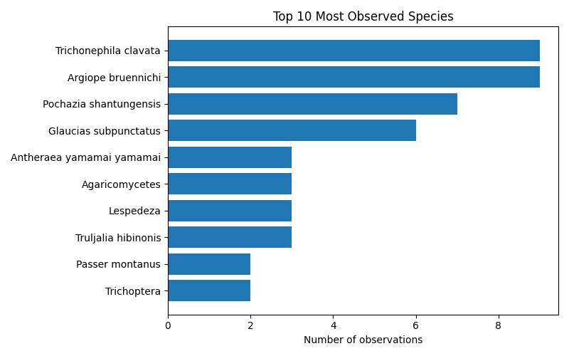
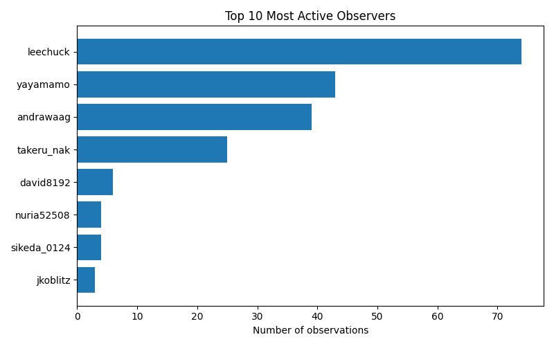

# iNaturalist Project Report: biohackathon-2025

- Total observations: 198
- Unique species observed: 151
- Unique observers: 8

## Wikipedia & Wikidata Coverage

- Species not on Wikidata: **9**
- Missing in [x]: **151**

| Taxon | Wikidata | [X] |
|---|---|---|
| Abelia chinensis | &#10003; | &#10007; |
| Acanthuridae | &#10003; | &#10007; |
| Acridotheres tristis | &#10003; | &#10007; |
| Acromegalomma | &#10003; | &#10007; |
| Acronicta pruinosa | &#10003; | &#10007; |
| Agaricales | &#10003; | &#10007; |
| Agaricomycetes | &#10003; | &#10007; |
| Agaricus | &#10003; | &#10007; |
| Aiolopus thalassinus tamulus | &#10003; | &#10007; |
| Anatherum virginicum | &#10003; | &#10007; |
| Anisoptera | &#10003; | &#10007; |
| Antheraea yamamai | &#10003; | &#10007; |
| Anthomyzidae | &#10003; | &#10007; |
| Anura | &#10003; | &#10007; |
| Aplonis panayensis | &#10003; | &#10007; |
| Ardea ibis | &#10003; | &#10007; |
| Argiope bruennichi | &#10003; | &#10007; |
| Argiopinae | &#10003; | &#10007; |
| Bactra furfurana | &#10003; | &#10007; |
| Boletaceae | &#10003; | &#10007; |
| Boletales | &#10003; | &#10007; |
| Boletellus | &#10003; | &#10007; |
| Boletellus emodensis | &#10003; | &#10007; |
| Camponotus obscuripes | &#10003; | &#10007; |
| Canarium labiatum | &#10003; | &#10007; |
| Chlaenius posticalis | &#10003; | &#10007; |
| Clematis terniflora | &#10003; | &#10007; |
| Clerodendrum trichotomum | &#10003; | &#10007; |
| Conocephalus | &#10003; | &#10007; |
| Corvus macrorhynchos japonensis | &#10003; | &#10007; |
| Cosmos bipinnatus | &#10003; | &#10007; |
| Cosmos sulphureus | &#10003; | &#10007; |
| Culicidae | &#10003; | &#10007; |
| Culicinae | &#10003; | &#10007; |
| Cupido argiades | &#10003; | &#10007; |
| Cyprinus rubrofuscus | &#10003; | &#10007; |
| Cyrtarachne | &#10003; | &#10007; |
| Cyrtarachne bufo | &#10003; | &#10007; |
| Cyrtarachne inaequalis | &#10003; | &#10007; |
| Cyrtarachne nagasakiensis | &#10003; | &#10007; |
| Danielithosia immaculata | &#10003; | &#10007; |
| Desmodium paniculatum | &#10003; | &#10007; |
| Dicranopteris | &#10003; | &#10007; |
| Dryopteris | &#10003; | &#10007; |
| Egretta | &#10003; | &#10007; |
| Emoia atrocostata | &#10003; | &#10007; |
| Eurema mandarina | &#10003; | &#10007; |
| Fomitopsis dickinsii | &#10003; | &#10007; |
| Glaucias subpunctatus | &#10003; | &#10007; |
| Graptopsaltria nigrofuscata | &#10003; | &#10007; |
| Gryllacrididae | &#10003; | &#10007; |
| Gryllini | &#10003; | &#10007; |
| Gymnopilus | &#10003; | &#10007; |
| Gymnopilus orientispectabilis | &#10003; | &#10007; |
| Harpalinae | &#10003; | &#10007; |
| Harpalus griseus | &#10003; | &#10007; |
| Hasarius adansoni | &#10003; | &#10007; |
| Hemidactylus | &#10003; | &#10007; |
| Hemistola veneta | &#10003; | &#10007; |
| Heteropoda venatoria | &#10003; | &#10007; |
| Hibiscus | &#10003; | &#10007; |
| Hibiscus syriacus | &#10003; | &#10007; |
| Hippobroma longiflora | &#10003; | &#10007; |
| Holochlora japonica | &#10003; | &#10007; |
| Hospitalitermes | &#10003; | &#10007; |
| Illicium anisatum | &#10003; | &#10007; |
| Lantana camara | &#10003; | &#10007; |
| Lariniaria argiopiformis | &#10003; | &#10007; |
| Laspeyria ruficeps | &#10003; | &#10007; |
| Lepidodactylus lugubris | &#10003; | &#10007; |
| Lepidoptera | &#10003; | &#10007; |
| Lepisorus thunbergianus | &#10003; | &#10007; |
| Leptocorisa chinensis | &#10003; | &#10007; |
| Lespedeza | &#10003; | &#10007; |
| Lespedeza cuneata | &#10003; | &#10007; |
| Linckia laevigata | &#10003; | &#10007; |
| Loxoblemmus arietulus | &#10003; | &#10007; |
| Lycoris radiata | &#10003; | &#10007; |
| Meimuna opalifera | &#10003; | &#10007; |
| Monticola solitarius philippensis | &#10003; | &#10007; |
| Motacilla alba lugens | &#10003; | &#10007; |
| Musca | &#10003; | &#10007; |
| Neptis pryeri | &#10003; | &#10007; |
| Nyctereutes viverrinus | &#10003; | &#10007; |
| Oncocera semirubella | &#10003; | &#10007; |
| Orancistrocerus | &#10003; | &#10007; |
| Ornebius kanetataki | &#10003; | &#10007; |
| Oryctes rhinoceros | &#10003; | &#10007; |
| Paguroidea | &#10003; | &#10007; |
| Pantala flavescens | &#10003; | &#10007; |
| Papilio agenor | &#10003; | &#10007; |
| Papilio machaon | &#10003; | &#10007; |
| Parapediasia teterrellus | &#10003; | &#10007; |
| Passer montanus | &#10003; | &#10007; |
| Pelagodes antiquadraria | &#10003; | &#10007; |
| Periplaneta americana | &#10003; | &#10007; |
| Phaneroptera falcata | &#10003; | &#10007; |
| Phelotrupes | &#10003; | &#10007; |
| Pholcidae | &#10003; | &#10007; |
| Pholcus phalangioides | &#10003; | &#10007; |
| Physopelta gutta | &#10003; | &#10007; |
| Pinus | &#10003; | &#10007; |
| Plantae | &#10003; | &#10007; |
| Plestiodon latiscutatus | &#10003; | &#10007; |
| Pochazia shantungensis | &#10003; | &#10007; |
| Polyporaceae | &#10003; | &#10007; |
| Pseudagrion pilidorsum | &#10003; | &#10007; |
| Pyraloidea | &#10003; | &#10007; |
| Reynoutria japonica | &#10003; | &#10007; |
| Rhipidura nigritorquis | &#10003; | &#10007; |
| Rosoideae | &#10003; | &#10007; |
| Rusicada privata | &#10003; | &#10007; |
| Ruspolia lineosa | &#10003; | &#10007; |
| Scarabaeidae | &#10003; | &#10007; |
| Sicydiinae | &#10003; | &#10007; |
| Sipyloidea chlorotica | &#10003; | &#10007; |
| Solidago altissima | &#10003; | &#10007; |
| Spatalia doerriesi | &#10003; | &#10007; |
| Spiralisigna subpumilata | &#10003; | &#10007; |
| Statilia maculata maculata | &#10003; | &#10007; |
| Steatoda cingulata | &#10003; | &#10007; |
| Sutorius eximius | &#10003; | &#10007; |
| Sympetrum | &#10003; | &#10007; |
| Sympetrum eroticum | &#10003; | &#10007; |
| Tabaninae | &#10003; | &#10007; |
| Takydromus tachydromoides | &#10003; | &#10007; |
| Tenodera sinensis | &#10003; | &#10007; |
| Tephritoidea | &#10003; | &#10007; |
| Thelypteridoideae | &#10003; | &#10007; |
| Tipulomorpha | &#10003; | &#10007; |
| Todiramphus chloris | &#10003; | &#10007; |
| Trametes cubensis | &#10003; | &#10007; |
| Trametes versicolor | &#10003; | &#10007; |
| Trichonephila clavata | &#10003; | &#10007; |
| Trichoptera | &#10003; | &#10007; |
| Tringa brevipes | &#10003; | &#10007; |
| Truljalia | &#10003; | &#10007; |
| Truljalia hibinonis | &#10003; | &#10007; |
| Vespidae | &#10003; | &#10007; |
| Yaginumia sia | &#10003; | &#10007; |
| Zephyranthes carinata | &#10003; | &#10007; |
| Zeuzera multistrigata | &#10003; | &#10007; |
| Antheraea yamamai yamamai | &#10007; | &#10007; |
| Arhopala japonica | &#10007; | &#10007; |
| Chrysopa pallens-group | &#10007; | &#10007; |
| Ficus microcarpa latifolia | &#10007; | &#10007; |
| Fortiblatta fuliginosa | &#10007; | &#10007; |
| Lycoris × albiflora | &#10007; | &#10007; |
| Pueraria montana lobata | &#10007; | &#10007; |
| Tracheophyta | &#10007; | &#10007; |
| Xanthodermatei | &#10007; | &#10007; |
| **Totals** |  | 151 |