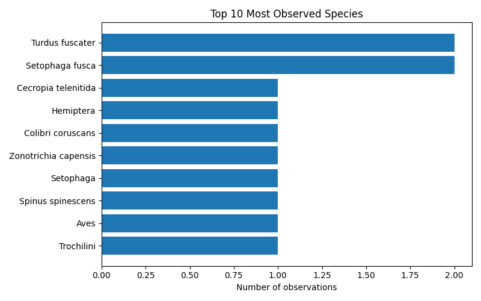
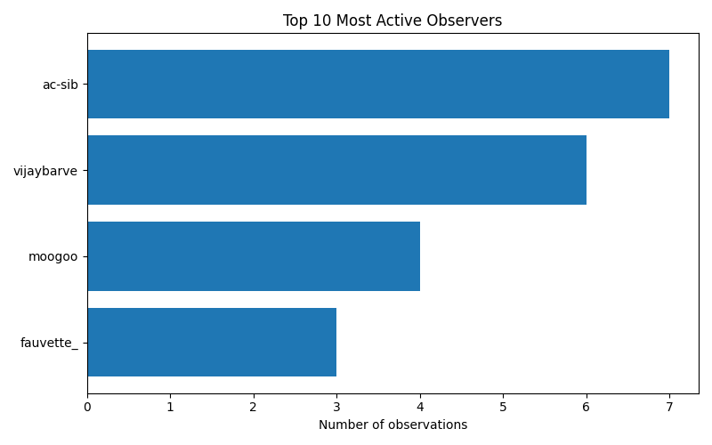

# iNaturalist Project Report: datos-vivos-gb32-bogota-2025

- Total observations: 20
- Unique species observed: 18
- Unique observers: 4

## Wikipedia & Wikidata Coverage

- Species not on Wikidata: **0**
- Missing in en: **1**

- Missing in es: **2**

- Missing in ja: **9**

- Missing in ar: **8**

- Missing in nl: **2**

| Taxon | Wikidata | EN | ES | JA | AR | NL |
|---|---|---|---|---|---|---|
| Cecropia telenitida | &#10003; | &#10007; | &#10007; | &#10007; | &#10007; | &#10007; |
| Scatopse notata | &#10003; | [&#10003;](https://en.wikipedia.org/wiki/Scatopse_notata) | &#10007; | &#10007; | &#10007; | [&#10003;](https://nl.wikipedia.org/wiki/Scatopse_notata) |
| Colibri coruscans | &#10003; | [&#10003;](https://en.wikipedia.org/wiki/Sparkling_violetear) | [&#10003;](https://es.wikipedia.org/wiki/Colibri_coruscans) | &#10007; | &#10007; | [&#10003;](https://nl.wikipedia.org/wiki/Goulds_violetoorkolibrie) |
| Harmonia | &#10003; | [&#10003;](https://en.wikipedia.org/wiki/Harmonia_(plant)) | [&#10003;](https://es.wikipedia.org/wiki/Harmonia_(planta)) | &#10007; | &#10007; | [&#10003;](https://nl.wikipedia.org/wiki/Harmonia_(geslacht)) |
| Juglans neotropica | &#10003; | [&#10003;](https://en.wikipedia.org/wiki/Juglans_neotropica) | [&#10003;](https://es.wikipedia.org/wiki/Juglans_neotropica) | &#10007; | [&#10003;](https://ar.wikipedia.org/wiki/%D8%AC%D9%88%D8%B2_%D8%A7%D9%84%D9%85%D9%86%D8%B7%D9%82%D8%A9_%D8%A7%D9%84%D9%85%D8%AF%D8%A7%D8%B1%D9%8A%D8%A9_%D8%A7%D9%84%D8%AC%D8%AF%D9%8A%D8%AF%D8%A9) | &#10007; |
| Trochilini | &#10003; | [&#10003;](https://en.wikipedia.org/wiki/Trochilini) | [&#10003;](https://es.wikipedia.org/wiki/Trochilini) | &#10007; | &#10007; | [&#10003;](https://nl.wikipedia.org/wiki/Trochilini) |
| Turdus fuscater | &#10003; | [&#10003;](https://en.wikipedia.org/wiki/Great_thrush) | [&#10003;](https://es.wikipedia.org/wiki/Turdus_fuscater) | &#10007; | &#10007; | [&#10003;](https://nl.wikipedia.org/wiki/Reuzenlijster) |
| Setophaga | &#10003; | [&#10003;](https://en.wikipedia.org/wiki/Setophaga) | [&#10003;](https://es.wikipedia.org/wiki/Setophaga) | &#10007; | [&#10003;](https://ar.wikipedia.org/wiki/%D8%AE%D8%A7%D8%B7%D9%81%D8%A9_%D8%A7%D9%84%D8%B9%D8%AB) | [&#10003;](https://nl.wikipedia.org/wiki/Setophaga) |
| Setophaga fusca | &#10003; | [&#10003;](https://en.wikipedia.org/wiki/Blackburnian_warbler) | [&#10003;](https://es.wikipedia.org/wiki/Setophaga_fusca) | [&#10003;](https://ja.wikipedia.org/wiki/%E3%82%AD%E3%83%9E%E3%83%A6%E3%82%A2%E3%83%A1%E3%83%AA%E3%82%AB%E3%83%A0%E3%82%B7%E3%82%AF%E3%82%A4) | &#10007; | [&#10003;](https://nl.wikipedia.org/wiki/Sparrenzanger) |
| Spinus spinescens | &#10003; | [&#10003;](https://en.wikipedia.org/wiki/Andean_siskin) | [&#10003;](https://es.wikipedia.org/wiki/Spinus_spinescens) | &#10007; | [&#10003;](https://ar.wikipedia.org/wiki/%D8%AD%D8%B3%D9%88%D9%86_%D8%A3%D9%86%D8%AF%D9%8A%D8%B2%D9%8A) | [&#10003;](https://nl.wikipedia.org/wiki/Andessijs) |
| Zonotrichia capensis | &#10003; | [&#10003;](https://en.wikipedia.org/wiki/Rufous-collared_sparrow) | [&#10003;](https://es.wikipedia.org/wiki/Zonotrichia_capensis) | [&#10003;](https://ja.wikipedia.org/wiki/%E3%82%A2%E3%82%AB%E3%82%A8%E3%83%AA%E3%82%B7%E3%83%88%E3%83%89) | &#10007; | [&#10003;](https://nl.wikipedia.org/wiki/Roodkraaggors) |
| Aves | &#10003; | [&#10003;](https://en.wikipedia.org/wiki/Bird) | [&#10003;](https://es.wikipedia.org/wiki/Aves) | [&#10003;](https://ja.wikipedia.org/wiki/%E9%B3%A5%E9%A1%9E) | [&#10003;](https://ar.wikipedia.org/wiki/%D8%B7%D8%A7%D8%A6%D8%B1) | [&#10003;](https://nl.wikipedia.org/wiki/Vogels) |
| Coccoidea | &#10003; | [&#10003;](https://en.wikipedia.org/wiki/Scale_insect) | [&#10003;](https://es.wikipedia.org/wiki/Coccoidea) | [&#10003;](https://ja.wikipedia.org/wiki/%E3%82%AB%E3%82%A4%E3%82%AC%E3%83%A9%E3%83%A0%E3%82%B7) | [&#10003;](https://ar.wikipedia.org/wiki/%D8%AD%D8%B4%D8%B1%D8%A9_%D9%82%D8%B4%D8%B1%D9%8A%D8%A9) | [&#10003;](https://nl.wikipedia.org/wiki/Schildluizen) |
| Coragyps atratus | &#10003; | [&#10003;](https://en.wikipedia.org/wiki/Black_vulture) | [&#10003;](https://es.wikipedia.org/wiki/Coragyps_atratus) | [&#10003;](https://ja.wikipedia.org/wiki/%E3%82%AF%E3%83%AD%E3%82%B3%E3%83%B3%E3%83%89%E3%83%AB) | [&#10003;](https://ar.wikipedia.org/wiki/%D9%86%D8%B3%D8%B1_%D8%A3%D8%B3%D9%88%D8%AF) | [&#10003;](https://nl.wikipedia.org/wiki/Zwarte_gier) |
| Ficus elastica | &#10003; | [&#10003;](https://en.wikipedia.org/wiki/Ficus_elastica) | [&#10003;](https://es.wikipedia.org/wiki/Ficus_elastica) | [&#10003;](https://ja.wikipedia.org/wiki/%E3%82%A4%E3%83%B3%E3%83%89%E3%82%B4%E3%83%A0%E3%83%8E%E3%82%AD) | [&#10003;](https://ar.wikipedia.org/wiki/%D8%AA%D9%8A%D9%86_%D9%85%D8%B1%D9%86) | [&#10003;](https://nl.wikipedia.org/wiki/Indische_rubberboom) |
| Hemiptera | &#10003; | [&#10003;](https://en.wikipedia.org/wiki/Hemiptera) | [&#10003;](https://es.wikipedia.org/wiki/Hemiptera) | [&#10003;](https://ja.wikipedia.org/wiki/%E3%82%AB%E3%83%A1%E3%83%A0%E3%82%B7%E7%9B%AE) | [&#10003;](https://ar.wikipedia.org/wiki/%D9%86%D8%B5%D9%81%D9%8A%D8%A7%D8%AA_%D8%A7%D9%84%D8%A3%D8%AC%D9%86%D8%AD%D8%A9) | [&#10003;](https://nl.wikipedia.org/wiki/Halfvleugeligen) |
| Passeriformes | &#10003; | [&#10003;](https://en.wikipedia.org/wiki/Passerine) | [&#10003;](https://es.wikipedia.org/wiki/Passeriformes) | [&#10003;](https://ja.wikipedia.org/wiki/%E3%82%B9%E3%82%BA%E3%83%A1%E7%9B%AE) | [&#10003;](https://ar.wikipedia.org/wiki/%D8%AC%D9%88%D8%A7%D8%AB%D9%85) | [&#10003;](https://nl.wikipedia.org/wiki/Zangvogels) |
| Thunbergia alata | &#10003; | [&#10003;](https://en.wikipedia.org/wiki/Thunbergia_alata) | [&#10003;](https://es.wikipedia.org/wiki/Thunbergia_alata) | [&#10003;](https://ja.wikipedia.org/wiki/%E3%83%A4%E3%83%8F%E3%82%BA%E3%82%AB%E3%82%BA%E3%83%A9) | [&#10003;](https://ar.wikipedia.org/wiki/%D8%AA%D9%88%D9%86%D8%A8%D8%B1%D8%BA%D9%8A%D8%A9_%D8%AC%D9%86%D8%A7%D8%AD%D9%8A%D8%A9) | [&#10003;](https://nl.wikipedia.org/wiki/Suzanne-met-de-mooie-ogen) |
| **Totals** |  | 1 | 2 | 9 | 8 | 2 |