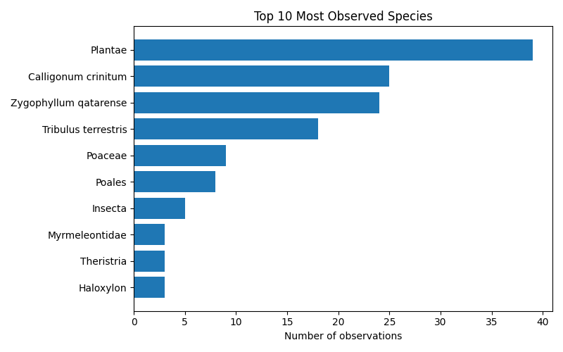
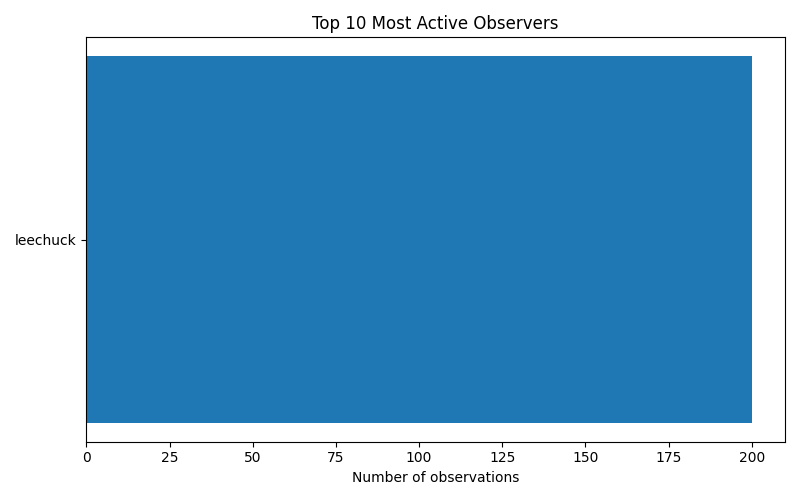

# iNaturalist Project Report: rub-al-khali

- Total observations: 200
- Unique species observed: 62
- Unique observers: 1

## Wikipedia & Wikidata Coverage

- Species not on Wikidata: **1**
- Missing in en: **10**

- Missing in es: **18**

- Missing in ja: **41**

- Missing in ar: **21**

- Missing in nl: **22**

| Taxon | Wikidata | EN | ES | JA | AR | NL |
|---|---|---|---|---|---|---|
| Calligonum crinitum | &#10003; | &#10007; | &#10007; | &#10007; | &#10007; | &#10007; |
| Purenleon | &#10003; | &#10007; | &#10007; | &#10007; | &#10007; | &#10007; |
| Stilbus apicalis | &#10003; | &#10007; | &#10007; | &#10007; | &#10007; | &#10007; |
| Vachellia flava | &#10003; | &#10007; | &#10007; | &#10007; | &#10007; | &#10007; |
| Zygophyllum qatarense | &#10003; | &#10007; | &#10007; | &#10007; | &#10007; | &#10007; |
| Chyphotes | &#10003; | [&#10003;](https://en.wikipedia.org/wiki/Chyphotes) | &#10007; | &#10007; | &#10007; | &#10007; |
| Dipterygium glaucum | &#10003; | &#10007; | [&#10003;](https://es.wikipedia.org/wiki/Dipterygium_glaucum) | &#10007; | &#10007; | &#10007; |
| Heliotropium bacciferum | &#10003; | &#10007; | &#10007; | &#10007; | [&#10003;](https://ar.wikipedia.org/wiki/%D8%B1%D9%85%D8%B1%D8%A7%D9%85) | &#10007; |
| Schizonycha | &#10003; | &#10007; | [&#10003;](https://es.wikipedia.org/wiki/Schizonycha) | &#10007; | &#10007; | &#10007; |
| Theristria | &#10003; | &#10007; | &#10007; | &#10007; | &#10007; | [&#10003;](https://nl.wikipedia.org/wiki/Theristria) |
| Anumeta | &#10003; | [&#10003;](https://en.wikipedia.org/wiki/Anumeta) | &#10007; | &#10007; | &#10007; | [&#10003;](https://nl.wikipedia.org/wiki/Anumeta) |
| Caroxylon | &#10003; | [&#10003;](https://en.wikipedia.org/wiki/Caroxylon) | &#10007; | &#10007; | &#10007; | [&#10003;](https://nl.wikipedia.org/wiki/Caroxylon) |
| Caroxylon imbricatum | &#10003; | [&#10003;](https://en.wikipedia.org/wiki/Caroxylon_imbricatum) | &#10007; | &#10007; | [&#10003;](https://ar.wikipedia.org/wiki/%D8%B1%D9%88%D8%AB%D8%A7_%D9%82%D8%B1%D9%85%D9%8A%D8%AF%D9%8A%D8%A9) | &#10007; |
| Chilocorus circumdatus | &#10003; | [&#10003;](https://en.wikipedia.org/wiki/Chilocorus_circumdatus) | [&#10003;](https://es.wikipedia.org/wiki/Chilocorus_circumdatus) | &#10007; | &#10007; | &#10007; |
| Cyperus conglomeratus | &#10003; | [&#10003;](https://en.wikipedia.org/wiki/Cyperus_conglomeratus) | &#10007; | &#10007; | [&#10003;](https://ar.wikipedia.org/wiki/%D8%A7%D9%84%D8%AB%D9%86%D8%AF%D9%8A) | &#10007; |
| Dicoria | &#10003; | [&#10003;](https://en.wikipedia.org/wiki/Dicoria_(plant)) | [&#10003;](https://es.wikipedia.org/wiki/Dicoria) | &#10007; | &#10007; | &#10007; |
| Eremobium | &#10003; | [&#10003;](https://en.wikipedia.org/wiki/Eremobium) | [&#10003;](https://es.wikipedia.org/wiki/Eremobium) | &#10007; | &#10007; | &#10007; |
| Eremobium aegyptiacum | &#10003; | [&#10003;](https://en.wikipedia.org/wiki/Eremobium_aegyptiacum) | &#10007; | &#10007; | [&#10003;](https://ar.wikipedia.org/wiki/%D8%B3%D9%84%D9%8A%D8%B3%D9%84%D8%A9) | &#10007; |
| Ochradenus baccatus | &#10003; | [&#10003;](https://en.wikipedia.org/wiki/Ochradenus_baccatus) | &#10007; | &#10007; | [&#10003;](https://ar.wikipedia.org/wiki/%D8%AC%D8%B1%D8%AF%D9%89_%D8%AA%D9%88%D8%AA%D9%8A%D8%A9) | &#10007; |
| Oxyethira | &#10003; | [&#10003;](https://en.wikipedia.org/wiki/Oxyethira) | &#10007; | &#10007; | &#10007; | [&#10003;](https://nl.wikipedia.org/wiki/Oxyethira) |
| Zilla spinosa | &#10003; | [&#10003;](https://en.wikipedia.org/wiki/Zilla_spinosa) | [&#10003;](https://es.wikipedia.org/wiki/Zilla_spinosa) | &#10007; | &#10007; | &#10007; |
| Arnebia | &#10003; | [&#10003;](https://en.wikipedia.org/wiki/Arnebia) | [&#10003;](https://es.wikipedia.org/wiki/Arnebia) | &#10007; | [&#10003;](https://ar.wikipedia.org/wiki/%D8%A3%D8%B7%D9%86) | &#10007; |
| Asphodelus tenuifolius | &#10003; | [&#10003;](https://en.wikipedia.org/wiki/Asphodelus_tenuifolius) | [&#10003;](https://es.wikipedia.org/wiki/Asphodelus_tenuifolius) | &#10007; | [&#10003;](https://ar.wikipedia.org/wiki/%D8%A8%D8%B1%D9%88%D9%82_%D9%86%D8%AD%D9%8A%D9%81_%D8%A7%D9%84%D8%A3%D9%88%D8%B1%D8%A7%D9%82) | &#10007; |
| Chrysoperla carnea | &#10003; | [&#10003;](https://en.wikipedia.org/wiki/Chrysoperla_carnea) | [&#10003;](https://es.wikipedia.org/wiki/Chrysoperla_carnea) | &#10007; | &#10007; | [&#10003;](https://nl.wikipedia.org/wiki/Groene_gaasvlieg) |
| Earias insulana | &#10003; | [&#10003;](https://en.wikipedia.org/wiki/Earias_insulana) | &#10007; | &#10007; | [&#10003;](https://ar.wikipedia.org/wiki/%D8%AF%D9%88%D8%AF%D8%A9_%D8%A7%D9%84%D9%84%D9%88%D8%B2_%D8%A7%D9%84%D9%85%D8%B5%D8%B1%D9%8A%D8%A9) | [&#10003;](https://nl.wikipedia.org/wiki/Katoengroenuil) |
| Enicocephalidae | &#10003; | [&#10003;](https://en.wikipedia.org/wiki/Enicocephalidae) | [&#10003;](https://es.wikipedia.org/wiki/Enicocephalidae) | &#10007; | &#10007; | [&#10003;](https://nl.wikipedia.org/wiki/Enicocephalidae) |
| Hippotion celerio | &#10003; | [&#10003;](https://en.wikipedia.org/wiki/Hippotion_celerio) | [&#10003;](https://es.wikipedia.org/wiki/Hippotion_celerio) | &#10007; | &#10007; | [&#10003;](https://nl.wikipedia.org/wiki/Wingerdpijlstaart) |
| Miomantis paykullii | &#10003; | [&#10003;](https://en.wikipedia.org/wiki/Miomantis_paykullii) | [&#10003;](https://es.wikipedia.org/wiki/Miomantis_paykullii) | &#10007; | &#10007; | [&#10003;](https://nl.wikipedia.org/wiki/Miomantis_paykullii) |
| Salsoloideae | &#10003; | [&#10003;](https://en.wikipedia.org/wiki/Salsoloideae) | [&#10003;](https://es.wikipedia.org/wiki/Salsoloideae) | &#10007; | [&#10003;](https://ar.wikipedia.org/wiki/%D8%B1%D9%88%D8%AB%D8%A7%D9%88%D8%A7%D8%AA) | &#10007; |
| Scincus mitranus | &#10003; | [&#10003;](https://en.wikipedia.org/wiki/Eastern_skink) | &#10007; | &#10007; | [&#10003;](https://ar.wikipedia.org/wiki/%D8%B3%D9%82%D9%86%D9%82%D9%88%D8%B1_%D8%B4%D8%B1%D9%82%D9%8A) | [&#10003;](https://nl.wikipedia.org/wiki/Oostelijke_zandskink) |
| Vulpes vulpes arabica | &#10003; | [&#10003;](https://en.wikipedia.org/wiki/Arabian_red_fox) | [&#10003;](https://es.wikipedia.org/wiki/Vulpes_vulpes_arabica) | &#10007; | [&#10003;](https://ar.wikipedia.org/wiki/%D8%AB%D8%B9%D9%84%D8%A8_%D8%A3%D8%AD%D9%85%D8%B1_%D8%B9%D8%B1%D8%A8%D9%8A) | &#10007; |
| Circus | &#10003; | [&#10003;](https://en.wikipedia.org/wiki/Circus_(bird)) | [&#10003;](https://es.wikipedia.org/wiki/Circus_(g%C3%A9nero)) | &#10007; | [&#10003;](https://ar.wikipedia.org/wiki/%D9%85%D8%B1%D8%B2%D8%A9_(%D8%AC%D9%86%D8%B3)) | [&#10003;](https://nl.wikipedia.org/wiki/Circus_(geslacht)) |
| Corvus ruficollis | &#10003; | [&#10003;](https://en.wikipedia.org/wiki/Brown-necked_raven) | [&#10003;](https://es.wikipedia.org/wiki/Corvus_ruficollis) | &#10007; | [&#10003;](https://ar.wikipedia.org/wiki/%D8%BA%D8%B1%D8%A7%D8%A8_%D8%A3%D8%AD%D9%8A%D9%85%D8%B1_%D8%A7%D9%84%D8%B9%D9%86%D9%82) | [&#10003;](https://nl.wikipedia.org/wiki/Bruinnekraaf) |
| Crambidae | &#10003; | [&#10003;](https://en.wikipedia.org/wiki/Crambidae) | [&#10003;](https://es.wikipedia.org/wiki/Crambidae) | &#10007; | [&#10003;](https://ar.wikipedia.org/wiki/%D8%B9%D8%AB%D8%AB_%D8%A7%D9%84%D8%B9%D8%B4%D8%A8) | [&#10003;](https://nl.wikipedia.org/wiki/Grasmotten) |
| Haloxylon | &#10003; | [&#10003;](https://en.wikipedia.org/wiki/Haloxylon) | [&#10003;](https://es.wikipedia.org/wiki/Haloxylon) | &#10007; | [&#10003;](https://ar.wikipedia.org/wiki/%D8%B1%D9%85%D8%AB) | [&#10003;](https://nl.wikipedia.org/wiki/Haloxylon) |
| Mimosoideae | &#10003; | [&#10003;](https://en.wikipedia.org/wiki/Mimosoideae) | [&#10003;](https://es.wikipedia.org/wiki/Mimosoideae) | &#10007; | [&#10003;](https://ar.wikipedia.org/wiki/%D8%B3%D9%86%D8%B7%D8%A7%D9%88%D8%A7%D8%AA) | [&#10003;](https://nl.wikipedia.org/wiki/Mimosoideae) |
| Utetheisa pulchella | &#10003; | [&#10003;](https://en.wikipedia.org/wiki/Utetheisa_pulchella) | [&#10003;](https://es.wikipedia.org/wiki/Utetheisa_pulchella) | &#10007; | [&#10003;](https://ar.wikipedia.org/wiki/%D8%B9%D8%AB%D8%A9_%D8%A7%D9%84%D9%86%D8%B7%D8%B4_%D8%A7%D9%84%D9%85%D8%B1%D9%82%D8%B7%D8%A9_%D8%A8%D8%A7%D9%84%D8%A8%D9%82%D8%B9_%D8%A7%D9%84%D9%82%D8%B1%D9%85%D8%B2%D9%8A%D8%A9) | [&#10003;](https://nl.wikipedia.org/wiki/Prachtbeer) |
| Vachellia | &#10003; | [&#10003;](https://en.wikipedia.org/wiki/Vachellia) | [&#10003;](https://es.wikipedia.org/wiki/Vachellia) | &#10007; | [&#10003;](https://ar.wikipedia.org/wiki/%D9%83%D9%86%D9%87%D8%A8%D9%84) | [&#10003;](https://nl.wikipedia.org/wiki/Vachellia) |
| Ziziphus | &#10003; | [&#10003;](https://en.wikipedia.org/wiki/Ziziphus) | [&#10003;](https://es.wikipedia.org/wiki/Ziziphus) | &#10007; | [&#10003;](https://ar.wikipedia.org/wiki/%D8%B2%D9%81%D9%8A%D8%B2%D9%81) | [&#10003;](https://nl.wikipedia.org/wiki/Ziziphus) |
| Zygophyllum | &#10003; | [&#10003;](https://en.wikipedia.org/wiki/Zygophyllum) | [&#10003;](https://es.wikipedia.org/wiki/Zygophyllum) | &#10007; | [&#10003;](https://ar.wikipedia.org/wiki/%D8%B1%D8%B7%D8%B1%D9%8A%D8%B7) | [&#10003;](https://nl.wikipedia.org/wiki/Zygophyllum) |
| Amaranthaceae | &#10003; | [&#10003;](https://en.wikipedia.org/wiki/Amaranthaceae) | [&#10003;](https://es.wikipedia.org/wiki/Amaranthaceae) | [&#10003;](https://ja.wikipedia.org/wiki/%E3%83%92%E3%83%A6%E7%A7%91) | [&#10003;](https://ar.wikipedia.org/wiki/%D9%82%D8%B7%D9%8A%D9%81%D9%8A%D8%A9) | [&#10003;](https://nl.wikipedia.org/wiki/Amarantenfamilie) |
| Aves | &#10003; | [&#10003;](https://en.wikipedia.org/wiki/Bird) | [&#10003;](https://es.wikipedia.org/wiki/Aves) | [&#10003;](https://ja.wikipedia.org/wiki/%E9%B3%A5%E9%A1%9E) | [&#10003;](https://ar.wikipedia.org/wiki/%D8%B7%D8%A7%D8%A6%D8%B1) | [&#10003;](https://nl.wikipedia.org/wiki/Vogels) |
| Chlorophyta | &#10003; | [&#10003;](https://en.wikipedia.org/wiki/Chlorophyta) | [&#10003;](https://es.wikipedia.org/wiki/Chlorophyta) | [&#10003;](https://ja.wikipedia.org/wiki/%E7%B7%91%E8%97%BB%E6%A4%8D%E7%89%A9%E9%96%80) | [&#10003;](https://ar.wikipedia.org/wiki/%D8%AE%D9%8A%D8%B6%D9%88%D8%B1%D8%A7%D8%AA) | [&#10003;](https://nl.wikipedia.org/wiki/Groenwieren) |
| Cyperus | &#10003; | [&#10003;](https://en.wikipedia.org/wiki/Cyperus) | [&#10003;](https://es.wikipedia.org/wiki/Cyperus) | [&#10003;](https://ja.wikipedia.org/wiki/%E3%82%AB%E3%83%A4%E3%83%84%E3%83%AA%E3%82%B0%E3%82%B5%E5%B1%9E) | [&#10003;](https://ar.wikipedia.org/wiki/%D8%B3%D8%B9%D8%AF) | [&#10003;](https://nl.wikipedia.org/wiki/Cypergras) |
| Hieraaetus pennatus | &#10003; | [&#10003;](https://en.wikipedia.org/wiki/Booted_eagle) | [&#10003;](https://es.wikipedia.org/wiki/Hieraaetus_pennatus) | [&#10003;](https://ja.wikipedia.org/wiki/%E3%83%92%E3%83%A1%E3%82%AF%E3%83%9E%E3%82%BF%E3%82%AB) | [&#10003;](https://ar.wikipedia.org/wiki/%D8%B9%D9%82%D8%A7%D8%A8_%D9%85%D8%B3%D9%8A%D8%B1%D8%A9_%D8%B5%D8%BA%D8%B1%D9%89) | [&#10003;](https://nl.wikipedia.org/wiki/Dwergarend) |
| Hirundo rustica | &#10003; | [&#10003;](https://en.wikipedia.org/wiki/Barn_swallow) | [&#10003;](https://es.wikipedia.org/wiki/Hirundo_rustica) | [&#10003;](https://ja.wikipedia.org/wiki/%E3%83%84%E3%83%90%E3%83%A1) | [&#10003;](https://ar.wikipedia.org/wiki/%D8%AE%D8%B7%D8%A7%D9%81_%D8%A7%D9%84%D9%85%D8%AE%D8%A7%D8%B2%D9%86) | [&#10003;](https://nl.wikipedia.org/wiki/Boerenzwaluw) |
| Insecta | &#10003; | [&#10003;](https://en.wikipedia.org/wiki/Insect) | [&#10003;](https://es.wikipedia.org/wiki/Insecta) | [&#10003;](https://ja.wikipedia.org/wiki/%E6%98%86%E8%99%AB) | [&#10003;](https://ar.wikipedia.org/wiki/%D8%AD%D8%B4%D8%B1%D8%A9) | [&#10003;](https://nl.wikipedia.org/wiki/Insecten) |
| Lepidoptera | &#10003; | [&#10003;](https://en.wikipedia.org/wiki/Lepidoptera) | [&#10003;](https://es.wikipedia.org/wiki/Lepidoptera) | [&#10003;](https://ja.wikipedia.org/wiki/%E3%83%81%E3%83%A7%E3%82%A6%E7%9B%AE) | [&#10003;](https://ar.wikipedia.org/wiki/%D8%AD%D8%B1%D8%B4%D9%81%D9%8A%D8%A7%D8%AA_%D8%A7%D9%84%D8%A3%D8%AC%D9%86%D8%AD%D8%A9) | [&#10003;](https://nl.wikipedia.org/wiki/Vlinders) |
| Muscicapa striata | &#10003; | [&#10003;](https://en.wikipedia.org/wiki/Spotted_flycatcher) | [&#10003;](https://es.wikipedia.org/wiki/Muscicapa_striata) | [&#10003;](https://ja.wikipedia.org/wiki/%E3%83%A0%E3%83%8A%E3%83%95%E3%83%92%E3%82%BF%E3%82%AD) | [&#10003;](https://ar.wikipedia.org/wiki/%D8%A7%D9%84%D8%B0%D8%A8%D8%A7%D8%A8%D9%8A) | [&#10003;](https://nl.wikipedia.org/wiki/Grauwe_vliegenvanger) |
| Myrmeleontidae | &#10003; | [&#10003;](https://en.wikipedia.org/wiki/Antlion) | [&#10003;](https://es.wikipedia.org/wiki/Myrmeleontidae) | [&#10003;](https://ja.wikipedia.org/wiki/%E3%82%A6%E3%82%B9%E3%83%90%E3%82%AB%E3%82%B2%E3%83%AD%E3%82%A6) | [&#10003;](https://ar.wikipedia.org/wiki/%D9%84%D9%8A%D9%88%D8%AB_%D8%B9%D9%81%D8%B1%D9%8A%D9%86) | [&#10003;](https://nl.wikipedia.org/wiki/Mierenleeuwen) |
| Noctuoidea | &#10003; | [&#10003;](https://en.wikipedia.org/wiki/Noctuoidea) | [&#10003;](https://es.wikipedia.org/wiki/Noctuoidea) | [&#10003;](https://ja.wikipedia.org/wiki/%E3%83%A4%E3%82%AC%E4%B8%8A%E7%A7%91) | [&#10003;](https://ar.wikipedia.org/wiki/%D9%81%D8%B1%D8%A7%D8%B4%D8%A7%D8%AA_%D9%84%D9%8A%D9%84%D9%8A%D8%A9) | [&#10003;](https://nl.wikipedia.org/wiki/Noctuoidea) |
| Phoenix dactylifera | &#10003; | [&#10003;](https://en.wikipedia.org/wiki/Date_palm) | [&#10003;](https://es.wikipedia.org/wiki/Phoenix_dactylifera) | [&#10003;](https://ja.wikipedia.org/wiki/%E3%83%8A%E3%83%84%E3%83%A1%E3%83%A4%E3%82%B7) | [&#10003;](https://ar.wikipedia.org/wiki/%D9%86%D8%AE%D9%84%D8%A9_%D8%A7%D9%84%D8%AA%D9%85%D8%B1) | [&#10003;](https://nl.wikipedia.org/wiki/Dadelpalm) |
| Phragmites | &#10003; | [&#10003;](https://en.wikipedia.org/wiki/Phragmites) | [&#10003;](https://es.wikipedia.org/wiki/Phragmites) | [&#10003;](https://ja.wikipedia.org/wiki/%E3%83%A8%E3%82%B7%E5%B1%9E) | [&#10003;](https://ar.wikipedia.org/wiki/%D9%82%D9%8A%D8%B5%D9%88%D8%A8) | [&#10003;](https://nl.wikipedia.org/wiki/Phragmites) |
| Phragmites australis | &#10003; | [&#10003;](https://en.wikipedia.org/wiki/Phragmites_australis) | [&#10003;](https://es.wikipedia.org/wiki/Phragmites_australis) | [&#10003;](https://ja.wikipedia.org/wiki/%E3%83%A8%E3%82%B7) | [&#10003;](https://ar.wikipedia.org/wiki/%D9%82%D9%8A%D8%B5%D9%88%D8%A8_%D8%AC%D9%86%D9%88%D8%A8%D9%8A) | [&#10003;](https://nl.wikipedia.org/wiki/Riet) |
| Plantae | &#10003; | [&#10003;](https://en.wikipedia.org/wiki/Plant) | [&#10003;](https://es.wikipedia.org/wiki/Plantae) | [&#10003;](https://ja.wikipedia.org/wiki/%E6%A4%8D%E7%89%A9) | [&#10003;](https://ar.wikipedia.org/wiki/%D9%86%D8%A8%D8%A7%D8%AA) | [&#10003;](https://nl.wikipedia.org/wiki/Planten) |
| Poaceae | &#10003; | [&#10003;](https://en.wikipedia.org/wiki/Poaceae) | [&#10003;](https://es.wikipedia.org/wiki/Poaceae) | [&#10003;](https://ja.wikipedia.org/wiki/%E3%82%A4%E3%83%8D%E7%A7%91) | [&#10003;](https://ar.wikipedia.org/wiki/%D9%86%D8%AC%D9%8A%D9%84%D9%8A%D8%A9) | [&#10003;](https://nl.wikipedia.org/wiki/Grassenfamilie) |
| Poales | &#10003; | [&#10003;](https://en.wikipedia.org/wiki/Poales) | [&#10003;](https://es.wikipedia.org/wiki/Poales) | [&#10003;](https://ja.wikipedia.org/wiki/%E3%82%A4%E3%83%8D%E7%9B%AE) | [&#10003;](https://ar.wikipedia.org/wiki/%D9%82%D8%A8%D8%A6%D9%8A%D8%A7%D8%AA) | [&#10003;](https://nl.wikipedia.org/wiki/Poales) |
| Psychodidae | &#10003; | [&#10003;](https://en.wikipedia.org/wiki/Psychodidae) | [&#10003;](https://es.wikipedia.org/wiki/Psychodidae) | [&#10003;](https://ja.wikipedia.org/wiki/%E3%83%81%E3%83%A7%E3%82%A6%E3%83%90%E3%82%A8) | [&#10003;](https://ar.wikipedia.org/wiki/%D9%81%D8%B1%D8%A7%D8%B4%D9%8A%D8%A7%D8%AA_%D8%A7%D9%84%D9%85%D8%B8%D9%87%D8%B1) | [&#10003;](https://nl.wikipedia.org/wiki/Motmuggen) |
| Pterygota | &#10003; | [&#10003;](https://en.wikipedia.org/wiki/Pterygota_(plant)) | [&#10003;](https://es.wikipedia.org/wiki/Pterygota) | [&#10003;](https://ja.wikipedia.org/wiki/%E6%9C%89%E7%BF%85%E4%BA%9C%E7%B6%B1) | [&#10003;](https://ar.wikipedia.org/wiki/%D8%AC%D9%86%D8%A7%D8%AD%D9%8A%D8%A7%D8%AA) | [&#10003;](https://nl.wikipedia.org/wiki/Gevleugelde_insecten) |
| Rhodophyta | &#10003; | [&#10003;](https://en.wikipedia.org/wiki/Red_algae) | [&#10003;](https://es.wikipedia.org/wiki/Rhodophyta) | [&#10003;](https://ja.wikipedia.org/wiki/%E7%B4%85%E8%97%BB) | [&#10003;](https://ar.wikipedia.org/wiki/%D8%B7%D8%AD%D8%A7%D9%84%D8%A8_%D8%AD%D9%85%D8%B1%D8%A7%D8%A1) | [&#10003;](https://nl.wikipedia.org/wiki/Roodwieren) |
| Tribulus terrestris | &#10003; | [&#10003;](https://en.wikipedia.org/wiki/Tribulus_terrestris) | [&#10003;](https://es.wikipedia.org/wiki/Tribulus_terrestris) | [&#10003;](https://ja.wikipedia.org/wiki/%E3%83%8F%E3%83%9E%E3%83%93%E3%82%B7) | [&#10003;](https://ar.wikipedia.org/wiki/%D8%AD%D8%B3%D9%83_%D8%A3%D8%B1%D8%B6%D9%8A) | [&#10003;](https://nl.wikipedia.org/wiki/Tribulus_terrestris) |
| Ctenolepisma longicaudatum | &#10007; | &#10007; | &#10007; | &#10007; | &#10007; | &#10007; |
| **Totals** |  | 10 | 18 | 41 | 21 | 22 |