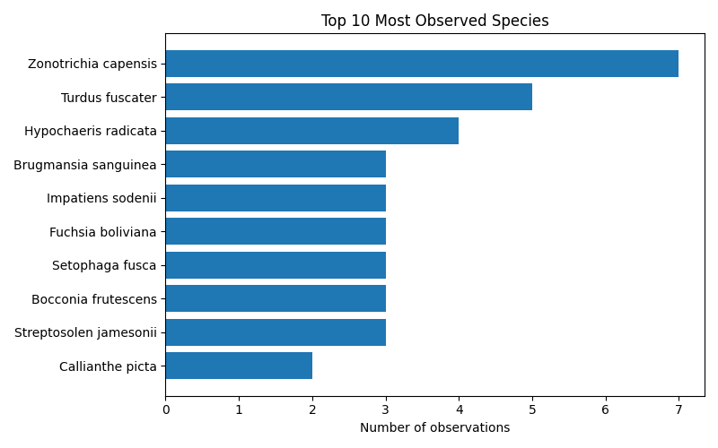
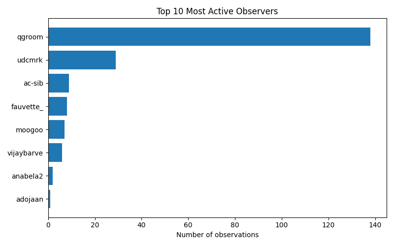

# iNaturalist Project Report: datos-vivos-gb32-bogota-2025

- Total observations: 200
- Unique species observed: 158
- Unique observers: 8

## Wikipedia & Wikidata Coverage

- Species not on Wikidata: **2**
- Missing in en: **33**

- Missing in es: **34**

- Missing in ja: **102**

- Missing in ar: **91**

- Missing in nl: **74**

| Taxon | Wikidata | EN | ES | JA | AR | NL |
|---|---|---|---|---|---|---|
| Castilleja arvensis | &#10003; | &#10007; | &#10007; | &#10007; | &#10007; | &#10007; |
| Cecropia telenitida | &#10003; | &#10007; | &#10007; | &#10007; | &#10007; | &#10007; |
| Festuca bromoides | &#10003; | &#10007; | &#10007; | &#10007; | &#10007; | &#10007; |
| Lourteigia stoechadifolia | &#10003; | &#10007; | &#10007; | &#10007; | &#10007; | &#10007; |
| Melastomeae | &#10003; | &#10007; | &#10007; | &#10007; | &#10007; | &#10007; |
| Miconia subseriata | &#10003; | &#10007; | &#10007; | &#10007; | &#10007; | &#10007; |
| Monnina aestuans | &#10003; | &#10007; | &#10007; | &#10007; | &#10007; | &#10007; |
| Orthrosanthus chimboracensis | &#10003; | &#10007; | &#10007; | &#10007; | &#10007; | &#10007; |
| Piper barbatum | &#10003; | &#10007; | &#10007; | &#10007; | &#10007; | &#10007; |
| Pleopeltis macrocarpa | &#10003; | &#10007; | &#10007; | &#10007; | &#10007; | &#10007; |
| Polystichum pungens | &#10003; | &#10007; | &#10007; | &#10007; | &#10007; | &#10007; |
| Solanum macrotonum | &#10003; | &#10007; | &#10007; | &#10007; | &#10007; | &#10007; |
| Solanum stellatiglandulosum | &#10003; | &#10007; | &#10007; | &#10007; | &#10007; | &#10007; |
| Stenorrhynchos albidomaculatum | &#10003; | &#10007; | &#10007; | &#10007; | &#10007; | &#10007; |
| Triumfetta procumbens | &#10003; | &#10007; | &#10007; | &#10007; | &#10007; | &#10007; |
| Varronia cylindristachya | &#10003; | &#10007; | &#10007; | &#10007; | &#10007; | &#10007; |
| Villanova oppositifolia | &#10003; | &#10007; | &#10007; | &#10007; | &#10007; | &#10007; |
| Alchemilla orbiculata | &#10003; | &#10007; | [&#10003;](https://es.wikipedia.org/wiki/Alchemilla_orbiculata) | &#10007; | &#10007; | &#10007; |
| Alchisme | &#10003; | [&#10003;](https://en.wikipedia.org/wiki/Alchisme) | &#10007; | &#10007; | &#10007; | &#10007; |
| Asplenium praemorsum | &#10003; | &#10007; | [&#10003;](https://es.wikipedia.org/wiki/Asplenium_praemorsum) | &#10007; | &#10007; | &#10007; |
| Baccharis latifolia | &#10003; | &#10007; | [&#10003;](https://es.wikipedia.org/wiki/Baccharis_latifolia) | &#10007; | &#10007; | &#10007; |
| Bellardina | &#10003; | &#10007; | &#10007; | &#10007; | &#10007; | [&#10003;](https://nl.wikipedia.org/wiki/Bellardina) |
| Callianthe | &#10003; | [&#10003;](https://en.wikipedia.org/wiki/Callianthe) | &#10007; | &#10007; | &#10007; | &#10007; |
| Compsus canescens | &#10003; | [&#10003;](https://en.wikipedia.org/wiki/Compsus_canescens) | &#10007; | &#10007; | &#10007; | &#10007; |
| Cyclopogon elatus | &#10003; | [&#10003;](https://en.wikipedia.org/wiki/Cyclopogon_elatus) | &#10007; | &#10007; | &#10007; | &#10007; |
| Ennya | &#10003; | &#10007; | [&#10003;](https://es.wikipedia.org/wiki/Ennya) | &#10007; | &#10007; | &#10007; |
| Gaiadendron punctatum | &#10003; | &#10007; | [&#10003;](https://es.wikipedia.org/wiki/Gaiadendron_punctatum) | &#10007; | &#10007; | &#10007; |
| Gaultheria erecta | &#10003; | &#10007; | [&#10003;](https://es.wikipedia.org/wiki/Gaultheria_erecta) | &#10007; | &#10007; | &#10007; |
| Geranium seemannii | &#10003; | &#10007; | [&#10003;](https://es.wikipedia.org/wiki/Geranium_seemannii) | &#10007; | &#10007; | &#10007; |
| Impatiens sodenii | &#10003; | [&#10003;](https://en.wikipedia.org/wiki/Impatiens_sodenii) | &#10007; | &#10007; | &#10007; | &#10007; |
| Monochaetum myrtoideum | &#10003; | &#10007; | [&#10003;](https://es.wikipedia.org/wiki/Monochaetum_myrtoideum) | &#10007; | &#10007; | &#10007; |
| Oenothera multicaulis | &#10003; | &#10007; | &#10007; | &#10007; | [&#10003;](https://ar.wikipedia.org/wiki/%D8%A3%D8%AE%D8%AF%D8%B1%D9%8A%D8%A9_%D9%85%D8%AA%D8%B9%D8%AF%D8%AF%D8%A9_%D8%A7%D9%84%D8%B3%D9%88%D9%82) | &#10007; |
| Oreopanax incisus | &#10003; | &#10007; | [&#10003;](https://es.wikipedia.org/wiki/Oreopanax_incisus) | &#10007; | &#10007; | &#10007; |
| Phytolacca bogotensis | &#10003; | &#10007; | [&#10003;](https://es.wikipedia.org/wiki/Phytolacca_bogotensis) | &#10007; | &#10007; | &#10007; |
| Solanum oblongifolium | &#10003; | &#10007; | [&#10003;](https://es.wikipedia.org/wiki/Solanum_oblongifolium) | &#10007; | &#10007; | &#10007; |
| Tillandsia pastensis | &#10003; | &#10007; | [&#10003;](https://es.wikipedia.org/wiki/Tillandsia_pastensis) | &#10007; | &#10007; | &#10007; |
| Agapanthus praecox | &#10003; | [&#10003;](https://en.wikipedia.org/wiki/Agapanthus_praecox) | [&#10003;](https://es.wikipedia.org/wiki/Agapanthus_praecox) | &#10007; | &#10007; | &#10007; |
| Alnus acuminata | &#10003; | [&#10003;](https://en.wikipedia.org/wiki/Alnus_acuminata) | [&#10003;](https://es.wikipedia.org/wiki/Alnus_acuminata) | &#10007; | &#10007; | &#10007; |
| Bidens pilosa | &#10003; | [&#10003;](https://en.wikipedia.org/wiki/Bidens_pilosa) | [&#10003;](https://es.wikipedia.org/wiki/Bidens_pilosa) | &#10007; | &#10007; | &#10007; |
| Bocconia frutescens | &#10003; | [&#10003;](https://en.wikipedia.org/wiki/Bocconia_frutescens) | [&#10003;](https://es.wikipedia.org/wiki/Bocconia_frutescens) | &#10007; | &#10007; | &#10007; |
| Bomarea multiflora | &#10003; | [&#10003;](https://en.wikipedia.org/wiki/Bomarea_multiflora) | [&#10003;](https://es.wikipedia.org/wiki/Bomarea_multiflora) | &#10007; | &#10007; | &#10007; |
| Brugmansia sanguinea | &#10003; | [&#10003;](https://en.wikipedia.org/wiki/Brugmansia_sanguinea) | [&#10003;](https://es.wikipedia.org/wiki/Brugmansia_sanguinea) | &#10007; | &#10007; | &#10007; |
| Campyloneurum | &#10003; | [&#10003;](https://en.wikipedia.org/wiki/Campyloneurum) | [&#10003;](https://es.wikipedia.org/wiki/Campyloneurum) | &#10007; | &#10007; | &#10007; |
| Cargolia | &#10003; | [&#10003;](https://en.wikipedia.org/wiki/Cargolia) | &#10007; | &#10007; | &#10007; | [&#10003;](https://nl.wikipedia.org/wiki/Cargolia) |
| Cotula australis | &#10003; | [&#10003;](https://en.wikipedia.org/wiki/Cotula_australis) | [&#10003;](https://es.wikipedia.org/wiki/Cotula_australis) | &#10007; | &#10007; | &#10007; |
| Dryopteris wallichiana | &#10003; | [&#10003;](https://en.wikipedia.org/wiki/Dryopteris_wallichiana) | [&#10003;](https://es.wikipedia.org/wiki/Dryopteris_wallichiana) | &#10007; | &#10007; | &#10007; |
| Duranta mutisii | &#10003; | [&#10003;](https://en.wikipedia.org/wiki/Duranta_mutisii) | [&#10003;](https://es.wikipedia.org/wiki/Duranta_mutisii) | &#10007; | &#10007; | &#10007; |
| Dusona | &#10003; | [&#10003;](https://en.wikipedia.org/wiki/Dusona) | &#10007; | &#10007; | &#10007; | [&#10003;](https://nl.wikipedia.org/wiki/Dusona) |
| Gamochaeta americana | &#10003; | [&#10003;](https://en.wikipedia.org/wiki/Gamochaeta_americana) | [&#10003;](https://es.wikipedia.org/wiki/Gamochaeta_americana) | &#10007; | &#10007; | &#10007; |
| Geonoma undata | &#10003; | [&#10003;](https://en.wikipedia.org/wiki/Geonoma_undata) | [&#10003;](https://es.wikipedia.org/wiki/Geonoma_undata) | &#10007; | &#10007; | &#10007; |
| Hygrochroma | &#10003; | [&#10003;](https://en.wikipedia.org/wiki/Hygrochroma) | &#10007; | &#10007; | &#10007; | [&#10003;](https://nl.wikipedia.org/wiki/Hygrochroma) |
| Ledenbergia | &#10003; | [&#10003;](https://en.wikipedia.org/wiki/Ledenbergia) | [&#10003;](https://es.wikipedia.org/wiki/Ledenbergia) | &#10007; | &#10007; | &#10007; |
| Miconia | &#10003; | [&#10003;](https://en.wikipedia.org/wiki/Miconia) | [&#10003;](https://es.wikipedia.org/wiki/Miconia) | &#10007; | &#10007; | &#10007; |
| Oncidiinae | &#10003; | [&#10003;](https://en.wikipedia.org/wiki/Oncidiinae) | [&#10003;](https://es.wikipedia.org/wiki/Oncidiinae) | &#10007; | &#10007; | &#10007; |
| Oxalis spiralis | &#10003; | [&#10003;](https://en.wikipedia.org/wiki/Oxalis_spiralis) | &#10007; | &#10007; | [&#10003;](https://ar.wikipedia.org/wiki/%D8%A3%D9%82%D8%B5%D9%84%D9%8A%D8%B3_%D8%AD%D9%84%D8%B2%D9%88%D9%86%D9%8A) | &#10007; |
| Persicaria punctata | &#10003; | [&#10003;](https://en.wikipedia.org/wiki/Persicaria_punctata) | [&#10003;](https://es.wikipedia.org/wiki/Polygonum_punctatum) | &#10007; | &#10007; | &#10007; |
| Phytocoris tiliae | &#10003; | [&#10003;](https://en.wikipedia.org/wiki/Phytocoris_tiliae) | &#10007; | &#10007; | &#10007; | [&#10003;](https://nl.wikipedia.org/wiki/Phytocoris_tiliae) |
| Pinus patula | &#10003; | [&#10003;](https://en.wikipedia.org/wiki/Pinus_patula) | [&#10003;](https://es.wikipedia.org/wiki/Pinus_patula) | &#10007; | &#10007; | &#10007; |
| Pittosporum undulatum | &#10003; | [&#10003;](https://en.wikipedia.org/wiki/Pittosporum_undulatum) | [&#10003;](https://es.wikipedia.org/wiki/Pittosporum_undulatum) | &#10007; | &#10007; | &#10007; |
| Quercus humboldtii | &#10003; | [&#10003;](https://en.wikipedia.org/wiki/Quercus_humboldtii) | [&#10003;](https://es.wikipedia.org/wiki/Quercus_humboldtii) | &#10007; | &#10007; | &#10007; |
| Retrophyllum rospigliosii | &#10003; | [&#10003;](https://en.wikipedia.org/wiki/Retrophyllum_rospigliosii) | [&#10003;](https://es.wikipedia.org/wiki/Retrophyllum_rospigliosii) | &#10007; | &#10007; | &#10007; |
| Rubus glaucus | &#10003; | [&#10003;](https://en.wikipedia.org/wiki/Rubus_glaucus) | [&#10003;](https://es.wikipedia.org/wiki/Rubus_glaucus) | &#10007; | &#10007; | &#10007; |
| Scatopse notata | &#10003; | [&#10003;](https://en.wikipedia.org/wiki/Scatopse_notata) | &#10007; | &#10007; | &#10007; | [&#10003;](https://nl.wikipedia.org/wiki/Scatopse_notata) |
| Scea | &#10003; | [&#10003;](https://en.wikipedia.org/wiki/Scea) | &#10007; | &#10007; | &#10007; | [&#10003;](https://nl.wikipedia.org/wiki/Scea) |
| Senna multiglandulosa | &#10003; | [&#10003;](https://en.wikipedia.org/wiki/Senna_multiglandulosa) | [&#10003;](https://es.wikipedia.org/wiki/Senna_multiglandulosa) | &#10007; | &#10007; | &#10007; |
| Serpocaulon | &#10003; | [&#10003;](https://en.wikipedia.org/wiki/Serpocaulon) | [&#10003;](https://es.wikipedia.org/wiki/Serpocaulon) | &#10007; | &#10007; | &#10007; |
| Tillandsia biflora | &#10003; | [&#10003;](https://en.wikipedia.org/wiki/Tillandsia_biflora) | [&#10003;](https://es.wikipedia.org/wiki/Tillandsia_biflora) | &#10007; | &#10007; | &#10007; |
| Weinmannia tomentosa | &#10003; | [&#10003;](https://en.wikipedia.org/wiki/Weinmannia_tomentosa) | [&#10003;](https://es.wikipedia.org/wiki/Weinmannia_tomentosa) | &#10007; | &#10007; | &#10007; |
| Acacia melanoxylon | &#10003; | [&#10003;](https://en.wikipedia.org/wiki/Acacia_melanoxylon) | [&#10003;](https://es.wikipedia.org/wiki/Acacia_melanoxylon) | &#10007; | [&#10003;](https://ar.wikipedia.org/wiki/%D8%B3%D9%86%D8%B7_%D8%A3%D8%B3%D9%88%D8%AF_%D8%A7%D9%84%D8%AE%D8%B4%D8%A8) | &#10007; |
| Aglaeactis cupripennis | &#10003; | [&#10003;](https://en.wikipedia.org/wiki/Shining_sunbeam) | [&#10003;](https://es.wikipedia.org/wiki/Aglaeactis_cupripennis) | &#10007; | &#10007; | [&#10003;](https://nl.wikipedia.org/wiki/Koperglanskolibrie) |
| Anisognathus igniventris | &#10003; | [&#10003;](https://en.wikipedia.org/wiki/Scarlet-bellied_mountain_tanager) | [&#10003;](https://es.wikipedia.org/wiki/Anisognathus_igniventris) | &#10007; | &#10007; | [&#10003;](https://nl.wikipedia.org/wiki/Roodoorbergtangare) |
| Arremon assimilis | &#10003; | [&#10003;](https://en.wikipedia.org/wiki/Grey-browed_brushfinch) | [&#10003;](https://es.wikipedia.org/wiki/Arremon_assimilis) | &#10007; | &#10007; | [&#10003;](https://nl.wikipedia.org/wiki/Grijsbrauwstruikgors) |
| Bergenia crassifolia | &#10003; | [&#10003;](https://en.wikipedia.org/wiki/Bergenia_crassifolia) | [&#10003;](https://es.wikipedia.org/wiki/Bergenia_crassifolia) | &#10007; | [&#10003;](https://ar.wikipedia.org/wiki/%D8%A8%D8%B1%D8%BA%D9%86%D9%8A%D8%A9_%D8%B3%D9%85%D9%8A%D9%83%D8%A9_%D8%A7%D9%84%D8%A3%D9%88%D8%B1%D8%A7%D9%82) | &#10007; |
| Bromus catharticus | &#10003; | [&#10003;](https://en.wikipedia.org/wiki/Bromus_catharticus) | [&#10003;](https://es.wikipedia.org/wiki/Bromus_catharticus) | [&#10003;](https://ja.wikipedia.org/wiki/%E3%82%A4%E3%83%8C%E3%83%A0%E3%82%AE) | &#10007; | &#10007; |
| Colibri coruscans | &#10003; | [&#10003;](https://en.wikipedia.org/wiki/Sparkling_violetear) | [&#10003;](https://es.wikipedia.org/wiki/Colibri_coruscans) | &#10007; | &#10007; | [&#10003;](https://nl.wikipedia.org/wiki/Goulds_violetoorkolibrie) |
| Cystopteris fragilis | &#10003; | [&#10003;](https://en.wikipedia.org/wiki/Cystopteris_fragilis) | [&#10003;](https://es.wikipedia.org/wiki/Cystopteris_fragilis) | &#10007; | &#10007; | [&#10003;](https://nl.wikipedia.org/wiki/Blaasvaren) |
| Ennominae | &#10003; | [&#10003;](https://en.wikipedia.org/wiki/Ennominae) | [&#10003;](https://es.wikipedia.org/wiki/Ennominae) | &#10007; | &#10007; | [&#10003;](https://nl.wikipedia.org/wiki/Ennominae) |
| Eriocnemis vestita | &#10003; | [&#10003;](https://en.wikipedia.org/wiki/Glowing_puffleg) | [&#10003;](https://es.wikipedia.org/wiki/Eriocnemis_vestita) | &#10007; | &#10007; | [&#10003;](https://nl.wikipedia.org/wiki/Groen_pluimbroekje) |
| Galium aparine | &#10003; | [&#10003;](https://en.wikipedia.org/wiki/Galium_aparine) | [&#10003;](https://es.wikipedia.org/wiki/Galium_aparine) | &#10007; | &#10007; | [&#10003;](https://nl.wikipedia.org/wiki/Kleefkruid) |
| Genista monspessulana | &#10003; | [&#10003;](https://en.wikipedia.org/wiki/Genista_monspessulana) | [&#10003;](https://es.wikipedia.org/wiki/Genista_monspessulana) | &#10007; | [&#10003;](https://ar.wikipedia.org/wiki/%D8%AC%D9%8A%D9%86%D9%8A%D8%B3%D8%AA%D8%A7_%D9%85%D9%88%D9%86%D8%A8%D9%84%D9%8A%D9%8A%D9%87) | &#10007; |
| Harmonia | &#10003; | [&#10003;](https://en.wikipedia.org/wiki/Harmonia_(plant)) | [&#10003;](https://es.wikipedia.org/wiki/Harmonia_(planta)) | &#10007; | &#10007; | [&#10003;](https://nl.wikipedia.org/wiki/Harmonia_(geslacht)) |
| Juglans neotropica | &#10003; | [&#10003;](https://en.wikipedia.org/wiki/Juglans_neotropica) | [&#10003;](https://es.wikipedia.org/wiki/Juglans_neotropica) | &#10007; | [&#10003;](https://ar.wikipedia.org/wiki/%D8%AC%D9%88%D8%B2_%D8%A7%D9%84%D9%85%D9%86%D8%B7%D9%82%D8%A9_%D8%A7%D9%84%D9%85%D8%AF%D8%A7%D8%B1%D9%8A%D8%A9_%D8%A7%D9%84%D8%AC%D8%AF%D9%8A%D8%AF%D8%A9) | &#10007; |
| Muscoidea | &#10003; | [&#10003;](https://en.wikipedia.org/wiki/Muscoidea) | [&#10003;](https://es.wikipedia.org/wiki/Muscoidea) | &#10007; | [&#10003;](https://ar.wikipedia.org/wiki/%D8%B0%D8%A8%D8%A7%D8%A8_%D9%85%D9%86%D8%B2%D9%84%D9%8A_%D9%88%D8%A3%D8%B4%D8%A8%D8%A7%D9%87%D9%87) | &#10007; |
| Persicaria nepalensis | &#10003; | [&#10003;](https://en.wikipedia.org/wiki/Persicaria_nepalensis) | [&#10003;](https://es.wikipedia.org/wiki/Persicaria_nepalensis) | [&#10003;](https://ja.wikipedia.org/wiki/%E3%82%BF%E3%83%8B%E3%82%BD%E3%83%90) | &#10007; | &#10007; |
| Pseudognaphalium luteoalbum | &#10003; | [&#10003;](https://en.wikipedia.org/wiki/Pseudognaphalium_luteoalbum) | [&#10003;](https://es.wikipedia.org/wiki/Pseudognaphalium_luteoalbum) | &#10007; | &#10007; | [&#10003;](https://nl.wikipedia.org/wiki/Bleekgele_droogbloem) |
| Sagina procumbens | &#10003; | [&#10003;](https://en.wikipedia.org/wiki/Sagina_procumbens) | &#10007; | &#10007; | [&#10003;](https://ar.wikipedia.org/wiki/%D8%B3%D8%A7%D8%AC%D9%8A%D9%86%D8%A9_%D9%85%D9%86%D8%A8%D8%B3%D8%B7%D8%A9) | [&#10003;](https://nl.wikipedia.org/wiki/Liggende_vetmuur) |
| Salvia leucantha | &#10003; | [&#10003;](https://en.wikipedia.org/wiki/Salvia_leucantha) | [&#10003;](https://es.wikipedia.org/wiki/Salvia_leucantha) | [&#10003;](https://ja.wikipedia.org/wiki/%E3%82%A2%E3%83%A1%E3%82%B8%E3%82%B9%E3%83%88%E3%82%BB%E3%83%BC%E3%82%B8) | &#10007; | &#10007; |
| Trochilini | &#10003; | [&#10003;](https://en.wikipedia.org/wiki/Trochilini) | [&#10003;](https://es.wikipedia.org/wiki/Trochilini) | &#10007; | &#10007; | [&#10003;](https://nl.wikipedia.org/wiki/Trochilini) |
| Turdus fuscater | &#10003; | [&#10003;](https://en.wikipedia.org/wiki/Great_thrush) | [&#10003;](https://es.wikipedia.org/wiki/Turdus_fuscater) | &#10007; | &#10007; | [&#10003;](https://nl.wikipedia.org/wiki/Reuzenlijster) |
| Acanthus mollis | &#10003; | [&#10003;](https://en.wikipedia.org/wiki/Acanthus_mollis) | [&#10003;](https://es.wikipedia.org/wiki/Acanthus_mollis) | &#10007; | [&#10003;](https://ar.wikipedia.org/wiki/%D8%A3%D9%82%D9%86%D8%AB%D8%A7_%D9%86%D8%A7%D8%B9%D9%85%D8%A9) | [&#10003;](https://nl.wikipedia.org/wiki/Acanthus_mollis) |
| Asplenium trichomanes | &#10003; | [&#10003;](https://en.wikipedia.org/wiki/Asplenium_trichomanes) | [&#10003;](https://es.wikipedia.org/wiki/Asplenium_trichomanes) | &#10007; | [&#10003;](https://ar.wikipedia.org/wiki/%D9%84%D8%AD%D8%A7%D8%A1_%D8%A7%D9%84%D8%BA%D9%88%D9%84) | [&#10003;](https://nl.wikipedia.org/wiki/Steenbreekvaren) |
| Basella alba | &#10003; | [&#10003;](https://en.wikipedia.org/wiki/Basella_alba) | [&#10003;](https://es.wikipedia.org/wiki/Basella_alba) | [&#10003;](https://ja.wikipedia.org/wiki/%E3%83%84%E3%83%AB%E3%83%A0%E3%83%A9%E3%82%B5%E3%82%AD) | [&#10003;](https://ar.wikipedia.org/wiki/%D8%A8%D8%A7%D8%B2%D9%8A%D9%84%D8%A7%D8%A1_%D8%A8%D9%8A%D8%B6%D8%A7%D8%A1) | &#10007; |
| Callianthe picta | &#10003; | [&#10003;](https://en.wikipedia.org/wiki/Abutilon_pictum) | [&#10003;](https://es.wikipedia.org/wiki/Abutilon_pictum) | [&#10003;](https://ja.wikipedia.org/wiki/%E3%82%B7%E3%83%A7%E3%82%A6%E3%82%B8%E3%83%A7%E3%82%A6%E3%82%AB) | [&#10003;](https://ar.wikipedia.org/wiki/%D8%A3%D8%A8%D9%88_%D8%B7%D9%8A%D9%84%D9%88%D9%86_%D9%85%D8%B5%D8%A8%D9%88%D8%BA) | &#10007; |
| Ceroxylon quindiuense | &#10003; | [&#10003;](https://en.wikipedia.org/wiki/Ceroxylon_quindiuense) | [&#10003;](https://es.wikipedia.org/wiki/Ceroxylon_quindiuense) | &#10007; | [&#10003;](https://ar.wikipedia.org/wiki/%D9%86%D8%AE%D9%84_%D8%B4%D9%85%D8%B9%D9%8A_%D9%83%D9%88%D9%8A%D9%86%D8%AF%D9%8A) | [&#10003;](https://nl.wikipedia.org/wiki/Ceroxylon_quindiuense) |
| Cymbalaria muralis | &#10003; | [&#10003;](https://en.wikipedia.org/wiki/Cymbalaria_muralis) | [&#10003;](https://es.wikipedia.org/wiki/Cymbalaria_muralis) | [&#10003;](https://ja.wikipedia.org/wiki/%E3%83%84%E3%82%BF%E3%83%90%E3%82%A6%E3%83%B3%E3%83%A9%E3%83%B3) | &#10007; | [&#10003;](https://nl.wikipedia.org/wiki/Muurleeuwenbek) |
| Diglossa | &#10003; | [&#10003;](https://en.wikipedia.org/wiki/Flowerpiercer) | [&#10003;](https://es.wikipedia.org/wiki/Diglossa) | &#10007; | [&#10003;](https://ar.wikipedia.org/wiki/%D8%AF%D8%BA%D9%84%D9%88%D8%B3) | [&#10003;](https://nl.wikipedia.org/wiki/Diglossa) |
| Erigeron karvinskianus | &#10003; | [&#10003;](https://en.wikipedia.org/wiki/Erigeron_karvinskianus) | [&#10003;](https://es.wikipedia.org/wiki/Erigeron_karvinskianus) | [&#10003;](https://ja.wikipedia.org/wiki/%E3%83%9A%E3%83%A9%E3%83%9A%E3%83%A9%E3%83%A8%E3%83%A1%E3%83%8A) | &#10007; | [&#10003;](https://nl.wikipedia.org/wiki/Muurfijnstraal) |
| Fragaria vesca | &#10003; | [&#10003;](https://en.wikipedia.org/wiki/Fragaria_vesca) | [&#10003;](https://es.wikipedia.org/wiki/Fragaria_vesca) | &#10007; | [&#10003;](https://ar.wikipedia.org/wiki/%D8%AA%D9%88%D8%AA_%D8%A7%D9%84%D8%A3%D8%B1%D8%B6_%D8%A7%D9%84%D9%85%D8%B2%D8%B1%D9%88%D8%B9) | [&#10003;](https://nl.wikipedia.org/wiki/Bosaardbei) |
| Fuchsia boliviana | &#10003; | [&#10003;](https://en.wikipedia.org/wiki/Fuchsia_boliviana) | [&#10003;](https://es.wikipedia.org/wiki/Fuchsia_boliviana) | &#10007; | [&#10003;](https://ar.wikipedia.org/wiki/%D9%81%D9%88%D8%B4%D9%8A%D8%A9_%D8%A8%D9%88%D9%84%D9%8A%D9%81%D9%8A%D8%A9) | [&#10003;](https://nl.wikipedia.org/wiki/Fuchsia_boliviana) |
| Galinsoga quadriradiata | &#10003; | [&#10003;](https://en.wikipedia.org/wiki/Galinsoga_quadriradiata) | [&#10003;](https://es.wikipedia.org/wiki/Galinsoga_ciliata) | [&#10003;](https://ja.wikipedia.org/wiki/%E3%83%8F%E3%82%AD%E3%83%80%E3%83%A1%E3%82%AE%E3%82%AF) | &#10007; | [&#10003;](https://nl.wikipedia.org/wiki/Harig_knopkruid) |
| Ganoderma | &#10003; | [&#10003;](https://en.wikipedia.org/wiki/Ganoderma) | [&#10003;](https://es.wikipedia.org/wiki/Ganoderma) | &#10007; | [&#10003;](https://ar.wikipedia.org/wiki/%D8%BA%D8%A7%D9%86%D9%88%D8%AF%D9%8A%D8%B1%D9%85%D8%A7) | [&#10003;](https://nl.wikipedia.org/wiki/Lakzwammen) |
| Holcus lanatus | &#10003; | [&#10003;](https://en.wikipedia.org/wiki/Holcus_lanatus) | [&#10003;](https://es.wikipedia.org/wiki/Holcus_lanatus) | [&#10003;](https://ja.wikipedia.org/wiki/%E3%82%B7%E3%83%A9%E3%82%B2%E3%82%AC%E3%83%A4) | &#10007; | [&#10003;](https://nl.wikipedia.org/wiki/Gestreepte_witbol) |
| Lantana | &#10003; | [&#10003;](https://en.wikipedia.org/wiki/Lantana) | [&#10003;](https://es.wikipedia.org/wiki/Lantana) | &#10007; | [&#10003;](https://ar.wikipedia.org/wiki/%D8%AD%D8%B4%D9%81_(%D9%86%D8%A8%D8%A7%D8%AA)) | [&#10003;](https://nl.wikipedia.org/wiki/Lantana_(geslacht)) |
| Lonicera japonica | &#10003; | [&#10003;](https://en.wikipedia.org/wiki/Lonicera_japonica) | [&#10003;](https://es.wikipedia.org/wiki/Lonicera_japonica) | [&#10003;](https://ja.wikipedia.org/wiki/%E3%82%B9%E3%82%A4%E3%82%AB%E3%82%BA%E3%83%A9) | [&#10003;](https://ar.wikipedia.org/wiki/%D8%B9%D8%B3%D9%84%D8%A9_%D9%8A%D8%A7%D8%A8%D8%A7%D9%86%D9%8A%D8%A9) | &#10007; |
| Passiflora | &#10003; | [&#10003;](https://en.wikipedia.org/wiki/Passiflora) | [&#10003;](https://es.wikipedia.org/wiki/Passiflora) | &#10007; | [&#10003;](https://ar.wikipedia.org/wiki/%D8%B2%D9%87%D8%B1%D8%A9_%D8%A7%D9%84%D8%A2%D9%84%D8%A7%D9%85) | [&#10003;](https://nl.wikipedia.org/wiki/Passiebloem) |
| Penelope montagnii | &#10003; | [&#10003;](https://en.wikipedia.org/wiki/Andean_guan) | [&#10003;](https://es.wikipedia.org/wiki/Penelope_montagnii) | &#10007; | [&#10003;](https://ar.wikipedia.org/wiki/%D8%BA%D9%88%D8%A7%D9%86_%D8%A7%D9%84%D8%A3%D9%86%D8%AF%D9%8A%D8%B2) | [&#10003;](https://nl.wikipedia.org/wiki/Andessjakohoen) |
| Senna | &#10003; | [&#10003;](https://en.wikipedia.org/wiki/Senna_(plant)) | [&#10003;](https://es.wikipedia.org/wiki/Senna_(planta)) | &#10007; | [&#10003;](https://ar.wikipedia.org/wiki/%D8%B3%D9%86%D8%A7) | [&#10003;](https://nl.wikipedia.org/wiki/Senna_(geslacht)) |
| Setophaga fusca | &#10003; | [&#10003;](https://en.wikipedia.org/wiki/Blackburnian_warbler) | [&#10003;](https://es.wikipedia.org/wiki/Setophaga_fusca) | [&#10003;](https://ja.wikipedia.org/wiki/%E3%82%AD%E3%83%9E%E3%83%A6%E3%82%A2%E3%83%A1%E3%83%AA%E3%82%AB%E3%83%A0%E3%82%B7%E3%82%AF%E3%82%A4) | &#10007; | [&#10003;](https://nl.wikipedia.org/wiki/Sparrenzanger) |
| Spinus spinescens | &#10003; | [&#10003;](https://en.wikipedia.org/wiki/Andean_siskin) | [&#10003;](https://es.wikipedia.org/wiki/Spinus_spinescens) | &#10007; | [&#10003;](https://ar.wikipedia.org/wiki/%D8%AD%D8%B3%D9%88%D9%86_%D8%A3%D9%86%D8%AF%D9%8A%D8%B2%D9%8A) | [&#10003;](https://nl.wikipedia.org/wiki/Andessijs) |
| Tangara vassorii | &#10003; | [&#10003;](https://en.wikipedia.org/wiki/Blue-and-black_tanager) | [&#10003;](https://es.wikipedia.org/wiki/Tangara_vassorii) | &#10007; | [&#10003;](https://ar.wikipedia.org/wiki/%D8%AA%D9%86%D8%A7%D8%AC%D8%B1_%D8%A3%D8%B3%D9%88%D8%AF_%D9%85%D8%B2%D8%B1%D9%82) | [&#10003;](https://nl.wikipedia.org/wiki/Blauw-zwarte_tangare) |
| Veronica arvensis | &#10003; | [&#10003;](https://en.wikipedia.org/wiki/Veronica_arvensis) | [&#10003;](https://es.wikipedia.org/wiki/Veronica_arvensis) | [&#10003;](https://ja.wikipedia.org/wiki/%E3%82%BF%E3%83%81%E3%82%A4%E3%83%8C%E3%83%8E%E3%83%95%E3%82%B0%E3%83%AA) | &#10007; | [&#10003;](https://nl.wikipedia.org/wiki/Veldereprijs) |
| Vinca | &#10003; | [&#10003;](https://en.wikipedia.org/wiki/Vinca) | [&#10003;](https://es.wikipedia.org/wiki/Vinca) | &#10007; | [&#10003;](https://ar.wikipedia.org/wiki/%D8%B9%D9%86%D8%A7%D9%82%D9%8A%D8%A9) | [&#10003;](https://nl.wikipedia.org/wiki/Maagdenpalm) |
| Vinca major | &#10003; | [&#10003;](https://en.wikipedia.org/wiki/Vinca_major) | [&#10003;](https://es.wikipedia.org/wiki/Vinca_major) | [&#10003;](https://ja.wikipedia.org/wiki/%E3%83%84%E3%83%AB%E3%83%8B%E3%83%81%E3%83%8B%E3%83%81%E3%82%BD%E3%82%A6) | &#10007; | [&#10003;](https://nl.wikipedia.org/wiki/Grote_maagdenpalm) |
| Zonotrichia capensis | &#10003; | [&#10003;](https://en.wikipedia.org/wiki/Rufous-collared_sparrow) | [&#10003;](https://es.wikipedia.org/wiki/Zonotrichia_capensis) | [&#10003;](https://ja.wikipedia.org/wiki/%E3%82%A2%E3%82%AB%E3%82%A8%E3%83%AA%E3%82%B7%E3%83%88%E3%83%89) | &#10007; | [&#10003;](https://nl.wikipedia.org/wiki/Roodkraaggors) |
| Acacia | &#10003; | [&#10003;](https://en.wikipedia.org/wiki/Acacia) | [&#10003;](https://es.wikipedia.org/wiki/Acacia) | [&#10003;](https://ja.wikipedia.org/wiki/%E3%82%A2%E3%82%AB%E3%82%B7%E3%82%A2) | [&#10003;](https://ar.wikipedia.org/wiki/%D8%B3%D9%86%D8%B7) | [&#10003;](https://nl.wikipedia.org/wiki/Acacia_(plant)) |
| Accipitriformes | &#10003; | [&#10003;](https://en.wikipedia.org/wiki/Accipitriformes) | [&#10003;](https://es.wikipedia.org/wiki/Accipitriformes) | [&#10003;](https://ja.wikipedia.org/wiki/%E3%82%BF%E3%82%AB%E7%9B%AE) | [&#10003;](https://ar.wikipedia.org/wiki/%D8%A8%D8%A7%D8%B2%D9%8A%D8%A7%D8%AA) | [&#10003;](https://nl.wikipedia.org/wiki/Accipitriformes) |
| Adiantum | &#10003; | [&#10003;](https://en.wikipedia.org/wiki/Adiantum) | [&#10003;](https://es.wikipedia.org/wiki/Adiantum) | [&#10003;](https://ja.wikipedia.org/wiki/%E3%83%9B%E3%82%A6%E3%83%A9%E3%82%A4%E3%82%B7%E3%83%80%E5%B1%9E) | [&#10003;](https://ar.wikipedia.org/wiki/%D8%A8%D8%B1%D8%B4%D8%A7%D9%88%D8%B4%D8%A7%D9%86) | [&#10003;](https://nl.wikipedia.org/wiki/Adiantum) |
| Aedes | &#10003; | [&#10003;](https://en.wikipedia.org/wiki/Aedes) | [&#10003;](https://es.wikipedia.org/wiki/Aedes) | [&#10003;](https://ja.wikipedia.org/wiki/%E3%83%A4%E3%83%96%E3%82%AB) | [&#10003;](https://ar.wikipedia.org/wiki/%D8%B2%D8%A7%D8%B9%D8%AC%D8%A9) | [&#10003;](https://nl.wikipedia.org/wiki/Aedes_(geslacht)) |
| Anthoxanthum odoratum | &#10003; | [&#10003;](https://en.wikipedia.org/wiki/Anthoxanthum_odoratum) | [&#10003;](https://es.wikipedia.org/wiki/Anthoxanthum_odoratum) | [&#10003;](https://ja.wikipedia.org/wiki/%E3%83%8F%E3%83%AB%E3%82%AC%E3%83%A4) | [&#10003;](https://ar.wikipedia.org/wiki/%D8%B9%D8%B4%D8%A8_%D8%A7%D9%84%D8%B1%D8%A8%D9%8A%D8%B9_%D8%A7%D9%84%D8%B9%D8%B7%D8%B1%D9%8A) | [&#10003;](https://nl.wikipedia.org/wiki/Gewoon_reukgras) |
| Apiaceae | &#10003; | [&#10003;](https://en.wikipedia.org/wiki/Apiaceae) | [&#10003;](https://es.wikipedia.org/wiki/Apiaceae) | [&#10003;](https://ja.wikipedia.org/wiki/%E3%82%BB%E3%83%AA%E7%A7%91) | [&#10003;](https://ar.wikipedia.org/wiki/%D8%AE%D9%8A%D9%85%D9%8A%D8%A9) | [&#10003;](https://nl.wikipedia.org/wiki/Schermbloemenfamilie) |
| Arthropoda | &#10003; | [&#10003;](https://en.wikipedia.org/wiki/Arthropod) | [&#10003;](https://es.wikipedia.org/wiki/Arthropoda) | [&#10003;](https://ja.wikipedia.org/wiki/%E7%AF%80%E8%B6%B3%E5%8B%95%E7%89%A9) | [&#10003;](https://ar.wikipedia.org/wiki/%D9%85%D9%81%D8%B5%D9%84%D9%8A%D8%A7%D8%AA_%D8%A7%D9%84%D8%A3%D8%B1%D8%AC%D9%84) | [&#10003;](https://nl.wikipedia.org/wiki/Geleedpotigen) |
| Brugmansia | &#10003; | [&#10003;](https://en.wikipedia.org/wiki/Brugmansia) | [&#10003;](https://es.wikipedia.org/wiki/Brugmansia) | [&#10003;](https://ja.wikipedia.org/wiki/%E3%82%AD%E3%83%80%E3%83%81%E3%83%81%E3%83%A7%E3%82%A6%E3%82%BB%E3%83%B3%E3%82%A2%E3%82%B5%E3%82%AC%E3%82%AA%E5%B1%9E) | [&#10003;](https://ar.wikipedia.org/wiki/%D9%83%D9%88%D9%84%D9%88%D9%86%D9%8A%D8%A7_(%D9%86%D8%A8%D8%A7%D8%AA)) | [&#10003;](https://nl.wikipedia.org/wiki/Brugmansia) |
| Cirsium vulgare | &#10003; | [&#10003;](https://en.wikipedia.org/wiki/Cirsium_vulgare) | [&#10003;](https://es.wikipedia.org/wiki/Cirsium_vulgare) | [&#10003;](https://ja.wikipedia.org/wiki/%E3%82%A2%E3%83%A1%E3%83%AA%E3%82%AB%E3%82%AA%E3%83%8B%E3%82%A2%E3%82%B6%E3%83%9F) | [&#10003;](https://ar.wikipedia.org/wiki/%D9%82%D8%B5%D9%88%D8%A7%D9%86_%D8%B4%D8%A7%D8%A6%D8%B9) | [&#10003;](https://nl.wikipedia.org/wiki/Speerdistel) |
| Coccoidea | &#10003; | [&#10003;](https://en.wikipedia.org/wiki/Scale_insect) | [&#10003;](https://es.wikipedia.org/wiki/Coccoidea) | [&#10003;](https://ja.wikipedia.org/wiki/%E3%82%AB%E3%82%A4%E3%82%AC%E3%83%A9%E3%83%A0%E3%82%B7) | [&#10003;](https://ar.wikipedia.org/wiki/%D8%AD%D8%B4%D8%B1%D8%A9_%D9%82%D8%B4%D8%B1%D9%8A%D8%A9) | [&#10003;](https://nl.wikipedia.org/wiki/Schildluizen) |
| Columba livia | &#10003; | [&#10003;](https://en.wikipedia.org/wiki/Rock_dove) | [&#10003;](https://es.wikipedia.org/wiki/Columba_livia) | [&#10003;](https://ja.wikipedia.org/wiki/%E3%82%AB%E3%83%AF%E3%83%A9%E3%83%90%E3%83%88) | [&#10003;](https://ar.wikipedia.org/wiki/%D8%AD%D9%85%D8%A7%D9%85_%D8%B7%D9%88%D8%B1%D8%A7%D9%86%D9%8A) | [&#10003;](https://nl.wikipedia.org/wiki/Rotsduif) |
| Digitalis purpurea | &#10003; | [&#10003;](https://en.wikipedia.org/wiki/Digitalis_purpurea) | [&#10003;](https://es.wikipedia.org/wiki/Digitalis_purpurea) | [&#10003;](https://ja.wikipedia.org/wiki/%E3%82%AD%E3%83%84%E3%83%8D%E3%83%8E%E3%83%86%E3%83%96%E3%82%AF%E3%83%AD) | [&#10003;](https://ar.wikipedia.org/wiki/%D9%82%D9%85%D8%B9%D9%8A%D8%A9_%D8%A3%D8%B1%D8%AC%D9%88%D8%A7%D9%86%D9%8A%D8%A9) | [&#10003;](https://nl.wikipedia.org/wiki/Vingerhoedskruid) |
| Ficus elastica | &#10003; | [&#10003;](https://en.wikipedia.org/wiki/Ficus_elastica) | [&#10003;](https://es.wikipedia.org/wiki/Ficus_elastica) | [&#10003;](https://ja.wikipedia.org/wiki/%E3%82%A4%E3%83%B3%E3%83%89%E3%82%B4%E3%83%A0%E3%83%8E%E3%82%AD) | [&#10003;](https://ar.wikipedia.org/wiki/%D8%AA%D9%8A%D9%86_%D9%85%D8%B1%D9%86) | [&#10003;](https://nl.wikipedia.org/wiki/Indische_rubberboom) |
| Fuchsia | &#10003; | [&#10003;](https://en.wikipedia.org/wiki/Fuchsia_(moth)) | [&#10003;](https://es.wikipedia.org/wiki/Fuchsia) | [&#10003;](https://ja.wikipedia.org/wiki/%E3%83%95%E3%82%AF%E3%82%B7%E3%82%A2) | [&#10003;](https://ar.wikipedia.org/wiki/%D9%81%D9%88%D8%B4%D9%8A%D8%A9) | [&#10003;](https://nl.wikipedia.org/wiki/Fuchsia_(vlinders)) |
| Fungi | &#10003; | [&#10003;](https://en.wikipedia.org/wiki/Fungus) | [&#10003;](https://es.wikipedia.org/wiki/Fungi) | [&#10003;](https://ja.wikipedia.org/wiki/%E8%8F%8C%E9%A1%9E) | [&#10003;](https://ar.wikipedia.org/wiki/%D9%81%D8%B7%D8%B1) | [&#10003;](https://nl.wikipedia.org/wiki/Schimmels) |
| Geometridae | &#10003; | [&#10003;](https://en.wikipedia.org/wiki/Geometer_moth) | [&#10003;](https://es.wikipedia.org/wiki/Geometridae) | [&#10003;](https://ja.wikipedia.org/wiki/%E3%82%B7%E3%83%A3%E3%82%AF%E3%82%AC%E7%A7%91) | [&#10003;](https://ar.wikipedia.org/wiki/%D8%A3%D8%B1%D9%81%D9%8A%D8%A9) | [&#10003;](https://nl.wikipedia.org/wiki/Spanners) |
| Geranium | &#10003; | [&#10003;](https://en.wikipedia.org/wiki/Geranium) | [&#10003;](https://es.wikipedia.org/wiki/Geranium) | [&#10003;](https://ja.wikipedia.org/wiki/%E3%83%95%E3%82%A6%E3%83%AD%E3%82%BD%E3%82%A6%E5%B1%9E) | [&#10003;](https://ar.wikipedia.org/wiki/%D8%BA%D8%B1%D9%86%D9%88%D9%82%D9%8A) | [&#10003;](https://nl.wikipedia.org/wiki/Ooievaarsbek_(geslacht)) |
| Hedera helix | &#10003; | [&#10003;](https://en.wikipedia.org/wiki/Hedera_helix) | [&#10003;](https://es.wikipedia.org/wiki/Hedera_helix) | [&#10003;](https://ja.wikipedia.org/wiki/%E3%82%BB%E3%82%A4%E3%83%A8%E3%82%A6%E3%82%AD%E3%83%85%E3%82%BF) | [&#10003;](https://ar.wikipedia.org/wiki/%D8%B9%D8%B4%D9%82%D8%A9_%D9%85%D8%AA%D8%B3%D9%84%D9%82%D8%A9) | [&#10003;](https://nl.wikipedia.org/wiki/Klimop) |
| Hemiptera | &#10003; | [&#10003;](https://en.wikipedia.org/wiki/Hemiptera) | [&#10003;](https://es.wikipedia.org/wiki/Hemiptera) | [&#10003;](https://ja.wikipedia.org/wiki/%E3%82%AB%E3%83%A1%E3%83%A0%E3%82%B7%E7%9B%AE) | [&#10003;](https://ar.wikipedia.org/wiki/%D9%86%D8%B5%D9%81%D9%8A%D8%A7%D8%AA_%D8%A7%D9%84%D8%A3%D8%AC%D9%86%D8%AD%D8%A9) | [&#10003;](https://nl.wikipedia.org/wiki/Halfvleugeligen) |
| Hymenoptera | &#10003; | [&#10003;](https://en.wikipedia.org/wiki/Hymenoptera) | [&#10003;](https://es.wikipedia.org/wiki/Hymenoptera) | [&#10003;](https://ja.wikipedia.org/wiki/%E3%83%8F%E3%83%81%E7%9B%AE) | [&#10003;](https://ar.wikipedia.org/wiki/%D8%BA%D8%B4%D8%A7%D8%A6%D9%8A%D8%A7%D8%AA_%D8%A7%D9%84%D8%A3%D8%AC%D9%86%D8%AD%D8%A9) | [&#10003;](https://nl.wikipedia.org/wiki/Vliesvleugeligen) |
| Hypochaeris radicata | &#10003; | [&#10003;](https://en.wikipedia.org/wiki/Hypochaeris_radicata) | [&#10003;](https://es.wikipedia.org/wiki/Hypochaeris_radicata) | [&#10003;](https://ja.wikipedia.org/wiki/%E3%83%96%E3%82%BF%E3%83%8A) | [&#10003;](https://ar.wikipedia.org/wiki/%D9%87%D9%8A%D8%A8%D9%88%D9%83%D8%A7%D8%B1%D9%8A%D8%B3_%D8%B1%D8%A7%D8%AF%D9%8A%D9%83%D8%A7%D8%AA%D8%A7) | [&#10003;](https://nl.wikipedia.org/wiki/Gewoon_biggenkruid) |
| Oxalis | &#10003; | [&#10003;](https://en.wikipedia.org/wiki/Oxalis) | [&#10003;](https://es.wikipedia.org/wiki/Oxalis) | [&#10003;](https://ja.wikipedia.org/wiki/%E3%82%AB%E3%82%BF%E3%83%90%E3%83%9F%E5%B1%9E) | [&#10003;](https://ar.wikipedia.org/wiki/%D8%A3%D9%82%D8%B5%D9%84%D9%8A%D8%B3) | [&#10003;](https://nl.wikipedia.org/wiki/Klaverzuring) |
| Oxalis corniculata | &#10003; | [&#10003;](https://en.wikipedia.org/wiki/Oxalis_corniculata) | [&#10003;](https://es.wikipedia.org/wiki/Oxalis_corniculata) | [&#10003;](https://ja.wikipedia.org/wiki/%E3%82%AB%E3%82%BF%E3%83%90%E3%83%9F) | [&#10003;](https://ar.wikipedia.org/wiki/%D8%A3%D9%82%D8%B5%D9%84%D9%8A%D8%B3_%D9%82%D8%B1%D9%8A%D9%86%D9%8A) | [&#10003;](https://nl.wikipedia.org/wiki/Gehoornde_klaverzuring) |
| Physalis peruviana | &#10003; | [&#10003;](https://en.wikipedia.org/wiki/Physalis_peruviana) | [&#10003;](https://es.wikipedia.org/wiki/Physalis_peruviana) | [&#10003;](https://ja.wikipedia.org/wiki/%E3%83%96%E3%83%89%E3%82%A6%E3%83%9B%E3%82%AA%E3%82%BA%E3%82%AD) | [&#10003;](https://ar.wikipedia.org/wiki/%D8%AD%D8%A8%D9%88%D8%A9_%D8%A7%D9%84%D8%A8%D9%8A%D8%B1%D9%88) | [&#10003;](https://nl.wikipedia.org/wiki/Goudbes) |
| Plantago | &#10003; | [&#10003;](https://en.wikipedia.org/wiki/Plantago) | [&#10003;](https://es.wikipedia.org/wiki/Plantago) | [&#10003;](https://ja.wikipedia.org/wiki/%E3%82%AA%E3%82%AA%E3%83%90%E3%82%B3%E5%B1%9E) | [&#10003;](https://ar.wikipedia.org/wiki/%D9%84%D8%B3%D8%A7%D9%86_%D8%A7%D9%84%D8%AD%D9%85%D9%84) | [&#10003;](https://nl.wikipedia.org/wiki/Weegbree) |
| Poa annua | &#10003; | [&#10003;](https://en.wikipedia.org/wiki/Poa_annua) | [&#10003;](https://es.wikipedia.org/wiki/Poa_annua) | [&#10003;](https://ja.wikipedia.org/wiki/%E3%82%B9%E3%82%BA%E3%83%A1%E3%83%8E%E3%82%AB%E3%82%BF%E3%83%93%E3%83%A9) | [&#10003;](https://ar.wikipedia.org/wiki/%D9%82%D8%A8%D8%A3_%D8%AD%D9%88%D9%84%D9%8A) | [&#10003;](https://nl.wikipedia.org/wiki/Straatgras) |
| Potentilla indica | &#10003; | [&#10003;](https://en.wikipedia.org/wiki/Potentilla_indica) | [&#10003;](https://es.wikipedia.org/wiki/Potentilla_indica) | [&#10003;](https://ja.wikipedia.org/wiki/%E3%83%A4%E3%83%96%E3%83%98%E3%83%93%E3%82%A4%E3%83%81%E3%82%B4) | [&#10003;](https://ar.wikipedia.org/wiki/%D9%81%D8%B1%D8%A7%D9%88%D9%84%D8%A9_%D9%87%D9%86%D8%AF%D9%8A%D8%A9) | [&#10003;](https://nl.wikipedia.org/wiki/Schijnaardbei) |
| Sambucus | &#10003; | [&#10003;](https://en.wikipedia.org/wiki/Sambucus) | [&#10003;](https://es.wikipedia.org/wiki/Sambucus) | [&#10003;](https://ja.wikipedia.org/wiki/%E3%83%8B%E3%83%AF%E3%83%88%E3%82%B3%E5%B1%9E) | [&#10003;](https://ar.wikipedia.org/wiki/%D8%AE%D9%85%D8%A7%D9%86) | [&#10003;](https://nl.wikipedia.org/wiki/Vlier_(geslacht)) |
| Sedum | &#10003; | [&#10003;](https://en.wikipedia.org/wiki/Sedum) | [&#10003;](https://es.wikipedia.org/wiki/Sedum) | [&#10003;](https://ja.wikipedia.org/wiki/%E3%83%9E%E3%83%B3%E3%83%8D%E3%83%B3%E3%82%B0%E3%82%B5%E5%B1%9E) | [&#10003;](https://ar.wikipedia.org/wiki/%D8%A3%D8%A8%D9%8A%D8%AF_(%D9%86%D8%A8%D8%A7%D8%AA)) | [&#10003;](https://nl.wikipedia.org/wiki/Vetkruid) |
| Senecio | &#10003; | [&#10003;](https://en.wikipedia.org/wiki/Senecio) | [&#10003;](https://es.wikipedia.org/wiki/Senecio) | [&#10003;](https://ja.wikipedia.org/wiki/%E3%82%AD%E3%82%AA%E3%83%B3%E5%B1%9E) | [&#10003;](https://ar.wikipedia.org/wiki/%D8%B4%D9%8A%D8%AE%D8%A9) | [&#10003;](https://nl.wikipedia.org/wiki/Kruiskruid) |
| Solanum | &#10003; | [&#10003;](https://en.wikipedia.org/wiki/Solanum) | [&#10003;](https://es.wikipedia.org/wiki/Solanum) | [&#10003;](https://ja.wikipedia.org/wiki/%E3%83%8A%E3%82%B9%E5%B1%9E) | [&#10003;](https://ar.wikipedia.org/wiki/%D9%85%D8%BA%D8%AF) | [&#10003;](https://nl.wikipedia.org/wiki/Nachtschade) |
| Sonchus asper | &#10003; | [&#10003;](https://en.wikipedia.org/wiki/Sonchus_asper) | [&#10003;](https://es.wikipedia.org/wiki/Sonchus_asper) | [&#10003;](https://ja.wikipedia.org/wiki/%E3%82%AA%E3%83%8B%E3%83%8E%E3%82%B2%E3%82%B7) | [&#10003;](https://ar.wikipedia.org/wiki/%D8%AA%D9%81%D8%A7%D9%81_%D8%AC%D8%A7%D8%B3%D8%A6) | [&#10003;](https://nl.wikipedia.org/wiki/Gekroesde_melkdistel) |
| Streptosolen jamesonii | &#10003; | [&#10003;](https://en.wikipedia.org/wiki/Streptosolen) | [&#10003;](https://es.wikipedia.org/wiki/Streptosolen_jamesonii) | [&#10003;](https://ja.wikipedia.org/wiki/%E3%83%9E%E3%83%BC%E3%83%9E%E3%83%AC%E3%83%BC%E3%83%89%E3%81%AE%E6%9C%A8) | [&#10003;](https://ar.wikipedia.org/wiki/%D8%A8%D8%B1%D9%88%D8%A7%D9%84%D9%8A%D8%A7_%D8%AC%D9%8A%D9%85%D8%B3%D9%88%D9%86%D9%8A%D8%A9) | [&#10003;](https://nl.wikipedia.org/wiki/Marmeladestruik) |
| Taraxacum officinale | &#10003; | [&#10003;](https://en.wikipedia.org/wiki/Taraxacum_officinale) | [&#10003;](https://es.wikipedia.org/wiki/Taraxacum_officinale) | [&#10003;](https://ja.wikipedia.org/wiki/%E3%82%BB%E3%82%A4%E3%83%A8%E3%82%A6%E3%82%BF%E3%83%B3%E3%83%9D%E3%83%9D) | [&#10003;](https://ar.wikipedia.org/wiki/%D8%B7%D8%B1%D8%AE%D8%B4%D9%82%D9%88%D9%86_%D9%85%D8%AE%D8%B2%D9%86%D9%8A) | [&#10003;](https://nl.wikipedia.org/wiki/Paardenbloem) |
| Thunbergia alata | &#10003; | [&#10003;](https://en.wikipedia.org/wiki/Thunbergia_alata) | [&#10003;](https://es.wikipedia.org/wiki/Thunbergia_alata) | [&#10003;](https://ja.wikipedia.org/wiki/%E3%83%A4%E3%83%8F%E3%82%BA%E3%82%AB%E3%82%BA%E3%83%A9) | [&#10003;](https://ar.wikipedia.org/wiki/%D8%AA%D9%88%D9%86%D8%A8%D8%B1%D8%BA%D9%8A%D8%A9_%D8%AC%D9%86%D8%A7%D8%AD%D9%8A%D8%A9) | [&#10003;](https://nl.wikipedia.org/wiki/Suzanne-met-de-mooie-ogen) |
| Tradescantia | &#10003; | [&#10003;](https://en.wikipedia.org/wiki/Tradescantia) | [&#10003;](https://es.wikipedia.org/wiki/Tradescantia) | [&#10003;](https://ja.wikipedia.org/wiki/%E3%83%A0%E3%83%A9%E3%82%B5%E3%82%AD%E3%83%84%E3%83%A6%E3%82%AF%E3%82%B5%E5%B1%9E) | [&#10003;](https://ar.wikipedia.org/wiki/%D8%B9%D9%86%D9%83%D8%A8%D9%88%D8%AA%D9%8A%D8%A9) | [&#10003;](https://nl.wikipedia.org/wiki/Tradescantia) |
| Trifolium repens | &#10003; | [&#10003;](https://en.wikipedia.org/wiki/Trifolium_repens) | [&#10003;](https://es.wikipedia.org/wiki/Trifolium_repens) | [&#10003;](https://ja.wikipedia.org/wiki/%E3%82%B7%E3%83%AD%E3%83%84%E3%83%A1%E3%82%AF%E3%82%B5) | [&#10003;](https://ar.wikipedia.org/wiki/%D9%86%D9%81%D9%84_%D8%B2%D8%A7%D8%AD%D9%81) | [&#10003;](https://nl.wikipedia.org/wiki/Witte_klaver) |
| Trochilidae | &#10003; | [&#10003;](https://en.wikipedia.org/wiki/Hummingbird) | [&#10003;](https://es.wikipedia.org/wiki/Trochilidae) | [&#10003;](https://ja.wikipedia.org/wiki/%E3%83%8F%E3%83%81%E3%83%89%E3%83%AA) | [&#10003;](https://ar.wikipedia.org/wiki/%D8%B7%D9%86%D8%A7%D9%86_(%D8%B7%D8%A7%D8%A6%D8%B1)) | [&#10003;](https://nl.wikipedia.org/wiki/Kolibries) |
| Ulex europaeus | &#10003; | [&#10003;](https://en.wikipedia.org/wiki/Ulex_europaeus) | [&#10003;](https://es.wikipedia.org/wiki/Ulex_europaeus) | [&#10003;](https://ja.wikipedia.org/wiki/%E3%83%8F%E3%83%AA%E3%82%A8%E3%83%8B%E3%82%B7%E3%83%80) | [&#10003;](https://ar.wikipedia.org/wiki/%D8%AC%D9%88%D9%84%D9%82_%D8%B4%D8%A7%D8%A6%D8%B9) | [&#10003;](https://nl.wikipedia.org/wiki/Gaspeldoorn) |
| Vasconcellea pubescens | &#10003; | [&#10003;](https://en.wikipedia.org/wiki/Mountain_papaya) | [&#10003;](https://es.wikipedia.org/wiki/Vasconcellea_pubescens) | [&#10003;](https://ja.wikipedia.org/wiki/%E3%82%AB%E3%83%AA%E3%82%AB_(%E3%83%95%E3%83%AB%E3%83%BC%E3%83%84)) | [&#10003;](https://ar.wikipedia.org/wiki/%D9%81%D8%A7%D8%B3%D9%83%D9%88%D9%86%D8%B3%D9%8A%D9%84%D9%8A%D8%A7_%D8%B2%D8%BA%D8%A8%D9%8A%D8%A9) | [&#10003;](https://nl.wikipedia.org/wiki/Bergpapaja) |
| Veronica | &#10003; | [&#10003;](https://en.wikipedia.org/wiki/Veronica_(plant)) | [&#10003;](https://es.wikipedia.org/wiki/Veronica_(planta)) | [&#10003;](https://ja.wikipedia.org/wiki/%E3%82%AF%E3%83%AF%E3%82%AC%E3%82%BF%E3%82%BD%E3%82%A6%E5%B1%9E) | [&#10003;](https://ar.wikipedia.org/wiki/%D8%B2%D9%87%D8%B1%D8%A9_%D8%A7%D9%84%D8%AD%D9%88%D8%A7%D8%B4%D9%8A) | [&#10003;](https://nl.wikipedia.org/wiki/Ereprijs) |
| Veronica persica | &#10003; | [&#10003;](https://en.wikipedia.org/wiki/Veronica_persica) | [&#10003;](https://es.wikipedia.org/wiki/Veronica_persica) | [&#10003;](https://ja.wikipedia.org/wiki/%E3%82%AA%E3%82%AA%E3%82%A4%E3%83%8C%E3%83%8E%E3%83%95%E3%82%B0%E3%83%AA) | [&#10003;](https://ar.wikipedia.org/wiki/%D8%B2%D9%87%D8%B1%D8%A9_%D8%A7%D9%84%D8%AD%D9%88%D8%A7%D8%B4%D9%8A_%D8%A7%D9%84%D9%81%D8%A7%D8%B1%D8%B3%D9%8A%D8%A9) | [&#10003;](https://nl.wikipedia.org/wiki/Grote_ereprijs) |
| Columba livia domestica | &#10007; | &#10007; | &#10007; | &#10007; | &#10007; | &#10007; |
| Sarconesiopsis | &#10007; | &#10007; | &#10007; | &#10007; | &#10007; | &#10007; |
| **Totals** |  | 33 | 34 | 102 | 91 | 74 |