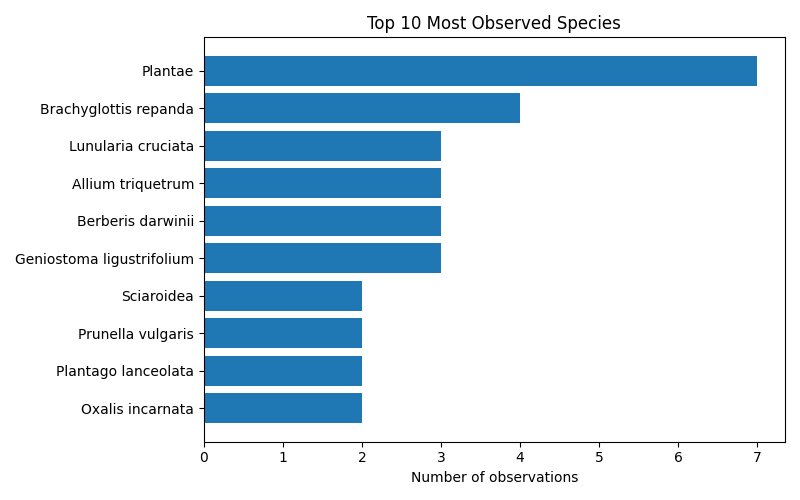
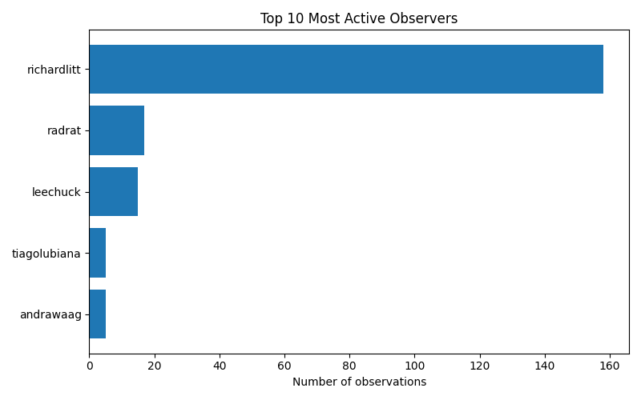

# iNaturalist Project Report: living-data-2025-world

- Total observations: 200
- Unique species observed: 163
- Unique observers: 5

## Wikipedia & Wikidata Coverage

- Species not on Wikidata: **0**
- Missing in en: **17**

- Missing in es: **60**

- Missing in ja: **107**

- Missing in ar: **90**

- Missing in nl: **58**

| Taxon | Wikidata | EN | ES | JA | AR | NL |
|---|---|---|---|---|---|---|
| Achrophyllum | &#10003; | &#10007; | &#10007; | &#10007; | &#10007; | &#10007; |
| Cyathea dealbata | &#10003; | &#10007; | &#10007; | &#10007; | &#10007; | &#10007; |
| Cyathea medullaris | &#10003; | &#10007; | &#10007; | &#10007; | &#10007; | &#10007; |
| Didymocheton spectabilis | &#10003; | &#10007; | &#10007; | &#10007; | &#10007; | &#10007; |
| Dolichotetranychus ancistrus | &#10003; | &#10007; | &#10007; | &#10007; | &#10007; | &#10007; |
| Hydrocotyle heteromeria | &#10003; | &#10007; | &#10007; | &#10007; | &#10007; | &#10007; |
| Hymenophyllum dilatatum | &#10003; | &#10007; | &#10007; | &#10007; | &#10007; | &#10007; |
| Hymenophyllum flexuosum | &#10003; | &#10007; | &#10007; | &#10007; | &#10007; | &#10007; |
| Liriomyza flavolateralis | &#10003; | &#10007; | &#10007; | &#10007; | &#10007; | &#10007; |
| Nestor meridionalis septentrionalis | &#10003; | &#10007; | &#10007; | &#10007; | &#10007; | &#10007; |
| Phormium cookianum | &#10003; | &#10007; | &#10007; | &#10007; | &#10007; | &#10007; |
| Phytomyza syngenesiae | &#10003; | &#10007; | &#10007; | &#10007; | &#10007; | &#10007; |
| Pittosporum ralphii | &#10003; | &#10007; | &#10007; | &#10007; | &#10007; | &#10007; |
| Tribulus arabicus | &#10003; | &#10007; | &#10007; | &#10007; | &#10007; | &#10007; |
| Tripogandra diuretica | &#10003; | &#10007; | &#10007; | &#10007; | &#10007; | &#10007; |
| Zygophyllum mandavillei | &#10003; | &#10007; | &#10007; | &#10007; | &#10007; | &#10007; |
| Anareolatae | &#10003; | &#10007; | &#10007; | &#10007; | [&#10003;](https://ar.wikipedia.org/wiki/%D9%84%D8%A7%D9%87%D8%A7%D9%84%D8%A7%D8%AA%D9%8A%D8%A7%D8%AA) | &#10007; |
| Andricus quercuscalifornicus | &#10003; | [&#10003;](https://en.wikipedia.org/wiki/Andricus_quercuscalifornicus) | &#10007; | &#10007; | &#10007; | &#10007; |
| Asplenium flabellifolium | &#10003; | [&#10003;](https://en.wikipedia.org/wiki/Asplenium_flabellifolium) | &#10007; | &#10007; | &#10007; | &#10007; |
| Asplenium flaccidum | &#10003; | [&#10003;](https://en.wikipedia.org/wiki/Asplenium_flaccidum) | &#10007; | &#10007; | &#10007; | &#10007; |
| Asplenium gracillimum | &#10003; | [&#10003;](https://en.wikipedia.org/wiki/Asplenium_gracillimum) | &#10007; | &#10007; | &#10007; | &#10007; |
| Asplenium oblongifolium | &#10003; | [&#10003;](https://en.wikipedia.org/wiki/Asplenium_oblongifolium) | &#10007; | &#10007; | &#10007; | &#10007; |
| Bistorta amplexicaulis | &#10003; | [&#10003;](https://en.wikipedia.org/wiki/Bistorta_amplexicaulis) | &#10007; | &#10007; | &#10007; | &#10007; |
| Cephaleuros lagerheimii | &#10003; | [&#10003;](https://en.wikipedia.org/wiki/Cephaleuros_lagerheimii) | &#10007; | &#10007; | &#10007; | &#10007; |
| Coprosma grandifolia | &#10003; | [&#10003;](https://en.wikipedia.org/wiki/Coprosma_autumnalis) | &#10007; | &#10007; | &#10007; | &#10007; |
| Geniostoma ligustrifolium | &#10003; | [&#10003;](https://en.wikipedia.org/wiki/Geniostoma_ligustrifolium) | &#10007; | &#10007; | &#10007; | &#10007; |
| Hesperocyparis macrocarpa | &#10003; | [&#10003;](https://en.wikipedia.org/wiki/Hesperocyparis_macrocarpa) | &#10007; | &#10007; | &#10007; | &#10007; |
| Hymenophyllum nephrophyllum | &#10003; | [&#10003;](https://en.wikipedia.org/wiki/Hymenophyllum_nephrophyllum) | &#10007; | &#10007; | &#10007; | &#10007; |
| Hypopterygiaceae | &#10003; | [&#10003;](https://en.wikipedia.org/wiki/Hypopterygiaceae) | &#10007; | &#10007; | &#10007; | &#10007; |
| Microsorum pustulatum | &#10003; | [&#10003;](https://en.wikipedia.org/wiki/Zealandia_pustulata) | &#10007; | &#10007; | &#10007; | &#10007; |
| Olearia paniculata | &#10003; | [&#10003;](https://en.wikipedia.org/wiki/Olearia_paniculata) | &#10007; | &#10007; | &#10007; | &#10007; |
| Oxalis incarnata | &#10003; | [&#10003;](https://en.wikipedia.org/wiki/Oxalis_incarnata) | &#10007; | &#10007; | &#10007; | &#10007; |
| Piper excelsum | &#10003; | [&#10003;](https://en.wikipedia.org/wiki/Piper_excelsum) | &#10007; | &#10007; | &#10007; | &#10007; |
| Pseudopanax arboreus | &#10003; | [&#10003;](https://en.wikipedia.org/wiki/Pseudopanax_arboreus) | &#10007; | &#10007; | &#10007; | &#10007; |
| Pteridium esculentum | &#10003; | [&#10003;](https://en.wikipedia.org/wiki/Pteridium_esculentum) | &#10007; | &#10007; | &#10007; | &#10007; |
| Racopilum | &#10003; | [&#10003;](https://en.wikipedia.org/wiki/Racopilum) | &#10007; | &#10007; | &#10007; | &#10007; |
| Ripogonum scandens | &#10003; | [&#10003;](https://en.wikipedia.org/wiki/Ripogonum_scandens) | &#10007; | &#10007; | &#10007; | &#10007; |
| Stephanomeria diegensis | &#10003; | [&#10003;](https://en.wikipedia.org/wiki/Stephanomeria_diegensis) | &#10007; | &#10007; | &#10007; | &#10007; |
| Veronica stricta | &#10003; | [&#10003;](https://en.wikipedia.org/wiki/Veronica_stricta) | &#10007; | &#10007; | &#10007; | &#10007; |
| Agapanthus praecox | &#10003; | [&#10003;](https://en.wikipedia.org/wiki/Agapanthus_praecox) | [&#10003;](https://es.wikipedia.org/wiki/Agapanthus_praecox) | &#10007; | &#10007; | &#10007; |
| Austroderia | &#10003; | [&#10003;](https://en.wikipedia.org/wiki/Austroderia) | &#10007; | &#10007; | &#10007; | [&#10003;](https://nl.wikipedia.org/wiki/Austroderia) |
| Bagrada hilaris | &#10003; | [&#10003;](https://en.wikipedia.org/wiki/Bagrada_hilaris) | [&#10003;](https://es.wikipedia.org/wiki/Bagrada_hilaris) | &#10007; | &#10007; | &#10007; |
| Blechnum filiforme | &#10003; | [&#10003;](https://en.wikipedia.org/wiki/Blechnum_filiforme) | [&#10003;](https://es.wikipedia.org/wiki/Blechnum_filiforme) | &#10007; | &#10007; | &#10007; |
| Brachyglottis repanda | &#10003; | [&#10003;](https://en.wikipedia.org/wiki/Brachyglottis_repanda) | [&#10003;](https://es.wikipedia.org/wiki/Brachyglottis_repanda) | &#10007; | &#10007; | &#10007; |
| Calyptocarpus | &#10003; | [&#10003;](https://en.wikipedia.org/wiki/Calyptocarpus) | [&#10003;](https://es.wikipedia.org/wiki/Calyptocarpus) | &#10007; | &#10007; | &#10007; |
| Carpodetus serratus | &#10003; | [&#10003;](https://en.wikipedia.org/wiki/Carpodetus_serratus) | &#10007; | &#10007; | &#10007; | [&#10003;](https://nl.wikipedia.org/wiki/Carpodetus_serratus) |
| Cleora scriptaria | &#10003; | [&#10003;](https://en.wikipedia.org/wiki/Cleora_scriptaria) | &#10007; | &#10007; | &#10007; | [&#10003;](https://nl.wikipedia.org/wiki/Cleora_scriptaria) |
| Coprosma crassifolia | &#10003; | [&#10003;](https://en.wikipedia.org/wiki/Coprosma_crassifolia) | &#10007; | &#10007; | &#10007; | [&#10003;](https://nl.wikipedia.org/wiki/Coprosma_crassifolia) |
| Coprosma repens | &#10003; | [&#10003;](https://en.wikipedia.org/wiki/Coprosma_repens) | [&#10003;](https://es.wikipedia.org/wiki/Coprosma_repens) | &#10007; | &#10007; | &#10007; |
| Coprosma rhamnoides | &#10003; | [&#10003;](https://en.wikipedia.org/wiki/Coprosma_rhamnoides) | &#10007; | &#10007; | &#10007; | [&#10003;](https://nl.wikipedia.org/wiki/Coprosma_rhamnoides) |
| Cotula australis | &#10003; | [&#10003;](https://en.wikipedia.org/wiki/Cotula_australis) | [&#10003;](https://es.wikipedia.org/wiki/Cotula_australis) | &#10007; | &#10007; | &#10007; |
| Cyathea smithii | &#10003; | [&#10003;](https://en.wikipedia.org/wiki/Alsophila_smithii) | &#10007; | &#10007; | &#10007; | [&#10003;](https://nl.wikipedia.org/wiki/Alsophila_smithii) |
| Dilophus | &#10003; | [&#10003;](https://en.wikipedia.org/wiki/Dilophus) | &#10007; | &#10007; | [&#10003;](https://ar.wikipedia.org/wiki/%D8%AF%D9%84%D9%81%D9%88%D8%B3_(%D8%AC%D9%86%D8%B3)) | &#10007; |
| Ehrharta erecta | &#10003; | [&#10003;](https://en.wikipedia.org/wiki/Ehrharta_erecta) | [&#10003;](https://es.wikipedia.org/wiki/Ehrharta_erecta) | &#10007; | &#10007; | &#10007; |
| Eleodes | &#10003; | [&#10003;](https://en.wikipedia.org/wiki/Eleodes) | [&#10003;](https://es.wikipedia.org/wiki/Eleodes) | &#10007; | &#10007; | &#10007; |
| Haloragis erecta | &#10003; | [&#10003;](https://en.wikipedia.org/wiki/Haloragis_erecta) | [&#10003;](https://es.wikipedia.org/wiki/Haloragis_erecta) | &#10007; | &#10007; | &#10007; |
| Haloxylon persicum | &#10003; | [&#10003;](https://en.wikipedia.org/wiki/Haloxylon_persicum) | &#10007; | &#10007; | [&#10003;](https://ar.wikipedia.org/wiki/%D8%B1%D9%85%D8%AB_%D9%81%D8%A7%D8%B1%D8%B3%D9%8A) | &#10007; |
| Hedera colchica | &#10003; | [&#10003;](https://en.wikipedia.org/wiki/Hedera_colchica) | &#10007; | &#10007; | [&#10003;](https://ar.wikipedia.org/wiki/%D8%B9%D8%B4%D9%82%D8%A9_%D9%83%D9%84%D8%B4%D9%8A%D8%AF) | &#10007; |
| Hedycarya arborea | &#10003; | [&#10003;](https://en.wikipedia.org/wiki/Hedycarya_arborea) | &#10007; | &#10007; | &#10007; | [&#10003;](https://nl.wikipedia.org/wiki/Hedycarya_arborea) |
| Hemideina crassidens | &#10003; | [&#10003;](https://en.wikipedia.org/wiki/Hemideina_crassidens) | &#10007; | &#10007; | &#10007; | [&#10003;](https://nl.wikipedia.org/wiki/Hemideina_crassidens) |
| Hoheria populnea | &#10003; | [&#10003;](https://en.wikipedia.org/wiki/Hoheria_populnea) | &#10007; | &#10007; | &#10007; | [&#10003;](https://nl.wikipedia.org/wiki/Hoheria_populnea) |
| Jasus edwardsii | &#10003; | [&#10003;](https://en.wikipedia.org/wiki/Jasus_edwardsii) | &#10007; | &#10007; | &#10007; | [&#10003;](https://nl.wikipedia.org/wiki/Jasus_edwardsii) |
| Lasioglossum sordidum | &#10003; | [&#10003;](https://en.wikipedia.org/wiki/Lasioglossum_sordidum) | &#10007; | &#10007; | &#10007; | [&#10003;](https://nl.wikipedia.org/wiki/Lasioglossum_sordidum) |
| Latridopsis ciliaris | &#10003; | [&#10003;](https://en.wikipedia.org/wiki/Blue_moki) | &#10007; | &#10007; | &#10007; | [&#10003;](https://nl.wikipedia.org/wiki/Latridopsis_ciliaris) |
| Metzgeria | &#10003; | [&#10003;](https://en.wikipedia.org/wiki/Metzgeria_(gastropod)) | &#10007; | &#10007; | &#10007; | [&#10003;](https://nl.wikipedia.org/wiki/Boomvorkje) |
| Parmotrema | &#10003; | [&#10003;](https://en.wikipedia.org/wiki/Parmotrema) | [&#10003;](https://es.wikipedia.org/wiki/Parmotrema) | &#10007; | &#10007; | &#10007; |
| Pellaea rotundifolia | &#10003; | [&#10003;](https://en.wikipedia.org/wiki/Pellaea_rotundifolia) | [&#10003;](https://es.wikipedia.org/wiki/Pellaea_rotundifolia) | &#10007; | &#10007; | &#10007; |
| Phlyctenactis tuberculosa | &#10003; | [&#10003;](https://en.wikipedia.org/wiki/Phlyctenactis_tuberculosa) | &#10007; | &#10007; | &#10007; | [&#10003;](https://nl.wikipedia.org/wiki/Phlyctenactis_tuberculosa) |
| Senecio glastifolius | &#10003; | [&#10003;](https://en.wikipedia.org/wiki/Senecio_glastifolius) | &#10007; | &#10007; | &#10007; | [&#10003;](https://nl.wikipedia.org/wiki/Senecio_glastifolius) |
| Stachytarpheta cayennensis | &#10003; | [&#10003;](https://en.wikipedia.org/wiki/Stachytarpheta_cayennensis) | [&#10003;](https://es.wikipedia.org/wiki/Stachytarpheta_cayennensis) | &#10007; | &#10007; | &#10007; |
| Agrotis ipsilon | &#10003; | [&#10003;](https://en.wikipedia.org/wiki/Agrotis_ipsilon) | [&#10003;](https://es.wikipedia.org/wiki/Agrotis_ipsilon) | &#10007; | &#10007; | [&#10003;](https://nl.wikipedia.org/wiki/Grote_worteluil) |
| Agyneta | &#10003; | [&#10003;](https://en.wikipedia.org/wiki/Agyneta) | [&#10003;](https://es.wikipedia.org/wiki/Agyneta) | &#10007; | &#10007; | [&#10003;](https://nl.wikipedia.org/wiki/Agyneta) |
| Armillaria ostoyae | &#10003; | [&#10003;](https://en.wikipedia.org/wiki/Armillaria_ostoyae) | [&#10003;](https://es.wikipedia.org/wiki/Armillaria_ostoyae) | &#10007; | &#10007; | [&#10003;](https://nl.wikipedia.org/wiki/Sombere_honingzwam) |
| Berberis darwinii | &#10003; | [&#10003;](https://en.wikipedia.org/wiki/Berberis_darwinii) | [&#10003;](https://es.wikipedia.org/wiki/Berberis_darwinii) | &#10007; | [&#10003;](https://ar.wikipedia.org/wiki/%D8%A8%D8%B1%D8%A8%D8%A7%D8%B1%D9%8A%D8%B3_%D8%AF%D8%A7%D8%B1%D9%88%D9%8A%D9%86%D9%8A) | &#10007; |
| Cellana denticulata | &#10003; | [&#10003;](https://en.wikipedia.org/wiki/Cellana_denticulata) | [&#10003;](https://es.wikipedia.org/wiki/Cellana_denticulata) | &#10007; | &#10007; | [&#10003;](https://nl.wikipedia.org/wiki/Cellana_denticulata) |
| Fissidens | &#10003; | [&#10003;](https://en.wikipedia.org/wiki/Fissidens) | &#10007; | [&#10003;](https://ja.wikipedia.org/wiki/%E3%83%9B%E3%82%A6%E3%82%AA%E3%82%A6%E3%82%B4%E3%82%B1%E5%B1%9E) | &#10007; | [&#10003;](https://nl.wikipedia.org/wiki/Vedermos) |
| Forsterygion lapillum | &#10003; | [&#10003;](https://en.wikipedia.org/wiki/Common_triplefin) | [&#10003;](https://es.wikipedia.org/wiki/Forsterygion_lapillum) | &#10007; | &#10007; | [&#10003;](https://nl.wikipedia.org/wiki/Forsterygion_lapillum) |
| Fumaria muralis | &#10003; | [&#10003;](https://en.wikipedia.org/wiki/Fumaria_muralis) | [&#10003;](https://es.wikipedia.org/wiki/Fumaria_muralis) | &#10007; | &#10007; | [&#10003;](https://nl.wikipedia.org/wiki/Middelste_duivenkervel) |
| Halothamnus bottae | &#10003; | [&#10003;](https://en.wikipedia.org/wiki/Halothamnus_bottae) | [&#10003;](https://es.wikipedia.org/wiki/Halothamnus_bottae) | &#10007; | [&#10003;](https://ar.wikipedia.org/wiki/%D9%82%D8%B6%D8%A9_%D8%A8%D9%88%D8%AA%D9%8A%D8%A9) | &#10007; |
| Melicytus ramiflorus | &#10003; | [&#10003;](https://en.wikipedia.org/wiki/Melicytus_ramiflorus) | [&#10003;](https://es.wikipedia.org/wiki/Melicytus_ramiflorus) | &#10007; | &#10007; | [&#10003;](https://nl.wikipedia.org/wiki/Melicytus_ramiflorus) |
| Metrosideros fulgens | &#10003; | [&#10003;](https://en.wikipedia.org/wiki/Metrosideros_fulgens) | [&#10003;](https://es.wikipedia.org/wiki/Metrosideros_fulgens) | &#10007; | &#10007; | [&#10003;](https://nl.wikipedia.org/wiki/Metrosideros_fulgens) |
| Myoporum laetum | &#10003; | [&#10003;](https://en.wikipedia.org/wiki/Myoporum_laetum) | [&#10003;](https://es.wikipedia.org/wiki/Myoporum_laetum) | &#10007; | &#10007; | [&#10003;](https://nl.wikipedia.org/wiki/Myoporum_laetum) |
| Notolabrus fucicola | &#10003; | [&#10003;](https://en.wikipedia.org/wiki/Notolabrus_fucicola) | [&#10003;](https://es.wikipedia.org/wiki/Notolabrus_fucicola) | &#10007; | &#10007; | [&#10003;](https://nl.wikipedia.org/wiki/Notolabrus_fucicola) |
| Polioptila californica | &#10003; | [&#10003;](https://en.wikipedia.org/wiki/California_gnatcatcher) | [&#10003;](https://es.wikipedia.org/wiki/Polioptila_californica) | &#10007; | &#10007; | [&#10003;](https://nl.wikipedia.org/wiki/Californische_muggenvanger) |
| Pseudopanax crassifolius | &#10003; | [&#10003;](https://en.wikipedia.org/wiki/Pseudopanax_crassifolius) | [&#10003;](https://es.wikipedia.org/wiki/Pseudopanax_crassifolius) | &#10007; | &#10007; | [&#10003;](https://nl.wikipedia.org/wiki/Pseudopanax_crassifolius) |
| Sciaroidea | &#10003; | [&#10003;](https://en.wikipedia.org/wiki/Sciaroidea) | [&#10003;](https://es.wikipedia.org/wiki/Sciaroidea) | &#10007; | &#10007; | [&#10003;](https://nl.wikipedia.org/wiki/Sciaroidea) |
| Sherardia arvensis | &#10003; | [&#10003;](https://en.wikipedia.org/wiki/Sherardia_arvensis) | &#10007; | [&#10003;](https://ja.wikipedia.org/wiki/%E3%83%8F%E3%83%8A%E3%83%A4%E3%82%A8%E3%83%A0%E3%82%B0%E3%83%A9) | &#10007; | [&#10003;](https://nl.wikipedia.org/wiki/Blauw_walstro) |
| Stachys sylvatica | &#10003; | [&#10003;](https://en.wikipedia.org/wiki/Stachys_sylvatica) | [&#10003;](https://es.wikipedia.org/wiki/Stachys_sylvatica) | &#10007; | &#10007; | [&#10003;](https://nl.wikipedia.org/wiki/Bosandoorn) |
| Xanthoria parietina | &#10003; | [&#10003;](https://en.wikipedia.org/wiki/Xanthoria_parietina) | [&#10003;](https://es.wikipedia.org/wiki/Xanthoria_parietina) | &#10007; | &#10007; | [&#10003;](https://nl.wikipedia.org/wiki/Groot_dooiermos) |
| Acanthus mollis | &#10003; | [&#10003;](https://en.wikipedia.org/wiki/Acanthus_mollis) | [&#10003;](https://es.wikipedia.org/wiki/Acanthus_mollis) | &#10007; | [&#10003;](https://ar.wikipedia.org/wiki/%D8%A3%D9%82%D9%86%D8%AB%D8%A7_%D9%86%D8%A7%D8%B9%D9%85%D8%A9) | [&#10003;](https://nl.wikipedia.org/wiki/Acanthus_mollis) |
| Accipiter striatus | &#10003; | [&#10003;](https://en.wikipedia.org/wiki/Sharp-shinned_hawk) | [&#10003;](https://es.wikipedia.org/wiki/Accipiter_striatus) | &#10007; | [&#10003;](https://ar.wikipedia.org/wiki/%D8%A8%D8%A7%D8%B2_%D8%A3%D8%B5%D9%87%D8%A8_%D8%A7%D9%84%D9%81%D8%AE%D8%B0) | [&#10003;](https://nl.wikipedia.org/wiki/Amerikaanse_sperwer) |
| Allium triquetrum | &#10003; | [&#10003;](https://en.wikipedia.org/wiki/Allium_triquetrum) | [&#10003;](https://es.wikipedia.org/wiki/Allium_triquetrum) | &#10007; | [&#10003;](https://ar.wikipedia.org/wiki/%D8%AB%D9%88%D9%85_%D9%85%D8%AB%D9%84%D8%AB) | [&#10003;](https://nl.wikipedia.org/wiki/Driekantig_look) |
| Aphelocoma californica | &#10003; | [&#10003;](https://en.wikipedia.org/wiki/California_scrub_jay) | [&#10003;](https://es.wikipedia.org/wiki/Aphelocoma_californica) | [&#10003;](https://ja.wikipedia.org/wiki/%E3%82%A2%E3%83%A1%E3%83%AA%E3%82%AB%E3%82%AB%E3%82%B1%E3%82%B9) | &#10007; | [&#10003;](https://nl.wikipedia.org/wiki/Westelijke_struikgaai) |
| Araneus gemma | &#10003; | [&#10003;](https://en.wikipedia.org/wiki/Araneus_gemma) | [&#10003;](https://es.wikipedia.org/wiki/Araneus_gemma) | &#10007; | [&#10003;](https://ar.wikipedia.org/wiki/%D8%B3%D9%83_%D8%AC%D9%8A%D9%85%D8%A9) | [&#10003;](https://nl.wikipedia.org/wiki/Araneus_gemma) |
| Callipepla californica | &#10003; | [&#10003;](https://en.wikipedia.org/wiki/California_quail) | [&#10003;](https://es.wikipedia.org/wiki/Callipepla_californica) | [&#10003;](https://ja.wikipedia.org/wiki/%E3%82%AB%E3%83%B3%E3%83%A0%E3%83%AA%E3%82%A6%E3%82%BA%E3%83%A9) | &#10007; | [&#10003;](https://nl.wikipedia.org/wiki/Californische_kuifkwartel) |
| Coprosma | &#10003; | [&#10003;](https://en.wikipedia.org/wiki/Coprosma) | [&#10003;](https://es.wikipedia.org/wiki/Coprosma) | [&#10003;](https://ja.wikipedia.org/wiki/%E3%82%B3%E3%83%97%E3%83%AD%E3%82%B9%E3%83%9E%E5%B1%9E) | &#10007; | [&#10003;](https://nl.wikipedia.org/wiki/Coprosma) |
| Cylindropuntia | &#10003; | [&#10003;](https://en.wikipedia.org/wiki/Cylindropuntia) | [&#10003;](https://es.wikipedia.org/wiki/Cylindropuntia) | &#10007; | [&#10003;](https://ar.wikipedia.org/wiki/%D8%B5%D8%A8%D9%8A%D8%B1_%D8%A3%D8%B3%D8%B7%D9%88%D8%A7%D9%86%D8%A7%D9%88%D9%8A) | [&#10003;](https://nl.wikipedia.org/wiki/Cylindropuntia) |
| Cymbalaria muralis | &#10003; | [&#10003;](https://en.wikipedia.org/wiki/Cymbalaria_muralis) | [&#10003;](https://es.wikipedia.org/wiki/Cymbalaria_muralis) | [&#10003;](https://ja.wikipedia.org/wiki/%E3%83%84%E3%82%BF%E3%83%90%E3%82%A6%E3%83%B3%E3%83%A9%E3%83%B3) | &#10007; | [&#10003;](https://nl.wikipedia.org/wiki/Muurleeuwenbek) |
| Cytisus scoparius | &#10003; | [&#10003;](https://en.wikipedia.org/wiki/Cytisus_scoparius) | [&#10003;](https://es.wikipedia.org/wiki/Cytisus_scoparius) | &#10007; | [&#10003;](https://ar.wikipedia.org/wiki/%D9%84%D8%B2%D8%A7%D9%86_%D9%85%D9%83%D9%86%D8%B3%D9%8A) | [&#10003;](https://nl.wikipedia.org/wiki/Brem_(plant)) |
| Iris foetidissima | &#10003; | [&#10003;](https://en.wikipedia.org/wiki/Iris_foetidissima) | [&#10003;](https://es.wikipedia.org/wiki/Iris_foetidissima) | &#10007; | [&#10003;](https://ar.wikipedia.org/wiki/%D8%B3%D9%88%D8%B3%D9%86_%D9%85%D9%86%D8%AA%D9%86) | [&#10003;](https://nl.wikipedia.org/wiki/Stinkende_lis) |
| Jacobaea vulgaris | &#10003; | [&#10003;](https://en.wikipedia.org/wiki/Jacobaea_vulgaris) | [&#10003;](https://es.wikipedia.org/wiki/Jacobaea_vulgaris) | &#10007; | [&#10003;](https://ar.wikipedia.org/wiki/%D9%8A%D8%B9%D9%82%D9%88%D8%A8%D9%8A%D8%A9_%D8%B4%D8%A7%D8%A6%D8%B9%D8%A9) | [&#10003;](https://nl.wikipedia.org/wiki/Jacobaea_vulgaris) |
| Lonicera japonica | &#10003; | [&#10003;](https://en.wikipedia.org/wiki/Lonicera_japonica) | [&#10003;](https://es.wikipedia.org/wiki/Lonicera_japonica) | [&#10003;](https://ja.wikipedia.org/wiki/%E3%82%B9%E3%82%A4%E3%82%AB%E3%82%BA%E3%83%A9) | [&#10003;](https://ar.wikipedia.org/wiki/%D8%B9%D8%B3%D9%84%D8%A9_%D9%8A%D8%A7%D8%A8%D8%A7%D9%86%D9%8A%D8%A9) | &#10007; |
| Lunularia cruciata | &#10003; | [&#10003;](https://en.wikipedia.org/wiki/Lunularia) | [&#10003;](https://es.wikipedia.org/wiki/Lunularia_cruciata) | [&#10003;](https://ja.wikipedia.org/wiki/%E3%83%9F%E3%82%AB%E3%83%85%E3%82%AD%E3%82%BC%E3%83%8B%E3%82%B4%E3%82%B1) | &#10007; | [&#10003;](https://nl.wikipedia.org/wiki/Halvemaantjesmos) |
| Medicago arabica | &#10003; | [&#10003;](https://en.wikipedia.org/wiki/Medicago_arabica) | [&#10003;](https://es.wikipedia.org/wiki/Medicago_arabica) | &#10007; | [&#10003;](https://ar.wikipedia.org/wiki/%D9%81%D8%B5%D8%A9_%D8%B9%D8%B1%D8%A8%D9%8A%D8%A9) | [&#10003;](https://nl.wikipedia.org/wiki/Gevlekte_rupsklaver) |
| Mimosoideae | &#10003; | [&#10003;](https://en.wikipedia.org/wiki/Mimosoideae) | [&#10003;](https://es.wikipedia.org/wiki/Mimosoideae) | &#10007; | [&#10003;](https://ar.wikipedia.org/wiki/%D8%B3%D9%86%D8%B7%D8%A7%D9%88%D8%A7%D8%AA) | [&#10003;](https://nl.wikipedia.org/wiki/Mimosoideae) |
| Parietaria judaica | &#10003; | [&#10003;](https://en.wikipedia.org/wiki/Parietaria_judaica) | [&#10003;](https://es.wikipedia.org/wiki/Parietaria_judaica) | &#10007; | [&#10003;](https://ar.wikipedia.org/wiki/%D8%AD%D8%B4%D9%8A%D8%B4%D8%A9_%D8%A7%D9%84%D8%B2%D8%AC%D8%A7%D8%AC_%D8%A7%D9%84%D9%8A%D9%87%D9%88%D8%AF%D9%8A%D8%A9) | [&#10003;](https://nl.wikipedia.org/wiki/Klein_glaskruid) |
| Pipilo maculatus | &#10003; | [&#10003;](https://en.wikipedia.org/wiki/Spotted_towhee) | [&#10003;](https://es.wikipedia.org/wiki/Pipilo_maculatus) | &#10007; | [&#10003;](https://ar.wikipedia.org/wiki/%D8%B7%D9%88%D9%87%D9%8A_%D9%85%D8%B1%D9%82%D8%B7) | [&#10003;](https://nl.wikipedia.org/wiki/Gevlekte_towie) |
| Polioptila caerulea | &#10003; | [&#10003;](https://en.wikipedia.org/wiki/Blue-gray_gnatcatcher) | [&#10003;](https://es.wikipedia.org/wiki/Polioptila_caerulea) | &#10007; | [&#10003;](https://ar.wikipedia.org/wiki/%D8%B5%D8%A7%D8%A6%D8%AF_%D8%A7%D9%84%D8%A8%D8%B9%D9%88%D8%B6_%D8%A7%D9%84%D8%B1%D9%85%D8%A7%D8%AF%D9%8A_%D8%A7%D9%84%D8%A3%D8%B2%D8%B1%D9%82) | [&#10003;](https://nl.wikipedia.org/wiki/Blauwgrijze_muggenvanger) |
| Polypodiopsida | &#10003; | [&#10003;](https://en.wikipedia.org/wiki/Polypodiopsida) | &#10007; | [&#10003;](https://ja.wikipedia.org/wiki/%E5%A4%A7%E8%91%89%E3%82%B7%E3%83%80%E6%A4%8D%E7%89%A9) | [&#10003;](https://ar.wikipedia.org/wiki/%D8%B3%D8%B1%D8%AE%D8%B3%D8%A7%D9%86%D9%8A%D8%A9) | [&#10003;](https://nl.wikipedia.org/wiki/Polypodiopsida) |
| Prunella vulgaris | &#10003; | [&#10003;](https://en.wikipedia.org/wiki/Prunella_vulgaris) | [&#10003;](https://es.wikipedia.org/wiki/Prunella_vulgaris) | [&#10003;](https://ja.wikipedia.org/wiki/%E3%82%A6%E3%83%84%E3%83%9C%E3%82%B0%E3%82%B5) | &#10007; | [&#10003;](https://nl.wikipedia.org/wiki/Gewone_brunel) |
| Prunus laurocerasus | &#10003; | [&#10003;](https://en.wikipedia.org/wiki/Prunus_laurocerasus) | [&#10003;](https://es.wikipedia.org/wiki/Prunus_laurocerasus) | &#10007; | [&#10003;](https://ar.wikipedia.org/wiki/%D9%83%D8%B1%D8%B2_%D8%A7%D9%84%D8%BA%D8%A7%D8%B1) | [&#10003;](https://nl.wikipedia.org/wiki/Laurierkers) |
| Prunus serrulata | &#10003; | [&#10003;](https://en.wikipedia.org/wiki/Prunus_serrulata) | [&#10003;](https://es.wikipedia.org/wiki/Prunus_serrulata) | [&#10003;](https://ja.wikipedia.org/wiki/%E3%82%B5%E3%83%88%E3%82%B6%E3%82%AF%E3%83%A9) | &#10007; | [&#10003;](https://nl.wikipedia.org/wiki/Japanse_sierkers) |
| Sphenodon punctatus | &#10003; | [&#10003;](https://en.wikipedia.org/wiki/Sphenodon_punctatus) | [&#10003;](https://es.wikipedia.org/wiki/Sphenodon_punctatus) | &#10007; | [&#10003;](https://ar.wikipedia.org/wiki/%D8%B7%D8%B1%D8%A7%D8%B7%D8%B1%D8%A9_%D8%B4%D8%A7%D8%A6%D8%B9%D8%A9) | [&#10003;](https://nl.wikipedia.org/wiki/Brughagedis) |
| Spinus psaltria | &#10003; | [&#10003;](https://en.wikipedia.org/wiki/Lesser_goldfinch) | [&#10003;](https://es.wikipedia.org/wiki/Spinus_psaltria) | &#10007; | [&#10003;](https://ar.wikipedia.org/wiki/%D8%AD%D8%B3%D9%88%D9%86_%D8%A3%D8%B5%D8%BA%D8%B1) | [&#10003;](https://nl.wikipedia.org/wiki/Witbandsijs) |
| Sterna striata | &#10003; | [&#10003;](https://en.wikipedia.org/wiki/White-fronted_tern) | [&#10003;](https://es.wikipedia.org/wiki/Sterna_striata) | &#10007; | [&#10003;](https://ar.wikipedia.org/wiki/%D8%AE%D8%B1%D8%B4%D9%86%D8%A9_%D9%85%D8%AE%D8%B7%D8%B7%D8%A9) | [&#10003;](https://nl.wikipedia.org/wiki/Tarastern) |
| Thalassarche | &#10003; | [&#10003;](https://en.wikipedia.org/wiki/Mollymawk) | [&#10003;](https://es.wikipedia.org/wiki/Thalassarche) | &#10007; | [&#10003;](https://ar.wikipedia.org/wiki/%D9%82%D8%B7%D8%B1%D8%B3_%D8%A3%D8%AD%D9%85%D9%82) | [&#10003;](https://nl.wikipedia.org/wiki/Thalassarche) |
| Tyrannus vociferans | &#10003; | [&#10003;](https://en.wikipedia.org/wiki/Cassin%27s_kingbird) | [&#10003;](https://es.wikipedia.org/wiki/Tyrannus_vociferans) | &#10007; | [&#10003;](https://ar.wikipedia.org/wiki/%D8%B9%D8%B5%D9%81%D9%88%D8%B1_%D8%A7%D9%84%D9%85%D9%84%D9%83_%D8%A7%D9%84%D9%83%D8%A7%D8%B3%D9%8A%D9%86%D9%8A) | [&#10003;](https://nl.wikipedia.org/wiki/Cassins_koningstiran) |
| Zygophyllum | &#10003; | [&#10003;](https://en.wikipedia.org/wiki/Zygophyllum) | [&#10003;](https://es.wikipedia.org/wiki/Zygophyllum) | &#10007; | [&#10003;](https://ar.wikipedia.org/wiki/%D8%B1%D8%B7%D8%B1%D9%8A%D8%B7) | [&#10003;](https://nl.wikipedia.org/wiki/Zygophyllum) |
| Acer pseudoplatanus | &#10003; | [&#10003;](https://en.wikipedia.org/wiki/Acer_pseudoplatanus) | [&#10003;](https://es.wikipedia.org/wiki/Acer_pseudoplatanus) | [&#10003;](https://ja.wikipedia.org/wiki/%E3%82%BB%E3%82%A4%E3%83%A8%E3%82%A6%E3%82%AB%E3%82%B8%E3%82%AB%E3%82%A8%E3%83%87) | [&#10003;](https://ar.wikipedia.org/wiki/%D9%82%D9%8A%D9%82%D8%A8_%D8%AF%D9%84%D8%A8%D9%8A_%D9%83%D8%A7%D8%B0%D8%A8) | [&#10003;](https://nl.wikipedia.org/wiki/Gewone_esdoorn) |
| Achillea millefolium | &#10003; | [&#10003;](https://en.wikipedia.org/wiki/Achillea_millefolium) | [&#10003;](https://es.wikipedia.org/wiki/Achillea_millefolium) | [&#10003;](https://ja.wikipedia.org/wiki/%E3%82%BB%E3%82%A4%E3%83%A8%E3%82%A6%E3%83%8E%E3%82%B3%E3%82%AE%E3%83%AA%E3%82%BD%E3%82%A6) | [&#10003;](https://ar.wikipedia.org/wiki/%D9%82%D9%8A%D8%B5%D9%88%D9%85_%D8%A3%D9%84%D9%81%D9%8A_%D8%A7%D9%84%D8%A3%D9%88%D8%B1%D8%A7%D9%82) | [&#10003;](https://nl.wikipedia.org/wiki/Duizendblad_(soort)) |
| Alchemilla | &#10003; | [&#10003;](https://en.wikipedia.org/wiki/Alchemilla) | [&#10003;](https://es.wikipedia.org/wiki/Alchemilla) | [&#10003;](https://ja.wikipedia.org/wiki/%E3%83%8F%E3%82%B4%E3%83%AD%E3%83%A2%E3%82%B0%E3%82%B5%E5%B1%9E) | [&#10003;](https://ar.wikipedia.org/wiki/%D9%83%D9%85%D8%A7%D9%84%D9%8A%D8%A9_(%D9%86%D8%A8%D8%A7%D8%AA)) | [&#10003;](https://nl.wikipedia.org/wiki/Vrouwenmantel) |
| Anthoxanthum odoratum | &#10003; | [&#10003;](https://en.wikipedia.org/wiki/Anthoxanthum_odoratum) | [&#10003;](https://es.wikipedia.org/wiki/Anthoxanthum_odoratum) | [&#10003;](https://ja.wikipedia.org/wiki/%E3%83%8F%E3%83%AB%E3%82%AC%E3%83%A4) | [&#10003;](https://ar.wikipedia.org/wiki/%D8%B9%D8%B4%D8%A8_%D8%A7%D9%84%D8%B1%D8%A8%D9%8A%D8%B9_%D8%A7%D9%84%D8%B9%D8%B7%D8%B1%D9%8A) | [&#10003;](https://nl.wikipedia.org/wiki/Gewoon_reukgras) |
| Anura | &#10003; | [&#10003;](https://en.wikipedia.org/wiki/Frog) | [&#10003;](https://es.wikipedia.org/wiki/Anura) | [&#10003;](https://ja.wikipedia.org/wiki/%E3%82%AB%E3%82%A8%E3%83%AB) | [&#10003;](https://ar.wikipedia.org/wiki/%D8%B6%D9%81%D8%AF%D8%B9) | [&#10003;](https://nl.wikipedia.org/wiki/Kikkers) |
| Apocrita | &#10003; | [&#10003;](https://en.wikipedia.org/wiki/Apocrita) | [&#10003;](https://es.wikipedia.org/wiki/Apocrita) | [&#10003;](https://ja.wikipedia.org/wiki/%E3%83%8F%E3%83%81%E4%BA%9C%E7%9B%AE) | [&#10003;](https://ar.wikipedia.org/wiki/%D8%B0%D9%88%D8%A7%D8%AA_%D8%A7%D9%84%D8%AE%D8%B5%D8%B1) | [&#10003;](https://nl.wikipedia.org/wiki/Apocrita) |
| Bellis perennis | &#10003; | [&#10003;](https://en.wikipedia.org/wiki/Bellis_perennis) | [&#10003;](https://es.wikipedia.org/wiki/Bellis_perennis) | [&#10003;](https://ja.wikipedia.org/wiki/%E3%83%92%E3%83%8A%E3%82%AE%E3%82%AF) | [&#10003;](https://ar.wikipedia.org/wiki/%D8%A8%D9%84%D9%8A%D8%B3_%D9%85%D8%B9%D9%85%D8%B1) | [&#10003;](https://nl.wikipedia.org/wiki/Madeliefje) |
| Brachycera | &#10003; | [&#10003;](https://en.wikipedia.org/wiki/Brachycera) | [&#10003;](https://es.wikipedia.org/wiki/Brachycera) | [&#10003;](https://ja.wikipedia.org/wiki/%E3%83%8F%E3%82%A8%E4%BA%9C%E7%9B%AE) | [&#10003;](https://ar.wikipedia.org/wiki/%D9%82%D8%B5%D9%8A%D8%B1%D8%A7%D8%AA_%D8%A7%D9%84%D9%82%D8%B1%D9%86) | [&#10003;](https://nl.wikipedia.org/wiki/Vliegen_(dieren)) |
| Bryaceae | &#10003; | [&#10003;](https://en.wikipedia.org/wiki/Bryaceae) | [&#10003;](https://es.wikipedia.org/wiki/Bryaceae) | [&#10003;](https://ja.wikipedia.org/wiki/%E3%83%8F%E3%83%AA%E3%82%AC%E3%83%8D%E3%82%B4%E3%82%B1%E7%A7%91) | [&#10003;](https://ar.wikipedia.org/wiki/%D8%A8%D8%B1%D9%8A%D9%88%D9%85%D9%8A%D8%A9) | [&#10003;](https://nl.wikipedia.org/wiki/Knikmosfamilie) |
| Bryophyta | &#10003; | [&#10003;](https://en.wikipedia.org/wiki/Moss) | [&#10003;](https://es.wikipedia.org/wiki/Bryophyta_sensu_stricto) | [&#10003;](https://ja.wikipedia.org/wiki/%E8%98%9A%E9%A1%9E) | [&#10003;](https://ar.wikipedia.org/wiki/%D9%86%D8%A8%D8%A7%D8%AA%D8%A7%D8%AA_%D8%AD%D8%B2%D8%A7%D8%B2%D9%8A%D8%A9) | [&#10003;](https://nl.wikipedia.org/wiki/Mossen) |
| Chroicocephalus novaehollandiae | &#10003; | [&#10003;](https://en.wikipedia.org/wiki/Silver_gull) | [&#10003;](https://es.wikipedia.org/wiki/Chroicocephalus_novaehollandiae) | [&#10003;](https://ja.wikipedia.org/wiki/%E3%82%AE%E3%83%B3%E3%82%AB%E3%83%A2%E3%83%A1) | [&#10003;](https://ar.wikipedia.org/wiki/%D9%86%D9%88%D8%B1%D8%B3_%D8%A3%D8%B3%D8%AA%D8%B1%D8%A7%D9%84%D9%8A) | [&#10003;](https://nl.wikipedia.org/wiki/Witkopmeeuw) |
| Coccoidea | &#10003; | [&#10003;](https://en.wikipedia.org/wiki/Scale_insect) | [&#10003;](https://es.wikipedia.org/wiki/Coccoidea) | [&#10003;](https://ja.wikipedia.org/wiki/%E3%82%AB%E3%82%A4%E3%82%AC%E3%83%A9%E3%83%A0%E3%82%B7) | [&#10003;](https://ar.wikipedia.org/wiki/%D8%AD%D8%B4%D8%B1%D8%A9_%D9%82%D8%B4%D8%B1%D9%8A%D8%A9) | [&#10003;](https://nl.wikipedia.org/wiki/Schildluizen) |
| Cordyline australis | &#10003; | [&#10003;](https://en.wikipedia.org/wiki/Cordyline_australis) | [&#10003;](https://es.wikipedia.org/wiki/Cordyline_australis) | [&#10003;](https://ja.wikipedia.org/wiki/%E3%83%8B%E3%82%AA%E3%82%A4%E3%82%B7%E3%83%A5%E3%83%AD%E3%83%A9%E3%83%B3) | [&#10003;](https://ar.wikipedia.org/wiki/%D9%83%D9%88%D8%B1%D8%AF%D9%8A%D9%84_%D8%AC%D9%86%D9%88%D8%A8%D9%8A) | [&#10003;](https://nl.wikipedia.org/wiki/Cordyline_australis) |
| Cyathea | &#10003; | [&#10003;](https://en.wikipedia.org/wiki/Cyathea) | [&#10003;](https://es.wikipedia.org/wiki/Cyathea) | [&#10003;](https://ja.wikipedia.org/wiki/%E3%83%98%E3%82%B4%E5%B1%9E) | [&#10003;](https://ar.wikipedia.org/wiki/%D9%83%D9%8A%D8%A7%D8%AB%D9%88%D9%86) | [&#10003;](https://nl.wikipedia.org/wiki/Cyathea) |
| Cyperaceae | &#10003; | [&#10003;](https://en.wikipedia.org/wiki/Cyperaceae) | [&#10003;](https://es.wikipedia.org/wiki/Cyperaceae) | [&#10003;](https://ja.wikipedia.org/wiki/%E3%82%AB%E3%83%A4%E3%83%84%E3%83%AA%E3%82%B0%E3%82%B5%E7%A7%91) | [&#10003;](https://ar.wikipedia.org/wiki/%D8%B3%D8%B9%D8%AF%D9%8A%D8%A9_(%D9%81%D8%B5%D9%8A%D9%84%D8%A9_%D9%86%D8%A8%D8%A7%D8%AA%D9%8A%D8%A9)) | [&#10003;](https://nl.wikipedia.org/wiki/Cypergrassenfamilie) |
| Cyperus | &#10003; | [&#10003;](https://en.wikipedia.org/wiki/Cyperus) | [&#10003;](https://es.wikipedia.org/wiki/Cyperus) | [&#10003;](https://ja.wikipedia.org/wiki/%E3%82%AB%E3%83%A4%E3%83%84%E3%83%AA%E3%82%B0%E3%82%B5%E5%B1%9E) | [&#10003;](https://ar.wikipedia.org/wiki/%D8%B3%D8%B9%D8%AF) | [&#10003;](https://nl.wikipedia.org/wiki/Cypergras) |
| Dactylis glomerata | &#10003; | [&#10003;](https://en.wikipedia.org/wiki/Dactylis_glomerata) | [&#10003;](https://es.wikipedia.org/wiki/Dactylis_glomerata) | [&#10003;](https://ja.wikipedia.org/wiki/%E3%82%AB%E3%83%A2%E3%82%AC%E3%83%A4) | [&#10003;](https://ar.wikipedia.org/wiki/%D8%A5%D8%B5%D8%A8%D8%B9%D9%8A%D8%A9_%D8%B9%D9%86%D9%82%D9%88%D8%AF%D9%8A%D8%A9) | [&#10003;](https://nl.wikipedia.org/wiki/Kropaar) |
| Digitalis purpurea | &#10003; | [&#10003;](https://en.wikipedia.org/wiki/Digitalis_purpurea) | [&#10003;](https://es.wikipedia.org/wiki/Digitalis_purpurea) | [&#10003;](https://ja.wikipedia.org/wiki/%E3%82%AD%E3%83%84%E3%83%8D%E3%83%8E%E3%83%86%E3%83%96%E3%82%AF%E3%83%AD) | [&#10003;](https://ar.wikipedia.org/wiki/%D9%82%D9%85%D8%B9%D9%8A%D8%A9_%D8%A3%D8%B1%D8%AC%D9%88%D8%A7%D9%86%D9%8A%D8%A9) | [&#10003;](https://nl.wikipedia.org/wiki/Vingerhoedskruid) |
| Fungi | &#10003; | [&#10003;](https://en.wikipedia.org/wiki/Fungus) | [&#10003;](https://es.wikipedia.org/wiki/Fungi) | [&#10003;](https://ja.wikipedia.org/wiki/%E8%8F%8C%E9%A1%9E) | [&#10003;](https://ar.wikipedia.org/wiki/%D9%81%D8%B7%D8%B1) | [&#10003;](https://nl.wikipedia.org/wiki/Schimmels) |
| Galium | &#10003; | [&#10003;](https://en.wikipedia.org/wiki/Galium) | [&#10003;](https://es.wikipedia.org/wiki/Galium) | [&#10003;](https://ja.wikipedia.org/wiki/%E3%83%A4%E3%82%A8%E3%83%A0%E3%82%B0%E3%83%A9%E5%B1%9E) | [&#10003;](https://ar.wikipedia.org/wiki/%D8%AC%D9%88%D9%8A%D8%B3%D8%A6%D8%A9) | [&#10003;](https://nl.wikipedia.org/wiki/Walstro) |
| Geranium | &#10003; | [&#10003;](https://en.wikipedia.org/wiki/Geranium) | [&#10003;](https://es.wikipedia.org/wiki/Geranium) | [&#10003;](https://ja.wikipedia.org/wiki/%E3%83%95%E3%82%A6%E3%83%AD%E3%82%BD%E3%82%A6%E5%B1%9E) | [&#10003;](https://ar.wikipedia.org/wiki/%D8%BA%D8%B1%D9%86%D9%88%D9%82%D9%8A) | [&#10003;](https://nl.wikipedia.org/wiki/Ooievaarsbek_(geslacht)) |
| Hedera helix | &#10003; | [&#10003;](https://en.wikipedia.org/wiki/Hedera_helix) | [&#10003;](https://es.wikipedia.org/wiki/Hedera_helix) | [&#10003;](https://ja.wikipedia.org/wiki/%E3%82%BB%E3%82%A4%E3%83%A8%E3%82%A6%E3%82%AD%E3%83%85%E3%82%BF) | [&#10003;](https://ar.wikipedia.org/wiki/%D8%B9%D8%B4%D9%82%D8%A9_%D9%85%D8%AA%D8%B3%D9%84%D9%82%D8%A9) | [&#10003;](https://nl.wikipedia.org/wiki/Klimop) |
| Hypochaeris radicata | &#10003; | [&#10003;](https://en.wikipedia.org/wiki/Hypochaeris_radicata) | [&#10003;](https://es.wikipedia.org/wiki/Hypochaeris_radicata) | [&#10003;](https://ja.wikipedia.org/wiki/%E3%83%96%E3%82%BF%E3%83%8A) | [&#10003;](https://ar.wikipedia.org/wiki/%D9%87%D9%8A%D8%A8%D9%88%D9%83%D8%A7%D8%B1%D9%8A%D8%B3_%D8%B1%D8%A7%D8%AF%D9%8A%D9%83%D8%A7%D8%AA%D8%A7) | [&#10003;](https://nl.wikipedia.org/wiki/Gewoon_biggenkruid) |
| Insecta | &#10003; | [&#10003;](https://en.wikipedia.org/wiki/Insect) | [&#10003;](https://es.wikipedia.org/wiki/Insecta) | [&#10003;](https://ja.wikipedia.org/wiki/%E6%98%86%E8%99%AB) | [&#10003;](https://ar.wikipedia.org/wiki/%D8%AD%D8%B4%D8%B1%D8%A9) | [&#10003;](https://nl.wikipedia.org/wiki/Insecten) |
| Laurus nobilis | &#10003; | [&#10003;](https://en.wikipedia.org/wiki/Laurus_nobilis) | [&#10003;](https://es.wikipedia.org/wiki/Laurus_nobilis) | [&#10003;](https://ja.wikipedia.org/wiki/%E3%82%B2%E3%83%83%E3%82%B1%E3%82%A4%E3%82%B8%E3%83%A5) | [&#10003;](https://ar.wikipedia.org/wiki/%D8%BA%D8%A7%D8%B1_(%D9%86%D8%A8%D8%A7%D8%AA)) | [&#10003;](https://nl.wikipedia.org/wiki/Laurier) |
| Lecanoromycetes | &#10003; | [&#10003;](https://en.wikipedia.org/wiki/Lecanoromycetes) | [&#10003;](https://es.wikipedia.org/wiki/Lecanoromycetes) | [&#10003;](https://ja.wikipedia.org/wiki/%E3%83%81%E3%83%A3%E3%82%B7%E3%83%96%E3%82%B4%E3%82%B1%E8%8F%8C%E7%B6%B1) | [&#10003;](https://ar.wikipedia.org/wiki/%D9%84%D9%82%D9%86%D9%88%D8%B1%D8%A7%D9%86%D9%8A%D8%A9) | [&#10003;](https://nl.wikipedia.org/wiki/Lecanoromycetes) |
| Lonchura punctulata | &#10003; | [&#10003;](https://en.wikipedia.org/wiki/Scaly-breasted_munia) | [&#10003;](https://es.wikipedia.org/wiki/Lonchura_punctulata) | [&#10003;](https://ja.wikipedia.org/wiki/%E3%82%B7%E3%83%9E%E3%82%AD%E3%83%B3%E3%83%91%E3%83%A9) | [&#10003;](https://ar.wikipedia.org/wiki/%D9%85%D9%88%D9%86%D9%8A%D8%A7_%D8%AD%D8%B1%D8%B4%D9%81%D9%8A_%D8%A7%D9%84%D8%B5%D8%AF%D8%B1) | [&#10003;](https://nl.wikipedia.org/wiki/Muskaatvink) |
| Ludwigia | &#10003; | [&#10003;](https://en.wikipedia.org/wiki/Ludwigia_(plant)) | [&#10003;](https://es.wikipedia.org/wiki/Ludwigia) | [&#10003;](https://ja.wikipedia.org/wiki/%E3%83%81%E3%83%A7%E3%82%A6%E3%82%B8%E3%82%BF%E3%83%87%E5%B1%9E) | [&#10003;](https://ar.wikipedia.org/wiki/%D8%B7%D8%A8%D9%8A%D8%AD%D8%A7) | [&#10003;](https://nl.wikipedia.org/wiki/Ludwigia) |
| Melospiza melodia | &#10003; | [&#10003;](https://en.wikipedia.org/wiki/Song_sparrow) | [&#10003;](https://es.wikipedia.org/wiki/Melospiza_melodia) | [&#10003;](https://ja.wikipedia.org/wiki/%E3%82%A6%E3%82%BF%E3%82%B9%E3%82%BA%E3%83%A1) | [&#10003;](https://ar.wikipedia.org/wiki/%D8%B9%D8%B5%D9%81%D9%88%D8%B1_%D8%A7%D9%84%D8%AF%D9%88%D8%B1%D9%8A_%D8%A7%D9%84%D9%85%D8%BA%D8%B1%D8%AF) | [&#10003;](https://nl.wikipedia.org/wiki/Zanggors) |
| Nestor meridionalis | &#10003; | [&#10003;](https://en.wikipedia.org/wiki/K%C4%81k%C4%81) | [&#10003;](https://es.wikipedia.org/wiki/Nestor_meridionalis) | [&#10003;](https://ja.wikipedia.org/wiki/%E3%82%AB%E3%82%AB) | [&#10003;](https://ar.wikipedia.org/wiki/%D9%83%D8%A7%D9%83%D8%A9) | [&#10003;](https://nl.wikipedia.org/wiki/Kaka_(vogel)) |
| Pandion haliaetus | &#10003; | [&#10003;](https://en.wikipedia.org/wiki/Osprey) | [&#10003;](https://es.wikipedia.org/wiki/Pandion_haliaetus) | [&#10003;](https://ja.wikipedia.org/wiki/%E3%83%9F%E3%82%B5%E3%82%B4) | [&#10003;](https://ar.wikipedia.org/wiki/%D8%B9%D9%82%D8%A7%D8%A8_%D9%86%D8%B3%D8%A7%D8%B1%D9%8A%D8%A9) | [&#10003;](https://nl.wikipedia.org/wiki/Visarend) |
| Pinus radiata | &#10003; | [&#10003;](https://en.wikipedia.org/wiki/Pinus_radiata) | [&#10003;](https://es.wikipedia.org/wiki/Pinus_radiata) | [&#10003;](https://ja.wikipedia.org/wiki/%E3%83%A9%E3%82%B8%E3%82%A2%E3%83%BC%E3%82%BF%E3%83%91%E3%82%A4%E3%83%B3) | [&#10003;](https://ar.wikipedia.org/wiki/%D8%B5%D9%86%D9%88%D8%A8%D8%B1_%D8%B4%D8%B9%D8%A7%D8%B9%D9%8A) | [&#10003;](https://nl.wikipedia.org/wiki/Montereyden) |
| Pittosporum | &#10003; | [&#10003;](https://en.wikipedia.org/wiki/Pittosporum) | [&#10003;](https://es.wikipedia.org/wiki/Pittosporum) | [&#10003;](https://ja.wikipedia.org/wiki/%E3%83%88%E3%83%99%E3%83%A9%E5%B1%9E) | [&#10003;](https://ar.wikipedia.org/wiki/%D8%AD%D8%A8%D8%B6) | [&#10003;](https://nl.wikipedia.org/wiki/Pittosporum) |
| Plantae | &#10003; | [&#10003;](https://en.wikipedia.org/wiki/Plant) | [&#10003;](https://es.wikipedia.org/wiki/Plantae) | [&#10003;](https://ja.wikipedia.org/wiki/%E6%A4%8D%E7%89%A9) | [&#10003;](https://ar.wikipedia.org/wiki/%D9%86%D8%A8%D8%A7%D8%AA) | [&#10003;](https://nl.wikipedia.org/wiki/Planten) |
| Plantago lanceolata | &#10003; | [&#10003;](https://en.wikipedia.org/wiki/Plantago_lanceolata) | [&#10003;](https://es.wikipedia.org/wiki/Plantago_lanceolata) | [&#10003;](https://ja.wikipedia.org/wiki/%E3%83%98%E3%83%A9%E3%82%AA%E3%82%AA%E3%83%90%E3%82%B3) | [&#10003;](https://ar.wikipedia.org/wiki/%D9%84%D8%B3%D8%A7%D9%86_%D8%A7%D9%84%D8%AD%D9%85%D9%84_%D8%A7%D9%84%D8%B3%D9%87%D9%85%D9%8A) | [&#10003;](https://nl.wikipedia.org/wiki/Smalle_weegbree) |
| Poa annua | &#10003; | [&#10003;](https://en.wikipedia.org/wiki/Poa_annua) | [&#10003;](https://es.wikipedia.org/wiki/Poa_annua) | [&#10003;](https://ja.wikipedia.org/wiki/%E3%82%B9%E3%82%BA%E3%83%A1%E3%83%8E%E3%82%AB%E3%82%BF%E3%83%93%E3%83%A9) | [&#10003;](https://ar.wikipedia.org/wiki/%D9%82%D8%A8%D8%A3_%D8%AD%D9%88%D9%84%D9%8A) | [&#10003;](https://nl.wikipedia.org/wiki/Straatgras) |
| Polystichum | &#10003; | [&#10003;](https://en.wikipedia.org/wiki/Polystichum) | [&#10003;](https://es.wikipedia.org/wiki/Polystichum) | [&#10003;](https://ja.wikipedia.org/wiki/%E3%82%A4%E3%83%8E%E3%83%87%E5%B1%9E) | [&#10003;](https://ar.wikipedia.org/wiki/%D9%83%D8%AB%D9%8A%D8%B1_%D8%A7%D9%84%D8%B5%D9%81%D9%88%D9%81) | [&#10003;](https://nl.wikipedia.org/wiki/Naaldvaren) |
| Procellariiformes | &#10003; | [&#10003;](https://en.wikipedia.org/wiki/Procellariiformes) | [&#10003;](https://es.wikipedia.org/wiki/Procellariiformes) | [&#10003;](https://ja.wikipedia.org/wiki/%E3%83%9F%E3%82%BA%E3%83%8A%E3%82%AE%E3%83%89%E3%83%AA%E7%9B%AE) | [&#10003;](https://ar.wikipedia.org/wiki/%D9%86%D9%88%D8%A6%D9%8A%D8%A7%D8%AA) | [&#10003;](https://nl.wikipedia.org/wiki/Buissnaveligen) |
| Prunus | &#10003; | [&#10003;](https://en.wikipedia.org/wiki/Prunus) | [&#10003;](https://es.wikipedia.org/wiki/Prunus) | [&#10003;](https://ja.wikipedia.org/wiki/%E3%82%B5%E3%82%AF%E3%83%A9%E5%B1%9E) | [&#10003;](https://ar.wikipedia.org/wiki/%D8%A8%D8%B1%D9%82%D9%88%D9%82_(%D8%AC%D9%86%D8%B3)) | [&#10003;](https://nl.wikipedia.org/wiki/Prunus) |
| Rubus | &#10003; | [&#10003;](https://en.wikipedia.org/wiki/Rubus) | [&#10003;](https://es.wikipedia.org/wiki/Rubus) | [&#10003;](https://ja.wikipedia.org/wiki/%E3%82%AD%E3%82%A4%E3%83%81%E3%82%B4%E5%B1%9E) | [&#10003;](https://ar.wikipedia.org/wiki/%D8%B9%D9%84%D9%8A%D9%82_(%D8%AC%D9%86%D8%B3)) | [&#10003;](https://nl.wikipedia.org/wiki/Braam_(geslacht)) |
| Senecio | &#10003; | [&#10003;](https://en.wikipedia.org/wiki/Senecio) | [&#10003;](https://es.wikipedia.org/wiki/Senecio) | [&#10003;](https://ja.wikipedia.org/wiki/%E3%82%AD%E3%82%AA%E3%83%B3%E5%B1%9E) | [&#10003;](https://ar.wikipedia.org/wiki/%D8%B4%D9%8A%D8%AE%D8%A9) | [&#10003;](https://nl.wikipedia.org/wiki/Kruiskruid) |
| Sonchus oleraceus | &#10003; | [&#10003;](https://en.wikipedia.org/wiki/Sonchus_oleraceus) | [&#10003;](https://es.wikipedia.org/wiki/Sonchus_oleraceus) | [&#10003;](https://ja.wikipedia.org/wiki/%E3%83%8E%E3%82%B2%E3%82%B7) | [&#10003;](https://ar.wikipedia.org/wiki/%D8%AA%D9%81%D8%A7%D9%81_%D8%B2%D9%8A%D8%AA%D9%8A) | [&#10003;](https://nl.wikipedia.org/wiki/Gewone_melkdistel) |
| Taraxacum officinale | &#10003; | [&#10003;](https://en.wikipedia.org/wiki/Taraxacum_officinale) | [&#10003;](https://es.wikipedia.org/wiki/Taraxacum_officinale) | [&#10003;](https://ja.wikipedia.org/wiki/%E3%82%BB%E3%82%A4%E3%83%A8%E3%82%A6%E3%82%BF%E3%83%B3%E3%83%9D%E3%83%9D) | [&#10003;](https://ar.wikipedia.org/wiki/%D8%B7%D8%B1%D8%AE%D8%B4%D9%82%D9%88%D9%86_%D9%85%D8%AE%D8%B2%D9%86%D9%8A) | [&#10003;](https://nl.wikipedia.org/wiki/Paardenbloem) |
| Ulex europaeus | &#10003; | [&#10003;](https://en.wikipedia.org/wiki/Ulex_europaeus) | [&#10003;](https://es.wikipedia.org/wiki/Ulex_europaeus) | [&#10003;](https://ja.wikipedia.org/wiki/%E3%83%8F%E3%83%AA%E3%82%A8%E3%83%8B%E3%82%B7%E3%83%80) | [&#10003;](https://ar.wikipedia.org/wiki/%D8%AC%D9%88%D9%84%D9%82_%D8%B4%D8%A7%D8%A6%D8%B9) | [&#10003;](https://nl.wikipedia.org/wiki/Gaspeldoorn) |
| Ulva | &#10003; | [&#10003;](https://en.wikipedia.org/wiki/Sea_lettuce) | [&#10003;](https://es.wikipedia.org/wiki/Ulva_(g%C3%A9nero)) | [&#10003;](https://ja.wikipedia.org/wiki/%E3%82%A2%E3%82%AA%E3%82%B5) | [&#10003;](https://ar.wikipedia.org/wiki/%D8%AE%D8%B3_%D8%A7%D9%84%D8%A8%D8%AD%D8%B1) | [&#10003;](https://nl.wikipedia.org/wiki/Ulva_(geslacht)) |
| **Totals** |  | 17 | 60 | 107 | 90 | 58 |