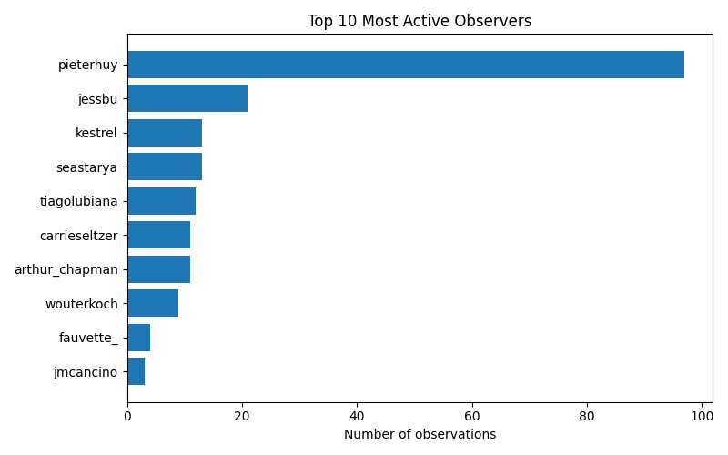

# iNaturalist Project Report: datos-vivos-gb32-bogota-2025

- Total observations: 200
- Unique species observed: 148
- Unique observers: 14

## Wikipedia & Wikidata Coverage

- Species not on Wikidata: **2**
- Missing in en: **21**

- Missing in es: **28**

- Missing in ja: **74**

- Missing in ar: **63**

- Missing in nl: **49**

- Missing in pt: **47**

- Missing in fr: **35**

| Taxon | Wikidata | GBIF | iNaturalist | EN | ES | JA | AR | NL | PT | FR |
|---|---|---|---|---|---|---|---|---|---|---|
| Aetalion reticulatum | [link](https://www.wikidata.org/entity/Q21236347) | [link](https://www.gbif.org/species/9597237) | [link](https://www.inaturalist.org/taxa/326309) | &#10007; | &#10007; | &#10007; | &#10007; | &#10007; | &#10007; | &#10007; |
| Angiospermae | [link](https://www.wikidata.org/entity/Q14832431) | — | — | &#10007; | &#10007; | &#10007; | &#10007; | &#10007; | &#10007; | &#10007; |
| Ardea alba egretta | [link](https://www.wikidata.org/entity/Q27604524) | [link](https://www.gbif.org/species/6178104) | [link](https://www.inaturalist.org/taxa/236942) | &#10007; | &#10007; | &#10007; | &#10007; | &#10007; | &#10007; | &#10007; |
| Lourteigia stoechadifolia | [link](https://www.wikidata.org/entity/Q15552927) | [link](https://www.gbif.org/species/3087497) | [link](https://www.inaturalist.org/taxa/706408) | &#10007; | &#10007; | &#10007; | &#10007; | &#10007; | &#10007; | &#10007; |
| Orthrosanthus chimboracensis | [link](https://www.wikidata.org/entity/Q15579967) | [link](https://www.gbif.org/species/2746374) | [link](https://www.inaturalist.org/taxa/148013) | &#10007; | &#10007; | &#10007; | &#10007; | &#10007; | &#10007; | &#10007; |
| Parmelioideae | [link](https://www.wikidata.org/entity/Q50410096) | — | [link](https://www.inaturalist.org/taxa/1094690) | &#10007; | &#10007; | &#10007; | &#10007; | &#10007; | &#10007; | &#10007; |
| Pleopeltis macrocarpa | [link](https://www.wikidata.org/entity/Q15322361) | [link](https://www.gbif.org/species/7290349) | [link](https://www.inaturalist.org/taxa/137239) | &#10007; | &#10007; | &#10007; | &#10007; | &#10007; | &#10007; | &#10007; |
| Rhynchospora nervosa | [link](https://www.wikidata.org/entity/Q15555289) | [link](https://www.gbif.org/species/2721307) | [link](https://www.inaturalist.org/taxa/274117) | &#10007; | &#10007; | &#10007; | &#10007; | &#10007; | &#10007; | &#10007; |
| Siphocampylus columnae | [link](https://www.wikidata.org/entity/Q15603751) | [link](https://www.gbif.org/species/3168799) | [link](https://www.inaturalist.org/taxa/534845) | &#10007; | &#10007; | &#10007; | &#10007; | &#10007; | &#10007; | &#10007; |
| Astylus aulicus | [link](https://www.wikidata.org/entity/Q108619266) | — | [link](https://www.inaturalist.org/taxa/550170) | [&#10003;](https://en.wikipedia.org/wiki/Astylus_aulicus) | &#10007; | &#10007; | &#10007; | &#10007; | &#10007; | &#10007; |
| Bassania | [link](https://www.wikidata.org/entity/Q13867855) | — | — | &#10007; | &#10007; | &#10007; | &#10007; | [&#10003;](https://nl.wikipedia.org/wiki/Bassania) | &#10007; | &#10007; |
| Calliandra trinervia | [link](https://www.wikidata.org/entity/Q15495836) | [link](https://www.gbif.org/species/2982031) | [link](https://www.inaturalist.org/taxa/206517) | &#10007; | [&#10003;](https://es.wikipedia.org/wiki/Calliandra_trinervia) | &#10007; | &#10007; | &#10007; | &#10007; | &#10007; |
| Callianthe megapotamica | [link](https://www.wikidata.org/entity/Q27680222) | [link](https://www.gbif.org/species/8220878) | [link](https://www.inaturalist.org/taxa/508221) | &#10007; | &#10007; | &#10007; | &#10007; | [&#10003;](https://nl.wikipedia.org/wiki/Callianthe_megapotamica) | &#10007; | &#10007; |
| Castilleja arvensis | [link](https://www.wikidata.org/entity/Q2371644) | [link](https://www.gbif.org/species/3170604) | [link](https://www.inaturalist.org/taxa/133740) | &#10007; | &#10007; | &#10007; | &#10007; | &#10007; | &#10007; | [&#10003;](https://fr.wikipedia.org/wiki/Castilleja_arvensis) |
| Euophryini | [link](https://www.wikidata.org/entity/Q110208) | — | — | [&#10003;](https://en.wikipedia.org/wiki/Euophryini) | &#10007; | &#10007; | &#10007; | &#10007; | &#10007; | &#10007; |
| Hypotrachyna | [link](https://www.wikidata.org/entity/Q5961440) | [link](https://www.gbif.org/species/2605434) | [link](https://www.inaturalist.org/taxa/117980) | [&#10003;](https://en.wikipedia.org/wiki/Hypotrachyna) | &#10007; | &#10007; | &#10007; | &#10007; | &#10007; | &#10007; |
| Linochilus rosmarinifolius | [link](https://www.wikidata.org/entity/Q96200630) | [link](https://www.gbif.org/species/3090609) | [link](https://www.inaturalist.org/taxa/1225047) | &#10007; | [&#10003;](https://es.wikipedia.org/wiki/Linochilus_rosmarinifolius) | &#10007; | &#10007; | &#10007; | &#10007; | &#10007; |
| Meriania nobilis | [link](https://www.wikidata.org/entity/Q17585739) | [link](https://www.gbif.org/species/5599684) | [link](https://www.inaturalist.org/taxa/133165) | &#10007; | [&#10003;](https://es.wikipedia.org/wiki/Meriania_nobilis) | &#10007; | &#10007; | &#10007; | &#10007; | &#10007; |
| Monochaetum myrtoideum | [link](https://www.wikidata.org/entity/Q15401133) | [link](https://www.gbif.org/species/3858290) | [link](https://www.inaturalist.org/taxa/538474) | &#10007; | [&#10003;](https://es.wikipedia.org/wiki/Monochaetum_myrtoideum) | &#10007; | &#10007; | &#10007; | &#10007; | &#10007; |
| Sisyrinchium micranthum | [link](https://www.wikidata.org/entity/Q7531518) | [link](https://www.gbif.org/species/5296278) | [link](https://www.inaturalist.org/taxa/284004) | [&#10003;](https://en.wikipedia.org/wiki/Sisyrinchium_micranthum) | &#10007; | &#10007; | &#10007; | &#10007; | &#10007; | &#10007; |
| Alonsoa meridionalis | [link](https://www.wikidata.org/entity/Q4062836) | [link](https://www.gbif.org/species/7331539) | [link](https://www.inaturalist.org/taxa/282861) | [&#10003;](https://en.wikipedia.org/wiki/Alonsoa_meridionalis) | &#10007; | &#10007; | [&#10003;](https://ar.wikipedia.org/wiki/%D8%A3%D9%84%D9%88%D9%86%D8%B3%D9%88%D8%A9_%D8%AC%D9%86%D9%88%D8%A8%D9%8A%D8%A9) | &#10007; | &#10007; | &#10007; |
| Bejaria resinosa | [link](https://www.wikidata.org/entity/Q15371215) | [link](https://www.gbif.org/species/4936719) | [link](https://www.inaturalist.org/taxa/531682) | &#10007; | [&#10003;](https://es.wikipedia.org/wiki/Bejaria_resinosa) | &#10007; | [&#10003;](https://ar.wikipedia.org/wiki/%D8%A8%D9%8A%D8%AC%D8%A7%D8%B1%D9%8A%D8%A9_%D8%B1%D8%A7%D8%AA%D9%8A%D9%86%D8%AC%D9%8A%D8%A9) | &#10007; | &#10007; | &#10007; |
| Brunfelsia pauciflora | [link](https://www.wikidata.org/entity/Q149804) | [link](https://www.gbif.org/species/6402571) | [link](https://www.inaturalist.org/taxa/343971) | [&#10003;](https://en.wikipedia.org/wiki/Brunfelsia_pauciflora) | [&#10003;](https://es.wikipedia.org/wiki/Brunfelsia_pauciflora) | &#10007; | &#10007; | &#10007; | &#10007; | &#10007; |
| Compsus | [link](https://www.wikidata.org/entity/Q14924383) | [link](https://www.gbif.org/species/1206526) | [link](https://www.inaturalist.org/taxa/251778) | [&#10003;](https://en.wikipedia.org/wiki/Compsus) | &#10007; | &#10007; | &#10007; | &#10007; | &#10007; | [&#10003;](https://fr.wikipedia.org/wiki/Compsus) |
| Deroceras invadens | [link](https://www.wikidata.org/entity/Q5262901) | [link](https://www.gbif.org/species/8745918) | [link](https://www.inaturalist.org/taxa/366887) | [&#10003;](https://en.wikipedia.org/wiki/Deroceras_invadens) | &#10007; | &#10007; | &#10007; | [&#10003;](https://nl.wikipedia.org/wiki/Zwervende_akkerslak) | &#10007; | &#10007; |
| Dryopteris wallichiana | [link](https://www.wikidata.org/entity/Q5309785) | [link](https://www.gbif.org/species/5275137) | [link](https://www.inaturalist.org/taxa/162123) | [&#10003;](https://en.wikipedia.org/wiki/Dryopteris_wallichiana) | [&#10003;](https://es.wikipedia.org/wiki/Dryopteris_wallichiana) | &#10007; | &#10007; | &#10007; | &#10007; | &#10007; |
| Munnozia senecionidis | [link](https://www.wikidata.org/entity/Q15567016) | [link](https://www.gbif.org/species/3099401) | [link](https://www.inaturalist.org/taxa/548066) | &#10007; | [&#10003;](https://es.wikipedia.org/wiki/Munnozia_senecionidis) | &#10007; | &#10007; | &#10007; | &#10007; | [&#10003;](https://fr.wikipedia.org/wiki/Munnozia_senecionidis) |
| Parmotrema | [link](https://www.wikidata.org/entity/Q10620680) | [link](https://www.gbif.org/species/2565599) | [link](https://www.inaturalist.org/taxa/117867) | [&#10003;](https://en.wikipedia.org/wiki/Parmotrema) | [&#10003;](https://es.wikipedia.org/wiki/Parmotrema) | &#10007; | &#10007; | &#10007; | &#10007; | &#10007; |
| Podisus | [link](https://www.wikidata.org/entity/Q3393074) | [link](https://www.gbif.org/species/2079032) | [link](https://www.inaturalist.org/taxa/142278) | [&#10003;](https://en.wikipedia.org/wiki/Podisus) | &#10007; | &#10007; | &#10007; | &#10007; | &#10007; | [&#10003;](https://fr.wikipedia.org/wiki/Podisus) |
| Sericoptera mahometaria | [link](https://www.wikidata.org/entity/Q13557799) | [link](https://www.gbif.org/species/1966088) | [link](https://www.inaturalist.org/taxa/319515) | &#10007; | [&#10003;](https://es.wikipedia.org/wiki/Sericoptera_mahometaria) | &#10007; | &#10007; | [&#10003;](https://nl.wikipedia.org/wiki/Sericoptera_mahometaria) | &#10007; | &#10007; |
| Teloschistes | [link](https://www.wikidata.org/entity/Q7697834) | [link](https://www.gbif.org/species/2609979) | [link](https://www.inaturalist.org/taxa/55554) | [&#10003;](https://en.wikipedia.org/wiki/Teloschistes) | &#10007; | &#10007; | &#10007; | [&#10003;](https://nl.wikipedia.org/wiki/Teloschistes) | &#10007; | &#10007; |
| Veronica speciosa | [link](https://www.wikidata.org/entity/Q17744711) | [link](https://www.gbif.org/species/3172028) | [link](https://www.inaturalist.org/taxa/132114) | [&#10003;](https://en.wikipedia.org/wiki/Veronica_speciosa) | &#10007; | &#10007; | &#10007; | &#10007; | &#10007; | [&#10003;](https://fr.wikipedia.org/wiki/Veronica_speciosa) |
| Alnus acuminata | [link](https://www.wikidata.org/entity/Q3926843) | [link](https://www.gbif.org/species/2876131) | [link](https://www.inaturalist.org/taxa/189148) | [&#10003;](https://en.wikipedia.org/wiki/Alnus_acuminata) | [&#10003;](https://es.wikipedia.org/wiki/Alnus_acuminata) | &#10007; | &#10007; | &#10007; | [&#10003;](https://pt.wikipedia.org/wiki/Alnus_acuminata) | &#10007; |
| Bucquetia | [link](https://www.wikidata.org/entity/Q1339089) | [link](https://www.gbif.org/species/3861405) | [link](https://www.inaturalist.org/taxa/184496) | [&#10003;](https://en.wikipedia.org/wiki/Bucquetia) | [&#10003;](https://es.wikipedia.org/wiki/Bucquetia) | &#10007; | &#10007; | &#10007; | [&#10003;](https://pt.wikipedia.org/wiki/Bucquetia) | &#10007; |
| Hohenbuehelia | [link](https://www.wikidata.org/entity/Q1615737) | [link](https://www.gbif.org/species/2526255) | [link](https://www.inaturalist.org/taxa/154753) | [&#10003;](https://en.wikipedia.org/wiki/Hohenbuehelia) | &#10007; | &#10007; | &#10007; | [&#10003;](https://nl.wikipedia.org/wiki/Hohenbuehelia) | &#10007; | [&#10003;](https://fr.wikipedia.org/wiki/Hohenbuehelia) |
| Limacus | [link](https://www.wikidata.org/entity/Q1599819) | [link](https://www.gbif.org/species/2295441) | [link](https://www.inaturalist.org/taxa/322420) | [&#10003;](https://en.wikipedia.org/wiki/Limacus) | &#10007; | &#10007; | &#10007; | [&#10003;](https://nl.wikipedia.org/wiki/Limacus) | &#10007; | [&#10003;](https://fr.wikipedia.org/wiki/Limacus) |
| Munnozia | [link](https://www.wikidata.org/entity/Q6936806) | [link](https://www.gbif.org/species/3099326) | [link](https://www.inaturalist.org/taxa/132483) | [&#10003;](https://en.wikipedia.org/wiki/Munnozia) | [&#10003;](https://es.wikipedia.org/wiki/Munnozia) | &#10007; | &#10007; | &#10007; | [&#10003;](https://pt.wikipedia.org/wiki/Munnozia) | &#10007; |
| Nothoscordum gracile | [link](https://www.wikidata.org/entity/Q15524066) | [link](https://www.gbif.org/species/2855519) | [link](https://www.inaturalist.org/taxa/78233) | [&#10003;](https://en.wikipedia.org/wiki/Nothoscordum_gracile) | &#10007; | [&#10003;](https://ja.wikipedia.org/wiki/%E3%83%8F%E3%82%BF%E3%82%B1%E3%83%8B%E3%83%A9) | &#10007; | &#10007; | [&#10003;](https://pt.wikipedia.org/wiki/Nothoscordum_gracile) | &#10007; |
| Atlapetes pallidinucha | [link](https://www.wikidata.org/entity/Q204171) | [link](https://www.gbif.org/species/2491445) | [link](https://www.inaturalist.org/taxa/10332) | [&#10003;](https://en.wikipedia.org/wiki/Pale-naped_brushfinch) | [&#10003;](https://es.wikipedia.org/wiki/Atlapetes_pallidinucha) | &#10007; | &#10007; | [&#10003;](https://nl.wikipedia.org/wiki/Bleeknekstruikgors) | [&#10003;](https://pt.wikipedia.org/wiki/Atlapetes_pallidinucha) | &#10007; |
| Browallia americana | [link](https://www.wikidata.org/entity/Q991007) | [link](https://www.gbif.org/species/2932934) | [link](https://www.inaturalist.org/taxa/159483) | [&#10003;](https://en.wikipedia.org/wiki/Browallia_americana) | [&#10003;](https://es.wikipedia.org/wiki/Browallia_americana) | &#10007; | [&#10003;](https://ar.wikipedia.org/wiki/%D8%A8%D8%B1%D9%88%D8%A7%D9%84%D9%8A%D8%A7_%D8%A3%D9%85%D8%B1%D9%8A%D9%83%D9%8A%D8%A9) | &#10007; | &#10007; | [&#10003;](https://fr.wikipedia.org/wiki/Browallia_americana) |
| Cicadellinae | [link](https://www.wikidata.org/entity/Q838465) | — | [link](https://www.inaturalist.org/taxa/244341) | [&#10003;](https://en.wikipedia.org/wiki/Cicadellinae) | [&#10003;](https://es.wikipedia.org/wiki/Cicadellinae) | &#10007; | &#10007; | &#10007; | [&#10003;](https://pt.wikipedia.org/wiki/Cicadel%C3%ADneos) | [&#10003;](https://fr.wikipedia.org/wiki/Cicadellinae) |
| Crassiclitellata | [link](https://www.wikidata.org/entity/Q5154131) | [link](https://www.gbif.org/species/5958860) | [link](https://www.inaturalist.org/taxa/152943) | [&#10003;](https://en.wikipedia.org/wiki/Crassiclitellata) | [&#10003;](https://es.wikipedia.org/wiki/Crassiclitellata) | &#10007; | &#10007; | [&#10003;](https://nl.wikipedia.org/wiki/Crassiclitellata) | &#10007; | [&#10003;](https://fr.wikipedia.org/wiki/Crassiclitellata) |
| Eucalyptus cinerea | [link](https://www.wikidata.org/entity/Q763431) | [link](https://www.gbif.org/species/3176723) | [link](https://www.inaturalist.org/taxa/162748) | [&#10003;](https://en.wikipedia.org/wiki/Eucalyptus_cinerea) | [&#10003;](https://es.wikipedia.org/wiki/Eucalyptus_cinerea) | &#10007; | &#10007; | &#10007; | [&#10003;](https://pt.wikipedia.org/wiki/Eucalyptus_cinerea) | [&#10003;](https://fr.wikipedia.org/wiki/Eucalyptus_cendr%C3%A9) |
| Kniphofia uvaria | [link](https://www.wikidata.org/entity/Q159203) | [link](https://www.gbif.org/species/5305033) | [link](https://www.inaturalist.org/taxa/56035) | [&#10003;](https://en.wikipedia.org/wiki/Kniphofia_uvaria) | [&#10003;](https://es.wikipedia.org/wiki/Kniphofia_uvaria) | &#10007; | [&#10003;](https://ar.wikipedia.org/wiki/%D9%83%D9%86%D9%8A%D9%81%D9%88%D9%81%D9%8A%D8%A7_%D8%B9%D9%86%D8%A8%D9%8A%D8%A9) | &#10007; | &#10007; | [&#10003;](https://fr.wikipedia.org/wiki/Kniphofia_uvaria) |
| Meriania | [link](https://www.wikidata.org/entity/Q5428678) | [link](https://www.gbif.org/species/3231526) | [link](https://www.inaturalist.org/taxa/131867) | [&#10003;](https://en.wikipedia.org/wiki/Meriania) | [&#10003;](https://es.wikipedia.org/wiki/Meriania) | &#10007; | &#10007; | &#10007; | [&#10003;](https://pt.wikipedia.org/wiki/Meriania) | [&#10003;](https://fr.wikipedia.org/wiki/Meriania) |
| Paepalanthus | [link](https://www.wikidata.org/entity/Q2539207) | [link](https://www.gbif.org/species/5286654) | [link](https://www.inaturalist.org/taxa/82151) | [&#10003;](https://en.wikipedia.org/wiki/Paepalanthus) | [&#10003;](https://es.wikipedia.org/wiki/Paepalanthus) | &#10007; | &#10007; | &#10007; | [&#10003;](https://pt.wikipedia.org/wiki/Paepalanthus) | [&#10003;](https://fr.wikipedia.org/wiki/Paepalanthus) |
| Turdus fuscater | [link](https://www.wikidata.org/entity/Q1067396) | [link](https://www.gbif.org/species/2490717) | [link](https://www.inaturalist.org/taxa/12781) | [&#10003;](https://en.wikipedia.org/wiki/Great_thrush) | [&#10003;](https://es.wikipedia.org/wiki/Turdus_fuscater) | &#10007; | &#10007; | [&#10003;](https://nl.wikipedia.org/wiki/Reuzenlijster) | &#10007; | [&#10003;](https://fr.wikipedia.org/wiki/Merle_g%C3%A9ant) |
| Vaccinioideae | [link](https://www.wikidata.org/entity/Q9092220) | — | [link](https://www.inaturalist.org/taxa/634914) | [&#10003;](https://en.wikipedia.org/wiki/Vaccinioideae) | [&#10003;](https://es.wikipedia.org/wiki/Vaccinioideae) | &#10007; | [&#10003;](https://ar.wikipedia.org/wiki/%D8%B9%D9%86%D8%A8%D9%8A%D8%A7%D9%88%D8%A7%D8%AA) | &#10007; | &#10007; | [&#10003;](https://fr.wikipedia.org/wiki/Vaccinioideae) |
| Baccharis | [link](https://www.wikidata.org/entity/Q133834) | [link](https://www.gbif.org/species/3129135) | [link](https://www.inaturalist.org/taxa/497097) | [&#10003;](https://en.wikipedia.org/wiki/Baccharis) | [&#10003;](https://es.wikipedia.org/wiki/Baccharis) | &#10007; | [&#10003;](https://ar.wikipedia.org/wiki/%D8%A8%D9%83%D8%A7%D8%B1%D9%8A%D8%B3) | &#10007; | [&#10003;](https://pt.wikipedia.org/wiki/Baccharis) | [&#10003;](https://fr.wikipedia.org/wiki/Baccharis) |
| Calliandra | [link](https://www.wikidata.org/entity/Q164454) | [link](https://www.gbif.org/species/2981784) | [link](https://www.inaturalist.org/taxa/47442) | [&#10003;](https://en.wikipedia.org/wiki/Calliandra) | [&#10003;](https://es.wikipedia.org/wiki/Calliandra) | [&#10003;](https://ja.wikipedia.org/wiki/%E3%83%99%E3%83%8B%E3%82%B4%E3%82%A6%E3%82%AB%E3%83%B3%E5%B1%9E) | &#10007; | &#10007; | [&#10003;](https://pt.wikipedia.org/wiki/Calliandra) | [&#10003;](https://fr.wikipedia.org/wiki/Calliandra) |
| Cichorieae | [link](https://www.wikidata.org/entity/Q134662) | — | [link](https://www.inaturalist.org/taxa/359450) | [&#10003;](https://en.wikipedia.org/wiki/Cichorieae) | [&#10003;](https://es.wikipedia.org/wiki/Cichorieae) | &#10007; | [&#10003;](https://ar.wikipedia.org/wiki/%D9%87%D9%86%D8%AF%D8%A8%D8%A7%D9%88%D9%8A%D8%A9) | &#10007; | [&#10003;](https://pt.wikipedia.org/wiki/Cichorieae) | [&#10003;](https://fr.wikipedia.org/wiki/Cichorieae) |
| Colibri | [link](https://www.wikidata.org/entity/Q221209) | [link](https://www.gbif.org/species/5228473) | [link](https://www.inaturalist.org/taxa/6071) | [&#10003;](https://en.wikipedia.org/wiki/Violetear) | [&#10003;](https://es.wikipedia.org/wiki/Colibri) | &#10007; | &#10007; | [&#10003;](https://nl.wikipedia.org/wiki/Colibri_(geslacht)) | [&#10003;](https://pt.wikipedia.org/wiki/Colibri_(g%C3%A9nero)) | [&#10003;](https://fr.wikipedia.org/wiki/Colibri_(genre)) |
| Colibri coruscans | [link](https://www.wikidata.org/entity/Q929489) | [link](https://www.gbif.org/species/5228474) | [link](https://www.inaturalist.org/taxa/6072) | [&#10003;](https://en.wikipedia.org/wiki/Sparkling_violetear) | [&#10003;](https://es.wikipedia.org/wiki/Colibri_coruscans) | &#10007; | &#10007; | [&#10003;](https://nl.wikipedia.org/wiki/Goulds_violetoorkolibrie) | [&#10003;](https://pt.wikipedia.org/wiki/Beija-flor-violeta) | [&#10003;](https://fr.wikipedia.org/wiki/Colibri_d%27Ana%C3%AFs) |
| Contopus | [link](https://www.wikidata.org/entity/Q868932) | [link](https://www.gbif.org/species/2483729) | [link](https://www.inaturalist.org/taxa/16074) | [&#10003;](https://en.wikipedia.org/wiki/Pewee) | [&#10003;](https://es.wikipedia.org/wiki/Contopus) | &#10007; | [&#10003;](https://ar.wikipedia.org/wiki/%D8%A8%D9%8A%D9%88%D9%8A_(%D8%B7%D8%A7%D8%A6%D8%B1)) | [&#10003;](https://nl.wikipedia.org/wiki/Contopus) | &#10007; | [&#10003;](https://fr.wikipedia.org/wiki/Contopus) |
| Cyclosa | [link](https://www.wikidata.org/entity/Q1303937) | [link](https://www.gbif.org/species/2158126) | [link](https://www.inaturalist.org/taxa/127360) | [&#10003;](https://en.wikipedia.org/wiki/Cyclosa) | [&#10003;](https://es.wikipedia.org/wiki/Cyclosa) | [&#10003;](https://ja.wikipedia.org/wiki/%E3%82%B4%E3%83%9F%E3%82%B0%E3%83%A2%E5%B1%9E) | &#10007; | [&#10003;](https://nl.wikipedia.org/wiki/Cyclosa) | &#10007; | [&#10003;](https://fr.wikipedia.org/wiki/Cyclosa) |
| Dimorphotheca | [link](https://www.wikidata.org/entity/Q2698290) | [link](https://www.gbif.org/species/3140763) | [link](https://www.inaturalist.org/taxa/72095) | [&#10003;](https://en.wikipedia.org/wiki/Dimorphotheca) | [&#10003;](https://es.wikipedia.org/wiki/Dimorphotheca) | [&#10003;](https://ja.wikipedia.org/wiki/%E3%82%A2%E3%83%95%E3%83%AA%E3%82%AB%E3%82%AD%E3%83%B3%E3%82%BB%E3%83%B3%E3%82%AB%E5%B1%9E) | &#10007; | &#10007; | [&#10003;](https://pt.wikipedia.org/wiki/Dimorphotheca) | [&#10003;](https://fr.wikipedia.org/wiki/Dimorphotheca) |
| Ensifera ensifera | [link](https://www.wikidata.org/entity/Q385548) | [link](https://www.gbif.org/species/2476884) | [link](https://www.inaturalist.org/taxa/6458) | [&#10003;](https://en.wikipedia.org/wiki/Sword-billed_hummingbird) | [&#10003;](https://es.wikipedia.org/wiki/Ensifera_ensifera) | &#10007; | &#10007; | [&#10003;](https://nl.wikipedia.org/wiki/Zwaardkolibrie) | [&#10003;](https://pt.wikipedia.org/wiki/Beija-flor-bico-de-espada) | [&#10003;](https://fr.wikipedia.org/wiki/Colibri_porte-%C3%A9p%C3%A9e) |
| Espeletia | [link](https://www.wikidata.org/entity/Q290488) | [link](https://www.gbif.org/species/3105048) | [link](https://www.inaturalist.org/taxa/336631) | [&#10003;](https://en.wikipedia.org/wiki/Espeletia) | [&#10003;](https://es.wikipedia.org/wiki/Espeletia) | &#10007; | &#10007; | [&#10003;](https://nl.wikipedia.org/wiki/Espeletia) | [&#10003;](https://pt.wikipedia.org/wiki/Espeletia) | [&#10003;](https://fr.wikipedia.org/wiki/Espeletia) |
| Lupinus mutabilis | [link](https://www.wikidata.org/entity/Q490224) | [link](https://www.gbif.org/species/2964711) | [link](https://www.inaturalist.org/taxa/447603) | [&#10003;](https://en.wikipedia.org/wiki/Lupinus_mutabilis) | [&#10003;](https://es.wikipedia.org/wiki/Lupinus_mutabilis) | [&#10003;](https://ja.wikipedia.org/wiki/%E3%82%B6%E3%83%83%E3%82%B7%E3%83%A7%E3%82%AF%E3%83%8E%E3%83%9C%E3%83%AA%E3%83%95%E3%82%B8) | [&#10003;](https://ar.wikipedia.org/wiki/%D8%AA%D8%B1%D9%85%D8%B3_%D8%B7%D9%81%D8%B1%D9%8A) | &#10007; | &#10007; | [&#10003;](https://fr.wikipedia.org/wiki/Lupinus_mutabilis) |
| Marchantia | [link](https://www.wikidata.org/entity/Q1152975) | [link](https://www.gbif.org/species/2688569) | [link](https://www.inaturalist.org/taxa/403724) | [&#10003;](https://en.wikipedia.org/wiki/Marchantia) | [&#10003;](https://es.wikipedia.org/wiki/Marchantia) | &#10007; | [&#10003;](https://ar.wikipedia.org/wiki/%D8%AD%D8%B4%D9%8A%D8%B4%D8%A9_%D8%A7%D9%84%D9%83%D8%A8%D8%AF) | [&#10003;](https://nl.wikipedia.org/wiki/Marchantia) | [&#10003;](https://pt.wikipedia.org/wiki/Marchantia) | &#10007; |
| Podilymbus podiceps | [link](https://www.wikidata.org/entity/Q579718) | [link](https://www.gbif.org/species/2482077) | [link](https://www.inaturalist.org/taxa/4246) | [&#10003;](https://en.wikipedia.org/wiki/Pied-billed_grebe) | [&#10003;](https://es.wikipedia.org/wiki/Podilymbus_podiceps) | &#10007; | &#10007; | [&#10003;](https://nl.wikipedia.org/wiki/Dikbekfuut) | [&#10003;](https://pt.wikipedia.org/wiki/Mergulh%C3%A3o-ca%C3%A7ador) | [&#10003;](https://fr.wikipedia.org/wiki/Gr%C3%A8be_%C3%A0_bec_bigarr%C3%A9) |
| Stromanthe | [link](https://www.wikidata.org/entity/Q1313285) | [link](https://www.gbif.org/species/2761248) | [link](https://www.inaturalist.org/taxa/180080) | [&#10003;](https://en.wikipedia.org/wiki/Stromanthe) | [&#10003;](https://es.wikipedia.org/wiki/Stromanthe) | [&#10003;](https://ja.wikipedia.org/wiki/%E3%82%B9%E3%83%88%E3%83%AD%E3%83%9E%E3%83%B3%E3%83%86) | &#10007; | &#10007; | [&#10003;](https://pt.wikipedia.org/wiki/Stromanthe) | [&#10003;](https://fr.wikipedia.org/wiki/Stromanthe) |
| Tegenaria domestica | [link](https://www.wikidata.org/entity/Q1137615) | [link](https://www.gbif.org/species/2139961) | [link](https://www.inaturalist.org/taxa/153507) | [&#10003;](https://en.wikipedia.org/wiki/Tegenaria_domestica) | [&#10003;](https://es.wikipedia.org/wiki/Tegenaria_domestica) | &#10007; | [&#10003;](https://ar.wikipedia.org/wiki/%D9%81%D8%AF%D8%B3_%D8%A7%D9%84%D9%85%D8%B3%D8%A7%D9%83%D9%86) | [&#10003;](https://nl.wikipedia.org/wiki/Grijze_huisspin) | &#10007; | [&#10003;](https://fr.wikipedia.org/wiki/Tegenaria_domestica) |
| Troglodytes musculus | [link](https://www.wikidata.org/entity/Q10385039) | [link](https://www.gbif.org/species/8346347) | [link](https://www.inaturalist.org/taxa/1578442) | [&#10003;](https://en.wikipedia.org/wiki/Southern_house_wren) | [&#10003;](https://es.wikipedia.org/wiki/Troglodytes_musculus) | &#10007; | &#10007; | [&#10003;](https://nl.wikipedia.org/wiki/Zuidelijke_huiswinterkoning) | [&#10003;](https://pt.wikipedia.org/wiki/Troglodytes_musculus) | [&#10003;](https://fr.wikipedia.org/wiki/Troglodyte_austral) |
| Ulex | [link](https://www.wikidata.org/entity/Q393278) | [link](https://www.gbif.org/species/2951953) | [link](https://www.inaturalist.org/taxa/51750) | [&#10003;](https://en.wikipedia.org/wiki/Ulex) | [&#10003;](https://es.wikipedia.org/wiki/Ulex) | &#10007; | [&#10003;](https://ar.wikipedia.org/wiki/%D8%AC%D9%88%D9%84%D9%82) | &#10007; | [&#10003;](https://pt.wikipedia.org/wiki/Tojo) | [&#10003;](https://fr.wikipedia.org/wiki/Ulex) |
| Usnea | [link](https://www.wikidata.org/entity/Q121799) | [link](https://www.gbif.org/species/2605982) | [link](https://www.inaturalist.org/taxa/505022) | [&#10003;](https://en.wikipedia.org/wiki/Usnea) | [&#10003;](https://es.wikipedia.org/wiki/Usnea) | [&#10003;](https://ja.wikipedia.org/wiki/%E3%82%B5%E3%83%AB%E3%82%AA%E3%82%AC%E3%82%BB) | &#10007; | [&#10003;](https://nl.wikipedia.org/wiki/Baardmos) | &#10007; | [&#10003;](https://fr.wikipedia.org/wiki/Usn%C3%A9e) |
| Zenaida auriculata | [link](https://www.wikidata.org/entity/Q1006452) | [link](https://www.gbif.org/species/2495358) | [link](https://www.inaturalist.org/taxa/3439) | [&#10003;](https://en.wikipedia.org/wiki/Eared_dove) | [&#10003;](https://es.wikipedia.org/wiki/Zenaida_auriculata) | &#10007; | &#10007; | [&#10003;](https://nl.wikipedia.org/wiki/Geoorde_treurduif) | [&#10003;](https://pt.wikipedia.org/wiki/Avoante) | [&#10003;](https://fr.wikipedia.org/wiki/Tourterelle_oreillarde) |
| Cardellina canadensis | [link](https://www.wikidata.org/entity/Q27076004) | [link](https://www.gbif.org/species/6091946) | [link](https://www.inaturalist.org/taxa/145275) | [&#10003;](https://en.wikipedia.org/wiki/Canada_warbler) | [&#10003;](https://es.wikipedia.org/wiki/Cardellina_canadensis) | &#10007; | [&#10003;](https://ar.wikipedia.org/wiki/%D9%87%D8%A7%D8%B2%D8%AC%D8%A9_%D9%83%D9%86%D8%AF%D8%A7) | [&#10003;](https://nl.wikipedia.org/wiki/Canadese_zanger) | [&#10003;](https://pt.wikipedia.org/wiki/Mariquita-do-canad%C3%A1) | [&#10003;](https://fr.wikipedia.org/wiki/Paruline_du_Canada) |
| Cenchrus clandestinus | [link](https://www.wikidata.org/entity/Q50840658) | [link](https://www.gbif.org/species/5828201) | [link](https://www.inaturalist.org/taxa/60298) | [&#10003;](https://en.wikipedia.org/wiki/Cenchrus_clandestinus) | [&#10003;](https://es.wikipedia.org/wiki/Cenchrus_clandestinus) | &#10007; | [&#10003;](https://ar.wikipedia.org/wiki/%D8%AB%D9%8A%D9%88%D9%85_%D8%AE%D9%81%D9%8A) | [&#10003;](https://nl.wikipedia.org/wiki/Kikuyu-gras) | [&#10003;](https://pt.wikipedia.org/wiki/Pennisetum_clandestinum) | [&#10003;](https://fr.wikipedia.org/wiki/Cenchrus_clandestinus) |
| Contopus virens | [link](https://www.wikidata.org/entity/Q606809) | [link](https://www.gbif.org/species/5229734) | [link](https://www.inaturalist.org/taxa/16100) | [&#10003;](https://en.wikipedia.org/wiki/Eastern_wood_pewee) | [&#10003;](https://es.wikipedia.org/wiki/Contopus_virens) | &#10007; | [&#10003;](https://ar.wikipedia.org/wiki/%D8%A8%D9%8A%D9%88%D9%8A_%D8%A3%D8%AE%D8%B6%D8%B1) | [&#10003;](https://nl.wikipedia.org/wiki/Oostelijke_bospiewie) | [&#10003;](https://pt.wikipedia.org/wiki/Piui-verdadeiro) | [&#10003;](https://fr.wikipedia.org/wiki/Pioui_de_l%27Est) |
| Diglossa | [link](https://www.wikidata.org/entity/Q905352) | [link](https://www.gbif.org/species/2488798) | [link](https://www.inaturalist.org/taxa/9830) | [&#10003;](https://en.wikipedia.org/wiki/Flowerpiercer) | [&#10003;](https://es.wikipedia.org/wiki/Diglossa) | &#10007; | [&#10003;](https://ar.wikipedia.org/wiki/%D8%AF%D8%BA%D9%84%D9%88%D8%B3) | [&#10003;](https://nl.wikipedia.org/wiki/Diglossa) | [&#10003;](https://pt.wikipedia.org/wiki/Diglossa) | [&#10003;](https://fr.wikipedia.org/wiki/Diglossa) |
| Diphasiastrum | [link](https://www.wikidata.org/entity/Q144716) | [link](https://www.gbif.org/species/6385542) | [link](https://www.inaturalist.org/taxa/82392) | [&#10003;](https://en.wikipedia.org/wiki/Diphasiastrum) | [&#10003;](https://es.wikipedia.org/wiki/Diphasiastrum) | [&#10003;](https://ja.wikipedia.org/wiki/%E3%82%A2%E3%82%B9%E3%83%92%E3%82%AB%E3%82%BA%E3%83%A9%E5%B1%9E) | &#10007; | [&#10003;](https://nl.wikipedia.org/wiki/Diphasiastrum) | [&#10003;](https://pt.wikipedia.org/wiki/Diphasiastrum) | [&#10003;](https://fr.wikipedia.org/wiki/Diphasiastrum) |
| Dryopteris | [link](https://www.wikidata.org/entity/Q1335106) | [link](https://www.gbif.org/species/2651126) | [link](https://www.inaturalist.org/taxa/52672) | [&#10003;](https://en.wikipedia.org/wiki/Dryopteris) | [&#10003;](https://es.wikipedia.org/wiki/Dryopteris) | &#10007; | [&#10003;](https://ar.wikipedia.org/wiki/%D8%AE%D9%86%D8%B4%D8%A7%D8%B1_(%D8%AC%D9%86%D8%B3)) | [&#10003;](https://nl.wikipedia.org/wiki/Niervaren) | [&#10003;](https://pt.wikipedia.org/wiki/Dryopteris) | [&#10003;](https://fr.wikipedia.org/wiki/Dryopteris) |
| Epidendrum | [link](https://www.wikidata.org/entity/Q133728) | [link](https://www.gbif.org/species/5297341) | [link](https://www.inaturalist.org/taxa/54884) | [&#10003;](https://en.wikipedia.org/wiki/Epidendrum) | [&#10003;](https://es.wikipedia.org/wiki/Epidendrum) | [&#10003;](https://ja.wikipedia.org/wiki/%E3%82%A8%E3%83%94%E3%83%87%E3%83%B3%E3%83%89%E3%83%A9%E3%83%A0%E5%B1%9E) | [&#10003;](https://ar.wikipedia.org/wiki/%D9%85%D8%B9%D8%AA%D9%84%D9%8A_%D8%A7%D9%84%D8%B4%D8%AC%D8%B1) | &#10007; | [&#10003;](https://pt.wikipedia.org/wiki/Epidendrum) | [&#10003;](https://fr.wikipedia.org/wiki/Epidendrum) |
| Holcus lanatus | [link](https://www.wikidata.org/entity/Q158110) | [link](https://www.gbif.org/species/2706164) | [link](https://www.inaturalist.org/taxa/52793) | [&#10003;](https://en.wikipedia.org/wiki/Holcus_lanatus) | [&#10003;](https://es.wikipedia.org/wiki/Holcus_lanatus) | [&#10003;](https://ja.wikipedia.org/wiki/%E3%82%B7%E3%83%A9%E3%82%B2%E3%82%AC%E3%83%A4) | &#10007; | [&#10003;](https://nl.wikipedia.org/wiki/Gestreepte_witbol) | [&#10003;](https://pt.wikipedia.org/wiki/Holcus_lanatus) | [&#10003;](https://fr.wikipedia.org/wiki/Houlque_laineuse) |
| Leucanthemum vulgare | [link](https://www.wikidata.org/entity/Q27164) | [link](https://www.gbif.org/species/5400982) | [link](https://www.inaturalist.org/taxa/56057) | [&#10003;](https://en.wikipedia.org/wiki/Leucanthemum_vulgare) | [&#10003;](https://es.wikipedia.org/wiki/Leucanthemum_vulgare) | &#10007; | [&#10003;](https://ar.wikipedia.org/wiki/%D8%A3%D9%82%D8%AD%D9%88%D8%A7%D9%86_%D8%A7%D9%84%D9%85%D8%B1%D9%88%D8%AC_%D8%A7%D9%84%D8%B4%D8%A7%D8%A6%D8%B9) | [&#10003;](https://nl.wikipedia.org/wiki/Gewone_margriet) | [&#10003;](https://pt.wikipedia.org/wiki/Leucanthemum_vulgare) | [&#10003;](https://fr.wikipedia.org/wiki/Marguerite_commune) |
| Miridae | [link](https://www.wikidata.org/entity/Q864705) | [link](https://www.gbif.org/species/4319) | [link](https://www.inaturalist.org/taxa/53505) | [&#10003;](https://en.wikipedia.org/wiki/Miridae) | [&#10003;](https://es.wikipedia.org/wiki/Miridae) | &#10007; | [&#10003;](https://ar.wikipedia.org/wiki/%D8%B6%D9%85%D8%AC%D9%8A%D8%A7%D8%AA) | [&#10003;](https://nl.wikipedia.org/wiki/Blindwantsen) | [&#10003;](https://pt.wikipedia.org/wiki/Mir%C3%ADdeos) | [&#10003;](https://fr.wikipedia.org/wiki/Miridae) |
| Passiflora | [link](https://www.wikidata.org/entity/Q161185) | [link](https://www.gbif.org/species/2874172) | [link](https://www.inaturalist.org/taxa/502611) | [&#10003;](https://en.wikipedia.org/wiki/Passiflora) | [&#10003;](https://es.wikipedia.org/wiki/Passiflora) | &#10007; | [&#10003;](https://ar.wikipedia.org/wiki/%D8%B2%D9%87%D8%B1%D8%A9_%D8%A7%D9%84%D8%A2%D9%84%D8%A7%D9%85) | [&#10003;](https://nl.wikipedia.org/wiki/Passiebloem) | [&#10003;](https://pt.wikipedia.org/wiki/Passiflora) | [&#10003;](https://fr.wikipedia.org/wiki/Passiflore) |
| Persicaria capitata | [link](https://www.wikidata.org/entity/Q144262) | [link](https://www.gbif.org/species/2889304) | [link](https://www.inaturalist.org/taxa/78451) | [&#10003;](https://en.wikipedia.org/wiki/Persicaria_capitata) | [&#10003;](https://es.wikipedia.org/wiki/Polygonum_capitatum) | [&#10003;](https://ja.wikipedia.org/wiki/%E3%83%92%E3%83%A1%E3%83%84%E3%83%AB%E3%82%BD%E3%83%90) | &#10007; | [&#10003;](https://nl.wikipedia.org/wiki/Kogelduizendknoop) | [&#10003;](https://pt.wikipedia.org/wiki/Polygonum_capitatum) | [&#10003;](https://fr.wikipedia.org/wiki/Persicaria_capitata) |
| Piranga rubra | [link](https://www.wikidata.org/entity/Q1078246) | [link](https://www.gbif.org/species/2488485) | [link](https://www.inaturalist.org/taxa/9915) | [&#10003;](https://en.wikipedia.org/wiki/Summer_tanager) | [&#10003;](https://es.wikipedia.org/wiki/Piranga_rubra) | &#10007; | [&#10003;](https://ar.wikipedia.org/wiki/%D8%AA%D9%86%D8%A7%D8%AC%D8%B1_%D8%A7%D9%84%D8%B5%D9%8A%D9%81) | [&#10003;](https://nl.wikipedia.org/wiki/Zomertangare) | [&#10003;](https://pt.wikipedia.org/wiki/Sanha%C3%A7u-vermelho) | [&#10003;](https://fr.wikipedia.org/wiki/Piranga_vermillon) |
| Polypodiopsida | [link](https://www.wikidata.org/entity/Q373615) | [link](https://www.gbif.org/species/7228684) | — | [&#10003;](https://en.wikipedia.org/wiki/Polypodiopsida) | &#10007; | [&#10003;](https://ja.wikipedia.org/wiki/%E5%A4%A7%E8%91%89%E3%82%B7%E3%83%80%E6%A4%8D%E7%89%A9) | [&#10003;](https://ar.wikipedia.org/wiki/%D8%B3%D8%B1%D8%AE%D8%B3%D8%A7%D9%86%D9%8A%D8%A9) | [&#10003;](https://nl.wikipedia.org/wiki/Polypodiopsida) | [&#10003;](https://pt.wikipedia.org/wiki/Polypodiopsida) | [&#10003;](https://fr.wikipedia.org/wiki/Filicopsida) |
| Pteris | [link](https://www.wikidata.org/entity/Q2451124) | [link](https://www.gbif.org/species/2651676) | [link](https://www.inaturalist.org/taxa/51827) | [&#10003;](https://en.wikipedia.org/wiki/Pteris) | [&#10003;](https://es.wikipedia.org/wiki/Pteris) | [&#10003;](https://ja.wikipedia.org/wiki/%E3%82%A4%E3%83%8E%E3%83%A2%E3%83%88%E3%82%BD%E3%82%A6%E5%B1%9E) | [&#10003;](https://ar.wikipedia.org/wiki/%D8%AF%D9%8A%D8%B4%D8%A7%D8%B1) | [&#10003;](https://nl.wikipedia.org/wiki/Pteris) | &#10007; | [&#10003;](https://fr.wikipedia.org/wiki/Pteris) |
| Raphanus | [link](https://www.wikidata.org/entity/Q165507) | [link](https://www.gbif.org/species/3040962) | [link](https://www.inaturalist.org/taxa/55412) | [&#10003;](https://en.wikipedia.org/wiki/Raphanus) | [&#10003;](https://es.wikipedia.org/wiki/Raphanus) | [&#10003;](https://ja.wikipedia.org/wiki/%E3%83%80%E3%82%A4%E3%82%B3%E3%83%B3%E5%B1%9E) | [&#10003;](https://ar.wikipedia.org/wiki/%D9%81%D8%AC%D9%84_(%D8%AC%D9%86%D8%B3)) | &#10007; | [&#10003;](https://pt.wikipedia.org/wiki/Raphanus) | [&#10003;](https://fr.wikipedia.org/wiki/Raphanus) |
| Sagina | [link](https://www.wikidata.org/entity/Q163066) | [link](https://www.gbif.org/species/3085387) | [link](https://www.inaturalist.org/taxa/55677) | [&#10003;](https://en.wikipedia.org/wiki/Sagina) | [&#10003;](https://es.wikipedia.org/wiki/Sagina) | &#10007; | [&#10003;](https://ar.wikipedia.org/wiki/%D9%85%D8%B3%D9%85%D9%86_(%D9%86%D8%A8%D8%A7%D8%AA)) | [&#10003;](https://nl.wikipedia.org/wiki/Vetmuur) | [&#10003;](https://pt.wikipedia.org/wiki/Sagina) | [&#10003;](https://fr.wikipedia.org/wiki/Sagina) |
| Spinus spinescens | [link](https://www.wikidata.org/entity/Q27075880) | [link](https://www.gbif.org/species/7341772) | [link](https://www.inaturalist.org/taxa/145311) | [&#10003;](https://en.wikipedia.org/wiki/Andean_siskin) | [&#10003;](https://es.wikipedia.org/wiki/Spinus_spinescens) | &#10007; | [&#10003;](https://ar.wikipedia.org/wiki/%D8%AD%D8%B3%D9%88%D9%86_%D8%A3%D9%86%D8%AF%D9%8A%D8%B2%D9%8A) | [&#10003;](https://nl.wikipedia.org/wiki/Andessijs) | [&#10003;](https://pt.wikipedia.org/wiki/Pintassilgo-dos-andes) | [&#10003;](https://fr.wikipedia.org/wiki/Chardonneret_des_Andes) |
| Tegenaria | [link](https://www.wikidata.org/entity/Q1669019) | [link](https://www.gbif.org/species/2139925) | [link](https://www.inaturalist.org/taxa/53666) | [&#10003;](https://en.wikipedia.org/wiki/Tegenaria) | [&#10003;](https://es.wikipedia.org/wiki/Tegenaria) | &#10007; | [&#10003;](https://ar.wikipedia.org/wiki/%D9%81%D8%AF%D8%B3) | [&#10003;](https://nl.wikipedia.org/wiki/Tegenaria) | [&#10003;](https://pt.wikipedia.org/wiki/Tegenaria) | [&#10003;](https://fr.wikipedia.org/wiki/Tegenaria) |
| Tillandsia | [link](https://www.wikidata.org/entity/Q157270) | [link](https://www.gbif.org/species/2694484) | [link](https://www.inaturalist.org/taxa/49571) | [&#10003;](https://en.wikipedia.org/wiki/Tillandsia) | [&#10003;](https://es.wikipedia.org/wiki/Tillandsia) | [&#10003;](https://ja.wikipedia.org/wiki/%E3%83%8F%E3%83%8A%E3%82%A2%E3%83%8A%E3%83%8A%E3%82%B9%E5%B1%9E) | &#10007; | [&#10003;](https://nl.wikipedia.org/wiki/Tillandsia) | [&#10003;](https://pt.wikipedia.org/wiki/Tillandsia) | [&#10003;](https://fr.wikipedia.org/wiki/Tillandsia) |
| Vinca major | [link](https://www.wikidata.org/entity/Q161746) | [link](https://www.gbif.org/species/3169708) | [link](https://www.inaturalist.org/taxa/53326) | [&#10003;](https://en.wikipedia.org/wiki/Vinca_major) | [&#10003;](https://es.wikipedia.org/wiki/Vinca_major) | [&#10003;](https://ja.wikipedia.org/wiki/%E3%83%84%E3%83%AB%E3%83%8B%E3%83%81%E3%83%8B%E3%83%81%E3%82%BD%E3%82%A6) | &#10007; | [&#10003;](https://nl.wikipedia.org/wiki/Grote_maagdenpalm) | [&#10003;](https://pt.wikipedia.org/wiki/Vinca_major) | [&#10003;](https://fr.wikipedia.org/wiki/Vinca_major) |
| Zonotrichia capensis | [link](https://www.wikidata.org/entity/Q587505) | [link](https://www.gbif.org/species/5231103) | [link](https://www.inaturalist.org/taxa/9183) | [&#10003;](https://en.wikipedia.org/wiki/Rufous-collared_sparrow) | [&#10003;](https://es.wikipedia.org/wiki/Zonotrichia_capensis) | [&#10003;](https://ja.wikipedia.org/wiki/%E3%82%A2%E3%82%AB%E3%82%A8%E3%83%AA%E3%82%B7%E3%83%88%E3%83%89) | &#10007; | [&#10003;](https://nl.wikipedia.org/wiki/Roodkraaggors) | [&#10003;](https://pt.wikipedia.org/wiki/Tico-tico) | [&#10003;](https://fr.wikipedia.org/wiki/Bruant_chingolo) |
| Apis | [link](https://www.wikidata.org/entity/Q110901536) | [link](https://www.gbif.org/species/1334757) | [link](https://www.inaturalist.org/taxa/47220) | [&#10003;](https://en.wikipedia.org/wiki/Honey_bee) | [&#10003;](https://es.wikipedia.org/wiki/Apis_(g%C3%A9nero)) | [&#10003;](https://ja.wikipedia.org/wiki/%E3%83%9F%E3%83%84%E3%83%90%E3%83%81) | [&#10003;](https://ar.wikipedia.org/wiki/%D9%86%D8%AD%D9%84_%D8%A7%D9%84%D8%B9%D8%B3%D9%84) | [&#10003;](https://nl.wikipedia.org/wiki/Honingbijen) | [&#10003;](https://pt.wikipedia.org/wiki/Apis) | [&#10003;](https://fr.wikipedia.org/wiki/Apis_(insecte)) |
| Araneae | [link](https://www.wikidata.org/entity/Q1357) | [link](https://www.gbif.org/species/1496) | [link](https://www.inaturalist.org/taxa/47118) | [&#10003;](https://en.wikipedia.org/wiki/Spider) | [&#10003;](https://es.wikipedia.org/wiki/Araneae) | [&#10003;](https://ja.wikipedia.org/wiki/%E3%82%AF%E3%83%A2) | [&#10003;](https://ar.wikipedia.org/wiki/%D8%B9%D9%86%D9%83%D8%A8%D9%88%D8%AA) | [&#10003;](https://nl.wikipedia.org/wiki/Spinnen_(dieren)) | [&#10003;](https://pt.wikipedia.org/wiki/Aranha) | [&#10003;](https://fr.wikipedia.org/wiki/Araneae) |
| Arecaceae | [link](https://www.wikidata.org/entity/Q14080) | [link](https://www.gbif.org/species/7681) | [link](https://www.inaturalist.org/taxa/371142) | [&#10003;](https://en.wikipedia.org/wiki/Arecaceae) | [&#10003;](https://es.wikipedia.org/wiki/Arecaceae) | [&#10003;](https://ja.wikipedia.org/wiki/%E3%83%A4%E3%82%B7) | [&#10003;](https://ar.wikipedia.org/wiki/%D9%86%D8%AE%D9%84%D9%8A%D8%A9) | [&#10003;](https://nl.wikipedia.org/wiki/Palmenfamilie) | [&#10003;](https://pt.wikipedia.org/wiki/Arec%C3%A1ceas) | [&#10003;](https://fr.wikipedia.org/wiki/Arecaceae) |
| Arthropoda | [link](https://www.wikidata.org/entity/Q1360) | [link](https://www.gbif.org/species/54) | [link](https://www.inaturalist.org/taxa/47120) | [&#10003;](https://en.wikipedia.org/wiki/Arthropod) | [&#10003;](https://es.wikipedia.org/wiki/Arthropoda) | [&#10003;](https://ja.wikipedia.org/wiki/%E7%AF%80%E8%B6%B3%E5%8B%95%E7%89%A9) | [&#10003;](https://ar.wikipedia.org/wiki/%D9%85%D9%81%D8%B5%D9%84%D9%8A%D8%A7%D8%AA_%D8%A7%D9%84%D8%A3%D8%B1%D8%AC%D9%84) | [&#10003;](https://nl.wikipedia.org/wiki/Geleedpotigen) | [&#10003;](https://pt.wikipedia.org/wiki/Artr%C3%B3pode) | [&#10003;](https://fr.wikipedia.org/wiki/Arthropodes) |
| Aves | [link](https://www.wikidata.org/entity/Q5113) | [link](https://www.gbif.org/species/212) | [link](https://www.inaturalist.org/taxa/3) | [&#10003;](https://en.wikipedia.org/wiki/Bird) | [&#10003;](https://es.wikipedia.org/wiki/Aves) | [&#10003;](https://ja.wikipedia.org/wiki/%E9%B3%A5%E9%A1%9E) | [&#10003;](https://ar.wikipedia.org/wiki/%D8%B7%D8%A7%D8%A6%D8%B1) | [&#10003;](https://nl.wikipedia.org/wiki/Vogels) | [&#10003;](https://pt.wikipedia.org/wiki/Aves) | [&#10003;](https://fr.wikipedia.org/wiki/Oiseau) |
| Bidens | [link](https://www.wikidata.org/entity/Q157173) | [link](https://www.gbif.org/species/3105856) | [link](https://www.inaturalist.org/taxa/50204) | [&#10003;](https://en.wikipedia.org/wiki/Bidens) | [&#10003;](https://es.wikipedia.org/wiki/Bidens) | [&#10003;](https://ja.wikipedia.org/wiki/%E3%82%BB%E3%83%B3%E3%83%80%E3%83%B3%E3%82%B0%E3%82%B5%E5%B1%9E) | [&#10003;](https://ar.wikipedia.org/wiki/%D8%AD%D8%B3%D9%8A%D9%83%D8%A9_(%D9%86%D8%A8%D8%A7%D8%AA)) | [&#10003;](https://nl.wikipedia.org/wiki/Tandzaad) | [&#10003;](https://pt.wikipedia.org/wiki/Bidens) | [&#10003;](https://fr.wikipedia.org/wiki/Bidens) |
| Blechnum | [link](https://www.wikidata.org/entity/Q2049575) | [link](https://www.gbif.org/species/2651523) | [link](https://www.inaturalist.org/taxa/48433) | [&#10003;](https://en.wikipedia.org/wiki/Blechnum) | [&#10003;](https://es.wikipedia.org/wiki/Blechnum) | [&#10003;](https://ja.wikipedia.org/wiki/%E3%83%92%E3%83%AA%E3%83%A5%E3%82%A6%E3%82%B7%E3%83%80%E5%B1%9E) | [&#10003;](https://ar.wikipedia.org/wiki/%D8%A8%D9%84%D8%AE%D9%86%D9%88%D9%86) | [&#10003;](https://nl.wikipedia.org/wiki/Blechnum) | [&#10003;](https://pt.wikipedia.org/wiki/Blechnum) | [&#10003;](https://fr.wikipedia.org/wiki/Blechnum) |
| Bryophyta | [link](https://www.wikidata.org/entity/Q25347) | [link](https://www.gbif.org/species/35) | [link](https://www.inaturalist.org/taxa/311249) | [&#10003;](https://en.wikipedia.org/wiki/Moss) | [&#10003;](https://es.wikipedia.org/wiki/Bryophyta_sensu_stricto) | [&#10003;](https://ja.wikipedia.org/wiki/%E8%98%9A%E9%A1%9E) | [&#10003;](https://ar.wikipedia.org/wiki/%D9%86%D8%A8%D8%A7%D8%AA%D8%A7%D8%AA_%D8%AD%D8%B2%D8%A7%D8%B2%D9%8A%D8%A9) | [&#10003;](https://nl.wikipedia.org/wiki/Mossen) | [&#10003;](https://pt.wikipedia.org/wiki/Musgo) | [&#10003;](https://fr.wikipedia.org/wiki/Bryophyta) |
| Cairina moschata | [link](https://www.wikidata.org/entity/Q242851) | [link](https://www.gbif.org/species/2498283) | [link](https://www.inaturalist.org/taxa/7120) | [&#10003;](https://en.wikipedia.org/wiki/Muscovy_duck) | [&#10003;](https://es.wikipedia.org/wiki/Cairina_moschata) | [&#10003;](https://ja.wikipedia.org/wiki/%E3%83%8E%E3%83%90%E3%83%AA%E3%82%B1%E3%83%B3) | [&#10003;](https://ar.wikipedia.org/wiki/%D8%A8%D8%B7%D8%A9_%D9%85%D9%88%D8%B3%D9%83%D9%88%D9%81%D9%8A%D8%A9) | [&#10003;](https://nl.wikipedia.org/wiki/Muskuseend) | [&#10003;](https://pt.wikipedia.org/wiki/Cairina_moschata) | [&#10003;](https://fr.wikipedia.org/wiki/Canard_musqu%C3%A9) |
| Capsella bursa-pastoris | [link](https://www.wikidata.org/entity/Q27264) | [link](https://www.gbif.org/species/5375388) | [link](https://www.inaturalist.org/taxa/56121) | [&#10003;](https://en.wikipedia.org/wiki/Capsella_bursa-pastoris) | [&#10003;](https://es.wikipedia.org/wiki/Capsella_bursa-pastoris) | [&#10003;](https://ja.wikipedia.org/wiki/%E3%83%8A%E3%82%BA%E3%83%8A) | [&#10003;](https://ar.wikipedia.org/wiki/%D9%83%D9%8A%D8%B3_%D8%A7%D9%84%D8%B1%D8%A7%D8%B9%D9%8A) | [&#10003;](https://nl.wikipedia.org/wiki/Herderstasje_(soort)) | [&#10003;](https://pt.wikipedia.org/wiki/Bolsa-de-pastor) | [&#10003;](https://fr.wikipedia.org/wiki/Capsella_bursa-pastoris) |
| Chordeiles minor | [link](https://www.wikidata.org/entity/Q943329) | [link](https://www.gbif.org/species/2497035) | [link](https://www.inaturalist.org/taxa/19577) | [&#10003;](https://en.wikipedia.org/wiki/Common_nighthawk) | [&#10003;](https://es.wikipedia.org/wiki/Chordeiles_minor) | [&#10003;](https://ja.wikipedia.org/wiki/%E3%82%A2%E3%83%A1%E3%83%AA%E3%82%AB%E3%83%A8%E3%82%BF%E3%82%AB) | [&#10003;](https://ar.wikipedia.org/wiki/%D8%AE%D8%B1%D8%AF%D9%8A%D9%84_%D9%85%D8%A8%D8%B0%D9%88%D9%84) | [&#10003;](https://nl.wikipedia.org/wiki/Amerikaanse_nachtzwaluw) | [&#10003;](https://pt.wikipedia.org/wiki/Bacurau-norte-americano) | [&#10003;](https://fr.wikipedia.org/wiki/Engoulevent_d%27Am%C3%A9rique) |
| Columba livia | [link](https://www.wikidata.org/entity/Q42326) | [link](https://www.gbif.org/species/2495414) | [link](https://www.inaturalist.org/taxa/3017) | [&#10003;](https://en.wikipedia.org/wiki/Rock_dove) | [&#10003;](https://es.wikipedia.org/wiki/Columba_livia) | [&#10003;](https://ja.wikipedia.org/wiki/%E3%82%AB%E3%83%AF%E3%83%A9%E3%83%90%E3%83%88) | [&#10003;](https://ar.wikipedia.org/wiki/%D8%AD%D9%85%D8%A7%D9%85_%D8%B7%D9%88%D8%B1%D8%A7%D9%86%D9%8A) | [&#10003;](https://nl.wikipedia.org/wiki/Rotsduif) | [&#10003;](https://pt.wikipedia.org/wiki/Columba_livia) | [&#10003;](https://fr.wikipedia.org/wiki/Pigeon_biset) |
| Cyperaceae | [link](https://www.wikidata.org/entity/Q155843) | [link](https://www.gbif.org/species/7708) | [link](https://www.inaturalist.org/taxa/47161) | [&#10003;](https://en.wikipedia.org/wiki/Cyperaceae) | [&#10003;](https://es.wikipedia.org/wiki/Cyperaceae) | [&#10003;](https://ja.wikipedia.org/wiki/%E3%82%AB%E3%83%A4%E3%83%84%E3%83%AA%E3%82%B0%E3%82%B5%E7%A7%91) | [&#10003;](https://ar.wikipedia.org/wiki/%D8%B3%D8%B9%D8%AF%D9%8A%D8%A9_(%D9%81%D8%B5%D9%8A%D9%84%D8%A9_%D9%86%D8%A8%D8%A7%D8%AA%D9%8A%D8%A9)) | [&#10003;](https://nl.wikipedia.org/wiki/Cypergrassenfamilie) | [&#10003;](https://pt.wikipedia.org/wiki/Cyperaceae) | [&#10003;](https://fr.wikipedia.org/wiki/Cyperaceae) |
| Cyperus | [link](https://www.wikidata.org/entity/Q161224) | [link](https://www.gbif.org/species/2713455) | [link](https://www.inaturalist.org/taxa/52734) | [&#10003;](https://en.wikipedia.org/wiki/Cyperus) | [&#10003;](https://es.wikipedia.org/wiki/Cyperus) | [&#10003;](https://ja.wikipedia.org/wiki/%E3%82%AB%E3%83%A4%E3%83%84%E3%83%AA%E3%82%B0%E3%82%B5%E5%B1%9E) | [&#10003;](https://ar.wikipedia.org/wiki/%D8%B3%D8%B9%D8%AF) | [&#10003;](https://nl.wikipedia.org/wiki/Cypergras) | [&#10003;](https://pt.wikipedia.org/wiki/Cyperus) | [&#10003;](https://fr.wikipedia.org/wiki/Cyperus) |
| Digitalis purpurea | [link](https://www.wikidata.org/entity/Q157555) | [link](https://www.gbif.org/species/5414995) | [link](https://www.inaturalist.org/taxa/53983) | [&#10003;](https://en.wikipedia.org/wiki/Digitalis_purpurea) | [&#10003;](https://es.wikipedia.org/wiki/Digitalis_purpurea) | [&#10003;](https://ja.wikipedia.org/wiki/%E3%82%AD%E3%83%84%E3%83%8D%E3%83%8E%E3%83%86%E3%83%96%E3%82%AF%E3%83%AD) | [&#10003;](https://ar.wikipedia.org/wiki/%D9%82%D9%85%D8%B9%D9%8A%D8%A9_%D8%A3%D8%B1%D8%AC%D9%88%D8%A7%D9%86%D9%8A%D8%A9) | [&#10003;](https://nl.wikipedia.org/wiki/Vingerhoedskruid) | [&#10003;](https://pt.wikipedia.org/wiki/Digitalis_purpurea) | [&#10003;](https://fr.wikipedia.org/wiki/Digitalis_purpurea) |
| Diptera | [link](https://www.wikidata.org/entity/Q25312) | [link](https://www.gbif.org/species/811) | [link](https://www.inaturalist.org/taxa/373080) | [&#10003;](https://en.wikipedia.org/wiki/Fly) | [&#10003;](https://es.wikipedia.org/wiki/Diptera) | [&#10003;](https://ja.wikipedia.org/wiki/%E3%83%8F%E3%82%A8%E7%9B%AE) | [&#10003;](https://ar.wikipedia.org/wiki/%D8%B0%D9%88%D8%A7%D8%AA_%D8%A7%D9%84%D8%AC%D9%86%D8%A7%D8%AD%D9%8A%D9%86) | [&#10003;](https://nl.wikipedia.org/wiki/Tweevleugeligen) | [&#10003;](https://pt.wikipedia.org/wiki/D%C3%ADpteros) | [&#10003;](https://fr.wikipedia.org/wiki/Diptera) |
| Euphorbia peplus | [link](https://www.wikidata.org/entity/Q148924) | [link](https://www.gbif.org/species/3066386) | [link](https://www.inaturalist.org/taxa/57036) | [&#10003;](https://en.wikipedia.org/wiki/Euphorbia_peplus) | [&#10003;](https://es.wikipedia.org/wiki/Euphorbia_peplus) | [&#10003;](https://ja.wikipedia.org/wiki/%E3%83%81%E3%83%A3%E3%83%9C%E3%82%BF%E3%82%A4%E3%82%B2%E3%82%AD) | [&#10003;](https://ar.wikipedia.org/wiki/%D9%81%D8%B1%D8%A8%D9%8A%D9%88%D9%86_%D8%A8%D8%A8%D9%84%D9%88%D8%B3) | [&#10003;](https://nl.wikipedia.org/wiki/Tuinwolfsmelk) | [&#10003;](https://pt.wikipedia.org/wiki/Euphorbia_peplus) | [&#10003;](https://fr.wikipedia.org/wiki/%C3%89sule_ronde) |
| Feijoa sellowiana | [link](https://www.wikidata.org/entity/Q59420273) | [link](https://www.gbif.org/species/3181977) | — | [&#10003;](https://en.wikipedia.org/wiki/Feijoa_sellowiana) | [&#10003;](https://es.wikipedia.org/wiki/Acca_sellowiana) | [&#10003;](https://ja.wikipedia.org/wiki/%E3%83%95%E3%82%A7%E3%82%A4%E3%82%B8%E3%83%A7%E3%82%A2) | [&#10003;](https://ar.wikipedia.org/wiki/%D9%81%D9%8A%D8%AC%D9%88%D8%A9_%D8%B4%D8%A7%D8%A6%D8%B9%D8%A9) | [&#10003;](https://nl.wikipedia.org/wiki/Feijoa) | [&#10003;](https://pt.wikipedia.org/wiki/Feijoa) | [&#10003;](https://fr.wikipedia.org/wiki/Feijoa_sellowiana) |
| Fungi | [link](https://www.wikidata.org/entity/Q764) | [link](https://www.gbif.org/species/5) | [link](https://www.inaturalist.org/taxa/47170) | [&#10003;](https://en.wikipedia.org/wiki/Fungus) | [&#10003;](https://es.wikipedia.org/wiki/Fungi) | [&#10003;](https://ja.wikipedia.org/wiki/%E8%8F%8C%E9%A1%9E) | [&#10003;](https://ar.wikipedia.org/wiki/%D9%81%D8%B7%D8%B1) | [&#10003;](https://nl.wikipedia.org/wiki/Schimmels) | [&#10003;](https://pt.wikipedia.org/wiki/Fungi) | [&#10003;](https://fr.wikipedia.org/wiki/Fungi) |
| Galium | [link](https://www.wikidata.org/entity/Q148633) | [link](https://www.gbif.org/species/2913027) | [link](https://www.inaturalist.org/taxa/53060) | [&#10003;](https://en.wikipedia.org/wiki/Galium) | [&#10003;](https://es.wikipedia.org/wiki/Galium) | [&#10003;](https://ja.wikipedia.org/wiki/%E3%83%A4%E3%82%A8%E3%83%A0%E3%82%B0%E3%83%A9%E5%B1%9E) | [&#10003;](https://ar.wikipedia.org/wiki/%D8%AC%D9%88%D9%8A%D8%B3%D8%A6%D8%A9) | [&#10003;](https://nl.wikipedia.org/wiki/Walstro) | [&#10003;](https://pt.wikipedia.org/wiki/Galium) | [&#10003;](https://fr.wikipedia.org/wiki/Gaillet) |
| Geranium | [link](https://www.wikidata.org/entity/Q157211) | [link](https://www.gbif.org/species/2889949) | [link](https://www.inaturalist.org/taxa/47701) | [&#10003;](https://en.wikipedia.org/wiki/Geranium) | [&#10003;](https://es.wikipedia.org/wiki/Geranium) | [&#10003;](https://ja.wikipedia.org/wiki/%E3%83%95%E3%82%A6%E3%83%AD%E3%82%BD%E3%82%A6%E5%B1%9E) | [&#10003;](https://ar.wikipedia.org/wiki/%D8%BA%D8%B1%D9%86%D9%88%D9%82%D9%8A) | [&#10003;](https://nl.wikipedia.org/wiki/Ooievaarsbek_(geslacht)) | [&#10003;](https://pt.wikipedia.org/wiki/Geranium) | [&#10003;](https://fr.wikipedia.org/wiki/Geranium) |
| Heteroptera | [link](https://www.wikidata.org/entity/Q27191) | [link](https://www.gbif.org/species/3248454) | [link](https://www.inaturalist.org/taxa/61267) | [&#10003;](https://en.wikipedia.org/wiki/Heteroptera) | [&#10003;](https://es.wikipedia.org/wiki/Heteroptera) | [&#10003;](https://ja.wikipedia.org/wiki/%E3%82%AB%E3%83%A1%E3%83%A0%E3%82%B7%E4%BA%9C%E7%9B%AE) | [&#10003;](https://ar.wikipedia.org/wiki/%D9%85%D8%AA%D8%A8%D8%A7%D9%8A%D9%86%D8%A7%D8%AA_%D8%A7%D9%84%D8%A3%D8%AC%D9%86%D8%AD%D8%A9) | [&#10003;](https://nl.wikipedia.org/wiki/Wantsen) | [&#10003;](https://pt.wikipedia.org/wiki/Heter%C3%B3pteros) | [&#10003;](https://fr.wikipedia.org/wiki/Heteroptera) |
| Hypericum | [link](https://www.wikidata.org/entity/Q156935) | [link](https://www.gbif.org/species/3189452) | [link](https://www.inaturalist.org/taxa/52761) | [&#10003;](https://en.wikipedia.org/wiki/Hypericum) | [&#10003;](https://es.wikipedia.org/wiki/Hypericum) | [&#10003;](https://ja.wikipedia.org/wiki/%E3%82%AA%E3%83%88%E3%82%AE%E3%83%AA%E3%82%BD%E3%82%A6%E5%B1%9E) | [&#10003;](https://ar.wikipedia.org/wiki/%D8%B9%D8%B1%D9%86_(%D9%86%D8%A8%D8%A7%D8%AA)) | [&#10003;](https://nl.wikipedia.org/wiki/Hertshooi) | [&#10003;](https://pt.wikipedia.org/wiki/Hypericum) | [&#10003;](https://fr.wikipedia.org/wiki/Millepertuis) |
| Icteridae | [link](https://www.wikidata.org/entity/Q748159) | [link](https://www.gbif.org/species/6176) | [link](https://www.inaturalist.org/taxa/11989) | [&#10003;](https://en.wikipedia.org/wiki/Icterid) | [&#10003;](https://es.wikipedia.org/wiki/Icteridae) | [&#10003;](https://ja.wikipedia.org/wiki/%E3%83%A0%E3%82%AF%E3%83%89%E3%83%AA%E3%83%A2%E3%83%89%E3%82%AD%E7%A7%91) | [&#10003;](https://ar.wikipedia.org/wiki/%D8%B5%D9%81%D8%B1%D8%A7%D9%88%D9%8A%D8%A7%D8%AA) | [&#10003;](https://nl.wikipedia.org/wiki/Troepialen) | [&#10003;](https://pt.wikipedia.org/wiki/Icter%C3%ADdeos) | [&#10003;](https://fr.wikipedia.org/wiki/Icteridae) |
| Insecta | [link](https://www.wikidata.org/entity/Q1390) | [link](https://www.gbif.org/species/216) | [link](https://www.inaturalist.org/taxa/47158) | [&#10003;](https://en.wikipedia.org/wiki/Insect) | [&#10003;](https://es.wikipedia.org/wiki/Insecta) | [&#10003;](https://ja.wikipedia.org/wiki/%E6%98%86%E8%99%AB) | [&#10003;](https://ar.wikipedia.org/wiki/%D8%AD%D8%B4%D8%B1%D8%A9) | [&#10003;](https://nl.wikipedia.org/wiki/Insecten) | [&#10003;](https://pt.wikipedia.org/wiki/Insetos) | [&#10003;](https://fr.wikipedia.org/wiki/Insecte) |
| Lepidoptera | [link](https://www.wikidata.org/entity/Q28319) | [link](https://www.gbif.org/species/797) | [link](https://www.inaturalist.org/taxa/47157) | [&#10003;](https://en.wikipedia.org/wiki/Lepidoptera) | [&#10003;](https://es.wikipedia.org/wiki/Lepidoptera) | [&#10003;](https://ja.wikipedia.org/wiki/%E3%83%81%E3%83%A7%E3%82%A6%E7%9B%AE) | [&#10003;](https://ar.wikipedia.org/wiki/%D8%AD%D8%B1%D8%B4%D9%81%D9%8A%D8%A7%D8%AA_%D8%A7%D9%84%D8%A3%D8%AC%D9%86%D8%AD%D8%A9) | [&#10003;](https://nl.wikipedia.org/wiki/Vlinders) | [&#10003;](https://pt.wikipedia.org/wiki/Lepid%C3%B3pteros) | [&#10003;](https://fr.wikipedia.org/wiki/Lepidoptera) |
| Lycopodiaceae | [link](https://www.wikidata.org/entity/Q739565) | [link](https://www.gbif.org/species/6725) | [link](https://www.inaturalist.org/taxa/47621) | [&#10003;](https://en.wikipedia.org/wiki/Lycopodiaceae) | [&#10003;](https://es.wikipedia.org/wiki/Lycopodiaceae) | [&#10003;](https://ja.wikipedia.org/wiki/%E3%83%92%E3%82%AB%E3%82%B2%E3%83%8E%E3%82%AB%E3%82%BA%E3%83%A9%E7%A7%91) | [&#10003;](https://ar.wikipedia.org/wiki/%D8%B1%D8%AC%D9%84_%D8%B0%D8%A6%D8%A8%D9%8A%D8%A9) | [&#10003;](https://nl.wikipedia.org/wiki/Wolfsklauwfamilie) | [&#10003;](https://pt.wikipedia.org/wiki/Lycopodiaceae) | [&#10003;](https://fr.wikipedia.org/wiki/Lycopodiaceae) |
| Myosotis | [link](https://www.wikidata.org/entity/Q147149) | [link](https://www.gbif.org/species/2925668) | [link](https://www.inaturalist.org/taxa/49131) | [&#10003;](https://en.wikipedia.org/wiki/Myosotis) | [&#10003;](https://es.wikipedia.org/wiki/Myosotis) | [&#10003;](https://ja.wikipedia.org/wiki/%E3%83%AF%E3%82%B9%E3%83%AC%E3%83%8A%E3%82%B0%E3%82%B5) | [&#10003;](https://ar.wikipedia.org/wiki/%D8%A3%D8%B0%D9%86_%D8%A7%D9%84%D9%81%D8%A3%D8%B1) | [&#10003;](https://nl.wikipedia.org/wiki/Vergeet-mij-nietje) | [&#10003;](https://pt.wikipedia.org/wiki/Myosotis) | [&#10003;](https://fr.wikipedia.org/wiki/Myosotis) |
| Noctuoidea | [link](https://www.wikidata.org/entity/Q133240) | — | [link](https://www.inaturalist.org/taxa/47607) | [&#10003;](https://en.wikipedia.org/wiki/Noctuoidea) | [&#10003;](https://es.wikipedia.org/wiki/Noctuoidea) | [&#10003;](https://ja.wikipedia.org/wiki/%E3%83%A4%E3%82%AC%E4%B8%8A%E7%A7%91) | [&#10003;](https://ar.wikipedia.org/wiki/%D9%81%D8%B1%D8%A7%D8%B4%D8%A7%D8%AA_%D9%84%D9%8A%D9%84%D9%8A%D8%A9) | [&#10003;](https://nl.wikipedia.org/wiki/Noctuoidea) | [&#10003;](https://pt.wikipedia.org/wiki/Noctuoidea) | [&#10003;](https://fr.wikipedia.org/wiki/Noctuoidea) |
| Oxalis | [link](https://www.wikidata.org/entity/Q157378) | [link](https://www.gbif.org/species/2891642) | [link](https://www.inaturalist.org/taxa/47758) | [&#10003;](https://en.wikipedia.org/wiki/Oxalis) | [&#10003;](https://es.wikipedia.org/wiki/Oxalis) | [&#10003;](https://ja.wikipedia.org/wiki/%E3%82%AB%E3%82%BF%E3%83%90%E3%83%9F%E5%B1%9E) | [&#10003;](https://ar.wikipedia.org/wiki/%D8%A3%D9%82%D8%B5%D9%84%D9%8A%D8%B3) | [&#10003;](https://nl.wikipedia.org/wiki/Klaverzuring) | [&#10003;](https://pt.wikipedia.org/wiki/Oxalis) | [&#10003;](https://fr.wikipedia.org/wiki/Oxalis) |
| Oxalis corniculata | [link](https://www.wikidata.org/entity/Q162795) | [link](https://www.gbif.org/species/2891729) | [link](https://www.inaturalist.org/taxa/53168) | [&#10003;](https://en.wikipedia.org/wiki/Oxalis_corniculata) | [&#10003;](https://es.wikipedia.org/wiki/Oxalis_corniculata) | [&#10003;](https://ja.wikipedia.org/wiki/%E3%82%AB%E3%82%BF%E3%83%90%E3%83%9F) | [&#10003;](https://ar.wikipedia.org/wiki/%D8%A3%D9%82%D8%B5%D9%84%D9%8A%D8%B3_%D9%82%D8%B1%D9%8A%D9%86%D9%8A) | [&#10003;](https://nl.wikipedia.org/wiki/Gehoornde_klaverzuring) | [&#10003;](https://pt.wikipedia.org/wiki/Oxalis_corniculata) | [&#10003;](https://fr.wikipedia.org/wiki/Oxalis_corniculata) |
| Poa annua | [link](https://www.wikidata.org/entity/Q157571) | [link](https://www.gbif.org/species/2704179) | [link](https://www.inaturalist.org/taxa/52808) | [&#10003;](https://en.wikipedia.org/wiki/Poa_annua) | [&#10003;](https://es.wikipedia.org/wiki/Poa_annua) | [&#10003;](https://ja.wikipedia.org/wiki/%E3%82%B9%E3%82%BA%E3%83%A1%E3%83%8E%E3%82%AB%E3%82%BF%E3%83%93%E3%83%A9) | [&#10003;](https://ar.wikipedia.org/wiki/%D9%82%D8%A8%D8%A3_%D8%AD%D9%88%D9%84%D9%8A) | [&#10003;](https://nl.wikipedia.org/wiki/Straatgras) | [&#10003;](https://pt.wikipedia.org/wiki/Poa_annua) | [&#10003;](https://fr.wikipedia.org/wiki/P%C3%A2turin_annuel) |
| Poaceae | [link](https://www.wikidata.org/entity/Q43238) | [link](https://www.gbif.org/species/3073) | [link](https://www.inaturalist.org/taxa/47434) | [&#10003;](https://en.wikipedia.org/wiki/Poaceae) | [&#10003;](https://es.wikipedia.org/wiki/Poaceae) | [&#10003;](https://ja.wikipedia.org/wiki/%E3%82%A4%E3%83%8D%E7%A7%91) | [&#10003;](https://ar.wikipedia.org/wiki/%D9%86%D8%AC%D9%8A%D9%84%D9%8A%D8%A9) | [&#10003;](https://nl.wikipedia.org/wiki/Grassenfamilie) | [&#10003;](https://pt.wikipedia.org/wiki/Poaceae) | [&#10003;](https://fr.wikipedia.org/wiki/Poaceae) |
| Polypodiaceae | [link](https://www.wikidata.org/entity/Q849350) | [link](https://www.gbif.org/species/2368) | [link](https://www.inaturalist.org/taxa/52679) | [&#10003;](https://en.wikipedia.org/wiki/Polypodiaceae) | [&#10003;](https://es.wikipedia.org/wiki/Polypodiaceae) | [&#10003;](https://ja.wikipedia.org/wiki/%E3%82%A6%E3%83%A9%E3%83%9C%E3%82%B7%E7%A7%91) | [&#10003;](https://ar.wikipedia.org/wiki/%D8%B3%D8%B1%D8%AE%D8%B3%D9%8A%D8%A9) | [&#10003;](https://nl.wikipedia.org/wiki/Eikvarenfamilie) | [&#10003;](https://pt.wikipedia.org/wiki/Polypodiaceae) | [&#10003;](https://fr.wikipedia.org/wiki/Polypodiaceae) |
| Pterygota | [link](https://www.wikidata.org/entity/Q2743384) | [link](https://www.gbif.org/species/7161889) | [link](https://www.inaturalist.org/taxa/184884) | [&#10003;](https://en.wikipedia.org/wiki/Pterygota) | [&#10003;](https://es.wikipedia.org/wiki/Pterygota) | [&#10003;](https://ja.wikipedia.org/wiki/%E6%9C%89%E7%BF%85%E4%BA%9C%E7%B6%B1) | [&#10003;](https://ar.wikipedia.org/wiki/%D8%AC%D9%86%D8%A7%D8%AD%D9%8A%D8%A7%D8%AA) | [&#10003;](https://nl.wikipedia.org/wiki/Gevleugelde_insecten) | [&#10003;](https://pt.wikipedia.org/wiki/Pterigotos) | [&#10003;](https://fr.wikipedia.org/wiki/Pterygota) |
| Puya | [link](https://www.wikidata.org/entity/Q133814) | [link](https://www.gbif.org/species/2696046) | [link](https://www.inaturalist.org/taxa/85403) | [&#10003;](https://en.wikipedia.org/wiki/Puya_(plant)) | [&#10003;](https://es.wikipedia.org/wiki/Puya_(planta)) | [&#10003;](https://ja.wikipedia.org/wiki/%E3%83%97%E3%83%A4) | [&#10003;](https://ar.wikipedia.org/wiki/%D8%A7%D9%84%D8%A8%D9%88%D9%8A%D8%A7_(%D8%AC%D9%86%D8%B3)) | [&#10003;](https://nl.wikipedia.org/wiki/Puya) | [&#10003;](https://pt.wikipedia.org/wiki/Puya) | [&#10003;](https://fr.wikipedia.org/wiki/Puya_(genre)) |
| Rattus norvegicus | [link](https://www.wikidata.org/entity/L1369336-S1) | [link](https://www.gbif.org/species/2439261) | [link](https://www.inaturalist.org/taxa/44576) | [&#10003;](https://en.wikipedia.org/wiki/Brown_rat) | [&#10003;](https://es.wikipedia.org/wiki/Rattus_norvegicus) | [&#10003;](https://ja.wikipedia.org/wiki/%E3%83%89%E3%83%96%E3%83%8D%E3%82%BA%E3%83%9F) | [&#10003;](https://ar.wikipedia.org/wiki/%D8%AC%D8%B1%D8%B0_%D8%A8%D9%86%D9%8A) | [&#10003;](https://nl.wikipedia.org/wiki/Bruine_rat) | [&#10003;](https://pt.wikipedia.org/wiki/Rattus_norvegicus) | [&#10003;](https://fr.wikipedia.org/wiki/Rattus_norvegicus) |
| Rhododendron | [link](https://www.wikidata.org/entity/Q189393) | [link](https://www.gbif.org/species/2883026) | [link](https://www.inaturalist.org/taxa/49487) | [&#10003;](https://en.wikipedia.org/wiki/Rhododendron) | [&#10003;](https://es.wikipedia.org/wiki/Rhododendron) | [&#10003;](https://ja.wikipedia.org/wiki/%E3%83%84%E3%83%84%E3%82%B8) | [&#10003;](https://ar.wikipedia.org/wiki/%D8%B4%D8%AC%D8%B1_%D8%A7%D9%84%D9%88%D8%B1%D8%AF) | [&#10003;](https://nl.wikipedia.org/wiki/Rododendron) | [&#10003;](https://pt.wikipedia.org/wiki/Rododendro) | [&#10003;](https://fr.wikipedia.org/wiki/Rhododendron) |
| Rubus | [link](https://www.wikidata.org/entity/Q602740) | [link](https://www.gbif.org/species/2988638) | [link](https://www.inaturalist.org/taxa/47544) | [&#10003;](https://en.wikipedia.org/wiki/Rubus) | [&#10003;](https://es.wikipedia.org/wiki/Rubus) | [&#10003;](https://ja.wikipedia.org/wiki/%E3%82%AD%E3%82%A4%E3%83%81%E3%82%B4%E5%B1%9E) | [&#10003;](https://ar.wikipedia.org/wiki/%D8%B9%D9%84%D9%8A%D9%82_(%D8%AC%D9%86%D8%B3)) | [&#10003;](https://nl.wikipedia.org/wiki/Braam_(geslacht)) | [&#10003;](https://pt.wikipedia.org/wiki/Rubus) | [&#10003;](https://fr.wikipedia.org/wiki/Rubus) |
| Salticidae | [link](https://www.wikidata.org/entity/Q11687) | [link](https://www.gbif.org/species/5644) | [link](https://www.inaturalist.org/taxa/48139) | [&#10003;](https://en.wikipedia.org/wiki/Jumping_spider) | [&#10003;](https://es.wikipedia.org/wiki/Salticidae) | [&#10003;](https://ja.wikipedia.org/wiki/%E3%83%8F%E3%82%A8%E3%83%88%E3%83%AA%E3%82%B0%E3%83%A2) | [&#10003;](https://ar.wikipedia.org/wiki/%D8%B9%D9%86%D8%A7%D9%83%D8%A8_%D9%82%D8%A7%D9%81%D8%B2%D8%A9) | [&#10003;](https://nl.wikipedia.org/wiki/Springspinnen) | [&#10003;](https://pt.wikipedia.org/wiki/Salticidae) | [&#10003;](https://fr.wikipedia.org/wiki/Salticidae) |
| Salvia | [link](https://www.wikidata.org/entity/Q157151) | [link](https://www.gbif.org/species/2926981) | [link](https://www.inaturalist.org/taxa/50644) | [&#10003;](https://en.wikipedia.org/wiki/Salvia) | [&#10003;](https://es.wikipedia.org/wiki/Salvia) | [&#10003;](https://ja.wikipedia.org/wiki/%E3%82%A2%E3%82%AD%E3%82%AE%E3%83%AA%E5%B1%9E) | [&#10003;](https://ar.wikipedia.org/wiki/%D9%82%D8%B5%D8%B9%D9%8A%D9%86) | [&#10003;](https://nl.wikipedia.org/wiki/Salie_(geslacht)) | [&#10003;](https://pt.wikipedia.org/wiki/Salvia) | [&#10003;](https://fr.wikipedia.org/wiki/Sauge) |
| Sambucus | [link](https://www.wikidata.org/entity/Q131448) | [link](https://www.gbif.org/species/2888721) | [link](https://www.inaturalist.org/taxa/52689) | [&#10003;](https://en.wikipedia.org/wiki/Sambucus) | [&#10003;](https://es.wikipedia.org/wiki/Sambucus) | [&#10003;](https://ja.wikipedia.org/wiki/%E3%83%8B%E3%83%AF%E3%83%88%E3%82%B3%E5%B1%9E) | [&#10003;](https://ar.wikipedia.org/wiki/%D8%AE%D9%85%D8%A7%D9%86) | [&#10003;](https://nl.wikipedia.org/wiki/Vlier_(geslacht)) | [&#10003;](https://pt.wikipedia.org/wiki/Sambucus) | [&#10003;](https://fr.wikipedia.org/wiki/Sureau) |
| Senecio | [link](https://www.wikidata.org/entity/Q209596) | [link](https://www.gbif.org/species/3106738) | [link](https://www.inaturalist.org/taxa/53207) | [&#10003;](https://en.wikipedia.org/wiki/Senecio) | [&#10003;](https://es.wikipedia.org/wiki/Senecio) | [&#10003;](https://ja.wikipedia.org/wiki/%E3%82%AD%E3%82%AA%E3%83%B3%E5%B1%9E) | [&#10003;](https://ar.wikipedia.org/wiki/%D8%B4%D9%8A%D8%AE%D8%A9) | [&#10003;](https://nl.wikipedia.org/wiki/Kruiskruid) | [&#10003;](https://pt.wikipedia.org/wiki/Senecio) | [&#10003;](https://fr.wikipedia.org/wiki/Senecio_(genre)) |
| Silene | [link](https://www.wikidata.org/entity/Q2682085) | [link](https://www.gbif.org/species/3262902) | [link](https://www.inaturalist.org/taxa/52195) | [&#10003;](https://en.wikipedia.org/wiki/Silene) | [&#10003;](https://es.wikipedia.org/wiki/Silene) | [&#10003;](https://ja.wikipedia.org/wiki/%E3%83%9E%E3%83%B3%E3%83%86%E3%83%9E%E5%B1%9E) | [&#10003;](https://ar.wikipedia.org/wiki/%D8%B3%D9%8A%D9%84%D9%8A%D9%86%D8%A9) | [&#10003;](https://nl.wikipedia.org/wiki/Silene_(kevergeslacht)) | [&#10003;](https://pt.wikipedia.org/wiki/Silene) | [&#10003;](https://fr.wikipedia.org/wiki/Sil%C3%A8ne_(plante)) |
| Solanaceae | [link](https://www.wikidata.org/entity/Q134172) | [link](https://www.gbif.org/species/7717) | [link](https://www.inaturalist.org/taxa/48516) | [&#10003;](https://en.wikipedia.org/wiki/Solanaceae) | [&#10003;](https://es.wikipedia.org/wiki/Solanaceae) | [&#10003;](https://ja.wikipedia.org/wiki/%E3%83%8A%E3%82%B9%E7%A7%91) | [&#10003;](https://ar.wikipedia.org/wiki/%D8%A8%D8%A7%D8%B0%D9%86%D8%AC%D8%A7%D9%86%D9%8A%D8%A9) | [&#10003;](https://nl.wikipedia.org/wiki/Nachtschadefamilie) | [&#10003;](https://pt.wikipedia.org/wiki/Solan%C3%A1ceas) | [&#10003;](https://fr.wikipedia.org/wiki/Solanaceae) |
| Solanum | [link](https://www.wikidata.org/entity/Q146555) | [link](https://www.gbif.org/species/2928997) | [link](https://www.inaturalist.org/taxa/50641) | [&#10003;](https://en.wikipedia.org/wiki/Solanum) | [&#10003;](https://es.wikipedia.org/wiki/Solanum) | [&#10003;](https://ja.wikipedia.org/wiki/%E3%83%8A%E3%82%B9%E5%B1%9E) | [&#10003;](https://ar.wikipedia.org/wiki/%D9%85%D8%BA%D8%AF) | [&#10003;](https://nl.wikipedia.org/wiki/Nachtschade) | [&#10003;](https://pt.wikipedia.org/wiki/Solanum) | [&#10003;](https://fr.wikipedia.org/wiki/Solanum) |
| Sonchus | [link](https://www.wikidata.org/entity/Q830049) | [link](https://www.gbif.org/species/3105646) | [link](https://www.inaturalist.org/taxa/53270) | [&#10003;](https://en.wikipedia.org/wiki/Sonchus) | [&#10003;](https://es.wikipedia.org/wiki/Sonchus) | [&#10003;](https://ja.wikipedia.org/wiki/%E3%83%8E%E3%82%B2%E3%82%B7%E5%B1%9E) | [&#10003;](https://ar.wikipedia.org/wiki/%D8%AA%D9%81%D8%A7%D9%81_(%D9%86%D8%A8%D8%A7%D8%AA)) | [&#10003;](https://nl.wikipedia.org/wiki/Melkdistel) | [&#10003;](https://pt.wikipedia.org/wiki/Sonchus) | [&#10003;](https://fr.wikipedia.org/wiki/Sonchus) |
| Taraxacum | [link](https://www.wikidata.org/entity/Q30024) | [link](https://www.gbif.org/species/8322495) | [link](https://www.inaturalist.org/taxa/47603) | [&#10003;](https://en.wikipedia.org/wiki/Taraxacum) | [&#10003;](https://es.wikipedia.org/wiki/Taraxacum) | [&#10003;](https://ja.wikipedia.org/wiki/%E3%82%BF%E3%83%B3%E3%83%9D%E3%83%9D) | [&#10003;](https://ar.wikipedia.org/wiki/%D8%B7%D8%B1%D8%AE%D8%B4%D9%82%D9%88%D9%86) | [&#10003;](https://nl.wikipedia.org/wiki/Taraxacum) | [&#10003;](https://pt.wikipedia.org/wiki/Taraxacum) | [&#10003;](https://fr.wikipedia.org/wiki/Taraxacum) |
| Taraxacum officinale | [link](https://www.wikidata.org/entity/Q131219) | [link](https://www.gbif.org/species/5394163) | [link](https://www.inaturalist.org/taxa/47602) | [&#10003;](https://en.wikipedia.org/wiki/Taraxacum_officinale) | [&#10003;](https://es.wikipedia.org/wiki/Taraxacum_officinale) | [&#10003;](https://ja.wikipedia.org/wiki/%E3%82%BB%E3%82%A4%E3%83%A8%E3%82%A6%E3%82%BF%E3%83%B3%E3%83%9D%E3%83%9D) | [&#10003;](https://ar.wikipedia.org/wiki/%D8%B7%D8%B1%D8%AE%D8%B4%D9%82%D9%88%D9%86_%D9%85%D8%AE%D8%B2%D9%86%D9%8A) | [&#10003;](https://nl.wikipedia.org/wiki/Paardenbloem) | [&#10003;](https://pt.wikipedia.org/wiki/Taraxacum_officinale) | [&#10003;](https://fr.wikipedia.org/wiki/Taraxacum_officinale) |
| Tecoma | [link](https://www.wikidata.org/entity/Q2307801) | [link](https://www.gbif.org/species/3172488) | [link](https://www.inaturalist.org/taxa/48376) | [&#10003;](https://en.wikipedia.org/wiki/Tecoma) | [&#10003;](https://es.wikipedia.org/wiki/Tecoma) | [&#10003;](https://ja.wikipedia.org/wiki/%E3%83%86%E3%82%B3%E3%83%9E%E5%B1%9E) | [&#10003;](https://ar.wikipedia.org/wiki/%D8%AA%D9%8A%D9%83%D9%88%D9%85%D8%A9) | [&#10003;](https://nl.wikipedia.org/wiki/Tecoma) | [&#10003;](https://pt.wikipedia.org/wiki/Tecoma) | [&#10003;](https://fr.wikipedia.org/wiki/Tecoma) |
| Trifolium pratense | [link](https://www.wikidata.org/entity/Q156635) | [link](https://www.gbif.org/species/8324121) | [link](https://www.inaturalist.org/taxa/51875) | [&#10003;](https://en.wikipedia.org/wiki/Trifolium_pratense) | [&#10003;](https://es.wikipedia.org/wiki/Trifolium_pratense) | [&#10003;](https://ja.wikipedia.org/wiki/%E3%83%A0%E3%83%A9%E3%82%B5%E3%82%AD%E3%83%84%E3%83%A1%E3%82%AF%E3%82%B5) | [&#10003;](https://ar.wikipedia.org/wiki/%D9%86%D9%81%D9%84_%D8%A7%D9%84%D9%85%D8%B1%D9%88%D8%AC) | [&#10003;](https://nl.wikipedia.org/wiki/Rode_klaver) | [&#10003;](https://pt.wikipedia.org/wiki/Trifolium_pratense) | [&#10003;](https://fr.wikipedia.org/wiki/Tr%C3%A8fle_des_pr%C3%A9s) |
| Trifolium repens | [link](https://www.wikidata.org/entity/Q148675) | [link](https://www.gbif.org/species/5358748) | [link](https://www.inaturalist.org/taxa/55745) | [&#10003;](https://en.wikipedia.org/wiki/Trifolium_repens) | [&#10003;](https://es.wikipedia.org/wiki/Trifolium_repens) | [&#10003;](https://ja.wikipedia.org/wiki/%E3%82%B7%E3%83%AD%E3%83%84%E3%83%A1%E3%82%AF%E3%82%B5) | [&#10003;](https://ar.wikipedia.org/wiki/%D9%86%D9%81%D9%84_%D8%B2%D8%A7%D8%AD%D9%81) | [&#10003;](https://nl.wikipedia.org/wiki/Witte_klaver) | [&#10003;](https://pt.wikipedia.org/wiki/Trifolium_repens) | [&#10003;](https://fr.wikipedia.org/wiki/Tr%C3%A8fle_blanc) |
| Trochilidae | [link](https://www.wikidata.org/entity/Q43624) | [link](https://www.gbif.org/species/5289) | [link](https://www.inaturalist.org/taxa/5562) | [&#10003;](https://en.wikipedia.org/wiki/Hummingbird) | [&#10003;](https://es.wikipedia.org/wiki/Trochilidae) | [&#10003;](https://ja.wikipedia.org/wiki/%E3%83%8F%E3%83%81%E3%83%89%E3%83%AA) | [&#10003;](https://ar.wikipedia.org/wiki/%D8%B7%D9%86%D8%A7%D9%86_(%D8%B7%D8%A7%D8%A6%D8%B1)) | [&#10003;](https://nl.wikipedia.org/wiki/Kolibries) | [&#10003;](https://pt.wikipedia.org/wiki/Beija-flor) | [&#10003;](https://fr.wikipedia.org/wiki/Trochilidae) |
| Turdus | [link](https://www.wikidata.org/entity/Q115661) | [link](https://www.gbif.org/species/2490714) | [link](https://www.inaturalist.org/taxa/12705) | [&#10003;](https://en.wikipedia.org/wiki/Turdus) | [&#10003;](https://es.wikipedia.org/wiki/Turdus) | [&#10003;](https://ja.wikipedia.org/wiki/%E3%83%84%E3%82%B0%E3%83%9F%E5%B1%9E) | [&#10003;](https://ar.wikipedia.org/wiki/%D8%B3%D9%85%D9%86%D8%A9_(%D8%B7%D8%A7%D8%A6%D8%B1)) | [&#10003;](https://nl.wikipedia.org/wiki/Echte_lijsters) | [&#10003;](https://pt.wikipedia.org/wiki/Turdus) | [&#10003;](https://fr.wikipedia.org/wiki/Turdus) |
| Tyrannidae | [link](https://www.wikidata.org/entity/Q217478) | [link](https://www.gbif.org/species/5291) | [link](https://www.inaturalist.org/taxa/15984) | [&#10003;](https://en.wikipedia.org/wiki/Tyrant_flycatcher) | [&#10003;](https://es.wikipedia.org/wiki/Tyrannidae) | [&#10003;](https://ja.wikipedia.org/wiki/%E3%82%BF%E3%82%A4%E3%83%A9%E3%83%B3%E3%83%81%E3%83%A7%E3%82%A6%E7%A7%91) | [&#10003;](https://ar.wikipedia.org/wiki/%D8%B9%D8%B5%D8%A7%D9%81%D9%8A%D8%B1_%D8%A7%D9%84%D9%85%D9%84%D9%83) | [&#10003;](https://nl.wikipedia.org/wiki/Tirannen) | [&#10003;](https://pt.wikipedia.org/wiki/Tiran%C3%ADdeos) | [&#10003;](https://fr.wikipedia.org/wiki/Tyrannidae) |
| Ulex europaeus | [link](https://www.wikidata.org/entity/Q161794) | [link](https://www.gbif.org/species/2951984) | [link](https://www.inaturalist.org/taxa/51751) | [&#10003;](https://en.wikipedia.org/wiki/Ulex_europaeus) | [&#10003;](https://es.wikipedia.org/wiki/Ulex_europaeus) | [&#10003;](https://ja.wikipedia.org/wiki/%E3%83%8F%E3%83%AA%E3%82%A8%E3%83%8B%E3%82%B7%E3%83%80) | [&#10003;](https://ar.wikipedia.org/wiki/%D8%AC%D9%88%D9%84%D9%82_%D8%B4%D8%A7%D8%A6%D8%B9) | [&#10003;](https://nl.wikipedia.org/wiki/Gaspeldoorn) | [&#10003;](https://pt.wikipedia.org/wiki/Ulex_europaeus) | [&#10003;](https://fr.wikipedia.org/wiki/Ulex_europaeus) |
| Veronica | [link](https://www.wikidata.org/entity/Q119788816) | [link](https://www.gbif.org/species/3172047) | [link](https://www.inaturalist.org/taxa/738395) | [&#10003;](https://en.wikipedia.org/wiki/Veronica_(plant)) | [&#10003;](https://es.wikipedia.org/wiki/Veronica_(planta)) | [&#10003;](https://ja.wikipedia.org/wiki/%E3%82%AF%E3%83%AF%E3%82%AC%E3%82%BF%E3%82%BD%E3%82%A6%E5%B1%9E) | [&#10003;](https://ar.wikipedia.org/wiki/%D8%B2%D9%87%D8%B1%D8%A9_%D8%A7%D9%84%D8%AD%D9%88%D8%A7%D8%B4%D9%8A) | [&#10003;](https://nl.wikipedia.org/wiki/Ereprijs) | [&#10003;](https://pt.wikipedia.org/wiki/Veronica_(g%C3%A9nero)) | [&#10003;](https://fr.wikipedia.org/wiki/V%C3%A9ronique_(plante)) |
| Anser anser domesticus | — | — | — | &#10007; | &#10007; | &#10007; | &#10007; | &#10007; | &#10007; | &#10007; |
| Columba livia domestica | — | — | — | &#10007; | &#10007; | &#10007; | &#10007; | &#10007; | &#10007; | &#10007; |
| **Totals** |  | 21 | 28 | 74 | 63 | 49 | 47 | 35 |