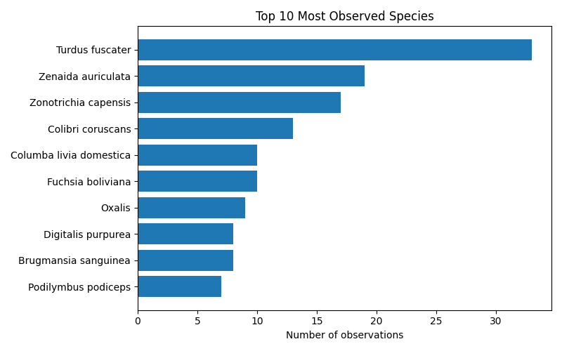
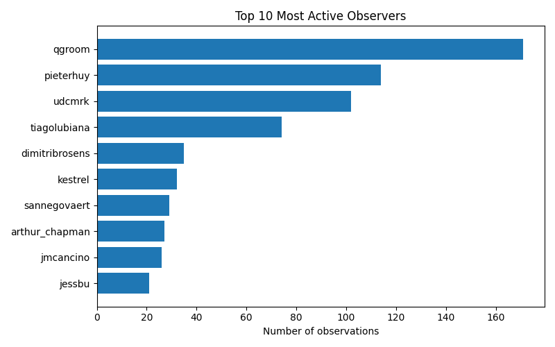

# iNaturalist Project Report: datos-vivos-gb32-bogota-2025

- Total observations: 757
- Unique species observed: 405
- Unique observers: 24

## Wikipedia & Wikidata Coverage

- Species not on Wikidata: **4**
- Missing in en: **73**

- Missing in es: **90**

- Missing in ja: **248**

- Missing in ar: **223**

- Missing in nl: **168**

- Missing in pt: **165**

- Missing in fr: **125**

| Taxon | Wikidata | GBIF | iNaturalist | EN | ES | JA | AR | NL | PT | FR |
|---|---|---|---|---|---|---|---|---|---|---|
| Aetalion reticulatum | [Q21236347](https://www.wikidata.org/entity/Q21236347) | [9597237](https://www.gbif.org/species/9597237) | [326309](https://www.inaturalist.org/taxa/326309) | &#10007; | &#10007; | &#10007; | &#10007; | &#10007; | &#10007; | &#10007; |
| Angiospermae | [Q14832431](https://www.wikidata.org/entity/Q14832431) | — | — | &#10007; | &#10007; | &#10007; | &#10007; | &#10007; | &#10007; | &#10007; |
| Ardea alba egretta | [Q27604524](https://www.wikidata.org/entity/Q27604524) | [6178104](https://www.gbif.org/species/6178104) | [236942](https://www.inaturalist.org/taxa/236942) | &#10007; | &#10007; | &#10007; | &#10007; | &#10007; | &#10007; | &#10007; |
| Asemosyrphus mexicanus | [Q10735598](https://www.wikidata.org/entity/Q10735598) | — | [1144252](https://www.inaturalist.org/taxa/1144252) | &#10007; | &#10007; | &#10007; | &#10007; | &#10007; | &#10007; | &#10007; |
| Cecropia telenitida | [Q15609914](https://www.wikidata.org/entity/Q15609914) | [4013242](https://www.gbif.org/species/4013242) | [132453](https://www.inaturalist.org/taxa/132453) | &#10007; | &#10007; | &#10007; | &#10007; | &#10007; | &#10007; | &#10007; |
| Crespoa crozalsiana | [Q21252213](https://www.wikidata.org/entity/Q21252213) | [9654442](https://www.gbif.org/species/9654442) | [462785](https://www.inaturalist.org/taxa/462785) | &#10007; | &#10007; | &#10007; | &#10007; | &#10007; | &#10007; | &#10007; |
| Ennya sobria | [Q10484341](https://www.wikidata.org/entity/Q10484341) | [2023552](https://www.gbif.org/species/2023552) | [884262](https://www.inaturalist.org/taxa/884262) | &#10007; | &#10007; | &#10007; | &#10007; | &#10007; | &#10007; | &#10007; |
| Festuca bromoides | [Q21874254](https://www.wikidata.org/entity/Q21874254) | [2702740](https://www.gbif.org/species/2702740) | — | &#10007; | &#10007; | &#10007; | &#10007; | &#10007; | &#10007; | &#10007; |
| Fulica americana columbiana | [Q27607416](https://www.wikidata.org/entity/Q27607416) | [6176551](https://www.gbif.org/species/6176551) | [528429](https://www.inaturalist.org/taxa/528429) | &#10007; | &#10007; | &#10007; | &#10007; | &#10007; | &#10007; | &#10007; |
| Hydrocotyle bonplandii | [Q15552871](https://www.wikidata.org/entity/Q15552871) | [3639402](https://www.gbif.org/species/3639402) | [735163](https://www.inaturalist.org/taxa/735163) | &#10007; | &#10007; | &#10007; | &#10007; | &#10007; | &#10007; | &#10007; |
| Lourteigia stoechadifolia | [Q15552927](https://www.wikidata.org/entity/Q15552927) | [3087497](https://www.gbif.org/species/3087497) | [706408](https://www.inaturalist.org/taxa/706408) | &#10007; | &#10007; | &#10007; | &#10007; | &#10007; | &#10007; | &#10007; |
| Melastomeae | [Q21226316](https://www.wikidata.org/entity/Q21226316) | — | [920780](https://www.inaturalist.org/taxa/920780) | &#10007; | &#10007; | &#10007; | &#10007; | &#10007; | &#10007; | &#10007; |
| Miconia cataractae | [Q15394238](https://www.wikidata.org/entity/Q15394238) | [3870934](https://www.gbif.org/species/3870934) | [547479](https://www.inaturalist.org/taxa/547479) | &#10007; | &#10007; | &#10007; | &#10007; | &#10007; | &#10007; | &#10007; |
| Miconia subseriata | [Q89175459](https://www.wikidata.org/entity/Q89175459) | [10782427](https://www.gbif.org/species/10782427) | — | &#10007; | &#10007; | &#10007; | &#10007; | &#10007; | &#10007; | &#10007; |
| Monnina aestuans | [Q15575823](https://www.wikidata.org/entity/Q15575823) | [7293678](https://www.gbif.org/species/7293678) | [273894](https://www.inaturalist.org/taxa/273894) | &#10007; | &#10007; | &#10007; | &#10007; | &#10007; | &#10007; | &#10007; |
| Orthrosanthus chimboracensis | [Q15579967](https://www.wikidata.org/entity/Q15579967) | [2746374](https://www.gbif.org/species/2746374) | [148013](https://www.inaturalist.org/taxa/148013) | &#10007; | &#10007; | &#10007; | &#10007; | &#10007; | &#10007; | &#10007; |
| Parmelioideae | [Q50410096](https://www.wikidata.org/entity/Q50410096) | — | [1094690](https://www.inaturalist.org/taxa/1094690) | &#10007; | &#10007; | &#10007; | &#10007; | &#10007; | &#10007; | &#10007; |
| Piper barbatum | [Q15606269](https://www.wikidata.org/entity/Q15606269) | [7305835](https://www.gbif.org/species/7305835) | [548051](https://www.inaturalist.org/taxa/548051) | &#10007; | &#10007; | &#10007; | &#10007; | &#10007; | &#10007; | &#10007; |
| Pleopeltis macrocarpa | [Q15322361](https://www.wikidata.org/entity/Q15322361) | [7290349](https://www.gbif.org/species/7290349) | [137239](https://www.inaturalist.org/taxa/137239) | &#10007; | &#10007; | &#10007; | &#10007; | &#10007; | &#10007; | &#10007; |
| Pleopeltis murorum | [Q91458184](https://www.wikidata.org/entity/Q91458184) | [8130083](https://www.gbif.org/species/8130083) | [870825](https://www.inaturalist.org/taxa/870825) | &#10007; | &#10007; | &#10007; | &#10007; | &#10007; | &#10007; | &#10007; |
| Polystichum pungens | [Q15607711](https://www.wikidata.org/entity/Q15607711) | [4044859](https://www.gbif.org/species/4044859) | [437623](https://www.inaturalist.org/taxa/437623) | &#10007; | &#10007; | &#10007; | &#10007; | &#10007; | &#10007; | &#10007; |
| Rhynchospora nervosa | [Q15555289](https://www.wikidata.org/entity/Q15555289) | [2721307](https://www.gbif.org/species/2721307) | [274117](https://www.inaturalist.org/taxa/274117) | &#10007; | &#10007; | &#10007; | &#10007; | &#10007; | &#10007; | &#10007; |
| Sarconesiopsis | [Q136527583](https://www.wikidata.org/entity/Q136527583) | [1504876](https://www.gbif.org/species/1504876) | [959801](https://www.inaturalist.org/taxa/959801) | &#10007; | &#10007; | &#10007; | &#10007; | &#10007; | &#10007; | &#10007; |
| Senecio niveoaureus | [Q15602613](https://www.wikidata.org/entity/Q15602613) | [3108482](https://www.gbif.org/species/3108482) | [509468](https://www.inaturalist.org/taxa/509468) | &#10007; | &#10007; | &#10007; | &#10007; | &#10007; | &#10007; | &#10007; |
| Siphocampylus columnae | [Q15603751](https://www.wikidata.org/entity/Q15603751) | [3168799](https://www.gbif.org/species/3168799) | [534845](https://www.inaturalist.org/taxa/534845) | &#10007; | &#10007; | &#10007; | &#10007; | &#10007; | &#10007; | &#10007; |
| Solanum macrotonum | [Q17400847](https://www.wikidata.org/entity/Q17400847) | [2932050](https://www.gbif.org/species/2932050) | — | &#10007; | &#10007; | &#10007; | &#10007; | &#10007; | &#10007; | &#10007; |
| Stenorrhynchos albidomaculatum | [Q15463166](https://www.wikidata.org/entity/Q15463166) | [2785253](https://www.gbif.org/species/2785253) | [547031](https://www.inaturalist.org/taxa/547031) | &#10007; | &#10007; | &#10007; | &#10007; | &#10007; | &#10007; | &#10007; |
| Toxomerus virgulatus | [Q14515266](https://www.wikidata.org/entity/Q14515266) | [1534122](https://www.gbif.org/species/1534122) | [712163](https://www.inaturalist.org/taxa/712163) | &#10007; | &#10007; | &#10007; | &#10007; | &#10007; | &#10007; | &#10007; |
| Trachemys callirostris callirostris | [Q28834573](https://www.wikidata.org/entity/Q28834573) | [6157007](https://www.gbif.org/species/6157007) | [116223](https://www.inaturalist.org/taxa/116223) | &#10007; | &#10007; | &#10007; | &#10007; | &#10007; | &#10007; | &#10007; |
| Varronia cylindristachya | [Q17414886](https://www.wikidata.org/entity/Q17414886) | [4060930](https://www.gbif.org/species/4060930) | — | &#10007; | &#10007; | &#10007; | &#10007; | &#10007; | &#10007; | &#10007; |
| Villanova oppositifolia | [Q109622626](https://www.wikidata.org/entity/Q109622626) | [5386982](https://www.gbif.org/species/5386982) | [548164](https://www.inaturalist.org/taxa/548164) | &#10007; | &#10007; | &#10007; | &#10007; | &#10007; | &#10007; | &#10007; |
| Abatia parviflora | [Q5654738](https://www.wikidata.org/entity/Q5654738) | [3878235](https://www.gbif.org/species/3878235) | [528103](https://www.inaturalist.org/taxa/528103) | &#10007; | [&#10003;](https://es.wikipedia.org/wiki/Abatia_parviflora) | &#10007; | &#10007; | &#10007; | &#10007; | &#10007; |
| Aconophora | [Q10399725](https://www.wikidata.org/entity/Q10399725) | [2023713](https://www.gbif.org/species/2023713) | [337104](https://www.inaturalist.org/taxa/337104) | &#10007; | &#10007; | &#10007; | &#10007; | &#10007; | &#10007; | [&#10003;](https://fr.wikipedia.org/wiki/Aconophora) |
| Alchisme | [Q10404454](https://www.wikidata.org/entity/Q10404454) | [2024079](https://www.gbif.org/species/2024079) | [461054](https://www.inaturalist.org/taxa/461054) | [&#10003;](https://en.wikipedia.org/wiki/Alchisme) | &#10007; | &#10007; | &#10007; | &#10007; | &#10007; | &#10007; |
| Arhyssus | [Q10417839](https://www.wikidata.org/entity/Q10417839) | [2050246](https://www.gbif.org/species/2050246) | [203426](https://www.inaturalist.org/taxa/203426) | [&#10003;](https://en.wikipedia.org/wiki/Arhyssus) | &#10007; | &#10007; | &#10007; | &#10007; | &#10007; | &#10007; |
| Astylus aulicus | [Q108619266](https://www.wikidata.org/entity/Q108619266) | — | [550170](https://www.inaturalist.org/taxa/550170) | [&#10003;](https://en.wikipedia.org/wiki/Astylus_aulicus) | &#10007; | &#10007; | &#10007; | &#10007; | &#10007; | &#10007; |
| Baccharis latifolia | [Q8239272](https://www.wikidata.org/entity/Q8239272) | [3129805](https://www.gbif.org/species/3129805) | [534316](https://www.inaturalist.org/taxa/534316) | &#10007; | [&#10003;](https://es.wikipedia.org/wiki/Baccharis_latifolia) | &#10007; | &#10007; | &#10007; | &#10007; | &#10007; |
| Bassania | [Q13867855](https://www.wikidata.org/entity/Q13867855) | — | — | &#10007; | &#10007; | &#10007; | &#10007; | [&#10003;](https://nl.wikipedia.org/wiki/Bassania) | &#10007; | &#10007; |
| Bellardina | [Q21438582](https://www.wikidata.org/entity/Q21438582) | [4789936](https://www.gbif.org/species/4789936) | [466648](https://www.inaturalist.org/taxa/466648) | &#10007; | &#10007; | &#10007; | &#10007; | [&#10003;](https://nl.wikipedia.org/wiki/Bellardina) | &#10007; | &#10007; |
| Calliandra trinervia | [Q15495836](https://www.wikidata.org/entity/Q15495836) | [2982031](https://www.gbif.org/species/2982031) | [206517](https://www.inaturalist.org/taxa/206517) | &#10007; | [&#10003;](https://es.wikipedia.org/wiki/Calliandra_trinervia) | &#10007; | &#10007; | &#10007; | &#10007; | &#10007; |
| Callianthe megapotamica | [Q27680222](https://www.wikidata.org/entity/Q27680222) | [8220878](https://www.gbif.org/species/8220878) | [508221](https://www.inaturalist.org/taxa/508221) | &#10007; | &#10007; | &#10007; | &#10007; | [&#10003;](https://nl.wikipedia.org/wiki/Callianthe_megapotamica) | &#10007; | &#10007; |
| Castilleja arvensis | [Q2371644](https://www.wikidata.org/entity/Q2371644) | [3170604](https://www.gbif.org/species/3170604) | [133740](https://www.inaturalist.org/taxa/133740) | &#10007; | &#10007; | &#10007; | &#10007; | &#10007; | &#10007; | [&#10003;](https://fr.wikipedia.org/wiki/Castilleja_arvensis) |
| Cavendishia bracteata | [Q15371130](https://www.wikidata.org/entity/Q15371130) | [5832188](https://www.gbif.org/species/5832188) | [291293](https://www.inaturalist.org/taxa/291293) | &#10007; | [&#10003;](https://es.wikipedia.org/wiki/Cavendishia_bracteata) | &#10007; | &#10007; | &#10007; | &#10007; | &#10007; |
| Chrysoperla externa | [Q2453310](https://www.wikidata.org/entity/Q2453310) | [2105515](https://www.gbif.org/species/2105515) | [196458](https://www.inaturalist.org/taxa/196458) | &#10007; | &#10007; | &#10007; | &#10007; | [&#10003;](https://nl.wikipedia.org/wiki/Chrysoperla_externa) | &#10007; | &#10007; |
| Compsus canescens | [Q110151364](https://www.wikidata.org/entity/Q110151364) | [7950527](https://www.gbif.org/species/7950527) | [1039974](https://www.inaturalist.org/taxa/1039974) | [&#10003;](https://en.wikipedia.org/wiki/Compsus_canescens) | &#10007; | &#10007; | &#10007; | &#10007; | &#10007; | &#10007; |
| Croton magdalenensis | [Q3004670](https://www.wikidata.org/entity/Q3004670) | [3059216](https://www.gbif.org/species/3059216) | [574105](https://www.inaturalist.org/taxa/574105) | &#10007; | &#10007; | &#10007; | &#10007; | &#10007; | &#10007; | [&#10003;](https://fr.wikipedia.org/wiki/Croton_magdalenensis) |
| Cyclopogon elatus | [Q15442075](https://www.wikidata.org/entity/Q15442075) | [2807711](https://www.gbif.org/species/2807711) | [276579](https://www.inaturalist.org/taxa/276579) | [&#10003;](https://en.wikipedia.org/wiki/Cyclopogon_elatus) | &#10007; | &#10007; | &#10007; | &#10007; | &#10007; | &#10007; |
| Ennya | [Q10484324](https://www.wikidata.org/entity/Q10484324) | [2023537](https://www.gbif.org/species/2023537) | [607576](https://www.inaturalist.org/taxa/607576) | &#10007; | [&#10003;](https://es.wikipedia.org/wiki/Ennya) | &#10007; | &#10007; | &#10007; | &#10007; | &#10007; |
| Epidendrum zipaquiranum | [Q79674294](https://www.wikidata.org/entity/Q79674294) | [5321212](https://www.gbif.org/species/5321212) | [894333](https://www.inaturalist.org/taxa/894333) | &#10007; | [&#10003;](https://es.wikipedia.org/wiki/Epidendrum_zipaquiranum) | &#10007; | &#10007; | &#10007; | &#10007; | &#10007; |
| Euophryini | [Q110208](https://www.wikidata.org/entity/Q110208) | — | — | [&#10003;](https://en.wikipedia.org/wiki/Euophryini) | &#10007; | &#10007; | &#10007; | &#10007; | &#10007; | &#10007; |
| Forficula dentata | [Q120400839](https://www.wikidata.org/entity/Q120400839) | [4393070](https://www.gbif.org/species/4393070) | — | [&#10003;](https://en.wikipedia.org/wiki/Forficula_dentata) | &#10007; | &#10007; | &#10007; | &#10007; | &#10007; | &#10007; |
| Fuchsia paniculata | [Q1472595](https://www.wikidata.org/entity/Q1472595) | [5938223](https://www.gbif.org/species/5938223) | [163113](https://www.inaturalist.org/taxa/163113) | [&#10003;](https://en.wikipedia.org/wiki/Fuchsia_paniculata) | &#10007; | &#10007; | &#10007; | &#10007; | &#10007; | &#10007; |
| Gaiadendron punctatum | [Q15382935](https://www.wikidata.org/entity/Q15382935) | [7288046](https://www.gbif.org/species/7288046) | [496333](https://www.inaturalist.org/taxa/496333) | &#10007; | [&#10003;](https://es.wikipedia.org/wiki/Gaiadendron_punctatum) | &#10007; | &#10007; | &#10007; | &#10007; | &#10007; |
| Galium hypocarpium | [Q15449242](https://www.wikidata.org/entity/Q15449242) | [2914207](https://www.gbif.org/species/2914207) | [291391](https://www.inaturalist.org/taxa/291391) | &#10007; | &#10007; | &#10007; | &#10007; | &#10007; | [&#10003;](https://pt.wikipedia.org/wiki/Galium_hypocarpium) | &#10007; |
| Gaultheria erecta | [Q13190224](https://www.wikidata.org/entity/Q13190224) | [4171873](https://www.gbif.org/species/4171873) | [284979](https://www.inaturalist.org/taxa/284979) | &#10007; | [&#10003;](https://es.wikipedia.org/wiki/Gaultheria_erecta) | &#10007; | &#10007; | &#10007; | &#10007; | &#10007; |
| Geranium seemannii | [Q6439140](https://www.wikidata.org/entity/Q6439140) | [2890163](https://www.gbif.org/species/2890163) | [155128](https://www.inaturalist.org/taxa/155128) | &#10007; | [&#10003;](https://es.wikipedia.org/wiki/Geranium_seemannii) | &#10007; | &#10007; | &#10007; | &#10007; | &#10007; |
| Hypotrachyna | [Q5961440](https://www.wikidata.org/entity/Q5961440) | [2605434](https://www.gbif.org/species/2605434) | [117980](https://www.inaturalist.org/taxa/117980) | [&#10003;](https://en.wikipedia.org/wiki/Hypotrachyna) | &#10007; | &#10007; | &#10007; | &#10007; | &#10007; | &#10007; |
| Linochilus rosmarinifolius | [Q96200630](https://www.wikidata.org/entity/Q96200630) | [3090609](https://www.gbif.org/species/3090609) | [1225047](https://www.inaturalist.org/taxa/1225047) | &#10007; | [&#10003;](https://es.wikipedia.org/wiki/Linochilus_rosmarinifolius) | &#10007; | &#10007; | &#10007; | &#10007; | &#10007; |
| Lycianthes lycioides | [Q3268402](https://www.wikidata.org/entity/Q3268402) | [7299577](https://www.gbif.org/species/7299577) | [526642](https://www.inaturalist.org/taxa/526642) | &#10007; | &#10007; | &#10007; | &#10007; | &#10007; | &#10007; | [&#10003;](https://fr.wikipedia.org/wiki/Lycianthes_lycioides) |
| Melastomatoideae | [Q21226309](https://www.wikidata.org/entity/Q21226309) | — | — | &#10007; | &#10007; | &#10007; | &#10007; | &#10007; | &#10007; | [&#10003;](https://fr.wikipedia.org/wiki/Melastomatoideae) |
| Meriania nobilis | [Q17585739](https://www.wikidata.org/entity/Q17585739) | [5599684](https://www.gbif.org/species/5599684) | [133165](https://www.inaturalist.org/taxa/133165) | &#10007; | [&#10003;](https://es.wikipedia.org/wiki/Meriania_nobilis) | &#10007; | &#10007; | &#10007; | &#10007; | &#10007; |
| Monochaetum myrtoideum | [Q15401133](https://www.wikidata.org/entity/Q15401133) | [3858290](https://www.gbif.org/species/3858290) | [538474](https://www.inaturalist.org/taxa/538474) | &#10007; | [&#10003;](https://es.wikipedia.org/wiki/Monochaetum_myrtoideum) | &#10007; | &#10007; | &#10007; | &#10007; | &#10007; |
| Morella pubescens | [Q15377003](https://www.wikidata.org/entity/Q15377003) | [3744993](https://www.gbif.org/species/3744993) | [496289](https://www.inaturalist.org/taxa/496289) | &#10007; | [&#10003;](https://es.wikipedia.org/wiki/Morella_pubescens) | &#10007; | &#10007; | &#10007; | &#10007; | &#10007; |
| Oenothera multicaulis | [Q13190361](https://www.wikidata.org/entity/Q13190361) | [3663746](https://www.gbif.org/species/3663746) | [556726](https://www.inaturalist.org/taxa/556726) | &#10007; | &#10007; | &#10007; | [&#10003;](https://ar.wikipedia.org/wiki/%D8%A3%D8%AE%D8%AF%D8%B1%D9%8A%D8%A9_%D9%85%D8%AA%D8%B9%D8%AF%D8%AF%D8%A9_%D8%A7%D9%84%D8%B3%D9%88%D9%82) | &#10007; | &#10007; | &#10007; |
| Pleroma urvilleanum | [Q89050367](https://www.wikidata.org/entity/Q89050367) | [10863132](https://www.gbif.org/species/10863132) | — | [&#10003;](https://en.wikipedia.org/wiki/Pleroma_urvilleanum) | &#10007; | &#10007; | &#10007; | &#10007; | &#10007; | &#10007; |
| Senna viarum | [Q15537652](https://www.wikidata.org/entity/Q15537652) | [2957859](https://www.gbif.org/species/2957859) | [509218](https://www.inaturalist.org/taxa/509218) | &#10007; | [&#10003;](https://es.wikipedia.org/wiki/Senna_viarum) | &#10007; | &#10007; | &#10007; | &#10007; | &#10007; |
| Sisyrinchium micranthum | [Q7531518](https://www.wikidata.org/entity/Q7531518) | [5296278](https://www.gbif.org/species/5296278) | [284004](https://www.inaturalist.org/taxa/284004) | [&#10003;](https://en.wikipedia.org/wiki/Sisyrinchium_micranthum) | &#10007; | &#10007; | &#10007; | &#10007; | &#10007; | &#10007; |
| Smallanthus pyramidalis | [Q15565972](https://www.wikidata.org/entity/Q15565972) | [3145318](https://www.gbif.org/species/3145318) | [508085](https://www.inaturalist.org/taxa/508085) | &#10007; | [&#10003;](https://es.wikipedia.org/wiki/Smallanthus_pyramidalis) | &#10007; | &#10007; | &#10007; | &#10007; | &#10007; |
| Solanum oblongifolium | [Q15537243](https://www.wikidata.org/entity/Q15537243) | [2930683](https://www.gbif.org/species/2930683) | [553042](https://www.inaturalist.org/taxa/553042) | &#10007; | [&#10003;](https://es.wikipedia.org/wiki/Solanum_oblongifolium) | &#10007; | &#10007; | &#10007; | &#10007; | &#10007; |
| Tillandsia fendleri | [Q10826865](https://www.wikidata.org/entity/Q10826865) | [2694600](https://www.gbif.org/species/2694600) | [505485](https://www.inaturalist.org/taxa/505485) | [&#10003;](https://en.wikipedia.org/wiki/Tillandsia_fendleri) | &#10007; | &#10007; | &#10007; | &#10007; | &#10007; | &#10007; |
| Tillandsia pastensis | [Q15460631](https://www.wikidata.org/entity/Q15460631) | [2694651](https://www.gbif.org/species/2694651) | [547444](https://www.inaturalist.org/taxa/547444) | &#10007; | [&#10003;](https://es.wikipedia.org/wiki/Tillandsia_pastensis) | &#10007; | &#10007; | &#10007; | &#10007; | &#10007; |
| Triumfetta procumbens | [Q15231484](https://www.wikidata.org/entity/Q15231484) | [7149866](https://www.gbif.org/species/7149866) | — | &#10007; | &#10007; | &#10007; | &#10007; | &#10007; | &#10007; | [&#10003;](https://fr.wikipedia.org/wiki/Triumfetta_procumbens) |
| Alchemilla orbiculata | [Q15288842](https://www.wikidata.org/entity/Q15288842) | [3027800](https://www.gbif.org/species/3027800) | [287289](https://www.inaturalist.org/taxa/287289) | &#10007; | [&#10003;](https://es.wikipedia.org/wiki/Alchemilla_orbiculata) | &#10007; | &#10007; | &#10007; | [&#10003;](https://pt.wikipedia.org/wiki/Alchemilla_orbiculata) | &#10007; |
| Alonsoa meridionalis | [Q4062836](https://www.wikidata.org/entity/Q4062836) | [7331539](https://www.gbif.org/species/7331539) | [282861](https://www.inaturalist.org/taxa/282861) | [&#10003;](https://en.wikipedia.org/wiki/Alonsoa_meridionalis) | &#10007; | &#10007; | [&#10003;](https://ar.wikipedia.org/wiki/%D8%A3%D9%84%D9%88%D9%86%D8%B3%D9%88%D8%A9_%D8%AC%D9%86%D9%88%D8%A8%D9%8A%D8%A9) | &#10007; | &#10007; | &#10007; |
| Asplenium praemorsum | [Q3336154](https://www.wikidata.org/entity/Q3336154) | [2650614](https://www.gbif.org/species/2650614) | [158795](https://www.inaturalist.org/taxa/158795) | &#10007; | [&#10003;](https://es.wikipedia.org/wiki/Asplenium_praemorsum) | &#10007; | &#10007; | &#10007; | [&#10003;](https://pt.wikipedia.org/wiki/Asplenium_praemorsum) | &#10007; |
| Bejaria resinosa | [Q15371215](https://www.wikidata.org/entity/Q15371215) | [4936719](https://www.gbif.org/species/4936719) | [531682](https://www.inaturalist.org/taxa/531682) | &#10007; | [&#10003;](https://es.wikipedia.org/wiki/Bejaria_resinosa) | &#10007; | [&#10003;](https://ar.wikipedia.org/wiki/%D8%A8%D9%8A%D8%AC%D8%A7%D8%B1%D9%8A%D8%A9_%D8%B1%D8%A7%D8%AA%D9%8A%D9%86%D8%AC%D9%8A%D8%A9) | &#10007; | &#10007; | &#10007; |
| Bocconia frutescens | [Q5730997](https://www.wikidata.org/entity/Q5730997) | [2888374](https://www.gbif.org/species/2888374) | [133166](https://www.inaturalist.org/taxa/133166) | [&#10003;](https://en.wikipedia.org/wiki/Bocconia_frutescens) | [&#10003;](https://es.wikipedia.org/wiki/Bocconia_frutescens) | &#10007; | &#10007; | &#10007; | &#10007; | &#10007; |
| Bomarea multiflora | [Q4035296](https://www.wikidata.org/entity/Q4035296) | [2754207](https://www.gbif.org/species/2754207) | [430005](https://www.inaturalist.org/taxa/430005) | [&#10003;](https://en.wikipedia.org/wiki/Bomarea_multiflora) | [&#10003;](https://es.wikipedia.org/wiki/Bomarea_multiflora) | &#10007; | &#10007; | &#10007; | &#10007; | &#10007; |
| Brunfelsia pauciflora | [Q149804](https://www.wikidata.org/entity/Q149804) | [6402571](https://www.gbif.org/species/6402571) | [343971](https://www.inaturalist.org/taxa/343971) | [&#10003;](https://en.wikipedia.org/wiki/Brunfelsia_pauciflora) | [&#10003;](https://es.wikipedia.org/wiki/Brunfelsia_pauciflora) | &#10007; | &#10007; | &#10007; | &#10007; | &#10007; |
| Callianthe | [Q17579604](https://www.wikidata.org/entity/Q17579604) | [8207961](https://www.gbif.org/species/8207961) | [508220](https://www.inaturalist.org/taxa/508220) | [&#10003;](https://en.wikipedia.org/wiki/Callianthe) | &#10007; | &#10007; | &#10007; | &#10007; | &#10007; | [&#10003;](https://fr.wikipedia.org/wiki/Callianthe) |
| Campyloneurum | [Q4566572](https://www.wikidata.org/entity/Q4566572) | [2650511](https://www.gbif.org/species/2650511) | [137099](https://www.inaturalist.org/taxa/137099) | [&#10003;](https://en.wikipedia.org/wiki/Campyloneurum) | [&#10003;](https://es.wikipedia.org/wiki/Campyloneurum) | &#10007; | &#10007; | &#10007; | &#10007; | &#10007; |
| Cargolia | [Q5039293](https://www.wikidata.org/entity/Q5039293) | [1967183](https://www.gbif.org/species/1967183) | [717937](https://www.inaturalist.org/taxa/717937) | [&#10003;](https://en.wikipedia.org/wiki/Cargolia) | &#10007; | &#10007; | &#10007; | [&#10003;](https://nl.wikipedia.org/wiki/Cargolia) | &#10007; | &#10007; |
| Compsus | [Q14924383](https://www.wikidata.org/entity/Q14924383) | [1206526](https://www.gbif.org/species/1206526) | [251778](https://www.inaturalist.org/taxa/251778) | [&#10003;](https://en.wikipedia.org/wiki/Compsus) | &#10007; | &#10007; | &#10007; | &#10007; | &#10007; | [&#10003;](https://fr.wikipedia.org/wiki/Compsus) |
| Deroceras invadens | [Q5262901](https://www.wikidata.org/entity/Q5262901) | [8745918](https://www.gbif.org/species/8745918) | [366887](https://www.inaturalist.org/taxa/366887) | [&#10003;](https://en.wikipedia.org/wiki/Deroceras_invadens) | &#10007; | &#10007; | &#10007; | [&#10003;](https://nl.wikipedia.org/wiki/Zwervende_akkerslak) | &#10007; | &#10007; |
| Drymoea veliterna | [Q18137628](https://www.wikidata.org/entity/Q18137628) | — | [876440](https://www.inaturalist.org/taxa/876440) | [&#10003;](https://en.wikipedia.org/wiki/Drymoea_veliterna) | [&#10003;](https://es.wikipedia.org/wiki/Drymoea_veliterna) | &#10007; | &#10007; | &#10007; | &#10007; | &#10007; |
| Dryopteris wallichiana | [Q5309785](https://www.wikidata.org/entity/Q5309785) | [5275137](https://www.gbif.org/species/5275137) | [162123](https://www.inaturalist.org/taxa/162123) | [&#10003;](https://en.wikipedia.org/wiki/Dryopteris_wallichiana) | [&#10003;](https://es.wikipedia.org/wiki/Dryopteris_wallichiana) | &#10007; | &#10007; | &#10007; | &#10007; | &#10007; |
| Duranta mutisii | [Q15497147](https://www.wikidata.org/entity/Q15497147) | [7297074](https://www.gbif.org/species/7297074) | [327786](https://www.inaturalist.org/taxa/327786) | [&#10003;](https://en.wikipedia.org/wiki/Duranta_mutisii) | [&#10003;](https://es.wikipedia.org/wiki/Duranta_mutisii) | &#10007; | &#10007; | &#10007; | &#10007; | &#10007; |
| Escallonia rubra | [Q12334111](https://www.wikidata.org/entity/Q12334111) | [8405971](https://www.gbif.org/species/8405971) | [162726](https://www.inaturalist.org/taxa/162726) | [&#10003;](https://en.wikipedia.org/wiki/Escallonia_rubra) | [&#10003;](https://es.wikipedia.org/wiki/Escallonia_rubra) | &#10007; | &#10007; | &#10007; | &#10007; | &#10007; |
| Eudejeania | [Q13617905](https://www.wikidata.org/entity/Q13617905) | [1473977](https://www.gbif.org/species/1473977) | — | [&#10003;](https://en.wikipedia.org/wiki/Eudejeania) | &#10007; | &#10007; | &#10007; | [&#10003;](https://nl.wikipedia.org/wiki/Eudejeania) | &#10007; | &#10007; |
| Gamochaeta americana | [Q15597791](https://www.wikidata.org/entity/Q15597791) | [3103158](https://www.gbif.org/species/3103158) | [153366](https://www.inaturalist.org/taxa/153366) | [&#10003;](https://en.wikipedia.org/wiki/Gamochaeta_americana) | [&#10003;](https://es.wikipedia.org/wiki/Gamochaeta_americana) | &#10007; | &#10007; | &#10007; | &#10007; | &#10007; |
| Geonoma undata | [Q5877704](https://www.wikidata.org/entity/Q5877704) | [2734311](https://www.gbif.org/species/2734311) | [132155](https://www.inaturalist.org/taxa/132155) | [&#10003;](https://en.wikipedia.org/wiki/Geonoma_undata) | [&#10003;](https://es.wikipedia.org/wiki/Geonoma_undata) | &#10007; | &#10007; | &#10007; | &#10007; | &#10007; |
| Hygrochroma | [Q10770158](https://www.wikidata.org/entity/Q10770158) | [1962881](https://www.gbif.org/species/1962881) | [521299](https://www.inaturalist.org/taxa/521299) | [&#10003;](https://en.wikipedia.org/wiki/Hygrochroma) | &#10007; | &#10007; | &#10007; | [&#10003;](https://nl.wikipedia.org/wiki/Hygrochroma) | &#10007; | &#10007; |
| Limacoidea | [Q1601957](https://www.wikidata.org/entity/Q1601957) | — | [512198](https://www.inaturalist.org/taxa/512198) | [&#10003;](https://en.wikipedia.org/wiki/Limacoidea) | &#10007; | &#10007; | &#10007; | [&#10003;](https://nl.wikipedia.org/wiki/Limacoidea) | &#10007; | &#10007; |
| Macleania rupestris | [Q15386070](https://www.wikidata.org/entity/Q15386070) | [4170327](https://www.gbif.org/species/4170327) | [465065](https://www.inaturalist.org/taxa/465065) | &#10007; | [&#10003;](https://es.wikipedia.org/wiki/Macleania_rupestris) | &#10007; | &#10007; | &#10007; | [&#10003;](https://pt.wikipedia.org/wiki/Macleania_rupestris) | &#10007; |
| Masdevallia ignea | [Q6782925](https://www.wikidata.org/entity/Q6782925) | [2848054](https://www.gbif.org/species/2848054) | [905009](https://www.inaturalist.org/taxa/905009) | [&#10003;](https://en.wikipedia.org/wiki/Masdevallia_ignea) | [&#10003;](https://es.wikipedia.org/wiki/Masdevallia_ignea) | &#10007; | &#10007; | &#10007; | &#10007; | &#10007; |
| Munnozia senecionidis | [Q15567016](https://www.wikidata.org/entity/Q15567016) | [3099401](https://www.gbif.org/species/3099401) | [548066](https://www.inaturalist.org/taxa/548066) | &#10007; | [&#10003;](https://es.wikipedia.org/wiki/Munnozia_senecionidis) | &#10007; | &#10007; | &#10007; | &#10007; | [&#10003;](https://fr.wikipedia.org/wiki/Munnozia_senecionidis) |
| Niphidium crassifolium | [Q9050235](https://www.wikidata.org/entity/Q9050235) | [2650442](https://www.gbif.org/species/2650442) | [132176](https://www.inaturalist.org/taxa/132176) | [&#10003;](https://en.wikipedia.org/wiki/Niphidium_crassifolium) | [&#10003;](https://es.wikipedia.org/wiki/Niphidium_crassifolium) | &#10007; | &#10007; | &#10007; | &#10007; | &#10007; |
| Oreopanax incisus | [Q15554446](https://www.wikidata.org/entity/Q15554446) | [3036583](https://www.gbif.org/species/3036583) | [534698](https://www.inaturalist.org/taxa/534698) | &#10007; | [&#10003;](https://es.wikipedia.org/wiki/Oreopanax_incisus) | &#10007; | &#10007; | &#10007; | [&#10003;](https://pt.wikipedia.org/wiki/Oreopanax_incisus) | &#10007; |
| Oxalis spiralis | [Q3887771](https://www.wikidata.org/entity/Q3887771) | [7156841](https://www.gbif.org/species/7156841) | [460574](https://www.inaturalist.org/taxa/460574) | [&#10003;](https://en.wikipedia.org/wiki/Oxalis_spiralis) | &#10007; | &#10007; | [&#10003;](https://ar.wikipedia.org/wiki/%D8%A3%D9%82%D8%B5%D9%84%D9%8A%D8%B3_%D8%AD%D9%84%D8%B2%D9%88%D9%86%D9%8A) | &#10007; | &#10007; | &#10007; |
| Parmotrema | [Q10620680](https://www.wikidata.org/entity/Q10620680) | [2565599](https://www.gbif.org/species/2565599) | [117867](https://www.inaturalist.org/taxa/117867) | [&#10003;](https://en.wikipedia.org/wiki/Parmotrema) | [&#10003;](https://es.wikipedia.org/wiki/Parmotrema) | &#10007; | &#10007; | &#10007; | &#10007; | &#10007; |
| Passiflora manicata | [Q12639367](https://www.wikidata.org/entity/Q12639367) | [2874185](https://www.gbif.org/species/2874185) | [51455](https://www.inaturalist.org/taxa/51455) | [&#10003;](https://en.wikipedia.org/wiki/Passiflora_manicata) | [&#10003;](https://es.wikipedia.org/wiki/Passiflora_manicata) | &#10007; | &#10007; | &#10007; | &#10007; | &#10007; |
| Persicaria punctata | [Q15597559](https://www.wikidata.org/entity/Q15597559) | [6390957](https://www.gbif.org/species/6390957) | [78456](https://www.inaturalist.org/taxa/78456) | [&#10003;](https://en.wikipedia.org/wiki/Persicaria_punctata) | [&#10003;](https://es.wikipedia.org/wiki/Polygonum_punctatum) | &#10007; | &#10007; | &#10007; | &#10007; | &#10007; |
| Phytocoris tiliae | [Q10631342](https://www.wikidata.org/entity/Q10631342) | [2011797](https://www.gbif.org/species/2011797) | [624545](https://www.inaturalist.org/taxa/624545) | [&#10003;](https://en.wikipedia.org/wiki/Phytocoris_tiliae) | &#10007; | &#10007; | &#10007; | [&#10003;](https://nl.wikipedia.org/wiki/Phytocoris_tiliae) | &#10007; | &#10007; |
| Phytolacca bogotensis | [Q6074768](https://www.wikidata.org/entity/Q6074768) | [3084020](https://www.gbif.org/species/3084020) | [48597](https://www.inaturalist.org/taxa/48597) | &#10007; | [&#10003;](https://es.wikipedia.org/wiki/Phytolacca_bogotensis) | &#10007; | &#10007; | &#10007; | &#10007; | [&#10003;](https://fr.wikipedia.org/wiki/Phytolacca_bogotensis) |
| Pleopeltis | [Q4566584](https://www.wikidata.org/entity/Q4566584) | [2650485](https://www.gbif.org/species/2650485) | [84021](https://www.inaturalist.org/taxa/84021) | [&#10003;](https://en.wikipedia.org/wiki/Pleopeltis) | [&#10003;](https://es.wikipedia.org/wiki/Pleopeltis) | &#10007; | &#10007; | &#10007; | &#10007; | &#10007; |
| Podisus | [Q3393074](https://www.wikidata.org/entity/Q3393074) | [2079032](https://www.gbif.org/species/2079032) | [142278](https://www.inaturalist.org/taxa/142278) | [&#10003;](https://en.wikipedia.org/wiki/Podisus) | &#10007; | &#10007; | &#10007; | &#10007; | &#10007; | [&#10003;](https://fr.wikipedia.org/wiki/Podisus) |
| Quindina | [Q2357380](https://www.wikidata.org/entity/Q2357380) | [4665450](https://www.gbif.org/species/4665450) | [535870](https://www.inaturalist.org/taxa/535870) | &#10007; | &#10007; | &#10007; | &#10007; | [&#10003;](https://nl.wikipedia.org/wiki/Quindina) | &#10007; | [&#10003;](https://fr.wikipedia.org/wiki/Quindina) |
| Scea | [Q7430657](https://www.wikidata.org/entity/Q7430657) | [1822893](https://www.gbif.org/species/1822893) | — | [&#10003;](https://en.wikipedia.org/wiki/Scea) | &#10007; | &#10007; | &#10007; | [&#10003;](https://nl.wikipedia.org/wiki/Scea) | &#10007; | &#10007; |
| Sedum praealtum | [Q15486137](https://www.wikidata.org/entity/Q15486137) | [5362012](https://www.gbif.org/species/5362012) | [79032](https://www.inaturalist.org/taxa/79032) | [&#10003;](https://en.wikipedia.org/wiki/Sedum_praealtum) | &#10007; | &#10007; | &#10007; | &#10007; | [&#10003;](https://pt.wikipedia.org/wiki/Sedum_praealtum) | &#10007; |
| Senna multiglandulosa | [Q7450839](https://www.wikidata.org/entity/Q7450839) | [2957656](https://www.gbif.org/species/2957656) | [79062](https://www.inaturalist.org/taxa/79062) | [&#10003;](https://en.wikipedia.org/wiki/Senna_multiglandulosa) | [&#10003;](https://es.wikipedia.org/wiki/Senna_multiglandulosa) | &#10007; | &#10007; | &#10007; | &#10007; | &#10007; |
| Sericoptera mahometaria | [Q13557799](https://www.wikidata.org/entity/Q13557799) | [1966088](https://www.gbif.org/species/1966088) | [319515](https://www.inaturalist.org/taxa/319515) | &#10007; | [&#10003;](https://es.wikipedia.org/wiki/Sericoptera_mahometaria) | &#10007; | &#10007; | [&#10003;](https://nl.wikipedia.org/wiki/Sericoptera_mahometaria) | &#10007; | &#10007; |
| Serpocaulon | [Q6125920](https://www.wikidata.org/entity/Q6125920) | [7126636](https://www.gbif.org/species/7126636) | [179918](https://www.inaturalist.org/taxa/179918) | [&#10003;](https://en.wikipedia.org/wiki/Serpocaulon) | [&#10003;](https://es.wikipedia.org/wiki/Serpocaulon) | &#10007; | &#10007; | &#10007; | &#10007; | &#10007; |
| Teloschistes | [Q7697834](https://www.wikidata.org/entity/Q7697834) | [2609979](https://www.gbif.org/species/2609979) | [55554](https://www.inaturalist.org/taxa/55554) | [&#10003;](https://en.wikipedia.org/wiki/Teloschistes) | &#10007; | &#10007; | &#10007; | [&#10003;](https://nl.wikipedia.org/wiki/Teloschistes) | &#10007; | &#10007; |
| Tillandsia incarnata | [Q7802572](https://www.wikidata.org/entity/Q7802572) | [2695661](https://www.gbif.org/species/2695661) | [532641](https://www.inaturalist.org/taxa/532641) | [&#10003;](https://en.wikipedia.org/wiki/Tillandsia_incarnata) | [&#10003;](https://es.wikipedia.org/wiki/Tillandsia_incarnata) | &#10007; | &#10007; | &#10007; | &#10007; | &#10007; |
| Veronica speciosa | [Q17744711](https://www.wikidata.org/entity/Q17744711) | [3172028](https://www.gbif.org/species/3172028) | [738802](https://www.inaturalist.org/taxa/738802) | [&#10003;](https://en.wikipedia.org/wiki/Veronica_speciosa) | &#10007; | &#10007; | &#10007; | &#10007; | &#10007; | [&#10003;](https://fr.wikipedia.org/wiki/Veronica_speciosa) |
| Weinmannia tomentosa | [Q5405356](https://www.wikidata.org/entity/Q5405356) | [3613772](https://www.gbif.org/species/3613772) | [534976](https://www.inaturalist.org/taxa/534976) | [&#10003;](https://en.wikipedia.org/wiki/Weinmannia_tomentosa) | [&#10003;](https://es.wikipedia.org/wiki/Weinmannia_tomentosa) | &#10007; | &#10007; | &#10007; | &#10007; | &#10007; |
| Alnus acuminata | [Q3926843](https://www.wikidata.org/entity/Q3926843) | [2876131](https://www.gbif.org/species/2876131) | [189148](https://www.inaturalist.org/taxa/189148) | [&#10003;](https://en.wikipedia.org/wiki/Alnus_acuminata) | [&#10003;](https://es.wikipedia.org/wiki/Alnus_acuminata) | &#10007; | &#10007; | &#10007; | [&#10003;](https://pt.wikipedia.org/wiki/Alnus_acuminata) | &#10007; |
| Arremon assimilis | [Q5608066](https://www.wikidata.org/entity/Q5608066) | [7341896](https://www.gbif.org/species/7341896) | [145288](https://www.inaturalist.org/taxa/145288) | [&#10003;](https://en.wikipedia.org/wiki/Grey-browed_brushfinch) | [&#10003;](https://es.wikipedia.org/wiki/Arremon_assimilis) | &#10007; | &#10007; | [&#10003;](https://nl.wikipedia.org/wiki/Grijsbrauwstruikgors) | &#10007; | &#10007; |
| Bucquetia | [Q1339089](https://www.wikidata.org/entity/Q1339089) | [3861405](https://www.gbif.org/species/3861405) | [184496](https://www.inaturalist.org/taxa/184496) | [&#10003;](https://en.wikipedia.org/wiki/Bucquetia) | [&#10003;](https://es.wikipedia.org/wiki/Bucquetia) | &#10007; | &#10007; | &#10007; | [&#10003;](https://pt.wikipedia.org/wiki/Bucquetia) | &#10007; |
| Cardamine occulta | [Q50346863](https://www.wikidata.org/entity/Q50346863) | [3690997](https://www.gbif.org/species/3690997) | [545305](https://www.inaturalist.org/taxa/545305) | [&#10003;](https://en.wikipedia.org/wiki/Cardamine_occulta) | &#10007; | [&#10003;](https://ja.wikipedia.org/wiki/%E3%82%BF%E3%83%8D%E3%83%84%E3%82%B1%E3%83%90%E3%83%8A) | &#10007; | [&#10003;](https://nl.wikipedia.org/wiki/Aziatische_veldkers) | &#10007; | &#10007; |
| Ceroxylon parvifrons | [Q15462746](https://www.wikidata.org/entity/Q15462746) | [2731844](https://www.gbif.org/species/2731844) | [364555](https://www.inaturalist.org/taxa/364555) | [&#10003;](https://en.wikipedia.org/wiki/Ceroxylon_parvifrons) | [&#10003;](https://es.wikipedia.org/wiki/Ceroxylon_parvifrons) | &#10007; | &#10007; | &#10007; | &#10007; | [&#10003;](https://fr.wikipedia.org/wiki/Ceroxylon_parvifrons) |
| Cotula australis | [Q5175877](https://www.wikidata.org/entity/Q5175877) | [3112071](https://www.gbif.org/species/3112071) | [53025](https://www.inaturalist.org/taxa/53025) | [&#10003;](https://en.wikipedia.org/wiki/Cotula_australis) | [&#10003;](https://es.wikipedia.org/wiki/Cotula_australis) | &#10007; | &#10007; | &#10007; | [&#10003;](https://pt.wikipedia.org/wiki/Cotula_australis) | &#10007; |
| Crocosmia × crocosmiiflora | [Q160326](https://www.wikidata.org/entity/Q160326) | [2747939](https://www.gbif.org/species/2747939) | [181465](https://www.inaturalist.org/taxa/181465) | [&#10003;](https://en.wikipedia.org/wiki/Crocosmia_%C3%97_crocosmiiflora) | [&#10003;](https://es.wikipedia.org/wiki/Crocosmia_%C3%97_crocosmiiflora) | [&#10003;](https://ja.wikipedia.org/wiki/%E3%83%92%E3%83%A1%E3%83%92%E3%82%AA%E3%82%A6%E3%82%AE%E3%82%BA%E3%82%A4%E3%82%BB%E3%83%B3) | &#10007; | &#10007; | &#10007; | &#10007; |
| Dusona | [Q14520608](https://www.wikidata.org/entity/Q14520608) | [1288673](https://www.gbif.org/species/1288673) | [250139](https://www.inaturalist.org/taxa/250139) | [&#10003;](https://en.wikipedia.org/wiki/Dusona) | &#10007; | &#10007; | &#10007; | [&#10003;](https://nl.wikipedia.org/wiki/Dusona) | &#10007; | [&#10003;](https://fr.wikipedia.org/wiki/Dusona) |
| Hohenbuehelia | [Q1615737](https://www.wikidata.org/entity/Q1615737) | [2526255](https://www.gbif.org/species/2526255) | [154753](https://www.inaturalist.org/taxa/154753) | [&#10003;](https://en.wikipedia.org/wiki/Hohenbuehelia) | &#10007; | &#10007; | &#10007; | [&#10003;](https://nl.wikipedia.org/wiki/Hohenbuehelia) | &#10007; | [&#10003;](https://fr.wikipedia.org/wiki/Hohenbuehelia) |
| Impatiens sodenii | [Q15346302](https://www.wikidata.org/entity/Q15346302) | [4193715](https://www.gbif.org/species/4193715) | [210929](https://www.inaturalist.org/taxa/210929) | [&#10003;](https://en.wikipedia.org/wiki/Impatiens_sodenii) | &#10007; | &#10007; | &#10007; | &#10007; | [&#10003;](https://pt.wikipedia.org/wiki/Impatiens_sodenii) | [&#10003;](https://fr.wikipedia.org/wiki/Impatiens_sodenii) |
| Limacus | [Q1599819](https://www.wikidata.org/entity/Q1599819) | [2295441](https://www.gbif.org/species/2295441) | [322420](https://www.inaturalist.org/taxa/322420) | [&#10003;](https://en.wikipedia.org/wiki/Limacus) | &#10007; | &#10007; | &#10007; | [&#10003;](https://nl.wikipedia.org/wiki/Limacus) | &#10007; | [&#10003;](https://fr.wikipedia.org/wiki/Limacus) |
| Munnozia | [Q6936806](https://www.wikidata.org/entity/Q6936806) | [3099326](https://www.gbif.org/species/3099326) | [132483](https://www.inaturalist.org/taxa/132483) | [&#10003;](https://en.wikipedia.org/wiki/Munnozia) | [&#10003;](https://es.wikipedia.org/wiki/Munnozia) | &#10007; | &#10007; | &#10007; | [&#10003;](https://pt.wikipedia.org/wiki/Munnozia) | &#10007; |
| Muscoidea | [Q1069946](https://www.wikidata.org/entity/Q1069946) | — | [54992](https://www.inaturalist.org/taxa/54992) | [&#10003;](https://en.wikipedia.org/wiki/Muscoidea) | [&#10003;](https://es.wikipedia.org/wiki/Muscoidea) | &#10007; | [&#10003;](https://ar.wikipedia.org/wiki/%D8%B0%D8%A8%D8%A7%D8%A8_%D9%85%D9%86%D8%B2%D9%84%D9%8A_%D9%88%D8%A3%D8%B4%D8%A8%D8%A7%D9%87%D9%87) | &#10007; | &#10007; | &#10007; |
| Nothoscordum gracile | [Q15524066](https://www.wikidata.org/entity/Q15524066) | [2855519](https://www.gbif.org/species/2855519) | [78233](https://www.inaturalist.org/taxa/78233) | [&#10003;](https://en.wikipedia.org/wiki/Nothoscordum_gracile) | &#10007; | [&#10003;](https://ja.wikipedia.org/wiki/%E3%83%8F%E3%82%BF%E3%82%B1%E3%83%8B%E3%83%A9) | &#10007; | &#10007; | [&#10003;](https://pt.wikipedia.org/wiki/Nothoscordum_gracile) | &#10007; |
| Oncidiinae | [Q1596304](https://www.wikidata.org/entity/Q1596304) | — | [423895](https://www.inaturalist.org/taxa/423895) | [&#10003;](https://en.wikipedia.org/wiki/Oncidiinae) | [&#10003;](https://es.wikipedia.org/wiki/Oncidiinae) | &#10007; | &#10007; | &#10007; | &#10007; | [&#10003;](https://fr.wikipedia.org/wiki/Oncidiinae) |
| Ozognathus cornutus | [Q1911748](https://www.wikidata.org/entity/Q1911748) | [1095277](https://www.gbif.org/species/1095277) | [491916](https://www.inaturalist.org/taxa/491916) | [&#10003;](https://en.wikipedia.org/wiki/Ozognathus_cornutus) | &#10007; | &#10007; | &#10007; | [&#10003;](https://nl.wikipedia.org/wiki/Ozognathus_cornutus) | [&#10003;](https://pt.wikipedia.org/wiki/Ozognathus_cornutus) | &#10007; |
| Passiflora tripartita | [Q3897284](https://www.wikidata.org/entity/Q3897284) | [7152132](https://www.gbif.org/species/7152132) | [133169](https://www.inaturalist.org/taxa/133169) | [&#10003;](https://en.wikipedia.org/wiki/Passiflora_tripartita) | [&#10003;](https://es.wikipedia.org/wiki/Passiflora_tripartita) | &#10007; | [&#10003;](https://ar.wikipedia.org/wiki/%D8%A2%D9%84%D8%A7%D9%85%D9%8A%D8%A9_%D8%AB%D9%84%D8%A7%D8%AB%D9%8A%D8%A9_%D8%A7%D9%84%D9%81%D8%B5%D9%88%D8%B5) | &#10007; | &#10007; | &#10007; |
| Persicaria nepalensis | [Q15598028](https://www.wikidata.org/entity/Q15598028) | [4034001](https://www.gbif.org/species/4034001) | [204377](https://www.inaturalist.org/taxa/204377) | [&#10003;](https://en.wikipedia.org/wiki/Persicaria_nepalensis) | [&#10003;](https://es.wikipedia.org/wiki/Persicaria_nepalensis) | [&#10003;](https://ja.wikipedia.org/wiki/%E3%82%BF%E3%83%8B%E3%82%BD%E3%83%90) | &#10007; | &#10007; | &#10007; | &#10007; |
| Quercus humboldtii | [Q4112124](https://www.wikidata.org/entity/Q4112124) | [2880642](https://www.gbif.org/species/2880642) | [133176](https://www.inaturalist.org/taxa/133176) | [&#10003;](https://en.wikipedia.org/wiki/Quercus_humboldtii) | [&#10003;](https://es.wikipedia.org/wiki/Quercus_humboldtii) | &#10007; | &#10007; | &#10007; | &#10007; | [&#10003;](https://fr.wikipedia.org/wiki/Quercus_humboldtii) |
| Retrophyllum rospigliosii | [Q4251304](https://www.wikidata.org/entity/Q4251304) | [2687731](https://www.gbif.org/species/2687731) | [135511](https://www.inaturalist.org/taxa/135511) | [&#10003;](https://en.wikipedia.org/wiki/Retrophyllum_rospigliosii) | [&#10003;](https://es.wikipedia.org/wiki/Retrophyllum_rospigliosii) | &#10007; | &#10007; | &#10007; | [&#10003;](https://pt.wikipedia.org/wiki/Retrophyllum_rospigliosii) | &#10007; |
| Rubus glaucus | [Q4302294](https://www.wikidata.org/entity/Q4302294) | [2989746](https://www.gbif.org/species/2989746) | [63146](https://www.inaturalist.org/taxa/63146) | [&#10003;](https://en.wikipedia.org/wiki/Rubus_glaucus) | [&#10003;](https://es.wikipedia.org/wiki/Rubus_glaucus) | &#10007; | &#10007; | &#10007; | &#10007; | [&#10003;](https://fr.wikipedia.org/wiki/Rubus_glaucus) |
| Scatopse notata | [Q14079445](https://www.wikidata.org/entity/Q14079445) | [5072268](https://www.gbif.org/species/5072268) | [230507](https://www.inaturalist.org/taxa/230507) | [&#10003;](https://en.wikipedia.org/wiki/Scatopse_notata) | &#10007; | &#10007; | &#10007; | [&#10003;](https://nl.wikipedia.org/wiki/Scatopse_notata) | &#10007; | [&#10003;](https://fr.wikipedia.org/wiki/Scatopse_notata) |
| Senecio madagascariensis | [Q5766514](https://www.wikidata.org/entity/Q5766514) | [3107722](https://www.gbif.org/species/3107722) | [168820](https://www.inaturalist.org/taxa/168820) | [&#10003;](https://en.wikipedia.org/wiki/Senecio_madagascariensis) | &#10007; | [&#10003;](https://ja.wikipedia.org/wiki/%E3%83%8A%E3%83%AB%E3%83%88%E3%82%B5%E3%83%AF%E3%82%AE%E3%82%AF) | &#10007; | &#10007; | &#10007; | [&#10003;](https://fr.wikipedia.org/wiki/Senecio_madagascariensis) |
| Tillandsia biflora | [Q3010988](https://www.wikidata.org/entity/Q3010988) | [2695716](https://www.gbif.org/species/2695716) | [543803](https://www.inaturalist.org/taxa/543803) | [&#10003;](https://en.wikipedia.org/wiki/Tillandsia_biflora) | [&#10003;](https://es.wikipedia.org/wiki/Tillandsia_biflora) | &#10007; | &#10007; | &#10007; | &#10007; | [&#10003;](https://fr.wikipedia.org/wiki/Tillandsia_biflora) |
| Agapanthus praecox | [Q161246](https://www.wikidata.org/entity/Q161246) | [2854755](https://www.gbif.org/species/2854755) | [199324](https://www.inaturalist.org/taxa/199324) | [&#10003;](https://en.wikipedia.org/wiki/Agapanthus_praecox) | [&#10003;](https://es.wikipedia.org/wiki/Agapanthus_praecox) | &#10007; | &#10007; | &#10007; | [&#10003;](https://pt.wikipedia.org/wiki/Agapanthus_praecox) | [&#10003;](https://fr.wikipedia.org/wiki/Agapanthus_praecox) |
| Ageratina | [Q2704494](https://www.wikidata.org/entity/Q2704494) | [5400194](https://www.gbif.org/species/5400194) | [64116](https://www.inaturalist.org/taxa/64116) | [&#10003;](https://en.wikipedia.org/wiki/Ageratina) | [&#10003;](https://es.wikipedia.org/wiki/Ageratina) | &#10007; | &#10007; | &#10007; | [&#10003;](https://pt.wikipedia.org/wiki/Ageratina) | [&#10003;](https://fr.wikipedia.org/wiki/Ageratina) |
| Atlapetes pallidinucha | [Q204171](https://www.wikidata.org/entity/Q204171) | [2491445](https://www.gbif.org/species/2491445) | [10332](https://www.inaturalist.org/taxa/10332) | [&#10003;](https://en.wikipedia.org/wiki/Pale-naped_brushfinch) | [&#10003;](https://es.wikipedia.org/wiki/Atlapetes_pallidinucha) | &#10007; | &#10007; | [&#10003;](https://nl.wikipedia.org/wiki/Bleeknekstruikgors) | [&#10003;](https://pt.wikipedia.org/wiki/Atlapetes_pallidinucha) | &#10007; |
| Bergenia crassifolia | [Q162752](https://www.wikidata.org/entity/Q162752) | [5567694](https://www.gbif.org/species/5567694) | [127228](https://www.inaturalist.org/taxa/127228) | [&#10003;](https://en.wikipedia.org/wiki/Bergenia_crassifolia) | [&#10003;](https://es.wikipedia.org/wiki/Bergenia_crassifolia) | &#10007; | [&#10003;](https://ar.wikipedia.org/wiki/%D8%A8%D8%B1%D8%BA%D9%86%D9%8A%D8%A9_%D8%B3%D9%85%D9%8A%D9%83%D8%A9_%D8%A7%D9%84%D8%A3%D9%88%D8%B1%D8%A7%D9%82) | &#10007; | &#10007; | [&#10003;](https://fr.wikipedia.org/wiki/Bergenia_crassifolia) |
| Bidens pilosa | [Q814421](https://www.wikidata.org/entity/Q814421) | [5391845](https://www.gbif.org/species/5391845) | [50203](https://www.inaturalist.org/taxa/50203) | [&#10003;](https://en.wikipedia.org/wiki/Bidens_pilosa) | [&#10003;](https://es.wikipedia.org/wiki/Bidens_pilosa) | &#10007; | &#10007; | &#10007; | [&#10003;](https://pt.wikipedia.org/wiki/Bidens_pilosa) | [&#10003;](https://fr.wikipedia.org/wiki/Bidens_pilosa) |
| Bromus catharticus | [Q2919408](https://www.wikidata.org/entity/Q2919408) | [2703723](https://www.gbif.org/species/2703723) | [60276](https://www.inaturalist.org/taxa/60276) | [&#10003;](https://en.wikipedia.org/wiki/Bromus_catharticus) | [&#10003;](https://es.wikipedia.org/wiki/Bromus_catharticus) | [&#10003;](https://ja.wikipedia.org/wiki/%E3%82%A4%E3%83%8C%E3%83%A0%E3%82%AE) | &#10007; | &#10007; | [&#10003;](https://pt.wikipedia.org/wiki/Bromus_catharticus) | &#10007; |
| Browallia americana | [Q991007](https://www.wikidata.org/entity/Q991007) | [2932934](https://www.gbif.org/species/2932934) | [159483](https://www.inaturalist.org/taxa/159483) | [&#10003;](https://en.wikipedia.org/wiki/Browallia_americana) | [&#10003;](https://es.wikipedia.org/wiki/Browallia_americana) | &#10007; | [&#10003;](https://ar.wikipedia.org/wiki/%D8%A8%D8%B1%D9%88%D8%A7%D9%84%D9%8A%D8%A7_%D8%A3%D9%85%D8%B1%D9%8A%D9%83%D9%8A%D8%A9) | &#10007; | &#10007; | [&#10003;](https://fr.wikipedia.org/wiki/Browallia_americana) |
| Brugmansia sanguinea | [Q2926516](https://www.wikidata.org/entity/Q2926516) | [5341760](https://www.gbif.org/species/5341760) | [337796](https://www.inaturalist.org/taxa/337796) | [&#10003;](https://en.wikipedia.org/wiki/Brugmansia_sanguinea) | [&#10003;](https://es.wikipedia.org/wiki/Brugmansia_sanguinea) | &#10007; | &#10007; | &#10007; | [&#10003;](https://pt.wikipedia.org/wiki/Brugmansia_sanguinea) | [&#10003;](https://fr.wikipedia.org/wiki/Brugmansia_sanguinea) |
| Catharus ustulatus | [Q545006](https://www.wikidata.org/entity/Q545006) | [2490821](https://www.gbif.org/species/2490821) | [12878](https://www.inaturalist.org/taxa/12878) | [&#10003;](https://en.wikipedia.org/wiki/Swainson%27s_thrush) | [&#10003;](https://es.wikipedia.org/wiki/Catharus_ustulatus) | &#10007; | &#10007; | [&#10003;](https://nl.wikipedia.org/wiki/Dwerglijster) | &#10007; | [&#10003;](https://fr.wikipedia.org/wiki/Grive_%C3%A0_dos_olive) |
| Cicadellinae | [Q838465](https://www.wikidata.org/entity/Q838465) | — | [244341](https://www.inaturalist.org/taxa/244341) | [&#10003;](https://en.wikipedia.org/wiki/Cicadellinae) | [&#10003;](https://es.wikipedia.org/wiki/Cicadellinae) | &#10007; | &#10007; | &#10007; | [&#10003;](https://pt.wikipedia.org/wiki/Cicadel%C3%ADneos) | [&#10003;](https://fr.wikipedia.org/wiki/Cicadellinae) |
| Cobaea scandens | [Q424385](https://www.wikidata.org/entity/Q424385) | [4204358](https://www.gbif.org/species/4204358) | [285911](https://www.inaturalist.org/taxa/285911) | [&#10003;](https://en.wikipedia.org/wiki/Cobaea_scandens) | [&#10003;](https://es.wikipedia.org/wiki/Cobaea_scandens) | &#10007; | &#10007; | [&#10003;](https://nl.wikipedia.org/wiki/Klokwinde) | &#10007; | [&#10003;](https://fr.wikipedia.org/wiki/Cob%C3%A9e_grimpante) |
| Crassiclitellata | [Q5154131](https://www.wikidata.org/entity/Q5154131) | [5958860](https://www.gbif.org/species/5958860) | [152943](https://www.inaturalist.org/taxa/152943) | [&#10003;](https://en.wikipedia.org/wiki/Crassiclitellata) | [&#10003;](https://es.wikipedia.org/wiki/Crassiclitellata) | &#10007; | &#10007; | [&#10003;](https://nl.wikipedia.org/wiki/Crassiclitellata) | &#10007; | [&#10003;](https://fr.wikipedia.org/wiki/Crassiclitellata) |
| Cystopteris fragilis | [Q191532](https://www.wikidata.org/entity/Q191532) | [2650818](https://www.gbif.org/species/2650818) | [58755](https://www.inaturalist.org/taxa/58755) | [&#10003;](https://en.wikipedia.org/wiki/Cystopteris_fragilis) | [&#10003;](https://es.wikipedia.org/wiki/Cystopteris_fragilis) | &#10007; | &#10007; | [&#10003;](https://nl.wikipedia.org/wiki/Blaasvaren) | &#10007; | [&#10003;](https://fr.wikipedia.org/wiki/Cystopteris_fragilis) |
| Ennominae | [Q135609](https://www.wikidata.org/entity/Q135609) | — | [123033](https://www.inaturalist.org/taxa/123033) | [&#10003;](https://en.wikipedia.org/wiki/Ennominae) | [&#10003;](https://es.wikipedia.org/wiki/Ennominae) | &#10007; | &#10007; | [&#10003;](https://nl.wikipedia.org/wiki/Ennominae) | &#10007; | [&#10003;](https://fr.wikipedia.org/wiki/Ennominae) |
| Eucalyptus cinerea | [Q763431](https://www.wikidata.org/entity/Q763431) | [3176723](https://www.gbif.org/species/3176723) | [162748](https://www.inaturalist.org/taxa/162748) | [&#10003;](https://en.wikipedia.org/wiki/Eucalyptus_cinerea) | [&#10003;](https://es.wikipedia.org/wiki/Eucalyptus_cinerea) | &#10007; | &#10007; | &#10007; | [&#10003;](https://pt.wikipedia.org/wiki/Eucalyptus_cinerea) | [&#10003;](https://fr.wikipedia.org/wiki/Eucalyptus_cendr%C3%A9) |
| Harmonia | [Q141575](https://www.wikidata.org/entity/Q141575) | [1043111](https://www.gbif.org/species/1043111) | [72161](https://www.inaturalist.org/taxa/72161) | [&#10003;](https://en.wikipedia.org/wiki/Harmonia_(plant)) | [&#10003;](https://es.wikipedia.org/wiki/Harmonia_(planta)) | &#10007; | &#10007; | [&#10003;](https://nl.wikipedia.org/wiki/Harmonia_(geslacht)) | &#10007; | [&#10003;](https://fr.wikipedia.org/wiki/Harmonia) |
| Hypnum cupressiforme | [Q245867](https://www.wikidata.org/entity/Q245867) | [2681972](https://www.gbif.org/species/2681972) | [412672](https://www.inaturalist.org/taxa/412672) | [&#10003;](https://en.wikipedia.org/wiki/Hypnum_cupressiforme) | &#10007; | [&#10003;](https://ja.wikipedia.org/wiki/%E3%83%8F%E3%82%A4%E3%83%92%E3%83%90%E3%82%B4%E3%82%B1) | &#10007; | [&#10003;](https://nl.wikipedia.org/wiki/Gesnaveld_klauwtjesmos) | &#10007; | [&#10003;](https://fr.wikipedia.org/wiki/Hypne_cypr%C3%A8s) |
| Iberis umbellata | [Q160368](https://www.wikidata.org/entity/Q160368) | [5377303](https://www.gbif.org/species/5377303) | [77485](https://www.inaturalist.org/taxa/77485) | [&#10003;](https://en.wikipedia.org/wiki/Iberis_umbellata) | [&#10003;](https://es.wikipedia.org/wiki/Iberis_umbellata) | &#10007; | &#10007; | [&#10003;](https://nl.wikipedia.org/wiki/Schermscheefbloem) | &#10007; | [&#10003;](https://fr.wikipedia.org/wiki/Iberis_umbellata) |
| Juglans neotropica | [Q6304900](https://www.wikidata.org/entity/Q6304900) | [3054364](https://www.gbif.org/species/3054364) | [327755](https://www.inaturalist.org/taxa/327755) | [&#10003;](https://en.wikipedia.org/wiki/Juglans_neotropica) | [&#10003;](https://es.wikipedia.org/wiki/Juglans_neotropica) | &#10007; | [&#10003;](https://ar.wikipedia.org/wiki/%D8%AC%D9%88%D8%B2_%D8%A7%D9%84%D9%85%D9%86%D8%B7%D9%82%D8%A9_%D8%A7%D9%84%D9%85%D8%AF%D8%A7%D8%B1%D9%8A%D8%A9_%D8%A7%D9%84%D8%AC%D8%AF%D9%8A%D8%AF%D8%A9) | &#10007; | &#10007; | [&#10003;](https://fr.wikipedia.org/wiki/Juglans_neotropica) |
| Kniphofia uvaria | [Q159203](https://www.wikidata.org/entity/Q159203) | [5305033](https://www.gbif.org/species/5305033) | [56035](https://www.inaturalist.org/taxa/56035) | [&#10003;](https://en.wikipedia.org/wiki/Kniphofia_uvaria) | [&#10003;](https://es.wikipedia.org/wiki/Kniphofia_uvaria) | &#10007; | [&#10003;](https://ar.wikipedia.org/wiki/%D9%83%D9%86%D9%8A%D9%81%D9%88%D9%81%D9%8A%D8%A7_%D8%B9%D9%86%D8%A8%D9%8A%D8%A9) | &#10007; | &#10007; | [&#10003;](https://fr.wikipedia.org/wiki/Kniphofia_uvaria) |
| Ledenbergia | [Q9021153](https://www.wikidata.org/entity/Q9021153) | [7309607](https://www.gbif.org/species/7309607) | [272872](https://www.inaturalist.org/taxa/272872) | [&#10003;](https://en.wikipedia.org/wiki/Ledenbergia) | [&#10003;](https://es.wikipedia.org/wiki/Ledenbergia) | &#10007; | &#10007; | &#10007; | [&#10003;](https://pt.wikipedia.org/wiki/Ledenbergia) | [&#10003;](https://fr.wikipedia.org/wiki/Ledenbergia) |
| Meriania | [Q5428678](https://www.wikidata.org/entity/Q5428678) | [3231526](https://www.gbif.org/species/3231526) | [131867](https://www.inaturalist.org/taxa/131867) | [&#10003;](https://en.wikipedia.org/wiki/Meriania) | [&#10003;](https://es.wikipedia.org/wiki/Meriania) | &#10007; | &#10007; | &#10007; | [&#10003;](https://pt.wikipedia.org/wiki/Meriania) | [&#10003;](https://fr.wikipedia.org/wiki/Meriania) |
| Miconia | [Q289879](https://www.wikidata.org/entity/Q289879) | [3188558](https://www.gbif.org/species/3188558) | [48887](https://www.inaturalist.org/taxa/48887) | [&#10003;](https://en.wikipedia.org/wiki/Miconia) | [&#10003;](https://es.wikipedia.org/wiki/Miconia) | &#10007; | &#10007; | &#10007; | [&#10003;](https://pt.wikipedia.org/wiki/Miconia) | [&#10003;](https://fr.wikipedia.org/wiki/Miconia) |
| Orochelidon | [Q10803103](https://www.wikidata.org/entity/Q10803103) | [7340416](https://www.gbif.org/species/7340416) | [144347](https://www.inaturalist.org/taxa/144347) | [&#10003;](https://en.wikipedia.org/wiki/Orochelidon) | [&#10003;](https://es.wikipedia.org/wiki/Orochelidon) | &#10007; | &#10007; | [&#10003;](https://nl.wikipedia.org/wiki/Orochelidon) | &#10007; | [&#10003;](https://fr.wikipedia.org/wiki/Orochelidon) |
| Orthotylinae | [Q6053592](https://www.wikidata.org/entity/Q6053592) | — | [372559](https://www.inaturalist.org/taxa/372559) | [&#10003;](https://en.wikipedia.org/wiki/Orthotylinae) | [&#10003;](https://es.wikipedia.org/wiki/Orthotylinae) | &#10007; | &#10007; | [&#10003;](https://nl.wikipedia.org/wiki/Orthotylinae) | &#10007; | [&#10003;](https://fr.wikipedia.org/wiki/Orthotylinae) |
| Oxalis latifolia | [Q7115068](https://www.wikidata.org/entity/Q7115068) | [2891755](https://www.gbif.org/species/2891755) | [61839](https://www.inaturalist.org/taxa/61839) | [&#10003;](https://en.wikipedia.org/wiki/Oxalis_latifolia) | [&#10003;](https://es.wikipedia.org/wiki/Oxalis_latifolia) | &#10007; | &#10007; | &#10007; | [&#10003;](https://pt.wikipedia.org/wiki/Oxalis_latifolia) | [&#10003;](https://fr.wikipedia.org/wiki/Oxalis_latifolia) |
| Paepalanthus | [Q2539207](https://www.wikidata.org/entity/Q2539207) | [5286654](https://www.gbif.org/species/5286654) | [82151](https://www.inaturalist.org/taxa/82151) | [&#10003;](https://en.wikipedia.org/wiki/Paepalanthus) | [&#10003;](https://es.wikipedia.org/wiki/Paepalanthus) | &#10007; | &#10007; | &#10007; | [&#10003;](https://pt.wikipedia.org/wiki/Paepalanthus) | [&#10003;](https://fr.wikipedia.org/wiki/Paepalanthus) |
| Parmeliaceae | [Q2573345](https://www.wikidata.org/entity/Q2573345) | [8305](https://www.gbif.org/species/8305) | [54321](https://www.inaturalist.org/taxa/54321) | [&#10003;](https://en.wikipedia.org/wiki/Parmeliaceae) | [&#10003;](https://es.wikipedia.org/wiki/Parmeliaceae) | &#10007; | &#10007; | [&#10003;](https://nl.wikipedia.org/wiki/Parmeliaceae) | &#10007; | [&#10003;](https://fr.wikipedia.org/wiki/Parmeliaceae) |
| Passiflora tarminiana | [Q135365](https://www.wikidata.org/entity/Q135365) | [3587792](https://www.gbif.org/species/3587792) | [78358](https://www.inaturalist.org/taxa/78358) | [&#10003;](https://en.wikipedia.org/wiki/Passiflora_tarminiana) | [&#10003;](https://es.wikipedia.org/wiki/Passiflora_tarminiana) | [&#10003;](https://ja.wikipedia.org/wiki/%E3%83%90%E3%83%8A%E3%83%8A%E3%83%9D%E3%82%AB) | &#10007; | [&#10003;](https://nl.wikipedia.org/wiki/Passiflora_tarminiana) | &#10007; | &#10007; |
| Pinus patula | [Q134804](https://www.wikidata.org/entity/Q134804) | [5285090](https://www.gbif.org/species/5285090) | [273784](https://www.inaturalist.org/taxa/273784) | [&#10003;](https://en.wikipedia.org/wiki/Pinus_patula) | [&#10003;](https://es.wikipedia.org/wiki/Pinus_patula) | &#10007; | &#10007; | &#10007; | [&#10003;](https://pt.wikipedia.org/wiki/Pinus_patula) | [&#10003;](https://fr.wikipedia.org/wiki/Pinus_patula) |
| Piranga | [Q225353](https://www.wikidata.org/entity/Q225353) | [2488483](https://www.gbif.org/species/2488483) | [9913](https://www.inaturalist.org/taxa/9913) | [&#10003;](https://en.wikipedia.org/wiki/Piranga) | [&#10003;](https://es.wikipedia.org/wiki/Piranga) | &#10007; | &#10007; | [&#10003;](https://nl.wikipedia.org/wiki/Piranga_(geslacht)) | &#10007; | [&#10003;](https://fr.wikipedia.org/wiki/Piranga) |
| Pittosporum undulatum | [Q7199152](https://www.wikidata.org/entity/Q7199152) | [2986239](https://www.gbif.org/species/2986239) | [51594](https://www.inaturalist.org/taxa/51594) | [&#10003;](https://en.wikipedia.org/wiki/Pittosporum_undulatum) | [&#10003;](https://es.wikipedia.org/wiki/Pittosporum_undulatum) | &#10007; | &#10007; | &#10007; | [&#10003;](https://pt.wikipedia.org/wiki/Pittosporum_undulatum) | [&#10003;](https://fr.wikipedia.org/wiki/Pittosporum_undulatum) |
| Salix humboldtiana | [Q2889020](https://www.wikidata.org/entity/Q2889020) | [5372914](https://www.gbif.org/species/5372914) | [209991](https://www.inaturalist.org/taxa/209991) | [&#10003;](https://en.wikipedia.org/wiki/Salix_humboldtiana) | [&#10003;](https://es.wikipedia.org/wiki/Salix_humboldtiana) | &#10007; | &#10007; | &#10007; | [&#10003;](https://pt.wikipedia.org/wiki/Salix_humboldtiana) | [&#10003;](https://fr.wikipedia.org/wiki/Salix_humboldtiana) |
| Syzygium paniculatum | [Q159398](https://www.wikidata.org/entity/Q159398) | [3184108](https://www.gbif.org/species/3184108) | [181899](https://www.inaturalist.org/taxa/181899) | [&#10003;](https://en.wikipedia.org/wiki/Syzygium_paniculatum) | [&#10003;](https://es.wikipedia.org/wiki/Syzygium_paniculatum) | &#10007; | &#10007; | &#10007; | [&#10003;](https://pt.wikipedia.org/wiki/Syzygium_paniculatum) | [&#10003;](https://fr.wikipedia.org/wiki/Syzygium_paniculatum) |
| Tillandsia recurvata | [Q2709996](https://www.wikidata.org/entity/Q2709996) | [2695588](https://www.gbif.org/species/2695588) | [84002](https://www.inaturalist.org/taxa/84002) | [&#10003;](https://en.wikipedia.org/wiki/Tillandsia_recurvata) | [&#10003;](https://es.wikipedia.org/wiki/Tillandsia_recurvata) | &#10007; | &#10007; | &#10007; | [&#10003;](https://pt.wikipedia.org/wiki/Tillandsia_recurvata) | [&#10003;](https://fr.wikipedia.org/wiki/Tillandsia_recurvata) |
| Tipula oleracea | [Q651615](https://www.wikidata.org/entity/Q651615) | [1506056](https://www.gbif.org/species/1506056) | [418147](https://www.inaturalist.org/taxa/418147) | [&#10003;](https://en.wikipedia.org/wiki/Tipula_oleracea) | &#10007; | &#10007; | [&#10003;](https://ar.wikipedia.org/wiki/%D8%B7%D9%8A%D8%AB%D8%A7%D8%B1%D8%A9_%D8%A7%D9%84%D8%A8%D9%82%D9%88%D9%84) | [&#10003;](https://nl.wikipedia.org/wiki/Koollangpootmug) | &#10007; | [&#10003;](https://fr.wikipedia.org/wiki/Tipule_potag%C3%A8re) |
| Tulbaghia violacea | [Q7851979](https://www.wikidata.org/entity/Q7851979) | [5326622](https://www.gbif.org/species/5326622) | [179304](https://www.inaturalist.org/taxa/179304) | [&#10003;](https://en.wikipedia.org/wiki/Tulbaghia_violacea) | [&#10003;](https://es.wikipedia.org/wiki/Tulbaghia_violacea) | &#10007; | [&#10003;](https://ar.wikipedia.org/wiki/%D8%AA%D9%88%D9%84%D8%A8%D8%A7%D8%BA%D9%8A%D8%A9_%D8%A8%D9%86%D9%81%D8%B3%D8%AC%D9%8A%D8%A9) | &#10007; | &#10007; | [&#10003;](https://fr.wikipedia.org/wiki/Tulbaghia_violacea) |
| Turdus fuscater | [Q1067396](https://www.wikidata.org/entity/Q1067396) | [2490717](https://www.gbif.org/species/2490717) | [12781](https://www.inaturalist.org/taxa/12781) | [&#10003;](https://en.wikipedia.org/wiki/Great_thrush) | [&#10003;](https://es.wikipedia.org/wiki/Turdus_fuscater) | &#10007; | &#10007; | [&#10003;](https://nl.wikipedia.org/wiki/Reuzenlijster) | &#10007; | [&#10003;](https://fr.wikipedia.org/wiki/Merle_g%C3%A9ant) |
| Turdus ignobilis | [Q1591704](https://www.wikidata.org/entity/Q1591704) | [2490722](https://www.gbif.org/species/2490722) | [12722](https://www.inaturalist.org/taxa/12722) | [&#10003;](https://en.wikipedia.org/wiki/Black-billed_thrush) | [&#10003;](https://es.wikipedia.org/wiki/Turdus_ignobilis) | &#10007; | &#10007; | [&#10003;](https://nl.wikipedia.org/wiki/Zwartsnavellijster) | &#10007; | [&#10003;](https://fr.wikipedia.org/wiki/Merle_%C3%A0_bec_noir) |
| Vaccinioideae | [Q9092220](https://www.wikidata.org/entity/Q9092220) | — | [634914](https://www.inaturalist.org/taxa/634914) | [&#10003;](https://en.wikipedia.org/wiki/Vaccinioideae) | [&#10003;](https://es.wikipedia.org/wiki/Vaccinioideae) | &#10007; | [&#10003;](https://ar.wikipedia.org/wiki/%D8%B9%D9%86%D8%A8%D9%8A%D8%A7%D9%88%D8%A7%D8%AA) | &#10007; | &#10007; | [&#10003;](https://fr.wikipedia.org/wiki/Vaccinioideae) |
| Abatia | [Q2341769](https://www.wikidata.org/entity/Q2341769) | [7274083](https://www.gbif.org/species/7274083) | [273032](https://www.inaturalist.org/taxa/273032) | [&#10003;](https://en.wikipedia.org/wiki/Abatia) | [&#10003;](https://es.wikipedia.org/wiki/Abatia) | &#10007; | &#10007; | [&#10003;](https://nl.wikipedia.org/wiki/Abatia_(plant)) | [&#10003;](https://pt.wikipedia.org/wiki/Abatia) | [&#10003;](https://fr.wikipedia.org/wiki/Abatia) |
| Acacia melanoxylon | [Q386585](https://www.wikidata.org/entity/Q386585) | [2979000](https://www.gbif.org/species/2979000) | [53344](https://www.inaturalist.org/taxa/53344) | [&#10003;](https://en.wikipedia.org/wiki/Acacia_melanoxylon) | [&#10003;](https://es.wikipedia.org/wiki/Acacia_melanoxylon) | &#10007; | [&#10003;](https://ar.wikipedia.org/wiki/%D8%B3%D9%86%D8%B7_%D8%A3%D8%B3%D9%88%D8%AF_%D8%A7%D9%84%D8%AE%D8%B4%D8%A8) | &#10007; | [&#10003;](https://pt.wikipedia.org/wiki/Acacia_melanoxylon) | [&#10003;](https://fr.wikipedia.org/wiki/Mimosa_%C3%A0_bois_noir) |
| Aeonium arboreum | [Q138279](https://www.wikidata.org/entity/Q138279) | [2985682](https://www.gbif.org/species/2985682) | [67717](https://www.inaturalist.org/taxa/67717) | [&#10003;](https://en.wikipedia.org/wiki/Aeonium_arboreum) | [&#10003;](https://es.wikipedia.org/wiki/Aeonium_arboreum) | &#10007; | &#10007; | [&#10003;](https://nl.wikipedia.org/wiki/Aeonium_arboreum) | [&#10003;](https://pt.wikipedia.org/wiki/Aeonium_arboreum) | [&#10003;](https://fr.wikipedia.org/wiki/Aeonium_arboreum) |
| Aglaeactis cupripennis | [Q1271890](https://www.wikidata.org/entity/Q1271890) | [2476308](https://www.gbif.org/species/2476308) | [6210](https://www.inaturalist.org/taxa/6210) | [&#10003;](https://en.wikipedia.org/wiki/Shining_sunbeam) | [&#10003;](https://es.wikipedia.org/wiki/Aglaeactis_cupripennis) | &#10007; | &#10007; | [&#10003;](https://nl.wikipedia.org/wiki/Koperglanskolibrie) | [&#10003;](https://pt.wikipedia.org/wiki/Aglaeactis_cupripennis) | [&#10003;](https://fr.wikipedia.org/wiki/Colibri_%C3%A9tincelant) |
| Anisognathus igniventris | [Q602759](https://www.wikidata.org/entity/Q602759) | [5230541](https://www.gbif.org/species/5230541) | [10188](https://www.inaturalist.org/taxa/10188) | [&#10003;](https://en.wikipedia.org/wiki/Scarlet-bellied_mountain_tanager) | [&#10003;](https://es.wikipedia.org/wiki/Anisognathus_igniventris) | &#10007; | &#10007; | [&#10003;](https://nl.wikipedia.org/wiki/Roodoorbergtangare) | [&#10003;](https://pt.wikipedia.org/wiki/Anisognathus_igniventris) | [&#10003;](https://fr.wikipedia.org/wiki/Tangara_%C3%A0_ventre_rouge) |
| Baccharis | [Q133834](https://www.wikidata.org/entity/Q133834) | [3129135](https://www.gbif.org/species/3129135) | [497097](https://www.inaturalist.org/taxa/497097) | [&#10003;](https://en.wikipedia.org/wiki/Baccharis) | [&#10003;](https://es.wikipedia.org/wiki/Baccharis) | &#10007; | [&#10003;](https://ar.wikipedia.org/wiki/%D8%A8%D9%83%D8%A7%D8%B1%D9%8A%D8%B3) | &#10007; | [&#10003;](https://pt.wikipedia.org/wiki/Baccharis) | [&#10003;](https://fr.wikipedia.org/wiki/Baccharis) |
| Bibionomorpha | [Q1358776](https://www.wikidata.org/entity/Q1358776) | — | [489328](https://www.inaturalist.org/taxa/489328) | [&#10003;](https://en.wikipedia.org/wiki/Bibionomorpha) | [&#10003;](https://es.wikipedia.org/wiki/Bibionomorpha) | [&#10003;](https://ja.wikipedia.org/wiki/%E3%82%B1%E3%83%90%E3%82%A8%E4%B8%8B%E7%9B%AE) | [&#10003;](https://ar.wikipedia.org/wiki/%D8%A3%D8%B4%D8%A8%D8%A7%D9%87_%D8%A7%D9%84%D9%86%D8%A8%D9%8A%D8%B0%D9%8A%D8%A7%D8%AA) | &#10007; | &#10007; | [&#10003;](https://fr.wikipedia.org/wiki/Bibionomorpha) |
| Buteo platypterus | [Q1075004](https://www.wikidata.org/entity/Q1075004) | [2480538](https://www.gbif.org/species/2480538) | [5227](https://www.inaturalist.org/taxa/5227) | [&#10003;](https://en.wikipedia.org/wiki/Broad-winged_hawk) | [&#10003;](https://es.wikipedia.org/wiki/Buteo_platypterus) | &#10007; | &#10007; | [&#10003;](https://nl.wikipedia.org/wiki/Breedvleugelbuizerd) | [&#10003;](https://pt.wikipedia.org/wiki/Gavi%C3%A3o-de-asa-larga) | [&#10003;](https://fr.wikipedia.org/wiki/Petite_Buse) |
| Calliandra | [Q164454](https://www.wikidata.org/entity/Q164454) | [2981784](https://www.gbif.org/species/2981784) | [47442](https://www.inaturalist.org/taxa/47442) | [&#10003;](https://en.wikipedia.org/wiki/Calliandra) | [&#10003;](https://es.wikipedia.org/wiki/Calliandra) | [&#10003;](https://ja.wikipedia.org/wiki/%E3%83%99%E3%83%8B%E3%82%B4%E3%82%A6%E3%82%AB%E3%83%B3%E5%B1%9E) | &#10007; | &#10007; | [&#10003;](https://pt.wikipedia.org/wiki/Calliandra) | [&#10003;](https://fr.wikipedia.org/wiki/Calliandra) |
| Catharus | [Q859048](https://www.wikidata.org/entity/Q859048) | [2490799](https://www.gbif.org/species/2490799) | [12875](https://www.inaturalist.org/taxa/12875) | [&#10003;](https://en.wikipedia.org/wiki/Catharus) | [&#10003;](https://es.wikipedia.org/wiki/Catharus) | &#10007; | &#10007; | [&#10003;](https://nl.wikipedia.org/wiki/Catharus) | [&#10003;](https://pt.wikipedia.org/wiki/Catharus) | [&#10003;](https://fr.wikipedia.org/wiki/Catharus) |
| Cerastium fontanum | [Q9311819](https://www.wikidata.org/entity/Q9311819) | [3085458](https://www.gbif.org/species/3085458) | [53307](https://www.inaturalist.org/taxa/53307) | [&#10003;](https://en.wikipedia.org/wiki/Cerastium_fontanum) | [&#10003;](https://es.wikipedia.org/wiki/Cerastium_fontanum) | &#10007; | &#10007; | [&#10003;](https://nl.wikipedia.org/wiki/Cerastium_fontanum) | [&#10003;](https://pt.wikipedia.org/wiki/Cerastium_fontanum) | [&#10003;](https://fr.wikipedia.org/wiki/C%C3%A9raiste_commun) |
| Ceroxylon quindiuense | [Q907665](https://www.wikidata.org/entity/Q907665) | [2731831](https://www.gbif.org/species/2731831) | [364551](https://www.inaturalist.org/taxa/364551) | [&#10003;](https://en.wikipedia.org/wiki/Ceroxylon_quindiuense) | [&#10003;](https://es.wikipedia.org/wiki/Ceroxylon_quindiuense) | &#10007; | [&#10003;](https://ar.wikipedia.org/wiki/%D9%86%D8%AE%D9%84_%D8%B4%D9%85%D8%B9%D9%8A_%D9%83%D9%88%D9%8A%D9%86%D8%AF%D9%8A) | [&#10003;](https://nl.wikipedia.org/wiki/Ceroxylon_quindiuense) | &#10007; | [&#10003;](https://fr.wikipedia.org/wiki/Ceroxylon_quindiuense) |
| Chaetocercus mulsant | [Q1265206](https://www.wikidata.org/entity/Q1265206) | [5788533](https://www.gbif.org/species/5788533) | [6181](https://www.inaturalist.org/taxa/6181) | [&#10003;](https://en.wikipedia.org/wiki/White-bellied_woodstar) | [&#10003;](https://es.wikipedia.org/wiki/Chaetocercus_mulsant) | &#10007; | &#10007; | [&#10003;](https://nl.wikipedia.org/wiki/Witbuikboself) | [&#10003;](https://pt.wikipedia.org/wiki/Estrelinha-de-barriga-branca) | [&#10003;](https://fr.wikipedia.org/wiki/Colibri_de_Mulsant) |
| Cichorieae | [Q134662](https://www.wikidata.org/entity/Q134662) | — | [359450](https://www.inaturalist.org/taxa/359450) | [&#10003;](https://en.wikipedia.org/wiki/Cichorieae) | [&#10003;](https://es.wikipedia.org/wiki/Cichorieae) | &#10007; | [&#10003;](https://ar.wikipedia.org/wiki/%D9%87%D9%86%D8%AF%D8%A8%D8%A7%D9%88%D9%8A%D8%A9) | &#10007; | [&#10003;](https://pt.wikipedia.org/wiki/Cichorieae) | [&#10003;](https://fr.wikipedia.org/wiki/Cichorieae) |
| Coeligena helianthea | [Q898534](https://www.wikidata.org/entity/Q898534) | [2477050](https://www.gbif.org/species/2477050) | [6228](https://www.inaturalist.org/taxa/6228) | [&#10003;](https://en.wikipedia.org/wiki/Blue-throated_starfrontlet) | [&#10003;](https://es.wikipedia.org/wiki/Coeligena_helianthea) | &#10007; | &#10007; | [&#10003;](https://nl.wikipedia.org/wiki/Blauwe_incakolibrie) | [&#10003;](https://pt.wikipedia.org/wiki/Coeligena_helianthea) | [&#10003;](https://fr.wikipedia.org/wiki/Inca_porphyre) |
| Colibri | [Q221209](https://www.wikidata.org/entity/Q221209) | [5228473](https://www.gbif.org/species/5228473) | [6071](https://www.inaturalist.org/taxa/6071) | [&#10003;](https://en.wikipedia.org/wiki/Violetear) | [&#10003;](https://es.wikipedia.org/wiki/Colibri) | &#10007; | &#10007; | [&#10003;](https://nl.wikipedia.org/wiki/Colibri_(geslacht)) | [&#10003;](https://pt.wikipedia.org/wiki/Colibri_(g%C3%A9nero)) | [&#10003;](https://fr.wikipedia.org/wiki/Colibri_(genre)) |
| Colibri coruscans | [Q929489](https://www.wikidata.org/entity/Q929489) | [5228474](https://www.gbif.org/species/5228474) | [6072](https://www.inaturalist.org/taxa/6072) | [&#10003;](https://en.wikipedia.org/wiki/Sparkling_violetear) | [&#10003;](https://es.wikipedia.org/wiki/Colibri_coruscans) | &#10007; | &#10007; | [&#10003;](https://nl.wikipedia.org/wiki/Goulds_violetoorkolibrie) | [&#10003;](https://pt.wikipedia.org/wiki/Beija-flor-violeta) | [&#10003;](https://fr.wikipedia.org/wiki/Colibri_d%27Ana%C3%AFs) |
| Contopus | [Q868932](https://www.wikidata.org/entity/Q868932) | [2483729](https://www.gbif.org/species/2483729) | [16074](https://www.inaturalist.org/taxa/16074) | [&#10003;](https://en.wikipedia.org/wiki/Pewee) | [&#10003;](https://es.wikipedia.org/wiki/Contopus) | &#10007; | [&#10003;](https://ar.wikipedia.org/wiki/%D8%A8%D9%8A%D9%88%D9%8A_(%D8%B7%D8%A7%D8%A6%D8%B1)) | [&#10003;](https://nl.wikipedia.org/wiki/Contopus) | &#10007; | [&#10003;](https://fr.wikipedia.org/wiki/Contopus) |
| Cyclosa | [Q1303937](https://www.wikidata.org/entity/Q1303937) | [2158126](https://www.gbif.org/species/2158126) | [127360](https://www.inaturalist.org/taxa/127360) | [&#10003;](https://en.wikipedia.org/wiki/Cyclosa) | [&#10003;](https://es.wikipedia.org/wiki/Cyclosa) | [&#10003;](https://ja.wikipedia.org/wiki/%E3%82%B4%E3%83%9F%E3%82%B0%E3%83%A2%E5%B1%9E) | &#10007; | [&#10003;](https://nl.wikipedia.org/wiki/Cyclosa) | &#10007; | [&#10003;](https://fr.wikipedia.org/wiki/Cyclosa) |
| Dietes | [Q2703599](https://www.wikidata.org/entity/Q2703599) | [2742426](https://www.gbif.org/species/2742426) | [125854](https://www.inaturalist.org/taxa/125854) | [&#10003;](https://en.wikipedia.org/wiki/Dietes) | [&#10003;](https://es.wikipedia.org/wiki/Dietes) | [&#10003;](https://ja.wikipedia.org/wiki/%E3%83%87%E3%82%A3%E3%82%A8%E3%83%86%E3%82%B9%E5%B1%9E) | &#10007; | &#10007; | [&#10003;](https://pt.wikipedia.org/wiki/Dietes) | [&#10003;](https://fr.wikipedia.org/wiki/Dietes) |
| Diglossa albilatera | [Q536912](https://www.wikidata.org/entity/Q536912) | [5230649](https://www.gbif.org/species/5230649) | [9839](https://www.inaturalist.org/taxa/9839) | [&#10003;](https://en.wikipedia.org/wiki/White-sided_flowerpiercer) | [&#10003;](https://es.wikipedia.org/wiki/Diglossa_albilatera) | &#10007; | &#10007; | [&#10003;](https://nl.wikipedia.org/wiki/Witflankberghoningkruiper) | [&#10003;](https://pt.wikipedia.org/wiki/Diglossa_albilatera) | [&#10003;](https://fr.wikipedia.org/wiki/Percefleur_%C3%A0_flancs_blancs) |
| Diglossa humeralis | [Q1586820](https://www.wikidata.org/entity/Q1586820) | [5230680](https://www.gbif.org/species/5230680) | [9836](https://www.inaturalist.org/taxa/9836) | [&#10003;](https://en.wikipedia.org/wiki/Black_flowerpiercer) | [&#10003;](https://es.wikipedia.org/wiki/Diglossa_humeralis) | &#10007; | &#10007; | [&#10003;](https://nl.wikipedia.org/wiki/Zwarte_berghoningkruiper) | [&#10003;](https://pt.wikipedia.org/wiki/Diglossa_humeralis) | [&#10003;](https://fr.wikipedia.org/wiki/Percefleur_noir) |
| Dimorphotheca | [Q2698290](https://www.wikidata.org/entity/Q2698290) | [3140763](https://www.gbif.org/species/3140763) | [72095](https://www.inaturalist.org/taxa/72095) | [&#10003;](https://en.wikipedia.org/wiki/Dimorphotheca) | [&#10003;](https://es.wikipedia.org/wiki/Dimorphotheca) | [&#10003;](https://ja.wikipedia.org/wiki/%E3%82%A2%E3%83%95%E3%83%AA%E3%82%AB%E3%82%AD%E3%83%B3%E3%82%BB%E3%83%B3%E3%82%AB%E5%B1%9E) | &#10007; | &#10007; | [&#10003;](https://pt.wikipedia.org/wiki/Dimorphotheca) | [&#10003;](https://fr.wikipedia.org/wiki/Dimorphotheca) |
| Dione | [Q1757756](https://www.wikidata.org/entity/Q1757756) | [1897643](https://www.gbif.org/species/1897643) | [130349](https://www.inaturalist.org/taxa/130349) | [&#10003;](https://en.wikipedia.org/wiki/Dione_(butterfly)) | [&#10003;](https://es.wikipedia.org/wiki/Dione_(alga)) | &#10007; | &#10007; | [&#10003;](https://nl.wikipedia.org/wiki/Dione_(geslacht)) | [&#10003;](https://pt.wikipedia.org/wiki/Dione_(alga)) | [&#10003;](https://fr.wikipedia.org/wiki/Dione_(algue)) |
| Ensifera ensifera | [Q385548](https://www.wikidata.org/entity/Q385548) | [2476884](https://www.gbif.org/species/2476884) | [6458](https://www.inaturalist.org/taxa/6458) | [&#10003;](https://en.wikipedia.org/wiki/Sword-billed_hummingbird) | [&#10003;](https://es.wikipedia.org/wiki/Ensifera_ensifera) | &#10007; | &#10007; | [&#10003;](https://nl.wikipedia.org/wiki/Zwaardkolibrie) | [&#10003;](https://pt.wikipedia.org/wiki/Beija-flor-bico-de-espada) | [&#10003;](https://fr.wikipedia.org/wiki/Colibri_porte-%C3%A9p%C3%A9e) |
| Eriocnemis vestita | [Q1269647](https://www.wikidata.org/entity/Q1269647) | [5228524](https://www.gbif.org/species/5228524) | [6276](https://www.inaturalist.org/taxa/6276) | [&#10003;](https://en.wikipedia.org/wiki/Glowing_puffleg) | [&#10003;](https://es.wikipedia.org/wiki/Eriocnemis_vestita) | &#10007; | &#10007; | [&#10003;](https://nl.wikipedia.org/wiki/Groen_pluimbroekje) | [&#10003;](https://pt.wikipedia.org/wiki/Eriocnemis_vestita) | [&#10003;](https://fr.wikipedia.org/wiki/%C3%89rione_pattue) |
| Espeletia | [Q290488](https://www.wikidata.org/entity/Q290488) | [3105048](https://www.gbif.org/species/3105048) | [336631](https://www.inaturalist.org/taxa/336631) | [&#10003;](https://en.wikipedia.org/wiki/Espeletia) | [&#10003;](https://es.wikipedia.org/wiki/Espeletia) | &#10007; | &#10007; | [&#10003;](https://nl.wikipedia.org/wiki/Espeletia) | [&#10003;](https://pt.wikipedia.org/wiki/Espeletia) | [&#10003;](https://fr.wikipedia.org/wiki/Espeletia) |
| Galium aparine | [Q161581](https://www.wikidata.org/entity/Q161581) | [2913548](https://www.gbif.org/species/2913548) | [53059](https://www.inaturalist.org/taxa/53059) | [&#10003;](https://en.wikipedia.org/wiki/Galium_aparine) | [&#10003;](https://es.wikipedia.org/wiki/Galium_aparine) | &#10007; | &#10007; | [&#10003;](https://nl.wikipedia.org/wiki/Kleefkruid) | [&#10003;](https://pt.wikipedia.org/wiki/Galium_aparine) | [&#10003;](https://fr.wikipedia.org/wiki/Gaillet_gratteron) |
| Genista monspessulana | [Q151046](https://www.wikidata.org/entity/Q151046) | [5347796](https://www.gbif.org/species/5347796) | [53403](https://www.inaturalist.org/taxa/53403) | [&#10003;](https://en.wikipedia.org/wiki/Genista_monspessulana) | [&#10003;](https://es.wikipedia.org/wiki/Genista_monspessulana) | &#10007; | [&#10003;](https://ar.wikipedia.org/wiki/%D8%AC%D9%8A%D9%86%D9%8A%D8%B3%D8%AA%D8%A7_%D9%85%D9%88%D9%86%D8%A8%D9%84%D9%8A%D9%8A%D9%87) | &#10007; | [&#10003;](https://pt.wikipedia.org/wiki/Teline_monspessulana) | [&#10003;](https://fr.wikipedia.org/wiki/Genista_monspessulana) |
| Icterus chrysater | [Q1300815](https://www.wikidata.org/entity/Q1300815) | [5229924](https://www.gbif.org/species/5229924) | [9351](https://www.inaturalist.org/taxa/9351) | [&#10003;](https://en.wikipedia.org/wiki/Yellow-backed_oriole) | [&#10003;](https://es.wikipedia.org/wiki/Icterus_chrysater) | &#10007; | &#10007; | [&#10003;](https://nl.wikipedia.org/wiki/Geelrugtroepiaal) | [&#10003;](https://pt.wikipedia.org/wiki/Corrupi%C3%A3o-de-dorso-amarelo) | [&#10003;](https://fr.wikipedia.org/wiki/Oriole_noir_et_or) |
| Ingeae | [Q3826824](https://www.wikidata.org/entity/Q3826824) | — | — | [&#10003;](https://en.wikipedia.org/wiki/Ingeae) | [&#10003;](https://es.wikipedia.org/wiki/Ingeae) | &#10007; | [&#10003;](https://ar.wikipedia.org/wiki/%D8%A5%D9%86%D8%AC%D8%A7%D9%88%D9%8A%D8%A9) | &#10007; | [&#10003;](https://pt.wikipedia.org/wiki/Ingeae) | [&#10003;](https://fr.wikipedia.org/wiki/Ingeae) |
| Lecanoromycetidae | [Q144489](https://www.wikidata.org/entity/Q144489) | — | [952186](https://www.inaturalist.org/taxa/952186) | [&#10003;](https://en.wikipedia.org/wiki/Lecanoromycetidae) | &#10007; | &#10007; | [&#10003;](https://ar.wikipedia.org/wiki/%D9%84%D9%82%D9%86%D9%88%D8%B1%D8%A7%D9%86%D9%8A%D8%A7%D8%AA) | [&#10003;](https://nl.wikipedia.org/wiki/Lecanoromycetidae) | [&#10003;](https://pt.wikipedia.org/wiki/Lecanoromycetidae) | [&#10003;](https://fr.wikipedia.org/wiki/Lecanoromycetidae) |
| Lesbia | [Q1039385](https://www.wikidata.org/entity/Q1039385) | [2476292](https://www.gbif.org/species/2476292) | [6016](https://www.inaturalist.org/taxa/6016) | [&#10003;](https://en.wikipedia.org/wiki/Trainbearer) | [&#10003;](https://es.wikipedia.org/wiki/Lesbia_(ave)) | &#10007; | &#10007; | [&#10003;](https://nl.wikipedia.org/wiki/Lesbia_(geslacht)) | [&#10003;](https://pt.wikipedia.org/wiki/Lesbia) | [&#10003;](https://fr.wikipedia.org/wiki/Lesbia_(genre)) |
| Lesbia victoriae | [Q931643](https://www.wikidata.org/entity/Q931643) | [5228496](https://www.gbif.org/species/5228496) | [6023](https://www.inaturalist.org/taxa/6023) | [&#10003;](https://en.wikipedia.org/wiki/Black-tailed_trainbearer) | [&#10003;](https://es.wikipedia.org/wiki/Lesbia_victoriae) | &#10007; | &#10007; | [&#10003;](https://nl.wikipedia.org/wiki/Zwartstaartkomeetkolibrie) | [&#10003;](https://pt.wikipedia.org/wiki/Lesbia_victoriae) | [&#10003;](https://fr.wikipedia.org/wiki/Porte-tra%C3%AEne_lesbie) |
| Lesbiinae | [Q18536564](https://www.wikidata.org/entity/Q18536564) | — | — | [&#10003;](https://en.wikipedia.org/wiki/Lesbiinae) | [&#10003;](https://es.wikipedia.org/wiki/Lesbiinae) | &#10007; | &#10007; | [&#10003;](https://nl.wikipedia.org/wiki/Lesbiinae) | [&#10003;](https://pt.wikipedia.org/wiki/Lesbiinae) | [&#10003;](https://fr.wikipedia.org/wiki/Lesbiinae) |
| Lupinus mutabilis | [Q490224](https://www.wikidata.org/entity/Q490224) | [2964711](https://www.gbif.org/species/2964711) | [447603](https://www.inaturalist.org/taxa/447603) | [&#10003;](https://en.wikipedia.org/wiki/Lupinus_mutabilis) | [&#10003;](https://es.wikipedia.org/wiki/Lupinus_mutabilis) | [&#10003;](https://ja.wikipedia.org/wiki/%E3%82%B6%E3%83%83%E3%82%B7%E3%83%A7%E3%82%AF%E3%83%8E%E3%83%9C%E3%83%AA%E3%83%95%E3%82%B8) | [&#10003;](https://ar.wikipedia.org/wiki/%D8%AA%D8%B1%D9%85%D8%B3_%D8%B7%D9%81%D8%B1%D9%8A) | &#10007; | &#10007; | [&#10003;](https://fr.wikipedia.org/wiki/Lupinus_mutabilis) |
| Magnoliopsida | [Q1307404](https://www.wikidata.org/entity/Q1307404) | [220](https://www.gbif.org/species/220) | [47124](https://www.inaturalist.org/taxa/47124) | [&#10003;](https://en.wikipedia.org/wiki/Magnoliopsida) | &#10007; | [&#10003;](https://ja.wikipedia.org/wiki/%E3%83%A2%E3%82%AF%E3%83%AC%E3%83%B3%E7%B6%B1) | [&#10003;](https://ar.wikipedia.org/wiki/%D9%85%D8%BA%D9%86%D9%88%D9%84%D8%A7%D9%86%D9%8A%D8%A9) | [&#10003;](https://nl.wikipedia.org/wiki/Magnoliopsida) | &#10007; | [&#10003;](https://fr.wikipedia.org/wiki/Magnoliopsida) |
| Marchantia | [Q1152975](https://www.wikidata.org/entity/Q1152975) | [2688569](https://www.gbif.org/species/2688569) | [403724](https://www.inaturalist.org/taxa/403724) | [&#10003;](https://en.wikipedia.org/wiki/Marchantia) | [&#10003;](https://es.wikipedia.org/wiki/Marchantia) | &#10007; | [&#10003;](https://ar.wikipedia.org/wiki/%D8%AD%D8%B4%D9%8A%D8%B4%D8%A9_%D8%A7%D9%84%D9%83%D8%A8%D8%AF) | [&#10003;](https://nl.wikipedia.org/wiki/Marchantia) | [&#10003;](https://pt.wikipedia.org/wiki/Marchantia) | &#10007; |
| Metallura tyrianthina | [Q587047](https://www.wikidata.org/entity/Q587047) | [2476860](https://www.gbif.org/species/2476860) | [5572](https://www.inaturalist.org/taxa/5572) | [&#10003;](https://en.wikipedia.org/wiki/Tyrian_metaltail) | [&#10003;](https://es.wikipedia.org/wiki/Metallura_tyrianthina) | &#10007; | &#10007; | [&#10003;](https://nl.wikipedia.org/wiki/Smaragdglansstaartkolibrie) | [&#10003;](https://pt.wikipedia.org/wiki/Metallura_tyrianthina) | [&#10003;](https://fr.wikipedia.org/wiki/M%C3%A9tallure_%C3%A9meraude) |
| Podilymbus podiceps | [Q579718](https://www.wikidata.org/entity/Q579718) | [2482077](https://www.gbif.org/species/2482077) | [4246](https://www.inaturalist.org/taxa/4246) | [&#10003;](https://en.wikipedia.org/wiki/Pied-billed_grebe) | [&#10003;](https://es.wikipedia.org/wiki/Podilymbus_podiceps) | &#10007; | &#10007; | [&#10003;](https://nl.wikipedia.org/wiki/Dikbekfuut) | [&#10003;](https://pt.wikipedia.org/wiki/Mergulh%C3%A3o-ca%C3%A7ador) | [&#10003;](https://fr.wikipedia.org/wiki/Gr%C3%A8be_%C3%A0_bec_bigarr%C3%A9) |
| Pseudognaphalium luteoalbum | [Q3109451](https://www.wikidata.org/entity/Q3109451) | [3147761](https://www.gbif.org/species/3147761) | [53083](https://www.inaturalist.org/taxa/53083) | [&#10003;](https://en.wikipedia.org/wiki/Pseudognaphalium_luteoalbum) | [&#10003;](https://es.wikipedia.org/wiki/Pseudognaphalium_luteoalbum) | &#10007; | &#10007; | [&#10003;](https://nl.wikipedia.org/wiki/Bleekgele_droogbloem) | [&#10003;](https://pt.wikipedia.org/wiki/Pseudognaphalium_luteo-album) | [&#10003;](https://fr.wikipedia.org/wiki/Gnaphale_blanc_jaun%C3%A2tre) |
| Sagina procumbens | [Q158209](https://www.wikidata.org/entity/Q158209) | [3085402](https://www.gbif.org/species/3085402) | [55667](https://www.inaturalist.org/taxa/55667) | [&#10003;](https://en.wikipedia.org/wiki/Sagina_procumbens) | &#10007; | &#10007; | [&#10003;](https://ar.wikipedia.org/wiki/%D8%B3%D8%A7%D8%AC%D9%8A%D9%86%D8%A9_%D9%85%D9%86%D8%A8%D8%B3%D8%B7%D8%A9) | [&#10003;](https://nl.wikipedia.org/wiki/Liggende_vetmuur) | [&#10003;](https://pt.wikipedia.org/wiki/Sagina_procumbens) | [&#10003;](https://fr.wikipedia.org/wiki/Sagina_procumbens) |
| Salvia leucantha | [Q7406821](https://www.wikidata.org/entity/Q7406821) | [6411750](https://www.gbif.org/species/6411750) | [120488](https://www.inaturalist.org/taxa/120488) | [&#10003;](https://en.wikipedia.org/wiki/Salvia_leucantha) | [&#10003;](https://es.wikipedia.org/wiki/Salvia_leucantha) | [&#10003;](https://ja.wikipedia.org/wiki/%E3%82%A2%E3%83%A1%E3%82%B8%E3%82%B9%E3%83%88%E3%82%BB%E3%83%BC%E3%82%B8) | &#10007; | &#10007; | [&#10003;](https://pt.wikipedia.org/wiki/Salvia_leucantha) | [&#10003;](https://fr.wikipedia.org/wiki/Salvia_leucantha) |
| Sciurus granatensis | [Q585570](https://www.wikidata.org/entity/Q585570) | [5219666](https://www.gbif.org/species/5219666) | [46010](https://www.inaturalist.org/taxa/46010) | [&#10003;](https://en.wikipedia.org/wiki/Red-tailed_squirrel) | [&#10003;](https://es.wikipedia.org/wiki/Sciurus_granatensis) | &#10007; | [&#10003;](https://ar.wikipedia.org/wiki/%D8%B3%D9%86%D8%AC%D8%A7%D8%A8_%D8%A3%D8%AD%D9%85%D8%B1_%D8%A7%D9%84%D8%B0%D9%8A%D9%84) | [&#10003;](https://nl.wikipedia.org/wiki/Roodstaartboomeekhoorn) | &#10007; | [&#10003;](https://fr.wikipedia.org/wiki/%C3%89cureuil_%C3%A0_queue_rouge) |
| Setophaga fusca | [Q27075919](https://www.wikidata.org/entity/Q27075919) | [6093199](https://www.gbif.org/species/6093199) | [145237](https://www.inaturalist.org/taxa/145237) | [&#10003;](https://en.wikipedia.org/wiki/Blackburnian_warbler) | [&#10003;](https://es.wikipedia.org/wiki/Setophaga_fusca) | [&#10003;](https://ja.wikipedia.org/wiki/%E3%82%AD%E3%83%9E%E3%83%A6%E3%82%A2%E3%83%A1%E3%83%AA%E3%82%AB%E3%83%A0%E3%82%B7%E3%82%AF%E3%82%A4) | &#10007; | [&#10003;](https://nl.wikipedia.org/wiki/Sparrenzanger) | &#10007; | [&#10003;](https://fr.wikipedia.org/wiki/Paruline_%C3%A0_gorge_orang%C3%A9e) |
| Solanum laxum | [Q2032362](https://www.wikidata.org/entity/Q2032362) | [2931714](https://www.gbif.org/species/2931714) | [128667](https://www.inaturalist.org/taxa/128667) | [&#10003;](https://en.wikipedia.org/wiki/Solanum_laxum) | [&#10003;](https://es.wikipedia.org/wiki/Solanum_laxum) | &#10007; | &#10007; | [&#10003;](https://nl.wikipedia.org/wiki/Klimmende_nachtschade) | [&#10003;](https://pt.wikipedia.org/wiki/Solanum_laxum) | [&#10003;](https://fr.wikipedia.org/wiki/Morelle_faux_jasmin) |
| Stromanthe | [Q1313285](https://www.wikidata.org/entity/Q1313285) | [2761248](https://www.gbif.org/species/2761248) | [180080](https://www.inaturalist.org/taxa/180080) | [&#10003;](https://en.wikipedia.org/wiki/Stromanthe) | [&#10003;](https://es.wikipedia.org/wiki/Stromanthe) | [&#10003;](https://ja.wikipedia.org/wiki/%E3%82%B9%E3%83%88%E3%83%AD%E3%83%9E%E3%83%B3%E3%83%86) | &#10007; | &#10007; | [&#10003;](https://pt.wikipedia.org/wiki/Stromanthe) | [&#10003;](https://fr.wikipedia.org/wiki/Stromanthe) |
| Tegenaria domestica | [Q1137615](https://www.wikidata.org/entity/Q1137615) | [2139961](https://www.gbif.org/species/2139961) | [153507](https://www.inaturalist.org/taxa/153507) | [&#10003;](https://en.wikipedia.org/wiki/Tegenaria_domestica) | [&#10003;](https://es.wikipedia.org/wiki/Tegenaria_domestica) | &#10007; | [&#10003;](https://ar.wikipedia.org/wiki/%D9%81%D8%AF%D8%B3_%D8%A7%D9%84%D9%85%D8%B3%D8%A7%D9%83%D9%86) | [&#10003;](https://nl.wikipedia.org/wiki/Grijze_huisspin) | &#10007; | [&#10003;](https://fr.wikipedia.org/wiki/Tegenaria_domestica) |
| Tigridia pavonia | [Q3336594](https://www.wikidata.org/entity/Q3336594) | [5297439](https://www.gbif.org/species/5297439) | [146593](https://www.inaturalist.org/taxa/146593) | [&#10003;](https://en.wikipedia.org/wiki/Tigridia_pavonia) | [&#10003;](https://es.wikipedia.org/wiki/Tigridia_pavonia) | &#10007; | &#10007; | [&#10003;](https://nl.wikipedia.org/wiki/Tigridia_pavonia) | [&#10003;](https://pt.wikipedia.org/wiki/Flor-tigre) | [&#10003;](https://fr.wikipedia.org/wiki/Tigridia_pavonia) |
| Trochilini | [Q16611446](https://www.wikidata.org/entity/Q16611446) | — | — | [&#10003;](https://en.wikipedia.org/wiki/Trochilini) | [&#10003;](https://es.wikipedia.org/wiki/Trochilini) | &#10007; | &#10007; | [&#10003;](https://nl.wikipedia.org/wiki/Trochilini) | [&#10003;](https://pt.wikipedia.org/wiki/Trochilini) | [&#10003;](https://fr.wikipedia.org/wiki/Trochilini) |
| Troglodytes musculus | [Q10385039](https://www.wikidata.org/entity/Q10385039) | [8346347](https://www.gbif.org/species/8346347) | [1578442](https://www.inaturalist.org/taxa/1578442) | [&#10003;](https://en.wikipedia.org/wiki/Southern_house_wren) | [&#10003;](https://es.wikipedia.org/wiki/Troglodytes_musculus) | &#10007; | &#10007; | [&#10003;](https://nl.wikipedia.org/wiki/Zuidelijke_huiswinterkoning) | [&#10003;](https://pt.wikipedia.org/wiki/Troglodytes_musculus) | [&#10003;](https://fr.wikipedia.org/wiki/Troglodyte_austral) |
| Ulex | [Q393278](https://www.wikidata.org/entity/Q393278) | [2951953](https://www.gbif.org/species/2951953) | [51750](https://www.inaturalist.org/taxa/51750) | [&#10003;](https://en.wikipedia.org/wiki/Ulex) | [&#10003;](https://es.wikipedia.org/wiki/Ulex) | &#10007; | [&#10003;](https://ar.wikipedia.org/wiki/%D8%AC%D9%88%D9%84%D9%82) | &#10007; | [&#10003;](https://pt.wikipedia.org/wiki/Tojo) | [&#10003;](https://fr.wikipedia.org/wiki/Ulex) |
| Usnea | [Q121799](https://www.wikidata.org/entity/Q121799) | [2605982](https://www.gbif.org/species/2605982) | [505022](https://www.inaturalist.org/taxa/505022) | [&#10003;](https://en.wikipedia.org/wiki/Usnea) | [&#10003;](https://es.wikipedia.org/wiki/Usnea) | [&#10003;](https://ja.wikipedia.org/wiki/%E3%82%B5%E3%83%AB%E3%82%AA%E3%82%AC%E3%82%BB) | &#10007; | [&#10003;](https://nl.wikipedia.org/wiki/Baardmos) | &#10007; | [&#10003;](https://fr.wikipedia.org/wiki/Usn%C3%A9e) |
| Vanellus chilensis | [Q855348](https://www.wikidata.org/entity/Q855348) | [5229146](https://www.gbif.org/species/5229146) | [4867](https://www.inaturalist.org/taxa/4867) | [&#10003;](https://en.wikipedia.org/wiki/Southern_lapwing) | [&#10003;](https://es.wikipedia.org/wiki/Vanellus_chilensis) | &#10007; | &#10007; | [&#10003;](https://nl.wikipedia.org/wiki/Chileense_kievit) | [&#10003;](https://pt.wikipedia.org/wiki/Quero-quero) | [&#10003;](https://fr.wikipedia.org/wiki/Vanneau_t%C3%A9ro) |
| Zenaida auriculata | [Q1006452](https://www.wikidata.org/entity/Q1006452) | [2495358](https://www.gbif.org/species/2495358) | [3439](https://www.inaturalist.org/taxa/3439) | [&#10003;](https://en.wikipedia.org/wiki/Eared_dove) | [&#10003;](https://es.wikipedia.org/wiki/Zenaida_auriculata) | &#10007; | &#10007; | [&#10003;](https://nl.wikipedia.org/wiki/Geoorde_treurduif) | [&#10003;](https://pt.wikipedia.org/wiki/Avoante) | [&#10003;](https://fr.wikipedia.org/wiki/Tourterelle_oreillarde) |
| Acanthus mollis | [Q136648](https://www.wikidata.org/entity/Q136648) | [5415455](https://www.gbif.org/species/5415455) | [70045](https://www.inaturalist.org/taxa/70045) | [&#10003;](https://en.wikipedia.org/wiki/Acanthus_mollis) | [&#10003;](https://es.wikipedia.org/wiki/Acanthus_mollis) | &#10007; | [&#10003;](https://ar.wikipedia.org/wiki/%D8%A3%D9%82%D9%86%D8%AB%D8%A7_%D9%86%D8%A7%D8%B9%D9%85%D8%A9) | [&#10003;](https://nl.wikipedia.org/wiki/Acanthus_mollis) | [&#10003;](https://pt.wikipedia.org/wiki/Acanthus_mollis) | [&#10003;](https://fr.wikipedia.org/wiki/Acanthe_%C3%A0_feuilles_molles) |
| Anthoxanthum | [Q158294](https://www.wikidata.org/entity/Q158294) | [2705971](https://www.gbif.org/species/2705971) | [71973](https://www.inaturalist.org/taxa/71973) | [&#10003;](https://en.wikipedia.org/wiki/Anthoxanthum) | [&#10003;](https://es.wikipedia.org/wiki/Anthoxanthum) | &#10007; | [&#10003;](https://ar.wikipedia.org/wiki/%D8%B9%D8%B4%D8%A8_%D8%A7%D9%84%D8%B1%D8%A8%D9%8A%D8%B9) | [&#10003;](https://nl.wikipedia.org/wiki/Reukgras) | [&#10003;](https://pt.wikipedia.org/wiki/Anthoxanthum) | [&#10003;](https://fr.wikipedia.org/wiki/Anthoxanthum) |
| Asplenium trichomanes | [Q902211](https://www.wikidata.org/entity/Q902211) | [8108066](https://www.gbif.org/species/8108066) | [75609](https://www.inaturalist.org/taxa/75609) | [&#10003;](https://en.wikipedia.org/wiki/Asplenium_trichomanes) | [&#10003;](https://es.wikipedia.org/wiki/Asplenium_trichomanes) | &#10007; | [&#10003;](https://ar.wikipedia.org/wiki/%D9%84%D8%AD%D8%A7%D8%A1_%D8%A7%D9%84%D8%BA%D9%88%D9%84) | [&#10003;](https://nl.wikipedia.org/wiki/Steenbreekvaren) | [&#10003;](https://pt.wikipedia.org/wiki/Asplenium_trichomanes) | [&#10003;](https://fr.wikipedia.org/wiki/Asplenium_trichomanes) |
| Basella alba | [Q1130368](https://www.wikidata.org/entity/Q1130368) | [3083504](https://www.gbif.org/species/3083504) | [159191](https://www.inaturalist.org/taxa/159191) | [&#10003;](https://en.wikipedia.org/wiki/Basella_alba) | [&#10003;](https://es.wikipedia.org/wiki/Basella_alba) | [&#10003;](https://ja.wikipedia.org/wiki/%E3%83%84%E3%83%AB%E3%83%A0%E3%83%A9%E3%82%B5%E3%82%AD) | [&#10003;](https://ar.wikipedia.org/wiki/%D8%A8%D8%A7%D8%B2%D9%8A%D9%84%D8%A7%D8%A1_%D8%A8%D9%8A%D8%B6%D8%A7%D8%A1) | &#10007; | [&#10003;](https://pt.wikipedia.org/wiki/Basella_alba) | [&#10003;](https://fr.wikipedia.org/wiki/Basella_alba) |
| Callianthe picta | [Q17579576](https://www.wikidata.org/entity/Q17579576) | [7900084](https://www.gbif.org/species/7900084) | [570676](https://www.inaturalist.org/taxa/570676) | [&#10003;](https://en.wikipedia.org/wiki/Abutilon_pictum) | [&#10003;](https://es.wikipedia.org/wiki/Abutilon_pictum) | [&#10003;](https://ja.wikipedia.org/wiki/%E3%82%B7%E3%83%A7%E3%82%A6%E3%82%B8%E3%83%A7%E3%82%A6%E3%82%AB) | [&#10003;](https://ar.wikipedia.org/wiki/%D8%A3%D8%A8%D9%88_%D8%B7%D9%8A%D9%84%D9%88%D9%86_%D9%85%D8%B5%D8%A8%D9%88%D8%BA) | &#10007; | [&#10003;](https://pt.wikipedia.org/wiki/Abutilon_pictum) | [&#10003;](https://fr.wikipedia.org/wiki/Abutilon_pictum) |
| Canna indica | [Q163559](https://www.wikidata.org/entity/Q163559) | [8034409](https://www.gbif.org/species/8034409) | [146643](https://www.inaturalist.org/taxa/146643) | [&#10003;](https://en.wikipedia.org/wiki/Canna_indica) | [&#10003;](https://es.wikipedia.org/wiki/Canna_indica) | [&#10003;](https://ja.wikipedia.org/wiki/%E3%83%80%E3%83%B3%E3%83%89%E3%82%AF) | [&#10003;](https://ar.wikipedia.org/wiki/%D9%82%D9%86%D8%A7_%D9%87%D9%86%D8%AF%D9%8A) | &#10007; | [&#10003;](https://pt.wikipedia.org/wiki/Cana-da-%C3%8Dndia) | [&#10003;](https://fr.wikipedia.org/wiki/Canna_indica) |
| Cardellina canadensis | [Q27076004](https://www.wikidata.org/entity/Q27076004) | [6091946](https://www.gbif.org/species/6091946) | [145275](https://www.inaturalist.org/taxa/145275) | [&#10003;](https://en.wikipedia.org/wiki/Canada_warbler) | [&#10003;](https://es.wikipedia.org/wiki/Cardellina_canadensis) | &#10007; | [&#10003;](https://ar.wikipedia.org/wiki/%D9%87%D8%A7%D8%B2%D8%AC%D8%A9_%D9%83%D9%86%D8%AF%D8%A7) | [&#10003;](https://nl.wikipedia.org/wiki/Canadese_zanger) | [&#10003;](https://pt.wikipedia.org/wiki/Mariquita-do-canad%C3%A1) | [&#10003;](https://fr.wikipedia.org/wiki/Paruline_du_Canada) |
| Cenchrus clandestinus | [Q50840658](https://www.wikidata.org/entity/Q50840658) | [5828201](https://www.gbif.org/species/5828201) | [60298](https://www.inaturalist.org/taxa/60298) | [&#10003;](https://en.wikipedia.org/wiki/Cenchrus_clandestinus) | [&#10003;](https://es.wikipedia.org/wiki/Cenchrus_clandestinus) | &#10007; | [&#10003;](https://ar.wikipedia.org/wiki/%D8%AB%D9%8A%D9%88%D9%85_%D8%AE%D9%81%D9%8A) | [&#10003;](https://nl.wikipedia.org/wiki/Kikuyu-gras) | [&#10003;](https://pt.wikipedia.org/wiki/Pennisetum_clandestinum) | [&#10003;](https://fr.wikipedia.org/wiki/Cenchrus_clandestinus) |
| Contopus virens | [Q606809](https://www.wikidata.org/entity/Q606809) | [5229734](https://www.gbif.org/species/5229734) | [16100](https://www.inaturalist.org/taxa/16100) | [&#10003;](https://en.wikipedia.org/wiki/Eastern_wood_pewee) | [&#10003;](https://es.wikipedia.org/wiki/Contopus_virens) | &#10007; | [&#10003;](https://ar.wikipedia.org/wiki/%D8%A8%D9%8A%D9%88%D9%8A_%D8%A3%D8%AE%D8%B6%D8%B1) | [&#10003;](https://nl.wikipedia.org/wiki/Oostelijke_bospiewie) | [&#10003;](https://pt.wikipedia.org/wiki/Piui-verdadeiro) | [&#10003;](https://fr.wikipedia.org/wiki/Pioui_de_l%27Est) |
| Cucurbita ficifolia | [Q431138](https://www.wikidata.org/entity/Q431138) | [2874512](https://www.gbif.org/species/2874512) | [181590](https://www.inaturalist.org/taxa/181590) | [&#10003;](https://en.wikipedia.org/wiki/Cucurbita_ficifolia) | [&#10003;](https://es.wikipedia.org/wiki/Cucurbita_ficifolia) | [&#10003;](https://ja.wikipedia.org/wiki/%E3%82%AF%E3%83%AD%E3%83%80%E3%83%8D%E3%82%AB%E3%83%9C%E3%83%81%E3%83%A3) | &#10007; | [&#10003;](https://nl.wikipedia.org/wiki/Vijgenbladpompoen) | [&#10003;](https://pt.wikipedia.org/wiki/Chila-caiota) | [&#10003;](https://fr.wikipedia.org/wiki/Courge_de_Siam) |
| Cymbalaria muralis | [Q164270](https://www.wikidata.org/entity/Q164270) | [8200663](https://www.gbif.org/species/8200663) | [55727](https://www.inaturalist.org/taxa/55727) | [&#10003;](https://en.wikipedia.org/wiki/Cymbalaria_muralis) | [&#10003;](https://es.wikipedia.org/wiki/Cymbalaria_muralis) | [&#10003;](https://ja.wikipedia.org/wiki/%E3%83%84%E3%82%BF%E3%83%90%E3%82%A6%E3%83%B3%E3%83%A9%E3%83%B3) | &#10007; | [&#10003;](https://nl.wikipedia.org/wiki/Muurleeuwenbek) | [&#10003;](https://pt.wikipedia.org/wiki/Cymbalaria_muralis) | [&#10003;](https://fr.wikipedia.org/wiki/Cymbalaire_des_murs) |
| Dietes bicolor | [Q2716887](https://www.wikidata.org/entity/Q2716887) | [2742454](https://www.gbif.org/species/2742454) | [125855](https://www.inaturalist.org/taxa/125855) | [&#10003;](https://en.wikipedia.org/wiki/Dietes_bicolor) | [&#10003;](https://es.wikipedia.org/wiki/Dietes_bicolor) | [&#10003;](https://ja.wikipedia.org/wiki/%E3%83%87%E3%82%A3%E3%82%A8%E3%83%86%E3%82%B9%E3%83%BB%E3%83%93%E3%82%B3%E3%83%AD%E3%83%AB) | &#10007; | [&#10003;](https://nl.wikipedia.org/wiki/Dietes_bicolor) | [&#10003;](https://pt.wikipedia.org/wiki/Dietes_bicolor) | [&#10003;](https://fr.wikipedia.org/wiki/Dietes_bicolor) |
| Diglossa | [Q905352](https://www.wikidata.org/entity/Q905352) | [2488798](https://www.gbif.org/species/2488798) | [9830](https://www.inaturalist.org/taxa/9830) | [&#10003;](https://en.wikipedia.org/wiki/Flowerpiercer) | [&#10003;](https://es.wikipedia.org/wiki/Diglossa) | &#10007; | [&#10003;](https://ar.wikipedia.org/wiki/%D8%AF%D8%BA%D9%84%D9%88%D8%B3) | [&#10003;](https://nl.wikipedia.org/wiki/Diglossa) | [&#10003;](https://pt.wikipedia.org/wiki/Diglossa) | [&#10003;](https://fr.wikipedia.org/wiki/Diglossa) |
| Diphasiastrum | [Q144716](https://www.wikidata.org/entity/Q144716) | [6385542](https://www.gbif.org/species/6385542) | [82392](https://www.inaturalist.org/taxa/82392) | [&#10003;](https://en.wikipedia.org/wiki/Diphasiastrum) | [&#10003;](https://es.wikipedia.org/wiki/Diphasiastrum) | [&#10003;](https://ja.wikipedia.org/wiki/%E3%82%A2%E3%82%B9%E3%83%92%E3%82%AB%E3%82%BA%E3%83%A9%E5%B1%9E) | &#10007; | [&#10003;](https://nl.wikipedia.org/wiki/Diphasiastrum) | [&#10003;](https://pt.wikipedia.org/wiki/Diphasiastrum) | [&#10003;](https://fr.wikipedia.org/wiki/Diphasiastrum) |
| Dryopteris | [Q1335106](https://www.wikidata.org/entity/Q1335106) | [2651126](https://www.gbif.org/species/2651126) | [52672](https://www.inaturalist.org/taxa/52672) | [&#10003;](https://en.wikipedia.org/wiki/Dryopteris) | [&#10003;](https://es.wikipedia.org/wiki/Dryopteris) | &#10007; | [&#10003;](https://ar.wikipedia.org/wiki/%D8%AE%D9%86%D8%B4%D8%A7%D8%B1_(%D8%AC%D9%86%D8%B3)) | [&#10003;](https://nl.wikipedia.org/wiki/Niervaren) | [&#10003;](https://pt.wikipedia.org/wiki/Dryopteris) | [&#10003;](https://fr.wikipedia.org/wiki/Dryopteris) |
| Epidendrum | [Q133728](https://www.wikidata.org/entity/Q133728) | [5297341](https://www.gbif.org/species/5297341) | [54884](https://www.inaturalist.org/taxa/54884) | [&#10003;](https://en.wikipedia.org/wiki/Epidendrum) | [&#10003;](https://es.wikipedia.org/wiki/Epidendrum) | [&#10003;](https://ja.wikipedia.org/wiki/%E3%82%A8%E3%83%94%E3%83%87%E3%83%B3%E3%83%89%E3%83%A9%E3%83%A0%E5%B1%9E) | [&#10003;](https://ar.wikipedia.org/wiki/%D9%85%D8%B9%D8%AA%D9%84%D9%8A_%D8%A7%D9%84%D8%B4%D8%AC%D8%B1) | &#10007; | [&#10003;](https://pt.wikipedia.org/wiki/Epidendrum) | [&#10003;](https://fr.wikipedia.org/wiki/Epidendrum) |
| Erigeron karvinskianus | [Q1926297](https://www.wikidata.org/entity/Q1926297) | [3147168](https://www.gbif.org/species/3147168) | [76923](https://www.inaturalist.org/taxa/76923) | [&#10003;](https://en.wikipedia.org/wiki/Erigeron_karvinskianus) | [&#10003;](https://es.wikipedia.org/wiki/Erigeron_karvinskianus) | [&#10003;](https://ja.wikipedia.org/wiki/%E3%83%9A%E3%83%A9%E3%83%9A%E3%83%A9%E3%83%A8%E3%83%A1%E3%83%8A) | &#10007; | [&#10003;](https://nl.wikipedia.org/wiki/Muurfijnstraal) | [&#10003;](https://pt.wikipedia.org/wiki/Erigeron_karvinskianus) | [&#10003;](https://fr.wikipedia.org/wiki/Erigeron_karvinskianus) |
| Eucalyptus globulus | [Q159528](https://www.wikidata.org/entity/Q159528) | [3176787](https://www.gbif.org/species/3176787) | [53398](https://www.inaturalist.org/taxa/53398) | [&#10003;](https://en.wikipedia.org/wiki/Eucalyptus_globulus) | [&#10003;](https://es.wikipedia.org/wiki/Eucalyptus_globulus) | &#10007; | [&#10003;](https://ar.wikipedia.org/wiki/%D8%A3%D9%88%D9%83%D8%A7%D9%84%D8%A8%D8%AA%D9%88%D8%B3_%D8%B9%D8%B1%D9%8A%D8%B6_%D8%A7%D9%84%D9%88%D8%B1%D9%82) | [&#10003;](https://nl.wikipedia.org/wiki/Blauwe_gomboom) | [&#10003;](https://pt.wikipedia.org/wiki/Eucalyptus_globulus) | [&#10003;](https://fr.wikipedia.org/wiki/Eucalyptus_globulus) |
| Fragaria vesca | [Q146684](https://www.wikidata.org/entity/Q146684) | [3029817](https://www.gbif.org/species/3029817) | [50298](https://www.inaturalist.org/taxa/50298) | [&#10003;](https://en.wikipedia.org/wiki/Fragaria_vesca) | [&#10003;](https://es.wikipedia.org/wiki/Fragaria_vesca) | &#10007; | [&#10003;](https://ar.wikipedia.org/wiki/%D8%AA%D9%88%D8%AA_%D8%A7%D9%84%D8%A3%D8%B1%D8%B6_%D8%A7%D9%84%D9%85%D8%B2%D8%B1%D9%88%D8%B9) | [&#10003;](https://nl.wikipedia.org/wiki/Bosaardbei) | [&#10003;](https://pt.wikipedia.org/wiki/Morango-silvestre) | [&#10003;](https://fr.wikipedia.org/wiki/Fraisier_des_bois) |
| Fuchsia boliviana | [Q164832](https://www.wikidata.org/entity/Q164832) | [5938225](https://www.gbif.org/species/5938225) | [54712](https://www.inaturalist.org/taxa/54712) | [&#10003;](https://en.wikipedia.org/wiki/Fuchsia_boliviana) | [&#10003;](https://es.wikipedia.org/wiki/Fuchsia_boliviana) | &#10007; | [&#10003;](https://ar.wikipedia.org/wiki/%D9%81%D9%88%D8%B4%D9%8A%D8%A9_%D8%A8%D9%88%D9%84%D9%8A%D9%81%D9%8A%D8%A9) | [&#10003;](https://nl.wikipedia.org/wiki/Fuchsia_boliviana) | [&#10003;](https://pt.wikipedia.org/wiki/Fuchsia_boliviana) | [&#10003;](https://fr.wikipedia.org/wiki/Fuchsia_boliviana) |
| Galinsoga quadriradiata | [Q614880](https://www.wikidata.org/entity/Q614880) | [3132567](https://www.gbif.org/species/3132567) | [56170](https://www.inaturalist.org/taxa/56170) | [&#10003;](https://en.wikipedia.org/wiki/Galinsoga_quadriradiata) | [&#10003;](https://es.wikipedia.org/wiki/Galinsoga_ciliata) | [&#10003;](https://ja.wikipedia.org/wiki/%E3%83%8F%E3%82%AD%E3%83%80%E3%83%A1%E3%82%AE%E3%82%AF) | &#10007; | [&#10003;](https://nl.wikipedia.org/wiki/Harig_knopkruid) | [&#10003;](https://pt.wikipedia.org/wiki/Galinsoga_quadriradiata) | [&#10003;](https://fr.wikipedia.org/wiki/Galinsoga_quadriradiata) |
| Ganoderma | [Q1799774](https://www.wikidata.org/entity/Q1799774) | [2519220](https://www.gbif.org/species/2519220) | [48475](https://www.inaturalist.org/taxa/48475) | [&#10003;](https://en.wikipedia.org/wiki/Ganoderma) | [&#10003;](https://es.wikipedia.org/wiki/Ganoderma) | &#10007; | [&#10003;](https://ar.wikipedia.org/wiki/%D8%BA%D8%A7%D9%86%D9%88%D8%AF%D9%8A%D8%B1%D9%85%D8%A7) | [&#10003;](https://nl.wikipedia.org/wiki/Lakzwammen) | [&#10003;](https://pt.wikipedia.org/wiki/Ganoderma) | [&#10003;](https://fr.wikipedia.org/wiki/Ganoderma) |
| Hemerocallis fulva | [Q1424440](https://www.wikidata.org/entity/Q1424440) | [2781074](https://www.gbif.org/species/2781074) | [126583](https://www.inaturalist.org/taxa/126583) | [&#10003;](https://en.wikipedia.org/wiki/Hemerocallis_fulva) | [&#10003;](https://es.wikipedia.org/wiki/Hemerocallis_fulva) | [&#10003;](https://ja.wikipedia.org/wiki/%E3%83%AF%E3%82%B9%E3%83%AC%E3%82%B0%E3%82%B5) | [&#10003;](https://ar.wikipedia.org/wiki/%D8%B2%D9%86%D8%A8%D9%82_%D8%A7%D9%84%D9%86%D9%87%D8%A7%D8%B1_%D8%A7%D9%84%D9%83%D9%87%D8%B1%D9%85%D8%A7%D9%86%D9%8A) | &#10007; | [&#10003;](https://pt.wikipedia.org/wiki/Hemerocallis_fulva) | [&#10003;](https://fr.wikipedia.org/wiki/H%C3%A9m%C3%A9rocalle_fauve) |
| Holcus lanatus | [Q158110](https://www.wikidata.org/entity/Q158110) | [2706164](https://www.gbif.org/species/2706164) | [52793](https://www.inaturalist.org/taxa/52793) | [&#10003;](https://en.wikipedia.org/wiki/Holcus_lanatus) | [&#10003;](https://es.wikipedia.org/wiki/Holcus_lanatus) | [&#10003;](https://ja.wikipedia.org/wiki/%E3%82%B7%E3%83%A9%E3%82%B2%E3%82%AC%E3%83%A4) | &#10007; | [&#10003;](https://nl.wikipedia.org/wiki/Gestreepte_witbol) | [&#10003;](https://pt.wikipedia.org/wiki/Holcus_lanatus) | [&#10003;](https://fr.wikipedia.org/wiki/Houlque_laineuse) |
| Ipomoea purpurea | [Q1630964](https://www.wikidata.org/entity/Q1630964) | [2928576](https://www.gbif.org/species/2928576) | [52344](https://www.inaturalist.org/taxa/52344) | [&#10003;](https://en.wikipedia.org/wiki/Ipomoea_purpurea) | [&#10003;](https://es.wikipedia.org/wiki/Ipomoea_purpurea) | &#10007; | [&#10003;](https://ar.wikipedia.org/wiki/%D8%A3%D8%AB%D9%85%D8%A7%D9%86_%D8%A3%D8%B1%D8%AC%D9%88%D8%A7%D9%86%D9%8A) | [&#10003;](https://nl.wikipedia.org/wiki/Dagwinde) | [&#10003;](https://pt.wikipedia.org/wiki/Ipomoea_purpurea) | [&#10003;](https://fr.wikipedia.org/wiki/Ipomoea_purpurea) |
| Justicia brandegeeana | [Q3303690](https://www.wikidata.org/entity/Q3303690) | [3173122](https://www.gbif.org/species/3173122) | [84531](https://www.inaturalist.org/taxa/84531) | [&#10003;](https://en.wikipedia.org/wiki/Justicia_brandegeeana) | [&#10003;](https://es.wikipedia.org/wiki/Justicia_brandegeeana) | [&#10003;](https://ja.wikipedia.org/wiki/%E3%82%B3%E3%82%A8%E3%83%93%E3%82%BD%E3%82%A6) | [&#10003;](https://ar.wikipedia.org/wiki/%D9%86%D8%A8%D8%A7%D8%AA_%D8%A7%D9%84%D8%AC%D9%85%D8%A8%D8%B1%D9%8A) | [&#10003;](https://nl.wikipedia.org/wiki/Garnalenplant) | [&#10003;](https://pt.wikipedia.org/wiki/Flor-camar%C3%A3o) | &#10007; |
| Lantana | [Q1096635](https://www.wikidata.org/entity/Q1096635) | [2925302](https://www.gbif.org/species/2925302) | [472077](https://www.inaturalist.org/taxa/472077) | [&#10003;](https://en.wikipedia.org/wiki/Lantana) | [&#10003;](https://es.wikipedia.org/wiki/Lantana) | &#10007; | [&#10003;](https://ar.wikipedia.org/wiki/%D8%AD%D8%B4%D9%81_(%D9%86%D8%A8%D8%A7%D8%AA)) | [&#10003;](https://nl.wikipedia.org/wiki/Lantana_(geslacht)) | [&#10003;](https://pt.wikipedia.org/wiki/Lantana) | [&#10003;](https://fr.wikipedia.org/wiki/Lantana) |
| Leucanthemum vulgare | [Q27164](https://www.wikidata.org/entity/Q27164) | [5400982](https://www.gbif.org/species/5400982) | [56057](https://www.inaturalist.org/taxa/56057) | [&#10003;](https://en.wikipedia.org/wiki/Leucanthemum_vulgare) | [&#10003;](https://es.wikipedia.org/wiki/Leucanthemum_vulgare) | &#10007; | [&#10003;](https://ar.wikipedia.org/wiki/%D8%A3%D9%82%D8%AD%D9%88%D8%A7%D9%86_%D8%A7%D9%84%D9%85%D8%B1%D9%88%D8%AC_%D8%A7%D9%84%D8%B4%D8%A7%D8%A6%D8%B9) | [&#10003;](https://nl.wikipedia.org/wiki/Gewone_margriet) | [&#10003;](https://pt.wikipedia.org/wiki/Leucanthemum_vulgare) | [&#10003;](https://fr.wikipedia.org/wiki/Marguerite_commune) |
| Lobesia botrana | [Q815051](https://www.wikidata.org/entity/Q815051) | [1740623](https://www.gbif.org/species/1740623) | [480748](https://www.inaturalist.org/taxa/480748) | [&#10003;](https://en.wikipedia.org/wiki/Lobesia_botrana) | [&#10003;](https://es.wikipedia.org/wiki/Lobesia_botrana) | &#10007; | [&#10003;](https://ar.wikipedia.org/wiki/%D8%B9%D8%AB%D8%A9_%D8%A7%D9%84%D9%83%D8%B1%D9%85%D8%A9_%D8%A7%D9%84%D8%A3%D9%88%D8%B1%D9%88%D8%A8%D9%8A%D8%A9) | [&#10003;](https://nl.wikipedia.org/wiki/Druivenbladroller) | [&#10003;](https://pt.wikipedia.org/wiki/Lobesia_botrana) | [&#10003;](https://fr.wikipedia.org/wiki/Eud%C3%A9mis_de_la_vigne) |
| Lonicera japonica | [Q161083](https://www.wikidata.org/entity/Q161083) | [5334240](https://www.gbif.org/species/5334240) | [77835](https://www.inaturalist.org/taxa/77835) | [&#10003;](https://en.wikipedia.org/wiki/Lonicera_japonica) | [&#10003;](https://es.wikipedia.org/wiki/Lonicera_japonica) | [&#10003;](https://ja.wikipedia.org/wiki/%E3%82%B9%E3%82%A4%E3%82%AB%E3%82%BA%E3%83%A9) | [&#10003;](https://ar.wikipedia.org/wiki/%D8%B9%D8%B3%D9%84%D8%A9_%D9%8A%D8%A7%D8%A8%D8%A7%D9%86%D9%8A%D8%A9) | &#10007; | [&#10003;](https://pt.wikipedia.org/wiki/Lonicera_japonica) | [&#10003;](https://fr.wikipedia.org/wiki/Ch%C3%A8vrefeuille_du_Japon) |
| Miridae | [Q864705](https://www.wikidata.org/entity/Q864705) | [4319](https://www.gbif.org/species/4319) | [53505](https://www.inaturalist.org/taxa/53505) | [&#10003;](https://en.wikipedia.org/wiki/Miridae) | [&#10003;](https://es.wikipedia.org/wiki/Miridae) | &#10007; | [&#10003;](https://ar.wikipedia.org/wiki/%D8%B6%D9%85%D8%AC%D9%8A%D8%A7%D8%AA) | [&#10003;](https://nl.wikipedia.org/wiki/Blindwantsen) | [&#10003;](https://pt.wikipedia.org/wiki/Mir%C3%ADdeos) | [&#10003;](https://fr.wikipedia.org/wiki/Miridae) |
| Molothrus bonariensis | [Q1586890](https://www.wikidata.org/entity/Q1586890) | [2484396](https://www.gbif.org/species/2484396) | [10371](https://www.inaturalist.org/taxa/10371) | [&#10003;](https://en.wikipedia.org/wiki/Shiny_cowbird) | [&#10003;](https://es.wikipedia.org/wiki/Molothrus_bonariensis) | &#10007; | [&#10003;](https://ar.wikipedia.org/wiki/%D8%B4%D8%AD%D8%B1%D9%88%D8%B1_%D8%A7%D9%84%D8%A8%D9%82%D8%B1_%D8%A7%D9%84%D9%84%D9%85%D8%A7%D8%B9) | [&#10003;](https://nl.wikipedia.org/wiki/Glanskoevogel) | [&#10003;](https://pt.wikipedia.org/wiki/Chupim) | [&#10003;](https://fr.wikipedia.org/wiki/Vacher_luisant) |
| Nephrolepis | [Q1972619](https://www.wikidata.org/entity/Q1972619) | [2650926](https://www.gbif.org/species/2650926) | [48234](https://www.inaturalist.org/taxa/48234) | [&#10003;](https://en.wikipedia.org/wiki/Nephrolepis) | [&#10003;](https://es.wikipedia.org/wiki/Nephrolepis) | [&#10003;](https://ja.wikipedia.org/wiki/%E3%82%BF%E3%83%9E%E3%82%B7%E3%83%80%E5%B1%9E) | [&#10003;](https://ar.wikipedia.org/wiki/%D8%B3%D9%8A%D9%81%D8%A7%D9%88%D9%8A) | [&#10003;](https://nl.wikipedia.org/wiki/Nephrolepis) | &#10007; | [&#10003;](https://fr.wikipedia.org/wiki/Nephrolepis) |
| Passiflora | [Q161185](https://www.wikidata.org/entity/Q161185) | [2874172](https://www.gbif.org/species/2874172) | [502611](https://www.inaturalist.org/taxa/502611) | [&#10003;](https://en.wikipedia.org/wiki/Passiflora) | [&#10003;](https://es.wikipedia.org/wiki/Passiflora) | &#10007; | [&#10003;](https://ar.wikipedia.org/wiki/%D8%B2%D9%87%D8%B1%D8%A9_%D8%A7%D9%84%D8%A2%D9%84%D8%A7%D9%85) | [&#10003;](https://nl.wikipedia.org/wiki/Passiebloem) | [&#10003;](https://pt.wikipedia.org/wiki/Passiflora) | [&#10003;](https://fr.wikipedia.org/wiki/Passiflore) |
| Penelope montagnii | [Q1079723](https://www.wikidata.org/entity/Q1079723) | [2482198](https://www.gbif.org/species/2482198) | [2071](https://www.inaturalist.org/taxa/2071) | [&#10003;](https://en.wikipedia.org/wiki/Andean_guan) | [&#10003;](https://es.wikipedia.org/wiki/Penelope_montagnii) | &#10007; | [&#10003;](https://ar.wikipedia.org/wiki/%D8%BA%D9%88%D8%A7%D9%86_%D8%A7%D9%84%D8%A3%D9%86%D8%AF%D9%8A%D8%B2) | [&#10003;](https://nl.wikipedia.org/wiki/Andessjakohoen) | [&#10003;](https://pt.wikipedia.org/wiki/Penelope_montagnii) | [&#10003;](https://fr.wikipedia.org/wiki/P%C3%A9n%C3%A9lope_des_Andes) |
| Persicaria capitata | [Q144262](https://www.wikidata.org/entity/Q144262) | [2889304](https://www.gbif.org/species/2889304) | [78451](https://www.inaturalist.org/taxa/78451) | [&#10003;](https://en.wikipedia.org/wiki/Persicaria_capitata) | [&#10003;](https://es.wikipedia.org/wiki/Polygonum_capitatum) | [&#10003;](https://ja.wikipedia.org/wiki/%E3%83%92%E3%83%A1%E3%83%84%E3%83%AB%E3%82%BD%E3%83%90) | &#10007; | [&#10003;](https://nl.wikipedia.org/wiki/Kogelduizendknoop) | [&#10003;](https://pt.wikipedia.org/wiki/Polygonum_capitatum) | [&#10003;](https://fr.wikipedia.org/wiki/Persicaria_capitata) |
| Piranga olivacea | [Q1193366](https://www.wikidata.org/entity/Q1193366) | [2488517](https://www.gbif.org/species/2488517) | [9921](https://www.inaturalist.org/taxa/9921) | [&#10003;](https://en.wikipedia.org/wiki/Scarlet_tanager) | [&#10003;](https://es.wikipedia.org/wiki/Piranga_olivacea) | &#10007; | [&#10003;](https://ar.wikipedia.org/wiki/%D8%AA%D9%86%D8%A7%D8%AC%D8%B1_%D9%82%D8%B1%D9%85%D8%B2%D9%8A) | [&#10003;](https://nl.wikipedia.org/wiki/Zwartvleugeltangare) | [&#10003;](https://pt.wikipedia.org/wiki/Sanha%C3%A7u-escarlate) | [&#10003;](https://fr.wikipedia.org/wiki/Piranga_%C3%A9carlate) |
| Piranga rubra | [Q1078246](https://www.wikidata.org/entity/Q1078246) | [2488485](https://www.gbif.org/species/2488485) | [9915](https://www.inaturalist.org/taxa/9915) | [&#10003;](https://en.wikipedia.org/wiki/Summer_tanager) | [&#10003;](https://es.wikipedia.org/wiki/Piranga_rubra) | &#10007; | [&#10003;](https://ar.wikipedia.org/wiki/%D8%AA%D9%86%D8%A7%D8%AC%D8%B1_%D8%A7%D9%84%D8%B5%D9%8A%D9%81) | [&#10003;](https://nl.wikipedia.org/wiki/Zomertangare) | [&#10003;](https://pt.wikipedia.org/wiki/Sanha%C3%A7u-vermelho) | [&#10003;](https://fr.wikipedia.org/wiki/Piranga_vermillon) |
| Polypodiopsida | [Q373615](https://www.wikidata.org/entity/Q373615) | [7228684](https://www.gbif.org/species/7228684) | — | [&#10003;](https://en.wikipedia.org/wiki/Polypodiopsida) | &#10007; | [&#10003;](https://ja.wikipedia.org/wiki/%E5%A4%A7%E8%91%89%E3%82%B7%E3%83%80%E6%A4%8D%E7%89%A9) | [&#10003;](https://ar.wikipedia.org/wiki/%D8%B3%D8%B1%D8%AE%D8%B3%D8%A7%D9%86%D9%8A%D8%A9) | [&#10003;](https://nl.wikipedia.org/wiki/Polypodiopsida) | [&#10003;](https://pt.wikipedia.org/wiki/Polypodiopsida) | [&#10003;](https://fr.wikipedia.org/wiki/Filicopsida) |
| Psathyrellaceae | [Q2370590](https://www.wikidata.org/entity/Q2370590) | [4184](https://www.gbif.org/species/4184) | [56310](https://www.inaturalist.org/taxa/56310) | [&#10003;](https://en.wikipedia.org/wiki/Psathyrellaceae) | [&#10003;](https://es.wikipedia.org/wiki/Psathyrellaceae) | [&#10003;](https://ja.wikipedia.org/wiki/%E3%83%8A%E3%83%A8%E3%82%BF%E3%82%B1%E7%A7%91) | [&#10003;](https://ar.wikipedia.org/wiki/%D9%87%D8%B4%D9%8A%D8%B4%D9%8A%D8%A9) | [&#10003;](https://nl.wikipedia.org/wiki/Psathyrellaceae) | &#10007; | [&#10003;](https://fr.wikipedia.org/wiki/Psathyrellaceae) |
| Pteris | [Q2451124](https://www.wikidata.org/entity/Q2451124) | [2651676](https://www.gbif.org/species/2651676) | [51827](https://www.inaturalist.org/taxa/51827) | [&#10003;](https://en.wikipedia.org/wiki/Pteris) | [&#10003;](https://es.wikipedia.org/wiki/Pteris) | [&#10003;](https://ja.wikipedia.org/wiki/%E3%82%A4%E3%83%8E%E3%83%A2%E3%83%88%E3%82%BD%E3%82%A6%E5%B1%9E) | [&#10003;](https://ar.wikipedia.org/wiki/%D8%AF%D9%8A%D8%B4%D8%A7%D8%B1) | [&#10003;](https://nl.wikipedia.org/wiki/Pteris) | &#10007; | [&#10003;](https://fr.wikipedia.org/wiki/Pteris) |
| Raphanus | [Q165507](https://www.wikidata.org/entity/Q165507) | [3040962](https://www.gbif.org/species/3040962) | [55412](https://www.inaturalist.org/taxa/55412) | [&#10003;](https://en.wikipedia.org/wiki/Raphanus) | [&#10003;](https://es.wikipedia.org/wiki/Raphanus) | [&#10003;](https://ja.wikipedia.org/wiki/%E3%83%80%E3%82%A4%E3%82%B3%E3%83%B3%E5%B1%9E) | [&#10003;](https://ar.wikipedia.org/wiki/%D9%81%D8%AC%D9%84_(%D8%AC%D9%86%D8%B3)) | &#10007; | [&#10003;](https://pt.wikipedia.org/wiki/Raphanus) | [&#10003;](https://fr.wikipedia.org/wiki/Raphanus) |
| Sagina | [Q163066](https://www.wikidata.org/entity/Q163066) | [3085387](https://www.gbif.org/species/3085387) | [55677](https://www.inaturalist.org/taxa/55677) | [&#10003;](https://en.wikipedia.org/wiki/Sagina) | [&#10003;](https://es.wikipedia.org/wiki/Sagina) | &#10007; | [&#10003;](https://ar.wikipedia.org/wiki/%D9%85%D8%B3%D9%85%D9%86_(%D9%86%D8%A8%D8%A7%D8%AA)) | [&#10003;](https://nl.wikipedia.org/wiki/Vetmuur) | [&#10003;](https://pt.wikipedia.org/wiki/Sagina) | [&#10003;](https://fr.wikipedia.org/wiki/Sagina) |
| Schinus molle | [Q855896](https://www.wikidata.org/entity/Q855896) | [3190642](https://www.gbif.org/species/3190642) | [57354](https://www.inaturalist.org/taxa/57354) | [&#10003;](https://en.wikipedia.org/wiki/Schinus_molle) | [&#10003;](https://es.wikipedia.org/wiki/Schinus_molle) | [&#10003;](https://ja.wikipedia.org/wiki/%E3%82%B3%E3%82%B7%E3%83%A7%E3%82%A6%E3%83%9C%E3%82%AF) | [&#10003;](https://ar.wikipedia.org/wiki/%D9%81%D9%84%D9%81%D9%84_%D8%A8%D9%8A%D8%B1%D9%88%D9%8A) | &#10007; | [&#10003;](https://pt.wikipedia.org/wiki/Aroeira-salso) | [&#10003;](https://fr.wikipedia.org/wiki/Faux-poivrier_odorant) |
| Senna | [Q311117](https://www.wikidata.org/entity/Q311117) | [2956904](https://www.gbif.org/species/2956904) | [52348](https://www.inaturalist.org/taxa/52348) | [&#10003;](https://en.wikipedia.org/wiki/Senna_(plant)) | [&#10003;](https://es.wikipedia.org/wiki/Senna_(planta)) | &#10007; | [&#10003;](https://ar.wikipedia.org/wiki/%D8%B3%D9%86%D8%A7) | [&#10003;](https://nl.wikipedia.org/wiki/Senna_(geslacht)) | [&#10003;](https://pt.wikipedia.org/wiki/Senna_(planta)) | [&#10003;](https://fr.wikipedia.org/wiki/Senna_(genre)) |
| Spinus spinescens | [Q27075880](https://www.wikidata.org/entity/Q27075880) | [7341772](https://www.gbif.org/species/7341772) | [145311](https://www.inaturalist.org/taxa/145311) | [&#10003;](https://en.wikipedia.org/wiki/Andean_siskin) | [&#10003;](https://es.wikipedia.org/wiki/Spinus_spinescens) | &#10007; | [&#10003;](https://ar.wikipedia.org/wiki/%D8%AD%D8%B3%D9%88%D9%86_%D8%A3%D9%86%D8%AF%D9%8A%D8%B2%D9%8A) | [&#10003;](https://nl.wikipedia.org/wiki/Andessijs) | [&#10003;](https://pt.wikipedia.org/wiki/Pintassilgo-dos-andes) | [&#10003;](https://fr.wikipedia.org/wiki/Chardonneret_des_Andes) |
| Tangara vassorii | [Q768646](https://www.wikidata.org/entity/Q768646) | [2488175](https://www.gbif.org/species/2488175) | [9555](https://www.inaturalist.org/taxa/9555) | [&#10003;](https://en.wikipedia.org/wiki/Blue-and-black_tanager) | [&#10003;](https://es.wikipedia.org/wiki/Tangara_vassorii) | &#10007; | [&#10003;](https://ar.wikipedia.org/wiki/%D8%AA%D9%86%D8%A7%D8%AC%D8%B1_%D8%A3%D8%B3%D9%88%D8%AF_%D9%85%D8%B2%D8%B1%D9%82) | [&#10003;](https://nl.wikipedia.org/wiki/Blauw-zwarte_tangare) | [&#10003;](https://pt.wikipedia.org/wiki/Tangara_vassorii) | [&#10003;](https://fr.wikipedia.org/wiki/Calliste_bleu_et_noir) |
| Tecoma stans | [Q119954](https://www.wikidata.org/entity/Q119954) | [3172492](https://www.gbif.org/species/3172492) | [48363](https://www.inaturalist.org/taxa/48363) | [&#10003;](https://en.wikipedia.org/wiki/Tecoma_stans) | [&#10003;](https://es.wikipedia.org/wiki/Tecoma_stans) | [&#10003;](https://ja.wikipedia.org/wiki/%E3%82%BF%E3%83%81%E3%83%8E%E3%82%A6%E3%82%BC%E3%83%B3) | [&#10003;](https://ar.wikipedia.org/wiki/%D8%AA%D9%8A%D9%83%D9%88%D9%85%D8%A9_%D9%88%D8%A7%D9%82%D9%81%D8%A9) | &#10007; | [&#10003;](https://pt.wikipedia.org/wiki/Tecoma_stans) | [&#10003;](https://fr.wikipedia.org/wiki/Tecoma_stans) |
| Tegenaria | [Q1669019](https://www.wikidata.org/entity/Q1669019) | [2139925](https://www.gbif.org/species/2139925) | [53666](https://www.inaturalist.org/taxa/53666) | [&#10003;](https://en.wikipedia.org/wiki/Tegenaria) | [&#10003;](https://es.wikipedia.org/wiki/Tegenaria) | &#10007; | [&#10003;](https://ar.wikipedia.org/wiki/%D9%81%D8%AF%D8%B3) | [&#10003;](https://nl.wikipedia.org/wiki/Tegenaria) | [&#10003;](https://pt.wikipedia.org/wiki/Tegenaria) | [&#10003;](https://fr.wikipedia.org/wiki/Tegenaria) |
| Thraupis episcopus | [Q883102](https://www.wikidata.org/entity/Q883102) | [2488602](https://www.gbif.org/species/2488602) | [10295](https://www.inaturalist.org/taxa/10295) | [&#10003;](https://en.wikipedia.org/wiki/Blue-gray_tanager) | [&#10003;](https://es.wikipedia.org/wiki/Thraupis_episcopus) | [&#10003;](https://ja.wikipedia.org/wiki/%E3%82%BD%E3%83%A9%E3%82%A4%E3%83%AD%E3%83%95%E3%82%A6%E3%82%AD%E3%83%B3%E3%83%81%E3%83%A7%E3%82%A6) | &#10007; | [&#10003;](https://nl.wikipedia.org/wiki/Bisschopstangare) | [&#10003;](https://pt.wikipedia.org/wiki/Thraupis_episcopus) | [&#10003;](https://fr.wikipedia.org/wiki/Tangara_%C3%A9v%C3%AAque) |
| Tillandsia | [Q157270](https://www.wikidata.org/entity/Q157270) | [2694484](https://www.gbif.org/species/2694484) | [49571](https://www.inaturalist.org/taxa/49571) | [&#10003;](https://en.wikipedia.org/wiki/Tillandsia) | [&#10003;](https://es.wikipedia.org/wiki/Tillandsia) | [&#10003;](https://ja.wikipedia.org/wiki/%E3%83%8F%E3%83%8A%E3%82%A2%E3%83%8A%E3%83%8A%E3%82%B9%E5%B1%9E) | &#10007; | [&#10003;](https://nl.wikipedia.org/wiki/Tillandsia) | [&#10003;](https://pt.wikipedia.org/wiki/Tillandsia) | [&#10003;](https://fr.wikipedia.org/wiki/Tillandsia) |
| Veronica arvensis | [Q157903](https://www.wikidata.org/entity/Q157903) | [3172048](https://www.gbif.org/species/3172048) | [55748](https://www.inaturalist.org/taxa/55748) | [&#10003;](https://en.wikipedia.org/wiki/Veronica_arvensis) | [&#10003;](https://es.wikipedia.org/wiki/Veronica_arvensis) | [&#10003;](https://ja.wikipedia.org/wiki/%E3%82%BF%E3%83%81%E3%82%A4%E3%83%8C%E3%83%8E%E3%83%95%E3%82%B0%E3%83%AA) | &#10007; | [&#10003;](https://nl.wikipedia.org/wiki/Veldereprijs) | [&#10003;](https://pt.wikipedia.org/wiki/Veronica_arvensis) | [&#10003;](https://fr.wikipedia.org/wiki/V%C3%A9ronique_des_champs) |
| Vinca | [Q220925](https://www.wikidata.org/entity/Q220925) | [3169706](https://www.gbif.org/species/3169706) | [53327](https://www.inaturalist.org/taxa/53327) | [&#10003;](https://en.wikipedia.org/wiki/Vinca) | [&#10003;](https://es.wikipedia.org/wiki/Vinca) | &#10007; | [&#10003;](https://ar.wikipedia.org/wiki/%D8%B9%D9%86%D8%A7%D9%82%D9%8A%D8%A9) | [&#10003;](https://nl.wikipedia.org/wiki/Maagdenpalm) | [&#10003;](https://pt.wikipedia.org/wiki/Vinca) | [&#10003;](https://fr.wikipedia.org/wiki/Pervenche) |
| Vinca major | [Q161746](https://www.wikidata.org/entity/Q161746) | [3169708](https://www.gbif.org/species/3169708) | [53326](https://www.inaturalist.org/taxa/53326) | [&#10003;](https://en.wikipedia.org/wiki/Vinca_major) | [&#10003;](https://es.wikipedia.org/wiki/Vinca_major) | [&#10003;](https://ja.wikipedia.org/wiki/%E3%83%84%E3%83%AB%E3%83%8B%E3%83%81%E3%83%8B%E3%83%81%E3%82%BD%E3%82%A6) | &#10007; | [&#10003;](https://nl.wikipedia.org/wiki/Grote_maagdenpalm) | [&#10003;](https://pt.wikipedia.org/wiki/Vinca_major) | [&#10003;](https://fr.wikipedia.org/wiki/Vinca_major) |
| Zonotrichia capensis | [Q587505](https://www.wikidata.org/entity/Q587505) | [5231103](https://www.gbif.org/species/5231103) | [9183](https://www.inaturalist.org/taxa/9183) | [&#10003;](https://en.wikipedia.org/wiki/Rufous-collared_sparrow) | [&#10003;](https://es.wikipedia.org/wiki/Zonotrichia_capensis) | [&#10003;](https://ja.wikipedia.org/wiki/%E3%82%A2%E3%82%AB%E3%82%A8%E3%83%AA%E3%82%B7%E3%83%88%E3%83%89) | &#10007; | [&#10003;](https://nl.wikipedia.org/wiki/Roodkraaggors) | [&#10003;](https://pt.wikipedia.org/wiki/Tico-tico) | [&#10003;](https://fr.wikipedia.org/wiki/Bruant_chingolo) |
| Acacia | [Q81666](https://www.wikidata.org/entity/Q81666) | [2978223](https://www.gbif.org/species/2978223) | [47452](https://www.inaturalist.org/taxa/47452) | [&#10003;](https://en.wikipedia.org/wiki/Acacia) | [&#10003;](https://es.wikipedia.org/wiki/Acacia) | [&#10003;](https://ja.wikipedia.org/wiki/%E3%82%A2%E3%82%AB%E3%82%B7%E3%82%A2) | [&#10003;](https://ar.wikipedia.org/wiki/%D8%B3%D9%86%D8%B7) | [&#10003;](https://nl.wikipedia.org/wiki/Acacia_(plant)) | [&#10003;](https://pt.wikipedia.org/wiki/Acacia) | [&#10003;](https://fr.wikipedia.org/wiki/Acacia_(genre)) |
| Accipitriformes | [Q21736](https://www.wikidata.org/entity/Q21736) | [7191147](https://www.gbif.org/species/7191147) | [71261](https://www.inaturalist.org/taxa/71261) | [&#10003;](https://en.wikipedia.org/wiki/Accipitriformes) | [&#10003;](https://es.wikipedia.org/wiki/Accipitriformes) | [&#10003;](https://ja.wikipedia.org/wiki/%E3%82%BF%E3%82%AB%E7%9B%AE) | [&#10003;](https://ar.wikipedia.org/wiki/%D8%A8%D8%A7%D8%B2%D9%8A%D8%A7%D8%AA) | [&#10003;](https://nl.wikipedia.org/wiki/Accipitriformes) | [&#10003;](https://pt.wikipedia.org/wiki/Accipitriformes) | [&#10003;](https://fr.wikipedia.org/wiki/Accipitriformes) |
| Adiantum | [Q673823](https://www.wikidata.org/entity/Q673823) | [2650796](https://www.gbif.org/species/2650796) | [48436](https://www.inaturalist.org/taxa/48436) | [&#10003;](https://en.wikipedia.org/wiki/Adiantum) | [&#10003;](https://es.wikipedia.org/wiki/Adiantum) | [&#10003;](https://ja.wikipedia.org/wiki/%E3%83%9B%E3%82%A6%E3%83%A9%E3%82%A4%E3%82%B7%E3%83%80%E5%B1%9E) | [&#10003;](https://ar.wikipedia.org/wiki/%D8%A8%D8%B1%D8%B4%D8%A7%D9%88%D8%B4%D8%A7%D9%86) | [&#10003;](https://nl.wikipedia.org/wiki/Adiantum) | [&#10003;](https://pt.wikipedia.org/wiki/Adiantum) | [&#10003;](https://fr.wikipedia.org/wiki/Adiantum) |
| Aedes | [Q21440470](https://www.wikidata.org/entity/Q21440470) | [7924646](https://www.gbif.org/species/7924646) | [62989](https://www.inaturalist.org/taxa/62989) | [&#10003;](https://en.wikipedia.org/wiki/Aedes) | [&#10003;](https://es.wikipedia.org/wiki/Aedes) | [&#10003;](https://ja.wikipedia.org/wiki/%E3%83%A4%E3%83%96%E3%82%AB) | [&#10003;](https://ar.wikipedia.org/wiki/%D8%B2%D8%A7%D8%B9%D8%AC%D8%A9) | [&#10003;](https://nl.wikipedia.org/wiki/Aedes_(geslacht)) | [&#10003;](https://pt.wikipedia.org/wiki/Aedes) | [&#10003;](https://fr.wikipedia.org/wiki/Aedes) |
| Animalia | [Q729](https://www.wikidata.org/entity/Q729) | [1](https://www.gbif.org/species/1) | [1](https://www.inaturalist.org/taxa/1) | [&#10003;](https://en.wikipedia.org/wiki/Animal) | [&#10003;](https://es.wikipedia.org/wiki/Animalia) | [&#10003;](https://ja.wikipedia.org/wiki/%E5%8B%95%E7%89%A9) | [&#10003;](https://ar.wikipedia.org/wiki/%D8%AD%D9%8A%D9%88%D8%A7%D9%86) | [&#10003;](https://nl.wikipedia.org/wiki/Dieren_(biologie)) | [&#10003;](https://pt.wikipedia.org/wiki/Animalia) | [&#10003;](https://fr.wikipedia.org/wiki/Animal) |
| Anthoxanthum odoratum | [Q157751](https://www.wikidata.org/entity/Q157751) | [2705975](https://www.gbif.org/species/2705975) | [75475](https://www.inaturalist.org/taxa/75475) | [&#10003;](https://en.wikipedia.org/wiki/Anthoxanthum_odoratum) | [&#10003;](https://es.wikipedia.org/wiki/Anthoxanthum_odoratum) | [&#10003;](https://ja.wikipedia.org/wiki/%E3%83%8F%E3%83%AB%E3%82%AC%E3%83%A4) | [&#10003;](https://ar.wikipedia.org/wiki/%D8%B9%D8%B4%D8%A8_%D8%A7%D9%84%D8%B1%D8%A8%D9%8A%D8%B9_%D8%A7%D9%84%D8%B9%D8%B7%D8%B1%D9%8A) | [&#10003;](https://nl.wikipedia.org/wiki/Gewoon_reukgras) | [&#10003;](https://pt.wikipedia.org/wiki/Anthoxanthum_odoratum) | [&#10003;](https://fr.wikipedia.org/wiki/Flouve_odorante) |
| Apiaceae | [Q145794](https://www.wikidata.org/entity/Q145794) | [6720](https://www.gbif.org/species/6720) | [48699](https://www.inaturalist.org/taxa/48699) | [&#10003;](https://en.wikipedia.org/wiki/Apiaceae) | [&#10003;](https://es.wikipedia.org/wiki/Apiaceae) | [&#10003;](https://ja.wikipedia.org/wiki/%E3%82%BB%E3%83%AA%E7%A7%91) | [&#10003;](https://ar.wikipedia.org/wiki/%D8%AE%D9%8A%D9%85%D9%8A%D8%A9) | [&#10003;](https://nl.wikipedia.org/wiki/Schermbloemenfamilie) | [&#10003;](https://pt.wikipedia.org/wiki/Apiaceae) | [&#10003;](https://fr.wikipedia.org/wiki/Apiaceae) |
| Apis | [Q110901536](https://www.wikidata.org/entity/Q110901536) | [1334757](https://www.gbif.org/species/1334757) | [47220](https://www.inaturalist.org/taxa/47220) | [&#10003;](https://en.wikipedia.org/wiki/Honey_bee) | [&#10003;](https://es.wikipedia.org/wiki/Apis_(g%C3%A9nero)) | [&#10003;](https://ja.wikipedia.org/wiki/%E3%83%9F%E3%83%84%E3%83%90%E3%83%81) | [&#10003;](https://ar.wikipedia.org/wiki/%D9%86%D8%AD%D9%84_%D8%A7%D9%84%D8%B9%D8%B3%D9%84) | [&#10003;](https://nl.wikipedia.org/wiki/Honingbijen) | [&#10003;](https://pt.wikipedia.org/wiki/Apis) | [&#10003;](https://fr.wikipedia.org/wiki/Apis_(insecte)) |
| Apis mellifera | [Q30034](https://www.wikidata.org/entity/Q30034) | [1341976](https://www.gbif.org/species/1341976) | [483747](https://www.inaturalist.org/taxa/483747) | [&#10003;](https://en.wikipedia.org/wiki/Western_honey_bee) | [&#10003;](https://es.wikipedia.org/wiki/Apis_mellifera) | [&#10003;](https://ja.wikipedia.org/wiki/%E3%82%BB%E3%82%A4%E3%83%A8%E3%82%A6%E3%83%9F%E3%83%84%E3%83%90%E3%83%81) | [&#10003;](https://ar.wikipedia.org/wiki/%D9%86%D8%AD%D9%84_%D8%A7%D9%84%D8%B9%D8%B3%D9%84_%D8%A7%D9%84%D8%BA%D8%B1%D8%A8%D9%8A) | [&#10003;](https://nl.wikipedia.org/wiki/Honingbij) | [&#10003;](https://pt.wikipedia.org/wiki/Abelha-europeia) | [&#10003;](https://fr.wikipedia.org/wiki/Apis_mellifera) |
| Arachnida | [Q1358](https://www.wikidata.org/entity/Q1358) | [367](https://www.gbif.org/species/367) | [47119](https://www.inaturalist.org/taxa/47119) | [&#10003;](https://en.wikipedia.org/wiki/Arachnid) | [&#10003;](https://es.wikipedia.org/wiki/Arachnida) | [&#10003;](https://ja.wikipedia.org/wiki/%E3%82%AF%E3%83%A2%E7%B6%B1) | [&#10003;](https://ar.wikipedia.org/wiki/%D8%B9%D9%86%D9%83%D8%A8%D9%8A%D8%A7%D8%AA) | [&#10003;](https://nl.wikipedia.org/wiki/Spinachtigen) | [&#10003;](https://pt.wikipedia.org/wiki/Aracn%C3%ADdeos) | [&#10003;](https://fr.wikipedia.org/wiki/Arachnida) |
| Araneae | [Q1357](https://www.wikidata.org/entity/Q1357) | [1496](https://www.gbif.org/species/1496) | [47118](https://www.inaturalist.org/taxa/47118) | [&#10003;](https://en.wikipedia.org/wiki/Spider) | [&#10003;](https://es.wikipedia.org/wiki/Araneae) | [&#10003;](https://ja.wikipedia.org/wiki/%E3%82%AF%E3%83%A2) | [&#10003;](https://ar.wikipedia.org/wiki/%D8%B9%D9%86%D9%83%D8%A8%D9%88%D8%AA) | [&#10003;](https://nl.wikipedia.org/wiki/Spinnen_(dieren)) | [&#10003;](https://pt.wikipedia.org/wiki/Aranha) | [&#10003;](https://fr.wikipedia.org/wiki/Araneae) |
| Ardea alba | [Q130730](https://www.wikidata.org/entity/Q130730) | [9752617](https://www.gbif.org/species/9752617) | [144455](https://www.inaturalist.org/taxa/144455) | [&#10003;](https://en.wikipedia.org/wiki/Great_egret) | [&#10003;](https://es.wikipedia.org/wiki/Ardea_alba) | [&#10003;](https://ja.wikipedia.org/wiki/%E3%83%80%E3%82%A4%E3%82%B5%E3%82%AE) | [&#10003;](https://ar.wikipedia.org/wiki/%D8%A8%D9%84%D8%B4%D9%88%D9%86_%D8%A3%D8%A8%D9%8A%D8%B6_%D9%83%D8%A8%D9%8A%D8%B1) | [&#10003;](https://nl.wikipedia.org/wiki/Grote_zilverreiger) | [&#10003;](https://pt.wikipedia.org/wiki/Gar%C3%A7a-branca-grande) | [&#10003;](https://fr.wikipedia.org/wiki/Grande_Aigrette) |
| Arecaceae | [Q14080](https://www.wikidata.org/entity/Q14080) | [7681](https://www.gbif.org/species/7681) | [371142](https://www.inaturalist.org/taxa/371142) | [&#10003;](https://en.wikipedia.org/wiki/Arecaceae) | [&#10003;](https://es.wikipedia.org/wiki/Arecaceae) | [&#10003;](https://ja.wikipedia.org/wiki/%E3%83%A4%E3%82%B7) | [&#10003;](https://ar.wikipedia.org/wiki/%D9%86%D8%AE%D9%84%D9%8A%D8%A9) | [&#10003;](https://nl.wikipedia.org/wiki/Palmenfamilie) | [&#10003;](https://pt.wikipedia.org/wiki/Arec%C3%A1ceas) | [&#10003;](https://fr.wikipedia.org/wiki/Arecaceae) |
| Arthropoda | [Q1360](https://www.wikidata.org/entity/Q1360) | [54](https://www.gbif.org/species/54) | [47120](https://www.inaturalist.org/taxa/47120) | [&#10003;](https://en.wikipedia.org/wiki/Arthropod) | [&#10003;](https://es.wikipedia.org/wiki/Arthropoda) | [&#10003;](https://ja.wikipedia.org/wiki/%E7%AF%80%E8%B6%B3%E5%8B%95%E7%89%A9) | [&#10003;](https://ar.wikipedia.org/wiki/%D9%85%D9%81%D8%B5%D9%84%D9%8A%D8%A7%D8%AA_%D8%A7%D9%84%D8%A3%D8%B1%D8%AC%D9%84) | [&#10003;](https://nl.wikipedia.org/wiki/Geleedpotigen) | [&#10003;](https://pt.wikipedia.org/wiki/Artr%C3%B3pode) | [&#10003;](https://fr.wikipedia.org/wiki/Arthropodes) |
| Aves | [Q5113](https://www.wikidata.org/entity/Q5113) | [212](https://www.gbif.org/species/212) | [3](https://www.inaturalist.org/taxa/3) | [&#10003;](https://en.wikipedia.org/wiki/Bird) | [&#10003;](https://es.wikipedia.org/wiki/Aves) | [&#10003;](https://ja.wikipedia.org/wiki/%E9%B3%A5%E9%A1%9E) | [&#10003;](https://ar.wikipedia.org/wiki/%D8%B7%D8%A7%D8%A6%D8%B1) | [&#10003;](https://nl.wikipedia.org/wiki/Vogels) | [&#10003;](https://pt.wikipedia.org/wiki/Aves) | [&#10003;](https://fr.wikipedia.org/wiki/Oiseau) |
| Bidens | [Q157173](https://www.wikidata.org/entity/Q157173) | [3105856](https://www.gbif.org/species/3105856) | [50204](https://www.inaturalist.org/taxa/50204) | [&#10003;](https://en.wikipedia.org/wiki/Bidens) | [&#10003;](https://es.wikipedia.org/wiki/Bidens) | [&#10003;](https://ja.wikipedia.org/wiki/%E3%82%BB%E3%83%B3%E3%83%80%E3%83%B3%E3%82%B0%E3%82%B5%E5%B1%9E) | [&#10003;](https://ar.wikipedia.org/wiki/%D8%AD%D8%B3%D9%8A%D9%83%D8%A9_(%D9%86%D8%A8%D8%A7%D8%AA)) | [&#10003;](https://nl.wikipedia.org/wiki/Tandzaad) | [&#10003;](https://pt.wikipedia.org/wiki/Bidens) | [&#10003;](https://fr.wikipedia.org/wiki/Bidens) |
| Blechnum | [Q2049575](https://www.wikidata.org/entity/Q2049575) | [2651523](https://www.gbif.org/species/2651523) | [48433](https://www.inaturalist.org/taxa/48433) | [&#10003;](https://en.wikipedia.org/wiki/Blechnum) | [&#10003;](https://es.wikipedia.org/wiki/Blechnum) | [&#10003;](https://ja.wikipedia.org/wiki/%E3%83%92%E3%83%AA%E3%83%A5%E3%82%A6%E3%82%B7%E3%83%80%E5%B1%9E) | [&#10003;](https://ar.wikipedia.org/wiki/%D8%A8%D9%84%D8%AE%D9%86%D9%88%D9%86) | [&#10003;](https://nl.wikipedia.org/wiki/Blechnum) | [&#10003;](https://pt.wikipedia.org/wiki/Blechnum) | [&#10003;](https://fr.wikipedia.org/wiki/Blechnum) |
| Brugmansia | [Q757262](https://www.wikidata.org/entity/Q757262) | [2928883](https://www.gbif.org/species/2928883) | [62900](https://www.inaturalist.org/taxa/62900) | [&#10003;](https://en.wikipedia.org/wiki/Brugmansia) | [&#10003;](https://es.wikipedia.org/wiki/Brugmansia) | [&#10003;](https://ja.wikipedia.org/wiki/%E3%82%AD%E3%83%80%E3%83%81%E3%83%81%E3%83%A7%E3%82%A6%E3%82%BB%E3%83%B3%E3%82%A2%E3%82%B5%E3%82%AC%E3%82%AA%E5%B1%9E) | [&#10003;](https://ar.wikipedia.org/wiki/%D9%83%D9%88%D9%84%D9%88%D9%86%D9%8A%D8%A7_(%D9%86%D8%A8%D8%A7%D8%AA)) | [&#10003;](https://nl.wikipedia.org/wiki/Brugmansia) | [&#10003;](https://pt.wikipedia.org/wiki/Brugmansia) | [&#10003;](https://fr.wikipedia.org/wiki/Brugmansia) |
| Bryophyta | [Q25347](https://www.wikidata.org/entity/Q25347) | [35](https://www.gbif.org/species/35) | [311249](https://www.inaturalist.org/taxa/311249) | [&#10003;](https://en.wikipedia.org/wiki/Moss) | [&#10003;](https://es.wikipedia.org/wiki/Bryophyta_sensu_stricto) | [&#10003;](https://ja.wikipedia.org/wiki/%E8%98%9A%E9%A1%9E) | [&#10003;](https://ar.wikipedia.org/wiki/%D9%86%D8%A8%D8%A7%D8%AA%D8%A7%D8%AA_%D8%AD%D8%B2%D8%A7%D8%B2%D9%8A%D8%A9) | [&#10003;](https://nl.wikipedia.org/wiki/Mossen) | [&#10003;](https://pt.wikipedia.org/wiki/Musgo) | [&#10003;](https://fr.wikipedia.org/wiki/Bryophyta) |
| Cairina moschata | [Q242851](https://www.wikidata.org/entity/Q242851) | [2498283](https://www.gbif.org/species/2498283) | [7120](https://www.inaturalist.org/taxa/7120) | [&#10003;](https://en.wikipedia.org/wiki/Muscovy_duck) | [&#10003;](https://es.wikipedia.org/wiki/Cairina_moschata) | [&#10003;](https://ja.wikipedia.org/wiki/%E3%83%8E%E3%83%90%E3%83%AA%E3%82%B1%E3%83%B3) | [&#10003;](https://ar.wikipedia.org/wiki/%D8%A8%D8%B7%D8%A9_%D9%85%D9%88%D8%B3%D9%83%D9%88%D9%81%D9%8A%D8%A9) | [&#10003;](https://nl.wikipedia.org/wiki/Muskuseend) | [&#10003;](https://pt.wikipedia.org/wiki/Cairina_moschata) | [&#10003;](https://fr.wikipedia.org/wiki/Canard_musqu%C3%A9) |
| Capsella bursa-pastoris | [Q27264](https://www.wikidata.org/entity/Q27264) | [5375388](https://www.gbif.org/species/5375388) | [56121](https://www.inaturalist.org/taxa/56121) | [&#10003;](https://en.wikipedia.org/wiki/Capsella_bursa-pastoris) | [&#10003;](https://es.wikipedia.org/wiki/Capsella_bursa-pastoris) | [&#10003;](https://ja.wikipedia.org/wiki/%E3%83%8A%E3%82%BA%E3%83%8A) | [&#10003;](https://ar.wikipedia.org/wiki/%D9%83%D9%8A%D8%B3_%D8%A7%D9%84%D8%B1%D8%A7%D8%B9%D9%8A) | [&#10003;](https://nl.wikipedia.org/wiki/Herderstasje_(soort)) | [&#10003;](https://pt.wikipedia.org/wiki/Bolsa-de-pastor) | [&#10003;](https://fr.wikipedia.org/wiki/Capsella_bursa-pastoris) |
| Cenchrus | [Q430325](https://www.wikidata.org/entity/Q430325) | [2703201](https://www.gbif.org/species/2703201) | [72039](https://www.inaturalist.org/taxa/72039) | [&#10003;](https://en.wikipedia.org/wiki/Cenchrus) | [&#10003;](https://es.wikipedia.org/wiki/Cenchrus) | [&#10003;](https://ja.wikipedia.org/wiki/%E3%82%AF%E3%83%AA%E3%83%8E%E3%82%A4%E3%82%AC%E5%B1%9E) | [&#10003;](https://ar.wikipedia.org/wiki/%D8%B3%D8%A8%D8%B7_(%D8%AC%D9%86%D8%B3_%D9%86%D8%A8%D8%A7%D8%AA%D9%8A)) | [&#10003;](https://nl.wikipedia.org/wiki/Lampenpoetsergras) | [&#10003;](https://pt.wikipedia.org/wiki/Cenchrus) | [&#10003;](https://fr.wikipedia.org/wiki/Cenchrus) |
| Chordeiles minor | [Q943329](https://www.wikidata.org/entity/Q943329) | [2497035](https://www.gbif.org/species/2497035) | [19577](https://www.inaturalist.org/taxa/19577) | [&#10003;](https://en.wikipedia.org/wiki/Common_nighthawk) | [&#10003;](https://es.wikipedia.org/wiki/Chordeiles_minor) | [&#10003;](https://ja.wikipedia.org/wiki/%E3%82%A2%E3%83%A1%E3%83%AA%E3%82%AB%E3%83%A8%E3%82%BF%E3%82%AB) | [&#10003;](https://ar.wikipedia.org/wiki/%D8%AE%D8%B1%D8%AF%D9%8A%D9%84_%D9%85%D8%A8%D8%B0%D9%88%D9%84) | [&#10003;](https://nl.wikipedia.org/wiki/Amerikaanse_nachtzwaluw) | [&#10003;](https://pt.wikipedia.org/wiki/Bacurau-norte-americano) | [&#10003;](https://fr.wikipedia.org/wiki/Engoulevent_d%27Am%C3%A9rique) |
| Cirsium vulgare | [Q21177](https://www.wikidata.org/entity/Q21177) | [3112801](https://www.gbif.org/species/3112801) | [52989](https://www.inaturalist.org/taxa/52989) | [&#10003;](https://en.wikipedia.org/wiki/Cirsium_vulgare) | [&#10003;](https://es.wikipedia.org/wiki/Cirsium_vulgare) | [&#10003;](https://ja.wikipedia.org/wiki/%E3%82%A2%E3%83%A1%E3%83%AA%E3%82%AB%E3%82%AA%E3%83%8B%E3%82%A2%E3%82%B6%E3%83%9F) | [&#10003;](https://ar.wikipedia.org/wiki/%D9%82%D8%B5%D9%88%D8%A7%D9%86_%D8%B4%D8%A7%D8%A6%D8%B9) | [&#10003;](https://nl.wikipedia.org/wiki/Speerdistel) | [&#10003;](https://pt.wikipedia.org/wiki/Cirsium_vulgare) | [&#10003;](https://fr.wikipedia.org/wiki/Cirse_commun) |
| Coccoidea | [Q10455938](https://www.wikidata.org/entity/Q10455938) | [5953662](https://www.gbif.org/species/5953662) | [552899](https://www.inaturalist.org/taxa/552899) | [&#10003;](https://en.wikipedia.org/wiki/Scale_insect) | [&#10003;](https://es.wikipedia.org/wiki/Coccoidea) | [&#10003;](https://ja.wikipedia.org/wiki/%E3%82%AB%E3%82%A4%E3%82%AC%E3%83%A9%E3%83%A0%E3%82%B7) | [&#10003;](https://ar.wikipedia.org/wiki/%D8%AD%D8%B4%D8%B1%D8%A9_%D9%82%D8%B4%D8%B1%D9%8A%D8%A9) | [&#10003;](https://nl.wikipedia.org/wiki/Schildluizen) | [&#10003;](https://pt.wikipedia.org/wiki/Cochonilha) | [&#10003;](https://fr.wikipedia.org/wiki/Coccoidea) |
| Columba livia | [Q42326](https://www.wikidata.org/entity/Q42326) | [2495414](https://www.gbif.org/species/2495414) | [3017](https://www.inaturalist.org/taxa/3017) | [&#10003;](https://en.wikipedia.org/wiki/Rock_dove) | [&#10003;](https://es.wikipedia.org/wiki/Columba_livia) | [&#10003;](https://ja.wikipedia.org/wiki/%E3%82%AB%E3%83%AF%E3%83%A9%E3%83%90%E3%83%88) | [&#10003;](https://ar.wikipedia.org/wiki/%D8%AD%D9%85%D8%A7%D9%85_%D8%B7%D9%88%D8%B1%D8%A7%D9%86%D9%8A) | [&#10003;](https://nl.wikipedia.org/wiki/Rotsduif) | [&#10003;](https://pt.wikipedia.org/wiki/Columba_livia) | [&#10003;](https://fr.wikipedia.org/wiki/Pigeon_biset) |
| Coragyps atratus | [Q213366](https://www.wikidata.org/entity/Q213366) | [2481942](https://www.gbif.org/species/2481942) | [4765](https://www.inaturalist.org/taxa/4765) | [&#10003;](https://en.wikipedia.org/wiki/Black_vulture) | [&#10003;](https://es.wikipedia.org/wiki/Coragyps_atratus) | [&#10003;](https://ja.wikipedia.org/wiki/%E3%82%AF%E3%83%AD%E3%82%B3%E3%83%B3%E3%83%89%E3%83%AB) | [&#10003;](https://ar.wikipedia.org/wiki/%D9%86%D8%B3%D8%B1_%D8%A3%D8%B3%D9%88%D8%AF) | [&#10003;](https://nl.wikipedia.org/wiki/Zwarte_gier) | [&#10003;](https://pt.wikipedia.org/wiki/Urubu-de-cabe%C3%A7a-preta) | [&#10003;](https://fr.wikipedia.org/wiki/Urubu_noir) |
| Crocosmia | [Q158670](https://www.wikidata.org/entity/Q158670) | [2747926](https://www.gbif.org/species/2747926) | [61186](https://www.inaturalist.org/taxa/61186) | [&#10003;](https://en.wikipedia.org/wiki/Crocosmia) | [&#10003;](https://es.wikipedia.org/wiki/Crocosmia) | [&#10003;](https://ja.wikipedia.org/wiki/%E3%82%AF%E3%83%AD%E3%82%B3%E3%82%B9%E3%83%9F%E3%82%A2%E5%B1%9E) | [&#10003;](https://ar.wikipedia.org/wiki/%D8%B2%D9%87%D8%B1%D8%A9_%D9%83%D8%B1%D9%88%D9%83%D9%88%D8%B3%D9%85%D9%8A%D8%A7) | [&#10003;](https://nl.wikipedia.org/wiki/Crocosmia) | [&#10003;](https://pt.wikipedia.org/wiki/Crocosmia) | [&#10003;](https://fr.wikipedia.org/wiki/Crocosmia) |
| Croton | [Q519802](https://www.wikidata.org/entity/Q519802) | [3057454](https://www.gbif.org/species/3057454) | [53165](https://www.inaturalist.org/taxa/53165) | [&#10003;](https://en.wikipedia.org/wiki/Croton_(plant)) | [&#10003;](https://es.wikipedia.org/wiki/Croton) | [&#10003;](https://ja.wikipedia.org/wiki/%E3%83%8F%E3%82%BA%E5%B1%9E) | [&#10003;](https://ar.wikipedia.org/wiki/%D8%AD%D8%A8_%D8%A7%D9%84%D9%85%D9%84%D9%88%D9%83_(%D8%AC%D9%86%D8%B3)) | [&#10003;](https://nl.wikipedia.org/wiki/Croton) | [&#10003;](https://pt.wikipedia.org/wiki/Croton) | [&#10003;](https://fr.wikipedia.org/wiki/Croton_(genre)) |
| Cyperaceae | [Q155843](https://www.wikidata.org/entity/Q155843) | [7708](https://www.gbif.org/species/7708) | [47161](https://www.inaturalist.org/taxa/47161) | [&#10003;](https://en.wikipedia.org/wiki/Cyperaceae) | [&#10003;](https://es.wikipedia.org/wiki/Cyperaceae) | [&#10003;](https://ja.wikipedia.org/wiki/%E3%82%AB%E3%83%A4%E3%83%84%E3%83%AA%E3%82%B0%E3%82%B5%E7%A7%91) | [&#10003;](https://ar.wikipedia.org/wiki/%D8%B3%D8%B9%D8%AF%D9%8A%D8%A9_(%D9%81%D8%B5%D9%8A%D9%84%D8%A9_%D9%86%D8%A8%D8%A7%D8%AA%D9%8A%D8%A9)) | [&#10003;](https://nl.wikipedia.org/wiki/Cypergrassenfamilie) | [&#10003;](https://pt.wikipedia.org/wiki/Cyperaceae) | [&#10003;](https://fr.wikipedia.org/wiki/Cyperaceae) |
| Cyperus | [Q161224](https://www.wikidata.org/entity/Q161224) | [2713455](https://www.gbif.org/species/2713455) | [52734](https://www.inaturalist.org/taxa/52734) | [&#10003;](https://en.wikipedia.org/wiki/Cyperus) | [&#10003;](https://es.wikipedia.org/wiki/Cyperus) | [&#10003;](https://ja.wikipedia.org/wiki/%E3%82%AB%E3%83%A4%E3%83%84%E3%83%AA%E3%82%B0%E3%82%B5%E5%B1%9E) | [&#10003;](https://ar.wikipedia.org/wiki/%D8%B3%D8%B9%D8%AF) | [&#10003;](https://nl.wikipedia.org/wiki/Cypergras) | [&#10003;](https://pt.wikipedia.org/wiki/Cyperus) | [&#10003;](https://fr.wikipedia.org/wiki/Cyperus) |
| Cyprinus | [Q134653](https://www.wikidata.org/entity/Q134653) | [2347697](https://www.gbif.org/species/2347697) | [53912](https://www.inaturalist.org/taxa/53912) | [&#10003;](https://en.wikipedia.org/wiki/Cyprinus) | [&#10003;](https://es.wikipedia.org/wiki/Cyprinus) | [&#10003;](https://ja.wikipedia.org/wiki/%E3%82%B3%E3%82%A4%E5%B1%9E) | [&#10003;](https://ar.wikipedia.org/wiki/%D8%B4%D8%A8%D9%88%D8%B7_(%D8%AC%D9%86%D8%B3)) | [&#10003;](https://nl.wikipedia.org/wiki/Cyprinus) | [&#10003;](https://pt.wikipedia.org/wiki/Cyprinus) | [&#10003;](https://fr.wikipedia.org/wiki/Cyprinus) |
| Digitalis purpurea | [Q157555](https://www.wikidata.org/entity/Q157555) | [5414995](https://www.gbif.org/species/5414995) | [53983](https://www.inaturalist.org/taxa/53983) | [&#10003;](https://en.wikipedia.org/wiki/Digitalis_purpurea) | [&#10003;](https://es.wikipedia.org/wiki/Digitalis_purpurea) | [&#10003;](https://ja.wikipedia.org/wiki/%E3%82%AD%E3%83%84%E3%83%8D%E3%83%8E%E3%83%86%E3%83%96%E3%82%AF%E3%83%AD) | [&#10003;](https://ar.wikipedia.org/wiki/%D9%82%D9%85%D8%B9%D9%8A%D8%A9_%D8%A3%D8%B1%D8%AC%D9%88%D8%A7%D9%86%D9%8A%D8%A9) | [&#10003;](https://nl.wikipedia.org/wiki/Vingerhoedskruid) | [&#10003;](https://pt.wikipedia.org/wiki/Digitalis_purpurea) | [&#10003;](https://fr.wikipedia.org/wiki/Digitalis_purpurea) |
| Diptera | [Q25312](https://www.wikidata.org/entity/Q25312) | [811](https://www.gbif.org/species/811) | [373080](https://www.inaturalist.org/taxa/373080) | [&#10003;](https://en.wikipedia.org/wiki/Fly) | [&#10003;](https://es.wikipedia.org/wiki/Diptera) | [&#10003;](https://ja.wikipedia.org/wiki/%E3%83%8F%E3%82%A8%E7%9B%AE) | [&#10003;](https://ar.wikipedia.org/wiki/%D8%B0%D9%88%D8%A7%D8%AA_%D8%A7%D9%84%D8%AC%D9%86%D8%A7%D8%AD%D9%8A%D9%86) | [&#10003;](https://nl.wikipedia.org/wiki/Tweevleugeligen) | [&#10003;](https://pt.wikipedia.org/wiki/D%C3%ADpteros) | [&#10003;](https://fr.wikipedia.org/wiki/Diptera) |
| Epilobium | [Q157637](https://www.wikidata.org/entity/Q157637) | [3189067](https://www.gbif.org/species/3189067) | [52972](https://www.inaturalist.org/taxa/52972) | [&#10003;](https://en.wikipedia.org/wiki/Epilobium) | [&#10003;](https://es.wikipedia.org/wiki/Epilobium) | [&#10003;](https://ja.wikipedia.org/wiki/%E3%82%A2%E3%82%AB%E3%83%90%E3%83%8A%E5%B1%9E) | [&#10003;](https://ar.wikipedia.org/wiki/%D8%B3%D9%86%D9%81%D9%8A%D8%A9) | [&#10003;](https://nl.wikipedia.org/wiki/Basterdwederik) | [&#10003;](https://pt.wikipedia.org/wiki/Epilobium) | [&#10003;](https://fr.wikipedia.org/wiki/%C3%89pilobe) |
| Eucalyptus | [Q45669](https://www.wikidata.org/entity/Q45669) | [3176176](https://www.gbif.org/species/3176176) | [51815](https://www.inaturalist.org/taxa/51815) | [&#10003;](https://en.wikipedia.org/wiki/Eucalyptus) | [&#10003;](https://es.wikipedia.org/wiki/Eucalyptus) | [&#10003;](https://ja.wikipedia.org/wiki/%E3%83%A6%E3%83%BC%E3%82%AB%E3%83%AA) | [&#10003;](https://ar.wikipedia.org/wiki/%D8%A3%D9%88%D9%83%D8%A7%D9%84%D8%A8%D8%AA%D9%88%D8%B3) | [&#10003;](https://nl.wikipedia.org/wiki/Eucalyptus) | [&#10003;](https://pt.wikipedia.org/wiki/Eucalyptus) | [&#10003;](https://fr.wikipedia.org/wiki/Eucalyptus) |
| Euphorbia peplus | [Q148924](https://www.wikidata.org/entity/Q148924) | [3066386](https://www.gbif.org/species/3066386) | [57036](https://www.inaturalist.org/taxa/57036) | [&#10003;](https://en.wikipedia.org/wiki/Euphorbia_peplus) | [&#10003;](https://es.wikipedia.org/wiki/Euphorbia_peplus) | [&#10003;](https://ja.wikipedia.org/wiki/%E3%83%81%E3%83%A3%E3%83%9C%E3%82%BF%E3%82%A4%E3%82%B2%E3%82%AD) | [&#10003;](https://ar.wikipedia.org/wiki/%D9%81%D8%B1%D8%A8%D9%8A%D9%88%D9%86_%D8%A8%D8%A8%D9%84%D9%88%D8%B3) | [&#10003;](https://nl.wikipedia.org/wiki/Tuinwolfsmelk) | [&#10003;](https://pt.wikipedia.org/wiki/Euphorbia_peplus) | [&#10003;](https://fr.wikipedia.org/wiki/%C3%89sule_ronde) |
| Feijoa sellowiana | [Q59420273](https://www.wikidata.org/entity/Q59420273) | [3181977](https://www.gbif.org/species/3181977) | — | [&#10003;](https://en.wikipedia.org/wiki/Feijoa_sellowiana) | [&#10003;](https://es.wikipedia.org/wiki/Acca_sellowiana) | [&#10003;](https://ja.wikipedia.org/wiki/%E3%83%95%E3%82%A7%E3%82%A4%E3%82%B8%E3%83%A7%E3%82%A2) | [&#10003;](https://ar.wikipedia.org/wiki/%D9%81%D9%8A%D8%AC%D9%88%D8%A9_%D8%B4%D8%A7%D8%A6%D8%B9%D8%A9) | [&#10003;](https://nl.wikipedia.org/wiki/Feijoa) | [&#10003;](https://pt.wikipedia.org/wiki/Feijoa) | [&#10003;](https://fr.wikipedia.org/wiki/Feijoa_sellowiana) |
| Fuchsia | [Q18616499](https://www.wikidata.org/entity/Q18616499) | [5938221](https://www.gbif.org/species/5938221) | [54713](https://www.inaturalist.org/taxa/54713) | [&#10003;](https://en.wikipedia.org/wiki/Fuchsia_(moth)) | [&#10003;](https://es.wikipedia.org/wiki/Fuchsia) | [&#10003;](https://ja.wikipedia.org/wiki/%E3%83%95%E3%82%AF%E3%82%B7%E3%82%A2) | [&#10003;](https://ar.wikipedia.org/wiki/%D9%81%D9%88%D8%B4%D9%8A%D8%A9) | [&#10003;](https://nl.wikipedia.org/wiki/Fuchsia_(vlinders)) | [&#10003;](https://pt.wikipedia.org/wiki/Fuchsia) | [&#10003;](https://fr.wikipedia.org/wiki/Fuchsia) |
| Fulica americana | [Q470016](https://www.wikidata.org/entity/Q470016) | [2474393](https://www.gbif.org/species/2474393) | [473](https://www.inaturalist.org/taxa/473) | [&#10003;](https://en.wikipedia.org/wiki/American_coot) | [&#10003;](https://es.wikipedia.org/wiki/Fulica_americana) | [&#10003;](https://ja.wikipedia.org/wiki/%E3%82%A2%E3%83%A1%E3%83%AA%E3%82%AB%E3%82%AA%E3%82%AA%E3%83%90%E3%83%B3) | [&#10003;](https://ar.wikipedia.org/wiki/%D8%BA%D8%B1%D8%A9_%D8%A3%D9%85%D8%B1%D9%8A%D9%83%D9%8A%D8%A9) | [&#10003;](https://nl.wikipedia.org/wiki/Amerikaanse_meerkoet) | [&#10003;](https://pt.wikipedia.org/wiki/Galeir%C3%A3o-americano) | [&#10003;](https://fr.wikipedia.org/wiki/Foulque_d%27Am%C3%A9rique) |
| Fungi | [Q764](https://www.wikidata.org/entity/Q764) | [5](https://www.gbif.org/species/5) | [47170](https://www.inaturalist.org/taxa/47170) | [&#10003;](https://en.wikipedia.org/wiki/Fungus) | [&#10003;](https://es.wikipedia.org/wiki/Fungi) | [&#10003;](https://ja.wikipedia.org/wiki/%E8%8F%8C%E9%A1%9E) | [&#10003;](https://ar.wikipedia.org/wiki/%D9%81%D8%B7%D8%B1) | [&#10003;](https://nl.wikipedia.org/wiki/Schimmels) | [&#10003;](https://pt.wikipedia.org/wiki/Fungi) | [&#10003;](https://fr.wikipedia.org/wiki/Fungi) |
| Galium | [Q148633](https://www.wikidata.org/entity/Q148633) | [2913027](https://www.gbif.org/species/2913027) | [53060](https://www.inaturalist.org/taxa/53060) | [&#10003;](https://en.wikipedia.org/wiki/Galium) | [&#10003;](https://es.wikipedia.org/wiki/Galium) | [&#10003;](https://ja.wikipedia.org/wiki/%E3%83%A4%E3%82%A8%E3%83%A0%E3%82%B0%E3%83%A9%E5%B1%9E) | [&#10003;](https://ar.wikipedia.org/wiki/%D8%AC%D9%88%D9%8A%D8%B3%D8%A6%D8%A9) | [&#10003;](https://nl.wikipedia.org/wiki/Walstro) | [&#10003;](https://pt.wikipedia.org/wiki/Galium) | [&#10003;](https://fr.wikipedia.org/wiki/Gaillet) |
| Geometridae | [Q45559](https://www.wikidata.org/entity/Q45559) | [6950](https://www.gbif.org/species/6950) | [338847](https://www.inaturalist.org/taxa/338847) | [&#10003;](https://en.wikipedia.org/wiki/Geometer_moth) | [&#10003;](https://es.wikipedia.org/wiki/Geometridae) | [&#10003;](https://ja.wikipedia.org/wiki/%E3%82%B7%E3%83%A3%E3%82%AF%E3%82%AC%E7%A7%91) | [&#10003;](https://ar.wikipedia.org/wiki/%D8%A3%D8%B1%D9%81%D9%8A%D8%A9) | [&#10003;](https://nl.wikipedia.org/wiki/Spanners) | [&#10003;](https://pt.wikipedia.org/wiki/Geometr%C3%ADdeos) | [&#10003;](https://fr.wikipedia.org/wiki/Geometridae) |
| Geranium | [Q157211](https://www.wikidata.org/entity/Q157211) | [2889949](https://www.gbif.org/species/2889949) | [47701](https://www.inaturalist.org/taxa/47701) | [&#10003;](https://en.wikipedia.org/wiki/Geranium) | [&#10003;](https://es.wikipedia.org/wiki/Geranium) | [&#10003;](https://ja.wikipedia.org/wiki/%E3%83%95%E3%82%A6%E3%83%AD%E3%82%BD%E3%82%A6%E5%B1%9E) | [&#10003;](https://ar.wikipedia.org/wiki/%D8%BA%D8%B1%D9%86%D9%88%D9%82%D9%8A) | [&#10003;](https://nl.wikipedia.org/wiki/Ooievaarsbek_(geslacht)) | [&#10003;](https://pt.wikipedia.org/wiki/Geranium) | [&#10003;](https://fr.wikipedia.org/wiki/Geranium) |
| Hedera helix | [Q26354](https://www.wikidata.org/entity/Q26354) | [3036074](https://www.gbif.org/species/3036074) | [55882](https://www.inaturalist.org/taxa/55882) | [&#10003;](https://en.wikipedia.org/wiki/Hedera_helix) | [&#10003;](https://es.wikipedia.org/wiki/Hedera_helix) | [&#10003;](https://ja.wikipedia.org/wiki/%E3%82%BB%E3%82%A4%E3%83%A8%E3%82%A6%E3%82%AD%E3%83%85%E3%82%BF) | [&#10003;](https://ar.wikipedia.org/wiki/%D8%B9%D8%B4%D9%82%D8%A9_%D9%85%D8%AA%D8%B3%D9%84%D9%82%D8%A9) | [&#10003;](https://nl.wikipedia.org/wiki/Klimop) | [&#10003;](https://pt.wikipedia.org/wiki/Hedera_helix) | [&#10003;](https://fr.wikipedia.org/wiki/Lierre_grimpant) |
| Hemiptera | [Q26371](https://www.wikidata.org/entity/Q26371) | [809](https://www.gbif.org/species/809) | [506196](https://www.inaturalist.org/taxa/506196) | [&#10003;](https://en.wikipedia.org/wiki/Hemiptera) | [&#10003;](https://es.wikipedia.org/wiki/Hemiptera) | [&#10003;](https://ja.wikipedia.org/wiki/%E3%82%AB%E3%83%A1%E3%83%A0%E3%82%B7%E7%9B%AE) | [&#10003;](https://ar.wikipedia.org/wiki/%D9%86%D8%B5%D9%81%D9%8A%D8%A7%D8%AA_%D8%A7%D9%84%D8%A3%D8%AC%D9%86%D8%AD%D8%A9) | [&#10003;](https://nl.wikipedia.org/wiki/Halfvleugeligen) | [&#10003;](https://pt.wikipedia.org/wiki/Hem%C3%ADpteros) | [&#10003;](https://fr.wikipedia.org/wiki/Hemiptera) |
| Heteroptera | [Q27191](https://www.wikidata.org/entity/Q27191) | [3248454](https://www.gbif.org/species/3248454) | [61267](https://www.inaturalist.org/taxa/61267) | [&#10003;](https://en.wikipedia.org/wiki/Heteroptera) | [&#10003;](https://es.wikipedia.org/wiki/Heteroptera) | [&#10003;](https://ja.wikipedia.org/wiki/%E3%82%AB%E3%83%A1%E3%83%A0%E3%82%B7%E4%BA%9C%E7%9B%AE) | [&#10003;](https://ar.wikipedia.org/wiki/%D9%85%D8%AA%D8%A8%D8%A7%D9%8A%D9%86%D8%A7%D8%AA_%D8%A7%D9%84%D8%A3%D8%AC%D9%86%D8%AD%D8%A9) | [&#10003;](https://nl.wikipedia.org/wiki/Wantsen) | [&#10003;](https://pt.wikipedia.org/wiki/Heter%C3%B3pteros) | [&#10003;](https://fr.wikipedia.org/wiki/Heteroptera) |
| Hydrocotyle | [Q158200](https://www.wikidata.org/entity/Q158200) | [3034601](https://www.gbif.org/species/3034601) | [56917](https://www.inaturalist.org/taxa/56917) | [&#10003;](https://en.wikipedia.org/wiki/Hydrocotyle) | [&#10003;](https://es.wikipedia.org/wiki/Hydrocotyle) | [&#10003;](https://ja.wikipedia.org/wiki/%E3%83%81%E3%83%89%E3%83%A1%E3%82%B0%E3%82%B5%E5%B1%9E) | [&#10003;](https://ar.wikipedia.org/wiki/%D8%B7%D8%A7%D8%B3%D9%8A%D8%A9) | [&#10003;](https://nl.wikipedia.org/wiki/Waternavel) | [&#10003;](https://pt.wikipedia.org/wiki/Hydrocotyle) | [&#10003;](https://fr.wikipedia.org/wiki/Hydrocotyle) |
| Hymenoptera | [Q22651](https://www.wikidata.org/entity/Q22651) | [1457](https://www.gbif.org/species/1457) | [47201](https://www.inaturalist.org/taxa/47201) | [&#10003;](https://en.wikipedia.org/wiki/Hymenoptera) | [&#10003;](https://es.wikipedia.org/wiki/Hymenoptera) | [&#10003;](https://ja.wikipedia.org/wiki/%E3%83%8F%E3%83%81%E7%9B%AE) | [&#10003;](https://ar.wikipedia.org/wiki/%D8%BA%D8%B4%D8%A7%D8%A6%D9%8A%D8%A7%D8%AA_%D8%A7%D9%84%D8%A3%D8%AC%D9%86%D8%AD%D8%A9) | [&#10003;](https://nl.wikipedia.org/wiki/Vliesvleugeligen) | [&#10003;](https://pt.wikipedia.org/wiki/Himen%C3%B3pteros) | [&#10003;](https://fr.wikipedia.org/wiki/Hymenoptera) |
| Hypericum | [Q156935](https://www.wikidata.org/entity/Q156935) | [3189452](https://www.gbif.org/species/3189452) | [52761](https://www.inaturalist.org/taxa/52761) | [&#10003;](https://en.wikipedia.org/wiki/Hypericum) | [&#10003;](https://es.wikipedia.org/wiki/Hypericum) | [&#10003;](https://ja.wikipedia.org/wiki/%E3%82%AA%E3%83%88%E3%82%AE%E3%83%AA%E3%82%BD%E3%82%A6%E5%B1%9E) | [&#10003;](https://ar.wikipedia.org/wiki/%D8%B9%D8%B1%D9%86_(%D9%86%D8%A8%D8%A7%D8%AA)) | [&#10003;](https://nl.wikipedia.org/wiki/Hertshooi) | [&#10003;](https://pt.wikipedia.org/wiki/Hypericum) | [&#10003;](https://fr.wikipedia.org/wiki/Millepertuis) |
| Hypochaeris radicata | [Q421057](https://www.wikidata.org/entity/Q421057) | [3093702](https://www.gbif.org/species/3093702) | [53104](https://www.inaturalist.org/taxa/53104) | [&#10003;](https://en.wikipedia.org/wiki/Hypochaeris_radicata) | [&#10003;](https://es.wikipedia.org/wiki/Hypochaeris_radicata) | [&#10003;](https://ja.wikipedia.org/wiki/%E3%83%96%E3%82%BF%E3%83%8A) | [&#10003;](https://ar.wikipedia.org/wiki/%D9%87%D9%8A%D8%A8%D9%88%D9%83%D8%A7%D8%B1%D9%8A%D8%B3_%D8%B1%D8%A7%D8%AF%D9%8A%D9%83%D8%A7%D8%AA%D8%A7) | [&#10003;](https://nl.wikipedia.org/wiki/Gewoon_biggenkruid) | [&#10003;](https://pt.wikipedia.org/wiki/Hypochaeris_radicata) | [&#10003;](https://fr.wikipedia.org/wiki/Porcelle_enracin%C3%A9e) |
| Icteridae | [Q748159](https://www.wikidata.org/entity/Q748159) | [6176](https://www.gbif.org/species/6176) | [11989](https://www.inaturalist.org/taxa/11989) | [&#10003;](https://en.wikipedia.org/wiki/Icterid) | [&#10003;](https://es.wikipedia.org/wiki/Icteridae) | [&#10003;](https://ja.wikipedia.org/wiki/%E3%83%A0%E3%82%AF%E3%83%89%E3%83%AA%E3%83%A2%E3%83%89%E3%82%AD%E7%A7%91) | [&#10003;](https://ar.wikipedia.org/wiki/%D8%B5%D9%81%D8%B1%D8%A7%D9%88%D9%8A%D8%A7%D8%AA) | [&#10003;](https://nl.wikipedia.org/wiki/Troepialen) | [&#10003;](https://pt.wikipedia.org/wiki/Icter%C3%ADdeos) | [&#10003;](https://fr.wikipedia.org/wiki/Icteridae) |
| Insecta | [Q1390](https://www.wikidata.org/entity/Q1390) | [216](https://www.gbif.org/species/216) | [47158](https://www.inaturalist.org/taxa/47158) | [&#10003;](https://en.wikipedia.org/wiki/Insect) | [&#10003;](https://es.wikipedia.org/wiki/Insecta) | [&#10003;](https://ja.wikipedia.org/wiki/%E6%98%86%E8%99%AB) | [&#10003;](https://ar.wikipedia.org/wiki/%D8%AD%D8%B4%D8%B1%D8%A9) | [&#10003;](https://nl.wikipedia.org/wiki/Insecten) | [&#10003;](https://pt.wikipedia.org/wiki/Insetos) | [&#10003;](https://fr.wikipedia.org/wiki/Insecte) |
| Lepidoptera | [Q28319](https://www.wikidata.org/entity/Q28319) | [797](https://www.gbif.org/species/797) | [47157](https://www.inaturalist.org/taxa/47157) | [&#10003;](https://en.wikipedia.org/wiki/Lepidoptera) | [&#10003;](https://es.wikipedia.org/wiki/Lepidoptera) | [&#10003;](https://ja.wikipedia.org/wiki/%E3%83%81%E3%83%A7%E3%82%A6%E7%9B%AE) | [&#10003;](https://ar.wikipedia.org/wiki/%D8%AD%D8%B1%D8%B4%D9%81%D9%8A%D8%A7%D8%AA_%D8%A7%D9%84%D8%A3%D8%AC%D9%86%D8%AD%D8%A9) | [&#10003;](https://nl.wikipedia.org/wiki/Vlinders) | [&#10003;](https://pt.wikipedia.org/wiki/Lepid%C3%B3pteros) | [&#10003;](https://fr.wikipedia.org/wiki/Lepidoptera) |
| Ligustrum | [Q753099](https://www.wikidata.org/entity/Q753099) | [3172289](https://www.gbif.org/species/3172289) | [69819](https://www.inaturalist.org/taxa/69819) | [&#10003;](https://en.wikipedia.org/wiki/Privet) | [&#10003;](https://es.wikipedia.org/wiki/Ligustrum) | [&#10003;](https://ja.wikipedia.org/wiki/%E3%82%A4%E3%83%9C%E3%82%BF%E3%83%8E%E3%82%AD%E5%B1%9E) | [&#10003;](https://ar.wikipedia.org/wiki/%D8%AA%D9%85%D8%B1%D8%AD%D9%86%D8%A9_(%D9%86%D8%A8%D8%A7%D8%AA)) | [&#10003;](https://nl.wikipedia.org/wiki/Liguster) | [&#10003;](https://pt.wikipedia.org/wiki/Ligustrum) | [&#10003;](https://fr.wikipedia.org/wiki/Tro%C3%A8ne) |
| Liquidambar styraciflua | [Q469652](https://www.wikidata.org/entity/Q469652) | [3152824](https://www.gbif.org/species/3152824) | [49658](https://www.inaturalist.org/taxa/49658) | [&#10003;](https://en.wikipedia.org/wiki/Liquidambar_styraciflua) | [&#10003;](https://es.wikipedia.org/wiki/Liquidambar_styraciflua) | [&#10003;](https://ja.wikipedia.org/wiki/%E3%83%A2%E3%83%9F%E3%82%B8%E3%83%90%E3%83%95%E3%82%A6) | [&#10003;](https://ar.wikipedia.org/wiki/%D8%B9%D9%86%D8%A8%D8%B1_%D8%AF%D9%85%D8%A7%D8%B9_%D8%A3%D9%85%D8%B1%D9%8A%D9%83%D9%8A) | [&#10003;](https://nl.wikipedia.org/wiki/Amerikaanse_amberboom) | [&#10003;](https://pt.wikipedia.org/wiki/Liquidambar_styraciflua) | [&#10003;](https://fr.wikipedia.org/wiki/Liquidambar_styraciflua) |
| Lycopodiaceae | [Q739565](https://www.wikidata.org/entity/Q739565) | [6725](https://www.gbif.org/species/6725) | [47621](https://www.inaturalist.org/taxa/47621) | [&#10003;](https://en.wikipedia.org/wiki/Lycopodiaceae) | [&#10003;](https://es.wikipedia.org/wiki/Lycopodiaceae) | [&#10003;](https://ja.wikipedia.org/wiki/%E3%83%92%E3%82%AB%E3%82%B2%E3%83%8E%E3%82%AB%E3%82%BA%E3%83%A9%E7%A7%91) | [&#10003;](https://ar.wikipedia.org/wiki/%D8%B1%D8%AC%D9%84_%D8%B0%D8%A6%D8%A8%D9%8A%D8%A9) | [&#10003;](https://nl.wikipedia.org/wiki/Wolfsklauwfamilie) | [&#10003;](https://pt.wikipedia.org/wiki/Lycopodiaceae) | [&#10003;](https://fr.wikipedia.org/wiki/Lycopodiaceae) |
| Magnolia | [Q157017](https://www.wikidata.org/entity/Q157017) | [2888195](https://www.gbif.org/species/2888195) | [82096](https://www.inaturalist.org/taxa/82096) | [&#10003;](https://en.wikipedia.org/wiki/Magnolia) | [&#10003;](https://es.wikipedia.org/wiki/Magnolia) | [&#10003;](https://ja.wikipedia.org/wiki/%E3%83%A2%E3%82%AF%E3%83%AC%E3%83%B3%E5%B1%9E) | [&#10003;](https://ar.wikipedia.org/wiki/%D9%85%D8%BA%D9%86%D9%88%D9%84%D9%8A%D8%A9) | [&#10003;](https://nl.wikipedia.org/wiki/Magnolia_(geslacht)) | [&#10003;](https://pt.wikipedia.org/wiki/Magnolia) | [&#10003;](https://fr.wikipedia.org/wiki/Magnolia) |
| Myosotis | [Q147149](https://www.wikidata.org/entity/Q147149) | [2925668](https://www.gbif.org/species/2925668) | [49131](https://www.inaturalist.org/taxa/49131) | [&#10003;](https://en.wikipedia.org/wiki/Myosotis) | [&#10003;](https://es.wikipedia.org/wiki/Myosotis) | [&#10003;](https://ja.wikipedia.org/wiki/%E3%83%AF%E3%82%B9%E3%83%AC%E3%83%8A%E3%82%B0%E3%82%B5) | [&#10003;](https://ar.wikipedia.org/wiki/%D8%A3%D8%B0%D9%86_%D8%A7%D9%84%D9%81%D8%A3%D8%B1) | [&#10003;](https://nl.wikipedia.org/wiki/Vergeet-mij-nietje) | [&#10003;](https://pt.wikipedia.org/wiki/Myosotis) | [&#10003;](https://fr.wikipedia.org/wiki/Myosotis) |
| Nannopterum brasilianum | [Q117254632](https://www.wikidata.org/entity/Q117254632) | — | [1289601](https://www.inaturalist.org/taxa/1289601) | [&#10003;](https://en.wikipedia.org/wiki/Neotropic_cormorant) | [&#10003;](https://es.wikipedia.org/wiki/Phalacrocorax_brasilianus) | [&#10003;](https://ja.wikipedia.org/wiki/%E3%83%8A%E3%83%B3%E3%83%99%E3%82%A4%E3%83%92%E3%83%A1%E3%82%A6) | [&#10003;](https://ar.wikipedia.org/wiki/%D8%BA%D8%A7%D9%82_%D8%A8%D8%B1%D8%A7%D8%B2%D9%8A%D9%84%D9%8A) | [&#10003;](https://nl.wikipedia.org/wiki/Bigua-aalscholver) | [&#10003;](https://pt.wikipedia.org/wiki/Bigu%C3%A1) | [&#10003;](https://fr.wikipedia.org/wiki/Cormoran_vigua) |
| Noctuoidea | [Q133240](https://www.wikidata.org/entity/Q133240) | — | [47607](https://www.inaturalist.org/taxa/47607) | [&#10003;](https://en.wikipedia.org/wiki/Noctuoidea) | [&#10003;](https://es.wikipedia.org/wiki/Noctuoidea) | [&#10003;](https://ja.wikipedia.org/wiki/%E3%83%A4%E3%82%AC%E4%B8%8A%E7%A7%91) | [&#10003;](https://ar.wikipedia.org/wiki/%D9%81%D8%B1%D8%A7%D8%B4%D8%A7%D8%AA_%D9%84%D9%8A%D9%84%D9%8A%D8%A9) | [&#10003;](https://nl.wikipedia.org/wiki/Noctuoidea) | [&#10003;](https://pt.wikipedia.org/wiki/Noctuoidea) | [&#10003;](https://fr.wikipedia.org/wiki/Noctuoidea) |
| Oxalis | [Q157378](https://www.wikidata.org/entity/Q157378) | [2891642](https://www.gbif.org/species/2891642) | [47758](https://www.inaturalist.org/taxa/47758) | [&#10003;](https://en.wikipedia.org/wiki/Oxalis) | [&#10003;](https://es.wikipedia.org/wiki/Oxalis) | [&#10003;](https://ja.wikipedia.org/wiki/%E3%82%AB%E3%82%BF%E3%83%90%E3%83%9F%E5%B1%9E) | [&#10003;](https://ar.wikipedia.org/wiki/%D8%A3%D9%82%D8%B5%D9%84%D9%8A%D8%B3) | [&#10003;](https://nl.wikipedia.org/wiki/Klaverzuring) | [&#10003;](https://pt.wikipedia.org/wiki/Oxalis) | [&#10003;](https://fr.wikipedia.org/wiki/Oxalis) |
| Oxalis corniculata | [Q162795](https://www.wikidata.org/entity/Q162795) | [2891729](https://www.gbif.org/species/2891729) | [53168](https://www.inaturalist.org/taxa/53168) | [&#10003;](https://en.wikipedia.org/wiki/Oxalis_corniculata) | [&#10003;](https://es.wikipedia.org/wiki/Oxalis_corniculata) | [&#10003;](https://ja.wikipedia.org/wiki/%E3%82%AB%E3%82%BF%E3%83%90%E3%83%9F) | [&#10003;](https://ar.wikipedia.org/wiki/%D8%A3%D9%82%D8%B5%D9%84%D9%8A%D8%B3_%D9%82%D8%B1%D9%8A%D9%86%D9%8A) | [&#10003;](https://nl.wikipedia.org/wiki/Gehoornde_klaverzuring) | [&#10003;](https://pt.wikipedia.org/wiki/Oxalis_corniculata) | [&#10003;](https://fr.wikipedia.org/wiki/Oxalis_corniculata) |
| Passeriformes | [Q25341](https://www.wikidata.org/entity/Q25341) | [729](https://www.gbif.org/species/729) | [7251](https://www.inaturalist.org/taxa/7251) | [&#10003;](https://en.wikipedia.org/wiki/Passerine) | [&#10003;](https://es.wikipedia.org/wiki/Passeriformes) | [&#10003;](https://ja.wikipedia.org/wiki/%E3%82%B9%E3%82%BA%E3%83%A1%E7%9B%AE) | [&#10003;](https://ar.wikipedia.org/wiki/%D8%AC%D9%88%D8%A7%D8%AB%D9%85) | [&#10003;](https://nl.wikipedia.org/wiki/Zangvogels) | [&#10003;](https://pt.wikipedia.org/wiki/Passeriformes) | [&#10003;](https://fr.wikipedia.org/wiki/Passeriformes) |
| Pentatomidae | [Q652142](https://www.wikidata.org/entity/Q652142) | [9650](https://www.gbif.org/species/9650) | [47742](https://www.inaturalist.org/taxa/47742) | [&#10003;](https://en.wikipedia.org/wiki/Pentatomidae) | [&#10003;](https://es.wikipedia.org/wiki/Pentatomidae) | [&#10003;](https://ja.wikipedia.org/wiki/%E3%82%AB%E3%83%A1%E3%83%A0%E3%82%B7%E7%A7%91) | [&#10003;](https://ar.wikipedia.org/wiki/%D8%AE%D9%85%D8%A7%D8%B3%D9%8A%D8%A7%D8%AA_%D8%A7%D9%84%D8%A3%D8%AC%D8%B2%D8%A7%D8%A1) | [&#10003;](https://nl.wikipedia.org/wiki/Schildwantsen) | [&#10003;](https://pt.wikipedia.org/wiki/Pentatom%C3%ADdeos) | [&#10003;](https://fr.wikipedia.org/wiki/Pentatomidae) |
| Pezizomycotina | [Q387893](https://www.wikidata.org/entity/Q387893) | — | [372740](https://www.inaturalist.org/taxa/372740) | [&#10003;](https://en.wikipedia.org/wiki/Pezizomycotina) | [&#10003;](https://es.wikipedia.org/wiki/Pezizomycotina) | [&#10003;](https://ja.wikipedia.org/wiki/%E3%83%81%E3%83%A3%E3%83%AF%E3%83%B3%E3%82%BF%E3%82%B1%E4%BA%9C%E9%96%80) | [&#10003;](https://ar.wikipedia.org/wiki/%D9%81%D9%86%D8%AC%D8%A7%D9%86%D9%8A%D9%86%D9%8A%D8%A7%D8%AA) | [&#10003;](https://nl.wikipedia.org/wiki/Pezizomycotina) | [&#10003;](https://pt.wikipedia.org/wiki/Pezizomycotina) | [&#10003;](https://fr.wikipedia.org/wiki/Pezizomycotina) |
| Physalis peruviana | [Q165227](https://www.wikidata.org/entity/Q165227) | [5341784](https://www.gbif.org/species/5341784) | [51988](https://www.inaturalist.org/taxa/51988) | [&#10003;](https://en.wikipedia.org/wiki/Physalis_peruviana) | [&#10003;](https://es.wikipedia.org/wiki/Physalis_peruviana) | [&#10003;](https://ja.wikipedia.org/wiki/%E3%83%96%E3%83%89%E3%82%A6%E3%83%9B%E3%82%AA%E3%82%BA%E3%82%AD) | [&#10003;](https://ar.wikipedia.org/wiki/%D8%AD%D8%A8%D9%88%D8%A9_%D8%A7%D9%84%D8%A8%D9%8A%D8%B1%D9%88) | [&#10003;](https://nl.wikipedia.org/wiki/Goudbes) | [&#10003;](https://pt.wikipedia.org/wiki/Physalis_peruviana) | [&#10003;](https://fr.wikipedia.org/wiki/Coqueret_du_P%C3%A9rou) |
| Piper | [Q159536](https://www.wikidata.org/entity/Q159536) | [3075433](https://www.gbif.org/species/3075433) | [83584](https://www.inaturalist.org/taxa/83584) | [&#10003;](https://en.wikipedia.org/wiki/Piper_(plant)) | [&#10003;](https://es.wikipedia.org/wiki/Piper) | [&#10003;](https://ja.wikipedia.org/wiki/%E3%82%B3%E3%82%B7%E3%83%A7%E3%82%A6%E5%B1%9E) | [&#10003;](https://ar.wikipedia.org/wiki/%D9%81%D9%84%D9%81%D9%84_(%D8%AC%D9%86%D8%B3)) | [&#10003;](https://nl.wikipedia.org/wiki/Piper_(geslacht)) | [&#10003;](https://pt.wikipedia.org/wiki/Piper) | [&#10003;](https://fr.wikipedia.org/wiki/Piper_(genre)) |
| Pittosporum | [Q158896](https://www.wikidata.org/entity/Q158896) | [2986233](https://www.gbif.org/species/2986233) | [51597](https://www.inaturalist.org/taxa/51597) | [&#10003;](https://en.wikipedia.org/wiki/Pittosporum) | [&#10003;](https://es.wikipedia.org/wiki/Pittosporum) | [&#10003;](https://ja.wikipedia.org/wiki/%E3%83%88%E3%83%99%E3%83%A9%E5%B1%9E) | [&#10003;](https://ar.wikipedia.org/wiki/%D8%AD%D8%A8%D8%B6) | [&#10003;](https://nl.wikipedia.org/wiki/Pittosporum) | [&#10003;](https://pt.wikipedia.org/wiki/Pittosporum) | [&#10003;](https://fr.wikipedia.org/wiki/Pittosporum) |
| Plantae | [Q756](https://www.wikidata.org/entity/Q756) | [6](https://www.gbif.org/species/6) | [47126](https://www.inaturalist.org/taxa/47126) | [&#10003;](https://en.wikipedia.org/wiki/Plant) | [&#10003;](https://es.wikipedia.org/wiki/Plantae) | [&#10003;](https://ja.wikipedia.org/wiki/%E6%A4%8D%E7%89%A9) | [&#10003;](https://ar.wikipedia.org/wiki/%D9%86%D8%A8%D8%A7%D8%AA) | [&#10003;](https://nl.wikipedia.org/wiki/Planten) | [&#10003;](https://pt.wikipedia.org/wiki/Plantae) | [&#10003;](https://fr.wikipedia.org/wiki/Plante) |
| Plantago | [Q164686](https://www.wikidata.org/entity/Q164686) | [3189695](https://www.gbif.org/species/3189695) | [50636](https://www.inaturalist.org/taxa/50636) | [&#10003;](https://en.wikipedia.org/wiki/Plantago) | [&#10003;](https://es.wikipedia.org/wiki/Plantago) | [&#10003;](https://ja.wikipedia.org/wiki/%E3%82%AA%E3%82%AA%E3%83%90%E3%82%B3%E5%B1%9E) | [&#10003;](https://ar.wikipedia.org/wiki/%D9%84%D8%B3%D8%A7%D9%86_%D8%A7%D9%84%D8%AD%D9%85%D9%84) | [&#10003;](https://nl.wikipedia.org/wiki/Weegbree) | [&#10003;](https://pt.wikipedia.org/wiki/Plantago) | [&#10003;](https://fr.wikipedia.org/wiki/Plantago) |
| Poa annua | [Q157571](https://www.wikidata.org/entity/Q157571) | [2704179](https://www.gbif.org/species/2704179) | [52808](https://www.inaturalist.org/taxa/52808) | [&#10003;](https://en.wikipedia.org/wiki/Poa_annua) | [&#10003;](https://es.wikipedia.org/wiki/Poa_annua) | [&#10003;](https://ja.wikipedia.org/wiki/%E3%82%B9%E3%82%BA%E3%83%A1%E3%83%8E%E3%82%AB%E3%82%BF%E3%83%93%E3%83%A9) | [&#10003;](https://ar.wikipedia.org/wiki/%D9%82%D8%A8%D8%A3_%D8%AD%D9%88%D9%84%D9%8A) | [&#10003;](https://nl.wikipedia.org/wiki/Straatgras) | [&#10003;](https://pt.wikipedia.org/wiki/Poa_annua) | [&#10003;](https://fr.wikipedia.org/wiki/P%C3%A2turin_annuel) |
| Poaceae | [Q43238](https://www.wikidata.org/entity/Q43238) | [3073](https://www.gbif.org/species/3073) | [47434](https://www.inaturalist.org/taxa/47434) | [&#10003;](https://en.wikipedia.org/wiki/Poaceae) | [&#10003;](https://es.wikipedia.org/wiki/Poaceae) | [&#10003;](https://ja.wikipedia.org/wiki/%E3%82%A4%E3%83%8D%E7%A7%91) | [&#10003;](https://ar.wikipedia.org/wiki/%D9%86%D8%AC%D9%8A%D9%84%D9%8A%D8%A9) | [&#10003;](https://nl.wikipedia.org/wiki/Grassenfamilie) | [&#10003;](https://pt.wikipedia.org/wiki/Poaceae) | [&#10003;](https://fr.wikipedia.org/wiki/Poaceae) |
| Polypodiaceae | [Q849350](https://www.wikidata.org/entity/Q849350) | [2368](https://www.gbif.org/species/2368) | [52679](https://www.inaturalist.org/taxa/52679) | [&#10003;](https://en.wikipedia.org/wiki/Polypodiaceae) | [&#10003;](https://es.wikipedia.org/wiki/Polypodiaceae) | [&#10003;](https://ja.wikipedia.org/wiki/%E3%82%A6%E3%83%A9%E3%83%9C%E3%82%B7%E7%A7%91) | [&#10003;](https://ar.wikipedia.org/wiki/%D8%B3%D8%B1%D8%AE%D8%B3%D9%8A%D8%A9) | [&#10003;](https://nl.wikipedia.org/wiki/Eikvarenfamilie) | [&#10003;](https://pt.wikipedia.org/wiki/Polypodiaceae) | [&#10003;](https://fr.wikipedia.org/wiki/Polypodiaceae) |
| Polytrichum | [Q1544166](https://www.wikidata.org/entity/Q1544166) | [2683053](https://www.gbif.org/species/2683053) | [67912](https://www.inaturalist.org/taxa/67912) | [&#10003;](https://en.wikipedia.org/wiki/Polytrichum) | [&#10003;](https://es.wikipedia.org/wiki/Polytrichum) | [&#10003;](https://ja.wikipedia.org/wiki/%E3%82%B9%E3%82%AE%E3%82%B4%E3%82%B1%E5%B1%9E) | [&#10003;](https://ar.wikipedia.org/wiki/%D9%8A%D8%B4%D8%B9%D9%88%D8%B1) | [&#10003;](https://nl.wikipedia.org/wiki/Haarmos) | [&#10003;](https://pt.wikipedia.org/wiki/Polytrichum) | [&#10003;](https://fr.wikipedia.org/wiki/Polytrichum) |
| Potentilla indica | [Q162878](https://www.wikidata.org/entity/Q162878) | [5365717](https://www.gbif.org/species/5365717) | [243824](https://www.inaturalist.org/taxa/243824) | [&#10003;](https://en.wikipedia.org/wiki/Potentilla_indica) | [&#10003;](https://es.wikipedia.org/wiki/Potentilla_indica) | [&#10003;](https://ja.wikipedia.org/wiki/%E3%83%A4%E3%83%96%E3%83%98%E3%83%93%E3%82%A4%E3%83%81%E3%82%B4) | [&#10003;](https://ar.wikipedia.org/wiki/%D9%81%D8%B1%D8%A7%D9%88%D9%84%D8%A9_%D9%87%D9%86%D8%AF%D9%8A%D8%A9) | [&#10003;](https://nl.wikipedia.org/wiki/Schijnaardbei) | [&#10003;](https://pt.wikipedia.org/wiki/Potentilla_indica) | [&#10003;](https://fr.wikipedia.org/wiki/Potentilla_indica) |
| Pterygota | [Q2743384](https://www.wikidata.org/entity/Q2743384) | [7161889](https://www.gbif.org/species/7161889) | [184884](https://www.inaturalist.org/taxa/184884) | [&#10003;](https://en.wikipedia.org/wiki/Pterygota_(plant)) | [&#10003;](https://es.wikipedia.org/wiki/Pterygota_(planta)) | [&#10003;](https://ja.wikipedia.org/wiki/%E6%9C%89%E7%BF%85%E4%BA%9C%E7%B6%B1) | [&#10003;](https://ar.wikipedia.org/wiki/%D8%AC%D9%86%D8%A7%D8%AD%D9%8A%D8%A7%D8%AA) | [&#10003;](https://nl.wikipedia.org/wiki/Gevleugelde_insecten) | [&#10003;](https://pt.wikipedia.org/wiki/Pterigotos) | [&#10003;](https://fr.wikipedia.org/wiki/Pterygota_(genre_v%C3%A9g%C3%A9tal)) |
| Puya | [Q133814](https://www.wikidata.org/entity/Q133814) | [2696046](https://www.gbif.org/species/2696046) | [85403](https://www.inaturalist.org/taxa/85403) | [&#10003;](https://en.wikipedia.org/wiki/Puya_(plant)) | [&#10003;](https://es.wikipedia.org/wiki/Puya_(planta)) | [&#10003;](https://ja.wikipedia.org/wiki/%E3%83%97%E3%83%A4) | [&#10003;](https://ar.wikipedia.org/wiki/%D8%A7%D9%84%D8%A8%D9%88%D9%8A%D8%A7_(%D8%AC%D9%86%D8%B3)) | [&#10003;](https://nl.wikipedia.org/wiki/Puya) | [&#10003;](https://pt.wikipedia.org/wiki/Puya) | [&#10003;](https://fr.wikipedia.org/wiki/Puya_(genre)) |
| Quercus | [Q12004](https://www.wikidata.org/entity/Q12004) | [2877951](https://www.gbif.org/species/2877951) | [47851](https://www.inaturalist.org/taxa/47851) | [&#10003;](https://en.wikipedia.org/wiki/Oak) | [&#10003;](https://es.wikipedia.org/wiki/Quercus) | [&#10003;](https://ja.wikipedia.org/wiki/%E3%82%AA%E3%83%BC%E3%82%AF) | [&#10003;](https://ar.wikipedia.org/wiki/%D8%B3%D9%86%D8%AF%D9%8A%D8%A7%D9%86) | [&#10003;](https://nl.wikipedia.org/wiki/Eik) | [&#10003;](https://pt.wikipedia.org/wiki/Carvalho) | [&#10003;](https://fr.wikipedia.org/wiki/Ch%C3%AAne) |
| Rattus norvegicus | [L1369336-S1](https://www.wikidata.org/entity/L1369336-S1) | [2439261](https://www.gbif.org/species/2439261) | [44576](https://www.inaturalist.org/taxa/44576) | [&#10003;](https://en.wikipedia.org/wiki/Brown_rat) | [&#10003;](https://es.wikipedia.org/wiki/Rattus_norvegicus) | [&#10003;](https://ja.wikipedia.org/wiki/%E3%83%89%E3%83%96%E3%83%8D%E3%82%BA%E3%83%9F) | [&#10003;](https://ar.wikipedia.org/wiki/%D8%AC%D8%B1%D8%B0_%D8%A8%D9%86%D9%8A) | [&#10003;](https://nl.wikipedia.org/wiki/Bruine_rat) | [&#10003;](https://pt.wikipedia.org/wiki/Rattus_norvegicus) | [&#10003;](https://fr.wikipedia.org/wiki/Rattus_norvegicus) |
| Rhododendron | [Q189393](https://www.wikidata.org/entity/Q189393) | [2883026](https://www.gbif.org/species/2883026) | [49487](https://www.inaturalist.org/taxa/49487) | [&#10003;](https://en.wikipedia.org/wiki/Rhododendron) | [&#10003;](https://es.wikipedia.org/wiki/Rhododendron) | [&#10003;](https://ja.wikipedia.org/wiki/%E3%83%84%E3%83%84%E3%82%B8) | [&#10003;](https://ar.wikipedia.org/wiki/%D8%B4%D8%AC%D8%B1_%D8%A7%D9%84%D9%88%D8%B1%D8%AF) | [&#10003;](https://nl.wikipedia.org/wiki/Rododendron) | [&#10003;](https://pt.wikipedia.org/wiki/Rododendro) | [&#10003;](https://fr.wikipedia.org/wiki/Rhododendron) |
| Rubus | [Q602740](https://www.wikidata.org/entity/Q602740) | [2988638](https://www.gbif.org/species/2988638) | [47544](https://www.inaturalist.org/taxa/47544) | [&#10003;](https://en.wikipedia.org/wiki/Rubus) | [&#10003;](https://es.wikipedia.org/wiki/Rubus) | [&#10003;](https://ja.wikipedia.org/wiki/%E3%82%AD%E3%82%A4%E3%83%81%E3%82%B4%E5%B1%9E) | [&#10003;](https://ar.wikipedia.org/wiki/%D8%B9%D9%84%D9%8A%D9%82_(%D8%AC%D9%86%D8%B3)) | [&#10003;](https://nl.wikipedia.org/wiki/Braam_(geslacht)) | [&#10003;](https://pt.wikipedia.org/wiki/Rubus) | [&#10003;](https://fr.wikipedia.org/wiki/Rubus) |
| Rumex acetosella | [Q29951](https://www.wikidata.org/entity/Q29951) | [2888995](https://www.gbif.org/species/2888995) | [53195](https://www.inaturalist.org/taxa/53195) | [&#10003;](https://en.wikipedia.org/wiki/Rumex_acetosella) | [&#10003;](https://es.wikipedia.org/wiki/Rumex_acetosella) | [&#10003;](https://ja.wikipedia.org/wiki/%E3%83%92%E3%83%A1%E3%82%B9%E3%82%A4%E3%83%90) | [&#10003;](https://ar.wikipedia.org/wiki/%D8%AD%D9%85%D8%A7%D8%B6_%D8%A7%D9%84%D8%BA%D9%86%D9%85) | [&#10003;](https://nl.wikipedia.org/wiki/Schapenzuring) | [&#10003;](https://pt.wikipedia.org/wiki/Rumex_acetosella) | [&#10003;](https://fr.wikipedia.org/wiki/Rumex_acetosella) |
| Salticidae | [Q11687](https://www.wikidata.org/entity/Q11687) | [5644](https://www.gbif.org/species/5644) | [48139](https://www.inaturalist.org/taxa/48139) | [&#10003;](https://en.wikipedia.org/wiki/Jumping_spider) | [&#10003;](https://es.wikipedia.org/wiki/Salticidae) | [&#10003;](https://ja.wikipedia.org/wiki/%E3%83%8F%E3%82%A8%E3%83%88%E3%83%AA%E3%82%B0%E3%83%A2) | [&#10003;](https://ar.wikipedia.org/wiki/%D8%B9%D9%86%D8%A7%D9%83%D8%A8_%D9%82%D8%A7%D9%81%D8%B2%D8%A9) | [&#10003;](https://nl.wikipedia.org/wiki/Springspinnen) | [&#10003;](https://pt.wikipedia.org/wiki/Salticidae) | [&#10003;](https://fr.wikipedia.org/wiki/Salticidae) |
| Salvia | [Q157151](https://www.wikidata.org/entity/Q157151) | [2926981](https://www.gbif.org/species/2926981) | [50644](https://www.inaturalist.org/taxa/50644) | [&#10003;](https://en.wikipedia.org/wiki/Salvia) | [&#10003;](https://es.wikipedia.org/wiki/Salvia) | [&#10003;](https://ja.wikipedia.org/wiki/%E3%82%A2%E3%82%AD%E3%82%AE%E3%83%AA%E5%B1%9E) | [&#10003;](https://ar.wikipedia.org/wiki/%D9%82%D8%B5%D8%B9%D9%8A%D9%86) | [&#10003;](https://nl.wikipedia.org/wiki/Salie_(geslacht)) | [&#10003;](https://pt.wikipedia.org/wiki/Salvia) | [&#10003;](https://fr.wikipedia.org/wiki/Sauge) |
| Sambucus | [Q131448](https://www.wikidata.org/entity/Q131448) | [2888721](https://www.gbif.org/species/2888721) | [52689](https://www.inaturalist.org/taxa/52689) | [&#10003;](https://en.wikipedia.org/wiki/Sambucus) | [&#10003;](https://es.wikipedia.org/wiki/Sambucus) | [&#10003;](https://ja.wikipedia.org/wiki/%E3%83%8B%E3%83%AF%E3%83%88%E3%82%B3%E5%B1%9E) | [&#10003;](https://ar.wikipedia.org/wiki/%D8%AE%D9%85%D8%A7%D9%86) | [&#10003;](https://nl.wikipedia.org/wiki/Vlier_(geslacht)) | [&#10003;](https://pt.wikipedia.org/wiki/Sambucus) | [&#10003;](https://fr.wikipedia.org/wiki/Sureau) |
| Sedum | [Q156851](https://www.wikidata.org/entity/Q156851) | [5361975](https://www.gbif.org/species/5361975) | [55735](https://www.inaturalist.org/taxa/55735) | [&#10003;](https://en.wikipedia.org/wiki/Sedum) | [&#10003;](https://es.wikipedia.org/wiki/Sedum) | [&#10003;](https://ja.wikipedia.org/wiki/%E3%83%9E%E3%83%B3%E3%83%8D%E3%83%B3%E3%82%B0%E3%82%B5%E5%B1%9E) | [&#10003;](https://ar.wikipedia.org/wiki/%D8%A3%D8%A8%D9%8A%D8%AF_(%D9%86%D8%A8%D8%A7%D8%AA)) | [&#10003;](https://nl.wikipedia.org/wiki/Vetkruid) | [&#10003;](https://pt.wikipedia.org/wiki/Sedum) | [&#10003;](https://fr.wikipedia.org/wiki/Sedum) |
| Senecio | [Q209596](https://www.wikidata.org/entity/Q209596) | [3106738](https://www.gbif.org/species/3106738) | [53207](https://www.inaturalist.org/taxa/53207) | [&#10003;](https://en.wikipedia.org/wiki/Senecio) | [&#10003;](https://es.wikipedia.org/wiki/Senecio) | [&#10003;](https://ja.wikipedia.org/wiki/%E3%82%AD%E3%82%AA%E3%83%B3%E5%B1%9E) | [&#10003;](https://ar.wikipedia.org/wiki/%D8%B4%D9%8A%D8%AE%D8%A9) | [&#10003;](https://nl.wikipedia.org/wiki/Kruiskruid) | [&#10003;](https://pt.wikipedia.org/wiki/Senecio) | [&#10003;](https://fr.wikipedia.org/wiki/Senecio_(genre)) |
| Silene | [Q2682085](https://www.wikidata.org/entity/Q2682085) | [3262902](https://www.gbif.org/species/3262902) | [52195](https://www.inaturalist.org/taxa/52195) | [&#10003;](https://en.wikipedia.org/wiki/Silene) | [&#10003;](https://es.wikipedia.org/wiki/Silene) | [&#10003;](https://ja.wikipedia.org/wiki/%E3%83%9E%E3%83%B3%E3%83%86%E3%83%9E%E5%B1%9E) | [&#10003;](https://ar.wikipedia.org/wiki/%D8%B3%D9%8A%D9%84%D9%8A%D9%86%D8%A9) | [&#10003;](https://nl.wikipedia.org/wiki/Silene_(kevergeslacht)) | [&#10003;](https://pt.wikipedia.org/wiki/Silene) | [&#10003;](https://fr.wikipedia.org/wiki/Sil%C3%A8ne_(plante)) |
| Solanaceae | [Q134172](https://www.wikidata.org/entity/Q134172) | [7717](https://www.gbif.org/species/7717) | [48516](https://www.inaturalist.org/taxa/48516) | [&#10003;](https://en.wikipedia.org/wiki/Solanaceae) | [&#10003;](https://es.wikipedia.org/wiki/Solanaceae) | [&#10003;](https://ja.wikipedia.org/wiki/%E3%83%8A%E3%82%B9%E7%A7%91) | [&#10003;](https://ar.wikipedia.org/wiki/%D8%A8%D8%A7%D8%B0%D9%86%D8%AC%D8%A7%D9%86%D9%8A%D8%A9) | [&#10003;](https://nl.wikipedia.org/wiki/Nachtschadefamilie) | [&#10003;](https://pt.wikipedia.org/wiki/Solan%C3%A1ceas) | [&#10003;](https://fr.wikipedia.org/wiki/Solanaceae) |
| Solanum | [Q146555](https://www.wikidata.org/entity/Q146555) | [2928997](https://www.gbif.org/species/2928997) | [50641](https://www.inaturalist.org/taxa/50641) | [&#10003;](https://en.wikipedia.org/wiki/Solanum) | [&#10003;](https://es.wikipedia.org/wiki/Solanum) | [&#10003;](https://ja.wikipedia.org/wiki/%E3%83%8A%E3%82%B9%E5%B1%9E) | [&#10003;](https://ar.wikipedia.org/wiki/%D9%85%D8%BA%D8%AF) | [&#10003;](https://nl.wikipedia.org/wiki/Nachtschade) | [&#10003;](https://pt.wikipedia.org/wiki/Solanum) | [&#10003;](https://fr.wikipedia.org/wiki/Solanum) |
| Sonchus | [Q830049](https://www.wikidata.org/entity/Q830049) | [3105646](https://www.gbif.org/species/3105646) | [53270](https://www.inaturalist.org/taxa/53270) | [&#10003;](https://en.wikipedia.org/wiki/Sonchus) | [&#10003;](https://es.wikipedia.org/wiki/Sonchus) | [&#10003;](https://ja.wikipedia.org/wiki/%E3%83%8E%E3%82%B2%E3%82%B7%E5%B1%9E) | [&#10003;](https://ar.wikipedia.org/wiki/%D8%AA%D9%81%D8%A7%D9%81_(%D9%86%D8%A8%D8%A7%D8%AA)) | [&#10003;](https://nl.wikipedia.org/wiki/Melkdistel) | [&#10003;](https://pt.wikipedia.org/wiki/Sonchus) | [&#10003;](https://fr.wikipedia.org/wiki/Sonchus) |
| Sonchus asper | [Q1065570](https://www.wikidata.org/entity/Q1065570) | [3105782](https://www.gbif.org/species/3105782) | [53269](https://www.inaturalist.org/taxa/53269) | [&#10003;](https://en.wikipedia.org/wiki/Sonchus_asper) | [&#10003;](https://es.wikipedia.org/wiki/Sonchus_asper) | [&#10003;](https://ja.wikipedia.org/wiki/%E3%82%AA%E3%83%8B%E3%83%8E%E3%82%B2%E3%82%B7) | [&#10003;](https://ar.wikipedia.org/wiki/%D8%AA%D9%81%D8%A7%D9%81_%D8%AC%D8%A7%D8%B3%D8%A6) | [&#10003;](https://nl.wikipedia.org/wiki/Gekroesde_melkdistel) | [&#10003;](https://pt.wikipedia.org/wiki/Sonchus_asper) | [&#10003;](https://fr.wikipedia.org/wiki/Sonchus_asper) |
| Sonchus oleraceus | [Q331676](https://www.wikidata.org/entity/Q331676) | [8228544](https://www.gbif.org/species/8228544) | [53294](https://www.inaturalist.org/taxa/53294) | [&#10003;](https://en.wikipedia.org/wiki/Sonchus_oleraceus) | [&#10003;](https://es.wikipedia.org/wiki/Sonchus_oleraceus) | [&#10003;](https://ja.wikipedia.org/wiki/%E3%83%8E%E3%82%B2%E3%82%B7) | [&#10003;](https://ar.wikipedia.org/wiki/%D8%AA%D9%81%D8%A7%D9%81_%D8%B2%D9%8A%D8%AA%D9%8A) | [&#10003;](https://nl.wikipedia.org/wiki/Gewone_melkdistel) | [&#10003;](https://pt.wikipedia.org/wiki/Sonchus_oleraceus) | [&#10003;](https://fr.wikipedia.org/wiki/Sonchus_oleraceus) |
| Streptosolen jamesonii | [Q136702](https://www.wikidata.org/entity/Q136702) | [5341821](https://www.gbif.org/species/5341821) | [244676](https://www.inaturalist.org/taxa/244676) | [&#10003;](https://en.wikipedia.org/wiki/Streptosolen) | [&#10003;](https://es.wikipedia.org/wiki/Streptosolen_jamesonii) | [&#10003;](https://ja.wikipedia.org/wiki/%E3%83%9E%E3%83%BC%E3%83%9E%E3%83%AC%E3%83%BC%E3%83%89%E3%81%AE%E6%9C%A8) | [&#10003;](https://ar.wikipedia.org/wiki/%D8%A8%D8%B1%D9%88%D8%A7%D9%84%D9%8A%D8%A7_%D8%AC%D9%8A%D9%85%D8%B3%D9%88%D9%86%D9%8A%D8%A9) | [&#10003;](https://nl.wikipedia.org/wiki/Marmeladestruik) | [&#10003;](https://pt.wikipedia.org/wiki/Streptosolen) | [&#10003;](https://fr.wikipedia.org/wiki/Streptosolen_jamesonii) |
| Taraxacum | [Q30024](https://www.wikidata.org/entity/Q30024) | [8322495](https://www.gbif.org/species/8322495) | [47603](https://www.inaturalist.org/taxa/47603) | [&#10003;](https://en.wikipedia.org/wiki/Taraxacum) | [&#10003;](https://es.wikipedia.org/wiki/Taraxacum) | [&#10003;](https://ja.wikipedia.org/wiki/%E3%82%BF%E3%83%B3%E3%83%9D%E3%83%9D) | [&#10003;](https://ar.wikipedia.org/wiki/%D8%B7%D8%B1%D8%AE%D8%B4%D9%82%D9%88%D9%86) | [&#10003;](https://nl.wikipedia.org/wiki/Taraxacum) | [&#10003;](https://pt.wikipedia.org/wiki/Taraxacum) | [&#10003;](https://fr.wikipedia.org/wiki/Taraxacum) |
| Taraxacum officinale | [Q131219](https://www.wikidata.org/entity/Q131219) | [5394163](https://www.gbif.org/species/5394163) | [47602](https://www.inaturalist.org/taxa/47602) | [&#10003;](https://en.wikipedia.org/wiki/Taraxacum_officinale) | [&#10003;](https://es.wikipedia.org/wiki/Taraxacum_officinale) | [&#10003;](https://ja.wikipedia.org/wiki/%E3%82%BB%E3%82%A4%E3%83%A8%E3%82%A6%E3%82%BF%E3%83%B3%E3%83%9D%E3%83%9D) | [&#10003;](https://ar.wikipedia.org/wiki/%D8%B7%D8%B1%D8%AE%D8%B4%D9%82%D9%88%D9%86_%D9%85%D8%AE%D8%B2%D9%86%D9%8A) | [&#10003;](https://nl.wikipedia.org/wiki/Paardenbloem) | [&#10003;](https://pt.wikipedia.org/wiki/Taraxacum_officinale) | [&#10003;](https://fr.wikipedia.org/wiki/Taraxacum_officinale) |
| Tecoma | [Q2307801](https://www.wikidata.org/entity/Q2307801) | [3172488](https://www.gbif.org/species/3172488) | [48376](https://www.inaturalist.org/taxa/48376) | [&#10003;](https://en.wikipedia.org/wiki/Tecoma) | [&#10003;](https://es.wikipedia.org/wiki/Tecoma) | [&#10003;](https://ja.wikipedia.org/wiki/%E3%83%86%E3%82%B3%E3%83%9E%E5%B1%9E) | [&#10003;](https://ar.wikipedia.org/wiki/%D8%AA%D9%8A%D9%83%D9%88%D9%85%D8%A9) | [&#10003;](https://nl.wikipedia.org/wiki/Tecoma) | [&#10003;](https://pt.wikipedia.org/wiki/Tecoma) | [&#10003;](https://fr.wikipedia.org/wiki/Tecoma) |
| Thunbergia alata | [Q161248](https://www.wikidata.org/entity/Q161248) | [5415463](https://www.gbif.org/species/5415463) | [132458](https://www.inaturalist.org/taxa/132458) | [&#10003;](https://en.wikipedia.org/wiki/Thunbergia_alata) | [&#10003;](https://es.wikipedia.org/wiki/Thunbergia_alata) | [&#10003;](https://ja.wikipedia.org/wiki/%E3%83%A4%E3%83%8F%E3%82%BA%E3%82%AB%E3%82%BA%E3%83%A9) | [&#10003;](https://ar.wikipedia.org/wiki/%D8%AA%D9%88%D9%86%D8%A8%D8%B1%D8%BA%D9%8A%D8%A9_%D8%AC%D9%86%D8%A7%D8%AD%D9%8A%D8%A9) | [&#10003;](https://nl.wikipedia.org/wiki/Suzanne-met-de-mooie-ogen) | [&#10003;](https://pt.wikipedia.org/wiki/Thunbergia_alata) | [&#10003;](https://fr.wikipedia.org/wiki/Thunbergia_alata) |
| Tillandsia usneoides | [Q311524](https://www.wikidata.org/entity/Q311524) | [2695149](https://www.gbif.org/species/2695149) | [49569](https://www.inaturalist.org/taxa/49569) | [&#10003;](https://en.wikipedia.org/wiki/Spanish_moss) | [&#10003;](https://es.wikipedia.org/wiki/Tillandsia_usneoides) | [&#10003;](https://ja.wikipedia.org/wiki/%E3%82%B5%E3%83%AB%E3%82%AA%E3%82%AC%E3%82%BB%E3%83%A2%E3%83%89%E3%82%AD) | [&#10003;](https://ar.wikipedia.org/wiki/%D8%A7%D9%84%D8%B7%D8%AD%D9%84%D8%A8_%D8%A7%D9%84%D8%A5%D8%B3%D8%A8%D8%A7%D9%86%D9%8A) | [&#10003;](https://nl.wikipedia.org/wiki/Spaans_mos) | [&#10003;](https://pt.wikipedia.org/wiki/Tillandsia_usneoides) | [&#10003;](https://fr.wikipedia.org/wiki/Tillandsia_usneoides) |
| Tradescantia | [Q157498](https://www.wikidata.org/entity/Q157498) | [2765096](https://www.gbif.org/species/2765096) | [49145](https://www.inaturalist.org/taxa/49145) | [&#10003;](https://en.wikipedia.org/wiki/Tradescantia) | [&#10003;](https://es.wikipedia.org/wiki/Tradescantia) | [&#10003;](https://ja.wikipedia.org/wiki/%E3%83%A0%E3%83%A9%E3%82%B5%E3%82%AD%E3%83%84%E3%83%A6%E3%82%AF%E3%82%B5%E5%B1%9E) | [&#10003;](https://ar.wikipedia.org/wiki/%D8%B9%D9%86%D9%83%D8%A8%D9%88%D8%AA%D9%8A%D8%A9) | [&#10003;](https://nl.wikipedia.org/wiki/Tradescantia) | [&#10003;](https://pt.wikipedia.org/wiki/Tradescantia) | [&#10003;](https://fr.wikipedia.org/wiki/Tradescantia) |
| Trifolium pratense | [Q156635](https://www.wikidata.org/entity/Q156635) | [8324121](https://www.gbif.org/species/8324121) | [51875](https://www.inaturalist.org/taxa/51875) | [&#10003;](https://en.wikipedia.org/wiki/Trifolium_pratense) | [&#10003;](https://es.wikipedia.org/wiki/Trifolium_pratense) | [&#10003;](https://ja.wikipedia.org/wiki/%E3%83%A0%E3%83%A9%E3%82%B5%E3%82%AD%E3%83%84%E3%83%A1%E3%82%AF%E3%82%B5) | [&#10003;](https://ar.wikipedia.org/wiki/%D9%86%D9%81%D9%84_%D8%A7%D9%84%D9%85%D8%B1%D9%88%D8%AC) | [&#10003;](https://nl.wikipedia.org/wiki/Rode_klaver) | [&#10003;](https://pt.wikipedia.org/wiki/Trifolium_pratense) | [&#10003;](https://fr.wikipedia.org/wiki/Tr%C3%A8fle_des_pr%C3%A9s) |
| Trifolium repens | [Q148675](https://www.wikidata.org/entity/Q148675) | [5358748](https://www.gbif.org/species/5358748) | [55745](https://www.inaturalist.org/taxa/55745) | [&#10003;](https://en.wikipedia.org/wiki/Trifolium_repens) | [&#10003;](https://es.wikipedia.org/wiki/Trifolium_repens) | [&#10003;](https://ja.wikipedia.org/wiki/%E3%82%B7%E3%83%AD%E3%83%84%E3%83%A1%E3%82%AF%E3%82%B5) | [&#10003;](https://ar.wikipedia.org/wiki/%D9%86%D9%81%D9%84_%D8%B2%D8%A7%D8%AD%D9%81) | [&#10003;](https://nl.wikipedia.org/wiki/Witte_klaver) | [&#10003;](https://pt.wikipedia.org/wiki/Trifolium_repens) | [&#10003;](https://fr.wikipedia.org/wiki/Tr%C3%A8fle_blanc) |
| Trochilidae | [Q43624](https://www.wikidata.org/entity/Q43624) | [5289](https://www.gbif.org/species/5289) | [5562](https://www.inaturalist.org/taxa/5562) | [&#10003;](https://en.wikipedia.org/wiki/Hummingbird) | [&#10003;](https://es.wikipedia.org/wiki/Trochilidae) | [&#10003;](https://ja.wikipedia.org/wiki/%E3%83%8F%E3%83%81%E3%83%89%E3%83%AA) | [&#10003;](https://ar.wikipedia.org/wiki/%D8%B7%D9%86%D8%A7%D9%86_(%D8%B7%D8%A7%D8%A6%D8%B1)) | [&#10003;](https://nl.wikipedia.org/wiki/Kolibries) | [&#10003;](https://pt.wikipedia.org/wiki/Beija-flor) | [&#10003;](https://fr.wikipedia.org/wiki/Trochilidae) |
| Turdus | [Q115661](https://www.wikidata.org/entity/Q115661) | [2490714](https://www.gbif.org/species/2490714) | [12705](https://www.inaturalist.org/taxa/12705) | [&#10003;](https://en.wikipedia.org/wiki/Turdus) | [&#10003;](https://es.wikipedia.org/wiki/Turdus) | [&#10003;](https://ja.wikipedia.org/wiki/%E3%83%84%E3%82%B0%E3%83%9F%E5%B1%9E) | [&#10003;](https://ar.wikipedia.org/wiki/%D8%B3%D9%85%D9%86%D8%A9_(%D8%B7%D8%A7%D8%A6%D8%B1)) | [&#10003;](https://nl.wikipedia.org/wiki/Echte_lijsters) | [&#10003;](https://pt.wikipedia.org/wiki/Turdus) | [&#10003;](https://fr.wikipedia.org/wiki/Turdus) |
| Tyrannidae | [Q217478](https://www.wikidata.org/entity/Q217478) | [5291](https://www.gbif.org/species/5291) | [15984](https://www.inaturalist.org/taxa/15984) | [&#10003;](https://en.wikipedia.org/wiki/Tyrant_flycatcher) | [&#10003;](https://es.wikipedia.org/wiki/Tyrannidae) | [&#10003;](https://ja.wikipedia.org/wiki/%E3%82%BF%E3%82%A4%E3%83%A9%E3%83%B3%E3%83%81%E3%83%A7%E3%82%A6%E7%A7%91) | [&#10003;](https://ar.wikipedia.org/wiki/%D8%B9%D8%B5%D8%A7%D9%81%D9%8A%D8%B1_%D8%A7%D9%84%D9%85%D9%84%D9%83) | [&#10003;](https://nl.wikipedia.org/wiki/Tirannen) | [&#10003;](https://pt.wikipedia.org/wiki/Tiran%C3%ADdeos) | [&#10003;](https://fr.wikipedia.org/wiki/Tyrannidae) |
| Ulex europaeus | [Q161794](https://www.wikidata.org/entity/Q161794) | [2951984](https://www.gbif.org/species/2951984) | [51751](https://www.inaturalist.org/taxa/51751) | [&#10003;](https://en.wikipedia.org/wiki/Ulex_europaeus) | [&#10003;](https://es.wikipedia.org/wiki/Ulex_europaeus) | [&#10003;](https://ja.wikipedia.org/wiki/%E3%83%8F%E3%83%AA%E3%82%A8%E3%83%8B%E3%82%B7%E3%83%80) | [&#10003;](https://ar.wikipedia.org/wiki/%D8%AC%D9%88%D9%84%D9%82_%D8%B4%D8%A7%D8%A6%D8%B9) | [&#10003;](https://nl.wikipedia.org/wiki/Gaspeldoorn) | [&#10003;](https://pt.wikipedia.org/wiki/Ulex_europaeus) | [&#10003;](https://fr.wikipedia.org/wiki/Ulex_europaeus) |
| Vasconcellea pubescens | [Q15588942](https://www.wikidata.org/entity/Q15588942) | [3838768](https://www.gbif.org/species/3838768) | [508242](https://www.inaturalist.org/taxa/508242) | [&#10003;](https://en.wikipedia.org/wiki/Mountain_papaya) | [&#10003;](https://es.wikipedia.org/wiki/Vasconcellea_pubescens) | [&#10003;](https://ja.wikipedia.org/wiki/%E3%82%AB%E3%83%AA%E3%82%AB_(%E3%83%95%E3%83%AB%E3%83%BC%E3%83%84)) | [&#10003;](https://ar.wikipedia.org/wiki/%D9%81%D8%A7%D8%B3%D9%83%D9%88%D9%86%D8%B3%D9%8A%D9%84%D9%8A%D8%A7_%D8%B2%D8%BA%D8%A8%D9%8A%D8%A9) | [&#10003;](https://nl.wikipedia.org/wiki/Bergpapaja) | [&#10003;](https://pt.wikipedia.org/wiki/Vasconcellea_pubescens) | [&#10003;](https://fr.wikipedia.org/wiki/Vasconcellea_pubescens) |
| Veronica | [Q119788816](https://www.wikidata.org/entity/Q119788816) | [3172047](https://www.gbif.org/species/3172047) | [738395](https://www.inaturalist.org/taxa/738395) | [&#10003;](https://en.wikipedia.org/wiki/Veronica_(plant)) | [&#10003;](https://es.wikipedia.org/wiki/Veronica_(planta)) | [&#10003;](https://ja.wikipedia.org/wiki/%E3%82%AF%E3%83%AF%E3%82%AC%E3%82%BF%E3%82%BD%E3%82%A6%E5%B1%9E) | [&#10003;](https://ar.wikipedia.org/wiki/%D8%B2%D9%87%D8%B1%D8%A9_%D8%A7%D9%84%D8%AD%D9%88%D8%A7%D8%B4%D9%8A) | [&#10003;](https://nl.wikipedia.org/wiki/Ereprijs) | [&#10003;](https://pt.wikipedia.org/wiki/Veronica_(g%C3%A9nero)) | [&#10003;](https://fr.wikipedia.org/wiki/V%C3%A9ronique_(plante)) |
| Veronica persica | [Q157397](https://www.wikidata.org/entity/Q157397) | [3172077](https://www.gbif.org/species/3172077) | [55666](https://www.inaturalist.org/taxa/55666) | [&#10003;](https://en.wikipedia.org/wiki/Veronica_persica) | [&#10003;](https://es.wikipedia.org/wiki/Veronica_persica) | [&#10003;](https://ja.wikipedia.org/wiki/%E3%82%AA%E3%82%AA%E3%82%A4%E3%83%8C%E3%83%8E%E3%83%95%E3%82%B0%E3%83%AA) | [&#10003;](https://ar.wikipedia.org/wiki/%D8%B2%D9%87%D8%B1%D8%A9_%D8%A7%D9%84%D8%AD%D9%88%D8%A7%D8%B4%D9%8A_%D8%A7%D9%84%D9%81%D8%A7%D8%B1%D8%B3%D9%8A%D8%A9) | [&#10003;](https://nl.wikipedia.org/wiki/Grote_ereprijs) | [&#10003;](https://pt.wikipedia.org/wiki/Veronica_persica) | [&#10003;](https://fr.wikipedia.org/wiki/Veronica_persica) |
| Vespoidea | [Q425636](https://www.wikidata.org/entity/Q425636) | [1629](https://www.gbif.org/species/1629) | [48740](https://www.inaturalist.org/taxa/48740) | [&#10003;](https://en.wikipedia.org/wiki/Vespoidea) | [&#10003;](https://es.wikipedia.org/wiki/Vespoidea) | [&#10003;](https://ja.wikipedia.org/wiki/%E3%82%B9%E3%82%BA%E3%83%A1%E3%83%90%E3%83%81%E4%B8%8A%E7%A7%91) | [&#10003;](https://ar.wikipedia.org/wiki/%D8%B2%D9%86%D8%A8%D9%88%D8%B1%D9%8A%D8%A7%D8%AA_%D9%88%D8%A3%D8%B4%D8%A8%D8%A7%D9%87%D9%87%D8%A7) | [&#10003;](https://nl.wikipedia.org/wiki/Wespachtigen) | [&#10003;](https://pt.wikipedia.org/wiki/Vespoidea) | [&#10003;](https://fr.wikipedia.org/wiki/Vespoidea) |
| Anser anser domesticus | — | — | — | &#10007; | &#10007; | &#10007; | &#10007; | &#10007; | &#10007; | &#10007; |
| Castilleja arvensis arvensis | — | — | — | &#10007; | &#10007; | &#10007; | &#10007; | &#10007; | &#10007; | &#10007; |
| Columba livia domestica | — | — | — | &#10007; | &#10007; | &#10007; | &#10007; | &#10007; | &#10007; | &#10007; |
| Herrerae | — | — | — | &#10007; | &#10007; | &#10007; | &#10007; | &#10007; | &#10007; | &#10007; |
| **Totals** |  | 73 | 90 | 248 | 223 | 168 | 165 | 125 |