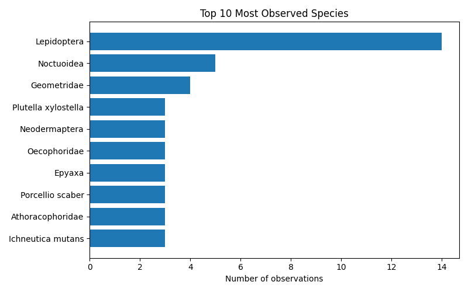
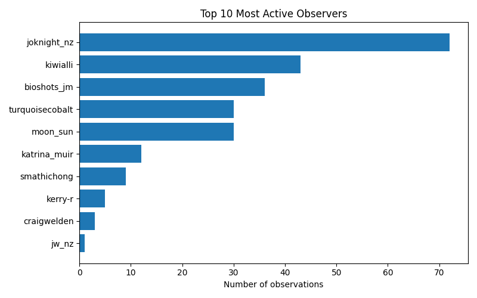

# iNaturalist Project Report: great-southern-bioblitz-2025-umbrella

- Total observations: 258
- Unique species observed: 187
- Unique observers: 27

## Wikipedia & Wikidata Coverage

- Species not on Wikidata: **3**
- Missing in en: **25**

- Missing in es: **109**

- Missing in ja: **153**

- Missing in ar: **137**

- Missing in nl: **53**

- Missing in pt: **129**

- Missing in fr: **92**

| Taxon | Wikidata | GBIF | iNaturalist | EN | ES | JA | AR | NL | PT | FR |
|---|---|---|---|---|---|---|---|---|---|---|
| Agaricineae | [Q27940611](https://www.wikidata.org/entity/Q27940611) | — | [785517](https://www.inaturalist.org/taxa/785517) | &#10007; | &#10007; | &#10007; | &#10007; | &#10007; | &#10007; | &#10007; |
| Epidermaptera | [Q111097113](https://www.wikidata.org/entity/Q111097113) | — | — | &#10007; | &#10007; | &#10007; | &#10007; | &#10007; | &#10007; | &#10007; |
| Hirundo neoxena neoxena | [Q27624547](https://www.wikidata.org/entity/Q27624547) | [6085840](https://www.gbif.org/species/6085840) | [424224](https://www.inaturalist.org/taxa/424224) | &#10007; | &#10007; | &#10007; | &#10007; | &#10007; | &#10007; | &#10007; |
| Keroplatini | [Q21218524](https://www.wikidata.org/entity/Q21218524) | — | — | &#10007; | &#10007; | &#10007; | &#10007; | &#10007; | &#10007; | &#10007; |
| Polistes humilis humilis | [Q49440026](https://www.wikidata.org/entity/Q49440026) | [7217903](https://www.gbif.org/species/7217903) | [196560](https://www.inaturalist.org/taxa/196560) | &#10007; | &#10007; | &#10007; | &#10007; | &#10007; | &#10007; | &#10007; |
| Polypedilum pavidum | [Q14557573](https://www.wikidata.org/entity/Q14557573) | [1455897](https://www.gbif.org/species/1455897) | [395499](https://www.inaturalist.org/taxa/395499) | &#10007; | &#10007; | &#10007; | &#10007; | &#10007; | &#10007; | &#10007; |
| Polyzosteriinae | [Q21226755](https://www.wikidata.org/entity/Q21226755) | — | — | &#10007; | &#10007; | &#10007; | &#10007; | &#10007; | &#10007; | &#10007; |
| Pterohelaeus | [Q112248020](https://www.wikidata.org/entity/Q112248020) | [4573598](https://www.gbif.org/species/4573598) | [489951](https://www.inaturalist.org/taxa/489951) | &#10007; | &#10007; | &#10007; | &#10007; | &#10007; | &#10007; | &#10007; |
| Sericesthis | [Q14862973](https://www.wikidata.org/entity/Q14862973) | [1056829](https://www.gbif.org/species/1056829) | [417815](https://www.inaturalist.org/taxa/417815) | &#10007; | &#10007; | &#10007; | &#10007; | &#10007; | &#10007; | &#10007; |
| Suaeda novae-zelandiae | [Q17242198](https://www.wikidata.org/entity/Q17242198) | [3756590](https://www.gbif.org/species/3756590) | [406366](https://www.inaturalist.org/taxa/406366) | &#10007; | &#10007; | &#10007; | &#10007; | &#10007; | &#10007; | &#10007; |
| Syncometes | [Q112787113](https://www.wikidata.org/entity/Q112787113) | [4685777](https://www.gbif.org/species/4685777) | [510267](https://www.inaturalist.org/taxa/510267) | &#10007; | &#10007; | &#10007; | &#10007; | &#10007; | &#10007; | &#10007; |
| Tetragonia trigyna | [Q65950399](https://www.wikidata.org/entity/Q65950399) | — | [1269617](https://www.inaturalist.org/taxa/1269617) | &#10007; | &#10007; | &#10007; | &#10007; | &#10007; | &#10007; | &#10007; |
| Tornatellides subperforatus subperforatus | [Q106341923](https://www.wikidata.org/entity/Q106341923) | [6182022](https://www.gbif.org/species/6182022) | [411851](https://www.inaturalist.org/taxa/411851) | &#10007; | &#10007; | &#10007; | &#10007; | &#10007; | &#10007; | &#10007; |
| Turdus philomelos clarkei | [Q27631176](https://www.wikidata.org/entity/Q27631176) | [6094430](https://www.gbif.org/species/6094430) | [702675](https://www.inaturalist.org/taxa/702675) | &#10007; | &#10007; | &#10007; | &#10007; | &#10007; | &#10007; | &#10007; |
| Apodasmia similis | [Q4780164](https://www.wikidata.org/entity/Q4780164) | [5290422](https://www.gbif.org/species/5290422) | [380700](https://www.inaturalist.org/taxa/380700) | [&#10003;](https://en.wikipedia.org/wiki/Apodasmia_similis) | &#10007; | &#10007; | &#10007; | &#10007; | &#10007; | &#10007; |
| Austrocidaria gobiata | [Q13879128](https://www.wikidata.org/entity/Q13879128) | [1976934](https://www.gbif.org/species/1976934) | [379975](https://www.inaturalist.org/taxa/379975) | [&#10003;](https://en.wikipedia.org/wiki/Austrocidaria_gobiata) | &#10007; | &#10007; | &#10007; | &#10007; | &#10007; | &#10007; |
| Austrocidaria similata | [Q4825600](https://www.wikidata.org/entity/Q4825600) | [1976941](https://www.gbif.org/species/1976941) | [379983](https://www.inaturalist.org/taxa/379983) | [&#10003;](https://en.wikipedia.org/wiki/Austrocidaria_similata) | &#10007; | &#10007; | &#10007; | &#10007; | &#10007; | &#10007; |
| Cheirodes | [Q33458701](https://www.wikidata.org/entity/Q33458701) | [4722987](https://www.gbif.org/species/4722987) | [554354](https://www.inaturalist.org/taxa/554354) | [&#10003;](https://en.wikipedia.org/wiki/Cheirodes) | &#10007; | &#10007; | &#10007; | &#10007; | &#10007; | &#10007; |
| Epicyme rubropunctaria | [Q5382671](https://www.wikidata.org/entity/Q5382671) | [1988894](https://www.gbif.org/species/1988894) | [341935](https://www.inaturalist.org/taxa/341935) | [&#10003;](https://en.wikipedia.org/wiki/Epicyme_rubropunctaria) | &#10007; | &#10007; | &#10007; | &#10007; | &#10007; | &#10007; |
| Epyaxa rosearia | [Q5384072](https://www.wikidata.org/entity/Q5384072) | [1955753](https://www.gbif.org/species/1955753) | [320914](https://www.inaturalist.org/taxa/320914) | [&#10003;](https://en.wikipedia.org/wiki/Epyaxa_rosearia) | &#10007; | &#10007; | &#10007; | &#10007; | &#10007; | &#10007; |
| Eudonia sabulosella | [Q42075663](https://www.wikidata.org/entity/Q42075663) | [5802333](https://www.gbif.org/species/5802333) | [389305](https://www.inaturalist.org/taxa/389305) | [&#10003;](https://en.wikipedia.org/wiki/Eudonia_sabulosella) | &#10007; | &#10007; | &#10007; | &#10007; | &#10007; | &#10007; |
| Euphronarcha luxaria | [Q13555077](https://www.wikidata.org/entity/Q13555077) | [1988820](https://www.gbif.org/species/1988820) | [491994](https://www.inaturalist.org/taxa/491994) | &#10007; | &#10007; | &#10007; | &#10007; | [&#10003;](https://nl.wikipedia.org/wiki/Euphronarcha_luxaria) | &#10007; | &#10007; |
| Helastia cinerearia | [Q13559852](https://www.wikidata.org/entity/Q13559852) | [1955422](https://www.gbif.org/species/1955422) | [390322](https://www.inaturalist.org/taxa/390322) | [&#10003;](https://en.wikipedia.org/wiki/Helastia_cinerearia) | &#10007; | &#10007; | &#10007; | &#10007; | &#10007; | &#10007; |
| Hydrellia tritici | [Q14597954](https://www.wikidata.org/entity/Q14597954) | [1617584](https://www.gbif.org/species/1617584) | [408706](https://www.inaturalist.org/taxa/408706) | [&#10003;](https://en.wikipedia.org/wiki/Hydrellia_tritici) | &#10007; | &#10007; | &#10007; | &#10007; | &#10007; | &#10007; |
| Ichneutica mutans | [Q104178300](https://www.wikidata.org/entity/Q104178300) | [10891794](https://www.gbif.org/species/10891794) | [974679](https://www.inaturalist.org/taxa/974679) | [&#10003;](https://en.wikipedia.org/wiki/Ichneutica_mutans) | &#10007; | &#10007; | &#10007; | &#10007; | &#10007; | &#10007; |
| Ichneutica steropastis | [Q104357147](https://www.wikidata.org/entity/Q104357147) | — | [974628](https://www.inaturalist.org/taxa/974628) | [&#10003;](https://en.wikipedia.org/wiki/Ichneutica_steropastis) | &#10007; | &#10007; | &#10007; | &#10007; | &#10007; | &#10007; |
| Kongobatha | [Q10547594](https://www.wikidata.org/entity/Q10547594) | [1404003](https://www.gbif.org/species/1404003) | [566206](https://www.inaturalist.org/taxa/566206) | &#10007; | [&#10003;](https://es.wikipedia.org/wiki/Kongobatha) | &#10007; | &#10007; | &#10007; | &#10007; | &#10007; |
| Kongobatha diademata | [Q10547595](https://www.wikidata.org/entity/Q10547595) | [1404005](https://www.gbif.org/species/1404005) | [566205](https://www.inaturalist.org/taxa/566205) | &#10007; | [&#10003;](https://es.wikipedia.org/wiki/Kongobatha_diademata) | &#10007; | &#10007; | &#10007; | &#10007; | &#10007; |
| Limacinae | [Q6548853](https://www.wikidata.org/entity/Q6548853) | — | — | [&#10003;](https://en.wikipedia.org/wiki/Limacinae) | &#10007; | &#10007; | &#10007; | &#10007; | &#10007; | &#10007; |
| Morelia spilota mcdowelli | [Q6911326](https://www.wikidata.org/entity/Q6911326) | [5225675](https://www.gbif.org/species/5225675) | [32174](https://www.inaturalist.org/taxa/32174) | [&#10003;](https://en.wikipedia.org/wiki/Morelia_spilota_mcdowelli) | &#10007; | &#10007; | &#10007; | &#10007; | &#10007; | &#10007; |
| Muehlenbeckia australis | [Q15600466](https://www.wikidata.org/entity/Q15600466) | [4033148](https://www.gbif.org/species/4033148) | [366725](https://www.inaturalist.org/taxa/366725) | [&#10003;](https://en.wikipedia.org/wiki/Muehlenbeckia_australis) | &#10007; | &#10007; | &#10007; | &#10007; | &#10007; | &#10007; |
| Pantomorus cervinus | [Q15736159](https://www.wikidata.org/entity/Q15736159) | [4291713](https://www.gbif.org/species/4291713) | [318474](https://www.inaturalist.org/taxa/318474) | &#10007; | &#10007; | &#10007; | &#10007; | [&#10003;](https://nl.wikipedia.org/wiki/Pantomorus_cervinus) | &#10007; | &#10007; |
| Parellipsidion | [Q10620230](https://www.wikidata.org/entity/Q10620230) | [1997311](https://www.gbif.org/species/1997311) | [374193](https://www.inaturalist.org/taxa/374193) | [&#10003;](https://en.wikipedia.org/wiki/Parellipsidion) | &#10007; | &#10007; | &#10007; | &#10007; | &#10007; | &#10007; |
| Scioglyptis canescaria | [Q13558925](https://www.wikidata.org/entity/Q13558925) | [1962162](https://www.gbif.org/species/1962162) | [555497](https://www.inaturalist.org/taxa/555497) | &#10007; | &#10007; | &#10007; | &#10007; | [&#10003;](https://nl.wikipedia.org/wiki/Scioglyptis_canescaria) | &#10007; | &#10007; |
| Sphictostethus nitidus | [Q7576759](https://www.wikidata.org/entity/Q7576759) | [1311928](https://www.gbif.org/species/1311928) | [397328](https://www.inaturalist.org/taxa/397328) | [&#10003;](https://en.wikipedia.org/wiki/Sphictostethus_nitidus) | &#10007; | &#10007; | &#10007; | &#10007; | &#10007; | &#10007; |
| Sylvicola dubius | [Q14670158](https://www.wikidata.org/entity/Q14670158) | [5076416](https://www.gbif.org/species/5076416) | [451818](https://www.inaturalist.org/taxa/451818) | [&#10003;](https://en.wikipedia.org/wiki/Sylvicola_dubius) | &#10007; | &#10007; | &#10007; | &#10007; | &#10007; | &#10007; |
| Sylvicola notatus | [Q14670164](https://www.wikidata.org/entity/Q14670164) | [5076452](https://www.gbif.org/species/5076452) | [397648](https://www.inaturalist.org/taxa/397648) | [&#10003;](https://en.wikipedia.org/wiki/Sylvicola_notatus) | &#10007; | &#10007; | &#10007; | &#10007; | &#10007; | &#10007; |
| Urolitha bipunctifera | [Q13541016](https://www.wikidata.org/entity/Q13541016) | [1959500](https://www.gbif.org/species/1959500) | [491090](https://www.inaturalist.org/taxa/491090) | &#10007; | &#10007; | &#10007; | &#10007; | [&#10003;](https://nl.wikipedia.org/wiki/Urolitha_bipunctifera) | &#10007; | &#10007; |
| Wingia lambertella | [Q14520102](https://www.wikidata.org/entity/Q14520102) | [5120063](https://www.gbif.org/species/5120063) | [418488](https://www.inaturalist.org/taxa/418488) | &#10007; | &#10007; | &#10007; | &#10007; | [&#10003;](https://nl.wikipedia.org/wiki/Wingia_lambertella) | &#10007; | &#10007; |
| Wiseana | [Q543186](https://www.wikidata.org/entity/Q543186) | [1828394](https://www.gbif.org/species/1828394) | [378573](https://www.inaturalist.org/taxa/378573) | [&#10003;](https://en.wikipedia.org/wiki/Wiseana) | &#10007; | &#10007; | &#10007; | &#10007; | &#10007; | &#10007; |
| Aenetus virescens | [Q507767](https://www.wikidata.org/entity/Q507767) | [1828826](https://www.gbif.org/species/1828826) | [409639](https://www.inaturalist.org/taxa/409639) | [&#10003;](https://en.wikipedia.org/wiki/P%C5%ABriri_moth) | &#10007; | &#10007; | &#10007; | [&#10003;](https://nl.wikipedia.org/wiki/Aenetus_virescens) | &#10007; | &#10007; |
| Amphineurus hudsoni | [Q3163706](https://www.wikidata.org/entity/Q3163706) | [1518358](https://www.gbif.org/species/1518358) | [385450](https://www.inaturalist.org/taxa/385450) | [&#10003;](https://en.wikipedia.org/wiki/Amphineurus_hudsoni) | &#10007; | &#10007; | &#10007; | [&#10003;](https://nl.wikipedia.org/wiki/Amphineurus_(Amphineurus)_hudsoni) | &#10007; | &#10007; |
| Amphiongia | [Q4748321](https://www.wikidata.org/entity/Q4748321) | [1780861](https://www.gbif.org/species/1780861) | [502352](https://www.inaturalist.org/taxa/502352) | [&#10003;](https://en.wikipedia.org/wiki/Amphiongia) | &#10007; | &#10007; | &#10007; | &#10007; | [&#10003;](https://pt.wikipedia.org/wiki/Amphiongia) | &#10007; |
| Caedicia | [Q10439162](https://www.wikidata.org/entity/Q10439162) | [1687431](https://www.gbif.org/species/1687431) | [210943](https://www.inaturalist.org/taxa/210943) | [&#10003;](https://en.wikipedia.org/wiki/Caedicia) | &#10007; | &#10007; | &#10007; | [&#10003;](https://nl.wikipedia.org/wiki/Caedicia) | &#10007; | &#10007; |
| Carposinoidea | [Q2940162](https://www.wikidata.org/entity/Q2940162) | — | — | [&#10003;](https://en.wikipedia.org/wiki/Carposinoidea) | &#10007; | &#10007; | &#10007; | &#10007; | &#10007; | [&#10003;](https://fr.wikipedia.org/wiki/Carposinoidea) |
| Cebysa leucotelus | [Q5055839](https://www.wikidata.org/entity/Q5055839) | [1854249](https://www.gbif.org/species/1854249) | [380047](https://www.inaturalist.org/taxa/380047) | [&#10003;](https://en.wikipedia.org/wiki/Cebysa_leucotelus) | &#10007; | &#10007; | &#10007; | [&#10003;](https://nl.wikipedia.org/wiki/Cebysa_leucotelus) | &#10007; | &#10007; |
| Chinamiris | [Q10449968](https://www.wikidata.org/entity/Q10449968) | [3265477](https://www.gbif.org/species/3265477) | [375962](https://www.inaturalist.org/taxa/375962) | [&#10003;](https://en.wikipedia.org/wiki/Chinamiris) | &#10007; | &#10007; | &#10007; | [&#10003;](https://nl.wikipedia.org/wiki/Chinamiris) | &#10007; | &#10007; |
| Cochlicella | [Q5139360](https://www.wikidata.org/entity/Q5139360) | [2296806](https://www.gbif.org/species/2296806) | [172086](https://www.inaturalist.org/taxa/172086) | [&#10003;](https://en.wikipedia.org/wiki/Cochlicella) | &#10007; | &#10007; | &#10007; | [&#10003;](https://nl.wikipedia.org/wiki/Cochlicella) | &#10007; | &#10007; |
| Cryptachaea veruculata | [Q2177551](https://www.wikidata.org/entity/Q2177551) | [4550810](https://www.gbif.org/species/4550810) | [370288](https://www.inaturalist.org/taxa/370288) | [&#10003;](https://en.wikipedia.org/wiki/Cryptachaea_veruculata) | &#10007; | &#10007; | &#10007; | [&#10003;](https://nl.wikipedia.org/wiki/Cryptachaea_veruculata) | &#10007; | &#10007; |
| Declana floccosa | [Q5249401](https://www.wikidata.org/entity/Q5249401) | [1972800](https://www.gbif.org/species/1972800) | [388455](https://www.inaturalist.org/taxa/388455) | [&#10003;](https://en.wikipedia.org/wiki/Declana_floccosa) | &#10007; | &#10007; | &#10007; | [&#10003;](https://nl.wikipedia.org/wiki/Declana_floccosa) | &#10007; | &#10007; |
| Drepanacra binocula | [Q2194854](https://www.wikidata.org/entity/Q2194854) | [2101900](https://www.gbif.org/species/2101900) | [388754](https://www.inaturalist.org/taxa/388754) | [&#10003;](https://en.wikipedia.org/wiki/Drepanacra_binocula) | &#10007; | &#10007; | &#10007; | [&#10003;](https://nl.wikipedia.org/wiki/Drepanacra_binocula) | &#10007; | &#10007; |
| Epiphryne verriculata | [Q5383164](https://www.wikidata.org/entity/Q5383164) | [1962656](https://www.gbif.org/species/1962656) | [50194](https://www.inaturalist.org/taxa/50194) | [&#10003;](https://en.wikipedia.org/wiki/Epiphryne_verriculata) | &#10007; | &#10007; | &#10007; | [&#10003;](https://nl.wikipedia.org/wiki/Epiphryne_verriculata) | &#10007; | &#10007; |
| Epyaxa | [Q5384070](https://www.wikidata.org/entity/Q5384070) | [1955752](https://www.gbif.org/species/1955752) | [209322](https://www.inaturalist.org/taxa/209322) | [&#10003;](https://en.wikipedia.org/wiki/Epyaxa) | [&#10003;](https://es.wikipedia.org/wiki/Epyaxa) | &#10007; | &#10007; | &#10007; | &#10007; | &#10007; |
| Erechthias capnitis | [Q13483260](https://www.wikidata.org/entity/Q13483260) | [1857233](https://www.gbif.org/species/1857233) | [410412](https://www.inaturalist.org/taxa/410412) | [&#10003;](https://en.wikipedia.org/wiki/Erechthias_capnitis) | &#10007; | &#10007; | &#10007; | [&#10003;](https://nl.wikipedia.org/wiki/Erechthias_capnitis) | &#10007; | &#10007; |
| Eudonia submarginalis | [Q5406725](https://www.wikidata.org/entity/Q5406725) | [5126344](https://www.gbif.org/species/5126344) | [389308](https://www.inaturalist.org/taxa/389308) | [&#10003;](https://en.wikipedia.org/wiki/Eudonia_submarginalis) | &#10007; | &#10007; | &#10007; | [&#10003;](https://nl.wikipedia.org/wiki/Eudonia_submarginalis) | &#10007; | &#10007; |
| Faveria | [Q18580287](https://www.wikidata.org/entity/Q18580287) | [4407363](https://www.gbif.org/species/4407363) | [471541](https://www.inaturalist.org/taxa/471541) | [&#10003;](https://en.wikipedia.org/wiki/Faveria) | &#10007; | &#10007; | &#10007; | [&#10003;](https://nl.wikipedia.org/wiki/Faveria) | &#10007; | &#10007; |
| Hemerobiiformia | [Q15712875](https://www.wikidata.org/entity/Q15712875) | — | [483236](https://www.inaturalist.org/taxa/483236) | [&#10003;](https://en.wikipedia.org/wiki/Hemerobiiformia) | &#10007; | &#10007; | [&#10003;](https://ar.wikipedia.org/wiki/%D8%B4%D8%A8%D9%8A%D9%87%D8%A7%D8%AA_%D8%A3%D8%B3%D8%AF%D9%8A%D8%A7%D8%AA_%D8%A7%D9%84%D8%A3%D8%B1%D9%82) | &#10007; | &#10007; | &#10007; |
| Heteronychus arator | [Q14867895](https://www.wikidata.org/entity/Q14867895) | [4995411](https://www.gbif.org/species/4995411) | [320989](https://www.inaturalist.org/taxa/320989) | [&#10003;](https://en.wikipedia.org/wiki/Heteronychus_arator) | &#10007; | &#10007; | &#10007; | &#10007; | &#10007; | [&#10003;](https://fr.wikipedia.org/wiki/Heteronychus_arator) |
| Izatha attactella | [Q10766953](https://www.wikidata.org/entity/Q10766953) | [1838629](https://www.gbif.org/species/1838629) | [391092](https://www.inaturalist.org/taxa/391092) | [&#10003;](https://en.wikipedia.org/wiki/Izatha_attactella) | &#10007; | &#10007; | &#10007; | [&#10003;](https://nl.wikipedia.org/wiki/Izatha_attactella) | &#10007; | &#10007; |
| Lampona cylindrata | [Q2248197](https://www.wikidata.org/entity/Q2248197) | [2167764](https://www.gbif.org/species/2167764) | [391331](https://www.inaturalist.org/taxa/391331) | &#10007; | &#10007; | &#10007; | &#10007; | [&#10003;](https://nl.wikipedia.org/wiki/Lampona_cylindrata) | &#10007; | [&#10003;](https://fr.wikipedia.org/wiki/Lampona_cylindrata) |
| Liothula omnivora | [Q13483003](https://www.wikidata.org/entity/Q13483003) | [1854906](https://www.gbif.org/species/1854906) | [408761](https://www.inaturalist.org/taxa/408761) | [&#10003;](https://en.wikipedia.org/wiki/Liothula_omnivora) | &#10007; | &#10007; | &#10007; | [&#10003;](https://nl.wikipedia.org/wiki/Liothula_omnivora) | &#10007; | &#10007; |
| Mallada | [Q10575951](https://www.wikidata.org/entity/Q10575951) | [2104765](https://www.gbif.org/species/2104765) | [355031](https://www.inaturalist.org/taxa/355031) | [&#10003;](https://en.wikipedia.org/wiki/Mallada) | &#10007; | &#10007; | &#10007; | [&#10003;](https://nl.wikipedia.org/wiki/Mallada) | &#10007; | &#10007; |
| Mallada signatus | [Q4338695](https://www.wikidata.org/entity/Q4338695) | [2104808](https://www.gbif.org/species/2104808) | [355029](https://www.inaturalist.org/taxa/355029) | [&#10003;](https://en.wikipedia.org/wiki/Mallada_signatus) | &#10007; | &#10007; | &#10007; | [&#10003;](https://nl.wikipedia.org/wiki/Mallada_signatus) | &#10007; | &#10007; |
| Micromus tasmaniae | [Q2125396](https://www.wikidata.org/entity/Q2125396) | [2102733](https://www.gbif.org/species/2102733) | [211192](https://www.inaturalist.org/taxa/211192) | [&#10003;](https://en.wikipedia.org/wiki/Micromus_tasmaniae) | &#10007; | &#10007; | &#10007; | [&#10003;](https://nl.wikipedia.org/wiki/Micromus_tasmaniae) | &#10007; | &#10007; |
| Milax gagates | [Q3074673](https://www.wikidata.org/entity/Q3074673) | [2297108](https://www.gbif.org/species/2297108) | [225159](https://www.inaturalist.org/taxa/225159) | [&#10003;](https://en.wikipedia.org/wiki/Milax_gagates) | &#10007; | &#10007; | &#10007; | [&#10003;](https://nl.wikipedia.org/wiki/Zwarte_kielnaaktslak) | &#10007; | &#10007; |
| Neodermaptera | [Q16688639](https://www.wikidata.org/entity/Q16688639) | — | — | [&#10003;](https://en.wikipedia.org/wiki/Neodermaptera) | &#10007; | &#10007; | [&#10003;](https://ar.wikipedia.org/wiki/%D8%AC%D9%84%D8%AF%D9%8A%D8%A7%D8%AA_%D8%A7%D9%84%D8%A3%D8%AC%D9%86%D8%AD%D8%A9_%D8%A7%D9%84%D8%AD%D8%AF%D9%8A%D8%AB%D8%A9) | &#10007; | &#10007; | &#10007; |
| Orocrambus flexuosellus | [Q7103724](https://www.wikidata.org/entity/Q7103724) | [1880318](https://www.gbif.org/species/1880318) | [394064](https://www.inaturalist.org/taxa/394064) | [&#10003;](https://en.wikipedia.org/wiki/Orocrambus_flexuosellus) | &#10007; | &#10007; | &#10007; | [&#10003;](https://nl.wikipedia.org/wiki/Orocrambus_flexuosellus) | &#10007; | &#10007; |
| Orthoclydon praefectata | [Q13549200](https://www.wikidata.org/entity/Q13549200) | [1959379](https://www.gbif.org/species/1959379) | [394123](https://www.inaturalist.org/taxa/394123) | [&#10003;](https://en.wikipedia.org/wiki/Orthoclydon_praefectata) | &#10007; | &#10007; | &#10007; | [&#10003;](https://nl.wikipedia.org/wiki/Orthoclydon_praefectata) | &#10007; | &#10007; |
| Panesthia australis | [Q10615937](https://www.wikidata.org/entity/Q10615937) | [1993993](https://www.gbif.org/species/1993993) | [490476](https://www.inaturalist.org/taxa/490476) | [&#10003;](https://en.wikipedia.org/wiki/Panesthia_australis) | [&#10003;](https://es.wikipedia.org/wiki/Panesthia_australis) | &#10007; | &#10007; | &#10007; | &#10007; | &#10007; |
| Pantydia sparsa | [Q7131943](https://www.wikidata.org/entity/Q7131943) | [1798023](https://www.gbif.org/species/1798023) | [355121](https://www.inaturalist.org/taxa/355121) | [&#10003;](https://en.wikipedia.org/wiki/Pantydia_sparsa) | &#10007; | &#10007; | &#10007; | [&#10003;](https://nl.wikipedia.org/wiki/Pantydia_sparsa) | &#10007; | &#10007; |
| Pasiphilodes testulata | [Q13878955](https://www.wikidata.org/entity/Q13878955) | [1954236](https://www.gbif.org/species/1954236) | [893613](https://www.inaturalist.org/taxa/893613) | [&#10003;](https://en.wikipedia.org/wiki/Pasiphilodes_testulata) | [&#10003;](https://es.wikipedia.org/wiki/Pasiphilodes_testulata) | &#10007; | &#10007; | &#10007; | &#10007; | &#10007; |
| Philenora aspectalella | [Q13531785](https://www.wikidata.org/entity/Q13531785) | [1804727](https://www.gbif.org/species/1804727) | [355107](https://www.inaturalist.org/taxa/355107) | [&#10003;](https://en.wikipedia.org/wiki/Philenora_aspectalella) | &#10007; | &#10007; | &#10007; | [&#10003;](https://nl.wikipedia.org/wiki/Philenora_aspectalella) | &#10007; | &#10007; |
| Poecilasthena pulchraria | [Q7207287](https://www.wikidata.org/entity/Q7207287) | [1980063](https://www.gbif.org/species/1980063) | [355101](https://www.inaturalist.org/taxa/355101) | [&#10003;](https://en.wikipedia.org/wiki/Poecilasthena_pulchraria) | &#10007; | &#10007; | &#10007; | [&#10003;](https://nl.wikipedia.org/wiki/Poecilasthena_pulchraria) | &#10007; | &#10007; |
| Polistes chinensis | [Q7210114](https://www.wikidata.org/entity/Q7210114) | [1310897](https://www.gbif.org/species/1310897) | [199179](https://www.inaturalist.org/taxa/199179) | [&#10003;](https://en.wikipedia.org/wiki/Polistes_chinensis) | &#10007; | &#10007; | &#10007; | &#10007; | &#10007; | [&#10003;](https://fr.wikipedia.org/wiki/Polistes_chinensis) |
| Pseudocoremia leucelaea | [Q7254705](https://www.wikidata.org/entity/Q7254705) | [1964144](https://www.gbif.org/species/1964144) | [410509](https://www.inaturalist.org/taxa/410509) | [&#10003;](https://en.wikipedia.org/wiki/Pseudocoremia_leucelaea) | &#10007; | &#10007; | &#10007; | [&#10003;](https://nl.wikipedia.org/wiki/Pseudocoremia_leucelaea) | &#10007; | &#10007; |
| Psychoda sigma | [Q11943173](https://www.wikidata.org/entity/Q11943173) | [1640028](https://www.gbif.org/species/1640028) | [622721](https://www.inaturalist.org/taxa/622721) | [&#10003;](https://en.wikipedia.org/wiki/Psychoda_sigma) | &#10007; | &#10007; | &#10007; | [&#10003;](https://nl.wikipedia.org/wiki/Psychoda_sigma) | &#10007; | &#10007; |
| Rhapsa scotosialis | [Q7320233](https://www.wikidata.org/entity/Q7320233) | [1780857](https://www.gbif.org/species/1780857) | [243982](https://www.inaturalist.org/taxa/243982) | [&#10003;](https://en.wikipedia.org/wiki/Rhapsa_scotosialis) | &#10007; | &#10007; | &#10007; | [&#10003;](https://nl.wikipedia.org/wiki/Rhapsa_scotosialis) | &#10007; | &#10007; |
| Siphanta acuta | [Q10668572](https://www.wikidata.org/entity/Q10668572) | [2066903](https://www.gbif.org/species/2066903) | [116658](https://www.inaturalist.org/taxa/116658) | [&#10003;](https://en.wikipedia.org/wiki/Siphanta_acuta) | &#10007; | &#10007; | &#10007; | &#10007; | &#10007; | [&#10003;](https://fr.wikipedia.org/wiki/Siphanta_acuta) |
| Stathmopoda plumbiflua | [Q14384476](https://www.wikidata.org/entity/Q14384476) | [1831667](https://www.gbif.org/species/1831667) | [407195](https://www.inaturalist.org/taxa/407195) | [&#10003;](https://en.wikipedia.org/wiki/Stathmopoda_plumbiflua) | &#10007; | &#10007; | &#10007; | [&#10003;](https://nl.wikipedia.org/wiki/Stathmopoda_plumbiflua) | &#10007; | &#10007; |
| Stathmopoda skelloni | [Q14384821](https://www.wikidata.org/entity/Q14384821) | [1831473](https://www.gbif.org/species/1831473) | [397431](https://www.inaturalist.org/taxa/397431) | [&#10003;](https://en.wikipedia.org/wiki/Stathmopoda_skelloni) | &#10007; | &#10007; | &#10007; | [&#10003;](https://nl.wikipedia.org/wiki/Stathmopoda_skelloni) | &#10007; | &#10007; |
| Syneora hemeropa | [Q7662371](https://www.wikidata.org/entity/Q7662371) | [1965649](https://www.gbif.org/species/1965649) | [417801](https://www.inaturalist.org/taxa/417801) | [&#10003;](https://en.wikipedia.org/wiki/Syneora_hemeropa) | &#10007; | &#10007; | &#10007; | [&#10003;](https://nl.wikipedia.org/wiki/Syneora_hemeropa) | &#10007; | &#10007; |
| Xanthocnemis zealandica | [Q8042995](https://www.wikidata.org/entity/Q8042995) | [1423490](https://www.gbif.org/species/1423490) | [338504](https://www.inaturalist.org/taxa/338504) | [&#10003;](https://en.wikipedia.org/wiki/Xanthocnemis_zealandica) | &#10007; | &#10007; | &#10007; | [&#10003;](https://nl.wikipedia.org/wiki/Xanthocnemis_zealandica) | &#10007; | &#10007; |
| Agrotis porphyricollis | [Q2827258](https://www.wikidata.org/entity/Q2827258) | [1771203](https://www.gbif.org/species/1771203) | [418042](https://www.inaturalist.org/taxa/418042) | [&#10003;](https://en.wikipedia.org/wiki/Agrotis_porphyricollis) | &#10007; | &#10007; | &#10007; | [&#10003;](https://nl.wikipedia.org/wiki/Agrotis_porphyricollis) | &#10007; | [&#10003;](https://fr.wikipedia.org/wiki/Agrotis_porphyricollis) |
| Ambigolimax | [Q20685871](https://www.wikidata.org/entity/Q20685871) | [4584368](https://www.gbif.org/species/4584368) | [448395](https://www.inaturalist.org/taxa/448395) | [&#10003;](https://en.wikipedia.org/wiki/Ambigolimax) | &#10007; | &#10007; | &#10007; | [&#10003;](https://nl.wikipedia.org/wiki/Ambigolimax) | &#10007; | [&#10003;](https://fr.wikipedia.org/wiki/Ambigolimax) |
| Asura | [Q4811901](https://www.wikidata.org/entity/Q4811901) | [1817136](https://www.gbif.org/species/1817136) | [124525](https://www.inaturalist.org/taxa/124525) | [&#10003;](https://en.wikipedia.org/wiki/Asura_(moth)) | &#10007; | &#10007; | &#10007; | [&#10003;](https://nl.wikipedia.org/wiki/Asura_(geslacht)) | &#10007; | [&#10003;](https://fr.wikipedia.org/wiki/Asura_(papillon)) |
| Athoracophoridae | [Q146753](https://www.wikidata.org/entity/Q146753) | [9464](https://www.gbif.org/species/9464) | [372955](https://www.inaturalist.org/taxa/372955) | [&#10003;](https://en.wikipedia.org/wiki/Athoracophoridae) | &#10007; | &#10007; | &#10007; | [&#10003;](https://nl.wikipedia.org/wiki/Athoracophoridae) | &#10007; | [&#10003;](https://fr.wikipedia.org/wiki/Athoracophoridae) |
| Badumna longinqua | [Q3214653](https://www.wikidata.org/entity/Q3214653) | [2142995](https://www.gbif.org/species/2142995) | [47135](https://www.inaturalist.org/taxa/47135) | [&#10003;](https://en.wikipedia.org/wiki/Badumna_longinqua) | &#10007; | &#10007; | &#10007; | [&#10003;](https://nl.wikipedia.org/wiki/Badumna_longinqua) | &#10007; | [&#10003;](https://fr.wikipedia.org/wiki/Badumna_longinqua) |
| Blastobasis | [Q4925447](https://www.wikidata.org/entity/Q4925447) | [1852745](https://www.gbif.org/species/1852745) | [173333](https://www.inaturalist.org/taxa/173333) | [&#10003;](https://en.wikipedia.org/wiki/Blastobasis) | &#10007; | &#10007; | &#10007; | [&#10003;](https://nl.wikipedia.org/wiki/Blastobasis) | [&#10003;](https://pt.wikipedia.org/wiki/Blastobasis) | &#10007; |
| Capua intractana | [Q2937704](https://www.wikidata.org/entity/Q2937704) | [1748425](https://www.gbif.org/species/1748425) | [243647](https://www.inaturalist.org/taxa/243647) | [&#10003;](https://en.wikipedia.org/wiki/Capua_intractana) | &#10007; | &#10007; | &#10007; | [&#10003;](https://nl.wikipedia.org/wiki/Capua_intractana) | &#10007; | [&#10003;](https://fr.wikipedia.org/wiki/Capua_intractana) |
| Chloroclystis filata | [Q2964112](https://www.wikidata.org/entity/Q2964112) | [1989377](https://www.gbif.org/species/1989377) | [387556](https://www.inaturalist.org/taxa/387556) | [&#10003;](https://en.wikipedia.org/wiki/Chloroclystis_filata) | &#10007; | &#10007; | &#10007; | [&#10003;](https://nl.wikipedia.org/wiki/Chloroclystis_filata) | &#10007; | [&#10003;](https://fr.wikipedia.org/wiki/Chloroclystis_filata) |
| Chrysodeixis argentifera | [Q1595548](https://www.wikidata.org/entity/Q1595548) | [1785149](https://www.gbif.org/species/1785149) | [146812](https://www.inaturalist.org/taxa/146812) | [&#10003;](https://en.wikipedia.org/wiki/Chrysodeixis_argentifera) | &#10007; | &#10007; | &#10007; | [&#10003;](https://nl.wikipedia.org/wiki/Chrysodeixis_argentifera) | &#10007; | [&#10003;](https://fr.wikipedia.org/wiki/Chrysodeixis_argentifera) |
| Ctenopseustis | [Q5191719](https://www.wikidata.org/entity/Q5191719) | [1739550](https://www.gbif.org/species/1739550) | [376098](https://www.inaturalist.org/taxa/376098) | [&#10003;](https://en.wikipedia.org/wiki/Ctenopseustis) | [&#10003;](https://es.wikipedia.org/wiki/Ctenopseustis) | &#10007; | &#10007; | [&#10003;](https://nl.wikipedia.org/wiki/Ctenopseustis) | &#10007; | &#10007; |
| Dasypodia selenophora | [Q3016882](https://www.wikidata.org/entity/Q3016882) | [1761751](https://www.gbif.org/species/1761751) | [337689](https://www.inaturalist.org/taxa/337689) | [&#10003;](https://en.wikipedia.org/wiki/Dasypodia_selenophora) | &#10007; | &#10007; | &#10007; | [&#10003;](https://nl.wikipedia.org/wiki/Dasypodia_selenophora) | &#10007; | [&#10003;](https://fr.wikipedia.org/wiki/Dasypodia_selenophora) |
| Elusa | [Q41153353](https://www.wikidata.org/entity/Q41153353) | [1781546](https://www.gbif.org/species/1781546) | [319105](https://www.inaturalist.org/taxa/319105) | [&#10003;](https://en.wikipedia.org/wiki/Elusa_(moth)) | &#10007; | &#10007; | &#10007; | [&#10003;](https://nl.wikipedia.org/wiki/Elusa) | [&#10003;](https://pt.wikipedia.org/wiki/Elusa_(g%C3%AAnero)) | &#10007; |
| Helicoverpa punctigera | [Q5292321](https://www.wikidata.org/entity/Q5292321) | [1792560](https://www.gbif.org/species/1792560) | [390336](https://www.inaturalist.org/taxa/390336) | [&#10003;](https://en.wikipedia.org/wiki/Helicoverpa_punctigera) | [&#10003;](https://es.wikipedia.org/wiki/Helicoverpa_punctigera) | &#10007; | &#10007; | [&#10003;](https://nl.wikipedia.org/wiki/Helicoverpa_punctigera) | &#10007; | &#10007; |
| Helpis minitabunda | [Q2794713](https://www.wikidata.org/entity/Q2794713) | [2173737](https://www.gbif.org/species/2173737) | [199167](https://www.inaturalist.org/taxa/199167) | [&#10003;](https://en.wikipedia.org/wiki/Helpis_minitabunda) | &#10007; | &#10007; | &#10007; | [&#10003;](https://nl.wikipedia.org/wiki/Helpis_minitabunda) | &#10007; | [&#10003;](https://fr.wikipedia.org/wiki/Helpis_minitabunda) |
| Hortophora | [Q109754540](https://www.wikidata.org/entity/Q109754540) | [11370992](https://www.gbif.org/species/11370992) | [1308421](https://www.inaturalist.org/taxa/1308421) | [&#10003;](https://en.wikipedia.org/wiki/Hortophora) | [&#10003;](https://es.wikipedia.org/wiki/Hortophora) | &#10007; | &#10007; | &#10007; | &#10007; | [&#10003;](https://fr.wikipedia.org/wiki/Hortophora) |
| Hydroptilidae | [Q253573](https://www.wikidata.org/entity/Q253573) | [7967](https://www.gbif.org/species/7967) | [129646](https://www.inaturalist.org/taxa/129646) | [&#10003;](https://en.wikipedia.org/wiki/Hydroptilidae) | &#10007; | &#10007; | &#10007; | [&#10003;](https://nl.wikipedia.org/wiki/Hydroptilidae) | &#10007; | [&#10003;](https://fr.wikipedia.org/wiki/Hydroptilidae) |
| Illeis galbula | [Q3009542](https://www.wikidata.org/entity/Q3009542) | [4741555](https://www.gbif.org/species/4741555) | [207648](https://www.inaturalist.org/taxa/207648) | [&#10003;](https://en.wikipedia.org/wiki/Illeis_galbula) | &#10007; | &#10007; | &#10007; | [&#10003;](https://nl.wikipedia.org/wiki/Illeis_galbula) | &#10007; | [&#10003;](https://fr.wikipedia.org/wiki/Illeis_galbula) |
| Lampona murina | [Q2216980](https://www.wikidata.org/entity/Q2216980) | [2167778](https://www.gbif.org/species/2167778) | [391332](https://www.inaturalist.org/taxa/391332) | [&#10003;](https://en.wikipedia.org/wiki/White-tailed_spider) | &#10007; | &#10007; | &#10007; | [&#10003;](https://nl.wikipedia.org/wiki/Lampona_murina) | &#10007; | [&#10003;](https://fr.wikipedia.org/wiki/Lampona_murina) |
| Magnolia figo | [Q311864](https://www.wikidata.org/entity/Q311864) | [3152997](https://www.gbif.org/species/3152997) | [208814](https://www.inaturalist.org/taxa/208814) | [&#10003;](https://en.wikipedia.org/wiki/Magnolia_figo) | &#10007; | [&#10003;](https://ja.wikipedia.org/wiki/%E3%82%AB%E3%83%A9%E3%82%BF%E3%83%8D%E3%82%AA%E3%82%AC%E3%82%BF%E3%83%9E) | &#10007; | &#10007; | &#10007; | [&#10003;](https://fr.wikipedia.org/wiki/Magnolia_figo) |
| Maratus griseus | [Q27504793](https://www.wikidata.org/entity/Q27504793) | [7838289](https://www.gbif.org/species/7838289) | [831320](https://www.inaturalist.org/taxa/831320) | [&#10003;](https://en.wikipedia.org/wiki/Maratus_griseus) | &#10007; | &#10007; | &#10007; | [&#10003;](https://nl.wikipedia.org/wiki/Lycidas_griseus) | &#10007; | [&#10003;](https://fr.wikipedia.org/wiki/Maratus_griseus) |
| Miomantis caffra | [Q6871434](https://www.wikidata.org/entity/Q6871434) | [5048515](https://www.gbif.org/species/5048515) | [207583](https://www.inaturalist.org/taxa/207583) | [&#10003;](https://en.wikipedia.org/wiki/Miomantis_caffra) | [&#10003;](https://es.wikipedia.org/wiki/Miomantis_caffra) | &#10007; | &#10007; | [&#10003;](https://nl.wikipedia.org/wiki/Miomantis_caffra) | &#10007; | &#10007; |
| Ommatoiulus moreleti | [Q7090291](https://www.wikidata.org/entity/Q7090291) | [4650395](https://www.gbif.org/species/4650395) | [122188](https://www.inaturalist.org/taxa/122188) | [&#10003;](https://en.wikipedia.org/wiki/Ommatoiulus_moreleti) | &#10007; | &#10007; | &#10007; | [&#10003;](https://nl.wikipedia.org/wiki/Ommatoiulus_moreleti) | [&#10003;](https://pt.wikipedia.org/wiki/Ommatoiulus_moreleti) | &#10007; |
| Orocrambus angustipennis | [Q7103723](https://www.wikidata.org/entity/Q7103723) | [1880286](https://www.gbif.org/species/1880286) | [394059](https://www.inaturalist.org/taxa/394059) | [&#10003;](https://en.wikipedia.org/wiki/Orocrambus_angustipennis) | &#10007; | &#10007; | &#10007; | [&#10003;](https://nl.wikipedia.org/wiki/Orocrambus_angustipennis) | &#10007; | [&#10003;](https://fr.wikipedia.org/wiki/Orocrambus_angustipennis) |
| Papyrius | [Q10344400](https://www.wikidata.org/entity/Q10344400) | [1320633](https://www.gbif.org/species/1320633) | [368174](https://www.inaturalist.org/taxa/368174) | [&#10003;](https://en.wikipedia.org/wiki/Papyrius_(ant)) | [&#10003;](https://es.wikipedia.org/wiki/Papyrius) | &#10007; | &#10007; | &#10007; | [&#10003;](https://pt.wikipedia.org/wiki/Papyrius) | &#10007; |
| Persectania | [Q7170054](https://www.wikidata.org/entity/Q7170054) | [1760168](https://www.gbif.org/species/1760168) | [377637](https://www.inaturalist.org/taxa/377637) | [&#10003;](https://en.wikipedia.org/wiki/Persectania) | &#10007; | &#10007; | &#10007; | [&#10003;](https://nl.wikipedia.org/wiki/Persectania) | [&#10003;](https://pt.wikipedia.org/wiki/Persectania) | &#10007; |
| Pterophylla | [Q87287718](https://www.wikidata.org/entity/Q87287718) | [11282349](https://www.gbif.org/species/11282349) | [1401750](https://www.inaturalist.org/taxa/1401750) | [&#10003;](https://en.wikipedia.org/wiki/Pterophylla_(plant)) | [&#10003;](https://es.wikipedia.org/wiki/Pterophylla_(planta)) | &#10007; | &#10007; | [&#10003;](https://nl.wikipedia.org/wiki/Pterophylla) | &#10007; | &#10007; |
| Salicornia quinqueflora | [Q38416241](https://www.wikidata.org/entity/Q38416241) | [8276767](https://www.gbif.org/species/8276767) | [792835](https://www.inaturalist.org/taxa/792835) | [&#10003;](https://en.wikipedia.org/wiki/Salicornia_quinqueflora) | [&#10003;](https://es.wikipedia.org/wiki/Sarcocornia_quinqueflora) | &#10007; | [&#10003;](https://ar.wikipedia.org/wiki/%D9%82%D9%84%D8%A7%D9%85_%D8%AE%D9%85%D8%A7%D8%B3%D9%8A_%D8%A7%D9%84%D8%A3%D8%B2%D9%87%D8%A7%D8%B1) | &#10007; | &#10007; | &#10007; |
| Socca pustulosa | [Q115941475](https://www.wikidata.org/entity/Q115941475) | [12367745](https://www.gbif.org/species/12367745) | [1430099](https://www.inaturalist.org/taxa/1430099) | [&#10003;](https://en.wikipedia.org/wiki/Socca_pustulosa) | &#10007; | &#10007; | &#10007; | [&#10003;](https://nl.wikipedia.org/wiki/Eriophora_pustulosa) | &#10007; | [&#10003;](https://fr.wikipedia.org/wiki/Socca_pustulosa) |
| Tachystola acroxantha | [Q3015014](https://www.wikidata.org/entity/Q3015014) | [4528702](https://www.gbif.org/species/4528702) | [411277](https://www.inaturalist.org/taxa/411277) | [&#10003;](https://en.wikipedia.org/wiki/Tachystola_acroxantha) | &#10007; | &#10007; | &#10007; | [&#10003;](https://nl.wikipedia.org/wiki/Tachystola_acroxantha) | &#10007; | [&#10003;](https://fr.wikipedia.org/wiki/Tachystola_acroxantha) |
| Trite auricoma | [Q2251611](https://www.wikidata.org/entity/Q2251611) | [2168177](https://www.gbif.org/species/2168177) | [398425](https://www.inaturalist.org/taxa/398425) | [&#10003;](https://en.wikipedia.org/wiki/Trite_auricoma) | [&#10003;](https://es.wikipedia.org/wiki/Trite_auricoma) | &#10007; | &#10007; | [&#10003;](https://nl.wikipedia.org/wiki/Trite_auricoma) | &#10007; | &#10007; |
| Anthela | [Q13911068](https://www.wikidata.org/entity/Q13911068) | [1731891](https://www.gbif.org/species/1731891) | [245814](https://www.inaturalist.org/taxa/245814) | [&#10003;](https://en.wikipedia.org/wiki/Anthela) | &#10007; | &#10007; | &#10007; | [&#10003;](https://nl.wikipedia.org/wiki/Anthela) | [&#10003;](https://pt.wikipedia.org/wiki/Anthela) | [&#10003;](https://fr.wikipedia.org/wiki/Anthela) |
| Armadillidium | [Q640213](https://www.wikidata.org/entity/Q640213) | [2200393](https://www.gbif.org/species/2200393) | [48295](https://www.inaturalist.org/taxa/48295) | [&#10003;](https://en.wikipedia.org/wiki/Armadillidium) | [&#10003;](https://es.wikipedia.org/wiki/Armadillidium) | &#10007; | &#10007; | [&#10003;](https://nl.wikipedia.org/wiki/Armadillidium) | &#10007; | [&#10003;](https://fr.wikipedia.org/wiki/Armadillidium) |
| Badumna | [Q2714907](https://www.wikidata.org/entity/Q2714907) | [2142978](https://www.gbif.org/species/2142978) | [47133](https://www.inaturalist.org/taxa/47133) | [&#10003;](https://en.wikipedia.org/wiki/Badumna) | [&#10003;](https://es.wikipedia.org/wiki/Badumna) | &#10007; | &#10007; | [&#10003;](https://nl.wikipedia.org/wiki/Badumna) | &#10007; | [&#10003;](https://fr.wikipedia.org/wiki/Badumna) |
| Badumna insignis | [Q4922350](https://www.wikidata.org/entity/Q4922350) | [2142987](https://www.gbif.org/species/2142987) | [127244](https://www.inaturalist.org/taxa/127244) | [&#10003;](https://en.wikipedia.org/wiki/Black_house_spider) | &#10007; | [&#10003;](https://ja.wikipedia.org/wiki/%E3%82%AF%E3%83%AD%E3%82%AC%E3%82%B1%E3%82%B8%E3%82%B0%E3%83%A2) | &#10007; | [&#10003;](https://nl.wikipedia.org/wiki/Badumna_insignis) | &#10007; | [&#10003;](https://fr.wikipedia.org/wiki/Badumna_insignis) |
| Cernuella virgata | [Q3073998](https://www.wikidata.org/entity/Q3073998) | [2296801](https://www.gbif.org/species/2296801) | [118886](https://www.inaturalist.org/taxa/118886) | [&#10003;](https://en.wikipedia.org/wiki/Cernuella_virgata) | [&#10003;](https://es.wikipedia.org/wiki/Cernuella_virgata) | &#10007; | &#10007; | [&#10003;](https://nl.wikipedia.org/wiki/Bolle_duinslak) | &#10007; | [&#10003;](https://fr.wikipedia.org/wiki/Cernuella_virgata) |
| Chrysodeixis | [Q21441313](https://www.wikidata.org/entity/Q21441313) | [1785140](https://www.gbif.org/species/1785140) | [52035](https://www.inaturalist.org/taxa/52035) | [&#10003;](https://en.wikipedia.org/wiki/Chrysodeixis) | [&#10003;](https://es.wikipedia.org/wiki/Chrysodeixis) | &#10007; | &#10007; | [&#10003;](https://nl.wikipedia.org/wiki/Chrysodeixis) | &#10007; | [&#10003;](https://fr.wikipedia.org/wiki/Chrysodeixis) |
| Cleora injectaria | [Q2978932](https://www.wikidata.org/entity/Q2978932) | [5147917](https://www.gbif.org/species/5147917) | [319454](https://www.inaturalist.org/taxa/319454) | [&#10003;](https://en.wikipedia.org/wiki/Cleora_injectaria) | [&#10003;](https://es.wikipedia.org/wiki/Cleora_injectaria) | &#10007; | &#10007; | [&#10003;](https://nl.wikipedia.org/wiki/Cleora_injectaria) | &#10007; | [&#10003;](https://fr.wikipedia.org/wiki/Cleora_injectaria) |
| Crassiclitellata | [Q5154131](https://www.wikidata.org/entity/Q5154131) | [5958860](https://www.gbif.org/species/5958860) | [152943](https://www.inaturalist.org/taxa/152943) | [&#10003;](https://en.wikipedia.org/wiki/Crassiclitellata) | [&#10003;](https://es.wikipedia.org/wiki/Crassiclitellata) | &#10007; | &#10007; | [&#10003;](https://nl.wikipedia.org/wiki/Crassiclitellata) | &#10007; | [&#10003;](https://fr.wikipedia.org/wiki/Crassiclitellata) |
| Cryptachaea | [Q3005743](https://www.wikidata.org/entity/Q3005743) | [4405421](https://www.gbif.org/species/4405421) | [172473](https://www.inaturalist.org/taxa/172473) | [&#10003;](https://en.wikipedia.org/wiki/Cryptachaea) | [&#10003;](https://es.wikipedia.org/wiki/Cryptachaea) | &#10007; | &#10007; | [&#10003;](https://nl.wikipedia.org/wiki/Cryptachaea) | &#10007; | [&#10003;](https://fr.wikipedia.org/wiki/Cryptachaea) |
| Eudonia | [Q1936880](https://www.wikidata.org/entity/Q1936880) | [1879512](https://www.gbif.org/species/1879512) | [146951](https://www.inaturalist.org/taxa/146951) | [&#10003;](https://en.wikipedia.org/wiki/Eudonia) | &#10007; | &#10007; | &#10007; | [&#10003;](https://nl.wikipedia.org/wiki/Eudonia) | [&#10003;](https://pt.wikipedia.org/wiki/Eudonia) | [&#10003;](https://fr.wikipedia.org/wiki/Eudonia) |
| Eurostopodus mystacalis | [Q1273088](https://www.wikidata.org/entity/Q1273088) | [2497101](https://www.gbif.org/species/2497101) | [19549](https://www.inaturalist.org/taxa/19549) | [&#10003;](https://en.wikipedia.org/wiki/White-throated_nightjar) | [&#10003;](https://es.wikipedia.org/wiki/Eurostopodus_mystacalis) | &#10007; | &#10007; | [&#10003;](https://nl.wikipedia.org/wiki/Baardnachtzwaluw) | &#10007; | [&#10003;](https://fr.wikipedia.org/wiki/Engoulevent_moustac) |
| Ninox boobook | [Q3342037](https://www.wikidata.org/entity/Q3342037) | [2497828](https://www.gbif.org/species/2497828) | — | [&#10003;](https://en.wikipedia.org/wiki/Australian_boobook) | [&#10003;](https://es.wikipedia.org/wiki/Ninox_boobook) | &#10007; | &#10007; | [&#10003;](https://nl.wikipedia.org/wiki/Australische_boeboekuil) | &#10007; | [&#10003;](https://fr.wikipedia.org/wiki/Ninoxe_d%27Australie) |
| Ophioninae | [Q1945193](https://www.wikidata.org/entity/Q1945193) | — | [143195](https://www.inaturalist.org/taxa/143195) | [&#10003;](https://en.wikipedia.org/wiki/Ophioninae) | [&#10003;](https://es.wikipedia.org/wiki/Ophioninae) | &#10007; | &#10007; | [&#10003;](https://nl.wikipedia.org/wiki/Ophioninae) | &#10007; | [&#10003;](https://fr.wikipedia.org/wiki/Ophioninae) |
| Opogona omoscopa | [Q3010669](https://www.wikidata.org/entity/Q3010669) | [1857143](https://www.gbif.org/species/1857143) | [319556](https://www.inaturalist.org/taxa/319556) | [&#10003;](https://en.wikipedia.org/wiki/Opogona_omoscopa) | &#10007; | &#10007; | &#10007; | [&#10003;](https://nl.wikipedia.org/wiki/Opogona_omoscopa) | [&#10003;](https://pt.wikipedia.org/wiki/Opogona_omoscopa) | [&#10003;](https://fr.wikipedia.org/wiki/Opogona_omoscopa) |
| Orocrambus | [Q5231762](https://www.wikidata.org/entity/Q5231762) | [9020610](https://www.gbif.org/species/9020610) | [377435](https://www.inaturalist.org/taxa/377435) | [&#10003;](https://en.wikipedia.org/wiki/Orocrambus) | &#10007; | &#10007; | &#10007; | [&#10003;](https://nl.wikipedia.org/wiki/Orocrambus) | [&#10003;](https://pt.wikipedia.org/wiki/Orocrambus) | [&#10003;](https://fr.wikipedia.org/wiki/Orocrambus) |
| Schrankia costaestrigalis | [Q217773](https://www.wikidata.org/entity/Q217773) | [5113036](https://www.gbif.org/species/5113036) | [333910](https://www.inaturalist.org/taxa/333910) | [&#10003;](https://en.wikipedia.org/wiki/Schrankia_costaestrigalis) | &#10007; | &#10007; | &#10007; | [&#10003;](https://nl.wikipedia.org/wiki/Gepijlde_micro-uil) | [&#10003;](https://pt.wikipedia.org/wiki/Schrankia_costaestrigalis) | [&#10003;](https://fr.wikipedia.org/wiki/Schrankia_costaestrigalis) |
| Sidymella | [Q5308121](https://www.wikidata.org/entity/Q5308121) | [2166786](https://www.gbif.org/species/2166786) | [202191](https://www.inaturalist.org/taxa/202191) | [&#10003;](https://en.wikipedia.org/wiki/Sidymella) | [&#10003;](https://es.wikipedia.org/wiki/Sidymella) | &#10007; | &#10007; | [&#10003;](https://nl.wikipedia.org/wiki/Sidymella) | &#10007; | [&#10003;](https://fr.wikipedia.org/wiki/Sidymella) |
| Trigonidium | [Q14506507](https://www.wikidata.org/entity/Q14506507) | [1721061](https://www.gbif.org/species/1721061) | [317751](https://www.inaturalist.org/taxa/317751) | [&#10003;](https://en.wikipedia.org/wiki/Trigonidium_(plant)) | [&#10003;](https://es.wikipedia.org/wiki/Trigonidium_(orqu%C3%ADdea)) | &#10007; | &#10007; | [&#10003;](https://nl.wikipedia.org/wiki/Trigonidium_(Orchidaceae)) | [&#10003;](https://pt.wikipedia.org/wiki/Trigonidium_(orqu%C3%ADdea)) | &#10007; |
| Uliodon | [Q1647737](https://www.wikidata.org/entity/Q1647737) | [2153277](https://www.gbif.org/species/2153277) | [318992](https://www.inaturalist.org/taxa/318992) | [&#10003;](https://en.wikipedia.org/wiki/Uliodon) | [&#10003;](https://es.wikipedia.org/wiki/Uliodon) | &#10007; | &#10007; | [&#10003;](https://nl.wikipedia.org/wiki/Uliodon) | &#10007; | [&#10003;](https://fr.wikipedia.org/wiki/Uliodon) |
| Agrotis ipsilon | [Q1093329](https://www.wikidata.org/entity/Q1093329) | [1771245](https://www.gbif.org/species/1771245) | [126276](https://www.inaturalist.org/taxa/126276) | [&#10003;](https://en.wikipedia.org/wiki/Agrotis_ipsilon) | [&#10003;](https://es.wikipedia.org/wiki/Agrotis_ipsilon) | &#10007; | &#10007; | [&#10003;](https://nl.wikipedia.org/wiki/Grote_worteluil) | [&#10003;](https://pt.wikipedia.org/wiki/Agrotis_ipsilon) | [&#10003;](https://fr.wikipedia.org/wiki/Noctuelle_baign%C3%A9e) |
| Cacomantis variolosus | [Q769564](https://www.wikidata.org/entity/Q769564) | [2496264](https://www.gbif.org/species/2496264) | [1832](https://www.inaturalist.org/taxa/1832) | [&#10003;](https://en.wikipedia.org/wiki/Sahul_brush_cuckoo) | [&#10003;](https://es.wikipedia.org/wiki/Cacomantis_variolosus) | &#10007; | [&#10003;](https://ar.wikipedia.org/wiki/%D9%88%D9%82%D9%88%D8%A7%D9%82_%D8%A7%D9%84%D9%81%D8%B1%D8%B4%D8%A7%D8%A9) | [&#10003;](https://nl.wikipedia.org/wiki/Sahoelstruikkoekoek) | &#10007; | [&#10003;](https://fr.wikipedia.org/wiki/Coucou_des_buissons) |
| Clubiona | [Q1303345](https://www.wikidata.org/entity/Q1303345) | [2143856](https://www.gbif.org/species/2143856) | [121774](https://www.inaturalist.org/taxa/121774) | [&#10003;](https://en.wikipedia.org/wiki/Clubiona) | [&#10003;](https://es.wikipedia.org/wiki/Clubiona) | &#10007; | [&#10003;](https://ar.wikipedia.org/wiki/%D9%84%D9%85%D8%A7%D8%AC%D8%A9) | [&#10003;](https://nl.wikipedia.org/wiki/Clubiona) | &#10007; | [&#10003;](https://fr.wikipedia.org/wiki/Clubiona) |
| Entomobryidae | [Q1936391](https://www.wikidata.org/entity/Q1936391) | [7216](https://www.gbif.org/species/7216) | [132310](https://www.inaturalist.org/taxa/132310) | [&#10003;](https://en.wikipedia.org/wiki/Entomobryidae) | [&#10003;](https://es.wikipedia.org/wiki/Entomobryidae) | &#10007; | [&#10003;](https://ar.wikipedia.org/wiki/%D8%A3%D8%B4%D9%8A%D9%86%D9%8A%D8%A7%D8%AA) | [&#10003;](https://nl.wikipedia.org/wiki/Entomobryidae) | &#10007; | [&#10003;](https://fr.wikipedia.org/wiki/Entomobryidae) |
| Gunnera tinctoria | [Q847582](https://www.wikidata.org/entity/Q847582) | [2984306](https://www.gbif.org/species/2984306) | [77310](https://www.inaturalist.org/taxa/77310) | [&#10003;](https://en.wikipedia.org/wiki/Gunnera_tinctoria) | [&#10003;](https://es.wikipedia.org/wiki/Gunnera_tinctoria) | &#10007; | [&#10003;](https://ar.wikipedia.org/wiki/%D8%AC%D9%88%D9%86%D9%8A%D8%B1%D8%A9_%D8%B5%D8%A8%D8%BA%D9%8A%D8%A9) | &#10007; | [&#10003;](https://pt.wikipedia.org/wiki/Gunnera_tinctoria) | [&#10003;](https://fr.wikipedia.org/wiki/Gunnera_tinctoria) |
| Limax maximus | [Q854808](https://www.wikidata.org/entity/Q854808) | [2295438](https://www.gbif.org/species/2295438) | [62470](https://www.inaturalist.org/taxa/62470) | [&#10003;](https://en.wikipedia.org/wiki/Limax_maximus) | &#10007; | [&#10003;](https://ja.wikipedia.org/wiki/%E3%83%9E%E3%83%80%E3%83%A9%E3%82%B3%E3%82%A6%E3%83%A9%E3%83%8A%E3%83%A1%E3%82%AF%E3%82%B8) | &#10007; | [&#10003;](https://nl.wikipedia.org/wiki/Grote_aardslak) | [&#10003;](https://pt.wikipedia.org/wiki/Limax_maximus) | [&#10003;](https://fr.wikipedia.org/wiki/Limax_maximus) |
| Muehlenbeckia complexa | [Q2039835](https://www.wikidata.org/entity/Q2039835) | [2888859](https://www.gbif.org/species/2888859) | [78126](https://www.inaturalist.org/taxa/78126) | [&#10003;](https://en.wikipedia.org/wiki/Muehlenbeckia_complexa) | [&#10003;](https://es.wikipedia.org/wiki/Muehlenbeckia_complexa) | &#10007; | &#10007; | [&#10003;](https://nl.wikipedia.org/wiki/Muehlenbeckia_complexa) | [&#10003;](https://pt.wikipedia.org/wiki/Muehlenbeckia_complexa) | [&#10003;](https://fr.wikipedia.org/wiki/Muehlenbeckia_complexa) |
| Mythimna | [Q21441110](https://www.wikidata.org/entity/Q21441110) | [1767644](https://www.gbif.org/species/1767644) | [121184](https://www.inaturalist.org/taxa/121184) | [&#10003;](https://en.wikipedia.org/wiki/Mythimna_(moth)) | [&#10003;](https://es.wikipedia.org/wiki/Mythimna) | &#10007; | [&#10003;](https://ar.wikipedia.org/wiki/%D8%B1%D8%AF%D8%A7%D9%84%D8%A9) | [&#10003;](https://nl.wikipedia.org/wiki/Mythimna_(geslacht)) | &#10007; | [&#10003;](https://fr.wikipedia.org/wiki/Mythimna) |
| Noctuinae | [Q134535](https://www.wikidata.org/entity/Q134535) | — | [122224](https://www.inaturalist.org/taxa/122224) | [&#10003;](https://en.wikipedia.org/wiki/Noctuinae) | [&#10003;](https://es.wikipedia.org/wiki/Noctuinae) | &#10007; | [&#10003;](https://ar.wikipedia.org/wiki/%D9%84%D9%8A%D9%84%D9%8A%D8%A7%D9%88%D8%A7%D8%AA) | [&#10003;](https://nl.wikipedia.org/wiki/Noctuinae) | &#10007; | [&#10003;](https://fr.wikipedia.org/wiki/Noctuinae) |
| Poduromorpha | [Q1935420](https://www.wikidata.org/entity/Q1935420) | [10802062](https://www.gbif.org/species/10802062) | [129730](https://www.inaturalist.org/taxa/129730) | [&#10003;](https://en.wikipedia.org/wiki/Poduromorpha) | [&#10003;](https://es.wikipedia.org/wiki/Poduromorpha) | &#10007; | [&#10003;](https://ar.wikipedia.org/wiki/%D9%83%D9%87%D8%AF%D9%84%D9%8A%D8%A7%D8%AA) | [&#10003;](https://nl.wikipedia.org/wiki/Poduromorpha) | &#10007; | [&#10003;](https://fr.wikipedia.org/wiki/Poduromorpha) |
| Porcellio scaber | [Q21171](https://www.wikidata.org/entity/Q21171) | [6284337](https://www.gbif.org/species/6284337) | [122238](https://www.inaturalist.org/taxa/122238) | [&#10003;](https://en.wikipedia.org/wiki/Porcellio_scaber) | [&#10003;](https://es.wikipedia.org/wiki/Porcellio_scaber) | [&#10003;](https://ja.wikipedia.org/wiki/%E3%83%AF%E3%83%A9%E3%82%B8%E3%83%A0%E3%82%B7) | &#10007; | [&#10003;](https://nl.wikipedia.org/wiki/Ruwe_pissebed) | &#10007; | [&#10003;](https://fr.wikipedia.org/wiki/Cloporte_rugueux) |
| Agrotis | [Q21440698](https://www.wikidata.org/entity/Q21440698) | [1770686](https://www.gbif.org/species/1770686) | [61739](https://www.inaturalist.org/taxa/61739) | [&#10003;](https://en.wikipedia.org/wiki/Agrotis) | [&#10003;](https://es.wikipedia.org/wiki/Agrotis) | &#10007; | [&#10003;](https://ar.wikipedia.org/wiki/%D9%84%D9%8A%D9%84%D9%8A%D8%A9_%D9%82%D8%A7%D8%B1%D8%B6%D8%A9) | [&#10003;](https://nl.wikipedia.org/wiki/Agrotis) | [&#10003;](https://pt.wikipedia.org/wiki/Agrotis) | [&#10003;](https://fr.wikipedia.org/wiki/Agrotis) |
| Auchenorrhyncha | [Q202890](https://www.wikidata.org/entity/Q202890) | — | [125816](https://www.inaturalist.org/taxa/125816) | [&#10003;](https://en.wikipedia.org/wiki/Auchenorrhyncha) | [&#10003;](https://es.wikipedia.org/wiki/Auchenorrhyncha) | &#10007; | [&#10003;](https://ar.wikipedia.org/wiki/%D8%B9%D9%86%D9%82%D9%8A%D8%A7%D8%AA_%D8%A7%D9%84%D8%AE%D8%B1%D8%B7%D9%88%D9%85) | [&#10003;](https://nl.wikipedia.org/wiki/Cicaden) | [&#10003;](https://pt.wikipedia.org/wiki/Auquenorrincos) | [&#10003;](https://fr.wikipedia.org/wiki/Auchenorrhyncha) |
| Deroceras reticulatum | [Q1502135](https://www.wikidata.org/entity/Q1502135) | [5781277](https://www.gbif.org/species/5781277) | [124432](https://www.inaturalist.org/taxa/124432) | [&#10003;](https://en.wikipedia.org/wiki/Deroceras_reticulatum) | [&#10003;](https://es.wikipedia.org/wiki/Deroceras_reticulatum) | [&#10003;](https://ja.wikipedia.org/wiki/%E3%83%8E%E3%83%8F%E3%83%A9%E3%83%8A%E3%83%A1%E3%82%AF%E3%82%B8) | &#10007; | [&#10003;](https://nl.wikipedia.org/wiki/Gevlekte_akkerslak) | [&#10003;](https://pt.wikipedia.org/wiki/Deroceras_reticulatum) | [&#10003;](https://fr.wikipedia.org/wiki/Deroceras_reticulatum) |
| Dolichoderinae | [Q385326](https://www.wikidata.org/entity/Q385326) | — | [244394](https://www.inaturalist.org/taxa/244394) | [&#10003;](https://en.wikipedia.org/wiki/Dolichoderinae) | [&#10003;](https://es.wikipedia.org/wiki/Dolichoderinae) | &#10007; | [&#10003;](https://ar.wikipedia.org/wiki/%D9%86%D9%85%D9%84_%D8%B7%D9%88%D9%8A%D9%84_%D8%A7%D9%84%D8%B9%D9%86%D9%82) | [&#10003;](https://nl.wikipedia.org/wiki/Dolichoderinae) | [&#10003;](https://pt.wikipedia.org/wiki/Dolicoder%C3%ADneos) | [&#10003;](https://fr.wikipedia.org/wiki/Dolichoderinae) |
| Erebidae | [Q2068481](https://www.wikidata.org/entity/Q2068481) | [4532185](https://www.gbif.org/species/4532185) | [82048](https://www.inaturalist.org/taxa/82048) | [&#10003;](https://en.wikipedia.org/wiki/Erebidae) | [&#10003;](https://es.wikipedia.org/wiki/Erebidae) | &#10007; | [&#10003;](https://ar.wikipedia.org/wiki/%D8%A3%D8%B1%D8%A8%D9%88%D8%B3%D9%8A%D8%A9) | [&#10003;](https://nl.wikipedia.org/wiki/Spinneruilen) | [&#10003;](https://pt.wikipedia.org/wiki/Ereb%C3%ADdeos) | [&#10003;](https://fr.wikipedia.org/wiki/Erebidae) |
| Eudynamys orientalis | [Q781915](https://www.wikidata.org/entity/Q781915) | [4848207](https://www.gbif.org/species/4848207) | [100695](https://www.inaturalist.org/taxa/100695) | [&#10003;](https://en.wikipedia.org/wiki/Pacific_koel) | [&#10003;](https://es.wikipedia.org/wiki/Eudynamys_orientalis) | &#10007; | [&#10003;](https://ar.wikipedia.org/wiki/%D9%82%D9%88%D8%A7%D9%84_%D8%A7%D9%84%D9%85%D8%AD%D9%8A%D8%B7_%D8%A7%D9%84%D9%87%D8%A7%D8%AF%D9%8A) | [&#10003;](https://nl.wikipedia.org/wiki/Australische_ko%C3%ABl) | [&#10003;](https://pt.wikipedia.org/wiki/Eudynamys_orientalis) | [&#10003;](https://fr.wikipedia.org/wiki/Coucou_bleut%C3%A9) |
| Gelechiidae | [Q778491](https://www.wikidata.org/entity/Q778491) | [3553](https://www.gbif.org/species/3553) | [55519](https://www.inaturalist.org/taxa/55519) | [&#10003;](https://en.wikipedia.org/wiki/Gelechiidae) | [&#10003;](https://es.wikipedia.org/wiki/Gelechiidae) | &#10007; | [&#10003;](https://ar.wikipedia.org/wiki/%D8%B9%D9%86%D8%AC%D9%88%D9%84%D9%8A%D8%A7%D8%AA) | [&#10003;](https://nl.wikipedia.org/wiki/Tastermotten) | [&#10003;](https://pt.wikipedia.org/wiki/Gelequi%C3%ADdeos) | [&#10003;](https://fr.wikipedia.org/wiki/Gelechiidae) |
| Gelechioidea | [Q135051](https://www.wikidata.org/entity/Q135051) | [1676](https://www.gbif.org/species/1676) | [55518](https://www.inaturalist.org/taxa/55518) | [&#10003;](https://en.wikipedia.org/wiki/Gelechioidea) | [&#10003;](https://es.wikipedia.org/wiki/Gelechioidea) | &#10007; | [&#10003;](https://ar.wikipedia.org/wiki/%D8%B9%D8%AB%D8%AB_%D9%85%D9%86%D8%AD%D9%86%D9%8A%D8%A9_%D8%A7%D9%84%D9%82%D8%B1%D9%88%D9%86) | [&#10003;](https://nl.wikipedia.org/wiki/Gelechioidea) | [&#10003;](https://pt.wikipedia.org/wiki/Gelechioidea) | [&#10003;](https://fr.wikipedia.org/wiki/Gelechioidea) |
| Heliothinae | [Q148448](https://www.wikidata.org/entity/Q148448) | — | [122535](https://www.inaturalist.org/taxa/122535) | [&#10003;](https://en.wikipedia.org/wiki/Heliothinae) | [&#10003;](https://es.wikipedia.org/wiki/Heliothinae) | &#10007; | [&#10003;](https://ar.wikipedia.org/wiki/%D8%B4%D8%A7%D9%85%D8%B3%D8%A7%D9%88%D8%A7%D8%AA) | [&#10003;](https://nl.wikipedia.org/wiki/Heliothinae) | [&#10003;](https://pt.wikipedia.org/wiki/Heliot%C3%ADneos) | [&#10003;](https://fr.wikipedia.org/wiki/Heliothinae) |
| Oecophoridae | [Q782541](https://www.wikidata.org/entity/Q782541) | [9689](https://www.gbif.org/species/9689) | [81690](https://www.inaturalist.org/taxa/81690) | [&#10003;](https://en.wikipedia.org/wiki/Oecophoridae) | [&#10003;](https://es.wikipedia.org/wiki/Oecophoridae) | &#10007; | [&#10003;](https://ar.wikipedia.org/wiki/%D8%AD%D8%A7%D9%85%D9%84%D8%A7%D8%AA_%D8%A7%D9%84%D9%85%D8%B3%D9%83%D9%86) | [&#10003;](https://nl.wikipedia.org/wiki/Sikkelmotten) | [&#10003;](https://pt.wikipedia.org/wiki/Ecofor%C3%ADdeos) | [&#10003;](https://fr.wikipedia.org/wiki/Oecophoridae) |
| Pholcus phalangioides | [Q1164137](https://www.wikidata.org/entity/Q1164137) | [2149937](https://www.gbif.org/species/2149937) | [67328](https://www.inaturalist.org/taxa/67328) | [&#10003;](https://en.wikipedia.org/wiki/Pholcus_phalangioides) | [&#10003;](https://es.wikipedia.org/wiki/Pholcus_phalangioides) | &#10007; | [&#10003;](https://ar.wikipedia.org/wiki/%D8%B9%D9%86%D9%83%D8%A8%D9%88%D8%AA_%D8%A7%D9%84%D8%A3%D9%82%D8%A8%D8%A7%D8%A1_%D8%B7%D9%88%D9%8A%D9%84_%D8%A7%D9%84%D8%AC%D8%B3%D8%AF) | [&#10003;](https://nl.wikipedia.org/wiki/Grote_trilspin) | [&#10003;](https://pt.wikipedia.org/wiki/Pholcus_phalangioides) | [&#10003;](https://fr.wikipedia.org/wiki/Pholcus_phalangioides) |
| Plutella xylostella | [Q1050343](https://www.wikidata.org/entity/Q1050343) | [1831136](https://www.gbif.org/species/1831136) | [126765](https://www.inaturalist.org/taxa/126765) | [&#10003;](https://en.wikipedia.org/wiki/Diamondback_moth) | [&#10003;](https://es.wikipedia.org/wiki/Plutella_xylostella) | [&#10003;](https://ja.wikipedia.org/wiki/%E3%82%B3%E3%83%8A%E3%82%AC) | &#10007; | [&#10003;](https://nl.wikipedia.org/wiki/Koolmot) | [&#10003;](https://pt.wikipedia.org/wiki/Plutella_xylostella) | [&#10003;](https://fr.wikipedia.org/wiki/Plutella_xylostella) |
| Tineidae | [Q2473551](https://www.wikidata.org/entity/Q2473551) | [9412](https://www.gbif.org/species/9412) | [124262](https://www.inaturalist.org/taxa/124262) | [&#10003;](https://en.wikipedia.org/wiki/Tineidae) | [&#10003;](https://es.wikipedia.org/wiki/Tineidae) | &#10007; | [&#10003;](https://ar.wikipedia.org/wiki/%D8%B3%D9%88%D8%B3%D9%8A%D8%A7%D8%AA_%D9%81%D8%B1%D8%A7%D8%B4%D9%8A%D8%A9) | [&#10003;](https://nl.wikipedia.org/wiki/Echte_motten) | [&#10003;](https://pt.wikipedia.org/wiki/Tine%C3%ADdeos) | [&#10003;](https://fr.wikipedia.org/wiki/Tineidae) |
| Zosterops lateralis | [Q313394](https://www.wikidata.org/entity/Q313394) | [2489396](https://www.gbif.org/species/2489396) | [202505](https://www.inaturalist.org/taxa/202505) | [&#10003;](https://en.wikipedia.org/wiki/Silvereye) | [&#10003;](https://es.wikipedia.org/wiki/Zosterops_lateralis) | &#10007; | [&#10003;](https://ar.wikipedia.org/wiki/%D8%A7%D9%84%D8%B9%D9%8A%D9%86_%D8%A7%D9%84%D9%81%D8%B6%D9%8A%D8%A9) | [&#10003;](https://nl.wikipedia.org/wiki/Grijsrugbrilvogel) | [&#10003;](https://pt.wikipedia.org/wiki/Zosterops_lateralis) | [&#10003;](https://fr.wikipedia.org/wiki/Zost%C3%A9rops_%C3%A0_dos_gris) |
| Aedes | [Q21440470](https://www.wikidata.org/entity/Q21440470) | [7924646](https://www.gbif.org/species/7924646) | [62989](https://www.inaturalist.org/taxa/62989) | [&#10003;](https://en.wikipedia.org/wiki/Aedes) | [&#10003;](https://es.wikipedia.org/wiki/Aedes) | [&#10003;](https://ja.wikipedia.org/wiki/%E3%83%A4%E3%83%96%E3%82%AB) | [&#10003;](https://ar.wikipedia.org/wiki/%D8%B2%D8%A7%D8%B9%D8%AC%D8%A9) | [&#10003;](https://nl.wikipedia.org/wiki/Aedes_(geslacht)) | [&#10003;](https://pt.wikipedia.org/wiki/Aedes) | [&#10003;](https://fr.wikipedia.org/wiki/Aedes) |
| Animalia | [Q729](https://www.wikidata.org/entity/Q729) | [1](https://www.gbif.org/species/1) | [1](https://www.inaturalist.org/taxa/1) | [&#10003;](https://en.wikipedia.org/wiki/Animal) | [&#10003;](https://es.wikipedia.org/wiki/Animalia) | [&#10003;](https://ja.wikipedia.org/wiki/%E5%8B%95%E7%89%A9) | [&#10003;](https://ar.wikipedia.org/wiki/%D8%AD%D9%8A%D9%88%D8%A7%D9%86) | [&#10003;](https://nl.wikipedia.org/wiki/Dieren_(biologie)) | [&#10003;](https://pt.wikipedia.org/wiki/Animalia) | [&#10003;](https://fr.wikipedia.org/wiki/Animal) |
| Araneomorphae | [Q12084](https://www.wikidata.org/entity/Q12084) | — | [120474](https://www.inaturalist.org/taxa/120474) | [&#10003;](https://en.wikipedia.org/wiki/Araneomorphae) | [&#10003;](https://es.wikipedia.org/wiki/Araneomorphae) | [&#10003;](https://ja.wikipedia.org/wiki/%E3%82%AF%E3%83%A2%E4%B8%8B%E7%9B%AE) | [&#10003;](https://ar.wikipedia.org/wiki/%D8%B1%D8%AA%D9%8A%D9%84%D8%A7%D9%88%D8%A7%D8%AA_%D8%A7%D9%84%D8%B4%D9%83%D9%84) | [&#10003;](https://nl.wikipedia.org/wiki/Tangkakigen) | [&#10003;](https://pt.wikipedia.org/wiki/Araneomorphae) | [&#10003;](https://fr.wikipedia.org/wiki/Araneomorphae) |
| Armadillidium vulgare | [Q1300629](https://www.wikidata.org/entity/Q1300629) | [2203611](https://www.gbif.org/species/2203611) | [56083](https://www.inaturalist.org/taxa/56083) | [&#10003;](https://en.wikipedia.org/wiki/Armadillidium_vulgare) | [&#10003;](https://es.wikipedia.org/wiki/Armadillidium_vulgare) | [&#10003;](https://ja.wikipedia.org/wiki/%E3%82%AA%E3%82%AB%E3%83%80%E3%83%B3%E3%82%B4%E3%83%A0%E3%82%B7) | [&#10003;](https://ar.wikipedia.org/wiki/%D8%AF%D8%B1%D8%B9%D8%A7%D9%85) | [&#10003;](https://nl.wikipedia.org/wiki/Gewone_oprolpissebed) | [&#10003;](https://pt.wikipedia.org/wiki/Armadillidium_vulgare) | [&#10003;](https://fr.wikipedia.org/wiki/Cloporte_commun) |
| Chilopoda | [Q43447](https://www.wikidata.org/entity/Q43447) | [360](https://www.gbif.org/species/360) | [49556](https://www.inaturalist.org/taxa/49556) | [&#10003;](https://en.wikipedia.org/wiki/Centipede) | [&#10003;](https://es.wikipedia.org/wiki/Chilopoda) | [&#10003;](https://ja.wikipedia.org/wiki/%E3%83%A0%E3%82%AB%E3%83%87) | [&#10003;](https://ar.wikipedia.org/wiki/%D8%AD%D8%B1%D9%8A%D8%B4%D8%A9_(%D9%85%D9%81%D8%B5%D9%84%D9%8A%D8%A7%D8%AA)) | [&#10003;](https://nl.wikipedia.org/wiki/Duizendpoten) | [&#10003;](https://pt.wikipedia.org/wiki/Quil%C3%B3pode) | [&#10003;](https://fr.wikipedia.org/wiki/Chilopoda) |
| Chironomidae | [Q228145](https://www.wikidata.org/entity/Q228145) | [3343](https://www.gbif.org/species/3343) | [53275](https://www.inaturalist.org/taxa/53275) | [&#10003;](https://en.wikipedia.org/wiki/Chironomidae) | [&#10003;](https://es.wikipedia.org/wiki/Chironomidae) | [&#10003;](https://ja.wikipedia.org/wiki/%E3%83%A6%E3%82%B9%E3%83%AA%E3%82%AB) | [&#10003;](https://ar.wikipedia.org/wiki/%D9%87%D8%A7%D9%85%D9%88%D8%B4%D9%8A%D8%A7%D8%AA) | [&#10003;](https://nl.wikipedia.org/wiki/Dansmuggen) | [&#10003;](https://pt.wikipedia.org/wiki/Quironom%C3%ADdeos) | [&#10003;](https://fr.wikipedia.org/wiki/Chironomidae) |
| Chroicocephalus novaehollandiae | [Q782038](https://www.wikidata.org/entity/Q782038) | [6065811](https://www.gbif.org/species/6065811) | [144507](https://www.inaturalist.org/taxa/144507) | [&#10003;](https://en.wikipedia.org/wiki/Silver_gull) | [&#10003;](https://es.wikipedia.org/wiki/Chroicocephalus_novaehollandiae) | [&#10003;](https://ja.wikipedia.org/wiki/%E3%82%AE%E3%83%B3%E3%82%AB%E3%83%A2%E3%83%A1) | [&#10003;](https://ar.wikipedia.org/wiki/%D9%86%D9%88%D8%B1%D8%B3_%D8%A3%D8%B3%D8%AA%D8%B1%D8%A7%D9%84%D9%8A) | [&#10003;](https://nl.wikipedia.org/wiki/Witkopmeeuw) | [&#10003;](https://pt.wikipedia.org/wiki/Gaivota-prata) | [&#10003;](https://fr.wikipedia.org/wiki/Mouette_argent%C3%A9e) |
| Coleoptera | [Q22671](https://www.wikidata.org/entity/Q22671) | [1470](https://www.gbif.org/species/1470) | [47208](https://www.inaturalist.org/taxa/47208) | [&#10003;](https://en.wikipedia.org/wiki/Beetle) | [&#10003;](https://es.wikipedia.org/wiki/Coleoptera) | [&#10003;](https://ja.wikipedia.org/wiki/%E7%94%B2%E8%99%AB%E9%A1%9E) | [&#10003;](https://ar.wikipedia.org/wiki/%D8%AE%D9%86%D9%81%D8%B3%D8%A7%D8%A1) | [&#10003;](https://nl.wikipedia.org/wiki/Kevers) | [&#10003;](https://pt.wikipedia.org/wiki/Besouro) | [&#10003;](https://fr.wikipedia.org/wiki/Coleoptera) |
| Cordyline australis | [Q2379130](https://www.wikidata.org/entity/Q2379130) | [2766411](https://www.gbif.org/species/2766411) | [50191](https://www.inaturalist.org/taxa/50191) | [&#10003;](https://en.wikipedia.org/wiki/Cordyline_australis) | [&#10003;](https://es.wikipedia.org/wiki/Cordyline_australis) | [&#10003;](https://ja.wikipedia.org/wiki/%E3%83%8B%E3%82%AA%E3%82%A4%E3%82%B7%E3%83%A5%E3%83%AD%E3%83%A9%E3%83%B3) | [&#10003;](https://ar.wikipedia.org/wiki/%D9%83%D9%88%D8%B1%D8%AF%D9%8A%D9%84_%D8%AC%D9%86%D9%88%D8%A8%D9%8A) | [&#10003;](https://nl.wikipedia.org/wiki/Cordyline_australis) | [&#10003;](https://pt.wikipedia.org/wiki/Cordyline_australis) | [&#10003;](https://fr.wikipedia.org/wiki/Cordyline_australis) |
| Cornu aspersum | [Q22019793](https://www.wikidata.org/entity/Q22019793) | [5858758](https://www.gbif.org/species/5858758) | [480298](https://www.inaturalist.org/taxa/480298) | [&#10003;](https://en.wikipedia.org/wiki/Cornu_aspersum) | [&#10003;](https://es.wikipedia.org/wiki/Cornu_aspersum) | [&#10003;](https://ja.wikipedia.org/wiki/%E3%83%92%E3%83%A1%E3%83%AA%E3%83%B3%E3%82%B4%E3%83%9E%E3%82%A4%E3%83%9E%E3%82%A4) | [&#10003;](https://ar.wikipedia.org/wiki/Cornu_aspersum) | [&#10003;](https://nl.wikipedia.org/wiki/Segrijnslak) | [&#10003;](https://pt.wikipedia.org/wiki/Cornu_aspersum) | [&#10003;](https://fr.wikipedia.org/wiki/Cornu_aspersum) |
| Cygnus atratus | [Q131044](https://www.wikidata.org/entity/Q131044) | [2498344](https://www.gbif.org/species/2498344) | [6914](https://www.inaturalist.org/taxa/6914) | [&#10003;](https://en.wikipedia.org/wiki/Black_swan) | [&#10003;](https://es.wikipedia.org/wiki/Cygnus_atratus) | [&#10003;](https://ja.wikipedia.org/wiki/%E3%82%B3%E3%82%AF%E3%83%81%E3%83%A7%E3%82%A6) | [&#10003;](https://ar.wikipedia.org/wiki/%D8%AA%D9%85_%D8%A3%D8%B3%D9%88%D8%AF) | [&#10003;](https://nl.wikipedia.org/wiki/Zwarte_zwaan) | [&#10003;](https://pt.wikipedia.org/wiki/Cisne-negro) | [&#10003;](https://fr.wikipedia.org/wiki/Cygne_noir) |
| Danaus plexippus | [Q212398](https://www.wikidata.org/entity/Q212398) | [5133088](https://www.gbif.org/species/5133088) | [48662](https://www.inaturalist.org/taxa/48662) | [&#10003;](https://en.wikipedia.org/wiki/Monarch_butterfly) | [&#10003;](https://es.wikipedia.org/wiki/Danaus_plexippus) | [&#10003;](https://ja.wikipedia.org/wiki/%E3%82%AA%E3%82%AA%E3%82%AB%E3%83%90%E3%83%9E%E3%83%80%E3%83%A9) | [&#10003;](https://ar.wikipedia.org/wiki/%D9%81%D8%B1%D8%A7%D8%B4%D8%A9_%D9%85%D9%84%D9%83%D9%8A%D8%A9) | [&#10003;](https://nl.wikipedia.org/wiki/Monarchvlinder) | [&#10003;](https://pt.wikipedia.org/wiki/Borboleta-monarca) | [&#10003;](https://fr.wikipedia.org/wiki/Monarque_(papillon)) |
| Elateridae | [Q1255459](https://www.wikidata.org/entity/Q1255459) | [7825](https://www.gbif.org/species/7825) | [373783](https://www.inaturalist.org/taxa/373783) | [&#10003;](https://en.wikipedia.org/wiki/Click_beetle) | [&#10003;](https://es.wikipedia.org/wiki/Elateridae) | [&#10003;](https://ja.wikipedia.org/wiki/%E3%82%B3%E3%83%A1%E3%83%84%E3%82%AD%E3%83%A0%E3%82%B7) | [&#10003;](https://ar.wikipedia.org/wiki/%D8%AF%D9%88%D8%AF%D8%A9_%D8%B3%D9%84%D9%83%D9%8A%D8%A9) | [&#10003;](https://nl.wikipedia.org/wiki/Kniptorren) | [&#10003;](https://pt.wikipedia.org/wiki/Elater%C3%ADdeos) | [&#10003;](https://fr.wikipedia.org/wiki/Elateridae) |
| Fringillidae | [Q160835](https://www.wikidata.org/entity/Q160835) | [5242](https://www.gbif.org/species/5242) | [9079](https://www.inaturalist.org/taxa/9079) | [&#10003;](https://en.wikipedia.org/wiki/Finch) | [&#10003;](https://es.wikipedia.org/wiki/Fringillidae) | [&#10003;](https://ja.wikipedia.org/wiki/%E3%82%A2%E3%83%88%E3%83%AA%E7%A7%91) | [&#10003;](https://ar.wikipedia.org/wiki/%D8%B4%D8%B1%D8%B4%D9%88%D8%B1%D9%8A%D8%A7%D8%AA) | [&#10003;](https://nl.wikipedia.org/wiki/Vinkachtigen) | [&#10003;](https://pt.wikipedia.org/wiki/Fringillidae) | [&#10003;](https://fr.wikipedia.org/wiki/Fringillidae) |
| Geometridae | [Q45559](https://www.wikidata.org/entity/Q45559) | [6950](https://www.gbif.org/species/6950) | [338847](https://www.inaturalist.org/taxa/338847) | [&#10003;](https://en.wikipedia.org/wiki/Geometer_moth) | [&#10003;](https://es.wikipedia.org/wiki/Geometridae) | [&#10003;](https://ja.wikipedia.org/wiki/%E3%82%B7%E3%83%A3%E3%82%AF%E3%82%AC%E7%A7%91) | [&#10003;](https://ar.wikipedia.org/wiki/%D8%A3%D8%B1%D9%81%D9%8A%D8%A9) | [&#10003;](https://nl.wikipedia.org/wiki/Spanners) | [&#10003;](https://pt.wikipedia.org/wiki/Geometr%C3%ADdeos) | [&#10003;](https://fr.wikipedia.org/wiki/Geometridae) |
| Insecta | [Q1390](https://www.wikidata.org/entity/Q1390) | [216](https://www.gbif.org/species/216) | [47158](https://www.inaturalist.org/taxa/47158) | [&#10003;](https://en.wikipedia.org/wiki/Insect) | [&#10003;](https://es.wikipedia.org/wiki/Insecta) | [&#10003;](https://ja.wikipedia.org/wiki/%E6%98%86%E8%99%AB) | [&#10003;](https://ar.wikipedia.org/wiki/%D8%AD%D8%B4%D8%B1%D8%A9) | [&#10003;](https://nl.wikipedia.org/wiki/Insecten) | [&#10003;](https://pt.wikipedia.org/wiki/Insetos) | [&#10003;](https://fr.wikipedia.org/wiki/Insecte) |
| Lepidoptera | [Q28319](https://www.wikidata.org/entity/Q28319) | [797](https://www.gbif.org/species/797) | [47157](https://www.inaturalist.org/taxa/47157) | [&#10003;](https://en.wikipedia.org/wiki/Lepidoptera) | [&#10003;](https://es.wikipedia.org/wiki/Lepidoptera) | [&#10003;](https://ja.wikipedia.org/wiki/%E3%83%81%E3%83%A7%E3%82%A6%E7%9B%AE) | [&#10003;](https://ar.wikipedia.org/wiki/%D8%AD%D8%B1%D8%B4%D9%81%D9%8A%D8%A7%D8%AA_%D8%A7%D9%84%D8%A3%D8%AC%D9%86%D8%AD%D8%A9) | [&#10003;](https://nl.wikipedia.org/wiki/Vlinders) | [&#10003;](https://pt.wikipedia.org/wiki/Lepid%C3%B3pteros) | [&#10003;](https://fr.wikipedia.org/wiki/Lepidoptera) |
| Lycosidae | [Q10627](https://www.wikidata.org/entity/Q10627) | [3417](https://www.gbif.org/species/3417) | [47416](https://www.inaturalist.org/taxa/47416) | [&#10003;](https://en.wikipedia.org/wiki/Wolf_spider) | [&#10003;](https://es.wikipedia.org/wiki/Lycosidae) | [&#10003;](https://ja.wikipedia.org/wiki/%E3%82%B3%E3%83%A2%E3%83%AA%E3%82%B0%E3%83%A2) | [&#10003;](https://ar.wikipedia.org/wiki/%D8%B9%D9%86%D9%83%D8%A8%D9%88%D8%AA_%D8%B0%D8%A6%D8%A8%D9%8A) | [&#10003;](https://nl.wikipedia.org/wiki/Wolfspinnen) | [&#10003;](https://pt.wikipedia.org/wiki/Lycosidae) | [&#10003;](https://fr.wikipedia.org/wiki/Lycosidae) |
| Nezara viridula | [Q600498](https://www.wikidata.org/entity/Q600498) | [2078852](https://www.gbif.org/species/2078852) | [141725](https://www.inaturalist.org/taxa/141725) | [&#10003;](https://en.wikipedia.org/wiki/Nezara_viridula) | [&#10003;](https://es.wikipedia.org/wiki/Nezara_viridula) | [&#10003;](https://ja.wikipedia.org/wiki/%E3%83%9F%E3%83%8A%E3%83%9F%E3%82%A2%E3%82%AA%E3%82%AB%E3%83%A1%E3%83%A0%E3%82%B7) | [&#10003;](https://ar.wikipedia.org/wiki/%D8%A8%D9%82%D8%A9_%D8%AE%D8%B6%D8%B1%D8%A7%D8%A1) | [&#10003;](https://nl.wikipedia.org/wiki/Zuidelijke_groene_schildwants) | [&#10003;](https://pt.wikipedia.org/wiki/Nezara_viridula) | [&#10003;](https://fr.wikipedia.org/wiki/Nezara_viridula) |
| Noctuidae | [Q459180](https://www.wikidata.org/entity/Q459180) | [7015](https://www.gbif.org/species/7015) | [475415](https://www.inaturalist.org/taxa/475415) | [&#10003;](https://en.wikipedia.org/wiki/Noctuidae) | [&#10003;](https://es.wikipedia.org/wiki/Noctuidae) | [&#10003;](https://ja.wikipedia.org/wiki/%E3%83%A4%E3%82%AC%E7%A7%91) | [&#10003;](https://ar.wikipedia.org/wiki/%D9%84%D9%8A%D9%84%D9%8A%D8%A7%D8%AA) | [&#10003;](https://nl.wikipedia.org/wiki/Uilen_(vlinders)) | [&#10003;](https://pt.wikipedia.org/wiki/Noctu%C3%ADdeos) | [&#10003;](https://fr.wikipedia.org/wiki/Noctuidae) |
| Noctuoidea | [Q133240](https://www.wikidata.org/entity/Q133240) | — | [47607](https://www.inaturalist.org/taxa/47607) | [&#10003;](https://en.wikipedia.org/wiki/Noctuoidea) | [&#10003;](https://es.wikipedia.org/wiki/Noctuoidea) | [&#10003;](https://ja.wikipedia.org/wiki/%E3%83%A4%E3%82%AC%E4%B8%8A%E7%A7%91) | [&#10003;](https://ar.wikipedia.org/wiki/%D9%81%D8%B1%D8%A7%D8%B4%D8%A7%D8%AA_%D9%84%D9%8A%D9%84%D9%8A%D8%A9) | [&#10003;](https://nl.wikipedia.org/wiki/Noctuoidea) | [&#10003;](https://pt.wikipedia.org/wiki/Noctuoidea) | [&#10003;](https://fr.wikipedia.org/wiki/Noctuoidea) |
| Orthoptera | [Q167810](https://www.wikidata.org/entity/Q167810) | [1458](https://www.gbif.org/species/1458) | [47651](https://www.inaturalist.org/taxa/47651) | [&#10003;](https://en.wikipedia.org/wiki/Orthoptera) | [&#10003;](https://es.wikipedia.org/wiki/Orthoptera) | [&#10003;](https://ja.wikipedia.org/wiki/%E3%83%90%E3%83%83%E3%82%BF%E7%9B%AE) | [&#10003;](https://ar.wikipedia.org/wiki/%D9%85%D8%B3%D8%AA%D9%82%D9%8A%D9%85%D8%A7%D8%AA_%D8%A7%D9%84%D8%A3%D8%AC%D9%86%D8%AD%D8%A9) | [&#10003;](https://nl.wikipedia.org/wiki/Rechtvleugeligen) | [&#10003;](https://pt.wikipedia.org/wiki/Ort%C3%B3pteros) | [&#10003;](https://fr.wikipedia.org/wiki/Orthoptera) |
| Podargus strigoides | [Q788512](https://www.wikidata.org/entity/Q788512) | [2497109](https://www.gbif.org/species/2497109) | [19721](https://www.inaturalist.org/taxa/19721) | [&#10003;](https://en.wikipedia.org/wiki/Tawny_frogmouth) | [&#10003;](https://es.wikipedia.org/wiki/Podargus_strigoides) | [&#10003;](https://ja.wikipedia.org/wiki/%E3%82%AA%E3%83%BC%E3%82%B9%E3%83%88%E3%83%A9%E3%83%AA%E3%82%A2%E3%82%AC%E3%83%9E%E3%82%B0%E3%83%81%E3%83%A8%E3%82%BF%E3%82%AB) | [&#10003;](https://ar.wikipedia.org/wiki/%D9%81%D9%85_%D8%A7%D9%84%D8%B6%D9%81%D8%AF%D8%B9_%D8%A7%D9%84%D8%A3%D8%B3%D9%85%D8%B1) | [&#10003;](https://nl.wikipedia.org/wiki/Uilnachtzwaluw) | [&#10003;](https://pt.wikipedia.org/wiki/Boca-de-sapo-australiano) | [&#10003;](https://fr.wikipedia.org/wiki/Podarge_gris) |
| Psychidae | [Q844816](https://www.wikidata.org/entity/Q844816) | [8861](https://www.gbif.org/species/8861) | [61415](https://www.inaturalist.org/taxa/61415) | [&#10003;](https://en.wikipedia.org/wiki/Bagworm_moth) | [&#10003;](https://es.wikipedia.org/wiki/Psychidae) | [&#10003;](https://ja.wikipedia.org/wiki/%E3%83%9F%E3%83%8E%E3%83%A0%E3%82%B7) | [&#10003;](https://ar.wikipedia.org/wiki/%D8%BA%D9%8A%D8%AF%D8%A7%D9%86%D9%8A%D8%A7%D8%AA) | [&#10003;](https://nl.wikipedia.org/wiki/Zakjesdragers) | [&#10003;](https://pt.wikipedia.org/wiki/Psiqu%C3%ADdeos) | [&#10003;](https://fr.wikipedia.org/wiki/Psychidae) |
| Psychodidae | [Q753860](https://www.wikidata.org/entity/Q753860) | [9164](https://www.gbif.org/species/9164) | [52071](https://www.inaturalist.org/taxa/52071) | [&#10003;](https://en.wikipedia.org/wiki/Psychodidae) | [&#10003;](https://es.wikipedia.org/wiki/Psychodidae) | [&#10003;](https://ja.wikipedia.org/wiki/%E3%83%81%E3%83%A7%E3%82%A6%E3%83%90%E3%82%A8) | [&#10003;](https://ar.wikipedia.org/wiki/%D9%81%D8%B1%D8%A7%D8%B4%D9%8A%D8%A7%D8%AA_%D8%A7%D9%84%D9%85%D8%B8%D9%87%D8%B1) | [&#10003;](https://nl.wikipedia.org/wiki/Motmuggen) | [&#10003;](https://pt.wikipedia.org/wiki/Psicod%C3%ADdeos) | [&#10003;](https://fr.wikipedia.org/wiki/Psychodidae) |
| Sambucus nigra | [Q22701](https://www.wikidata.org/entity/Q22701) | [2888728](https://www.gbif.org/species/2888728) | [319690](https://www.inaturalist.org/taxa/319690) | [&#10003;](https://en.wikipedia.org/wiki/Sambucus_nigra) | [&#10003;](https://es.wikipedia.org/wiki/Sambucus_nigra) | [&#10003;](https://ja.wikipedia.org/wiki/%E3%82%BB%E3%82%A4%E3%83%A8%E3%82%A6%E3%83%8B%E3%83%AF%E3%83%88%E3%82%B3) | [&#10003;](https://ar.wikipedia.org/wiki/%D8%AE%D9%85%D8%A7%D9%86_%D8%A3%D8%B3%D9%88%D8%AF) | [&#10003;](https://nl.wikipedia.org/wiki/Gewone_vlier) | [&#10003;](https://pt.wikipedia.org/wiki/Sambucus_nigra) | [&#10003;](https://fr.wikipedia.org/wiki/Sambucus_nigra) |
| Trichoptera | [Q184616](https://www.wikidata.org/entity/Q184616) | [1003](https://www.gbif.org/species/1003) | [62164](https://www.inaturalist.org/taxa/62164) | [&#10003;](https://en.wikipedia.org/wiki/Caddisfly) | [&#10003;](https://es.wikipedia.org/wiki/Trichoptera) | [&#10003;](https://ja.wikipedia.org/wiki/%E3%83%88%E3%83%93%E3%82%B1%E3%83%A9) | [&#10003;](https://ar.wikipedia.org/wiki/%D8%B0%D8%A8%D8%A7%D8%A8_%D8%A7%D9%84%D9%82%D9%85%D8%B5) | [&#10003;](https://nl.wikipedia.org/wiki/Schietmotten) | [&#10003;](https://pt.wikipedia.org/wiki/Tric%C3%B3pteros) | [&#10003;](https://fr.wikipedia.org/wiki/Trichoptera) |
| Turdus merula | [Q25234](https://www.wikidata.org/entity/Q25234) | [2490719](https://www.gbif.org/species/2490719) | [12716](https://www.inaturalist.org/taxa/12716) | [&#10003;](https://en.wikipedia.org/wiki/Common_blackbird) | [&#10003;](https://es.wikipedia.org/wiki/Turdus_merula) | [&#10003;](https://ja.wikipedia.org/wiki/%E3%82%AF%E3%83%AD%E3%82%A6%E3%82%BF%E3%83%89%E3%83%AA) | [&#10003;](https://ar.wikipedia.org/wiki/%D8%B4%D8%AD%D8%B1%D9%88%D8%B1) | [&#10003;](https://nl.wikipedia.org/wiki/Merel) | [&#10003;](https://pt.wikipedia.org/wiki/Melro-preto) | [&#10003;](https://fr.wikipedia.org/wiki/Merle_noir) |
| Coggerdonia adelaidensis | — | — | — | &#10007; | &#10007; | &#10007; | &#10007; | &#10007; | &#10007; | &#10007; |
| Eudonia leptalaea | — | — | — | &#10007; | &#10007; | &#10007; | &#10007; | &#10007; | &#10007; | &#10007; |
| Validiblatta australasiae | — | — | — | &#10007; | &#10007; | &#10007; | &#10007; | &#10007; | &#10007; | &#10007; |
| **Totals** |  | 25 | 109 | 153 | 137 | 53 | 129 | 92 |