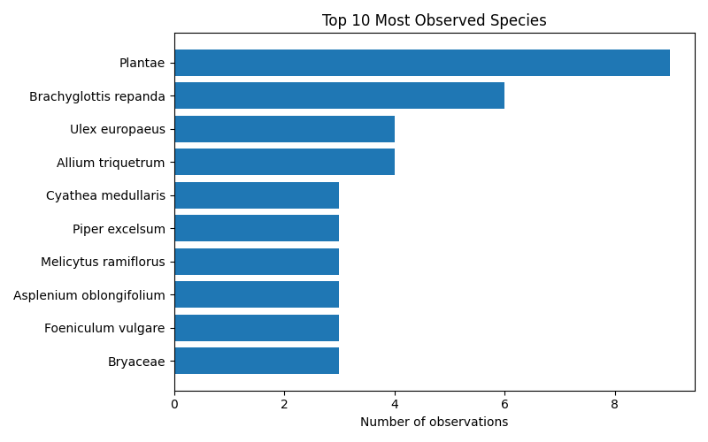
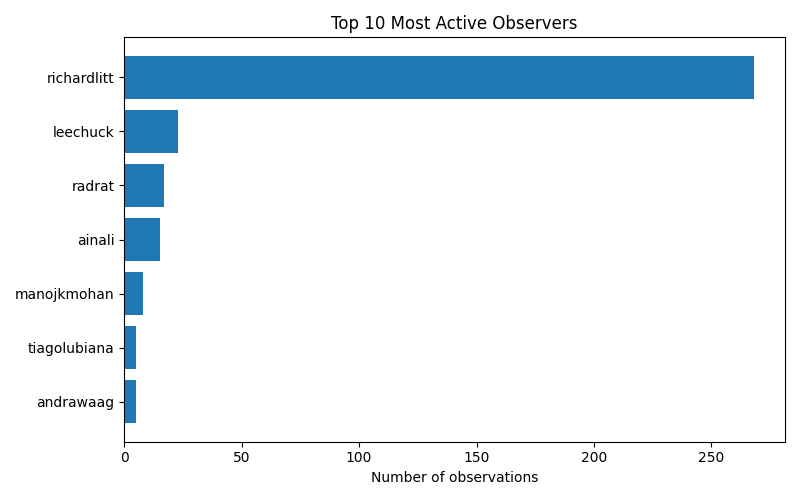

# iNaturalist Project Report: living-data-2025-world

- Total observations: 341
- Unique species observed: 253
- Unique observers: 7

## Wikipedia & Wikidata Coverage

- Species not on Wikidata: **1**
- Missing in en: **23**

- Missing in es: **88**

- Missing in ja: **154**

- Missing in ar: **127**

- Missing in nl: **76**

- Missing in pt: **114**

- Missing in fr: **90**

| Taxon | Wikidata | GBIF | iNaturalist | EN | ES | JA | AR | NL | PT | FR |
|---|---|---|---|---|---|---|---|---|---|---|
| Achrophyllum | [Q17294296](https://www.wikidata.org/entity/Q17294296) | [2670000](https://www.gbif.org/species/2670000) | [378705](https://www.inaturalist.org/taxa/378705) | &#10007; | &#10007; | &#10007; | &#10007; | &#10007; | &#10007; | &#10007; |
| Austroponera castanea | [Q136347846](https://www.wikidata.org/entity/Q136347846) | — | — | &#10007; | &#10007; | &#10007; | &#10007; | &#10007; | &#10007; | &#10007; |
| Corythoxestis zorionella | [Q111178048](https://www.wikidata.org/entity/Q111178048) | [11788859](https://www.gbif.org/species/11788859) | [911439](https://www.inaturalist.org/taxa/911439) | &#10007; | &#10007; | &#10007; | &#10007; | &#10007; | &#10007; | &#10007; |
| Cyathea dealbata | [Q1248008](https://www.wikidata.org/entity/Q1248008) | [3598702](https://www.gbif.org/species/3598702) | [131669](https://www.inaturalist.org/taxa/131669) | &#10007; | &#10007; | &#10007; | &#10007; | &#10007; | &#10007; | &#10007; |
| Cyathea medullaris | [Q5197621](https://www.wikidata.org/entity/Q5197621) | [3600240](https://www.gbif.org/species/3600240) | [333797](https://www.inaturalist.org/taxa/333797) | &#10007; | &#10007; | &#10007; | &#10007; | &#10007; | &#10007; | &#10007; |
| Didymocheton spectabilis | [Q124472460](https://www.wikidata.org/entity/Q124472460) | — | — | &#10007; | &#10007; | &#10007; | &#10007; | &#10007; | &#10007; | &#10007; |
| Dolichotetranychus ancistrus | [Q10475541](https://www.wikidata.org/entity/Q10475541) | [2131739](https://www.gbif.org/species/2131739) | [407193](https://www.inaturalist.org/taxa/407193) | &#10007; | &#10007; | &#10007; | &#10007; | &#10007; | &#10007; | &#10007; |
| Hydrocotyle heteromeria | [Q15552477](https://www.wikidata.org/entity/Q15552477) | [3637717](https://www.gbif.org/species/3637717) | [402581](https://www.inaturalist.org/taxa/402581) | &#10007; | &#10007; | &#10007; | &#10007; | &#10007; | &#10007; | &#10007; |
| Liriomyza flavolateralis | [Q14667870](https://www.wikidata.org/entity/Q14667870) | [1553650](https://www.gbif.org/species/1553650) | [391766](https://www.inaturalist.org/taxa/391766) | &#10007; | &#10007; | &#10007; | &#10007; | &#10007; | &#10007; | &#10007; |
| Nestor meridionalis septentrionalis | [Q27614955](https://www.wikidata.org/entity/Q27614955) | [6170726](https://www.gbif.org/species/6170726) | [413489](https://www.inaturalist.org/taxa/413489) | &#10007; | &#10007; | &#10007; | &#10007; | &#10007; | &#10007; | &#10007; |
| Phormium cookianum | [Q21396801](https://www.wikidata.org/entity/Q21396801) | [2778519](https://www.gbif.org/species/2778519) | [129178](https://www.inaturalist.org/taxa/129178) | &#10007; | &#10007; | &#10007; | &#10007; | &#10007; | &#10007; | &#10007; |
| Phytomyza syngenesiae | [Q106458095](https://www.wikidata.org/entity/Q106458095) | [9341254](https://www.gbif.org/species/9341254) | [417350](https://www.inaturalist.org/taxa/417350) | &#10007; | &#10007; | &#10007; | &#10007; | &#10007; | &#10007; | &#10007; |
| Pittosporum ralphii | [Q15590509](https://www.wikidata.org/entity/Q15590509) | [4161958](https://www.gbif.org/species/4161958) | [380937](https://www.inaturalist.org/taxa/380937) | &#10007; | &#10007; | &#10007; | &#10007; | &#10007; | &#10007; | &#10007; |
| Rhopalomerus | [Q21340886](https://www.wikidata.org/entity/Q21340886) | [1231381](https://www.gbif.org/species/1231381) | [378004](https://www.inaturalist.org/taxa/378004) | &#10007; | &#10007; | &#10007; | &#10007; | &#10007; | &#10007; | &#10007; |
| Tribulus arabicus | [Q25702561](https://www.wikidata.org/entity/Q25702561) | [5635251](https://www.gbif.org/species/5635251) | — | &#10007; | &#10007; | &#10007; | &#10007; | &#10007; | &#10007; | &#10007; |
| Tripogandra diuretica | [Q15565587](https://www.wikidata.org/entity/Q15565587) | [2765378](https://www.gbif.org/species/2765378) | [542503](https://www.inaturalist.org/taxa/542503) | &#10007; | &#10007; | &#10007; | &#10007; | &#10007; | &#10007; | &#10007; |
| Zygophyllum mandavillei | [Q96087888](https://www.wikidata.org/entity/Q96087888) | [3987114](https://www.gbif.org/species/3987114) | — | &#10007; | &#10007; | &#10007; | &#10007; | &#10007; | &#10007; | &#10007; |
| Andricus quercuscalifornicus | [Q14497590](https://www.wikidata.org/entity/Q14497590) | [1309603](https://www.gbif.org/species/1309603) | [55887](https://www.inaturalist.org/taxa/55887) | [&#10003;](https://en.wikipedia.org/wiki/Andricus_quercuscalifornicus) | &#10007; | &#10007; | &#10007; | &#10007; | &#10007; | &#10007; |
| Asplenium flabellifolium | [Q4808125](https://www.wikidata.org/entity/Q4808125) | [4258646](https://www.gbif.org/species/4258646) | [411965](https://www.inaturalist.org/taxa/411965) | [&#10003;](https://en.wikipedia.org/wiki/Asplenium_flabellifolium) | &#10007; | &#10007; | &#10007; | &#10007; | &#10007; | &#10007; |
| Asplenium flaccidum | [Q4808127](https://www.wikidata.org/entity/Q4808127) | [7310928](https://www.gbif.org/species/7310928) | [197042](https://www.inaturalist.org/taxa/197042) | [&#10003;](https://en.wikipedia.org/wiki/Asplenium_flaccidum) | &#10007; | &#10007; | &#10007; | &#10007; | &#10007; | &#10007; |
| Asplenium gracillimum | [Q17170535](https://www.wikidata.org/entity/Q17170535) | [4257289](https://www.gbif.org/species/4257289) | [399757](https://www.inaturalist.org/taxa/399757) | [&#10003;](https://en.wikipedia.org/wiki/Asplenium_gracillimum) | &#10007; | &#10007; | &#10007; | &#10007; | &#10007; | &#10007; |
| Asplenium oblongifolium | [Q4808136](https://www.wikidata.org/entity/Q4808136) | [4257376](https://www.gbif.org/species/4257376) | [210944](https://www.inaturalist.org/taxa/210944) | [&#10003;](https://en.wikipedia.org/wiki/Asplenium_oblongifolium) | &#10007; | &#10007; | &#10007; | &#10007; | &#10007; | &#10007; |
| Bistorta amplexicaulis | [Q10431446](https://www.wikidata.org/entity/Q10431446) | [7291264](https://www.gbif.org/species/7291264) | [752465](https://www.inaturalist.org/taxa/752465) | [&#10003;](https://en.wikipedia.org/wiki/Bistorta_amplexicaulis) | &#10007; | &#10007; | &#10007; | &#10007; | &#10007; | &#10007; |
| Camptochaete | [Q17287205](https://www.wikidata.org/entity/Q17287205) | [2676011](https://www.gbif.org/species/2676011) | [380742](https://www.inaturalist.org/taxa/380742) | [&#10003;](https://en.wikipedia.org/wiki/Camptochaete) | &#10007; | &#10007; | &#10007; | &#10007; | &#10007; | &#10007; |
| Cephaleuros lagerheimii | [Q69715047](https://www.wikidata.org/entity/Q69715047) | [2644983](https://www.gbif.org/species/2644983) | [381513](https://www.inaturalist.org/taxa/381513) | [&#10003;](https://en.wikipedia.org/wiki/Cephaleuros_lagerheimii) | &#10007; | &#10007; | &#10007; | &#10007; | &#10007; | &#10007; |
| Chersadaula | [Q18522689](https://www.wikidata.org/entity/Q18522689) | [1833663](https://www.gbif.org/species/1833663) | [714064](https://www.inaturalist.org/taxa/714064) | &#10007; | &#10007; | &#10007; | &#10007; | [&#10003;](https://nl.wikipedia.org/wiki/Chersadaula) | &#10007; | &#10007; |
| Coprosma grandifolia | [Q5168955](https://www.wikidata.org/entity/Q5168955) | [2911563](https://www.gbif.org/species/2911563) | [70238](https://www.inaturalist.org/taxa/70238) | [&#10003;](https://en.wikipedia.org/wiki/Coprosma_autumnalis) | &#10007; | &#10007; | &#10007; | &#10007; | &#10007; | &#10007; |
| Craspedocephalus malabaricus | [Q109232820](https://www.wikidata.org/entity/Q109232820) | — | [1304708](https://www.inaturalist.org/taxa/1304708) | [&#10003;](https://en.wikipedia.org/wiki/Craspedocephalus_malabaricus) | &#10007; | &#10007; | &#10007; | &#10007; | &#10007; | &#10007; |
| Diaspidinae | [Q5272075](https://www.wikidata.org/entity/Q5272075) | — | — | [&#10003;](https://en.wikipedia.org/wiki/Diaspidinae) | &#10007; | &#10007; | &#10007; | &#10007; | &#10007; | &#10007; |
| Euura proxima | [Q55313490](https://www.wikidata.org/entity/Q55313490) | [9287722](https://www.gbif.org/species/9287722) | [935778](https://www.inaturalist.org/taxa/935778) | [&#10003;](https://en.wikipedia.org/wiki/Euura_proxima) | &#10007; | &#10007; | &#10007; | &#10007; | &#10007; | &#10007; |
| Geniostoma ligustrifolium | [Q5533203](https://www.wikidata.org/entity/Q5533203) | [4019603](https://www.gbif.org/species/4019603) | [401998](https://www.inaturalist.org/taxa/401998) | [&#10003;](https://en.wikipedia.org/wiki/Geniostoma_ligustrifolium) | &#10007; | &#10007; | &#10007; | &#10007; | &#10007; | &#10007; |
| Hesperocyparis macrocarpa | [Q32856056](https://www.wikidata.org/entity/Q32856056) | [2684075](https://www.gbif.org/species/2684075) | — | [&#10003;](https://en.wikipedia.org/wiki/Hesperocyparis_macrocarpa) | &#10007; | &#10007; | &#10007; | &#10007; | &#10007; | &#10007; |
| Hylaeothemis apicalis | [Q10529088](https://www.wikidata.org/entity/Q10529088) | [1429383](https://www.gbif.org/species/1429383) | [1134273](https://www.inaturalist.org/taxa/1134273) | [&#10003;](https://en.wikipedia.org/wiki/Hylaeothemis_apicalis) | &#10007; | &#10007; | &#10007; | &#10007; | &#10007; | &#10007; |
| Hymenophyllum dilatatum | [Q3144000](https://www.wikidata.org/entity/Q3144000) | [3607426](https://www.gbif.org/species/3607426) | [340707](https://www.inaturalist.org/taxa/340707) | &#10007; | &#10007; | &#10007; | &#10007; | &#10007; | &#10007; | [&#10003;](https://fr.wikipedia.org/wiki/Hymenophyllum_dilatatum) |
| Hymenophyllum flexuosum | [Q3144004](https://www.wikidata.org/entity/Q3144004) | [3606946](https://www.gbif.org/species/3606946) | [402623](https://www.inaturalist.org/taxa/402623) | &#10007; | &#10007; | &#10007; | &#10007; | &#10007; | &#10007; | [&#10003;](https://fr.wikipedia.org/wiki/Hymenophyllum_flexuosum) |
| Hypopterygiaceae | [Q17276652](https://www.wikidata.org/entity/Q17276652) | [3229944](https://www.gbif.org/species/3229944) | [244956](https://www.inaturalist.org/taxa/244956) | [&#10003;](https://en.wikipedia.org/wiki/Hypopterygiaceae) | &#10007; | &#10007; | &#10007; | &#10007; | &#10007; | &#10007; |
| Microsorum pustulatum | [Q6840300](https://www.wikidata.org/entity/Q6840300) | [7289949](https://www.gbif.org/species/7289949) | [64060](https://www.inaturalist.org/taxa/64060) | [&#10003;](https://en.wikipedia.org/wiki/Zealandia_pustulata) | &#10007; | &#10007; | &#10007; | &#10007; | &#10007; | &#10007; |
| Muehlenbeckia australis | [Q15600466](https://www.wikidata.org/entity/Q15600466) | [4033148](https://www.gbif.org/species/4033148) | [366725](https://www.inaturalist.org/taxa/366725) | [&#10003;](https://en.wikipedia.org/wiki/Muehlenbeckia_australis) | &#10007; | &#10007; | &#10007; | &#10007; | &#10007; | &#10007; |
| Olearia paniculata | [Q2019091](https://www.wikidata.org/entity/Q2019091) | [5405261](https://www.gbif.org/species/5405261) | [336338](https://www.inaturalist.org/taxa/336338) | [&#10003;](https://en.wikipedia.org/wiki/Olearia_paniculata) | &#10007; | &#10007; | &#10007; | &#10007; | &#10007; | &#10007; |
| Piper excelsum | [Q21306444](https://www.wikidata.org/entity/Q21306444) | [4183998](https://www.gbif.org/species/4183998) | [404899](https://www.inaturalist.org/taxa/404899) | [&#10003;](https://en.wikipedia.org/wiki/Piper_excelsum) | &#10007; | &#10007; | &#10007; | &#10007; | &#10007; | &#10007; |
| Pittosporum crassifolium | [Q15589244](https://www.wikidata.org/entity/Q15589244) | [2986285](https://www.gbif.org/species/2986285) | [413005](https://www.inaturalist.org/taxa/413005) | [&#10003;](https://en.wikipedia.org/wiki/Pittosporum_crassifolium) | &#10007; | &#10007; | &#10007; | &#10007; | &#10007; | &#10007; |
| Pseudopanax arboreus | [Q3409551](https://www.wikidata.org/entity/Q3409551) | [3036513](https://www.gbif.org/species/3036513) | [126181](https://www.inaturalist.org/taxa/126181) | [&#10003;](https://en.wikipedia.org/wiki/Pseudopanax_arboreus) | &#10007; | &#10007; | &#10007; | &#10007; | &#10007; | &#10007; |
| Racopilum | [Q17280762](https://www.wikidata.org/entity/Q17280762) | [2677668](https://www.gbif.org/species/2677668) | [156374](https://www.inaturalist.org/taxa/156374) | [&#10003;](https://en.wikipedia.org/wiki/Racopilum) | &#10007; | &#10007; | &#10007; | &#10007; | &#10007; | &#10007; |
| Rumex sagittatus | [Q15603107](https://www.wikidata.org/entity/Q15603107) | [4036585](https://www.gbif.org/species/4036585) | [405771](https://www.inaturalist.org/taxa/405771) | [&#10003;](https://en.wikipedia.org/wiki/Rumex_sagittatus) | &#10007; | &#10007; | &#10007; | &#10007; | &#10007; | &#10007; |
| Salix euxina | [Q18119933](https://www.wikidata.org/entity/Q18119933) | [5927965](https://www.gbif.org/species/5927965) | [168330](https://www.inaturalist.org/taxa/168330) | [&#10003;](https://en.wikipedia.org/wiki/Salix_euxina) | &#10007; | &#10007; | &#10007; | &#10007; | &#10007; | &#10007; |
| Scopelodes | [Q13847358](https://www.wikidata.org/entity/Q13847358) | [1752848](https://www.gbif.org/species/1752848) | [199654](https://www.inaturalist.org/taxa/199654) | &#10007; | &#10007; | &#10007; | &#10007; | [&#10003;](https://nl.wikipedia.org/wiki/Scopelodes) | &#10007; | &#10007; |
| Stephanomeria diegensis | [Q7608457](https://www.wikidata.org/entity/Q7608457) | [3141095](https://www.gbif.org/species/3141095) | [79214](https://www.inaturalist.org/taxa/79214) | [&#10003;](https://en.wikipedia.org/wiki/Stephanomeria_diegensis) | &#10007; | &#10007; | &#10007; | &#10007; | &#10007; | &#10007; |
| Veronica stricta | [Q87627267](https://www.wikidata.org/entity/Q87627267) | [7861306](https://www.gbif.org/species/7861306) | [738800](https://www.inaturalist.org/taxa/738800) | [&#10003;](https://en.wikipedia.org/wiki/Veronica_stricta) | &#10007; | &#10007; | &#10007; | &#10007; | &#10007; | &#10007; |
| Anareolatae | [Q486422](https://www.wikidata.org/entity/Q486422) | — | — | &#10007; | &#10007; | &#10007; | [&#10003;](https://ar.wikipedia.org/wiki/%D9%84%D8%A7%D9%87%D8%A7%D9%84%D8%A7%D8%AA%D9%8A%D8%A7%D8%AA) | &#10007; | &#10007; | [&#10003;](https://fr.wikipedia.org/wiki/Anareolatae) |
| Austroponera | [Q18816045](https://www.wikidata.org/entity/Q18816045) | [9181986](https://www.gbif.org/species/9181986) | [474058](https://www.inaturalist.org/taxa/474058) | [&#10003;](https://en.wikipedia.org/wiki/Austroponera) | [&#10003;](https://es.wikipedia.org/wiki/Austroponera) | &#10007; | &#10007; | &#10007; | &#10007; | &#10007; |
| Bagrada hilaris | [Q4842100](https://www.wikidata.org/entity/Q4842100) | [4485918](https://www.gbif.org/species/4485918) | [152131](https://www.inaturalist.org/taxa/152131) | [&#10003;](https://en.wikipedia.org/wiki/Bagrada_hilaris) | [&#10003;](https://es.wikipedia.org/wiki/Bagrada_hilaris) | &#10007; | &#10007; | &#10007; | &#10007; | &#10007; |
| Blechnum filiforme | [Q4925787](https://www.wikidata.org/entity/Q4925787) | [4079367](https://www.gbif.org/species/4079367) | [400028](https://www.inaturalist.org/taxa/400028) | [&#10003;](https://en.wikipedia.org/wiki/Blechnum_filiforme) | [&#10003;](https://es.wikipedia.org/wiki/Blechnum_filiforme) | &#10007; | &#10007; | &#10007; | &#10007; | &#10007; |
| Brachyglottis repanda | [Q4953449](https://www.wikidata.org/entity/Q4953449) | [3138474](https://www.gbif.org/species/3138474) | [336384](https://www.inaturalist.org/taxa/336384) | [&#10003;](https://en.wikipedia.org/wiki/Brachyglottis_repanda) | [&#10003;](https://es.wikipedia.org/wiki/Brachyglottis_repanda) | &#10007; | &#10007; | &#10007; | &#10007; | &#10007; |
| Caroxylon imbricatum | [Q17246081](https://www.wikidata.org/entity/Q17246081) | [3759522](https://www.gbif.org/species/3759522) | [967408](https://www.inaturalist.org/taxa/967408) | [&#10003;](https://en.wikipedia.org/wiki/Caroxylon_imbricatum) | &#10007; | &#10007; | [&#10003;](https://ar.wikipedia.org/wiki/%D8%B1%D9%88%D8%AB%D8%A7_%D9%82%D8%B1%D9%85%D9%8A%D8%AF%D9%8A%D8%A9) | &#10007; | &#10007; | &#10007; |
| Carpodetus serratus | [Q5045847](https://www.wikidata.org/entity/Q5045847) | [3932516](https://www.gbif.org/species/3932516) | [341690](https://www.inaturalist.org/taxa/341690) | [&#10003;](https://en.wikipedia.org/wiki/Carpodetus_serratus) | &#10007; | &#10007; | &#10007; | [&#10003;](https://nl.wikipedia.org/wiki/Carpodetus_serratus) | &#10007; | &#10007; |
| Cleora scriptaria | [Q13469636](https://www.wikidata.org/entity/Q13469636) | [5148096](https://www.gbif.org/species/5148096) | [387683](https://www.inaturalist.org/taxa/387683) | [&#10003;](https://en.wikipedia.org/wiki/Cleora_scriptaria) | &#10007; | &#10007; | &#10007; | [&#10003;](https://nl.wikipedia.org/wiki/Cleora_scriptaria) | &#10007; | &#10007; |
| Coprosma crassifolia | [Q13903217](https://www.wikidata.org/entity/Q13903217) | [2911436](https://www.gbif.org/species/2911436) | [401012](https://www.inaturalist.org/taxa/401012) | [&#10003;](https://en.wikipedia.org/wiki/Coprosma_crassifolia) | &#10007; | &#10007; | &#10007; | [&#10003;](https://nl.wikipedia.org/wiki/Coprosma_crassifolia) | &#10007; | &#10007; |
| Coprosma repens | [Q5168970](https://www.wikidata.org/entity/Q5168970) | [2911525](https://www.gbif.org/species/2911525) | [76435](https://www.inaturalist.org/taxa/76435) | [&#10003;](https://en.wikipedia.org/wiki/Coprosma_repens) | [&#10003;](https://es.wikipedia.org/wiki/Coprosma_repens) | &#10007; | &#10007; | &#10007; | &#10007; | &#10007; |
| Coprosma rhamnoides | [Q5168968](https://www.wikidata.org/entity/Q5168968) | [2911383](https://www.gbif.org/species/2911383) | [366659](https://www.inaturalist.org/taxa/366659) | [&#10003;](https://en.wikipedia.org/wiki/Coprosma_rhamnoides) | &#10007; | &#10007; | &#10007; | [&#10003;](https://nl.wikipedia.org/wiki/Coprosma_rhamnoides) | &#10007; | &#10007; |
| Cyathea smithii | [Q5197626](https://www.wikidata.org/entity/Q5197626) | [3599200](https://www.gbif.org/species/3599200) | [197060](https://www.inaturalist.org/taxa/197060) | [&#10003;](https://en.wikipedia.org/wiki/Alsophila_smithii) | &#10007; | &#10007; | &#10007; | [&#10003;](https://nl.wikipedia.org/wiki/Alsophila_smithii) | &#10007; | &#10007; |
| Ehrharta erecta | [Q3758628](https://www.wikidata.org/entity/Q3758628) | [2702863](https://www.gbif.org/species/2702863) | [64140](https://www.inaturalist.org/taxa/64140) | [&#10003;](https://en.wikipedia.org/wiki/Ehrharta_erecta) | [&#10003;](https://es.wikipedia.org/wiki/Ehrharta_erecta) | &#10007; | &#10007; | &#10007; | &#10007; | &#10007; |
| Eleodes grandicollis | [Q63109659](https://www.wikidata.org/entity/Q63109659) | [8459405](https://www.gbif.org/species/8459405) | [557774](https://www.inaturalist.org/taxa/557774) | [&#10003;](https://en.wikipedia.org/wiki/Eleodes_grandicollis) | [&#10003;](https://es.wikipedia.org/wiki/Eleodes_grandicollis) | &#10007; | &#10007; | &#10007; | &#10007; | &#10007; |
| Haloragis erecta | [Q4423172](https://www.wikidata.org/entity/Q4423172) | [2984251](https://www.gbif.org/species/2984251) | [163516](https://www.inaturalist.org/taxa/163516) | [&#10003;](https://en.wikipedia.org/wiki/Haloragis_erecta) | [&#10003;](https://es.wikipedia.org/wiki/Haloragis_erecta) | &#10007; | &#10007; | &#10007; | &#10007; | &#10007; |
| Hemiandrus bilobatus | [Q11843913](https://www.wikidata.org/entity/Q11843913) | [1725212](https://www.gbif.org/species/1725212) | [85213](https://www.inaturalist.org/taxa/85213) | [&#10003;](https://en.wikipedia.org/wiki/Hemiandrus_bilobatus) | &#10007; | &#10007; | &#10007; | [&#10003;](https://nl.wikipedia.org/wiki/Hemiandrus_bilobatus) | &#10007; | &#10007; |
| Hemideina crassidens | [Q11843923](https://www.wikidata.org/entity/Q11843923) | [1725429](https://www.gbif.org/species/1725429) | [85227](https://www.inaturalist.org/taxa/85227) | [&#10003;](https://en.wikipedia.org/wiki/Hemideina_crassidens) | &#10007; | &#10007; | &#10007; | [&#10003;](https://nl.wikipedia.org/wiki/Hemideina_crassidens) | &#10007; | &#10007; |
| Hoheria populnea | [Q1623958](https://www.wikidata.org/entity/Q1623958) | [3940089](https://www.gbif.org/species/3940089) | [181603](https://www.inaturalist.org/taxa/181603) | [&#10003;](https://en.wikipedia.org/wiki/Hoheria_populnea) | &#10007; | &#10007; | &#10007; | [&#10003;](https://nl.wikipedia.org/wiki/Hoheria_populnea) | &#10007; | &#10007; |
| Hymenophyllum nephrophyllum | [Q3144019](https://www.wikidata.org/entity/Q3144019) | [3607630](https://www.gbif.org/species/3607630) | [340730](https://www.inaturalist.org/taxa/340730) | [&#10003;](https://en.wikipedia.org/wiki/Hymenophyllum_nephrophyllum) | &#10007; | &#10007; | &#10007; | &#10007; | &#10007; | [&#10003;](https://fr.wikipedia.org/wiki/Hymenophyllum_nephrophyllum) |
| Lasioglossum sordidum | [Q2295480](https://www.wikidata.org/entity/Q2295480) | [1354513](https://www.gbif.org/species/1354513) | [520992](https://www.inaturalist.org/taxa/520992) | [&#10003;](https://en.wikipedia.org/wiki/Lasioglossum_sordidum) | &#10007; | &#10007; | &#10007; | [&#10003;](https://nl.wikipedia.org/wiki/Lasioglossum_sordidum) | &#10007; | &#10007; |
| Latridopsis ciliaris | [Q1253327](https://www.wikidata.org/entity/Q1253327) | [2394461](https://www.gbif.org/species/2394461) | [410431](https://www.inaturalist.org/taxa/410431) | [&#10003;](https://en.wikipedia.org/wiki/Blue_moki) | &#10007; | &#10007; | &#10007; | [&#10003;](https://nl.wikipedia.org/wiki/Latridopsis_ciliaris) | &#10007; | &#10007; |
| Linaria purpurea | [Q6550284](https://www.wikidata.org/entity/Q6550284) | [5415012](https://www.gbif.org/species/5415012) | [77778](https://www.inaturalist.org/taxa/77778) | [&#10003;](https://en.wikipedia.org/wiki/Linaria_purpurea) | &#10007; | &#10007; | &#10007; | [&#10003;](https://nl.wikipedia.org/wiki/Walstroleeuwenbek) | &#10007; | &#10007; |
| Liothula omnivora | [Q13483003](https://www.wikidata.org/entity/Q13483003) | [1854906](https://www.gbif.org/species/1854906) | [408761](https://www.inaturalist.org/taxa/408761) | [&#10003;](https://en.wikipedia.org/wiki/Liothula_omnivora) | &#10007; | &#10007; | &#10007; | [&#10003;](https://nl.wikipedia.org/wiki/Liothula_omnivora) | &#10007; | &#10007; |
| Oxalis incarnata | [Q7115065](https://www.wikidata.org/entity/Q7115065) | [2891720](https://www.gbif.org/species/2891720) | [61776](https://www.inaturalist.org/taxa/61776) | [&#10003;](https://en.wikipedia.org/wiki/Oxalis_incarnata) | &#10007; | &#10007; | &#10007; | &#10007; | &#10007; | [&#10003;](https://fr.wikipedia.org/wiki/Oxalis_incarnata) |
| Parmotrema | [Q10620680](https://www.wikidata.org/entity/Q10620680) | [2565599](https://www.gbif.org/species/2565599) | [117867](https://www.inaturalist.org/taxa/117867) | [&#10003;](https://en.wikipedia.org/wiki/Parmotrema) | [&#10003;](https://es.wikipedia.org/wiki/Parmotrema) | &#10007; | &#10007; | &#10007; | &#10007; | &#10007; |
| Pellaea rotundifolia | [Q7161522](https://www.wikidata.org/entity/Q7161522) | [5566702](https://www.gbif.org/species/5566702) | [198915](https://www.inaturalist.org/taxa/198915) | [&#10003;](https://en.wikipedia.org/wiki/Pellaea_rotundifolia) | [&#10003;](https://es.wikipedia.org/wiki/Pellaea_rotundifolia) | &#10007; | &#10007; | &#10007; | &#10007; | &#10007; |
| Phlyctenactis tuberculosa | [Q3331671](https://www.wikidata.org/entity/Q3331671) | [2256918](https://www.gbif.org/species/2256918) | [344569](https://www.inaturalist.org/taxa/344569) | [&#10003;](https://en.wikipedia.org/wiki/Phlyctenactis_tuberculosa) | &#10007; | &#10007; | &#10007; | [&#10003;](https://nl.wikipedia.org/wiki/Phlyctenactis_tuberculosa) | &#10007; | &#10007; |
| Pteridium esculentum | [Q3410261](https://www.wikidata.org/entity/Q3410261) | [5532455](https://www.gbif.org/species/5532455) | [194768](https://www.inaturalist.org/taxa/194768) | [&#10003;](https://en.wikipedia.org/wiki/Pteridium_esculentum) | &#10007; | &#10007; | &#10007; | &#10007; | &#10007; | [&#10003;](https://fr.wikipedia.org/wiki/Pteridium_esculentum) |
| Pyrrosia eleagnifolia | [Q7263780](https://www.wikidata.org/entity/Q7263780) | [5648235](https://www.gbif.org/species/5648235) | [210959](https://www.inaturalist.org/taxa/210959) | [&#10003;](https://en.wikipedia.org/wiki/Pyrrosia_eleagnifolia) | &#10007; | &#10007; | &#10007; | &#10007; | &#10007; | [&#10003;](https://fr.wikipedia.org/wiki/Pyrrosia_eleagnifolia) |
| Ripogonum scandens | [Q7320710](https://www.wikidata.org/entity/Q7320710) | [3702338](https://www.gbif.org/species/3702338) | [366731](https://www.inaturalist.org/taxa/366731) | [&#10003;](https://en.wikipedia.org/wiki/Ripogonum_scandens) | &#10007; | &#10007; | &#10007; | &#10007; | &#10007; | [&#10003;](https://fr.wikipedia.org/wiki/Rhipogonum_scandens) |
| Austroderia | [Q3409558](https://www.wikidata.org/entity/Q3409558) | [4932125](https://www.gbif.org/species/4932125) | [379626](https://www.inaturalist.org/taxa/379626) | [&#10003;](https://en.wikipedia.org/wiki/Austroderia) | &#10007; | &#10007; | &#10007; | [&#10003;](https://nl.wikipedia.org/wiki/Austroderia) | &#10007; | [&#10003;](https://fr.wikipedia.org/wiki/Austroderia) |
| Calyptocarpus | [Q5024691](https://www.wikidata.org/entity/Q5024691) | [3091469](https://www.gbif.org/species/3091469) | [84406](https://www.inaturalist.org/taxa/84406) | [&#10003;](https://en.wikipedia.org/wiki/Calyptocarpus) | [&#10003;](https://es.wikipedia.org/wiki/Calyptocarpus) | &#10007; | &#10007; | &#10007; | [&#10003;](https://pt.wikipedia.org/wiki/Calyptocarpus) | &#10007; |
| Caroxylon | [Q17377591](https://www.wikidata.org/entity/Q17377591) | [6035785](https://www.gbif.org/species/6035785) | — | [&#10003;](https://en.wikipedia.org/wiki/Caroxylon) | &#10007; | &#10007; | &#10007; | [&#10003;](https://nl.wikipedia.org/wiki/Caroxylon) | &#10007; | [&#10003;](https://fr.wikipedia.org/wiki/Caroxylon) |
| Cellana denticulata | [Q5058237](https://www.wikidata.org/entity/Q5058237) | [4369990](https://www.gbif.org/species/4369990) | [387284](https://www.inaturalist.org/taxa/387284) | [&#10003;](https://en.wikipedia.org/wiki/Cellana_denticulata) | [&#10003;](https://es.wikipedia.org/wiki/Cellana_denticulata) | &#10007; | &#10007; | [&#10003;](https://nl.wikipedia.org/wiki/Cellana_denticulata) | &#10007; | &#10007; |
| Dilophus | [Q14675085](https://www.wikidata.org/entity/Q14675085) | [1590478](https://www.gbif.org/species/1590478) | [247434](https://www.inaturalist.org/taxa/247434) | [&#10003;](https://en.wikipedia.org/wiki/Dilophus) | &#10007; | &#10007; | [&#10003;](https://ar.wikipedia.org/wiki/%D8%AF%D9%84%D9%81%D9%88%D8%B3_(%D8%AC%D9%86%D8%B3)) | &#10007; | &#10007; | [&#10003;](https://fr.wikipedia.org/wiki/Dilophus) |
| Epithemis mariae | [Q2211374](https://www.wikidata.org/entity/Q2211374) | [1429544](https://www.gbif.org/species/1429544) | [100223](https://www.inaturalist.org/taxa/100223) | [&#10003;](https://en.wikipedia.org/wiki/Epithemis_mariae) | [&#10003;](https://es.wikipedia.org/wiki/Epithemis_mariae) | &#10007; | &#10007; | [&#10003;](https://nl.wikipedia.org/wiki/Epithemis_mariae) | &#10007; | &#10007; |
| Euphaea | [Q2371182](https://www.wikidata.org/entity/Q2371182) | [1427513](https://www.gbif.org/species/1427513) | [88302](https://www.inaturalist.org/taxa/88302) | [&#10003;](https://en.wikipedia.org/wiki/Euphaea) | &#10007; | [&#10003;](https://ja.wikipedia.org/wiki/%E3%83%9F%E3%83%8A%E3%83%9F%E3%82%AB%E3%83%AF%E3%83%88%E3%83%B3%E3%83%9C%E5%B1%9E) | &#10007; | [&#10003;](https://nl.wikipedia.org/wiki/Euphaea) | &#10007; | &#10007; |
| Forsterygion lapillum | [Q2199666](https://www.wikidata.org/entity/Q2199666) | [2392820](https://www.gbif.org/species/2392820) | [410520](https://www.inaturalist.org/taxa/410520) | [&#10003;](https://en.wikipedia.org/wiki/Common_triplefin) | [&#10003;](https://es.wikipedia.org/wiki/Forsterygion_lapillum) | &#10007; | &#10007; | [&#10003;](https://nl.wikipedia.org/wiki/Forsterygion_lapillum) | &#10007; | &#10007; |
| Halothamnus bottae | [Q149868](https://www.wikidata.org/entity/Q149868) | [6035803](https://www.gbif.org/species/6035803) | [929407](https://www.inaturalist.org/taxa/929407) | [&#10003;](https://en.wikipedia.org/wiki/Halothamnus_bottae) | [&#10003;](https://es.wikipedia.org/wiki/Halothamnus_bottae) | &#10007; | [&#10003;](https://ar.wikipedia.org/wiki/%D9%82%D8%B6%D8%A9_%D8%A8%D9%88%D8%AA%D9%8A%D8%A9) | &#10007; | &#10007; | &#10007; |
| Haloxylon persicum | [Q1153935](https://www.wikidata.org/entity/Q1153935) | [3758981](https://www.gbif.org/species/3758981) | [464138](https://www.inaturalist.org/taxa/464138) | [&#10003;](https://en.wikipedia.org/wiki/Haloxylon_persicum) | &#10007; | &#10007; | [&#10003;](https://ar.wikipedia.org/wiki/%D8%B1%D9%85%D8%AB_%D9%81%D8%A7%D8%B1%D8%B3%D9%8A) | &#10007; | &#10007; | [&#10003;](https://fr.wikipedia.org/wiki/Haloxylon_persicum) |
| Hedera colchica | [Q567948](https://www.wikidata.org/entity/Q567948) | [3036033](https://www.gbif.org/species/3036033) | [163548](https://www.inaturalist.org/taxa/163548) | [&#10003;](https://en.wikipedia.org/wiki/Hedera_colchica) | &#10007; | &#10007; | [&#10003;](https://ar.wikipedia.org/wiki/%D8%B9%D8%B4%D9%82%D8%A9_%D9%83%D9%84%D8%B4%D9%8A%D8%AF) | &#10007; | &#10007; | [&#10003;](https://fr.wikipedia.org/wiki/Lierre_de_Colchide) |
| Hedycarya arborea | [Q15295926](https://www.wikidata.org/entity/Q15295926) | [3783024](https://www.gbif.org/species/3783024) | [402414](https://www.inaturalist.org/taxa/402414) | [&#10003;](https://en.wikipedia.org/wiki/Hedycarya_arborea) | &#10007; | &#10007; | &#10007; | [&#10003;](https://nl.wikipedia.org/wiki/Hedycarya_arborea) | [&#10003;](https://pt.wikipedia.org/wiki/Hedycarya_arborea) | &#10007; |
| Jasus edwardsii | [Q3163042](https://www.wikidata.org/entity/Q3163042) | [5178279](https://www.gbif.org/species/5178279) | [103601](https://www.inaturalist.org/taxa/103601) | [&#10003;](https://en.wikipedia.org/wiki/Jasus_edwardsii) | &#10007; | &#10007; | &#10007; | [&#10003;](https://nl.wikipedia.org/wiki/Jasus_edwardsii) | &#10007; | [&#10003;](https://fr.wikipedia.org/wiki/Jasus_edwardsii) |
| Liriomyza brassicae | [Q7455129](https://www.wikidata.org/entity/Q7455129) | [1553327](https://www.gbif.org/species/1553327) | [391760](https://www.inaturalist.org/taxa/391760) | [&#10003;](https://en.wikipedia.org/wiki/Serpentine_leaf_miner) | &#10007; | &#10007; | &#10007; | [&#10003;](https://nl.wikipedia.org/wiki/Liriomyza_brassicae) | &#10007; | [&#10003;](https://fr.wikipedia.org/wiki/Liriomyza_brassicae) |
| Maratus griseus | [Q27504793](https://www.wikidata.org/entity/Q27504793) | [7838289](https://www.gbif.org/species/7838289) | [831320](https://www.inaturalist.org/taxa/831320) | [&#10003;](https://en.wikipedia.org/wiki/Maratus_griseus) | &#10007; | &#10007; | &#10007; | [&#10003;](https://nl.wikipedia.org/wiki/Lycidas_griseus) | &#10007; | [&#10003;](https://fr.wikipedia.org/wiki/Maratus_griseus) |
| Melanophidium bilineatum | [Q2105589](https://www.wikidata.org/entity/Q2105589) | [2448724](https://www.gbif.org/species/2448724) | [32403](https://www.inaturalist.org/taxa/32403) | [&#10003;](https://en.wikipedia.org/wiki/Melanophidium_bilineatum) | &#10007; | &#10007; | &#10007; | [&#10003;](https://nl.wikipedia.org/wiki/Melanophidium_bilineatum) | &#10007; | [&#10003;](https://fr.wikipedia.org/wiki/Melanophidium_bilineatum) |
| Metrosideros fulgens | [Q5677024](https://www.wikidata.org/entity/Q5677024) | [3185442](https://www.gbif.org/species/3185442) | [70236](https://www.inaturalist.org/taxa/70236) | [&#10003;](https://en.wikipedia.org/wiki/Metrosideros_fulgens) | [&#10003;](https://es.wikipedia.org/wiki/Metrosideros_fulgens) | &#10007; | &#10007; | [&#10003;](https://nl.wikipedia.org/wiki/Metrosideros_fulgens) | &#10007; | &#10007; |
| Metzgeria | [Q1532434](https://www.wikidata.org/entity/Q1532434) | [2302859](https://www.gbif.org/species/2302859) | [1571854](https://www.inaturalist.org/taxa/1571854) | [&#10003;](https://en.wikipedia.org/wiki/Metzgeria_(gastropod)) | &#10007; | &#10007; | &#10007; | [&#10003;](https://nl.wikipedia.org/wiki/Metzgeria_(slak)) | [&#10003;](https://pt.wikipedia.org/wiki/Metzgeria) | &#10007; |
| Paraserianthes lophantha | [Q7135903](https://www.wikidata.org/entity/Q7135903) | [2943719](https://www.gbif.org/species/2943719) | [139851](https://www.inaturalist.org/taxa/139851) | [&#10003;](https://en.wikipedia.org/wiki/Paraserianthes_lophantha) | [&#10003;](https://es.wikipedia.org/wiki/Paraserianthes_lophantha) | &#10007; | &#10007; | &#10007; | [&#10003;](https://pt.wikipedia.org/wiki/Paraserianthes_lophantha) | &#10007; |
| Polioptila californica | [Q841099](https://www.wikidata.org/entity/Q841099) | [2487600](https://www.gbif.org/species/2487600) | [7497](https://www.inaturalist.org/taxa/7497) | [&#10003;](https://en.wikipedia.org/wiki/California_gnatcatcher) | [&#10003;](https://es.wikipedia.org/wiki/Polioptila_californica) | &#10007; | &#10007; | [&#10003;](https://nl.wikipedia.org/wiki/Californische_muggenvanger) | &#10007; | &#10007; |
| Pseudopanax crassifolius | [Q7255222](https://www.wikidata.org/entity/Q7255222) | [3037461](https://www.gbif.org/species/3037461) | [413091](https://www.inaturalist.org/taxa/413091) | [&#10003;](https://en.wikipedia.org/wiki/Pseudopanax_crassifolius) | [&#10003;](https://es.wikipedia.org/wiki/Pseudopanax_crassifolius) | &#10007; | &#10007; | [&#10003;](https://nl.wikipedia.org/wiki/Pseudopanax_crassifolius) | &#10007; | &#10007; |
| Sciaroidea | [Q3952308](https://www.wikidata.org/entity/Q3952308) | — | [493389](https://www.inaturalist.org/taxa/493389) | [&#10003;](https://en.wikipedia.org/wiki/Sciaroidea) | [&#10003;](https://es.wikipedia.org/wiki/Sciaroidea) | &#10007; | &#10007; | [&#10003;](https://nl.wikipedia.org/wiki/Sciaroidea) | &#10007; | &#10007; |
| Senecio glastifolius | [Q3259822](https://www.wikidata.org/entity/Q3259822) | [3107317](https://www.gbif.org/species/3107317) | [336367](https://www.inaturalist.org/taxa/336367) | [&#10003;](https://en.wikipedia.org/wiki/Senecio_glastifolius) | &#10007; | &#10007; | &#10007; | [&#10003;](https://nl.wikipedia.org/wiki/Senecio_glastifolius) | [&#10003;](https://pt.wikipedia.org/wiki/Senecio_glastifolius) | &#10007; |
| Stachytarpheta cayennensis | [Q6711834](https://www.wikidata.org/entity/Q6711834) | [2925454](https://www.gbif.org/species/2925454) | [126569](https://www.inaturalist.org/taxa/126569) | [&#10003;](https://en.wikipedia.org/wiki/Stachytarpheta_cayennensis) | [&#10003;](https://es.wikipedia.org/wiki/Stachytarpheta_cayennensis) | &#10007; | &#10007; | &#10007; | [&#10003;](https://pt.wikipedia.org/wiki/Gerv%C3%A3o) | &#10007; |
| Agapanthus praecox | [Q161246](https://www.wikidata.org/entity/Q161246) | [2854755](https://www.gbif.org/species/2854755) | [199324](https://www.inaturalist.org/taxa/199324) | [&#10003;](https://en.wikipedia.org/wiki/Agapanthus_praecox) | [&#10003;](https://es.wikipedia.org/wiki/Agapanthus_praecox) | &#10007; | &#10007; | &#10007; | [&#10003;](https://pt.wikipedia.org/wiki/Agapanthus_praecox) | [&#10003;](https://fr.wikipedia.org/wiki/Agapanthus_praecox) |
| Agyneta | [Q2827368](https://www.wikidata.org/entity/Q2827368) | [2135681](https://www.gbif.org/species/2135681) | [172395](https://www.inaturalist.org/taxa/172395) | [&#10003;](https://en.wikipedia.org/wiki/Agyneta) | [&#10003;](https://es.wikipedia.org/wiki/Agyneta) | &#10007; | &#10007; | [&#10003;](https://nl.wikipedia.org/wiki/Agyneta) | &#10007; | [&#10003;](https://fr.wikipedia.org/wiki/Agyneta) |
| Araneus gemma | [Q2190160](https://www.wikidata.org/entity/Q2190160) | [2160305](https://www.gbif.org/species/2160305) | [84486](https://www.inaturalist.org/taxa/84486) | [&#10003;](https://en.wikipedia.org/wiki/Araneus_gemma) | [&#10003;](https://es.wikipedia.org/wiki/Araneus_gemma) | &#10007; | [&#10003;](https://ar.wikipedia.org/wiki/%D8%B3%D9%83_%D8%AC%D9%8A%D9%85%D8%A9) | [&#10003;](https://nl.wikipedia.org/wiki/Araneus_gemma) | &#10007; | &#10007; |
| Berberis darwinii | [Q426965](https://www.wikidata.org/entity/Q426965) | [3033905](https://www.gbif.org/species/3033905) | [75751](https://www.inaturalist.org/taxa/75751) | [&#10003;](https://en.wikipedia.org/wiki/Berberis_darwinii) | [&#10003;](https://es.wikipedia.org/wiki/Berberis_darwinii) | &#10007; | [&#10003;](https://ar.wikipedia.org/wiki/%D8%A8%D8%B1%D8%A8%D8%A7%D8%B1%D9%8A%D8%B3_%D8%AF%D8%A7%D8%B1%D9%88%D9%8A%D9%86%D9%8A) | &#10007; | &#10007; | [&#10003;](https://fr.wikipedia.org/wiki/Berberis_darwinii) |
| Carex divulsa | [Q159892](https://www.wikidata.org/entity/Q159892) | [2722914](https://www.gbif.org/species/2722914) | [76033](https://www.inaturalist.org/taxa/76033) | [&#10003;](https://en.wikipedia.org/wiki/Carex_divulsa) | [&#10003;](https://es.wikipedia.org/wiki/Carex_divulsa) | &#10007; | &#10007; | [&#10003;](https://nl.wikipedia.org/wiki/Groene_bermzegge) | &#10007; | [&#10003;](https://fr.wikipedia.org/wiki/Carex_divulsa) |
| Eumastacidae | [Q5409533](https://www.wikidata.org/entity/Q5409533) | [5934](https://www.gbif.org/species/5934) | [85772](https://www.inaturalist.org/taxa/85772) | [&#10003;](https://en.wikipedia.org/wiki/Eumastacidae) | [&#10003;](https://es.wikipedia.org/wiki/Eumastacidae) | &#10007; | &#10007; | [&#10003;](https://nl.wikipedia.org/wiki/Eumastacidae) | &#10007; | [&#10003;](https://fr.wikipedia.org/wiki/Eumastacidae) |
| Fissidens | [Q140981](https://www.wikidata.org/entity/Q140981) | [2673216](https://www.gbif.org/species/2673216) | [55339](https://www.inaturalist.org/taxa/55339) | [&#10003;](https://en.wikipedia.org/wiki/Fissidens) | &#10007; | [&#10003;](https://ja.wikipedia.org/wiki/%E3%83%9B%E3%82%A6%E3%82%AA%E3%82%A6%E3%82%B4%E3%82%B1%E5%B1%9E) | &#10007; | [&#10003;](https://nl.wikipedia.org/wiki/Vedermos) | &#10007; | [&#10003;](https://fr.wikipedia.org/wiki/Fissidens) |
| Fumaria muralis | [Q163397](https://www.wikidata.org/entity/Q163397) | [7315286](https://www.gbif.org/species/7315286) | [129075](https://www.inaturalist.org/taxa/129075) | [&#10003;](https://en.wikipedia.org/wiki/Fumaria_muralis) | [&#10003;](https://es.wikipedia.org/wiki/Fumaria_muralis) | &#10007; | &#10007; | [&#10003;](https://nl.wikipedia.org/wiki/Middelste_duivenkervel) | [&#10003;](https://pt.wikipedia.org/wiki/Fumaria_muralis) | &#10007; |
| Melicytus ramiflorus | [Q311756](https://www.wikidata.org/entity/Q311756) | [7296373](https://www.gbif.org/species/7296373) | [197063](https://www.inaturalist.org/taxa/197063) | [&#10003;](https://en.wikipedia.org/wiki/Melicytus_ramiflorus) | [&#10003;](https://es.wikipedia.org/wiki/Melicytus_ramiflorus) | &#10007; | &#10007; | [&#10003;](https://nl.wikipedia.org/wiki/Melicytus_ramiflorus) | [&#10003;](https://pt.wikipedia.org/wiki/Melicytus_ramiflorus) | &#10007; |
| Notolabrus fucicola | [Q2082359](https://www.wikidata.org/entity/Q2082359) | [2383526](https://www.gbif.org/species/2383526) | [107182](https://www.inaturalist.org/taxa/107182) | [&#10003;](https://en.wikipedia.org/wiki/Notolabrus_fucicola) | [&#10003;](https://es.wikipedia.org/wiki/Notolabrus_fucicola) | &#10007; | &#10007; | [&#10003;](https://nl.wikipedia.org/wiki/Notolabrus_fucicola) | &#10007; | [&#10003;](https://fr.wikipedia.org/wiki/Notolabrus_fucicola) |
| Solanum chenopodioides | [Q15533861](https://www.wikidata.org/entity/Q15533861) | [2929710](https://www.gbif.org/species/2929710) | [336677](https://www.inaturalist.org/taxa/336677) | [&#10003;](https://en.wikipedia.org/wiki/Solanum_chenopodioides) | [&#10003;](https://es.wikipedia.org/wiki/Solanum_chenopodioides) | &#10007; | &#10007; | &#10007; | [&#10003;](https://pt.wikipedia.org/wiki/Solanum_chenopodioides) | [&#10003;](https://fr.wikipedia.org/wiki/Solanum_chenopodioides) |
| Vanessa itea | [Q1935955](https://www.wikidata.org/entity/Q1935955) | [5806175](https://www.gbif.org/species/5806175) | [194762](https://www.inaturalist.org/taxa/194762) | [&#10003;](https://en.wikipedia.org/wiki/Yellow_admiral) | &#10007; | &#10007; | &#10007; | [&#10003;](https://nl.wikipedia.org/wiki/Vanessa_itea) | [&#10003;](https://pt.wikipedia.org/wiki/Vanessa_itea) | [&#10003;](https://fr.wikipedia.org/wiki/Vanessa_itea) |
| Agrotis ipsilon | [Q1093329](https://www.wikidata.org/entity/Q1093329) | [1771245](https://www.gbif.org/species/1771245) | [126276](https://www.inaturalist.org/taxa/126276) | [&#10003;](https://en.wikipedia.org/wiki/Agrotis_ipsilon) | [&#10003;](https://es.wikipedia.org/wiki/Agrotis_ipsilon) | &#10007; | &#10007; | [&#10003;](https://nl.wikipedia.org/wiki/Grote_worteluil) | [&#10003;](https://pt.wikipedia.org/wiki/Agrotis_ipsilon) | [&#10003;](https://fr.wikipedia.org/wiki/Noctuelle_baign%C3%A9e) |
| Allium triquetrum | [Q1532690](https://www.wikidata.org/entity/Q1532690) | [2856457](https://www.gbif.org/species/2856457) | [55505](https://www.inaturalist.org/taxa/55505) | [&#10003;](https://en.wikipedia.org/wiki/Allium_triquetrum) | [&#10003;](https://es.wikipedia.org/wiki/Allium_triquetrum) | &#10007; | [&#10003;](https://ar.wikipedia.org/wiki/%D8%AB%D9%88%D9%85_%D9%85%D8%AB%D9%84%D8%AB) | [&#10003;](https://nl.wikipedia.org/wiki/Driekantig_look) | &#10007; | [&#10003;](https://fr.wikipedia.org/wiki/Ail_%C3%A0_trois_angles) |
| Aphididae | [Q1354085](https://www.wikidata.org/entity/Q1354085) | [3042](https://www.gbif.org/species/3042) | [52381](https://www.inaturalist.org/taxa/52381) | [&#10003;](https://en.wikipedia.org/wiki/Aphididae) | [&#10003;](https://es.wikipedia.org/wiki/Aphididae) | &#10007; | [&#10003;](https://ar.wikipedia.org/wiki/%D9%85%D9%86%D9%8A%D8%A9_(%D9%81%D8%B5%D9%8A%D9%84%D8%A9)) | &#10007; | [&#10003;](https://pt.wikipedia.org/wiki/Afid%C3%ADdeos) | [&#10003;](https://fr.wikipedia.org/wiki/Aphididae) |
| Armillaria ostoyae | [Q917989](https://www.wikidata.org/entity/Q917989) | [2536899](https://www.gbif.org/species/2536899) | [192381](https://www.inaturalist.org/taxa/192381) | [&#10003;](https://en.wikipedia.org/wiki/Armillaria_ostoyae) | [&#10003;](https://es.wikipedia.org/wiki/Armillaria_ostoyae) | &#10007; | &#10007; | [&#10003;](https://nl.wikipedia.org/wiki/Sombere_honingzwam) | [&#10003;](https://pt.wikipedia.org/wiki/Armillaria_solidipes) | [&#10003;](https://fr.wikipedia.org/wiki/Armillaria_solidipes) |
| Callipepla californica | [Q830385](https://www.wikidata.org/entity/Q830385) | [5228080](https://www.gbif.org/species/5228080) | [1409](https://www.inaturalist.org/taxa/1409) | [&#10003;](https://en.wikipedia.org/wiki/California_quail) | [&#10003;](https://es.wikipedia.org/wiki/Callipepla_californica) | [&#10003;](https://ja.wikipedia.org/wiki/%E3%82%AB%E3%83%B3%E3%83%A0%E3%83%AA%E3%82%A6%E3%82%BA%E3%83%A9) | &#10007; | [&#10003;](https://nl.wikipedia.org/wiki/Californische_kuifkwartel) | &#10007; | [&#10003;](https://fr.wikipedia.org/wiki/Colin_de_Californie) |
| Callorhinchus milii | [Q857994](https://www.wikidata.org/entity/Q857994) | [2417418](https://www.gbif.org/species/2417418) | [96475](https://www.inaturalist.org/taxa/96475) | [&#10003;](https://en.wikipedia.org/wiki/Australian_ghostshark) | &#10007; | [&#10003;](https://ja.wikipedia.org/wiki/%E3%82%BE%E3%82%A6%E3%82%AE%E3%83%B3%E3%82%B6%E3%83%A1) | &#10007; | [&#10003;](https://nl.wikipedia.org/wiki/Spookhaai) | [&#10003;](https://pt.wikipedia.org/wiki/Callorhinchus_milii) | [&#10003;](https://fr.wikipedia.org/wiki/Callorhinchus_milii) |
| Galium aparine | [Q161581](https://www.wikidata.org/entity/Q161581) | [2913548](https://www.gbif.org/species/2913548) | [53059](https://www.inaturalist.org/taxa/53059) | [&#10003;](https://en.wikipedia.org/wiki/Galium_aparine) | [&#10003;](https://es.wikipedia.org/wiki/Galium_aparine) | &#10007; | &#10007; | [&#10003;](https://nl.wikipedia.org/wiki/Kleefkruid) | [&#10003;](https://pt.wikipedia.org/wiki/Galium_aparine) | [&#10003;](https://fr.wikipedia.org/wiki/Gaillet_gratteron) |
| Magnoliopsida | [Q1307404](https://www.wikidata.org/entity/Q1307404) | [220](https://www.gbif.org/species/220) | [47124](https://www.inaturalist.org/taxa/47124) | [&#10003;](https://en.wikipedia.org/wiki/Magnoliopsida) | &#10007; | [&#10003;](https://ja.wikipedia.org/wiki/%E3%83%A2%E3%82%AF%E3%83%AC%E3%83%B3%E7%B6%B1) | [&#10003;](https://ar.wikipedia.org/wiki/%D9%85%D8%BA%D9%86%D9%88%D9%84%D8%A7%D9%86%D9%8A%D8%A9) | [&#10003;](https://nl.wikipedia.org/wiki/Magnoliopsida) | &#10007; | [&#10003;](https://fr.wikipedia.org/wiki/Magnoliopsida) |
| Myoporum laetum | [Q153042](https://www.wikidata.org/entity/Q153042) | [3172657](https://www.gbif.org/species/3172657) | [63611](https://www.inaturalist.org/taxa/63611) | [&#10003;](https://en.wikipedia.org/wiki/Myoporum_laetum) | [&#10003;](https://es.wikipedia.org/wiki/Myoporum_laetum) | &#10007; | &#10007; | [&#10003;](https://nl.wikipedia.org/wiki/Myoporum_laetum) | [&#10003;](https://pt.wikipedia.org/wiki/Myoporum_laetum) | [&#10003;](https://fr.wikipedia.org/wiki/Myoporum_laetum) |
| Parsonsia | [Q5219581](https://www.wikidata.org/entity/Q5219581) | [3230956](https://www.gbif.org/species/3230956) | [273071](https://www.inaturalist.org/taxa/273071) | [&#10003;](https://en.wikipedia.org/wiki/Parsonsia) | [&#10003;](https://es.wikipedia.org/wiki/Parsonsia) | &#10007; | [&#10003;](https://ar.wikipedia.org/wiki/%D8%A8%D8%A7%D8%B1%D8%B3%D9%88%D9%86%D8%B2%D9%8A%D8%A9) | [&#10003;](https://nl.wikipedia.org/wiki/Parsonsia) | [&#10003;](https://pt.wikipedia.org/wiki/Parsonsia) | &#10007; |
| Pipilo maculatus | [Q1586862](https://www.wikidata.org/entity/Q1586862) | [2491210](https://www.gbif.org/species/2491210) | [9420](https://www.inaturalist.org/taxa/9420) | [&#10003;](https://en.wikipedia.org/wiki/Spotted_towhee) | [&#10003;](https://es.wikipedia.org/wiki/Pipilo_maculatus) | &#10007; | [&#10003;](https://ar.wikipedia.org/wiki/%D8%B7%D9%88%D9%87%D9%8A_%D9%85%D8%B1%D9%82%D8%B7) | [&#10003;](https://nl.wikipedia.org/wiki/Gevlekte_towie) | &#10007; | [&#10003;](https://fr.wikipedia.org/wiki/Tohi_tachet%C3%A9) |
| Polioptila caerulea | [Q883006](https://www.wikidata.org/entity/Q883006) | [2487596](https://www.gbif.org/species/2487596) | [7493](https://www.inaturalist.org/taxa/7493) | [&#10003;](https://en.wikipedia.org/wiki/Blue-gray_gnatcatcher) | [&#10003;](https://es.wikipedia.org/wiki/Polioptila_caerulea) | &#10007; | [&#10003;](https://ar.wikipedia.org/wiki/%D8%B5%D8%A7%D8%A6%D8%AF_%D8%A7%D9%84%D8%A8%D8%B9%D9%88%D8%B6_%D8%A7%D9%84%D8%B1%D9%85%D8%A7%D8%AF%D9%8A_%D8%A7%D9%84%D8%A3%D8%B2%D8%B1%D9%82) | [&#10003;](https://nl.wikipedia.org/wiki/Blauwgrijze_muggenvanger) | &#10007; | [&#10003;](https://fr.wikipedia.org/wiki/Gobemoucheron_gris-bleu) |
| Porphyrio melanotus | [Q27074640](https://www.wikidata.org/entity/Q27074640) | [5817288](https://www.gbif.org/species/5817288) | [418530](https://www.inaturalist.org/taxa/418530) | [&#10003;](https://en.wikipedia.org/wiki/Australasian_swamphen) | [&#10003;](https://es.wikipedia.org/wiki/Porphyrio_melanotus) | &#10007; | &#10007; | [&#10003;](https://nl.wikipedia.org/wiki/Australische_purperkoet) | [&#10003;](https://pt.wikipedia.org/wiki/Cam%C3%A3o-australasi%C3%A1tico) | [&#10003;](https://fr.wikipedia.org/wiki/Tal%C3%A8ve_australe) |
| Porrhothele antipodiana | [Q1933577](https://www.wikidata.org/entity/Q1933577) | [2145044](https://www.gbif.org/species/2145044) | [121403](https://www.inaturalist.org/taxa/121403) | [&#10003;](https://en.wikipedia.org/wiki/Porrhothele_antipodiana) | [&#10003;](https://es.wikipedia.org/wiki/Porrhothele_antipodiana) | &#10007; | &#10007; | [&#10003;](https://nl.wikipedia.org/wiki/Porrhothele_antipodiana) | [&#10003;](https://pt.wikipedia.org/wiki/Porrhothele_antipodiana) | [&#10003;](https://fr.wikipedia.org/wiki/Porrhothele_antipodiana) |
| Rhipidura fuliginosa | [Q913047](https://www.wikidata.org/entity/Q913047) | [5231730](https://www.gbif.org/species/5231730) | [244276](https://www.inaturalist.org/taxa/244276) | [&#10003;](https://en.wikipedia.org/wiki/New_Zealand_fantail) | [&#10003;](https://es.wikipedia.org/wiki/Rhipidura_fuliginosa) | &#10007; | [&#10003;](https://ar.wikipedia.org/wiki/%D9%85%D8%B1%D9%88%D8%AD%D9%8A_%D8%A7%D9%84%D8%B0%D9%8A%D9%84_%D8%A7%D9%84%D9%86%D9%8A%D9%88%D8%B2%D9%8A%D9%84%D9%86%D8%AF%D9%8A) | [&#10003;](https://nl.wikipedia.org/wiki/Maoriwaaierstaart) | &#10007; | [&#10003;](https://fr.wikipedia.org/wiki/Rhipidure_%C3%A0_collier) |
| Sherardia arvensis | [Q158352](https://www.wikidata.org/entity/Q158352) | [5339050](https://www.gbif.org/species/5339050) | [47691](https://www.inaturalist.org/taxa/47691) | [&#10003;](https://en.wikipedia.org/wiki/Sherardia_arvensis) | &#10007; | [&#10003;](https://ja.wikipedia.org/wiki/%E3%83%8F%E3%83%8A%E3%83%A4%E3%82%A8%E3%83%A0%E3%82%B0%E3%83%A9) | &#10007; | [&#10003;](https://nl.wikipedia.org/wiki/Blauw_walstro) | [&#10003;](https://pt.wikipedia.org/wiki/Sherardia_arvensis) | [&#10003;](https://fr.wikipedia.org/wiki/Sherardia_arvensis) |
| Sphenodon punctatus | [Q3007063](https://www.wikidata.org/entity/Q3007063) | [5227650](https://www.gbif.org/species/5227650) | [200834](https://www.inaturalist.org/taxa/200834) | [&#10003;](https://en.wikipedia.org/wiki/Sphenodon_punctatus) | [&#10003;](https://es.wikipedia.org/wiki/Sphenodon_punctatus) | &#10007; | [&#10003;](https://ar.wikipedia.org/wiki/%D8%B7%D8%B1%D8%A7%D8%B7%D8%B1%D8%A9_%D8%B4%D8%A7%D8%A6%D8%B9%D8%A9) | [&#10003;](https://nl.wikipedia.org/wiki/Brughagedis) | &#10007; | [&#10003;](https://fr.wikipedia.org/wiki/Sphenodon_punctatus) |
| Stachys sylvatica | [Q157422](https://www.wikidata.org/entity/Q157422) | [2927282](https://www.gbif.org/species/2927282) | [129850](https://www.inaturalist.org/taxa/129850) | [&#10003;](https://en.wikipedia.org/wiki/Stachys_sylvatica) | [&#10003;](https://es.wikipedia.org/wiki/Stachys_sylvatica) | &#10007; | &#10007; | [&#10003;](https://nl.wikipedia.org/wiki/Bosandoorn) | [&#10003;](https://pt.wikipedia.org/wiki/Stachys_sylvatica) | [&#10003;](https://fr.wikipedia.org/wiki/%C3%89piaire_des_bois) |
| Sterna striata | [Q28698](https://www.wikidata.org/entity/Q28698) | [5229233](https://www.gbif.org/species/5229233) | [4478](https://www.inaturalist.org/taxa/4478) | [&#10003;](https://en.wikipedia.org/wiki/White-fronted_tern) | [&#10003;](https://es.wikipedia.org/wiki/Sterna_striata) | &#10007; | [&#10003;](https://ar.wikipedia.org/wiki/%D8%AE%D8%B1%D8%B4%D9%86%D8%A9_%D9%85%D8%AE%D8%B7%D8%B7%D8%A9) | [&#10003;](https://nl.wikipedia.org/wiki/Tarastern) | &#10007; | [&#10003;](https://fr.wikipedia.org/wiki/Sterne_tara) |
| Tyrannus vociferans | [Q1261628](https://www.wikidata.org/entity/Q1261628) | [5229681](https://www.gbif.org/species/5229681) | [16779](https://www.inaturalist.org/taxa/16779) | [&#10003;](https://en.wikipedia.org/wiki/Cassin%27s_kingbird) | [&#10003;](https://es.wikipedia.org/wiki/Tyrannus_vociferans) | &#10007; | [&#10003;](https://ar.wikipedia.org/wiki/%D8%B9%D8%B5%D9%81%D9%88%D8%B1_%D8%A7%D9%84%D9%85%D9%84%D9%83_%D8%A7%D9%84%D9%83%D8%A7%D8%B3%D9%8A%D9%86%D9%8A) | [&#10003;](https://nl.wikipedia.org/wiki/Cassins_koningstiran) | &#10007; | [&#10003;](https://fr.wikipedia.org/wiki/Tyran_de_Cassin) |
| Xanthoria parietina | [Q475341](https://www.wikidata.org/entity/Q475341) | [2609969](https://www.gbif.org/species/2609969) | [55576](https://www.inaturalist.org/taxa/55576) | [&#10003;](https://en.wikipedia.org/wiki/Xanthoria_parietina) | [&#10003;](https://es.wikipedia.org/wiki/Xanthoria_parietina) | &#10007; | &#10007; | [&#10003;](https://nl.wikipedia.org/wiki/Groot_dooiermos) | [&#10003;](https://pt.wikipedia.org/wiki/Xanthoria_parietina) | [&#10003;](https://fr.wikipedia.org/wiki/Xanthoria_parietina) |
| Zantedeschia aethiopica | [Q1945905](https://www.wikidata.org/entity/Q1945905) | [2868827](https://www.gbif.org/species/2868827) | [414930](https://www.inaturalist.org/taxa/414930) | [&#10003;](https://en.wikipedia.org/wiki/Zantedeschia_aethiopica) | [&#10003;](https://es.wikipedia.org/wiki/Zantedeschia_aethiopica) | &#10007; | &#10007; | [&#10003;](https://nl.wikipedia.org/wiki/Witte_aronskelk) | [&#10003;](https://pt.wikipedia.org/wiki/Zantedeschia_aethiopica) | [&#10003;](https://fr.wikipedia.org/wiki/Zantedeschia_aethiopica) |
| Acanthus mollis | [Q136648](https://www.wikidata.org/entity/Q136648) | [5415455](https://www.gbif.org/species/5415455) | [70045](https://www.inaturalist.org/taxa/70045) | [&#10003;](https://en.wikipedia.org/wiki/Acanthus_mollis) | [&#10003;](https://es.wikipedia.org/wiki/Acanthus_mollis) | &#10007; | [&#10003;](https://ar.wikipedia.org/wiki/%D8%A3%D9%82%D9%86%D8%AB%D8%A7_%D9%86%D8%A7%D8%B9%D9%85%D8%A9) | [&#10003;](https://nl.wikipedia.org/wiki/Acanthus_mollis) | [&#10003;](https://pt.wikipedia.org/wiki/Acanthus_mollis) | [&#10003;](https://fr.wikipedia.org/wiki/Acanthe_%C3%A0_feuilles_molles) |
| Accipiter striatus | [Q386569](https://www.wikidata.org/entity/Q386569) | [2480612](https://www.gbif.org/species/2480612) | [5097](https://www.inaturalist.org/taxa/5097) | [&#10003;](https://en.wikipedia.org/wiki/Sharp-shinned_hawk) | [&#10003;](https://es.wikipedia.org/wiki/Accipiter_striatus) | &#10007; | [&#10003;](https://ar.wikipedia.org/wiki/%D8%A8%D8%A7%D8%B2_%D8%A3%D8%B5%D9%87%D8%A8_%D8%A7%D9%84%D9%81%D8%AE%D8%B0) | [&#10003;](https://nl.wikipedia.org/wiki/Amerikaanse_sperwer) | [&#10003;](https://pt.wikipedia.org/wiki/Tauat%C3%B3-mi%C3%BAdo) | [&#10003;](https://fr.wikipedia.org/wiki/%C3%89pervier_brun) |
| Aphelocoma californica | [Q848772](https://www.wikidata.org/entity/Q848772) | [2482414](https://www.gbif.org/species/2482414) | [506118](https://www.inaturalist.org/taxa/506118) | [&#10003;](https://en.wikipedia.org/wiki/California_scrub_jay) | [&#10003;](https://es.wikipedia.org/wiki/Aphelocoma_californica) | [&#10003;](https://ja.wikipedia.org/wiki/%E3%82%A2%E3%83%A1%E3%83%AA%E3%82%AB%E3%82%AB%E3%82%B1%E3%82%B9) | &#10007; | [&#10003;](https://nl.wikipedia.org/wiki/Westelijke_struikgaai) | [&#10003;](https://pt.wikipedia.org/wiki/Gaio-da-calif%C3%B3rnia) | [&#10003;](https://fr.wikipedia.org/wiki/Geai_buissonnier) |
| Arrhenatherum elatius | [Q159815](https://www.wikidata.org/entity/Q159815) | [2704505](https://www.gbif.org/species/2704505) | [75583](https://www.inaturalist.org/taxa/75583) | [&#10003;](https://en.wikipedia.org/wiki/Arrhenatherum_elatius) | [&#10003;](https://es.wikipedia.org/wiki/Arrhenatherum_elatius) | &#10007; | [&#10003;](https://ar.wikipedia.org/wiki/%D8%AD%D8%B3%D9%8A%D9%83_%D9%85%D8%B1%D8%AA%D9%81%D8%B9) | [&#10003;](https://nl.wikipedia.org/wiki/Gewone_glanshaver) | [&#10003;](https://pt.wikipedia.org/wiki/Arrhenatherum_elatius) | [&#10003;](https://fr.wikipedia.org/wiki/Arrhenatherum_elatius) |
| Bromus diandrus | [Q161326](https://www.wikidata.org/entity/Q161326) | [2703760](https://www.gbif.org/species/2703760) | [52702](https://www.inaturalist.org/taxa/52702) | [&#10003;](https://en.wikipedia.org/wiki/Bromus_diandrus) | [&#10003;](https://es.wikipedia.org/wiki/Bromus_diandrus) | &#10007; | [&#10003;](https://ar.wikipedia.org/wiki/%D8%B4%D9%88%D9%8A%D8%B9%D8%B1%D8%A9_%D8%B6%D8%AE%D9%85%D8%A9) | [&#10003;](https://nl.wikipedia.org/wiki/Hoge_dravik) | [&#10003;](https://pt.wikipedia.org/wiki/Bromus_diandrus) | [&#10003;](https://fr.wikipedia.org/wiki/Bromus_diandrus) |
| Calliphora | [Q2213438](https://www.wikidata.org/entity/Q2213438) | [1502535](https://www.gbif.org/species/1502535) | [70152](https://www.inaturalist.org/taxa/70152) | [&#10003;](https://en.wikipedia.org/wiki/Calliphora) | [&#10003;](https://es.wikipedia.org/wiki/Calliphora) | &#10007; | [&#10003;](https://ar.wikipedia.org/wiki/%D8%AE%D9%88%D8%AA%D8%B9) | [&#10003;](https://nl.wikipedia.org/wiki/Calliphora) | [&#10003;](https://pt.wikipedia.org/wiki/Calliphora) | [&#10003;](https://fr.wikipedia.org/wiki/Calliphora) |
| Cerastium glomeratum | [Q1753184](https://www.wikidata.org/entity/Q1753184) | [3085440](https://www.gbif.org/species/3085440) | [52973](https://www.inaturalist.org/taxa/52973) | [&#10003;](https://en.wikipedia.org/wiki/Cerastium_glomeratum) | [&#10003;](https://es.wikipedia.org/wiki/Cerastium_glomeratum) | [&#10003;](https://ja.wikipedia.org/wiki/%E3%82%AA%E3%83%A9%E3%83%B3%E3%83%80%E3%83%9F%E3%83%9F%E3%83%8A%E3%82%B0%E3%82%B5) | &#10007; | [&#10003;](https://nl.wikipedia.org/wiki/Kluwenhoornbloem) | [&#10003;](https://pt.wikipedia.org/wiki/Cerastium_glomeratum) | [&#10003;](https://fr.wikipedia.org/wiki/C%C3%A9raiste_agglom%C3%A9r%C3%A9) |
| Circus | [Q207796](https://www.wikidata.org/entity/Q207796) | [2480481](https://www.gbif.org/species/2480481) | [5163](https://www.inaturalist.org/taxa/5163) | [&#10003;](https://en.wikipedia.org/wiki/Circus_(bird)) | [&#10003;](https://es.wikipedia.org/wiki/Circus_(protista)) | &#10007; | [&#10003;](https://ar.wikipedia.org/wiki/%D9%85%D8%B1%D8%B2%D8%A9_(%D8%AC%D9%86%D8%B3)) | [&#10003;](https://nl.wikipedia.org/wiki/Circus_(geslacht)) | [&#10003;](https://pt.wikipedia.org/wiki/Tartaranh%C3%A3o) | [&#10003;](https://fr.wikipedia.org/wiki/Busard) |
| Clematis vitalba | [Q160100](https://www.wikidata.org/entity/Q160100) | [3033558](https://www.gbif.org/species/3033558) | [160697](https://www.inaturalist.org/taxa/160697) | [&#10003;](https://en.wikipedia.org/wiki/Clematis_vitalba) | [&#10003;](https://es.wikipedia.org/wiki/Clematis_vitalba) | &#10007; | [&#10003;](https://ar.wikipedia.org/wiki/%D8%B8%D9%8A%D8%A7%D9%86_%D8%A3%D8%A8%D9%8A%D8%B6) | [&#10003;](https://nl.wikipedia.org/wiki/Bosrank) | [&#10003;](https://pt.wikipedia.org/wiki/Clematis_vitalba) | [&#10003;](https://fr.wikipedia.org/wiki/Clematis_vitalba) |
| Coprosma | [Q2578865](https://www.wikidata.org/entity/Q2578865) | [2911368](https://www.gbif.org/species/2911368) | [448523](https://www.inaturalist.org/taxa/448523) | [&#10003;](https://en.wikipedia.org/wiki/Coprosma) | [&#10003;](https://es.wikipedia.org/wiki/Coprosma) | [&#10003;](https://ja.wikipedia.org/wiki/%E3%82%B3%E3%83%97%E3%83%AD%E3%82%B9%E3%83%9E%E5%B1%9E) | &#10007; | [&#10003;](https://nl.wikipedia.org/wiki/Coprosma) | [&#10003;](https://pt.wikipedia.org/wiki/Coprosma) | [&#10003;](https://fr.wikipedia.org/wiki/Coprosma) |
| Cryptophagidae | [Q927309](https://www.wikidata.org/entity/Q927309) | [7784](https://www.gbif.org/species/7784) | [174139](https://www.inaturalist.org/taxa/174139) | [&#10003;](https://en.wikipedia.org/wiki/Cryptophagidae) | [&#10003;](https://es.wikipedia.org/wiki/Cryptophagidae) | &#10007; | [&#10003;](https://ar.wikipedia.org/wiki/%D9%85%D9%84%D8%AA%D9%87%D9%85%D8%A7%D8%AA_%D8%AE%D9%81%D9%8A%D8%A9) | [&#10003;](https://nl.wikipedia.org/wiki/Harige_schimmelkevers) | [&#10003;](https://pt.wikipedia.org/wiki/Criptofag%C3%ADdeos) | [&#10003;](https://fr.wikipedia.org/wiki/Cryptophagidae) |
| Cylindropuntia | [Q137197](https://www.wikidata.org/entity/Q137197) | [7282372](https://www.gbif.org/species/7282372) | [49352](https://www.inaturalist.org/taxa/49352) | [&#10003;](https://en.wikipedia.org/wiki/Cylindropuntia) | [&#10003;](https://es.wikipedia.org/wiki/Cylindropuntia) | &#10007; | [&#10003;](https://ar.wikipedia.org/wiki/%D8%B5%D8%A8%D9%8A%D8%B1_%D8%A3%D8%B3%D8%B7%D9%88%D8%A7%D9%86%D8%A7%D9%88%D9%8A) | [&#10003;](https://nl.wikipedia.org/wiki/Cylindropuntia) | [&#10003;](https://pt.wikipedia.org/wiki/Cylindropuntia) | [&#10003;](https://fr.wikipedia.org/wiki/Cylindropuntia) |
| Cymbalaria muralis | [Q164270](https://www.wikidata.org/entity/Q164270) | [8200663](https://www.gbif.org/species/8200663) | [55727](https://www.inaturalist.org/taxa/55727) | [&#10003;](https://en.wikipedia.org/wiki/Cymbalaria_muralis) | [&#10003;](https://es.wikipedia.org/wiki/Cymbalaria_muralis) | [&#10003;](https://ja.wikipedia.org/wiki/%E3%83%84%E3%82%BF%E3%83%90%E3%82%A6%E3%83%B3%E3%83%A9%E3%83%B3) | &#10007; | [&#10003;](https://nl.wikipedia.org/wiki/Muurleeuwenbek) | [&#10003;](https://pt.wikipedia.org/wiki/Cymbalaria_muralis) | [&#10003;](https://fr.wikipedia.org/wiki/Cymbalaire_des_murs) |
| Cytisus scoparius | [Q145781](https://www.wikidata.org/entity/Q145781) | [5354656](https://www.gbif.org/species/5354656) | [48538](https://www.inaturalist.org/taxa/48538) | [&#10003;](https://en.wikipedia.org/wiki/Cytisus_scoparius) | [&#10003;](https://es.wikipedia.org/wiki/Cytisus_scoparius) | &#10007; | [&#10003;](https://ar.wikipedia.org/wiki/%D9%84%D8%B2%D8%A7%D9%86_%D9%85%D9%83%D9%86%D8%B3%D9%8A) | [&#10003;](https://nl.wikipedia.org/wiki/Brem_(plant)) | [&#10003;](https://pt.wikipedia.org/wiki/Cytisus_scoparius) | [&#10003;](https://fr.wikipedia.org/wiki/Gen%C3%AAt_%C3%A0_balais) |
| Geophilomorpha | [Q2664614](https://www.wikidata.org/entity/Q2664614) | [1251](https://www.gbif.org/species/1251) | [67662](https://www.inaturalist.org/taxa/67662) | [&#10003;](https://en.wikipedia.org/wiki/Geophilomorpha) | [&#10003;](https://es.wikipedia.org/wiki/Geophilomorpha) | [&#10003;](https://ja.wikipedia.org/wiki/%E3%82%B8%E3%83%A0%E3%82%AB%E3%83%87) | &#10007; | [&#10003;](https://nl.wikipedia.org/wiki/Geophilomorpha) | [&#10003;](https://pt.wikipedia.org/wiki/Geophilomorpha) | [&#10003;](https://fr.wikipedia.org/wiki/Geophilomorpha) |
| Jacobaea vulgaris | [Q15630491](https://www.wikidata.org/entity/Q15630491) | [5388602](https://www.gbif.org/species/5388602) | [62498](https://www.inaturalist.org/taxa/62498) | [&#10003;](https://en.wikipedia.org/wiki/Jacobaea_vulgaris) | [&#10003;](https://es.wikipedia.org/wiki/Jacobaea_vulgaris) | &#10007; | [&#10003;](https://ar.wikipedia.org/wiki/%D9%8A%D8%B9%D9%82%D9%88%D8%A8%D9%8A%D8%A9_%D8%B4%D8%A7%D8%A6%D8%B9%D8%A9) | [&#10003;](https://nl.wikipedia.org/wiki/Jacobaea_vulgaris) | [&#10003;](https://pt.wikipedia.org/wiki/Senecio_jacobaea) | [&#10003;](https://fr.wikipedia.org/wiki/Jacobaea_vulgaris) |
| Lamium galeobdolon | [Q159749](https://www.wikidata.org/entity/Q159749) | [2927324](https://www.gbif.org/species/2927324) | [204339](https://www.inaturalist.org/taxa/204339) | [&#10003;](https://en.wikipedia.org/wiki/Lamium_galeobdolon) | [&#10003;](https://es.wikipedia.org/wiki/Lamium_galeobdolon) | &#10007; | [&#10003;](https://ar.wikipedia.org/wiki/%D9%84%D8%A7%D9%85%D9%8A%D9%88%D9%86_%D8%AE%D9%88%D8%B0%D9%8A) | [&#10003;](https://nl.wikipedia.org/wiki/Gele_dovenetel) | [&#10003;](https://pt.wikipedia.org/wiki/Lamiastrum_galeobdolon) | [&#10003;](https://fr.wikipedia.org/wiki/Lamier_jaune) |
| Larus argentatus | [Q28236](https://www.wikidata.org/entity/Q28236) | [2481139](https://www.gbif.org/species/2481139) | [505493](https://www.inaturalist.org/taxa/505493) | [&#10003;](https://en.wikipedia.org/wiki/European_herring_gull) | [&#10003;](https://es.wikipedia.org/wiki/Larus_argentatus) | &#10007; | [&#10003;](https://ar.wikipedia.org/wiki/%D9%86%D9%88%D8%B1%D8%B3_%D9%81%D8%B6%D9%8A) | [&#10003;](https://nl.wikipedia.org/wiki/Zilvermeeuw) | [&#10003;](https://pt.wikipedia.org/wiki/Gaivota-prateada) | [&#10003;](https://fr.wikipedia.org/wiki/Go%C3%A9land_argent%C3%A9) |
| Lonicera japonica | [Q161083](https://www.wikidata.org/entity/Q161083) | [5334240](https://www.gbif.org/species/5334240) | [77835](https://www.inaturalist.org/taxa/77835) | [&#10003;](https://en.wikipedia.org/wiki/Lonicera_japonica) | [&#10003;](https://es.wikipedia.org/wiki/Lonicera_japonica) | [&#10003;](https://ja.wikipedia.org/wiki/%E3%82%B9%E3%82%A4%E3%82%AB%E3%82%BA%E3%83%A9) | [&#10003;](https://ar.wikipedia.org/wiki/%D8%B9%D8%B3%D9%84%D8%A9_%D9%8A%D8%A7%D8%A8%D8%A7%D9%86%D9%8A%D8%A9) | &#10007; | [&#10003;](https://pt.wikipedia.org/wiki/Lonicera_japonica) | [&#10003;](https://fr.wikipedia.org/wiki/Ch%C3%A8vrefeuille_du_Japon) |
| Lotus pedunculatus | [Q158164](https://www.wikidata.org/entity/Q158164) | [5356854](https://www.gbif.org/species/5356854) | [164834](https://www.inaturalist.org/taxa/164834) | [&#10003;](https://en.wikipedia.org/wiki/Lotus_pedunculatus) | [&#10003;](https://es.wikipedia.org/wiki/Lotus_pedunculatus) | &#10007; | [&#10003;](https://ar.wikipedia.org/wiki/%D9%84%D9%88%D8%B7%D8%B3_%D8%B3%D8%A8%D8%AE%D9%8A) | [&#10003;](https://nl.wikipedia.org/wiki/Moerasrolklaver) | [&#10003;](https://pt.wikipedia.org/wiki/Lotus_pedunculatus) | [&#10003;](https://fr.wikipedia.org/wiki/Lotus_pedunculatus) |
| Lunularia cruciata | [Q1474234](https://www.wikidata.org/entity/Q1474234) | [5286308](https://www.gbif.org/species/5286308) | [55703](https://www.inaturalist.org/taxa/55703) | [&#10003;](https://en.wikipedia.org/wiki/Lunularia) | [&#10003;](https://es.wikipedia.org/wiki/Lunularia_cruciata) | [&#10003;](https://ja.wikipedia.org/wiki/%E3%83%9F%E3%82%AB%E3%83%85%E3%82%AD%E3%82%BC%E3%83%8B%E3%82%B4%E3%82%B1) | &#10007; | [&#10003;](https://nl.wikipedia.org/wiki/Halvemaantjesmos) | [&#10003;](https://pt.wikipedia.org/wiki/Lunularia_cruciata) | [&#10003;](https://fr.wikipedia.org/wiki/Lunulaire) |
| Medicago arabica | [Q159140](https://www.wikidata.org/entity/Q159140) | [2965527](https://www.gbif.org/species/2965527) | [61012](https://www.inaturalist.org/taxa/61012) | [&#10003;](https://en.wikipedia.org/wiki/Medicago_arabica) | [&#10003;](https://es.wikipedia.org/wiki/Medicago_arabica) | &#10007; | [&#10003;](https://ar.wikipedia.org/wiki/%D9%81%D8%B5%D8%A9_%D8%B9%D8%B1%D8%A8%D9%8A%D8%A9) | [&#10003;](https://nl.wikipedia.org/wiki/Gevlekte_rupsklaver) | [&#10003;](https://pt.wikipedia.org/wiki/Medicago_arabica) | [&#10003;](https://fr.wikipedia.org/wiki/Luzerne_d%27Arabie) |
| Mimosoideae | [Q504243](https://www.wikidata.org/entity/Q504243) | — | [373578](https://www.inaturalist.org/taxa/373578) | [&#10003;](https://en.wikipedia.org/wiki/Mimosoideae) | [&#10003;](https://es.wikipedia.org/wiki/Mimosoideae) | &#10007; | [&#10003;](https://ar.wikipedia.org/wiki/%D8%B3%D9%86%D8%B7%D8%A7%D9%88%D8%A7%D8%AA) | [&#10003;](https://nl.wikipedia.org/wiki/Mimosoideae) | [&#10003;](https://pt.wikipedia.org/wiki/Mimosoideae) | [&#10003;](https://fr.wikipedia.org/wiki/Mimosoideae) |
| Parietaria judaica | [Q147991](https://www.wikidata.org/entity/Q147991) | [5361801](https://www.gbif.org/species/5361801) | [57281](https://www.inaturalist.org/taxa/57281) | [&#10003;](https://en.wikipedia.org/wiki/Parietaria_judaica) | [&#10003;](https://es.wikipedia.org/wiki/Parietaria_judaica) | &#10007; | [&#10003;](https://ar.wikipedia.org/wiki/%D8%AD%D8%B4%D9%8A%D8%B4%D8%A9_%D8%A7%D9%84%D8%B2%D8%AC%D8%A7%D8%AC_%D8%A7%D9%84%D9%8A%D9%87%D9%88%D8%AF%D9%8A%D8%A9) | [&#10003;](https://nl.wikipedia.org/wiki/Klein_glaskruid) | [&#10003;](https://pt.wikipedia.org/wiki/Parietaria_judaica) | [&#10003;](https://fr.wikipedia.org/wiki/Parietaria_judaica) |
| Polypodiopsida | [Q373615](https://www.wikidata.org/entity/Q373615) | [7228684](https://www.gbif.org/species/7228684) | [121943](https://www.inaturalist.org/taxa/121943) | [&#10003;](https://en.wikipedia.org/wiki/Polypodiopsida) | &#10007; | [&#10003;](https://ja.wikipedia.org/wiki/%E5%A4%A7%E8%91%89%E3%82%B7%E3%83%80%E6%A4%8D%E7%89%A9) | [&#10003;](https://ar.wikipedia.org/wiki/%D8%B3%D8%B1%D8%AE%D8%B3%D8%A7%D9%86%D9%8A%D8%A9) | [&#10003;](https://nl.wikipedia.org/wiki/Polypodiopsida) | [&#10003;](https://pt.wikipedia.org/wiki/Polypodiopsida) | [&#10003;](https://fr.wikipedia.org/wiki/Filicopsida) |
| Polystichum | [Q608099](https://www.wikidata.org/entity/Q608099) | [2651085](https://www.gbif.org/species/2651085) | [47752](https://www.inaturalist.org/taxa/47752) | [&#10003;](https://en.wikipedia.org/wiki/Polystichum) | [&#10003;](https://es.wikipedia.org/wiki/Polystichum) | [&#10003;](https://ja.wikipedia.org/wiki/%E3%82%A4%E3%83%8E%E3%83%87%E5%B1%9E) | [&#10003;](https://ar.wikipedia.org/wiki/%D9%83%D8%AB%D9%8A%D8%B1_%D8%A7%D9%84%D8%B5%D9%81%D9%88%D9%81) | [&#10003;](https://nl.wikipedia.org/wiki/Naaldvaren) | &#10007; | [&#10003;](https://fr.wikipedia.org/wiki/Polystichum) |
| Prunella vulgaris | [Q158469](https://www.wikidata.org/entity/Q158469) | [5341297](https://www.gbif.org/species/5341297) | [52764](https://www.inaturalist.org/taxa/52764) | [&#10003;](https://en.wikipedia.org/wiki/Prunella_vulgaris) | [&#10003;](https://es.wikipedia.org/wiki/Prunella_vulgaris) | [&#10003;](https://ja.wikipedia.org/wiki/%E3%82%A6%E3%83%84%E3%83%9C%E3%82%B0%E3%82%B5) | &#10007; | [&#10003;](https://nl.wikipedia.org/wiki/Gewone_brunel) | [&#10003;](https://pt.wikipedia.org/wiki/Prunella_vulgaris) | [&#10003;](https://fr.wikipedia.org/wiki/Brunelle_commune) |
| Prunus laurocerasus | [Q157508](https://www.wikidata.org/entity/Q157508) | [3021496](https://www.gbif.org/species/3021496) | [61432](https://www.inaturalist.org/taxa/61432) | [&#10003;](https://en.wikipedia.org/wiki/Prunus_laurocerasus) | [&#10003;](https://es.wikipedia.org/wiki/Prunus_laurocerasus) | &#10007; | [&#10003;](https://ar.wikipedia.org/wiki/%D9%83%D8%B1%D8%B2_%D8%A7%D9%84%D8%BA%D8%A7%D8%B1) | [&#10003;](https://nl.wikipedia.org/wiki/Laurierkers) | [&#10003;](https://pt.wikipedia.org/wiki/Prunus_laurocerasus) | [&#10003;](https://fr.wikipedia.org/wiki/Laurier-cerise) |
| Prunus serrulata | [Q165321](https://www.wikidata.org/entity/Q165321) | [3022609](https://www.gbif.org/species/3022609) | [125742](https://www.inaturalist.org/taxa/125742) | [&#10003;](https://en.wikipedia.org/wiki/Prunus_serrulata) | [&#10003;](https://es.wikipedia.org/wiki/Prunus_serrulata) | [&#10003;](https://ja.wikipedia.org/wiki/%E3%82%B5%E3%83%88%E3%82%B6%E3%82%AF%E3%83%A9) | &#10007; | [&#10003;](https://nl.wikipedia.org/wiki/Japanse_sierkers) | [&#10003;](https://pt.wikipedia.org/wiki/Prunus_serrulata) | [&#10003;](https://fr.wikipedia.org/wiki/Prunus_serrulata) |
| Pseudopanax | [Q2670790](https://www.wikidata.org/entity/Q2670790) | [3037458](https://www.gbif.org/species/3037458) | [54630](https://www.inaturalist.org/taxa/54630) | [&#10003;](https://en.wikipedia.org/wiki/Pseudopanax) | [&#10003;](https://es.wikipedia.org/wiki/Pseudopanax) | &#10007; | [&#10003;](https://ar.wikipedia.org/wiki/%D8%AC%D9%86%D8%B3%D9%86%D8%BA_%D8%B2%D8%A7%D8%A6%D9%81) | [&#10003;](https://nl.wikipedia.org/wiki/Pseudopanax) | [&#10003;](https://pt.wikipedia.org/wiki/Pseudopanax) | [&#10003;](https://fr.wikipedia.org/wiki/Pseudopanax) |
| Pyrrhocoris apterus | [Q486957](https://www.wikidata.org/entity/Q486957) | [4486826](https://www.gbif.org/species/4486826) | [55610](https://www.inaturalist.org/taxa/55610) | [&#10003;](https://en.wikipedia.org/wiki/Pyrrhocoris_apterus) | [&#10003;](https://es.wikipedia.org/wiki/Pyrrhocoris_apterus) | &#10007; | [&#10003;](https://ar.wikipedia.org/wiki/%D8%A8%D9%82_%D9%86%D8%A7%D8%B1%D9%8A) | [&#10003;](https://nl.wikipedia.org/wiki/Vuurwants) | [&#10003;](https://pt.wikipedia.org/wiki/Pyrrhocoris_apterus) | [&#10003;](https://fr.wikipedia.org/wiki/Gendarme_(insecte)) |
| Spinus psaltria | [Q27075863](https://www.wikidata.org/entity/Q27075863) | [5231647](https://www.gbif.org/species/5231647) | [145308](https://www.inaturalist.org/taxa/145308) | [&#10003;](https://en.wikipedia.org/wiki/Lesser_goldfinch) | [&#10003;](https://es.wikipedia.org/wiki/Spinus_psaltria) | &#10007; | [&#10003;](https://ar.wikipedia.org/wiki/%D8%AD%D8%B3%D9%88%D9%86_%D8%A3%D8%B5%D8%BA%D8%B1) | [&#10003;](https://nl.wikipedia.org/wiki/Witbandsijs) | [&#10003;](https://pt.wikipedia.org/wiki/Pintassilgo-capa-preta) | [&#10003;](https://fr.wikipedia.org/wiki/Chardonneret_mineur) |
| Thalassarche | [Q614004](https://www.wikidata.org/entity/Q614004) | [2481398](https://www.gbif.org/species/2481398) | [4086](https://www.inaturalist.org/taxa/4086) | [&#10003;](https://en.wikipedia.org/wiki/Mollymawk) | [&#10003;](https://es.wikipedia.org/wiki/Thalassarche) | &#10007; | [&#10003;](https://ar.wikipedia.org/wiki/%D9%82%D8%B7%D8%B1%D8%B3_%D8%A3%D8%AD%D9%85%D9%82) | [&#10003;](https://nl.wikipedia.org/wiki/Thalassarche) | [&#10003;](https://pt.wikipedia.org/wiki/Thalassarche) | [&#10003;](https://fr.wikipedia.org/wiki/Thalassarche) |
| Zygophyllum | [Q245426](https://www.wikidata.org/entity/Q245426) | [3189901](https://www.gbif.org/species/3189901) | [778959](https://www.inaturalist.org/taxa/778959) | [&#10003;](https://en.wikipedia.org/wiki/Zygophyllum) | [&#10003;](https://es.wikipedia.org/wiki/Zygophyllum) | &#10007; | [&#10003;](https://ar.wikipedia.org/wiki/%D8%B1%D8%B7%D8%B1%D9%8A%D8%B7) | [&#10003;](https://nl.wikipedia.org/wiki/Zygophyllum) | [&#10003;](https://pt.wikipedia.org/wiki/Zygophyllum) | [&#10003;](https://fr.wikipedia.org/wiki/Zygophyllum) |
| Acanthis flammea | [Q20754771](https://www.wikidata.org/entity/Q20754771) | [5231630](https://www.gbif.org/species/5231630) | [145300](https://www.inaturalist.org/taxa/145300) | [&#10003;](https://en.wikipedia.org/wiki/Common_redpoll) | [&#10003;](https://es.wikipedia.org/wiki/Acanthis_flammea) | [&#10003;](https://ja.wikipedia.org/wiki/%E3%83%99%E3%83%8B%E3%83%92%E3%83%AF) | [&#10003;](https://ar.wikipedia.org/wiki/%D8%AD%D8%B3%D9%88%D9%86_%D9%86%D8%A7%D8%B1%D9%8A) | [&#10003;](https://nl.wikipedia.org/wiki/Barmsijs) | [&#10003;](https://pt.wikipedia.org/wiki/Pintarroxo-de-queixo-preto) | [&#10003;](https://fr.wikipedia.org/wiki/Sizerin_flamm%C3%A9) |
| Acer pseudoplatanus | [Q156944](https://www.wikidata.org/entity/Q156944) | [3189870](https://www.gbif.org/species/3189870) | [119791](https://www.inaturalist.org/taxa/119791) | [&#10003;](https://en.wikipedia.org/wiki/Acer_pseudoplatanus) | [&#10003;](https://es.wikipedia.org/wiki/Acer_pseudoplatanus) | [&#10003;](https://ja.wikipedia.org/wiki/%E3%82%BB%E3%82%A4%E3%83%A8%E3%82%A6%E3%82%AB%E3%82%B8%E3%82%AB%E3%82%A8%E3%83%87) | [&#10003;](https://ar.wikipedia.org/wiki/%D9%82%D9%8A%D9%82%D8%A8_%D8%AF%D9%84%D8%A8%D9%8A_%D9%83%D8%A7%D8%B0%D8%A8) | [&#10003;](https://nl.wikipedia.org/wiki/Gewone_esdoorn) | [&#10003;](https://pt.wikipedia.org/wiki/Acer_pseudoplatanus) | [&#10003;](https://fr.wikipedia.org/wiki/%C3%89rable_sycomore) |
| Achillea millefolium | [Q25408](https://www.wikidata.org/entity/Q25408) | [3120060](https://www.gbif.org/species/3120060) | [52821](https://www.inaturalist.org/taxa/52821) | [&#10003;](https://en.wikipedia.org/wiki/Achillea_millefolium) | [&#10003;](https://es.wikipedia.org/wiki/Achillea_millefolium) | [&#10003;](https://ja.wikipedia.org/wiki/%E3%82%BB%E3%82%A4%E3%83%A8%E3%82%A6%E3%83%8E%E3%82%B3%E3%82%AE%E3%83%AA%E3%82%BD%E3%82%A6) | [&#10003;](https://ar.wikipedia.org/wiki/%D9%82%D9%8A%D8%B5%D9%88%D9%85_%D8%A3%D9%84%D9%81%D9%8A_%D8%A7%D9%84%D8%A3%D9%88%D8%B1%D8%A7%D9%82) | [&#10003;](https://nl.wikipedia.org/wiki/Duizendblad_(soort)) | [&#10003;](https://pt.wikipedia.org/wiki/Milef%C3%B3lio) | [&#10003;](https://fr.wikipedia.org/wiki/Achill%C3%A9e_millefeuille) |
| Alchemilla | [Q157180](https://www.wikidata.org/entity/Q157180) | [3027437](https://www.gbif.org/species/3027437) | [56023](https://www.inaturalist.org/taxa/56023) | [&#10003;](https://en.wikipedia.org/wiki/Alchemilla) | [&#10003;](https://es.wikipedia.org/wiki/Alchemilla) | [&#10003;](https://ja.wikipedia.org/wiki/%E3%83%8F%E3%82%B4%E3%83%AD%E3%83%A2%E3%82%B0%E3%82%B5%E5%B1%9E) | [&#10003;](https://ar.wikipedia.org/wiki/%D9%83%D9%85%D8%A7%D9%84%D9%8A%D8%A9_(%D9%86%D8%A8%D8%A7%D8%AA)) | [&#10003;](https://nl.wikipedia.org/wiki/Vrouwenmantel) | [&#10003;](https://pt.wikipedia.org/wiki/Alchemilla) | [&#10003;](https://fr.wikipedia.org/wiki/Alch%C3%A9mille) |
| Anas platyrhynchos | [Q25348](https://www.wikidata.org/entity/Q25348) | [9761484](https://www.gbif.org/species/9761484) | [6930](https://www.inaturalist.org/taxa/6930) | [&#10003;](https://en.wikipedia.org/wiki/Mallard) | [&#10003;](https://es.wikipedia.org/wiki/Anas_platyrhynchos) | [&#10003;](https://ja.wikipedia.org/wiki/%E3%83%9E%E3%82%AC%E3%83%A2) | [&#10003;](https://ar.wikipedia.org/wiki/%D8%A8%D8%B1%D9%83%D8%A9_(%D8%B7%D8%A7%D8%A6%D8%B1)) | [&#10003;](https://nl.wikipedia.org/wiki/Wilde_eend) | [&#10003;](https://pt.wikipedia.org/wiki/Pato-real) | [&#10003;](https://fr.wikipedia.org/wiki/Canard_colvert) |
| Anthoxanthum odoratum | [Q157751](https://www.wikidata.org/entity/Q157751) | [2705975](https://www.gbif.org/species/2705975) | [75475](https://www.inaturalist.org/taxa/75475) | [&#10003;](https://en.wikipedia.org/wiki/Anthoxanthum_odoratum) | [&#10003;](https://es.wikipedia.org/wiki/Anthoxanthum_odoratum) | [&#10003;](https://ja.wikipedia.org/wiki/%E3%83%8F%E3%83%AB%E3%82%AC%E3%83%A4) | [&#10003;](https://ar.wikipedia.org/wiki/%D8%B9%D8%B4%D8%A8_%D8%A7%D9%84%D8%B1%D8%A8%D9%8A%D8%B9_%D8%A7%D9%84%D8%B9%D8%B7%D8%B1%D9%8A) | [&#10003;](https://nl.wikipedia.org/wiki/Gewoon_reukgras) | [&#10003;](https://pt.wikipedia.org/wiki/Anthoxanthum_odoratum) | [&#10003;](https://fr.wikipedia.org/wiki/Flouve_odorante) |
| Anura | [Q1708833](https://www.wikidata.org/entity/Q1708833) | [3089470](https://www.gbif.org/species/3089470) | [20979](https://www.inaturalist.org/taxa/20979) | [&#10003;](https://en.wikipedia.org/wiki/Frog) | [&#10003;](https://es.wikipedia.org/wiki/Anura) | [&#10003;](https://ja.wikipedia.org/wiki/%E3%82%AB%E3%82%A8%E3%83%AB) | [&#10003;](https://ar.wikipedia.org/wiki/%D8%B6%D9%81%D8%AF%D8%B9) | [&#10003;](https://nl.wikipedia.org/wiki/Kikkers) | [&#10003;](https://pt.wikipedia.org/wiki/Anura) | [&#10003;](https://fr.wikipedia.org/wiki/Anoures) |
| Apocrita | [Q22864](https://www.wikidata.org/entity/Q22864) | — | [124417](https://www.inaturalist.org/taxa/124417) | [&#10003;](https://en.wikipedia.org/wiki/Apocrita) | [&#10003;](https://es.wikipedia.org/wiki/Apocrita) | [&#10003;](https://ja.wikipedia.org/wiki/%E3%83%8F%E3%83%81%E4%BA%9C%E7%9B%AE) | [&#10003;](https://ar.wikipedia.org/wiki/%D8%B0%D9%88%D8%A7%D8%AA_%D8%A7%D9%84%D8%AE%D8%B5%D8%B1) | [&#10003;](https://nl.wikipedia.org/wiki/Apocrita) | [&#10003;](https://pt.wikipedia.org/wiki/Ap%C3%B3critos) | [&#10003;](https://fr.wikipedia.org/wiki/Apocrita) |
| Ardea cinerea | [Q25273](https://www.wikidata.org/entity/Q25273) | [9797180](https://www.gbif.org/species/9797180) | [4954](https://www.inaturalist.org/taxa/4954) | [&#10003;](https://en.wikipedia.org/wiki/Grey_heron) | [&#10003;](https://es.wikipedia.org/wiki/Ardea_cinerea) | [&#10003;](https://ja.wikipedia.org/wiki/%E3%82%A2%E3%82%AA%E3%82%B5%E3%82%AE) | [&#10003;](https://ar.wikipedia.org/wiki/%D8%A8%D9%84%D8%B4%D9%88%D9%86_%D8%A3%D8%B1%D9%85%D8%AF) | [&#10003;](https://nl.wikipedia.org/wiki/Blauwe_reiger) | [&#10003;](https://pt.wikipedia.org/wiki/Gar%C3%A7a-real-comum) | [&#10003;](https://fr.wikipedia.org/wiki/H%C3%A9ron_cendr%C3%A9) |
| Asplenium | [Q5347305](https://www.wikidata.org/entity/Q5347305) | [2650583](https://www.gbif.org/species/2650583) | [71992](https://www.inaturalist.org/taxa/71992) | [&#10003;](https://en.wikipedia.org/wiki/Asplenium) | [&#10003;](https://es.wikipedia.org/wiki/Asplenium) | [&#10003;](https://ja.wikipedia.org/wiki/%E3%83%81%E3%83%A3%E3%82%BB%E3%83%B3%E3%82%B7%E3%83%80%E5%B1%9E) | [&#10003;](https://ar.wikipedia.org/wiki/%D8%B7%D8%AD%D8%A7%D9%84%D9%8A%D8%A9_(%D9%86%D8%A8%D8%A7%D8%AA)) | [&#10003;](https://nl.wikipedia.org/wiki/Streepvaren) | [&#10003;](https://pt.wikipedia.org/wiki/Asplenium) | [&#10003;](https://fr.wikipedia.org/wiki/Asplenium) |
| Asteroideae | [Q21004](https://www.wikidata.org/entity/Q21004) | — | [632790](https://www.inaturalist.org/taxa/632790) | [&#10003;](https://en.wikipedia.org/wiki/Asteroideae) | [&#10003;](https://es.wikipedia.org/wiki/Asteroideae) | [&#10003;](https://ja.wikipedia.org/wiki/%E9%87%8E%E8%8F%8A) | [&#10003;](https://ar.wikipedia.org/wiki/%D9%86%D8%AC%D9%85%D8%A7%D9%88%D8%A7%D8%AA) | [&#10003;](https://nl.wikipedia.org/wiki/Asteroideae) | [&#10003;](https://pt.wikipedia.org/wiki/Asteroideae) | [&#10003;](https://fr.wikipedia.org/wiki/Asteroideae) |
| Aythya fuligula | [Q26444](https://www.wikidata.org/entity/Q26444) | [2498261](https://www.gbif.org/species/2498261) | [7046](https://www.inaturalist.org/taxa/7046) | [&#10003;](https://en.wikipedia.org/wiki/Tufted_duck) | [&#10003;](https://es.wikipedia.org/wiki/Aythya_fuligula) | [&#10003;](https://ja.wikipedia.org/wiki/%E3%82%AD%E3%83%B3%E3%82%AF%E3%83%AD%E3%83%8F%E3%82%B8%E3%83%AD) | [&#10003;](https://ar.wikipedia.org/wiki/%D8%B2%D8%B1%D9%82%D8%A7%D9%8A) | [&#10003;](https://nl.wikipedia.org/wiki/Kuifeend) | [&#10003;](https://pt.wikipedia.org/wiki/Zarro-negrinha) | [&#10003;](https://fr.wikipedia.org/wiki/Fuligule_morillon) |
| Bellis perennis | [Q26158](https://www.wikidata.org/entity/Q26158) | [3117424](https://www.gbif.org/species/3117424) | [55563](https://www.inaturalist.org/taxa/55563) | [&#10003;](https://en.wikipedia.org/wiki/Bellis_perennis) | [&#10003;](https://es.wikipedia.org/wiki/Bellis_perennis) | [&#10003;](https://ja.wikipedia.org/wiki/%E3%83%92%E3%83%8A%E3%82%AE%E3%82%AF) | [&#10003;](https://ar.wikipedia.org/wiki/%D8%A8%D9%84%D9%8A%D8%B3_%D9%85%D8%B9%D9%85%D8%B1) | [&#10003;](https://nl.wikipedia.org/wiki/Madeliefje) | [&#10003;](https://pt.wikipedia.org/wiki/Bellis_perennis) | [&#10003;](https://fr.wikipedia.org/wiki/P%C3%A2querette) |
| Bombus terrestris | [Q752274](https://www.wikidata.org/entity/Q752274) | [1340503](https://www.gbif.org/species/1340503) | [424457](https://www.inaturalist.org/taxa/424457) | [&#10003;](https://en.wikipedia.org/wiki/Bombus_terrestris) | [&#10003;](https://es.wikipedia.org/wiki/Bombus_terrestris) | [&#10003;](https://ja.wikipedia.org/wiki/%E3%82%BB%E3%82%A4%E3%83%A8%E3%82%A6%E3%82%AA%E3%82%AA%E3%83%9E%E3%83%AB%E3%83%8F%E3%83%8A%E3%83%90%E3%83%81) | [&#10003;](https://ar.wikipedia.org/wiki/%D9%86%D8%AD%D9%84%D8%A9_%D8%B7%D9%86%D8%A7%D9%86%D8%A9_%D8%B0%D8%A7%D8%AA_%D8%B0%D9%8A%D9%84_%D8%A8%D8%B1%D8%AA%D9%82%D8%A7%D9%84%D9%8A) | [&#10003;](https://nl.wikipedia.org/wiki/Aardhommel_(soort)) | [&#10003;](https://pt.wikipedia.org/wiki/Bombus_terrestris) | [&#10003;](https://fr.wikipedia.org/wiki/Bourdon_terrestre) |
| Brachycera | [Q27584](https://www.wikidata.org/entity/Q27584) | — | [48091](https://www.inaturalist.org/taxa/48091) | [&#10003;](https://en.wikipedia.org/wiki/Brachycera) | [&#10003;](https://es.wikipedia.org/wiki/Brachycera) | [&#10003;](https://ja.wikipedia.org/wiki/%E3%83%8F%E3%82%A8%E4%BA%9C%E7%9B%AE) | [&#10003;](https://ar.wikipedia.org/wiki/%D9%82%D8%B5%D9%8A%D8%B1%D8%A7%D8%AA_%D8%A7%D9%84%D9%82%D8%B1%D9%86) | [&#10003;](https://nl.wikipedia.org/wiki/Vliegen_(dieren)) | [&#10003;](https://pt.wikipedia.org/wiki/Braqu%C3%ADceros) | [&#10003;](https://fr.wikipedia.org/wiki/Brachycera) |
| Brassica rapa | [Q3384](https://www.wikidata.org/entity/Q3384) | [3042677](https://www.gbif.org/species/3042677) | [361864](https://www.inaturalist.org/taxa/361864) | [&#10003;](https://en.wikipedia.org/wiki/Brassica_rapa) | [&#10003;](https://es.wikipedia.org/wiki/Brassica_rapa) | [&#10003;](https://ja.wikipedia.org/wiki/%E3%83%96%E3%83%A9%E3%83%83%E3%82%B7%E3%82%AB%E3%83%BB%E3%83%A9%E3%83%91) | [&#10003;](https://ar.wikipedia.org/wiki/%D9%83%D8%B1%D9%86%D8%A8_%D9%84%D9%81%D8%AA%D9%8A) | [&#10003;](https://nl.wikipedia.org/wiki/Brassica_rapa) | [&#10003;](https://pt.wikipedia.org/wiki/Brassica_rapa) | [&#10003;](https://fr.wikipedia.org/wiki/Brassica_rapa) |
| Bryaceae | [Q140324](https://www.wikidata.org/entity/Q140324) | [8736](https://www.gbif.org/species/8736) | [67866](https://www.inaturalist.org/taxa/67866) | [&#10003;](https://en.wikipedia.org/wiki/Bryaceae) | [&#10003;](https://es.wikipedia.org/wiki/Bryaceae) | [&#10003;](https://ja.wikipedia.org/wiki/%E3%83%8F%E3%83%AA%E3%82%AC%E3%83%8D%E3%82%B4%E3%82%B1%E7%A7%91) | [&#10003;](https://ar.wikipedia.org/wiki/%D8%A8%D8%B1%D9%8A%D9%88%D9%85%D9%8A%D8%A9) | [&#10003;](https://nl.wikipedia.org/wiki/Knikmosfamilie) | [&#10003;](https://pt.wikipedia.org/wiki/Bryaceae) | [&#10003;](https://fr.wikipedia.org/wiki/Bryaceae) |
| Bryophyta | [Q25347](https://www.wikidata.org/entity/Q25347) | [35](https://www.gbif.org/species/35) | [311249](https://www.inaturalist.org/taxa/311249) | [&#10003;](https://en.wikipedia.org/wiki/Moss) | [&#10003;](https://es.wikipedia.org/wiki/Bryophyta_sensu_stricto) | [&#10003;](https://ja.wikipedia.org/wiki/%E8%98%9A%E9%A1%9E) | [&#10003;](https://ar.wikipedia.org/wiki/%D9%86%D8%A8%D8%A7%D8%AA%D8%A7%D8%AA_%D8%AD%D8%B2%D8%A7%D8%B2%D9%8A%D8%A9) | [&#10003;](https://nl.wikipedia.org/wiki/Mossen) | [&#10003;](https://pt.wikipedia.org/wiki/Musgo) | [&#10003;](https://fr.wikipedia.org/wiki/Bryophyta) |
| Carduelis carduelis | [Q25418](https://www.wikidata.org/entity/Q25418) | [2494686](https://www.gbif.org/species/2494686) | [9398](https://www.inaturalist.org/taxa/9398) | [&#10003;](https://en.wikipedia.org/wiki/European_goldfinch) | [&#10003;](https://es.wikipedia.org/wiki/Carduelis_carduelis) | [&#10003;](https://ja.wikipedia.org/wiki/%E3%82%B4%E3%82%B7%E3%82%AD%E3%83%92%E3%83%AF) | [&#10003;](https://ar.wikipedia.org/wiki/%D8%AD%D8%B3%D9%88%D9%86_%D8%A3%D9%88%D8%B1%D8%A7%D8%B3%D9%8A) | [&#10003;](https://nl.wikipedia.org/wiki/Putter) | [&#10003;](https://pt.wikipedia.org/wiki/Carduelis_carduelis) | [&#10003;](https://fr.wikipedia.org/wiki/Chardonneret_%C3%A9l%C3%A9gant) |
| Chloris chloris | [Q27075785](https://www.wikidata.org/entity/Q27075785) | [5845582](https://www.gbif.org/species/5845582) | [145360](https://www.inaturalist.org/taxa/145360) | [&#10003;](https://en.wikipedia.org/wiki/European_greenfinch) | [&#10003;](https://es.wikipedia.org/wiki/Chloris_chloris) | [&#10003;](https://ja.wikipedia.org/wiki/%E3%82%A2%E3%82%AA%E3%82%AB%E3%83%AF%E3%83%A9%E3%83%92%E3%83%AF) | [&#10003;](https://ar.wikipedia.org/wiki/%D8%AE%D8%B6%D9%8A%D8%B1_%D8%A3%D9%88%D8%B1%D8%A8%D9%8A) | [&#10003;](https://nl.wikipedia.org/wiki/Groenling) | [&#10003;](https://pt.wikipedia.org/wiki/Verdilh%C3%A3o) | [&#10003;](https://fr.wikipedia.org/wiki/Verdier_d%27Europe) |
| Chlorophyta | [Q264543](https://www.wikidata.org/entity/Q264543) | [36](https://www.gbif.org/species/36) | [50863](https://www.inaturalist.org/taxa/50863) | [&#10003;](https://en.wikipedia.org/wiki/Chlorophyta) | [&#10003;](https://es.wikipedia.org/wiki/Chlorophyta) | [&#10003;](https://ja.wikipedia.org/wiki/%E7%B7%91%E8%97%BB%E6%A4%8D%E7%89%A9%E9%96%80) | [&#10003;](https://ar.wikipedia.org/wiki/%D8%AE%D9%8A%D8%B6%D9%88%D8%B1%D8%A7%D8%AA) | [&#10003;](https://nl.wikipedia.org/wiki/Groenwieren) | [&#10003;](https://pt.wikipedia.org/wiki/Chlorophyta) | [&#10003;](https://fr.wikipedia.org/wiki/Chlorophyta) |
| Chroicocephalus novaehollandiae | [Q782038](https://www.wikidata.org/entity/Q782038) | [6065811](https://www.gbif.org/species/6065811) | [144507](https://www.inaturalist.org/taxa/144507) | [&#10003;](https://en.wikipedia.org/wiki/Silver_gull) | [&#10003;](https://es.wikipedia.org/wiki/Chroicocephalus_novaehollandiae) | [&#10003;](https://ja.wikipedia.org/wiki/%E3%82%AE%E3%83%B3%E3%82%AB%E3%83%A2%E3%83%A1) | [&#10003;](https://ar.wikipedia.org/wiki/%D9%86%D9%88%D8%B1%D8%B3_%D8%A3%D8%B3%D8%AA%D8%B1%D8%A7%D9%84%D9%8A) | [&#10003;](https://nl.wikipedia.org/wiki/Witkopmeeuw) | [&#10003;](https://pt.wikipedia.org/wiki/Gaivota-prata) | [&#10003;](https://fr.wikipedia.org/wiki/Mouette_argent%C3%A9e) |
| Cirsium vulgare | [Q21177](https://www.wikidata.org/entity/Q21177) | [3112801](https://www.gbif.org/species/3112801) | [52989](https://www.inaturalist.org/taxa/52989) | [&#10003;](https://en.wikipedia.org/wiki/Cirsium_vulgare) | [&#10003;](https://es.wikipedia.org/wiki/Cirsium_vulgare) | [&#10003;](https://ja.wikipedia.org/wiki/%E3%82%A2%E3%83%A1%E3%83%AA%E3%82%AB%E3%82%AA%E3%83%8B%E3%82%A2%E3%82%B6%E3%83%9F) | [&#10003;](https://ar.wikipedia.org/wiki/%D9%82%D8%B5%D9%88%D8%A7%D9%86_%D8%B4%D8%A7%D8%A6%D8%B9) | [&#10003;](https://nl.wikipedia.org/wiki/Speerdistel) | [&#10003;](https://pt.wikipedia.org/wiki/Cirsium_vulgare) | [&#10003;](https://fr.wikipedia.org/wiki/Cirse_commun) |
| Collembola | [Q119788786](https://www.wikidata.org/entity/Q119788786) | [546](https://www.gbif.org/species/546) | [49470](https://www.inaturalist.org/taxa/49470) | [&#10003;](https://en.wikipedia.org/wiki/Springtail) | [&#10003;](https://es.wikipedia.org/wiki/Collembola) | [&#10003;](https://ja.wikipedia.org/wiki/%E3%83%88%E3%83%93%E3%83%A0%E3%82%B7%E7%9B%AE) | [&#10003;](https://ar.wikipedia.org/wiki/%D9%82%D8%A7%D9%81%D8%B2%D8%A7%D8%AA_%D8%A7%D9%84%D8%B0%D9%8A%D9%84) | [&#10003;](https://nl.wikipedia.org/wiki/Springstaarten) | [&#10003;](https://pt.wikipedia.org/wiki/Collembola) | [&#10003;](https://fr.wikipedia.org/wiki/Collembola) |
| Coloeus monedula | [Q25345384](https://www.wikidata.org/entity/Q25345384) | [6100954](https://www.gbif.org/species/6100954) | [336399](https://www.inaturalist.org/taxa/336399) | [&#10003;](https://en.wikipedia.org/wiki/Western_jackdaw) | [&#10003;](https://es.wikipedia.org/wiki/Coloeus_monedula) | [&#10003;](https://ja.wikipedia.org/wiki/%E3%83%8B%E3%82%B7%E3%82%B3%E3%82%AF%E3%83%9E%E3%83%AB%E3%82%AC%E3%83%A9%E3%82%B9) | [&#10003;](https://ar.wikipedia.org/wiki/%D8%B2%D8%A7%D8%BA_%D8%B2%D8%B1%D8%B9%D9%8A) | [&#10003;](https://nl.wikipedia.org/wiki/Kauw) | [&#10003;](https://pt.wikipedia.org/wiki/Gralha-de-nuca-cinzenta) | [&#10003;](https://fr.wikipedia.org/wiki/Choucas_des_tours) |
| Cordyline australis | [Q2379130](https://www.wikidata.org/entity/Q2379130) | [2766411](https://www.gbif.org/species/2766411) | [50191](https://www.inaturalist.org/taxa/50191) | [&#10003;](https://en.wikipedia.org/wiki/Cordyline_australis) | [&#10003;](https://es.wikipedia.org/wiki/Cordyline_australis) | [&#10003;](https://ja.wikipedia.org/wiki/%E3%83%8B%E3%82%AA%E3%82%A4%E3%82%B7%E3%83%A5%E3%83%AD%E3%83%A9%E3%83%B3) | [&#10003;](https://ar.wikipedia.org/wiki/%D9%83%D9%88%D8%B1%D8%AF%D9%8A%D9%84_%D8%AC%D9%86%D9%88%D8%A8%D9%8A) | [&#10003;](https://nl.wikipedia.org/wiki/Cordyline_australis) | [&#10003;](https://pt.wikipedia.org/wiki/Cordyline_australis) | [&#10003;](https://fr.wikipedia.org/wiki/Cordyline_australis) |
| Cyathea | [Q121608](https://www.wikidata.org/entity/Q121608) | [2650273](https://www.gbif.org/species/2650273) | [132631](https://www.inaturalist.org/taxa/132631) | [&#10003;](https://en.wikipedia.org/wiki/Cyathea) | [&#10003;](https://es.wikipedia.org/wiki/Cyathea) | [&#10003;](https://ja.wikipedia.org/wiki/%E3%83%98%E3%82%B4%E5%B1%9E) | [&#10003;](https://ar.wikipedia.org/wiki/%D9%83%D9%8A%D8%A7%D8%AB%D9%88%D9%86) | [&#10003;](https://nl.wikipedia.org/wiki/Cyathea) | [&#10003;](https://pt.wikipedia.org/wiki/Cyathea) | [&#10003;](https://fr.wikipedia.org/wiki/Cyathea) |
| Cygnus olor | [Q25402](https://www.wikidata.org/entity/Q25402) | [2498343](https://www.gbif.org/species/2498343) | [6921](https://www.inaturalist.org/taxa/6921) | [&#10003;](https://en.wikipedia.org/wiki/Mute_swan) | [&#10003;](https://es.wikipedia.org/wiki/Cygnus_olor) | [&#10003;](https://ja.wikipedia.org/wiki/%E3%82%B3%E3%83%96%E3%83%8F%E3%82%AF%E3%83%81%E3%83%A7%E3%82%A6) | [&#10003;](https://ar.wikipedia.org/wiki/%D8%AA%D9%85_%D8%A3%D8%AE%D8%B1%D8%B3) | [&#10003;](https://nl.wikipedia.org/wiki/Knobbelzwaan) | [&#10003;](https://pt.wikipedia.org/wiki/Cisne-branco) | [&#10003;](https://fr.wikipedia.org/wiki/Cygne_tubercul%C3%A9) |
| Cyperaceae | [Q155843](https://www.wikidata.org/entity/Q155843) | [7708](https://www.gbif.org/species/7708) | [47161](https://www.inaturalist.org/taxa/47161) | [&#10003;](https://en.wikipedia.org/wiki/Cyperaceae) | [&#10003;](https://es.wikipedia.org/wiki/Cyperaceae) | [&#10003;](https://ja.wikipedia.org/wiki/%E3%82%AB%E3%83%A4%E3%83%84%E3%83%AA%E3%82%B0%E3%82%B5%E7%A7%91) | [&#10003;](https://ar.wikipedia.org/wiki/%D8%B3%D8%B9%D8%AF%D9%8A%D8%A9_(%D9%81%D8%B5%D9%8A%D9%84%D8%A9_%D9%86%D8%A8%D8%A7%D8%AA%D9%8A%D8%A9)) | [&#10003;](https://nl.wikipedia.org/wiki/Cypergrassenfamilie) | [&#10003;](https://pt.wikipedia.org/wiki/Cyperaceae) | [&#10003;](https://fr.wikipedia.org/wiki/Cyperaceae) |
| Cyperus | [Q161224](https://www.wikidata.org/entity/Q161224) | [2713455](https://www.gbif.org/species/2713455) | [52734](https://www.inaturalist.org/taxa/52734) | [&#10003;](https://en.wikipedia.org/wiki/Cyperus) | [&#10003;](https://es.wikipedia.org/wiki/Cyperus) | [&#10003;](https://ja.wikipedia.org/wiki/%E3%82%AB%E3%83%A4%E3%83%84%E3%83%AA%E3%82%B0%E3%82%B5%E5%B1%9E) | [&#10003;](https://ar.wikipedia.org/wiki/%D8%B3%D8%B9%D8%AF) | [&#10003;](https://nl.wikipedia.org/wiki/Cypergras) | [&#10003;](https://pt.wikipedia.org/wiki/Cyperus) | [&#10003;](https://fr.wikipedia.org/wiki/Cyperus) |
| Dactylis glomerata | [Q161735](https://www.wikidata.org/entity/Q161735) | [2705308](https://www.gbif.org/species/2705308) | [52720](https://www.inaturalist.org/taxa/52720) | [&#10003;](https://en.wikipedia.org/wiki/Dactylis_glomerata) | [&#10003;](https://es.wikipedia.org/wiki/Dactylis_glomerata) | [&#10003;](https://ja.wikipedia.org/wiki/%E3%82%AB%E3%83%A2%E3%82%AC%E3%83%A4) | [&#10003;](https://ar.wikipedia.org/wiki/%D8%A5%D8%B5%D8%A8%D8%B9%D9%8A%D8%A9_%D8%B9%D9%86%D9%82%D9%88%D8%AF%D9%8A%D8%A9) | [&#10003;](https://nl.wikipedia.org/wiki/Kropaar) | [&#10003;](https://pt.wikipedia.org/wiki/Dactylis_glomerata) | [&#10003;](https://fr.wikipedia.org/wiki/Dactyle_pelotonn%C3%A9) |
| Digitalis purpurea | [Q157555](https://www.wikidata.org/entity/Q157555) | [5414995](https://www.gbif.org/species/5414995) | [53983](https://www.inaturalist.org/taxa/53983) | [&#10003;](https://en.wikipedia.org/wiki/Digitalis_purpurea) | [&#10003;](https://es.wikipedia.org/wiki/Digitalis_purpurea) | [&#10003;](https://ja.wikipedia.org/wiki/%E3%82%AD%E3%83%84%E3%83%8D%E3%83%8E%E3%83%86%E3%83%96%E3%82%AF%E3%83%AD) | [&#10003;](https://ar.wikipedia.org/wiki/%D9%82%D9%85%D8%B9%D9%8A%D8%A9_%D8%A3%D8%B1%D8%AC%D9%88%D8%A7%D9%86%D9%8A%D8%A9) | [&#10003;](https://nl.wikipedia.org/wiki/Vingerhoedskruid) | [&#10003;](https://pt.wikipedia.org/wiki/Digitalis_purpurea) | [&#10003;](https://fr.wikipedia.org/wiki/Digitalis_purpurea) |
| Emberiza citrinella | [Q26205](https://www.wikidata.org/entity/Q26205) | [2491534](https://www.gbif.org/species/2491534) | [9195](https://www.inaturalist.org/taxa/9195) | [&#10003;](https://en.wikipedia.org/wiki/Yellowhammer) | [&#10003;](https://es.wikipedia.org/wiki/Emberiza_citrinella) | [&#10003;](https://ja.wikipedia.org/wiki/%E3%82%AD%E3%82%A2%E3%82%AA%E3%82%B8) | [&#10003;](https://ar.wikipedia.org/wiki/%D8%AF%D8%B1%D8%B3%D8%A9_%D8%B5%D9%81%D8%B1%D8%A7%D8%A1) | [&#10003;](https://nl.wikipedia.org/wiki/Geelgors) | [&#10003;](https://pt.wikipedia.org/wiki/Escrevedeira-amarela) | [&#10003;](https://fr.wikipedia.org/wiki/Bruant_jaune) |
| Erinaceus europaeus | [Q6145](https://www.wikidata.org/entity/Q6145) | [5219616](https://www.gbif.org/species/5219616) | [43042](https://www.inaturalist.org/taxa/43042) | [&#10003;](https://en.wikipedia.org/wiki/European_hedgehog) | [&#10003;](https://es.wikipedia.org/wiki/Erinaceus_europaeus) | [&#10003;](https://ja.wikipedia.org/wiki/%E3%83%8A%E3%83%9F%E3%83%8F%E3%83%AA%E3%83%8D%E3%82%BA%E3%83%9F) | [&#10003;](https://ar.wikipedia.org/wiki/%D9%82%D9%86%D9%81%D8%B0_%D8%A3%D9%88%D8%B1%D9%88%D8%A8%D9%8A) | [&#10003;](https://nl.wikipedia.org/wiki/Egel) | [&#10003;](https://pt.wikipedia.org/wiki/Ouri%C3%A7o-terrestre) | [&#10003;](https://fr.wikipedia.org/wiki/Erinaceus_europaeus) |
| Foeniculum vulgare | [Q43511](https://www.wikidata.org/entity/Q43511) | [3034922](https://www.gbif.org/species/3034922) | [53052](https://www.inaturalist.org/taxa/53052) | [&#10003;](https://en.wikipedia.org/wiki/Fennel) | [&#10003;](https://es.wikipedia.org/wiki/Foeniculum_vulgare) | [&#10003;](https://ja.wikipedia.org/wiki/%E3%82%A6%E3%82%A4%E3%82%AD%E3%83%A7%E3%82%A6) | [&#10003;](https://ar.wikipedia.org/wiki/%D8%B4%D9%85%D8%B1%D8%A9_%D8%B4%D8%A7%D8%A6%D8%B9%D8%A9) | [&#10003;](https://nl.wikipedia.org/wiki/Venkel) | [&#10003;](https://pt.wikipedia.org/wiki/Funcho) | [&#10003;](https://fr.wikipedia.org/wiki/Fenouil_commun) |
| Fringilla coelebs | [Q25383](https://www.wikidata.org/entity/Q25383) | [2494422](https://www.gbif.org/species/2494422) | [10070](https://www.inaturalist.org/taxa/10070) | [&#10003;](https://en.wikipedia.org/wiki/Eurasian_chaffinch) | [&#10003;](https://es.wikipedia.org/wiki/Fringilla_coelebs) | [&#10003;](https://ja.wikipedia.org/wiki/%E3%82%BA%E3%82%A2%E3%82%AA%E3%82%A2%E3%83%88%E3%83%AA) | [&#10003;](https://ar.wikipedia.org/wiki/%D8%B4%D8%B1%D8%B4%D9%88%D8%B1_%D8%A7%D9%84%D8%B9%D8%B5%D8%A7%D9%81%D8%A9_%D8%A7%D9%84%D9%85%D8%A3%D9%84%D9%88%D9%81) | [&#10003;](https://nl.wikipedia.org/wiki/Vink_(vogel)) | [&#10003;](https://pt.wikipedia.org/wiki/Fringilla_coelebs) | [&#10003;](https://fr.wikipedia.org/wiki/Pinson_des_arbres) |
| Fulica atra | [Q25376](https://www.wikidata.org/entity/Q25376) | [2474377](https://www.gbif.org/species/2474377) | [482](https://www.inaturalist.org/taxa/482) | [&#10003;](https://en.wikipedia.org/wiki/Eurasian_coot) | [&#10003;](https://es.wikipedia.org/wiki/Fulica_atra) | [&#10003;](https://ja.wikipedia.org/wiki/%E3%82%AA%E3%82%AA%E3%83%90%E3%83%B3) | [&#10003;](https://ar.wikipedia.org/wiki/%D8%BA%D8%B1%D8%A9_%D8%A3%D9%88%D8%B1%D8%A7%D8%B3%D9%8A%D8%A9) | [&#10003;](https://nl.wikipedia.org/wiki/Meerkoet) | [&#10003;](https://pt.wikipedia.org/wiki/Galeir%C3%A3o-comum) | [&#10003;](https://fr.wikipedia.org/wiki/Foulque_macroule) |
| Fungi | [Q764](https://www.wikidata.org/entity/Q764) | [5](https://www.gbif.org/species/5) | [47170](https://www.inaturalist.org/taxa/47170) | [&#10003;](https://en.wikipedia.org/wiki/Fungus) | [&#10003;](https://es.wikipedia.org/wiki/Fungi) | [&#10003;](https://ja.wikipedia.org/wiki/%E8%8F%8C%E9%A1%9E) | [&#10003;](https://ar.wikipedia.org/wiki/%D9%81%D8%B7%D8%B1) | [&#10003;](https://nl.wikipedia.org/wiki/Schimmels) | [&#10003;](https://pt.wikipedia.org/wiki/Fungi) | [&#10003;](https://fr.wikipedia.org/wiki/Fungi) |
| Galium | [Q148633](https://www.wikidata.org/entity/Q148633) | [2913027](https://www.gbif.org/species/2913027) | [53060](https://www.inaturalist.org/taxa/53060) | [&#10003;](https://en.wikipedia.org/wiki/Galium) | [&#10003;](https://es.wikipedia.org/wiki/Galium) | [&#10003;](https://ja.wikipedia.org/wiki/%E3%83%A4%E3%82%A8%E3%83%A0%E3%82%B0%E3%83%A9%E5%B1%9E) | [&#10003;](https://ar.wikipedia.org/wiki/%D8%AC%D9%88%D9%8A%D8%B3%D8%A6%D8%A9) | [&#10003;](https://nl.wikipedia.org/wiki/Walstro) | [&#10003;](https://pt.wikipedia.org/wiki/Galium) | [&#10003;](https://fr.wikipedia.org/wiki/Gaillet) |
| Gallinula chloropus | [Q18847](https://www.wikidata.org/entity/Q18847) | [5228199](https://www.gbif.org/species/5228199) | [201282](https://www.inaturalist.org/taxa/201282) | [&#10003;](https://en.wikipedia.org/wiki/Common_moorhen) | [&#10003;](https://es.wikipedia.org/wiki/Gallinula_chloropus) | [&#10003;](https://ja.wikipedia.org/wiki/%E3%83%90%E3%83%B3_(%E9%B3%A5%E9%A1%9E)) | [&#10003;](https://ar.wikipedia.org/wiki/%D8%AF%D8%AC%D8%A7%D8%AC%D8%A9_%D8%A7%D9%84%D9%85%D8%A7%D8%A1_%D8%AE%D8%B6%D8%B1%D8%A7%D8%A1_%D8%A7%D9%84%D8%A3%D9%82%D8%AF%D8%A7%D9%85) | [&#10003;](https://nl.wikipedia.org/wiki/Waterhoen) | [&#10003;](https://pt.wikipedia.org/wiki/Gallinula_chloropus) | [&#10003;](https://fr.wikipedia.org/wiki/Gallinule_poule-d%27eau) |
| Geranium | [Q157211](https://www.wikidata.org/entity/Q157211) | [2889949](https://www.gbif.org/species/2889949) | [47701](https://www.inaturalist.org/taxa/47701) | [&#10003;](https://en.wikipedia.org/wiki/Geranium) | [&#10003;](https://es.wikipedia.org/wiki/Geranium) | [&#10003;](https://ja.wikipedia.org/wiki/%E3%83%95%E3%82%A6%E3%83%AD%E3%82%BD%E3%82%A6%E5%B1%9E) | [&#10003;](https://ar.wikipedia.org/wiki/%D8%BA%D8%B1%D9%86%D9%88%D9%82%D9%8A) | [&#10003;](https://nl.wikipedia.org/wiki/Ooievaarsbek_(geslacht)) | [&#10003;](https://pt.wikipedia.org/wiki/Geranium) | [&#10003;](https://fr.wikipedia.org/wiki/Geranium) |
| Hedera helix | [Q26354](https://www.wikidata.org/entity/Q26354) | [3036074](https://www.gbif.org/species/3036074) | [55882](https://www.inaturalist.org/taxa/55882) | [&#10003;](https://en.wikipedia.org/wiki/Hedera_helix) | [&#10003;](https://es.wikipedia.org/wiki/Hedera_helix) | [&#10003;](https://ja.wikipedia.org/wiki/%E3%82%BB%E3%82%A4%E3%83%A8%E3%82%A6%E3%82%AD%E3%83%85%E3%82%BF) | [&#10003;](https://ar.wikipedia.org/wiki/%D8%B9%D8%B4%D9%82%D8%A9_%D9%85%D8%AA%D8%B3%D9%84%D9%82%D8%A9) | [&#10003;](https://nl.wikipedia.org/wiki/Klimop) | [&#10003;](https://pt.wikipedia.org/wiki/Hedera_helix) | [&#10003;](https://fr.wikipedia.org/wiki/Lierre_grimpant) |
| Hypochaeris radicata | [Q421057](https://www.wikidata.org/entity/Q421057) | [3093702](https://www.gbif.org/species/3093702) | [53104](https://www.inaturalist.org/taxa/53104) | [&#10003;](https://en.wikipedia.org/wiki/Hypochaeris_radicata) | [&#10003;](https://es.wikipedia.org/wiki/Hypochaeris_radicata) | [&#10003;](https://ja.wikipedia.org/wiki/%E3%83%96%E3%82%BF%E3%83%8A) | [&#10003;](https://ar.wikipedia.org/wiki/%D9%87%D9%8A%D8%A8%D9%88%D9%83%D8%A7%D8%B1%D9%8A%D8%B3_%D8%B1%D8%A7%D8%AF%D9%8A%D9%83%D8%A7%D8%AA%D8%A7) | [&#10003;](https://nl.wikipedia.org/wiki/Gewoon_biggenkruid) | [&#10003;](https://pt.wikipedia.org/wiki/Hypochaeris_radicata) | [&#10003;](https://fr.wikipedia.org/wiki/Porcelle_enracin%C3%A9e) |
| Insecta | [Q1390](https://www.wikidata.org/entity/Q1390) | [216](https://www.gbif.org/species/216) | [47158](https://www.inaturalist.org/taxa/47158) | [&#10003;](https://en.wikipedia.org/wiki/Insect) | [&#10003;](https://es.wikipedia.org/wiki/Insecta) | [&#10003;](https://ja.wikipedia.org/wiki/%E6%98%86%E8%99%AB) | [&#10003;](https://ar.wikipedia.org/wiki/%D8%AD%D8%B4%D8%B1%D8%A9) | [&#10003;](https://nl.wikipedia.org/wiki/Insecten) | [&#10003;](https://pt.wikipedia.org/wiki/Insetos) | [&#10003;](https://fr.wikipedia.org/wiki/Insecte) |
| Laurus nobilis | [Q26006](https://www.wikidata.org/entity/Q26006) | [3034015](https://www.gbif.org/species/3034015) | [54759](https://www.inaturalist.org/taxa/54759) | [&#10003;](https://en.wikipedia.org/wiki/Laurus_nobilis) | [&#10003;](https://es.wikipedia.org/wiki/Laurus_nobilis) | [&#10003;](https://ja.wikipedia.org/wiki/%E3%82%B2%E3%83%83%E3%82%B1%E3%82%A4%E3%82%B8%E3%83%A5) | [&#10003;](https://ar.wikipedia.org/wiki/%D8%BA%D8%A7%D8%B1_(%D9%86%D8%A8%D8%A7%D8%AA)) | [&#10003;](https://nl.wikipedia.org/wiki/Laurier) | [&#10003;](https://pt.wikipedia.org/wiki/Loureiro) | [&#10003;](https://fr.wikipedia.org/wiki/Laurus_nobilis) |
| Lecanoromycetes | [Q133571](https://www.wikidata.org/entity/Q133571) | [180](https://www.gbif.org/species/180) | [54743](https://www.inaturalist.org/taxa/54743) | [&#10003;](https://en.wikipedia.org/wiki/Lecanoromycetes) | [&#10003;](https://es.wikipedia.org/wiki/Lecanoromycetes) | [&#10003;](https://ja.wikipedia.org/wiki/%E3%83%81%E3%83%A3%E3%82%B7%E3%83%96%E3%82%B4%E3%82%B1%E8%8F%8C%E7%B6%B1) | [&#10003;](https://ar.wikipedia.org/wiki/%D9%84%D9%82%D9%86%D9%88%D8%B1%D8%A7%D9%86%D9%8A%D8%A9) | [&#10003;](https://nl.wikipedia.org/wiki/Lecanoromycetes) | [&#10003;](https://pt.wikipedia.org/wiki/Lecanoromycetes) | [&#10003;](https://fr.wikipedia.org/wiki/Lecanoromycetes) |
| Lonchura punctulata | [Q36197](https://www.wikidata.org/entity/Q36197) | [2493598](https://www.gbif.org/species/2493598) | [13893](https://www.inaturalist.org/taxa/13893) | [&#10003;](https://en.wikipedia.org/wiki/Scaly-breasted_munia) | [&#10003;](https://es.wikipedia.org/wiki/Lonchura_punctulata) | [&#10003;](https://ja.wikipedia.org/wiki/%E3%82%B7%E3%83%9E%E3%82%AD%E3%83%B3%E3%83%91%E3%83%A9) | [&#10003;](https://ar.wikipedia.org/wiki/%D9%85%D9%88%D9%86%D9%8A%D8%A7_%D8%AD%D8%B1%D8%B4%D9%81%D9%8A_%D8%A7%D9%84%D8%B5%D8%AF%D8%B1) | [&#10003;](https://nl.wikipedia.org/wiki/Muskaatvink) | [&#10003;](https://pt.wikipedia.org/wiki/Capuchinho-domin%C3%B3) | [&#10003;](https://fr.wikipedia.org/wiki/Capucin_damier) |
| Lonicera | [Q156047](https://www.wikidata.org/entity/Q156047) | [2888645](https://www.gbif.org/species/2888645) | [51874](https://www.inaturalist.org/taxa/51874) | [&#10003;](https://en.wikipedia.org/wiki/Honeysuckle) | [&#10003;](https://es.wikipedia.org/wiki/Lonicera) | [&#10003;](https://ja.wikipedia.org/wiki/%E3%82%B9%E3%82%A4%E3%82%AB%E3%82%BA%E3%83%A9%E5%B1%9E) | [&#10003;](https://ar.wikipedia.org/wiki/%D8%B9%D8%B3%D9%84%D8%A9) | [&#10003;](https://nl.wikipedia.org/wiki/Kamperfoelie) | [&#10003;](https://pt.wikipedia.org/wiki/Lonicera) | [&#10003;](https://fr.wikipedia.org/wiki/Ch%C3%A8vrefeuille) |
| Ludwigia | [Q11763646](https://www.wikidata.org/entity/Q11763646) | [3245839](https://www.gbif.org/species/3245839) | [50339](https://www.inaturalist.org/taxa/50339) | [&#10003;](https://en.wikipedia.org/wiki/Ludwigia_(ammonite)) | [&#10003;](https://es.wikipedia.org/wiki/Ludwigia) | [&#10003;](https://ja.wikipedia.org/wiki/%E3%83%81%E3%83%A7%E3%82%A6%E3%82%B8%E3%82%BF%E3%83%87%E5%B1%9E) | [&#10003;](https://ar.wikipedia.org/wiki/%D8%B7%D8%A8%D9%8A%D8%AD%D8%A7) | [&#10003;](https://nl.wikipedia.org/wiki/Ludwigia) | [&#10003;](https://pt.wikipedia.org/wiki/Ludwigia) | [&#10003;](https://fr.wikipedia.org/wiki/Ludwigia) |
| Mareca strepera | [Q28106966](https://www.wikidata.org/entity/Q28106966) | [9362027](https://www.gbif.org/species/9362027) | [558439](https://www.inaturalist.org/taxa/558439) | [&#10003;](https://en.wikipedia.org/wiki/Gadwall) | [&#10003;](https://es.wikipedia.org/wiki/Mareca_strepera) | [&#10003;](https://ja.wikipedia.org/wiki/%E3%82%AA%E3%82%AB%E3%83%A8%E3%82%B7%E3%82%AC%E3%83%A2) | [&#10003;](https://ar.wikipedia.org/wiki/%D8%A8%D8%B7_%D8%B3%D9%85%D8%A7%D8%B1%D9%8A) | [&#10003;](https://nl.wikipedia.org/wiki/Krakeend) | [&#10003;](https://pt.wikipedia.org/wiki/Frisada) | [&#10003;](https://fr.wikipedia.org/wiki/Canard_chipeau) |
| Melospiza melodia | [Q842599](https://www.wikidata.org/entity/Q842599) | [2492196](https://www.gbif.org/species/2492196) | [9100](https://www.inaturalist.org/taxa/9100) | [&#10003;](https://en.wikipedia.org/wiki/Song_sparrow) | [&#10003;](https://es.wikipedia.org/wiki/Melospiza_melodia) | [&#10003;](https://ja.wikipedia.org/wiki/%E3%82%A6%E3%82%BF%E3%82%B9%E3%82%BA%E3%83%A1) | [&#10003;](https://ar.wikipedia.org/wiki/%D8%B9%D8%B5%D9%81%D9%88%D8%B1_%D8%A7%D9%84%D8%AF%D9%88%D8%B1%D9%8A_%D8%A7%D9%84%D9%85%D8%BA%D8%B1%D8%AF) | [&#10003;](https://nl.wikipedia.org/wiki/Zanggors) | [&#10003;](https://pt.wikipedia.org/wiki/Melospiza_melodia) | [&#10003;](https://fr.wikipedia.org/wiki/Bruant_chanteur) |
| Nestor meridionalis | [Q626289](https://www.wikidata.org/entity/Q626289) | [2479594](https://www.gbif.org/species/2479594) | [18943](https://www.inaturalist.org/taxa/18943) | [&#10003;](https://en.wikipedia.org/wiki/K%C4%81k%C4%81) | [&#10003;](https://es.wikipedia.org/wiki/Nestor_meridionalis) | [&#10003;](https://ja.wikipedia.org/wiki/%E3%82%AB%E3%82%AB) | [&#10003;](https://ar.wikipedia.org/wiki/%D9%83%D8%A7%D9%83%D8%A9) | [&#10003;](https://nl.wikipedia.org/wiki/Kaka_(vogel)) | [&#10003;](https://pt.wikipedia.org/wiki/Caca-neozeland%C3%AAs) | [&#10003;](https://fr.wikipedia.org/wiki/Nestor_superbe) |
| Pandion haliaetus | [Q25332](https://www.wikidata.org/entity/Q25332) | [2480726](https://www.gbif.org/species/2480726) | [116999](https://www.inaturalist.org/taxa/116999) | [&#10003;](https://en.wikipedia.org/wiki/Osprey) | [&#10003;](https://es.wikipedia.org/wiki/Pandion_haliaetus) | [&#10003;](https://ja.wikipedia.org/wiki/%E3%83%9F%E3%82%B5%E3%82%B4) | [&#10003;](https://ar.wikipedia.org/wiki/%D8%B9%D9%82%D8%A7%D8%A8_%D9%86%D8%B3%D8%A7%D8%B1%D9%8A%D8%A9) | [&#10003;](https://nl.wikipedia.org/wiki/Visarend) | [&#10003;](https://pt.wikipedia.org/wiki/Pandion_haliaetus) | [&#10003;](https://fr.wikipedia.org/wiki/Balbuzard_p%C3%AAcheur) |
| Passer domesticus | [Q14683](https://www.wikidata.org/entity/Q14683) | [5231190](https://www.gbif.org/species/5231190) | [13858](https://www.inaturalist.org/taxa/13858) | [&#10003;](https://en.wikipedia.org/wiki/House_sparrow) | [&#10003;](https://es.wikipedia.org/wiki/Passer_domesticus) | [&#10003;](https://ja.wikipedia.org/wiki/%E3%82%A4%E3%82%A8%E3%82%B9%E3%82%BA%E3%83%A1) | [&#10003;](https://ar.wikipedia.org/wiki/%D8%B9%D8%B5%D9%81%D9%88%D8%B1_%D8%AF%D9%88%D8%B1%D9%8A) | [&#10003;](https://nl.wikipedia.org/wiki/Huismus) | [&#10003;](https://pt.wikipedia.org/wiki/Pardal-dom%C3%A9stico) | [&#10003;](https://fr.wikipedia.org/wiki/Moineau_domestique) |
| Petroselinum crispum | [Q25284](https://www.wikidata.org/entity/Q25284) | [7828157](https://www.gbif.org/species/7828157) | [78465](https://www.inaturalist.org/taxa/78465) | [&#10003;](https://en.wikipedia.org/wiki/Parsley) | [&#10003;](https://es.wikipedia.org/wiki/Petroselinum_crispum) | [&#10003;](https://ja.wikipedia.org/wiki/%E3%83%91%E3%82%BB%E3%83%AA) | [&#10003;](https://ar.wikipedia.org/wiki/%D8%A8%D9%82%D8%AF%D9%88%D9%86%D8%B3) | [&#10003;](https://nl.wikipedia.org/wiki/Peterselie) | [&#10003;](https://pt.wikipedia.org/wiki/Salsa_(planta)) | [&#10003;](https://fr.wikipedia.org/wiki/Persil) |
| Phragmites australis | [Q28557](https://www.wikidata.org/entity/Q28557) | [5290149](https://www.gbif.org/species/5290149) | [64237](https://www.inaturalist.org/taxa/64237) | [&#10003;](https://en.wikipedia.org/wiki/Phragmites_australis) | [&#10003;](https://es.wikipedia.org/wiki/Phragmites_australis) | [&#10003;](https://ja.wikipedia.org/wiki/%E3%83%A8%E3%82%B7) | [&#10003;](https://ar.wikipedia.org/wiki/%D9%82%D9%8A%D8%B5%D9%88%D8%A8_%D8%AC%D9%86%D9%88%D8%A8%D9%8A) | [&#10003;](https://nl.wikipedia.org/wiki/Riet) | [&#10003;](https://pt.wikipedia.org/wiki/Phragmites_australis) | [&#10003;](https://fr.wikipedia.org/wiki/Roseau_commun) |
| Pica pica | [Q25307](https://www.wikidata.org/entity/Q25307) | [5229490](https://www.gbif.org/species/5229490) | [891696](https://www.inaturalist.org/taxa/891696) | [&#10003;](https://en.wikipedia.org/wiki/Eurasian_magpie) | [&#10003;](https://es.wikipedia.org/wiki/Pica_pica) | [&#10003;](https://ja.wikipedia.org/wiki/%E3%82%AB%E3%82%B5%E3%82%B5%E3%82%AE) | [&#10003;](https://ar.wikipedia.org/wiki/%D8%B9%D9%82%D8%B9%D9%82_%D8%A3%D9%88%D8%B1%D8%A7%D8%B3%D9%8A) | [&#10003;](https://nl.wikipedia.org/wiki/Ekster) | [&#10003;](https://pt.wikipedia.org/wiki/Pega-rabuda) | [&#10003;](https://fr.wikipedia.org/wiki/Pie_bavarde) |
| Pinus radiata | [Q748888](https://www.wikidata.org/entity/Q748888) | [5285727](https://www.gbif.org/species/5285727) | [53421](https://www.inaturalist.org/taxa/53421) | [&#10003;](https://en.wikipedia.org/wiki/Pinus_radiata) | [&#10003;](https://es.wikipedia.org/wiki/Pinus_radiata) | [&#10003;](https://ja.wikipedia.org/wiki/%E3%83%A9%E3%82%B8%E3%82%A2%E3%83%BC%E3%82%BF%E3%83%91%E3%82%A4%E3%83%B3) | [&#10003;](https://ar.wikipedia.org/wiki/%D8%B5%D9%86%D9%88%D8%A8%D8%B1_%D8%B4%D8%B9%D8%A7%D8%B9%D9%8A) | [&#10003;](https://nl.wikipedia.org/wiki/Montereyden) | [&#10003;](https://pt.wikipedia.org/wiki/Pinus_radiata) | [&#10003;](https://fr.wikipedia.org/wiki/Pin_de_Monterey) |
| Pittosporum | [Q158896](https://www.wikidata.org/entity/Q158896) | [2986233](https://www.gbif.org/species/2986233) | [51597](https://www.inaturalist.org/taxa/51597) | [&#10003;](https://en.wikipedia.org/wiki/Pittosporum) | [&#10003;](https://es.wikipedia.org/wiki/Pittosporum) | [&#10003;](https://ja.wikipedia.org/wiki/%E3%83%88%E3%83%99%E3%83%A9%E5%B1%9E) | [&#10003;](https://ar.wikipedia.org/wiki/%D8%AD%D8%A8%D8%B6) | [&#10003;](https://nl.wikipedia.org/wiki/Pittosporum) | [&#10003;](https://pt.wikipedia.org/wiki/Pittosporum) | [&#10003;](https://fr.wikipedia.org/wiki/Pittosporum) |
| Plantae | [Q756](https://www.wikidata.org/entity/Q756) | [6](https://www.gbif.org/species/6) | [47126](https://www.inaturalist.org/taxa/47126) | [&#10003;](https://en.wikipedia.org/wiki/Plant) | [&#10003;](https://es.wikipedia.org/wiki/Plantae) | [&#10003;](https://ja.wikipedia.org/wiki/%E6%A4%8D%E7%89%A9) | [&#10003;](https://ar.wikipedia.org/wiki/%D9%86%D8%A8%D8%A7%D8%AA) | [&#10003;](https://nl.wikipedia.org/wiki/Planten) | [&#10003;](https://pt.wikipedia.org/wiki/Plantae) | [&#10003;](https://fr.wikipedia.org/wiki/Plante) |
| Plantago lanceolata | [Q157408](https://www.wikidata.org/entity/Q157408) | [8208358](https://www.gbif.org/species/8208358) | [53178](https://www.inaturalist.org/taxa/53178) | [&#10003;](https://en.wikipedia.org/wiki/Plantago_lanceolata) | [&#10003;](https://es.wikipedia.org/wiki/Plantago_lanceolata) | [&#10003;](https://ja.wikipedia.org/wiki/%E3%83%98%E3%83%A9%E3%82%AA%E3%82%AA%E3%83%90%E3%82%B3) | [&#10003;](https://ar.wikipedia.org/wiki/%D9%84%D8%B3%D8%A7%D9%86_%D8%A7%D9%84%D8%AD%D9%85%D9%84_%D8%A7%D9%84%D8%B3%D9%87%D9%85%D9%8A) | [&#10003;](https://nl.wikipedia.org/wiki/Smalle_weegbree) | [&#10003;](https://pt.wikipedia.org/wiki/Plantago_lanceolata) | [&#10003;](https://fr.wikipedia.org/wiki/Plantago_lanceolata) |
| Poa annua | [Q157571](https://www.wikidata.org/entity/Q157571) | [2704179](https://www.gbif.org/species/2704179) | [52808](https://www.inaturalist.org/taxa/52808) | [&#10003;](https://en.wikipedia.org/wiki/Poa_annua) | [&#10003;](https://es.wikipedia.org/wiki/Poa_annua) | [&#10003;](https://ja.wikipedia.org/wiki/%E3%82%B9%E3%82%BA%E3%83%A1%E3%83%8E%E3%82%AB%E3%82%BF%E3%83%93%E3%83%A9) | [&#10003;](https://ar.wikipedia.org/wiki/%D9%82%D8%A8%D8%A3_%D8%AD%D9%88%D9%84%D9%8A) | [&#10003;](https://nl.wikipedia.org/wiki/Straatgras) | [&#10003;](https://pt.wikipedia.org/wiki/Poa_annua) | [&#10003;](https://fr.wikipedia.org/wiki/P%C3%A2turin_annuel) |
| Poaceae | [Q43238](https://www.wikidata.org/entity/Q43238) | [3073](https://www.gbif.org/species/3073) | [47434](https://www.inaturalist.org/taxa/47434) | [&#10003;](https://en.wikipedia.org/wiki/Poaceae) | [&#10003;](https://es.wikipedia.org/wiki/Poaceae) | [&#10003;](https://ja.wikipedia.org/wiki/%E3%82%A4%E3%83%8D%E7%A7%91) | [&#10003;](https://ar.wikipedia.org/wiki/%D9%86%D8%AC%D9%8A%D9%84%D9%8A%D8%A9) | [&#10003;](https://nl.wikipedia.org/wiki/Grassenfamilie) | [&#10003;](https://pt.wikipedia.org/wiki/Poaceae) | [&#10003;](https://fr.wikipedia.org/wiki/Poaceae) |
| Podiceps cristatus | [Q25422](https://www.wikidata.org/entity/Q25422) | [2482054](https://www.gbif.org/species/2482054) | [4208](https://www.inaturalist.org/taxa/4208) | [&#10003;](https://en.wikipedia.org/wiki/Great_crested_grebe) | [&#10003;](https://es.wikipedia.org/wiki/Podiceps_cristatus) | [&#10003;](https://ja.wikipedia.org/wiki/%E3%82%AB%E3%83%B3%E3%83%A0%E3%83%AA%E3%82%AB%E3%82%A4%E3%83%84%E3%83%96%E3%83%AA) | [&#10003;](https://ar.wikipedia.org/wiki/%D8%BA%D8%B7%D8%A7%D8%B3_%D9%85%D8%AA%D9%88%D8%AC) | [&#10003;](https://nl.wikipedia.org/wiki/Fuut) | [&#10003;](https://pt.wikipedia.org/wiki/Mergulh%C3%A3o-de-crista) | [&#10003;](https://fr.wikipedia.org/wiki/Gr%C3%A8be_hupp%C3%A9) |
| Procellariiformes | [Q21685](https://www.wikidata.org/entity/Q21685) | [7192755](https://www.gbif.org/species/7192755) | [67565](https://www.inaturalist.org/taxa/67565) | [&#10003;](https://en.wikipedia.org/wiki/Procellariiformes) | [&#10003;](https://es.wikipedia.org/wiki/Procellariiformes) | [&#10003;](https://ja.wikipedia.org/wiki/%E3%83%9F%E3%82%BA%E3%83%8A%E3%82%AE%E3%83%89%E3%83%AA%E7%9B%AE) | [&#10003;](https://ar.wikipedia.org/wiki/%D9%86%D9%88%D8%A6%D9%8A%D8%A7%D8%AA) | [&#10003;](https://nl.wikipedia.org/wiki/Buissnaveligen) | [&#10003;](https://pt.wikipedia.org/wiki/Procellariiformes) | [&#10003;](https://fr.wikipedia.org/wiki/Procellariiformes) |
| Prosthemadera novaeseelandiae | [Q125142](https://www.wikidata.org/entity/Q125142) | [2487029](https://www.gbif.org/species/2487029) | [12580](https://www.inaturalist.org/taxa/12580) | [&#10003;](https://en.wikipedia.org/wiki/T%C5%AB%C4%AB) | [&#10003;](https://es.wikipedia.org/wiki/Prosthemadera_novaeseelandiae) | [&#10003;](https://ja.wikipedia.org/wiki/%E3%82%A8%E3%83%AA%E3%83%9E%E3%82%AD%E3%83%9F%E3%83%84%E3%82%B9%E3%82%A4) | [&#10003;](https://ar.wikipedia.org/wiki/%D8%AA%D9%8A%D9%88%D9%8A) | [&#10003;](https://nl.wikipedia.org/wiki/Toei_(vogel)) | [&#10003;](https://pt.wikipedia.org/wiki/Prosthemadera_novaeseelandiae) | [&#10003;](https://fr.wikipedia.org/wiki/M%C3%A9liphage_tui) |
| Prunus | [Q190545](https://www.wikidata.org/entity/Q190545) | [3020559](https://www.gbif.org/species/3020559) | [47351](https://www.inaturalist.org/taxa/47351) | [&#10003;](https://en.wikipedia.org/wiki/Prunus) | [&#10003;](https://es.wikipedia.org/wiki/Prunus) | [&#10003;](https://ja.wikipedia.org/wiki/%E3%82%B5%E3%82%AF%E3%83%A9%E5%B1%9E) | [&#10003;](https://ar.wikipedia.org/wiki/%D8%A8%D8%B1%D9%82%D9%88%D9%82_(%D8%AC%D9%86%D8%B3)) | [&#10003;](https://nl.wikipedia.org/wiki/Prunus) | [&#10003;](https://pt.wikipedia.org/wiki/Prunus) | [&#10003;](https://fr.wikipedia.org/wiki/Prunus) |
| Pseudoscorpiones | [Q19119](https://www.wikidata.org/entity/Q19119) | [1161](https://www.gbif.org/species/1161) | [172373](https://www.inaturalist.org/taxa/172373) | [&#10003;](https://en.wikipedia.org/wiki/Pseudoscorpion) | [&#10003;](https://es.wikipedia.org/wiki/Pseudoscorpionida) | [&#10003;](https://ja.wikipedia.org/wiki/%E3%82%AB%E3%83%8B%E3%83%A0%E3%82%B7) | [&#10003;](https://ar.wikipedia.org/wiki/%D8%B9%D9%82%D8%A7%D8%B1%D8%A8_%D8%B2%D8%A7%D8%A6%D9%81%D8%A9) | [&#10003;](https://nl.wikipedia.org/wiki/Bastaardschorpioenen) | [&#10003;](https://pt.wikipedia.org/wiki/Pseudoscorpionida) | [&#10003;](https://fr.wikipedia.org/wiki/Pseudoscorpiones) |
| Rhodophyta | [Q103169](https://www.wikidata.org/entity/Q103169) | [106](https://www.gbif.org/species/106) | [57774](https://www.inaturalist.org/taxa/57774) | [&#10003;](https://en.wikipedia.org/wiki/Red_algae) | [&#10003;](https://es.wikipedia.org/wiki/Rhodophyta) | [&#10003;](https://ja.wikipedia.org/wiki/%E7%B4%85%E8%97%BB) | [&#10003;](https://ar.wikipedia.org/wiki/%D8%B7%D8%AD%D8%A7%D9%84%D8%A8_%D8%AD%D9%85%D8%B1%D8%A7%D8%A1) | [&#10003;](https://nl.wikipedia.org/wiki/Roodwieren) | [&#10003;](https://pt.wikipedia.org/wiki/Rhodophyta) | [&#10003;](https://fr.wikipedia.org/wiki/Rhodophyta) |
| Rubus | [Q602740](https://www.wikidata.org/entity/Q602740) | [2988638](https://www.gbif.org/species/2988638) | [47544](https://www.inaturalist.org/taxa/47544) | [&#10003;](https://en.wikipedia.org/wiki/Rubus) | [&#10003;](https://es.wikipedia.org/wiki/Rubus) | [&#10003;](https://ja.wikipedia.org/wiki/%E3%82%AD%E3%82%A4%E3%83%81%E3%82%B4%E5%B1%9E) | [&#10003;](https://ar.wikipedia.org/wiki/%D8%B9%D9%84%D9%8A%D9%82_(%D8%AC%D9%86%D8%B3)) | [&#10003;](https://nl.wikipedia.org/wiki/Braam_(geslacht)) | [&#10003;](https://pt.wikipedia.org/wiki/Rubus) | [&#10003;](https://fr.wikipedia.org/wiki/Rubus) |
| Senecio | [Q209596](https://www.wikidata.org/entity/Q209596) | [3106738](https://www.gbif.org/species/3106738) | [53207](https://www.inaturalist.org/taxa/53207) | [&#10003;](https://en.wikipedia.org/wiki/Senecio) | [&#10003;](https://es.wikipedia.org/wiki/Senecio) | [&#10003;](https://ja.wikipedia.org/wiki/%E3%82%AD%E3%82%AA%E3%83%B3%E5%B1%9E) | [&#10003;](https://ar.wikipedia.org/wiki/%D8%B4%D9%8A%D8%AE%D8%A9) | [&#10003;](https://nl.wikipedia.org/wiki/Kruiskruid) | [&#10003;](https://pt.wikipedia.org/wiki/Senecio) | [&#10003;](https://fr.wikipedia.org/wiki/Senecio_(genre)) |
| Solanum | [Q146555](https://www.wikidata.org/entity/Q146555) | [2928997](https://www.gbif.org/species/2928997) | [50641](https://www.inaturalist.org/taxa/50641) | [&#10003;](https://en.wikipedia.org/wiki/Solanum) | [&#10003;](https://es.wikipedia.org/wiki/Solanum) | [&#10003;](https://ja.wikipedia.org/wiki/%E3%83%8A%E3%82%B9%E5%B1%9E) | [&#10003;](https://ar.wikipedia.org/wiki/%D9%85%D8%BA%D8%AF) | [&#10003;](https://nl.wikipedia.org/wiki/Nachtschade) | [&#10003;](https://pt.wikipedia.org/wiki/Solanum) | [&#10003;](https://fr.wikipedia.org/wiki/Solanum) |
| Sonchus oleraceus | [Q331676](https://www.wikidata.org/entity/Q331676) | [8228544](https://www.gbif.org/species/8228544) | [53294](https://www.inaturalist.org/taxa/53294) | [&#10003;](https://en.wikipedia.org/wiki/Sonchus_oleraceus) | [&#10003;](https://es.wikipedia.org/wiki/Sonchus_oleraceus) | [&#10003;](https://ja.wikipedia.org/wiki/%E3%83%8E%E3%82%B2%E3%82%B7) | [&#10003;](https://ar.wikipedia.org/wiki/%D8%AA%D9%81%D8%A7%D9%81_%D8%B2%D9%8A%D8%AA%D9%8A) | [&#10003;](https://nl.wikipedia.org/wiki/Gewone_melkdistel) | [&#10003;](https://pt.wikipedia.org/wiki/Sonchus_oleraceus) | [&#10003;](https://fr.wikipedia.org/wiki/Sonchus_oleraceus) |
| Taraxacum officinale | [Q131219](https://www.wikidata.org/entity/Q131219) | [5394163](https://www.gbif.org/species/5394163) | [47602](https://www.inaturalist.org/taxa/47602) | [&#10003;](https://en.wikipedia.org/wiki/Taraxacum_officinale) | [&#10003;](https://es.wikipedia.org/wiki/Taraxacum_officinale) | [&#10003;](https://ja.wikipedia.org/wiki/%E3%82%BB%E3%82%A4%E3%83%A8%E3%82%A6%E3%82%BF%E3%83%B3%E3%83%9D%E3%83%9D) | [&#10003;](https://ar.wikipedia.org/wiki/%D8%B7%D8%B1%D8%AE%D8%B4%D9%82%D9%88%D9%86_%D9%85%D8%AE%D8%B2%D9%86%D9%8A) | [&#10003;](https://nl.wikipedia.org/wiki/Paardenbloem) | [&#10003;](https://pt.wikipedia.org/wiki/Taraxacum_officinale) | [&#10003;](https://fr.wikipedia.org/wiki/Taraxacum_officinale) |
| Tradescantia fluminensis | [Q601079](https://www.wikidata.org/entity/Q601079) | [2765156](https://www.gbif.org/species/2765156) | [79382](https://www.inaturalist.org/taxa/79382) | [&#10003;](https://en.wikipedia.org/wiki/Tradescantia_fluminensis) | [&#10003;](https://es.wikipedia.org/wiki/Tradescantia_fluminensis) | [&#10003;](https://ja.wikipedia.org/wiki/%E3%83%88%E3%82%AD%E3%83%AF%E3%83%84%E3%83%A6%E3%82%AF%E3%82%B5) | [&#10003;](https://ar.wikipedia.org/wiki/%D9%86%D8%A8%D8%A7%D8%AA_%D8%A7%D9%84%D9%8A%D9%87%D9%88%D8%AF%D9%8A_%D8%A7%D9%84%D8%B2%D8%A7%D8%AD%D9%81) | [&#10003;](https://nl.wikipedia.org/wiki/Tradescantia_fluminensis) | [&#10003;](https://pt.wikipedia.org/wiki/Tradescantia_fluminensis) | [&#10003;](https://fr.wikipedia.org/wiki/Tradescantia_fluminensis) |
| Trifolium | [Q101538](https://www.wikidata.org/entity/Q101538) | [2973363](https://www.gbif.org/species/2973363) | [51876](https://www.inaturalist.org/taxa/51876) | [&#10003;](https://en.wikipedia.org/wiki/Clover) | [&#10003;](https://es.wikipedia.org/wiki/Trifolium) | [&#10003;](https://ja.wikipedia.org/wiki/%E3%82%B7%E3%83%A3%E3%82%B8%E3%82%AF%E3%82%BD%E3%82%A6%E5%B1%9E) | [&#10003;](https://ar.wikipedia.org/wiki/%D9%86%D9%81%D9%84) | [&#10003;](https://nl.wikipedia.org/wiki/Klaver_(geslacht)) | [&#10003;](https://pt.wikipedia.org/wiki/Trifolium) | [&#10003;](https://fr.wikipedia.org/wiki/Tr%C3%A8fle) |
| Tropaeolum majus | [Q156288](https://www.wikidata.org/entity/Q156288) | [2889934](https://www.gbif.org/species/2889934) | [54329](https://www.inaturalist.org/taxa/54329) | [&#10003;](https://en.wikipedia.org/wiki/Tropaeolum_majus) | [&#10003;](https://es.wikipedia.org/wiki/Tropaeolum_majus) | [&#10003;](https://ja.wikipedia.org/wiki/%E3%82%AD%E3%83%B3%E3%83%AC%E3%83%B3%E3%82%AB) | [&#10003;](https://ar.wikipedia.org/wiki/%D9%83%D8%A8%D9%88%D8%B3%D9%8A%D9%86_%D9%83%D8%A8%D9%8A%D8%B1) | [&#10003;](https://nl.wikipedia.org/wiki/Oost-Indische_kers) | [&#10003;](https://pt.wikipedia.org/wiki/Tropaeolum_majus) | [&#10003;](https://fr.wikipedia.org/wiki/Grande_capucine) |
| Turdus merula | [Q25234](https://www.wikidata.org/entity/Q25234) | [2490719](https://www.gbif.org/species/2490719) | [12716](https://www.inaturalist.org/taxa/12716) | [&#10003;](https://en.wikipedia.org/wiki/Common_blackbird) | [&#10003;](https://es.wikipedia.org/wiki/Turdus_merula) | [&#10003;](https://ja.wikipedia.org/wiki/%E3%82%AF%E3%83%AD%E3%82%A6%E3%82%BF%E3%83%89%E3%83%AA) | [&#10003;](https://ar.wikipedia.org/wiki/%D8%B4%D8%AD%D8%B1%D9%88%D8%B1) | [&#10003;](https://nl.wikipedia.org/wiki/Merel) | [&#10003;](https://pt.wikipedia.org/wiki/Melro-preto) | [&#10003;](https://fr.wikipedia.org/wiki/Merle_noir) |
| Turdus philomelos | [Q26349](https://www.wikidata.org/entity/Q26349) | [7901064](https://www.gbif.org/species/7901064) | [12748](https://www.inaturalist.org/taxa/12748) | [&#10003;](https://en.wikipedia.org/wiki/Song_thrush) | [&#10003;](https://es.wikipedia.org/wiki/Turdus_philomelos) | [&#10003;](https://ja.wikipedia.org/wiki/%E3%82%A6%E3%82%BF%E3%83%84%E3%82%B0%E3%83%9F) | [&#10003;](https://ar.wikipedia.org/wiki/%D8%B3%D9%85%D9%86%D8%A9_%D9%85%D8%B7%D8%B1%D8%A8%D8%A9) | [&#10003;](https://nl.wikipedia.org/wiki/Zanglijster) | [&#10003;](https://pt.wikipedia.org/wiki/Turdus_philomelos) | [&#10003;](https://fr.wikipedia.org/wiki/Grive_musicienne) |
| Ulex europaeus | [Q161794](https://www.wikidata.org/entity/Q161794) | [2951984](https://www.gbif.org/species/2951984) | [51751](https://www.inaturalist.org/taxa/51751) | [&#10003;](https://en.wikipedia.org/wiki/Ulex_europaeus) | [&#10003;](https://es.wikipedia.org/wiki/Ulex_europaeus) | [&#10003;](https://ja.wikipedia.org/wiki/%E3%83%8F%E3%83%AA%E3%82%A8%E3%83%8B%E3%82%B7%E3%83%80) | [&#10003;](https://ar.wikipedia.org/wiki/%D8%AC%D9%88%D9%84%D9%82_%D8%B4%D8%A7%D8%A6%D8%B9) | [&#10003;](https://nl.wikipedia.org/wiki/Gaspeldoorn) | [&#10003;](https://pt.wikipedia.org/wiki/Ulex_europaeus) | [&#10003;](https://fr.wikipedia.org/wiki/Ulex_europaeus) |
| Ulva | [Q1109330](https://www.wikidata.org/entity/Q1109330) | [9408069](https://www.gbif.org/species/9408069) | [54644](https://www.inaturalist.org/taxa/54644) | [&#10003;](https://en.wikipedia.org/wiki/Sea_lettuce) | [&#10003;](https://es.wikipedia.org/wiki/Ulva_(g%C3%A9nero)) | [&#10003;](https://ja.wikipedia.org/wiki/%E3%82%A2%E3%82%AA%E3%82%B5) | [&#10003;](https://ar.wikipedia.org/wiki/%D8%AE%D8%B3_%D8%A7%D9%84%D8%A8%D8%AD%D8%B1) | [&#10003;](https://nl.wikipedia.org/wiki/Ulva_(geslacht)) | [&#10003;](https://pt.wikipedia.org/wiki/Ulva) | [&#10003;](https://fr.wikipedia.org/wiki/Ulve) |
| Veronica | [Q119788816](https://www.wikidata.org/entity/Q119788816) | [3172047](https://www.gbif.org/species/3172047) | [738395](https://www.inaturalist.org/taxa/738395) | [&#10003;](https://en.wikipedia.org/wiki/Veronica_(plant)) | [&#10003;](https://es.wikipedia.org/wiki/Veronica_(planta)) | [&#10003;](https://ja.wikipedia.org/wiki/%E3%82%AF%E3%83%AF%E3%82%AC%E3%82%BF%E3%82%BD%E3%82%A6%E5%B1%9E) | [&#10003;](https://ar.wikipedia.org/wiki/%D8%B2%D9%87%D8%B1%D8%A9_%D8%A7%D9%84%D8%AD%D9%88%D8%A7%D8%B4%D9%8A) | [&#10003;](https://nl.wikipedia.org/wiki/Ereprijs) | [&#10003;](https://pt.wikipedia.org/wiki/Veronica_(g%C3%A9nero)) | [&#10003;](https://fr.wikipedia.org/wiki/V%C3%A9ronique_(plante)) |
| Columba livia domestica | — | — | — | &#10007; | &#10007; | &#10007; | &#10007; | &#10007; | &#10007; | &#10007; |
| **Totals** |  | 23 | 88 | 154 | 127 | 76 | 114 | 90 |