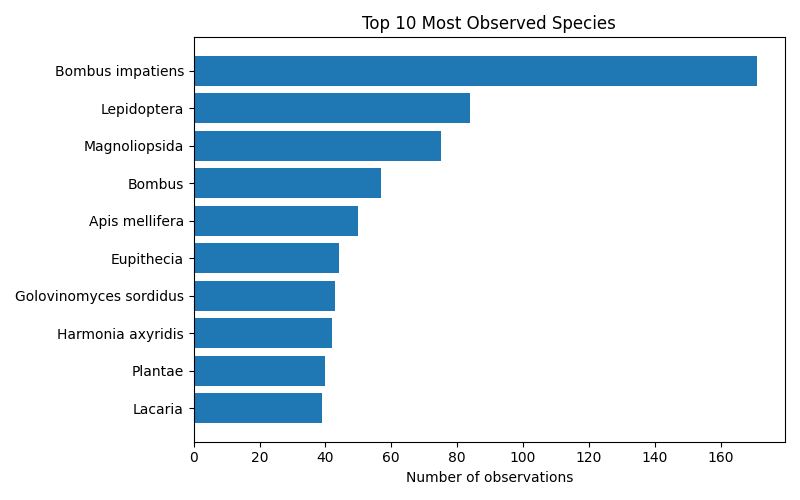
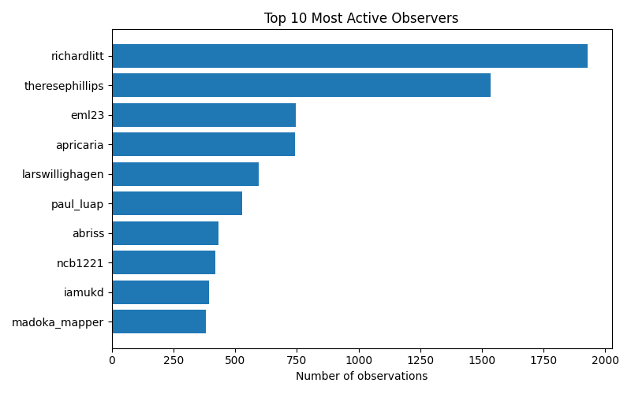

# iNaturalist Project Report: wikiproject-biodiversity

- Total observations: 9978
- Unique species observed: 4683
- Unique observers: 37

## Wikipedia & Wikidata Coverage

- Species not on Wikidata: **4048**
- Missing in en: **4114**

- Missing in es: **4344**

- Missing in ja: **4526**

- Missing in ar: **4463**

- Missing in nl: **4240**

- Missing in pt: **4429**

- Missing in fr: **4276**

| Taxon | Wikidata | GBIF | iNaturalist | EN | ES | JA | AR | NL | PT | FR |
|---|---|---|---|---|---|---|---|---|---|---|
| Agrochola lunosa | [Q50404976](https://www.wikidata.org/entity/Q50404976) | [4533090](https://www.gbif.org/species/4533090) | [461786](https://www.inaturalist.org/taxa/461786) | &#10007; | &#10007; | &#10007; | &#10007; | &#10007; | &#10007; | &#10007; |
| Allium ochroleucum | [Q21237712](https://www.wikidata.org/entity/Q21237712) | [2855735](https://www.gbif.org/species/2855735) | [954283](https://www.inaturalist.org/taxa/954283) | &#10007; | &#10007; | &#10007; | &#10007; | &#10007; | &#10007; | &#10007; |
| Aphis hederae | [Q10414955](https://www.wikidata.org/entity/Q10414955) | [2072752](https://www.gbif.org/species/2072752) | [366580](https://www.inaturalist.org/taxa/366580) | &#10007; | &#10007; | &#10007; | &#10007; | &#10007; | &#10007; | &#10007; |
| Aspidoscelis gularis gularis | [Q49410310](https://www.wikidata.org/entity/Q49410310) | [6158593](https://www.gbif.org/species/6158593) | [115391](https://www.inaturalist.org/taxa/115391) | &#10007; | &#10007; | &#10007; | &#10007; | &#10007; | &#10007; | &#10007; |
| Boeremia hedericola | [Q10432031](https://www.wikidata.org/entity/Q10432031) | [5894244](https://www.gbif.org/species/5894244) | [542217](https://www.inaturalist.org/taxa/542217) | &#10007; | &#10007; | &#10007; | &#10007; | &#10007; | &#10007; | &#10007; |
| Bruchomorpha decorata | [Q10436219](https://www.wikidata.org/entity/Q10436219) | [2057843](https://www.gbif.org/species/2057843) | [818598](https://www.inaturalist.org/taxa/818598) | &#10007; | &#10007; | &#10007; | &#10007; | &#10007; | &#10007; | &#10007; |
| Calamagrostis arenaria | [Q65932159](https://www.wikidata.org/entity/Q65932159) | [4126489](https://www.gbif.org/species/4126489) | — | &#10007; | &#10007; | &#10007; | &#10007; | &#10007; | &#10007; | &#10007; |
| Camelinodae | [Q118437411](https://www.wikidata.org/entity/Q118437411) | — | [1473859](https://www.inaturalist.org/taxa/1473859) | &#10007; | &#10007; | &#10007; | &#10007; | &#10007; | &#10007; | &#10007; |
| Chilopsis linearis | [Q143161](https://www.wikidata.org/entity/Q143161) | [5415072](https://www.gbif.org/species/5415072) | [76290](https://www.inaturalist.org/taxa/76290) | &#10007; | &#10007; | &#10007; | &#10007; | &#10007; | &#10007; | &#10007; |
| Cofana spectra | [Q10456615](https://www.wikidata.org/entity/Q10456615) | [2035465](https://www.gbif.org/species/2035465) | [417981](https://www.inaturalist.org/taxa/417981) | &#10007; | &#10007; | &#10007; | &#10007; | &#10007; | &#10007; | &#10007; |
| Condylostylus quadricolor | [Q14529323](https://www.wikidata.org/entity/Q14529323) | [1610576](https://www.gbif.org/species/1610576) | — | &#10007; | &#10007; | &#10007; | &#10007; | &#10007; | &#10007; | &#10007; |
| Corythoxestis zorionella | [Q111178048](https://www.wikidata.org/entity/Q111178048) | [11788859](https://www.gbif.org/species/11788859) | [911439](https://www.inaturalist.org/taxa/911439) | &#10007; | &#10007; | &#10007; | &#10007; | &#10007; | &#10007; | &#10007; |
| Crepidomenini | [Q21216499](https://www.wikidata.org/entity/Q21216499) | — | — | &#10007; | &#10007; | &#10007; | &#10007; | &#10007; | &#10007; | &#10007; |
| Crusea simplex | [Q106901334](https://www.wikidata.org/entity/Q106901334) | — | — | &#10007; | &#10007; | &#10007; | &#10007; | &#10007; | &#10007; | &#10007; |
| Eleodes carbonaria | [Q108623627](https://www.wikidata.org/entity/Q108623627) | [8887207](https://www.gbif.org/species/8887207) | [790444](https://www.inaturalist.org/taxa/790444) | &#10007; | &#10007; | &#10007; | &#10007; | &#10007; | &#10007; | &#10007; |
| Epistrophella emarginata | [Q115972895](https://www.wikidata.org/entity/Q115972895) | [12137049](https://www.gbif.org/species/12137049) | [499329](https://www.inaturalist.org/taxa/499329) | &#10007; | &#10007; | &#10007; | &#10007; | &#10007; | &#10007; | &#10007; |
| Eriotheca pentaphylla | [Q15366964](https://www.wikidata.org/entity/Q15366964) | [7296179](https://www.gbif.org/species/7296179) | — | &#10007; | &#10007; | &#10007; | &#10007; | &#10007; | &#10007; | &#10007; |
| Erysiphe radulescui | [Q107672570](https://www.wikidata.org/entity/Q107672570) | [2578326](https://www.gbif.org/species/2578326) | — | &#10007; | &#10007; | &#10007; | &#10007; | &#10007; | &#10007; | &#10007; |
| Golovinomyces depressus | [Q80863960](https://www.wikidata.org/entity/Q80863960) | [2578723](https://www.gbif.org/species/2578723) | [1031738](https://www.inaturalist.org/taxa/1031738) | &#10007; | &#10007; | &#10007; | &#10007; | &#10007; | &#10007; | &#10007; |
| Hakeinae | [Q21396648](https://www.wikidata.org/entity/Q21396648) | — | — | &#10007; | &#10007; | &#10007; | &#10007; | &#10007; | &#10007; | &#10007; |
| Heraclides thoas | [Q118613794](https://www.wikidata.org/entity/Q118613794) | [9464249](https://www.gbif.org/species/9464249) | [258082](https://www.inaturalist.org/taxa/258082) | &#10007; | &#10007; | &#10007; | &#10007; | &#10007; | &#10007; | &#10007; |
| Heteronychia | [Q14619577](https://www.wikidata.org/entity/Q14619577) | [1480833](https://www.gbif.org/species/1480833) | [644918](https://www.inaturalist.org/taxa/644918) | &#10007; | &#10007; | &#10007; | &#10007; | &#10007; | &#10007; | &#10007; |
| Hydrocotyle heteromeria | [Q15552477](https://www.wikidata.org/entity/Q15552477) | [3637717](https://www.gbif.org/species/3637717) | [402581](https://www.inaturalist.org/taxa/402581) | &#10007; | &#10007; | &#10007; | &#10007; | &#10007; | &#10007; | &#10007; |
| Jatropha cardiophylla | [Q15394004](https://www.wikidata.org/entity/Q15394004) | [3073064](https://www.gbif.org/species/3073064) | [164234](https://www.inaturalist.org/taxa/164234) | &#10007; | &#10007; | &#10007; | &#10007; | &#10007; | &#10007; | &#10007; |
| Jatropha macrorhiza | [Q15393836](https://www.wikidata.org/entity/Q15393836) | [3072735](https://www.gbif.org/species/3072735) | [164241](https://www.inaturalist.org/taxa/164241) | &#10007; | &#10007; | &#10007; | &#10007; | &#10007; | &#10007; | &#10007; |
| Leptophobia aripa elodia | [Q122111422](https://www.wikidata.org/entity/Q122111422) | [4300579](https://www.gbif.org/species/4300579) | [312353](https://www.inaturalist.org/taxa/312353) | &#10007; | &#10007; | &#10007; | &#10007; | &#10007; | &#10007; | &#10007; |
| Lycoperdon utriforme | [Q378497](https://www.wikidata.org/entity/Q378497) | [5243236](https://www.gbif.org/species/5243236) | [180365](https://www.inaturalist.org/taxa/180365) | &#10007; | &#10007; | &#10007; | &#10007; | &#10007; | &#10007; | &#10007; |
| Myopsocus | [Q10591916](https://www.wikidata.org/entity/Q10591916) | [1031774](https://www.gbif.org/species/1031774) | [251900](https://www.inaturalist.org/taxa/251900) | &#10007; | &#10007; | &#10007; | &#10007; | &#10007; | &#10007; | &#10007; |
| Olidiana brevis | [Q10608636](https://www.wikidata.org/entity/Q10608636) | [2029892](https://www.gbif.org/species/2029892) | [973949](https://www.inaturalist.org/taxa/973949) | &#10007; | &#10007; | &#10007; | &#10007; | &#10007; | &#10007; | &#10007; |
| Otospermophilus variegatus | [Q21727774](https://www.wikidata.org/entity/Q21727774) | [7572569](https://www.gbif.org/species/7572569) | [180008](https://www.inaturalist.org/taxa/180008) | &#10007; | &#10007; | &#10007; | &#10007; | &#10007; | &#10007; | &#10007; |
| Phyciodes pallescens | [Q15774606](https://www.wikidata.org/entity/Q15774606) | [1918997](https://www.gbif.org/species/1918997) | [194331](https://www.inaturalist.org/taxa/194331) | &#10007; | &#10007; | &#10007; | &#10007; | &#10007; | &#10007; | &#10007; |
| Phyllosticta ampelicida | [Q96676322](https://www.wikidata.org/entity/Q96676322) | [2611418](https://www.gbif.org/species/2611418) | [517494](https://www.inaturalist.org/taxa/517494) | &#10007; | &#10007; | &#10007; | &#10007; | &#10007; | &#10007; | &#10007; |
| Podosphaera erigerontis-canadensis | [Q108267701](https://www.wikidata.org/entity/Q108267701) | [7730091](https://www.gbif.org/species/7730091) | — | &#10007; | &#10007; | &#10007; | &#10007; | &#10007; | &#10007; | &#10007; |
| Polybia fastidiosuscula | [Q14426273](https://www.wikidata.org/entity/Q14426273) | [5032802](https://www.gbif.org/species/5032802) | [752527](https://www.inaturalist.org/taxa/752527) | &#10007; | &#10007; | &#10007; | &#10007; | &#10007; | &#10007; | &#10007; |
| Protoptilinae | [Q21228845](https://www.wikidata.org/entity/Q21228845) | — | — | &#10007; | &#10007; | &#10007; | &#10007; | &#10007; | &#10007; | &#10007; |
| Pteridium pinetorum | [Q38230143](https://www.wikidata.org/entity/Q38230143) | [7265880](https://www.gbif.org/species/7265880) | [841645](https://www.inaturalist.org/taxa/841645) | &#10007; | &#10007; | &#10007; | &#10007; | &#10007; | &#10007; | &#10007; |
| Pyrope pyrope | [Q117255720](https://www.wikidata.org/entity/Q117255720) | — | — | &#10007; | &#10007; | &#10007; | &#10007; | &#10007; | &#10007; | &#10007; |
| Sida neomexicana | [Q15382662](https://www.wikidata.org/entity/Q15382662) | [5406749](https://www.gbif.org/species/5406749) | [168934](https://www.inaturalist.org/taxa/168934) | &#10007; | &#10007; | &#10007; | &#10007; | &#10007; | &#10007; | &#10007; |
| Sphaeralcea fendleri | [Q15383723](https://www.wikidata.org/entity/Q15383723) | [3152446](https://www.gbif.org/species/3152446) | [169176](https://www.inaturalist.org/taxa/169176) | &#10007; | &#10007; | &#10007; | &#10007; | &#10007; | &#10007; | &#10007; |
| Syntrichia montana | [Q15316624](https://www.wikidata.org/entity/Q15316624) | [7846682](https://www.gbif.org/species/7846682) | [169511](https://www.inaturalist.org/taxa/169511) | &#10007; | &#10007; | &#10007; | &#10007; | &#10007; | &#10007; | &#10007; |
| Talinum aurantiacum | [Q41778381](https://www.wikidata.org/entity/Q41778381) | [3084683](https://www.gbif.org/species/3084683) | [169528](https://www.inaturalist.org/taxa/169528) | &#10007; | &#10007; | &#10007; | &#10007; | &#10007; | &#10007; | &#10007; |
| Trifolium pinetorum | [Q15545100](https://www.wikidata.org/entity/Q15545100) | [5359252](https://www.gbif.org/species/5359252) | [169972](https://www.inaturalist.org/taxa/169972) | &#10007; | &#10007; | &#10007; | &#10007; | &#10007; | &#10007; | &#10007; |
| Udonga | [Q80967454](https://www.wikidata.org/entity/Q80967454) | [4783296](https://www.gbif.org/species/4783296) | — | &#10007; | &#10007; | &#10007; | &#10007; | &#10007; | &#10007; | &#10007; |
| Woodwardia areolata | [Q8033591](https://www.wikidata.org/entity/Q8033591) | [5275360](https://www.gbif.org/species/5275360) | [118731](https://www.inaturalist.org/taxa/118731) | &#10007; | &#10007; | &#10007; | &#10007; | &#10007; | &#10007; | &#10007; |
| Actocetor indicus | [Q13999446](https://www.wikidata.org/entity/Q13999446) | [1619797](https://www.gbif.org/species/1619797) | [426176](https://www.inaturalist.org/taxa/426176) | &#10007; | &#10007; | &#10007; | &#10007; | [&#10003;](https://nl.wikipedia.org/wiki/Actocetor_indicus) | &#10007; | &#10007; |
| Adelpha eulalia | [Q16825434](https://www.wikidata.org/entity/Q16825434) | [5714316](https://www.gbif.org/species/5714316) | [67559](https://www.inaturalist.org/taxa/67559) | [&#10003;](https://en.wikipedia.org/wiki/Adelpha_eulalia) | &#10007; | &#10007; | &#10007; | &#10007; | &#10007; | &#10007; |
| Anystis | [Q4778288](https://www.wikidata.org/entity/Q4778288) | [2131873](https://www.gbif.org/species/2131873) | [249515](https://www.inaturalist.org/taxa/249515) | [&#10003;](https://en.wikipedia.org/wiki/Anystis) | &#10007; | &#10007; | &#10007; | &#10007; | &#10007; | &#10007; |
| Aphrophorinae | [Q111264283](https://www.wikidata.org/entity/Q111264283) | — | — | &#10007; | &#10007; | &#10007; | &#10007; | &#10007; | &#10007; | [&#10003;](https://fr.wikipedia.org/wiki/Aphrophorinae) |
| Ariolimax buttoni | [Q49446828](https://www.wikidata.org/entity/Q49446828) | [10047389](https://www.gbif.org/species/10047389) | [214185](https://www.inaturalist.org/taxa/214185) | [&#10003;](https://en.wikipedia.org/wiki/Ariolimax_buttoni) | &#10007; | &#10007; | &#10007; | &#10007; | &#10007; | &#10007; |
| Bouteloua barbata | [Q4950432](https://www.wikidata.org/entity/Q4950432) | [5289873](https://www.gbif.org/species/5289873) | [75857](https://www.inaturalist.org/taxa/75857) | [&#10003;](https://en.wikipedia.org/wiki/Bouteloua_barbata) | &#10007; | &#10007; | &#10007; | &#10007; | &#10007; | &#10007; |
| Brachycistidinae | [Q21226547](https://www.wikidata.org/entity/Q21226547) | — | [450172](https://www.inaturalist.org/taxa/450172) | [&#10003;](https://en.wikipedia.org/wiki/Brachycistidinae) | &#10007; | &#10007; | &#10007; | &#10007; | &#10007; | &#10007; |
| Brochymena quadripustulata | [Q10435939](https://www.wikidata.org/entity/Q10435939) | [2079112](https://www.gbif.org/species/2079112) | [132677](https://www.inaturalist.org/taxa/132677) | [&#10003;](https://en.wikipedia.org/wiki/Brochymena_quadripustulata) | &#10007; | &#10007; | &#10007; | &#10007; | &#10007; | &#10007; |
| Clovia conifera | [Q10455533](https://www.wikidata.org/entity/Q10455533) | [2016555](https://www.gbif.org/species/2016555) | [476037](https://www.inaturalist.org/taxa/476037) | &#10007; | &#10007; | &#10007; | &#10007; | [&#10003;](https://nl.wikipedia.org/wiki/Clovia_conifera) | &#10007; | &#10007; |
| Coelioxys mandibularis | [Q1824872](https://www.wikidata.org/entity/Q1824872) | [1338626](https://www.gbif.org/species/1338626) | [626632](https://www.inaturalist.org/taxa/626632) | &#10007; | &#10007; | &#10007; | &#10007; | [&#10003;](https://nl.wikipedia.org/wiki/Duinkegelbij) | &#10007; | &#10007; |
| Conotelus obscurus | [Q14928642](https://www.wikidata.org/entity/Q14928642) | [1044045](https://www.gbif.org/species/1044045) | [217510](https://www.inaturalist.org/taxa/217510) | [&#10003;](https://en.wikipedia.org/wiki/Conotelus_obscurus) | &#10007; | &#10007; | &#10007; | &#10007; | &#10007; | &#10007; |
| Coridius | [Q21215937](https://www.wikidata.org/entity/Q21215937) | [4781489](https://www.gbif.org/species/4781489) | [336017](https://www.inaturalist.org/taxa/336017) | [&#10003;](https://en.wikipedia.org/wiki/Coridius) | &#10007; | &#10007; | &#10007; | &#10007; | &#10007; | &#10007; |
| Corythaica carinata | [Q10460424](https://www.wikidata.org/entity/Q10460424) | [2020604](https://www.gbif.org/species/2020604) | [479476](https://www.inaturalist.org/taxa/479476) | [&#10003;](https://en.wikipedia.org/wiki/Corythaica_carinata) | &#10007; | &#10007; | &#10007; | &#10007; | &#10007; | &#10007; |
| Cyclocephala lunulata | [Q14868257](https://www.wikidata.org/entity/Q14868257) | [4994907](https://www.gbif.org/species/4994907) | [301455](https://www.inaturalist.org/taxa/301455) | [&#10003;](https://en.wikipedia.org/wiki/Cyclocephala_lunulata) | &#10007; | &#10007; | &#10007; | &#10007; | &#10007; | &#10007; |
| Cyphicerina | [Q20379705](https://www.wikidata.org/entity/Q20379705) | — | — | &#10007; | [&#10003;](https://es.wikipedia.org/wiki/Cyphicerina) | &#10007; | &#10007; | &#10007; | &#10007; | &#10007; |
| Dasychira chekiangensis | [Q13478368](https://www.wikidata.org/entity/Q13478368) | [1820888](https://www.gbif.org/species/1820888) | [209613](https://www.inaturalist.org/taxa/209613) | &#10007; | &#10007; | &#10007; | &#10007; | [&#10003;](https://nl.wikipedia.org/wiki/Dasychira_chekiangensis) | &#10007; | &#10007; |
| Dasysyrphus intrudens | [Q14520074](https://www.wikidata.org/entity/Q14520074) | [1542118](https://www.gbif.org/species/1542118) | [451189](https://www.inaturalist.org/taxa/451189) | [&#10003;](https://en.wikipedia.org/wiki/Dasysyrphus_intrudens) | &#10007; | &#10007; | &#10007; | &#10007; | &#10007; | &#10007; |
| Digrammia neptaria | [Q21268200](https://www.wikidata.org/entity/Q21268200) | [9516038](https://www.gbif.org/species/9516038) | [218445](https://www.inaturalist.org/taxa/218445) | [&#10003;](https://en.wikipedia.org/wiki/Digrammia_neptaria) | &#10007; | &#10007; | &#10007; | &#10007; | &#10007; | &#10007; |
| Dyscinetus morator | [Q14867698](https://www.wikidata.org/entity/Q14867698) | [1074565](https://www.gbif.org/species/1074565) | [218833](https://www.inaturalist.org/taxa/218833) | [&#10003;](https://en.wikipedia.org/wiki/Dyscinetus_morator) | &#10007; | &#10007; | &#10007; | &#10007; | &#10007; | &#10007; |
| Echinocereus santaritensis | [Q17246011](https://www.wikidata.org/entity/Q17246011) | [7283198](https://www.gbif.org/species/7283198) | [354227](https://www.inaturalist.org/taxa/354227) | [&#10003;](https://en.wikipedia.org/wiki/Echinocereus_santaritensis) | &#10007; | &#10007; | &#10007; | &#10007; | &#10007; | &#10007; |
| Ennada flavaria | [Q13557016](https://www.wikidata.org/entity/Q13557016) | [1960044](https://www.gbif.org/species/1960044) | [956217](https://www.inaturalist.org/taxa/956217) | &#10007; | &#10007; | &#10007; | &#10007; | [&#10003;](https://nl.wikipedia.org/wiki/Ennada_flavaria) | &#10007; | &#10007; |
| Entodon | [Q13567617](https://www.wikidata.org/entity/Q13567617) | [2672890](https://www.gbif.org/species/2672890) | [128030](https://www.inaturalist.org/taxa/128030) | [&#10003;](https://en.wikipedia.org/wiki/Entodon) | &#10007; | &#10007; | &#10007; | &#10007; | &#10007; | &#10007; |
| Entomobrya multifasciata | [Q10484854](https://www.wikidata.org/entity/Q10484854) | [4539614](https://www.gbif.org/species/4539614) | [261957](https://www.inaturalist.org/taxa/261957) | &#10007; | &#10007; | &#10007; | &#10007; | [&#10003;](https://nl.wikipedia.org/wiki/Entomobrya_multifasciata) | &#10007; | &#10007; |
| Erysiphe syringae | [Q10488583](https://www.wikidata.org/entity/Q10488583) | [2578594](https://www.gbif.org/species/2578594) | [925952](https://www.inaturalist.org/taxa/925952) | [&#10003;](https://en.wikipedia.org/wiki/Erysiphe_syringae) | &#10007; | &#10007; | &#10007; | &#10007; | &#10007; | &#10007; |
| Fraus crocea | [Q15639173](https://www.wikidata.org/entity/Q15639173) | [1828455](https://www.gbif.org/species/1828455) | [556042](https://www.inaturalist.org/taxa/556042) | [&#10003;](https://en.wikipedia.org/wiki/Fraus_crocea) | &#10007; | &#10007; | &#10007; | &#10007; | &#10007; | &#10007; |
| Glischrochilus quadrisignatus | [Q1772759](https://www.wikidata.org/entity/Q1772759) | [4453163](https://www.gbif.org/species/4453163) | [203328](https://www.inaturalist.org/taxa/203328) | [&#10003;](https://en.wikipedia.org/wiki/Glischrochilus_quadrisignatus) | &#10007; | &#10007; | &#10007; | &#10007; | &#10007; | &#10007; |
| Halictophagus | [Q5642073](https://www.wikidata.org/entity/Q5642073) | [2007396](https://www.gbif.org/species/2007396) | [644872](https://www.inaturalist.org/taxa/644872) | [&#10003;](https://en.wikipedia.org/wiki/Halictophagus) | &#10007; | &#10007; | &#10007; | &#10007; | &#10007; | &#10007; |
| Hellenia | [Q20720124](https://www.wikidata.org/entity/Q20720124) | [5301255](https://www.gbif.org/species/5301255) | — | [&#10003;](https://en.wikipedia.org/wiki/Hellenia) | &#10007; | &#10007; | &#10007; | &#10007; | &#10007; | &#10007; |
| Hemitheini | [Q3784783](https://www.wikidata.org/entity/Q3784783) | — | [123090](https://www.inaturalist.org/taxa/123090) | [&#10003;](https://en.wikipedia.org/wiki/Hemitheini) | &#10007; | &#10007; | &#10007; | &#10007; | &#10007; | &#10007; |
| Heterotermitidae | [Q129169384](https://www.wikidata.org/entity/Q129169384) | — | — | [&#10003;](https://en.wikipedia.org/wiki/Heterotermitidae) | &#10007; | &#10007; | &#10007; | &#10007; | &#10007; | &#10007; |
| Hyalymenus tarsatus | [Q10527821](https://www.wikidata.org/entity/Q10527821) | [2050160](https://www.gbif.org/species/2050160) | [340813](https://www.inaturalist.org/taxa/340813) | [&#10003;](https://en.wikipedia.org/wiki/Hyalymenus_tarsatus) | &#10007; | &#10007; | &#10007; | &#10007; | &#10007; | &#10007; |
| Hymenorus | [Q21215835](https://www.wikidata.org/entity/Q21215835) | [4406955](https://www.gbif.org/species/4406955) | [177733](https://www.inaturalist.org/taxa/177733) | [&#10003;](https://en.wikipedia.org/wiki/Hymenorus) | &#10007; | &#10007; | &#10007; | &#10007; | &#10007; | &#10007; |
| Hymenoscyphus fructigenus | [Q10605574](https://www.wikidata.org/entity/Q10605574) | [2582296](https://www.gbif.org/species/2582296) | [351066](https://www.inaturalist.org/taxa/351066) | &#10007; | &#10007; | &#10007; | &#10007; | [&#10003;](https://nl.wikipedia.org/wiki/Eikeldopzwam) | &#10007; | &#10007; |
| Hymetta | [Q10529491](https://www.wikidata.org/entity/Q10529491) | [2028313](https://www.gbif.org/species/2028313) | [177720](https://www.inaturalist.org/taxa/177720) | [&#10003;](https://en.wikipedia.org/wiki/Hymetta) | &#10007; | &#10007; | &#10007; | &#10007; | &#10007; | &#10007; |
| Kindbergia | [Q1741712](https://www.wikidata.org/entity/Q1741712) | [2679750](https://www.gbif.org/species/2679750) | [67948](https://www.inaturalist.org/taxa/67948) | [&#10003;](https://en.wikipedia.org/wiki/Kindbergia) | &#10007; | &#10007; | &#10007; | &#10007; | &#10007; | &#10007; |
| Lentinus flexipes | [Q107973703](https://www.wikidata.org/entity/Q107973703) | [9654799](https://www.gbif.org/species/9654799) | — | [&#10003;](https://en.wikipedia.org/wiki/Lentinus_flexipes) | &#10007; | &#10007; | &#10007; | &#10007; | &#10007; | &#10007; |
| Lepidostoma hirtum | [Q3755074](https://www.wikidata.org/entity/Q3755074) | [5054529](https://www.gbif.org/species/5054529) | [208049](https://www.inaturalist.org/taxa/208049) | &#10007; | &#10007; | &#10007; | &#10007; | [&#10003;](https://nl.wikipedia.org/wiki/Lepidostoma_hirtum) | &#10007; | &#10007; |
| Mesopsocus fuscifrons | [Q6821598](https://www.wikidata.org/entity/Q6821598) | [5732586](https://www.gbif.org/species/5732586) | — | [&#10003;](https://en.wikipedia.org/wiki/Mesopsocus_fuscifrons) | &#10007; | &#10007; | &#10007; | &#10007; | &#10007; | &#10007; |
| Misumenini | [Q15306421](https://www.wikidata.org/entity/Q15306421) | — | — | [&#10003;](https://en.wikipedia.org/wiki/Misumenini) | &#10007; | &#10007; | &#10007; | &#10007; | &#10007; | &#10007; |
| Nereocystis luetkeana | [Q3008573](https://www.wikidata.org/entity/Q3008573) | [4267628](https://www.gbif.org/species/4267628) | [120499](https://www.inaturalist.org/taxa/120499) | &#10007; | &#10007; | &#10007; | &#10007; | &#10007; | &#10007; | [&#10003;](https://fr.wikipedia.org/wiki/Nereocystis_luetkeana) |
| Ozophora depicturata | [Q10614413](https://www.wikidata.org/entity/Q10614413) | [5152512](https://www.gbif.org/species/5152512) | [261544](https://www.inaturalist.org/taxa/261544) | [&#10003;](https://en.wikipedia.org/wiki/Ozophora_depicturata) | &#10007; | &#10007; | &#10007; | &#10007; | &#10007; | &#10007; |
| Parancistrocerus perennis | [Q14434430](https://www.wikidata.org/entity/Q14434430) | [1332091](https://www.gbif.org/species/1332091) | [203485](https://www.inaturalist.org/taxa/203485) | [&#10003;](https://en.wikipedia.org/wiki/Parancistrocerus_perennis) | &#10007; | &#10007; | &#10007; | &#10007; | &#10007; | &#10007; |
| Passiflora tetrandra | [Q7142637](https://www.wikidata.org/entity/Q7142637) | [3587588](https://www.gbif.org/species/3587588) | [404665](https://www.inaturalist.org/taxa/404665) | [&#10003;](https://en.wikipedia.org/wiki/Passiflora_tetrandra) | &#10007; | &#10007; | &#10007; | &#10007; | &#10007; | &#10007; |
| Pectis prostrata | [Q7158911](https://www.wikidata.org/entity/Q7158911) | [5405515](https://www.gbif.org/species/5405515) | [166233](https://www.inaturalist.org/taxa/166233) | [&#10003;](https://en.wikipedia.org/wiki/Pectis_prostrata) | &#10007; | &#10007; | &#10007; | &#10007; | &#10007; | &#10007; |
| Penthimiini | [Q21222561](https://www.wikidata.org/entity/Q21222561) | — | — | [&#10003;](https://en.wikipedia.org/wiki/Penthimiini) | &#10007; | &#10007; | &#10007; | &#10007; | &#10007; | &#10007; |
| Petrosedum | [Q17759459](https://www.wikidata.org/entity/Q17759459) | [8125432](https://www.gbif.org/species/8125432) | [734821](https://www.inaturalist.org/taxa/734821) | [&#10003;](https://en.wikipedia.org/wiki/Petrosedum) | &#10007; | &#10007; | &#10007; | &#10007; | &#10007; | &#10007; |
| Physopelta gutta | [Q68940260](https://www.wikidata.org/entity/Q68940260) | [4783700](https://www.gbif.org/species/4783700) | [366807](https://www.inaturalist.org/taxa/366807) | &#10007; | &#10007; | [&#10003;](https://ja.wikipedia.org/wiki/%E3%82%AA%E3%82%AA%E3%83%9B%E3%82%B7%E3%82%AB%E3%83%A1%E3%83%A0%E3%82%B7) | &#10007; | &#10007; | &#10007; | &#10007; |
| Piper excelsum | [Q21306444](https://www.wikidata.org/entity/Q21306444) | [4183998](https://www.gbif.org/species/4183998) | [404899](https://www.inaturalist.org/taxa/404899) | [&#10003;](https://en.wikipedia.org/wiki/Piper_excelsum) | &#10007; | &#10007; | &#10007; | &#10007; | &#10007; | &#10007; |
| Platycorynus peregrinus | [Q7202587](https://www.wikidata.org/entity/Q7202587) | — | [371207](https://www.inaturalist.org/taxa/371207) | [&#10003;](https://en.wikipedia.org/wiki/Platycorynus_peregrinus) | &#10007; | &#10007; | &#10007; | &#10007; | &#10007; | &#10007; |
| Pochazia shantungensis | [Q96399602](https://www.wikidata.org/entity/Q96399602) | [5984080](https://www.gbif.org/species/5984080) | [565012](https://www.inaturalist.org/taxa/565012) | [&#10003;](https://en.wikipedia.org/wiki/Pochazia_shantungensis) | &#10007; | &#10007; | &#10007; | &#10007; | &#10007; | &#10007; |
| Podosphaera prunicola | [Q108267793](https://www.wikidata.org/entity/Q108267793) | [7566107](https://www.gbif.org/species/7566107) | — | [&#10003;](https://en.wikipedia.org/wiki/Podosphaera_prunicola) | &#10007; | &#10007; | &#10007; | &#10007; | &#10007; | &#10007; |
| Polemonium foliosissimum | [Q17248103](https://www.wikidata.org/entity/Q17248103) | [2927865](https://www.gbif.org/species/2927865) | [84977](https://www.inaturalist.org/taxa/84977) | [&#10003;](https://en.wikipedia.org/wiki/Polemonium_foliosissimum) | &#10007; | &#10007; | &#10007; | &#10007; | &#10007; | &#10007; |
| Polypedilum nubifer | [Q13850829](https://www.wikidata.org/entity/Q13850829) | [1456121](https://www.gbif.org/species/1456121) | [1102814](https://www.inaturalist.org/taxa/1102814) | &#10007; | &#10007; | &#10007; | &#10007; | [&#10003;](https://nl.wikipedia.org/wiki/Polypedilum_nubifer) | &#10007; | &#10007; |
| Proleucoptera smilaciella | [Q14171183](https://www.wikidata.org/entity/Q14171183) | [1829267](https://www.gbif.org/species/1829267) | [509823](https://www.inaturalist.org/taxa/509823) | &#10007; | &#10007; | &#10007; | &#10007; | [&#10003;](https://nl.wikipedia.org/wiki/Proleucoptera_smilaciella) | &#10007; | &#10007; |
| Pseudopachybrachius vinctus | [Q13541930](https://www.wikidata.org/entity/Q13541930) | [2007905](https://www.gbif.org/species/2007905) | [261526](https://www.inaturalist.org/taxa/261526) | [&#10003;](https://en.wikipedia.org/wiki/Pseudopachybrachius_vinctus) | &#10007; | &#10007; | &#10007; | &#10007; | &#10007; | &#10007; |
| Rhytisma punctatum | [Q10654604](https://www.wikidata.org/entity/Q10654604) | [5255539](https://www.gbif.org/species/5255539) | [333838](https://www.inaturalist.org/taxa/333838) | [&#10003;](https://en.wikipedia.org/wiki/Rhytisma_punctatum) | &#10007; | &#10007; | &#10007; | &#10007; | &#10007; | &#10007; |
| Scaphytopius | [Q10662681](https://www.wikidata.org/entity/Q10662681) | [2030582](https://www.gbif.org/species/2030582) | [203279](https://www.inaturalist.org/taxa/203279) | [&#10003;](https://en.wikipedia.org/wiki/Scaphytopius) | &#10007; | &#10007; | &#10007; | &#10007; | &#10007; | &#10007; |
| Scolia dubia | [Q7434284](https://www.wikidata.org/entity/Q7434284) | [1309715](https://www.gbif.org/species/1309715) | [62768](https://www.inaturalist.org/taxa/62768) | [&#10003;](https://en.wikipedia.org/wiki/Scolia_dubia) | &#10007; | &#10007; | &#10007; | &#10007; | &#10007; | &#10007; |
| Scopelodes | [Q13847358](https://www.wikidata.org/entity/Q13847358) | [1752848](https://www.gbif.org/species/1752848) | [199654](https://www.inaturalist.org/taxa/199654) | &#10007; | &#10007; | &#10007; | &#10007; | [&#10003;](https://nl.wikipedia.org/wiki/Scopelodes) | &#10007; | &#10007; |
| Scytothamnus | [Q7439707](https://www.wikidata.org/entity/Q7439707) | [3200841](https://www.gbif.org/species/3200841) | [487195](https://www.inaturalist.org/taxa/487195) | [&#10003;](https://en.wikipedia.org/wiki/Scytothamnus) | &#10007; | &#10007; | &#10007; | &#10007; | &#10007; | &#10007; |
| Sorbus sitchensis | [Q3938471](https://www.wikidata.org/entity/Q3938471) | [3012319](https://www.gbif.org/species/3012319) | [48583](https://www.inaturalist.org/taxa/48583) | [&#10003;](https://en.wikipedia.org/wiki/Sorbus_sitchensis) | &#10007; | &#10007; | &#10007; | &#10007; | &#10007; | &#10007; |
| Stirellus bicolor | [Q7617539](https://www.wikidata.org/entity/Q7617539) | [2048533](https://www.gbif.org/species/2048533) | [415458](https://www.inaturalist.org/taxa/415458) | [&#10003;](https://en.wikipedia.org/wiki/Stirellus_bicolor) | &#10007; | &#10007; | &#10007; | &#10007; | &#10007; | &#10007; |
| Triatoma sanguisuga | [Q10702264](https://www.wikidata.org/entity/Q10702264) | [2008540](https://www.gbif.org/species/2008540) | [322394](https://www.inaturalist.org/taxa/322394) | [&#10003;](https://en.wikipedia.org/wiki/Triatoma_sanguisuga) | &#10007; | &#10007; | &#10007; | &#10007; | &#10007; | &#10007; |
| Viburnum scabrellum | [Q87591433](https://www.wikidata.org/entity/Q87591433) | [6369682](https://www.gbif.org/species/6369682) | [1397173](https://www.inaturalist.org/taxa/1397173) | [&#10003;](https://en.wikipedia.org/wiki/Viburnum_scabrellum) | &#10007; | &#10007; | &#10007; | &#10007; | &#10007; | &#10007; |
| Acanalonia conica | [Q10398269](https://www.wikidata.org/entity/Q10398269) | [2064632](https://www.gbif.org/species/2064632) | [84806](https://www.inaturalist.org/taxa/84806) | [&#10003;](https://en.wikipedia.org/wiki/Acanalonia_conica) | &#10007; | &#10007; | &#10007; | &#10007; | &#10007; | [&#10003;](https://fr.wikipedia.org/wiki/Acanalonia_conica) |
| Aceria ilicis | [Q4033248](https://www.wikidata.org/entity/Q4033248) | [4544661](https://www.gbif.org/species/4544661) | [556479](https://www.inaturalist.org/taxa/556479) | [&#10003;](https://en.wikipedia.org/wiki/Aceria_ilicis) | &#10007; | &#10007; | &#10007; | &#10007; | &#10007; | [&#10003;](https://fr.wikipedia.org/wiki/Aceria_ilicis) |
| Acmaeodera amplicollis | [Q14922823](https://www.wikidata.org/entity/Q14922823) | [6003333](https://www.gbif.org/species/6003333) | [475316](https://www.inaturalist.org/taxa/475316) | [&#10003;](https://en.wikipedia.org/wiki/Acmaeodera_amplicollis) | [&#10003;](https://es.wikipedia.org/wiki/Acmaeodera_amplicollis) | &#10007; | &#10007; | &#10007; | &#10007; | &#10007; |
| Acmaeodera rubronotata | [Q14922582](https://www.wikidata.org/entity/Q14922582) | [6003336](https://www.gbif.org/species/6003336) | [132096](https://www.inaturalist.org/taxa/132096) | [&#10003;](https://en.wikipedia.org/wiki/Acmaeodera_rubronotata) | [&#10003;](https://es.wikipedia.org/wiki/Acmaeodera_rubronotata) | &#10007; | &#10007; | &#10007; | &#10007; | &#10007; |
| Adoxia vulgaris | [Q2032877](https://www.wikidata.org/entity/Q2032877) | — | [385070](https://www.inaturalist.org/taxa/385070) | &#10007; | [&#10003;](https://es.wikipedia.org/wiki/Adoxia_vulgaris) | &#10007; | &#10007; | [&#10003;](https://nl.wikipedia.org/wiki/Adoxia_vulgaris) | &#10007; | &#10007; |
| Agrobacterium radiobacter | [Q21235902](https://www.wikidata.org/entity/Q21235902) | [3220735](https://www.gbif.org/species/3220735) | [975247](https://www.inaturalist.org/taxa/975247) | [&#10003;](https://en.wikipedia.org/wiki/Agrobacterium_radiobacter) | &#10007; | &#10007; | &#10007; | &#10007; | &#10007; | [&#10003;](https://fr.wikipedia.org/wiki/Agrobacterium_radiobacter) |
| Alleculinae | [Q524322](https://www.wikidata.org/entity/Q524322) | [4724248](https://www.gbif.org/species/4724248) | [319005](https://www.inaturalist.org/taxa/319005) | [&#10003;](https://en.wikipedia.org/wiki/Alleculinae) | &#10007; | &#10007; | &#10007; | &#10007; | &#10007; | [&#10003;](https://fr.wikipedia.org/wiki/Alleculinae) |
| Alonsoa meridionalis | [Q4062836](https://www.wikidata.org/entity/Q4062836) | [7331539](https://www.gbif.org/species/7331539) | [282861](https://www.inaturalist.org/taxa/282861) | [&#10003;](https://en.wikipedia.org/wiki/Alonsoa_meridionalis) | &#10007; | &#10007; | [&#10003;](https://ar.wikipedia.org/wiki/%D8%A3%D9%84%D9%88%D9%86%D8%B3%D9%88%D8%A9_%D8%AC%D9%86%D9%88%D8%A8%D9%8A%D8%A9) | &#10007; | &#10007; | &#10007; |
| Aloysia wrightii | [Q4734687](https://www.wikidata.org/entity/Q4734687) | [5341160](https://www.gbif.org/species/5341160) | [75384](https://www.inaturalist.org/taxa/75384) | [&#10003;](https://en.wikipedia.org/wiki/Aloysia_wrightii) | &#10007; | &#10007; | [&#10003;](https://ar.wikipedia.org/wiki/%D9%84%D9%88%D9%8A%D8%B2%D8%A9_%D8%B1%D8%A7%D9%8A%D8%AA%D9%8A) | &#10007; | &#10007; | &#10007; |
| Amblyptilia | [Q2367080](https://www.wikidata.org/entity/Q2367080) | [1859284](https://www.gbif.org/species/1859284) | [173219](https://www.inaturalist.org/taxa/173219) | [&#10003;](https://en.wikipedia.org/wiki/Amblyptilia) | &#10007; | &#10007; | &#10007; | [&#10003;](https://nl.wikipedia.org/wiki/Amblyptilia) | &#10007; | &#10007; |
| Amblytropidia mysteca | [Q11841035](https://www.wikidata.org/entity/Q11841035) | [1708021](https://www.gbif.org/species/1708021) | [213346](https://www.inaturalist.org/taxa/213346) | [&#10003;](https://en.wikipedia.org/wiki/Amblytropidia_mysteca) | &#10007; | &#10007; | &#10007; | [&#10003;](https://nl.wikipedia.org/wiki/Amblytropidia_mysteca) | &#10007; | &#10007; |
| Ambrosia ambrosioides | [Q1961184](https://www.wikidata.org/entity/Q1961184) | [3110605](https://www.gbif.org/species/3110605) | [75405](https://www.inaturalist.org/taxa/75405) | [&#10003;](https://en.wikipedia.org/wiki/Ambrosia_ambrosioides) | [&#10003;](https://es.wikipedia.org/wiki/Ambrosia_ambrosioides) | &#10007; | &#10007; | &#10007; | &#10007; | &#10007; |
| Anoplodesmus | [Q6443001](https://www.wikidata.org/entity/Q6443001) | [1017466](https://www.gbif.org/species/1017466) | [349284](https://www.inaturalist.org/taxa/349284) | [&#10003;](https://en.wikipedia.org/wiki/Anoplodesmus) | &#10007; | &#10007; | &#10007; | &#10007; | [&#10003;](https://pt.wikipedia.org/wiki/Anoplodesmus) | &#10007; |
| Anurida | [Q10413869](https://www.wikidata.org/entity/Q10413869) | [2121987](https://www.gbif.org/species/2121987) | [83887](https://www.inaturalist.org/taxa/83887) | [&#10003;](https://en.wikipedia.org/wiki/Anurida) | &#10007; | &#10007; | &#10007; | &#10007; | &#10007; | [&#10003;](https://fr.wikipedia.org/wiki/Anurida) |
| Arocatus melanocephalus | [Q16525387](https://www.wikidata.org/entity/Q16525387) | [4486295](https://www.gbif.org/species/4486295) | [505749](https://www.inaturalist.org/taxa/505749) | [&#10003;](https://en.wikipedia.org/wiki/Arocatus_melanocephalus) | &#10007; | &#10007; | &#10007; | [&#10003;](https://nl.wikipedia.org/wiki/Iepenridderwants) | &#10007; | &#10007; |
| Augochlorella aurata | [Q1985579](https://www.wikidata.org/entity/Q1985579) | [1352579](https://www.gbif.org/species/1352579) | [203313](https://www.inaturalist.org/taxa/203313) | [&#10003;](https://en.wikipedia.org/wiki/Augochlorella_aurata) | &#10007; | &#10007; | &#10007; | [&#10003;](https://nl.wikipedia.org/wiki/Augochlorella_aurata) | &#10007; | &#10007; |
| Bagrada hilaris | [Q4842100](https://www.wikidata.org/entity/Q4842100) | [4485918](https://www.gbif.org/species/4485918) | [152131](https://www.inaturalist.org/taxa/152131) | [&#10003;](https://en.wikipedia.org/wiki/Bagrada_hilaris) | [&#10003;](https://es.wikipedia.org/wiki/Bagrada_hilaris) | &#10007; | &#10007; | &#10007; | &#10007; | &#10007; |
| Bicellaria | [Q14608367](https://www.wikidata.org/entity/Q14608367) | [1458522](https://www.gbif.org/species/1458522) | [481469](https://www.inaturalist.org/taxa/481469) | [&#10003;](https://en.wikipedia.org/wiki/Bicellaria) | &#10007; | &#10007; | &#10007; | [&#10003;](https://nl.wikipedia.org/wiki/Bicellaria) | &#10007; | &#10007; |
| Blechnum filiforme | [Q4925787](https://www.wikidata.org/entity/Q4925787) | [4079367](https://www.gbif.org/species/4079367) | [400028](https://www.inaturalist.org/taxa/400028) | [&#10003;](https://en.wikipedia.org/wiki/Blechnum_filiforme) | [&#10003;](https://es.wikipedia.org/wiki/Blechnum_filiforme) | &#10007; | &#10007; | &#10007; | &#10007; | &#10007; |
| Bombus campestris | [Q1792745](https://www.wikidata.org/entity/Q1792745) | [1340527](https://www.gbif.org/species/1340527) | [127779](https://www.inaturalist.org/taxa/127779) | [&#10003;](https://en.wikipedia.org/wiki/Bombus_campestris) | &#10007; | &#10007; | &#10007; | [&#10003;](https://nl.wikipedia.org/wiki/Gewone_koekoekshommel) | &#10007; | &#10007; |
| Brachydiplax chalybea | [Q7290272](https://www.wikidata.org/entity/Q7290272) | [1429243](https://www.gbif.org/species/1429243) | [95964](https://www.inaturalist.org/taxa/95964) | [&#10003;](https://en.wikipedia.org/wiki/Brachydiplax_chalybea) | &#10007; | &#10007; | &#10007; | [&#10003;](https://nl.wikipedia.org/wiki/Brachydiplax_chalybea) | &#10007; | &#10007; |
| Camnula pellucida | [Q10441098](https://www.wikidata.org/entity/Q10441098) | [1711608](https://www.gbif.org/species/1711608) | [155274](https://www.inaturalist.org/taxa/155274) | [&#10003;](https://en.wikipedia.org/wiki/Camnula_pellucida) | &#10007; | &#10007; | &#10007; | [&#10003;](https://nl.wikipedia.org/wiki/Camnula_pellucida) | &#10007; | &#10007; |
| Carpodetus serratus | [Q5045847](https://www.wikidata.org/entity/Q5045847) | [3932516](https://www.gbif.org/species/3932516) | [341690](https://www.inaturalist.org/taxa/341690) | [&#10003;](https://en.wikipedia.org/wiki/Carpodetus_serratus) | &#10007; | &#10007; | &#10007; | [&#10003;](https://nl.wikipedia.org/wiki/Carpodetus_serratus) | &#10007; | &#10007; |
| Celtis reticulata | [Q4215121](https://www.wikidata.org/entity/Q4215121) | [6406316](https://www.gbif.org/species/6406316) | [76203](https://www.inaturalist.org/taxa/76203) | [&#10003;](https://en.wikipedia.org/wiki/Celtis_reticulata) | &#10007; | &#10007; | [&#10003;](https://ar.wikipedia.org/wiki/%D9%85%D9%8A%D8%B3_%D8%B4%D8%A8%D9%83%D9%8A) | &#10007; | &#10007; | &#10007; |
| Chlorophyllum brunneum | [Q4036155](https://www.wikidata.org/entity/Q4036155) | [5955380](https://www.gbif.org/species/5955380) | [58693](https://www.inaturalist.org/taxa/58693) | &#10007; | &#10007; | &#10007; | &#10007; | [&#10003;](https://nl.wikipedia.org/wiki/Bruine_knolparasolzwam) | &#10007; | [&#10003;](https://fr.wikipedia.org/wiki/Chlorophyllum_brunneum) |
| Chrysopini | [Q21214065](https://www.wikidata.org/entity/Q21214065) | — | [209849](https://www.inaturalist.org/taxa/209849) | [&#10003;](https://en.wikipedia.org/wiki/Chrysopini) | &#10007; | &#10007; | &#10007; | &#10007; | &#10007; | [&#10003;](https://fr.wikipedia.org/wiki/Chrysopini) |
| Cirrhophanus dyari | [Q13468401](https://www.wikidata.org/entity/Q13468401) | [1768174](https://www.gbif.org/species/1768174) | [370893](https://www.inaturalist.org/taxa/370893) | [&#10003;](https://en.wikipedia.org/wiki/Cirrhophanus_dyari) | &#10007; | &#10007; | &#10007; | [&#10003;](https://nl.wikipedia.org/wiki/Cirrhophanus_dyari) | &#10007; | &#10007; |
| Clastoptera | [Q10454609](https://www.wikidata.org/entity/Q10454609) | [2016995](https://www.gbif.org/species/2016995) | [132517](https://www.inaturalist.org/taxa/132517) | [&#10003;](https://en.wikipedia.org/wiki/Clastoptera) | &#10007; | &#10007; | &#10007; | [&#10003;](https://nl.wikipedia.org/wiki/Clastoptera) | &#10007; | &#10007; |
| Clibanarius erythropus | [Q3680644](https://www.wikidata.org/entity/Q3680644) | [4311752](https://www.gbif.org/species/4311752) | [210291](https://www.inaturalist.org/taxa/210291) | [&#10003;](https://en.wikipedia.org/wiki/Clibanarius_erythropus) | &#10007; | &#10007; | &#10007; | [&#10003;](https://nl.wikipedia.org/wiki/Clibanarius_erythropus) | &#10007; | &#10007; |
| Cobubatha metaspilaris | [Q5139013](https://www.wikidata.org/entity/Q5139013) | [1783811](https://www.gbif.org/species/1783811) | [514702](https://www.inaturalist.org/taxa/514702) | [&#10003;](https://en.wikipedia.org/wiki/Cobubatha_metaspilaris) | &#10007; | &#10007; | &#10007; | [&#10003;](https://nl.wikipedia.org/wiki/Cobubatha_metaspilaris) | &#10007; | &#10007; |
| Coccinella transversalis | [Q309705](https://www.wikidata.org/entity/Q309705) | [5809749](https://www.gbif.org/species/5809749) | [349064](https://www.inaturalist.org/taxa/349064) | [&#10003;](https://en.wikipedia.org/wiki/Coccinella_transversalis) | [&#10003;](https://es.wikipedia.org/wiki/Coccinella_transversalis) | &#10007; | &#10007; | &#10007; | &#10007; | &#10007; |
| Colpomenia sinuosa | [Q17986598](https://www.wikidata.org/entity/Q17986598) | [3197958](https://www.gbif.org/species/3197958) | [328391](https://www.inaturalist.org/taxa/328391) | [&#10003;](https://en.wikipedia.org/wiki/Colpomenia_sinuosa) | &#10007; | [&#10003;](https://ja.wikipedia.org/wiki/%E3%83%95%E3%82%AF%E3%83%AD%E3%83%8E%E3%83%AA) | &#10007; | &#10007; | &#10007; | &#10007; |
| Corbicula largillierti | [Q10898780](https://www.wikidata.org/entity/Q10898780) | — | — | [&#10003;](https://en.wikipedia.org/wiki/Corbicula_largillierti) | [&#10003;](https://es.wikipedia.org/wiki/Corbicula_largillierti) | &#10007; | &#10007; | &#10007; | &#10007; | &#10007; |
| Dirhinus | [Q13573447](https://www.wikidata.org/entity/Q13573447) | [1363490](https://www.gbif.org/species/1363490) | [250136](https://www.inaturalist.org/taxa/250136) | [&#10003;](https://en.wikipedia.org/wiki/Dirhinus) | &#10007; | &#10007; | &#10007; | [&#10003;](https://nl.wikipedia.org/wiki/Dirhinus) | &#10007; | &#10007; |
| Eleodes longicollis | [Q108624747](https://www.wikidata.org/entity/Q108624747) | [9765778](https://www.gbif.org/species/9765778) | [427371](https://www.inaturalist.org/taxa/427371) | [&#10003;](https://en.wikipedia.org/wiki/Eleodes_longicollis) | [&#10003;](https://es.wikipedia.org/wiki/Eleodes_longicollis) | &#10007; | &#10007; | &#10007; | &#10007; | &#10007; |
| Eragrostis barrelieri | [Q15512072](https://www.wikidata.org/entity/Q15512072) | [2705431](https://www.gbif.org/species/2705431) | [76848](https://www.inaturalist.org/taxa/76848) | &#10007; | &#10007; | &#10007; | [&#10003;](https://ar.wikipedia.org/wiki/%D8%A3%D8%AB%D8%A8_%D8%A8%D8%A7%D8%B1%D9%84%D9%8A%D9%8A%D9%87) | &#10007; | [&#10003;](https://pt.wikipedia.org/wiki/Eragrostis_barrelieri) | &#10007; |
| Eremochrysa | [Q10487290](https://www.wikidata.org/entity/Q10487290) | [2105598](https://www.gbif.org/species/2105598) | [252937](https://www.inaturalist.org/taxa/252937) | [&#10003;](https://en.wikipedia.org/wiki/Eremochrysa) | &#10007; | &#10007; | &#10007; | [&#10003;](https://nl.wikipedia.org/wiki/Eremochrysa) | &#10007; | &#10007; |
| Eremopedes balli | [Q10487372](https://www.wikidata.org/entity/Q10487372) | [5096432](https://www.gbif.org/species/5096432) | [481400](https://www.inaturalist.org/taxa/481400) | [&#10003;](https://en.wikipedia.org/wiki/Eremopedes_balli) | &#10007; | &#10007; | &#10007; | [&#10003;](https://nl.wikipedia.org/wiki/Eremopedes_balli) | &#10007; | &#10007; |
| Erysiphe polygoni | [Q54366438](https://www.wikidata.org/entity/Q54366438) | [2578939](https://www.gbif.org/species/2578939) | [334927](https://www.inaturalist.org/taxa/334927) | [&#10003;](https://en.wikipedia.org/wiki/Erysiphe_polygoni) | &#10007; | &#10007; | &#10007; | [&#10003;](https://nl.wikipedia.org/wiki/Duizendknoopmeeldauw) | &#10007; | &#10007; |
| Euscyrtus japonicus | [Q7779734](https://www.wikidata.org/entity/Q7779734) | [1720528](https://www.gbif.org/species/1720528) | [607273](https://www.inaturalist.org/taxa/607273) | &#10007; | &#10007; | [&#10003;](https://ja.wikipedia.org/wiki/%E3%82%AB%E3%83%A4%E3%82%B3%E3%82%AA%E3%83%AD%E3%82%AE) | &#10007; | [&#10003;](https://nl.wikipedia.org/wiki/Euscyrtus_japonicus) | &#10007; | &#10007; |
| Eutrochium maculatum | [Q1951405](https://www.wikidata.org/entity/Q1951405) | [3138195](https://www.gbif.org/species/3138195) | [117440](https://www.inaturalist.org/taxa/117440) | [&#10003;](https://en.wikipedia.org/wiki/Eutrochium_maculatum) | &#10007; | &#10007; | &#10007; | &#10007; | &#10007; | [&#10003;](https://fr.wikipedia.org/wiki/Eutrochium_maculatum) |
| Evasterias troschelii | [Q61468573](https://www.wikidata.org/entity/Q61468573) | [4305407](https://www.gbif.org/species/4305407) | [84265](https://www.inaturalist.org/taxa/84265) | [&#10003;](https://en.wikipedia.org/wiki/Evasterias_troschelii) | &#10007; | &#10007; | &#10007; | [&#10003;](https://nl.wikipedia.org/wiki/Evasterias_troschelii) | &#10007; | &#10007; |
| Fucellia | [Q14670293](https://www.wikidata.org/entity/Q14670293) | [1573670](https://www.gbif.org/species/1573670) | [155489](https://www.inaturalist.org/taxa/155489) | [&#10003;](https://en.wikipedia.org/wiki/Fucellia) | &#10007; | &#10007; | &#10007; | &#10007; | &#10007; | [&#10003;](https://fr.wikipedia.org/wiki/Fucellia) |
| Garrya wrightii | [Q5524262](https://www.wikidata.org/entity/Q5524262) | [3033019](https://www.gbif.org/species/3033019) | [163200](https://www.inaturalist.org/taxa/163200) | [&#10003;](https://en.wikipedia.org/wiki/Garrya_wrightii) | &#10007; | &#10007; | [&#10003;](https://ar.wikipedia.org/wiki/%D8%B4%D8%B1%D8%A7%D8%A8%D8%A9_%D8%A7%D9%84%D8%AD%D8%B1%D9%8A%D8%B1_%D8%A7%D9%84%D8%B1%D8%A7%D9%8A%D8%AA%D9%8A%D8%A9) | &#10007; | &#10007; | &#10007; |
| Geocoris grylloides | [Q10503957](https://www.wikidata.org/entity/Q10503957) | [2008354](https://www.gbif.org/species/2008354) | [553915](https://www.inaturalist.org/taxa/553915) | [&#10003;](https://en.wikipedia.org/wiki/Geocoris_grylloides) | &#10007; | &#10007; | &#10007; | [&#10003;](https://nl.wikipedia.org/wiki/Krekelwants) | &#10007; | &#10007; |
| Halictus ligatus | [Q10764944](https://www.wikidata.org/entity/Q10764944) | [1353451](https://www.gbif.org/species/1353451) | [154298](https://www.inaturalist.org/taxa/154298) | [&#10003;](https://en.wikipedia.org/wiki/Halictus_ligatus) | &#10007; | &#10007; | &#10007; | [&#10003;](https://nl.wikipedia.org/wiki/Halictus_ligatus) | &#10007; | &#10007; |
| Hardenbergia comptoniana | [Q3127369](https://www.wikidata.org/entity/Q3127369) | [2948694](https://www.gbif.org/species/2948694) | [145516](https://www.inaturalist.org/taxa/145516) | [&#10003;](https://en.wikipedia.org/wiki/Hardenbergia_comptoniana) | &#10007; | &#10007; | &#10007; | &#10007; | &#10007; | [&#10003;](https://fr.wikipedia.org/wiki/Hardenbergia_comptoniana) |
| Harrisimemna trisignata | [Q5665354](https://www.wikidata.org/entity/Q5665354) | [1788070](https://www.gbif.org/species/1788070) | [220974](https://www.inaturalist.org/taxa/220974) | [&#10003;](https://en.wikipedia.org/wiki/Harrisimemna_trisignata) | &#10007; | &#10007; | &#10007; | [&#10003;](https://nl.wikipedia.org/wiki/Harrisimemna_trisignata) | &#10007; | &#10007; |
| Hemidactylus parvimaculatus | [Q3130111](https://www.wikidata.org/entity/Q3130111) | [5843310](https://www.gbif.org/species/5843310) | [34517](https://www.inaturalist.org/taxa/34517) | [&#10003;](https://en.wikipedia.org/wiki/Hemidactylus_parvimaculatus) | &#10007; | &#10007; | &#10007; | &#10007; | &#10007; | [&#10003;](https://fr.wikipedia.org/wiki/Hemidactylus_parvimaculatus) |
| Hoplosauris | [Q5901124](https://www.wikidata.org/entity/Q5901124) | [1973568](https://www.gbif.org/species/1973568) | — | [&#10003;](https://en.wikipedia.org/wiki/Hoplosauris) | &#10007; | &#10007; | &#10007; | [&#10003;](https://nl.wikipedia.org/wiki/Hoplosauris) | &#10007; | &#10007; |
| Hoplosphyrum boreale | [Q10526144](https://www.wikidata.org/entity/Q10526144) | [1723996](https://www.gbif.org/species/1723996) | [120480](https://www.inaturalist.org/taxa/120480) | [&#10003;](https://en.wikipedia.org/wiki/Hoplosphyrum_boreale) | &#10007; | &#10007; | &#10007; | [&#10003;](https://nl.wikipedia.org/wiki/Hoplosphyrum_boreale) | &#10007; | &#10007; |
| Hylemya vagans | [Q14230312](https://www.wikidata.org/entity/Q14230312) | [1573922](https://www.gbif.org/species/1573922) | [469526](https://www.inaturalist.org/taxa/469526) | [&#10003;](https://en.wikipedia.org/wiki/Hylemya_vagans) | &#10007; | &#10007; | &#10007; | [&#10003;](https://nl.wikipedia.org/wiki/Hylemya_vagans) | &#10007; | &#10007; |
| Inscudderia taxodii | [Q10536002](https://www.wikidata.org/entity/Q10536002) | [1691248](https://www.gbif.org/species/1691248) | [222252](https://www.inaturalist.org/taxa/222252) | [&#10003;](https://en.wikipedia.org/wiki/Inscudderia_taxodii) | &#10007; | &#10007; | &#10007; | [&#10003;](https://nl.wikipedia.org/wiki/Inscudderia_taxodii) | &#10007; | &#10007; |
| Izatha epiphanes | [Q6101666](https://www.wikidata.org/entity/Q6101666) | [1838635](https://www.gbif.org/species/1838635) | [391109](https://www.inaturalist.org/taxa/391109) | [&#10003;](https://en.wikipedia.org/wiki/Izatha_epiphanes) | &#10007; | &#10007; | &#10007; | [&#10003;](https://nl.wikipedia.org/wiki/Izatha_epiphanes) | &#10007; | &#10007; |
| Juliformia | [Q13169693](https://www.wikidata.org/entity/Q13169693) | — | [372724](https://www.inaturalist.org/taxa/372724) | [&#10003;](https://en.wikipedia.org/wiki/Juliformia) | &#10007; | &#10007; | &#10007; | &#10007; | [&#10003;](https://pt.wikipedia.org/wiki/Juliformia) | &#10007; |
| Labidomera clivicollis | [Q3214341](https://www.wikidata.org/entity/Q3214341) | [1047370](https://www.gbif.org/species/1047370) | [82582](https://www.inaturalist.org/taxa/82582) | [&#10003;](https://en.wikipedia.org/wiki/Milkweed_leaf_beetle) | &#10007; | &#10007; | &#10007; | &#10007; | &#10007; | [&#10003;](https://fr.wikipedia.org/wiki/Labidomera_clivicollis) |
| Lacaria schachovskoyi | [Q13379142](https://www.wikidata.org/entity/Q13379142) | [1981391](https://www.gbif.org/species/1981391) | — | &#10007; | [&#10003;](https://es.wikipedia.org/wiki/Lacaria_schachovskoyi) | &#10007; | &#10007; | [&#10003;](https://nl.wikipedia.org/wiki/Lacaria_schachovskoyi) | &#10007; | &#10007; |
| Lampropeltis splendida | [Q3216844](https://www.wikidata.org/entity/Q3216844) | [5224492](https://www.gbif.org/species/5224492) | [104004](https://www.inaturalist.org/taxa/104004) | [&#10003;](https://en.wikipedia.org/wiki/Desert_kingsnake) | &#10007; | &#10007; | &#10007; | &#10007; | &#10007; | [&#10003;](https://fr.wikipedia.org/wiki/Lampropeltis_splendida) |
| Lasioglossum pilosum | [Q3305548](https://www.wikidata.org/entity/Q3305548) | [1353522](https://www.gbif.org/species/1353522) | [199086](https://www.inaturalist.org/taxa/199086) | [&#10003;](https://en.wikipedia.org/wiki/Lasioglossum_pilosum) | &#10007; | &#10007; | &#10007; | [&#10003;](https://nl.wikipedia.org/wiki/Lasioglossum_pilosum) | &#10007; | &#10007; |
| Lathrobiina | [Q16948736](https://www.wikidata.org/entity/Q16948736) | [4714623](https://www.gbif.org/species/4714623) | [373884](https://www.inaturalist.org/taxa/373884) | [&#10003;](https://en.wikipedia.org/wiki/Lathrobiina) | [&#10003;](https://es.wikipedia.org/wiki/Lathrobiina) | &#10007; | &#10007; | &#10007; | &#10007; | &#10007; |
| Latridopsis ciliaris | [Q1253327](https://www.wikidata.org/entity/Q1253327) | [2394461](https://www.gbif.org/species/2394461) | [410431](https://www.inaturalist.org/taxa/410431) | [&#10003;](https://en.wikipedia.org/wiki/Blue_moki) | &#10007; | &#10007; | &#10007; | [&#10003;](https://nl.wikipedia.org/wiki/Latridopsis_ciliaris) | &#10007; | &#10007; |
| Liothula omnivora | [Q13483003](https://www.wikidata.org/entity/Q13483003) | [1854906](https://www.gbif.org/species/1854906) | [408761](https://www.inaturalist.org/taxa/408761) | [&#10003;](https://en.wikipedia.org/wiki/Liothula_omnivora) | &#10007; | &#10007; | &#10007; | [&#10003;](https://nl.wikipedia.org/wiki/Liothula_omnivora) | &#10007; | &#10007; |
| Lon melane | [Q99308475](https://www.wikidata.org/entity/Q99308475) | [11892494](https://www.gbif.org/species/11892494) | [1081332](https://www.inaturalist.org/taxa/1081332) | [&#10003;](https://en.wikipedia.org/wiki/Lon_melane) | &#10007; | &#10007; | &#10007; | [&#10003;](https://nl.wikipedia.org/wiki/Poanes_melane) | &#10007; | &#10007; |
| Lottia persona | [Q6685005](https://www.wikidata.org/entity/Q6685005) | [5857892](https://www.gbif.org/species/5857892) | [339143](https://www.inaturalist.org/taxa/339143) | [&#10003;](https://en.wikipedia.org/wiki/Lottia_persona) | &#10007; | &#10007; | &#10007; | [&#10003;](https://nl.wikipedia.org/wiki/Lottia_persona) | &#10007; | &#10007; |
| Lottia scutum | [Q6685006](https://www.wikidata.org/entity/Q6685006) | [5857884](https://www.gbif.org/species/5857884) | [129962](https://www.inaturalist.org/taxa/129962) | [&#10003;](https://en.wikipedia.org/wiki/Lottia_scutum) | &#10007; | &#10007; | &#10007; | [&#10003;](https://nl.wikipedia.org/wiki/Lottia_scutum) | &#10007; | &#10007; |
| Macaria aemulataria | [Q28817371](https://www.wikidata.org/entity/Q28817371) | [9438677](https://www.gbif.org/species/9438677) | [118486](https://www.inaturalist.org/taxa/118486) | [&#10003;](https://en.wikipedia.org/wiki/Macaria_aemulataria) | [&#10003;](https://es.wikipedia.org/wiki/Macaria_aemulataria) | &#10007; | &#10007; | &#10007; | &#10007; | &#10007; |
| Machimia tentoriferella | [Q10767213](https://www.wikidata.org/entity/Q10767213) | [1834710](https://www.gbif.org/species/1834710) | [81689](https://www.inaturalist.org/taxa/81689) | [&#10003;](https://en.wikipedia.org/wiki/Machimia_tentoriferella) | &#10007; | &#10007; | &#10007; | [&#10003;](https://nl.wikipedia.org/wiki/Machimia_tentoriferella) | &#10007; | &#10007; |
| Megalorchestia corniculata | [Q4470384](https://www.wikidata.org/entity/Q4470384) | [2218551](https://www.gbif.org/species/2218551) | [128240](https://www.inaturalist.org/taxa/128240) | [&#10003;](https://en.wikipedia.org/wiki/Megalorchestia_corniculata) | &#10007; | &#10007; | &#10007; | [&#10003;](https://nl.wikipedia.org/wiki/Megalorchestia_corniculata) | &#10007; | &#10007; |
| Merobruchus major | [Q10792814](https://www.wikidata.org/entity/Q10792814) | [1047622](https://www.gbif.org/species/1047622) | [303051](https://www.inaturalist.org/taxa/303051) | [&#10003;](https://en.wikipedia.org/wiki/Merobruchus_major) | &#10007; | &#10007; | &#10007; | [&#10003;](https://nl.wikipedia.org/wiki/Merobruchus_major) | &#10007; | &#10007; |
| Micronia aculeata | [Q6839767](https://www.wikidata.org/entity/Q6839767) | [1953423](https://www.gbif.org/species/1953423) | [145630](https://www.inaturalist.org/taxa/145630) | [&#10003;](https://en.wikipedia.org/wiki/Micronia_aculeata) | &#10007; | &#10007; | &#10007; | [&#10003;](https://nl.wikipedia.org/wiki/Micronia_aculeata) | &#10007; | &#10007; |
| Micropholcus fauroti | [Q1989739](https://www.wikidata.org/entity/Q1989739) | [2149761](https://www.gbif.org/species/2149761) | [263838](https://www.inaturalist.org/taxa/263838) | [&#10003;](https://en.wikipedia.org/wiki/Micropholcus_fauroti) | &#10007; | &#10007; | &#10007; | [&#10003;](https://nl.wikipedia.org/wiki/Micropholcus_fauroti) | &#10007; | &#10007; |
| Neoalcis californiaria | [Q13554513](https://www.wikidata.org/entity/Q13554513) | [1970119](https://www.gbif.org/species/1970119) | [225567](https://www.inaturalist.org/taxa/225567) | [&#10003;](https://en.wikipedia.org/wiki/Neoalcis_californiaria) | &#10007; | &#10007; | &#10007; | [&#10003;](https://nl.wikipedia.org/wiki/Neoalcis_californiaria) | &#10007; | &#10007; |
| Neoconocephalus triops | [Q10596985](https://www.wikidata.org/entity/Q10596985) | [1691798](https://www.gbif.org/species/1691798) | [225604](https://www.inaturalist.org/taxa/225604) | [&#10003;](https://en.wikipedia.org/wiki/Neoconocephalus_triops) | &#10007; | &#10007; | &#10007; | [&#10003;](https://nl.wikipedia.org/wiki/Neoconocephalus_triops) | &#10007; | &#10007; |
| Nephelodes | [Q6994974](https://www.wikidata.org/entity/Q6994974) | [1765161](https://www.gbif.org/species/1765161) | [153077](https://www.inaturalist.org/taxa/153077) | [&#10003;](https://en.wikipedia.org/wiki/Nephelodes) | &#10007; | &#10007; | &#10007; | [&#10003;](https://nl.wikipedia.org/wiki/Nephelodes) | &#10007; | &#10007; |
| Nysius | [Q7071267](https://www.wikidata.org/entity/Q7071267) | [2007771](https://www.gbif.org/species/2007771) | [176621](https://www.inaturalist.org/taxa/176621) | [&#10003;](https://en.wikipedia.org/wiki/Nysius) | &#10007; | &#10007; | &#10007; | [&#10003;](https://nl.wikipedia.org/wiki/Nysius) | &#10007; | &#10007; |
| Octolasion | [Q5101058](https://www.wikidata.org/entity/Q5101058) | [2307763](https://www.gbif.org/species/2307763) | [333503](https://www.inaturalist.org/taxa/333503) | [&#10003;](https://en.wikipedia.org/wiki/Octolasion) | &#10007; | &#10007; | &#10007; | &#10007; | &#10007; | [&#10003;](https://fr.wikipedia.org/wiki/Octolasion) |
| Parachma ochracealis | [Q14003121](https://www.wikidata.org/entity/Q14003121) | [1870037](https://www.gbif.org/species/1870037) | [349474](https://www.inaturalist.org/taxa/349474) | [&#10003;](https://en.wikipedia.org/wiki/Parachma_ochracealis) | &#10007; | &#10007; | &#10007; | [&#10003;](https://nl.wikipedia.org/wiki/Parachma_ochracealis) | &#10007; | &#10007; |
| Parmotrema reticulatum | [Q21315930](https://www.wikidata.org/entity/Q21315930) | [6017788](https://www.gbif.org/species/6017788) | [117892](https://www.inaturalist.org/taxa/117892) | [&#10003;](https://en.wikipedia.org/wiki/Parmotrema_reticulatum) | [&#10003;](https://es.wikipedia.org/wiki/Parmotrema_reticulatum) | &#10007; | &#10007; | &#10007; | &#10007; | &#10007; |
| Pemphredon | [Q1420280](https://www.wikidata.org/entity/Q1420280) | [1338937](https://www.gbif.org/species/1338937) | [205173](https://www.inaturalist.org/taxa/205173) | [&#10003;](https://en.wikipedia.org/wiki/Pemphredon) | &#10007; | &#10007; | &#10007; | [&#10003;](https://nl.wikipedia.org/wiki/Pemphredon) | &#10007; | &#10007; |
| Persicaria longiseta | [Q5979849](https://www.wikidata.org/entity/Q5979849) | [6391220](https://www.gbif.org/species/6391220) | [143803](https://www.inaturalist.org/taxa/143803) | [&#10003;](https://en.wikipedia.org/wiki/Persicaria_longiseta) | &#10007; | [&#10003;](https://ja.wikipedia.org/wiki/%E3%82%A4%E3%83%8C%E3%82%BF%E3%83%87) | &#10007; | &#10007; | &#10007; | &#10007; |
| Pezicula | [Q7179668](https://www.wikidata.org/entity/Q7179668) | [2581047](https://www.gbif.org/species/2581047) | [375023](https://www.inaturalist.org/taxa/375023) | [&#10003;](https://en.wikipedia.org/wiki/Pezicula) | &#10007; | &#10007; | &#10007; | [&#10003;](https://nl.wikipedia.org/wiki/Pezicula) | &#10007; | &#10007; |
| Phragmidium violaceum | [Q7188040](https://www.wikidata.org/entity/Q7188040) | [2516604](https://www.gbif.org/species/2516604) | [205076](https://www.inaturalist.org/taxa/205076) | [&#10003;](https://en.wikipedia.org/wiki/Phragmidium_violaceum) | &#10007; | &#10007; | &#10007; | [&#10003;](https://nl.wikipedia.org/wiki/Veelcellige_braamroest) | &#10007; | &#10007; |
| Phyllocoptes goniothorax | [Q10629908](https://www.wikidata.org/entity/Q10629908) | [4543792](https://www.gbif.org/species/4543792) | [464835](https://www.inaturalist.org/taxa/464835) | [&#10003;](https://en.wikipedia.org/wiki/Phyllocoptes_goniothorax) | &#10007; | &#10007; | &#10007; | [&#10003;](https://nl.wikipedia.org/wiki/Meidoornviltmijt) | &#10007; | &#10007; |
| Physocyclus globosus | [Q4156023](https://www.wikidata.org/entity/Q4156023) | [2150555](https://www.gbif.org/species/2150555) | [298638](https://www.inaturalist.org/taxa/298638) | [&#10003;](https://en.wikipedia.org/wiki/Physocyclus_globosus) | &#10007; | &#10007; | &#10007; | [&#10003;](https://nl.wikipedia.org/wiki/Physocyclus_globosus) | &#10007; | &#10007; |
| Phytolacca bogotensis | [Q6074768](https://www.wikidata.org/entity/Q6074768) | [3084020](https://www.gbif.org/species/3084020) | [48597](https://www.inaturalist.org/taxa/48597) | &#10007; | [&#10003;](https://es.wikipedia.org/wiki/Phytolacca_bogotensis) | &#10007; | &#10007; | &#10007; | &#10007; | [&#10003;](https://fr.wikipedia.org/wiki/Phytolacca_bogotensis) |
| Pilophorus cinnamopterus | [Q4310005](https://www.wikidata.org/entity/Q4310005) | [5759170](https://www.gbif.org/species/5759170) | [887651](https://www.inaturalist.org/taxa/887651) | [&#10003;](https://en.wikipedia.org/wiki/Pilophorus_cinnamopterus) | &#10007; | &#10007; | &#10007; | [&#10003;](https://nl.wikipedia.org/wiki/Pilophorus_cinnamopterus) | &#10007; | &#10007; |
| Platycheirus fulviventris | [Q2746693](https://www.wikidata.org/entity/Q2746693) | [1543011](https://www.gbif.org/species/1543011) | [486666](https://www.inaturalist.org/taxa/486666) | [&#10003;](https://en.wikipedia.org/wiki/Platycheirus_fulviventris) | &#10007; | &#10007; | &#10007; | [&#10003;](https://nl.wikipedia.org/wiki/Geel_platvoetje) | &#10007; | &#10007; |
| Polygrammate hebraeicum | [Q13513917](https://www.wikidata.org/entity/Q13513917) | [9297059](https://www.gbif.org/species/9297059) | [228593](https://www.inaturalist.org/taxa/228593) | [&#10003;](https://en.wikipedia.org/wiki/Polygrammate_hebraeicum) | &#10007; | &#10007; | &#10007; | [&#10003;](https://nl.wikipedia.org/wiki/Polygrammate_hebraeicum) | &#10007; | &#10007; |
| Polystepha | [Q14544027](https://www.wikidata.org/entity/Q14544027) | [1598080](https://www.gbif.org/species/1598080) | [470018](https://www.inaturalist.org/taxa/470018) | [&#10003;](https://en.wikipedia.org/wiki/Polystepha) | &#10007; | &#10007; | &#10007; | [&#10003;](https://nl.wikipedia.org/wiki/Polystepha) | &#10007; | &#10007; |
| Potamarcha congener | [Q2050482](https://www.wikidata.org/entity/Q2050482) | [1427745](https://www.gbif.org/species/1427745) | [110195](https://www.inaturalist.org/taxa/110195) | [&#10003;](https://en.wikipedia.org/wiki/Potamarcha_congener) | &#10007; | &#10007; | &#10007; | [&#10003;](https://nl.wikipedia.org/wiki/Potamarcha_congener) | &#10007; | &#10007; |
| Pseudocerura | [Q7254599](https://www.wikidata.org/entity/Q7254599) | [1793976](https://www.gbif.org/species/1793976) | — | [&#10003;](https://en.wikipedia.org/wiki/Pseudocerura) | &#10007; | &#10007; | &#10007; | [&#10003;](https://nl.wikipedia.org/wiki/Pseudocerura) | &#10007; | &#10007; |
| Ptilodexia | [Q14226068](https://www.wikidata.org/entity/Q14226068) | [1472260](https://www.gbif.org/species/1472260) | [203032](https://www.inaturalist.org/taxa/203032) | [&#10003;](https://en.wikipedia.org/wiki/Ptilodexia) | &#10007; | &#10007; | &#10007; | [&#10003;](https://nl.wikipedia.org/wiki/Ptilodexia) | &#10007; | &#10007; |
| Resupinatus applicatus | [Q7316479](https://www.wikidata.org/entity/Q7316479) | [2532215](https://www.gbif.org/species/2532215) | [203714](https://www.inaturalist.org/taxa/203714) | [&#10003;](https://en.wikipedia.org/wiki/Resupinatus_applicatus) | &#10007; | &#10007; | &#10007; | [&#10003;](https://nl.wikipedia.org/wiki/Kaal_dwergoortje) | &#10007; | &#10007; |
| Rhene flavicomans | [Q2633319](https://www.wikidata.org/entity/Q2633319) | [2170961](https://www.gbif.org/species/2170961) | [416293](https://www.inaturalist.org/taxa/416293) | [&#10003;](https://en.wikipedia.org/wiki/Rhene_flavicomans) | &#10007; | &#10007; | &#10007; | [&#10003;](https://nl.wikipedia.org/wiki/Rhene_flavicomans) | &#10007; | &#10007; |
| Rhingia nasica | [Q10811542](https://www.wikidata.org/entity/Q10811542) | [1537426](https://www.gbif.org/species/1537426) | [424878](https://www.inaturalist.org/taxa/424878) | [&#10003;](https://en.wikipedia.org/wiki/Rhingia_nasica) | &#10007; | &#10007; | &#10007; | [&#10003;](https://nl.wikipedia.org/wiki/Rhingia_nasica) | &#10007; | &#10007; |
| Sabia australis | [Q7396074](https://www.wikidata.org/entity/Q7396074) | [4613423](https://www.gbif.org/species/4613423) | [521252](https://www.inaturalist.org/taxa/521252) | [&#10003;](https://en.wikipedia.org/wiki/Sabia_australis) | &#10007; | &#10007; | &#10007; | [&#10003;](https://nl.wikipedia.org/wiki/Sabia_australis) | &#10007; | &#10007; |
| Scudderia | [Q7439392](https://www.wikidata.org/entity/Q7439392) | [1694374](https://www.gbif.org/species/1694374) | [55958](https://www.inaturalist.org/taxa/55958) | [&#10003;](https://en.wikipedia.org/wiki/Scudderia) | &#10007; | &#10007; | &#10007; | [&#10003;](https://nl.wikipedia.org/wiki/Scudderia) | &#10007; | &#10007; |
| Sempervivum globiferum | [Q164865](https://www.wikidata.org/entity/Q164865) | [7334390](https://www.gbif.org/species/7334390) | — | [&#10003;](https://en.wikipedia.org/wiki/Jovibarba_globifera) | &#10007; | &#10007; | [&#10003;](https://ar.wikipedia.org/wiki/%D8%AE%D9%84%D9%88%D8%AF_%D9%83%D8%A8%D9%8A%D8%B1_%D8%A7%D9%84%D8%B2%D9%87%D8%B1) | &#10007; | &#10007; | &#10007; |
| Sesbania drummondii | [Q7656735](https://www.wikidata.org/entity/Q7656735) | [2970712](https://www.gbif.org/species/2970712) | [120011](https://www.inaturalist.org/taxa/120011) | [&#10003;](https://en.wikipedia.org/wiki/Sesbania_drummondii) | &#10007; | &#10007; | [&#10003;](https://ar.wikipedia.org/wiki/%D8%B3%D9%8A%D8%B3%D8%A8%D8%A7%D9%86_%D8%AF%D8%B1%D9%88%D9%85%D9%88%D9%86%D8%AF%D9%8A) | &#10007; | &#10007; | &#10007; |
| Siphona | [Q4119483](https://www.wikidata.org/entity/Q4119483) | [1476556](https://www.gbif.org/species/1476556) | [349776](https://www.inaturalist.org/taxa/349776) | [&#10003;](https://en.wikipedia.org/wiki/Siphona) | &#10007; | &#10007; | &#10007; | [&#10003;](https://nl.wikipedia.org/wiki/Siphona) | &#10007; | &#10007; |
| Smilax rotundifolia | [Q7544559](https://www.wikidata.org/entity/Q7544559) | [5295375](https://www.gbif.org/species/5295375) | [60746](https://www.inaturalist.org/taxa/60746) | [&#10003;](https://en.wikipedia.org/wiki/Smilax_rotundifolia) | [&#10003;](https://es.wikipedia.org/wiki/Smilax_rotundifolia) | &#10007; | &#10007; | &#10007; | &#10007; | &#10007; |
| Spirobranchus cariniferus | [Q2517079](https://www.wikidata.org/entity/Q2517079) | [5815472](https://www.gbif.org/species/5815472) | [397374](https://www.inaturalist.org/taxa/397374) | [&#10003;](https://en.wikipedia.org/wiki/Spirobranchus_cariniferus) | &#10007; | &#10007; | &#10007; | [&#10003;](https://nl.wikipedia.org/wiki/Spirobranchus_cariniferus) | &#10007; | &#10007; |
| Symphyotrichum laeve | [Q544417](https://www.wikidata.org/entity/Q544417) | [3151710](https://www.gbif.org/species/3151710) | [129607](https://www.inaturalist.org/taxa/129607) | [&#10003;](https://en.wikipedia.org/wiki/Symphyotrichum_laeve) | &#10007; | &#10007; | &#10007; | &#10007; | &#10007; | [&#10003;](https://fr.wikipedia.org/wiki/Symphyotrichum_laeve) |
| Tabaninae | [Q14428216](https://www.wikidata.org/entity/Q14428216) | — | [332389](https://www.inaturalist.org/taxa/332389) | [&#10003;](https://en.wikipedia.org/wiki/Tabaninae) | &#10007; | &#10007; | [&#10003;](https://ar.wikipedia.org/wiki/%D9%86%D8%B9%D8%B1%D8%A7%D9%88%D8%A7%D8%AA) | &#10007; | &#10007; | &#10007; |
| Thereva nobilitata | [Q7782973](https://www.wikidata.org/entity/Q7782973) | [1565382](https://www.gbif.org/species/1565382) | [362410](https://www.inaturalist.org/taxa/362410) | [&#10003;](https://en.wikipedia.org/wiki/Thereva_nobilitata) | &#10007; | &#10007; | &#10007; | [&#10003;](https://nl.wikipedia.org/wiki/Gewone_viltvlieg) | &#10007; | &#10007; |
| Thladiantha dubia | [Q4459025](https://www.wikidata.org/entity/Q4459025) | [2874538](https://www.gbif.org/species/2874538) | [169727](https://www.inaturalist.org/taxa/169727) | [&#10003;](https://en.wikipedia.org/wiki/Thladiantha_dubia) | &#10007; | &#10007; | &#10007; | &#10007; | &#10007; | [&#10003;](https://fr.wikipedia.org/wiki/Thladiantha_dubia) |
| Tipula confusa | [Q2231870](https://www.wikidata.org/entity/Q2231870) | [1507383](https://www.gbif.org/species/1507383) | [786075](https://www.inaturalist.org/taxa/786075) | [&#10003;](https://en.wikipedia.org/wiki/Tipula_confusa) | &#10007; | &#10007; | &#10007; | [&#10003;](https://nl.wikipedia.org/wiki/Tipula_(Savtshenkia)_confusa) | &#10007; | &#10007; |
| Tortula | [Q657751](https://www.wikidata.org/entity/Q657751) | [2670982](https://www.gbif.org/species/2670982) | [67832](https://www.inaturalist.org/taxa/67832) | [&#10003;](https://en.wikipedia.org/wiki/Tortula) | &#10007; | &#10007; | &#10007; | &#10007; | &#10007; | [&#10003;](https://fr.wikipedia.org/wiki/Tortula) |
| Trichoniscus pusillus | [Q2392251](https://www.wikidata.org/entity/Q2392251) | [2207872](https://www.gbif.org/species/2207872) | [205479](https://www.inaturalist.org/taxa/205479) | [&#10003;](https://en.wikipedia.org/wiki/Trichoniscus_pusillus) | &#10007; | &#10007; | &#10007; | [&#10003;](https://nl.wikipedia.org/wiki/Trichoniscus_pusillus) | &#10007; | &#10007; |
| Trigoniulus corallinus | [Q3009330](https://www.wikidata.org/entity/Q3009330) | [1026972](https://www.gbif.org/species/1026972) | [123010](https://www.inaturalist.org/taxa/123010) | [&#10003;](https://en.wikipedia.org/wiki/Trigoniulus_corallinus) | &#10007; | &#10007; | &#10007; | &#10007; | &#10007; | [&#10003;](https://fr.wikipedia.org/wiki/Trigoniulus_corallinus) |
| Trochulus striolatus | [Q3074681](https://www.wikidata.org/entity/Q3074681) | [9758298](https://www.gbif.org/species/9758298) | [114537](https://www.inaturalist.org/taxa/114537) | [&#10003;](https://en.wikipedia.org/wiki/Trochulus_striolatus) | &#10007; | &#10007; | &#10007; | [&#10003;](https://nl.wikipedia.org/wiki/Rosse_haarslak) | &#10007; | &#10007; |
| Tropisternus lateralis | [Q14931061](https://www.wikidata.org/entity/Q14931061) | [1034206](https://www.gbif.org/species/1034206) | [133622](https://www.inaturalist.org/taxa/133622) | [&#10003;](https://en.wikipedia.org/wiki/Tropisternus_lateralis) | [&#10003;](https://es.wikipedia.org/wiki/Tropisternus_lateralis) | &#10007; | &#10007; | &#10007; | &#10007; | &#10007; |
| Trypocopris | [Q4051839](https://www.wikidata.org/entity/Q4051839) | [1070865](https://www.gbif.org/species/1070865) | [429234](https://www.inaturalist.org/taxa/429234) | [&#10003;](https://en.wikipedia.org/wiki/Trypocopris) | &#10007; | &#10007; | &#10007; | &#10007; | &#10007; | [&#10003;](https://fr.wikipedia.org/wiki/Trypocopris) |
| Vaccinium parvifolium | [Q3299248](https://www.wikidata.org/entity/Q3299248) | [2882910](https://www.gbif.org/species/2882910) | [48354](https://www.inaturalist.org/taxa/48354) | [&#10003;](https://en.wikipedia.org/wiki/Vaccinium_parvifolium) | &#10007; | &#10007; | &#10007; | &#10007; | &#10007; | [&#10003;](https://fr.wikipedia.org/wiki/Vaccinium_parvifolium) |
| Velarifictorus | [Q10713705](https://www.wikidata.org/entity/Q10713705) | [1722628](https://www.gbif.org/species/1722628) | [146739](https://www.inaturalist.org/taxa/146739) | [&#10003;](https://en.wikipedia.org/wiki/Velarifictorus) | &#10007; | &#10007; | &#10007; | [&#10003;](https://nl.wikipedia.org/wiki/Velarifictorus) | &#10007; | &#10007; |
| Xanthorrhoea brunonis | [Q14459150](https://www.wikidata.org/entity/Q14459150) | [2779439](https://www.gbif.org/species/2779439) | [895046](https://www.inaturalist.org/taxa/895046) | [&#10003;](https://en.wikipedia.org/wiki/Xanthorrhoea_brunonis) | &#10007; | &#10007; | [&#10003;](https://ar.wikipedia.org/wiki/%D9%85%D8%B5%D9%81%D9%88%D8%B1%D8%A9_%D8%A8%D8%B1%D8%A7%D9%88%D9%86%D9%8A%D8%A9) | &#10007; | &#10007; | &#10007; |
| Aciurina bigeloviae | [Q13485948](https://www.wikidata.org/entity/Q13485948) | [1625938](https://www.gbif.org/species/1625938) | [334235](https://www.inaturalist.org/taxa/334235) | [&#10003;](https://en.wikipedia.org/wiki/Aciurina_bigeloviae) | [&#10003;](https://es.wikipedia.org/wiki/Aciurina_bigeloviae) | &#10007; | &#10007; | [&#10003;](https://nl.wikipedia.org/wiki/Aciurina_bigeloviae) | &#10007; | &#10007; |
| Adelphocoris lineolatus | [Q2824296](https://www.wikidata.org/entity/Q2824296) | [2009426](https://www.gbif.org/species/2009426) | [84508](https://www.inaturalist.org/taxa/84508) | [&#10003;](https://en.wikipedia.org/wiki/Adelphocoris_lineolatus) | &#10007; | &#10007; | &#10007; | [&#10003;](https://nl.wikipedia.org/wiki/Adelphocoris_lineolatus) | &#10007; | [&#10003;](https://fr.wikipedia.org/wiki/Adelphocoris_lineolatus) |
| Ambigolimax | [Q20685871](https://www.wikidata.org/entity/Q20685871) | [4584368](https://www.gbif.org/species/4584368) | [448395](https://www.inaturalist.org/taxa/448395) | [&#10003;](https://en.wikipedia.org/wiki/Ambigolimax) | &#10007; | &#10007; | &#10007; | [&#10003;](https://nl.wikipedia.org/wiki/Ambigolimax) | &#10007; | [&#10003;](https://fr.wikipedia.org/wiki/Ambigolimax) |
| Amorpha juglandis | [Q142115](https://www.wikidata.org/entity/Q142115) | [5123775](https://www.gbif.org/species/5123775) | [84023](https://www.inaturalist.org/taxa/84023) | [&#10003;](https://en.wikipedia.org/wiki/Amorpha_juglandis) | &#10007; | &#10007; | &#10007; | [&#10003;](https://nl.wikipedia.org/wiki/Amorpha_juglandis) | &#10007; | [&#10003;](https://fr.wikipedia.org/wiki/Amorpha_juglandis) |
| Aphidecta obliterata | [Q763836](https://www.wikidata.org/entity/Q763836) | [1043472](https://www.gbif.org/species/1043472) | [488056](https://www.inaturalist.org/taxa/488056) | [&#10003;](https://en.wikipedia.org/wiki/Aphidecta_obliterata) | &#10007; | &#10007; | &#10007; | [&#10003;](https://nl.wikipedia.org/wiki/Bruin_lieveheersbeestje) | &#10007; | [&#10003;](https://fr.wikipedia.org/wiki/Aphidecta_obliterata) |
| Ariadne merione | [Q3595647](https://www.wikidata.org/entity/Q3595647) | [5133687](https://www.gbif.org/species/5133687) | [51612](https://www.inaturalist.org/taxa/51612) | [&#10003;](https://en.wikipedia.org/wiki/Ariadne_merione) | [&#10003;](https://es.wikipedia.org/wiki/Ariadne_merione) | &#10007; | &#10007; | [&#10003;](https://nl.wikipedia.org/wiki/Ariadne_merione) | &#10007; | &#10007; |
| Austroderia | [Q3409558](https://www.wikidata.org/entity/Q3409558) | [4932125](https://www.gbif.org/species/4932125) | [379626](https://www.inaturalist.org/taxa/379626) | [&#10003;](https://en.wikipedia.org/wiki/Austroderia) | &#10007; | &#10007; | &#10007; | [&#10003;](https://nl.wikipedia.org/wiki/Austroderia) | &#10007; | [&#10003;](https://fr.wikipedia.org/wiki/Austroderia) |
| Batillaria attramentaria | [Q1057288](https://www.wikidata.org/entity/Q1057288) | [2300712](https://www.gbif.org/species/2300712) | [68783](https://www.inaturalist.org/taxa/68783) | [&#10003;](https://en.wikipedia.org/wiki/Batillaria_attramentaria) | &#10007; | [&#10003;](https://ja.wikipedia.org/wiki/%E3%83%9B%E3%82%BD%E3%82%A6%E3%83%9F%E3%83%8B%E3%83%8A) | &#10007; | [&#10003;](https://nl.wikipedia.org/wiki/Batillaria_attramentaria) | &#10007; | &#10007; |
| Borbo cinnara | [Q1317919](https://www.wikidata.org/entity/Q1317919) | [1946695](https://www.gbif.org/species/1946695) | [326007](https://www.inaturalist.org/taxa/326007) | [&#10003;](https://en.wikipedia.org/wiki/Borbo_cinnara) | &#10007; | &#10007; | &#10007; | [&#10003;](https://nl.wikipedia.org/wiki/Borbo_cinnara) | &#10007; | [&#10003;](https://fr.wikipedia.org/wiki/Borbo_cinnara) |
| Bucculatrix thoracella | [Q1057146](https://www.wikidata.org/entity/Q1057146) | [1751457](https://www.gbif.org/species/1751457) | [207526](https://www.inaturalist.org/taxa/207526) | [&#10003;](https://en.wikipedia.org/wiki/Bucculatrix_thoracella) | &#10007; | &#10007; | &#10007; | [&#10003;](https://nl.wikipedia.org/wiki/Lindeooglapmot) | &#10007; | [&#10003;](https://fr.wikipedia.org/wiki/Bucculatrix_thoracella) |
| Cakile edentula | [Q2937738](https://www.wikidata.org/entity/Q2937738) | [3048882](https://www.gbif.org/species/3048882) | [52162](https://www.inaturalist.org/taxa/52162) | [&#10003;](https://en.wikipedia.org/wiki/Cakile_edentula) | &#10007; | &#10007; | &#10007; | &#10007; | [&#10003;](https://pt.wikipedia.org/wiki/Cakile_edentula) | [&#10003;](https://fr.wikipedia.org/wiki/Caquillier_%C3%A9dentul%C3%A9) |
| Caltoris | [Q1759055](https://www.wikidata.org/entity/Q1759055) | [1948058](https://www.gbif.org/species/1948058) | [335256](https://www.inaturalist.org/taxa/335256) | [&#10003;](https://en.wikipedia.org/wiki/Caltoris) | [&#10003;](https://es.wikipedia.org/wiki/Caltoris) | &#10007; | &#10007; | [&#10003;](https://nl.wikipedia.org/wiki/Caltoris) | &#10007; | &#10007; |
| Campiglossa | [Q5028372](https://www.wikidata.org/entity/Q5028372) | [1623884](https://www.gbif.org/species/1623884) | [329996](https://www.inaturalist.org/taxa/329996) | [&#10003;](https://en.wikipedia.org/wiki/Campiglossa) | [&#10003;](https://es.wikipedia.org/wiki/Campiglossa) | &#10007; | &#10007; | [&#10003;](https://nl.wikipedia.org/wiki/Campiglossa) | &#10007; | &#10007; |
| Caradrina | [Q1359095](https://www.wikidata.org/entity/Q1359095) | [1764920](https://www.gbif.org/species/1764920) | [174478](https://www.inaturalist.org/taxa/174478) | [&#10003;](https://en.wikipedia.org/wiki/Caradrina) | &#10007; | &#10007; | &#10007; | [&#10003;](https://nl.wikipedia.org/wiki/Caradrina) | &#10007; | [&#10003;](https://fr.wikipedia.org/wiki/Caradrina) |
| Chrysops relictus | [Q4164069](https://www.wikidata.org/entity/Q4164069) | [1497357](https://www.gbif.org/species/1497357) | [130392](https://www.inaturalist.org/taxa/130392) | [&#10003;](https://en.wikipedia.org/wiki/Chrysops_relictus) | &#10007; | &#10007; | &#10007; | [&#10003;](https://nl.wikipedia.org/wiki/Goudoogdaas) | &#10007; | [&#10003;](https://fr.wikipedia.org/wiki/Chrysops_relictus) |
| Colostygia olivata | [Q1309461](https://www.wikidata.org/entity/Q1309461) | [1988684](https://www.gbif.org/species/1988684) | [483301](https://www.inaturalist.org/taxa/483301) | [&#10003;](https://en.wikipedia.org/wiki/Colostygia_olivata) | &#10007; | &#10007; | &#10007; | [&#10003;](https://nl.wikipedia.org/wiki/Groene_bergspanner) | [&#10003;](https://pt.wikipedia.org/wiki/Colostygia_olivata) | &#10007; |
| Coptotriche | [Q5169100](https://www.wikidata.org/entity/Q5169100) | [4406291](https://www.gbif.org/species/4406291) | [193868](https://www.inaturalist.org/taxa/193868) | [&#10003;](https://en.wikipedia.org/wiki/Coptotriche) | &#10007; | &#10007; | &#10007; | [&#10003;](https://nl.wikipedia.org/wiki/Coptotriche) | &#10007; | [&#10003;](https://fr.wikipedia.org/wiki/Coptotriche) |
| Corylophidae | [Q531753](https://www.wikidata.org/entity/Q531753) | [3796](https://www.gbif.org/species/3796) | [174370](https://www.inaturalist.org/taxa/174370) | [&#10003;](https://en.wikipedia.org/wiki/Corylophidae) | &#10007; | &#10007; | [&#10003;](https://ar.wikipedia.org/wiki/%D8%AC%D9%85%D9%8A%D8%B4%D9%8A%D8%A7%D8%AA) | [&#10003;](https://nl.wikipedia.org/wiki/Molmkogeltjes) | &#10007; | &#10007; |
| Cossoninae | [Q4036607](https://www.wikidata.org/entity/Q4036607) | — | [373402](https://www.inaturalist.org/taxa/373402) | [&#10003;](https://en.wikipedia.org/wiki/Cossoninae) | [&#10003;](https://es.wikipedia.org/wiki/Cossoninae) | &#10007; | &#10007; | &#10007; | &#10007; | [&#10003;](https://fr.wikipedia.org/wiki/Cossoninae) |
| Crotalus cerberus | [Q3003829](https://www.wikidata.org/entity/Q3003829) | [7569560](https://www.gbif.org/species/7569560) | [30715](https://www.inaturalist.org/taxa/30715) | [&#10003;](https://en.wikipedia.org/wiki/Crotalus_cerberus) | [&#10003;](https://es.wikipedia.org/wiki/Crotalus_cerberus) | &#10007; | &#10007; | &#10007; | &#10007; | [&#10003;](https://fr.wikipedia.org/wiki/Crotalus_cerberus) |
| Cyclophora | [Q138277](https://www.wikidata.org/entity/Q138277) | [8107362](https://www.gbif.org/species/8107362) | [81652](https://www.inaturalist.org/taxa/81652) | [&#10003;](https://en.wikipedia.org/wiki/Cyclophora_(moth)) | &#10007; | &#10007; | &#10007; | [&#10003;](https://nl.wikipedia.org/wiki/Cyclophora) | &#10007; | [&#10003;](https://fr.wikipedia.org/wiki/Cyclophora) |
| Cylindropuntia fulgida | [Q149599](https://www.wikidata.org/entity/Q149599) | [7282673](https://www.gbif.org/species/7282673) | [129418](https://www.inaturalist.org/taxa/129418) | [&#10003;](https://en.wikipedia.org/wiki/Cylindropuntia_fulgida) | [&#10003;](https://es.wikipedia.org/wiki/Cylindropuntia_fulgida) | &#10007; | &#10007; | &#10007; | &#10007; | [&#10003;](https://fr.wikipedia.org/wiki/Cylindropuntia_fulgida) |
| Dasineura urticae | [Q5226778](https://www.wikidata.org/entity/Q5226778) | [1595217](https://www.gbif.org/species/1595217) | [416808](https://www.inaturalist.org/taxa/416808) | [&#10003;](https://en.wikipedia.org/wiki/Dasineura_urticae) | &#10007; | &#10007; | &#10007; | [&#10003;](https://nl.wikipedia.org/wiki/Brandnetelbladgalmug) | &#10007; | [&#10003;](https://fr.wikipedia.org/wiki/Dasineura_urticae) |
| Dichanthelium | [Q3756576](https://www.wikidata.org/entity/Q3756576) | [2702537](https://www.gbif.org/species/2702537) | [128807](https://www.inaturalist.org/taxa/128807) | [&#10003;](https://en.wikipedia.org/wiki/Dichanthelium) | [&#10003;](https://es.wikipedia.org/wiki/Dichanthelium) | &#10007; | &#10007; | &#10007; | &#10007; | [&#10003;](https://fr.wikipedia.org/wiki/Dichanthelium) |
| Dicksonia sellowiana | [Q3021768](https://www.wikidata.org/entity/Q3021768) | [7309859](https://www.gbif.org/species/7309859) | [207501](https://www.inaturalist.org/taxa/207501) | [&#10003;](https://en.wikipedia.org/wiki/Dicksonia_sellowiana) | &#10007; | &#10007; | &#10007; | &#10007; | [&#10003;](https://pt.wikipedia.org/wiki/Xaxim) | [&#10003;](https://fr.wikipedia.org/wiki/Dicksonia_sellowiana) |
| Dissosteira carolina | [Q1992952](https://www.wikidata.org/entity/Q1992952) | [1712343](https://www.gbif.org/species/1712343) | [126206](https://www.inaturalist.org/taxa/126206) | [&#10003;](https://en.wikipedia.org/wiki/Dissosteira_carolina) | [&#10003;](https://es.wikipedia.org/wiki/Dissosteira_carolina) | &#10007; | &#10007; | [&#10003;](https://nl.wikipedia.org/wiki/Road_Duster) | &#10007; | &#10007; |
| Dufourea | [Q1529233](https://www.wikidata.org/entity/Q1529233) | [1351817](https://www.gbif.org/species/1351817) | [502154](https://www.inaturalist.org/taxa/502154) | [&#10003;](https://en.wikipedia.org/wiki/Dufourea) | &#10007; | &#10007; | &#10007; | [&#10003;](https://nl.wikipedia.org/wiki/Dufourea_(korstmos)) | &#10007; | [&#10003;](https://fr.wikipedia.org/wiki/Dufourea_(Convolvulaceae)) |
| Eratigena | [Q21224637](https://www.wikidata.org/entity/Q21224637) | [7519314](https://www.gbif.org/species/7519314) | [418824](https://www.inaturalist.org/taxa/418824) | [&#10003;](https://en.wikipedia.org/wiki/Eratigena) | [&#10003;](https://es.wikipedia.org/wiki/Eratigena) | &#10007; | &#10007; | &#10007; | &#10007; | [&#10003;](https://fr.wikipedia.org/wiki/Eratigena) |
| Eratigena atrica | [Q1071758](https://www.wikidata.org/entity/Q1071758) | [7783291](https://www.gbif.org/species/7783291) | [751174](https://www.inaturalist.org/taxa/751174) | [&#10003;](https://en.wikipedia.org/wiki/Giant_house_spider) | &#10007; | &#10007; | &#10007; | [&#10003;](https://nl.wikipedia.org/wiki/Gewone_huisspin) | &#10007; | [&#10003;](https://fr.wikipedia.org/wiki/T%C3%A9g%C3%A9naire_noire) |
| Erigoninae | [Q540898](https://www.wikidata.org/entity/Q540898) | — | [495875](https://www.inaturalist.org/taxa/495875) | [&#10003;](https://en.wikipedia.org/wiki/Erigoninae) | [&#10003;](https://es.wikipedia.org/wiki/Erigoninae) | &#10007; | &#10007; | &#10007; | &#10007; | [&#10003;](https://fr.wikipedia.org/wiki/Erigoninae) |
| Erysiphe pisi | [Q3359256](https://www.wikidata.org/entity/Q3359256) | [3482798](https://www.gbif.org/species/3482798) | [334918](https://www.inaturalist.org/taxa/334918) | [&#10003;](https://en.wikipedia.org/wiki/Erysiphe_pisi) | &#10007; | &#10007; | &#10007; | [&#10003;](https://nl.wikipedia.org/wiki/Erysiphe_pisi) | &#10007; | [&#10003;](https://fr.wikipedia.org/wiki/O%C3%AFdium_du_pois) |
| Erythemis simplicicollis | [Q140521](https://www.wikidata.org/entity/Q140521) | [1429340](https://www.gbif.org/species/1429340) | [61495](https://www.inaturalist.org/taxa/61495) | [&#10003;](https://en.wikipedia.org/wiki/Erythemis_simplicicollis) | &#10007; | &#10007; | &#10007; | [&#10003;](https://nl.wikipedia.org/wiki/Erythemis_simplicicollis) | &#10007; | [&#10003;](https://fr.wikipedia.org/wiki/Erythemis_simplicicollis) |
| Erythraeidae | [Q4358288](https://www.wikidata.org/entity/Q4358288) | [2815](https://www.gbif.org/species/2815) | [121478](https://www.inaturalist.org/taxa/121478) | [&#10003;](https://en.wikipedia.org/wiki/Erythraeidae) | &#10007; | &#10007; | &#10007; | [&#10003;](https://nl.wikipedia.org/wiki/Erythraeidae) | &#10007; | [&#10003;](https://fr.wikipedia.org/wiki/Erythraeidae) |
| Eupeodes luniger | [Q1767228](https://www.wikidata.org/entity/Q1767228) | [1540875](https://www.gbif.org/species/1540875) | [210336](https://www.inaturalist.org/taxa/210336) | [&#10003;](https://en.wikipedia.org/wiki/Eupeodes_luniger) | &#10007; | &#10007; | &#10007; | [&#10003;](https://nl.wikipedia.org/wiki/Grote_kommazweefvlieg) | &#10007; | [&#10003;](https://fr.wikipedia.org/wiki/Eupeodes_luniger) |
| Euryopis episinoides | [Q2324052](https://www.wikidata.org/entity/Q2324052) | [2155807](https://www.gbif.org/species/2155807) | [468048](https://www.inaturalist.org/taxa/468048) | [&#10003;](https://en.wikipedia.org/wiki/Euryopis_episinoides) | &#10007; | &#10007; | &#10007; | [&#10003;](https://nl.wikipedia.org/wiki/Euryopis_episinoides) | &#10007; | [&#10003;](https://fr.wikipedia.org/wiki/Euryopis_episinoides) |
| Graphosoma semipunctatum | [Q2709248](https://www.wikidata.org/entity/Q2709248) | [4485731](https://www.gbif.org/species/4485731) | [61967](https://www.inaturalist.org/taxa/61967) | [&#10003;](https://en.wikipedia.org/wiki/Graphosoma_semipunctatum) | [&#10003;](https://es.wikipedia.org/wiki/Graphosoma_semipunctatum) | &#10007; | &#10007; | &#10007; | &#10007; | [&#10003;](https://fr.wikipedia.org/wiki/Graphosoma_semipunctatum) |
| Hagnagora vittata | [Q13547426](https://www.wikidata.org/entity/Q13547426) | [1978268](https://www.gbif.org/species/1978268) | [956237](https://www.inaturalist.org/taxa/956237) | [&#10003;](https://en.wikipedia.org/wiki/Hagnagora_vittata) | [&#10003;](https://es.wikipedia.org/wiki/Hagnagora_vittata) | &#10007; | &#10007; | [&#10003;](https://nl.wikipedia.org/wiki/Hagnagora_vittata) | &#10007; | &#10007; |
| Helophilus trivittatus | [Q1548429](https://www.wikidata.org/entity/Q1548429) | [5071382](https://www.gbif.org/species/5071382) | [70415](https://www.inaturalist.org/taxa/70415) | [&#10003;](https://en.wikipedia.org/wiki/Helophilus_trivittatus) | &#10007; | &#10007; | &#10007; | [&#10003;](https://nl.wikipedia.org/wiki/Citroenpendelvlieg) | &#10007; | [&#10003;](https://fr.wikipedia.org/wiki/Helophilus_trivittatus) |
| Heterotoma planicornis | [Q9291825](https://www.wikidata.org/entity/Q9291825) | [2012110](https://www.gbif.org/species/2012110) | [324676](https://www.inaturalist.org/taxa/324676) | [&#10003;](https://en.wikipedia.org/wiki/Heterotoma_planicornis) | &#10007; | &#10007; | &#10007; | [&#10003;](https://nl.wikipedia.org/wiki/Breedsprietwants) | &#10007; | [&#10003;](https://fr.wikipedia.org/wiki/Heterotoma_planicornis) |
| Homalothecium | [Q310159](https://www.wikidata.org/entity/Q310159) | [2673096](https://www.gbif.org/species/2673096) | [67898](https://www.inaturalist.org/taxa/67898) | [&#10003;](https://en.wikipedia.org/wiki/Homalothecium) | &#10007; | &#10007; | &#10007; | [&#10003;](https://nl.wikipedia.org/wiki/Homalothecium) | &#10007; | [&#10003;](https://fr.wikipedia.org/wiki/Homalothecium) |
| Hydroptilidae | [Q253573](https://www.wikidata.org/entity/Q253573) | [7967](https://www.gbif.org/species/7967) | [129646](https://www.inaturalist.org/taxa/129646) | [&#10003;](https://en.wikipedia.org/wiki/Hydroptilidae) | &#10007; | &#10007; | &#10007; | [&#10003;](https://nl.wikipedia.org/wiki/Hydroptilidae) | &#10007; | [&#10003;](https://fr.wikipedia.org/wiki/Hydroptilidae) |
| Hypochaeridinae | [Q3787967](https://www.wikidata.org/entity/Q3787967) | — | [558819](https://www.inaturalist.org/taxa/558819) | &#10007; | [&#10003;](https://es.wikipedia.org/wiki/Hypochaeridinae) | &#10007; | [&#10003;](https://ar.wikipedia.org/wiki/%D8%A3%D8%B0%D9%86_%D9%82%D8%B7%D9%8A%D9%86%D8%A9) | &#10007; | &#10007; | [&#10003;](https://fr.wikipedia.org/wiki/Hypochaeridinae) |
| Ipomopsis aggregata | [Q1754205](https://www.wikidata.org/entity/Q1754205) | [2927979](https://www.gbif.org/species/2927979) | [52136](https://www.inaturalist.org/taxa/52136) | [&#10003;](https://en.wikipedia.org/wiki/Ipomopsis_aggregata) | [&#10003;](https://es.wikipedia.org/wiki/Ipomopsis_aggregata) | &#10007; | &#10007; | &#10007; | &#10007; | [&#10003;](https://fr.wikipedia.org/wiki/Ipomopsis_aggregata) |
| Ischyropalpus | [Q14927673](https://www.wikidata.org/entity/Q14927673) | [1047046](https://www.gbif.org/species/1047046) | [177650](https://www.inaturalist.org/taxa/177650) | [&#10003;](https://en.wikipedia.org/wiki/Ischyropalpus) | [&#10003;](https://es.wikipedia.org/wiki/Ischyropalpus) | &#10007; | &#10007; | [&#10003;](https://nl.wikipedia.org/wiki/Ischyropalpus) | &#10007; | &#10007; |
| Isodontia mexicana | [Q3014022](https://www.wikidata.org/entity/Q3014022) | [1346919](https://www.gbif.org/species/1346919) | [203340](https://www.inaturalist.org/taxa/203340) | [&#10003;](https://en.wikipedia.org/wiki/Isodontia_mexicana) | &#10007; | &#10007; | &#10007; | [&#10003;](https://nl.wikipedia.org/wiki/Isodontia_mexicana) | &#10007; | [&#10003;](https://fr.wikipedia.org/wiki/Isodontia_mexicana) |
| Larinioides cornutus | [Q1302181](https://www.wikidata.org/entity/Q1302181) | [2159204](https://www.gbif.org/species/2159204) | [126513](https://www.inaturalist.org/taxa/126513) | [&#10003;](https://en.wikipedia.org/wiki/Larinioides_cornutus) | &#10007; | &#10007; | &#10007; | [&#10003;](https://nl.wikipedia.org/wiki/Rietkruisspin) | &#10007; | [&#10003;](https://fr.wikipedia.org/wiki/Larinioides_cornutus) |
| Leymus arenarius | [Q1426766](https://www.wikidata.org/entity/Q1426766) | [2706368](https://www.gbif.org/species/2706368) | [164671](https://www.inaturalist.org/taxa/164671) | [&#10003;](https://en.wikipedia.org/wiki/Leymus_arenarius) | &#10007; | &#10007; | &#10007; | [&#10003;](https://nl.wikipedia.org/wiki/Zandhaver) | &#10007; | [&#10003;](https://fr.wikipedia.org/wiki/Leymus_arenarius) |
| Linaria repens | [Q160035](https://www.wikidata.org/entity/Q160035) | [5415019](https://www.gbif.org/species/5415019) | [133252](https://www.inaturalist.org/taxa/133252) | [&#10003;](https://en.wikipedia.org/wiki/Linaria_repens) | &#10007; | &#10007; | &#10007; | [&#10003;](https://nl.wikipedia.org/wiki/Gestreepte_leeuwenbek) | &#10007; | [&#10003;](https://fr.wikipedia.org/wiki/Linaria_repens) |
| Liocoris tripustulatus | [Q6555262](https://www.wikidata.org/entity/Q6555262) | [5759055](https://www.gbif.org/species/5759055) | [447128](https://www.inaturalist.org/taxa/447128) | [&#10003;](https://en.wikipedia.org/wiki/Liocoris_tripustulatus) | &#10007; | &#10007; | &#10007; | [&#10003;](https://nl.wikipedia.org/wiki/Brandnetelprachtwants) | &#10007; | [&#10003;](https://fr.wikipedia.org/wiki/Liocoris_tripustulatus) |
| Littorina scutulata | [Q3173668](https://www.wikidata.org/entity/Q3173668) | [2301133](https://www.gbif.org/species/2301133) | [69995](https://www.inaturalist.org/taxa/69995) | [&#10003;](https://en.wikipedia.org/wiki/Littorina_scutulata) | &#10007; | &#10007; | [&#10003;](https://ar.wikipedia.org/wiki/%D9%88%D9%86%D9%83%D8%A9_%D9%85%D8%B1%D9%82%D8%B9%D8%A9) | [&#10003;](https://nl.wikipedia.org/wiki/Littorina_scutulata) | &#10007; | &#10007; |
| Malveae | [Q9027223](https://www.wikidata.org/entity/Q9027223) | — | [860842](https://www.inaturalist.org/taxa/860842) | [&#10003;](https://en.wikipedia.org/wiki/Malveae) | [&#10003;](https://es.wikipedia.org/wiki/Malveae) | &#10007; | [&#10003;](https://ar.wikipedia.org/wiki/%D8%AE%D8%A8%D8%A7%D8%B2%D8%A7%D9%88%D9%8A%D8%A9) | &#10007; | &#10007; | &#10007; |
| Maratus griseus | [Q27504793](https://www.wikidata.org/entity/Q27504793) | [7838289](https://www.gbif.org/species/7838289) | [831320](https://www.inaturalist.org/taxa/831320) | [&#10003;](https://en.wikipedia.org/wiki/Maratus_griseus) | &#10007; | &#10007; | &#10007; | [&#10003;](https://nl.wikipedia.org/wiki/Lycidas_griseus) | &#10007; | [&#10003;](https://fr.wikipedia.org/wiki/Maratus_griseus) |
| Marpissa pikei | [Q2523632](https://www.wikidata.org/entity/Q2523632) | [2168272](https://www.gbif.org/species/2168272) | [153846](https://www.inaturalist.org/taxa/153846) | [&#10003;](https://en.wikipedia.org/wiki/Marpissa_pikei) | [&#10003;](https://es.wikipedia.org/wiki/Marpissa_pikei) | &#10007; | &#10007; | [&#10003;](https://nl.wikipedia.org/wiki/Marpissa_pikei) | &#10007; | &#10007; |
| Mecaphesa dubia | [Q2247497](https://www.wikidata.org/entity/Q2247497) | [6717768](https://www.gbif.org/species/6717768) | [506747](https://www.inaturalist.org/taxa/506747) | [&#10003;](https://en.wikipedia.org/wiki/Mecaphesa_dubia) | [&#10003;](https://es.wikipedia.org/wiki/Mecaphesa_dubia) | &#10007; | &#10007; | [&#10003;](https://nl.wikipedia.org/wiki/Mecaphesa_dubia) | &#10007; | &#10007; |
| Membranipora membranacea | [Q2906141](https://www.wikidata.org/entity/Q2906141) | [1007770](https://www.gbif.org/species/1007770) | [51027](https://www.inaturalist.org/taxa/51027) | [&#10003;](https://en.wikipedia.org/wiki/Membranipora_membranacea) | &#10007; | &#10007; | &#10007; | [&#10003;](https://nl.wikipedia.org/wiki/Ledermosdiertje) | &#10007; | [&#10003;](https://fr.wikipedia.org/wiki/Membranipora_membranacea) |
| Metellina | [Q1556083](https://www.wikidata.org/entity/Q1556083) | [2151593](https://www.gbif.org/species/2151593) | [55622](https://www.inaturalist.org/taxa/55622) | [&#10003;](https://en.wikipedia.org/wiki/Metellina) | &#10007; | &#10007; | &#10007; | [&#10003;](https://nl.wikipedia.org/wiki/Metellina) | &#10007; | [&#10003;](https://fr.wikipedia.org/wiki/Metellina) |
| Muscoidea | [Q1069946](https://www.wikidata.org/entity/Q1069946) | — | [54992](https://www.inaturalist.org/taxa/54992) | [&#10003;](https://en.wikipedia.org/wiki/Muscoidea) | [&#10003;](https://es.wikipedia.org/wiki/Muscoidea) | &#10007; | [&#10003;](https://ar.wikipedia.org/wiki/%D8%B0%D8%A8%D8%A7%D8%A8_%D9%85%D9%86%D8%B2%D9%84%D9%8A_%D9%88%D8%A3%D8%B4%D8%A8%D8%A7%D9%87%D9%87) | &#10007; | &#10007; | &#10007; |
| Nabis | [Q21440846](https://www.wikidata.org/entity/Q21440846) | [2020976](https://www.gbif.org/species/2020976) | [203298](https://www.inaturalist.org/taxa/203298) | [&#10003;](https://en.wikipedia.org/wiki/Nabis_(bug)) | &#10007; | &#10007; | &#10007; | [&#10003;](https://nl.wikipedia.org/wiki/Nabis_(geslacht)) | &#10007; | [&#10003;](https://fr.wikipedia.org/wiki/Nabis_(Nabidae)) |
| Neoscona arabesca | [Q2403055](https://www.wikidata.org/entity/Q2403055) | [2158870](https://www.gbif.org/species/2158870) | [119342](https://www.inaturalist.org/taxa/119342) | [&#10003;](https://en.wikipedia.org/wiki/Neoscona_arabesca) | &#10007; | &#10007; | &#10007; | [&#10003;](https://nl.wikipedia.org/wiki/Neoscona_arabesca) | &#10007; | [&#10003;](https://fr.wikipedia.org/wiki/Neoscona_arabesca) |
| Oenothera lindheimeri | [Q27651974](https://www.wikidata.org/entity/Q27651974) | [3664589](https://www.gbif.org/species/3664589) | [590726](https://www.inaturalist.org/taxa/590726) | [&#10003;](https://en.wikipedia.org/wiki/Oenothera_lindheimeri) | &#10007; | &#10007; | &#10007; | &#10007; | [&#10003;](https://pt.wikipedia.org/wiki/Gaura_lindheimeri) | [&#10003;](https://fr.wikipedia.org/wiki/Oenothera_lindheimeri) |
| Oncopeltus fasciatus | [Q5140654](https://www.wikidata.org/entity/Q5140654) | [2007764](https://www.gbif.org/species/2007764) | [55556](https://www.inaturalist.org/taxa/55556) | [&#10003;](https://en.wikipedia.org/wiki/Large_milkweed_bug) | [&#10003;](https://es.wikipedia.org/wiki/Oncopeltus_fasciatus) | &#10007; | &#10007; | &#10007; | &#10007; | [&#10003;](https://fr.wikipedia.org/wiki/Oncopeltus_fasciatus) |
| Opeia obscura | [Q10610441](https://www.wikidata.org/entity/Q10610441) | [1708710](https://www.gbif.org/species/1708710) | [155247](https://www.inaturalist.org/taxa/155247) | [&#10003;](https://en.wikipedia.org/wiki/Opeia_obscura) | [&#10003;](https://es.wikipedia.org/wiki/Opeia_obscura) | &#10007; | &#10007; | [&#10003;](https://nl.wikipedia.org/wiki/Opeia_obscura) | &#10007; | &#10007; |
| Pachydiplax longipennis | [Q138325](https://www.wikidata.org/entity/Q138325) | [1428054](https://www.gbif.org/species/1428054) | [59774](https://www.inaturalist.org/taxa/59774) | [&#10003;](https://en.wikipedia.org/wiki/Blue_dasher) | &#10007; | &#10007; | &#10007; | [&#10003;](https://nl.wikipedia.org/wiki/Blauwschicht) | &#10007; | [&#10003;](https://fr.wikipedia.org/wiki/Pachydiplax_longipennis) |
| Pachygnatha | [Q2714296](https://www.wikidata.org/entity/Q2714296) | [2151273](https://www.gbif.org/species/2151273) | [418375](https://www.inaturalist.org/taxa/418375) | [&#10003;](https://en.wikipedia.org/wiki/Pachygnatha) | &#10007; | &#10007; | &#10007; | [&#10003;](https://nl.wikipedia.org/wiki/Pachygnatha) | &#10007; | [&#10003;](https://fr.wikipedia.org/wiki/Pachygnatha) |
| Parkinsonia florida | [Q2052735](https://www.wikidata.org/entity/Q2052735) | [5359949](https://www.gbif.org/species/5359949) | [63603](https://www.inaturalist.org/taxa/63603) | [&#10003;](https://en.wikipedia.org/wiki/Parkinsonia_florida) | [&#10003;](https://es.wikipedia.org/wiki/Parkinsonia_florida) | &#10007; | [&#10003;](https://ar.wikipedia.org/wiki/%D8%A8%D8%A7%D8%B1%D9%83%D9%86%D8%B3%D9%88%D9%86%D9%8A%D8%A9_%D9%81%D9%84%D9%88%D8%B1%D9%8A%D8%AF%D8%A7) | &#10007; | &#10007; | &#10007; |
| Phyllanthus tenellus | [Q10882137](https://www.wikidata.org/entity/Q10882137) | [5381097](https://www.gbif.org/species/5381097) | [166757](https://www.inaturalist.org/taxa/166757) | [&#10003;](https://en.wikipedia.org/wiki/Phyllanthus_tenellus) | &#10007; | [&#10003;](https://ja.wikipedia.org/wiki/%E3%83%8A%E3%82%AC%E3%82%A8%E3%82%B3%E3%83%9F%E3%82%AB%E3%83%B3%E3%82%BD%E3%82%A6) | &#10007; | &#10007; | &#10007; | [&#10003;](https://fr.wikipedia.org/wiki/Phyllanthus_tenellus) |
| Phytomyza ilicis | [Q5882350](https://www.wikidata.org/entity/Q5882350) | [1551672](https://www.gbif.org/species/1551672) | [69629](https://www.inaturalist.org/taxa/69629) | [&#10003;](https://en.wikipedia.org/wiki/Phytomyza_ilicis) | &#10007; | &#10007; | &#10007; | [&#10003;](https://nl.wikipedia.org/wiki/Hulstvlieg) | &#10007; | [&#10003;](https://fr.wikipedia.org/wiki/Phytomyza_ilicis) |
| Picipes badius | [Q96636858](https://www.wikidata.org/entity/Q96636858) | [9439058](https://www.gbif.org/species/9439058) | [510852](https://www.inaturalist.org/taxa/510852) | [&#10003;](https://en.wikipedia.org/wiki/Picipes_badius) | &#10007; | &#10007; | &#10007; | [&#10003;](https://nl.wikipedia.org/wiki/Peksteel) | &#10007; | [&#10003;](https://fr.wikipedia.org/wiki/Polypore_bai) |
| Pipizella | [Q1763444](https://www.wikidata.org/entity/Q1763444) | [1532919](https://www.gbif.org/species/1532919) | [486864](https://www.inaturalist.org/taxa/486864) | [&#10003;](https://en.wikipedia.org/wiki/Pipizella) | &#10007; | &#10007; | &#10007; | [&#10003;](https://nl.wikipedia.org/wiki/Pipizella) | &#10007; | [&#10003;](https://fr.wikipedia.org/wiki/Pipizella) |
| Polistes nimpha | [Q1227723](https://www.wikidata.org/entity/Q1227723) | [1310811](https://www.gbif.org/species/1310811) | [339925](https://www.inaturalist.org/taxa/339925) | [&#10003;](https://en.wikipedia.org/wiki/Polistes_nimpha) | &#10007; | &#10007; | &#10007; | [&#10003;](https://nl.wikipedia.org/wiki/Polistes_nimpha) | &#10007; | [&#10003;](https://fr.wikipedia.org/wiki/Polistes_nimpha) |
| Polypedates maculatus | [Q2708647](https://www.wikidata.org/entity/Q2708647) | [2423776](https://www.gbif.org/species/2423776) | [26555](https://www.inaturalist.org/taxa/26555) | [&#10003;](https://en.wikipedia.org/wiki/Polypedates_maculatus) | [&#10003;](https://es.wikipedia.org/wiki/Polypedates_maculatus) | &#10007; | &#10007; | &#10007; | &#10007; | [&#10003;](https://fr.wikipedia.org/wiki/Polypedates_maculatus) |
| Pseudeuophrys lanigera | [Q2201109](https://www.wikidata.org/entity/Q2201109) | [2173236](https://www.gbif.org/species/2173236) | [466999](https://www.inaturalist.org/taxa/466999) | [&#10003;](https://en.wikipedia.org/wiki/Pseudeuophrys_lanigera) | &#10007; | &#10007; | &#10007; | [&#10003;](https://nl.wikipedia.org/wiki/Huisspringspin) | &#10007; | [&#10003;](https://fr.wikipedia.org/wiki/Pseudeuophrys_lanigera) |
| Sargus bipunctatus | [Q7423983](https://www.wikidata.org/entity/Q7423983) | [5078357](https://www.gbif.org/species/5078357) | [416536](https://www.inaturalist.org/taxa/416536) | [&#10003;](https://en.wikipedia.org/wiki/Sargus_bipunctatus) | &#10007; | &#10007; | &#10007; | [&#10003;](https://nl.wikipedia.org/wiki/Herfstmetaalwapenvlieg) | &#10007; | [&#10003;](https://fr.wikipedia.org/wiki/Sargus_bipunctatus) |
| Scatopse notata | [Q14079445](https://www.wikidata.org/entity/Q14079445) | [5072268](https://www.gbif.org/species/5072268) | [230507](https://www.inaturalist.org/taxa/230507) | [&#10003;](https://en.wikipedia.org/wiki/Scatopse_notata) | &#10007; | &#10007; | &#10007; | [&#10003;](https://nl.wikipedia.org/wiki/Scatopse_notata) | &#10007; | [&#10003;](https://fr.wikipedia.org/wiki/Scatopse_notata) |
| Sceloporus occidentalis | [Q3100791](https://www.wikidata.org/entity/Q3100791) | [2451234](https://www.gbif.org/species/2451234) | [36204](https://www.inaturalist.org/taxa/36204) | [&#10003;](https://en.wikipedia.org/wiki/Western_fence_lizard) | &#10007; | &#10007; | &#10007; | [&#10003;](https://nl.wikipedia.org/wiki/Westelijke_haagleguaan) | &#10007; | [&#10003;](https://fr.wikipedia.org/wiki/L%C3%A9zard_des_palissades) |
| Senecio glastifolius | [Q3259822](https://www.wikidata.org/entity/Q3259822) | [3107317](https://www.gbif.org/species/3107317) | [336367](https://www.inaturalist.org/taxa/336367) | [&#10003;](https://en.wikipedia.org/wiki/Senecio_glastifolius) | &#10007; | &#10007; | &#10007; | [&#10003;](https://nl.wikipedia.org/wiki/Senecio_glastifolius) | [&#10003;](https://pt.wikipedia.org/wiki/Senecio_glastifolius) | &#10007; |
| Silphium perfoliatum | [Q1267255](https://www.wikidata.org/entity/Q1267255) | [3092576](https://www.gbif.org/species/3092576) | [81599](https://www.inaturalist.org/taxa/81599) | [&#10003;](https://en.wikipedia.org/wiki/Silphium_perfoliatum) | &#10007; | &#10007; | &#10007; | [&#10003;](https://nl.wikipedia.org/wiki/Zonnekroon) | &#10007; | [&#10003;](https://fr.wikipedia.org/wiki/Silphium_perfoliatum) |
| Soliva | [Q5625107](https://www.wikidata.org/entity/Q5625107) | [3092681](https://www.gbif.org/species/3092681) | [60151](https://www.inaturalist.org/taxa/60151) | [&#10003;](https://en.wikipedia.org/wiki/Soliva) | [&#10003;](https://es.wikipedia.org/wiki/Soliva) | &#10007; | &#10007; | &#10007; | [&#10003;](https://pt.wikipedia.org/wiki/Soliva) | &#10007; |
| Spilostethus pandurus | [Q148953](https://www.wikidata.org/entity/Q148953) | [4486330](https://www.gbif.org/species/4486330) | [130079](https://www.inaturalist.org/taxa/130079) | [&#10003;](https://en.wikipedia.org/wiki/Spilostethus_pandurus) | [&#10003;](https://es.wikipedia.org/wiki/Spilostethus_pandurus) | &#10007; | &#10007; | &#10007; | &#10007; | [&#10003;](https://fr.wikipedia.org/wiki/Spilostethus_pandurus) |
| Stigmella microtheriella | [Q1764999](https://www.wikidata.org/entity/Q1764999) | [5769761](https://www.gbif.org/species/5769761) | [397536](https://www.inaturalist.org/taxa/397536) | [&#10003;](https://en.wikipedia.org/wiki/Stigmella_microtheriella) | &#10007; | &#10007; | &#10007; | [&#10003;](https://nl.wikipedia.org/wiki/Maagdelijke_mineermot) | &#10007; | [&#10003;](https://fr.wikipedia.org/wiki/Stigmella_microtheriella) |
| Tischeria | [Q1947356](https://www.wikidata.org/entity/Q1947356) | [1939401](https://www.gbif.org/species/1939401) | [92543](https://www.inaturalist.org/taxa/92543) | [&#10003;](https://en.wikipedia.org/wiki/Tischeria) | &#10007; | &#10007; | &#10007; | [&#10003;](https://nl.wikipedia.org/wiki/Tischeria) | &#10007; | [&#10003;](https://fr.wikipedia.org/wiki/Tischeria) |
| Trichosanthes cucumerina | [Q1323731](https://www.wikidata.org/entity/Q1323731) | [2874605](https://www.gbif.org/species/2874605) | [346340](https://www.inaturalist.org/taxa/346340) | [&#10003;](https://en.wikipedia.org/wiki/Trichosanthes_cucumerina) | &#10007; | &#10007; | [&#10003;](https://ar.wikipedia.org/wiki/%D8%A8%D8%AF%D9%88%D8%A7%D9%84) | &#10007; | &#10007; | [&#10003;](https://fr.wikipedia.org/wiki/Trichosanthes_cucumerina) |
| Trithemis aurora | [Q1324208](https://www.wikidata.org/entity/Q1324208) | [1428867](https://www.gbif.org/species/1428867) | [114466](https://www.inaturalist.org/taxa/114466) | [&#10003;](https://en.wikipedia.org/wiki/Crimson_marsh_glider) | &#10007; | [&#10003;](https://ja.wikipedia.org/wiki/%E3%83%99%E3%83%8B%E3%83%88%E3%83%B3%E3%83%9C) | &#10007; | [&#10003;](https://nl.wikipedia.org/wiki/Trithemis_aurora) | &#10007; | &#10007; |
| Agalenatea redii | [Q1796599](https://www.wikidata.org/entity/Q1796599) | [2160943](https://www.gbif.org/species/2160943) | [121779](https://www.inaturalist.org/taxa/121779) | [&#10003;](https://en.wikipedia.org/wiki/Agalenatea_redii) | [&#10003;](https://es.wikipedia.org/wiki/Agalenatea_redii) | &#10007; | &#10007; | [&#10003;](https://nl.wikipedia.org/wiki/Brede_wielwebspin) | &#10007; | [&#10003;](https://fr.wikipedia.org/wiki/Agalenatea_redii) |
| Agelenopsis potteri | [Q2045303](https://www.wikidata.org/entity/Q2045303) | [2139668](https://www.gbif.org/species/2139668) | [212722](https://www.inaturalist.org/taxa/212722) | [&#10003;](https://en.wikipedia.org/wiki/Agelenopsis_potteri) | [&#10003;](https://es.wikipedia.org/wiki/Agelenopsis_potteri) | &#10007; | &#10007; | [&#10003;](https://nl.wikipedia.org/wiki/Agelenopsis_potteri) | &#10007; | [&#10003;](https://fr.wikipedia.org/wiki/Agelenopsis_potteri) |
| Aphaenogaster senilis | [Q13383455](https://www.wikidata.org/entity/Q13383455) | [1316075](https://www.gbif.org/species/1316075) | [347417](https://www.inaturalist.org/taxa/347417) | [&#10003;](https://en.wikipedia.org/wiki/Aphaenogaster_senilis) | &#10007; | &#10007; | &#10007; | [&#10003;](https://nl.wikipedia.org/wiki/Aphaenogaster_senilis) | [&#10003;](https://pt.wikipedia.org/wiki/Aphaenogaster_senilis) | [&#10003;](https://fr.wikipedia.org/wiki/Aphaenogaster_senilis) |
| Aphis nerii | [Q3620599](https://www.wikidata.org/entity/Q3620599) | [2072196](https://www.gbif.org/species/2072196) | [71154](https://www.inaturalist.org/taxa/71154) | [&#10003;](https://en.wikipedia.org/wiki/Aphis_nerii) | [&#10003;](https://es.wikipedia.org/wiki/Aphis_nerii) | &#10007; | [&#10003;](https://ar.wikipedia.org/wiki/%D8%A3%D8%B1%D9%82_%D8%A7%D9%84%D8%B5%D9%82%D9%84%D8%A7%D8%A8) | &#10007; | &#10007; | [&#10003;](https://fr.wikipedia.org/wiki/Aphis_nerii) |
| Argiope pulchella | [Q965090](https://www.wikidata.org/entity/Q965090) | [5171025](https://www.gbif.org/species/5171025) | [324529](https://www.inaturalist.org/taxa/324529) | [&#10003;](https://en.wikipedia.org/wiki/Argiope_pulchella) | [&#10003;](https://es.wikipedia.org/wiki/Argiope_pulchella) | &#10007; | &#10007; | [&#10003;](https://nl.wikipedia.org/wiki/Argiope_pulchella) | &#10007; | [&#10003;](https://fr.wikipedia.org/wiki/Argiope_pulchella) |
| Bactra furfurana | [Q11959963](https://www.wikidata.org/entity/Q11959963) | [1747738](https://www.gbif.org/species/1747738) | [173472](https://www.inaturalist.org/taxa/173472) | [&#10003;](https://en.wikipedia.org/wiki/Bactra_furfurana) | [&#10003;](https://es.wikipedia.org/wiki/Bactra_furfurana) | &#10007; | &#10007; | [&#10003;](https://nl.wikipedia.org/wiki/Getekende_biesbladroller) | [&#10003;](https://pt.wikipedia.org/wiki/Bactra_furfurana) | &#10007; |
| Berberis aquifolium | [Q126902242](https://www.wikidata.org/entity/Q126902242) | [3033868](https://www.gbif.org/species/3033868) | — | [&#10003;](https://en.wikipedia.org/wiki/Berberis_aquifolium) | [&#10003;](https://es.wikipedia.org/wiki/Berberis_aquifolium) | &#10007; | &#10007; | [&#10003;](https://nl.wikipedia.org/wiki/Berberis_aquifolium) | &#10007; | [&#10003;](https://fr.wikipedia.org/wiki/Berberis_aquifolium) |
| Bombus funebris | [Q2615584](https://www.wikidata.org/entity/Q2615584) | [1340427](https://www.gbif.org/species/1340427) | [570750](https://www.inaturalist.org/taxa/570750) | [&#10003;](https://en.wikipedia.org/wiki/Bombus_funebris) | [&#10003;](https://es.wikipedia.org/wiki/Bombus_funebris) | &#10007; | &#10007; | [&#10003;](https://nl.wikipedia.org/wiki/Bombus_funebris) | &#10007; | [&#10003;](https://fr.wikipedia.org/wiki/Bombus_funebris) |
| Bougainvillea glabra | [Q159984](https://www.wikidata.org/entity/Q159984) | [5384862](https://www.gbif.org/species/5384862) | [159346](https://www.inaturalist.org/taxa/159346) | [&#10003;](https://en.wikipedia.org/wiki/Bougainvillea_glabra) | [&#10003;](https://es.wikipedia.org/wiki/Bougainvillea_glabra) | &#10007; | [&#10003;](https://ar.wikipedia.org/wiki/%D8%AC%D9%87%D9%86%D9%85%D9%8A%D8%A9_%D8%AC%D8%B1%D8%AF%D8%A7%D8%A1) | &#10007; | [&#10003;](https://pt.wikipedia.org/wiki/Bougainvillea_glabra) | &#10007; |
| Cabera exanthemata | [Q902187](https://www.wikidata.org/entity/Q902187) | [5143675](https://www.gbif.org/species/5143675) | [130099](https://www.inaturalist.org/taxa/130099) | [&#10003;](https://en.wikipedia.org/wiki/Common_wave) | &#10007; | &#10007; | &#10007; | [&#10003;](https://nl.wikipedia.org/wiki/Bruine_grijsbandspanner) | [&#10003;](https://pt.wikipedia.org/wiki/Cabera_exanthemata) | [&#10003;](https://fr.wikipedia.org/wiki/Cabera_exanthemata) |
| Campanula persicifolia | [Q790170](https://www.wikidata.org/entity/Q790170) | [5411475](https://www.gbif.org/species/5411475) | [159764](https://www.inaturalist.org/taxa/159764) | [&#10003;](https://en.wikipedia.org/wiki/Campanula_persicifolia) | [&#10003;](https://es.wikipedia.org/wiki/Campanula_persicifolia) | &#10007; | &#10007; | [&#10003;](https://nl.wikipedia.org/wiki/Prachtklokje) | &#10007; | [&#10003;](https://fr.wikipedia.org/wiki/Campanule_%C3%A0_feuilles_de_p%C3%AAcher) |
| Carrhotus viduus | [Q2306355](https://www.wikidata.org/entity/Q2306355) | [2175026](https://www.gbif.org/species/2175026) | [154610](https://www.inaturalist.org/taxa/154610) | [&#10003;](https://en.wikipedia.org/wiki/Carrhotus_viduus) | [&#10003;](https://es.wikipedia.org/wiki/Carrhotus_viduus) | &#10007; | &#10007; | [&#10003;](https://nl.wikipedia.org/wiki/Carrhotus_viduus) | &#10007; | [&#10003;](https://fr.wikipedia.org/wiki/Carrhotus_viduus) |
| Casearia | [Q537066](https://www.wikidata.org/entity/Q537066) | [2874105](https://www.gbif.org/species/2874105) | [83034](https://www.inaturalist.org/taxa/83034) | [&#10003;](https://en.wikipedia.org/wiki/Casearia) | [&#10003;](https://es.wikipedia.org/wiki/Casearia) | &#10007; | &#10007; | &#10007; | [&#10003;](https://pt.wikipedia.org/wiki/Casearia) | [&#10003;](https://fr.wikipedia.org/wiki/Casearia) |
| Centaurium littorale | [Q159912](https://www.wikidata.org/entity/Q159912) | [5414469](https://www.gbif.org/species/5414469) | [245741](https://www.inaturalist.org/taxa/245741) | [&#10003;](https://en.wikipedia.org/wiki/Centaurium_littorale) | &#10007; | &#10007; | &#10007; | [&#10003;](https://nl.wikipedia.org/wiki/Strandduizendguldenkruid) | [&#10003;](https://pt.wikipedia.org/wiki/Centaurium_littorale) | [&#10003;](https://fr.wikipedia.org/wiki/Centaurium_littorale) |
| Chrysoesthia drurella | [Q1369871](https://www.wikidata.org/entity/Q1369871) | [1851347](https://www.gbif.org/species/1851347) | [205226](https://www.inaturalist.org/taxa/205226) | [&#10003;](https://en.wikipedia.org/wiki/Chrysoesthia_drurella) | &#10007; | &#10007; | &#10007; | [&#10003;](https://nl.wikipedia.org/wiki/Gloriemot) | [&#10003;](https://pt.wikipedia.org/wiki/Chrysoesthia_drurella) | [&#10003;](https://fr.wikipedia.org/wiki/Chrysoesthia_drurella) |
| Cicadellinae | [Q838465](https://www.wikidata.org/entity/Q838465) | — | [244341](https://www.inaturalist.org/taxa/244341) | [&#10003;](https://en.wikipedia.org/wiki/Cicadellinae) | [&#10003;](https://es.wikipedia.org/wiki/Cicadellinae) | &#10007; | &#10007; | &#10007; | [&#10003;](https://pt.wikipedia.org/wiki/Cicadel%C3%ADneos) | [&#10003;](https://fr.wikipedia.org/wiki/Cicadellinae) |
| Corynocarpus laevigatus | [Q5477982](https://www.wikidata.org/entity/Q5477982) | [3169083](https://www.gbif.org/species/3169083) | [160928](https://www.inaturalist.org/taxa/160928) | [&#10003;](https://en.wikipedia.org/wiki/Corynocarpus_laevigatus) | [&#10003;](https://es.wikipedia.org/wiki/Corynocarpus_laevigatus) | &#10007; | &#10007; | [&#10003;](https://nl.wikipedia.org/wiki/Corynocarpus_laevigatus) | [&#10003;](https://pt.wikipedia.org/wiki/Corynocarpus_laevigatus) | &#10007; |
| Cylindropuntia imbricata | [Q311066](https://www.wikidata.org/entity/Q311066) | [6381277](https://www.gbif.org/species/6381277) | [273618](https://www.inaturalist.org/taxa/273618) | [&#10003;](https://en.wikipedia.org/wiki/Cylindropuntia_imbricata) | [&#10003;](https://es.wikipedia.org/wiki/Cylindropuntia_imbricata) | &#10007; | &#10007; | &#10007; | [&#10003;](https://pt.wikipedia.org/wiki/Cylindropuntia_imbricata) | [&#10003;](https://fr.wikipedia.org/wiki/Cactus_rustique) |
| Deirochelyinae | [Q929362](https://www.wikidata.org/entity/Q929362) | — | [797544](https://www.inaturalist.org/taxa/797544) | [&#10003;](https://en.wikipedia.org/wiki/Deirochelyinae) | [&#10003;](https://es.wikipedia.org/wiki/Deirochelyinae) | &#10007; | &#10007; | [&#10003;](https://nl.wikipedia.org/wiki/Deirochelyinae) | &#10007; | [&#10003;](https://fr.wikipedia.org/wiki/Deirochelyinae) |
| Dolichovespula maculata | [Q291367](https://www.wikidata.org/entity/Q291367) | [1311815](https://www.gbif.org/species/1311815) | [52911](https://www.inaturalist.org/taxa/52911) | [&#10003;](https://en.wikipedia.org/wiki/Dolichovespula_maculata) | &#10007; | &#10007; | [&#10003;](https://ar.wikipedia.org/wiki/%D8%AF%D8%A8%D9%88%D8%B1_%D8%A3%D9%85%D9%84%D8%B3_%D8%A7%D9%84%D9%88%D8%AC%D9%87) | [&#10003;](https://nl.wikipedia.org/wiki/Dolichovespula_maculata) | &#10007; | [&#10003;](https://fr.wikipedia.org/wiki/Dolichovespula_maculata) |
| Donacaula | [Q5293817](https://www.wikidata.org/entity/Q5293817) | [1884194](https://www.gbif.org/species/1884194) | [173754](https://www.inaturalist.org/taxa/173754) | [&#10003;](https://en.wikipedia.org/wiki/Donacaula) | &#10007; | &#10007; | &#10007; | [&#10003;](https://nl.wikipedia.org/wiki/Donacaula) | [&#10003;](https://pt.wikipedia.org/wiki/Donacaula) | [&#10003;](https://fr.wikipedia.org/wiki/Donacaula) |
| Dryopteris dilatata | [Q905897](https://www.wikidata.org/entity/Q905897) | [5275103](https://www.gbif.org/species/5275103) | [359752](https://www.inaturalist.org/taxa/359752) | [&#10003;](https://en.wikipedia.org/wiki/Dryopteris_dilatata) | [&#10003;](https://es.wikipedia.org/wiki/Dryopteris_dilatata) | &#10007; | &#10007; | [&#10003;](https://nl.wikipedia.org/wiki/Brede_stekelvaren) | &#10007; | [&#10003;](https://fr.wikipedia.org/wiki/Dryopteris_dilatata) |
| Elaeocarpus dentatus | [Q2154340](https://www.wikidata.org/entity/Q2154340) | [4031843](https://www.gbif.org/species/4031843) | [366610](https://www.inaturalist.org/taxa/366610) | [&#10003;](https://en.wikipedia.org/wiki/Elaeocarpus_dentatus) | &#10007; | &#10007; | [&#10003;](https://ar.wikipedia.org/wiki/%D8%B4%D8%A8%D9%8A%D9%87%D8%A9_%D8%A7%D9%84%D8%B2%D9%8A%D8%AA%D9%88%D9%86_%D8%A7%D9%84%D9%85%D8%B3%D9%86%D9%86%D8%A9) | [&#10003;](https://nl.wikipedia.org/wiki/Elaeocarpus_dentatus) | [&#10003;](https://pt.wikipedia.org/wiki/Elaeocarpus_dentatus) | &#10007; |
| Elymus farctus | [Q5368481](https://www.wikidata.org/entity/Q5368481) | [5289901](https://www.gbif.org/species/5289901) | [325916](https://www.inaturalist.org/taxa/325916) | [&#10003;](https://en.wikipedia.org/wiki/Elymus_farctus) | [&#10003;](https://es.wikipedia.org/wiki/Thinopyrum_junceum) | &#10007; | &#10007; | &#10007; | [&#10003;](https://pt.wikipedia.org/wiki/Elymus_farctus) | [&#10003;](https://fr.wikipedia.org/wiki/Elymus_farctus) |
| Entelegynae | [Q138259](https://www.wikidata.org/entity/Q138259) | — | [342614](https://www.inaturalist.org/taxa/342614) | [&#10003;](https://en.wikipedia.org/wiki/Entelegynae) | &#10007; | &#10007; | [&#10003;](https://ar.wikipedia.org/wiki/%D9%83%D8%A7%D9%85%D9%84%D8%A7%D8%AA_%D8%A7%D9%84%D9%85%D9%86%D8%A7%D8%B3%D9%84) | &#10007; | [&#10003;](https://pt.wikipedia.org/wiki/Entelegynae) | [&#10003;](https://fr.wikipedia.org/wiki/Entelegynae) |
| Ethmia | [Q3010956](https://www.wikidata.org/entity/Q3010956) | [1845266](https://www.gbif.org/species/1845266) | [173500](https://www.inaturalist.org/taxa/173500) | [&#10003;](https://en.wikipedia.org/wiki/Ethmia) | &#10007; | &#10007; | [&#10003;](https://ar.wikipedia.org/wiki/%D8%A5%D8%AB%D9%85%D9%8A%D8%A7) | [&#10003;](https://nl.wikipedia.org/wiki/Ethmia) | &#10007; | [&#10003;](https://fr.wikipedia.org/wiki/Ethmia) |
| Euphorbia heterophylla | [Q3060418](https://www.wikidata.org/entity/Q3060418) | [3064495](https://www.gbif.org/species/3064495) | [162829](https://www.inaturalist.org/taxa/162829) | [&#10003;](https://en.wikipedia.org/wiki/Euphorbia_heterophylla) | [&#10003;](https://es.wikipedia.org/wiki/Euphorbia_heterophylla) | [&#10003;](https://ja.wikipedia.org/wiki/%E3%82%B7%E3%83%A7%E3%82%A6%E3%82%B8%E3%83%A7%E3%82%A6%E3%82%BD%E3%82%A6%E3%83%A2%E3%83%89%E3%82%AD) | &#10007; | &#10007; | &#10007; | [&#10003;](https://fr.wikipedia.org/wiki/Euphorbe_h%C3%A9t%C3%A9rophylle) |
| Fraxinus velutina | [Q258068](https://www.wikidata.org/entity/Q258068) | [3172334](https://www.gbif.org/species/3172334) | [64132](https://www.inaturalist.org/taxa/64132) | [&#10003;](https://en.wikipedia.org/wiki/Fraxinus_velutina) | [&#10003;](https://es.wikipedia.org/wiki/Fraxinus_velutina) | &#10007; | [&#10003;](https://ar.wikipedia.org/wiki/%D9%85%D8%B1%D8%A7%D9%86_%D9%85%D8%AE%D9%85%D9%84%D9%8A) | &#10007; | &#10007; | [&#10003;](https://fr.wikipedia.org/wiki/Fraxinus_velutina) |
| Gelanor | [Q5509068](https://www.wikidata.org/entity/Q5509068) | [2167379](https://www.gbif.org/species/2167379) | [119060](https://www.inaturalist.org/taxa/119060) | [&#10003;](https://en.wikipedia.org/wiki/Gelanor_(spider)) | [&#10003;](https://es.wikipedia.org/wiki/Gelanor_(animal)) | &#10007; | &#10007; | [&#10003;](https://nl.wikipedia.org/wiki/Gelanor) | &#10007; | [&#10003;](https://fr.wikipedia.org/wiki/Gelanor) |
| Graphocephala | [Q729829](https://www.wikidata.org/entity/Q729829) | [2041610](https://www.gbif.org/species/2041610) | [56924](https://www.inaturalist.org/taxa/56924) | [&#10003;](https://en.wikipedia.org/wiki/Graphocephala) | [&#10003;](https://es.wikipedia.org/wiki/Graphocephala) | &#10007; | &#10007; | [&#10003;](https://nl.wikipedia.org/wiki/Graphocephala) | &#10007; | [&#10003;](https://fr.wikipedia.org/wiki/Graphocephala) |
| Helophilus pendulus | [Q2697439](https://www.wikidata.org/entity/Q2697439) | [5071352](https://www.gbif.org/species/5071352) | [52486](https://www.inaturalist.org/taxa/52486) | [&#10003;](https://en.wikipedia.org/wiki/Helophilus_pendulus) | [&#10003;](https://es.wikipedia.org/wiki/Helophilus_pendulus) | &#10007; | &#10007; | [&#10003;](https://nl.wikipedia.org/wiki/Gewone_pendelvlieg) | &#10007; | [&#10003;](https://fr.wikipedia.org/wiki/Helophilus_pendulus) |
| Hemaris thysbe | [Q142842](https://www.wikidata.org/entity/Q142842) | [1861851](https://www.gbif.org/species/1861851) | [82379](https://www.inaturalist.org/taxa/82379) | [&#10003;](https://en.wikipedia.org/wiki/Hemaris_thysbe) | [&#10003;](https://es.wikipedia.org/wiki/Hemaris_thysbe) | &#10007; | &#10007; | [&#10003;](https://nl.wikipedia.org/wiki/Hemaris_thysbe) | &#10007; | [&#10003;](https://fr.wikipedia.org/wiki/Hemaris_thysbe) |
| Hyles | [Q134534](https://www.wikidata.org/entity/Q134534) | [1862681](https://www.gbif.org/species/1862681) | [49349](https://www.inaturalist.org/taxa/49349) | [&#10003;](https://en.wikipedia.org/wiki/Hyles_(moth)) | [&#10003;](https://es.wikipedia.org/wiki/Hyles) | &#10007; | &#10007; | [&#10003;](https://nl.wikipedia.org/wiki/Hyles) | &#10007; | [&#10003;](https://fr.wikipedia.org/wiki/Hyles) |
| Hyphantria cunea | [Q1333342](https://www.wikidata.org/entity/Q1333342) | [1817797](https://www.gbif.org/species/1817797) | [127133](https://www.inaturalist.org/taxa/127133) | [&#10003;](https://en.wikipedia.org/wiki/Fall_webworm) | [&#10003;](https://es.wikipedia.org/wiki/Hyphantria_cunea) | [&#10003;](https://ja.wikipedia.org/wiki/%E3%82%A2%E3%83%A1%E3%83%AA%E3%82%AB%E3%82%B7%E3%83%AD%E3%83%92%E3%83%88%E3%83%AA) | &#10007; | [&#10003;](https://nl.wikipedia.org/wiki/Hyphantria_cunea) | &#10007; | &#10007; |
| Hypsopygia costalis | [Q835689](https://www.wikidata.org/entity/Q835689) | [1871407](https://www.gbif.org/species/1871407) | [129149](https://www.inaturalist.org/taxa/129149) | [&#10003;](https://en.wikipedia.org/wiki/Hypsopygia_costalis) | &#10007; | &#10007; | &#10007; | [&#10003;](https://nl.wikipedia.org/wiki/Triangelmot) | [&#10003;](https://pt.wikipedia.org/wiki/Hypsopygia_costalis) | [&#10003;](https://fr.wikipedia.org/wiki/Hypsopygia_costalis) |
| Larus heermanni | [Q795982](https://www.wikidata.org/entity/Q795982) | [2481130](https://www.gbif.org/species/2481130) | [4353](https://www.inaturalist.org/taxa/4353) | [&#10003;](https://en.wikipedia.org/wiki/Heermann%27s_gull) | [&#10003;](https://es.wikipedia.org/wiki/Larus_heermanni) | &#10007; | &#10007; | [&#10003;](https://nl.wikipedia.org/wiki/Heermanns_meeuw) | &#10007; | [&#10003;](https://fr.wikipedia.org/wiki/Go%C3%A9land_de_Heermann) |
| Lepiota clypeolaria | [Q300967](https://www.wikidata.org/entity/Q300967) | [2535456](https://www.gbif.org/species/2535456) | [351371](https://www.inaturalist.org/taxa/351371) | [&#10003;](https://en.wikipedia.org/wiki/Lepiota_clypeolaria) | [&#10003;](https://es.wikipedia.org/wiki/Lepiota_clypeolaria) | &#10007; | &#10007; | [&#10003;](https://nl.wikipedia.org/wiki/Bosparasolzwam) | &#10007; | [&#10003;](https://fr.wikipedia.org/wiki/L%C3%A9piote_en_bouclier) |
| Lepomis macrochirus | [Q1148148](https://www.wikidata.org/entity/Q1148148) | [2394503](https://www.gbif.org/species/2394503) | [49591](https://www.inaturalist.org/taxa/49591) | [&#10003;](https://en.wikipedia.org/wiki/Bluegill) | &#10007; | [&#10003;](https://ja.wikipedia.org/wiki/%E3%83%96%E3%83%AB%E3%83%BC%E3%82%AE%E3%83%AB) | &#10007; | [&#10003;](https://nl.wikipedia.org/wiki/Lepomis_macrochirus) | &#10007; | [&#10003;](https://fr.wikipedia.org/wiki/Crapet_arlequin) |
| Leptoglossus | [Q2743008](https://www.wikidata.org/entity/Q2743008) | [2050115](https://www.gbif.org/species/2050115) | [61257](https://www.inaturalist.org/taxa/61257) | [&#10003;](https://en.wikipedia.org/wiki/Leptoglossus) | [&#10003;](https://es.wikipedia.org/wiki/Leptoglossus) | &#10007; | &#10007; | [&#10003;](https://nl.wikipedia.org/wiki/Leptoglossus) | &#10007; | [&#10003;](https://fr.wikipedia.org/wiki/Leptoglossus) |
| Leptonycteris yerbabuenae | [Q730486](https://www.wikidata.org/entity/Q730486) | [2433312](https://www.gbif.org/species/2433312) | [41143](https://www.inaturalist.org/taxa/41143) | [&#10003;](https://en.wikipedia.org/wiki/Lesser_long-nosed_bat) | [&#10003;](https://es.wikipedia.org/wiki/Leptonycteris_yerbabuenae) | &#10007; | &#10007; | [&#10003;](https://nl.wikipedia.org/wiki/Leptonycteris_yerbabuenae) | &#10007; | [&#10003;](https://fr.wikipedia.org/wiki/Leptonycteris_yerbabuenae) |
| Lithosia quadra | [Q217779](https://www.wikidata.org/entity/Q217779) | [5115771](https://www.gbif.org/species/5115771) | [362182](https://www.inaturalist.org/taxa/362182) | [&#10003;](https://en.wikipedia.org/wiki/Lithosia_quadra) | &#10007; | &#10007; | &#10007; | [&#10003;](https://nl.wikipedia.org/wiki/Viervlakvlinder) | [&#10003;](https://pt.wikipedia.org/wiki/Lithosia_quadra) | [&#10003;](https://fr.wikipedia.org/wiki/Lithosia_quadra) |
| Macronectes halli | [Q276212](https://www.wikidata.org/entity/Q276212) | [2481516](https://www.gbif.org/species/2481516) | [4197](https://www.inaturalist.org/taxa/4197) | [&#10003;](https://en.wikipedia.org/wiki/Northern_giant_petrel) | [&#10003;](https://es.wikipedia.org/wiki/Macronectes_halli) | &#10007; | &#10007; | [&#10003;](https://nl.wikipedia.org/wiki/Noordelijke_reuzenstormvogel) | &#10007; | [&#10003;](https://fr.wikipedia.org/wiki/P%C3%A9trel_de_Hall) |
| Nephila pilipes | [Q286128](https://www.wikidata.org/entity/Q286128) | [2149490](https://www.gbif.org/species/2149490) | [68390](https://www.inaturalist.org/taxa/68390) | [&#10003;](https://en.wikipedia.org/wiki/Nephila_pilipes) | &#10007; | [&#10003;](https://ja.wikipedia.org/wiki/%E3%82%AA%E3%82%AA%E3%82%B8%E3%83%A7%E3%83%AD%E3%82%A6%E3%82%B0%E3%83%A2) | &#10007; | [&#10003;](https://nl.wikipedia.org/wiki/Nephila_pilipes) | &#10007; | [&#10003;](https://fr.wikipedia.org/wiki/Nephila_pilipes) |
| Nolina microcarpa | [Q292609](https://www.wikidata.org/entity/Q292609) | [2777014](https://www.gbif.org/species/2777014) | [165725](https://www.inaturalist.org/taxa/165725) | [&#10003;](https://en.wikipedia.org/wiki/Nolina_microcarpa) | [&#10003;](https://es.wikipedia.org/wiki/Nolina_microcarpa) | &#10007; | [&#10003;](https://ar.wikipedia.org/wiki/%D9%86%D9%88%D9%84%D9%8A%D9%86%D8%A9_%D8%B5%D8%BA%D9%8A%D8%B1%D8%A9_%D8%A7%D9%84%D8%AB%D9%85%D8%A7%D8%B1) | &#10007; | &#10007; | [&#10003;](https://fr.wikipedia.org/wiki/Nolina_microcarpa) |
| Nomophila noctuella | [Q1595309](https://www.wikidata.org/entity/Q1595309) | [1881151](https://www.gbif.org/species/1881151) | [124027](https://www.inaturalist.org/taxa/124027) | [&#10003;](https://en.wikipedia.org/wiki/Nomophila_noctuella) | &#10007; | &#10007; | &#10007; | [&#10003;](https://nl.wikipedia.org/wiki/Luipaardlichtmot) | [&#10003;](https://pt.wikipedia.org/wiki/Nomophila_noctuella) | [&#10003;](https://fr.wikipedia.org/wiki/Pyrale_de_la_luzerne) |
| Notolabrus fucicola | [Q2082359](https://www.wikidata.org/entity/Q2082359) | [2383526](https://www.gbif.org/species/2383526) | [107182](https://www.inaturalist.org/taxa/107182) | [&#10003;](https://en.wikipedia.org/wiki/Notolabrus_fucicola) | [&#10003;](https://es.wikipedia.org/wiki/Notolabrus_fucicola) | &#10007; | &#10007; | [&#10003;](https://nl.wikipedia.org/wiki/Notolabrus_fucicola) | &#10007; | [&#10003;](https://fr.wikipedia.org/wiki/Notolabrus_fucicola) |
| Nucella lapillus | [Q1720317](https://www.wikidata.org/entity/Q1720317) | [5193449](https://www.gbif.org/species/5193449) | [203761](https://www.inaturalist.org/taxa/203761) | [&#10003;](https://en.wikipedia.org/wiki/Dog_whelk) | &#10007; | &#10007; | &#10007; | [&#10003;](https://nl.wikipedia.org/wiki/Purperslak) | [&#10003;](https://pt.wikipedia.org/wiki/Nucella_lapillus) | [&#10003;](https://fr.wikipedia.org/wiki/Nucella_lapillus) |
| Nyssa sylvatica | [Q3179665](https://www.wikidata.org/entity/Q3179665) | [5383717](https://www.gbif.org/species/5383717) | [54802](https://www.inaturalist.org/taxa/54802) | [&#10003;](https://en.wikipedia.org/wiki/Nyssa_sylvatica) | [&#10003;](https://es.wikipedia.org/wiki/Nyssa_sylvatica) | &#10007; | [&#10003;](https://ar.wikipedia.org/wiki/%D8%B7%D9%88%D8%A8%D8%A7%D9%84_%D8%AD%D8%B1%D8%AC%D9%8A) | &#10007; | &#10007; | [&#10003;](https://fr.wikipedia.org/wiki/Nyssa_sylvatica) |
| Oestroidea | [Q1617275](https://www.wikidata.org/entity/Q1617275) | [4797862](https://www.gbif.org/species/4797862) | [356157](https://www.inaturalist.org/taxa/356157) | [&#10003;](https://en.wikipedia.org/wiki/Oestroidea) | [&#10003;](https://es.wikipedia.org/wiki/Oestroidea) | [&#10003;](https://ja.wikipedia.org/wiki/%E3%83%92%E3%83%84%E3%82%B8%E3%83%90%E3%82%A8%E4%B8%8A%E7%A7%91) | [&#10003;](https://ar.wikipedia.org/wiki/%D9%86%D8%A8%D8%B1%D8%A7%D9%88%D8%A7%D8%AA) | &#10007; | &#10007; | &#10007; |
| Opheodrys aestivus | [Q426062](https://www.wikidata.org/entity/Q426062) | [2458593](https://www.gbif.org/species/2458593) | [29200](https://www.inaturalist.org/taxa/29200) | [&#10003;](https://en.wikipedia.org/wiki/Opheodrys_aestivus) | &#10007; | [&#10003;](https://ja.wikipedia.org/wiki/%E3%83%A9%E3%83%95%E3%82%A2%E3%82%AA%E3%83%98%E3%83%93) | &#10007; | [&#10003;](https://nl.wikipedia.org/wiki/Ruwe_grasslang) | &#10007; | [&#10003;](https://fr.wikipedia.org/wiki/Opheodrys_aestivus) |
| Paederus | [Q139742](https://www.wikidata.org/entity/Q139742) | [3262381](https://www.gbif.org/species/3262381) | [302933](https://www.inaturalist.org/taxa/302933) | [&#10003;](https://en.wikipedia.org/wiki/Paederus) | [&#10003;](https://es.wikipedia.org/wiki/Paederus) | &#10007; | &#10007; | &#10007; | [&#10003;](https://pt.wikipedia.org/wiki/Paederus) | [&#10003;](https://fr.wikipedia.org/wiki/Paederus) |
| Panorpa germanica | [Q766821](https://www.wikidata.org/entity/Q766821) | [5742496](https://www.gbif.org/species/5742496) | [326851](https://www.inaturalist.org/taxa/326851) | [&#10003;](https://en.wikipedia.org/wiki/Panorpa_germanica) | &#10007; | &#10007; | [&#10003;](https://ar.wikipedia.org/wiki/%D8%B4%D9%88%D8%A7%D9%84%D8%A9_%D8%AC%D8%B1%D9%85%D8%A7%D9%86%D9%8A%D8%A9) | [&#10003;](https://nl.wikipedia.org/wiki/Duitse_schorpioenvlieg) | &#10007; | [&#10003;](https://fr.wikipedia.org/wiki/Panorpa_germanica) |
| Pardosa | [Q1755072](https://www.wikidata.org/entity/Q1755072) | [2145927](https://www.gbif.org/species/2145927) | [47415](https://www.inaturalist.org/taxa/47415) | [&#10003;](https://en.wikipedia.org/wiki/Pardosa) | [&#10003;](https://es.wikipedia.org/wiki/Pardosa) | &#10007; | &#10007; | [&#10003;](https://nl.wikipedia.org/wiki/Pardosa) | &#10007; | [&#10003;](https://fr.wikipedia.org/wiki/Pardosa) |
| Parthenos sylvia | [Q1955014](https://www.wikidata.org/entity/Q1955014) | [7346331](https://www.gbif.org/species/7346331) | [145621](https://www.inaturalist.org/taxa/145621) | [&#10003;](https://en.wikipedia.org/wiki/Parthenos_sylvia) | [&#10003;](https://es.wikipedia.org/wiki/Parthenos_sylvia) | &#10007; | &#10007; | [&#10003;](https://nl.wikipedia.org/wiki/Parthenos_sylvia) | &#10007; | [&#10003;](https://fr.wikipedia.org/wiki/Parthenos_sylvia) |
| Phrygilus patagonicus | [Q1062096](https://www.wikidata.org/entity/Q1062096) | [5231073](https://www.gbif.org/species/5231073) | [10089](https://www.inaturalist.org/taxa/10089) | [&#10003;](https://en.wikipedia.org/wiki/Patagonian_sierra_finch) | [&#10003;](https://es.wikipedia.org/wiki/Phrygilus_patagonicus) | &#10007; | &#10007; | [&#10003;](https://nl.wikipedia.org/wiki/Patagonische_sierragors) | &#10007; | [&#10003;](https://fr.wikipedia.org/wiki/Phrygile_de_Patagonie) |
| Platyrinchus mystaceus | [Q899244](https://www.wikidata.org/entity/Q899244) | [5229587](https://www.gbif.org/species/5229587) | [16230](https://www.inaturalist.org/taxa/16230) | [&#10003;](https://en.wikipedia.org/wiki/White-throated_spadebill) | [&#10003;](https://es.wikipedia.org/wiki/Platyrinchus_mystaceus) | &#10007; | &#10007; | [&#10003;](https://nl.wikipedia.org/wiki/Witkeelbreedbektiran) | &#10007; | [&#10003;](https://fr.wikipedia.org/wiki/Platyrhynque_%C3%A0_moustaches) |
| Propylea quatuordecimpunctata | [Q1888060](https://www.wikidata.org/entity/Q1888060) | [1043572](https://www.gbif.org/species/1043572) | [61532](https://www.inaturalist.org/taxa/61532) | [&#10003;](https://en.wikipedia.org/wiki/Propylea_quatuordecimpunctata) | &#10007; | &#10007; | &#10007; | [&#10003;](https://nl.wikipedia.org/wiki/Schaakbordlieveheersbeestje) | [&#10003;](https://pt.wikipedia.org/wiki/Propylea_quatuordecimpunctata) | [&#10003;](https://fr.wikipedia.org/wiki/Propylea_quatuordecimpunctata) |
| Pseudozizeeria maha | [Q919575](https://www.wikidata.org/entity/Q919575) | [1921150](https://www.gbif.org/species/1921150) | [145642](https://www.inaturalist.org/taxa/145642) | [&#10003;](https://en.wikipedia.org/wiki/Pseudozizeeria_maha) | &#10007; | [&#10003;](https://ja.wikipedia.org/wiki/%E3%83%A4%E3%83%9E%E3%83%88%E3%82%B7%E3%82%B8%E3%83%9F_(%E8%9D%B6)) | &#10007; | [&#10003;](https://nl.wikipedia.org/wiki/Pseudozizeeria_maha) | &#10007; | [&#10003;](https://fr.wikipedia.org/wiki/Pseudozizeeria_maha) |
| Ptinus | [Q4047611](https://www.wikidata.org/entity/Q4047611) | [1095764](https://www.gbif.org/species/1095764) | [131940](https://www.inaturalist.org/taxa/131940) | [&#10003;](https://en.wikipedia.org/wiki/Ptinus) | &#10007; | &#10007; | [&#10003;](https://ar.wikipedia.org/wiki/%D9%87%D8%A8%D9%88%D9%86) | [&#10003;](https://nl.wikipedia.org/wiki/Ptinus) | &#10007; | [&#10003;](https://fr.wikipedia.org/wiki/Ptinus) |
| Pyrausta aurata | [Q1477041](https://www.wikidata.org/entity/Q1477041) | [1890534](https://www.gbif.org/species/1890534) | [55658](https://www.inaturalist.org/taxa/55658) | [&#10003;](https://en.wikipedia.org/wiki/Mint_moth) | &#10007; | &#10007; | &#10007; | [&#10003;](https://nl.wikipedia.org/wiki/Muntvlindertje) | [&#10003;](https://pt.wikipedia.org/wiki/Pyrausta_aurata) | [&#10003;](https://fr.wikipedia.org/wiki/Pyrausta_aurata) |
| Quercus frainetto | [Q857075](https://www.wikidata.org/entity/Q857075) | [2879504](https://www.gbif.org/species/2879504) | [461386](https://www.inaturalist.org/taxa/461386) | [&#10003;](https://en.wikipedia.org/wiki/Quercus_frainetto) | [&#10003;](https://es.wikipedia.org/wiki/Quercus_frainetto) | &#10007; | [&#10003;](https://ar.wikipedia.org/wiki/%D8%B3%D9%86%D8%AF%D9%8A%D8%A7%D9%86_%D8%AE%D8%B5%D9%84%D9%8A_%D8%A7%D9%84%D8%AB%D9%85%D8%B1) | &#10007; | &#10007; | [&#10003;](https://fr.wikipedia.org/wiki/Ch%C3%AAne_de_Hongrie) |
| Rubus saxatilis | [Q158569](https://www.wikidata.org/entity/Q158569) | [2992808](https://www.gbif.org/species/2992808) | [447878](https://www.inaturalist.org/taxa/447878) | [&#10003;](https://en.wikipedia.org/wiki/Rubus_saxatilis) | [&#10003;](https://es.wikipedia.org/wiki/Rubus_saxatilis) | &#10007; | &#10007; | [&#10003;](https://nl.wikipedia.org/wiki/Steenbraam) | &#10007; | [&#10003;](https://fr.wikipedia.org/wiki/Rubus_saxatilis) |
| Rumex pulcher | [Q7379256](https://www.wikidata.org/entity/Q7379256) | [2888978](https://www.gbif.org/species/2888978) | [60232](https://www.inaturalist.org/taxa/60232) | [&#10003;](https://en.wikipedia.org/wiki/Rumex_pulcher) | [&#10003;](https://es.wikipedia.org/wiki/Rumex_pulcher) | &#10007; | &#10007; | &#10007; | [&#10003;](https://pt.wikipedia.org/wiki/Rumex_pulcher) | [&#10003;](https://fr.wikipedia.org/wiki/Rumex_pulcher) |
| Samolus valerandi | [Q620779](https://www.wikidata.org/entity/Q620779) | [3169313](https://www.gbif.org/species/3169313) | [168407](https://www.inaturalist.org/taxa/168407) | [&#10003;](https://en.wikipedia.org/wiki/Samolus_valerandi) | &#10007; | &#10007; | &#10007; | [&#10003;](https://nl.wikipedia.org/wiki/Waterpunge) | [&#10003;](https://pt.wikipedia.org/wiki/Samolus_valerandi) | [&#10003;](https://fr.wikipedia.org/wiki/Samolus_valerandi) |
| Schizophora | [Q1102504](https://www.wikidata.org/entity/Q1102504) | [7935609](https://www.gbif.org/species/7935609) | [48089](https://www.inaturalist.org/taxa/48089) | [&#10003;](https://en.wikipedia.org/wiki/Schizophora) | [&#10003;](https://es.wikipedia.org/wiki/Schizophora) | &#10007; | [&#10003;](https://ar.wikipedia.org/wiki/%D8%B0%D8%A8%D8%A7%D8%A8_%D9%85%D9%82%D9%86%D8%B9) | &#10007; | &#10007; | [&#10003;](https://fr.wikipedia.org/wiki/Schizophora) |
| Segestria | [Q6558064](https://www.wikidata.org/entity/Q6558064) | [2596952](https://www.gbif.org/species/2596952) | [172280](https://www.inaturalist.org/taxa/172280) | [&#10003;](https://en.wikipedia.org/wiki/Segestria_(spider)) | &#10007; | &#10007; | &#10007; | [&#10003;](https://nl.wikipedia.org/wiki/Segestria) | [&#10003;](https://pt.wikipedia.org/wiki/Segestria) | [&#10003;](https://fr.wikipedia.org/wiki/Segestria) |
| Setophaga graciae | [Q27075938](https://www.wikidata.org/entity/Q27075938) | [7341776](https://www.gbif.org/species/7341776) | [145253](https://www.inaturalist.org/taxa/145253) | [&#10003;](https://en.wikipedia.org/wiki/Grace%27s_warbler) | [&#10003;](https://es.wikipedia.org/wiki/Setophaga_graciae) | &#10007; | &#10007; | [&#10003;](https://nl.wikipedia.org/wiki/Grace%27_zanger) | &#10007; | [&#10003;](https://fr.wikipedia.org/wiki/Paruline_de_Grace) |
| Spoladea recurvalis | [Q1367637](https://www.wikidata.org/entity/Q1367637) | [1886251](https://www.gbif.org/species/1886251) | [52043](https://www.inaturalist.org/taxa/52043) | [&#10003;](https://en.wikipedia.org/wiki/Spoladea_recurvalis) | &#10007; | &#10007; | &#10007; | [&#10003;](https://nl.wikipedia.org/wiki/Spinaziemot) | [&#10003;](https://pt.wikipedia.org/wiki/Spoladea_recurvalis) | [&#10003;](https://fr.wikipedia.org/wiki/Spoladea_recurvalis) |
| Tachycineta thalassina | [Q1059968](https://www.wikidata.org/entity/Q1059968) | [5230754](https://www.gbif.org/species/5230754) | [11931](https://www.inaturalist.org/taxa/11931) | [&#10003;](https://en.wikipedia.org/wiki/Violet-green_swallow) | [&#10003;](https://es.wikipedia.org/wiki/Tachycineta_thalassina) | &#10007; | &#10007; | [&#10003;](https://nl.wikipedia.org/wiki/Groene_zwaluw) | &#10007; | [&#10003;](https://fr.wikipedia.org/wiki/Hirondelle_%C3%A0_face_blanche) |
| Theba pisana | [Q1940276](https://www.wikidata.org/entity/Q1940276) | [2294277](https://www.gbif.org/species/2294277) | [119608](https://www.inaturalist.org/taxa/119608) | [&#10003;](https://en.wikipedia.org/wiki/Theba_pisana) | [&#10003;](https://es.wikipedia.org/wiki/Theba_pisana) | &#10007; | &#10007; | [&#10003;](https://nl.wikipedia.org/wiki/Zandslak) | &#10007; | [&#10003;](https://fr.wikipedia.org/wiki/Theba_pisana) |
| Trachelas | [Q2216150](https://www.wikidata.org/entity/Q2216150) | [2148450](https://www.gbif.org/species/2148450) | [47417](https://www.inaturalist.org/taxa/47417) | [&#10003;](https://en.wikipedia.org/wiki/Trachelas) | [&#10003;](https://es.wikipedia.org/wiki/Trachelas) | &#10007; | &#10007; | [&#10003;](https://nl.wikipedia.org/wiki/Trachelas) | &#10007; | [&#10003;](https://fr.wikipedia.org/wiki/Trachelas) |
| Trachemys venusta | [Q2251372](https://www.wikidata.org/entity/Q2251372) | [2443040](https://www.gbif.org/species/2443040) | [39783](https://www.inaturalist.org/taxa/39783) | [&#10003;](https://en.wikipedia.org/wiki/Meso-American_slider) | [&#10003;](https://es.wikipedia.org/wiki/Trachemys_venusta) | &#10007; | &#10007; | [&#10003;](https://nl.wikipedia.org/wiki/Trachemys_venusta) | &#10007; | [&#10003;](https://fr.wikipedia.org/wiki/Trachemys_venusta) |
| Vanessa itea | [Q1935955](https://www.wikidata.org/entity/Q1935955) | [5806175](https://www.gbif.org/species/5806175) | [194762](https://www.inaturalist.org/taxa/194762) | [&#10003;](https://en.wikipedia.org/wiki/Yellow_admiral) | &#10007; | &#10007; | &#10007; | [&#10003;](https://nl.wikipedia.org/wiki/Vanessa_itea) | [&#10003;](https://pt.wikipedia.org/wiki/Vanessa_itea) | [&#10003;](https://fr.wikipedia.org/wiki/Vanessa_itea) |
| Zizeeria karsandra | [Q1768144](https://www.wikidata.org/entity/Q1768144) | [1933647](https://www.gbif.org/species/1933647) | [125512](https://www.inaturalist.org/taxa/125512) | [&#10003;](https://en.wikipedia.org/wiki/Zizeeria_karsandra) | &#10007; | [&#10003;](https://ja.wikipedia.org/wiki/%E3%83%8F%E3%83%9E%E3%83%A4%E3%83%9E%E3%83%88%E3%82%B7%E3%82%B8%E3%83%9F) | &#10007; | [&#10003;](https://nl.wikipedia.org/wiki/Zizeeria_karsandra) | &#10007; | [&#10003;](https://fr.wikipedia.org/wiki/Zizeeria_karsandra) |
| Zygiella atrica | [Q1757277](https://www.wikidata.org/entity/Q1757277) | [2159661](https://www.gbif.org/species/2159661) | [234023](https://www.inaturalist.org/taxa/234023) | [&#10003;](https://en.wikipedia.org/wiki/Zygiella_atrica) | [&#10003;](https://es.wikipedia.org/wiki/Zygiella_atrica) | &#10007; | &#10007; | [&#10003;](https://nl.wikipedia.org/wiki/Struiksectorspin) | &#10007; | [&#10003;](https://fr.wikipedia.org/wiki/Zygiella_atrica) |
| Aechmea distichantha | [Q4687229](https://www.wikidata.org/entity/Q4687229) | [2698018](https://www.gbif.org/species/2698018) | [410902](https://www.inaturalist.org/taxa/410902) | [&#10003;](https://en.wikipedia.org/wiki/Aechmea_distichantha) | [&#10003;](https://es.wikipedia.org/wiki/Aechmea_distichantha) | &#10007; | [&#10003;](https://ar.wikipedia.org/wiki/%D8%A3%D9%83%D9%85%D9%8A%D8%A9_%D8%AF%D8%B3%D8%AA%D9%8A%D9%83%D8%A7%D9%86%D8%AB%D8%A7) | &#10007; | [&#10003;](https://pt.wikipedia.org/wiki/Aechmea_distichantha) | [&#10003;](https://fr.wikipedia.org/wiki/Aechmea_distichantha) |
| Amphiesma stolatum | [Q2384149](https://www.wikidata.org/entity/Q2384149) | [2458024](https://www.gbif.org/species/2458024) | [29832](https://www.inaturalist.org/taxa/29832) | [&#10003;](https://en.wikipedia.org/wiki/Buff_striped_keelback) | [&#10003;](https://es.wikipedia.org/wiki/Amphiesma_stolatum) | &#10007; | &#10007; | [&#10003;](https://nl.wikipedia.org/wiki/Amphiesma_stolatum) | [&#10003;](https://pt.wikipedia.org/wiki/Dorso-de-quilha-de-listras-amarelas) | [&#10003;](https://fr.wikipedia.org/wiki/Amphiesma_stolatum) |
| Anaxyrus cognatus | [Q28030930](https://www.wikidata.org/entity/Q28030930) | [2422882](https://www.gbif.org/species/2422882) | [64973](https://www.inaturalist.org/taxa/64973) | [&#10003;](https://en.wikipedia.org/wiki/Great_Plains_toad) | [&#10003;](https://es.wikipedia.org/wiki/Anaxyrus_cognatus) | &#10007; | &#10007; | [&#10003;](https://nl.wikipedia.org/wiki/Prairiepad) | [&#10003;](https://pt.wikipedia.org/wiki/Sapo-das-grandes-plan%C3%ADcies) | [&#10003;](https://fr.wikipedia.org/wiki/Anaxyrus_cognatus) |
| Anhinga novaehollandiae | [Q781956](https://www.wikidata.org/entity/Q781956) | [2482085](https://www.gbif.org/species/2482085) | [5061](https://www.inaturalist.org/taxa/5061) | [&#10003;](https://en.wikipedia.org/wiki/Australasian_darter) | [&#10003;](https://es.wikipedia.org/wiki/Anhinga_novaehollandiae) | &#10007; | [&#10003;](https://ar.wikipedia.org/wiki/%D8%B2%D9%82%D8%A9_%D8%A3%D8%B3%D8%AA%D8%B1%D8%A7%D9%84%D9%8A%D8%A9) | [&#10003;](https://nl.wikipedia.org/wiki/Australische_slangenhalsvogel) | &#10007; | [&#10003;](https://fr.wikipedia.org/wiki/Anhinga_d%27Australie) |
| Apatura iris | [Q30982](https://www.wikidata.org/entity/Q30982) | [5131910](https://www.gbif.org/species/5131910) | [343324](https://www.inaturalist.org/taxa/343324) | [&#10003;](https://en.wikipedia.org/wiki/Apatura_iris) | [&#10003;](https://es.wikipedia.org/wiki/Apatura_iris) | &#10007; | &#10007; | [&#10003;](https://nl.wikipedia.org/wiki/Grote_weerschijnvlinder) | [&#10003;](https://pt.wikipedia.org/wiki/Apatura_iris) | [&#10003;](https://fr.wikipedia.org/wiki/Grand_mars_changeant) |
| Argiope aemula | [Q1903812](https://www.wikidata.org/entity/Q1903812) | [5171038](https://www.gbif.org/species/5171038) | [349000](https://www.inaturalist.org/taxa/349000) | [&#10003;](https://en.wikipedia.org/wiki/Argiope_aemula) | [&#10003;](https://es.wikipedia.org/wiki/Argiope_aemula) | [&#10003;](https://ja.wikipedia.org/wiki/%E3%83%8A%E3%82%AC%E3%83%9E%E3%83%AB%E3%82%B3%E3%82%AC%E3%83%8D%E3%82%B0%E3%83%A2) | &#10007; | [&#10003;](https://nl.wikipedia.org/wiki/Argiope_aemula) | &#10007; | [&#10003;](https://fr.wikipedia.org/wiki/Argiope_aemula) |
| Arion ater | [Q21113](https://www.wikidata.org/entity/Q21113) | [2294101](https://www.gbif.org/species/2294101) | [82003](https://www.inaturalist.org/taxa/82003) | [&#10003;](https://en.wikipedia.org/wiki/Black_slug) | [&#10003;](https://es.wikipedia.org/wiki/Arion_ater) | &#10007; | &#10007; | [&#10003;](https://nl.wikipedia.org/wiki/Duistere_wegslak) | [&#10003;](https://pt.wikipedia.org/wiki/Arion_ater) | [&#10003;](https://fr.wikipedia.org/wiki/Arion_ater) |
| Attelabus nitens | [Q1168091](https://www.wikidata.org/entity/Q1168091) | [1172407](https://www.gbif.org/species/1172407) | [357409](https://www.inaturalist.org/taxa/357409) | [&#10003;](https://en.wikipedia.org/wiki/Attelabus_nitens) | [&#10003;](https://es.wikipedia.org/wiki/Attelabus_nitens) | &#10007; | &#10007; | [&#10003;](https://nl.wikipedia.org/wiki/Eikenbladrolkever) | [&#10003;](https://pt.wikipedia.org/wiki/Attelabus_nitens) | [&#10003;](https://fr.wikipedia.org/wiki/Attelabus_nitens) |
| Bryum argenteum | [Q1937687](https://www.wikidata.org/entity/Q1937687) | [2676667](https://www.gbif.org/species/2676667) | [123390](https://www.inaturalist.org/taxa/123390) | [&#10003;](https://en.wikipedia.org/wiki/Bryum_argenteum) | &#10007; | [&#10003;](https://ja.wikipedia.org/wiki/%E3%82%AE%E3%83%B3%E3%82%B4%E3%82%B1) | [&#10003;](https://ar.wikipedia.org/wiki/%D8%A8%D8%B1%D9%8A%D9%88%D9%85_%D9%81%D8%B6%D9%8A) | [&#10003;](https://nl.wikipedia.org/wiki/Zilvermos) | &#10007; | [&#10003;](https://fr.wikipedia.org/wiki/Bryum_argenteum) |
| Callipepla californica | [Q830385](https://www.wikidata.org/entity/Q830385) | [5228080](https://www.gbif.org/species/5228080) | [1409](https://www.inaturalist.org/taxa/1409) | [&#10003;](https://en.wikipedia.org/wiki/California_quail) | [&#10003;](https://es.wikipedia.org/wiki/Callipepla_californica) | [&#10003;](https://ja.wikipedia.org/wiki/%E3%82%AB%E3%83%B3%E3%83%A0%E3%83%AA%E3%82%A6%E3%82%BA%E3%83%A9) | &#10007; | [&#10003;](https://nl.wikipedia.org/wiki/Californische_kuifkwartel) | &#10007; | [&#10003;](https://fr.wikipedia.org/wiki/Colin_de_Californie) |
| Calopteryx virgo | [Q248379](https://www.wikidata.org/entity/Q248379) | [1427037](https://www.gbif.org/species/1427037) | [61536](https://www.inaturalist.org/taxa/61536) | [&#10003;](https://en.wikipedia.org/wiki/Beautiful_demoiselle) | [&#10003;](https://es.wikipedia.org/wiki/Calopteryx_virgo) | &#10007; | [&#10003;](https://ar.wikipedia.org/wiki/%D8%B1%D8%B9%D8%A7%D8%B4%D8%A9_%D8%AC%D9%85%D9%8A%D9%84%D8%A9) | [&#10003;](https://nl.wikipedia.org/wiki/Bosbeekjuffer) | &#10007; | [&#10003;](https://fr.wikipedia.org/wiki/Calopteryx_virgo) |
| Calyptratae | [Q3651081](https://www.wikidata.org/entity/Q3651081) | — | [342767](https://www.inaturalist.org/taxa/342767) | [&#10003;](https://en.wikipedia.org/wiki/Calyptratae) | [&#10003;](https://es.wikipedia.org/wiki/Calyptratae) | &#10007; | [&#10003;](https://ar.wikipedia.org/wiki/%D8%B0%D9%88%D8%A7%D8%AA_%D8%A7%D9%84%D9%82%D9%84%D9%86%D8%B3%D9%88%D8%A9) | &#10007; | [&#10003;](https://pt.wikipedia.org/wiki/Calyptratae) | [&#10003;](https://fr.wikipedia.org/wiki/Calyptratae) |
| Catopsilia pyranthe | [Q1768649](https://www.wikidata.org/entity/Q1768649) | [1919348](https://www.gbif.org/species/1919348) | [143076](https://www.inaturalist.org/taxa/143076) | [&#10003;](https://en.wikipedia.org/wiki/Catopsilia_pyranthe) | &#10007; | [&#10003;](https://ja.wikipedia.org/wiki/%E3%82%A6%E3%83%A9%E3%83%8A%E3%83%9F%E3%82%B7%E3%83%AD%E3%83%81%E3%83%A7%E3%82%A6) | &#10007; | [&#10003;](https://nl.wikipedia.org/wiki/Catopsilia_pyranthe) | [&#10003;](https://pt.wikipedia.org/wiki/Catopsilia_pyranthe) | [&#10003;](https://fr.wikipedia.org/wiki/Catopsilia_pyranthe) |
| Chironomus | [Q2704714](https://www.wikidata.org/entity/Q2704714) | [1448033](https://www.gbif.org/species/1448033) | [129409](https://www.inaturalist.org/taxa/129409) | [&#10003;](https://en.wikipedia.org/wiki/Chironomus) | [&#10003;](https://es.wikipedia.org/wiki/Chironomus) | &#10007; | [&#10003;](https://ar.wikipedia.org/wiki/%D9%87%D8%A7%D9%85%D9%88%D8%B4) | [&#10003;](https://nl.wikipedia.org/wiki/Chironomus) | &#10007; | [&#10003;](https://fr.wikipedia.org/wiki/Chironomus) |
| Chrysolina | [Q4036193](https://www.wikidata.org/entity/Q4036193) | [1047378](https://www.gbif.org/species/1047378) | [962548](https://www.inaturalist.org/taxa/962548) | [&#10003;](https://en.wikipedia.org/wiki/Chrysolina) | [&#10003;](https://es.wikipedia.org/wiki/Chrysolina) | &#10007; | &#10007; | [&#10003;](https://nl.wikipedia.org/wiki/Chrysolina) | [&#10003;](https://pt.wikipedia.org/wiki/Chrysolina) | [&#10003;](https://fr.wikipedia.org/wiki/Chrysolina) |
| Cladonia | [Q310738](https://www.wikidata.org/entity/Q310738) | [2607519](https://www.gbif.org/species/2607519) | [49490](https://www.inaturalist.org/taxa/49490) | [&#10003;](https://en.wikipedia.org/wiki/Cladonia) | [&#10003;](https://es.wikipedia.org/wiki/Cladonia) | &#10007; | [&#10003;](https://ar.wikipedia.org/wiki/%D8%A3%D8%B4%D9%86%D8%A9_%D8%A7%D9%84%D8%A3%D9%8A%D9%84) | [&#10003;](https://nl.wikipedia.org/wiki/Cladonia) | &#10007; | [&#10003;](https://fr.wikipedia.org/wiki/Cladonia) |
| Clematis flammula | [Q909197](https://www.wikidata.org/entity/Q909197) | [3921611](https://www.gbif.org/species/3921611) | [335853](https://www.inaturalist.org/taxa/335853) | [&#10003;](https://en.wikipedia.org/wiki/Clematis_flammula) | [&#10003;](https://es.wikipedia.org/wiki/Clematis_flammula) | &#10007; | [&#10003;](https://ar.wikipedia.org/wiki/%D8%B8%D9%8A%D8%A7%D9%86_%D9%84%D9%87%D8%A8%D9%8A) | &#10007; | [&#10003;](https://pt.wikipedia.org/wiki/Clematis_flammula) | [&#10003;](https://fr.wikipedia.org/wiki/Cl%C3%A9matite_flammette) |
| Clinopodium nepeta | [Q15350096](https://www.wikidata.org/entity/Q15350096) | [6409989](https://www.gbif.org/species/6409989) | [493202](https://www.inaturalist.org/taxa/493202) | [&#10003;](https://en.wikipedia.org/wiki/Clinopodium_nepeta) | [&#10003;](https://es.wikipedia.org/wiki/Clinopodium_nepeta) | &#10007; | [&#10003;](https://ar.wikipedia.org/wiki/%D9%81%D9%88%D8%B0%D9%86%D8%AC_%D8%AC%D8%A8%D9%84%D9%8A) | &#10007; | [&#10003;](https://pt.wikipedia.org/wiki/Calamintha_nepeta) | [&#10003;](https://fr.wikipedia.org/wiki/Clinopodium_nepeta) |
| Coeligena helianthea | [Q898534](https://www.wikidata.org/entity/Q898534) | [2477050](https://www.gbif.org/species/2477050) | [6228](https://www.inaturalist.org/taxa/6228) | [&#10003;](https://en.wikipedia.org/wiki/Blue-throated_starfrontlet) | [&#10003;](https://es.wikipedia.org/wiki/Coeligena_helianthea) | &#10007; | &#10007; | [&#10003;](https://nl.wikipedia.org/wiki/Blauwe_incakolibrie) | [&#10003;](https://pt.wikipedia.org/wiki/Coeligena_helianthea) | [&#10003;](https://fr.wikipedia.org/wiki/Inca_porphyre) |
| Cotula | [Q1807600](https://www.wikidata.org/entity/Q1807600) | [3112068](https://www.gbif.org/species/3112068) | [53026](https://www.inaturalist.org/taxa/53026) | [&#10003;](https://en.wikipedia.org/wiki/Cotula) | [&#10003;](https://es.wikipedia.org/wiki/Cotula) | &#10007; | [&#10003;](https://ar.wikipedia.org/wiki/%D9%82%D8%B7%D9%88%D8%B1%D8%A7%D8%A1) | &#10007; | [&#10003;](https://pt.wikipedia.org/wiki/Cotula) | [&#10003;](https://fr.wikipedia.org/wiki/Cotula) |
| Crotalus atrox | [Q222287](https://www.wikidata.org/entity/Q222287) | [2444356](https://www.gbif.org/species/2444356) | [30764](https://www.inaturalist.org/taxa/30764) | [&#10003;](https://en.wikipedia.org/wiki/Western_diamondback_rattlesnake) | [&#10003;](https://es.wikipedia.org/wiki/Crotalus_atrox) | &#10007; | &#10007; | [&#10003;](https://nl.wikipedia.org/wiki/Texaanse_ratelslang) | [&#10003;](https://pt.wikipedia.org/wiki/Cascavel-diamante-ocidental) | [&#10003;](https://fr.wikipedia.org/wiki/Crotalus_atrox) |
| Cymodoceaceae | [Q131606](https://www.wikidata.org/entity/Q131606) | [9640](https://www.gbif.org/species/9640) | [50376](https://www.inaturalist.org/taxa/50376) | [&#10003;](https://en.wikipedia.org/wiki/Cymodoceaceae) | [&#10003;](https://es.wikipedia.org/wiki/Cymodoceaceae) | &#10007; | &#10007; | [&#10003;](https://nl.wikipedia.org/wiki/Cymodoceaceae) | [&#10003;](https://pt.wikipedia.org/wiki/Cymodoceaceae) | [&#10003;](https://fr.wikipedia.org/wiki/Cymodoceaceae) |
| Durvillaea antarctica | [Q1765472](https://www.wikidata.org/entity/Q1765472) | [3197450](https://www.gbif.org/species/3197450) | [197107](https://www.inaturalist.org/taxa/197107) | [&#10003;](https://en.wikipedia.org/wiki/Durvillaea_antarctica) | [&#10003;](https://es.wikipedia.org/wiki/Durvillaea_antarctica) | &#10007; | &#10007; | [&#10003;](https://nl.wikipedia.org/wiki/Durvillaea_antarctica) | [&#10003;](https://pt.wikipedia.org/wiki/Durvillaea_antarctica) | [&#10003;](https://fr.wikipedia.org/wiki/Durvillaea_antarctica) |
| Eragrostis curvula | [Q5384814](https://www.wikidata.org/entity/Q5384814) | [2705378](https://www.gbif.org/species/2705378) | [76850](https://www.inaturalist.org/taxa/76850) | [&#10003;](https://en.wikipedia.org/wiki/Eragrostis_curvula) | [&#10003;](https://es.wikipedia.org/wiki/Eragrostis_curvula) | [&#10003;](https://ja.wikipedia.org/wiki/%E3%82%B7%E3%83%8A%E3%83%80%E3%83%AC%E3%82%B9%E3%82%BA%E3%83%A1%E3%82%AC%E3%83%A4) | [&#10003;](https://ar.wikipedia.org/wiki/%D8%A3%D8%AB%D8%A8_%D9%85%D9%86%D8%AD%D9%86%D9%8A) | &#10007; | [&#10003;](https://pt.wikipedia.org/wiki/Eragrostis_curvula) | &#10007; |
| Erodium moschatum | [Q159800](https://www.wikidata.org/entity/Q159800) | [2891625](https://www.gbif.org/species/2891625) | [57092](https://www.inaturalist.org/taxa/57092) | [&#10003;](https://en.wikipedia.org/wiki/Erodium_moschatum) | [&#10003;](https://es.wikipedia.org/wiki/Erodium_moschatum) | &#10007; | [&#10003;](https://ar.wikipedia.org/wiki/%D8%B1%D9%82%D9%85%D8%A9_%D9%85%D8%B3%D9%83%D9%8A%D8%A9) | &#10007; | [&#10003;](https://pt.wikipedia.org/wiki/Erodium_moschatum) | [&#10003;](https://fr.wikipedia.org/wiki/Erodium_moschatum) |
| Eucerini | [Q3059472](https://www.wikidata.org/entity/Q3059472) | — | [121514](https://www.inaturalist.org/taxa/121514) | [&#10003;](https://en.wikipedia.org/wiki/Eucerini) | [&#10003;](https://es.wikipedia.org/wiki/Eucerini) | &#10007; | [&#10003;](https://ar.wikipedia.org/wiki/%D9%86%D8%AD%D9%84_%D8%B7%D9%88%D9%8A%D9%84_%D8%A7%D9%84%D9%82%D8%B1%D9%88%D9%86) | [&#10003;](https://nl.wikipedia.org/wiki/Eucerini) | &#10007; | [&#10003;](https://fr.wikipedia.org/wiki/Eucerini) |
| Eupulmonata | [Q530821](https://www.wikidata.org/entity/Q530821) | — | [775812](https://www.inaturalist.org/taxa/775812) | [&#10003;](https://en.wikipedia.org/wiki/Eupulmonata) | [&#10003;](https://es.wikipedia.org/wiki/Eupulmonata) | &#10007; | &#10007; | [&#10003;](https://nl.wikipedia.org/wiki/Eupulmonata) | [&#10003;](https://pt.wikipedia.org/wiki/Eupulmonata) | [&#10003;](https://fr.wikipedia.org/wiki/Eupulmonata) |
| Fucophycidae | [Q20757898](https://www.wikidata.org/entity/Q20757898) | — | — | [&#10003;](https://en.wikipedia.org/wiki/Fucophycidae) | [&#10003;](https://es.wikipedia.org/wiki/Fucophycidae) | &#10007; | [&#10003;](https://ar.wikipedia.org/wiki/%D9%81%D9%88%D9%82%D8%B3%D8%A7%D9%86%D9%8A%D8%A7%D8%AA) | &#10007; | [&#10003;](https://pt.wikipedia.org/wiki/Fucophycidae) | [&#10003;](https://fr.wikipedia.org/wiki/Fucophycidae) |
| Fumaria capreolata | [Q159985](https://www.wikidata.org/entity/Q159985) | [5334218](https://www.gbif.org/species/5334218) | [57852](https://www.inaturalist.org/taxa/57852) | [&#10003;](https://en.wikipedia.org/wiki/Fumaria_capreolata) | [&#10003;](https://es.wikipedia.org/wiki/Fumaria_capreolata) | &#10007; | &#10007; | [&#10003;](https://nl.wikipedia.org/wiki/Rankende_duivenkervel) | [&#10003;](https://pt.wikipedia.org/wiki/Fumaria_capreolata) | [&#10003;](https://fr.wikipedia.org/wiki/Fumaria_capreolata) |
| Funambulus pennantii | [Q1765033](https://www.wikidata.org/entity/Q1765033) | [2437243](https://www.gbif.org/species/2437243) | [45936](https://www.inaturalist.org/taxa/45936) | [&#10003;](https://en.wikipedia.org/wiki/Northern_palm_squirrel) | [&#10003;](https://es.wikipedia.org/wiki/Funambulus_pennantii) | &#10007; | [&#10003;](https://ar.wikipedia.org/wiki/%D8%AC%D9%84%D9%87%D9%85_%D8%B4%D9%85%D8%A7%D9%84%D9%8A) | [&#10003;](https://nl.wikipedia.org/wiki/Vijfstrepige_palmeekhoorn) | &#10007; | [&#10003;](https://fr.wikipedia.org/wiki/Funambulus_pennantii) |
| Galium aparine | [Q161581](https://www.wikidata.org/entity/Q161581) | [2913548](https://www.gbif.org/species/2913548) | [53059](https://www.inaturalist.org/taxa/53059) | [&#10003;](https://en.wikipedia.org/wiki/Galium_aparine) | [&#10003;](https://es.wikipedia.org/wiki/Galium_aparine) | &#10007; | &#10007; | [&#10003;](https://nl.wikipedia.org/wiki/Kleefkruid) | [&#10003;](https://pt.wikipedia.org/wiki/Galium_aparine) | [&#10003;](https://fr.wikipedia.org/wiki/Gaillet_gratteron) |
| Gallinula galeata | [Q1263469](https://www.wikidata.org/entity/Q1263469) | [7340222](https://www.gbif.org/species/7340222) | [144479](https://www.inaturalist.org/taxa/144479) | [&#10003;](https://en.wikipedia.org/wiki/Common_gallinule) | [&#10003;](https://es.wikipedia.org/wiki/Gallinula_galeata) | &#10007; | &#10007; | [&#10003;](https://nl.wikipedia.org/wiki/Amerikaans_waterhoen) | [&#10003;](https://pt.wikipedia.org/wiki/Gallinula_galeata) | [&#10003;](https://fr.wikipedia.org/wiki/Gallinule_d%27Am%C3%A9rique) |
| Gerygone igata | [Q313390](https://www.wikidata.org/entity/Q313390) | [2486551](https://www.gbif.org/species/2486551) | [13494](https://www.inaturalist.org/taxa/13494) | [&#10003;](https://en.wikipedia.org/wiki/Grey_warbler) | [&#10003;](https://es.wikipedia.org/wiki/Gerygone_igata) | &#10007; | [&#10003;](https://ar.wikipedia.org/wiki/%D9%87%D8%A7%D8%B2%D8%AC%D8%A9_%D9%86%D9%8A%D9%88%D8%B2%D9%8A%D9%84%D9%86%D8%AF%D8%A7_%D8%A7%D9%84%D8%B1%D9%85%D8%A7%D8%AF%D9%8A%D8%A9) | [&#10003;](https://nl.wikipedia.org/wiki/Maorimangrovezanger) | &#10007; | [&#10003;](https://fr.wikipedia.org/wiki/G%C3%A9rygone_de_Nouvelle-Z%C3%A9lande) |
| Halyomorpha halys | [Q3270185](https://www.wikidata.org/entity/Q3270185) | [4485843](https://www.gbif.org/species/4485843) | [81923](https://www.inaturalist.org/taxa/81923) | [&#10003;](https://en.wikipedia.org/wiki/Brown_marmorated_stink_bug) | [&#10003;](https://es.wikipedia.org/wiki/Halyomorpha_halys) | [&#10003;](https://ja.wikipedia.org/wiki/%E3%82%AF%E3%82%B5%E3%82%AE%E3%82%AB%E3%83%A1%E3%83%A0%E3%82%B7) | &#10007; | [&#10003;](https://nl.wikipedia.org/wiki/Bruingemarmerde_schildwants) | &#10007; | [&#10003;](https://fr.wikipedia.org/wiki/Halyomorpha_halys) |
| Hyles lineata | [Q282160](https://www.wikidata.org/entity/Q282160) | [1862841](https://www.gbif.org/species/1862841) | [49348](https://www.inaturalist.org/taxa/49348) | [&#10003;](https://en.wikipedia.org/wiki/Hyles_lineata) | &#10007; | &#10007; | [&#10003;](https://ar.wikipedia.org/wiki/%D8%B9%D8%AB%D8%A9_%D8%AF%D9%88%D8%AF%D8%A9_%D9%88%D8%B1%D9%82_%D8%A7%D9%84%D8%B9%D9%86%D8%A8) | [&#10003;](https://nl.wikipedia.org/wiki/Hyles_lineata) | [&#10003;](https://pt.wikipedia.org/wiki/Hyles_lineata) | [&#10003;](https://fr.wikipedia.org/wiki/Sphinx_orang%C3%A9) |
| Hyphantria | [Q3006558](https://www.wikidata.org/entity/Q3006558) | [1817786](https://www.gbif.org/species/1817786) | [127135](https://www.inaturalist.org/taxa/127135) | [&#10003;](https://en.wikipedia.org/wiki/Hyphantria) | [&#10003;](https://es.wikipedia.org/wiki/Hyphantria) | &#10007; | &#10007; | [&#10003;](https://nl.wikipedia.org/wiki/Hyphantria) | [&#10003;](https://pt.wikipedia.org/wiki/Hyphantria) | [&#10003;](https://fr.wikipedia.org/wiki/Hyphantria) |
| Hypholoma | [Q70766170](https://www.wikidata.org/entity/Q70766170) | [2533397](https://www.gbif.org/species/2533397) | [48769](https://www.inaturalist.org/taxa/48769) | [&#10003;](https://en.wikipedia.org/wiki/Hypholoma) | [&#10003;](https://es.wikipedia.org/wiki/Hypholoma) | &#10007; | [&#10003;](https://ar.wikipedia.org/wiki/%D9%87%D9%8A%D9%81%D9%84%D9%88%D9%85) | [&#10003;](https://nl.wikipedia.org/wiki/Hypholoma) | &#10007; | [&#10003;](https://fr.wikipedia.org/wiki/Hypholoma) |
| Ilicura militaris | [Q929200](https://www.wikidata.org/entity/Q929200) | [2487763](https://www.gbif.org/species/2487763) | [14372](https://www.inaturalist.org/taxa/14372) | [&#10003;](https://en.wikipedia.org/wiki/Pin-tailed_manakin) | [&#10003;](https://es.wikipedia.org/wiki/Ilicura_militaris) | &#10007; | &#10007; | [&#10003;](https://nl.wikipedia.org/wiki/Pijlstaartmanakin) | [&#10003;](https://pt.wikipedia.org/wiki/Tangarazinho) | [&#10003;](https://fr.wikipedia.org/wiki/Manakin_militaire) |
| Lagidium viscacia | [Q1761602](https://www.wikidata.org/entity/Q1761602) | [2439834](https://www.gbif.org/species/2439834) | [852334](https://www.inaturalist.org/taxa/852334) | [&#10003;](https://en.wikipedia.org/wiki/Southern_viscacha) | [&#10003;](https://es.wikipedia.org/wiki/Lagidium_viscacia) | &#10007; | &#10007; | [&#10003;](https://nl.wikipedia.org/wiki/Cuvierhaasmuis) | [&#10003;](https://pt.wikipedia.org/wiki/Lagidium_viscacia) | [&#10003;](https://fr.wikipedia.org/wiki/Lagidium_viscacia) |
| Lysimachia maritima | [Q2720092](https://www.wikidata.org/entity/Q2720092) | [4007442](https://www.gbif.org/species/4007442) | [204175](https://www.inaturalist.org/taxa/204175) | [&#10003;](https://en.wikipedia.org/wiki/Lysimachia_maritima) | [&#10003;](https://es.wikipedia.org/wiki/Lysimachia_maritima) | &#10007; | &#10007; | [&#10003;](https://nl.wikipedia.org/wiki/Melkkruid) | [&#10003;](https://pt.wikipedia.org/wiki/Glaux_maritima) | [&#10003;](https://fr.wikipedia.org/wiki/Lysimachia_maritima) |
| Marasmius oreades | [Q752492](https://www.wikidata.org/entity/Q752492) | [2537250](https://www.gbif.org/species/2537250) | [118240](https://www.inaturalist.org/taxa/118240) | [&#10003;](https://en.wikipedia.org/wiki/Marasmius_oreades) | [&#10003;](https://es.wikipedia.org/wiki/Marasmius_oreades) | [&#10003;](https://ja.wikipedia.org/wiki/%E3%82%B7%E3%83%90%E3%83%95%E3%82%BF%E3%82%B1) | &#10007; | [&#10003;](https://nl.wikipedia.org/wiki/Weidekringzwam) | &#10007; | [&#10003;](https://fr.wikipedia.org/wiki/Marasme_des_Or%C3%A9ades) |
| Megascops seductus | [Q805536](https://www.wikidata.org/entity/Q805536) | [2497364](https://www.gbif.org/species/2497364) | [19739](https://www.inaturalist.org/taxa/19739) | [&#10003;](https://en.wikipedia.org/wiki/Balsas_screech_owl) | [&#10003;](https://es.wikipedia.org/wiki/Megascops_seductus) | &#10007; | &#10007; | [&#10003;](https://nl.wikipedia.org/wiki/Balsasschreeuwuil) | [&#10003;](https://pt.wikipedia.org/wiki/Megascops_seductus) | [&#10003;](https://fr.wikipedia.org/wiki/Petit-duc_du_Balsas) |
| Melaleuca | [Q606617](https://www.wikidata.org/entity/Q606617) | [3175449](https://www.gbif.org/species/3175449) | [72232](https://www.inaturalist.org/taxa/72232) | [&#10003;](https://en.wikipedia.org/wiki/Melaleuca) | [&#10003;](https://es.wikipedia.org/wiki/Melaleuca) | &#10007; | [&#10003;](https://ar.wikipedia.org/wiki/%D8%A8%D9%84%D9%82%D8%A7%D8%A1_(%D9%86%D8%A8%D8%A7%D8%AA)) | &#10007; | [&#10003;](https://pt.wikipedia.org/wiki/Melaleuca) | [&#10003;](https://fr.wikipedia.org/wiki/Melaleuca) |
| Menidia menidia | [Q2780763](https://www.wikidata.org/entity/Q2780763) | [2412304](https://www.gbif.org/species/2412304) | [146827](https://www.inaturalist.org/taxa/146827) | [&#10003;](https://en.wikipedia.org/wiki/Atlantic_silverside) | [&#10003;](https://es.wikipedia.org/wiki/Menidia_menidia) | &#10007; | &#10007; | [&#10003;](https://nl.wikipedia.org/wiki/Atlantische_koornaarvis) | [&#10003;](https://pt.wikipedia.org/wiki/Menidia_menidia) | [&#10003;](https://fr.wikipedia.org/wiki/Menidia_menidia) |
| Mimus thenca | [Q2668570](https://www.wikidata.org/entity/Q2668570) | [5231685](https://www.gbif.org/species/5231685) | [14879](https://www.inaturalist.org/taxa/14879) | [&#10003;](https://en.wikipedia.org/wiki/Chilean_mockingbird) | [&#10003;](https://es.wikipedia.org/wiki/Mimus_thenca) | &#10007; | &#10007; | [&#10003;](https://nl.wikipedia.org/wiki/Chileense_spotlijster) | [&#10003;](https://pt.wikipedia.org/wiki/Sabi%C3%A1-chileno) | [&#10003;](https://fr.wikipedia.org/wiki/Moqueur_du_Chili) |
| Mycetozoa | [Q378789](https://www.wikidata.org/entity/Q378789) | [33](https://www.gbif.org/species/33) | [47685](https://www.inaturalist.org/taxa/47685) | [&#10003;](https://en.wikipedia.org/wiki/Mycetozoa) | [&#10003;](https://es.wikipedia.org/wiki/Mycetozoa) | &#10007; | [&#10003;](https://ar.wikipedia.org/wiki/%D9%81%D8%B7%D8%B1%D9%8A%D8%A7%D8%AA_%D9%85%D8%AE%D8%A7%D8%B7%D9%8A%D8%A9) | &#10007; | [&#10003;](https://pt.wikipedia.org/wiki/Mycetozoa) | [&#10003;](https://fr.wikipedia.org/wiki/Mycetozoa) |
| Myiozetetes similis | [Q1265429](https://www.wikidata.org/entity/Q1265429) | [2482913](https://www.gbif.org/species/2482913) | [16842](https://www.inaturalist.org/taxa/16842) | [&#10003;](https://en.wikipedia.org/wiki/Social_flycatcher) | [&#10003;](https://es.wikipedia.org/wiki/Myiozetetes_similis) | &#10007; | &#10007; | [&#10003;](https://nl.wikipedia.org/wiki/Roodkruintiran) | [&#10003;](https://pt.wikipedia.org/wiki/Bentevizinho-de-penacho-vermelho) | [&#10003;](https://fr.wikipedia.org/wiki/Tyran_sociable) |
| Nereocystis | [Q15156786](https://www.wikidata.org/entity/Q15156786) | [3195802](https://www.gbif.org/species/3195802) | [120502](https://www.inaturalist.org/taxa/120502) | [&#10003;](https://en.wikipedia.org/wiki/Nereocystis) | [&#10003;](https://es.wikipedia.org/wiki/Nereocystis) | &#10007; | &#10007; | [&#10003;](https://nl.wikipedia.org/wiki/Nereocystis) | [&#10003;](https://pt.wikipedia.org/wiki/Nereocystis) | [&#10003;](https://fr.wikipedia.org/wiki/Nereocystis) |
| Papilio demoleus | [Q285314](https://www.wikidata.org/entity/Q285314) | [1938069](https://www.gbif.org/species/1938069) | [51583](https://www.inaturalist.org/taxa/51583) | [&#10003;](https://en.wikipedia.org/wiki/Papilio_demoleus) | &#10007; | [&#10003;](https://ja.wikipedia.org/wiki/%E3%82%AA%E3%83%8A%E3%82%B7%E3%82%A2%E3%82%B2%E3%83%8F) | [&#10003;](https://ar.wikipedia.org/wiki/%D8%A8%D8%A7%D8%A8%D9%8A%D9%84%D9%8A%D9%88_%D8%AF%D9%8A%D9%85%D9%88%D9%84%D9%8A%D9%88%D8%B3) | [&#10003;](https://nl.wikipedia.org/wiki/Limoenvlinder) | &#10007; | [&#10003;](https://fr.wikipedia.org/wiki/Papilio_demoleus) |
| Paracentrotus lividus | [Q901067](https://www.wikidata.org/entity/Q901067) | [2278845](https://www.gbif.org/species/2278845) | [48032](https://www.inaturalist.org/taxa/48032) | [&#10003;](https://en.wikipedia.org/wiki/Paracentrotus_lividus) | [&#10003;](https://es.wikipedia.org/wiki/Paracentrotus_lividus) | &#10007; | &#10007; | [&#10003;](https://nl.wikipedia.org/wiki/Paracentrotus_lividus) | [&#10003;](https://pt.wikipedia.org/wiki/Paracentrotus_lividus) | [&#10003;](https://fr.wikipedia.org/wiki/Paracentrotus_lividus) |
| Patagioenas picazuro | [Q1269659](https://www.wikidata.org/entity/Q1269659) | [2495287](https://www.gbif.org/species/2495287) | [3102](https://www.inaturalist.org/taxa/3102) | [&#10003;](https://en.wikipedia.org/wiki/Picazuro_pigeon) | [&#10003;](https://es.wikipedia.org/wiki/Patagioenas_picazuro) | &#10007; | &#10007; | [&#10003;](https://nl.wikipedia.org/wiki/Picazuroduif) | [&#10003;](https://pt.wikipedia.org/wiki/Patagioenas_picazuro) | [&#10003;](https://fr.wikipedia.org/wiki/Pigeon_picazuro) |
| Pinus ponderosa | [Q460523](https://www.wikidata.org/entity/Q460523) | [5285053](https://www.gbif.org/species/5285053) | [48461](https://www.inaturalist.org/taxa/48461) | [&#10003;](https://en.wikipedia.org/wiki/Pinus_ponderosa) | [&#10003;](https://es.wikipedia.org/wiki/Pinus_ponderosa) | &#10007; | &#10007; | [&#10003;](https://nl.wikipedia.org/wiki/Gele_den) | [&#10003;](https://pt.wikipedia.org/wiki/Pinus_ponderosa) | [&#10003;](https://fr.wikipedia.org/wiki/Pin_ponderosa) |
| Poduromorpha | [Q1935420](https://www.wikidata.org/entity/Q1935420) | [10802062](https://www.gbif.org/species/10802062) | [129730](https://www.inaturalist.org/taxa/129730) | [&#10003;](https://en.wikipedia.org/wiki/Poduromorpha) | [&#10003;](https://es.wikipedia.org/wiki/Poduromorpha) | &#10007; | [&#10003;](https://ar.wikipedia.org/wiki/%D9%83%D9%87%D8%AF%D9%84%D9%8A%D8%A7%D8%AA) | [&#10003;](https://nl.wikipedia.org/wiki/Poduromorpha) | &#10007; | [&#10003;](https://fr.wikipedia.org/wiki/Poduromorpha) |
| Polioptila caerulea | [Q883006](https://www.wikidata.org/entity/Q883006) | [2487596](https://www.gbif.org/species/2487596) | [7493](https://www.inaturalist.org/taxa/7493) | [&#10003;](https://en.wikipedia.org/wiki/Blue-gray_gnatcatcher) | [&#10003;](https://es.wikipedia.org/wiki/Polioptila_caerulea) | &#10007; | [&#10003;](https://ar.wikipedia.org/wiki/%D8%B5%D8%A7%D8%A6%D8%AF_%D8%A7%D9%84%D8%A8%D8%B9%D9%88%D8%B6_%D8%A7%D9%84%D8%B1%D9%85%D8%A7%D8%AF%D9%8A_%D8%A7%D9%84%D8%A3%D8%B2%D8%B1%D9%82) | [&#10003;](https://nl.wikipedia.org/wiki/Blauwgrijze_muggenvanger) | &#10007; | [&#10003;](https://fr.wikipedia.org/wiki/Gobemoucheron_gris-bleu) |
| Pontederia cordata | [Q621050](https://www.wikidata.org/entity/Q621050) | [2766030](https://www.gbif.org/species/2766030) | [52599](https://www.inaturalist.org/taxa/52599) | [&#10003;](https://en.wikipedia.org/wiki/Pontederia_cordata) | [&#10003;](https://es.wikipedia.org/wiki/Pontederia_cordata) | [&#10003;](https://ja.wikipedia.org/wiki/%E3%83%8A%E3%82%AC%E3%83%90%E3%83%9F%E3%82%BA%E3%82%A2%E3%82%AA%E3%82%A4) | &#10007; | [&#10003;](https://nl.wikipedia.org/wiki/Moerashyacint) | &#10007; | [&#10003;](https://fr.wikipedia.org/wiki/Pont%C3%A9d%C3%A9rie_%C3%A0_feuilles_en_c%C5%93ur) |
| Pooecetes gramineus | [Q776555](https://www.wikidata.org/entity/Q776555) | [2491728](https://www.gbif.org/species/2491728) | [10168](https://www.inaturalist.org/taxa/10168) | [&#10003;](https://en.wikipedia.org/wiki/Vesper_sparrow) | [&#10003;](https://es.wikipedia.org/wiki/Pooecetes_gramineus) | &#10007; | &#10007; | [&#10003;](https://nl.wikipedia.org/wiki/Avondgors) | [&#10003;](https://pt.wikipedia.org/wiki/Tico-tico-de-cauda-branca) | [&#10003;](https://fr.wikipedia.org/wiki/Bruant_vesp%C3%A9ral) |
| Pyriglena leucoptera | [Q1266101](https://www.wikidata.org/entity/Q1266101) | [2490068](https://www.gbif.org/species/2490068) | [15952](https://www.inaturalist.org/taxa/15952) | [&#10003;](https://en.wikipedia.org/wiki/White-shouldered_fire-eye) | [&#10003;](https://es.wikipedia.org/wiki/Pyriglena_leucoptera) | &#10007; | &#10007; | [&#10003;](https://nl.wikipedia.org/wiki/Witschoudervuuroog) | [&#10003;](https://pt.wikipedia.org/wiki/Papa-taoca-do-sul) | [&#10003;](https://fr.wikipedia.org/wiki/Prigl%C3%A8ne_%C3%A0_ailes_blanches) |
| Quercus palustris | [Q161253](https://www.wikidata.org/entity/Q161253) | [2879112](https://www.gbif.org/species/2879112) | [54785](https://www.inaturalist.org/taxa/54785) | [&#10003;](https://en.wikipedia.org/wiki/Quercus_palustris) | [&#10003;](https://es.wikipedia.org/wiki/Quercus_palustris) | &#10007; | [&#10003;](https://ar.wikipedia.org/wiki/%D8%A8%D9%84%D9%88%D8%B7_%D8%B3%D8%A8%D8%AE%D9%8A) | [&#10003;](https://nl.wikipedia.org/wiki/Moeraseik) | &#10007; | [&#10003;](https://fr.wikipedia.org/wiki/Ch%C3%AAne_des_marais) |
| Ramalina | [Q662144](https://www.wikidata.org/entity/Q662144) | [2521975](https://www.gbif.org/species/2521975) | [48325](https://www.inaturalist.org/taxa/48325) | [&#10003;](https://en.wikipedia.org/wiki/Ramalina) | [&#10003;](https://es.wikipedia.org/wiki/Ramalina) | &#10007; | [&#10003;](https://ar.wikipedia.org/wiki/%D8%B1%D9%85%D9%84%D9%8A%D9%86) | [&#10003;](https://nl.wikipedia.org/wiki/Takmos) | &#10007; | [&#10003;](https://fr.wikipedia.org/wiki/Ramalina) |
| Sceloporus | [Q2118277](https://www.wikidata.org/entity/Q2118277) | [2451143](https://www.gbif.org/species/2451143) | [36141](https://www.inaturalist.org/taxa/36141) | [&#10003;](https://en.wikipedia.org/wiki/Spiny_lizard) | [&#10003;](https://es.wikipedia.org/wiki/Sceloporus) | &#10007; | [&#10003;](https://ar.wikipedia.org/wiki/%D8%B3%D8%AD%D9%84%D9%8A%D8%A9_%D8%B4%D9%88%D9%83%D9%8A%D8%A9) | [&#10003;](https://nl.wikipedia.org/wiki/Stekelleguanen) | &#10007; | [&#10003;](https://fr.wikipedia.org/wiki/Sceloporus) |
| Setophaga castanea | [Q27075917](https://www.wikidata.org/entity/Q27075917) | [6093202](https://www.gbif.org/species/6093202) | [145236](https://www.inaturalist.org/taxa/145236) | [&#10003;](https://en.wikipedia.org/wiki/Bay-breasted_warbler) | [&#10003;](https://es.wikipedia.org/wiki/Setophaga_castanea) | &#10007; | [&#10003;](https://ar.wikipedia.org/wiki/%D9%87%D8%A7%D8%B2%D8%AC%D8%A9_%D9%83%D8%B3%D8%AA%D9%86%D8%A7%D8%A6%D9%8A%D8%A9_%D8%A7%D9%84%D8%B5%D8%AF%D8%B1) | [&#10003;](https://nl.wikipedia.org/wiki/Kastanjezanger) | &#10007; | [&#10003;](https://fr.wikipedia.org/wiki/Paruline_%C3%A0_poitrine_baie) |
| Setophaga discolor | [Q27075937](https://www.wikidata.org/entity/Q27075937) | [7341789](https://www.gbif.org/species/7341789) | [145249](https://www.inaturalist.org/taxa/145249) | [&#10003;](https://en.wikipedia.org/wiki/Prairie_warbler) | [&#10003;](https://es.wikipedia.org/wiki/Setophaga_discolor) | [&#10003;](https://ja.wikipedia.org/wiki/%E3%83%81%E3%83%A3%E3%82%B9%E3%82%B8%E3%82%A2%E3%83%A1%E3%83%AA%E3%82%AB%E3%83%A0%E3%82%B7%E3%82%AF%E3%82%A4) | &#10007; | [&#10003;](https://nl.wikipedia.org/wiki/Prairiezanger) | &#10007; | [&#10003;](https://fr.wikipedia.org/wiki/Paruline_des_pr%C3%A9s) |
| Sherardia arvensis | [Q158352](https://www.wikidata.org/entity/Q158352) | [5339050](https://www.gbif.org/species/5339050) | [47691](https://www.inaturalist.org/taxa/47691) | [&#10003;](https://en.wikipedia.org/wiki/Sherardia_arvensis) | &#10007; | [&#10003;](https://ja.wikipedia.org/wiki/%E3%83%8F%E3%83%8A%E3%83%A4%E3%82%A8%E3%83%A0%E3%82%B0%E3%83%A9) | &#10007; | [&#10003;](https://nl.wikipedia.org/wiki/Blauw_walstro) | [&#10003;](https://pt.wikipedia.org/wiki/Sherardia_arvensis) | [&#10003;](https://fr.wikipedia.org/wiki/Sherardia_arvensis) |
| Streptopus | [Q972240](https://www.wikidata.org/entity/Q972240) | [2752729](https://www.gbif.org/species/2752729) | [72380](https://www.inaturalist.org/taxa/72380) | [&#10003;](https://en.wikipedia.org/wiki/Streptopus) | [&#10003;](https://es.wikipedia.org/wiki/Streptopus) | [&#10003;](https://ja.wikipedia.org/wiki/%E3%82%BF%E3%82%B1%E3%82%B7%E3%83%9E%E3%83%A9%E3%83%B3%E5%B1%9E) | &#10007; | &#10007; | [&#10003;](https://pt.wikipedia.org/wiki/Streptopus) | [&#10003;](https://fr.wikipedia.org/wiki/Streptopus) |
| Tamias striatus | [Q692664](https://www.wikidata.org/entity/Q692664) | [2437438](https://www.gbif.org/species/2437438) | [46217](https://www.inaturalist.org/taxa/46217) | [&#10003;](https://en.wikipedia.org/wiki/Eastern_chipmunk) | [&#10003;](https://es.wikipedia.org/wiki/Tamias_striatus) | &#10007; | [&#10003;](https://ar.wikipedia.org/wiki/%D8%B5%D9%8A%D8%AF%D9%86%D8%A7%D9%86%D9%8A_%D9%85%D8%AE%D8%B7%D8%B7) | [&#10003;](https://nl.wikipedia.org/wiki/Oostelijke_wangzakeekhoorn) | &#10007; | [&#10003;](https://fr.wikipedia.org/wiki/Tamias_striatus) |
| Tamiasciurus | [Q935907](https://www.wikidata.org/entity/Q935907) | [2437279](https://www.gbif.org/species/2437279) | [46257](https://www.inaturalist.org/taxa/46257) | [&#10003;](https://en.wikipedia.org/wiki/Pine_squirrel) | [&#10003;](https://es.wikipedia.org/wiki/Tamiasciurus) | &#10007; | &#10007; | [&#10003;](https://nl.wikipedia.org/wiki/Tamiasciurus) | [&#10003;](https://pt.wikipedia.org/wiki/Tamiasciurus) | [&#10003;](https://fr.wikipedia.org/wiki/Tamiasciurus) |
| Tribolium | [Q2803063](https://www.wikidata.org/entity/Q2803063) | [3232885](https://www.gbif.org/species/3232885) | [178764](https://www.inaturalist.org/taxa/178764) | [&#10003;](https://en.wikipedia.org/wiki/Tribolium_(plant)) | [&#10003;](https://es.wikipedia.org/wiki/Tribolium) | &#10007; | &#10007; | [&#10003;](https://nl.wikipedia.org/wiki/Tribolium_(grassenfamilie)) | [&#10003;](https://pt.wikipedia.org/wiki/Tribolium) | [&#10003;](https://fr.wikipedia.org/wiki/Tribolium_(plante)) |
| Trichothraupis melanops | [Q1589845](https://www.wikidata.org/entity/Q1589845) | [2488778](https://www.gbif.org/species/2488778) | [10719](https://www.inaturalist.org/taxa/10719) | [&#10003;](https://en.wikipedia.org/wiki/Black-goggled_tanager) | [&#10003;](https://es.wikipedia.org/wiki/Trichothraupis_melanops) | &#10007; | &#10007; | [&#10003;](https://nl.wikipedia.org/wiki/Zwartbriltangare) | [&#10003;](https://pt.wikipedia.org/wiki/Ti%C3%AA-de-topete) | [&#10003;](https://fr.wikipedia.org/wiki/Tangara_%C3%A0_front_noir) |
| Trifolieae | [Q142863](https://www.wikidata.org/entity/Q142863) | — | [512504](https://www.inaturalist.org/taxa/512504) | [&#10003;](https://en.wikipedia.org/wiki/Trifolieae) | [&#10003;](https://es.wikipedia.org/wiki/Trifolieae) | &#10007; | [&#10003;](https://ar.wikipedia.org/wiki/%D9%86%D9%81%D9%84%D8%A7%D9%88%D9%8A%D8%A9) | [&#10003;](https://nl.wikipedia.org/wiki/Trifolieae) | &#10007; | [&#10003;](https://fr.wikipedia.org/wiki/Trifolieae) |
| Troglodytes hiemalis | [Q10828228](https://www.wikidata.org/entity/Q10828228) | [7340825](https://www.gbif.org/species/7340825) | [144883](https://www.inaturalist.org/taxa/144883) | [&#10003;](https://en.wikipedia.org/wiki/Winter_wren) | [&#10003;](https://es.wikipedia.org/wiki/Troglodytes_hiemalis) | &#10007; | [&#10003;](https://ar.wikipedia.org/wiki/%D9%86%D9%85%D9%86%D9%85%D8%A9_%D8%A7%D9%84%D8%B4%D8%AA%D8%A7%D8%A1) | [&#10003;](https://nl.wikipedia.org/wiki/Oost-Amerikaanse_winterkoning) | &#10007; | [&#10003;](https://fr.wikipedia.org/wiki/Troglodyte_des_for%C3%AAts) |
| Troglodytes musculus | [Q10385039](https://www.wikidata.org/entity/Q10385039) | [8346347](https://www.gbif.org/species/8346347) | [1578442](https://www.inaturalist.org/taxa/1578442) | [&#10003;](https://en.wikipedia.org/wiki/Southern_house_wren) | [&#10003;](https://es.wikipedia.org/wiki/Troglodytes_musculus) | &#10007; | &#10007; | [&#10003;](https://nl.wikipedia.org/wiki/Zuidelijke_huiswinterkoning) | [&#10003;](https://pt.wikipedia.org/wiki/Troglodytes_musculus) | [&#10003;](https://fr.wikipedia.org/wiki/Troglodyte_austral) |
| Trogon surrucura | [Q1267847](https://www.wikidata.org/entity/Q1267847) | [2496634](https://www.gbif.org/species/2496634) | [20763](https://www.inaturalist.org/taxa/20763) | [&#10003;](https://en.wikipedia.org/wiki/Surucua_trogon) | [&#10003;](https://es.wikipedia.org/wiki/Trogon_surrucura) | &#10007; | &#10007; | [&#10003;](https://nl.wikipedia.org/wiki/Surucu%C3%A1trogon) | [&#10003;](https://pt.wikipedia.org/wiki/Surucu%C3%A1-variado) | [&#10003;](https://fr.wikipedia.org/wiki/Trogon_surucua) |
| Zonotrichia leucophrys | [Q686673](https://www.wikidata.org/entity/Q686673) | [5231132](https://www.gbif.org/species/5231132) | [9176](https://www.inaturalist.org/taxa/9176) | [&#10003;](https://en.wikipedia.org/wiki/White-crowned_sparrow) | [&#10003;](https://es.wikipedia.org/wiki/Zonotrichia_leucophrys) | [&#10003;](https://ja.wikipedia.org/wiki/%E3%83%9F%E3%83%A4%E3%83%9E%E3%82%B7%E3%83%88%E3%83%89) | &#10007; | [&#10003;](https://nl.wikipedia.org/wiki/Witkruingors) | &#10007; | [&#10003;](https://fr.wikipedia.org/wiki/Bruant_%C3%A0_couronne_blanche) |
| Zoropsis spinimana | [Q147818](https://www.wikidata.org/entity/Q147818) | [2153287](https://www.gbif.org/species/2153287) | [127112](https://www.inaturalist.org/taxa/127112) | [&#10003;](https://en.wikipedia.org/wiki/Zoropsis_spinimana) | [&#10003;](https://es.wikipedia.org/wiki/Zoropsis_spinimana) | &#10007; | &#10007; | [&#10003;](https://nl.wikipedia.org/wiki/Valse_wolfspin) | [&#10003;](https://pt.wikipedia.org/wiki/Zoropsis_spinimana) | [&#10003;](https://fr.wikipedia.org/wiki/Zoropsis_spinimana) |
| Acanthus mollis | [Q136648](https://www.wikidata.org/entity/Q136648) | [5415455](https://www.gbif.org/species/5415455) | [70045](https://www.inaturalist.org/taxa/70045) | [&#10003;](https://en.wikipedia.org/wiki/Acanthus_mollis) | [&#10003;](https://es.wikipedia.org/wiki/Acanthus_mollis) | &#10007; | [&#10003;](https://ar.wikipedia.org/wiki/%D8%A3%D9%82%D9%86%D8%AB%D8%A7_%D9%86%D8%A7%D8%B9%D9%85%D8%A9) | [&#10003;](https://nl.wikipedia.org/wiki/Acanthus_mollis) | [&#10003;](https://pt.wikipedia.org/wiki/Acanthus_mollis) | [&#10003;](https://fr.wikipedia.org/wiki/Acanthe_%C3%A0_feuilles_molles) |
| Acariformes | [Q1341457](https://www.wikidata.org/entity/Q1341457) | — | [129763](https://www.inaturalist.org/taxa/129763) | [&#10003;](https://en.wikipedia.org/wiki/Acariformes) | [&#10003;](https://es.wikipedia.org/wiki/Acariformes) | &#10007; | [&#10003;](https://ar.wikipedia.org/wiki/%D9%82%D8%B1%D8%A7%D8%AF%D9%8A%D8%A7%D8%AA_%D8%A7%D9%84%D8%B4%D9%83%D9%84) | [&#10003;](https://nl.wikipedia.org/wiki/Mijten) | [&#10003;](https://pt.wikipedia.org/wiki/Acariformes) | [&#10003;](https://fr.wikipedia.org/wiki/Acariformes) |
| Agelaius tricolor | [Q890921](https://www.wikidata.org/entity/Q890921) | [2484445](https://www.gbif.org/species/2484445) | [9743](https://www.inaturalist.org/taxa/9743) | [&#10003;](https://en.wikipedia.org/wiki/Tricolored_blackbird) | [&#10003;](https://es.wikipedia.org/wiki/Agelaius_tricolor) | [&#10003;](https://ja.wikipedia.org/wiki/%E3%82%B5%E3%83%B3%E3%82%B7%E3%83%A7%E3%82%AF%E3%83%8F%E3%82%B4%E3%83%AD%E3%83%A2%E3%82%AC%E3%83%A9%E3%82%B9) | [&#10003;](https://ar.wikipedia.org/wiki/%D8%B4%D8%AD%D8%B1%D9%88%D8%B1_%D8%AB%D9%84%D8%A7%D8%AB%D9%8A_%D8%A7%D9%84%D8%A3%D9%84%D9%88%D8%A7%D9%86) | [&#10003;](https://nl.wikipedia.org/wiki/Driekleurtroepiaal) | &#10007; | [&#10003;](https://fr.wikipedia.org/wiki/Carouge_de_Californie) |
| Ammophila | [Q21130](https://www.wikidata.org/entity/Q21130) | [2703794](https://www.gbif.org/species/2703794) | [83951](https://www.inaturalist.org/taxa/83951) | [&#10003;](https://en.wikipedia.org/wiki/Ammophila_(wasp)) | [&#10003;](https://es.wikipedia.org/wiki/Ammophila_(insecto)) | &#10007; | [&#10003;](https://ar.wikipedia.org/wiki/%D9%82%D8%B5%D8%A8_%D8%A7%D9%84%D8%B1%D9%85%D8%A7%D9%84) | [&#10003;](https://nl.wikipedia.org/wiki/Ammophila_(vliesvleugeligen)) | [&#10003;](https://pt.wikipedia.org/wiki/Ammophila) | [&#10003;](https://fr.wikipedia.org/wiki/Ammophila_(insecte)) |
| Argentina anserina | [Q64061702](https://www.wikidata.org/entity/Q64061702) | [5367246](https://www.gbif.org/species/5367246) | [158615](https://www.inaturalist.org/taxa/158615) | [&#10003;](https://en.wikipedia.org/wiki/Argentina_anserina) | [&#10003;](https://es.wikipedia.org/wiki/Argentina_anserina) | [&#10003;](https://ja.wikipedia.org/wiki/%E3%83%A8%E3%82%A6%E3%82%B7%E3%83%A5%E3%83%84%E3%83%AB%E3%82%AD%E3%83%B3%E3%83%90%E3%82%A4) | [&#10003;](https://ar.wikipedia.org/wiki/%D9%81%D8%B6%D9%8A%D8%A9_%D8%A5%D9%88%D8%B2%D9%8A%D8%A9) | [&#10003;](https://nl.wikipedia.org/wiki/Zilverschoon) | &#10007; | [&#10003;](https://fr.wikipedia.org/wiki/Potentille_ans%C3%A9rine) |
| Artocarpus | [Q161085](https://www.wikidata.org/entity/Q161085) | [2984563](https://www.gbif.org/species/2984563) | [70029](https://www.inaturalist.org/taxa/70029) | [&#10003;](https://en.wikipedia.org/wiki/Artocarpus) | [&#10003;](https://es.wikipedia.org/wiki/Artocarpus) | &#10007; | [&#10003;](https://ar.wikipedia.org/wiki/%D8%AE%D8%A8%D8%B2%D9%8A%D8%A9) | [&#10003;](https://nl.wikipedia.org/wiki/Artocarpus) | [&#10003;](https://pt.wikipedia.org/wiki/Artocarpus) | [&#10003;](https://fr.wikipedia.org/wiki/Artocarpus) |
| Arum | [Q161121](https://www.wikidata.org/entity/Q161121) | [2869757](https://www.gbif.org/species/2869757) | [51609](https://www.inaturalist.org/taxa/51609) | [&#10003;](https://en.wikipedia.org/wiki/Arum) | [&#10003;](https://es.wikipedia.org/wiki/Arum) | &#10007; | [&#10003;](https://ar.wikipedia.org/wiki/%D9%84%D9%88%D9%81) | [&#10003;](https://nl.wikipedia.org/wiki/Aronskelk) | [&#10003;](https://pt.wikipedia.org/wiki/Arum) | [&#10003;](https://fr.wikipedia.org/wiki/Arum) |
| Ballota nigra | [Q157878](https://www.wikidata.org/entity/Q157878) | [2926894](https://www.gbif.org/species/2926894) | [56158](https://www.inaturalist.org/taxa/56158) | [&#10003;](https://en.wikipedia.org/wiki/Ballota_nigra) | [&#10003;](https://es.wikipedia.org/wiki/Ballota_nigra) | &#10007; | [&#10003;](https://ar.wikipedia.org/wiki/%D8%AF%D8%A7%D9%86%D8%A9_%D8%B3%D9%88%D8%AF%D8%A7%D8%A1) | [&#10003;](https://nl.wikipedia.org/wiki/Echte_ballote) | [&#10003;](https://pt.wikipedia.org/wiki/Ballota_nigra) | [&#10003;](https://fr.wikipedia.org/wiki/Ballote) |
| Boerhavia | [Q311180](https://www.wikidata.org/entity/Q311180) | [3086275](https://www.gbif.org/species/3086275) | [72014](https://www.inaturalist.org/taxa/72014) | [&#10003;](https://en.wikipedia.org/wiki/Boerhavia) | [&#10003;](https://es.wikipedia.org/wiki/Boerhavia) | &#10007; | [&#10003;](https://ar.wikipedia.org/wiki/%D8%AD%D8%AB%D8%B1%D8%A9) | [&#10003;](https://nl.wikipedia.org/wiki/Boerhavia) | [&#10003;](https://pt.wikipedia.org/wiki/Boerhavia) | [&#10003;](https://fr.wikipedia.org/wiki/Boerhavia) |
| Bolboschoenus maritimus | [Q159163](https://www.wikidata.org/entity/Q159163) | [2718307](https://www.gbif.org/species/2718307) | [58345](https://www.inaturalist.org/taxa/58345) | [&#10003;](https://en.wikipedia.org/wiki/Bolboschoenus_maritimus) | [&#10003;](https://es.wikipedia.org/wiki/Bolboschoenus_maritimus) | &#10007; | [&#10003;](https://ar.wikipedia.org/wiki/%D8%AF%D9%8A%D8%B3_%D8%A8%D8%AD%D8%B1%D9%8A) | [&#10003;](https://nl.wikipedia.org/wiki/Heen) | [&#10003;](https://pt.wikipedia.org/wiki/Bolboschoenus_maritimus) | [&#10003;](https://fr.wikipedia.org/wiki/Scirpe_maritime) |
| Bouteloua | [Q2693100](https://www.wikidata.org/entity/Q2693100) | [5289846](https://www.gbif.org/species/5289846) | [71258](https://www.inaturalist.org/taxa/71258) | [&#10003;](https://en.wikipedia.org/wiki/Bouteloua) | [&#10003;](https://es.wikipedia.org/wiki/Bouteloua) | &#10007; | [&#10003;](https://ar.wikipedia.org/wiki/%D8%A8%D9%88%D8%AA%D9%84%D9%88%D8%A9) | [&#10003;](https://nl.wikipedia.org/wiki/Bouteloua) | [&#10003;](https://pt.wikipedia.org/wiki/Bouteloua) | [&#10003;](https://fr.wikipedia.org/wiki/Bouteloua) |
| Calamagrostis | [Q161134](https://www.wikidata.org/entity/Q161134) | [2704858](https://www.gbif.org/species/2704858) | [52713](https://www.inaturalist.org/taxa/52713) | [&#10003;](https://en.wikipedia.org/wiki/Calamagrostis) | [&#10003;](https://es.wikipedia.org/wiki/Calamagrostis) | &#10007; | [&#10003;](https://ar.wikipedia.org/wiki/%D9%85%D8%B1%D8%AC%D9%8A%D8%A9_%D9%82%D8%B5%D8%A8%D9%8A%D8%A9) | [&#10003;](https://nl.wikipedia.org/wiki/Struisriet) | [&#10003;](https://pt.wikipedia.org/wiki/Calamagrostis) | [&#10003;](https://fr.wikipedia.org/wiki/Calamagrostis) |
| Catharus guttatus | [Q846350](https://www.wikidata.org/entity/Q846350) | [2490810](https://www.gbif.org/species/2490810) | [12890](https://www.inaturalist.org/taxa/12890) | [&#10003;](https://en.wikipedia.org/wiki/Hermit_thrush) | [&#10003;](https://es.wikipedia.org/wiki/Catharus_guttatus) | [&#10003;](https://ja.wikipedia.org/wiki/%E3%83%81%E3%83%A3%E3%82%A4%E3%83%AD%E3%82%B3%E3%83%84%E3%82%B0%E3%83%9F) | &#10007; | [&#10003;](https://nl.wikipedia.org/wiki/Heremietlijster) | [&#10003;](https://pt.wikipedia.org/wiki/Tordo-eremita) | [&#10003;](https://fr.wikipedia.org/wiki/Grive_solitaire) |
| Centaurea nigra | [Q1851639](https://www.wikidata.org/entity/Q1851639) | [3128225](https://www.gbif.org/species/3128225) | [126575](https://www.inaturalist.org/taxa/126575) | [&#10003;](https://en.wikipedia.org/wiki/Centaurea_nigra) | [&#10003;](https://es.wikipedia.org/wiki/Centaurea_nigra) | &#10007; | [&#10003;](https://ar.wikipedia.org/wiki/%D9%82%D9%86%D8%B7%D8%B1%D9%8A%D9%88%D9%86_%D8%A3%D8%B3%D9%88%D8%AF) | [&#10003;](https://nl.wikipedia.org/wiki/Zwart_knoopkruid) | [&#10003;](https://pt.wikipedia.org/wiki/Centaurea_nigra) | [&#10003;](https://fr.wikipedia.org/wiki/Centaurea_nigra) |
| Cerastium glomeratum | [Q1753184](https://www.wikidata.org/entity/Q1753184) | [3085440](https://www.gbif.org/species/3085440) | [52973](https://www.inaturalist.org/taxa/52973) | [&#10003;](https://en.wikipedia.org/wiki/Cerastium_glomeratum) | [&#10003;](https://es.wikipedia.org/wiki/Cerastium_glomeratum) | [&#10003;](https://ja.wikipedia.org/wiki/%E3%82%AA%E3%83%A9%E3%83%B3%E3%83%80%E3%83%9F%E3%83%9F%E3%83%8A%E3%82%B0%E3%82%B5) | &#10007; | [&#10003;](https://nl.wikipedia.org/wiki/Kluwenhoornbloem) | [&#10003;](https://pt.wikipedia.org/wiki/Cerastium_glomeratum) | [&#10003;](https://fr.wikipedia.org/wiki/C%C3%A9raiste_agglom%C3%A9r%C3%A9) |
| Chloris | [Q2147082](https://www.wikidata.org/entity/Q2147082) | [2702742](https://www.gbif.org/species/2702742) | [62920](https://www.inaturalist.org/taxa/62920) | [&#10003;](https://en.wikipedia.org/wiki/Chloris_(plant)) | [&#10003;](https://es.wikipedia.org/wiki/Chloris_(planta)) | &#10007; | [&#10003;](https://ar.wikipedia.org/wiki/%D8%AE%D8%B2%D9%85%D8%B2%D8%A7%D9%85) | [&#10003;](https://nl.wikipedia.org/wiki/Chloris_(plant)) | [&#10003;](https://pt.wikipedia.org/wiki/Chloris) | [&#10003;](https://fr.wikipedia.org/wiki/Chloris_(plante)) |
| Coccyzus americanus | [Q852265](https://www.wikidata.org/entity/Q852265) | [2496287](https://www.gbif.org/species/2496287) | [1965](https://www.inaturalist.org/taxa/1965) | [&#10003;](https://en.wikipedia.org/wiki/Yellow-billed_cuckoo) | [&#10003;](https://es.wikipedia.org/wiki/Coccyzus_americanus) | &#10007; | [&#10003;](https://ar.wikipedia.org/wiki/%D9%88%D9%82%D9%88%D8%A7%D9%82_%D8%A3%D8%B5%D9%81%D8%B1_%D8%A7%D9%84%D9%85%D9%86%D9%82%D8%A7%D8%B1) | [&#10003;](https://nl.wikipedia.org/wiki/Geelsnavelkoekoek) | [&#10003;](https://pt.wikipedia.org/wiki/Papa-lagarta-de-asa-vermelha) | [&#10003;](https://fr.wikipedia.org/wiki/Coulicou_%C3%A0_bec_jaune) |
| Coris julis | [Q919271](https://www.wikidata.org/entity/Q919271) | [5209780](https://www.gbif.org/species/5209780) | [50968](https://www.inaturalist.org/taxa/50968) | [&#10003;](https://en.wikipedia.org/wiki/Mediterranean_rainbow_wrasse) | [&#10003;](https://es.wikipedia.org/wiki/Coris_julis) | &#10007; | [&#10003;](https://ar.wikipedia.org/wiki/%D8%AD%D8%A8%D9%88%D8%B1%D8%A9) | [&#10003;](https://nl.wikipedia.org/wiki/Regenbooglipvis) | [&#10003;](https://pt.wikipedia.org/wiki/Coris_julis) | [&#10003;](https://fr.wikipedia.org/wiki/Coris_julis) |
| Cylindropuntia | [Q137197](https://www.wikidata.org/entity/Q137197) | [7282372](https://www.gbif.org/species/7282372) | [49352](https://www.inaturalist.org/taxa/49352) | [&#10003;](https://en.wikipedia.org/wiki/Cylindropuntia) | [&#10003;](https://es.wikipedia.org/wiki/Cylindropuntia) | &#10007; | [&#10003;](https://ar.wikipedia.org/wiki/%D8%B5%D8%A8%D9%8A%D8%B1_%D8%A3%D8%B3%D8%B7%D9%88%D8%A7%D9%86%D8%A7%D9%88%D9%8A) | [&#10003;](https://nl.wikipedia.org/wiki/Cylindropuntia) | [&#10003;](https://pt.wikipedia.org/wiki/Cylindropuntia) | [&#10003;](https://fr.wikipedia.org/wiki/Cylindropuntia) |
| Cymbalaria muralis | [Q164270](https://www.wikidata.org/entity/Q164270) | [8200663](https://www.gbif.org/species/8200663) | [55727](https://www.inaturalist.org/taxa/55727) | [&#10003;](https://en.wikipedia.org/wiki/Cymbalaria_muralis) | [&#10003;](https://es.wikipedia.org/wiki/Cymbalaria_muralis) | [&#10003;](https://ja.wikipedia.org/wiki/%E3%83%84%E3%82%BF%E3%83%90%E3%82%A6%E3%83%B3%E3%83%A9%E3%83%B3) | &#10007; | [&#10003;](https://nl.wikipedia.org/wiki/Muurleeuwenbek) | [&#10003;](https://pt.wikipedia.org/wiki/Cymbalaria_muralis) | [&#10003;](https://fr.wikipedia.org/wiki/Cymbalaire_des_murs) |
| Cyperus longus | [Q2425310](https://www.wikidata.org/entity/Q2425310) | [2714852](https://www.gbif.org/species/2714852) | [333945](https://www.inaturalist.org/taxa/333945) | [&#10003;](https://en.wikipedia.org/wiki/Cyperus_longus) | [&#10003;](https://es.wikipedia.org/wiki/Cyperus_longus) | &#10007; | [&#10003;](https://ar.wikipedia.org/wiki/%D8%B3%D8%B9%D8%AF_%D8%B7%D9%88%D9%8A%D9%84) | [&#10003;](https://nl.wikipedia.org/wiki/Rood_cypergras) | [&#10003;](https://pt.wikipedia.org/wiki/Cyperus_longus) | [&#10003;](https://fr.wikipedia.org/wiki/Cyperus_longus) |
| Cytisus scoparius | [Q145781](https://www.wikidata.org/entity/Q145781) | [5354656](https://www.gbif.org/species/5354656) | [48538](https://www.inaturalist.org/taxa/48538) | [&#10003;](https://en.wikipedia.org/wiki/Cytisus_scoparius) | [&#10003;](https://es.wikipedia.org/wiki/Cytisus_scoparius) | &#10007; | [&#10003;](https://ar.wikipedia.org/wiki/%D9%84%D8%B2%D8%A7%D9%86_%D9%85%D9%83%D9%86%D8%B3%D9%8A) | [&#10003;](https://nl.wikipedia.org/wiki/Brem_(plant)) | [&#10003;](https://pt.wikipedia.org/wiki/Cytisus_scoparius) | [&#10003;](https://fr.wikipedia.org/wiki/Gen%C3%AAt_%C3%A0_balais) |
| Daucus carota | [Q30056](https://www.wikidata.org/entity/Q30056) | [3034742](https://www.gbif.org/species/3034742) | [76610](https://www.inaturalist.org/taxa/76610) | [&#10003;](https://en.wikipedia.org/wiki/Daucus_carota) | [&#10003;](https://es.wikipedia.org/wiki/Daucus_carota) | &#10007; | [&#10003;](https://ar.wikipedia.org/wiki/%D8%AC%D8%B2%D8%B1_%D8%B4%D8%A7%D8%A6%D8%B9) | [&#10003;](https://nl.wikipedia.org/wiki/Wilde_peen) | [&#10003;](https://pt.wikipedia.org/wiki/Daucus_carota) | [&#10003;](https://fr.wikipedia.org/wiki/Daucus_carota) |
| Dorcus parallelipipedus | [Q805094](https://www.wikidata.org/entity/Q805094) | [5743112](https://www.gbif.org/species/5743112) | [123920](https://www.inaturalist.org/taxa/123920) | [&#10003;](https://en.wikipedia.org/wiki/Dorcus_parallelipipedus) | [&#10003;](https://es.wikipedia.org/wiki/Dorcus_parallelipipedus) | [&#10003;](https://ja.wikipedia.org/wiki/%E3%83%91%E3%83%A9%E3%83%AC%E3%83%AA%E3%83%94%E3%83%9A%E3%83%89%E3%82%A5%E3%82%B9%E3%82%AA%E3%82%AA%E3%82%AF%E3%83%AF%E3%82%AC%E3%82%BF) | &#10007; | [&#10003;](https://nl.wikipedia.org/wiki/Klein_vliegend_hert) | [&#10003;](https://pt.wikipedia.org/wiki/Dorcus_parallelipipedus) | [&#10003;](https://fr.wikipedia.org/wiki/Petite_biche) |
| Equisetidae | [Q5384600](https://www.wikidata.org/entity/Q5384600) | — | [764793](https://www.inaturalist.org/taxa/764793) | [&#10003;](https://en.wikipedia.org/wiki/Equisetidae) | [&#10003;](https://es.wikipedia.org/wiki/Equisetidae) | &#10007; | [&#10003;](https://ar.wikipedia.org/wiki/%D9%83%D9%86%D8%A8%D8%A7%D8%AB%D8%A7%D9%86%D9%8A%D8%A7%D8%AA) | [&#10003;](https://nl.wikipedia.org/wiki/Equisetidae) | [&#10003;](https://pt.wikipedia.org/wiki/Equisetidae) | [&#10003;](https://fr.wikipedia.org/wiki/Equisetidae) |
| Erica lusitanica | [Q2193234](https://www.wikidata.org/entity/Q2193234) | [5333409](https://www.gbif.org/species/5333409) | [76877](https://www.inaturalist.org/taxa/76877) | [&#10003;](https://en.wikipedia.org/wiki/Erica_lusitanica) | [&#10003;](https://es.wikipedia.org/wiki/Erica_lusitanica) | &#10007; | [&#10003;](https://ar.wikipedia.org/wiki/%D8%AE%D9%84%D9%86%D8%AC_%D9%84%D9%88%D8%B2%D9%8A%D8%AA%D8%A7%D9%86%D9%8A) | [&#10003;](https://nl.wikipedia.org/wiki/Erica_lusitanica) | [&#10003;](https://pt.wikipedia.org/wiki/Erica_lusitanica) | [&#10003;](https://fr.wikipedia.org/wiki/Erica_lusitanica) |
| Erigeron annuus | [Q849411](https://www.wikidata.org/entity/Q849411) | [3117449](https://www.gbif.org/species/3117449) | [76897](https://www.inaturalist.org/taxa/76897) | [&#10003;](https://en.wikipedia.org/wiki/Erigeron_annuus) | [&#10003;](https://es.wikipedia.org/wiki/Erigeron_annuus) | [&#10003;](https://ja.wikipedia.org/wiki/%E3%83%92%E3%83%A1%E3%82%B8%E3%83%A7%E3%82%AA%E3%83%B3) | [&#10003;](https://ar.wikipedia.org/wiki/%D8%A3%D8%B1%D9%8A%D8%BA%D8%A7%D8%B1%D9%88%D9%86_%D8%AD%D9%88%D9%84%D9%8A) | [&#10003;](https://nl.wikipedia.org/wiki/Zomerfijnstraal) | &#10007; | [&#10003;](https://fr.wikipedia.org/wiki/Vergerette_annuelle) |
| Euphorbia maculata | [Q177322](https://www.wikidata.org/entity/Q177322) | [3067119](https://www.gbif.org/species/3067119) | [58893](https://www.inaturalist.org/taxa/58893) | [&#10003;](https://en.wikipedia.org/wiki/Euphorbia_maculata) | &#10007; | [&#10003;](https://ja.wikipedia.org/wiki/%E3%82%B3%E3%83%8B%E3%82%B7%E3%82%AD%E3%82%BD%E3%82%A6) | [&#10003;](https://ar.wikipedia.org/wiki/%D9%81%D8%B1%D8%A8%D9%8A%D9%88%D9%86_%D9%85%D9%84%D8%B7%D8%AE) | [&#10003;](https://nl.wikipedia.org/wiki/Straatwolfsmelk) | [&#10003;](https://pt.wikipedia.org/wiki/Euphorbia_maculata) | [&#10003;](https://fr.wikipedia.org/wiki/Euphorbe_macul%C3%A9e) |
| Fraxinus angustifolia | [Q518949](https://www.wikidata.org/entity/Q518949) | [7325877](https://www.gbif.org/species/7325877) | [82881](https://www.inaturalist.org/taxa/82881) | [&#10003;](https://en.wikipedia.org/wiki/Fraxinus_angustifolia) | [&#10003;](https://es.wikipedia.org/wiki/Fraxinus_angustifolia) | &#10007; | [&#10003;](https://ar.wikipedia.org/wiki/%D9%85%D8%B1%D8%A7%D9%86_%D8%B1%D9%81%D9%8A%D8%B9_%D8%A7%D9%84%D8%A3%D9%88%D8%B1%D8%A7%D9%82) | [&#10003;](https://nl.wikipedia.org/wiki/Smalbladige_es) | [&#10003;](https://pt.wikipedia.org/wiki/Fraxinus_angustifolia) | [&#10003;](https://fr.wikipedia.org/wiki/Fraxinus_angustifolia) |
| Furnarius rufus | [Q852731](https://www.wikidata.org/entity/Q852731) | [2485821](https://www.gbif.org/species/2485821) | [11275](https://www.inaturalist.org/taxa/11275) | [&#10003;](https://en.wikipedia.org/wiki/Rufous_hornero) | [&#10003;](https://es.wikipedia.org/wiki/Furnarius_rufus) | &#10007; | [&#10003;](https://ar.wikipedia.org/wiki/%D9%81%D8%B1%D9%86%D8%A7%D8%B1_%D8%A3%D8%AD%D9%85%D8%B1) | [&#10003;](https://nl.wikipedia.org/wiki/Rosse_ovenvogel) | [&#10003;](https://pt.wikipedia.org/wiki/Jo%C3%A3o-de-barro) | [&#10003;](https://fr.wikipedia.org/wiki/Fournier_roux) |
| Ganoderma | [Q1799774](https://www.wikidata.org/entity/Q1799774) | [2519220](https://www.gbif.org/species/2519220) | [48475](https://www.inaturalist.org/taxa/48475) | [&#10003;](https://en.wikipedia.org/wiki/Ganoderma) | [&#10003;](https://es.wikipedia.org/wiki/Ganoderma) | &#10007; | [&#10003;](https://ar.wikipedia.org/wiki/%D8%BA%D8%A7%D9%86%D9%88%D8%AF%D9%8A%D8%B1%D9%85%D8%A7) | [&#10003;](https://nl.wikipedia.org/wiki/Lakzwammen) | [&#10003;](https://pt.wikipedia.org/wiki/Ganoderma) | [&#10003;](https://fr.wikipedia.org/wiki/Ganoderma) |
| Gelechioidea | [Q135051](https://www.wikidata.org/entity/Q135051) | [1676](https://www.gbif.org/species/1676) | [55518](https://www.inaturalist.org/taxa/55518) | [&#10003;](https://en.wikipedia.org/wiki/Gelechioidea) | [&#10003;](https://es.wikipedia.org/wiki/Gelechioidea) | &#10007; | [&#10003;](https://ar.wikipedia.org/wiki/%D8%B9%D8%AB%D8%AB_%D9%85%D9%86%D8%AD%D9%86%D9%8A%D8%A9_%D8%A7%D9%84%D9%82%D8%B1%D9%88%D9%86) | [&#10003;](https://nl.wikipedia.org/wiki/Gelechioidea) | [&#10003;](https://pt.wikipedia.org/wiki/Gelechioidea) | [&#10003;](https://fr.wikipedia.org/wiki/Gelechioidea) |
| Helvella | [Q1514169](https://www.wikidata.org/entity/Q1514169) | [2521377](https://www.gbif.org/species/2521377) | [49206](https://www.inaturalist.org/taxa/49206) | [&#10003;](https://en.wikipedia.org/wiki/Helvella) | [&#10003;](https://es.wikipedia.org/wiki/Helvella) | &#10007; | [&#10003;](https://ar.wikipedia.org/wiki/%D9%87%D9%84%D9%81%D9%8A%D9%84%D8%A9) | [&#10003;](https://nl.wikipedia.org/wiki/Kluifzwammen) | [&#10003;](https://pt.wikipedia.org/wiki/Helvella) | [&#10003;](https://fr.wikipedia.org/wiki/Helvelle) |
| Hersiliidae | [Q10553](https://www.wikidata.org/entity/Q10553) | [3412](https://www.gbif.org/species/3412) | [47784](https://www.inaturalist.org/taxa/47784) | [&#10003;](https://en.wikipedia.org/wiki/Tree_trunk_spider) | [&#10003;](https://es.wikipedia.org/wiki/Hersiliidae) | [&#10003;](https://ja.wikipedia.org/wiki/%E3%83%8A%E3%82%AC%E3%82%A4%E3%83%9C%E3%82%B0%E3%83%A2%E7%A7%91) | &#10007; | [&#10003;](https://nl.wikipedia.org/wiki/Hersiliidae) | [&#10003;](https://pt.wikipedia.org/wiki/Hersiliidae) | [&#10003;](https://fr.wikipedia.org/wiki/Hersiliidae) |
| Hydrocotyle vulgaris | [Q158198](https://www.wikidata.org/entity/Q158198) | [3034606](https://www.gbif.org/species/3034606) | [56916](https://www.inaturalist.org/taxa/56916) | [&#10003;](https://en.wikipedia.org/wiki/Hydrocotyle_vulgaris) | [&#10003;](https://es.wikipedia.org/wiki/Hydrocotyle_vulgaris) | [&#10003;](https://ja.wikipedia.org/wiki/%E3%82%A6%E3%83%81%E3%83%AF%E3%82%BC%E3%83%8B%E3%82%AF%E3%82%B5) | &#10007; | [&#10003;](https://nl.wikipedia.org/wiki/Gewone_waternavel) | [&#10003;](https://pt.wikipedia.org/wiki/Hydrocotyle_vulgaris) | [&#10003;](https://fr.wikipedia.org/wiki/Hydrocotyle_vulgaris) |
| Ichneumonoidea | [Q957016](https://www.wikidata.org/entity/Q957016) | [1714](https://www.gbif.org/species/1714) | [47200](https://www.inaturalist.org/taxa/47200) | [&#10003;](https://en.wikipedia.org/wiki/Ichneumonoidea) | [&#10003;](https://es.wikipedia.org/wiki/Ichneumonoidea) | &#10007; | [&#10003;](https://ar.wikipedia.org/wiki/%D8%AF%D8%A8%D9%88%D8%B1_%D9%86%D9%85%D8%B3%D9%8A) | [&#10003;](https://nl.wikipedia.org/wiki/Ichneumonoidea) | [&#10003;](https://pt.wikipedia.org/wiki/Ichneumonoidea) | [&#10003;](https://fr.wikipedia.org/wiki/Ichneumonoidea) |
| Jacobaea maritima | [Q13217438](https://www.wikidata.org/entity/Q13217438) | [5388595](https://www.gbif.org/species/5388595) | [357682](https://www.inaturalist.org/taxa/357682) | [&#10003;](https://en.wikipedia.org/wiki/Jacobaea_maritima) | [&#10003;](https://es.wikipedia.org/wiki/Jacobaea_maritima) | [&#10003;](https://ja.wikipedia.org/wiki/%E3%82%B7%E3%83%AD%E3%82%BF%E3%82%A8%E3%82%AE%E3%82%AF) | [&#10003;](https://ar.wikipedia.org/wiki/%D9%8A%D8%B9%D9%82%D9%88%D8%A8%D9%8A%D8%A9_%D8%A8%D8%AD%D8%B1%D9%8A%D8%A9) | [&#10003;](https://nl.wikipedia.org/wiki/Zilverkruiskruid) | &#10007; | [&#10003;](https://fr.wikipedia.org/wiki/S%C3%A9ne%C3%A7on_cin%C3%A9raire) |
| Juncus articulatus | [Q159141](https://www.wikidata.org/entity/Q159141) | [2701261](https://www.gbif.org/species/2701261) | [77552](https://www.inaturalist.org/taxa/77552) | [&#10003;](https://en.wikipedia.org/wiki/Juncus_articulatus) | [&#10003;](https://es.wikipedia.org/wiki/Juncus_articulatus) | &#10007; | [&#10003;](https://ar.wikipedia.org/wiki/%D8%A3%D8%B3%D9%84_%D9%85%D9%81%D8%B5%D9%84%D9%8A) | [&#10003;](https://nl.wikipedia.org/wiki/Zomprus) | [&#10003;](https://pt.wikipedia.org/wiki/Juncus_articulatus) | [&#10003;](https://fr.wikipedia.org/wiki/Juncus_articulatus) |
| Laminariaceae | [Q2561624](https://www.wikidata.org/entity/Q2561624) | [7740](https://www.gbif.org/species/7740) | [67425](https://www.inaturalist.org/taxa/67425) | [&#10003;](https://en.wikipedia.org/wiki/Laminariaceae) | [&#10003;](https://es.wikipedia.org/wiki/Laminariaceae) | [&#10003;](https://ja.wikipedia.org/wiki/%E3%82%B3%E3%83%B3%E3%83%96%E7%A7%91) | [&#10003;](https://ar.wikipedia.org/wiki/%D9%84%D8%A7%D9%85%D9%8A%D9%86%D8%A7%D8%B1%D9%8A%D8%A9) | &#10007; | [&#10003;](https://pt.wikipedia.org/wiki/Laminariaceae) | [&#10003;](https://fr.wikipedia.org/wiki/Laminariaceae) |
| Lapsana communis | [Q754672](https://www.wikidata.org/entity/Q754672) | [3134857](https://www.gbif.org/species/3134857) | [55981](https://www.inaturalist.org/taxa/55981) | [&#10003;](https://en.wikipedia.org/wiki/Lapsana_communis) | [&#10003;](https://es.wikipedia.org/wiki/Lapsana_communis) | &#10007; | [&#10003;](https://ar.wikipedia.org/wiki/%D9%84%D8%A7%D8%A8%D8%B3%D9%86%D8%A7_%D9%83%D9%88%D9%85%D9%88%D9%86%D9%8A%D8%B3) | [&#10003;](https://nl.wikipedia.org/wiki/Akkerkool) | [&#10003;](https://pt.wikipedia.org/wiki/Lapsana_communis) | [&#10003;](https://fr.wikipedia.org/wiki/Lampsane_commune) |
| Lunularia cruciata | [Q1474234](https://www.wikidata.org/entity/Q1474234) | [5286308](https://www.gbif.org/species/5286308) | [55703](https://www.inaturalist.org/taxa/55703) | [&#10003;](https://en.wikipedia.org/wiki/Lunularia) | [&#10003;](https://es.wikipedia.org/wiki/Lunularia_cruciata) | [&#10003;](https://ja.wikipedia.org/wiki/%E3%83%9F%E3%82%AB%E3%83%85%E3%82%AD%E3%82%BC%E3%83%8B%E3%82%B4%E3%82%B1) | &#10007; | [&#10003;](https://nl.wikipedia.org/wiki/Halvemaantjesmos) | [&#10003;](https://pt.wikipedia.org/wiki/Lunularia_cruciata) | [&#10003;](https://fr.wikipedia.org/wiki/Lunulaire) |
| Lycaena phlaeas | [Q740169](https://www.wikidata.org/entity/Q740169) | [1929697](https://www.gbif.org/species/1929697) | [55655](https://www.inaturalist.org/taxa/55655) | [&#10003;](https://en.wikipedia.org/wiki/Lycaena_phlaeas) | [&#10003;](https://es.wikipedia.org/wiki/Lycaena_phlaeas) | [&#10003;](https://ja.wikipedia.org/wiki/%E3%83%99%E3%83%8B%E3%82%B7%E3%82%B8%E3%83%9F) | &#10007; | [&#10003;](https://nl.wikipedia.org/wiki/Kleine_vuurvlinder) | [&#10003;](https://pt.wikipedia.org/wiki/Lycaena_phlaeas) | [&#10003;](https://fr.wikipedia.org/wiki/Cuivr%C3%A9_commun) |
| Macroglossum stellatarum | [Q369034](https://www.wikidata.org/entity/Q369034) | [1864652](https://www.gbif.org/species/1864652) | [56293](https://www.inaturalist.org/taxa/56293) | [&#10003;](https://en.wikipedia.org/wiki/Hummingbird_hawk-moth) | [&#10003;](https://es.wikipedia.org/wiki/Macroglossum_stellatarum) | &#10007; | [&#10003;](https://ar.wikipedia.org/wiki/%D9%81%D8%B1%D8%A7%D8%B4_%D8%B5%D9%82%D8%B1%D9%8A_%D8%B7%D9%86%D8%A7%D9%86) | [&#10003;](https://nl.wikipedia.org/wiki/Kolibrievlinder) | [&#10003;](https://pt.wikipedia.org/wiki/Macroglossum_stellatarum) | [&#10003;](https://fr.wikipedia.org/wiki/Moro-sphinx) |
| Mercurialis perennis | [Q158132](https://www.wikidata.org/entity/Q158132) | [3063016](https://www.gbif.org/species/3063016) | [126757](https://www.inaturalist.org/taxa/126757) | [&#10003;](https://en.wikipedia.org/wiki/Mercurialis_perennis) | [&#10003;](https://es.wikipedia.org/wiki/Mercurialis_perennis) | &#10007; | [&#10003;](https://ar.wikipedia.org/wiki/%D8%AD%D9%84%D8%A8%D9%88%D8%A8_%D9%85%D8%B9%D9%85%D8%B1) | [&#10003;](https://nl.wikipedia.org/wiki/Bosbingelkruid) | [&#10003;](https://pt.wikipedia.org/wiki/Mercurialis_perennis) | [&#10003;](https://fr.wikipedia.org/wiki/Mercuriale_vivace) |
| Mimosoideae | [Q504243](https://www.wikidata.org/entity/Q504243) | — | [373578](https://www.inaturalist.org/taxa/373578) | [&#10003;](https://en.wikipedia.org/wiki/Mimosoideae) | [&#10003;](https://es.wikipedia.org/wiki/Mimosoideae) | &#10007; | [&#10003;](https://ar.wikipedia.org/wiki/%D8%B3%D9%86%D8%B7%D8%A7%D9%88%D8%A7%D8%AA) | [&#10003;](https://nl.wikipedia.org/wiki/Mimosoideae) | [&#10003;](https://pt.wikipedia.org/wiki/Mimosoideae) | [&#10003;](https://fr.wikipedia.org/wiki/Mimosoideae) |
| Mnemiopsis leidyi | [Q133630](https://www.wikidata.org/entity/Q133630) | [2501248](https://www.gbif.org/species/2501248) | [180788](https://www.inaturalist.org/taxa/180788) | [&#10003;](https://en.wikipedia.org/wiki/Mnemiopsis_leidyi) | [&#10003;](https://es.wikipedia.org/wiki/Mnemiopsis_leidyi) | [&#10003;](https://ja.wikipedia.org/wiki/%E3%83%A0%E3%83%8D%E3%83%9F%E3%82%AA%E3%83%97%E3%82%B7%E3%82%B9%E3%83%BB%E3%83%AC%E3%82%A4%E3%83%87%E3%82%A3) | &#10007; | [&#10003;](https://nl.wikipedia.org/wiki/Amerikaanse_langlob-ribkwal) | [&#10003;](https://pt.wikipedia.org/wiki/Mnemiopsis_leidyi) | [&#10003;](https://fr.wikipedia.org/wiki/Mnemiopsis_leidyi) |
| Morus serrator | [Q782094](https://www.wikidata.org/entity/Q782094) | [5229212](https://www.gbif.org/species/5229212) | [3801](https://www.inaturalist.org/taxa/3801) | [&#10003;](https://en.wikipedia.org/wiki/Australasian_gannet) | [&#10003;](https://es.wikipedia.org/wiki/Morus_serrator) | &#10007; | [&#10003;](https://ar.wikipedia.org/wiki/%D8%A3%D8%B7%D9%8A%D8%B4_%D8%A3%D8%B3%D8%AA%D8%B1%D8%A7%D9%84%D9%8A) | [&#10003;](https://nl.wikipedia.org/wiki/Pacifische_jan-van-gent) | [&#10003;](https://pt.wikipedia.org/wiki/Atob%C3%A1-australiano) | [&#10003;](https://fr.wikipedia.org/wiki/Fou_austral) |
| Passerellidae | [Q1425706](https://www.wikidata.org/entity/Q1425706) | [9410667](https://www.gbif.org/species/9410667) | [559248](https://www.inaturalist.org/taxa/559248) | [&#10003;](https://en.wikipedia.org/wiki/New_World_sparrow) | [&#10003;](https://es.wikipedia.org/wiki/Passerellidae) | &#10007; | [&#10003;](https://ar.wikipedia.org/wiki/%D8%B9%D8%B5%D8%A7%D9%81%D9%8A%D8%B1_%D8%A7%D9%84%D8%B9%D8%A7%D9%84%D9%85_%D8%A7%D9%84%D8%AC%D8%AF%D9%8A%D8%AF) | [&#10003;](https://nl.wikipedia.org/wiki/Amerikaanse_gorzen) | [&#10003;](https://pt.wikipedia.org/wiki/Passerel%C3%ADdeos) | [&#10003;](https://fr.wikipedia.org/wiki/Passerellidae) |
| Persicaria amphibia | [Q157569](https://www.wikidata.org/entity/Q157569) | [6391648](https://www.gbif.org/species/6391648) | [78450](https://www.inaturalist.org/taxa/78450) | [&#10003;](https://en.wikipedia.org/wiki/Persicaria_amphibia) | [&#10003;](https://es.wikipedia.org/wiki/Polygonum_amphibium) | [&#10003;](https://ja.wikipedia.org/wiki/%E3%82%A8%E3%82%BE%E3%83%8E%E3%83%9F%E3%82%BA%E3%82%BF%E3%83%87) | &#10007; | [&#10003;](https://nl.wikipedia.org/wiki/Veenwortel) | [&#10003;](https://pt.wikipedia.org/wiki/Persicaria_amphibia) | [&#10003;](https://fr.wikipedia.org/wiki/Renou%C3%A9e_amphibie) |
| Pholiota | [Q584812](https://www.wikidata.org/entity/Q584812) | [2528397](https://www.gbif.org/species/2528397) | [64076](https://www.inaturalist.org/taxa/64076) | [&#10003;](https://en.wikipedia.org/wiki/Pholiota) | [&#10003;](https://es.wikipedia.org/wiki/Pholiota) | [&#10003;](https://ja.wikipedia.org/wiki/%E3%82%B9%E3%82%AE%E3%82%BF%E3%82%B1%E5%B1%9E) | [&#10003;](https://ar.wikipedia.org/wiki/%D9%81%D9%84%D9%8A%D9%88%D8%AA) | [&#10003;](https://nl.wikipedia.org/wiki/Pholiota) | &#10007; | [&#10003;](https://fr.wikipedia.org/wiki/Pholiota) |
| Pinus contorta | [Q165091](https://www.wikidata.org/entity/Q165091) | [5285750](https://www.gbif.org/species/5285750) | [48934](https://www.inaturalist.org/taxa/48934) | [&#10003;](https://en.wikipedia.org/wiki/Pinus_contorta) | [&#10003;](https://es.wikipedia.org/wiki/Pinus_contorta) | [&#10003;](https://ja.wikipedia.org/wiki/%E3%82%B3%E3%83%B3%E3%83%88%E3%83%AB%E3%82%BF%E3%83%9E%E3%83%84) | &#10007; | [&#10003;](https://nl.wikipedia.org/wiki/Draaiden) | [&#10003;](https://pt.wikipedia.org/wiki/Pinus_contorta) | [&#10003;](https://fr.wikipedia.org/wiki/Pin_tordu) |
| Pistacia terebinthus | [Q63045](https://www.wikidata.org/entity/Q63045) | [3190580](https://www.gbif.org/species/3190580) | [81870](https://www.inaturalist.org/taxa/81870) | [&#10003;](https://en.wikipedia.org/wiki/Pistacia_terebinthus) | [&#10003;](https://es.wikipedia.org/wiki/Pistacia_terebinthus) | &#10007; | [&#10003;](https://ar.wikipedia.org/wiki/%D8%A8%D8%B7%D9%85_%D8%AA%D8%B1%D8%A8%D9%86%D8%AA%D9%8A%D9%86%D9%8A) | [&#10003;](https://nl.wikipedia.org/wiki/Terpentijnboom) | [&#10003;](https://pt.wikipedia.org/wiki/Terebinto) | [&#10003;](https://fr.wikipedia.org/wiki/Pistachier_t%C3%A9r%C3%A9binthe) |
| Pluteaceae | [Q1199784](https://www.wikidata.org/entity/Q1199784) | [8447](https://www.gbif.org/species/8447) | [48420](https://www.inaturalist.org/taxa/48420) | [&#10003;](https://en.wikipedia.org/wiki/Pluteaceae) | [&#10003;](https://es.wikipedia.org/wiki/Pluteaceae) | [&#10003;](https://ja.wikipedia.org/wiki/%E3%82%A6%E3%83%A9%E3%83%99%E3%83%8B%E3%82%AC%E3%82%B5%E7%A7%91) | [&#10003;](https://ar.wikipedia.org/wiki/%D9%85%D8%AD%D8%A7%D8%B1%D9%8A%D8%A9) | [&#10003;](https://nl.wikipedia.org/wiki/Pluteaceae) | &#10007; | [&#10003;](https://fr.wikipedia.org/wiki/Pluteaceae) |
| Poecile gambeli | [Q973320](https://www.wikidata.org/entity/Q973320) | [2487825](https://www.gbif.org/species/2487825) | [144816](https://www.inaturalist.org/taxa/144816) | [&#10003;](https://en.wikipedia.org/wiki/Mountain_chickadee) | [&#10003;](https://es.wikipedia.org/wiki/Poecile_gambeli) | &#10007; | [&#10003;](https://ar.wikipedia.org/wiki/%D9%82%D8%B1%D9%82%D9%81_%D8%AC%D8%A8%D9%84%D9%8A) | [&#10003;](https://nl.wikipedia.org/wiki/Gambels_mees) | [&#10003;](https://pt.wikipedia.org/wiki/Chapim-da-montanha) | [&#10003;](https://fr.wikipedia.org/wiki/M%C3%A9sange_de_Gambel) |
| Polyommatus | [Q1084480](https://www.wikidata.org/entity/Q1084480) | [1933268](https://www.gbif.org/species/1933268) | [55642](https://www.inaturalist.org/taxa/55642) | [&#10003;](https://en.wikipedia.org/wiki/Polyommatus) | [&#10003;](https://es.wikipedia.org/wiki/Polyommatus) | &#10007; | [&#10003;](https://ar.wikipedia.org/wiki/%D9%85%D8%AA%D8%B9%D8%AF%D8%AF_%D8%A7%D9%84%D8%B9%D9%88%D9%8A%D9%86%D8%A7%D8%AA) | [&#10003;](https://nl.wikipedia.org/wiki/Polyommatus) | [&#10003;](https://pt.wikipedia.org/wiki/Polyommatus) | [&#10003;](https://fr.wikipedia.org/wiki/Polyommatus) |
| Pomacea | [Q27380](https://www.wikidata.org/entity/Q27380) | [2292578](https://www.gbif.org/species/2292578) | [84111](https://www.inaturalist.org/taxa/84111) | [&#10003;](https://en.wikipedia.org/wiki/Pomacea) | [&#10003;](https://es.wikipedia.org/wiki/Pomacea) | &#10007; | [&#10003;](https://ar.wikipedia.org/wiki/%D9%82%D9%88%D9%82%D8%AD%D8%A9) | [&#10003;](https://nl.wikipedia.org/wiki/Pomacea) | [&#10003;](https://pt.wikipedia.org/wiki/Pomacea) | [&#10003;](https://fr.wikipedia.org/wiki/Pomacea) |
| Populus fremontii | [Q3838136](https://www.wikidata.org/entity/Q3838136) | [3040237](https://www.gbif.org/species/3040237) | [52120](https://www.inaturalist.org/taxa/52120) | [&#10003;](https://en.wikipedia.org/wiki/Populus_fremontii) | [&#10003;](https://es.wikipedia.org/wiki/Populus_fremontii) | &#10007; | [&#10003;](https://ar.wikipedia.org/wiki/%D8%AD%D9%88%D8%B1_%D9%81%D8%B1%D9%8A%D9%85%D9%88%D9%86%D8%AA) | [&#10003;](https://nl.wikipedia.org/wiki/Populus_fremontii) | [&#10003;](https://pt.wikipedia.org/wiki/Populus_fremontii) | [&#10003;](https://fr.wikipedia.org/wiki/Populus_fremontii) |
| Prunella vulgaris | [Q158469](https://www.wikidata.org/entity/Q158469) | [5341297](https://www.gbif.org/species/5341297) | [52764](https://www.inaturalist.org/taxa/52764) | [&#10003;](https://en.wikipedia.org/wiki/Prunella_vulgaris) | [&#10003;](https://es.wikipedia.org/wiki/Prunella_vulgaris) | [&#10003;](https://ja.wikipedia.org/wiki/%E3%82%A6%E3%83%84%E3%83%9C%E3%82%B0%E3%82%B5) | &#10007; | [&#10003;](https://nl.wikipedia.org/wiki/Gewone_brunel) | [&#10003;](https://pt.wikipedia.org/wiki/Prunella_vulgaris) | [&#10003;](https://fr.wikipedia.org/wiki/Brunelle_commune) |
| Prunus laurocerasus | [Q157508](https://www.wikidata.org/entity/Q157508) | [3021496](https://www.gbif.org/species/3021496) | [61432](https://www.inaturalist.org/taxa/61432) | [&#10003;](https://en.wikipedia.org/wiki/Prunus_laurocerasus) | [&#10003;](https://es.wikipedia.org/wiki/Prunus_laurocerasus) | &#10007; | [&#10003;](https://ar.wikipedia.org/wiki/%D9%83%D8%B1%D8%B2_%D8%A7%D9%84%D8%BA%D8%A7%D8%B1) | [&#10003;](https://nl.wikipedia.org/wiki/Laurierkers) | [&#10003;](https://pt.wikipedia.org/wiki/Prunus_laurocerasus) | [&#10003;](https://fr.wikipedia.org/wiki/Laurier-cerise) |
| Prunus serrulata | [Q165321](https://www.wikidata.org/entity/Q165321) | [3022609](https://www.gbif.org/species/3022609) | [125742](https://www.inaturalist.org/taxa/125742) | [&#10003;](https://en.wikipedia.org/wiki/Prunus_serrulata) | [&#10003;](https://es.wikipedia.org/wiki/Prunus_serrulata) | [&#10003;](https://ja.wikipedia.org/wiki/%E3%82%B5%E3%83%88%E3%82%B6%E3%82%AF%E3%83%A9) | &#10007; | [&#10003;](https://nl.wikipedia.org/wiki/Japanse_sierkers) | [&#10003;](https://pt.wikipedia.org/wiki/Prunus_serrulata) | [&#10003;](https://fr.wikipedia.org/wiki/Prunus_serrulata) |
| Psathyrellaceae | [Q2370590](https://www.wikidata.org/entity/Q2370590) | [4184](https://www.gbif.org/species/4184) | [56310](https://www.inaturalist.org/taxa/56310) | [&#10003;](https://en.wikipedia.org/wiki/Psathyrellaceae) | [&#10003;](https://es.wikipedia.org/wiki/Psathyrellaceae) | [&#10003;](https://ja.wikipedia.org/wiki/%E3%83%8A%E3%83%A8%E3%82%BF%E3%82%B1%E7%A7%91) | [&#10003;](https://ar.wikipedia.org/wiki/%D9%87%D8%B4%D9%8A%D8%B4%D9%8A%D8%A9) | [&#10003;](https://nl.wikipedia.org/wiki/Psathyrellaceae) | &#10007; | [&#10003;](https://fr.wikipedia.org/wiki/Psathyrellaceae) |
| Reynoutria japonica | [Q18421053](https://www.wikidata.org/entity/Q18421053) | [2889173](https://www.gbif.org/species/2889173) | [914922](https://www.inaturalist.org/taxa/914922) | [&#10003;](https://en.wikipedia.org/wiki/Reynoutria_japonica) | [&#10003;](https://es.wikipedia.org/wiki/Fallopia_japonica) | [&#10003;](https://ja.wikipedia.org/wiki/%E3%82%A4%E3%82%BF%E3%83%89%E3%83%AA) | &#10007; | [&#10003;](https://nl.wikipedia.org/wiki/Japanse_duizendknoop) | [&#10003;](https://pt.wikipedia.org/wiki/Reynoutria_japonica) | [&#10003;](https://fr.wikipedia.org/wiki/Renou%C3%A9e_du_Japon) |
| Salicornia | [Q159525](https://www.wikidata.org/entity/Q159525) | [3083796](https://www.gbif.org/species/3083796) | [52617](https://www.inaturalist.org/taxa/52617) | [&#10003;](https://en.wikipedia.org/wiki/Salicornia) | [&#10003;](https://es.wikipedia.org/wiki/Salicornia) | &#10007; | [&#10003;](https://ar.wikipedia.org/wiki/%D8%AE%D8%B1%D9%8A%D8%B2%D8%A9) | [&#10003;](https://nl.wikipedia.org/wiki/Zeekraal) | [&#10003;](https://pt.wikipedia.org/wiki/Salicornia) | [&#10003;](https://fr.wikipedia.org/wiki/Salicorne) |
| Sayornis phoebe | [Q748192](https://www.wikidata.org/entity/Q748192) | [2483606](https://www.gbif.org/species/2483606) | [17008](https://www.inaturalist.org/taxa/17008) | [&#10003;](https://en.wikipedia.org/wiki/Eastern_phoebe) | [&#10003;](https://es.wikipedia.org/wiki/Sayornis_phoebe) | &#10007; | [&#10003;](https://ar.wikipedia.org/wiki/%D9%81%D9%8A%D8%A8%D9%8A_%D8%B4%D8%B1%D9%82%D9%8A%D8%A9) | [&#10003;](https://nl.wikipedia.org/wiki/Phoebe_(vogel)) | [&#10003;](https://pt.wikipedia.org/wiki/Sayornis_phoebe) | [&#10003;](https://fr.wikipedia.org/wiki/Moucherolle_ph%C3%A9bi) |
| Sciurinae | [Q53106](https://www.wikidata.org/entity/Q53106) | — | [332614](https://www.inaturalist.org/taxa/332614) | [&#10003;](https://en.wikipedia.org/wiki/Sciurinae) | [&#10003;](https://es.wikipedia.org/wiki/Sciurinae) | [&#10003;](https://ja.wikipedia.org/wiki/%E3%83%AA%E3%82%B9%E4%BA%9C%E7%A7%91) | [&#10003;](https://ar.wikipedia.org/wiki/%D8%B3%D9%86%D8%AC%D8%A7%D8%A8%D8%A7%D9%88%D8%A7%D8%AA) | [&#10003;](https://nl.wikipedia.org/wiki/Sciurinae) | &#10007; | [&#10003;](https://fr.wikipedia.org/wiki/Sciurinae) |
| Scleria | [Q2235033](https://www.wikidata.org/entity/Q2235033) | [2712271](https://www.gbif.org/species/2712271) | [141080](https://www.inaturalist.org/taxa/141080) | [&#10003;](https://en.wikipedia.org/wiki/Scleria) | [&#10003;](https://es.wikipedia.org/wiki/Scleria) | [&#10003;](https://ja.wikipedia.org/wiki/%E3%82%B7%E3%83%B3%E3%82%B8%E3%83%A5%E3%82%AC%E3%83%A4%E5%B1%9E) | &#10007; | [&#10003;](https://nl.wikipedia.org/wiki/Scleria) | [&#10003;](https://pt.wikipedia.org/wiki/Scleria) | [&#10003;](https://fr.wikipedia.org/wiki/Scleria) |
| Setophaga caerulescens | [Q27075926](https://www.wikidata.org/entity/Q27075926) | [7341828](https://www.gbif.org/species/7341828) | [199916](https://www.inaturalist.org/taxa/199916) | [&#10003;](https://en.wikipedia.org/wiki/Black-throated_blue_warbler) | [&#10003;](https://es.wikipedia.org/wiki/Setophaga_caerulescens) | [&#10003;](https://ja.wikipedia.org/wiki/%E3%83%8E%E3%83%89%E3%82%B0%E3%83%AD%E3%83%AB%E3%83%AA%E3%82%A2%E3%83%A1%E3%83%AA%E3%82%AB%E3%83%A0%E3%82%B7%E3%82%AF%E3%82%A4) | &#10007; | [&#10003;](https://nl.wikipedia.org/wiki/Blauwe_zwartkeelzanger) | [&#10003;](https://pt.wikipedia.org/wiki/Mariquita-azul-de-garganta-preta) | [&#10003;](https://fr.wikipedia.org/wiki/Paruline_bleue) |
| Struthiopteris spicant | [Q59420181](https://www.wikidata.org/entity/Q59420181) | [5275365](https://www.gbif.org/species/5275365) | [774894](https://www.inaturalist.org/taxa/774894) | [&#10003;](https://en.wikipedia.org/wiki/Struthiopteris_spicant) | [&#10003;](https://es.wikipedia.org/wiki/Blechnum_spicant) | &#10007; | [&#10003;](https://ar.wikipedia.org/wiki/%D8%A8%D9%84%D8%AE%D9%86%D9%88%D9%86_%D8%B3%D9%86%D8%A8%D9%84%D9%8A) | [&#10003;](https://nl.wikipedia.org/wiki/Dubbelloof) | [&#10003;](https://pt.wikipedia.org/wiki/Blechnum_spicant) | [&#10003;](https://fr.wikipedia.org/wiki/Struthiopteris_spicant) |
| Sylvia atricapilla | [Q188446](https://www.wikidata.org/entity/Q188446) | [2492956](https://www.gbif.org/species/2492956) | [15282](https://www.inaturalist.org/taxa/15282) | [&#10003;](https://en.wikipedia.org/wiki/Eurasian_blackcap) | [&#10003;](https://es.wikipedia.org/wiki/Sylvia_atricapilla) | &#10007; | [&#10003;](https://ar.wikipedia.org/wiki/%D8%A3%D8%A8%D9%88_%D9%82%D9%84%D9%86%D8%B3%D9%88%D8%A9) | [&#10003;](https://nl.wikipedia.org/wiki/Zwartkop) | [&#10003;](https://pt.wikipedia.org/wiki/Sylvia_atricapilla) | [&#10003;](https://fr.wikipedia.org/wiki/Fauvette_%C3%A0_t%C3%AAte_noire) |
| Sympetrum striolatum | [Q1548239](https://www.wikidata.org/entity/Q1548239) | [1428345](https://www.gbif.org/species/1428345) | [55625](https://www.inaturalist.org/taxa/55625) | [&#10003;](https://en.wikipedia.org/wiki/Common_darter) | [&#10003;](https://es.wikipedia.org/wiki/Sympetrum_striolatum) | [&#10003;](https://ja.wikipedia.org/wiki/%E3%82%BF%E3%82%A4%E3%83%AA%E3%82%AF%E3%82%A2%E3%82%AB%E3%83%8D) | &#10007; | [&#10003;](https://nl.wikipedia.org/wiki/Bruinrode_heidelibel) | [&#10003;](https://pt.wikipedia.org/wiki/Sympetrum_striolatum) | [&#10003;](https://fr.wikipedia.org/wiki/Symp%C3%A9trum_stri%C3%A9) |
| Tadorna variegata | [Q747813](https://www.wikidata.org/entity/Q747813) | [2498011](https://www.gbif.org/species/2498011) | [7072](https://www.inaturalist.org/taxa/7072) | [&#10003;](https://en.wikipedia.org/wiki/Paradise_shelduck) | [&#10003;](https://es.wikipedia.org/wiki/Tadorna_variegata) | [&#10003;](https://ja.wikipedia.org/wiki/%E3%82%AF%E3%83%AD%E3%82%A2%E3%82%AB%E3%83%84%E3%82%AF%E3%82%B7%E3%82%AC%E3%83%A2) | &#10007; | [&#10003;](https://nl.wikipedia.org/wiki/Paradijscasarca) | [&#10003;](https://pt.wikipedia.org/wiki/Pato-do-para%C3%ADso) | [&#10003;](https://fr.wikipedia.org/wiki/Tadorne_de_paradis) |
| Tamiasciurus hudsonicus | [Q326976](https://www.wikidata.org/entity/Q326976) | [2437282](https://www.gbif.org/species/2437282) | [46260](https://www.inaturalist.org/taxa/46260) | [&#10003;](https://en.wikipedia.org/wiki/American_red_squirrel) | [&#10003;](https://es.wikipedia.org/wiki/Tamiasciurus_hudsonicus) | &#10007; | [&#10003;](https://ar.wikipedia.org/wiki/%D8%B3%D9%86%D8%AC%D8%A7%D8%A8_%D8%A3%D8%AD%D9%85%D8%B1_%D8%A3%D9%85%D8%B1%D9%8A%D9%83%D9%8A) | [&#10003;](https://nl.wikipedia.org/wiki/Amerikaanse_rode_eekhoorn) | [&#10003;](https://pt.wikipedia.org/wiki/Esquilo-vermelho-americano) | [&#10003;](https://fr.wikipedia.org/wiki/%C3%89cureuil_roux_(Am%C3%A9rique_du_Nord)) |
| Tarentola mauritanica | [Q901720](https://www.wikidata.org/entity/Q901720) | [2445034](https://www.gbif.org/species/2445034) | [33602](https://www.inaturalist.org/taxa/33602) | [&#10003;](https://en.wikipedia.org/wiki/Tarentola_mauritanica) | [&#10003;](https://es.wikipedia.org/wiki/Tarentola_mauritanica) | &#10007; | [&#10003;](https://ar.wikipedia.org/wiki/%D8%A8%D8%B1%D8%B5_%D8%AE%D8%B4%D9%86_%D8%A7%D9%84%D8%AC%D9%84%D8%AF) | [&#10003;](https://nl.wikipedia.org/wiki/Muurgekko) | [&#10003;](https://pt.wikipedia.org/wiki/Osga-moura) | [&#10003;](https://fr.wikipedia.org/wiki/Tarente_de_Maur%C3%A9tanie) |
| Thalassarche | [Q614004](https://www.wikidata.org/entity/Q614004) | [2481398](https://www.gbif.org/species/2481398) | [4086](https://www.inaturalist.org/taxa/4086) | [&#10003;](https://en.wikipedia.org/wiki/Mollymawk) | [&#10003;](https://es.wikipedia.org/wiki/Thalassarche) | &#10007; | [&#10003;](https://ar.wikipedia.org/wiki/%D9%82%D8%B7%D8%B1%D8%B3_%D8%A3%D8%AD%D9%85%D9%82) | [&#10003;](https://nl.wikipedia.org/wiki/Thalassarche) | [&#10003;](https://pt.wikipedia.org/wiki/Thalassarche) | [&#10003;](https://fr.wikipedia.org/wiki/Thalassarche) |
| Thamnophis | [Q1149509](https://www.wikidata.org/entity/Q1149509) | [2457825](https://www.gbif.org/species/2457825) | [28339](https://www.inaturalist.org/taxa/28339) | [&#10003;](https://en.wikipedia.org/wiki/Garter_snake) | [&#10003;](https://es.wikipedia.org/wiki/Thamnophis) | &#10007; | [&#10003;](https://ar.wikipedia.org/wiki/%D8%BA%D8%B1%D8%B7%D8%B1) | [&#10003;](https://nl.wikipedia.org/wiki/Kousenbandslangen) | [&#10003;](https://pt.wikipedia.org/wiki/Cobra-liga) | [&#10003;](https://fr.wikipedia.org/wiki/Thamnophis) |
| Vanessa | [Q311218](https://www.wikidata.org/entity/Q311218) | [1898261](https://www.gbif.org/species/1898261) | [48507](https://www.inaturalist.org/taxa/48507) | [&#10003;](https://en.wikipedia.org/wiki/Vanessa_(butterfly)) | [&#10003;](https://es.wikipedia.org/wiki/Vanessa_(mariposa)) | &#10007; | [&#10003;](https://ar.wikipedia.org/wiki/%D8%A8%D8%B4%D9%88%D8%B1%D8%A9) | [&#10003;](https://nl.wikipedia.org/wiki/Vanessa_(vlinders)) | [&#10003;](https://pt.wikipedia.org/wiki/Vanessa_(g%C3%AAnero)) | [&#10003;](https://fr.wikipedia.org/wiki/Vanessa) |
| Viburnum tinus | [Q1321268](https://www.wikidata.org/entity/Q1321268) | [2888585](https://www.gbif.org/species/2888585) | [82666](https://www.inaturalist.org/taxa/82666) | [&#10003;](https://en.wikipedia.org/wiki/Viburnum_tinus) | [&#10003;](https://es.wikipedia.org/wiki/Viburnum_tinus) | &#10007; | [&#10003;](https://ar.wikipedia.org/wiki/%D8%B1%D8%A8%D8%A7%D8%B7%D9%8A%D8%A9_%D8%BA%D8%A7%D8%B1%D9%8A%D8%A9) | [&#10003;](https://nl.wikipedia.org/wiki/Viburnum_tinus) | [&#10003;](https://pt.wikipedia.org/wiki/Viburnum_tinus) | [&#10003;](https://fr.wikipedia.org/wiki/Viorne_tin) |
| Zonotrichia capensis | [Q587505](https://www.wikidata.org/entity/Q587505) | [5231103](https://www.gbif.org/species/5231103) | [9183](https://www.inaturalist.org/taxa/9183) | [&#10003;](https://en.wikipedia.org/wiki/Rufous-collared_sparrow) | [&#10003;](https://es.wikipedia.org/wiki/Zonotrichia_capensis) | [&#10003;](https://ja.wikipedia.org/wiki/%E3%82%A2%E3%82%AB%E3%82%A8%E3%83%AA%E3%82%B7%E3%83%88%E3%83%89) | &#10007; | [&#10003;](https://nl.wikipedia.org/wiki/Roodkraaggors) | [&#10003;](https://pt.wikipedia.org/wiki/Tico-tico) | [&#10003;](https://fr.wikipedia.org/wiki/Bruant_chingolo) |
| Zostera | [Q157371](https://www.wikidata.org/entity/Q157371) | [2863960](https://www.gbif.org/species/2863960) | [52616](https://www.inaturalist.org/taxa/52616) | [&#10003;](https://en.wikipedia.org/wiki/Zostera) | [&#10003;](https://es.wikipedia.org/wiki/Zostera) | &#10007; | [&#10003;](https://ar.wikipedia.org/wiki/%D8%AD%D8%B2%D8%A7%D9%85%D9%8A%D8%A9_(%D9%86%D8%A8%D8%A7%D8%AA)) | [&#10003;](https://nl.wikipedia.org/wiki/Zeegras) | [&#10003;](https://pt.wikipedia.org/wiki/Zostera) | [&#10003;](https://fr.wikipedia.org/wiki/Zost%C3%A8re) |
| Accipitriformes | [Q21736](https://www.wikidata.org/entity/Q21736) | [7191147](https://www.gbif.org/species/7191147) | [71261](https://www.inaturalist.org/taxa/71261) | [&#10003;](https://en.wikipedia.org/wiki/Accipitriformes) | [&#10003;](https://es.wikipedia.org/wiki/Accipitriformes) | [&#10003;](https://ja.wikipedia.org/wiki/%E3%82%BF%E3%82%AB%E7%9B%AE) | [&#10003;](https://ar.wikipedia.org/wiki/%D8%A8%D8%A7%D8%B2%D9%8A%D8%A7%D8%AA) | [&#10003;](https://nl.wikipedia.org/wiki/Accipitriformes) | [&#10003;](https://pt.wikipedia.org/wiki/Accipitriformes) | [&#10003;](https://fr.wikipedia.org/wiki/Accipitriformes) |
| Aegopodium podagraria | [Q217778](https://www.wikidata.org/entity/Q217778) | [3034620](https://www.gbif.org/species/3034620) | [51741](https://www.inaturalist.org/taxa/51741) | [&#10003;](https://en.wikipedia.org/wiki/Aegopodium_podagraria) | [&#10003;](https://es.wikipedia.org/wiki/Aegopodium_podagraria) | [&#10003;](https://ja.wikipedia.org/wiki/%E3%82%A4%E3%83%AF%E3%83%9F%E3%83%84%E3%83%90) | [&#10003;](https://ar.wikipedia.org/wiki/%D8%B1%D8%AC%D9%84_%D8%A7%D9%84%D8%B9%D9%86%D8%B2%D8%A9_%D8%A7%D9%84%D8%A8%D8%B3%D8%AA%D8%A7%D9%86%D9%8A%D8%A9) | [&#10003;](https://nl.wikipedia.org/wiki/Zevenblad) | [&#10003;](https://pt.wikipedia.org/wiki/Aegopodium_podagraria) | [&#10003;](https://fr.wikipedia.org/wiki/%C3%89gopode_podagraire) |
| Agaricomycetes | [Q27720](https://www.wikidata.org/entity/Q27720) | [186](https://www.gbif.org/species/186) | [372833](https://www.inaturalist.org/taxa/372833) | [&#10003;](https://en.wikipedia.org/wiki/Agaricomycetes) | [&#10003;](https://es.wikipedia.org/wiki/Agaricomycetes) | [&#10003;](https://ja.wikipedia.org/wiki/%E7%9C%9F%E6%AD%A3%E6%8B%85%E5%AD%90%E8%8F%8C%E7%B6%B1) | [&#10003;](https://ar.wikipedia.org/wiki/%D8%BA%D8%A7%D8%B1%D9%8A%D9%82%D9%88%D9%86%D8%A7%D9%86%D9%8A%D8%A9) | [&#10003;](https://nl.wikipedia.org/wiki/Agaricomycetes) | [&#10003;](https://pt.wikipedia.org/wiki/Agaricomycetes) | [&#10003;](https://fr.wikipedia.org/wiki/Agaricomycetes) |
| Allium tuberosum | [Q42285](https://www.wikidata.org/entity/Q42285) | [2856297](https://www.gbif.org/species/2856297) | [122343](https://www.inaturalist.org/taxa/122343) | [&#10003;](https://en.wikipedia.org/wiki/Allium_tuberosum) | [&#10003;](https://es.wikipedia.org/wiki/Allium_tuberosum) | [&#10003;](https://ja.wikipedia.org/wiki/%E3%83%8B%E3%83%A9) | [&#10003;](https://ar.wikipedia.org/wiki/%D8%A5%D9%84%D9%8A%D9%88%D9%85_%D8%AA%D9%88%D8%A8%D8%B1%D9%88%D8%B3%D9%8A%D9%88%D9%85) | [&#10003;](https://nl.wikipedia.org/wiki/Chinese_bieslook) | [&#10003;](https://pt.wikipedia.org/wiki/Allium_tuberosum) | [&#10003;](https://fr.wikipedia.org/wiki/Ciboule_de_Chine) |
| Amphipoda | [Q193418](https://www.wikidata.org/entity/Q193418) | [1231](https://www.gbif.org/species/1231) | [47628](https://www.inaturalist.org/taxa/47628) | [&#10003;](https://en.wikipedia.org/wiki/Amphipoda) | [&#10003;](https://es.wikipedia.org/wiki/Amphipoda) | [&#10003;](https://ja.wikipedia.org/wiki/%E7%AB%AF%E8%84%9A%E9%A1%9E) | [&#10003;](https://ar.wikipedia.org/wiki/%D9%85%D8%B2%D8%AF%D9%88%D8%AC%D8%A7%D8%AA_%D8%A7%D9%84%D8%A3%D8%B1%D8%AC%D9%84) | [&#10003;](https://nl.wikipedia.org/wiki/Vlokreeften) | [&#10003;](https://pt.wikipedia.org/wiki/Anf%C3%ADpodes) | [&#10003;](https://fr.wikipedia.org/wiki/Amphipoda) |
| Angelica | [Q219666](https://www.wikidata.org/entity/Q219666) | [3034560](https://www.gbif.org/species/3034560) | [52836](https://www.inaturalist.org/taxa/52836) | [&#10003;](https://en.wikipedia.org/wiki/Angelica) | [&#10003;](https://es.wikipedia.org/wiki/Angelica) | [&#10003;](https://ja.wikipedia.org/wiki/%E3%82%B7%E3%82%B7%E3%82%A6%E3%83%89%E5%B1%9E) | [&#10003;](https://ar.wikipedia.org/wiki/%D8%AD%D8%B4%D9%8A%D8%B4%D8%A9_%D8%A7%D9%84%D9%85%D9%84%D8%A7%D9%83) | [&#10003;](https://nl.wikipedia.org/wiki/Angelica_(plant)) | [&#10003;](https://pt.wikipedia.org/wiki/Angelica_(g%C3%A9nero)) | [&#10003;](https://fr.wikipedia.org/wiki/Angelica) |
| Antirrhinum majus | [Q156843](https://www.wikidata.org/entity/Q156843) | [3172001](https://www.gbif.org/species/3172001) | [48969](https://www.inaturalist.org/taxa/48969) | [&#10003;](https://en.wikipedia.org/wiki/Antirrhinum_majus) | [&#10003;](https://es.wikipedia.org/wiki/Antirrhinum_majus) | [&#10003;](https://ja.wikipedia.org/wiki/%E3%82%AD%E3%83%B3%E3%82%AE%E3%83%A7%E3%82%BD%E3%82%A6) | [&#10003;](https://ar.wikipedia.org/wiki/%D9%81%D9%85_%D8%A7%D9%84%D8%B3%D9%85%D9%83%D8%A9_%D8%A7%D9%84%D8%B4%D8%A7%D8%A6%D8%B9) | [&#10003;](https://nl.wikipedia.org/wiki/Grote_leeuwenbek) | [&#10003;](https://pt.wikipedia.org/wiki/Boca-de-le%C3%A3o) | [&#10003;](https://fr.wikipedia.org/wiki/Muflier_%C3%A0_grandes_fleurs) |
| Apocrita | [Q22864](https://www.wikidata.org/entity/Q22864) | — | [124417](https://www.inaturalist.org/taxa/124417) | [&#10003;](https://en.wikipedia.org/wiki/Apocrita) | [&#10003;](https://es.wikipedia.org/wiki/Apocrita) | [&#10003;](https://ja.wikipedia.org/wiki/%E3%83%8F%E3%83%81%E4%BA%9C%E7%9B%AE) | [&#10003;](https://ar.wikipedia.org/wiki/%D8%B0%D9%88%D8%A7%D8%AA_%D8%A7%D9%84%D8%AE%D8%B5%D8%B1) | [&#10003;](https://nl.wikipedia.org/wiki/Apocrita) | [&#10003;](https://pt.wikipedia.org/wiki/Ap%C3%B3critos) | [&#10003;](https://fr.wikipedia.org/wiki/Apocrita) |
| Archilochus colubris | [Q834843](https://www.wikidata.org/entity/Q834843) | [5228514](https://www.gbif.org/species/5228514) | [6432](https://www.inaturalist.org/taxa/6432) | [&#10003;](https://en.wikipedia.org/wiki/Ruby-throated_hummingbird) | [&#10003;](https://es.wikipedia.org/wiki/Archilochus_colubris) | [&#10003;](https://ja.wikipedia.org/wiki/%E3%83%8E%E3%83%89%E3%82%A2%E3%82%AB%E3%83%8F%E3%83%81%E3%83%89%E3%83%AA) | [&#10003;](https://ar.wikipedia.org/wiki/%D8%B7%D9%86%D8%A7%D9%86_%D9%8A%D8%A7%D9%82%D9%88%D8%AA%D9%8A_%D8%A7%D9%84%D8%AD%D9%86%D8%AC%D8%B1%D8%A9) | [&#10003;](https://nl.wikipedia.org/wiki/Robijnkeelkolibrie) | [&#10003;](https://pt.wikipedia.org/wiki/Beija-flor-de-pesco%C3%A7o-vermelho) | [&#10003;](https://fr.wikipedia.org/wiki/Colibri_%C3%A0_gorge_rubis) |
| Ardea alba | [Q130730](https://www.wikidata.org/entity/Q130730) | [9752617](https://www.gbif.org/species/9752617) | [144455](https://www.inaturalist.org/taxa/144455) | [&#10003;](https://en.wikipedia.org/wiki/Great_egret) | [&#10003;](https://es.wikipedia.org/wiki/Ardea_alba) | [&#10003;](https://ja.wikipedia.org/wiki/%E3%83%80%E3%82%A4%E3%82%B5%E3%82%AE) | [&#10003;](https://ar.wikipedia.org/wiki/%D8%A8%D9%84%D8%B4%D9%88%D9%86_%D8%A3%D8%A8%D9%8A%D8%B6_%D9%83%D8%A8%D9%8A%D8%B1) | [&#10003;](https://nl.wikipedia.org/wiki/Grote_zilverreiger) | [&#10003;](https://pt.wikipedia.org/wiki/Gar%C3%A7a-branca-grande) | [&#10003;](https://fr.wikipedia.org/wiki/Grande_Aigrette) |
| Armillaria | [Q952036](https://www.wikidata.org/entity/Q952036) | [2526021](https://www.gbif.org/species/2526021) | [55930](https://www.inaturalist.org/taxa/55930) | [&#10003;](https://en.wikipedia.org/wiki/Armillaria) | [&#10003;](https://es.wikipedia.org/wiki/Armillaria) | [&#10003;](https://ja.wikipedia.org/wiki/%E3%83%8A%E3%83%A9%E3%82%BF%E3%82%B1%E5%B1%9E) | [&#10003;](https://ar.wikipedia.org/wiki/%D9%81%D8%B7%D8%B1_%D8%B9%D8%B3%D9%84%D9%8A) | [&#10003;](https://nl.wikipedia.org/wiki/Honingzwam) | [&#10003;](https://pt.wikipedia.org/wiki/Armillaria) | [&#10003;](https://fr.wikipedia.org/wiki/Armillaria) |
| Asterales | [Q21730](https://www.wikidata.org/entity/Q21730) | [414](https://www.gbif.org/species/414) | [47605](https://www.inaturalist.org/taxa/47605) | [&#10003;](https://en.wikipedia.org/wiki/Asterales) | [&#10003;](https://es.wikipedia.org/wiki/Asterales) | [&#10003;](https://ja.wikipedia.org/wiki/%E3%82%AD%E3%82%AF%E7%9B%AE) | [&#10003;](https://ar.wikipedia.org/wiki/%D9%86%D8%AC%D9%85%D9%8A%D8%A7%D8%AA) | [&#10003;](https://nl.wikipedia.org/wiki/Asterales) | [&#10003;](https://pt.wikipedia.org/wiki/Asterales) | [&#10003;](https://fr.wikipedia.org/wiki/Asterales) |
| Aythya fuligula | [Q26444](https://www.wikidata.org/entity/Q26444) | [2498261](https://www.gbif.org/species/2498261) | [7046](https://www.inaturalist.org/taxa/7046) | [&#10003;](https://en.wikipedia.org/wiki/Tufted_duck) | [&#10003;](https://es.wikipedia.org/wiki/Aythya_fuligula) | [&#10003;](https://ja.wikipedia.org/wiki/%E3%82%AD%E3%83%B3%E3%82%AF%E3%83%AD%E3%83%8F%E3%82%B8%E3%83%AD) | [&#10003;](https://ar.wikipedia.org/wiki/%D8%B2%D8%B1%D9%82%D8%A7%D9%8A) | [&#10003;](https://nl.wikipedia.org/wiki/Kuifeend) | [&#10003;](https://pt.wikipedia.org/wiki/Zarro-negrinha) | [&#10003;](https://fr.wikipedia.org/wiki/Fuligule_morillon) |
| Barbarea vulgaris | [Q157285](https://www.wikidata.org/entity/Q157285) | [5708780](https://www.gbif.org/species/5708780) | [56126](https://www.inaturalist.org/taxa/56126) | [&#10003;](https://en.wikipedia.org/wiki/Barbarea_vulgaris) | [&#10003;](https://es.wikipedia.org/wiki/Barbarea_vulgaris) | [&#10003;](https://ja.wikipedia.org/wiki/%E3%83%8F%E3%83%AB%E3%82%B6%E3%82%AD%E3%83%A4%E3%83%9E%E3%82%AC%E3%83%A9%E3%82%B7) | [&#10003;](https://ar.wikipedia.org/wiki/%D9%83%D8%AB%D8%A1_%D8%B4%D8%A7%D8%A6%D8%B9) | [&#10003;](https://nl.wikipedia.org/wiki/Gewoon_barbarakruid) | [&#10003;](https://pt.wikipedia.org/wiki/Barbarea_vulgaris) | [&#10003;](https://fr.wikipedia.org/wiki/Barbarea_vulgaris) |
| Brassica rapa | [Q3384](https://www.wikidata.org/entity/Q3384) | [3042677](https://www.gbif.org/species/3042677) | [361864](https://www.inaturalist.org/taxa/361864) | [&#10003;](https://en.wikipedia.org/wiki/Brassica_rapa) | [&#10003;](https://es.wikipedia.org/wiki/Brassica_rapa) | [&#10003;](https://ja.wikipedia.org/wiki/%E3%83%96%E3%83%A9%E3%83%83%E3%82%B7%E3%82%AB%E3%83%BB%E3%83%A9%E3%83%91) | [&#10003;](https://ar.wikipedia.org/wiki/%D9%83%D8%B1%D9%86%D8%A8_%D9%84%D9%81%D8%AA%D9%8A) | [&#10003;](https://nl.wikipedia.org/wiki/Brassica_rapa) | [&#10003;](https://pt.wikipedia.org/wiki/Brassica_rapa) | [&#10003;](https://fr.wikipedia.org/wiki/Brassica_rapa) |
| Bryopsida | [Q831482](https://www.wikidata.org/entity/Q831482) | [327](https://www.gbif.org/species/327) | [48372](https://www.inaturalist.org/taxa/48372) | [&#10003;](https://en.wikipedia.org/wiki/Bryopsida) | [&#10003;](https://es.wikipedia.org/wiki/Bryopsida) | [&#10003;](https://ja.wikipedia.org/wiki/%E3%83%9E%E3%82%B4%E3%82%B1%E7%B6%B1) | [&#10003;](https://ar.wikipedia.org/wiki/%D8%AD%D8%B2%D8%A7%D8%B2%D9%8A%D8%A7%D8%AA_%D8%AD%D9%82%D9%8A%D9%82%D9%8A%D8%A9) | [&#10003;](https://nl.wikipedia.org/wiki/Bladmossen) | [&#10003;](https://pt.wikipedia.org/wiki/Bryopsida) | [&#10003;](https://fr.wikipedia.org/wiki/Bryopsida) |
| Buddleja davidii | [Q161538](https://www.wikidata.org/entity/Q161538) | [3173338](https://www.gbif.org/species/3173338) | [75916](https://www.inaturalist.org/taxa/75916) | [&#10003;](https://en.wikipedia.org/wiki/Buddleja_davidii) | [&#10003;](https://es.wikipedia.org/wiki/Buddleja_davidii) | [&#10003;](https://ja.wikipedia.org/wiki/%E3%83%95%E3%82%B5%E3%83%95%E3%82%B8%E3%82%A6%E3%83%84%E3%82%AE) | [&#10003;](https://ar.wikipedia.org/wiki/%D8%A8%D9%88%D8%AF%D9%84%D9%8A%D8%A7_%D8%AF%D8%A7%D9%81%D9%8A%D8%AF%D9%8A) | [&#10003;](https://nl.wikipedia.org/wiki/Vlinderstruik) | [&#10003;](https://pt.wikipedia.org/wiki/Buddleja_davidii) | [&#10003;](https://fr.wikipedia.org/wiki/Buddleia_de_David) |
| Calidris ferruginea | [Q62345](https://www.wikidata.org/entity/Q62345) | [2481741](https://www.gbif.org/species/2481741) | [3863](https://www.inaturalist.org/taxa/3863) | [&#10003;](https://en.wikipedia.org/wiki/Curlew_sandpiper) | [&#10003;](https://es.wikipedia.org/wiki/Calidris_ferruginea) | [&#10003;](https://ja.wikipedia.org/wiki/%E3%82%B5%E3%83%AB%E3%83%8F%E3%83%9E%E3%82%B7%E3%82%AE) | [&#10003;](https://ar.wikipedia.org/wiki/%D8%AF%D8%B1%D9%8A%D8%AC%D8%A9_%D9%83%D8%B1%D9%88%D8%A7%D9%86%D9%8A%D8%A9) | [&#10003;](https://nl.wikipedia.org/wiki/Krombekstrandloper) | [&#10003;](https://pt.wikipedia.org/wiki/Pilrito-de-bico-comprido) | [&#10003;](https://fr.wikipedia.org/wiki/B%C3%A9casseau_cocorli) |
| Calidris temminckii | [Q58921](https://www.wikidata.org/entity/Q58921) | [2481740](https://www.gbif.org/species/2481740) | [3837](https://www.inaturalist.org/taxa/3837) | [&#10003;](https://en.wikipedia.org/wiki/Temminck%27s_stint) | [&#10003;](https://es.wikipedia.org/wiki/Calidris_temminckii) | [&#10003;](https://ja.wikipedia.org/wiki/%E3%82%AA%E3%82%B8%E3%83%AD%E3%83%88%E3%82%A6%E3%83%8D%E3%83%B3) | [&#10003;](https://ar.wikipedia.org/wiki/%D8%AF%D8%B1%D9%8A%D8%AC%D8%A9_%D8%AA%D9%85%D9%86%D9%83%D9%8A%D8%A9) | [&#10003;](https://nl.wikipedia.org/wiki/Temmincks_strandloper) | [&#10003;](https://pt.wikipedia.org/wiki/Pilrito-de-temminck) | [&#10003;](https://fr.wikipedia.org/wiki/B%C3%A9casseau_de_Temminck) |
| Calluna vulgaris | [Q26615](https://www.wikidata.org/entity/Q26615) | [2882482](https://www.gbif.org/species/2882482) | [119450](https://www.inaturalist.org/taxa/119450) | [&#10003;](https://en.wikipedia.org/wiki/Calluna_vulgaris) | [&#10003;](https://es.wikipedia.org/wiki/Calluna_vulgaris) | [&#10003;](https://ja.wikipedia.org/wiki/%E3%82%AE%E3%83%A7%E3%83%AA%E3%83%A5%E3%82%A6%E3%83%A2%E3%83%89%E3%82%AD%E5%B1%9E) | [&#10003;](https://ar.wikipedia.org/wiki/%D8%AD%D8%B4%D9%8A%D8%B4%D8%A9_%D8%A7%D9%84%D9%85%D9%83%D9%86%D8%B3%D8%A9) | [&#10003;](https://nl.wikipedia.org/wiki/Struikhei) | [&#10003;](https://pt.wikipedia.org/wiki/Calluna_vulgaris) | [&#10003;](https://fr.wikipedia.org/wiki/Calluna_vulgaris) |
| Camponotus | [Q18479224](https://www.wikidata.org/entity/Q18479224) | [1312361](https://www.gbif.org/species/1312361) | [62781](https://www.inaturalist.org/taxa/62781) | [&#10003;](https://en.wikipedia.org/wiki/Carpenter_ant) | [&#10003;](https://es.wikipedia.org/wiki/Camponotus) | [&#10003;](https://ja.wikipedia.org/wiki/%E3%82%AA%E3%82%AA%E3%82%A2%E3%83%AA%E5%B1%9E) | [&#10003;](https://ar.wikipedia.org/wiki/%D9%86%D9%85%D9%84_%D8%AD%D9%81%D8%A7%D8%B1) | [&#10003;](https://nl.wikipedia.org/wiki/Reuzenmieren) | [&#10003;](https://pt.wikipedia.org/wiki/Camponotus) | [&#10003;](https://fr.wikipedia.org/wiki/Camponotus) |
| Carex | [Q158501](https://www.wikidata.org/entity/Q158501) | [2721893](https://www.gbif.org/species/2721893) | [48571](https://www.inaturalist.org/taxa/48571) | [&#10003;](https://en.wikipedia.org/wiki/Carex) | [&#10003;](https://es.wikipedia.org/wiki/Carex) | [&#10003;](https://ja.wikipedia.org/wiki/%E3%82%B9%E3%82%B2%E5%B1%9E) | [&#10003;](https://ar.wikipedia.org/wiki/%D8%B3%D8%B9%D8%A7%D8%AF%D9%89) | [&#10003;](https://nl.wikipedia.org/wiki/Zegge) | [&#10003;](https://pt.wikipedia.org/wiki/Carex) | [&#10003;](https://fr.wikipedia.org/wiki/Carex) |
| Cedrus deodara | [Q146935](https://www.wikidata.org/entity/Q146935) | [5284698](https://www.gbif.org/species/5284698) | [69820](https://www.inaturalist.org/taxa/69820) | [&#10003;](https://en.wikipedia.org/wiki/Cedrus_deodara) | [&#10003;](https://es.wikipedia.org/wiki/Cedrus_deodara) | [&#10003;](https://ja.wikipedia.org/wiki/%E3%83%92%E3%83%9E%E3%83%A9%E3%83%A4%E3%82%B9%E3%82%AE) | [&#10003;](https://ar.wikipedia.org/wiki/%D8%A3%D8%B1%D8%B2_%D8%AF%D9%88%D8%AF%D8%A7%D8%B1%D9%8A) | [&#10003;](https://nl.wikipedia.org/wiki/Himalayaceder) | [&#10003;](https://pt.wikipedia.org/wiki/Cedro-do-himalaia) | [&#10003;](https://fr.wikipedia.org/wiki/Cedrus_deodara) |
| Chroicocephalus ridibundus | [Q25634](https://www.wikidata.org/entity/Q25634) | [6065824](https://www.gbif.org/species/6065824) | [144510](https://www.inaturalist.org/taxa/144510) | [&#10003;](https://en.wikipedia.org/wiki/Black-headed_gull) | [&#10003;](https://es.wikipedia.org/wiki/Chroicocephalus_ridibundus) | [&#10003;](https://ja.wikipedia.org/wiki/%E3%83%A6%E3%83%AA%E3%82%AB%E3%83%A2%E3%83%A1) | [&#10003;](https://ar.wikipedia.org/wiki/%D9%86%D9%88%D8%B1%D8%B3_%D8%A3%D8%B3%D9%88%D8%AF_%D8%A7%D9%84%D8%B1%D8%A3%D8%B3) | [&#10003;](https://nl.wikipedia.org/wiki/Kokmeeuw) | [&#10003;](https://pt.wikipedia.org/wiki/Guincho-comum) | [&#10003;](https://fr.wikipedia.org/wiki/Mouette_rieuse) |
| Circus aeruginosus | [Q26431](https://www.wikidata.org/entity/Q26431) | [2480482](https://www.gbif.org/species/2480482) | [5173](https://www.inaturalist.org/taxa/5173) | [&#10003;](https://en.wikipedia.org/wiki/Western_marsh_harrier) | [&#10003;](https://es.wikipedia.org/wiki/Circus_aeruginosus) | [&#10003;](https://ja.wikipedia.org/wiki/%E3%83%A8%E3%83%BC%E3%83%AD%E3%83%83%E3%83%91%E3%83%81%E3%83%A5%E3%82%A6%E3%83%92) | [&#10003;](https://ar.wikipedia.org/wiki/%D9%85%D8%B1%D8%B2%D8%A9_%D8%A7%D9%84%D9%85%D8%B3%D8%AA%D9%86%D9%82%D8%B9%D8%A7%D8%AA_%D8%A7%D9%84%D8%BA%D8%B1%D8%A8%D9%8A%D8%A9) | [&#10003;](https://nl.wikipedia.org/wiki/Bruine_kiekendief) | [&#10003;](https://pt.wikipedia.org/wiki/Tartaranh%C3%A3o-ruivo-dos-pauis) | [&#10003;](https://fr.wikipedia.org/wiki/Busard_des_roseaux) |
| Cirsium | [Q1638558](https://www.wikidata.org/entity/Q1638558) | [3112554](https://www.gbif.org/species/3112554) | [48561](https://www.inaturalist.org/taxa/48561) | [&#10003;](https://en.wikipedia.org/wiki/Cirsium) | [&#10003;](https://es.wikipedia.org/wiki/Cirsium) | [&#10003;](https://ja.wikipedia.org/wiki/%E3%82%A2%E3%82%B6%E3%83%9F%E5%B1%9E) | [&#10003;](https://ar.wikipedia.org/wiki/%D9%82%D8%B5%D9%88%D8%A7%D9%86) | [&#10003;](https://nl.wikipedia.org/wiki/Vederdistel) | [&#10003;](https://pt.wikipedia.org/wiki/Cirsium) | [&#10003;](https://fr.wikipedia.org/wiki/Cirse) |
| Claviceps | [Q6445454](https://www.wikidata.org/entity/Q6445454) | [2562525](https://www.gbif.org/species/2562525) | [123250](https://www.inaturalist.org/taxa/123250) | [&#10003;](https://en.wikipedia.org/wiki/Ergot) | [&#10003;](https://es.wikipedia.org/wiki/Claviceps) | [&#10003;](https://ja.wikipedia.org/wiki/%E9%BA%A6%E8%A7%92%E8%8F%8C) | [&#10003;](https://ar.wikipedia.org/wiki/%D8%B9%D8%A7%D9%83%D9%88%D8%A8) | [&#10003;](https://nl.wikipedia.org/wiki/Claviceps) | [&#10003;](https://pt.wikipedia.org/wiki/Claviceps) | [&#10003;](https://fr.wikipedia.org/wiki/Claviceps) |
| Cordyline australis | [Q2379130](https://www.wikidata.org/entity/Q2379130) | [2766411](https://www.gbif.org/species/2766411) | [50191](https://www.inaturalist.org/taxa/50191) | [&#10003;](https://en.wikipedia.org/wiki/Cordyline_australis) | [&#10003;](https://es.wikipedia.org/wiki/Cordyline_australis) | [&#10003;](https://ja.wikipedia.org/wiki/%E3%83%8B%E3%82%AA%E3%82%A4%E3%82%B7%E3%83%A5%E3%83%AD%E3%83%A9%E3%83%B3) | [&#10003;](https://ar.wikipedia.org/wiki/%D9%83%D9%88%D8%B1%D8%AF%D9%8A%D9%84_%D8%AC%D9%86%D9%88%D8%A8%D9%8A) | [&#10003;](https://nl.wikipedia.org/wiki/Cordyline_australis) | [&#10003;](https://pt.wikipedia.org/wiki/Cordyline_australis) | [&#10003;](https://fr.wikipedia.org/wiki/Cordyline_australis) |
| Corixidae | [Q1342305](https://www.wikidata.org/entity/Q1342305) | [6988](https://www.gbif.org/species/6988) | [84735](https://www.inaturalist.org/taxa/84735) | [&#10003;](https://en.wikipedia.org/wiki/Corixidae) | [&#10003;](https://es.wikipedia.org/wiki/Corixidae) | [&#10003;](https://ja.wikipedia.org/wiki/%E3%83%9F%E3%82%BA%E3%83%A0%E3%82%B7_(%E6%98%86%E8%99%AB)) | [&#10003;](https://ar.wikipedia.org/wiki/%D8%B0%D9%84%D8%A7%D8%AE%D9%8A%D8%A7%D8%AA) | [&#10003;](https://nl.wikipedia.org/wiki/Duikerwantsen) | [&#10003;](https://pt.wikipedia.org/wiki/Corixidae) | [&#10003;](https://fr.wikipedia.org/wiki/Corixidae) |
| Corvidae | [Q25565](https://www.wikidata.org/entity/Q25565) | [5235](https://www.gbif.org/species/5235) | [7823](https://www.inaturalist.org/taxa/7823) | [&#10003;](https://en.wikipedia.org/wiki/Corvidae) | [&#10003;](https://es.wikipedia.org/wiki/Corvidae) | [&#10003;](https://ja.wikipedia.org/wiki/%E3%82%AB%E3%83%A9%E3%82%B9%E7%A7%91) | [&#10003;](https://ar.wikipedia.org/wiki/%D8%BA%D8%B1%D8%A7%D8%A8%D9%8A%D8%A7%D8%AA) | [&#10003;](https://nl.wikipedia.org/wiki/Kraaien) | [&#10003;](https://pt.wikipedia.org/wiki/Corv%C3%ADdeos) | [&#10003;](https://fr.wikipedia.org/wiki/Corvidae) |
| Delphinus delphis | [Q207114](https://www.wikidata.org/entity/Q207114) | [2440640](https://www.gbif.org/species/2440640) | [41526](https://www.inaturalist.org/taxa/41526) | [&#10003;](https://en.wikipedia.org/wiki/Common_dolphin) | [&#10003;](https://es.wikipedia.org/wiki/Delphinus_delphis) | [&#10003;](https://ja.wikipedia.org/wiki/%E3%83%9E%E3%82%A4%E3%83%AB%E3%82%AB) | [&#10003;](https://ar.wikipedia.org/wiki/%D8%AF%D9%84%D9%81%D9%8A%D9%86_%D9%85%D8%A3%D9%84%D9%88%D9%81_%D9%82%D8%B5%D9%8A%D8%B1_%D8%A7%D9%84%D9%85%D9%86%D9%82%D8%A7%D8%B1) | [&#10003;](https://nl.wikipedia.org/wiki/Gewone_dolfijn) | [&#10003;](https://pt.wikipedia.org/wiki/Golfinho-comum-de-bico-curto) | [&#10003;](https://fr.wikipedia.org/wiki/Dauphin_commun_%C3%A0_bec_court) |
| Diospyros virginiana | [Q158356](https://www.wikidata.org/entity/Q158356) | [3032986](https://www.gbif.org/species/3032986) | [83435](https://www.inaturalist.org/taxa/83435) | [&#10003;](https://en.wikipedia.org/wiki/Diospyros_virginiana) | [&#10003;](https://es.wikipedia.org/wiki/Diospyros_virginiana) | [&#10003;](https://ja.wikipedia.org/wiki/%E3%82%A2%E3%83%A1%E3%83%AA%E3%82%AB%E3%82%AC%E3%82%AD) | [&#10003;](https://ar.wikipedia.org/wiki/%D8%AF%D9%8A%D9%88%D8%B3%D8%A8%D9%8A%D8%B1%D9%88%D8%B3_%D9%81%D8%B1%D8%AC%D9%8A%D9%86%D9%8A%D8%A7) | [&#10003;](https://nl.wikipedia.org/wiki/Amerikaanse_persimoen) | [&#10003;](https://pt.wikipedia.org/wiki/Caqui_americano) | [&#10003;](https://fr.wikipedia.org/wiki/Diospyros_virginiana) |
| Drosophila melanogaster | [Q130888](https://www.wikidata.org/entity/Q130888) | [5073713](https://www.gbif.org/species/5073713) | [67743](https://www.inaturalist.org/taxa/67743) | [&#10003;](https://en.wikipedia.org/wiki/Drosophila_melanogaster) | [&#10003;](https://es.wikipedia.org/wiki/Drosophila_melanogaster) | [&#10003;](https://ja.wikipedia.org/wiki/%E3%82%AD%E3%82%A4%E3%83%AD%E3%82%B7%E3%83%A7%E3%82%A6%E3%82%B8%E3%83%A7%E3%82%A6%E3%83%90%E3%82%A8) | [&#10003;](https://ar.wikipedia.org/wiki/%D9%87%D9%85%D8%AC%D8%A9_%D8%A7%D9%84%D8%A3%D8%A8%D8%AD%D8%A7%D8%AB) | [&#10003;](https://nl.wikipedia.org/wiki/Bananenvlieg) | [&#10003;](https://pt.wikipedia.org/wiki/Drosophila_melanogaster) | [&#10003;](https://fr.wikipedia.org/wiki/Drosophila_melanogaster) |
| Epilobium | [Q157637](https://www.wikidata.org/entity/Q157637) | [3189067](https://www.gbif.org/species/3189067) | [52972](https://www.inaturalist.org/taxa/52972) | [&#10003;](https://en.wikipedia.org/wiki/Epilobium) | [&#10003;](https://es.wikipedia.org/wiki/Epilobium) | [&#10003;](https://ja.wikipedia.org/wiki/%E3%82%A2%E3%82%AB%E3%83%90%E3%83%8A%E5%B1%9E) | [&#10003;](https://ar.wikipedia.org/wiki/%D8%B3%D9%86%D9%81%D9%8A%D8%A9) | [&#10003;](https://nl.wikipedia.org/wiki/Basterdwederik) | [&#10003;](https://pt.wikipedia.org/wiki/Epilobium) | [&#10003;](https://fr.wikipedia.org/wiki/%C3%89pilobe) |
| Erithacus rubecula | [Q25334](https://www.wikidata.org/entity/Q25334) | [2492462](https://www.gbif.org/species/2492462) | [13094](https://www.inaturalist.org/taxa/13094) | [&#10003;](https://en.wikipedia.org/wiki/European_robin) | [&#10003;](https://es.wikipedia.org/wiki/Erithacus_rubecula) | [&#10003;](https://ja.wikipedia.org/wiki/%E3%83%A8%E3%83%BC%E3%83%AD%E3%83%83%E3%83%91%E3%82%B3%E3%83%9E%E3%83%89%E3%83%AA) | [&#10003;](https://ar.wikipedia.org/wiki/%D8%A3%D8%A8%D9%88_%D8%A7%D9%84%D8%AD%D9%86%D8%A7%D8%A1_%D8%A7%D9%84%D8%A3%D9%88%D8%B1%D9%88%D8%A8%D9%8A) | [&#10003;](https://nl.wikipedia.org/wiki/Roodborst) | [&#10003;](https://pt.wikipedia.org/wiki/Pisco-de-peito-ruivo) | [&#10003;](https://fr.wikipedia.org/wiki/Rouge-gorge_familier) |
| Faboideae | [Q316856](https://www.wikidata.org/entity/Q316856) | — | [507502](https://www.inaturalist.org/taxa/507502) | [&#10003;](https://en.wikipedia.org/wiki/Faboideae) | [&#10003;](https://es.wikipedia.org/wiki/Faboideae) | [&#10003;](https://ja.wikipedia.org/wiki/%E3%83%9E%E3%83%A1%E4%BA%9C%E7%A7%91) | [&#10003;](https://ar.wikipedia.org/wiki/%D9%81%D9%88%D9%84%D8%A7%D9%88%D8%A7%D8%AA) | [&#10003;](https://nl.wikipedia.org/wiki/Faboideae) | [&#10003;](https://pt.wikipedia.org/wiki/Faboideae) | [&#10003;](https://fr.wikipedia.org/wiki/Faboideae) |
| Felinae | [Q42602](https://www.wikidata.org/entity/Q42602) | — | [846179](https://www.inaturalist.org/taxa/846179) | [&#10003;](https://en.wikipedia.org/wiki/Felinae) | [&#10003;](https://es.wikipedia.org/wiki/Felinae) | [&#10003;](https://ja.wikipedia.org/wiki/%E3%83%8D%E3%82%B3%E4%BA%9C%E7%A7%91) | [&#10003;](https://ar.wikipedia.org/wiki/%D8%B3%D9%86%D9%88%D8%B1%D8%A7%D9%88%D8%A7%D8%AA) | [&#10003;](https://nl.wikipedia.org/wiki/Felinae) | [&#10003;](https://pt.wikipedia.org/wiki/Fel%C3%ADneos) | [&#10003;](https://fr.wikipedia.org/wiki/Felinae) |
| Formicidae | [Q7386](https://www.wikidata.org/entity/Q7386) | [4342](https://www.gbif.org/species/4342) | [474061](https://www.inaturalist.org/taxa/474061) | [&#10003;](https://en.wikipedia.org/wiki/Ant) | [&#10003;](https://es.wikipedia.org/wiki/Formicidae) | [&#10003;](https://ja.wikipedia.org/wiki/%E3%82%A2%E3%83%AA) | [&#10003;](https://ar.wikipedia.org/wiki/%D9%86%D9%85%D9%84) | [&#10003;](https://nl.wikipedia.org/wiki/Mieren) | [&#10003;](https://pt.wikipedia.org/wiki/Formiga) | [&#10003;](https://fr.wikipedia.org/wiki/Fourmi) |
| Fringilla coelebs | [Q25383](https://www.wikidata.org/entity/Q25383) | [2494422](https://www.gbif.org/species/2494422) | [10070](https://www.inaturalist.org/taxa/10070) | [&#10003;](https://en.wikipedia.org/wiki/Eurasian_chaffinch) | [&#10003;](https://es.wikipedia.org/wiki/Fringilla_coelebs) | [&#10003;](https://ja.wikipedia.org/wiki/%E3%82%BA%E3%82%A2%E3%82%AA%E3%82%A2%E3%83%88%E3%83%AA) | [&#10003;](https://ar.wikipedia.org/wiki/%D8%B4%D8%B1%D8%B4%D9%88%D8%B1_%D8%A7%D9%84%D8%B9%D8%B5%D8%A7%D9%81%D8%A9_%D8%A7%D9%84%D9%85%D8%A3%D9%84%D9%88%D9%81) | [&#10003;](https://nl.wikipedia.org/wiki/Vink_(vogel)) | [&#10003;](https://pt.wikipedia.org/wiki/Fringilla_coelebs) | [&#10003;](https://fr.wikipedia.org/wiki/Pinson_des_arbres) |
| Geranium molle | [Q164017](https://www.wikidata.org/entity/Q164017) | [2891488](https://www.gbif.org/species/2891488) | [53076](https://www.inaturalist.org/taxa/53076) | [&#10003;](https://en.wikipedia.org/wiki/Geranium_molle) | [&#10003;](https://es.wikipedia.org/wiki/Geranium_molle) | [&#10003;](https://ja.wikipedia.org/wiki/%E3%83%A4%E3%83%AF%E3%82%B2%E3%83%95%E3%82%A6%E3%83%AD) | [&#10003;](https://ar.wikipedia.org/wiki/%D8%BA%D8%B1%D9%86%D9%88%D9%82%D9%8A_%D9%84%D9%8A%D9%86) | [&#10003;](https://nl.wikipedia.org/wiki/Zachte_ooievaarsbek) | [&#10003;](https://pt.wikipedia.org/wiki/Geranium_molle) | [&#10003;](https://fr.wikipedia.org/wiki/Geranium_molle) |
| Gyps fulvus | [Q177856](https://www.wikidata.org/entity/Q177856) | [2480389](https://www.gbif.org/species/2480389) | [5366](https://www.inaturalist.org/taxa/5366) | [&#10003;](https://en.wikipedia.org/wiki/Eurasian_griffon_vulture) | [&#10003;](https://es.wikipedia.org/wiki/Gyps_fulvus) | [&#10003;](https://ja.wikipedia.org/wiki/%E3%82%B7%E3%83%AD%E3%82%A8%E3%83%AA%E3%83%8F%E3%82%B2%E3%83%AF%E3%82%B7) | [&#10003;](https://ar.wikipedia.org/wiki/%D9%86%D8%B3%D8%B1_%D8%A3%D8%B3%D9%85%D8%B1) | [&#10003;](https://nl.wikipedia.org/wiki/Vale_gier) | [&#10003;](https://pt.wikipedia.org/wiki/Grifo-eurasi%C3%A1tico) | [&#10003;](https://fr.wikipedia.org/wiki/Vautour_fauve) |
| Helianthus annuus | [Q171497](https://www.wikidata.org/entity/Q171497) | [9206251](https://www.gbif.org/species/9206251) | [57983](https://www.inaturalist.org/taxa/57983) | [&#10003;](https://en.wikipedia.org/wiki/Common_sunflower) | [&#10003;](https://es.wikipedia.org/wiki/Helianthus_annuus) | [&#10003;](https://ja.wikipedia.org/wiki/%E3%83%92%E3%83%9E%E3%83%AF%E3%83%AA) | [&#10003;](https://ar.wikipedia.org/wiki/%D8%AF%D9%88%D8%A7%D8%B1_%D8%A7%D9%84%D8%B4%D9%85%D8%B3) | [&#10003;](https://nl.wikipedia.org/wiki/Zonnebloem) | [&#10003;](https://pt.wikipedia.org/wiki/Girassol) | [&#10003;](https://fr.wikipedia.org/wiki/Tournesol) |
| Hymenoptera | [Q22651](https://www.wikidata.org/entity/Q22651) | [1457](https://www.gbif.org/species/1457) | [47201](https://www.inaturalist.org/taxa/47201) | [&#10003;](https://en.wikipedia.org/wiki/Hymenoptera) | [&#10003;](https://es.wikipedia.org/wiki/Hymenoptera) | [&#10003;](https://ja.wikipedia.org/wiki/%E3%83%8F%E3%83%81%E7%9B%AE) | [&#10003;](https://ar.wikipedia.org/wiki/%D8%BA%D8%B4%D8%A7%D8%A6%D9%8A%D8%A7%D8%AA_%D8%A7%D9%84%D8%A3%D8%AC%D9%86%D8%AD%D8%A9) | [&#10003;](https://nl.wikipedia.org/wiki/Vliesvleugeligen) | [&#10003;](https://pt.wikipedia.org/wiki/Himen%C3%B3pteros) | [&#10003;](https://fr.wikipedia.org/wiki/Hymenoptera) |
| Hypnales | [Q135185](https://www.wikidata.org/entity/Q135185) | [617](https://www.gbif.org/species/617) | [67858](https://www.inaturalist.org/taxa/67858) | [&#10003;](https://en.wikipedia.org/wiki/Hypnales) | [&#10003;](https://es.wikipedia.org/wiki/Hypnales) | [&#10003;](https://ja.wikipedia.org/wiki/%E3%83%8F%E3%82%A4%E3%82%B4%E3%82%B1%E7%9B%AE) | [&#10003;](https://ar.wikipedia.org/wiki/%D9%86%D8%A7%D8%A6%D9%85%D8%A7%D8%AA) | [&#10003;](https://nl.wikipedia.org/wiki/Hypnales) | [&#10003;](https://pt.wikipedia.org/wiki/Hypnales) | [&#10003;](https://fr.wikipedia.org/wiki/Hypnales) |
| Hypochaeris radicata | [Q421057](https://www.wikidata.org/entity/Q421057) | [3093702](https://www.gbif.org/species/3093702) | [53104](https://www.inaturalist.org/taxa/53104) | [&#10003;](https://en.wikipedia.org/wiki/Hypochaeris_radicata) | [&#10003;](https://es.wikipedia.org/wiki/Hypochaeris_radicata) | [&#10003;](https://ja.wikipedia.org/wiki/%E3%83%96%E3%82%BF%E3%83%8A) | [&#10003;](https://ar.wikipedia.org/wiki/%D9%87%D9%8A%D8%A8%D9%88%D9%83%D8%A7%D8%B1%D9%8A%D8%B3_%D8%B1%D8%A7%D8%AF%D9%8A%D9%83%D8%A7%D8%AA%D8%A7) | [&#10003;](https://nl.wikipedia.org/wiki/Gewoon_biggenkruid) | [&#10003;](https://pt.wikipedia.org/wiki/Hypochaeris_radicata) | [&#10003;](https://fr.wikipedia.org/wiki/Porcelle_enracin%C3%A9e) |
| Insecta | [Q1390](https://www.wikidata.org/entity/Q1390) | [216](https://www.gbif.org/species/216) | [47158](https://www.inaturalist.org/taxa/47158) | [&#10003;](https://en.wikipedia.org/wiki/Insect) | [&#10003;](https://es.wikipedia.org/wiki/Insecta) | [&#10003;](https://ja.wikipedia.org/wiki/%E6%98%86%E8%99%AB) | [&#10003;](https://ar.wikipedia.org/wiki/%D8%AD%D8%B4%D8%B1%D8%A9) | [&#10003;](https://nl.wikipedia.org/wiki/Insecten) | [&#10003;](https://pt.wikipedia.org/wiki/Insetos) | [&#10003;](https://fr.wikipedia.org/wiki/Insecte) |
| Ipomoea | [Q161173](https://www.wikidata.org/entity/Q161173) | [2928509](https://www.gbif.org/species/2928509) | [52346](https://www.inaturalist.org/taxa/52346) | [&#10003;](https://en.wikipedia.org/wiki/Ipomoea) | [&#10003;](https://es.wikipedia.org/wiki/Ipomoea) | [&#10003;](https://ja.wikipedia.org/wiki/%E3%82%B5%E3%83%84%E3%83%9E%E3%82%A4%E3%83%A2%E5%B1%9E) | [&#10003;](https://ar.wikipedia.org/wiki/%D8%A3%D8%AB%D9%85%D8%A7%D9%86) | [&#10003;](https://nl.wikipedia.org/wiki/Dagbloem) | [&#10003;](https://pt.wikipedia.org/wiki/Ipomoea) | [&#10003;](https://fr.wikipedia.org/wiki/Ipom%C3%A9e) |
| Lampyridae | [Q25420](https://www.wikidata.org/entity/Q25420) | [4737](https://www.gbif.org/species/4737) | [47731](https://www.inaturalist.org/taxa/47731) | [&#10003;](https://en.wikipedia.org/wiki/Firefly) | [&#10003;](https://es.wikipedia.org/wiki/Lampyridae) | [&#10003;](https://ja.wikipedia.org/wiki/%E3%83%9B%E3%82%BF%E3%83%AB) | [&#10003;](https://ar.wikipedia.org/wiki/%D9%8A%D8%B1%D8%A7%D8%B9%D8%A9) | [&#10003;](https://nl.wikipedia.org/wiki/Glimwormen) | [&#10003;](https://pt.wikipedia.org/wiki/Vaga-lume) | [&#10003;](https://fr.wikipedia.org/wiki/Lampyridae) |
| Lathyrus | [Q157209](https://www.wikidata.org/entity/Q157209) | [2962244](https://www.gbif.org/species/2962244) | [50321](https://www.inaturalist.org/taxa/50321) | [&#10003;](https://en.wikipedia.org/wiki/Lathyrus) | [&#10003;](https://es.wikipedia.org/wiki/Lathyrus) | [&#10003;](https://ja.wikipedia.org/wiki/%E3%83%AC%E3%83%B3%E3%83%AA%E3%82%BD%E3%82%A6%E5%B1%9E) | [&#10003;](https://ar.wikipedia.org/wiki/%D8%AC%D9%84%D8%A8%D8%A7%D9%86) | [&#10003;](https://nl.wikipedia.org/wiki/Lathyrus) | [&#10003;](https://pt.wikipedia.org/wiki/Lathyrus) | [&#10003;](https://fr.wikipedia.org/wiki/Lathyrus) |
| Leucanthemum | [Q21040](https://www.wikidata.org/entity/Q21040) | [5400948](https://www.gbif.org/species/5400948) | [56058](https://www.inaturalist.org/taxa/56058) | [&#10003;](https://en.wikipedia.org/wiki/Leucanthemum) | [&#10003;](https://es.wikipedia.org/wiki/Leucanthemum) | [&#10003;](https://ja.wikipedia.org/wiki/%E3%83%95%E3%83%A9%E3%83%B3%E3%82%B9%E3%82%AE%E3%82%AF%E5%B1%9E) | [&#10003;](https://ar.wikipedia.org/wiki/%D8%A3%D9%82%D8%AD%D9%88%D8%A7%D9%86_%D8%A7%D9%84%D9%85%D8%B1%D9%88%D8%AC) | [&#10003;](https://nl.wikipedia.org/wiki/Margriet_(geslacht)) | [&#10003;](https://pt.wikipedia.org/wiki/Leucanthemum) | [&#10003;](https://fr.wikipedia.org/wiki/Leucanthemum) |
| Lontra canadensis | [Q327028](https://www.wikidata.org/entity/Q327028) | [2433727](https://www.gbif.org/species/2433727) | [41777](https://www.inaturalist.org/taxa/41777) | [&#10003;](https://en.wikipedia.org/wiki/North_American_river_otter) | [&#10003;](https://es.wikipedia.org/wiki/Lontra_canadensis) | [&#10003;](https://ja.wikipedia.org/wiki/%E3%82%AB%E3%83%8A%E3%83%80%E3%82%AB%E3%83%AF%E3%82%A6%E3%82%BD) | [&#10003;](https://ar.wikipedia.org/wiki/%D9%82%D8%B6%D8%A7%D8%B9%D8%A9_%D8%A7%D9%84%D8%A3%D9%86%D9%87%D8%A7%D8%B1_%D8%A7%D9%84%D8%B4%D9%85%D8%A7%D9%84%D9%8A%D8%A9) | [&#10003;](https://nl.wikipedia.org/wiki/Rivierotter) | [&#10003;](https://pt.wikipedia.org/wiki/Lontra-norte-americana) | [&#10003;](https://fr.wikipedia.org/wiki/Loutre_de_rivi%C3%A8re) |
| Lupinus | [Q156811](https://www.wikidata.org/entity/Q156811) | [2963774](https://www.gbif.org/species/2963774) | [47121](https://www.inaturalist.org/taxa/47121) | [&#10003;](https://en.wikipedia.org/wiki/Lupinus) | [&#10003;](https://es.wikipedia.org/wiki/Lupinus) | [&#10003;](https://ja.wikipedia.org/wiki/%E3%83%AB%E3%83%94%E3%83%8A%E3%82%B9%E5%B1%9E) | [&#10003;](https://ar.wikipedia.org/wiki/%D8%AA%D8%B1%D9%85%D8%B3_(%D9%86%D8%A8%D8%A7%D8%AA)) | [&#10003;](https://nl.wikipedia.org/wiki/Lupine) | [&#10003;](https://pt.wikipedia.org/wiki/Tremoceiro) | [&#10003;](https://fr.wikipedia.org/wiki/Lupin) |
| Lycaenidae | [Q158717](https://www.wikidata.org/entity/Q158717) | [5473](https://www.gbif.org/species/5473) | [47923](https://www.inaturalist.org/taxa/47923) | [&#10003;](https://en.wikipedia.org/wiki/Lycaenidae) | [&#10003;](https://es.wikipedia.org/wiki/Lycaenidae) | [&#10003;](https://ja.wikipedia.org/wiki/%E3%82%B7%E3%82%B8%E3%83%9F%E3%83%81%E3%83%A7%E3%82%A6%E7%A7%91) | [&#10003;](https://ar.wikipedia.org/wiki/%D9%86%D8%AD%D8%A7%D8%B3%D9%8A%D8%A9_(%D9%81%D8%B5%D9%8A%D9%84%D8%A9_%D9%81%D8%B1%D8%A7%D8%B4%D8%A7%D8%AA)) | [&#10003;](https://nl.wikipedia.org/wiki/Lycaenidae) | [&#10003;](https://pt.wikipedia.org/wiki/Licen%C3%ADdeos) | [&#10003;](https://fr.wikipedia.org/wiki/Lycaenidae) |
| Lycium | [Q3268411](https://www.wikidata.org/entity/Q3268411) | [2928808](https://www.gbif.org/species/2928808) | [58333](https://www.inaturalist.org/taxa/58333) | [&#10003;](https://en.wikipedia.org/wiki/Lycium) | [&#10003;](https://es.wikipedia.org/wiki/Lycium) | [&#10003;](https://ja.wikipedia.org/wiki/%E3%82%AF%E3%82%B3%E5%B1%9E) | [&#10003;](https://ar.wikipedia.org/wiki/%D8%AD%D8%B6%D8%B6) | [&#10003;](https://nl.wikipedia.org/wiki/Lycium) | [&#10003;](https://pt.wikipedia.org/wiki/Lycium) | [&#10003;](https://fr.wikipedia.org/wiki/Lycium) |
| Macropus fuliginosus | [Q510022](https://www.wikidata.org/entity/Q510022) | [5219965](https://www.gbif.org/species/5219965) | [42881](https://www.inaturalist.org/taxa/42881) | [&#10003;](https://en.wikipedia.org/wiki/Western_grey_kangaroo) | [&#10003;](https://es.wikipedia.org/wiki/Macropus_fuliginosus) | [&#10003;](https://ja.wikipedia.org/wiki/%E3%82%AF%E3%83%AD%E3%82%AB%E3%83%B3%E3%82%AC%E3%83%AB%E3%83%BC) | [&#10003;](https://ar.wikipedia.org/wiki/%D9%83%D9%86%D8%BA%D8%B1_%D8%BA%D8%B1%D8%A8%D9%8A_%D8%B1%D9%85%D8%A7%D8%AF%D9%8A) | [&#10003;](https://nl.wikipedia.org/wiki/Westelijke_grijze_reuzenkangoeroe) | [&#10003;](https://pt.wikipedia.org/wiki/Macropus_fuliginosus) | [&#10003;](https://fr.wikipedia.org/wiki/Kangourou_gris) |
| Mareca strepera | [Q28106966](https://www.wikidata.org/entity/Q28106966) | [9362027](https://www.gbif.org/species/9362027) | [558439](https://www.inaturalist.org/taxa/558439) | [&#10003;](https://en.wikipedia.org/wiki/Gadwall) | [&#10003;](https://es.wikipedia.org/wiki/Mareca_strepera) | [&#10003;](https://ja.wikipedia.org/wiki/%E3%82%AA%E3%82%AB%E3%83%A8%E3%82%B7%E3%82%AC%E3%83%A2) | [&#10003;](https://ar.wikipedia.org/wiki/%D8%A8%D8%B7_%D8%B3%D9%85%D8%A7%D8%B1%D9%8A) | [&#10003;](https://nl.wikipedia.org/wiki/Krakeend) | [&#10003;](https://pt.wikipedia.org/wiki/Frisada) | [&#10003;](https://fr.wikipedia.org/wiki/Canard_chipeau) |
| Marmota monax | [Q221612](https://www.wikidata.org/entity/Q221612) | [2437368](https://www.gbif.org/species/2437368) | [46095](https://www.inaturalist.org/taxa/46095) | [&#10003;](https://en.wikipedia.org/wiki/Groundhog) | [&#10003;](https://es.wikipedia.org/wiki/Marmota_monax) | [&#10003;](https://ja.wikipedia.org/wiki/%E3%82%A6%E3%83%83%E3%83%89%E3%83%81%E3%83%A3%E3%83%83%E3%82%AF) | [&#10003;](https://ar.wikipedia.org/wiki/%D9%85%D8%B1%D9%85%D9%88%D8%B7_%D8%AE%D9%86%D8%B2%D9%8A%D8%B1_%D8%A7%D9%84%D8%A3%D8%B1%D8%B6) | [&#10003;](https://nl.wikipedia.org/wiki/Bosmarmot) | [&#10003;](https://pt.wikipedia.org/wiki/Marmota-comum) | [&#10003;](https://fr.wikipedia.org/wiki/Marmota_monax) |
| Meleagris gallopavo | [Q26844](https://www.wikidata.org/entity/Q26844) | [9606290](https://www.gbif.org/species/9606290) | [906](https://www.inaturalist.org/taxa/906) | [&#10003;](https://en.wikipedia.org/wiki/Wild_turkey) | [&#10003;](https://es.wikipedia.org/wiki/Meleagris_gallopavo) | [&#10003;](https://ja.wikipedia.org/wiki/%E3%82%B7%E3%83%81%E3%83%A1%E3%83%B3%E3%83%81%E3%83%A7%E3%82%A6) | [&#10003;](https://ar.wikipedia.org/wiki/%D8%AF%D9%8A%D9%83_%D8%B1%D9%88%D9%85%D9%8A_%D8%A8%D8%B1%D9%8A) | [&#10003;](https://nl.wikipedia.org/wiki/Kalkoen_(dier)) | [&#10003;](https://pt.wikipedia.org/wiki/Peru-selvagem) | [&#10003;](https://fr.wikipedia.org/wiki/Dindon_sauvage) |
| Mephitis mephitis | [Q368495](https://www.wikidata.org/entity/Q368495) | [5219380](https://www.gbif.org/species/5219380) | [41880](https://www.inaturalist.org/taxa/41880) | [&#10003;](https://en.wikipedia.org/wiki/Striped_skunk) | [&#10003;](https://es.wikipedia.org/wiki/Mephitis_mephitis) | [&#10003;](https://ja.wikipedia.org/wiki/%E3%82%B7%E3%83%9E%E3%82%B9%E3%82%AB%E3%83%B3%E3%82%AF) | [&#10003;](https://ar.wikipedia.org/wiki/%D8%B8%D8%B1%D8%A8%D8%A7%D9%86_%D8%A3%D9%85%D8%B1%D9%8A%D9%83%D9%8A_%D9%85%D8%AE%D8%B7%D8%B7) | [&#10003;](https://nl.wikipedia.org/wiki/Gestreepte_skunk) | [&#10003;](https://pt.wikipedia.org/wiki/Doninha-fedorenta) | [&#10003;](https://fr.wikipedia.org/wiki/Mouffette_ray%C3%A9e) |
| Myrtaceae | [Q156563](https://www.wikidata.org/entity/Q156563) | [5014](https://www.gbif.org/species/5014) | [51816](https://www.inaturalist.org/taxa/51816) | [&#10003;](https://en.wikipedia.org/wiki/Myrtaceae) | [&#10003;](https://es.wikipedia.org/wiki/Myrtaceae) | [&#10003;](https://ja.wikipedia.org/wiki/%E3%83%95%E3%83%88%E3%83%A2%E3%83%A2%E7%A7%91) | [&#10003;](https://ar.wikipedia.org/wiki/%D8%A2%D8%B3%D9%8A%D8%A9_(%D9%86%D8%A8%D8%A7%D8%AA)) | [&#10003;](https://nl.wikipedia.org/wiki/Mirtefamilie) | [&#10003;](https://pt.wikipedia.org/wiki/Myrtaceae) | [&#10003;](https://fr.wikipedia.org/wiki/Myrtaceae) |
| Nerium oleander | [Q155833](https://www.wikidata.org/entity/Q155833) | [3169756](https://www.gbif.org/species/3169756) | [47563](https://www.inaturalist.org/taxa/47563) | [&#10003;](https://en.wikipedia.org/wiki/Nerium) | [&#10003;](https://es.wikipedia.org/wiki/Nerium_oleander) | [&#10003;](https://ja.wikipedia.org/wiki/%E3%82%AD%E3%83%A7%E3%82%A6%E3%83%81%E3%82%AF%E3%83%88%E3%82%A6) | [&#10003;](https://ar.wikipedia.org/wiki/%D8%AF%D9%81%D9%84%D9%89) | [&#10003;](https://nl.wikipedia.org/wiki/Oleander) | [&#10003;](https://pt.wikipedia.org/wiki/Oleandro) | [&#10003;](https://fr.wikipedia.org/wiki/Laurier-rose) |
| Oecophylla smaragdina | [Q1132830](https://www.wikidata.org/entity/Q1132830) | [1317388](https://www.gbif.org/species/1317388) | [117293](https://www.inaturalist.org/taxa/117293) | [&#10003;](https://en.wikipedia.org/wiki/Oecophylla_smaragdina) | [&#10003;](https://es.wikipedia.org/wiki/Oecophylla_smaragdina) | [&#10003;](https://ja.wikipedia.org/wiki/%E3%83%84%E3%83%A0%E3%82%AE%E3%82%A2%E3%83%AA) | [&#10003;](https://ar.wikipedia.org/wiki/%D9%88%D8%B1%D9%82%D9%8A_%D8%A7%D9%84%D9%85%D8%B3%D9%83%D9%86_%D8%A7%D9%84%D8%B2%D9%85%D8%B1%D8%AF%D9%8A) | [&#10003;](https://nl.wikipedia.org/wiki/Groene_wevermier) | [&#10003;](https://pt.wikipedia.org/wiki/Oecophylla_smaragdina) | [&#10003;](https://fr.wikipedia.org/wiki/Oecophylla_smaragdina) |
| Passeriformes | [Q25341](https://www.wikidata.org/entity/Q25341) | [729](https://www.gbif.org/species/729) | [7251](https://www.inaturalist.org/taxa/7251) | [&#10003;](https://en.wikipedia.org/wiki/Passerine) | [&#10003;](https://es.wikipedia.org/wiki/Passeriformes) | [&#10003;](https://ja.wikipedia.org/wiki/%E3%82%B9%E3%82%BA%E3%83%A1%E7%9B%AE) | [&#10003;](https://ar.wikipedia.org/wiki/%D8%AC%D9%88%D8%A7%D8%AB%D9%85) | [&#10003;](https://nl.wikipedia.org/wiki/Zangvogels) | [&#10003;](https://pt.wikipedia.org/wiki/Passeriformes) | [&#10003;](https://fr.wikipedia.org/wiki/Passeriformes) |
| Passerina cyanea | [Q1049642](https://www.wikidata.org/entity/Q1049642) | [2490327](https://www.gbif.org/species/2490327) | [10227](https://www.inaturalist.org/taxa/10227) | [&#10003;](https://en.wikipedia.org/wiki/Indigo_bunting) | [&#10003;](https://es.wikipedia.org/wiki/Passerina_cyanea) | [&#10003;](https://ja.wikipedia.org/wiki/%E3%83%AB%E3%83%AA%E3%83%8E%E3%82%B8%E3%82%B3) | [&#10003;](https://ar.wikipedia.org/wiki/%D8%AF%D8%B1%D8%B3%D8%A9_%D9%86%D9%8A%D9%84%D9%8A%D8%A9) | [&#10003;](https://nl.wikipedia.org/wiki/Indigogors) | [&#10003;](https://pt.wikipedia.org/wiki/Mariposa-azul) | [&#10003;](https://fr.wikipedia.org/wiki/Passerin_indigo) |
| Pecari tajacu | [Q741516](https://www.wikidata.org/entity/Q741516) | [2440995](https://www.gbif.org/species/2440995) | [42113](https://www.inaturalist.org/taxa/42113) | [&#10003;](https://en.wikipedia.org/wiki/Pecari_tajacu) | [&#10003;](https://es.wikipedia.org/wiki/Pecari_tajacu) | [&#10003;](https://ja.wikipedia.org/wiki/%E3%82%AF%E3%83%93%E3%83%AF%E3%83%9A%E3%83%83%E3%82%AB%E3%83%AA%E3%83%BC) | [&#10003;](https://ar.wikipedia.org/wiki/%D8%A8%D9%82%D8%B1%D9%8A_%D9%85%D8%B7%D9%88%D9%82) | [&#10003;](https://nl.wikipedia.org/wiki/Halsbandpekari) | [&#10003;](https://pt.wikipedia.org/wiki/Caititu) | [&#10003;](https://fr.wikipedia.org/wiki/P%C3%A9cari_%C3%A0_collier) |
| Phylloscopus collybita | [Q185784](https://www.wikidata.org/entity/Q185784) | [2493091](https://www.gbif.org/species/2493091) | [117016](https://www.inaturalist.org/taxa/117016) | [&#10003;](https://en.wikipedia.org/wiki/Common_chiffchaff) | [&#10003;](https://es.wikipedia.org/wiki/Phylloscopus_collybita) | [&#10003;](https://ja.wikipedia.org/wiki/%E3%83%81%E3%83%95%E3%83%81%E3%83%A3%E3%83%95) | [&#10003;](https://ar.wikipedia.org/wiki/%D8%B4%D9%81%D8%B4%D8%A7%D9%81%D8%A9) | [&#10003;](https://nl.wikipedia.org/wiki/Tjiftjaf) | [&#10003;](https://pt.wikipedia.org/wiki/Felosa-comum) | [&#10003;](https://fr.wikipedia.org/wiki/Pouillot_v%C3%A9loce) |
| Physalis peruviana | [Q165227](https://www.wikidata.org/entity/Q165227) | [5341784](https://www.gbif.org/species/5341784) | [51988](https://www.inaturalist.org/taxa/51988) | [&#10003;](https://en.wikipedia.org/wiki/Physalis_peruviana) | [&#10003;](https://es.wikipedia.org/wiki/Physalis_peruviana) | [&#10003;](https://ja.wikipedia.org/wiki/%E3%83%96%E3%83%89%E3%82%A6%E3%83%9B%E3%82%AA%E3%82%BA%E3%82%AD) | [&#10003;](https://ar.wikipedia.org/wiki/%D8%AD%D8%A8%D9%88%D8%A9_%D8%A7%D9%84%D8%A8%D9%8A%D8%B1%D9%88) | [&#10003;](https://nl.wikipedia.org/wiki/Goudbes) | [&#10003;](https://pt.wikipedia.org/wiki/Physalis_peruviana) | [&#10003;](https://fr.wikipedia.org/wiki/Coqueret_du_P%C3%A9rou) |
| Pinaceae | [Q101680](https://www.wikidata.org/entity/Q101680) | [3925](https://www.gbif.org/species/3925) | [47562](https://www.inaturalist.org/taxa/47562) | [&#10003;](https://en.wikipedia.org/wiki/Pinaceae) | [&#10003;](https://es.wikipedia.org/wiki/Pinaceae) | [&#10003;](https://ja.wikipedia.org/wiki/%E3%83%9E%E3%83%84%E7%A7%91) | [&#10003;](https://ar.wikipedia.org/wiki/%D8%B5%D9%86%D9%88%D8%A8%D8%B1%D9%8A%D8%A9) | [&#10003;](https://nl.wikipedia.org/wiki/Dennenfamilie) | [&#10003;](https://pt.wikipedia.org/wiki/Pinaceae) | [&#10003;](https://fr.wikipedia.org/wiki/Pinaceae) |
| Pinus pinea | [Q106094](https://www.wikidata.org/entity/Q106094) | [5285165](https://www.gbif.org/species/5285165) | [63621](https://www.inaturalist.org/taxa/63621) | [&#10003;](https://en.wikipedia.org/wiki/Stone_pine) | [&#10003;](https://es.wikipedia.org/wiki/Pinus_pinea) | [&#10003;](https://ja.wikipedia.org/wiki/%E3%82%A4%E3%82%BF%E3%83%AA%E3%82%A2%E3%82%AB%E3%82%B5%E3%83%9E%E3%83%84) | [&#10003;](https://ar.wikipedia.org/wiki/%D8%B5%D9%86%D9%88%D8%A8%D8%B1_%D8%AB%D9%85%D8%B1%D9%8A) | [&#10003;](https://nl.wikipedia.org/wiki/Parasolden) | [&#10003;](https://pt.wikipedia.org/wiki/Pinheiro-manso) | [&#10003;](https://fr.wikipedia.org/wiki/Pin_parasol) |
| Plantae | [Q756](https://www.wikidata.org/entity/Q756) | [6](https://www.gbif.org/species/6) | [47126](https://www.inaturalist.org/taxa/47126) | [&#10003;](https://en.wikipedia.org/wiki/Plant) | [&#10003;](https://es.wikipedia.org/wiki/Plantae) | [&#10003;](https://ja.wikipedia.org/wiki/%E6%A4%8D%E7%89%A9) | [&#10003;](https://ar.wikipedia.org/wiki/%D9%86%D8%A8%D8%A7%D8%AA) | [&#10003;](https://nl.wikipedia.org/wiki/Planten) | [&#10003;](https://pt.wikipedia.org/wiki/Plantae) | [&#10003;](https://fr.wikipedia.org/wiki/Plante) |
| Plantago lanceolata | [Q157408](https://www.wikidata.org/entity/Q157408) | [8208358](https://www.gbif.org/species/8208358) | [53178](https://www.inaturalist.org/taxa/53178) | [&#10003;](https://en.wikipedia.org/wiki/Plantago_lanceolata) | [&#10003;](https://es.wikipedia.org/wiki/Plantago_lanceolata) | [&#10003;](https://ja.wikipedia.org/wiki/%E3%83%98%E3%83%A9%E3%82%AA%E3%82%AA%E3%83%90%E3%82%B3) | [&#10003;](https://ar.wikipedia.org/wiki/%D9%84%D8%B3%D8%A7%D9%86_%D8%A7%D9%84%D8%AD%D9%85%D9%84_%D8%A7%D9%84%D8%B3%D9%87%D9%85%D9%8A) | [&#10003;](https://nl.wikipedia.org/wiki/Smalle_weegbree) | [&#10003;](https://pt.wikipedia.org/wiki/Plantago_lanceolata) | [&#10003;](https://fr.wikipedia.org/wiki/Plantago_lanceolata) |
| Pluvialis apricaria | [Q21148](https://www.wikidata.org/entity/Q21148) | [2480332](https://www.gbif.org/species/2480332) | [4889](https://www.inaturalist.org/taxa/4889) | [&#10003;](https://en.wikipedia.org/wiki/European_golden_plover) | [&#10003;](https://es.wikipedia.org/wiki/Pluvialis_apricaria) | [&#10003;](https://ja.wikipedia.org/wiki/%E3%83%A8%E3%83%BC%E3%83%AD%E3%83%83%E3%83%91%E3%83%A0%E3%83%8A%E3%82%B0%E3%83%AD) | [&#10003;](https://ar.wikipedia.org/wiki/%D9%82%D8%B7%D9%82%D8%A7%D8%B7_%D8%B0%D9%87%D8%A8%D9%8A_%D8%A3%D9%88%D8%B1%D9%88%D8%A8%D9%8A) | [&#10003;](https://nl.wikipedia.org/wiki/Goudplevier) | [&#10003;](https://pt.wikipedia.org/wiki/Tarambola-dourada-europeia) | [&#10003;](https://fr.wikipedia.org/wiki/Pluvier_dor%C3%A9) |
| Poecile palustris | [Q207838](https://www.wikidata.org/entity/Q207838) | [2487843](https://www.gbif.org/species/2487843) | [144809](https://www.inaturalist.org/taxa/144809) | [&#10003;](https://en.wikipedia.org/wiki/Marsh_tit) | [&#10003;](https://es.wikipedia.org/wiki/Poecile_palustris) | [&#10003;](https://ja.wikipedia.org/wiki/%E3%83%8F%E3%82%B7%E3%83%96%E3%83%88%E3%82%AC%E3%83%A9) | [&#10003;](https://ar.wikipedia.org/wiki/%D9%82%D8%B1%D9%82%D9%81_%D8%A7%D9%84%D9%85%D8%B3%D8%AA%D9%86%D9%82%D8%B9%D8%A7%D8%AA) | [&#10003;](https://nl.wikipedia.org/wiki/Glanskop) | [&#10003;](https://pt.wikipedia.org/wiki/Chapim-palustre) | [&#10003;](https://fr.wikipedia.org/wiki/M%C3%A9sange_nonnette) |
| Populus | [Q25356](https://www.wikidata.org/entity/Q25356) | [3040183](https://www.gbif.org/species/3040183) | [47566](https://www.inaturalist.org/taxa/47566) | [&#10003;](https://en.wikipedia.org/wiki/Populus) | [&#10003;](https://es.wikipedia.org/wiki/Populus) | [&#10003;](https://ja.wikipedia.org/wiki/%E3%83%9D%E3%83%97%E3%83%A9) | [&#10003;](https://ar.wikipedia.org/wiki/%D8%AD%D9%88%D8%B1_(%D9%86%D8%A8%D8%A7%D8%AA)) | [&#10003;](https://nl.wikipedia.org/wiki/Populier) | [&#10003;](https://pt.wikipedia.org/wiki/Populus) | [&#10003;](https://fr.wikipedia.org/wiki/Peuplier) |
| Portulaca oleracea | [Q158015](https://www.wikidata.org/entity/Q158015) | [3084719](https://www.gbif.org/species/3084719) | [58991](https://www.inaturalist.org/taxa/58991) | [&#10003;](https://en.wikipedia.org/wiki/Portulaca_oleracea) | [&#10003;](https://es.wikipedia.org/wiki/Portulaca_oleracea) | [&#10003;](https://ja.wikipedia.org/wiki/%E3%82%B9%E3%83%99%E3%83%AA%E3%83%92%E3%83%A6) | [&#10003;](https://ar.wikipedia.org/wiki/%D8%A8%D9%82%D9%84%D8%A9_%D8%AD%D9%85%D9%82%D8%A7%D8%A1) | [&#10003;](https://nl.wikipedia.org/wiki/Postelein) | [&#10003;](https://pt.wikipedia.org/wiki/Portulaca_oleracea) | [&#10003;](https://fr.wikipedia.org/wiki/Portulaca_oleracea) |
| Potentilla indica | [Q162878](https://www.wikidata.org/entity/Q162878) | [5365717](https://www.gbif.org/species/5365717) | [243824](https://www.inaturalist.org/taxa/243824) | [&#10003;](https://en.wikipedia.org/wiki/Potentilla_indica) | [&#10003;](https://es.wikipedia.org/wiki/Potentilla_indica) | [&#10003;](https://ja.wikipedia.org/wiki/%E3%83%A4%E3%83%96%E3%83%98%E3%83%93%E3%82%A4%E3%83%81%E3%82%B4) | [&#10003;](https://ar.wikipedia.org/wiki/%D9%81%D8%B1%D8%A7%D9%88%D9%84%D8%A9_%D9%87%D9%86%D8%AF%D9%8A%D8%A9) | [&#10003;](https://nl.wikipedia.org/wiki/Schijnaardbei) | [&#10003;](https://pt.wikipedia.org/wiki/Potentilla_indica) | [&#10003;](https://fr.wikipedia.org/wiki/Potentilla_indica) |
| Pseudoscorpiones | [Q19119](https://www.wikidata.org/entity/Q19119) | [1161](https://www.gbif.org/species/1161) | [172373](https://www.inaturalist.org/taxa/172373) | [&#10003;](https://en.wikipedia.org/wiki/Pseudoscorpion) | [&#10003;](https://es.wikipedia.org/wiki/Pseudoscorpionida) | [&#10003;](https://ja.wikipedia.org/wiki/%E3%82%AB%E3%83%8B%E3%83%A0%E3%82%B7) | [&#10003;](https://ar.wikipedia.org/wiki/%D8%B9%D9%82%D8%A7%D8%B1%D8%A8_%D8%B2%D8%A7%D8%A6%D9%81%D8%A9) | [&#10003;](https://nl.wikipedia.org/wiki/Bastaardschorpioenen) | [&#10003;](https://pt.wikipedia.org/wiki/Pseudoscorpionida) | [&#10003;](https://fr.wikipedia.org/wiki/Pseudoscorpiones) |
| Pterygota | [Q2743384](https://www.wikidata.org/entity/Q2743384) | [7161889](https://www.gbif.org/species/7161889) | [184884](https://www.inaturalist.org/taxa/184884) | [&#10003;](https://en.wikipedia.org/wiki/Pterygota_(plant)) | [&#10003;](https://es.wikipedia.org/wiki/Pterygota_(planta)) | [&#10003;](https://ja.wikipedia.org/wiki/%E6%9C%89%E7%BF%85%E4%BA%9C%E7%B6%B1) | [&#10003;](https://ar.wikipedia.org/wiki/%D8%AC%D9%86%D8%A7%D8%AD%D9%8A%D8%A7%D8%AA) | [&#10003;](https://nl.wikipedia.org/wiki/Pterygota_(plant)) | [&#10003;](https://pt.wikipedia.org/wiki/Pterygota_(g%C3%A9nero)) | [&#10003;](https://fr.wikipedia.org/wiki/Pterygota_(genre_v%C3%A9g%C3%A9tal)) |
| Quercus | [Q12004](https://www.wikidata.org/entity/Q12004) | [2877951](https://www.gbif.org/species/2877951) | [47851](https://www.inaturalist.org/taxa/47851) | [&#10003;](https://en.wikipedia.org/wiki/Oak) | [&#10003;](https://es.wikipedia.org/wiki/Quercus) | [&#10003;](https://ja.wikipedia.org/wiki/%E3%82%AA%E3%83%BC%E3%82%AF) | [&#10003;](https://ar.wikipedia.org/wiki/%D8%B3%D9%86%D8%AF%D9%8A%D8%A7%D9%86) | [&#10003;](https://nl.wikipedia.org/wiki/Eik) | [&#10003;](https://pt.wikipedia.org/wiki/Carvalho) | [&#10003;](https://fr.wikipedia.org/wiki/Ch%C3%AAne) |
| Rattus | [Q36396](https://www.wikidata.org/entity/Q36396) | [2439223](https://www.gbif.org/species/2439223) | [44540](https://www.inaturalist.org/taxa/44540) | [&#10003;](https://en.wikipedia.org/wiki/Rattus) | [&#10003;](https://es.wikipedia.org/wiki/Rattus) | [&#10003;](https://ja.wikipedia.org/wiki/%E3%82%AF%E3%83%9E%E3%83%8D%E3%82%BA%E3%83%9F%E5%B1%9E) | [&#10003;](https://ar.wikipedia.org/wiki/%D8%AC%D8%B1%D8%B0_(%D8%AC%D9%86%D8%B3)) | [&#10003;](https://nl.wikipedia.org/wiki/Rattus) | [&#10003;](https://pt.wikipedia.org/wiki/Rattus) | [&#10003;](https://fr.wikipedia.org/wiki/Rattus) |
| Rhipidura leucophrys | [Q642235](https://www.wikidata.org/entity/Q642235) | [5231722](https://www.gbif.org/species/5231722) | [8143](https://www.inaturalist.org/taxa/8143) | [&#10003;](https://en.wikipedia.org/wiki/Willie_wagtail) | [&#10003;](https://es.wikipedia.org/wiki/Rhipidura_leucophrys) | [&#10003;](https://ja.wikipedia.org/wiki/%E3%83%A8%E3%82%B3%E3%83%95%E3%83%AA%E3%82%AA%E3%82%A6%E3%82%AE%E3%83%93%E3%82%BF%E3%82%AD) | [&#10003;](https://ar.wikipedia.org/wiki/%D8%B7%D8%A7%D8%A6%D8%B1_%D8%A7%D9%84%D8%B0%D8%B9%D8%B1%D8%A9) | [&#10003;](https://nl.wikipedia.org/wiki/Tuinwaaierstaart) | [&#10003;](https://pt.wikipedia.org/wiki/Rhipidura_leucophrys) | [&#10003;](https://fr.wikipedia.org/wiki/Rhipidure_hochequeue) |
| Rhus | [Q157649](https://www.wikidata.org/entity/Q157649) | [3190534](https://www.gbif.org/species/3190534) | [426002](https://www.inaturalist.org/taxa/426002) | [&#10003;](https://en.wikipedia.org/wiki/Sumac) | [&#10003;](https://es.wikipedia.org/wiki/Rhus) | [&#10003;](https://ja.wikipedia.org/wiki/%E3%82%B9%E3%83%9E%E3%83%83%E3%82%AF_(%E6%A4%8D%E7%89%A9)) | [&#10003;](https://ar.wikipedia.org/wiki/%D8%B3%D9%85%D8%A7%D9%82) | [&#10003;](https://nl.wikipedia.org/wiki/Sumak_(geslacht)) | [&#10003;](https://pt.wikipedia.org/wiki/Rhus) | [&#10003;](https://fr.wikipedia.org/wiki/Rhus) |
| Rosa multiflora | [Q133617](https://www.wikidata.org/entity/Q133617) | [3003244](https://www.gbif.org/species/3003244) | [78882](https://www.inaturalist.org/taxa/78882) | [&#10003;](https://en.wikipedia.org/wiki/Rosa_multiflora) | [&#10003;](https://es.wikipedia.org/wiki/Rosa_multiflora) | [&#10003;](https://ja.wikipedia.org/wiki/%E3%83%8E%E3%82%A4%E3%83%90%E3%83%A9) | [&#10003;](https://ar.wikipedia.org/wiki/%D9%88%D8%B1%D8%AF_%D9%85%D8%AA%D8%B9%D8%AF%D8%AF_%D8%A7%D9%84%D8%A3%D8%B2%D9%87%D8%A7%D8%B1) | [&#10003;](https://nl.wikipedia.org/wiki/Veelbloemige_roos) | [&#10003;](https://pt.wikipedia.org/wiki/Rosa_multiflora) | [&#10003;](https://fr.wikipedia.org/wiki/Rosa_multiflora) |
| Rumex | [Q157264](https://www.wikidata.org/entity/Q157264) | [2888942](https://www.gbif.org/species/2888942) | [53196](https://www.inaturalist.org/taxa/53196) | [&#10003;](https://en.wikipedia.org/wiki/Rumex) | [&#10003;](https://es.wikipedia.org/wiki/Rumex) | [&#10003;](https://ja.wikipedia.org/wiki/%E3%82%B9%E3%82%A4%E3%83%90%E5%B1%9E) | [&#10003;](https://ar.wikipedia.org/wiki/%D8%AD%D9%85%D8%A7%D8%B6_(%D9%86%D8%A8%D8%A7%D8%AA)) | [&#10003;](https://nl.wikipedia.org/wiki/Zuring) | [&#10003;](https://pt.wikipedia.org/wiki/Rumex) | [&#10003;](https://fr.wikipedia.org/wiki/Rumex) |
| Salsola | [Q159544](https://www.wikidata.org/entity/Q159544) | [3083944](https://www.gbif.org/species/3083944) | [57900](https://www.inaturalist.org/taxa/57900) | [&#10003;](https://en.wikipedia.org/wiki/Salsola) | [&#10003;](https://es.wikipedia.org/wiki/Salsola) | [&#10003;](https://ja.wikipedia.org/wiki/%E3%82%AA%E3%82%AB%E3%83%92%E3%82%B8%E3%82%AD%E5%B1%9E) | [&#10003;](https://ar.wikipedia.org/wiki/%D8%B1%D9%88%D8%AB%D8%A7) | [&#10003;](https://nl.wikipedia.org/wiki/Loogkruid) | [&#10003;](https://pt.wikipedia.org/wiki/Salsola) | [&#10003;](https://fr.wikipedia.org/wiki/Salsola) |
| Salticidae | [Q11687](https://www.wikidata.org/entity/Q11687) | [5644](https://www.gbif.org/species/5644) | [48139](https://www.inaturalist.org/taxa/48139) | [&#10003;](https://en.wikipedia.org/wiki/Jumping_spider) | [&#10003;](https://es.wikipedia.org/wiki/Salticidae) | [&#10003;](https://ja.wikipedia.org/wiki/%E3%83%8F%E3%82%A8%E3%83%88%E3%83%AA%E3%82%B0%E3%83%A2) | [&#10003;](https://ar.wikipedia.org/wiki/%D8%B9%D9%86%D8%A7%D9%83%D8%A8_%D9%82%D8%A7%D9%81%D8%B2%D8%A9) | [&#10003;](https://nl.wikipedia.org/wiki/Springspinnen) | [&#10003;](https://pt.wikipedia.org/wiki/Salticidae) | [&#10003;](https://fr.wikipedia.org/wiki/Salticidae) |
| Sambucus nigra | [Q22701](https://www.wikidata.org/entity/Q22701) | [2888728](https://www.gbif.org/species/2888728) | [319690](https://www.inaturalist.org/taxa/319690) | [&#10003;](https://en.wikipedia.org/wiki/Sambucus_nigra) | [&#10003;](https://es.wikipedia.org/wiki/Sambucus_nigra) | [&#10003;](https://ja.wikipedia.org/wiki/%E3%82%BB%E3%82%A4%E3%83%A8%E3%82%A6%E3%83%8B%E3%83%AF%E3%83%88%E3%82%B3) | [&#10003;](https://ar.wikipedia.org/wiki/%D8%AE%D9%85%D8%A7%D9%86_%D8%A3%D8%B3%D9%88%D8%AF) | [&#10003;](https://nl.wikipedia.org/wiki/Gewone_vlier) | [&#10003;](https://pt.wikipedia.org/wiki/Sambucus_nigra) | [&#10003;](https://fr.wikipedia.org/wiki/Sambucus_nigra) |
| Sapindales | [Q26316](https://www.wikidata.org/entity/Q26316) | [933](https://www.gbif.org/species/933) | [47729](https://www.inaturalist.org/taxa/47729) | [&#10003;](https://en.wikipedia.org/wiki/Sapindales) | [&#10003;](https://es.wikipedia.org/wiki/Sapindales) | [&#10003;](https://ja.wikipedia.org/wiki/%E3%83%A0%E3%82%AF%E3%83%AD%E3%82%B8%E7%9B%AE) | [&#10003;](https://ar.wikipedia.org/wiki/%D8%B5%D8%A7%D8%A8%D9%88%D9%86%D9%8A%D8%A7%D8%AA) | [&#10003;](https://nl.wikipedia.org/wiki/Sapindales) | [&#10003;](https://pt.wikipedia.org/wiki/Sapindales) | [&#10003;](https://fr.wikipedia.org/wiki/Sapindales) |
| Schoenoplectus | [Q1433585](https://www.wikidata.org/entity/Q1433585) | [2710907](https://www.gbif.org/species/2710907) | [47160](https://www.inaturalist.org/taxa/47160) | [&#10003;](https://en.wikipedia.org/wiki/Schoenoplectus) | [&#10003;](https://es.wikipedia.org/wiki/Schoenoplectus) | [&#10003;](https://ja.wikipedia.org/wiki/%E3%83%95%E3%83%88%E3%82%A4%E5%B1%9E) | [&#10003;](https://ar.wikipedia.org/wiki/%D8%AC%D9%88%D9%84%D8%A7%D9%86_(%D9%86%D8%A8%D8%A7%D8%AA)) | [&#10003;](https://nl.wikipedia.org/wiki/Bies_(geslacht)) | [&#10003;](https://pt.wikipedia.org/wiki/Schoenoplectus) | [&#10003;](https://fr.wikipedia.org/wiki/Schoenoplectus) |
| Silene gallica | [Q1450768](https://www.wikidata.org/entity/Q1450768) | [5384848](https://www.gbif.org/species/5384848) | [53212](https://www.inaturalist.org/taxa/53212) | [&#10003;](https://en.wikipedia.org/wiki/Silene_gallica) | [&#10003;](https://es.wikipedia.org/wiki/Silene_gallica) | [&#10003;](https://ja.wikipedia.org/wiki/%E3%83%9E%E3%83%B3%E3%83%86%E3%83%9E) | [&#10003;](https://ar.wikipedia.org/wiki/%D8%B3%D9%8A%D9%84%D9%8A%D9%86%D8%A9_%D9%81%D8%B1%D9%86%D8%B3%D9%8A%D8%A9) | [&#10003;](https://nl.wikipedia.org/wiki/Franse_silene) | [&#10003;](https://pt.wikipedia.org/wiki/Silene_gallica) | [&#10003;](https://fr.wikipedia.org/wiki/Silene_gallica) |
| Sorbus | [Q157964](https://www.wikidata.org/entity/Q157964) | [3012146](https://www.gbif.org/species/3012146) | [48582](https://www.inaturalist.org/taxa/48582) | [&#10003;](https://en.wikipedia.org/wiki/Sorbus) | [&#10003;](https://es.wikipedia.org/wiki/Sorbus) | [&#10003;](https://ja.wikipedia.org/wiki/%E3%83%8A%E3%83%8A%E3%82%AB%E3%83%9E%E3%83%89%E5%B1%9E) | [&#10003;](https://ar.wikipedia.org/wiki/%D8%BA%D8%A8%D9%8A%D8%B1%D8%A7%D8%A1) | [&#10003;](https://nl.wikipedia.org/wiki/Lijsterbes) | [&#10003;](https://pt.wikipedia.org/wiki/Sorbus) | [&#10003;](https://fr.wikipedia.org/wiki/Sorbus) |
| Spodoptera exigua | [Q310344](https://www.wikidata.org/entity/Q310344) | [5109890](https://www.gbif.org/species/5109890) | [231425](https://www.inaturalist.org/taxa/231425) | [&#10003;](https://en.wikipedia.org/wiki/Beet_armyworm) | [&#10003;](https://es.wikipedia.org/wiki/Spodoptera_exigua) | [&#10003;](https://ja.wikipedia.org/wiki/%E3%82%B7%E3%83%AD%E3%82%A4%E3%83%81%E3%83%A2%E3%82%B8%E3%83%A8%E3%83%88%E3%82%A6) | [&#10003;](https://ar.wikipedia.org/wiki/%D8%AF%D9%88%D8%AF%D8%A9_%D8%AE%D8%B6%D8%B1%D8%A7%D8%A1) | [&#10003;](https://nl.wikipedia.org/wiki/Florida-uil) | [&#10003;](https://pt.wikipedia.org/wiki/Spodoptera_exigua) | [&#10003;](https://fr.wikipedia.org/wiki/Noctuelle_exigu%C3%AB) |
| Sterninae | [Q33140745](https://www.wikidata.org/entity/Q33140745) | — | [373567](https://www.inaturalist.org/taxa/373567) | [&#10003;](https://en.wikipedia.org/wiki/Tern) | [&#10003;](https://es.wikipedia.org/wiki/Sternidae) | [&#10003;](https://ja.wikipedia.org/wiki/%E3%82%A2%E3%82%B8%E3%82%B5%E3%82%B7%E4%BA%9C%E7%A7%91) | [&#10003;](https://ar.wikipedia.org/wiki/%D8%AE%D8%B1%D8%B4%D9%86%D8%A7%D9%88%D8%A7%D8%AA) | [&#10003;](https://nl.wikipedia.org/wiki/Sterns) | [&#10003;](https://pt.wikipedia.org/wiki/Estern%C3%ADdeos) | [&#10003;](https://fr.wikipedia.org/wiki/Sterninae) |
| Streptopelia decaocto | [Q54696](https://www.wikidata.org/entity/Q54696) | [2495696](https://www.gbif.org/species/2495696) | [2969](https://www.inaturalist.org/taxa/2969) | [&#10003;](https://en.wikipedia.org/wiki/Eurasian_collared_dove) | [&#10003;](https://es.wikipedia.org/wiki/Streptopelia_decaocto) | [&#10003;](https://ja.wikipedia.org/wiki/%E3%82%B7%E3%83%A9%E3%82%B3%E3%83%90%E3%83%88) | [&#10003;](https://ar.wikipedia.org/wiki/%D9%8A%D9%85%D8%A7%D9%85_%D9%85%D8%B7%D9%88%D9%82_%D8%A3%D9%88%D8%B1%D8%A7%D8%B3%D9%8A) | [&#10003;](https://nl.wikipedia.org/wiki/Turkse_tortel) | [&#10003;](https://pt.wikipedia.org/wiki/Rola-turca) | [&#10003;](https://fr.wikipedia.org/wiki/Tourterelle_turque) |
| Tanacetum parthenium | [Q818481](https://www.wikidata.org/entity/Q818481) | [3118430](https://www.gbif.org/species/3118430) | [54520](https://www.inaturalist.org/taxa/54520) | [&#10003;](https://en.wikipedia.org/wiki/Tanacetum_parthenium) | [&#10003;](https://es.wikipedia.org/wiki/Tanacetum_parthenium) | [&#10003;](https://ja.wikipedia.org/wiki/%E3%83%8A%E3%83%84%E3%82%B7%E3%83%AD%E3%82%AE%E3%82%AF) | [&#10003;](https://ar.wikipedia.org/wiki/%D8%A3%D9%82%D8%AD%D9%88%D8%A7%D9%86_%D8%B2%D9%87%D8%B1%D8%A9_%D8%A7%D9%84%D8%B0%D9%87%D8%A8) | [&#10003;](https://nl.wikipedia.org/wiki/Moederkruid) | [&#10003;](https://pt.wikipedia.org/wiki/Tanacetum_parthenium) | [&#10003;](https://fr.wikipedia.org/wiki/Tanacetum_parthenium) |
| Trifolium incarnatum | [Q161361](https://www.wikidata.org/entity/Q161361) | [5359378](https://www.gbif.org/species/5359378) | [64268](https://www.inaturalist.org/taxa/64268) | [&#10003;](https://en.wikipedia.org/wiki/Trifolium_incarnatum) | [&#10003;](https://es.wikipedia.org/wiki/Trifolium_incarnatum) | [&#10003;](https://ja.wikipedia.org/wiki/%E3%83%99%E3%83%8B%E3%83%90%E3%83%8A%E3%83%84%E3%83%A1%E3%82%AF%E3%82%B5) | [&#10003;](https://ar.wikipedia.org/wiki/%D9%86%D9%81%D9%84_%D9%85%D8%AD%D9%85%D8%B1) | [&#10003;](https://nl.wikipedia.org/wiki/Inkarnaatklaver) | [&#10003;](https://pt.wikipedia.org/wiki/Trifolium_incarnatum) | [&#10003;](https://fr.wikipedia.org/wiki/Tr%C3%A8fle_incarnat) |
| Vaccinium myrtillus | [Q5413585](https://www.wikidata.org/entity/Q5413585) | [2882833](https://www.gbif.org/species/2882833) | [127029](https://www.inaturalist.org/taxa/127029) | [&#10003;](https://en.wikipedia.org/wiki/Vaccinium_myrtillus) | [&#10003;](https://es.wikipedia.org/wiki/Vaccinium_myrtillus) | [&#10003;](https://ja.wikipedia.org/wiki/%E3%82%BB%E3%82%A4%E3%83%A8%E3%82%A6%E3%82%B9%E3%83%8E%E3%82%AD) | [&#10003;](https://ar.wikipedia.org/wiki/%D8%B9%D9%86%D8%A8%D9%8A%D8%A9_%D8%A2%D8%B3%D9%8A%D8%A9) | [&#10003;](https://nl.wikipedia.org/wiki/Blauwe_bosbes) | [&#10003;](https://pt.wikipedia.org/wiki/Vaccinium_myrtillus) | [&#10003;](https://fr.wikipedia.org/wiki/Vaccinium_myrtillus) |
| Verbascum thapsus | [Q160095](https://www.wikidata.org/entity/Q160095) | [3171949](https://www.gbif.org/species/3171949) | [59029](https://www.inaturalist.org/taxa/59029) | [&#10003;](https://en.wikipedia.org/wiki/Verbascum_thapsus) | [&#10003;](https://es.wikipedia.org/wiki/Verbascum_thapsus) | [&#10003;](https://ja.wikipedia.org/wiki/%E3%83%93%E3%83%AD%E3%83%BC%E3%83%89%E3%83%A2%E3%82%A6%E3%82%BA%E3%82%A4%E3%82%AB) | [&#10003;](https://ar.wikipedia.org/wiki/%D8%A8%D9%88%D8%B5%D9%8A%D8%B1_%D8%B4%D8%A7%D8%A6%D8%B9) | [&#10003;](https://nl.wikipedia.org/wiki/Koningskaars) | [&#10003;](https://pt.wikipedia.org/wiki/Verbascum_thapsus) | [&#10003;](https://fr.wikipedia.org/wiki/Mol%C3%A8ne_thapsus) |
| Veronica | [Q7216874](https://www.wikidata.org/entity/Q7216874) | [3172047](https://www.gbif.org/species/3172047) | [738395](https://www.inaturalist.org/taxa/738395) | [&#10003;](https://en.wikipedia.org/wiki/Veronica_(plant)) | [&#10003;](https://es.wikipedia.org/wiki/Veronica_(planta)) | [&#10003;](https://ja.wikipedia.org/wiki/%E3%82%AF%E3%83%AF%E3%82%AC%E3%82%BF%E3%82%BD%E3%82%A6%E5%B1%9E) | [&#10003;](https://ar.wikipedia.org/wiki/%D8%B2%D9%87%D8%B1%D8%A9_%D8%A7%D9%84%D8%AD%D9%88%D8%A7%D8%B4%D9%8A) | [&#10003;](https://nl.wikipedia.org/wiki/Ereprijs) | [&#10003;](https://pt.wikipedia.org/wiki/Veronica_(g%C3%A9nero)) | [&#10003;](https://fr.wikipedia.org/wiki/V%C3%A9ronique_(plante)) |
| Vicia | [Q147337](https://www.wikidata.org/entity/Q147337) | [2974751](https://www.gbif.org/species/2974751) | [52472](https://www.inaturalist.org/taxa/52472) | [&#10003;](https://en.wikipedia.org/wiki/Vicia) | [&#10003;](https://es.wikipedia.org/wiki/Vicia) | [&#10003;](https://ja.wikipedia.org/wiki/%E3%82%BD%E3%83%A9%E3%83%9E%E3%83%A1%E5%B1%9E) | [&#10003;](https://ar.wikipedia.org/wiki/%D8%A8%D9%8A%D9%82%D9%8A%D8%A9) | [&#10003;](https://nl.wikipedia.org/wiki/Wikke) | [&#10003;](https://pt.wikipedia.org/wiki/Vicia) | [&#10003;](https://fr.wikipedia.org/wiki/Vicia) |
| Abies | — | — | — | &#10007; | &#10007; | &#10007; | &#10007; | &#10007; | &#10007; | &#10007; |
| Abies lasiocarpa | — | — | — | &#10007; | &#10007; | &#10007; | &#10007; | &#10007; | &#10007; | &#10007; |
| Abscondita anceyi | — | — | — | &#10007; | &#10007; | &#10007; | &#10007; | &#10007; | &#10007; | &#10007; |
| Abutilon abutiloides | — | — | — | &#10007; | &#10007; | &#10007; | &#10007; | &#10007; | &#10007; | &#10007; |
| Acacia | — | — | — | &#10007; | &#10007; | &#10007; | &#10007; | &#10007; | &#10007; | &#10007; |
| Acacia pulchella | — | — | — | &#10007; | &#10007; | &#10007; | &#10007; | &#10007; | &#10007; | &#10007; |
| Acacia saligna | — | — | — | &#10007; | &#10007; | &#10007; | &#10007; | &#10007; | &#10007; | &#10007; |
| Acaena | — | — | — | &#10007; | &#10007; | &#10007; | &#10007; | &#10007; | &#10007; | &#10007; |
| Acalypha poiretii | — | — | — | &#10007; | &#10007; | &#10007; | &#10007; | &#10007; | &#10007; | &#10007; |
| Acalyptratae | — | — | — | &#10007; | &#10007; | &#10007; | &#10007; | &#10007; | &#10007; | &#10007; |
| Acanthis flammea | — | — | — | &#10007; | &#10007; | &#10007; | &#10007; | &#10007; | &#10007; | &#10007; |
| Acanthocephala | — | — | — | &#10007; | &#10007; | &#10007; | &#10007; | &#10007; | &#10007; | &#10007; |
| Acanthoiulus fuscipes | — | — | — | &#10007; | &#10007; | &#10007; | &#10007; | &#10007; | &#10007; | &#10007; |
| Acanthosoma haemorrhoidale | — | — | — | &#10007; | &#10007; | &#10007; | &#10007; | &#10007; | &#10007; | &#10007; |
| Acari | — | — | — | &#10007; | &#10007; | &#10007; | &#10007; | &#10007; | &#10007; | &#10007; |
| Acarosporaceae | — | — | — | &#10007; | &#10007; | &#10007; | &#10007; | &#10007; | &#10007; | &#10007; |
| Accipiter nisus | — | — | — | &#10007; | &#10007; | &#10007; | &#10007; | &#10007; | &#10007; | &#10007; |
| Accipiter striatus | — | — | — | &#10007; | &#10007; | &#10007; | &#10007; | &#10007; | &#10007; | &#10007; |
| Accipitridae | — | — | — | &#10007; | &#10007; | &#10007; | &#10007; | &#10007; | &#10007; | &#10007; |
| Acer | — | — | — | &#10007; | &#10007; | &#10007; | &#10007; | &#10007; | &#10007; | &#10007; |
| Acer campestre | — | — | — | &#10007; | &#10007; | &#10007; | &#10007; | &#10007; | &#10007; | &#10007; |
| Acer circinatum | — | — | — | &#10007; | &#10007; | &#10007; | &#10007; | &#10007; | &#10007; | &#10007; |
| Acer glabrum | — | — | — | &#10007; | &#10007; | &#10007; | &#10007; | &#10007; | &#10007; | &#10007; |
| Acer macrophyllum | — | — | — | &#10007; | &#10007; | &#10007; | &#10007; | &#10007; | &#10007; | &#10007; |
| Acer platanoides | — | — | — | &#10007; | &#10007; | &#10007; | &#10007; | &#10007; | &#10007; | &#10007; |
| Acer pseudoplatanus | — | — | — | &#10007; | &#10007; | &#10007; | &#10007; | &#10007; | &#10007; | &#10007; |
| Acer rubrum | — | — | — | &#10007; | &#10007; | &#10007; | &#10007; | &#10007; | &#10007; | &#10007; |
| Aceria | — | — | — | &#10007; | &#10007; | &#10007; | &#10007; | &#10007; | &#10007; | &#10007; |
| Aceria erinea | — | — | — | &#10007; | &#10007; | &#10007; | &#10007; | &#10007; | &#10007; | &#10007; |
| Aceria macrochela | — | — | — | &#10007; | &#10007; | &#10007; | &#10007; | &#10007; | &#10007; | &#10007; |
| Aceria macrorhyncha | — | — | — | &#10007; | &#10007; | &#10007; | &#10007; | &#10007; | &#10007; | &#10007; |
| Aceria pseudoplatani | — | — | — | &#10007; | &#10007; | &#10007; | &#10007; | &#10007; | &#10007; | &#10007; |
| Acericecis ocellaris | — | — | — | &#10007; | &#10007; | &#10007; | &#10007; | &#10007; | &#10007; | &#10007; |
| Achillea | — | — | — | &#10007; | &#10007; | &#10007; | &#10007; | &#10007; | &#10007; | &#10007; |
| Achillea millefolium | — | — | — | &#10007; | &#10007; | &#10007; | &#10007; | &#10007; | &#10007; | &#10007; |
| Achillea ptarmica | — | — | — | &#10007; | &#10007; | &#10007; | &#10007; | &#10007; | &#10007; | &#10007; |
| Achrophyllum | — | — | — | &#10007; | &#10007; | &#10007; | &#10007; | &#10007; | &#10007; | &#10007; |
| Achyra rantalis | — | — | — | &#10007; | &#10007; | &#10007; | &#10007; | &#10007; | &#10007; | &#10007; |
| Achyrocline saturejoides | — | — | — | &#10007; | &#10007; | &#10007; | &#10007; | &#10007; | &#10007; | &#10007; |
| Acmaeodera alicia | — | — | — | &#10007; | &#10007; | &#10007; | &#10007; | &#10007; | &#10007; | &#10007; |
| Acmaeodera decipiens | — | — | — | &#10007; | &#10007; | &#10007; | &#10007; | &#10007; | &#10007; | &#10007; |
| Acmaeodera scalaris | — | — | — | &#10007; | &#10007; | &#10007; | &#10007; | &#10007; | &#10007; | &#10007; |
| Acmella repens | — | — | — | &#10007; | &#10007; | &#10007; | &#10007; | &#10007; | &#10007; | &#10007; |
| Acmispon | — | — | — | &#10007; | &#10007; | &#10007; | &#10007; | &#10007; | &#10007; | &#10007; |
| Acotylea | — | — | — | &#10007; | &#10007; | &#10007; | &#10007; | &#10007; | &#10007; | &#10007; |
| Acourtia nana | — | — | — | &#10007; | &#10007; | &#10007; | &#10007; | &#10007; | &#10007; | &#10007; |
| Acrididae | — | — | — | &#10007; | &#10007; | &#10007; | &#10007; | &#10007; | &#10007; | &#10007; |
| Acridotheres fuscus | — | — | — | &#10007; | &#10007; | &#10007; | &#10007; | &#10007; | &#10007; | &#10007; |
| Acridotheres tristis | — | — | — | &#10007; | &#10007; | &#10007; | &#10007; | &#10007; | &#10007; | &#10007; |
| Acris | — | — | — | &#10007; | &#10007; | &#10007; | &#10007; | &#10007; | &#10007; | &#10007; |
| Acrobasis | — | — | — | &#10007; | &#10007; | &#10007; | &#10007; | &#10007; | &#10007; | &#10007; |
| Acrolophus | — | — | — | &#10007; | &#10007; | &#10007; | &#10007; | &#10007; | &#10007; | &#10007; |
| Acrolophus heppneri | — | — | — | &#10007; | &#10007; | &#10007; | &#10007; | &#10007; | &#10007; | &#10007; |
| Acronicta | — | — | — | &#10007; | &#10007; | &#10007; | &#10007; | &#10007; | &#10007; | &#10007; |
| Acronicta aceris | — | — | — | &#10007; | &#10007; | &#10007; | &#10007; | &#10007; | &#10007; | &#10007; |
| Acronicta euphorbiae | — | — | — | &#10007; | &#10007; | &#10007; | &#10007; | &#10007; | &#10007; | &#10007; |
| Acronicta pruinosa | — | — | — | &#10007; | &#10007; | &#10007; | &#10007; | &#10007; | &#10007; | &#10007; |
| Acrosiphonia coalita | — | — | — | &#10007; | &#10007; | &#10007; | &#10007; | &#10007; | &#10007; | &#10007; |
| Actenodes calcaratus | — | — | — | &#10007; | &#10007; | &#10007; | &#10007; | &#10007; | &#10007; | &#10007; |
| Actinia equina | — | — | — | &#10007; | &#10007; | &#10007; | &#10007; | &#10007; | &#10007; | &#10007; |
| Actinia fragacea | — | — | — | &#10007; | &#10007; | &#10007; | &#10007; | &#10007; | &#10007; | &#10007; |
| Actinia tenebrosa | — | — | — | &#10007; | &#10007; | &#10007; | &#10007; | &#10007; | &#10007; | &#10007; |
| Actinopterygii | — | — | — | &#10007; | &#10007; | &#10007; | &#10007; | &#10007; | &#10007; | &#10007; |
| Actitis hypoleucos | — | — | — | &#10007; | &#10007; | &#10007; | &#10007; | &#10007; | &#10007; | &#10007; |
| Aculus tetanothrix | — | — | — | &#10007; | &#10007; | &#10007; | &#10007; | &#10007; | &#10007; | &#10007; |
| Acytolepis puspa | — | — | — | &#10007; | &#10007; | &#10007; | &#10007; | &#10007; | &#10007; | &#10007; |
| Adaina | — | — | — | &#10007; | &#10007; | &#10007; | &#10007; | &#10007; | &#10007; | &#10007; |
| Adalia bipunctata | — | — | — | &#10007; | &#10007; | &#10007; | &#10007; | &#10007; | &#10007; | &#10007; |
| Adelges laricis | — | — | — | &#10007; | &#10007; | &#10007; | &#10007; | &#10007; | &#10007; | &#10007; |
| Adelium | — | — | — | &#10007; | &#10007; | &#10007; | &#10007; | &#10007; | &#10007; | &#10007; |
| Adenocaulon bicolor | — | — | — | &#10007; | &#10007; | &#10007; | &#10007; | &#10007; | &#10007; | &#10007; |
| Adiantum aleuticum | — | — | — | &#10007; | &#10007; | &#10007; | &#10007; | &#10007; | &#10007; | &#10007; |
| Adiantum philippense | — | — | — | &#10007; | &#10007; | &#10007; | &#10007; | &#10007; | &#10007; | &#10007; |
| Aechmea bromeliifolia | — | — | — | &#10007; | &#10007; | &#10007; | &#10007; | &#10007; | &#10007; | &#10007; |
| Aedes | — | — | — | &#10007; | &#10007; | &#10007; | &#10007; | &#10007; | &#10007; | &#10007; |
| Aedes aegypti | — | — | — | &#10007; | &#10007; | &#10007; | &#10007; | &#10007; | &#10007; | &#10007; |
| Aedes albopictus | — | — | — | &#10007; | &#10007; | &#10007; | &#10007; | &#10007; | &#10007; | &#10007; |
| Aedes camptorhynchus | — | — | — | &#10007; | &#10007; | &#10007; | &#10007; | &#10007; | &#10007; | &#10007; |
| Aedia | — | — | — | &#10007; | &#10007; | &#10007; | &#10007; | &#10007; | &#10007; | &#10007; |
| Aegithalos caudatus | — | — | — | &#10007; | &#10007; | &#10007; | &#10007; | &#10007; | &#10007; | &#10007; |
| Aegorhinus nodipennis | — | — | — | &#10007; | &#10007; | &#10007; | &#10007; | &#10007; | &#10007; | &#10007; |
| Aelia acuminata | — | — | — | &#10007; | &#10007; | &#10007; | &#10007; | &#10007; | &#10007; | &#10007; |
| Aelurillus v-insignitus | — | — | — | &#10007; | &#10007; | &#10007; | &#10007; | &#10007; | &#10007; | &#10007; |
| Aeonium haworthii | — | — | — | &#10007; | &#10007; | &#10007; | &#10007; | &#10007; | &#10007; | &#10007; |
| Aesculus hippocastanum | — | — | — | &#10007; | &#10007; | &#10007; | &#10007; | &#10007; | &#10007; | &#10007; |
| Aeshna cyanea | — | — | — | &#10007; | &#10007; | &#10007; | &#10007; | &#10007; | &#10007; | &#10007; |
| Aeshna mixta | — | — | — | &#10007; | &#10007; | &#10007; | &#10007; | &#10007; | &#10007; | &#10007; |
| Agapanthus praecox | — | — | — | &#10007; | &#10007; | &#10007; | &#10007; | &#10007; | &#10007; | &#10007; |
| Agapostemon | — | — | — | &#10007; | &#10007; | &#10007; | &#10007; | &#10007; | &#10007; | &#10007; |
| Agapostemon virescens | — | — | — | &#10007; | &#10007; | &#10007; | &#10007; | &#10007; | &#10007; | &#10007; |
| Agaricaceae | — | — | — | &#10007; | &#10007; | &#10007; | &#10007; | &#10007; | &#10007; | &#10007; |
| Agaricales | — | — | — | &#10007; | &#10007; | &#10007; | &#10007; | &#10007; | &#10007; | &#10007; |
| Agaricus | — | — | — | &#10007; | &#10007; | &#10007; | &#10007; | &#10007; | &#10007; | &#10007; |
| Agaricus bisporus | — | — | — | &#10007; | &#10007; | &#10007; | &#10007; | &#10007; | &#10007; | &#10007; |
| Agaricus campestris | — | — | — | &#10007; | &#10007; | &#10007; | &#10007; | &#10007; | &#10007; | &#10007; |
| Agaricus trisulphuratus | — | — | — | &#10007; | &#10007; | &#10007; | &#10007; | &#10007; | &#10007; | &#10007; |
| Agathymus aryxna | — | — | — | &#10007; | &#10007; | &#10007; | &#10007; | &#10007; | &#10007; | &#10007; |
| Agave | — | — | — | &#10007; | &#10007; | &#10007; | &#10007; | &#10007; | &#10007; | &#10007; |
| Agave americana | — | — | — | &#10007; | &#10007; | &#10007; | &#10007; | &#10007; | &#10007; | &#10007; |
| Agave cordillerensis | — | — | — | &#10007; | &#10007; | &#10007; | &#10007; | &#10007; | &#10007; | &#10007; |
| Agave palmeri | — | — | — | &#10007; | &#10007; | &#10007; | &#10007; | &#10007; | &#10007; | &#10007; |
| Agelaius phoeniceus | — | — | — | &#10007; | &#10007; | &#10007; | &#10007; | &#10007; | &#10007; | &#10007; |
| Agelenidae | — | — | — | &#10007; | &#10007; | &#10007; | &#10007; | &#10007; | &#10007; | &#10007; |
| Ageleninae | — | — | — | &#10007; | &#10007; | &#10007; | &#10007; | &#10007; | &#10007; | &#10007; |
| Agelenopsis | — | — | — | &#10007; | &#10007; | &#10007; | &#10007; | &#10007; | &#10007; | &#10007; |
| Ageratina herbacea | — | — | — | &#10007; | &#10007; | &#10007; | &#10007; | &#10007; | &#10007; | &#10007; |
| Agkistrodon piscivorus | — | — | — | &#10007; | &#10007; | &#10007; | &#10007; | &#10007; | &#10007; | &#10007; |
| Aglais io | — | — | — | &#10007; | &#10007; | &#10007; | &#10007; | &#10007; | &#10007; | &#10007; |
| Aglais urticae | — | — | — | &#10007; | &#10007; | &#10007; | &#10007; | &#10007; | &#10007; | &#10007; |
| Agonopterix | — | — | — | &#10007; | &#10007; | &#10007; | &#10007; | &#10007; | &#10007; | &#10007; |
| Agonoscelis versicoloratus | — | — | — | &#10007; | &#10007; | &#10007; | &#10007; | &#10007; | &#10007; | &#10007; |
| Agrimonia eupatoria | — | — | — | &#10007; | &#10007; | &#10007; | &#10007; | &#10007; | &#10007; | &#10007; |
| Agriocnemis femina | — | — | — | &#10007; | &#10007; | &#10007; | &#10007; | &#10007; | &#10007; | &#10007; |
| Agriocnemis lacteola | — | — | — | &#10007; | &#10007; | &#10007; | &#10007; | &#10007; | &#10007; | &#10007; |
| Agriocnemis pygmaea | — | — | — | &#10007; | &#10007; | &#10007; | &#10007; | &#10007; | &#10007; | &#10007; |
| Agriphila | — | — | — | &#10007; | &#10007; | &#10007; | &#10007; | &#10007; | &#10007; | &#10007; |
| Agriphila inquinatella | — | — | — | &#10007; | &#10007; | &#10007; | &#10007; | &#10007; | &#10007; | &#10007; |
| Agriphila selasella | — | — | — | &#10007; | &#10007; | &#10007; | &#10007; | &#10007; | &#10007; | &#10007; |
| Agrius convolvuli | — | — | — | &#10007; | &#10007; | &#10007; | &#10007; | &#10007; | &#10007; | &#10007; |
| Agromyzidae | — | — | — | &#10007; | &#10007; | &#10007; | &#10007; | &#10007; | &#10007; | &#10007; |
| Agrostis | — | — | — | &#10007; | &#10007; | &#10007; | &#10007; | &#10007; | &#10007; | &#10007; |
| Agrostis capillaris | — | — | — | &#10007; | &#10007; | &#10007; | &#10007; | &#10007; | &#10007; | &#10007; |
| Agrostis stolonifera | — | — | — | &#10007; | &#10007; | &#10007; | &#10007; | &#10007; | &#10007; | &#10007; |
| Agrotis | — | — | — | &#10007; | &#10007; | &#10007; | &#10007; | &#10007; | &#10007; | &#10007; |
| Agrotis ipsilon | — | — | — | &#10007; | &#10007; | &#10007; | &#10007; | &#10007; | &#10007; | &#10007; |
| Agyneta | — | — | — | &#10007; | &#10007; | &#10007; | &#10007; | &#10007; | &#10007; | &#10007; |
| Aidablennius sphynx | — | — | — | &#10007; | &#10007; | &#10007; | &#10007; | &#10007; | &#10007; | &#10007; |
| Aigeiros | — | — | — | &#10007; | &#10007; | &#10007; | &#10007; | &#10007; | &#10007; | &#10007; |
| Ailanthus altissima | — | — | — | &#10007; | &#10007; | &#10007; | &#10007; | &#10007; | &#10007; | &#10007; |
| Aiolopus | — | — | — | &#10007; | &#10007; | &#10007; | &#10007; | &#10007; | &#10007; | &#10007; |
| Aiolopus strepens | — | — | — | &#10007; | &#10007; | &#10007; | &#10007; | &#10007; | &#10007; | &#10007; |
| Aix sponsa | — | — | — | &#10007; | &#10007; | &#10007; | &#10007; | &#10007; | &#10007; | &#10007; |
| Albirenia albodiscata | — | — | — | &#10007; | &#10007; | &#10007; | &#10007; | &#10007; | &#10007; | &#10007; |
| Alcea | — | — | — | &#10007; | &#10007; | &#10007; | &#10007; | &#10007; | &#10007; | &#10007; |
| Alcea rosea | — | — | — | &#10007; | &#10007; | &#10007; | &#10007; | &#10007; | &#10007; | &#10007; |
| Alchemilla | — | — | — | &#10007; | &#10007; | &#10007; | &#10007; | &#10007; | &#10007; | &#10007; |
| Alchornea | — | — | — | &#10007; | &#10007; | &#10007; | &#10007; | &#10007; | &#10007; | &#10007; |
| Alchornea triplinervia | — | — | — | &#10007; | &#10007; | &#10007; | &#10007; | &#10007; | &#10007; | &#10007; |
| Alconeura | — | — | — | &#10007; | &#10007; | &#10007; | &#10007; | &#10007; | &#10007; | &#10007; |
| Alectoria sarmentosa | — | — | — | &#10007; | &#10007; | &#10007; | &#10007; | &#10007; | &#10007; | &#10007; |
| Algarobius | — | — | — | &#10007; | &#10007; | &#10007; | &#10007; | &#10007; | &#10007; | &#10007; |
| Alisma plantago-aquatica | — | — | — | &#10007; | &#10007; | &#10007; | &#10007; | &#10007; | &#10007; | &#10007; |
| Alismatales | — | — | — | &#10007; | &#10007; | &#10007; | &#10007; | &#10007; | &#10007; | &#10007; |
| Allacma fusca | — | — | — | &#10007; | &#10007; | &#10007; | &#10007; | &#10007; | &#10007; | &#10007; |
| Allamanda cathartica | — | — | — | &#10007; | &#10007; | &#10007; | &#10007; | &#10007; | &#10007; | &#10007; |
| Alleculina | — | — | — | &#10007; | &#10007; | &#10007; | &#10007; | &#10007; | &#10007; | &#10007; |
| Alliaria petiolata | — | — | — | &#10007; | &#10007; | &#10007; | &#10007; | &#10007; | &#10007; | &#10007; |
| Allium cepa | — | — | — | &#10007; | &#10007; | &#10007; | &#10007; | &#10007; | &#10007; | &#10007; |
| Allium triquetrum | — | — | — | &#10007; | &#10007; | &#10007; | &#10007; | &#10007; | &#10007; | &#10007; |
| Allocasuarina | — | — | — | &#10007; | &#10007; | &#10007; | &#10007; | &#10007; | &#10007; | &#10007; |
| Allokermes | — | — | — | &#10007; | &#10007; | &#10007; | &#10007; | &#10007; | &#10007; | &#10007; |
| Allolobophora | — | — | — | &#10007; | &#10007; | &#10007; | &#10007; | &#10007; | &#10007; | &#10007; |
| Allophylopsis scutellata | — | — | — | &#10007; | &#10007; | &#10007; | &#10007; | &#10007; | &#10007; | &#10007; |
| Alnus | — | — | — | &#10007; | &#10007; | &#10007; | &#10007; | &#10007; | &#10007; | &#10007; |
| Alnus acuminata | — | — | — | &#10007; | &#10007; | &#10007; | &#10007; | &#10007; | &#10007; | &#10007; |
| Alnus glutinosa | — | — | — | &#10007; | &#10007; | &#10007; | &#10007; | &#10007; | &#10007; | &#10007; |
| Alnus incana | — | — | — | &#10007; | &#10007; | &#10007; | &#10007; | &#10007; | &#10007; | &#10007; |
| Alnus lusitanica | — | — | — | &#10007; | &#10007; | &#10007; | &#10007; | &#10007; | &#10007; | &#10007; |
| Alnus rubra | — | — | — | &#10007; | &#10007; | &#10007; | &#10007; | &#10007; | &#10007; | &#10007; |
| Alopochen aegyptiaca | — | — | — | &#10007; | &#10007; | &#10007; | &#10007; | &#10007; | &#10007; | &#10007; |
| Alticini | — | — | — | &#10007; | &#10007; | &#10007; | &#10007; | &#10007; | &#10007; | &#10007; |
| Alysson spinosus | — | — | — | &#10007; | &#10007; | &#10007; | &#10007; | &#10007; | &#10007; | &#10007; |
| Amanita | — | — | — | &#10007; | &#10007; | &#10007; | &#10007; | &#10007; | &#10007; | &#10007; |
| Amanita muscaria | — | — | — | &#10007; | &#10007; | &#10007; | &#10007; | &#10007; | &#10007; | &#10007; |
| Amanita pantherina | — | — | — | &#10007; | &#10007; | &#10007; | &#10007; | &#10007; | &#10007; | &#10007; |
| Amanita populiphila | — | — | — | &#10007; | &#10007; | &#10007; | &#10007; | &#10007; | &#10007; | &#10007; |
| Amanita regalis | — | — | — | &#10007; | &#10007; | &#10007; | &#10007; | &#10007; | &#10007; | &#10007; |
| Amanita virosa | — | — | — | &#10007; | &#10007; | &#10007; | &#10007; | &#10007; | &#10007; | &#10007; |
| Amara | — | — | — | &#10007; | &#10007; | &#10007; | &#10007; | &#10007; | &#10007; | &#10007; |
| Amaranthaceae | — | — | — | &#10007; | &#10007; | &#10007; | &#10007; | &#10007; | &#10007; | &#10007; |
| Amaranthus | — | — | — | &#10007; | &#10007; | &#10007; | &#10007; | &#10007; | &#10007; | &#10007; |
| Amaranthus blitum | — | — | — | &#10007; | &#10007; | &#10007; | &#10007; | &#10007; | &#10007; | &#10007; |
| Amaranthus deflexus | — | — | — | &#10007; | &#10007; | &#10007; | &#10007; | &#10007; | &#10007; | &#10007; |
| Amaranthus hybridus | — | — | — | &#10007; | &#10007; | &#10007; | &#10007; | &#10007; | &#10007; | &#10007; |
| Amaranthus palmeri | — | — | — | &#10007; | &#10007; | &#10007; | &#10007; | &#10007; | &#10007; | &#10007; |
| Amaranthus powellii | — | — | — | &#10007; | &#10007; | &#10007; | &#10007; | &#10007; | &#10007; | &#10007; |
| Amaranthus retroflexus | — | — | — | &#10007; | &#10007; | &#10007; | &#10007; | &#10007; | &#10007; | &#10007; |
| Amata cyssea | — | — | — | &#10007; | &#10007; | &#10007; | &#10007; | &#10007; | &#10007; | &#10007; |
| Amata sperbius | — | — | — | &#10007; | &#10007; | &#10007; | &#10007; | &#10007; | &#10007; | &#10007; |
| Amaurochrous | — | — | — | &#10007; | &#10007; | &#10007; | &#10007; | &#10007; | &#10007; | &#10007; |
| Amblycorypha | — | — | — | &#10007; | &#10007; | &#10007; | &#10007; | &#10007; | &#10007; | &#10007; |
| Ambrosia artemisiifolia | — | — | — | &#10007; | &#10007; | &#10007; | &#10007; | &#10007; | &#10007; | &#10007; |
| Amorpha fruticosa | — | — | — | &#10007; | &#10007; | &#10007; | &#10007; | &#10007; | &#10007; | &#10007; |
| Ampelocissus latifolia | — | — | — | &#10007; | &#10007; | &#10007; | &#10007; | &#10007; | &#10007; | &#10007; |
| Ampelopsis glandulosa | — | — | — | &#10007; | &#10007; | &#10007; | &#10007; | &#10007; | &#10007; | &#10007; |
| Amphibia | — | — | — | &#10007; | &#10007; | &#10007; | &#10007; | &#10007; | &#10007; | &#10007; |
| Amyciaea forticeps | — | — | — | &#10007; | &#10007; | &#10007; | &#10007; | &#10007; | &#10007; | &#10007; |
| Amygdaloideae | — | — | — | &#10007; | &#10007; | &#10007; | &#10007; | &#10007; | &#10007; | &#10007; |
| Anabacerthia amaurotis | — | — | — | &#10007; | &#10007; | &#10007; | &#10007; | &#10007; | &#10007; | &#10007; |
| Anacridium aegyptium | — | — | — | &#10007; | &#10007; | &#10007; | &#10007; | &#10007; | &#10007; | &#10007; |
| Anaea aidea | — | — | — | &#10007; | &#10007; | &#10007; | &#10007; | &#10007; | &#10007; | &#10007; |
| Anagrapha falcifera | — | — | — | &#10007; | &#10007; | &#10007; | &#10007; | &#10007; | &#10007; | &#10007; |
| Anairetes parulus | — | — | — | &#10007; | &#10007; | &#10007; | &#10007; | &#10007; | &#10007; | &#10007; |
| Anaphalis margaritacea | — | — | — | &#10007; | &#10007; | &#10007; | &#10007; | &#10007; | &#10007; | &#10007; |
| Anareolatae | — | — | — | &#10007; | &#10007; | &#10007; | &#10007; | &#10007; | &#10007; | &#10007; |
| Anarhynchus bicinctus | — | — | — | &#10007; | &#10007; | &#10007; | &#10007; | &#10007; | &#10007; | &#10007; |
| Anarhynchus bicinctus bicinctus | — | — | — | &#10007; | &#10007; | &#10007; | &#10007; | &#10007; | &#10007; | &#10007; |
| Anas fulvigula | — | — | — | &#10007; | &#10007; | &#10007; | &#10007; | &#10007; | &#10007; | &#10007; |
| Anas gracilis | — | — | — | &#10007; | &#10007; | &#10007; | &#10007; | &#10007; | &#10007; | &#10007; |
| Anas platyrhynchos | — | — | — | &#10007; | &#10007; | &#10007; | &#10007; | &#10007; | &#10007; | &#10007; |
| Anas platyrhynchos domesticus | — | — | — | &#10007; | &#10007; | &#10007; | &#10007; | &#10007; | &#10007; | &#10007; |
| Anasa tristis | — | — | — | &#10007; | &#10007; | &#10007; | &#10007; | &#10007; | &#10007; | &#10007; |
| Anatidae | — | — | — | &#10007; | &#10007; | &#10007; | &#10007; | &#10007; | &#10007; | &#10007; |
| Anax junius | — | — | — | &#10007; | &#10007; | &#10007; | &#10007; | &#10007; | &#10007; | &#10007; |
| Anax parthenope | — | — | — | &#10007; | &#10007; | &#10007; | &#10007; | &#10007; | &#10007; | &#10007; |
| Anaxyrus americanus | — | — | — | &#10007; | &#10007; | &#10007; | &#10007; | &#10007; | &#10007; | &#10007; |
| Anaxyrus punctatus | — | — | — | &#10007; | &#10007; | &#10007; | &#10007; | &#10007; | &#10007; | &#10007; |
| Ancistrocerus | — | — | — | &#10007; | &#10007; | &#10007; | &#10007; | &#10007; | &#10007; | &#10007; |
| Ancistrocerus adiabatus | — | — | — | &#10007; | &#10007; | &#10007; | &#10007; | &#10007; | &#10007; | &#10007; |
| Ancistrocerus albophaleratus | — | — | — | &#10007; | &#10007; | &#10007; | &#10007; | &#10007; | &#10007; | &#10007; |
| Ancistrocerus gazella | — | — | — | &#10007; | &#10007; | &#10007; | &#10007; | &#10007; | &#10007; | &#10007; |
| Ancylosis oblitella | — | — | — | &#10007; | &#10007; | &#10007; | &#10007; | &#10007; | &#10007; | &#10007; |
| Andesiana lamellata | — | — | — | &#10007; | &#10007; | &#10007; | &#10007; | &#10007; | &#10007; | &#10007; |
| Andicolea | — | — | — | &#10007; | &#10007; | &#10007; | &#10007; | &#10007; | &#10007; | &#10007; |
| Andrena | — | — | — | &#10007; | &#10007; | &#10007; | &#10007; | &#10007; | &#10007; | &#10007; |
| Andricus foecundatrix | — | — | — | &#10007; | &#10007; | &#10007; | &#10007; | &#10007; | &#10007; | &#10007; |
| Andricus grossulariae | — | — | — | &#10007; | &#10007; | &#10007; | &#10007; | &#10007; | &#10007; | &#10007; |
| Andricus quercuscalicis | — | — | — | &#10007; | &#10007; | &#10007; | &#10007; | &#10007; | &#10007; | &#10007; |
| Andricus quercuscalifornicus | — | — | — | &#10007; | &#10007; | &#10007; | &#10007; | &#10007; | &#10007; | &#10007; |
| Anemonia viridis | — | — | — | &#10007; | &#10007; | &#10007; | &#10007; | &#10007; | &#10007; | &#10007; |
| Anemosella viridalis | — | — | — | &#10007; | &#10007; | &#10007; | &#10007; | &#10007; | &#10007; | &#10007; |
| Angelica sylvestris | — | — | — | &#10007; | &#10007; | &#10007; | &#10007; | &#10007; | &#10007; | &#10007; |
| Angiospermae | — | — | — | &#10007; | &#10007; | &#10007; | &#10007; | &#10007; | &#10007; | &#10007; |
| Anguilla dieffenbachii | — | — | — | &#10007; | &#10007; | &#10007; | &#10007; | &#10007; | &#10007; | &#10007; |
| Anguis colchica | — | — | — | &#10007; | &#10007; | &#10007; | &#10007; | &#10007; | &#10007; | &#10007; |
| Animalia | — | — | — | &#10007; | &#10007; | &#10007; | &#10007; | &#10007; | &#10007; | &#10007; |
| Anisota | — | — | — | &#10007; | &#10007; | &#10007; | &#10007; | &#10007; | &#10007; | &#10007; |
| Annelida | — | — | — | &#10007; | &#10007; | &#10007; | &#10007; | &#10007; | &#10007; | &#10007; |
| Anobium punctatum | — | — | — | &#10007; | &#10007; | &#10007; | &#10007; | &#10007; | &#10007; | &#10007; |
| Anoda cristata | — | — | — | &#10007; | &#10007; | &#10007; | &#10007; | &#10007; | &#10007; | &#10007; |
| Anoecia | — | — | — | &#10007; | &#10007; | &#10007; | &#10007; | &#10007; | &#10007; | &#10007; |
| Anolis sagrei | — | — | — | &#10007; | &#10007; | &#10007; | &#10007; | &#10007; | &#10007; | &#10007; |
| Anomala rubripes | — | — | — | &#10007; | &#10007; | &#10007; | &#10007; | &#10007; | &#10007; | &#10007; |
| Anomia ephippium | — | — | — | &#10007; | &#10007; | &#10007; | &#10007; | &#10007; | &#10007; | &#10007; |
| Anopheles plumbeus | — | — | — | &#10007; | &#10007; | &#10007; | &#10007; | &#10007; | &#10007; | &#10007; |
| Anoplodesmus saussurii | — | — | — | &#10007; | &#10007; | &#10007; | &#10007; | &#10007; | &#10007; | &#10007; |
| Anoplotrupes stercorosus | — | — | — | &#10007; | &#10007; | &#10007; | &#10007; | &#10007; | &#10007; | &#10007; |
| Anous stolidus | — | — | — | &#10007; | &#10007; | &#10007; | &#10007; | &#10007; | &#10007; | &#10007; |
| Anser | — | — | — | &#10007; | &#10007; | &#10007; | &#10007; | &#10007; | &#10007; | &#10007; |
| Anser anser | — | — | — | &#10007; | &#10007; | &#10007; | &#10007; | &#10007; | &#10007; | &#10007; |
| Anser anser domesticus | — | — | — | &#10007; | &#10007; | &#10007; | &#10007; | &#10007; | &#10007; | &#10007; |
| Anser anser × Branta canadensis | — | — | — | &#10007; | &#10007; | &#10007; | &#10007; | &#10007; | &#10007; | &#10007; |
| Anthanassa argentea | — | — | — | &#10007; | &#10007; | &#10007; | &#10007; | &#10007; | &#10007; | &#10007; |
| Anthemideae | — | — | — | &#10007; | &#10007; | &#10007; | &#10007; | &#10007; | &#10007; | &#10007; |
| Antheraea yamamai yamamai | — | — | — | &#10007; | &#10007; | &#10007; | &#10007; | &#10007; | &#10007; | &#10007; |
| Anthia sexguttata | — | — | — | &#10007; | &#10007; | &#10007; | &#10007; | &#10007; | &#10007; | &#10007; |
| Anthidiini | — | — | — | &#10007; | &#10007; | &#10007; | &#10007; | &#10007; | &#10007; | &#10007; |
| Anthochaera carunculata | — | — | — | &#10007; | &#10007; | &#10007; | &#10007; | &#10007; | &#10007; | &#10007; |
| Anthocoris nemoralis | — | — | — | &#10007; | &#10007; | &#10007; | &#10007; | &#10007; | &#10007; | &#10007; |
| Anthomyia | — | — | — | &#10007; | &#10007; | &#10007; | &#10007; | &#10007; | &#10007; | &#10007; |
| Anthomyiidae | — | — | — | &#10007; | &#10007; | &#10007; | &#10007; | &#10007; | &#10007; | &#10007; |
| Anthophila | — | — | — | &#10007; | &#10007; | &#10007; | &#10007; | &#10007; | &#10007; | &#10007; |
| Anthophora furcata | — | — | — | &#10007; | &#10007; | &#10007; | &#10007; | &#10007; | &#10007; | &#10007; |
| Anthornis melanura | — | — | — | &#10007; | &#10007; | &#10007; | &#10007; | &#10007; | &#10007; | &#10007; |
| Anthoxanthum odoratum | — | — | — | &#10007; | &#10007; | &#10007; | &#10007; | &#10007; | &#10007; | &#10007; |
| Anthrenus | — | — | — | &#10007; | &#10007; | &#10007; | &#10007; | &#10007; | &#10007; | &#10007; |
| Anthrenus flavipes | — | — | — | &#10007; | &#10007; | &#10007; | &#10007; | &#10007; | &#10007; | &#10007; |
| Anthriscus sylvestris | — | — | — | &#10007; | &#10007; | &#10007; | &#10007; | &#10007; | &#10007; | &#10007; |
| Anthus novaeseelandiae | — | — | — | &#10007; | &#10007; | &#10007; | &#10007; | &#10007; | &#10007; | &#10007; |
| Anthus petrosus | — | — | — | &#10007; | &#10007; | &#10007; | &#10007; | &#10007; | &#10007; | &#10007; |
| Anthus pratensis | — | — | — | &#10007; | &#10007; | &#10007; | &#10007; | &#10007; | &#10007; | &#10007; |
| Antigastra catalaunalis | — | — | — | &#10007; | &#10007; | &#10007; | &#10007; | &#10007; | &#10007; | &#10007; |
| Antilocapra americana | — | — | — | &#10007; | &#10007; | &#10007; | &#10007; | &#10007; | &#10007; | &#10007; |
| Anura | — | — | — | &#10007; | &#10007; | &#10007; | &#10007; | &#10007; | &#10007; | &#10007; |
| Anurida maritima | — | — | — | &#10007; | &#10007; | &#10007; | &#10007; | &#10007; | &#10007; | &#10007; |
| Anystidae | — | — | — | &#10007; | &#10007; | &#10007; | &#10007; | &#10007; | &#10007; | &#10007; |
| Aphelocoma californica | — | — | — | &#10007; | &#10007; | &#10007; | &#10007; | &#10007; | &#10007; | &#10007; |
| Aphididae | — | — | — | &#10007; | &#10007; | &#10007; | &#10007; | &#10007; | &#10007; | &#10007; |
| Aphidinae | — | — | — | &#10007; | &#10007; | &#10007; | &#10007; | &#10007; | &#10007; | &#10007; |
| Aphis craccivora | — | — | — | &#10007; | &#10007; | &#10007; | &#10007; | &#10007; | &#10007; | &#10007; |
| Aphis fabae | — | — | — | &#10007; | &#10007; | &#10007; | &#10007; | &#10007; | &#10007; | &#10007; |
| Aphonopelma | — | — | — | &#10007; | &#10007; | &#10007; | &#10007; | &#10007; | &#10007; | &#10007; |
| Aphonopelma hentzi | — | — | — | &#10007; | &#10007; | &#10007; | &#10007; | &#10007; | &#10007; | &#10007; |
| Aphrophora alni | — | — | — | &#10007; | &#10007; | &#10007; | &#10007; | &#10007; | &#10007; | &#10007; |
| Aphylla williamsoni | — | — | — | &#10007; | &#10007; | &#10007; | &#10007; | &#10007; | &#10007; | &#10007; |
| Apiaceae | — | — | — | &#10007; | &#10007; | &#10007; | &#10007; | &#10007; | &#10007; | &#10007; |
| Apioideae | — | — | — | &#10007; | &#10007; | &#10007; | &#10007; | &#10007; | &#10007; | &#10007; |
| Apis cerana | — | — | — | &#10007; | &#10007; | &#10007; | &#10007; | &#10007; | &#10007; | &#10007; |
| Apis dorsata | — | — | — | &#10007; | &#10007; | &#10007; | &#10007; | &#10007; | &#10007; | &#10007; |
| Apis mellifera | — | — | — | &#10007; | &#10007; | &#10007; | &#10007; | &#10007; | &#10007; | &#10007; |
| Aplocheilus panchax | — | — | — | &#10007; | &#10007; | &#10007; | &#10007; | &#10007; | &#10007; | &#10007; |
| Aplysina aerophoba | — | — | — | &#10007; | &#10007; | &#10007; | &#10007; | &#10007; | &#10007; | &#10007; |
| Apodanthera undulata | — | — | — | &#10007; | &#10007; | &#10007; | &#10007; | &#10007; | &#10007; | &#10007; |
| Apodemia ares | — | — | — | &#10007; | &#10007; | &#10007; | &#10007; | &#10007; | &#10007; | &#10007; |
| Apodidae | — | — | — | &#10007; | &#10007; | &#10007; | &#10007; | &#10007; | &#10007; | &#10007; |
| Apollophanes | — | — | — | &#10007; | &#10007; | &#10007; | &#10007; | &#10007; | &#10007; | &#10007; |
| Appias libythea | — | — | — | &#10007; | &#10007; | &#10007; | &#10007; | &#10007; | &#10007; | &#10007; |
| Aquilegia | — | — | — | &#10007; | &#10007; | &#10007; | &#10007; | &#10007; | &#10007; | &#10007; |
| Aquilegia vulgaris | — | — | — | &#10007; | &#10007; | &#10007; | &#10007; | &#10007; | &#10007; | &#10007; |
| Arabidopsis thaliana | — | — | — | &#10007; | &#10007; | &#10007; | &#10007; | &#10007; | &#10007; | &#10007; |
| Araneae | — | — | — | &#10007; | &#10007; | &#10007; | &#10007; | &#10007; | &#10007; | &#10007; |
| Araneidae | — | — | — | &#10007; | &#10007; | &#10007; | &#10007; | &#10007; | &#10007; | &#10007; |
| Araneoidea | — | — | — | &#10007; | &#10007; | &#10007; | &#10007; | &#10007; | &#10007; | &#10007; |
| Araneomorphae | — | — | — | &#10007; | &#10007; | &#10007; | &#10007; | &#10007; | &#10007; | &#10007; |
| Araneus | — | — | — | &#10007; | &#10007; | &#10007; | &#10007; | &#10007; | &#10007; | &#10007; |
| Araneus diadematus | — | — | — | &#10007; | &#10007; | &#10007; | &#10007; | &#10007; | &#10007; | &#10007; |
| Araneus gemma | — | — | — | &#10007; | &#10007; | &#10007; | &#10007; | &#10007; | &#10007; | &#10007; |
| Araneus gemmoides | — | — | — | &#10007; | &#10007; | &#10007; | &#10007; | &#10007; | &#10007; | &#10007; |
| Araneus quadratus | — | — | — | &#10007; | &#10007; | &#10007; | &#10007; | &#10007; | &#10007; | &#10007; |
| Arbutus arizonica | — | — | — | &#10007; | &#10007; | &#10007; | &#10007; | &#10007; | &#10007; | &#10007; |
| Arbutus menziesii | — | — | — | &#10007; | &#10007; | &#10007; | &#10007; | &#10007; | &#10007; | &#10007; |
| Arceuthobium vaginatum | — | — | — | &#10007; | &#10007; | &#10007; | &#10007; | &#10007; | &#10007; | &#10007; |
| Archaeocroton sphenodonti | — | — | — | &#10007; | &#10007; | &#10007; | &#10007; | &#10007; | &#10007; | &#10007; |
| Archimantis sobrina | — | — | — | &#10007; | &#10007; | &#10007; | &#10007; | &#10007; | &#10007; | &#10007; |
| Archipini | — | — | — | &#10007; | &#10007; | &#10007; | &#10007; | &#10007; | &#10007; | &#10007; |
| Archirhoe neomexicana | — | — | — | &#10007; | &#10007; | &#10007; | &#10007; | &#10007; | &#10007; | &#10007; |
| Archytas apicifer | — | — | — | &#10007; | &#10007; | &#10007; | &#10007; | &#10007; | &#10007; | &#10007; |
| Arcitalitrus dorrieni | — | — | — | &#10007; | &#10007; | &#10007; | &#10007; | &#10007; | &#10007; | &#10007; |
| Arctia caja | — | — | — | &#10007; | &#10007; | &#10007; | &#10007; | &#10007; | &#10007; | &#10007; |
| Arctiini | — | — | — | &#10007; | &#10007; | &#10007; | &#10007; | &#10007; | &#10007; | &#10007; |
| Arctium | — | — | — | &#10007; | &#10007; | &#10007; | &#10007; | &#10007; | &#10007; | &#10007; |
| Arctium minus | — | — | — | &#10007; | &#10007; | &#10007; | &#10007; | &#10007; | &#10007; | &#10007; |
| Arctocephalus forsteri | — | — | — | &#10007; | &#10007; | &#10007; | &#10007; | &#10007; | &#10007; | &#10007; |
| Arctostaphylos pungens | — | — | — | &#10007; | &#10007; | &#10007; | &#10007; | &#10007; | &#10007; | &#10007; |
| Arctotheca calendula | — | — | — | &#10007; | &#10007; | &#10007; | &#10007; | &#10007; | &#10007; | &#10007; |
| Ardea | — | — | — | &#10007; | &#10007; | &#10007; | &#10007; | &#10007; | &#10007; | &#10007; |
| Ardea cinerea | — | — | — | &#10007; | &#10007; | &#10007; | &#10007; | &#10007; | &#10007; | &#10007; |
| Ardea cocoi | — | — | — | &#10007; | &#10007; | &#10007; | &#10007; | &#10007; | &#10007; | &#10007; |
| Ardea herodias | — | — | — | &#10007; | &#10007; | &#10007; | &#10007; | &#10007; | &#10007; | &#10007; |
| Ardenna bulleri | — | — | — | &#10007; | &#10007; | &#10007; | &#10007; | &#10007; | &#10007; | &#10007; |
| Ardenna carneipes | — | — | — | &#10007; | &#10007; | &#10007; | &#10007; | &#10007; | &#10007; | &#10007; |
| Ardenna grisea | — | — | — | &#10007; | &#10007; | &#10007; | &#10007; | &#10007; | &#10007; | &#10007; |
| Arenaria interpres | — | — | — | &#10007; | &#10007; | &#10007; | &#10007; | &#10007; | &#10007; | &#10007; |
| Arethaea | — | — | — | &#10007; | &#10007; | &#10007; | &#10007; | &#10007; | &#10007; | &#10007; |
| Argemone mexicana | — | — | — | &#10007; | &#10007; | &#10007; | &#10007; | &#10007; | &#10007; | &#10007; |
| Argidae | — | — | — | &#10007; | &#10007; | &#10007; | &#10007; | &#10007; | &#10007; | &#10007; |
| Argiope | — | — | — | &#10007; | &#10007; | &#10007; | &#10007; | &#10007; | &#10007; | &#10007; |
| Argiope anasuja | — | — | — | &#10007; | &#10007; | &#10007; | &#10007; | &#10007; | &#10007; | &#10007; |
| Argiope bruennichi | — | — | — | &#10007; | &#10007; | &#10007; | &#10007; | &#10007; | &#10007; | &#10007; |
| Argiope trifasciata | — | — | — | &#10007; | &#10007; | &#10007; | &#10007; | &#10007; | &#10007; | &#10007; |
| Argynnis cybele | — | — | — | &#10007; | &#10007; | &#10007; | &#10007; | &#10007; | &#10007; | &#10007; |
| Argynnis mormonia | — | — | — | &#10007; | &#10007; | &#10007; | &#10007; | &#10007; | &#10007; | &#10007; |
| Argynnis pandora | — | — | — | &#10007; | &#10007; | &#10007; | &#10007; | &#10007; | &#10007; | &#10007; |
| Argyra | — | — | — | &#10007; | &#10007; | &#10007; | &#10007; | &#10007; | &#10007; | &#10007; |
| Arhaphe arguta | — | — | — | &#10007; | &#10007; | &#10007; | &#10007; | &#10007; | &#10007; | &#10007; |
| Ariamnes colubrinus | — | — | — | &#10007; | &#10007; | &#10007; | &#10007; | &#10007; | &#10007; | &#10007; |
| Arion | — | — | — | &#10007; | &#10007; | &#10007; | &#10007; | &#10007; | &#10007; | &#10007; |
| Arion ater rufus | — | — | — | &#10007; | &#10007; | &#10007; | &#10007; | &#10007; | &#10007; | &#10007; |
| Aristolochia watsonii | — | — | — | &#10007; | &#10007; | &#10007; | &#10007; | &#10007; | &#10007; | &#10007; |
| Aristotelia fungivorella | — | — | — | &#10007; | &#10007; | &#10007; | &#10007; | &#10007; | &#10007; | &#10007; |
| Armadillidium | — | — | — | &#10007; | &#10007; | &#10007; | &#10007; | &#10007; | &#10007; | &#10007; |
| Armadillidium depressum | — | — | — | &#10007; | &#10007; | &#10007; | &#10007; | &#10007; | &#10007; | &#10007; |
| Armadillidium nasatum | — | — | — | &#10007; | &#10007; | &#10007; | &#10007; | &#10007; | &#10007; | &#10007; |
| Armadillidium pallasii | — | — | — | &#10007; | &#10007; | &#10007; | &#10007; | &#10007; | &#10007; | &#10007; |
| Armadillidium vulgare | — | — | — | &#10007; | &#10007; | &#10007; | &#10007; | &#10007; | &#10007; | &#10007; |
| Armillaria ostoyae | — | — | — | &#10007; | &#10007; | &#10007; | &#10007; | &#10007; | &#10007; | &#10007; |
| Arnica | — | — | — | &#10007; | &#10007; | &#10007; | &#10007; | &#10007; | &#10007; | &#10007; |
| Arremon assimilis | — | — | — | &#10007; | &#10007; | &#10007; | &#10007; | &#10007; | &#10007; | &#10007; |
| Arrhenatherum elatius | — | — | — | &#10007; | &#10007; | &#10007; | &#10007; | &#10007; | &#10007; | &#10007; |
| Arta epicoenalis | — | — | — | &#10007; | &#10007; | &#10007; | &#10007; | &#10007; | &#10007; | &#10007; |
| Artemisia | — | — | — | &#10007; | &#10007; | &#10007; | &#10007; | &#10007; | &#10007; | &#10007; |
| Artemisia absinthium | — | — | — | &#10007; | &#10007; | &#10007; | &#10007; | &#10007; | &#10007; | &#10007; |
| Artemisia maritima | — | — | — | &#10007; | &#10007; | &#10007; | &#10007; | &#10007; | &#10007; | &#10007; |
| Artemisia vulgaris | — | — | — | &#10007; | &#10007; | &#10007; | &#10007; | &#10007; | &#10007; | &#10007; |
| Arthropoda | — | — | — | &#10007; | &#10007; | &#10007; | &#10007; | &#10007; | &#10007; | &#10007; |
| Arthurdendyus triangulatus | — | — | — | &#10007; | &#10007; | &#10007; | &#10007; | &#10007; | &#10007; | &#10007; |
| Arum italicum | — | — | — | &#10007; | &#10007; | &#10007; | &#10007; | &#10007; | &#10007; | &#10007; |
| Arum palaestinum | — | — | — | &#10007; | &#10007; | &#10007; | &#10007; | &#10007; | &#10007; | &#10007; |
| Aruncus dioicus | — | — | — | &#10007; | &#10007; | &#10007; | &#10007; | &#10007; | &#10007; | &#10007; |
| Arundo micrantha | — | — | — | &#10007; | &#10007; | &#10007; | &#10007; | &#10007; | &#10007; | &#10007; |
| Ascidiella aspersa | — | — | — | &#10007; | &#10007; | &#10007; | &#10007; | &#10007; | &#10007; | &#10007; |
| Asciodes gordialis | — | — | — | &#10007; | &#10007; | &#10007; | &#10007; | &#10007; | &#10007; | &#10007; |
| Asclepias lemmonii | — | — | — | &#10007; | &#10007; | &#10007; | &#10007; | &#10007; | &#10007; | &#10007; |
| Asclepias subverticillata | — | — | — | &#10007; | &#10007; | &#10007; | &#10007; | &#10007; | &#10007; | &#10007; |
| Ascocoryne sarcoides | — | — | — | &#10007; | &#10007; | &#10007; | &#10007; | &#10007; | &#10007; | &#10007; |
| Asimina triloba | — | — | — | &#10007; | &#10007; | &#10007; | &#10007; | &#10007; | &#10007; | &#10007; |
| Asparagales | — | — | — | &#10007; | &#10007; | &#10007; | &#10007; | &#10007; | &#10007; | &#10007; |
| Asparagus acutifolius | — | — | — | &#10007; | &#10007; | &#10007; | &#10007; | &#10007; | &#10007; | &#10007; |
| Asparagus asparagoides | — | — | — | &#10007; | &#10007; | &#10007; | &#10007; | &#10007; | &#10007; | &#10007; |
| Asparagus officinalis | — | — | — | &#10007; | &#10007; | &#10007; | &#10007; | &#10007; | &#10007; | &#10007; |
| Asphodelaceae | — | — | — | &#10007; | &#10007; | &#10007; | &#10007; | &#10007; | &#10007; | &#10007; |
| Asphondylia auripila | — | — | — | &#10007; | &#10007; | &#10007; | &#10007; | &#10007; | &#10007; | &#10007; |
| Aspidimorpha sanctaecrucis | — | — | — | &#10007; | &#10007; | &#10007; | &#10007; | &#10007; | &#10007; | &#10007; |
| Aspidoscelis tigris | — | — | — | &#10007; | &#10007; | &#10007; | &#10007; | &#10007; | &#10007; | &#10007; |
| Asplenium | — | — | — | &#10007; | &#10007; | &#10007; | &#10007; | &#10007; | &#10007; | &#10007; |
| Asplenium adiantum-nigrum | — | — | — | &#10007; | &#10007; | &#10007; | &#10007; | &#10007; | &#10007; | &#10007; |
| Asplenium bulbiferum | — | — | — | &#10007; | &#10007; | &#10007; | &#10007; | &#10007; | &#10007; | &#10007; |
| Asplenium ceterach | — | — | — | &#10007; | &#10007; | &#10007; | &#10007; | &#10007; | &#10007; | &#10007; |
| Asplenium flabellifolium | — | — | — | &#10007; | &#10007; | &#10007; | &#10007; | &#10007; | &#10007; | &#10007; |
| Asplenium flaccidum | — | — | — | &#10007; | &#10007; | &#10007; | &#10007; | &#10007; | &#10007; | &#10007; |
| Asplenium gracillimum | — | — | — | &#10007; | &#10007; | &#10007; | &#10007; | &#10007; | &#10007; | &#10007; |
| Asplenium oblongifolium | — | — | — | &#10007; | &#10007; | &#10007; | &#10007; | &#10007; | &#10007; | &#10007; |
| Asplenium ruta-muraria | — | — | — | &#10007; | &#10007; | &#10007; | &#10007; | &#10007; | &#10007; | &#10007; |
| Asplenium scolopendrium | — | — | — | &#10007; | &#10007; | &#10007; | &#10007; | &#10007; | &#10007; | &#10007; |
| Asplenium trichomanes | — | — | — | &#10007; | &#10007; | &#10007; | &#10007; | &#10007; | &#10007; | &#10007; |
| Asteraceae | — | — | — | &#10007; | &#10007; | &#10007; | &#10007; | &#10007; | &#10007; | &#10007; |
| Astereae | — | — | — | &#10007; | &#10007; | &#10007; | &#10007; | &#10007; | &#10007; | &#10007; |
| Asterias rubens | — | — | — | &#10007; | &#10007; | &#10007; | &#10007; | &#10007; | &#10007; | &#10007; |
| Asteroideae | — | — | — | &#10007; | &#10007; | &#10007; | &#10007; | &#10007; | &#10007; | &#10007; |
| Asteromyia carbonifera | — | — | — | &#10007; | &#10007; | &#10007; | &#10007; | &#10007; | &#10007; | &#10007; |
| Astrolepis windhamii | — | — | — | &#10007; | &#10007; | &#10007; | &#10007; | &#10007; | &#10007; | &#10007; |
| Astur cooperii | — | — | — | &#10007; | &#10007; | &#10007; | &#10007; | &#10007; | &#10007; | &#10007; |
| Astylus aulicus | — | — | — | &#10007; | &#10007; | &#10007; | &#10007; | &#10007; | &#10007; | &#10007; |
| Astylus trifasciatus | — | — | — | &#10007; | &#10007; | &#10007; | &#10007; | &#10007; | &#10007; | &#10007; |
| Atalopedes huron | — | — | — | &#10007; | &#10007; | &#10007; | &#10007; | &#10007; | &#10007; | &#10007; |
| Ataxia | — | — | — | &#10007; | &#10007; | &#10007; | &#10007; | &#10007; | &#10007; | &#10007; |
| Athalia | — | — | — | &#10007; | &#10007; | &#10007; | &#10007; | &#10007; | &#10007; | &#10007; |
| Athyrium | — | — | — | &#10007; | &#10007; | &#10007; | &#10007; | &#10007; | &#10007; | &#10007; |
| Atlapetes pallidinucha | — | — | — | &#10007; | &#10007; | &#10007; | &#10007; | &#10007; | &#10007; | &#10007; |
| Atomosia | — | — | — | &#10007; | &#10007; | &#10007; | &#10007; | &#10007; | &#10007; | &#10007; |
| Atomosia melanopogon | — | — | — | &#10007; | &#10007; | &#10007; | &#10007; | &#10007; | &#10007; | &#10007; |
| Atrachelus cinereus | — | — | — | &#10007; | &#10007; | &#10007; | &#10007; | &#10007; | &#10007; | &#10007; |
| Atractomorpha crenulata | — | — | — | &#10007; | &#10007; | &#10007; | &#10007; | &#10007; | &#10007; | &#10007; |
| Atriplex | — | — | — | &#10007; | &#10007; | &#10007; | &#10007; | &#10007; | &#10007; | &#10007; |
| Atriplex micrantha | — | — | — | &#10007; | &#10007; | &#10007; | &#10007; | &#10007; | &#10007; | &#10007; |
| Atriplex prostrata | — | — | — | &#10007; | &#10007; | &#10007; | &#10007; | &#10007; | &#10007; | &#10007; |
| Atropa bella-donna | — | — | — | &#10007; | &#10007; | &#10007; | &#10007; | &#10007; | &#10007; | &#10007; |
| Atrusca | — | — | — | &#10007; | &#10007; | &#10007; | &#10007; | &#10007; | &#10007; | &#10007; |
| Atteva aurea | — | — | — | &#10007; | &#10007; | &#10007; | &#10007; | &#10007; | &#10007; | &#10007; |
| Augochlora pura | — | — | — | &#10007; | &#10007; | &#10007; | &#10007; | &#10007; | &#10007; | &#10007; |
| Augochlorini | — | — | — | &#10007; | &#10007; | &#10007; | &#10007; | &#10007; | &#10007; | &#10007; |
| Aulacizes conspersa | — | — | — | &#10007; | &#10007; | &#10007; | &#10007; | &#10007; | &#10007; | &#10007; |
| Aulacophora lewisii | — | — | — | &#10007; | &#10007; | &#10007; | &#10007; | &#10007; | &#10007; | &#10007; |
| Aulicus apachei | — | — | — | &#10007; | &#10007; | &#10007; | &#10007; | &#10007; | &#10007; | &#10007; |
| Aurelia aurita | — | — | — | &#10007; | &#10007; | &#10007; | &#10007; | &#10007; | &#10007; | &#10007; |
| Auricularia | — | — | — | &#10007; | &#10007; | &#10007; | &#10007; | &#10007; | &#10007; | &#10007; |
| Auricularia cornea | — | — | — | &#10007; | &#10007; | &#10007; | &#10007; | &#10007; | &#10007; | &#10007; |
| Auricularia nigricans | — | — | — | &#10007; | &#10007; | &#10007; | &#10007; | &#10007; | &#10007; | &#10007; |
| Austrocylindropuntia floccosa | — | — | — | &#10007; | &#10007; | &#10007; | &#10007; | &#10007; | &#10007; | &#10007; |
| Austrolittorina antipodum | — | — | — | &#10007; | &#10007; | &#10007; | &#10007; | &#10007; | &#10007; | &#10007; |
| Austrolittorina unifasciata | — | — | — | &#10007; | &#10007; | &#10007; | &#10007; | &#10007; | &#10007; | &#10007; |
| Austrominius modestus | — | — | — | &#10007; | &#10007; | &#10007; | &#10007; | &#10007; | &#10007; | &#10007; |
| Austroponera | — | — | — | &#10007; | &#10007; | &#10007; | &#10007; | &#10007; | &#10007; | &#10007; |
| Austroponera castanea | — | — | — | &#10007; | &#10007; | &#10007; | &#10007; | &#10007; | &#10007; | &#10007; |
| Automeris | — | — | — | &#10007; | &#10007; | &#10007; | &#10007; | &#10007; | &#10007; | &#10007; |
| Autoplusia | — | — | — | &#10007; | &#10007; | &#10007; | &#10007; | &#10007; | &#10007; | &#10007; |
| Autosticha kyotensis | — | — | — | &#10007; | &#10007; | &#10007; | &#10007; | &#10007; | &#10007; | &#10007; |
| Avena | — | — | — | &#10007; | &#10007; | &#10007; | &#10007; | &#10007; | &#10007; | &#10007; |
| Avena barbata | — | — | — | &#10007; | &#10007; | &#10007; | &#10007; | &#10007; | &#10007; | &#10007; |
| Aves | — | — | — | &#10007; | &#10007; | &#10007; | &#10007; | &#10007; | &#10007; | &#10007; |
| Aztecarpalus schaefferi | — | — | — | &#10007; | &#10007; | &#10007; | &#10007; | &#10007; | &#10007; | &#10007; |
| Babingtonia | — | — | — | &#10007; | &#10007; | &#10007; | &#10007; | &#10007; | &#10007; | &#10007; |
| Baccha elongata | — | — | — | &#10007; | &#10007; | &#10007; | &#10007; | &#10007; | &#10007; | &#10007; |
| Baccharis halimifolia | — | — | — | &#10007; | &#10007; | &#10007; | &#10007; | &#10007; | &#10007; | &#10007; |
| Baccharis latifolia | — | — | — | &#10007; | &#10007; | &#10007; | &#10007; | &#10007; | &#10007; | &#10007; |
| Baccharis salicifolia | — | — | — | &#10007; | &#10007; | &#10007; | &#10007; | &#10007; | &#10007; | &#10007; |
| Bacillariophyceae | — | — | — | &#10007; | &#10007; | &#10007; | &#10007; | &#10007; | &#10007; | &#10007; |
| Bactra | — | — | — | &#10007; | &#10007; | &#10007; | &#10007; | &#10007; | &#10007; | &#10007; |
| Baeolophus bicolor | — | — | — | &#10007; | &#10007; | &#10007; | &#10007; | &#10007; | &#10007; | &#10007; |
| Baeomyces rufus | — | — | — | &#10007; | &#10007; | &#10007; | &#10007; | &#10007; | &#10007; | &#10007; |
| Bairdiella chrysoura | — | — | — | &#10007; | &#10007; | &#10007; | &#10007; | &#10007; | &#10007; | &#10007; |
| Balanus | — | — | — | &#10007; | &#10007; | &#10007; | &#10007; | &#10007; | &#10007; | &#10007; |
| Balanus crenatus | — | — | — | &#10007; | &#10007; | &#10007; | &#10007; | &#10007; | &#10007; | &#10007; |
| Balclutha | — | — | — | &#10007; | &#10007; | &#10007; | &#10007; | &#10007; | &#10007; | &#10007; |
| Banasa | — | — | — | &#10007; | &#10007; | &#10007; | &#10007; | &#10007; | &#10007; | &#10007; |
| Banasa dimidiata | — | — | — | &#10007; | &#10007; | &#10007; | &#10007; | &#10007; | &#10007; | &#10007; |
| Banksia | — | — | — | &#10007; | &#10007; | &#10007; | &#10007; | &#10007; | &#10007; | &#10007; |
| Banksia attenuata | — | — | — | &#10007; | &#10007; | &#10007; | &#10007; | &#10007; | &#10007; | &#10007; |
| Banksia menziesii | — | — | — | &#10007; | &#10007; | &#10007; | &#10007; | &#10007; | &#10007; | &#10007; |
| Banksia sessilis | — | — | — | &#10007; | &#10007; | &#10007; | &#10007; | &#10007; | &#10007; | &#10007; |
| Basella | — | — | — | &#10007; | &#10007; | &#10007; | &#10007; | &#10007; | &#10007; | &#10007; |
| Basileuterus culicivorus | — | — | — | &#10007; | &#10007; | &#10007; | &#10007; | &#10007; | &#10007; | &#10007; |
| Battus philenor | — | — | — | &#10007; | &#10007; | &#10007; | &#10007; | &#10007; | &#10007; | &#10007; |
| Bauhinia | — | — | — | &#10007; | &#10007; | &#10007; | &#10007; | &#10007; | &#10007; | &#10007; |
| Bellardia | — | — | — | &#10007; | &#10007; | &#10007; | &#10007; | &#10007; | &#10007; | &#10007; |
| Bellis | — | — | — | &#10007; | &#10007; | &#10007; | &#10007; | &#10007; | &#10007; | &#10007; |
| Bellis perennis | — | — | — | &#10007; | &#10007; | &#10007; | &#10007; | &#10007; | &#10007; | &#10007; |
| Bellis sylvestris | — | — | — | &#10007; | &#10007; | &#10007; | &#10007; | &#10007; | &#10007; | &#10007; |
| Belostoma | — | — | — | &#10007; | &#10007; | &#10007; | &#10007; | &#10007; | &#10007; | &#10007; |
| Belotus bicolor | — | — | — | &#10007; | &#10007; | &#10007; | &#10007; | &#10007; | &#10007; | &#10007; |
| Bembidion | — | — | — | &#10007; | &#10007; | &#10007; | &#10007; | &#10007; | &#10007; | &#10007; |
| Bembix americana | — | — | — | &#10007; | &#10007; | &#10007; | &#10007; | &#10007; | &#10007; | &#10007; |
| Berberis darwinii | — | — | — | &#10007; | &#10007; | &#10007; | &#10007; | &#10007; | &#10007; | &#10007; |
| Berberis nervosa | — | — | — | &#10007; | &#10007; | &#10007; | &#10007; | &#10007; | &#10007; | &#10007; |
| Beta vulgaris | — | — | — | &#10007; | &#10007; | &#10007; | &#10007; | &#10007; | &#10007; | &#10007; |
| Betula pendula | — | — | — | &#10007; | &#10007; | &#10007; | &#10007; | &#10007; | &#10007; | &#10007; |
| Bidens | — | — | — | &#10007; | &#10007; | &#10007; | &#10007; | &#10007; | &#10007; | &#10007; |
| Bidens cernua | — | — | — | &#10007; | &#10007; | &#10007; | &#10007; | &#10007; | &#10007; | &#10007; |
| Bidens subalternans | — | — | — | &#10007; | &#10007; | &#10007; | &#10007; | &#10007; | &#10007; | &#10007; |
| Bignonia magnifica | — | — | — | &#10007; | &#10007; | &#10007; | &#10007; | &#10007; | &#10007; | &#10007; |
| Bignoniaceae | — | — | — | &#10007; | &#10007; | &#10007; | &#10007; | &#10007; | &#10007; | &#10007; |
| Bignonieae | — | — | — | &#10007; | &#10007; | &#10007; | &#10007; | &#10007; | &#10007; | &#10007; |
| Bison bison bison | — | — | — | &#10007; | &#10007; | &#10007; | &#10007; | &#10007; | &#10007; | &#10007; |
| Biston suppressaria | — | — | — | &#10007; | &#10007; | &#10007; | &#10007; | &#10007; | &#10007; | &#10007; |
| Bistorta amplexicaulis | — | — | — | &#10007; | &#10007; | &#10007; | &#10007; | &#10007; | &#10007; | &#10007; |
| Bivalvia | — | — | — | &#10007; | &#10007; | &#10007; | &#10007; | &#10007; | &#10007; | &#10007; |
| Blaniulus guttulatus | — | — | — | &#10007; | &#10007; | &#10007; | &#10007; | &#10007; | &#10007; | &#10007; |
| Blastobasis tarda | — | — | — | &#10007; | &#10007; | &#10007; | &#10007; | &#10007; | &#10007; | &#10007; |
| Blattella | — | — | — | &#10007; | &#10007; | &#10007; | &#10007; | &#10007; | &#10007; | &#10007; |
| Blattella germanica | — | — | — | &#10007; | &#10007; | &#10007; | &#10007; | &#10007; | &#10007; | &#10007; |
| Blattodea | — | — | — | &#10007; | &#10007; | &#10007; | &#10007; | &#10007; | &#10007; | &#10007; |
| Blepharomastix ranalis | — | — | — | &#10007; | &#10007; | &#10007; | &#10007; | &#10007; | &#10007; | &#10007; |
| Blosyrus oniscus | — | — | — | &#10007; | &#10007; | &#10007; | &#10007; | &#10007; | &#10007; | &#10007; |
| Blumeria | — | — | — | &#10007; | &#10007; | &#10007; | &#10007; | &#10007; | &#10007; | &#10007; |
| Boarmiini | — | — | — | &#10007; | &#10007; | &#10007; | &#10007; | &#10007; | &#10007; | &#10007; |
| Bocconia frutescens | — | — | — | &#10007; | &#10007; | &#10007; | &#10007; | &#10007; | &#10007; | &#10007; |
| Boerhavia coccinea | — | — | — | &#10007; | &#10007; | &#10007; | &#10007; | &#10007; | &#10007; | &#10007; |
| Boisea trivittata | — | — | — | &#10007; | &#10007; | &#10007; | &#10007; | &#10007; | &#10007; | &#10007; |
| Bolbitius aleuriatus | — | — | — | &#10007; | &#10007; | &#10007; | &#10007; | &#10007; | &#10007; | &#10007; |
| Boletus edulis | — | — | — | &#10007; | &#10007; | &#10007; | &#10007; | &#10007; | &#10007; | &#10007; |
| Boltonia | — | — | — | &#10007; | &#10007; | &#10007; | &#10007; | &#10007; | &#10007; | &#10007; |
| Bombus | — | — | — | &#10007; | &#10007; | &#10007; | &#10007; | &#10007; | &#10007; | &#10007; |
| Bombus bifarius | — | — | — | &#10007; | &#10007; | &#10007; | &#10007; | &#10007; | &#10007; | &#10007; |
| Bombus bimaculatus | — | — | — | &#10007; | &#10007; | &#10007; | &#10007; | &#10007; | &#10007; | &#10007; |
| Bombus flavifrons | — | — | — | &#10007; | &#10007; | &#10007; | &#10007; | &#10007; | &#10007; | &#10007; |
| Bombus griseocollis | — | — | — | &#10007; | &#10007; | &#10007; | &#10007; | &#10007; | &#10007; | &#10007; |
| Bombus hortorum | — | — | — | &#10007; | &#10007; | &#10007; | &#10007; | &#10007; | &#10007; | &#10007; |
| Bombus huntii | — | — | — | &#10007; | &#10007; | &#10007; | &#10007; | &#10007; | &#10007; | &#10007; |
| Bombus impatiens | — | — | — | &#10007; | &#10007; | &#10007; | &#10007; | &#10007; | &#10007; | &#10007; |
| Bombus lucorum | — | — | — | &#10007; | &#10007; | &#10007; | &#10007; | &#10007; | &#10007; | &#10007; |
| Bombus melanopygus | — | — | — | &#10007; | &#10007; | &#10007; | &#10007; | &#10007; | &#10007; | &#10007; |
| Bombus mixtus | — | — | — | &#10007; | &#10007; | &#10007; | &#10007; | &#10007; | &#10007; | &#10007; |
| Bombus pascuorum | — | — | — | &#10007; | &#10007; | &#10007; | &#10007; | &#10007; | &#10007; | &#10007; |
| Bombus pensylvanicus | — | — | — | &#10007; | &#10007; | &#10007; | &#10007; | &#10007; | &#10007; | &#10007; |
| Bombus rufocinctus | — | — | — | &#10007; | &#10007; | &#10007; | &#10007; | &#10007; | &#10007; | &#10007; |
| Bombus ternarius | — | — | — | &#10007; | &#10007; | &#10007; | &#10007; | &#10007; | &#10007; | &#10007; |
| Bombus terrestris | — | — | — | &#10007; | &#10007; | &#10007; | &#10007; | &#10007; | &#10007; | &#10007; |
| Bombus vancouverensis | — | — | — | &#10007; | &#10007; | &#10007; | &#10007; | &#10007; | &#10007; | &#10007; |
| Bombus vancouverensis nearcticus | — | — | — | &#10007; | &#10007; | &#10007; | &#10007; | &#10007; | &#10007; | &#10007; |
| Bombus vosnesenskii | — | — | — | &#10007; | &#10007; | &#10007; | &#10007; | &#10007; | &#10007; | &#10007; |
| Borya | — | — | — | &#10007; | &#10007; | &#10007; | &#10007; | &#10007; | &#10007; | &#10007; |
| Bothriocera | — | — | — | &#10007; | &#10007; | &#10007; | &#10007; | &#10007; | &#10007; | &#10007; |
| Bothriochloa | — | — | — | &#10007; | &#10007; | &#10007; | &#10007; | &#10007; | &#10007; | &#10007; |
| Bourletiella hortensis | — | — | — | &#10007; | &#10007; | &#10007; | &#10007; | &#10007; | &#10007; | &#10007; |
| Bouteloua curtipendula | — | — | — | &#10007; | &#10007; | &#10007; | &#10007; | &#10007; | &#10007; | &#10007; |
| Bouvardia ternifolia | — | — | — | &#10007; | &#10007; | &#10007; | &#10007; | &#10007; | &#10007; | &#10007; |
| Brachinus | — | — | — | &#10007; | &#10007; | &#10007; | &#10007; | &#10007; | &#10007; | &#10007; |
| Brachycera | — | — | — | &#10007; | &#10007; | &#10007; | &#10007; | &#10007; | &#10007; | &#10007; |
| Brachyglottis repanda | — | — | — | &#10007; | &#10007; | &#10007; | &#10007; | &#10007; | &#10007; | &#10007; |
| Brachymesia gravida | — | — | — | &#10007; | &#10007; | &#10007; | &#10007; | &#10007; | &#10007; | &#10007; |
| Brachymyrmex | — | — | — | &#10007; | &#10007; | &#10007; | &#10007; | &#10007; | &#10007; | &#10007; |
| Brachynemurus sackeni | — | — | — | &#10007; | &#10007; | &#10007; | &#10007; | &#10007; | &#10007; | &#10007; |
| Brachypodium sylvaticum | — | — | — | &#10007; | &#10007; | &#10007; | &#10007; | &#10007; | &#10007; | &#10007; |
| Brachystigma wrightii | — | — | — | &#10007; | &#10007; | &#10007; | &#10007; | &#10007; | &#10007; | &#10007; |
| Brachystola magna | — | — | — | &#10007; | &#10007; | &#10007; | &#10007; | &#10007; | &#10007; | &#10007; |
| Brachytheciaceae | — | — | — | &#10007; | &#10007; | &#10007; | &#10007; | &#10007; | &#10007; | &#10007; |
| Brachythemis contaminata | — | — | — | &#10007; | &#10007; | &#10007; | &#10007; | &#10007; | &#10007; | &#10007; |
| Branta canadensis | — | — | — | &#10007; | &#10007; | &#10007; | &#10007; | &#10007; | &#10007; | &#10007; |
| Brassica | — | — | — | &#10007; | &#10007; | &#10007; | &#10007; | &#10007; | &#10007; | &#10007; |
| Brassicaceae | — | — | — | &#10007; | &#10007; | &#10007; | &#10007; | &#10007; | &#10007; | &#10007; |
| Brassicales | — | — | — | &#10007; | &#10007; | &#10007; | &#10007; | &#10007; | &#10007; | &#10007; |
| Brassiceae | — | — | — | &#10007; | &#10007; | &#10007; | &#10007; | &#10007; | &#10007; | &#10007; |
| Brassolis sophorae | — | — | — | &#10007; | &#10007; | &#10007; | &#10007; | &#10007; | &#10007; | &#10007; |
| Brenthia pavonacella | — | — | — | &#10007; | &#10007; | &#10007; | &#10007; | &#10007; | &#10007; | &#10007; |
| Brickellia floribunda | — | — | — | &#10007; | &#10007; | &#10007; | &#10007; | &#10007; | &#10007; | &#10007; |
| Brickellia grandiflora | — | — | — | &#10007; | &#10007; | &#10007; | &#10007; | &#10007; | &#10007; | &#10007; |
| Brickellia simplex | — | — | — | &#10007; | &#10007; | &#10007; | &#10007; | &#10007; | &#10007; | &#10007; |
| Brintesia circe | — | — | — | &#10007; | &#10007; | &#10007; | &#10007; | &#10007; | &#10007; | &#10007; |
| Brochymena sulcata | — | — | — | &#10007; | &#10007; | &#10007; | &#10007; | &#10007; | &#10007; | &#10007; |
| Bromelioideae | — | — | — | &#10007; | &#10007; | &#10007; | &#10007; | &#10007; | &#10007; | &#10007; |
| Bromus catharticus | — | — | — | &#10007; | &#10007; | &#10007; | &#10007; | &#10007; | &#10007; | &#10007; |
| Bromus ciliatus | — | — | — | &#10007; | &#10007; | &#10007; | &#10007; | &#10007; | &#10007; | &#10007; |
| Bromus diandrus | — | — | — | &#10007; | &#10007; | &#10007; | &#10007; | &#10007; | &#10007; | &#10007; |
| Brotogeris tirica | — | — | — | &#10007; | &#10007; | &#10007; | &#10007; | &#10007; | &#10007; | &#10007; |
| Brugmansia sanguinea | — | — | — | &#10007; | &#10007; | &#10007; | &#10007; | &#10007; | &#10007; | &#10007; |
| Bryaceae | — | — | — | &#10007; | &#10007; | &#10007; | &#10007; | &#10007; | &#10007; | &#10007; |
| Bryophyta | — | — | — | &#10007; | &#10007; | &#10007; | &#10007; | &#10007; | &#10007; | &#10007; |
| Buccinoidea | — | — | — | &#10007; | &#10007; | &#10007; | &#10007; | &#10007; | &#10007; | &#10007; |
| Buccinum undatum | — | — | — | &#10007; | &#10007; | &#10007; | &#10007; | &#10007; | &#10007; | &#10007; |
| Bucephala clangula | — | — | — | &#10007; | &#10007; | &#10007; | &#10007; | &#10007; | &#10007; | &#10007; |
| Buddleja globosa | — | — | — | &#10007; | &#10007; | &#10007; | &#10007; | &#10007; | &#10007; | &#10007; |
| Bulla quoyii | — | — | — | &#10007; | &#10007; | &#10007; | &#10007; | &#10007; | &#10007; | &#10007; |
| Burnsius albezens | — | — | — | &#10007; | &#10007; | &#10007; | &#10007; | &#10007; | &#10007; | &#10007; |
| Burnsius oileus | — | — | — | &#10007; | &#10007; | &#10007; | &#10007; | &#10007; | &#10007; | &#10007; |
| Burtinus notatipennis | — | — | — | &#10007; | &#10007; | &#10007; | &#10007; | &#10007; | &#10007; | &#10007; |
| Buteo buteo | — | — | — | &#10007; | &#10007; | &#10007; | &#10007; | &#10007; | &#10007; | &#10007; |
| Buteo jamaicensis | — | — | — | &#10007; | &#10007; | &#10007; | &#10007; | &#10007; | &#10007; | &#10007; |
| Buteo lineatus elegans | — | — | — | &#10007; | &#10007; | &#10007; | &#10007; | &#10007; | &#10007; | &#10007; |
| Butorides striata | — | — | — | &#10007; | &#10007; | &#10007; | &#10007; | &#10007; | &#10007; | &#10007; |
| Butorides virescens | — | — | — | &#10007; | &#10007; | &#10007; | &#10007; | &#10007; | &#10007; | &#10007; |
| Byssomerulius corium | — | — | — | &#10007; | &#10007; | &#10007; | &#10007; | &#10007; | &#10007; | &#10007; |
| Cabralea canjerana | — | — | — | &#10007; | &#10007; | &#10007; | &#10007; | &#10007; | &#10007; | &#10007; |
| Caecilius fuscopterus | — | — | — | &#10007; | &#10007; | &#10007; | &#10007; | &#10007; | &#10007; | &#10007; |
| Caenurgia runica | — | — | — | &#10007; | &#10007; | &#10007; | &#10007; | &#10007; | &#10007; | &#10007; |
| Caenurgina | — | — | — | &#10007; | &#10007; | &#10007; | &#10007; | &#10007; | &#10007; | &#10007; |
| Caesalpinia pulcherrima | — | — | — | &#10007; | &#10007; | &#10007; | &#10007; | &#10007; | &#10007; | &#10007; |
| Cairina moschata domestica | — | — | — | &#10007; | &#10007; | &#10007; | &#10007; | &#10007; | &#10007; | &#10007; |
| Cakile maritima | — | — | — | &#10007; | &#10007; | &#10007; | &#10007; | &#10007; | &#10007; | &#10007; |
| Calamagrostis epigejos | — | — | — | &#10007; | &#10007; | &#10007; | &#10007; | &#10007; | &#10007; | &#10007; |
| Calaphis | — | — | — | &#10007; | &#10007; | &#10007; | &#10007; | &#10007; | &#10007; | &#10007; |
| Calathus fuscipes | — | — | — | &#10007; | &#10007; | &#10007; | &#10007; | &#10007; | &#10007; | &#10007; |
| Calceolaria | — | — | — | &#10007; | &#10007; | &#10007; | &#10007; | &#10007; | &#10007; | &#10007; |
| Calceolaria crenatiflora | — | — | — | &#10007; | &#10007; | &#10007; | &#10007; | &#10007; | &#10007; | &#10007; |
| Calendula officinalis | — | — | — | &#10007; | &#10007; | &#10007; | &#10007; | &#10007; | &#10007; | &#10007; |
| Calephelis | — | — | — | &#10007; | &#10007; | &#10007; | &#10007; | &#10007; | &#10007; | &#10007; |
| Calidris alpina | — | — | — | &#10007; | &#10007; | &#10007; | &#10007; | &#10007; | &#10007; | &#10007; |
| Calidris minuta | — | — | — | &#10007; | &#10007; | &#10007; | &#10007; | &#10007; | &#10007; | &#10007; |
| Calliandra humilis | — | — | — | &#10007; | &#10007; | &#10007; | &#10007; | &#10007; | &#10007; | &#10007; |
| Calliandra trinervia | — | — | — | &#10007; | &#10007; | &#10007; | &#10007; | &#10007; | &#10007; | &#10007; |
| Callianthe megapotamica | — | — | — | &#10007; | &#10007; | &#10007; | &#10007; | &#10007; | &#10007; | &#10007; |
| Callicarpa americana | — | — | — | &#10007; | &#10007; | &#10007; | &#10007; | &#10007; | &#10007; | &#10007; |
| Callinectes sapidus | — | — | — | &#10007; | &#10007; | &#10007; | &#10007; | &#10007; | &#10007; | &#10007; |
| Calliphora | — | — | — | &#10007; | &#10007; | &#10007; | &#10007; | &#10007; | &#10007; | &#10007; |
| Calliphora vicina | — | — | — | &#10007; | &#10007; | &#10007; | &#10007; | &#10007; | &#10007; | &#10007; |
| Calliphoridae | — | — | — | &#10007; | &#10007; | &#10007; | &#10007; | &#10007; | &#10007; | &#10007; |
| Calliptamus | — | — | — | &#10007; | &#10007; | &#10007; | &#10007; | &#10007; | &#10007; | &#10007; |
| Callirhytis quercusbatatoides | — | — | — | &#10007; | &#10007; | &#10007; | &#10007; | &#10007; | &#10007; | &#10007; |
| Callisaurus draconoides | — | — | — | &#10007; | &#10007; | &#10007; | &#10007; | &#10007; | &#10007; | &#10007; |
| Calliteara pudibunda | — | — | — | &#10007; | &#10007; | &#10007; | &#10007; | &#10007; | &#10007; | &#10007; |
| Callitropsis nootkatensis | — | — | — | &#10007; | &#10007; | &#10007; | &#10007; | &#10007; | &#10007; | &#10007; |
| Callopistria exotica | — | — | — | &#10007; | &#10007; | &#10007; | &#10007; | &#10007; | &#10007; | &#10007; |
| Callopistria floridensis | — | — | — | &#10007; | &#10007; | &#10007; | &#10007; | &#10007; | &#10007; | &#10007; |
| Callorhinchus milii | — | — | — | &#10007; | &#10007; | &#10007; | &#10007; | &#10007; | &#10007; | &#10007; |
| Callospermophilus lateralis | — | — | — | &#10007; | &#10007; | &#10007; | &#10007; | &#10007; | &#10007; | &#10007; |
| Calocera | — | — | — | &#10007; | &#10007; | &#10007; | &#10007; | &#10007; | &#10007; | &#10007; |
| Calocoris affinis | — | — | — | &#10007; | &#10007; | &#10007; | &#10007; | &#10007; | &#10007; | &#10007; |
| Calopteron terminale | — | — | — | &#10007; | &#10007; | &#10007; | &#10007; | &#10007; | &#10007; | &#10007; |
| Calosoma angulatum | — | — | — | &#10007; | &#10007; | &#10007; | &#10007; | &#10007; | &#10007; | &#10007; |
| Calotes versicolor | — | — | — | &#10007; | &#10007; | &#10007; | &#10007; | &#10007; | &#10007; | &#10007; |
| Calvatia | — | — | — | &#10007; | &#10007; | &#10007; | &#10007; | &#10007; | &#10007; | &#10007; |
| Calvatia craniiformis | — | — | — | &#10007; | &#10007; | &#10007; | &#10007; | &#10007; | &#10007; | &#10007; |
| Calvatia rubroflava | — | — | — | &#10007; | &#10007; | &#10007; | &#10007; | &#10007; | &#10007; | &#10007; |
| Calycina | — | — | — | &#10007; | &#10007; | &#10007; | &#10007; | &#10007; | &#10007; | &#10007; |
| Calycomyza | — | — | — | &#10007; | &#10007; | &#10007; | &#10007; | &#10007; | &#10007; | &#10007; |
| Calycopis cecrops | — | — | — | &#10007; | &#10007; | &#10007; | &#10007; | &#10007; | &#10007; | &#10007; |
| Calypte anna | — | — | — | &#10007; | &#10007; | &#10007; | &#10007; | &#10007; | &#10007; | &#10007; |
| Calyptocarpus | — | — | — | &#10007; | &#10007; | &#10007; | &#10007; | &#10007; | &#10007; | &#10007; |
| Calystegia | — | — | — | &#10007; | &#10007; | &#10007; | &#10007; | &#10007; | &#10007; | &#10007; |
| Calystegia soldanella | — | — | — | &#10007; | &#10007; | &#10007; | &#10007; | &#10007; | &#10007; | &#10007; |
| Calystegia × lucana | — | — | — | &#10007; | &#10007; | &#10007; | &#10007; | &#10007; | &#10007; | &#10007; |
| Cameraria ohridella | — | — | — | &#10007; | &#10007; | &#10007; | &#10007; | &#10007; | &#10007; | &#10007; |
| Campanile symbolicum | — | — | — | &#10007; | &#10007; | &#10007; | &#10007; | &#10007; | &#10007; | &#10007; |
| Campanula | — | — | — | &#10007; | &#10007; | &#10007; | &#10007; | &#10007; | &#10007; | &#10007; |
| Campanula carpatica | — | — | — | &#10007; | &#10007; | &#10007; | &#10007; | &#10007; | &#10007; | &#10007; |
| Campanula rapunculoides | — | — | — | &#10007; | &#10007; | &#10007; | &#10007; | &#10007; | &#10007; | &#10007; |
| Campanula trachelium | — | — | — | &#10007; | &#10007; | &#10007; | &#10007; | &#10007; | &#10007; | &#10007; |
| Campiglossa picciola | — | — | — | &#10007; | &#10007; | &#10007; | &#10007; | &#10007; | &#10007; | &#10007; |
| Camponotus chromaiodes | — | — | — | &#10007; | &#10007; | &#10007; | &#10007; | &#10007; | &#10007; | &#10007; |
| Camponotus compressus | — | — | — | &#10007; | &#10007; | &#10007; | &#10007; | &#10007; | &#10007; | &#10007; |
| Camponotus lateralis | — | — | — | &#10007; | &#10007; | &#10007; | &#10007; | &#10007; | &#10007; | &#10007; |
| Camponotus pennsylvanicus | — | — | — | &#10007; | &#10007; | &#10007; | &#10007; | &#10007; | &#10007; | &#10007; |
| Camponotus sansabeanus | — | — | — | &#10007; | &#10007; | &#10007; | &#10007; | &#10007; | &#10007; | &#10007; |
| Camponotus vagus | — | — | — | &#10007; | &#10007; | &#10007; | &#10007; | &#10007; | &#10007; | &#10007; |
| Camponotus vicinus | — | — | — | &#10007; | &#10007; | &#10007; | &#10007; | &#10007; | &#10007; | &#10007; |
| Campsis radicans | — | — | — | &#10007; | &#10007; | &#10007; | &#10007; | &#10007; | &#10007; | &#10007; |
| Camptochaete | — | — | — | &#10007; | &#10007; | &#10007; | &#10007; | &#10007; | &#10007; | &#10007; |
| Camptogramma bilineata | — | — | — | &#10007; | &#10007; | &#10007; | &#10007; | &#10007; | &#10007; | &#10007; |
| Campylopus clavatus | — | — | — | &#10007; | &#10007; | &#10007; | &#10007; | &#10007; | &#10007; | &#10007; |
| Canacidae | — | — | — | &#10007; | &#10007; | &#10007; | &#10007; | &#10007; | &#10007; | &#10007; |
| Candelaria | — | — | — | &#10007; | &#10007; | &#10007; | &#10007; | &#10007; | &#10007; | &#10007; |
| Candelaria pacifica | — | — | — | &#10007; | &#10007; | &#10007; | &#10007; | &#10007; | &#10007; | &#10007; |
| Candelariella vitellina | — | — | — | &#10007; | &#10007; | &#10007; | &#10007; | &#10007; | &#10007; | &#10007; |
| Candolleomyces | — | — | — | &#10007; | &#10007; | &#10007; | &#10007; | &#10007; | &#10007; | &#10007; |
| Candolleomyces candolleanus | — | — | — | &#10007; | &#10007; | &#10007; | &#10007; | &#10007; | &#10007; | &#10007; |
| Canis latrans | — | — | — | &#10007; | &#10007; | &#10007; | &#10007; | &#10007; | &#10007; | &#10007; |
| Cantacader | — | — | — | &#10007; | &#10007; | &#10007; | &#10007; | &#10007; | &#10007; | &#10007; |
| Capreolus capreolus | — | — | — | &#10007; | &#10007; | &#10007; | &#10007; | &#10007; | &#10007; | &#10007; |
| Capsella bursa-pastoris | — | — | — | &#10007; | &#10007; | &#10007; | &#10007; | &#10007; | &#10007; | &#10007; |
| Carabidae | — | — | — | &#10007; | &#10007; | &#10007; | &#10007; | &#10007; | &#10007; | &#10007; |
| Carabus nemoralis | — | — | — | &#10007; | &#10007; | &#10007; | &#10007; | &#10007; | &#10007; | &#10007; |
| Caracara plancus | — | — | — | &#10007; | &#10007; | &#10007; | &#10007; | &#10007; | &#10007; | &#10007; |
| Caraguata | — | — | — | &#10007; | &#10007; | &#10007; | &#10007; | &#10007; | &#10007; | &#10007; |
| Carcinus maenas | — | — | — | &#10007; | &#10007; | &#10007; | &#10007; | &#10007; | &#10007; | &#10007; |
| Cardamine flexuosa | — | — | — | &#10007; | &#10007; | &#10007; | &#10007; | &#10007; | &#10007; | &#10007; |
| Cardinalis cardinalis | — | — | — | &#10007; | &#10007; | &#10007; | &#10007; | &#10007; | &#10007; | &#10007; |
| Cardueae | — | — | — | &#10007; | &#10007; | &#10007; | &#10007; | &#10007; | &#10007; | &#10007; |
| Carduelis carduelis | — | — | — | &#10007; | &#10007; | &#10007; | &#10007; | &#10007; | &#10007; | &#10007; |
| Carduus | — | — | — | &#10007; | &#10007; | &#10007; | &#10007; | &#10007; | &#10007; | &#10007; |
| Carduus nutans | — | — | — | &#10007; | &#10007; | &#10007; | &#10007; | &#10007; | &#10007; | &#10007; |
| Carex divulsa | — | — | — | &#10007; | &#10007; | &#10007; | &#10007; | &#10007; | &#10007; | &#10007; |
| Carex pendula | — | — | — | &#10007; | &#10007; | &#10007; | &#10007; | &#10007; | &#10007; | &#10007; |
| Carex remota | — | — | — | &#10007; | &#10007; | &#10007; | &#10007; | &#10007; | &#10007; | &#10007; |
| Caripeta pulcherrima | — | — | — | &#10007; | &#10007; | &#10007; | &#10007; | &#10007; | &#10007; | &#10007; |
| Carlina corymbosa | — | — | — | &#10007; | &#10007; | &#10007; | &#10007; | &#10007; | &#10007; | &#10007; |
| Carnegiea gigantea | — | — | — | &#10007; | &#10007; | &#10007; | &#10007; | &#10007; | &#10007; | &#10007; |
| Carnivora | — | — | — | &#10007; | &#10007; | &#10007; | &#10007; | &#10007; | &#10007; | &#10007; |
| Carpinus betulus | — | — | — | &#10007; | &#10007; | &#10007; | &#10007; | &#10007; | &#10007; | &#10007; |
| Carpobrotus edulis | — | — | — | &#10007; | &#10007; | &#10007; | &#10007; | &#10007; | &#10007; | &#10007; |
| Carpocoris | — | — | — | &#10007; | &#10007; | &#10007; | &#10007; | &#10007; | &#10007; | &#10007; |
| Carpophyllum maschalocarpum | — | — | — | &#10007; | &#10007; | &#10007; | &#10007; | &#10007; | &#10007; | &#10007; |
| Caryophyllaceae | — | — | — | &#10007; | &#10007; | &#10007; | &#10007; | &#10007; | &#10007; | &#10007; |
| Caryophyllales | — | — | — | &#10007; | &#10007; | &#10007; | &#10007; | &#10007; | &#10007; | &#10007; |
| Casearia sylvestris | — | — | — | &#10007; | &#10007; | &#10007; | &#10007; | &#10007; | &#10007; | &#10007; |
| Cassida | — | — | — | &#10007; | &#10007; | &#10007; | &#10007; | &#10007; | &#10007; | &#10007; |
| Cassida viridis | — | — | — | &#10007; | &#10007; | &#10007; | &#10007; | &#10007; | &#10007; | &#10007; |
| Castalius rosimon | — | — | — | &#10007; | &#10007; | &#10007; | &#10007; | &#10007; | &#10007; | &#10007; |
| Castilleja | — | — | — | &#10007; | &#10007; | &#10007; | &#10007; | &#10007; | &#10007; | &#10007; |
| Castilleja arvensis arvensis | — | — | — | &#10007; | &#10007; | &#10007; | &#10007; | &#10007; | &#10007; | &#10007; |
| Castilleja parviflora | — | — | — | &#10007; | &#10007; | &#10007; | &#10007; | &#10007; | &#10007; | &#10007; |
| Casuarinaceae | — | — | — | &#10007; | &#10007; | &#10007; | &#10007; | &#10007; | &#10007; | &#10007; |
| Catapodium | — | — | — | &#10007; | &#10007; | &#10007; | &#10007; | &#10007; | &#10007; | &#10007; |
| Cathartes aura | — | — | — | &#10007; | &#10007; | &#10007; | &#10007; | &#10007; | &#10007; | &#10007; |
| Catocala fraxini | — | — | — | &#10007; | &#10007; | &#10007; | &#10007; | &#10007; | &#10007; | &#10007; |
| Catocala nupta | — | — | — | &#10007; | &#10007; | &#10007; | &#10007; | &#10007; | &#10007; | &#10007; |
| Catocala nymphaea | — | — | — | &#10007; | &#10007; | &#10007; | &#10007; | &#10007; | &#10007; | &#10007; |
| Catopsilia pomona | — | — | — | &#10007; | &#10007; | &#10007; | &#10007; | &#10007; | &#10007; | &#10007; |
| Catostomus commersonii | — | — | — | &#10007; | &#10007; | &#10007; | &#10007; | &#10007; | &#10007; | &#10007; |
| Caulacanthus ustulatus | — | — | — | &#10007; | &#10007; | &#10007; | &#10007; | &#10007; | &#10007; | &#10007; |
| Caulerpa brownii | — | — | — | &#10007; | &#10007; | &#10007; | &#10007; | &#10007; | &#10007; | &#10007; |
| Cecidomyiidae | — | — | — | &#10007; | &#10007; | &#10007; | &#10007; | &#10007; | &#10007; | &#10007; |
| Cecidomyiinae | — | — | — | &#10007; | &#10007; | &#10007; | &#10007; | &#10007; | &#10007; | &#10007; |
| Cecidophyes nudus | — | — | — | &#10007; | &#10007; | &#10007; | &#10007; | &#10007; | &#10007; | &#10007; |
| Cecidophyes rouhollahi | — | — | — | &#10007; | &#10007; | &#10007; | &#10007; | &#10007; | &#10007; | &#10007; |
| Cecropia glaziovii | — | — | — | &#10007; | &#10007; | &#10007; | &#10007; | &#10007; | &#10007; | &#10007; |
| Cecropia hololeuca | — | — | — | &#10007; | &#10007; | &#10007; | &#10007; | &#10007; | &#10007; | &#10007; |
| Cecropia telenitida | — | — | — | &#10007; | &#10007; | &#10007; | &#10007; | &#10007; | &#10007; | &#10007; |
| Cecropterus albociliatus albociliatus | — | — | — | &#10007; | &#10007; | &#10007; | &#10007; | &#10007; | &#10007; | &#10007; |
| Cedrela | — | — | — | &#10007; | &#10007; | &#10007; | &#10007; | &#10007; | &#10007; | &#10007; |
| Cedrela fissilis | — | — | — | &#10007; | &#10007; | &#10007; | &#10007; | &#10007; | &#10007; | &#10007; |
| Cedrela odorata | — | — | — | &#10007; | &#10007; | &#10007; | &#10007; | &#10007; | &#10007; | &#10007; |
| Celastrina argiolus | — | — | — | &#10007; | &#10007; | &#10007; | &#10007; | &#10007; | &#10007; | &#10007; |
| Celeus flavescens | — | — | — | &#10007; | &#10007; | &#10007; | &#10007; | &#10007; | &#10007; | &#10007; |
| Cellana denticulata | — | — | — | &#10007; | &#10007; | &#10007; | &#10007; | &#10007; | &#10007; | &#10007; |
| Cellana ornata | — | — | — | &#10007; | &#10007; | &#10007; | &#10007; | &#10007; | &#10007; | &#10007; |
| Celosia grandifolia | — | — | — | &#10007; | &#10007; | &#10007; | &#10007; | &#10007; | &#10007; | &#10007; |
| Celypha | — | — | — | &#10007; | &#10007; | &#10007; | &#10007; | &#10007; | &#10007; | &#10007; |
| Cenchrus ciliaris | — | — | — | &#10007; | &#10007; | &#10007; | &#10007; | &#10007; | &#10007; | &#10007; |
| Cenchrus longisetus | — | — | — | &#10007; | &#10007; | &#10007; | &#10007; | &#10007; | &#10007; | &#10007; |
| Cenchrus setaceus | — | — | — | &#10007; | &#10007; | &#10007; | &#10007; | &#10007; | &#10007; | &#10007; |
| Cenchrus spinifex | — | — | — | &#10007; | &#10007; | &#10007; | &#10007; | &#10007; | &#10007; | &#10007; |
| Cenostigma pluviosum | — | — | — | &#10007; | &#10007; | &#10007; | &#10007; | &#10007; | &#10007; | &#10007; |
| Centaurea | — | — | — | &#10007; | &#10007; | &#10007; | &#10007; | &#10007; | &#10007; | &#10007; |
| Centaurea nigrescens | — | — | — | &#10007; | &#10007; | &#10007; | &#10007; | &#10007; | &#10007; | &#10007; |
| Centaurea solstitialis | — | — | — | &#10007; | &#10007; | &#10007; | &#10007; | &#10007; | &#10007; | &#10007; |
| Centaurium erythraea | — | — | — | &#10007; | &#10007; | &#10007; | &#10007; | &#10007; | &#10007; | &#10007; |
| Centella erecta | — | — | — | &#10007; | &#10007; | &#10007; | &#10007; | &#10007; | &#10007; | &#10007; |
| Centranthus ruber | — | — | — | &#10007; | &#10007; | &#10007; | &#10007; | &#10007; | &#10007; | &#10007; |
| Cepaea | — | — | — | &#10007; | &#10007; | &#10007; | &#10007; | &#10007; | &#10007; | &#10007; |
| Cepaea nemoralis | — | — | — | &#10007; | &#10007; | &#10007; | &#10007; | &#10007; | &#10007; | &#10007; |
| Cephaleuros lagerheimii | — | — | — | &#10007; | &#10007; | &#10007; | &#10007; | &#10007; | &#10007; | &#10007; |
| Cephrenes acalle | — | — | — | &#10007; | &#10007; | &#10007; | &#10007; | &#10007; | &#10007; | &#10007; |
| Cepora nerissa | — | — | — | &#10007; | &#10007; | &#10007; | &#10007; | &#10007; | &#10007; | &#10007; |
| Ceracris nigricornis | — | — | — | &#10007; | &#10007; | &#10007; | &#10007; | &#10007; | &#10007; | &#10007; |
| Ceramiales | — | — | — | &#10007; | &#10007; | &#10007; | &#10007; | &#10007; | &#10007; | &#10007; |
| Ceramica | — | — | — | &#10007; | &#10007; | &#10007; | &#10007; | &#10007; | &#10007; | &#10007; |
| Ceramium | — | — | — | &#10007; | &#10007; | &#10007; | &#10007; | &#10007; | &#10007; | &#10007; |
| Cerastipsocus trifasciatus | — | — | — | &#10007; | &#10007; | &#10007; | &#10007; | &#10007; | &#10007; | &#10007; |
| Cerastoderma edule | — | — | — | &#10007; | &#10007; | &#10007; | &#10007; | &#10007; | &#10007; | &#10007; |
| Ceratina calcarata | — | — | — | &#10007; | &#10007; | &#10007; | &#10007; | &#10007; | &#10007; | &#10007; |
| Ceratomia undulosa | — | — | — | &#10007; | &#10007; | &#10007; | &#10007; | &#10007; | &#10007; | &#10007; |
| Ceratonia siliqua | — | — | — | &#10007; | &#10007; | &#10007; | &#10007; | &#10007; | &#10007; | &#10007; |
| Ceratophyllum demersum | — | — | — | &#10007; | &#10007; | &#10007; | &#10007; | &#10007; | &#10007; | &#10007; |
| Cerceris | — | — | — | &#10007; | &#10007; | &#10007; | &#10007; | &#10007; | &#10007; | &#10007; |
| Cerceris insolita | — | — | — | &#10007; | &#10007; | &#10007; | &#10007; | &#10007; | &#10007; | &#10007; |
| Cerceris rybyensis | — | — | — | &#10007; | &#10007; | &#10007; | &#10007; | &#10007; | &#10007; | &#10007; |
| Cercis siliquastrum | — | — | — | &#10007; | &#10007; | &#10007; | &#10007; | &#10007; | &#10007; | &#10007; |
| Cercocarpus montanus | — | — | — | &#10007; | &#10007; | &#10007; | &#10007; | &#10007; | &#10007; | &#10007; |
| Ceriagrion coromandelianum | — | — | — | &#10007; | &#10007; | &#10007; | &#10007; | &#10007; | &#10007; | &#10007; |
| Ceriana vespiformis | — | — | — | &#10007; | &#10007; | &#10007; | &#10007; | &#10007; | &#10007; | &#10007; |
| Cerobasis guestfalica | — | — | — | &#10007; | &#10007; | &#10007; | &#10007; | &#10007; | &#10007; | &#10007; |
| Ceromitia | — | — | — | &#10007; | &#10007; | &#10007; | &#10007; | &#10007; | &#10007; | &#10007; |
| Ceroplastes | — | — | — | &#10007; | &#10007; | &#10007; | &#10007; | &#10007; | &#10007; | &#10007; |
| Cerosterna scabrator | — | — | — | &#10007; | &#10007; | &#10007; | &#10007; | &#10007; | &#10007; | &#10007; |
| Certhia americana | — | — | — | &#10007; | &#10007; | &#10007; | &#10007; | &#10007; | &#10007; | &#10007; |
| Cervidae | — | — | — | &#10007; | &#10007; | &#10007; | &#10007; | &#10007; | &#10007; | &#10007; |
| Ceuthophilus | — | — | — | &#10007; | &#10007; | &#10007; | &#10007; | &#10007; | &#10007; | &#10007; |
| Chaenostoma cordatum | — | — | — | &#10007; | &#10007; | &#10007; | &#10007; | &#10007; | &#10007; | &#10007; |
| Chaetocercus mulsant | — | — | — | &#10007; | &#10007; | &#10007; | &#10007; | &#10007; | &#10007; | &#10007; |
| Chalcidoidea | — | — | — | &#10007; | &#10007; | &#10007; | &#10007; | &#10007; | &#10007; | &#10007; |
| Chalcolestes viridis | — | — | — | &#10007; | &#10007; | &#10007; | &#10007; | &#10007; | &#10007; | &#10007; |
| Chalcosyrphus nemorum | — | — | — | &#10007; | &#10007; | &#10007; | &#10007; | &#10007; | &#10007; | &#10007; |
| Chalybion bengalense | — | — | — | &#10007; | &#10007; | &#10007; | &#10007; | &#10007; | &#10007; | &#10007; |
| Chamaecrista | — | — | — | &#10007; | &#10007; | &#10007; | &#10007; | &#10007; | &#10007; | &#10007; |
| Chamaecrista nictitans | — | — | — | &#10007; | &#10007; | &#10007; | &#10007; | &#10007; | &#10007; | &#10007; |
| Chamaecyparis lawsoniana | — | — | — | &#10007; | &#10007; | &#10007; | &#10007; | &#10007; | &#10007; | &#10007; |
| Chamaenerion angustifolium | — | — | — | &#10007; | &#10007; | &#10007; | &#10007; | &#10007; | &#10007; | &#10007; |
| Chamaepsila | — | — | — | &#10007; | &#10007; | &#10007; | &#10007; | &#10007; | &#10007; | &#10007; |
| Chamaescilla | — | — | — | &#10007; | &#10007; | &#10007; | &#10007; | &#10007; | &#10007; | &#10007; |
| Chamaesipho columna | — | — | — | &#10007; | &#10007; | &#10007; | &#10007; | &#10007; | &#10007; | &#10007; |
| Charadrius hiaticula | — | — | — | &#10007; | &#10007; | &#10007; | &#10007; | &#10007; | &#10007; | &#10007; |
| Charadrius semipalmatus | — | — | — | &#10007; | &#10007; | &#10007; | &#10007; | &#10007; | &#10007; | &#10007; |
| Charadrius vociferus | — | — | — | &#10007; | &#10007; | &#10007; | &#10007; | &#10007; | &#10007; | &#10007; |
| Chauliognathus | — | — | — | &#10007; | &#10007; | &#10007; | &#10007; | &#10007; | &#10007; | &#10007; |
| Cheilanthes austrotenuifolia | — | — | — | &#10007; | &#10007; | &#10007; | &#10007; | &#10007; | &#10007; | &#10007; |
| Cheilomenes sexmaculata | — | — | — | &#10007; | &#10007; | &#10007; | &#10007; | &#10007; | &#10007; | &#10007; |
| Cheilosia | — | — | — | &#10007; | &#10007; | &#10007; | &#10007; | &#10007; | &#10007; | &#10007; |
| Cheilosia pagana | — | — | — | &#10007; | &#10007; | &#10007; | &#10007; | &#10007; | &#10007; | &#10007; |
| Chelaner antarcticus | — | — | — | &#10007; | &#10007; | &#10007; | &#10007; | &#10007; | &#10007; | &#10007; |
| Chelidonium majus | — | — | — | &#10007; | &#10007; | &#10007; | &#10007; | &#10007; | &#10007; | &#10007; |
| Chelinidea vittiger | — | — | — | &#10007; | &#10007; | &#10007; | &#10007; | &#10007; | &#10007; | &#10007; |
| Chelon | — | — | — | &#10007; | &#10007; | &#10007; | &#10007; | &#10007; | &#10007; | &#10007; |
| Chenopodioideae | — | — | — | &#10007; | &#10007; | &#10007; | &#10007; | &#10007; | &#10007; | &#10007; |
| Chenopodium | — | — | — | &#10007; | &#10007; | &#10007; | &#10007; | &#10007; | &#10007; | &#10007; |
| Chenopodium album | — | — | — | &#10007; | &#10007; | &#10007; | &#10007; | &#10007; | &#10007; | &#10007; |
| Chenopodium triandrum | — | — | — | &#10007; | &#10007; | &#10007; | &#10007; | &#10007; | &#10007; | &#10007; |
| Chenopodium vulvaria | — | — | — | &#10007; | &#10007; | &#10007; | &#10007; | &#10007; | &#10007; | &#10007; |
| Chersadaula | — | — | — | &#10007; | &#10007; | &#10007; | &#10007; | &#10007; | &#10007; | &#10007; |
| Cheumatopsyche | — | — | — | &#10007; | &#10007; | &#10007; | &#10007; | &#10007; | &#10007; | &#10007; |
| Chiasmoneura | — | — | — | &#10007; | &#10007; | &#10007; | &#10007; | &#10007; | &#10007; | &#10007; |
| Chilades lajus | — | — | — | &#10007; | &#10007; | &#10007; | &#10007; | &#10007; | &#10007; | &#10007; |
| Chinavia hilaris | — | — | — | &#10007; | &#10007; | &#10007; | &#10007; | &#10007; | &#10007; | &#10007; |
| Chionaspis heterophyllae | — | — | — | &#10007; | &#10007; | &#10007; | &#10007; | &#10007; | &#10007; | &#10007; |
| Chionomus | — | — | — | &#10007; | &#10007; | &#10007; | &#10007; | &#10007; | &#10007; | &#10007; |
| Chironomidae | — | — | — | &#10007; | &#10007; | &#10007; | &#10007; | &#10007; | &#10007; | &#10007; |
| Chironominae | — | — | — | &#10007; | &#10007; | &#10007; | &#10007; | &#10007; | &#10007; | &#10007; |
| Chironomini | — | — | — | &#10007; | &#10007; | &#10007; | &#10007; | &#10007; | &#10007; | &#10007; |
| Chiroxiphia caudata | — | — | — | &#10007; | &#10007; | &#10007; | &#10007; | &#10007; | &#10007; | &#10007; |
| Chlaenius | — | — | — | &#10007; | &#10007; | &#10007; | &#10007; | &#10007; | &#10007; | &#10007; |
| Chlaenius leucoscelis | — | — | — | &#10007; | &#10007; | &#10007; | &#10007; | &#10007; | &#10007; | &#10007; |
| Chlamydatus saltitans | — | — | — | &#10007; | &#10007; | &#10007; | &#10007; | &#10007; | &#10007; | &#10007; |
| Chlidonias niger | — | — | — | &#10007; | &#10007; | &#10007; | &#10007; | &#10007; | &#10007; | &#10007; |
| Chloris chloris | — | — | — | &#10007; | &#10007; | &#10007; | &#10007; | &#10007; | &#10007; | &#10007; |
| Chloris gayana | — | — | — | &#10007; | &#10007; | &#10007; | &#10007; | &#10007; | &#10007; | &#10007; |
| Chloroceryle amazona | — | — | — | &#10007; | &#10007; | &#10007; | &#10007; | &#10007; | &#10007; | &#10007; |
| Chlorochroa | — | — | — | &#10007; | &#10007; | &#10007; | &#10007; | &#10007; | &#10007; | &#10007; |
| Chlorochroa uhleri | — | — | — | &#10007; | &#10007; | &#10007; | &#10007; | &#10007; | &#10007; | &#10007; |
| Chloroclydon rinodaria | — | — | — | &#10007; | &#10007; | &#10007; | &#10007; | &#10007; | &#10007; | &#10007; |
| Chlorophyllum | — | — | — | &#10007; | &#10007; | &#10007; | &#10007; | &#10007; | &#10007; | &#10007; |
| Chlorophyllum molybdites | — | — | — | &#10007; | &#10007; | &#10007; | &#10007; | &#10007; | &#10007; | &#10007; |
| Chlosyne bollii | — | — | — | &#10007; | &#10007; | &#10007; | &#10007; | &#10007; | &#10007; | &#10007; |
| Chlosyne janais janais | — | — | — | &#10007; | &#10007; | &#10007; | &#10007; | &#10007; | &#10007; | &#10007; |
| Chlosyne rosita browni | — | — | — | &#10007; | &#10007; | &#10007; | &#10007; | &#10007; | &#10007; | &#10007; |
| Chondrilla juncea | — | — | — | &#10007; | &#10007; | &#10007; | &#10007; | &#10007; | &#10007; | &#10007; |
| Chondrostereum purpureum | — | — | — | &#10007; | &#10007; | &#10007; | &#10007; | &#10007; | &#10007; | &#10007; |
| Chorisops | — | — | — | &#10007; | &#10007; | &#10007; | &#10007; | &#10007; | &#10007; | &#10007; |
| Chorisops nagatomii | — | — | — | &#10007; | &#10007; | &#10007; | &#10007; | &#10007; | &#10007; | &#10007; |
| Choristoneura houstonana | — | — | — | &#10007; | &#10007; | &#10007; | &#10007; | &#10007; | &#10007; | &#10007; |
| Chorthippus | — | — | — | &#10007; | &#10007; | &#10007; | &#10007; | &#10007; | &#10007; | &#10007; |
| Chortophaga viridifasciata | — | — | — | &#10007; | &#10007; | &#10007; | &#10007; | &#10007; | &#10007; | &#10007; |
| Chroicocephalus novaehollandiae | — | — | — | &#10007; | &#10007; | &#10007; | &#10007; | &#10007; | &#10007; | &#10007; |
| Chroicocephalus novaehollandiae scopulinus | — | — | — | &#10007; | &#10007; | &#10007; | &#10007; | &#10007; | &#10007; | &#10007; |
| Chromista | — | — | — | &#10007; | &#10007; | &#10007; | &#10007; | &#10007; | &#10007; | &#10007; |
| Chrosomus neogaeus | — | — | — | &#10007; | &#10007; | &#10007; | &#10007; | &#10007; | &#10007; | &#10007; |
| Chrysaora hysoscella | — | — | — | &#10007; | &#10007; | &#10007; | &#10007; | &#10007; | &#10007; | &#10007; |
| Chrysemys picta | — | — | — | &#10007; | &#10007; | &#10007; | &#10007; | &#10007; | &#10007; | &#10007; |
| Chrysocoris stollii | — | — | — | &#10007; | &#10007; | &#10007; | &#10007; | &#10007; | &#10007; | &#10007; |
| Chrysodeixis | — | — | — | &#10007; | &#10007; | &#10007; | &#10007; | &#10007; | &#10007; | &#10007; |
| Chrysodeixis includens | — | — | — | &#10007; | &#10007; | &#10007; | &#10007; | &#10007; | &#10007; | &#10007; |
| Chrysoecia atrolinea | — | — | — | &#10007; | &#10007; | &#10007; | &#10007; | &#10007; | &#10007; | &#10007; |
| Chrysoexorista | — | — | — | &#10007; | &#10007; | &#10007; | &#10007; | &#10007; | &#10007; | &#10007; |
| Chrysogaster solstitialis | — | — | — | &#10007; | &#10007; | &#10007; | &#10007; | &#10007; | &#10007; | &#10007; |
| Chrysolina polita | — | — | — | &#10007; | &#10007; | &#10007; | &#10007; | &#10007; | &#10007; | &#10007; |
| Chrysomela populi | — | — | — | &#10007; | &#10007; | &#10007; | &#10007; | &#10007; | &#10007; | &#10007; |
| Chrysomela texana | — | — | — | &#10007; | &#10007; | &#10007; | &#10007; | &#10007; | &#10007; | &#10007; |
| Chrysomya megacephala | — | — | — | &#10007; | &#10007; | &#10007; | &#10007; | &#10007; | &#10007; | &#10007; |
| Chrysopa pallens-group | — | — | — | &#10007; | &#10007; | &#10007; | &#10007; | &#10007; | &#10007; | &#10007; |
| Chrysoperla | — | — | — | &#10007; | &#10007; | &#10007; | &#10007; | &#10007; | &#10007; | &#10007; |
| Chrysoperla rufilabris | — | — | — | &#10007; | &#10007; | &#10007; | &#10007; | &#10007; | &#10007; | &#10007; |
| Chrysopidae | — | — | — | &#10007; | &#10007; | &#10007; | &#10007; | &#10007; | &#10007; | &#10007; |
| Chrysosoma leucopogon | — | — | — | &#10007; | &#10007; | &#10007; | &#10007; | &#10007; | &#10007; | &#10007; |
| Chrysotoxum festivum | — | — | — | &#10007; | &#10007; | &#10007; | &#10007; | &#10007; | &#10007; | &#10007; |
| Chthamalus | — | — | — | &#10007; | &#10007; | &#10007; | &#10007; | &#10007; | &#10007; | &#10007; |
| Chthamalus montagui | — | — | — | &#10007; | &#10007; | &#10007; | &#10007; | &#10007; | &#10007; | &#10007; |
| Cicadella viridis | — | — | — | &#10007; | &#10007; | &#10007; | &#10007; | &#10007; | &#10007; | &#10007; |
| Cicadellidae | — | — | — | &#10007; | &#10007; | &#10007; | &#10007; | &#10007; | &#10007; | &#10007; |
| Cichorieae | — | — | — | &#10007; | &#10007; | &#10007; | &#10007; | &#10007; | &#10007; | &#10007; |
| Cichorium | — | — | — | &#10007; | &#10007; | &#10007; | &#10007; | &#10007; | &#10007; | &#10007; |
| Cichorium intybus | — | — | — | &#10007; | &#10007; | &#10007; | &#10007; | &#10007; | &#10007; | &#10007; |
| Cichorium pumilum | — | — | — | &#10007; | &#10007; | &#10007; | &#10007; | &#10007; | &#10007; | &#10007; |
| Cicindela hybrida | — | — | — | &#10007; | &#10007; | &#10007; | &#10007; | &#10007; | &#10007; | &#10007; |
| Cicindela maritima | — | — | — | &#10007; | &#10007; | &#10007; | &#10007; | &#10007; | &#10007; | &#10007; |
| Ciconia ciconia ciconia | — | — | — | &#10007; | &#10007; | &#10007; | &#10007; | &#10007; | &#10007; | &#10007; |
| Cimicomorpha | — | — | — | &#10007; | &#10007; | &#10007; | &#10007; | &#10007; | &#10007; | &#10007; |
| Cinclus cinclus | — | — | — | &#10007; | &#10007; | &#10007; | &#10007; | &#10007; | &#10007; | &#10007; |
| Cinnyris asiaticus | — | — | — | &#10007; | &#10007; | &#10007; | &#10007; | &#10007; | &#10007; | &#10007; |
| Cinommata bistrigata | — | — | — | &#10007; | &#10007; | &#10007; | &#10007; | &#10007; | &#10007; | &#10007; |
| Cipangopaludina chinensis | — | — | — | &#10007; | &#10007; | &#10007; | &#10007; | &#10007; | &#10007; | &#10007; |
| Circaea lutetiana | — | — | — | &#10007; | &#10007; | &#10007; | &#10007; | &#10007; | &#10007; | &#10007; |
| Circus approximans | — | — | — | &#10007; | &#10007; | &#10007; | &#10007; | &#10007; | &#10007; | &#10007; |
| Cirsium arvense | — | — | — | &#10007; | &#10007; | &#10007; | &#10007; | &#10007; | &#10007; | &#10007; |
| Cirsium oleraceum | — | — | — | &#10007; | &#10007; | &#10007; | &#10007; | &#10007; | &#10007; | &#10007; |
| Cirsium vulgare | — | — | — | &#10007; | &#10007; | &#10007; | &#10007; | &#10007; | &#10007; | &#10007; |
| Cisthene martini | — | — | — | &#10007; | &#10007; | &#10007; | &#10007; | &#10007; | &#10007; | &#10007; |
| Cisthene plumbea | — | — | — | &#10007; | &#10007; | &#10007; | &#10007; | &#10007; | &#10007; | &#10007; |
| Cisthene schwarziorum | — | — | — | &#10007; | &#10007; | &#10007; | &#10007; | &#10007; | &#10007; | &#10007; |
| Cithaeron praedonius | — | — | — | &#10007; | &#10007; | &#10007; | &#10007; | &#10007; | &#10007; | &#10007; |
| Cladosporium | — | — | — | &#10007; | &#10007; | &#10007; | &#10007; | &#10007; | &#10007; | &#10007; |
| Cladura flavoferruginea | — | — | — | &#10007; | &#10007; | &#10007; | &#10007; | &#10007; | &#10007; | &#10007; |
| Clematis | — | — | — | &#10007; | &#10007; | &#10007; | &#10007; | &#10007; | &#10007; | &#10007; |
| Clematis bonariensis | — | — | — | &#10007; | &#10007; | &#10007; | &#10007; | &#10007; | &#10007; | &#10007; |
| Clematis forsteri | — | — | — | &#10007; | &#10007; | &#10007; | &#10007; | &#10007; | &#10007; | &#10007; |
| Clematis linearifolia | — | — | — | &#10007; | &#10007; | &#10007; | &#10007; | &#10007; | &#10007; | &#10007; |
| Clematis terniflora | — | — | — | &#10007; | &#10007; | &#10007; | &#10007; | &#10007; | &#10007; | &#10007; |
| Clematis vitalba | — | — | — | &#10007; | &#10007; | &#10007; | &#10007; | &#10007; | &#10007; | &#10007; |
| Clemensia ochreata | — | — | — | &#10007; | &#10007; | &#10007; | &#10007; | &#10007; | &#10007; | &#10007; |
| Cleora scriptaria | — | — | — | &#10007; | &#10007; | &#10007; | &#10007; | &#10007; | &#10007; | &#10007; |
| Clethra alnifolia | — | — | — | &#10007; | &#10007; | &#10007; | &#10007; | &#10007; | &#10007; | &#10007; |
| Clibanarius | — | — | — | &#10007; | &#10007; | &#10007; | &#10007; | &#10007; | &#10007; | &#10007; |
| Climacia areolaris | — | — | — | &#10007; | &#10007; | &#10007; | &#10007; | &#10007; | &#10007; | &#10007; |
| Climacocystis | — | — | — | &#10007; | &#10007; | &#10007; | &#10007; | &#10007; | &#10007; | &#10007; |
| Clitoria mariana | — | — | — | &#10007; | &#10007; | &#10007; | &#10007; | &#10007; | &#10007; | &#10007; |
| Clitoria ternatea | — | — | — | &#10007; | &#10007; | &#10007; | &#10007; | &#10007; | &#10007; | &#10007; |
| Clogmia albipunctata | — | — | — | &#10007; | &#10007; | &#10007; | &#10007; | &#10007; | &#10007; | &#10007; |
| Clubiona | — | — | — | &#10007; | &#10007; | &#10007; | &#10007; | &#10007; | &#10007; | &#10007; |
| Clusia | — | — | — | &#10007; | &#10007; | &#10007; | &#10007; | &#10007; | &#10007; | &#10007; |
| Clytrini | — | — | — | &#10007; | &#10007; | &#10007; | &#10007; | &#10007; | &#10007; | &#10007; |
| Cnaphalocrocis patnalis | — | — | — | &#10007; | &#10007; | &#10007; | &#10007; | &#10007; | &#10007; | &#10007; |
| Cobaea scandens | — | — | — | &#10007; | &#10007; | &#10007; | &#10007; | &#10007; | &#10007; | &#10007; |
| Coccinella hieroglyphica | — | — | — | &#10007; | &#10007; | &#10007; | &#10007; | &#10007; | &#10007; | &#10007; |
| Coccinella septempunctata | — | — | — | &#10007; | &#10007; | &#10007; | &#10007; | &#10007; | &#10007; | &#10007; |
| Coccinella undecimpunctata | — | — | — | &#10007; | &#10007; | &#10007; | &#10007; | &#10007; | &#10007; | &#10007; |
| Coccinellidae | — | — | — | &#10007; | &#10007; | &#10007; | &#10007; | &#10007; | &#10007; | &#10007; |
| Coccinellinae | — | — | — | &#10007; | &#10007; | &#10007; | &#10007; | &#10007; | &#10007; | &#10007; |
| Cochemiea grahamii | — | — | — | &#10007; | &#10007; | &#10007; | &#10007; | &#10007; | &#10007; | &#10007; |
| Cochemiea wrightii | — | — | — | &#10007; | &#10007; | &#10007; | &#10007; | &#10007; | &#10007; | &#10007; |
| Cochlearia danica | — | — | — | &#10007; | &#10007; | &#10007; | &#10007; | &#10007; | &#10007; | &#10007; |
| Cochlicella acuta | — | — | — | &#10007; | &#10007; | &#10007; | &#10007; | &#10007; | &#10007; | &#10007; |
| Cochlicella barbara | — | — | — | &#10007; | &#10007; | &#10007; | &#10007; | &#10007; | &#10007; | &#10007; |
| Codium fragile | — | — | — | &#10007; | &#10007; | &#10007; | &#10007; | &#10007; | &#10007; | &#10007; |
| Coelioxys | — | — | — | &#10007; | &#10007; | &#10007; | &#10007; | &#10007; | &#10007; | &#10007; |
| Coelostathma discopunctana | — | — | — | &#10007; | &#10007; | &#10007; | &#10007; | &#10007; | &#10007; | &#10007; |
| Coenagrionidae | — | — | — | &#10007; | &#10007; | &#10007; | &#10007; | &#10007; | &#10007; | &#10007; |
| Coenosia | — | — | — | &#10007; | &#10007; | &#10007; | &#10007; | &#10007; | &#10007; | &#10007; |
| Coenosiini | — | — | — | &#10007; | &#10007; | &#10007; | &#10007; | &#10007; | &#10007; | &#10007; |
| Colaptes pitius | — | — | — | &#10007; | &#10007; | &#10007; | &#10007; | &#10007; | &#10007; | &#10007; |
| Colchicum | — | — | — | &#10007; | &#10007; | &#10007; | &#10007; | &#10007; | &#10007; | &#10007; |
| Colecerus marmoratus | — | — | — | &#10007; | &#10007; | &#10007; | &#10007; | &#10007; | &#10007; | &#10007; |
| Coleoptera | — | — | — | &#10007; | &#10007; | &#10007; | &#10007; | &#10007; | &#10007; | &#10007; |
| Coleus madagascariensis | — | — | — | &#10007; | &#10007; | &#10007; | &#10007; | &#10007; | &#10007; | &#10007; |
| Colias | — | — | — | &#10007; | &#10007; | &#10007; | &#10007; | &#10007; | &#10007; | &#10007; |
| Colias crocea | — | — | — | &#10007; | &#10007; | &#10007; | &#10007; | &#10007; | &#10007; | &#10007; |
| Colias philodice | — | — | — | &#10007; | &#10007; | &#10007; | &#10007; | &#10007; | &#10007; | &#10007; |
| Colias vauthierii | — | — | — | &#10007; | &#10007; | &#10007; | &#10007; | &#10007; | &#10007; | &#10007; |
| Colibri coruscans | — | — | — | &#10007; | &#10007; | &#10007; | &#10007; | &#10007; | &#10007; | &#10007; |
| Collemataceae | — | — | — | &#10007; | &#10007; | &#10007; | &#10007; | &#10007; | &#10007; | &#10007; |
| Collembola | — | — | — | &#10007; | &#10007; | &#10007; | &#10007; | &#10007; | &#10007; | &#10007; |
| Colletes | — | — | — | &#10007; | &#10007; | &#10007; | &#10007; | &#10007; | &#10007; | &#10007; |
| Colletes hederae | — | — | — | &#10007; | &#10007; | &#10007; | &#10007; | &#10007; | &#10007; | &#10007; |
| Colletes inaequalis | — | — | — | &#10007; | &#10007; | &#10007; | &#10007; | &#10007; | &#10007; | &#10007; |
| Collops | — | — | — | &#10007; | &#10007; | &#10007; | &#10007; | &#10007; | &#10007; | &#10007; |
| Collops grandis | — | — | — | &#10007; | &#10007; | &#10007; | &#10007; | &#10007; | &#10007; | &#10007; |
| Collybiopsis quercophila | — | — | — | &#10007; | &#10007; | &#10007; | &#10007; | &#10007; | &#10007; | &#10007; |
| Coloeus monedula | — | — | — | &#10007; | &#10007; | &#10007; | &#10007; | &#10007; | &#10007; | &#10007; |
| Cologania angustifolia | — | — | — | &#10007; | &#10007; | &#10007; | &#10007; | &#10007; | &#10007; | &#10007; |
| Colotis aurora | — | — | — | &#10007; | &#10007; | &#10007; | &#10007; | &#10007; | &#10007; | &#10007; |
| Colpomenia peregrina | — | — | — | &#10007; | &#10007; | &#10007; | &#10007; | &#10007; | &#10007; | &#10007; |
| Coluber constrictor | — | — | — | &#10007; | &#10007; | &#10007; | &#10007; | &#10007; | &#10007; | &#10007; |
| Columba livia | — | — | — | &#10007; | &#10007; | &#10007; | &#10007; | &#10007; | &#10007; | &#10007; |
| Columba livia domestica | — | — | — | &#10007; | &#10007; | &#10007; | &#10007; | &#10007; | &#10007; | &#10007; |
| Columba oenas | — | — | — | &#10007; | &#10007; | &#10007; | &#10007; | &#10007; | &#10007; | &#10007; |
| Columba palumbus | — | — | — | &#10007; | &#10007; | &#10007; | &#10007; | &#10007; | &#10007; | &#10007; |
| Columbidae | — | — | — | &#10007; | &#10007; | &#10007; | &#10007; | &#10007; | &#10007; | &#10007; |
| Columbina inca | — | — | — | &#10007; | &#10007; | &#10007; | &#10007; | &#10007; | &#10007; | &#10007; |
| Commelina communis | — | — | — | &#10007; | &#10007; | &#10007; | &#10007; | &#10007; | &#10007; | &#10007; |
| Commelina dianthifolia | — | — | — | &#10007; | &#10007; | &#10007; | &#10007; | &#10007; | &#10007; | &#10007; |
| Commelina forskaolii | — | — | — | &#10007; | &#10007; | &#10007; | &#10007; | &#10007; | &#10007; | &#10007; |
| Conalcaea huachucana | — | — | — | &#10007; | &#10007; | &#10007; | &#10007; | &#10007; | &#10007; | &#10007; |
| Condaliopsis divaricata | — | — | — | &#10007; | &#10007; | &#10007; | &#10007; | &#10007; | &#10007; | &#10007; |
| Conger conger | — | — | — | &#10007; | &#10007; | &#10007; | &#10007; | &#10007; | &#10007; | &#10007; |
| Coniocleonus | — | — | — | &#10007; | &#10007; | &#10007; | &#10007; | &#10007; | &#10007; | &#10007; |
| Conocephalum | — | — | — | &#10007; | &#10007; | &#10007; | &#10007; | &#10007; | &#10007; | &#10007; |
| Conocephalus brevipennis | — | — | — | &#10007; | &#10007; | &#10007; | &#10007; | &#10007; | &#10007; | &#10007; |
| Conocephalus fuscus | — | — | — | &#10007; | &#10007; | &#10007; | &#10007; | &#10007; | &#10007; | &#10007; |
| Conogethes | — | — | — | &#10007; | &#10007; | &#10007; | &#10007; | &#10007; | &#10007; | &#10007; |
| Conopophaga lineata | — | — | — | &#10007; | &#10007; | &#10007; | &#10007; | &#10007; | &#10007; | &#10007; |
| Conosia irrorata | — | — | — | &#10007; | &#10007; | &#10007; | &#10007; | &#10007; | &#10007; | &#10007; |
| Conotrachelus | — | — | — | &#10007; | &#10007; | &#10007; | &#10007; | &#10007; | &#10007; | &#10007; |
| Contacyphon | — | — | — | &#10007; | &#10007; | &#10007; | &#10007; | &#10007; | &#10007; | &#10007; |
| Contopus virens | — | — | — | &#10007; | &#10007; | &#10007; | &#10007; | &#10007; | &#10007; | &#10007; |
| Conus dorreensis | — | — | — | &#10007; | &#10007; | &#10007; | &#10007; | &#10007; | &#10007; | &#10007; |
| Convolvulus arvensis | — | — | — | &#10007; | &#10007; | &#10007; | &#10007; | &#10007; | &#10007; | &#10007; |
| Convolvulus elegantissimus | — | — | — | &#10007; | &#10007; | &#10007; | &#10007; | &#10007; | &#10007; | &#10007; |
| Convolvulus tricolor | — | — | — | &#10007; | &#10007; | &#10007; | &#10007; | &#10007; | &#10007; | &#10007; |
| Copera | — | — | — | &#10007; | &#10007; | &#10007; | &#10007; | &#10007; | &#10007; | &#10007; |
| Copera marginipes | — | — | — | &#10007; | &#10007; | &#10007; | &#10007; | &#10007; | &#10007; | &#10007; |
| Copera vittata | — | — | — | &#10007; | &#10007; | &#10007; | &#10007; | &#10007; | &#10007; | &#10007; |
| Coprinellus aureogranulatus | — | — | — | &#10007; | &#10007; | &#10007; | &#10007; | &#10007; | &#10007; | &#10007; |
| Coprinellus micaceus | — | — | — | &#10007; | &#10007; | &#10007; | &#10007; | &#10007; | &#10007; | &#10007; |
| Coprinellus radians | — | — | — | &#10007; | &#10007; | &#10007; | &#10007; | &#10007; | &#10007; | &#10007; |
| Coprinopsis | — | — | — | &#10007; | &#10007; | &#10007; | &#10007; | &#10007; | &#10007; | &#10007; |
| Coprinus | — | — | — | &#10007; | &#10007; | &#10007; | &#10007; | &#10007; | &#10007; | &#10007; |
| Coprosma | — | — | — | &#10007; | &#10007; | &#10007; | &#10007; | &#10007; | &#10007; | &#10007; |
| Coprosma crassifolia | — | — | — | &#10007; | &#10007; | &#10007; | &#10007; | &#10007; | &#10007; | &#10007; |
| Coprosma grandifolia | — | — | — | &#10007; | &#10007; | &#10007; | &#10007; | &#10007; | &#10007; | &#10007; |
| Coprosma propinqua | — | — | — | &#10007; | &#10007; | &#10007; | &#10007; | &#10007; | &#10007; | &#10007; |
| Coprosma repens | — | — | — | &#10007; | &#10007; | &#10007; | &#10007; | &#10007; | &#10007; | &#10007; |
| Coprosma rhamnoides | — | — | — | &#10007; | &#10007; | &#10007; | &#10007; | &#10007; | &#10007; | &#10007; |
| Coprosma robusta | — | — | — | &#10007; | &#10007; | &#10007; | &#10007; | &#10007; | &#10007; | &#10007; |
| Copsychus saularis | — | — | — | &#10007; | &#10007; | &#10007; | &#10007; | &#10007; | &#10007; | &#10007; |
| Coracina novaehollandiae | — | — | — | &#10007; | &#10007; | &#10007; | &#10007; | &#10007; | &#10007; | &#10007; |
| Coragyps atratus | — | — | — | &#10007; | &#10007; | &#10007; | &#10007; | &#10007; | &#10007; | &#10007; |
| Corallina officinalis | — | — | — | &#10007; | &#10007; | &#10007; | &#10007; | &#10007; | &#10007; | &#10007; |
| Corallinoideae | — | — | — | &#10007; | &#10007; | &#10007; | &#10007; | &#10007; | &#10007; | &#10007; |
| Cordyceps tenuipes | — | — | — | &#10007; | &#10007; | &#10007; | &#10007; | &#10007; | &#10007; | &#10007; |
| Coreopsis tinctoria | — | — | — | &#10007; | &#10007; | &#10007; | &#10007; | &#10007; | &#10007; | &#10007; |
| Coreopsis verticillata | — | — | — | &#10007; | &#10007; | &#10007; | &#10007; | &#10007; | &#10007; | &#10007; |
| Coreus marginatus | — | — | — | &#10007; | &#10007; | &#10007; | &#10007; | &#10007; | &#10007; | &#10007; |
| Corispermum pallasii | — | — | — | &#10007; | &#10007; | &#10007; | &#10007; | &#10007; | &#10007; | &#10007; |
| Corizus hyoscyami | — | — | — | &#10007; | &#10007; | &#10007; | &#10007; | &#10007; | &#10007; | &#10007; |
| Cornu aspersum | — | — | — | &#10007; | &#10007; | &#10007; | &#10007; | &#10007; | &#10007; | &#10007; |
| Cornus | — | — | — | &#10007; | &#10007; | &#10007; | &#10007; | &#10007; | &#10007; | &#10007; |
| Cornus mas | — | — | — | &#10007; | &#10007; | &#10007; | &#10007; | &#10007; | &#10007; | &#10007; |
| Cornus sanguinea | — | — | — | &#10007; | &#10007; | &#10007; | &#10007; | &#10007; | &#10007; | &#10007; |
| Cornus sericea | — | — | — | &#10007; | &#10007; | &#10007; | &#10007; | &#10007; | &#10007; | &#10007; |
| Coronella austriaca | — | — | — | &#10007; | &#10007; | &#10007; | &#10007; | &#10007; | &#10007; | &#10007; |
| Cortaderia selloana | — | — | — | &#10007; | &#10007; | &#10007; | &#10007; | &#10007; | &#10007; | &#10007; |
| Corthylio calendula | — | — | — | &#10007; | &#10007; | &#10007; | &#10007; | &#10007; | &#10007; | &#10007; |
| Corticivora parva | — | — | — | &#10007; | &#10007; | &#10007; | &#10007; | &#10007; | &#10007; | &#10007; |
| Corvus | — | — | — | &#10007; | &#10007; | &#10007; | &#10007; | &#10007; | &#10007; | &#10007; |
| Corvus brachyrhynchos | — | — | — | &#10007; | &#10007; | &#10007; | &#10007; | &#10007; | &#10007; | &#10007; |
| Corvus cornix | — | — | — | &#10007; | &#10007; | &#10007; | &#10007; | &#10007; | &#10007; | &#10007; |
| Corvus corone | — | — | — | &#10007; | &#10007; | &#10007; | &#10007; | &#10007; | &#10007; | &#10007; |
| Corvus coronoides | — | — | — | &#10007; | &#10007; | &#10007; | &#10007; | &#10007; | &#10007; | &#10007; |
| Corvus frugilegus | — | — | — | &#10007; | &#10007; | &#10007; | &#10007; | &#10007; | &#10007; | &#10007; |
| Corvus macrorhynchos | — | — | — | &#10007; | &#10007; | &#10007; | &#10007; | &#10007; | &#10007; | &#10007; |
| Corvus mellori | — | — | — | &#10007; | &#10007; | &#10007; | &#10007; | &#10007; | &#10007; | &#10007; |
| Corvus splendens | — | — | — | &#10007; | &#10007; | &#10007; | &#10007; | &#10007; | &#10007; | &#10007; |
| Corylus | — | — | — | &#10007; | &#10007; | &#10007; | &#10007; | &#10007; | &#10007; | &#10007; |
| Corylus avellana | — | — | — | &#10007; | &#10007; | &#10007; | &#10007; | &#10007; | &#10007; | &#10007; |
| Corylus colurna | — | — | — | &#10007; | &#10007; | &#10007; | &#10007; | &#10007; | &#10007; | &#10007; |
| Coryphantha robustispina | — | — | — | &#10007; | &#10007; | &#10007; | &#10007; | &#10007; | &#10007; | &#10007; |
| Cosmopteriginae | — | — | — | &#10007; | &#10007; | &#10007; | &#10007; | &#10007; | &#10007; | &#10007; |
| Cosmopterix pulchrimella | — | — | — | &#10007; | &#10007; | &#10007; | &#10007; | &#10007; | &#10007; | &#10007; |
| Cosmos parviflorus | — | — | — | &#10007; | &#10007; | &#10007; | &#10007; | &#10007; | &#10007; | &#10007; |
| Cotesia | — | — | — | &#10007; | &#10007; | &#10007; | &#10007; | &#10007; | &#10007; | &#10007; |
| Cotesia glomerata | — | — | — | &#10007; | &#10007; | &#10007; | &#10007; | &#10007; | &#10007; | &#10007; |
| Cotinis mutabilis | — | — | — | &#10007; | &#10007; | &#10007; | &#10007; | &#10007; | &#10007; | &#10007; |
| Cotoneaster | — | — | — | &#10007; | &#10007; | &#10007; | &#10007; | &#10007; | &#10007; | &#10007; |
| Cotoneaster rehderi | — | — | — | &#10007; | &#10007; | &#10007; | &#10007; | &#10007; | &#10007; | &#10007; |
| Cotoneaster simonsii | — | — | — | &#10007; | &#10007; | &#10007; | &#10007; | &#10007; | &#10007; | &#10007; |
| Cottus cognatus | — | — | — | &#10007; | &#10007; | &#10007; | &#10007; | &#10007; | &#10007; | &#10007; |
| Crabronidae | — | — | — | &#10007; | &#10007; | &#10007; | &#10007; | &#10007; | &#10007; | &#10007; |
| Crambidae | — | — | — | &#10007; | &#10007; | &#10007; | &#10007; | &#10007; | &#10007; | &#10007; |
| Crambidia impura | — | — | — | &#10007; | &#10007; | &#10007; | &#10007; | &#10007; | &#10007; | &#10007; |
| Crambinae | — | — | — | &#10007; | &#10007; | &#10007; | &#10007; | &#10007; | &#10007; | &#10007; |
| Craspedocephalus gramineus | — | — | — | &#10007; | &#10007; | &#10007; | &#10007; | &#10007; | &#10007; | &#10007; |
| Craspedocephalus malabaricus | — | — | — | &#10007; | &#10007; | &#10007; | &#10007; | &#10007; | &#10007; | &#10007; |
| Crassiclitellata | — | — | — | &#10007; | &#10007; | &#10007; | &#10007; | &#10007; | &#10007; | &#10007; |
| Crassula | — | — | — | &#10007; | &#10007; | &#10007; | &#10007; | &#10007; | &#10007; | &#10007; |
| Crassula decumbens | — | — | — | &#10007; | &#10007; | &#10007; | &#10007; | &#10007; | &#10007; | &#10007; |
| Crassula pellucida | — | — | — | &#10007; | &#10007; | &#10007; | &#10007; | &#10007; | &#10007; | &#10007; |
| Crassula thunbergiana | — | — | — | &#10007; | &#10007; | &#10007; | &#10007; | &#10007; | &#10007; | &#10007; |
| Crataegus | — | — | — | &#10007; | &#10007; | &#10007; | &#10007; | &#10007; | &#10007; | &#10007; |
| Crataegus monogyna | — | — | — | &#10007; | &#10007; | &#10007; | &#10007; | &#10007; | &#10007; | &#10007; |
| Crematogaster | — | — | — | &#10007; | &#10007; | &#10007; | &#10007; | &#10007; | &#10007; | &#10007; |
| Crematogaster contemta | — | — | — | &#10007; | &#10007; | &#10007; | &#10007; | &#10007; | &#10007; | &#10007; |
| Crematogaster scutellaris | — | — | — | &#10007; | &#10007; | &#10007; | &#10007; | &#10007; | &#10007; | &#10007; |
| Creobroter pictipennis | — | — | — | &#10007; | &#10007; | &#10007; | &#10007; | &#10007; | &#10007; | &#10007; |
| Crepidinae | — | — | — | &#10007; | &#10007; | &#10007; | &#10007; | &#10007; | &#10007; | &#10007; |
| Crepidotus | — | — | — | &#10007; | &#10007; | &#10007; | &#10007; | &#10007; | &#10007; | &#10007; |
| Crepidula fornicata | — | — | — | &#10007; | &#10007; | &#10007; | &#10007; | &#10007; | &#10007; | &#10007; |
| Crepis | — | — | — | &#10007; | &#10007; | &#10007; | &#10007; | &#10007; | &#10007; | &#10007; |
| Crepis bursifolia | — | — | — | &#10007; | &#10007; | &#10007; | &#10007; | &#10007; | &#10007; | &#10007; |
| Crepis capillaris | — | — | — | &#10007; | &#10007; | &#10007; | &#10007; | &#10007; | &#10007; | &#10007; |
| Crinocheta | — | — | — | &#10007; | &#10007; | &#10007; | &#10007; | &#10007; | &#10007; | &#10007; |
| Crinum | — | — | — | &#10007; | &#10007; | &#10007; | &#10007; | &#10007; | &#10007; | &#10007; |
| Crinum americanum | — | — | — | &#10007; | &#10007; | &#10007; | &#10007; | &#10007; | &#10007; | &#10007; |
| Crithmum maritimum | — | — | — | &#10007; | &#10007; | &#10007; | &#10007; | &#10007; | &#10007; | &#10007; |
| Crocothemis | — | — | — | &#10007; | &#10007; | &#10007; | &#10007; | &#10007; | &#10007; | &#10007; |
| Crocothemis erythraea | — | — | — | &#10007; | &#10007; | &#10007; | &#10007; | &#10007; | &#10007; | &#10007; |
| Crocus | — | — | — | &#10007; | &#10007; | &#10007; | &#10007; | &#10007; | &#10007; | &#10007; |
| Crossidius | — | — | — | &#10007; | &#10007; | &#10007; | &#10007; | &#10007; | &#10007; | &#10007; |
| Crossopriza lyoni | — | — | — | &#10007; | &#10007; | &#10007; | &#10007; | &#10007; | &#10007; | &#10007; |
| Crotalaria pumila | — | — | — | &#10007; | &#10007; | &#10007; | &#10007; | &#10007; | &#10007; | &#10007; |
| Crotalus cerastes | — | — | — | &#10007; | &#10007; | &#10007; | &#10007; | &#10007; | &#10007; | &#10007; |
| Crotalus scutulatus | — | — | — | &#10007; | &#10007; | &#10007; | &#10007; | &#10007; | &#10007; | &#10007; |
| Crotalus willardi | — | — | — | &#10007; | &#10007; | &#10007; | &#10007; | &#10007; | &#10007; | &#10007; |
| Crotaphytus collaris | — | — | — | &#10007; | &#10007; | &#10007; | &#10007; | &#10007; | &#10007; | &#10007; |
| Croton pottsii | — | — | — | &#10007; | &#10007; | &#10007; | &#10007; | &#10007; | &#10007; | &#10007; |
| Croton setiger | — | — | — | &#10007; | &#10007; | &#10007; | &#10007; | &#10007; | &#10007; | &#10007; |
| Cryptandra | — | — | — | &#10007; | &#10007; | &#10007; | &#10007; | &#10007; | &#10007; | &#10007; |
| Cryptobiina | — | — | — | &#10007; | &#10007; | &#10007; | &#10007; | &#10007; | &#10007; | &#10007; |
| Cryptocheilus annulatus | — | — | — | &#10007; | &#10007; | &#10007; | &#10007; | &#10007; | &#10007; | &#10007; |
| Cryptophagidae | — | — | — | &#10007; | &#10007; | &#10007; | &#10007; | &#10007; | &#10007; | &#10007; |
| Ctenocephalides felis | — | — | — | &#10007; | &#10007; | &#10007; | &#10007; | &#10007; | &#10007; | &#10007; |
| Ctenolepisma longicaudatum | — | — | — | &#10007; | &#10007; | &#10007; | &#10007; | &#10007; | &#10007; | &#10007; |
| Cucullia convexipennis | — | — | — | &#10007; | &#10007; | &#10007; | &#10007; | &#10007; | &#10007; | &#10007; |
| Cucurbita digitata | — | — | — | &#10007; | &#10007; | &#10007; | &#10007; | &#10007; | &#10007; | &#10007; |
| Cucurbita foetidissima | — | — | — | &#10007; | &#10007; | &#10007; | &#10007; | &#10007; | &#10007; | &#10007; |
| Culex | — | — | — | &#10007; | &#10007; | &#10007; | &#10007; | &#10007; | &#10007; | &#10007; |
| Culex pipiens | — | — | — | &#10007; | &#10007; | &#10007; | &#10007; | &#10007; | &#10007; | &#10007; |
| Culicidae | — | — | — | &#10007; | &#10007; | &#10007; | &#10007; | &#10007; | &#10007; | &#10007; |
| Culicinae | — | — | — | &#10007; | &#10007; | &#10007; | &#10007; | &#10007; | &#10007; | &#10007; |
| Cuphea calophylla mesostemon | — | — | — | &#10007; | &#10007; | &#10007; | &#10007; | &#10007; | &#10007; | &#10007; |
| Cuphea micropetala | — | — | — | &#10007; | &#10007; | &#10007; | &#10007; | &#10007; | &#10007; | &#10007; |
| Cupido comyntas | — | — | — | &#10007; | &#10007; | &#10007; | &#10007; | &#10007; | &#10007; | &#10007; |
| Cupressaceae | — | — | — | &#10007; | &#10007; | &#10007; | &#10007; | &#10007; | &#10007; | &#10007; |
| Curaeus curaeus | — | — | — | &#10007; | &#10007; | &#10007; | &#10007; | &#10007; | &#10007; | &#10007; |
| Curruca melanocephala | — | — | — | &#10007; | &#10007; | &#10007; | &#10007; | &#10007; | &#10007; | &#10007; |
| Curvie emesia | — | — | — | &#10007; | &#10007; | &#10007; | &#10007; | &#10007; | &#10007; | &#10007; |
| Cussonia spicata | — | — | — | &#10007; | &#10007; | &#10007; | &#10007; | &#10007; | &#10007; | &#10007; |
| Cutibacterium acnes | — | — | — | &#10007; | &#10007; | &#10007; | &#10007; | &#10007; | &#10007; | &#10007; |
| Cutina arcuata | — | — | — | &#10007; | &#10007; | &#10007; | &#10007; | &#10007; | &#10007; | &#10007; |
| Cyanea ferruginea | — | — | — | &#10007; | &#10007; | &#10007; | &#10007; | &#10007; | &#10007; | &#10007; |
| Cyanistes caeruleus | — | — | — | &#10007; | &#10007; | &#10007; | &#10007; | &#10007; | &#10007; | &#10007; |
| Cyanocitta cristata | — | — | — | &#10007; | &#10007; | &#10007; | &#10007; | &#10007; | &#10007; | &#10007; |
| Cyanocitta stelleri | — | — | — | &#10007; | &#10007; | &#10007; | &#10007; | &#10007; | &#10007; | &#10007; |
| Cyanoramphus novaezelandiae novaezelandiae | — | — | — | &#10007; | &#10007; | &#10007; | &#10007; | &#10007; | &#10007; | &#10007; |
| Cyanotis axillaris | — | — | — | &#10007; | &#10007; | &#10007; | &#10007; | &#10007; | &#10007; | &#10007; |
| Cyanotis fasciculata | — | — | — | &#10007; | &#10007; | &#10007; | &#10007; | &#10007; | &#10007; | &#10007; |
| Cyathea | — | — | — | &#10007; | &#10007; | &#10007; | &#10007; | &#10007; | &#10007; | &#10007; |
| Cyathea dealbata | — | — | — | &#10007; | &#10007; | &#10007; | &#10007; | &#10007; | &#10007; | &#10007; |
| Cyathea medullaris | — | — | — | &#10007; | &#10007; | &#10007; | &#10007; | &#10007; | &#10007; | &#10007; |
| Cyathea smithii | — | — | — | &#10007; | &#10007; | &#10007; | &#10007; | &#10007; | &#10007; | &#10007; |
| Cyatheales | — | — | — | &#10007; | &#10007; | &#10007; | &#10007; | &#10007; | &#10007; | &#10007; |
| Cyclamen hederifolium | — | — | — | &#10007; | &#10007; | &#10007; | &#10007; | &#10007; | &#10007; | &#10007; |
| Cyclarhis gujanensis ochrocephala | — | — | — | &#10007; | &#10007; | &#10007; | &#10007; | &#10007; | &#10007; | &#10007; |
| Cycloctenus | — | — | — | &#10007; | &#10007; | &#10007; | &#10007; | &#10007; | &#10007; | &#10007; |
| Cycloneda polita | — | — | — | &#10007; | &#10007; | &#10007; | &#10007; | &#10007; | &#10007; | &#10007; |
| Cydalima perspectalis | — | — | — | &#10007; | &#10007; | &#10007; | &#10007; | &#10007; | &#10007; | &#10007; |
| Cydia latiferreana | — | — | — | &#10007; | &#10007; | &#10007; | &#10007; | &#10007; | &#10007; | &#10007; |
| Cydia succedana | — | — | — | &#10007; | &#10007; | &#10007; | &#10007; | &#10007; | &#10007; | &#10007; |
| Cydnidae | — | — | — | &#10007; | &#10007; | &#10007; | &#10007; | &#10007; | &#10007; | &#10007; |
| Cygnus atratus | — | — | — | &#10007; | &#10007; | &#10007; | &#10007; | &#10007; | &#10007; | &#10007; |
| Cygnus buccinator | — | — | — | &#10007; | &#10007; | &#10007; | &#10007; | &#10007; | &#10007; | &#10007; |
| Cygnus olor | — | — | — | &#10007; | &#10007; | &#10007; | &#10007; | &#10007; | &#10007; | &#10007; |
| Cylas formicarius | — | — | — | &#10007; | &#10007; | &#10007; | &#10007; | &#10007; | &#10007; | &#10007; |
| Cylindrobasidium laeve | — | — | — | &#10007; | &#10007; | &#10007; | &#10007; | &#10007; | &#10007; | &#10007; |
| Cylindroiulus | — | — | — | &#10007; | &#10007; | &#10007; | &#10007; | &#10007; | &#10007; | &#10007; |
| Cylindropuntia imbricata imbricata | — | — | — | &#10007; | &#10007; | &#10007; | &#10007; | &#10007; | &#10007; | &#10007; |
| Cylindropuntia thurberi | — | — | — | &#10007; | &#10007; | &#10007; | &#10007; | &#10007; | &#10007; | &#10007; |
| Cymbalaria | — | — | — | &#10007; | &#10007; | &#10007; | &#10007; | &#10007; | &#10007; | &#10007; |
| Cymopterus lemmonii | — | — | — | &#10007; | &#10007; | &#10007; | &#10007; | &#10007; | &#10007; | &#10007; |
| Cynanchum laeve | — | — | — | &#10007; | &#10007; | &#10007; | &#10007; | &#10007; | &#10007; | &#10007; |
| Cynips | — | — | — | &#10007; | &#10007; | &#10007; | &#10007; | &#10007; | &#10007; | &#10007; |
| Cynips quercusfolii | — | — | — | &#10007; | &#10007; | &#10007; | &#10007; | &#10007; | &#10007; | &#10007; |
| Cynodon dactylon | — | — | — | &#10007; | &#10007; | &#10007; | &#10007; | &#10007; | &#10007; | &#10007; |
| Cynomya cadaverina | — | — | — | &#10007; | &#10007; | &#10007; | &#10007; | &#10007; | &#10007; | &#10007; |
| Cynomys gunnisoni zuniensis | — | — | — | &#10007; | &#10007; | &#10007; | &#10007; | &#10007; | &#10007; | &#10007; |
| Cyperaceae | — | — | — | &#10007; | &#10007; | &#10007; | &#10007; | &#10007; | &#10007; | &#10007; |
| Cyperoideae | — | — | — | &#10007; | &#10007; | &#10007; | &#10007; | &#10007; | &#10007; | &#10007; |
| Cyperus | — | — | — | &#10007; | &#10007; | &#10007; | &#10007; | &#10007; | &#10007; | &#10007; |
| Cypherotylus californicus | — | — | — | &#10007; | &#10007; | &#10007; | &#10007; | &#10007; | &#10007; | &#10007; |
| Cyprinus carpio | — | — | — | &#10007; | &#10007; | &#10007; | &#10007; | &#10007; | &#10007; | &#10007; |
| Cyrilla racemiflora | — | — | — | &#10007; | &#10007; | &#10007; | &#10007; | &#10007; | &#10007; | &#10007; |
| Cyrtarachne inaequalis | — | — | — | &#10007; | &#10007; | &#10007; | &#10007; | &#10007; | &#10007; | &#10007; |
| Cyrtepistomus castaneus | — | — | — | &#10007; | &#10007; | &#10007; | &#10007; | &#10007; | &#10007; | &#10007; |
| Cyrtophora cicatrosa | — | — | — | &#10007; | &#10007; | &#10007; | &#10007; | &#10007; | &#10007; | &#10007; |
| Cystolepiota seminuda | — | — | — | &#10007; | &#10007; | &#10007; | &#10007; | &#10007; | &#10007; | &#10007; |
| Cystophora retroflexa | — | — | — | &#10007; | &#10007; | &#10007; | &#10007; | &#10007; | &#10007; | &#10007; |
| Cystopteris tenuis | — | — | — | &#10007; | &#10007; | &#10007; | &#10007; | &#10007; | &#10007; | &#10007; |
| Dacelo novaeguineae | — | — | — | &#10007; | &#10007; | &#10007; | &#10007; | &#10007; | &#10007; | &#10007; |
| Dacrymyces spathularia | — | — | — | &#10007; | &#10007; | &#10007; | &#10007; | &#10007; | &#10007; | &#10007; |
| Dactylis | — | — | — | &#10007; | &#10007; | &#10007; | &#10007; | &#10007; | &#10007; | &#10007; |
| Dactylis glomerata | — | — | — | &#10007; | &#10007; | &#10007; | &#10007; | &#10007; | &#10007; | &#10007; |
| Daedaleopsis | — | — | — | &#10007; | &#10007; | &#10007; | &#10007; | &#10007; | &#10007; | &#10007; |
| Dalea purpurea | — | — | — | &#10007; | &#10007; | &#10007; | &#10007; | &#10007; | &#10007; | &#10007; |
| Dama dama | — | — | — | &#10007; | &#10007; | &#10007; | &#10007; | &#10007; | &#10007; | &#10007; |
| Danaea | — | — | — | &#10007; | &#10007; | &#10007; | &#10007; | &#10007; | &#10007; | &#10007; |
| Danaus chrysippus | — | — | — | &#10007; | &#10007; | &#10007; | &#10007; | &#10007; | &#10007; | &#10007; |
| Danaus genutia | — | — | — | &#10007; | &#10007; | &#10007; | &#10007; | &#10007; | &#10007; | &#10007; |
| Danaus plexippus | — | — | — | &#10007; | &#10007; | &#10007; | &#10007; | &#10007; | &#10007; | &#10007; |
| Danaus plexippus plexippus | — | — | — | &#10007; | &#10007; | &#10007; | &#10007; | &#10007; | &#10007; | &#10007; |
| Danielithosia immaculata | — | — | — | &#10007; | &#10007; | &#10007; | &#10007; | &#10007; | &#10007; | &#10007; |
| Daphne gnidium | — | — | — | &#10007; | &#10007; | &#10007; | &#10007; | &#10007; | &#10007; | &#10007; |
| Daphne laureola | — | — | — | &#10007; | &#10007; | &#10007; | &#10007; | &#10007; | &#10007; | &#10007; |
| Daphnis nerii | — | — | — | &#10007; | &#10007; | &#10007; | &#10007; | &#10007; | &#10007; | &#10007; |
| Daption capense | — | — | — | &#10007; | &#10007; | &#10007; | &#10007; | &#10007; | &#10007; | &#10007; |
| Darapsa myron | — | — | — | &#10007; | &#10007; | &#10007; | &#10007; | &#10007; | &#10007; | &#10007; |
| Dargida | — | — | — | &#10007; | &#10007; | &#10007; | &#10007; | &#10007; | &#10007; | &#10007; |
| Darwinia citriodora | — | — | — | &#10007; | &#10007; | &#10007; | &#10007; | &#10007; | &#10007; | &#10007; |
| Dasineura crataegi | — | — | — | &#10007; | &#10007; | &#10007; | &#10007; | &#10007; | &#10007; | &#10007; |
| Dasineura fraxini | — | — | — | &#10007; | &#10007; | &#10007; | &#10007; | &#10007; | &#10007; | &#10007; |
| Dasylirion | — | — | — | &#10007; | &#10007; | &#10007; | &#10007; | &#10007; | &#10007; | &#10007; |
| Dasylirion wheeleri | — | — | — | &#10007; | &#10007; | &#10007; | &#10007; | &#10007; | &#10007; | &#10007; |
| Dasyochloa pulchella | — | — | — | &#10007; | &#10007; | &#10007; | &#10007; | &#10007; | &#10007; | &#10007; |
| Dasypoda hirtipes | — | — | — | &#10007; | &#10007; | &#10007; | &#10007; | &#10007; | &#10007; | &#10007; |
| Dasytinae | — | — | — | &#10007; | &#10007; | &#10007; | &#10007; | &#10007; | &#10007; | &#10007; |
| Datura stramonium | — | — | — | &#10007; | &#10007; | &#10007; | &#10007; | &#10007; | &#10007; | &#10007; |
| Daviesia divaricata | — | — | — | &#10007; | &#10007; | &#10007; | &#10007; | &#10007; | &#10007; | &#10007; |
| Daviesia horrida | — | — | — | &#10007; | &#10007; | &#10007; | &#10007; | &#10007; | &#10007; | &#10007; |
| Delichon urbicum | — | — | — | &#10007; | &#10007; | &#10007; | &#10007; | &#10007; | &#10007; | &#10007; |
| Delta | — | — | — | &#10007; | &#10007; | &#10007; | &#10007; | &#10007; | &#10007; | &#10007; |
| Deltocephalinae | — | — | — | &#10007; | &#10007; | &#10007; | &#10007; | &#10007; | &#10007; | &#10007; |
| Demospongiae | — | — | — | &#10007; | &#10007; | &#10007; | &#10007; | &#10007; | &#10007; | &#10007; |
| Dendragapus fuliginosus | — | — | — | &#10007; | &#10007; | &#10007; | &#10007; | &#10007; | &#10007; | &#10007; |
| Dendraster excentricus | — | — | — | &#10007; | &#10007; | &#10007; | &#10007; | &#10007; | &#10007; | &#10007; |
| Dendrocolaptes platyrostris | — | — | — | &#10007; | &#10007; | &#10007; | &#10007; | &#10007; | &#10007; | &#10007; |
| Dendrocopos major | — | — | — | &#10007; | &#10007; | &#10007; | &#10007; | &#10007; | &#10007; | &#10007; |
| Dendrocygna autumnalis | — | — | — | &#10007; | &#10007; | &#10007; | &#10007; | &#10007; | &#10007; | &#10007; |
| Dendroma rufa | — | — | — | &#10007; | &#10007; | &#10007; | &#10007; | &#10007; | &#10007; | &#10007; |
| Dendrophthoe falcata | — | — | — | &#10007; | &#10007; | &#10007; | &#10007; | &#10007; | &#10007; | &#10007; |
| Dendryphantes mordax | — | — | — | &#10007; | &#10007; | &#10007; | &#10007; | &#10007; | &#10007; | &#10007; |
| Dendryphantina | — | — | — | &#10007; | &#10007; | &#10007; | &#10007; | &#10007; | &#10007; | &#10007; |
| Deroceras reticulatum | — | — | — | &#10007; | &#10007; | &#10007; | &#10007; | &#10007; | &#10007; | &#10007; |
| Desarmillaria caespitosa | — | — | — | &#10007; | &#10007; | &#10007; | &#10007; | &#10007; | &#10007; | &#10007; |
| Deschampsia cespitosa | — | — | — | &#10007; | &#10007; | &#10007; | &#10007; | &#10007; | &#10007; | &#10007; |
| Deshayesorchestia deshayesii | — | — | — | &#10007; | &#10007; | &#10007; | &#10007; | &#10007; | &#10007; | &#10007; |
| Desmodium | — | — | — | &#10007; | &#10007; | &#10007; | &#10007; | &#10007; | &#10007; | &#10007; |
| Desmodium batocaulon | — | — | — | &#10007; | &#10007; | &#10007; | &#10007; | &#10007; | &#10007; | &#10007; |
| Desmodium grahamii | — | — | — | &#10007; | &#10007; | &#10007; | &#10007; | &#10007; | &#10007; | &#10007; |
| Desmometopa | — | — | — | &#10007; | &#10007; | &#10007; | &#10007; | &#10007; | &#10007; | &#10007; |
| Diabolocatantops innotabilis | — | — | — | &#10007; | &#10007; | &#10007; | &#10007; | &#10007; | &#10007; | &#10007; |
| Diabrotica undecimpunctata | — | — | — | &#10007; | &#10007; | &#10007; | &#10007; | &#10007; | &#10007; | &#10007; |
| Diadophis punctatus | — | — | — | &#10007; | &#10007; | &#10007; | &#10007; | &#10007; | &#10007; | &#10007; |
| Diaea ambara | — | — | — | &#10007; | &#10007; | &#10007; | &#10007; | &#10007; | &#10007; | &#10007; |
| Diaethria candrena | — | — | — | &#10007; | &#10007; | &#10007; | &#10007; | &#10007; | &#10007; | &#10007; |
| Diaethria eluina | — | — | — | &#10007; | &#10007; | &#10007; | &#10007; | &#10007; | &#10007; | &#10007; |
| Dialictus | — | — | — | &#10007; | &#10007; | &#10007; | &#10007; | &#10007; | &#10007; | &#10007; |
| Dianthus armeria | — | — | — | &#10007; | &#10007; | &#10007; | &#10007; | &#10007; | &#10007; | &#10007; |
| Diapheromera femorata | — | — | — | &#10007; | &#10007; | &#10007; | &#10007; | &#10007; | &#10007; | &#10007; |
| Diasemiopsis ramburialis | — | — | — | &#10007; | &#10007; | &#10007; | &#10007; | &#10007; | &#10007; | &#10007; |
| Diaspidinae | — | — | — | &#10007; | &#10007; | &#10007; | &#10007; | &#10007; | &#10007; | &#10007; |
| Dicathais orbita | — | — | — | &#10007; | &#10007; | &#10007; | &#10007; | &#10007; | &#10007; | &#10007; |
| Diceroprocta apache | — | — | — | &#10007; | &#10007; | &#10007; | &#10007; | &#10007; | &#10007; | &#10007; |
| Dichoptera | — | — | — | &#10007; | &#10007; | &#10007; | &#10007; | &#10007; | &#10007; | &#10007; |
| Dichorda rectaria | — | — | — | &#10007; | &#10007; | &#10007; | &#10007; | &#10007; | &#10007; | &#10007; |
| Dichromorpha viridis | — | — | — | &#10007; | &#10007; | &#10007; | &#10007; | &#10007; | &#10007; | &#10007; |
| Dicksonia | — | — | — | &#10007; | &#10007; | &#10007; | &#10007; | &#10007; | &#10007; | &#10007; |
| Dicranoloma | — | — | — | &#10007; | &#10007; | &#10007; | &#10007; | &#10007; | &#10007; | &#10007; |
| Dicranopalpus | — | — | — | &#10007; | &#10007; | &#10007; | &#10007; | &#10007; | &#10007; | &#10007; |
| Dicranopalpus ramosus | — | — | — | &#10007; | &#10007; | &#10007; | &#10007; | &#10007; | &#10007; | &#10007; |
| Dictis striatipes | — | — | — | &#10007; | &#10007; | &#10007; | &#10007; | &#10007; | &#10007; | &#10007; |
| Dictyonota strichnocera | — | — | — | &#10007; | &#10007; | &#10007; | &#10007; | &#10007; | &#10007; | &#10007; |
| Dictyota | — | — | — | &#10007; | &#10007; | &#10007; | &#10007; | &#10007; | &#10007; | &#10007; |
| Dictyota dichotoma | — | — | — | &#10007; | &#10007; | &#10007; | &#10007; | &#10007; | &#10007; | &#10007; |
| Dictyota kunthii | — | — | — | &#10007; | &#10007; | &#10007; | &#10007; | &#10007; | &#10007; | &#10007; |
| Dictyotus caenosus | — | — | — | &#10007; | &#10007; | &#10007; | &#10007; | &#10007; | &#10007; | &#10007; |
| Didemnum vexillum | — | — | — | &#10007; | &#10007; | &#10007; | &#10007; | &#10007; | &#10007; | &#10007; |
| Didymocheton spectabilis | — | — | — | &#10007; | &#10007; | &#10007; | &#10007; | &#10007; | &#10007; | &#10007; |
| Dieteria canescens | — | — | — | &#10007; | &#10007; | &#10007; | &#10007; | &#10007; | &#10007; | &#10007; |
| Digitalis purpurea | — | — | — | &#10007; | &#10007; | &#10007; | &#10007; | &#10007; | &#10007; | &#10007; |
| Diglossa | — | — | — | &#10007; | &#10007; | &#10007; | &#10007; | &#10007; | &#10007; | &#10007; |
| Digrammia | — | — | — | &#10007; | &#10007; | &#10007; | &#10007; | &#10007; | &#10007; | &#10007; |
| Digrammia atrofasciata | — | — | — | &#10007; | &#10007; | &#10007; | &#10007; | &#10007; | &#10007; | &#10007; |
| Digrammia colorata | — | — | — | &#10007; | &#10007; | &#10007; | &#10007; | &#10007; | &#10007; | &#10007; |
| Digrammia pallorata | — | — | — | &#10007; | &#10007; | &#10007; | &#10007; | &#10007; | &#10007; | &#10007; |
| Diloma | — | — | — | &#10007; | &#10007; | &#10007; | &#10007; | &#10007; | &#10007; | &#10007; |
| Dilophus | — | — | — | &#10007; | &#10007; | &#10007; | &#10007; | &#10007; | &#10007; | &#10007; |
| Dilophus febrilis | — | — | — | &#10007; | &#10007; | &#10007; | &#10007; | &#10007; | &#10007; | &#10007; |
| Dilophus orbatus | — | — | — | &#10007; | &#10007; | &#10007; | &#10007; | &#10007; | &#10007; | &#10007; |
| Dilophus spinipes | — | — | — | &#10007; | &#10007; | &#10007; | &#10007; | &#10007; | &#10007; | &#10007; |
| Dimorphotheca ecklonis | — | — | — | &#10007; | &#10007; | &#10007; | &#10007; | &#10007; | &#10007; | &#10007; |
| Dinocampus coccinellae | — | — | — | &#10007; | &#10007; | &#10007; | &#10007; | &#10007; | &#10007; | &#10007; |
| Diogenes pugilator | — | — | — | &#10007; | &#10007; | &#10007; | &#10007; | &#10007; | &#10007; | &#10007; |
| Diomedea sanfordi | — | — | — | &#10007; | &#10007; | &#10007; | &#10007; | &#10007; | &#10007; | &#10007; |
| Diomedeidae | — | — | — | &#10007; | &#10007; | &#10007; | &#10007; | &#10007; | &#10007; | &#10007; |
| Dione vanillae | — | — | — | &#10007; | &#10007; | &#10007; | &#10007; | &#10007; | &#10007; | &#10007; |
| Dioryctria | — | — | — | &#10007; | &#10007; | &#10007; | &#10007; | &#10007; | &#10007; | &#10007; |
| Dioscorea | — | — | — | &#10007; | &#10007; | &#10007; | &#10007; | &#10007; | &#10007; | &#10007; |
| Dipalta serpentina | — | — | — | &#10007; | &#10007; | &#10007; | &#10007; | &#10007; | &#10007; | &#10007; |
| Diplacodes lefebvrii | — | — | — | &#10007; | &#10007; | &#10007; | &#10007; | &#10007; | &#10007; | &#10007; |
| Diplacodes trivialis | — | — | — | &#10007; | &#10007; | &#10007; | &#10007; | &#10007; | &#10007; | &#10007; |
| Diplodus sargus | — | — | — | &#10007; | &#10007; | &#10007; | &#10007; | &#10007; | &#10007; | &#10007; |
| Diplodus vulgaris | — | — | — | &#10007; | &#10007; | &#10007; | &#10007; | &#10007; | &#10007; | &#10007; |
| Diploicia canescens | — | — | — | &#10007; | &#10007; | &#10007; | &#10007; | &#10007; | &#10007; | &#10007; |
| Diplolepis rosae | — | — | — | &#10007; | &#10007; | &#10007; | &#10007; | &#10007; | &#10007; | &#10007; |
| Diplostethus texanus | — | — | — | &#10007; | &#10007; | &#10007; | &#10007; | &#10007; | &#10007; | &#10007; |
| Diplotaxis | — | — | — | &#10007; | &#10007; | &#10007; | &#10007; | &#10007; | &#10007; | &#10007; |
| Dipsacus | — | — | — | &#10007; | &#10007; | &#10007; | &#10007; | &#10007; | &#10007; | &#10007; |
| Dipsacus fullonum | — | — | — | &#10007; | &#10007; | &#10007; | &#10007; | &#10007; | &#10007; | &#10007; |
| Dipsosaurus dorsalis | — | — | — | &#10007; | &#10007; | &#10007; | &#10007; | &#10007; | &#10007; | &#10007; |
| Diptera | — | — | — | &#10007; | &#10007; | &#10007; | &#10007; | &#10007; | &#10007; | &#10007; |
| Disakisperma dubium | — | — | — | &#10007; | &#10007; | &#10007; | &#10007; | &#10007; | &#10007; | &#10007; |
| Discobola dohrni | — | — | — | &#10007; | &#10007; | &#10007; | &#10007; | &#10007; | &#10007; | &#10007; |
| Disholcaspis cinerosa | — | — | — | &#10007; | &#10007; | &#10007; | &#10007; | &#10007; | &#10007; | &#10007; |
| Disholcaspis quercusmamma | — | — | — | &#10007; | &#10007; | &#10007; | &#10007; | &#10007; | &#10007; | &#10007; |
| Dismorphia thermesia | — | — | — | &#10007; | &#10007; | &#10007; | &#10007; | &#10007; | &#10007; | &#10007; |
| Ditrysinia fruticosa | — | — | — | &#10007; | &#10007; | &#10007; | &#10007; | &#10007; | &#10007; | &#10007; |
| Dittrichia viscosa | — | — | — | &#10007; | &#10007; | &#10007; | &#10007; | &#10007; | &#10007; | &#10007; |
| Diversibipalium | — | — | — | &#10007; | &#10007; | &#10007; | &#10007; | &#10007; | &#10007; | &#10007; |
| Dodecastichus | — | — | — | &#10007; | &#10007; | &#10007; | &#10007; | &#10007; | &#10007; | &#10007; |
| Dodonaea viscosa | — | — | — | &#10007; | &#10007; | &#10007; | &#10007; | &#10007; | &#10007; | &#10007; |
| Doellingeria | — | — | — | &#10007; | &#10007; | &#10007; | &#10007; | &#10007; | &#10007; | &#10007; |
| Doellingeria engelmannii | — | — | — | &#10007; | &#10007; | &#10007; | &#10007; | &#10007; | &#10007; | &#10007; |
| Dolichopodidae | — | — | — | &#10007; | &#10007; | &#10007; | &#10007; | &#10007; | &#10007; | &#10007; |
| Dolichopus | — | — | — | &#10007; | &#10007; | &#10007; | &#10007; | &#10007; | &#10007; | &#10007; |
| Dolichotetranychus ancistrus | — | — | — | &#10007; | &#10007; | &#10007; | &#10007; | &#10007; | &#10007; | &#10007; |
| Dolichovespula arenaria | — | — | — | &#10007; | &#10007; | &#10007; | &#10007; | &#10007; | &#10007; | &#10007; |
| Dolomedes minor | — | — | — | &#10007; | &#10007; | &#10007; | &#10007; | &#10007; | &#10007; | &#10007; |
| Dolomedes tenebrosus | — | — | — | &#10007; | &#10007; | &#10007; | &#10007; | &#10007; | &#10007; | &#10007; |
| Dolycoris baccarum | — | — | — | &#10007; | &#10007; | &#10007; | &#10007; | &#10007; | &#10007; | &#10007; |
| Dorylinae | — | — | — | &#10007; | &#10007; | &#10007; | &#10007; | &#10007; | &#10007; | &#10007; |
| Dorymyrmex | — | — | — | &#10007; | &#10007; | &#10007; | &#10007; | &#10007; | &#10007; | &#10007; |
| Dosinia exoleta | — | — | — | &#10007; | &#10007; | &#10007; | &#10007; | &#10007; | &#10007; | &#10007; |
| Doxocopa laure laure | — | — | — | &#10007; | &#10007; | &#10007; | &#10007; | &#10007; | &#10007; | &#10007; |
| Draba verna | — | — | — | &#10007; | &#10007; | &#10007; | &#10007; | &#10007; | &#10007; | &#10007; |
| Draeculacephala | — | — | — | &#10007; | &#10007; | &#10007; | &#10007; | &#10007; | &#10007; | &#10007; |
| Drasteria pallescens | — | — | — | &#10007; | &#10007; | &#10007; | &#10007; | &#10007; | &#10007; | &#10007; |
| Dromaius novaehollandiae | — | — | — | &#10007; | &#10007; | &#10007; | &#10007; | &#10007; | &#10007; | &#10007; |
| Drosera collina | — | — | — | &#10007; | &#10007; | &#10007; | &#10007; | &#10007; | &#10007; | &#10007; |
| Drosophilinae | — | — | — | &#10007; | &#10007; | &#10007; | &#10007; | &#10007; | &#10007; | &#10007; |
| Druon ignotum | — | — | — | &#10007; | &#10007; | &#10007; | &#10007; | &#10007; | &#10007; | &#10007; |
| Druon quercuslanigerum | — | — | — | &#10007; | &#10007; | &#10007; | &#10007; | &#10007; | &#10007; | &#10007; |
| Drusilla canaliculata | — | — | — | &#10007; | &#10007; | &#10007; | &#10007; | &#10007; | &#10007; | &#10007; |
| Dryobates pubescens | — | — | — | &#10007; | &#10007; | &#10007; | &#10007; | &#10007; | &#10007; | &#10007; |
| Dryocopus pileatus | — | — | — | &#10007; | &#10007; | &#10007; | &#10007; | &#10007; | &#10007; | &#10007; |
| Dryopteris | — | — | — | &#10007; | &#10007; | &#10007; | &#10007; | &#10007; | &#10007; | &#10007; |
| Dryopteris affinis | — | — | — | &#10007; | &#10007; | &#10007; | &#10007; | &#10007; | &#10007; | &#10007; |
| Ducetia japonica | — | — | — | &#10007; | &#10007; | &#10007; | &#10007; | &#10007; | &#10007; | &#10007; |
| Dufourea ligulata | — | — | — | &#10007; | &#10007; | &#10007; | &#10007; | &#10007; | &#10007; | &#10007; |
| Dumetella carolinensis | — | — | — | &#10007; | &#10007; | &#10007; | &#10007; | &#10007; | &#10007; | &#10007; |
| Duponchelia fovealis | — | — | — | &#10007; | &#10007; | &#10007; | &#10007; | &#10007; | &#10007; | &#10007; |
| Duttaphrynus melanostictus | — | — | — | &#10007; | &#10007; | &#10007; | &#10007; | &#10007; | &#10007; | &#10007; |
| Dyseuaresta mexicana | — | — | — | &#10007; | &#10007; | &#10007; | &#10007; | &#10007; | &#10007; | &#10007; |
| Dysphania atriplicifolia | — | — | — | &#10007; | &#10007; | &#10007; | &#10007; | &#10007; | &#10007; | &#10007; |
| Dysstroma truncata | — | — | — | &#10007; | &#10007; | &#10007; | &#10007; | &#10007; | &#10007; | &#10007; |
| Echeandia flavescens | — | — | — | &#10007; | &#10007; | &#10007; | &#10007; | &#10007; | &#10007; | &#10007; |
| Echinocereus arizonicus nigrihorridispinus | — | — | — | &#10007; | &#10007; | &#10007; | &#10007; | &#10007; | &#10007; | &#10007; |
| Echinocereus coccineus coccineus | — | — | — | &#10007; | &#10007; | &#10007; | &#10007; | &#10007; | &#10007; | &#10007; |
| Echinochloa colona | — | — | — | &#10007; | &#10007; | &#10007; | &#10007; | &#10007; | &#10007; | &#10007; |
| Echinochloa crus-galli | — | — | — | &#10007; | &#10007; | &#10007; | &#10007; | &#10007; | &#10007; | &#10007; |
| Echium plantagineum | — | — | — | &#10007; | &#10007; | &#10007; | &#10007; | &#10007; | &#10007; | &#10007; |
| Echium vulgare | — | — | — | &#10007; | &#10007; | &#10007; | &#10007; | &#10007; | &#10007; | &#10007; |
| Ecklonia radiata | — | — | — | &#10007; | &#10007; | &#10007; | &#10007; | &#10007; | &#10007; | &#10007; |
| Eclipta prostrata | — | — | — | &#10007; | &#10007; | &#10007; | &#10007; | &#10007; | &#10007; | &#10007; |
| Ectemnius | — | — | — | &#10007; | &#10007; | &#10007; | &#10007; | &#10007; | &#10007; | &#10007; |
| Ectophasia crassipennis | — | — | — | &#10007; | &#10007; | &#10007; | &#10007; | &#10007; | &#10007; | &#10007; |
| Ectropis bhurmitra | — | — | — | &#10007; | &#10007; | &#10007; | &#10007; | &#10007; | &#10007; | &#10007; |
| Ecyrus dasycerus | — | — | — | &#10007; | &#10007; | &#10007; | &#10007; | &#10007; | &#10007; | &#10007; |
| Edmondsia sypnoides | — | — | — | &#10007; | &#10007; | &#10007; | &#10007; | &#10007; | &#10007; | &#10007; |
| Efferia rapax | — | — | — | &#10007; | &#10007; | &#10007; | &#10007; | &#10007; | &#10007; | &#10007; |
| Egretta | — | — | — | &#10007; | &#10007; | &#10007; | &#10007; | &#10007; | &#10007; | &#10007; |
| Egretta caerulea | — | — | — | &#10007; | &#10007; | &#10007; | &#10007; | &#10007; | &#10007; | &#10007; |
| Egretta rufescens | — | — | — | &#10007; | &#10007; | &#10007; | &#10007; | &#10007; | &#10007; | &#10007; |
| Egretta thula | — | — | — | &#10007; | &#10007; | &#10007; | &#10007; | &#10007; | &#10007; | &#10007; |
| Ehrharta erecta | — | — | — | &#10007; | &#10007; | &#10007; | &#10007; | &#10007; | &#10007; | &#10007; |
| Elaenia albiceps | — | — | — | &#10007; | &#10007; | &#10007; | &#10007; | &#10007; | &#10007; | &#10007; |
| Elaphria exesa | — | — | — | &#10007; | &#10007; | &#10007; | &#10007; | &#10007; | &#10007; | &#10007; |
| Elaphrus cupreus | — | — | — | &#10007; | &#10007; | &#10007; | &#10007; | &#10007; | &#10007; | &#10007; |
| Elasmucha grisea | — | — | — | &#10007; | &#10007; | &#10007; | &#10007; | &#10007; | &#10007; | &#10007; |
| Eleodes arcuata | — | — | — | &#10007; | &#10007; | &#10007; | &#10007; | &#10007; | &#10007; | &#10007; |
| Eleodes grandicollis | — | — | — | &#10007; | &#10007; | &#10007; | &#10007; | &#10007; | &#10007; | &#10007; |
| Eleodes hepburni | — | — | — | &#10007; | &#10007; | &#10007; | &#10007; | &#10007; | &#10007; | &#10007; |
| Elephantopus | — | — | — | &#10007; | &#10007; | &#10007; | &#10007; | &#10007; | &#10007; | &#10007; |
| Eleusine indica | — | — | — | &#10007; | &#10007; | &#10007; | &#10007; | &#10007; | &#10007; | &#10007; |
| Elgaria kingii | — | — | — | &#10007; | &#10007; | &#10007; | &#10007; | &#10007; | &#10007; | &#10007; |
| Elophila | — | — | — | &#10007; | &#10007; | &#10007; | &#10007; | &#10007; | &#10007; | &#10007; |
| Elymnias hypermnestra | — | — | — | &#10007; | &#10007; | &#10007; | &#10007; | &#10007; | &#10007; | &#10007; |
| Elymus | — | — | — | &#10007; | &#10007; | &#10007; | &#10007; | &#10007; | &#10007; | &#10007; |
| Emberiza cirlus | — | — | — | &#10007; | &#10007; | &#10007; | &#10007; | &#10007; | &#10007; | &#10007; |
| Emberiza citrinella | — | — | — | &#10007; | &#10007; | &#10007; | &#10007; | &#10007; | &#10007; | &#10007; |
| Embioptera | — | — | — | &#10007; | &#10007; | &#10007; | &#10007; | &#10007; | &#10007; | &#10007; |
| Embothrium | — | — | — | &#10007; | &#10007; | &#10007; | &#10007; | &#10007; | &#10007; | &#10007; |
| Emesinae | — | — | — | &#10007; | &#10007; | &#10007; | &#10007; | &#10007; | &#10007; | &#10007; |
| Emmelina | — | — | — | &#10007; | &#10007; | &#10007; | &#10007; | &#10007; | &#10007; | &#10007; |
| Emmelina monodactyla | — | — | — | &#10007; | &#10007; | &#10007; | &#10007; | &#10007; | &#10007; | &#10007; |
| Empidoidea | — | — | — | &#10007; | &#10007; | &#10007; | &#10007; | &#10007; | &#10007; | &#10007; |
| Empidonax difficilis | — | — | — | &#10007; | &#10007; | &#10007; | &#10007; | &#10007; | &#10007; | &#10007; |
| Empis clausa | — | — | — | &#10007; | &#10007; | &#10007; | &#10007; | &#10007; | &#10007; | &#10007; |
| Empoasca fabae | — | — | — | &#10007; | &#10007; | &#10007; | &#10007; | &#10007; | &#10007; | &#10007; |
| Emys orbicularis persica | — | — | — | &#10007; | &#10007; | &#10007; | &#10007; | &#10007; | &#10007; | &#10007; |
| Endotricha | — | — | — | &#10007; | &#10007; | &#10007; | &#10007; | &#10007; | &#10007; | &#10007; |
| Engyodontium aranearum | — | — | — | &#10007; | &#10007; | &#10007; | &#10007; | &#10007; | &#10007; | &#10007; |
| Ennada | — | — | — | &#10007; | &#10007; | &#10007; | &#10007; | &#10007; | &#10007; | &#10007; |
| Ennada blanchardi | — | — | — | &#10007; | &#10007; | &#10007; | &#10007; | &#10007; | &#10007; | &#10007; |
| Ennominae | — | — | — | &#10007; | &#10007; | &#10007; | &#10007; | &#10007; | &#10007; | &#10007; |
| Enoplognatha ovata | — | — | — | &#10007; | &#10007; | &#10007; | &#10007; | &#10007; | &#10007; | &#10007; |
| Ensifera ensifera | — | — | — | &#10007; | &#10007; | &#10007; | &#10007; | &#10007; | &#10007; | &#10007; |
| Ensis | — | — | — | &#10007; | &#10007; | &#10007; | &#10007; | &#10007; | &#10007; | &#10007; |
| Ensis magnus | — | — | — | &#10007; | &#10007; | &#10007; | &#10007; | &#10007; | &#10007; | &#10007; |
| Entomobrya nicoleti | — | — | — | &#10007; | &#10007; | &#10007; | &#10007; | &#10007; | &#10007; | &#10007; |
| Entomobryidae | — | — | — | &#10007; | &#10007; | &#10007; | &#10007; | &#10007; | &#10007; | &#10007; |
| Entomophthora muscae | — | — | — | &#10007; | &#10007; | &#10007; | &#10007; | &#10007; | &#10007; | &#10007; |
| Eocanthecona furcellata | — | — | — | &#10007; | &#10007; | &#10007; | &#10007; | &#10007; | &#10007; | &#10007; |
| Eolophus roseicapilla | — | — | — | &#10007; | &#10007; | &#10007; | &#10007; | &#10007; | &#10007; | &#10007; |
| Epargyreus clarus | — | — | — | &#10007; | &#10007; | &#10007; | &#10007; | &#10007; | &#10007; | &#10007; |
| Epeolus variegatus | — | — | — | &#10007; | &#10007; | &#10007; | &#10007; | &#10007; | &#10007; | &#10007; |
| Epeus | — | — | — | &#10007; | &#10007; | &#10007; | &#10007; | &#10007; | &#10007; | &#10007; |
| Ephedra trifurca | — | — | — | &#10007; | &#10007; | &#10007; | &#10007; | &#10007; | &#10007; | &#10007; |
| Ephemeroptera | — | — | — | &#10007; | &#10007; | &#10007; | &#10007; | &#10007; | &#10007; | &#10007; |
| Ephestia kuehniella | — | — | — | &#10007; | &#10007; | &#10007; | &#10007; | &#10007; | &#10007; | &#10007; |
| Epiactis prolifera | — | — | — | &#10007; | &#10007; | &#10007; | &#10007; | &#10007; | &#10007; | &#10007; |
| Epiaeschna heros | — | — | — | &#10007; | &#10007; | &#10007; | &#10007; | &#10007; | &#10007; | &#10007; |
| Epidalea calamita | — | — | — | &#10007; | &#10007; | &#10007; | &#10007; | &#10007; | &#10007; | &#10007; |
| Epilobium ciliatum | — | — | — | &#10007; | &#10007; | &#10007; | &#10007; | &#10007; | &#10007; | &#10007; |
| Epilobium hirsutum | — | — | — | &#10007; | &#10007; | &#10007; | &#10007; | &#10007; | &#10007; | &#10007; |
| Epilobium montanum | — | — | — | &#10007; | &#10007; | &#10007; | &#10007; | &#10007; | &#10007; | &#10007; |
| Epilobium palustre | — | — | — | &#10007; | &#10007; | &#10007; | &#10007; | &#10007; | &#10007; | &#10007; |
| Epipactis helleborine | — | — | — | &#10007; | &#10007; | &#10007; | &#10007; | &#10007; | &#10007; | &#10007; |
| Epipocus unicolor | — | — | — | &#10007; | &#10007; | &#10007; | &#10007; | &#10007; | &#10007; | &#10007; |
| Epiponini | — | — | — | &#10007; | &#10007; | &#10007; | &#10007; | &#10007; | &#10007; | &#10007; |
| Epipremnum pinnatum | — | — | — | &#10007; | &#10007; | &#10007; | &#10007; | &#10007; | &#10007; | &#10007; |
| Epirhyssa | — | — | — | &#10007; | &#10007; | &#10007; | &#10007; | &#10007; | &#10007; | &#10007; |
| Epirrita autumnata | — | — | — | &#10007; | &#10007; | &#10007; | &#10007; | &#10007; | &#10007; | &#10007; |
| Episinus angulatus | — | — | — | &#10007; | &#10007; | &#10007; | &#10007; | &#10007; | &#10007; | &#10007; |
| Episteme adulatrix | — | — | — | &#10007; | &#10007; | &#10007; | &#10007; | &#10007; | &#10007; | &#10007; |
| Episyrphus balteatus | — | — | — | &#10007; | &#10007; | &#10007; | &#10007; | &#10007; | &#10007; | &#10007; |
| Epithemis mariae | — | — | — | &#10007; | &#10007; | &#10007; | &#10007; | &#10007; | &#10007; | &#10007; |
| Epopella plicata | — | — | — | &#10007; | &#10007; | &#10007; | &#10007; | &#10007; | &#10007; | &#10007; |
| Equisetum | — | — | — | &#10007; | &#10007; | &#10007; | &#10007; | &#10007; | &#10007; | &#10007; |
| Equisetum arvense | — | — | — | &#10007; | &#10007; | &#10007; | &#10007; | &#10007; | &#10007; | &#10007; |
| Equisetum hyemale | — | — | — | &#10007; | &#10007; | &#10007; | &#10007; | &#10007; | &#10007; | &#10007; |
| Equisetum telmateia | — | — | — | &#10007; | &#10007; | &#10007; | &#10007; | &#10007; | &#10007; | &#10007; |
| Eragrostis intermedia | — | — | — | &#10007; | &#10007; | &#10007; | &#10007; | &#10007; | &#10007; | &#10007; |
| Eratigena duellica | — | — | — | &#10007; | &#10007; | &#10007; | &#10007; | &#10007; | &#10007; | &#10007; |
| Eratoneura | — | — | — | &#10007; | &#10007; | &#10007; | &#10007; | &#10007; | &#10007; | &#10007; |
| Erebus macrops | — | — | — | &#10007; | &#10007; | &#10007; | &#10007; | &#10007; | &#10007; | &#10007; |
| Eremnophila aureonotata | — | — | — | &#10007; | &#10007; | &#10007; | &#10007; | &#10007; | &#10007; | &#10007; |
| Eremobatidae | — | — | — | &#10007; | &#10007; | &#10007; | &#10007; | &#10007; | &#10007; | &#10007; |
| Ergania | — | — | — | &#10007; | &#10007; | &#10007; | &#10007; | &#10007; | &#10007; | &#10007; |
| Ergates faber | — | — | — | &#10007; | &#10007; | &#10007; | &#10007; | &#10007; | &#10007; | &#10007; |
| Erianthus | — | — | — | &#10007; | &#10007; | &#10007; | &#10007; | &#10007; | &#10007; | &#10007; |
| Erica scoparia | — | — | — | &#10007; | &#10007; | &#10007; | &#10007; | &#10007; | &#10007; | &#10007; |
| Erica tetralix | — | — | — | &#10007; | &#10007; | &#10007; | &#10007; | &#10007; | &#10007; | &#10007; |
| Ericaceae | — | — | — | &#10007; | &#10007; | &#10007; | &#10007; | &#10007; | &#10007; | &#10007; |
| Ericameria | — | — | — | &#10007; | &#10007; | &#10007; | &#10007; | &#10007; | &#10007; | &#10007; |
| Ericameria laricifolia | — | — | — | &#10007; | &#10007; | &#10007; | &#10007; | &#10007; | &#10007; | &#10007; |
| Ericameria nauseosa | — | — | — | &#10007; | &#10007; | &#10007; | &#10007; | &#10007; | &#10007; | &#10007; |
| Erigeron | — | — | — | &#10007; | &#10007; | &#10007; | &#10007; | &#10007; | &#10007; | &#10007; |
| Erigeron canadensis | — | — | — | &#10007; | &#10007; | &#10007; | &#10007; | &#10007; | &#10007; | &#10007; |
| Erigeron karvinskianus | — | — | — | &#10007; | &#10007; | &#10007; | &#10007; | &#10007; | &#10007; | &#10007; |
| Erigeron sumatrensis | — | — | — | &#10007; | &#10007; | &#10007; | &#10007; | &#10007; | &#10007; | &#10007; |
| Erinaceus europaeus | — | — | — | &#10007; | &#10007; | &#10007; | &#10007; | &#10007; | &#10007; | &#10007; |
| Eriocheir sinensis | — | — | — | &#10007; | &#10007; | &#10007; | &#10007; | &#10007; | &#10007; | &#10007; |
| Eriocnemis vestita | — | — | — | &#10007; | &#10007; | &#10007; | &#10007; | &#10007; | &#10007; | &#10007; |
| Eriogonum alatum | — | — | — | &#10007; | &#10007; | &#10007; | &#10007; | &#10007; | &#10007; | &#10007; |
| Eriophyes | — | — | — | &#10007; | &#10007; | &#10007; | &#10007; | &#10007; | &#10007; | &#10007; |
| Eriophyes inangulis | — | — | — | &#10007; | &#10007; | &#10007; | &#10007; | &#10007; | &#10007; | &#10007; |
| Eriophyes laevis | — | — | — | &#10007; | &#10007; | &#10007; | &#10007; | &#10007; | &#10007; | &#10007; |
| Eriophyes tiliae | — | — | — | &#10007; | &#10007; | &#10007; | &#10007; | &#10007; | &#10007; | &#10007; |
| Eriosoma lanigerum | — | — | — | &#10007; | &#10007; | &#10007; | &#10007; | &#10007; | &#10007; | &#10007; |
| Eriovixia excelsa | — | — | — | &#10007; | &#10007; | &#10007; | &#10007; | &#10007; | &#10007; | &#10007; |
| Eriovixia laglaizei | — | — | — | &#10007; | &#10007; | &#10007; | &#10007; | &#10007; | &#10007; | &#10007; |
| Eristalinae | — | — | — | &#10007; | &#10007; | &#10007; | &#10007; | &#10007; | &#10007; | &#10007; |
| Eristalinus megacephalus | — | — | — | &#10007; | &#10007; | &#10007; | &#10007; | &#10007; | &#10007; | &#10007; |
| Eristalinus sepulchralis | — | — | — | &#10007; | &#10007; | &#10007; | &#10007; | &#10007; | &#10007; | &#10007; |
| Eristalis | — | — | — | &#10007; | &#10007; | &#10007; | &#10007; | &#10007; | &#10007; | &#10007; |
| Eristalis arbustorum | — | — | — | &#10007; | &#10007; | &#10007; | &#10007; | &#10007; | &#10007; | &#10007; |
| Eristalis dimidiata | — | — | — | &#10007; | &#10007; | &#10007; | &#10007; | &#10007; | &#10007; | &#10007; |
| Eristalis intricaria | — | — | — | &#10007; | &#10007; | &#10007; | &#10007; | &#10007; | &#10007; | &#10007; |
| Eristalis nemorum | — | — | — | &#10007; | &#10007; | &#10007; | &#10007; | &#10007; | &#10007; | &#10007; |
| Eristalis pertinax | — | — | — | &#10007; | &#10007; | &#10007; | &#10007; | &#10007; | &#10007; | &#10007; |
| Eristalis tenax | — | — | — | &#10007; | &#10007; | &#10007; | &#10007; | &#10007; | &#10007; | &#10007; |
| Eristalis transversa | — | — | — | &#10007; | &#10007; | &#10007; | &#10007; | &#10007; | &#10007; | &#10007; |
| Erodium cicutarium | — | — | — | &#10007; | &#10007; | &#10007; | &#10007; | &#10007; | &#10007; | &#10007; |
| Eryngium | — | — | — | &#10007; | &#10007; | &#10007; | &#10007; | &#10007; | &#10007; | &#10007; |
| Eryngium amethystinum | — | — | — | &#10007; | &#10007; | &#10007; | &#10007; | &#10007; | &#10007; | &#10007; |
| Eryngium campestre | — | — | — | &#10007; | &#10007; | &#10007; | &#10007; | &#10007; | &#10007; | &#10007; |
| Eryngium maritimum | — | — | — | &#10007; | &#10007; | &#10007; | &#10007; | &#10007; | &#10007; | &#10007; |
| Erynnis | — | — | — | &#10007; | &#10007; | &#10007; | &#10007; | &#10007; | &#10007; | &#10007; |
| Erynnis horatius | — | — | — | &#10007; | &#10007; | &#10007; | &#10007; | &#10007; | &#10007; | &#10007; |
| Erysimeae | — | — | — | &#10007; | &#10007; | &#10007; | &#10007; | &#10007; | &#10007; | &#10007; |
| Erysiphaceae | — | — | — | &#10007; | &#10007; | &#10007; | &#10007; | &#10007; | &#10007; | &#10007; |
| Erysiphe | — | — | — | &#10007; | &#10007; | &#10007; | &#10007; | &#10007; | &#10007; | &#10007; |
| Erysiphe alphitoides | — | — | — | &#10007; | &#10007; | &#10007; | &#10007; | &#10007; | &#10007; | &#10007; |
| Erysiphe aquilegiae | — | — | — | &#10007; | &#10007; | &#10007; | &#10007; | &#10007; | &#10007; | &#10007; |
| Erysiphe aquilegiae ranunculi | — | — | — | &#10007; | &#10007; | &#10007; | &#10007; | &#10007; | &#10007; | &#10007; |
| Erysiphe azaleae | — | — | — | &#10007; | &#10007; | &#10007; | &#10007; | &#10007; | &#10007; | &#10007; |
| Erysiphe berberidis | — | — | — | &#10007; | &#10007; | &#10007; | &#10007; | &#10007; | &#10007; | &#10007; |
| Erysiphe buhrii | — | — | — | &#10007; | &#10007; | &#10007; | &#10007; | &#10007; | &#10007; | &#10007; |
| Erysiphe capreae | — | — | — | &#10007; | &#10007; | &#10007; | &#10007; | &#10007; | &#10007; | &#10007; |
| Erysiphe convolvuli | — | — | — | &#10007; | &#10007; | &#10007; | &#10007; | &#10007; | &#10007; | &#10007; |
| Erysiphe cornigena | — | — | — | &#10007; | &#10007; | &#10007; | &#10007; | &#10007; | &#10007; | &#10007; |
| Erysiphe medicaginis | — | — | — | &#10007; | &#10007; | &#10007; | &#10007; | &#10007; | &#10007; | &#10007; |
| Erysiphe neolycopersici | — | — | — | &#10007; | &#10007; | &#10007; | &#10007; | &#10007; | &#10007; | &#10007; |
| Erysiphe robiniae | — | — | — | &#10007; | &#10007; | &#10007; | &#10007; | &#10007; | &#10007; | &#10007; |
| Erysiphe sedi | — | — | — | &#10007; | &#10007; | &#10007; | &#10007; | &#10007; | &#10007; | &#10007; |
| Erysiphe symphoricarpi | — | — | — | &#10007; | &#10007; | &#10007; | &#10007; | &#10007; | &#10007; | &#10007; |
| Erysiphe trifoliorum | — | — | — | &#10007; | &#10007; | &#10007; | &#10007; | &#10007; | &#10007; | &#10007; |
| Erythrina speciosa | — | — | — | &#10007; | &#10007; | &#10007; | &#10007; | &#10007; | &#10007; | &#10007; |
| Erythrogonia imitatricula | — | — | — | &#10007; | &#10007; | &#10007; | &#10007; | &#10007; | &#10007; | &#10007; |
| Erythroneura | — | — | — | &#10007; | &#10007; | &#10007; | &#10007; | &#10007; | &#10007; | &#10007; |
| Erythroneura diva | — | — | — | &#10007; | &#10007; | &#10007; | &#10007; | &#10007; | &#10007; | &#10007; |
| Erythroneurini | — | — | — | &#10007; | &#10007; | &#10007; | &#10007; | &#10007; | &#10007; | &#10007; |
| Eschscholzia californica | — | — | — | &#10007; | &#10007; | &#10007; | &#10007; | &#10007; | &#10007; | &#10007; |
| Espinosa nothofagi | — | — | — | &#10007; | &#10007; | &#10007; | &#10007; | &#10007; | &#10007; | &#10007; |
| Espostoa melanostele | — | — | — | &#10007; | &#10007; | &#10007; | &#10007; | &#10007; | &#10007; | &#10007; |
| Etheostoma exile | — | — | — | &#10007; | &#10007; | &#10007; | &#10007; | &#10007; | &#10007; | &#10007; |
| Ethmia discostrigella | — | — | — | &#10007; | &#10007; | &#10007; | &#10007; | &#10007; | &#10007; | &#10007; |
| Eubelidae | — | — | — | &#10007; | &#10007; | &#10007; | &#10007; | &#10007; | &#10007; | &#10007; |
| Euborellia | — | — | — | &#10007; | &#10007; | &#10007; | &#10007; | &#10007; | &#10007; | &#10007; |
| Eucallipterus | — | — | — | &#10007; | &#10007; | &#10007; | &#10007; | &#10007; | &#10007; | &#10007; |
| Eucalypteae | — | — | — | &#10007; | &#10007; | &#10007; | &#10007; | &#10007; | &#10007; | &#10007; |
| Eucalyptus globulus | — | — | — | &#10007; | &#10007; | &#10007; | &#10007; | &#10007; | &#10007; | &#10007; |
| Euceraphis | — | — | — | &#10007; | &#10007; | &#10007; | &#10007; | &#10007; | &#10007; | &#10007; |
| Euchaetes antica | — | — | — | &#10007; | &#10007; | &#10007; | &#10007; | &#10007; | &#10007; | &#10007; |
| Euchromius ocellea | — | — | — | &#10007; | &#10007; | &#10007; | &#10007; | &#10007; | &#10007; | &#10007; |
| Eucladium verticillatum | — | — | — | &#10007; | &#10007; | &#10007; | &#10007; | &#10007; | &#10007; | &#10007; |
| Eudocimus albus | — | — | — | &#10007; | &#10007; | &#10007; | &#10007; | &#10007; | &#10007; | &#10007; |
| Eudonia leptalaea | — | — | — | &#10007; | &#10007; | &#10007; | &#10007; | &#10007; | &#10007; | &#10007; |
| Eudonia strigalis | — | — | — | &#10007; | &#10007; | &#10007; | &#10007; | &#10007; | &#10007; | &#10007; |
| Eugenia punicifolia | — | — | — | &#10007; | &#10007; | &#10007; | &#10007; | &#10007; | &#10007; | &#10007; |
| Eulipotyphla | — | — | — | &#10007; | &#10007; | &#10007; | &#10007; | &#10007; | &#10007; | &#10007; |
| Eulithis | — | — | — | &#10007; | &#10007; | &#10007; | &#10007; | &#10007; | &#10007; | &#10007; |
| Eumastacidae | — | — | — | &#10007; | &#10007; | &#10007; | &#10007; | &#10007; | &#10007; | &#10007; |
| Eumelissodes | — | — | — | &#10007; | &#10007; | &#10007; | &#10007; | &#10007; | &#10007; | &#10007; |
| Eumenes | — | — | — | &#10007; | &#10007; | &#10007; | &#10007; | &#10007; | &#10007; | &#10007; |
| Eumeninae | — | — | — | &#10007; | &#10007; | &#10007; | &#10007; | &#10007; | &#10007; | &#10007; |
| Euodice malabarica | — | — | — | &#10007; | &#10007; | &#10007; | &#10007; | &#10007; | &#10007; | &#10007; |
| Euophryini | — | — | — | &#10007; | &#10007; | &#10007; | &#10007; | &#10007; | &#10007; | &#10007; |
| Eupatorium | — | — | — | &#10007; | &#10007; | &#10007; | &#10007; | &#10007; | &#10007; | &#10007; |
| Eupatorium cannabinum | — | — | — | &#10007; | &#10007; | &#10007; | &#10007; | &#10007; | &#10007; | &#10007; |
| Eupatorium serotinum | — | — | — | &#10007; | &#10007; | &#10007; | &#10007; | &#10007; | &#10007; | &#10007; |
| Eupeodes | — | — | — | &#10007; | &#10007; | &#10007; | &#10007; | &#10007; | &#10007; | &#10007; |
| Eupeodes fumipennis | — | — | — | &#10007; | &#10007; | &#10007; | &#10007; | &#10007; | &#10007; | &#10007; |
| Euphaea | — | — | — | &#10007; | &#10007; | &#10007; | &#10007; | &#10007; | &#10007; | &#10007; |
| Euphagus cyanocephalus | — | — | — | &#10007; | &#10007; | &#10007; | &#10007; | &#10007; | &#10007; | &#10007; |
| Euphlyctis cyanophlyctis | — | — | — | &#10007; | &#10007; | &#10007; | &#10007; | &#10007; | &#10007; | &#10007; |
| Euphonia pectoralis | — | — | — | &#10007; | &#10007; | &#10007; | &#10007; | &#10007; | &#10007; | &#10007; |
| Euphorbia | — | — | — | &#10007; | &#10007; | &#10007; | &#10007; | &#10007; | &#10007; | &#10007; |
| Euphorbia albomarginata | — | — | — | &#10007; | &#10007; | &#10007; | &#10007; | &#10007; | &#10007; | &#10007; |
| Euphorbia characias | — | — | — | &#10007; | &#10007; | &#10007; | &#10007; | &#10007; | &#10007; | &#10007; |
| Euphorbia exstipulata | — | — | — | &#10007; | &#10007; | &#10007; | &#10007; | &#10007; | &#10007; | &#10007; |
| Euphorbia hyssopifolia | — | — | — | &#10007; | &#10007; | &#10007; | &#10007; | &#10007; | &#10007; | &#10007; |
| Euphorbia indivisa | — | — | — | &#10007; | &#10007; | &#10007; | &#10007; | &#10007; | &#10007; | &#10007; |
| Euphorbia mellifera | — | — | — | &#10007; | &#10007; | &#10007; | &#10007; | &#10007; | &#10007; | &#10007; |
| Euphorbia micromera | — | — | — | &#10007; | &#10007; | &#10007; | &#10007; | &#10007; | &#10007; | &#10007; |
| Euphorbia myrsinites | — | — | — | &#10007; | &#10007; | &#10007; | &#10007; | &#10007; | &#10007; | &#10007; |
| Euphorbia peplus | — | — | — | &#10007; | &#10007; | &#10007; | &#10007; | &#10007; | &#10007; | &#10007; |
| Euphorbia polycarpa | — | — | — | &#10007; | &#10007; | &#10007; | &#10007; | &#10007; | &#10007; | &#10007; |
| Euphorbia prostrata | — | — | — | &#10007; | &#10007; | &#10007; | &#10007; | &#10007; | &#10007; | &#10007; |
| Euphorbia revoluta | — | — | — | &#10007; | &#10007; | &#10007; | &#10007; | &#10007; | &#10007; | &#10007; |
| Euphorbia serpillifolia | — | — | — | &#10007; | &#10007; | &#10007; | &#10007; | &#10007; | &#10007; | &#10007; |
| Euphoria sepulcralis | — | — | — | &#10007; | &#10007; | &#10007; | &#10007; | &#10007; | &#10007; | &#10007; |
| Euphrasia | — | — | — | &#10007; | &#10007; | &#10007; | &#10007; | &#10007; | &#10007; | &#10007; |
| Euphrasia tetraquetra | — | — | — | &#10007; | &#10007; | &#10007; | &#10007; | &#10007; | &#10007; | &#10007; |
| Eupithecia | — | — | — | &#10007; | &#10007; | &#10007; | &#10007; | &#10007; | &#10007; | &#10007; |
| Eupitheciini | — | — | — | &#10007; | &#10007; | &#10007; | &#10007; | &#10007; | &#10007; | &#10007; |
| Euploea core | — | — | — | &#10007; | &#10007; | &#10007; | &#10007; | &#10007; | &#10007; | &#10007; |
| Euproctis lunata | — | — | — | &#10007; | &#10007; | &#10007; | &#10007; | &#10007; | &#10007; | &#10007; |
| Eupterote undata | — | — | — | &#10007; | &#10007; | &#10007; | &#10007; | &#10007; | &#10007; | &#10007; |
| Euptoieta claudia | — | — | — | &#10007; | &#10007; | &#10007; | &#10007; | &#10007; | &#10007; | &#10007; |
| Eurema hecabe | — | — | — | &#10007; | &#10007; | &#10007; | &#10007; | &#10007; | &#10007; | &#10007; |
| Eurema mandarina | — | — | — | &#10007; | &#10007; | &#10007; | &#10007; | &#10007; | &#10007; | &#10007; |
| Eurimyia lineata | — | — | — | &#10007; | &#10007; | &#10007; | &#10007; | &#10007; | &#10007; | &#10007; |
| Eurydema oleracea | — | — | — | &#10007; | &#10007; | &#10007; | &#10007; | &#10007; | &#10007; | &#10007; |
| Euryops pectinatus | — | — | — | &#10007; | &#10007; | &#10007; | &#10007; | &#10007; | &#10007; | &#10007; |
| Euschistus | — | — | — | &#10007; | &#10007; | &#10007; | &#10007; | &#10007; | &#10007; | &#10007; |
| Euschistus servus | — | — | — | &#10007; | &#10007; | &#10007; | &#10007; | &#10007; | &#10007; | &#10007; |
| Euscyrtus concinnus | — | — | — | &#10007; | &#10007; | &#10007; | &#10007; | &#10007; | &#10007; | &#10007; |
| Eustala | — | — | — | &#10007; | &#10007; | &#10007; | &#10007; | &#10007; | &#10007; | &#10007; |
| Euthalia aconthea | — | — | — | &#10007; | &#10007; | &#10007; | &#10007; | &#10007; | &#10007; | &#10007; |
| Eutropis | — | — | — | &#10007; | &#10007; | &#10007; | &#10007; | &#10007; | &#10007; | &#10007; |
| Eutropis carinata | — | — | — | &#10007; | &#10007; | &#10007; | &#10007; | &#10007; | &#10007; | &#10007; |
| Euura proxima | — | — | — | &#10007; | &#10007; | &#10007; | &#10007; | &#10007; | &#10007; | &#10007; |
| Euura tibialis | — | — | — | &#10007; | &#10007; | &#10007; | &#10007; | &#10007; | &#10007; | &#10007; |
| Evernia prunastri | — | — | — | &#10007; | &#10007; | &#10007; | &#10007; | &#10007; | &#10007; | &#10007; |
| Evolvulus arizonicus | — | — | — | &#10007; | &#10007; | &#10007; | &#10007; | &#10007; | &#10007; | &#10007; |
| Exaireta spinigera | — | — | — | &#10007; | &#10007; | &#10007; | &#10007; | &#10007; | &#10007; | &#10007; |
| Exapion ulicis | — | — | — | &#10007; | &#10007; | &#10007; | &#10007; | &#10007; | &#10007; | &#10007; |
| Exochomus quadripustulatus | — | — | — | &#10007; | &#10007; | &#10007; | &#10007; | &#10007; | &#10007; | &#10007; |
| Exoristinae | — | — | — | &#10007; | &#10007; | &#10007; | &#10007; | &#10007; | &#10007; | &#10007; |
| Fabaceae | — | — | — | &#10007; | &#10007; | &#10007; | &#10007; | &#10007; | &#10007; | &#10007; |
| Fagus sylvatica | — | — | — | &#10007; | &#10007; | &#10007; | &#10007; | &#10007; | &#10007; | &#10007; |
| Falco sparverius | — | — | — | &#10007; | &#10007; | &#10007; | &#10007; | &#10007; | &#10007; | &#10007; |
| Falco subbuteo | — | — | — | &#10007; | &#10007; | &#10007; | &#10007; | &#10007; | &#10007; | &#10007; |
| Falco tinnunculus | — | — | — | &#10007; | &#10007; | &#10007; | &#10007; | &#10007; | &#10007; | &#10007; |
| Fallopia baldschuanica | — | — | — | &#10007; | &#10007; | &#10007; | &#10007; | &#10007; | &#10007; | &#10007; |
| Fannia canicularis | — | — | — | &#10007; | &#10007; | &#10007; | &#10007; | &#10007; | &#10007; | &#10007; |
| Favolaschia claudopus | — | — | — | &#10007; | &#10007; | &#10007; | &#10007; | &#10007; | &#10007; | &#10007; |
| Favonius quercus | — | — | — | &#10007; | &#10007; | &#10007; | &#10007; | &#10007; | &#10007; | &#10007; |
| Faxonius propinquus | — | — | — | &#10007; | &#10007; | &#10007; | &#10007; | &#10007; | &#10007; | &#10007; |
| Fejervarya limnocharis | — | — | — | &#10007; | &#10007; | &#10007; | &#10007; | &#10007; | &#10007; | &#10007; |
| Felis catus | — | — | — | &#10007; | &#10007; | &#10007; | &#10007; | &#10007; | &#10007; | &#10007; |
| Fernandocrambus | — | — | — | &#10007; | &#10007; | &#10007; | &#10007; | &#10007; | &#10007; | &#10007; |
| Ferocactus wislizeni | — | — | — | &#10007; | &#10007; | &#10007; | &#10007; | &#10007; | &#10007; | &#10007; |
| Ficinia | — | — | — | &#10007; | &#10007; | &#10007; | &#10007; | &#10007; | &#10007; | &#10007; |
| Ficinia nodosa | — | — | — | &#10007; | &#10007; | &#10007; | &#10007; | &#10007; | &#10007; | &#10007; |
| Ficinia spiralis | — | — | — | &#10007; | &#10007; | &#10007; | &#10007; | &#10007; | &#10007; | &#10007; |
| Ficus | — | — | — | &#10007; | &#10007; | &#10007; | &#10007; | &#10007; | &#10007; | &#10007; |
| Ficus septica | — | — | — | &#10007; | &#10007; | &#10007; | &#10007; | &#10007; | &#10007; | &#10007; |
| Filipendula ulmaria | — | — | — | &#10007; | &#10007; | &#10007; | &#10007; | &#10007; | &#10007; | &#10007; |
| Fissicrambus haytiellus | — | — | — | &#10007; | &#10007; | &#10007; | &#10007; | &#10007; | &#10007; | &#10007; |
| Fissidens | — | — | — | &#10007; | &#10007; | &#10007; | &#10007; | &#10007; | &#10007; | &#10007; |
| Flatormenis proxima | — | — | — | &#10007; | &#10007; | &#10007; | &#10007; | &#10007; | &#10007; | &#10007; |
| Flavodon flavus | — | — | — | &#10007; | &#10007; | &#10007; | &#10007; | &#10007; | &#10007; | &#10007; |
| Flavoparmelia | — | — | — | &#10007; | &#10007; | &#10007; | &#10007; | &#10007; | &#10007; | &#10007; |
| Flavoparmelia caperata | — | — | — | &#10007; | &#10007; | &#10007; | &#10007; | &#10007; | &#10007; | &#10007; |
| Flavoparmelia soredians | — | — | — | &#10007; | &#10007; | &#10007; | &#10007; | &#10007; | &#10007; | &#10007; |
| Foeniculum vulgare | — | — | — | &#10007; | &#10007; | &#10007; | &#10007; | &#10007; | &#10007; | &#10007; |
| Fomitopsis | — | — | — | &#10007; | &#10007; | &#10007; | &#10007; | &#10007; | &#10007; | &#10007; |
| Forcipomyia | — | — | — | &#10007; | &#10007; | &#10007; | &#10007; | &#10007; | &#10007; | &#10007; |
| Forelius | — | — | — | &#10007; | &#10007; | &#10007; | &#10007; | &#10007; | &#10007; | &#10007; |
| Forficula auricularia | — | — | — | &#10007; | &#10007; | &#10007; | &#10007; | &#10007; | &#10007; | &#10007; |
| Forficula dentata | — | — | — | &#10007; | &#10007; | &#10007; | &#10007; | &#10007; | &#10007; | &#10007; |
| Formica incerta | — | — | — | &#10007; | &#10007; | &#10007; | &#10007; | &#10007; | &#10007; | &#10007; |
| Formica neogagates | — | — | — | &#10007; | &#10007; | &#10007; | &#10007; | &#10007; | &#10007; | &#10007; |
| Forsterygion lapillum | — | — | — | &#10007; | &#10007; | &#10007; | &#10007; | &#10007; | &#10007; | &#10007; |
| Fouquieria splendens | — | — | — | &#10007; | &#10007; | &#10007; | &#10007; | &#10007; | &#10007; | &#10007; |
| Fowlea piscator | — | — | — | &#10007; | &#10007; | &#10007; | &#10007; | &#10007; | &#10007; | &#10007; |
| Fragaria | — | — | — | &#10007; | &#10007; | &#10007; | &#10007; | &#10007; | &#10007; | &#10007; |
| Fragaria chiloensis | — | — | — | &#10007; | &#10007; | &#10007; | &#10007; | &#10007; | &#10007; | &#10007; |
| Fragaria vesca | — | — | — | &#10007; | &#10007; | &#10007; | &#10007; | &#10007; | &#10007; | &#10007; |
| Fragaria virginiana | — | — | — | &#10007; | &#10007; | &#10007; | &#10007; | &#10007; | &#10007; | &#10007; |
| Franciscoia ediliae | — | — | — | &#10007; | &#10007; | &#10007; | &#10007; | &#10007; | &#10007; | &#10007; |
| Franciscoia morenoi | — | — | — | &#10007; | &#10007; | &#10007; | &#10007; | &#10007; | &#10007; | &#10007; |
| Frangula betulifolia | — | — | — | &#10007; | &#10007; | &#10007; | &#10007; | &#10007; | &#10007; | &#10007; |
| Frangula purshiana | — | — | — | &#10007; | &#10007; | &#10007; | &#10007; | &#10007; | &#10007; | &#10007; |
| Frankenia | — | — | — | &#10007; | &#10007; | &#10007; | &#10007; | &#10007; | &#10007; | &#10007; |
| Frankenia pauciflora | — | — | — | &#10007; | &#10007; | &#10007; | &#10007; | &#10007; | &#10007; | &#10007; |
| Fraxinus | — | — | — | &#10007; | &#10007; | &#10007; | &#10007; | &#10007; | &#10007; | &#10007; |
| Fraxinus excelsior | — | — | — | &#10007; | &#10007; | &#10007; | &#10007; | &#10007; | &#10007; | &#10007; |
| Fraxinus ornus | — | — | — | &#10007; | &#10007; | &#10007; | &#10007; | &#10007; | &#10007; | &#10007; |
| Frederickia flaviterminata | — | — | — | &#10007; | &#10007; | &#10007; | &#10007; | &#10007; | &#10007; | &#10007; |
| Freesia leichtlinii | — | — | — | &#10007; | &#10007; | &#10007; | &#10007; | &#10007; | &#10007; | &#10007; |
| Freyina | — | — | — | &#10007; | &#10007; | &#10007; | &#10007; | &#10007; | &#10007; | &#10007; |
| Fringilla coelebs gengleri | — | — | — | &#10007; | &#10007; | &#10007; | &#10007; | &#10007; | &#10007; | &#10007; |
| Froelichia gracilis | — | — | — | &#10007; | &#10007; | &#10007; | &#10007; | &#10007; | &#10007; | &#10007; |
| Fucellia tergina | — | — | — | &#10007; | &#10007; | &#10007; | &#10007; | &#10007; | &#10007; | &#10007; |
| Fuchsia boliviana | — | — | — | &#10007; | &#10007; | &#10007; | &#10007; | &#10007; | &#10007; | &#10007; |
| Fucus | — | — | — | &#10007; | &#10007; | &#10007; | &#10007; | &#10007; | &#10007; | &#10007; |
| Fucus distichus | — | — | — | &#10007; | &#10007; | &#10007; | &#10007; | &#10007; | &#10007; | &#10007; |
| Fucus vesiculosus | — | — | — | &#10007; | &#10007; | &#10007; | &#10007; | &#10007; | &#10007; | &#10007; |
| Fulica americana | — | — | — | &#10007; | &#10007; | &#10007; | &#10007; | &#10007; | &#10007; | &#10007; |
| Fulica atra | — | — | — | &#10007; | &#10007; | &#10007; | &#10007; | &#10007; | &#10007; | &#10007; |
| Fuligo septica | — | — | — | &#10007; | &#10007; | &#10007; | &#10007; | &#10007; | &#10007; | &#10007; |
| Fulvifomes robiniae | — | — | — | &#10007; | &#10007; | &#10007; | &#10007; | &#10007; | &#10007; | &#10007; |
| Fumaria | — | — | — | &#10007; | &#10007; | &#10007; | &#10007; | &#10007; | &#10007; | &#10007; |
| Fumaria muralis | — | — | — | &#10007; | &#10007; | &#10007; | &#10007; | &#10007; | &#10007; | &#10007; |
| Fundulus heteroclitus | — | — | — | &#10007; | &#10007; | &#10007; | &#10007; | &#10007; | &#10007; | &#10007; |
| Fungi | — | — | — | &#10007; | &#10007; | &#10007; | &#10007; | &#10007; | &#10007; | &#10007; |
| Furcula scolopendrina | — | — | — | &#10007; | &#10007; | &#10007; | &#10007; | &#10007; | &#10007; | &#10007; |
| Fuscoporia gilva | — | — | — | &#10007; | &#10007; | &#10007; | &#10007; | &#10007; | &#10007; | &#10007; |
| Gaillardia pulchella | — | — | — | &#10007; | &#10007; | &#10007; | &#10007; | &#10007; | &#10007; | &#10007; |
| Galega | — | — | — | &#10007; | &#10007; | &#10007; | &#10007; | &#10007; | &#10007; | &#10007; |
| Galega officinalis | — | — | — | &#10007; | &#10007; | &#10007; | &#10007; | &#10007; | &#10007; | &#10007; |
| Galerita | — | — | — | &#10007; | &#10007; | &#10007; | &#10007; | &#10007; | &#10007; | &#10007; |
| Galerucella | — | — | — | &#10007; | &#10007; | &#10007; | &#10007; | &#10007; | &#10007; | &#10007; |
| Galerucella grisescens | — | — | — | &#10007; | &#10007; | &#10007; | &#10007; | &#10007; | &#10007; | &#10007; |
| Galinsoga quadriradiata | — | — | — | &#10007; | &#10007; | &#10007; | &#10007; | &#10007; | &#10007; | &#10007; |
| Galium | — | — | — | &#10007; | &#10007; | &#10007; | &#10007; | &#10007; | &#10007; | &#10007; |
| Galium boreale | — | — | — | &#10007; | &#10007; | &#10007; | &#10007; | &#10007; | &#10007; | &#10007; |
| Galium hypocarpium | — | — | — | &#10007; | &#10007; | &#10007; | &#10007; | &#10007; | &#10007; | &#10007; |
| Galium mexicanum | — | — | — | &#10007; | &#10007; | &#10007; | &#10007; | &#10007; | &#10007; | &#10007; |
| Galium murale | — | — | — | &#10007; | &#10007; | &#10007; | &#10007; | &#10007; | &#10007; | &#10007; |
| Galium verum | — | — | — | &#10007; | &#10007; | &#10007; | &#10007; | &#10007; | &#10007; | &#10007; |
| Gallinula chloropus | — | — | — | &#10007; | &#10007; | &#10007; | &#10007; | &#10007; | &#10007; | &#10007; |
| Gallus gallus domesticus | — | — | — | &#10007; | &#10007; | &#10007; | &#10007; | &#10007; | &#10007; | &#10007; |
| Gambusia affinis | — | — | — | &#10007; | &#10007; | &#10007; | &#10007; | &#10007; | &#10007; | &#10007; |
| Ganisa | — | — | — | &#10007; | &#10007; | &#10007; | &#10007; | &#10007; | &#10007; | &#10007; |
| Ganoderma multipileum | — | — | — | &#10007; | &#10007; | &#10007; | &#10007; | &#10007; | &#10007; | &#10007; |
| Ganoderma polychromum | — | — | — | &#10007; | &#10007; | &#10007; | &#10007; | &#10007; | &#10007; | &#10007; |
| Ganoderma tsugae | — | — | — | &#10007; | &#10007; | &#10007; | &#10007; | &#10007; | &#10007; | &#10007; |
| Garrulus glandarius | — | — | — | &#10007; | &#10007; | &#10007; | &#10007; | &#10007; | &#10007; | &#10007; |
| Gasteracantha cancriformis | — | — | — | &#10007; | &#10007; | &#10007; | &#10007; | &#10007; | &#10007; | &#10007; |
| Gastropoda | — | — | — | &#10007; | &#10007; | &#10007; | &#10007; | &#10007; | &#10007; | &#10007; |
| Gaultheria | — | — | — | &#10007; | &#10007; | &#10007; | &#10007; | &#10007; | &#10007; | &#10007; |
| Gaultheria shallon | — | — | — | &#10007; | &#10007; | &#10007; | &#10007; | &#10007; | &#10007; | &#10007; |
| Gavicalis virescens | — | — | — | &#10007; | &#10007; | &#10007; | &#10007; | &#10007; | &#10007; | &#10007; |
| Gayennini | — | — | — | &#10007; | &#10007; | &#10007; | &#10007; | &#10007; | &#10007; | &#10007; |
| Gazania | — | — | — | &#10007; | &#10007; | &#10007; | &#10007; | &#10007; | &#10007; | &#10007; |
| Gazania rigens | — | — | — | &#10007; | &#10007; | &#10007; | &#10007; | &#10007; | &#10007; | &#10007; |
| Gazania × splendens | — | — | — | &#10007; | &#10007; | &#10007; | &#10007; | &#10007; | &#10007; | &#10007; |
| Geastrum | — | — | — | &#10007; | &#10007; | &#10007; | &#10007; | &#10007; | &#10007; | &#10007; |
| Geniostoma ligustrifolium | — | — | — | &#10007; | &#10007; | &#10007; | &#10007; | &#10007; | &#10007; | &#10007; |
| Genisteae | — | — | — | &#10007; | &#10007; | &#10007; | &#10007; | &#10007; | &#10007; | &#10007; |
| Gentiana calycosa | — | — | — | &#10007; | &#10007; | &#10007; | &#10007; | &#10007; | &#10007; | &#10007; |
| Gentiana verna | — | — | — | &#10007; | &#10007; | &#10007; | &#10007; | &#10007; | &#10007; | &#10007; |
| Gentianella | — | — | — | &#10007; | &#10007; | &#10007; | &#10007; | &#10007; | &#10007; | &#10007; |
| Gentianopsis ciliata | — | — | — | &#10007; | &#10007; | &#10007; | &#10007; | &#10007; | &#10007; | &#10007; |
| Geometridae | — | — | — | &#10007; | &#10007; | &#10007; | &#10007; | &#10007; | &#10007; | &#10007; |
| Geometroidea | — | — | — | &#10007; | &#10007; | &#10007; | &#10007; | &#10007; | &#10007; | &#10007; |
| Geonoma schottiana | — | — | — | &#10007; | &#10007; | &#10007; | &#10007; | &#10007; | &#10007; | &#10007; |
| Geophilomorpha | — | — | — | &#10007; | &#10007; | &#10007; | &#10007; | &#10007; | &#10007; | &#10007; |
| Geothlypis tolmiei | — | — | — | &#10007; | &#10007; | &#10007; | &#10007; | &#10007; | &#10007; | &#10007; |
| Geothlypis trichas | — | — | — | &#10007; | &#10007; | &#10007; | &#10007; | &#10007; | &#10007; | &#10007; |
| Geranium | — | — | — | &#10007; | &#10007; | &#10007; | &#10007; | &#10007; | &#10007; | &#10007; |
| Geranium caespitosum | — | — | — | &#10007; | &#10007; | &#10007; | &#10007; | &#10007; | &#10007; | &#10007; |
| Geranium pyrenaicum | — | — | — | &#10007; | &#10007; | &#10007; | &#10007; | &#10007; | &#10007; | &#10007; |
| Geranium robertianum | — | — | — | &#10007; | &#10007; | &#10007; | &#10007; | &#10007; | &#10007; | &#10007; |
| Gerrini | — | — | — | &#10007; | &#10007; | &#10007; | &#10007; | &#10007; | &#10007; | &#10007; |
| Gesonula mundata | — | — | — | &#10007; | &#10007; | &#10007; | &#10007; | &#10007; | &#10007; | &#10007; |
| Geum canadense | — | — | — | &#10007; | &#10007; | &#10007; | &#10007; | &#10007; | &#10007; | &#10007; |
| Geum macrophyllum | — | — | — | &#10007; | &#10007; | &#10007; | &#10007; | &#10007; | &#10007; | &#10007; |
| Geum urbanum | — | — | — | &#10007; | &#10007; | &#10007; | &#10007; | &#10007; | &#10007; | &#10007; |
| Girasia | — | — | — | &#10007; | &#10007; | &#10007; | &#10007; | &#10007; | &#10007; | &#10007; |
| Gladiolineae | — | — | — | &#10007; | &#10007; | &#10007; | &#10007; | &#10007; | &#10007; | &#10007; |
| Gladiolus | — | — | — | &#10007; | &#10007; | &#10007; | &#10007; | &#10007; | &#10007; | &#10007; |
| Glandularia chiricahensis | — | — | — | &#10007; | &#10007; | &#10007; | &#10007; | &#10007; | &#10007; | &#10007; |
| Glaphyria fulminalis | — | — | — | &#10007; | &#10007; | &#10007; | &#10007; | &#10007; | &#10007; | &#10007; |
| Glaucias subpunctatus | — | — | — | &#10007; | &#10007; | &#10007; | &#10007; | &#10007; | &#10007; | &#10007; |
| Glechoma hederacea | — | — | — | &#10007; | &#10007; | &#10007; | &#10007; | &#10007; | &#10007; | &#10007; |
| Glyphodes pyloalis | — | — | — | &#10007; | &#10007; | &#10007; | &#10007; | &#10007; | &#10007; | &#10007; |
| Gnaphaliinae | — | — | — | &#10007; | &#10007; | &#10007; | &#10007; | &#10007; | &#10007; | &#10007; |
| Gnaphalium uliginosum | — | — | — | &#10007; | &#10007; | &#10007; | &#10007; | &#10007; | &#10007; | &#10007; |
| Gnaphosidae | — | — | — | &#10007; | &#10007; | &#10007; | &#10007; | &#10007; | &#10007; | &#10007; |
| Gnaphosoidea | — | — | — | &#10007; | &#10007; | &#10007; | &#10007; | &#10007; | &#10007; | &#10007; |
| Gobius | — | — | — | &#10007; | &#10007; | &#10007; | &#10007; | &#10007; | &#10007; | &#10007; |
| Gobius bucchichi | — | — | — | &#10007; | &#10007; | &#10007; | &#10007; | &#10007; | &#10007; | &#10007; |
| Gobius cobitis | — | — | — | &#10007; | &#10007; | &#10007; | &#10007; | &#10007; | &#10007; | &#10007; |
| Gobius niger | — | — | — | &#10007; | &#10007; | &#10007; | &#10007; | &#10007; | &#10007; | &#10007; |
| Golovinomyces | — | — | — | &#10007; | &#10007; | &#10007; | &#10007; | &#10007; | &#10007; | &#10007; |
| Golovinomyces asterum | — | — | — | &#10007; | &#10007; | &#10007; | &#10007; | &#10007; | &#10007; | &#10007; |
| Golovinomyces bolayi | — | — | — | &#10007; | &#10007; | &#10007; | &#10007; | &#10007; | &#10007; | &#10007; |
| Golovinomyces fischeri | — | — | — | &#10007; | &#10007; | &#10007; | &#10007; | &#10007; | &#10007; | &#10007; |
| Golovinomyces pseudosepultus | — | — | — | &#10007; | &#10007; | &#10007; | &#10007; | &#10007; | &#10007; | &#10007; |
| Golovinomyces sonchicola | — | — | — | &#10007; | &#10007; | &#10007; | &#10007; | &#10007; | &#10007; | &#10007; |
| Golovinomyces sordidus | — | — | — | &#10007; | &#10007; | &#10007; | &#10007; | &#10007; | &#10007; | &#10007; |
| Gomphocerinae | — | — | — | &#10007; | &#10007; | &#10007; | &#10007; | &#10007; | &#10007; | &#10007; |
| Gonepteryx rhamni | — | — | — | &#10007; | &#10007; | &#10007; | &#10007; | &#10007; | &#10007; | &#10007; |
| Gonocephalum bilineatum | — | — | — | &#10007; | &#10007; | &#10007; | &#10007; | &#10007; | &#10007; | &#10007; |
| Gonomyia | — | — | — | &#10007; | &#10007; | &#10007; | &#10007; | &#10007; | &#10007; | &#10007; |
| Goodenia radicans | — | — | — | &#10007; | &#10007; | &#10007; | &#10007; | &#10007; | &#10007; | &#10007; |
| Gopherus morafkai | — | — | — | &#10007; | &#10007; | &#10007; | &#10007; | &#10007; | &#10007; | &#10007; |
| Gordioidea | — | — | — | &#10007; | &#10007; | &#10007; | &#10007; | &#10007; | &#10007; | &#10007; |
| Gorgythion begga pyralina | — | — | — | &#10007; | &#10007; | &#10007; | &#10007; | &#10007; | &#10007; | &#10007; |
| Gossypium thurberi | — | — | — | &#10007; | &#10007; | &#10007; | &#10007; | &#10007; | &#10007; | &#10007; |
| Gracillaria syringella | — | — | — | &#10007; | &#10007; | &#10007; | &#10007; | &#10007; | &#10007; | &#10007; |
| Grallina cyanoleuca | — | — | — | &#10007; | &#10007; | &#10007; | &#10007; | &#10007; | &#10007; | &#10007; |
| Graphium agamemnon | — | — | — | &#10007; | &#10007; | &#10007; | &#10007; | &#10007; | &#10007; | &#10007; |
| Graphium doson | — | — | — | &#10007; | &#10007; | &#10007; | &#10007; | &#10007; | &#10007; | &#10007; |
| Graphocephala atropunctata | — | — | — | &#10007; | &#10007; | &#10007; | &#10007; | &#10007; | &#10007; | &#10007; |
| Graphomya maculata | — | — | — | &#10007; | &#10007; | &#10007; | &#10007; | &#10007; | &#10007; | &#10007; |
| Graphopsocus cruciatus | — | — | — | &#10007; | &#10007; | &#10007; | &#10007; | &#10007; | &#10007; | &#10007; |
| Graphosoma italicum italicum | — | — | — | &#10007; | &#10007; | &#10007; | &#10007; | &#10007; | &#10007; | &#10007; |
| Grindelia | — | — | — | &#10007; | &#10007; | &#10007; | &#10007; | &#10007; | &#10007; | &#10007; |
| Grindelia integrifolia | — | — | — | &#10007; | &#10007; | &#10007; | &#10007; | &#10007; | &#10007; | &#10007; |
| Grotella blanca | — | — | — | &#10007; | &#10007; | &#10007; | &#10007; | &#10007; | &#10007; | &#10007; |
| Grus grus | — | — | — | &#10007; | &#10007; | &#10007; | &#10007; | &#10007; | &#10007; | &#10007; |
| Gryllinae | — | — | — | &#10007; | &#10007; | &#10007; | &#10007; | &#10007; | &#10007; | &#10007; |
| Gryllini | — | — | — | &#10007; | &#10007; | &#10007; | &#10007; | &#10007; | &#10007; | &#10007; |
| Gryllodes sigillatus | — | — | — | &#10007; | &#10007; | &#10007; | &#10007; | &#10007; | &#10007; | &#10007; |
| Grylloidea | — | — | — | &#10007; | &#10007; | &#10007; | &#10007; | &#10007; | &#10007; | &#10007; |
| Gryllotalpa orientalis | — | — | — | &#10007; | &#10007; | &#10007; | &#10007; | &#10007; | &#10007; | &#10007; |
| Gryllus | — | — | — | &#10007; | &#10007; | &#10007; | &#10007; | &#10007; | &#10007; | &#10007; |
| Guarea | — | — | — | &#10007; | &#10007; | &#10007; | &#10007; | &#10007; | &#10007; | &#10007; |
| Guilleminea densa | — | — | — | &#10007; | &#10007; | &#10007; | &#10007; | &#10007; | &#10007; | &#10007; |
| Gulosus aristotelis | — | — | — | &#10007; | &#10007; | &#10007; | &#10007; | &#10007; | &#10007; | &#10007; |
| Gulosus aristotelis desmarestii | — | — | — | &#10007; | &#10007; | &#10007; | &#10007; | &#10007; | &#10007; | &#10007; |
| Gymnochiromyia | — | — | — | &#10007; | &#10007; | &#10007; | &#10007; | &#10007; | &#10007; | &#10007; |
| Gymnopilus | — | — | — | &#10007; | &#10007; | &#10007; | &#10007; | &#10007; | &#10007; | &#10007; |
| Gymnopilus junonius | — | — | — | &#10007; | &#10007; | &#10007; | &#10007; | &#10007; | &#10007; | &#10007; |
| Gymnorhina tibicen | — | — | — | &#10007; | &#10007; | &#10007; | &#10007; | &#10007; | &#10007; | &#10007; |
| Gymnosperma glutinosum | — | — | — | &#10007; | &#10007; | &#10007; | &#10007; | &#10007; | &#10007; | &#10007; |
| Gymnosporangiaceae | — | — | — | &#10007; | &#10007; | &#10007; | &#10007; | &#10007; | &#10007; | &#10007; |
| Gymnosporangium | — | — | — | &#10007; | &#10007; | &#10007; | &#10007; | &#10007; | &#10007; | &#10007; |
| Gymnosporangium sabinae | — | — | — | &#10007; | &#10007; | &#10007; | &#10007; | &#10007; | &#10007; | &#10007; |
| Gynacantha bainbriggei | — | — | — | &#10007; | &#10007; | &#10007; | &#10007; | &#10007; | &#10007; | &#10007; |
| Habia rubica | — | — | — | &#10007; | &#10007; | &#10007; | &#10007; | &#10007; | &#10007; | &#10007; |
| Habronattus geronimoi | — | — | — | &#10007; | &#10007; | &#10007; | &#10007; | &#10007; | &#10007; | &#10007; |
| Habronattus mexicanus | — | — | — | &#10007; | &#10007; | &#10007; | &#10007; | &#10007; | &#10007; | &#10007; |
| Haemadipsa zeylanica | — | — | — | &#10007; | &#10007; | &#10007; | &#10007; | &#10007; | &#10007; | &#10007; |
| Haematopota pluvialis | — | — | — | &#10007; | &#10007; | &#10007; | &#10007; | &#10007; | &#10007; | &#10007; |
| Haematopus ostralegus | — | — | — | &#10007; | &#10007; | &#10007; | &#10007; | &#10007; | &#10007; | &#10007; |
| Haematopus palliatus | — | — | — | &#10007; | &#10007; | &#10007; | &#10007; | &#10007; | &#10007; | &#10007; |
| Haematopus unicolor | — | — | — | &#10007; | &#10007; | &#10007; | &#10007; | &#10007; | &#10007; | &#10007; |
| Haemorhous mexicanus | — | — | — | &#10007; | &#10007; | &#10007; | &#10007; | &#10007; | &#10007; | &#10007; |
| Hahncappsia | — | — | — | &#10007; | &#10007; | &#10007; | &#10007; | &#10007; | &#10007; | &#10007; |
| Hakea lissocarpha | — | — | — | &#10007; | &#10007; | &#10007; | &#10007; | &#10007; | &#10007; | &#10007; |
| Hakea undulata | — | — | — | &#10007; | &#10007; | &#10007; | &#10007; | &#10007; | &#10007; | &#10007; |
| Haliaeetus leucocephalus | — | — | — | &#10007; | &#10007; | &#10007; | &#10007; | &#10007; | &#10007; | &#10007; |
| Halichoerus grypus | — | — | — | &#10007; | &#10007; | &#10007; | &#10007; | &#10007; | &#10007; | &#10007; |
| Halichondria panicea | — | — | — | &#10007; | &#10007; | &#10007; | &#10007; | &#10007; | &#10007; | &#10007; |
| Halictina | — | — | — | &#10007; | &#10007; | &#10007; | &#10007; | &#10007; | &#10007; | &#10007; |
| Halictinae | — | — | — | &#10007; | &#10007; | &#10007; | &#10007; | &#10007; | &#10007; | &#10007; |
| Halictus | — | — | — | &#10007; | &#10007; | &#10007; | &#10007; | &#10007; | &#10007; | &#10007; |
| Haliotis australis | — | — | — | &#10007; | &#10007; | &#10007; | &#10007; | &#10007; | &#10007; | &#10007; |
| Haliotis elegans | — | — | — | &#10007; | &#10007; | &#10007; | &#10007; | &#10007; | &#10007; | &#10007; |
| Haliotis roei | — | — | — | &#10007; | &#10007; | &#10007; | &#10007; | &#10007; | &#10007; | &#10007; |
| Haliotis scalaris | — | — | — | &#10007; | &#10007; | &#10007; | &#10007; | &#10007; | &#10007; | &#10007; |
| Halmus chalybeus | — | — | — | &#10007; | &#10007; | &#10007; | &#10007; | &#10007; | &#10007; | &#10007; |
| Haloragis erecta | — | — | — | &#10007; | &#10007; | &#10007; | &#10007; | &#10007; | &#10007; | &#10007; |
| Halyzia sedecimguttata | — | — | — | &#10007; | &#10007; | &#10007; | &#10007; | &#10007; | &#10007; | &#10007; |
| Hamadruas hieroglyphica | — | — | — | &#10007; | &#10007; | &#10007; | &#10007; | &#10007; | &#10007; | &#10007; |
| Hamadryas epinome | — | — | — | &#10007; | &#10007; | &#10007; | &#10007; | &#10007; | &#10007; | &#10007; |
| Hamamelis vernalis | — | — | — | &#10007; | &#10007; | &#10007; | &#10007; | &#10007; | &#10007; | &#10007; |
| Hamataliwa | — | — | — | &#10007; | &#10007; | &#10007; | &#10007; | &#10007; | &#10007; | &#10007; |
| Hapithus agitator | — | — | — | &#10007; | &#10007; | &#10007; | &#10007; | &#10007; | &#10007; | &#10007; |
| Harmonia axyridis | — | — | — | &#10007; | &#10007; | &#10007; | &#10007; | &#10007; | &#10007; | &#10007; |
| Harmonia axyridis succinea | — | — | — | &#10007; | &#10007; | &#10007; | &#10007; | &#10007; | &#10007; | &#10007; |
| Harpactorini | — | — | — | &#10007; | &#10007; | &#10007; | &#10007; | &#10007; | &#10007; | &#10007; |
| Harpalus | — | — | — | &#10007; | &#10007; | &#10007; | &#10007; | &#10007; | &#10007; | &#10007; |
| Harrisina coracina | — | — | — | &#10007; | &#10007; | &#10007; | &#10007; | &#10007; | &#10007; | &#10007; |
| Hasarius adansoni | — | — | — | &#10007; | &#10007; | &#10007; | &#10007; | &#10007; | &#10007; | &#10007; |
| Hebe | — | — | — | &#10007; | &#10007; | &#10007; | &#10007; | &#10007; | &#10007; | &#10007; |
| Hedera | — | — | — | &#10007; | &#10007; | &#10007; | &#10007; | &#10007; | &#10007; | &#10007; |
| Hedera colchica | — | — | — | &#10007; | &#10007; | &#10007; | &#10007; | &#10007; | &#10007; | &#10007; |
| Hedera helix | — | — | — | &#10007; | &#10007; | &#10007; | &#10007; | &#10007; | &#10007; | &#10007; |
| Hedera hibernica | — | — | — | &#10007; | &#10007; | &#10007; | &#10007; | &#10007; | &#10007; | &#10007; |
| Hedwigia ciliata | — | — | — | &#10007; | &#10007; | &#10007; | &#10007; | &#10007; | &#10007; | &#10007; |
| Hedycarya arborea | — | — | — | &#10007; | &#10007; | &#10007; | &#10007; | &#10007; | &#10007; | &#10007; |
| Heleina | — | — | — | &#10007; | &#10007; | &#10007; | &#10007; | &#10007; | &#10007; | &#10007; |
| Helenium amarum | — | — | — | &#10007; | &#10007; | &#10007; | &#10007; | &#10007; | &#10007; | &#10007; |
| Heliantheae | — | — | — | &#10007; | &#10007; | &#10007; | &#10007; | &#10007; | &#10007; | &#10007; |
| Helianthus | — | — | — | &#10007; | &#10007; | &#10007; | &#10007; | &#10007; | &#10007; | &#10007; |
| Helicarionidae | — | — | — | &#10007; | &#10007; | &#10007; | &#10007; | &#10007; | &#10007; | &#10007; |
| Helicarionoidea | — | — | — | &#10007; | &#10007; | &#10007; | &#10007; | &#10007; | &#10007; | &#10007; |
| Helichrysum italicum | — | — | — | &#10007; | &#10007; | &#10007; | &#10007; | &#10007; | &#10007; | &#10007; |
| Helichrysum serotinum | — | — | — | &#10007; | &#10007; | &#10007; | &#10007; | &#10007; | &#10007; | &#10007; |
| Helicoidea | — | — | — | &#10007; | &#10007; | &#10007; | &#10007; | &#10007; | &#10007; | &#10007; |
| Heliconia | — | — | — | &#10007; | &#10007; | &#10007; | &#10007; | &#10007; | &#10007; | &#10007; |
| Heliconius ethilla narcaea | — | — | — | &#10007; | &#10007; | &#10007; | &#10007; | &#10007; | &#10007; | &#10007; |
| Helicoverpa armigera | — | — | — | &#10007; | &#10007; | &#10007; | &#10007; | &#10007; | &#10007; | &#10007; |
| Helicteres isora | — | — | — | &#10007; | &#10007; | &#10007; | &#10007; | &#10007; | &#10007; | &#10007; |
| Heliocheilus toralis | — | — | — | &#10007; | &#10007; | &#10007; | &#10007; | &#10007; | &#10007; | &#10007; |
| Heliomeris multiflora | — | — | — | &#10007; | &#10007; | &#10007; | &#10007; | &#10007; | &#10007; | &#10007; |
| Heliophanus | — | — | — | &#10007; | &#10007; | &#10007; | &#10007; | &#10007; | &#10007; | &#10007; |
| Helioscopia | — | — | — | &#10007; | &#10007; | &#10007; | &#10007; | &#10007; | &#10007; | &#10007; |
| Heliotropium europaeum | — | — | — | &#10007; | &#10007; | &#10007; | &#10007; | &#10007; | &#10007; | &#10007; |
| Helleborus | — | — | — | &#10007; | &#10007; | &#10007; | &#10007; | &#10007; | &#10007; | &#10007; |
| Hellula rogatalis | — | — | — | &#10007; | &#10007; | &#10007; | &#10007; | &#10007; | &#10007; | &#10007; |
| Helluomorphoides | — | — | — | &#10007; | &#10007; | &#10007; | &#10007; | &#10007; | &#10007; | &#10007; |
| Helminthotheca echioides | — | — | — | &#10007; | &#10007; | &#10007; | &#10007; | &#10007; | &#10007; | &#10007; |
| Helophilus fasciatus | — | — | — | &#10007; | &#10007; | &#10007; | &#10007; | &#10007; | &#10007; | &#10007; |
| Helosciadium nodiflorum | — | — | — | &#10007; | &#10007; | &#10007; | &#10007; | &#10007; | &#10007; | &#10007; |
| Hemiandrus bilobatus | — | — | — | &#10007; | &#10007; | &#10007; | &#10007; | &#10007; | &#10007; | &#10007; |
| Hemiargus ceraunus | — | — | — | &#10007; | &#10007; | &#10007; | &#10007; | &#10007; | &#10007; | &#10007; |
| Hemidactylus | — | — | — | &#10007; | &#10007; | &#10007; | &#10007; | &#10007; | &#10007; | &#10007; |
| Hemidactylus brookii | — | — | — | &#10007; | &#10007; | &#10007; | &#10007; | &#10007; | &#10007; | &#10007; |
| Hemidactylus flaviviridis | — | — | — | &#10007; | &#10007; | &#10007; | &#10007; | &#10007; | &#10007; | &#10007; |
| Hemidactylus frenatus | — | — | — | &#10007; | &#10007; | &#10007; | &#10007; | &#10007; | &#10007; | &#10007; |
| Hemidactylus turcicus | — | — | — | &#10007; | &#10007; | &#10007; | &#10007; | &#10007; | &#10007; | &#10007; |
| Hemideina crassidens | — | — | — | &#10007; | &#10007; | &#10007; | &#10007; | &#10007; | &#10007; | &#10007; |
| Hemigrapsus nudus | — | — | — | &#10007; | &#10007; | &#10007; | &#10007; | &#10007; | &#10007; | &#10007; |
| Hemigrapsus oregonensis | — | — | — | &#10007; | &#10007; | &#10007; | &#10007; | &#10007; | &#10007; | &#10007; |
| Hemipenthes lepidota | — | — | — | &#10007; | &#10007; | &#10007; | &#10007; | &#10007; | &#10007; | &#10007; |
| Hemiphaga novaeseelandiae | — | — | — | &#10007; | &#10007; | &#10007; | &#10007; | &#10007; | &#10007; | &#10007; |
| Hemiptera | — | — | — | &#10007; | &#10007; | &#10007; | &#10007; | &#10007; | &#10007; | &#10007; |
| Heptapleurum actinophyllum | — | — | — | &#10007; | &#10007; | &#10007; | &#10007; | &#10007; | &#10007; | &#10007; |
| Heracleum mantegazzianum | — | — | — | &#10007; | &#10007; | &#10007; | &#10007; | &#10007; | &#10007; | &#10007; |
| Herichthys cyanoguttatus | — | — | — | &#10007; | &#10007; | &#10007; | &#10007; | &#10007; | &#10007; | &#10007; |
| Hermetia illucens | — | — | — | &#10007; | &#10007; | &#10007; | &#10007; | &#10007; | &#10007; | &#10007; |
| Herminiinae | — | — | — | &#10007; | &#10007; | &#10007; | &#10007; | &#10007; | &#10007; | &#10007; |
| Herpothallon rubrocinctum | — | — | — | &#10007; | &#10007; | &#10007; | &#10007; | &#10007; | &#10007; | &#10007; |
| Herpyllus ecclesiasticus | — | — | — | &#10007; | &#10007; | &#10007; | &#10007; | &#10007; | &#10007; | &#10007; |
| Hesperiinae | — | — | — | &#10007; | &#10007; | &#10007; | &#10007; | &#10007; | &#10007; | &#10007; |
| Hesperocyparis macrocarpa | — | — | — | &#10007; | &#10007; | &#10007; | &#10007; | &#10007; | &#10007; | &#10007; |
| Hesperomyces harmoniae | — | — | — | &#10007; | &#10007; | &#10007; | &#10007; | &#10007; | &#10007; | &#10007; |
| Hestiasula brunneriana | — | — | — | &#10007; | &#10007; | &#10007; | &#10007; | &#10007; | &#10007; | &#10007; |
| Heterocampa averna | — | — | — | &#10007; | &#10007; | &#10007; | &#10007; | &#10007; | &#10007; | &#10007; |
| Heteropoda longipes | — | — | — | &#10007; | &#10007; | &#10007; | &#10007; | &#10007; | &#10007; | &#10007; |
| Heteropoda venatoria | — | — | — | &#10007; | &#10007; | &#10007; | &#10007; | &#10007; | &#10007; | &#10007; |
| Heteroptera | — | — | — | &#10007; | &#10007; | &#10007; | &#10007; | &#10007; | &#10007; | &#10007; |
| Heterotarsus | — | — | — | &#10007; | &#10007; | &#10007; | &#10007; | &#10007; | &#10007; | &#10007; |
| Heterotheca hirsutissima | — | — | — | &#10007; | &#10007; | &#10007; | &#10007; | &#10007; | &#10007; | &#10007; |
| Heterotremata | — | — | — | &#10007; | &#10007; | &#10007; | &#10007; | &#10007; | &#10007; | &#10007; |
| Hiatula biradiata | — | — | — | &#10007; | &#10007; | &#10007; | &#10007; | &#10007; | &#10007; | &#10007; |
| Hibana velox | — | — | — | &#10007; | &#10007; | &#10007; | &#10007; | &#10007; | &#10007; | &#10007; |
| Hibbertia | — | — | — | &#10007; | &#10007; | &#10007; | &#10007; | &#10007; | &#10007; | &#10007; |
| Hibiscus aculeatus | — | — | — | &#10007; | &#10007; | &#10007; | &#10007; | &#10007; | &#10007; | &#10007; |
| Hibiscus syriacus | — | — | — | &#10007; | &#10007; | &#10007; | &#10007; | &#10007; | &#10007; | &#10007; |
| Hieracium | — | — | — | &#10007; | &#10007; | &#10007; | &#10007; | &#10007; | &#10007; | &#10007; |
| Hieracium fendleri | — | — | — | &#10007; | &#10007; | &#10007; | &#10007; | &#10007; | &#10007; | &#10007; |
| Hierodula tenuidentata | — | — | — | &#10007; | &#10007; | &#10007; | &#10007; | &#10007; | &#10007; | &#10007; |
| Hierodula transcaucasica | — | — | — | &#10007; | &#10007; | &#10007; | &#10007; | &#10007; | &#10007; | &#10007; |
| Hieroglyphus banian | — | — | — | &#10007; | &#10007; | &#10007; | &#10007; | &#10007; | &#10007; | &#10007; |
| Himantariidae | — | — | — | &#10007; | &#10007; | &#10007; | &#10007; | &#10007; | &#10007; | &#10007; |
| Himantopus leucocephalus | — | — | — | &#10007; | &#10007; | &#10007; | &#10007; | &#10007; | &#10007; | &#10007; |
| Himantopus leucocephalus × novaezelandiae | — | — | — | &#10007; | &#10007; | &#10007; | &#10007; | &#10007; | &#10007; | &#10007; |
| Hipparchia semele | — | — | — | &#10007; | &#10007; | &#10007; | &#10007; | &#10007; | &#10007; | &#10007; |
| Hippodamia convergens | — | — | — | &#10007; | &#10007; | &#10007; | &#10007; | &#10007; | &#10007; | &#10007; |
| Hippophae rhamnoides | — | — | — | &#10007; | &#10007; | &#10007; | &#10007; | &#10007; | &#10007; | &#10007; |
| Hippotion rosetta | — | — | — | &#10007; | &#10007; | &#10007; | &#10007; | &#10007; | &#10007; | &#10007; |
| Hirundo rustica | — | — | — | &#10007; | &#10007; | &#10007; | &#10007; | &#10007; | &#10007; | &#10007; |
| Histeridae | — | — | — | &#10007; | &#10007; | &#10007; | &#10007; | &#10007; | &#10007; | &#10007; |
| Hoffmannseggia glauca | — | — | — | &#10007; | &#10007; | &#10007; | &#10007; | &#10007; | &#10007; | &#10007; |
| Hofmannophila pseudospretella | — | — | — | &#10007; | &#10007; | &#10007; | &#10007; | &#10007; | &#10007; | &#10007; |
| Hogna | — | — | — | &#10007; | &#10007; | &#10007; | &#10007; | &#10007; | &#10007; | &#10007; |
| Hoheria populnea | — | — | — | &#10007; | &#10007; | &#10007; | &#10007; | &#10007; | &#10007; | &#10007; |
| Holbrookia elegans | — | — | — | &#10007; | &#10007; | &#10007; | &#10007; | &#10007; | &#10007; | &#10007; |
| Holochlora japonica | — | — | — | &#10007; | &#10007; | &#10007; | &#10007; | &#10007; | &#10007; | &#10007; |
| Holodiscus discolor | — | — | — | &#10007; | &#10007; | &#10007; | &#10007; | &#10007; | &#10007; | &#10007; |
| Holoplatys apressus | — | — | — | &#10007; | &#10007; | &#10007; | &#10007; | &#10007; | &#10007; | &#10007; |
| Holothuria | — | — | — | &#10007; | &#10007; | &#10007; | &#10007; | &#10007; | &#10007; | &#10007; |
| Homaeotarsus | — | — | — | &#10007; | &#10007; | &#10007; | &#10007; | &#10007; | &#10007; | &#10007; |
| Homalodisca insolita | — | — | — | &#10007; | &#10007; | &#10007; | &#10007; | &#10007; | &#10007; | &#10007; |
| Homalothecium sericeum | — | — | — | &#10007; | &#10007; | &#10007; | &#10007; | &#10007; | &#10007; | &#10007; |
| Homoeosoma | — | — | — | &#10007; | &#10007; | &#10007; | &#10007; | &#10007; | &#10007; | &#10007; |
| Hoplobatrachus tigerinus | — | — | — | &#10007; | &#10007; | &#10007; | &#10007; | &#10007; | &#10007; | &#10007; |
| Hoplosauris granitata | — | — | — | &#10007; | &#10007; | &#10007; | &#10007; | &#10007; | &#10007; | &#10007; |
| Hoplosauris indistincta | — | — | — | &#10007; | &#10007; | &#10007; | &#10007; | &#10007; | &#10007; | &#10007; |
| Hoplosauris macarenae | — | — | — | &#10007; | &#10007; | &#10007; | &#10007; | &#10007; | &#10007; | &#10007; |
| Hoplosauris multivirgulata | — | — | — | &#10007; | &#10007; | &#10007; | &#10007; | &#10007; | &#10007; | &#10007; |
| Hordeum | — | — | — | &#10007; | &#10007; | &#10007; | &#10007; | &#10007; | &#10007; | &#10007; |
| Hordeum murinum | — | — | — | &#10007; | &#10007; | &#10007; | &#10007; | &#10007; | &#10007; | &#10007; |
| Hormosira banksii | — | — | — | &#10007; | &#10007; | &#10007; | &#10007; | &#10007; | &#10007; | &#10007; |
| Horridipamera nietneri | — | — | — | &#10007; | &#10007; | &#10007; | &#10007; | &#10007; | &#10007; | &#10007; |
| Huberia striata | — | — | — | &#10007; | &#10007; | &#10007; | &#10007; | &#10007; | &#10007; | &#10007; |
| Humboldtianae | — | — | — | &#10007; | &#10007; | &#10007; | &#10007; | &#10007; | &#10007; | &#10007; |
| Hydnellum aurantiacum | — | — | — | &#10007; | &#10007; | &#10007; | &#10007; | &#10007; | &#10007; | &#10007; |
| Hydnellum peckii | — | — | — | &#10007; | &#10007; | &#10007; | &#10007; | &#10007; | &#10007; | &#10007; |
| Hydrochoerus hydrochaeris | — | — | — | &#10007; | &#10007; | &#10007; | &#10007; | &#10007; | &#10007; | &#10007; |
| Hydrocotyle bonariensis | — | — | — | &#10007; | &#10007; | &#10007; | &#10007; | &#10007; | &#10007; | &#10007; |
| Hydrocotyle leucocephala | — | — | — | &#10007; | &#10007; | &#10007; | &#10007; | &#10007; | &#10007; | &#10007; |
| Hydrocotyle moschata | — | — | — | &#10007; | &#10007; | &#10007; | &#10007; | &#10007; | &#10007; | &#10007; |
| Hydrophoria lancifer | — | — | — | &#10007; | &#10007; | &#10007; | &#10007; | &#10007; | &#10007; | &#10007; |
| Hydrophoria ruralis | — | — | — | &#10007; | &#10007; | &#10007; | &#10007; | &#10007; | &#10007; | &#10007; |
| Hydrophorus | — | — | — | &#10007; | &#10007; | &#10007; | &#10007; | &#10007; | &#10007; | &#10007; |
| Hydropsychinae | — | — | — | &#10007; | &#10007; | &#10007; | &#10007; | &#10007; | &#10007; | &#10007; |
| Hygromia cinctella | — | — | — | &#10007; | &#10007; | &#10007; | &#10007; | &#10007; | &#10007; | &#10007; |
| Hygrophoraceae | — | — | — | &#10007; | &#10007; | &#10007; | &#10007; | &#10007; | &#10007; | &#10007; |
| Hyla chrysoscelis | — | — | — | &#10007; | &#10007; | &#10007; | &#10007; | &#10007; | &#10007; | &#10007; |
| Hyla versicolor | — | — | — | &#10007; | &#10007; | &#10007; | &#10007; | &#10007; | &#10007; | &#10007; |
| Hylaeothemis apicalis | — | — | — | &#10007; | &#10007; | &#10007; | &#10007; | &#10007; | &#10007; | &#10007; |
| Hylaeus modestus | — | — | — | &#10007; | &#10007; | &#10007; | &#10007; | &#10007; | &#10007; | &#10007; |
| Hylemya | — | — | — | &#10007; | &#10007; | &#10007; | &#10007; | &#10007; | &#10007; | &#10007; |
| Hylephila phyleus | — | — | — | &#10007; | &#10007; | &#10007; | &#10007; | &#10007; | &#10007; | &#10007; |
| Hylephila phyleus phyleus | — | — | — | &#10007; | &#10007; | &#10007; | &#10007; | &#10007; | &#10007; | &#10007; |
| Hyles euphorbiae | — | — | — | &#10007; | &#10007; | &#10007; | &#10007; | &#10007; | &#10007; | &#10007; |
| Hyllus semicupreus | — | — | — | &#10007; | &#10007; | &#10007; | &#10007; | &#10007; | &#10007; | &#10007; |
| Hymenia perspectalis | — | — | — | &#10007; | &#10007; | &#10007; | &#10007; | &#10007; | &#10007; | &#10007; |
| Hymenophyllum dilatatum | — | — | — | &#10007; | &#10007; | &#10007; | &#10007; | &#10007; | &#10007; | &#10007; |
| Hymenophyllum flexuosum | — | — | — | &#10007; | &#10007; | &#10007; | &#10007; | &#10007; | &#10007; | &#10007; |
| Hymenophyllum nephrophyllum | — | — | — | &#10007; | &#10007; | &#10007; | &#10007; | &#10007; | &#10007; | &#10007; |
| Hymenoscyphus fraxineus | — | — | — | &#10007; | &#10007; | &#10007; | &#10007; | &#10007; | &#10007; | &#10007; |
| Hymenoxys hoopesii | — | — | — | &#10007; | &#10007; | &#10007; | &#10007; | &#10007; | &#10007; | &#10007; |
| Hypena | — | — | — | &#10007; | &#10007; | &#10007; | &#10007; | &#10007; | &#10007; | &#10007; |
| Hypena rostralis | — | — | — | &#10007; | &#10007; | &#10007; | &#10007; | &#10007; | &#10007; | &#10007; |
| Hypenodinae | — | — | — | &#10007; | &#10007; | &#10007; | &#10007; | &#10007; | &#10007; | &#10007; |
| Hypercompe caudata | — | — | — | &#10007; | &#10007; | &#10007; | &#10007; | &#10007; | &#10007; | &#10007; |
| Hypercompe scribonia | — | — | — | &#10007; | &#10007; | &#10007; | &#10007; | &#10007; | &#10007; | &#10007; |
| Hypericum | — | — | — | &#10007; | &#10007; | &#10007; | &#10007; | &#10007; | &#10007; | &#10007; |
| Hypericum androsaemum | — | — | — | &#10007; | &#10007; | &#10007; | &#10007; | &#10007; | &#10007; | &#10007; |
| Hypericum calycinum | — | — | — | &#10007; | &#10007; | &#10007; | &#10007; | &#10007; | &#10007; | &#10007; |
| Hypericum perforatum | — | — | — | &#10007; | &#10007; | &#10007; | &#10007; | &#10007; | &#10007; | &#10007; |
| Hypericum pulchrum | — | — | — | &#10007; | &#10007; | &#10007; | &#10007; | &#10007; | &#10007; | &#10007; |
| Hypnum | — | — | — | &#10007; | &#10007; | &#10007; | &#10007; | &#10007; | &#10007; | &#10007; |
| Hypocalymma | — | — | — | &#10007; | &#10007; | &#10007; | &#10007; | &#10007; | &#10007; | &#10007; |
| Hypochaeris | — | — | — | &#10007; | &#10007; | &#10007; | &#10007; | &#10007; | &#10007; | &#10007; |
| Hypochaeris glabra | — | — | — | &#10007; | &#10007; | &#10007; | &#10007; | &#10007; | &#10007; | &#10007; |
| Hypolimnas bolina | — | — | — | &#10007; | &#10007; | &#10007; | &#10007; | &#10007; | &#10007; | &#10007; |
| Hypolimnas misippus | — | — | — | &#10007; | &#10007; | &#10007; | &#10007; | &#10007; | &#10007; | &#10007; |
| Hypopterygiaceae | — | — | — | &#10007; | &#10007; | &#10007; | &#10007; | &#10007; | &#10007; | &#10007; |
| Hyposidra talaca | — | — | — | &#10007; | &#10007; | &#10007; | &#10007; | &#10007; | &#10007; | &#10007; |
| Hypotrachyna | — | — | — | &#10007; | &#10007; | &#10007; | &#10007; | &#10007; | &#10007; | &#10007; |
| Hypoxis | — | — | — | &#10007; | &#10007; | &#10007; | &#10007; | &#10007; | &#10007; | &#10007; |
| Hypoxylon fragiforme | — | — | — | &#10007; | &#10007; | &#10007; | &#10007; | &#10007; | &#10007; | &#10007; |
| Hypsiglena chlorophaea | — | — | — | &#10007; | &#10007; | &#10007; | &#10007; | &#10007; | &#10007; | &#10007; |
| Hypsopygia glaucinalis | — | — | — | &#10007; | &#10007; | &#10007; | &#10007; | &#10007; | &#10007; | &#10007; |
| Hysteropterini | — | — | — | &#10007; | &#10007; | &#10007; | &#10007; | &#10007; | &#10007; | &#10007; |
| Iambrix salsala | — | — | — | &#10007; | &#10007; | &#10007; | &#10007; | &#10007; | &#10007; | &#10007; |
| Ianassa paradisus | — | — | — | &#10007; | &#10007; | &#10007; | &#10007; | &#10007; | &#10007; | &#10007; |
| Iberis | — | — | — | &#10007; | &#10007; | &#10007; | &#10007; | &#10007; | &#10007; | &#10007; |
| Ichneumon annulatorius | — | — | — | &#10007; | &#10007; | &#10007; | &#10007; | &#10007; | &#10007; | &#10007; |
| Ichneumon xanthorius | — | — | — | &#10007; | &#10007; | &#10007; | &#10007; | &#10007; | &#10007; | &#10007; |
| Ichneumonidae | — | — | — | &#10007; | &#10007; | &#10007; | &#10007; | &#10007; | &#10007; | &#10007; |
| Ichneutica steropastis | — | — | — | &#10007; | &#10007; | &#10007; | &#10007; | &#10007; | &#10007; | &#10007; |
| Icterica seriata | — | — | — | &#10007; | &#10007; | &#10007; | &#10007; | &#10007; | &#10007; | &#10007; |
| Idaea | — | — | — | &#10007; | &#10007; | &#10007; | &#10007; | &#10007; | &#10007; | &#10007; |
| Idaea basinta | — | — | — | &#10007; | &#10007; | &#10007; | &#10007; | &#10007; | &#10007; | &#10007; |
| Idaea seriata | — | — | — | &#10007; | &#10007; | &#10007; | &#10007; | &#10007; | &#10007; | &#10007; |
| Idaea straminata | — | — | — | &#10007; | &#10007; | &#10007; | &#10007; | &#10007; | &#10007; | &#10007; |
| Idia aemula | — | — | — | &#10007; | &#10007; | &#10007; | &#10007; | &#10007; | &#10007; | &#10007; |
| Iflavirus dinococcinellae | — | — | — | &#10007; | &#10007; | &#10007; | &#10007; | &#10007; | &#10007; | &#10007; |
| Ilex aquifolium | — | — | — | &#10007; | &#10007; | &#10007; | &#10007; | &#10007; | &#10007; | &#10007; |
| Ilex coriacea | — | — | — | &#10007; | &#10007; | &#10007; | &#10007; | &#10007; | &#10007; | &#10007; |
| Ilexia intractata | — | — | — | &#10007; | &#10007; | &#10007; | &#10007; | &#10007; | &#10007; | &#10007; |
| Illicium anisatum | — | — | — | &#10007; | &#10007; | &#10007; | &#10007; | &#10007; | &#10007; | &#10007; |
| Imma mylias | — | — | — | &#10007; | &#10007; | &#10007; | &#10007; | &#10007; | &#10007; | &#10007; |
| Imparidentia | — | — | — | &#10007; | &#10007; | &#10007; | &#10007; | &#10007; | &#10007; | &#10007; |
| Impatiens capensis | — | — | — | &#10007; | &#10007; | &#10007; | &#10007; | &#10007; | &#10007; | &#10007; |
| Impatiens glandulifera | — | — | — | &#10007; | &#10007; | &#10007; | &#10007; | &#10007; | &#10007; | &#10007; |
| Impatiens walleriana | — | — | — | &#10007; | &#10007; | &#10007; | &#10007; | &#10007; | &#10007; | &#10007; |
| Incilius alvarius | — | — | — | &#10007; | &#10007; | &#10007; | &#10007; | &#10007; | &#10007; | &#10007; |
| Indoxysticus | — | — | — | &#10007; | &#10007; | &#10007; | &#10007; | &#10007; | &#10007; | &#10007; |
| Inga sparsiciliella | — | — | — | &#10007; | &#10007; | &#10007; | &#10007; | &#10007; | &#10007; | &#10007; |
| Inga vera | — | — | — | &#10007; | &#10007; | &#10007; | &#10007; | &#10007; | &#10007; | &#10007; |
| Inocybe | — | — | — | &#10007; | &#10007; | &#10007; | &#10007; | &#10007; | &#10007; | &#10007; |
| Inonotus | — | — | — | &#10007; | &#10007; | &#10007; | &#10007; | &#10007; | &#10007; | &#10007; |
| Inonotus hispidus | — | — | — | &#10007; | &#10007; | &#10007; | &#10007; | &#10007; | &#10007; | &#10007; |
| Ipomoea coccinea | — | — | — | &#10007; | &#10007; | &#10007; | &#10007; | &#10007; | &#10007; | &#10007; |
| Ipomoea cordatotriloba | — | — | — | &#10007; | &#10007; | &#10007; | &#10007; | &#10007; | &#10007; | &#10007; |
| Ipomoea cristulata | — | — | — | &#10007; | &#10007; | &#10007; | &#10007; | &#10007; | &#10007; | &#10007; |
| Ipomoea indica | — | — | — | &#10007; | &#10007; | &#10007; | &#10007; | &#10007; | &#10007; | &#10007; |
| Ipomoea plummerae | — | — | — | &#10007; | &#10007; | &#10007; | &#10007; | &#10007; | &#10007; | &#10007; |
| Ipomoea sagittata | — | — | — | &#10007; | &#10007; | &#10007; | &#10007; | &#10007; | &#10007; | &#10007; |
| Ipomopsis | — | — | — | &#10007; | &#10007; | &#10007; | &#10007; | &#10007; | &#10007; | &#10007; |
| Iridomyrmex | — | — | — | &#10007; | &#10007; | &#10007; | &#10007; | &#10007; | &#10007; | &#10007; |
| Iridomyrmex purpureus | — | — | — | &#10007; | &#10007; | &#10007; | &#10007; | &#10007; | &#10007; | &#10007; |
| Iridopsis | — | — | — | &#10007; | &#10007; | &#10007; | &#10007; | &#10007; | &#10007; | &#10007; |
| Iridopsis defectaria | — | — | — | &#10007; | &#10007; | &#10007; | &#10007; | &#10007; | &#10007; | &#10007; |
| Iridopsis humaria | — | — | — | &#10007; | &#10007; | &#10007; | &#10007; | &#10007; | &#10007; | &#10007; |
| Iridopsis pergracilis | — | — | — | &#10007; | &#10007; | &#10007; | &#10007; | &#10007; | &#10007; | &#10007; |
| Iris pseudacorus | — | — | — | &#10007; | &#10007; | &#10007; | &#10007; | &#10007; | &#10007; | &#10007; |
| Irpiciporus pachyodon | — | — | — | &#10007; | &#10007; | &#10007; | &#10007; | &#10007; | &#10007; | &#10007; |
| Isanemonia australis | — | — | — | &#10007; | &#10007; | &#10007; | &#10007; | &#10007; | &#10007; | &#10007; |
| Iscadia | — | — | — | &#10007; | &#10007; | &#10007; | &#10007; | &#10007; | &#10007; | &#10007; |
| Ischnura | — | — | — | &#10007; | &#10007; | &#10007; | &#10007; | &#10007; | &#10007; | &#10007; |
| Ischnura elegans | — | — | — | &#10007; | &#10007; | &#10007; | &#10007; | &#10007; | &#10007; | &#10007; |
| Isocoma tenuisecta | — | — | — | &#10007; | &#10007; | &#10007; | &#10007; | &#10007; | &#10007; | &#10007; |
| Isodontia auripes | — | — | — | &#10007; | &#10007; | &#10007; | &#10007; | &#10007; | &#10007; | &#10007; |
| Isonychia | — | — | — | &#10007; | &#10007; | &#10007; | &#10007; | &#10007; | &#10007; | &#10007; |
| Isotomidae | — | — | — | &#10007; | &#10007; | &#10007; | &#10007; | &#10007; | &#10007; | &#10007; |
| Issoria lathonia | — | — | — | &#10007; | &#10007; | &#10007; | &#10007; | &#10007; | &#10007; | &#10007; |
| Issus coleoptratus | — | — | — | &#10007; | &#10007; | &#10007; | &#10007; | &#10007; | &#10007; | &#10007; |
| Ixodes ricinus | — | — | — | &#10007; | &#10007; | &#10007; | &#10007; | &#10007; | &#10007; | &#10007; |
| Jacobaea | — | — | — | &#10007; | &#10007; | &#10007; | &#10007; | &#10007; | &#10007; | &#10007; |
| Jacobaea vulgaris | — | — | — | &#10007; | &#10007; | &#10007; | &#10007; | &#10007; | &#10007; | &#10007; |
| Jadera coturnix | — | — | — | &#10007; | &#10007; | &#10007; | &#10007; | &#10007; | &#10007; | &#10007; |
| Jamesia americana | — | — | — | &#10007; | &#10007; | &#10007; | &#10007; | &#10007; | &#10007; | &#10007; |
| Jamides celeno | — | — | — | &#10007; | &#10007; | &#10007; | &#10007; | &#10007; | &#10007; | &#10007; |
| Janthina | — | — | — | &#10007; | &#10007; | &#10007; | &#10007; | &#10007; | &#10007; | &#10007; |
| Janthina janthina | — | — | — | &#10007; | &#10007; | &#10007; | &#10007; | &#10007; | &#10007; | &#10007; |
| Jasus edwardsii | — | — | — | &#10007; | &#10007; | &#10007; | &#10007; | &#10007; | &#10007; | &#10007; |
| Javesella | — | — | — | &#10007; | &#10007; | &#10007; | &#10007; | &#10007; | &#10007; | &#10007; |
| Juglans major | — | — | — | &#10007; | &#10007; | &#10007; | &#10007; | &#10007; | &#10007; | &#10007; |
| Julida | — | — | — | &#10007; | &#10007; | &#10007; | &#10007; | &#10007; | &#10007; | &#10007; |
| Julidae | — | — | — | &#10007; | &#10007; | &#10007; | &#10007; | &#10007; | &#10007; | &#10007; |
| Junco hyemalis | — | — | — | &#10007; | &#10007; | &#10007; | &#10007; | &#10007; | &#10007; | &#10007; |
| Juncus | — | — | — | &#10007; | &#10007; | &#10007; | &#10007; | &#10007; | &#10007; | &#10007; |
| Juncus maritimus | — | — | — | &#10007; | &#10007; | &#10007; | &#10007; | &#10007; | &#10007; | &#10007; |
| Juniperus | — | — | — | &#10007; | &#10007; | &#10007; | &#10007; | &#10007; | &#10007; | &#10007; |
| Juniperus deltoides | — | — | — | &#10007; | &#10007; | &#10007; | &#10007; | &#10007; | &#10007; | &#10007; |
| Juniperus deppeana | — | — | — | &#10007; | &#10007; | &#10007; | &#10007; | &#10007; | &#10007; | &#10007; |
| Junonia | — | — | — | &#10007; | &#10007; | &#10007; | &#10007; | &#10007; | &#10007; | &#10007; |
| Junonia atlites | — | — | — | &#10007; | &#10007; | &#10007; | &#10007; | &#10007; | &#10007; | &#10007; |
| Junonia coenia | — | — | — | &#10007; | &#10007; | &#10007; | &#10007; | &#10007; | &#10007; | &#10007; |
| Junonia grisea | — | — | — | &#10007; | &#10007; | &#10007; | &#10007; | &#10007; | &#10007; | &#10007; |
| Junonia hierta | — | — | — | &#10007; | &#10007; | &#10007; | &#10007; | &#10007; | &#10007; | &#10007; |
| Junonia iphita | — | — | — | &#10007; | &#10007; | &#10007; | &#10007; | &#10007; | &#10007; | &#10007; |
| Junonia lemonias | — | — | — | &#10007; | &#10007; | &#10007; | &#10007; | &#10007; | &#10007; | &#10007; |
| Justicia brandegeeana | — | — | — | &#10007; | &#10007; | &#10007; | &#10007; | &#10007; | &#10007; | &#10007; |
| Kalama tricornis | — | — | — | &#10007; | &#10007; | &#10007; | &#10007; | &#10007; | &#10007; | &#10007; |
| Kallstroemia grandiflora | — | — | — | &#10007; | &#10007; | &#10007; | &#10007; | &#10007; | &#10007; | &#10007; |
| Kallstroemia parviflora | — | — | — | &#10007; | &#10007; | &#10007; | &#10007; | &#10007; | &#10007; | &#10007; |
| Kennedia coccinea | — | — | — | &#10007; | &#10007; | &#10007; | &#10007; | &#10007; | &#10007; | &#10007; |
| Kickxia | — | — | — | &#10007; | &#10007; | &#10007; | &#10007; | &#10007; | &#10007; | &#10007; |
| Kikihia | — | — | — | &#10007; | &#10007; | &#10007; | &#10007; | &#10007; | &#10007; | &#10007; |
| Kinosternon sonoriense | — | — | — | &#10007; | &#10007; | &#10007; | &#10007; | &#10007; | &#10007; | &#10007; |
| Kirkaldya | — | — | — | &#10007; | &#10007; | &#10007; | &#10007; | &#10007; | &#10007; | &#10007; |
| Kniphofia uvaria | — | — | — | &#10007; | &#10007; | &#10007; | &#10007; | &#10007; | &#10007; | &#10007; |
| Koenigia davisiae | — | — | — | &#10007; | &#10007; | &#10007; | &#10007; | &#10007; | &#10007; | &#10007; |
| Kosteletzkya pentacarpos | — | — | — | &#10007; | &#10007; | &#10007; | &#10007; | &#10007; | &#10007; | &#10007; |
| Kuehneola uredinis | — | — | — | &#10007; | &#10007; | &#10007; | &#10007; | &#10007; | &#10007; | &#10007; |
| Kukulcania | — | — | — | &#10007; | &#10007; | &#10007; | &#10007; | &#10007; | &#10007; | &#10007; |
| Kukulcania arizonica | — | — | — | &#10007; | &#10007; | &#10007; | &#10007; | &#10007; | &#10007; | &#10007; |
| Kummerowia striata | — | — | — | &#10007; | &#10007; | &#10007; | &#10007; | &#10007; | &#10007; | &#10007; |
| Kuschelina petaurista | — | — | — | &#10007; | &#10007; | &#10007; | &#10007; | &#10007; | &#10007; | &#10007; |
| Kybos | — | — | — | &#10007; | &#10007; | &#10007; | &#10007; | &#10007; | &#10007; | &#10007; |
| Lacaria | — | — | — | &#10007; | &#10007; | &#10007; | &#10007; | &#10007; | &#10007; | &#10007; |
| Lacaria orfilai | — | — | — | &#10007; | &#10007; | &#10007; | &#10007; | &#10007; | &#10007; | &#10007; |
| Laccaria laccata | — | — | — | &#10007; | &#10007; | &#10007; | &#10007; | &#10007; | &#10007; | &#10007; |
| Lachesilla | — | — | — | &#10007; | &#10007; | &#10007; | &#10007; | &#10007; | &#10007; | &#10007; |
| Lactarius deterrimus | — | — | — | &#10007; | &#10007; | &#10007; | &#10007; | &#10007; | &#10007; | &#10007; |
| Lactuca | — | — | — | &#10007; | &#10007; | &#10007; | &#10007; | &#10007; | &#10007; | &#10007; |
| Lactuca serriola | — | — | — | &#10007; | &#10007; | &#10007; | &#10007; | &#10007; | &#10007; | &#10007; |
| Laennecia schiedeana | — | — | — | &#10007; | &#10007; | &#10007; | &#10007; | &#10007; | &#10007; | &#10007; |
| Laetiporus | — | — | — | &#10007; | &#10007; | &#10007; | &#10007; | &#10007; | &#10007; | &#10007; |
| Laetiporus sulphureus | — | — | — | &#10007; | &#10007; | &#10007; | &#10007; | &#10007; | &#10007; | &#10007; |
| Laevicephalus | — | — | — | &#10007; | &#10007; | &#10007; | &#10007; | &#10007; | &#10007; | &#10007; |
| Lafoensia pacari | — | — | — | &#10007; | &#10007; | &#10007; | &#10007; | &#10007; | &#10007; | &#10007; |
| Lagria hirta | — | — | — | &#10007; | &#10007; | &#10007; | &#10007; | &#10007; | &#10007; | &#10007; |
| Lagria villosa | — | — | — | &#10007; | &#10007; | &#10007; | &#10007; | &#10007; | &#10007; | &#10007; |
| Lambertia | — | — | — | &#10007; | &#10007; | &#10007; | &#10007; | &#10007; | &#10007; | &#10007; |
| Lamiaceae | — | — | — | &#10007; | &#10007; | &#10007; | &#10007; | &#10007; | &#10007; | &#10007; |
| Laminaria digitata | — | — | — | &#10007; | &#10007; | &#10007; | &#10007; | &#10007; | &#10007; | &#10007; |
| Laminariales | — | — | — | &#10007; | &#10007; | &#10007; | &#10007; | &#10007; | &#10007; | &#10007; |
| Lamium galeobdolon | — | — | — | &#10007; | &#10007; | &#10007; | &#10007; | &#10007; | &#10007; | &#10007; |
| Lamium galeobdolon argentatum | — | — | — | &#10007; | &#10007; | &#10007; | &#10007; | &#10007; | &#10007; | &#10007; |
| Lampropeltis | — | — | — | &#10007; | &#10007; | &#10007; | &#10007; | &#10007; | &#10007; | &#10007; |
| Lamyctes | — | — | — | &#10007; | &#10007; | &#10007; | &#10007; | &#10007; | &#10007; | &#10007; |
| Lanius cristatus | — | — | — | &#10007; | &#10007; | &#10007; | &#10007; | &#10007; | &#10007; | &#10007; |
| Lanius ludovicianus | — | — | — | &#10007; | &#10007; | &#10007; | &#10007; | &#10007; | &#10007; | &#10007; |
| Lantana strigocamara | — | — | — | &#10007; | &#10007; | &#10007; | &#10007; | &#10007; | &#10007; | &#10007; |
| Lantanophaga pusillidactylus | — | — | — | &#10007; | &#10007; | &#10007; | &#10007; | &#10007; | &#10007; | &#10007; |
| Larentiinae | — | — | — | &#10007; | &#10007; | &#10007; | &#10007; | &#10007; | &#10007; | &#10007; |
| Laridae | — | — | — | &#10007; | &#10007; | &#10007; | &#10007; | &#10007; | &#10007; | &#10007; |
| Larinae | — | — | — | &#10007; | &#10007; | &#10007; | &#10007; | &#10007; | &#10007; | &#10007; |
| Larinioides sclopetarius | — | — | — | &#10007; | &#10007; | &#10007; | &#10007; | &#10007; | &#10007; | &#10007; |
| Larix decidua | — | — | — | &#10007; | &#10007; | &#10007; | &#10007; | &#10007; | &#10007; | &#10007; |
| Larrea tridentata | — | — | — | &#10007; | &#10007; | &#10007; | &#10007; | &#10007; | &#10007; | &#10007; |
| Larus | — | — | — | &#10007; | &#10007; | &#10007; | &#10007; | &#10007; | &#10007; | &#10007; |
| Larus argentatus | — | — | — | &#10007; | &#10007; | &#10007; | &#10007; | &#10007; | &#10007; | &#10007; |
| Larus canus | — | — | — | &#10007; | &#10007; | &#10007; | &#10007; | &#10007; | &#10007; | &#10007; |
| Larus delawarensis | — | — | — | &#10007; | &#10007; | &#10007; | &#10007; | &#10007; | &#10007; | &#10007; |
| Larus dominicanus | — | — | — | &#10007; | &#10007; | &#10007; | &#10007; | &#10007; | &#10007; | &#10007; |
| Larus fuscus | — | — | — | &#10007; | &#10007; | &#10007; | &#10007; | &#10007; | &#10007; | &#10007; |
| Larus glaucescens | — | — | — | &#10007; | &#10007; | &#10007; | &#10007; | &#10007; | &#10007; | &#10007; |
| Larus glaucescens × occidentalis | — | — | — | &#10007; | &#10007; | &#10007; | &#10007; | &#10007; | &#10007; | &#10007; |
| Larus hyperboreus | — | — | — | &#10007; | &#10007; | &#10007; | &#10007; | &#10007; | &#10007; | &#10007; |
| Larus michahellis | — | — | — | &#10007; | &#10007; | &#10007; | &#10007; | &#10007; | &#10007; | &#10007; |
| Larus michahellis michahellis | — | — | — | &#10007; | &#10007; | &#10007; | &#10007; | &#10007; | &#10007; | &#10007; |
| Larus occidentalis | — | — | — | &#10007; | &#10007; | &#10007; | &#10007; | &#10007; | &#10007; | &#10007; |
| Larus smithsonianus | — | — | — | &#10007; | &#10007; | &#10007; | &#10007; | &#10007; | &#10007; | &#10007; |
| Lasiocampa quercus | — | — | — | &#10007; | &#10007; | &#10007; | &#10007; | &#10007; | &#10007; | &#10007; |
| Lasiochilus | — | — | — | &#10007; | &#10007; | &#10007; | &#10007; | &#10007; | &#10007; | &#10007; |
| Lasioglossum | — | — | — | &#10007; | &#10007; | &#10007; | &#10007; | &#10007; | &#10007; | &#10007; |
| Lasioglossum sordidum | — | — | — | &#10007; | &#10007; | &#10007; | &#10007; | &#10007; | &#10007; | &#10007; |
| Lasioglossum zephyrus | — | — | — | &#10007; | &#10007; | &#10007; | &#10007; | &#10007; | &#10007; | &#10007; |
| Lasiommata | — | — | — | &#10007; | &#10007; | &#10007; | &#10007; | &#10007; | &#10007; | &#10007; |
| Lasiommata megera | — | — | — | &#10007; | &#10007; | &#10007; | &#10007; | &#10007; | &#10007; | &#10007; |
| Lasius | — | — | — | &#10007; | &#10007; | &#10007; | &#10007; | &#10007; | &#10007; | &#10007; |
| Lasius brunneus | — | — | — | &#10007; | &#10007; | &#10007; | &#10007; | &#10007; | &#10007; | &#10007; |
| Lasius grandis | — | — | — | &#10007; | &#10007; | &#10007; | &#10007; | &#10007; | &#10007; | &#10007; |
| Lasius neoniger | — | — | — | &#10007; | &#10007; | &#10007; | &#10007; | &#10007; | &#10007; | &#10007; |
| Laspeyria ruficeps | — | — | — | &#10007; | &#10007; | &#10007; | &#10007; | &#10007; | &#10007; | &#10007; |
| Lathrecista asiatica | — | — | — | &#10007; | &#10007; | &#10007; | &#10007; | &#10007; | &#10007; | &#10007; |
| Lathyrus latifolius | — | — | — | &#10007; | &#10007; | &#10007; | &#10007; | &#10007; | &#10007; | &#10007; |
| Lathyrus pratensis | — | — | — | &#10007; | &#10007; | &#10007; | &#10007; | &#10007; | &#10007; | &#10007; |
| Latrodectus hesperus | — | — | — | &#10007; | &#10007; | &#10007; | &#10007; | &#10007; | &#10007; | &#10007; |
| Laurus nobilis | — | — | — | &#10007; | &#10007; | &#10007; | &#10007; | &#10007; | &#10007; | &#10007; |
| Lecanoromycetes | — | — | — | &#10007; | &#10007; | &#10007; | &#10007; | &#10007; | &#10007; | &#10007; |
| Lecanoromycetidae | — | — | — | &#10007; | &#10007; | &#10007; | &#10007; | &#10007; | &#10007; | &#10007; |
| Leccinellum | — | — | — | &#10007; | &#10007; | &#10007; | &#10007; | &#10007; | &#10007; | &#10007; |
| Leccinum insigne | — | — | — | &#10007; | &#10007; | &#10007; | &#10007; | &#10007; | &#10007; | &#10007; |
| Leccinum scabrum | — | — | — | &#10007; | &#10007; | &#10007; | &#10007; | &#10007; | &#10007; | &#10007; |
| Ledra aurita | — | — | — | &#10007; | &#10007; | &#10007; | &#10007; | &#10007; | &#10007; | &#10007; |
| Leiobunum | — | — | — | &#10007; | &#10007; | &#10007; | &#10007; | &#10007; | &#10007; | &#10007; |
| Leiochrinini | — | — | — | &#10007; | &#10007; | &#10007; | &#10007; | &#10007; | &#10007; | &#10007; |
| Leiothlypis celata | — | — | — | &#10007; | &#10007; | &#10007; | &#10007; | &#10007; | &#10007; | &#10007; |
| Leiothlypis celata sordida | — | — | — | &#10007; | &#10007; | &#10007; | &#10007; | &#10007; | &#10007; | &#10007; |
| Leiothlypis ruficapilla | — | — | — | &#10007; | &#10007; | &#10007; | &#10007; | &#10007; | &#10007; | &#10007; |
| Lemna | — | — | — | &#10007; | &#10007; | &#10007; | &#10007; | &#10007; | &#10007; | &#10007; |
| Lemna minor | — | — | — | &#10007; | &#10007; | &#10007; | &#10007; | &#10007; | &#10007; | &#10007; |
| Leonotis nepetifolia | — | — | — | &#10007; | &#10007; | &#10007; | &#10007; | &#10007; | &#10007; | &#10007; |
| Leontodon saxatilis | — | — | — | &#10007; | &#10007; | &#10007; | &#10007; | &#10007; | &#10007; | &#10007; |
| Lepechinia meyenii | — | — | — | &#10007; | &#10007; | &#10007; | &#10007; | &#10007; | &#10007; | &#10007; |
| Lepidium didymum | — | — | — | &#10007; | &#10007; | &#10007; | &#10007; | &#10007; | &#10007; | &#10007; |
| Lepidocolaptes angustirostris | — | — | — | &#10007; | &#10007; | &#10007; | &#10007; | &#10007; | &#10007; | &#10007; |
| Lepidocyrtus | — | — | — | &#10007; | &#10007; | &#10007; | &#10007; | &#10007; | &#10007; | &#10007; |
| Lepidoptera | — | — | — | &#10007; | &#10007; | &#10007; | &#10007; | &#10007; | &#10007; | &#10007; |
| Lepidosperma | — | — | — | &#10007; | &#10007; | &#10007; | &#10007; | &#10007; | &#10007; | &#10007; |
| Lepidosperma gladiatum | — | — | — | &#10007; | &#10007; | &#10007; | &#10007; | &#10007; | &#10007; | &#10007; |
| Lepismium lumbricoides | — | — | — | &#10007; | &#10007; | &#10007; | &#10007; | &#10007; | &#10007; | &#10007; |
| Lepisorus thunbergianus | — | — | — | &#10007; | &#10007; | &#10007; | &#10007; | &#10007; | &#10007; | &#10007; |
| Lepomis cyanellus | — | — | — | &#10007; | &#10007; | &#10007; | &#10007; | &#10007; | &#10007; | &#10007; |
| Leptinella dioica | — | — | — | &#10007; | &#10007; | &#10007; | &#10007; | &#10007; | &#10007; | &#10007; |
| Leptocoma zeylonica | — | — | — | &#10007; | &#10007; | &#10007; | &#10007; | &#10007; | &#10007; | &#10007; |
| Leptoglossus fulvicornis | — | — | — | &#10007; | &#10007; | &#10007; | &#10007; | &#10007; | &#10007; | &#10007; |
| Leptoglossus occidentalis | — | — | — | &#10007; | &#10007; | &#10007; | &#10007; | &#10007; | &#10007; | &#10007; |
| Leptoglossus oppositus | — | — | — | &#10007; | &#10007; | &#10007; | &#10007; | &#10007; | &#10007; | &#10007; |
| Leptoglossus phyllopus | — | — | — | &#10007; | &#10007; | &#10007; | &#10007; | &#10007; | &#10007; | &#10007; |
| Leptoglossus zonatus | — | — | — | &#10007; | &#10007; | &#10007; | &#10007; | &#10007; | &#10007; | &#10007; |
| Leptogoniulus sorornus | — | — | — | &#10007; | &#10007; | &#10007; | &#10007; | &#10007; | &#10007; | &#10007; |
| Leptograpsus variegatus | — | — | — | &#10007; | &#10007; | &#10007; | &#10007; | &#10007; | &#10007; | &#10007; |
| Leptopogon amaurocephalus | — | — | — | &#10007; | &#10007; | &#10007; | &#10007; | &#10007; | &#10007; | &#10007; |
| Leptosia nina | — | — | — | &#10007; | &#10007; | &#10007; | &#10007; | &#10007; | &#10007; | &#10007; |
| Leptospermum scoparium | — | — | — | &#10007; | &#10007; | &#10007; | &#10007; | &#10007; | &#10007; | &#10007; |
| Leptotarsus | — | — | — | &#10007; | &#10007; | &#10007; | &#10007; | &#10007; | &#10007; | &#10007; |
| Lepus europaeus | — | — | — | &#10007; | &#10007; | &#10007; | &#10007; | &#10007; | &#10007; | &#10007; |
| Lerema ochrius | — | — | — | &#10007; | &#10007; | &#10007; | &#10007; | &#10007; | &#10007; | &#10007; |
| Lerodea eufala eufala | — | — | — | &#10007; | &#10007; | &#10007; | &#10007; | &#10007; | &#10007; | &#10007; |
| Lesbia | — | — | — | &#10007; | &#10007; | &#10007; | &#10007; | &#10007; | &#10007; | &#10007; |
| Lesbiinae | — | — | — | &#10007; | &#10007; | &#10007; | &#10007; | &#10007; | &#10007; | &#10007; |
| Lespedeza | — | — | — | &#10007; | &#10007; | &#10007; | &#10007; | &#10007; | &#10007; | &#10007; |
| Lespedeza cuneata | — | — | — | &#10007; | &#10007; | &#10007; | &#10007; | &#10007; | &#10007; | &#10007; |
| Lessonia variegata | — | — | — | &#10007; | &#10007; | &#10007; | &#10007; | &#10007; | &#10007; | &#10007; |
| Lestica | — | — | — | &#10007; | &#10007; | &#10007; | &#10007; | &#10007; | &#10007; | &#10007; |
| Lethocerus medius | — | — | — | &#10007; | &#10007; | &#10007; | &#10007; | &#10007; | &#10007; | &#10007; |
| Leucania imperfecta | — | — | — | &#10007; | &#10007; | &#10007; | &#10007; | &#10007; | &#10007; | &#10007; |
| Leucaniini | — | — | — | &#10007; | &#10007; | &#10007; | &#10007; | &#10007; | &#10007; | &#10007; |
| Leucanthemum vulgare | — | — | — | &#10007; | &#10007; | &#10007; | &#10007; | &#10007; | &#10007; | &#10007; |
| Leucauge argyrobapta | — | — | — | &#10007; | &#10007; | &#10007; | &#10007; | &#10007; | &#10007; | &#10007; |
| Leucauge fastigata | — | — | — | &#10007; | &#10007; | &#10007; | &#10007; | &#10007; | &#10007; | &#10007; |
| Leucobryum | — | — | — | &#10007; | &#10007; | &#10007; | &#10007; | &#10007; | &#10007; | &#10007; |
| Leucocoprinus leucothites | — | — | — | &#10007; | &#10007; | &#10007; | &#10007; | &#10007; | &#10007; | &#10007; |
| Leucophaeus atricilla | — | — | — | &#10007; | &#10007; | &#10007; | &#10007; | &#10007; | &#10007; | &#10007; |
| Leucopogon parviflorus | — | — | — | &#10007; | &#10007; | &#10007; | &#10007; | &#10007; | &#10007; | &#10007; |
| Liancalus virens | — | — | — | &#10007; | &#10007; | &#10007; | &#10007; | &#10007; | &#10007; | &#10007; |
| Liatris punctata | — | — | — | &#10007; | &#10007; | &#10007; | &#10007; | &#10007; | &#10007; | &#10007; |
| Libertia | — | — | — | &#10007; | &#10007; | &#10007; | &#10007; | &#10007; | &#10007; | &#10007; |
| Liburniella ornata | — | — | — | &#10007; | &#10007; | &#10007; | &#10007; | &#10007; | &#10007; | &#10007; |
| Licha undilinealis | — | — | — | &#10007; | &#10007; | &#10007; | &#10007; | &#10007; | &#10007; | &#10007; |
| Lichmera indistincta | — | — | — | &#10007; | &#10007; | &#10007; | &#10007; | &#10007; | &#10007; | &#10007; |
| Life | — | — | — | &#10007; | &#10007; | &#10007; | &#10007; | &#10007; | &#10007; | &#10007; |
| Ligia italica | — | — | — | &#10007; | &#10007; | &#10007; | &#10007; | &#10007; | &#10007; | &#10007; |
| Ligustrum ovalifolium | — | — | — | &#10007; | &#10007; | &#10007; | &#10007; | &#10007; | &#10007; | &#10007; |
| Ligustrum vulgare | — | — | — | &#10007; | &#10007; | &#10007; | &#10007; | &#10007; | &#10007; | &#10007; |
| Liliopsida | — | — | — | &#10007; | &#10007; | &#10007; | &#10007; | &#10007; | &#10007; | &#10007; |
| Limacinae | — | — | — | &#10007; | &#10007; | &#10007; | &#10007; | &#10007; | &#10007; | &#10007; |
| Limax maximus | — | — | — | &#10007; | &#10007; | &#10007; | &#10007; | &#10007; | &#10007; | &#10007; |
| Limbarda crithmoides | — | — | — | &#10007; | &#10007; | &#10007; | &#10007; | &#10007; | &#10007; | &#10007; |
| Limenitis archippus | — | — | — | &#10007; | &#10007; | &#10007; | &#10007; | &#10007; | &#10007; | &#10007; |
| Limnephilini | — | — | — | &#10007; | &#10007; | &#10007; | &#10007; | &#10007; | &#10007; | &#10007; |
| Limonia nubeculosa | — | — | — | &#10007; | &#10007; | &#10007; | &#10007; | &#10007; | &#10007; | &#10007; |
| Limoniidae | — | — | — | &#10007; | &#10007; | &#10007; | &#10007; | &#10007; | &#10007; | &#10007; |
| Limonium narbonense | — | — | — | &#10007; | &#10007; | &#10007; | &#10007; | &#10007; | &#10007; | &#10007; |
| Limosa lapponica | — | — | — | &#10007; | &#10007; | &#10007; | &#10007; | &#10007; | &#10007; | &#10007; |
| Limosininae | — | — | — | &#10007; | &#10007; | &#10007; | &#10007; | &#10007; | &#10007; | &#10007; |
| Linaria | — | — | — | &#10007; | &#10007; | &#10007; | &#10007; | &#10007; | &#10007; | &#10007; |
| Linaria purpurea | — | — | — | &#10007; | &#10007; | &#10007; | &#10007; | &#10007; | &#10007; | &#10007; |
| Linaria vulgaris | — | — | — | &#10007; | &#10007; | &#10007; | &#10007; | &#10007; | &#10007; | &#10007; |
| Linyphiidae | — | — | — | &#10007; | &#10007; | &#10007; | &#10007; | &#10007; | &#10007; | &#10007; |
| Liolaemus tenuis | — | — | — | &#10007; | &#10007; | &#10007; | &#10007; | &#10007; | &#10007; | &#10007; |
| Liolophura hirtosa | — | — | — | &#10007; | &#10007; | &#10007; | &#10007; | &#10007; | &#10007; | &#10007; |
| Liorhyssus hyalinus | — | — | — | &#10007; | &#10007; | &#10007; | &#10007; | &#10007; | &#10007; | &#10007; |
| Lipandra polysperma | — | — | — | &#10007; | &#10007; | &#10007; | &#10007; | &#10007; | &#10007; | &#10007; |
| Lipophrys pholis | — | — | — | &#10007; | &#10007; | &#10007; | &#10007; | &#10007; | &#10007; | &#10007; |
| Liquidambar styraciflua | — | — | — | &#10007; | &#10007; | &#10007; | &#10007; | &#10007; | &#10007; | &#10007; |
| Liriomyza brassicae | — | — | — | &#10007; | &#10007; | &#10007; | &#10007; | &#10007; | &#10007; | &#10007; |
| Liriomyza eupatorii | — | — | — | &#10007; | &#10007; | &#10007; | &#10007; | &#10007; | &#10007; | &#10007; |
| Liriomyza flavolateralis | — | — | — | &#10007; | &#10007; | &#10007; | &#10007; | &#10007; | &#10007; | &#10007; |
| Liriomyza schmidti | — | — | — | &#10007; | &#10007; | &#10007; | &#10007; | &#10007; | &#10007; | &#10007; |
| Litaneutria minor | — | — | — | &#10007; | &#10007; | &#10007; | &#10007; | &#10007; | &#10007; | &#10007; |
| Lithacodes fasciola | — | — | — | &#10007; | &#10007; | &#10007; | &#10007; | &#10007; | &#10007; | &#10007; |
| Lithobius | — | — | — | &#10007; | &#10007; | &#10007; | &#10007; | &#10007; | &#10007; | &#10007; |
| Lithognathus mormyrus | — | — | — | &#10007; | &#10007; | &#10007; | &#10007; | &#10007; | &#10007; | &#10007; |
| Littorina littorea | — | — | — | &#10007; | &#10007; | &#10007; | &#10007; | &#10007; | &#10007; | &#10007; |
| Lobariaceae | — | — | — | &#10007; | &#10007; | &#10007; | &#10007; | &#10007; | &#10007; | &#10007; |
| Lobata | — | — | — | &#10007; | &#10007; | &#10007; | &#10007; | &#10007; | &#10007; | &#10007; |
| Lobatae | — | — | — | &#10007; | &#10007; | &#10007; | &#10007; | &#10007; | &#10007; | &#10007; |
| Lobelia | — | — | — | &#10007; | &#10007; | &#10007; | &#10007; | &#10007; | &#10007; | &#10007; |
| Lobelia inflata | — | — | — | &#10007; | &#10007; | &#10007; | &#10007; | &#10007; | &#10007; | &#10007; |
| Lobocleta ossularia | — | — | — | &#10007; | &#10007; | &#10007; | &#10007; | &#10007; | &#10007; | &#10007; |
| Lobocleta peralbata | — | — | — | &#10007; | &#10007; | &#10007; | &#10007; | &#10007; | &#10007; | &#10007; |
| Lobularia maritima | — | — | — | &#10007; | &#10007; | &#10007; | &#10007; | &#10007; | &#10007; | &#10007; |
| Lochmaeus | — | — | — | &#10007; | &#10007; | &#10007; | &#10007; | &#10007; | &#10007; | &#10007; |
| Lochmias nematura | — | — | — | &#10007; | &#10007; | &#10007; | &#10007; | &#10007; | &#10007; | &#10007; |
| Lolium perenne | — | — | — | &#10007; | &#10007; | &#10007; | &#10007; | &#10007; | &#10007; | &#10007; |
| Lon zabulon | — | — | — | &#10007; | &#10007; | &#10007; | &#10007; | &#10007; | &#10007; | &#10007; |
| Lonchaea | — | — | — | &#10007; | &#10007; | &#10007; | &#10007; | &#10007; | &#10007; | &#10007; |
| Lonchura punctulata | — | — | — | &#10007; | &#10007; | &#10007; | &#10007; | &#10007; | &#10007; | &#10007; |
| Lonicera | — | — | — | &#10007; | &#10007; | &#10007; | &#10007; | &#10007; | &#10007; | &#10007; |
| Lonicera involucrata | — | — | — | &#10007; | &#10007; | &#10007; | &#10007; | &#10007; | &#10007; | &#10007; |
| Lonicera japonica | — | — | — | &#10007; | &#10007; | &#10007; | &#10007; | &#10007; | &#10007; | &#10007; |
| Lonicera maackii | — | — | — | &#10007; | &#10007; | &#10007; | &#10007; | &#10007; | &#10007; | &#10007; |
| Lonicera periclymenum | — | — | — | &#10007; | &#10007; | &#10007; | &#10007; | &#10007; | &#10007; | &#10007; |
| Lophocampa argentata | — | — | — | &#10007; | &#10007; | &#10007; | &#10007; | &#10007; | &#10007; | &#10007; |
| Lophocampa maculata | — | — | — | &#10007; | &#10007; | &#10007; | &#10007; | &#10007; | &#10007; | &#10007; |
| Loricariichthys | — | — | — | &#10007; | &#10007; | &#10007; | &#10007; | &#10007; | &#10007; | &#10007; |
| Lottia | — | — | — | &#10007; | &#10007; | &#10007; | &#10007; | &#10007; | &#10007; | &#10007; |
| Lottioidea | — | — | — | &#10007; | &#10007; | &#10007; | &#10007; | &#10007; | &#10007; | &#10007; |
| Lotus creticus | — | — | — | &#10007; | &#10007; | &#10007; | &#10007; | &#10007; | &#10007; | &#10007; |
| Lotus pedunculatus | — | — | — | &#10007; | &#10007; | &#10007; | &#10007; | &#10007; | &#10007; | &#10007; |
| Lucanus cervus | — | — | — | &#10007; | &#10007; | &#10007; | &#10007; | &#10007; | &#10007; | &#10007; |
| Lucilia | — | — | — | &#10007; | &#10007; | &#10007; | &#10007; | &#10007; | &#10007; | &#10007; |
| Lucilia sericata | — | — | — | &#10007; | &#10007; | &#10007; | &#10007; | &#10007; | &#10007; | &#10007; |
| Luciobarbus bocagei | — | — | — | &#10007; | &#10007; | &#10007; | &#10007; | &#10007; | &#10007; | &#10007; |
| Ludwigia | — | — | — | &#10007; | &#10007; | &#10007; | &#10007; | &#10007; | &#10007; | &#10007; |
| Ludwigia leptocarpa | — | — | — | &#10007; | &#10007; | &#10007; | &#10007; | &#10007; | &#10007; | &#10007; |
| Luetkea pectinata | — | — | — | &#10007; | &#10007; | &#10007; | &#10007; | &#10007; | &#10007; | &#10007; |
| Lumbricidae | — | — | — | &#10007; | &#10007; | &#10007; | &#10007; | &#10007; | &#10007; | &#10007; |
| Lunella smaragdus | — | — | — | &#10007; | &#10007; | &#10007; | &#10007; | &#10007; | &#10007; | &#10007; |
| Lunella torquata | — | — | — | &#10007; | &#10007; | &#10007; | &#10007; | &#10007; | &#10007; | &#10007; |
| Lupinus neomexicanus | — | — | — | &#10007; | &#10007; | &#10007; | &#10007; | &#10007; | &#10007; | &#10007; |
| Lutraria lutraria | — | — | — | &#10007; | &#10007; | &#10007; | &#10007; | &#10007; | &#10007; | &#10007; |
| Luxilus cornutus | — | — | — | &#10007; | &#10007; | &#10007; | &#10007; | &#10007; | &#10007; | &#10007; |
| Luzula sylvatica | — | — | — | &#10007; | &#10007; | &#10007; | &#10007; | &#10007; | &#10007; | &#10007; |
| Lychnosea intermicata | — | — | — | &#10007; | &#10007; | &#10007; | &#10007; | &#10007; | &#10007; | &#10007; |
| Lycianthes rantonnetii | — | — | — | &#10007; | &#10007; | &#10007; | &#10007; | &#10007; | &#10007; | &#10007; |
| Lycoperdon | — | — | — | &#10007; | &#10007; | &#10007; | &#10007; | &#10007; | &#10007; | &#10007; |
| Lycoperdon pratense | — | — | — | &#10007; | &#10007; | &#10007; | &#10007; | &#10007; | &#10007; | &#10007; |
| Lycopodiella | — | — | — | &#10007; | &#10007; | &#10007; | &#10007; | &#10007; | &#10007; | &#10007; |
| Lycopodiopsida | — | — | — | &#10007; | &#10007; | &#10007; | &#10007; | &#10007; | &#10007; | &#10007; |
| Lycopus europaeus | — | — | — | &#10007; | &#10007; | &#10007; | &#10007; | &#10007; | &#10007; | &#10007; |
| Lycorma delicatula | — | — | — | &#10007; | &#10007; | &#10007; | &#10007; | &#10007; | &#10007; | &#10007; |
| Lycosidae | — | — | — | &#10007; | &#10007; | &#10007; | &#10007; | &#10007; | &#10007; | &#10007; |
| Lycosoidea | — | — | — | &#10007; | &#10007; | &#10007; | &#10007; | &#10007; | &#10007; | &#10007; |
| Lygus | — | — | — | &#10007; | &#10007; | &#10007; | &#10007; | &#10007; | &#10007; | &#10007; |
| Lygus lineolaris | — | — | — | &#10007; | &#10007; | &#10007; | &#10007; | &#10007; | &#10007; | &#10007; |
| Lygus pratensis | — | — | — | &#10007; | &#10007; | &#10007; | &#10007; | &#10007; | &#10007; | &#10007; |
| Lymantria | — | — | — | &#10007; | &#10007; | &#10007; | &#10007; | &#10007; | &#10007; | &#10007; |
| Lyonetia clerkella | — | — | — | &#10007; | &#10007; | &#10007; | &#10007; | &#10007; | &#10007; | &#10007; |
| Lysichiton americanus | — | — | — | &#10007; | &#10007; | &#10007; | &#10007; | &#10007; | &#10007; | &#10007; |
| Lysimachia latifolia | — | — | — | &#10007; | &#10007; | &#10007; | &#10007; | &#10007; | &#10007; | &#10007; |
| Lysimachia vulgaris | — | — | — | &#10007; | &#10007; | &#10007; | &#10007; | &#10007; | &#10007; | &#10007; |
| Lythrum alatum | — | — | — | &#10007; | &#10007; | &#10007; | &#10007; | &#10007; | &#10007; | &#10007; |
| Lythrum salicaria | — | — | — | &#10007; | &#10007; | &#10007; | &#10007; | &#10007; | &#10007; | &#10007; |
| Macaria | — | — | — | &#10007; | &#10007; | &#10007; | &#10007; | &#10007; | &#10007; | &#10007; |
| Macdunnoughia confusa | — | — | — | &#10007; | &#10007; | &#10007; | &#10007; | &#10007; | &#10007; | &#10007; |
| Macrocystis pyrifera | — | — | — | &#10007; | &#10007; | &#10007; | &#10007; | &#10007; | &#10007; | &#10007; |
| Macrolepiota | — | — | — | &#10007; | &#10007; | &#10007; | &#10007; | &#10007; | &#10007; | &#10007; |
| Macrolepiota procera | — | — | — | &#10007; | &#10007; | &#10007; | &#10007; | &#10007; | &#10007; | &#10007; |
| Macromphalia | — | — | — | &#10007; | &#10007; | &#10007; | &#10007; | &#10007; | &#10007; | &#10007; |
| Macromphalia ancilla | — | — | — | &#10007; | &#10007; | &#10007; | &#10007; | &#10007; | &#10007; | &#10007; |
| Macronematinae | — | — | — | &#10007; | &#10007; | &#10007; | &#10007; | &#10007; | &#10007; | &#10007; |
| Macronychiini | — | — | — | &#10007; | &#10007; | &#10007; | &#10007; | &#10007; | &#10007; | &#10007; |
| Macroptilium gibbosifolium | — | — | — | &#10007; | &#10007; | &#10007; | &#10007; | &#10007; | &#10007; | &#10007; |
| Macrotermitinae | — | — | — | &#10007; | &#10007; | &#10007; | &#10007; | &#10007; | &#10007; | &#10007; |
| Macrothylacia rubi | — | — | — | &#10007; | &#10007; | &#10007; | &#10007; | &#10007; | &#10007; | &#10007; |
| Macrotyphula juncea | — | — | — | &#10007; | &#10007; | &#10007; | &#10007; | &#10007; | &#10007; | &#10007; |
| Macrozamia | — | — | — | &#10007; | &#10007; | &#10007; | &#10007; | &#10007; | &#10007; | &#10007; |
| Mactra | — | — | — | &#10007; | &#10007; | &#10007; | &#10007; | &#10007; | &#10007; | &#10007; |
| Mactrinae | — | — | — | &#10007; | &#10007; | &#10007; | &#10007; | &#10007; | &#10007; | &#10007; |
| Magnolia champaca | — | — | — | &#10007; | &#10007; | &#10007; | &#10007; | &#10007; | &#10007; | &#10007; |
| Magnolia virginiana | — | — | — | &#10007; | &#10007; | &#10007; | &#10007; | &#10007; | &#10007; | &#10007; |
| Magnoliopsida | — | — | — | &#10007; | &#10007; | &#10007; | &#10007; | &#10007; | &#10007; | &#10007; |
| Magusa divaricata | — | — | — | &#10007; | &#10007; | &#10007; | &#10007; | &#10007; | &#10007; | &#10007; |
| Maianthemum | — | — | — | &#10007; | &#10007; | &#10007; | &#10007; | &#10007; | &#10007; | &#10007; |
| Maianthemum dilatatum | — | — | — | &#10007; | &#10007; | &#10007; | &#10007; | &#10007; | &#10007; | &#10007; |
| Maianthemum racemosum | — | — | — | &#10007; | &#10007; | &#10007; | &#10007; | &#10007; | &#10007; | &#10007; |
| Maianthemum stellatum | — | — | — | &#10007; | &#10007; | &#10007; | &#10007; | &#10007; | &#10007; | &#10007; |
| Malacorhynchus membranaceus | — | — | — | &#10007; | &#10007; | &#10007; | &#10007; | &#10007; | &#10007; | &#10007; |
| Malacosoma californica | — | — | — | &#10007; | &#10007; | &#10007; | &#10007; | &#10007; | &#10007; | &#10007; |
| Maleae | — | — | — | &#10007; | &#10007; | &#10007; | &#10007; | &#10007; | &#10007; | &#10007; |
| Mallobathra | — | — | — | &#10007; | &#10007; | &#10007; | &#10007; | &#10007; | &#10007; | &#10007; |
| Mallomus | — | — | — | &#10007; | &#10007; | &#10007; | &#10007; | &#10007; | &#10007; | &#10007; |
| Mallomus sticte | — | — | — | &#10007; | &#10007; | &#10007; | &#10007; | &#10007; | &#10007; | &#10007; |
| Malpighia | — | — | — | &#10007; | &#10007; | &#10007; | &#10007; | &#10007; | &#10007; | &#10007; |
| Malus baccata | — | — | — | &#10007; | &#10007; | &#10007; | &#10007; | &#10007; | &#10007; | &#10007; |
| Malva | — | — | — | &#10007; | &#10007; | &#10007; | &#10007; | &#10007; | &#10007; | &#10007; |
| Malva neglecta | — | — | — | &#10007; | &#10007; | &#10007; | &#10007; | &#10007; | &#10007; | &#10007; |
| Malvaviscus arboreus | — | — | — | &#10007; | &#10007; | &#10007; | &#10007; | &#10007; | &#10007; | &#10007; |
| Malvella lepidota | — | — | — | &#10007; | &#10007; | &#10007; | &#10007; | &#10007; | &#10007; | &#10007; |
| Mammalia | — | — | — | &#10007; | &#10007; | &#10007; | &#10007; | &#10007; | &#10007; | &#10007; |
| Mangora fascialata | — | — | — | &#10007; | &#10007; | &#10007; | &#10007; | &#10007; | &#10007; | &#10007; |
| Maniola jurtina | — | — | — | &#10007; | &#10007; | &#10007; | &#10007; | &#10007; | &#10007; | &#10007; |
| Mansonia | — | — | — | &#10007; | &#10007; | &#10007; | &#10007; | &#10007; | &#10007; | &#10007; |
| Mansonia titillans | — | — | — | &#10007; | &#10007; | &#10007; | &#10007; | &#10007; | &#10007; | &#10007; |
| Mantidae | — | — | — | &#10007; | &#10007; | &#10007; | &#10007; | &#10007; | &#10007; | &#10007; |
| Mantis religiosa | — | — | — | &#10007; | &#10007; | &#10007; | &#10007; | &#10007; | &#10007; | &#10007; |
| Marasmiineae | — | — | — | &#10007; | &#10007; | &#10007; | &#10007; | &#10007; | &#10007; | &#10007; |
| Marasmius elegans | — | — | — | &#10007; | &#10007; | &#10007; | &#10007; | &#10007; | &#10007; | &#10007; |
| Marasmius epiphyllus | — | — | — | &#10007; | &#10007; | &#10007; | &#10007; | &#10007; | &#10007; | &#10007; |
| Marchantia | — | — | — | &#10007; | &#10007; | &#10007; | &#10007; | &#10007; | &#10007; | &#10007; |
| Margariscus nachtriebi | — | — | — | &#10007; | &#10007; | &#10007; | &#10007; | &#10007; | &#10007; | &#10007; |
| Margaritifera falcata | — | — | — | &#10007; | &#10007; | &#10007; | &#10007; | &#10007; | &#10007; | &#10007; |
| Marpissa muscosa | — | — | — | &#10007; | &#10007; | &#10007; | &#10007; | &#10007; | &#10007; | &#10007; |
| Martineziana dutertrei | — | — | — | &#10007; | &#10007; | &#10007; | &#10007; | &#10007; | &#10007; | &#10007; |
| Masdevallia venusta | — | — | — | &#10007; | &#10007; | &#10007; | &#10007; | &#10007; | &#10007; | &#10007; |
| Mastigoproctus tohono | — | — | — | &#10007; | &#10007; | &#10007; | &#10007; | &#10007; | &#10007; | &#10007; |
| Matapa aria | — | — | — | &#10007; | &#10007; | &#10007; | &#10007; | &#10007; | &#10007; | &#10007; |
| Matricaria discoidea | — | — | — | &#10007; | &#10007; | &#10007; | &#10007; | &#10007; | &#10007; | &#10007; |
| Matthiola incana | — | — | — | &#10007; | &#10007; | &#10007; | &#10007; | &#10007; | &#10007; | &#10007; |
| Mecaphesa | — | — | — | &#10007; | &#10007; | &#10007; | &#10007; | &#10007; | &#10007; | &#10007; |
| Mecaphesa asperata | — | — | — | &#10007; | &#10007; | &#10007; | &#10007; | &#10007; | &#10007; | &#10007; |
| Medetera | — | — | — | &#10007; | &#10007; | &#10007; | &#10007; | &#10007; | &#10007; | &#10007; |
| Medicago | — | — | — | &#10007; | &#10007; | &#10007; | &#10007; | &#10007; | &#10007; | &#10007; |
| Medicago arabica | — | — | — | &#10007; | &#10007; | &#10007; | &#10007; | &#10007; | &#10007; | &#10007; |
| Medicago lupulina | — | — | — | &#10007; | &#10007; | &#10007; | &#10007; | &#10007; | &#10007; | &#10007; |
| Medicago sativa | — | — | — | &#10007; | &#10007; | &#10007; | &#10007; | &#10007; | &#10007; | &#10007; |
| Megaceryle alcyon | — | — | — | &#10007; | &#10007; | &#10007; | &#10007; | &#10007; | &#10007; | &#10007; |
| Megachile | — | — | — | &#10007; | &#10007; | &#10007; | &#10007; | &#10007; | &#10007; | &#10007; |
| Megachile apicalis | — | — | — | &#10007; | &#10007; | &#10007; | &#10007; | &#10007; | &#10007; | &#10007; |
| Megachile leachella | — | — | — | &#10007; | &#10007; | &#10007; | &#10007; | &#10007; | &#10007; | &#10007; |
| Megachile mendica | — | — | — | &#10007; | &#10007; | &#10007; | &#10007; | &#10007; | &#10007; | &#10007; |
| Megachile rotundata | — | — | — | &#10007; | &#10007; | &#10007; | &#10007; | &#10007; | &#10007; | &#10007; |
| Megacyllene robiniae | — | — | — | &#10007; | &#10007; | &#10007; | &#10007; | &#10007; | &#10007; | &#10007; |
| Megalobuliminae | — | — | — | &#10007; | &#10007; | &#10007; | &#10007; | &#10007; | &#10007; | &#10007; |
| Megalopyge opercularis | — | — | — | &#10007; | &#10007; | &#10007; | &#10007; | &#10007; | &#10007; | &#10007; |
| Megamareta | — | — | — | &#10007; | &#10007; | &#10007; | &#10007; | &#10007; | &#10007; | &#10007; |
| Megaphasma denticrus | — | — | — | &#10007; | &#10007; | &#10007; | &#10007; | &#10007; | &#10007; | &#10007; |
| Megaspilidae | — | — | — | &#10007; | &#10007; | &#10007; | &#10007; | &#10007; | &#10007; | &#10007; |
| Megatibicen | — | — | — | &#10007; | &#10007; | &#10007; | &#10007; | &#10007; | &#10007; | &#10007; |
| Megatibicen resh | — | — | — | &#10007; | &#10007; | &#10007; | &#10007; | &#10007; | &#10007; | &#10007; |
| Megetra punctata | — | — | — | &#10007; | &#10007; | &#10007; | &#10007; | &#10007; | &#10007; | &#10007; |
| Megymenum brevicorne | — | — | — | &#10007; | &#10007; | &#10007; | &#10007; | &#10007; | &#10007; | &#10007; |
| Melacoryphus circumlitus | — | — | — | &#10007; | &#10007; | &#10007; | &#10007; | &#10007; | &#10007; | &#10007; |
| Melaleuca rhaphiophylla | — | — | — | &#10007; | &#10007; | &#10007; | &#10007; | &#10007; | &#10007; | &#10007; |
| Melaleuceae | — | — | — | &#10007; | &#10007; | &#10007; | &#10007; | &#10007; | &#10007; | &#10007; |
| Melanerpes carolinus | — | — | — | &#10007; | &#10007; | &#10007; | &#10007; | &#10007; | &#10007; | &#10007; |
| Melanerpes formicivorus | — | — | — | &#10007; | &#10007; | &#10007; | &#10007; | &#10007; | &#10007; | &#10007; |
| Melangyna umbellatarum | — | — | — | &#10007; | &#10007; | &#10007; | &#10007; | &#10007; | &#10007; | &#10007; |
| Melanimon tibiale | — | — | — | &#10007; | &#10007; | &#10007; | &#10007; | &#10007; | &#10007; | &#10007; |
| Melanitis leda | — | — | — | &#10007; | &#10007; | &#10007; | &#10007; | &#10007; | &#10007; | &#10007; |
| Melanophidium bilineatum | — | — | — | &#10007; | &#10007; | &#10007; | &#10007; | &#10007; | &#10007; | &#10007; |
| Melanoplinae | — | — | — | &#10007; | &#10007; | &#10007; | &#10007; | &#10007; | &#10007; | &#10007; |
| Melanoplus | — | — | — | &#10007; | &#10007; | &#10007; | &#10007; | &#10007; | &#10007; | &#10007; |
| Melanoplus differentialis | — | — | — | &#10007; | &#10007; | &#10007; | &#10007; | &#10007; | &#10007; | &#10007; |
| Melanoplus femurrubrum | — | — | — | &#10007; | &#10007; | &#10007; | &#10007; | &#10007; | &#10007; | &#10007; |
| Melanostoma mellinum | — | — | — | &#10007; | &#10007; | &#10007; | &#10007; | &#10007; | &#10007; | &#10007; |
| Melanostoma scalare | — | — | — | &#10007; | &#10007; | &#10007; | &#10007; | &#10007; | &#10007; | &#10007; |
| Melanoxylon brauna | — | — | — | &#10007; | &#10007; | &#10007; | &#10007; | &#10007; | &#10007; | &#10007; |
| Melanthia procellata | — | — | — | &#10007; | &#10007; | &#10007; | &#10007; | &#10007; | &#10007; | &#10007; |
| Melarhaphe | — | — | — | &#10007; | &#10007; | &#10007; | &#10007; | &#10007; | &#10007; | &#10007; |
| Melarhaphe neritoides | — | — | — | &#10007; | &#10007; | &#10007; | &#10007; | &#10007; | &#10007; | &#10007; |
| Melica minuta | — | — | — | &#10007; | &#10007; | &#10007; | &#10007; | &#10007; | &#10007; | &#10007; |
| Melicytus ramiflorus | — | — | — | &#10007; | &#10007; | &#10007; | &#10007; | &#10007; | &#10007; | &#10007; |
| Melilotus albus | — | — | — | &#10007; | &#10007; | &#10007; | &#10007; | &#10007; | &#10007; | &#10007; |
| Melilotus officinalis | — | — | — | &#10007; | &#10007; | &#10007; | &#10007; | &#10007; | &#10007; | &#10007; |
| Melipona bicolor | — | — | — | &#10007; | &#10007; | &#10007; | &#10007; | &#10007; | &#10007; | &#10007; |
| Meliponini | — | — | — | &#10007; | &#10007; | &#10007; | &#10007; | &#10007; | &#10007; | &#10007; |
| Melipotis acontioides | — | — | — | &#10007; | &#10007; | &#10007; | &#10007; | &#10007; | &#10007; | &#10007; |
| Melipotis indomita | — | — | — | &#10007; | &#10007; | &#10007; | &#10007; | &#10007; | &#10007; | &#10007; |
| Melissodes | — | — | — | &#10007; | &#10007; | &#10007; | &#10007; | &#10007; | &#10007; | &#10007; |
| Mellinus arvensis | — | — | — | &#10007; | &#10007; | &#10007; | &#10007; | &#10007; | &#10007; | &#10007; |
| Melolontha | — | — | — | &#10007; | &#10007; | &#10007; | &#10007; | &#10007; | &#10007; | &#10007; |
| Melospiza georgiana | — | — | — | &#10007; | &#10007; | &#10007; | &#10007; | &#10007; | &#10007; | &#10007; |
| Melospiza melodia | — | — | — | &#10007; | &#10007; | &#10007; | &#10007; | &#10007; | &#10007; | &#10007; |
| Melothria pendula | — | — | — | &#10007; | &#10007; | &#10007; | &#10007; | &#10007; | &#10007; | &#10007; |
| Melozone crissalis | — | — | — | &#10007; | &#10007; | &#10007; | &#10007; | &#10007; | &#10007; | &#10007; |
| Menemerus bivittatus | — | — | — | &#10007; | &#10007; | &#10007; | &#10007; | &#10007; | &#10007; | &#10007; |
| Menemerus nigli | — | — | — | &#10007; | &#10007; | &#10007; | &#10007; | &#10007; | &#10007; | &#10007; |
| Mentha | — | — | — | &#10007; | &#10007; | &#10007; | &#10007; | &#10007; | &#10007; | &#10007; |
| Mentha aquatica | — | — | — | &#10007; | &#10007; | &#10007; | &#10007; | &#10007; | &#10007; | &#10007; |
| Mentha spicata | — | — | — | &#10007; | &#10007; | &#10007; | &#10007; | &#10007; | &#10007; | &#10007; |
| Mentheae | — | — | — | &#10007; | &#10007; | &#10007; | &#10007; | &#10007; | &#10007; | &#10007; |
| Mentzelia | — | — | — | &#10007; | &#10007; | &#10007; | &#10007; | &#10007; | &#10007; | &#10007; |
| Meriania nobilis | — | — | — | &#10007; | &#10007; | &#10007; | &#10007; | &#10007; | &#10007; | &#10007; |
| Meripilus giganteus | — | — | — | &#10007; | &#10007; | &#10007; | &#10007; | &#10007; | &#10007; | &#10007; |
| Merostachys | — | — | — | &#10007; | &#10007; | &#10007; | &#10007; | &#10007; | &#10007; | &#10007; |
| Mesapamea | — | — | — | &#10007; | &#10007; | &#10007; | &#10007; | &#10007; | &#10007; | &#10007; |
| Messor barbarus | — | — | — | &#10007; | &#10007; | &#10007; | &#10007; | &#10007; | &#10007; | &#10007; |
| Meta menardi | — | — | — | &#10007; | &#10007; | &#10007; | &#10007; | &#10007; | &#10007; | &#10007; |
| Metalampra italica | — | — | — | &#10007; | &#10007; | &#10007; | &#10007; | &#10007; | &#10007; | &#10007; |
| Metallata absumens | — | — | — | &#10007; | &#10007; | &#10007; | &#10007; | &#10007; | &#10007; | &#10007; |
| Metallura tyrianthina | — | — | — | &#10007; | &#10007; | &#10007; | &#10007; | &#10007; | &#10007; | &#10007; |
| Metarhizium | — | — | — | &#10007; | &#10007; | &#10007; | &#10007; | &#10007; | &#10007; | &#10007; |
| Metellina segmentata | — | — | — | &#10007; | &#10007; | &#10007; | &#10007; | &#10007; | &#10007; | &#10007; |
| Metrosideros excelsa | — | — | — | &#10007; | &#10007; | &#10007; | &#10007; | &#10007; | &#10007; | &#10007; |
| Metrosideros fulgens | — | — | — | &#10007; | &#10007; | &#10007; | &#10007; | &#10007; | &#10007; | &#10007; |
| Metylophorus | — | — | — | &#10007; | &#10007; | &#10007; | &#10007; | &#10007; | &#10007; | &#10007; |
| Metzgeria | — | — | — | &#10007; | &#10007; | &#10007; | &#10007; | &#10007; | &#10007; | &#10007; |
| Meunieriella | — | — | — | &#10007; | &#10007; | &#10007; | &#10007; | &#10007; | &#10007; | &#10007; |
| Miagrammopes | — | — | — | &#10007; | &#10007; | &#10007; | &#10007; | &#10007; | &#10007; | &#10007; |
| Miconia | — | — | — | &#10007; | &#10007; | &#10007; | &#10007; | &#10007; | &#10007; | &#10007; |
| Miconia subseriata | — | — | — | &#10007; | &#10007; | &#10007; | &#10007; | &#10007; | &#10007; | &#10007; |
| Micrixys distincta | — | — | — | &#10007; | &#10007; | &#10007; | &#10007; | &#10007; | &#10007; | &#10007; |
| Microbotryum saponariae | — | — | — | &#10007; | &#10007; | &#10007; | &#10007; | &#10007; | &#10007; | &#10007; |
| Microcentrum | — | — | — | &#10007; | &#10007; | &#10007; | &#10007; | &#10007; | &#10007; | &#10007; |
| Microcentrum retinerve | — | — | — | &#10007; | &#10007; | &#10007; | &#10007; | &#10007; | &#10007; | &#10007; |
| Microcentrum rhombifolium | — | — | — | &#10007; | &#10007; | &#10007; | &#10007; | &#10007; | &#10007; | &#10007; |
| Microcrambus | — | — | — | &#10007; | &#10007; | &#10007; | &#10007; | &#10007; | &#10007; | &#10007; |
| Microgramma | — | — | — | &#10007; | &#10007; | &#10007; | &#10007; | &#10007; | &#10007; | &#10007; |
| Micromus | — | — | — | &#10007; | &#10007; | &#10007; | &#10007; | &#10007; | &#10007; | &#10007; |
| Micromus subanticus | — | — | — | &#10007; | &#10007; | &#10007; | &#10007; | &#10007; | &#10007; | &#10007; |
| Microporus xanthopus | — | — | — | &#10007; | &#10007; | &#10007; | &#10007; | &#10007; | &#10007; | &#10007; |
| Micropterus dolomieu | — | — | — | &#10007; | &#10007; | &#10007; | &#10007; | &#10007; | &#10007; | &#10007; |
| Microsorum pustulatum | — | — | — | &#10007; | &#10007; | &#10007; | &#10007; | &#10007; | &#10007; | &#10007; |
| Microtechnites bractatus | — | — | — | &#10007; | &#10007; | &#10007; | &#10007; | &#10007; | &#10007; | &#10007; |
| Microtendipes | — | — | — | &#10007; | &#10007; | &#10007; | &#10007; | &#10007; | &#10007; | &#10007; |
| Micruroides euryxanthus | — | — | — | &#10007; | &#10007; | &#10007; | &#10007; | &#10007; | &#10007; | &#10007; |
| Mila caespitosa pugionifera | — | — | — | &#10007; | &#10007; | &#10007; | &#10007; | &#10007; | &#10007; | &#10007; |
| Milla biflora | — | — | — | &#10007; | &#10007; | &#10007; | &#10007; | &#10007; | &#10007; | &#10007; |
| Miltogramma | — | — | — | &#10007; | &#10007; | &#10007; | &#10007; | &#10007; | &#10007; | &#10007; |
| Milvus migrans | — | — | — | &#10007; | &#10007; | &#10007; | &#10007; | &#10007; | &#10007; | &#10007; |
| Milvus milvus | — | — | — | &#10007; | &#10007; | &#10007; | &#10007; | &#10007; | &#10007; | &#10007; |
| Mimegralla albimana | — | — | — | &#10007; | &#10007; | &#10007; | &#10007; | &#10007; | &#10007; | &#10007; |
| Mimopeus opaculus | — | — | — | &#10007; | &#10007; | &#10007; | &#10007; | &#10007; | &#10007; | &#10007; |
| Mimosa | — | — | — | &#10007; | &#10007; | &#10007; | &#10007; | &#10007; | &#10007; | &#10007; |
| Mimosa biuncifera | — | — | — | &#10007; | &#10007; | &#10007; | &#10007; | &#10007; | &#10007; | &#10007; |
| Mimus polyglottos | — | — | — | &#10007; | &#10007; | &#10007; | &#10007; | &#10007; | &#10007; | &#10007; |
| Mimus saturninus | — | — | — | &#10007; | &#10007; | &#10007; | &#10007; | &#10007; | &#10007; | &#10007; |
| Minervarya agricola | — | — | — | &#10007; | &#10007; | &#10007; | &#10007; | &#10007; | &#10007; | &#10007; |
| Minettia inusta | — | — | — | &#10007; | &#10007; | &#10007; | &#10007; | &#10007; | &#10007; | &#10007; |
| Minthostachys mollis | — | — | — | &#10007; | &#10007; | &#10007; | &#10007; | &#10007; | &#10007; | &#10007; |
| Mirabilis | — | — | — | &#10007; | &#10007; | &#10007; | &#10007; | &#10007; | &#10007; | &#10007; |
| Mirabilis jalapa | — | — | — | &#10007; | &#10007; | &#10007; | &#10007; | &#10007; | &#10007; | &#10007; |
| Miridae | — | — | — | &#10007; | &#10007; | &#10007; | &#10007; | &#10007; | &#10007; | &#10007; |
| Mirounga angustirostris | — | — | — | &#10007; | &#10007; | &#10007; | &#10007; | &#10007; | &#10007; | &#10007; |
| Misumena vatia | — | — | — | &#10007; | &#10007; | &#10007; | &#10007; | &#10007; | &#10007; | &#10007; |
| Misumenoides formosipes | — | — | — | &#10007; | &#10007; | &#10007; | &#10007; | &#10007; | &#10007; | &#10007; |
| Misumessus dicaprioi | — | — | — | &#10007; | &#10007; | &#10007; | &#10007; | &#10007; | &#10007; | &#10007; |
| Mitchella repens | — | — | — | &#10007; | &#10007; | &#10007; | &#10007; | &#10007; | &#10007; | &#10007; |
| Mitopus | — | — | — | &#10007; | &#10007; | &#10007; | &#10007; | &#10007; | &#10007; | &#10007; |
| Mitracarpus hirtus | — | — | — | &#10007; | &#10007; | &#10007; | &#10007; | &#10007; | &#10007; | &#10007; |
| Mocis latipes | — | — | — | &#10007; | &#10007; | &#10007; | &#10007; | &#10007; | &#10007; | &#10007; |
| Mocis undata | — | — | — | &#10007; | &#10007; | &#10007; | &#10007; | &#10007; | &#10007; | &#10007; |
| Moduza procris | — | — | — | &#10007; | &#10007; | &#10007; | &#10007; | &#10007; | &#10007; | &#10007; |
| Mokopirirakau southern north island | — | — | — | &#10007; | &#10007; | &#10007; | &#10007; | &#10007; | &#10007; | &#10007; |
| Mollugo verticillata | — | — | — | &#10007; | &#10007; | &#10007; | &#10007; | &#10007; | &#10007; | &#10007; |
| Molothrus aeneus | — | — | — | &#10007; | &#10007; | &#10007; | &#10007; | &#10007; | &#10007; | &#10007; |
| Molothrus ater | — | — | — | &#10007; | &#10007; | &#10007; | &#10007; | &#10007; | &#10007; | &#10007; |
| Molothrus bonariensis | — | — | — | &#10007; | &#10007; | &#10007; | &#10007; | &#10007; | &#10007; | &#10007; |
| Momar | — | — | — | &#10007; | &#10007; | &#10007; | &#10007; | &#10007; | &#10007; | &#10007; |
| Mompha | — | — | — | &#10007; | &#10007; | &#10007; | &#10007; | &#10007; | &#10007; | &#10007; |
| Monarda pectinata | — | — | — | &#10007; | &#10007; | &#10007; | &#10007; | &#10007; | &#10007; | &#10007; |
| Moneilema | — | — | — | &#10007; | &#10007; | &#10007; | &#10007; | &#10007; | &#10007; | &#10007; |
| Monilesaurus rouxii | — | — | — | &#10007; | &#10007; | &#10007; | &#10007; | &#10007; | &#10007; | &#10007; |
| Monnina | — | — | — | &#10007; | &#10007; | &#10007; | &#10007; | &#10007; | &#10007; | &#10007; |
| Monnina aestuans | — | — | — | &#10007; | &#10007; | &#10007; | &#10007; | &#10007; | &#10007; | &#10007; |
| Monochamus scutellatus | — | — | — | &#10007; | &#10007; | &#10007; | &#10007; | &#10007; | &#10007; | &#10007; |
| Monochroa | — | — | — | &#10007; | &#10007; | &#10007; | &#10007; | &#10007; | &#10007; | &#10007; |
| Monotropa hypopitys | — | — | — | &#10007; | &#10007; | &#10007; | &#10007; | &#10007; | &#10007; | &#10007; |
| Moquiniastrum | — | — | — | &#10007; | &#10007; | &#10007; | &#10007; | &#10007; | &#10007; | &#10007; |
| Morella | — | — | — | &#10007; | &#10007; | &#10007; | &#10007; | &#10007; | &#10007; | &#10007; |
| Morellia | — | — | — | &#10007; | &#10007; | &#10007; | &#10007; | &#10007; | &#10007; | &#10007; |
| Mormidea pama | — | — | — | &#10007; | &#10007; | &#10007; | &#10007; | &#10007; | &#10007; | &#10007; |
| Morus alba | — | — | — | &#10007; | &#10007; | &#10007; | &#10007; | &#10007; | &#10007; | &#10007; |
| Motacilla alba | — | — | — | &#10007; | &#10007; | &#10007; | &#10007; | &#10007; | &#10007; | &#10007; |
| Motacilla alba lugens | — | — | — | &#10007; | &#10007; | &#10007; | &#10007; | &#10007; | &#10007; | &#10007; |
| Muehlenbeckia australis | — | — | — | &#10007; | &#10007; | &#10007; | &#10007; | &#10007; | &#10007; | &#10007; |
| Muehlenbeckia complexa | — | — | — | &#10007; | &#10007; | &#10007; | &#10007; | &#10007; | &#10007; | &#10007; |
| Mugilidae | — | — | — | &#10007; | &#10007; | &#10007; | &#10007; | &#10007; | &#10007; | &#10007; |
| Mullus surmuletus | — | — | — | &#10007; | &#10007; | &#10007; | &#10007; | &#10007; | &#10007; | &#10007; |
| Multicrustacea | — | — | — | &#10007; | &#10007; | &#10007; | &#10007; | &#10007; | &#10007; | &#10007; |
| Muntiacus reevesi | — | — | — | &#10007; | &#10007; | &#10007; | &#10007; | &#10007; | &#10007; | &#10007; |
| Musca | — | — | — | &#10007; | &#10007; | &#10007; | &#10007; | &#10007; | &#10007; | &#10007; |
| Musca domestica | — | — | — | &#10007; | &#10007; | &#10007; | &#10007; | &#10007; | &#10007; | &#10007; |
| Muscicapa sibirica sibirica | — | — | — | &#10007; | &#10007; | &#10007; | &#10007; | &#10007; | &#10007; | &#10007; |
| Muscidae | — | — | — | &#10007; | &#10007; | &#10007; | &#10007; | &#10007; | &#10007; | &#10007; |
| Muscina prolapsa | — | — | — | &#10007; | &#10007; | &#10007; | &#10007; | &#10007; | &#10007; | &#10007; |
| Muscini | — | — | — | &#10007; | &#10007; | &#10007; | &#10007; | &#10007; | &#10007; | &#10007; |
| Mustelidae | — | — | — | &#10007; | &#10007; | &#10007; | &#10007; | &#10007; | &#10007; | &#10007; |
| Myathropa florea | — | — | — | &#10007; | &#10007; | &#10007; | &#10007; | &#10007; | &#10007; | &#10007; |
| Mycalesis mineus | — | — | — | &#10007; | &#10007; | &#10007; | &#10007; | &#10007; | &#10007; | &#10007; |
| Mycalesis visala | — | — | — | &#10007; | &#10007; | &#10007; | &#10007; | &#10007; | &#10007; | &#10007; |
| Mycelis muralis | — | — | — | &#10007; | &#10007; | &#10007; | &#10007; | &#10007; | &#10007; | &#10007; |
| Mycena | — | — | — | &#10007; | &#10007; | &#10007; | &#10007; | &#10007; | &#10007; | &#10007; |
| Mycenaceae | — | — | — | &#10007; | &#10007; | &#10007; | &#10007; | &#10007; | &#10007; | &#10007; |
| Mycetophilidae | — | — | — | &#10007; | &#10007; | &#10007; | &#10007; | &#10007; | &#10007; | &#10007; |
| Myiarchus cinerascens | — | — | — | &#10007; | &#10007; | &#10007; | &#10007; | &#10007; | &#10007; | &#10007; |
| Myiothlypis leucoblephara | — | — | — | &#10007; | &#10007; | &#10007; | &#10007; | &#10007; | &#10007; | &#10007; |
| Myoporum laetum | — | — | — | &#10007; | &#10007; | &#10007; | &#10007; | &#10007; | &#10007; | &#10007; |
| Myosotis | — | — | — | &#10007; | &#10007; | &#10007; | &#10007; | &#10007; | &#10007; | &#10007; |
| Myrcia | — | — | — | &#10007; | &#10007; | &#10007; | &#10007; | &#10007; | &#10007; | &#10007; |
| Myriophyllum aquaticum | — | — | — | &#10007; | &#10007; | &#10007; | &#10007; | &#10007; | &#10007; | &#10007; |
| Myriopteris fendleri | — | — | — | &#10007; | &#10007; | &#10007; | &#10007; | &#10007; | &#10007; | &#10007; |
| Myrma | — | — | — | &#10007; | &#10007; | &#10007; | &#10007; | &#10007; | &#10007; | &#10007; |
| Myrmarachne melanocephala | — | — | — | &#10007; | &#10007; | &#10007; | &#10007; | &#10007; | &#10007; | &#10007; |
| Myrmecia occidentalis | — | — | — | &#10007; | &#10007; | &#10007; | &#10007; | &#10007; | &#10007; | &#10007; |
| Myrmecia urens | — | — | — | &#10007; | &#10007; | &#10007; | &#10007; | &#10007; | &#10007; | &#10007; |
| Myrmecocephalus concinnus | — | — | — | &#10007; | &#10007; | &#10007; | &#10007; | &#10007; | &#10007; | &#10007; |
| Myrmica | — | — | — | &#10007; | &#10007; | &#10007; | &#10007; | &#10007; | &#10007; | &#10007; |
| Myrmica rubra | — | — | — | &#10007; | &#10007; | &#10007; | &#10007; | &#10007; | &#10007; | &#10007; |
| Myrmica sabuleti | — | — | — | &#10007; | &#10007; | &#10007; | &#10007; | &#10007; | &#10007; | &#10007; |
| Myrmicinae | — | — | — | &#10007; | &#10007; | &#10007; | &#10007; | &#10007; | &#10007; | &#10007; |
| Myrmus miriformis | — | — | — | &#10007; | &#10007; | &#10007; | &#10007; | &#10007; | &#10007; | &#10007; |
| Myrteae | — | — | — | &#10007; | &#10007; | &#10007; | &#10007; | &#10007; | &#10007; | &#10007; |
| Mythimna unipuncta | — | — | — | &#10007; | &#10007; | &#10007; | &#10007; | &#10007; | &#10007; | &#10007; |
| Mythimna vitellina | — | — | — | &#10007; | &#10007; | &#10007; | &#10007; | &#10007; | &#10007; | &#10007; |
| Mytilus edulis | — | — | — | &#10007; | &#10007; | &#10007; | &#10007; | &#10007; | &#10007; | &#10007; |
| Mytilus galloprovincialis | — | — | — | &#10007; | &#10007; | &#10007; | &#10007; | &#10007; | &#10007; | &#10007; |
| Myxarium nucleatum | — | — | — | &#10007; | &#10007; | &#10007; | &#10007; | &#10007; | &#10007; | &#10007; |
| Myzinum | — | — | — | &#10007; | &#10007; | &#10007; | &#10007; | &#10007; | &#10007; | &#10007; |
| Myzinum maculatum | — | — | — | &#10007; | &#10007; | &#10007; | &#10007; | &#10007; | &#10007; | &#10007; |
| Myzus cerasi | — | — | — | &#10007; | &#10007; | &#10007; | &#10007; | &#10007; | &#10007; | &#10007; |
| Nannopterum auritum | — | — | — | &#10007; | &#10007; | &#10007; | &#10007; | &#10007; | &#10007; | &#10007; |
| Narceus americanus | — | — | — | &#10007; | &#10007; | &#10007; | &#10007; | &#10007; | &#10007; | &#10007; |
| Narnia | — | — | — | &#10007; | &#10007; | &#10007; | &#10007; | &#10007; | &#10007; | &#10007; |
| Narnia snowi | — | — | — | &#10007; | &#10007; | &#10007; | &#10007; | &#10007; | &#10007; | &#10007; |
| Naupactus leucoloma | — | — | — | &#10007; | &#10007; | &#10007; | &#10007; | &#10007; | &#10007; | &#10007; |
| Neacoryphus bicrucis | — | — | — | &#10007; | &#10007; | &#10007; | &#10007; | &#10007; | &#10007; | &#10007; |
| Nebria brevicollis | — | — | — | &#10007; | &#10007; | &#10007; | &#10007; | &#10007; | &#10007; | &#10007; |
| Nebula corticalis | — | — | — | &#10007; | &#10007; | &#10007; | &#10007; | &#10007; | &#10007; | &#10007; |
| Nectria | — | — | — | &#10007; | &#10007; | &#10007; | &#10007; | &#10007; | &#10007; | &#10007; |
| Nectria pseudotrichia | — | — | — | &#10007; | &#10007; | &#10007; | &#10007; | &#10007; | &#10007; | &#10007; |
| Neltuma | — | — | — | &#10007; | &#10007; | &#10007; | &#10007; | &#10007; | &#10007; | &#10007; |
| Neltuma velutina | — | — | — | &#10007; | &#10007; | &#10007; | &#10007; | &#10007; | &#10007; | &#10007; |
| Nelumbo nucifera | — | — | — | &#10007; | &#10007; | &#10007; | &#10007; | &#10007; | &#10007; | &#10007; |
| Nematocera | — | — | — | &#10007; | &#10007; | &#10007; | &#10007; | &#10007; | &#10007; | &#10007; |
| Nematoda | — | — | — | &#10007; | &#10007; | &#10007; | &#10007; | &#10007; | &#10007; | &#10007; |
| Nematus | — | — | — | &#10007; | &#10007; | &#10007; | &#10007; | &#10007; | &#10007; | &#10007; |
| Nematus septentrionalis | — | — | — | &#10007; | &#10007; | &#10007; | &#10007; | &#10007; | &#10007; | &#10007; |
| Nemoria elfa | — | — | — | &#10007; | &#10007; | &#10007; | &#10007; | &#10007; | &#10007; | &#10007; |
| Neoascia | — | — | — | &#10007; | &#10007; | &#10007; | &#10007; | &#10007; | &#10007; | &#10007; |
| Neobisnius | — | — | — | &#10007; | &#10007; | &#10007; | &#10007; | &#10007; | &#10007; | &#10007; |
| Neocerura liturata | — | — | — | &#10007; | &#10007; | &#10007; | &#10007; | &#10007; | &#10007; | &#10007; |
| Neochodaeus praesidii | — | — | — | &#10007; | &#10007; | &#10007; | &#10007; | &#10007; | &#10007; | &#10007; |
| Neodactria | — | — | — | &#10007; | &#10007; | &#10007; | &#10007; | &#10007; | &#10007; | &#10007; |
| Neoerysiphe galeopsidis | — | — | — | &#10007; | &#10007; | &#10007; | &#10007; | &#10007; | &#10007; | &#10007; |
| Neogale frenata | — | — | — | &#10007; | &#10007; | &#10007; | &#10007; | &#10007; | &#10007; | &#10007; |
| Neoitamus | — | — | — | &#10007; | &#10007; | &#10007; | &#10007; | &#10007; | &#10007; | &#10007; |
| Neomochtherini | — | — | — | &#10007; | &#10007; | &#10007; | &#10007; | &#10007; | &#10007; | &#10007; |
| Neomolgus littoralis | — | — | — | &#10007; | &#10007; | &#10007; | &#10007; | &#10007; | &#10007; | &#10007; |
| Neoneides muticus | — | — | — | &#10007; | &#10007; | &#10007; | &#10007; | &#10007; | &#10007; | &#10007; |
| Neopamera albocincta | — | — | — | &#10007; | &#10007; | &#10007; | &#10007; | &#10007; | &#10007; | &#10007; |
| Neopamera bilobata | — | — | — | &#10007; | &#10007; | &#10007; | &#10007; | &#10007; | &#10007; | &#10007; |
| Neortholomus | — | — | — | &#10007; | &#10007; | &#10007; | &#10007; | &#10007; | &#10007; | &#10007; |
| Neoscona | — | — | — | &#10007; | &#10007; | &#10007; | &#10007; | &#10007; | &#10007; | &#10007; |
| Neoscona adianta | — | — | — | &#10007; | &#10007; | &#10007; | &#10007; | &#10007; | &#10007; | &#10007; |
| Neoscona crucifera | — | — | — | &#10007; | &#10007; | &#10007; | &#10007; | &#10007; | &#10007; | &#10007; |
| Neoscona nautica | — | — | — | &#10007; | &#10007; | &#10007; | &#10007; | &#10007; | &#10007; | &#10007; |
| Neoscona oaxacensis | — | — | — | &#10007; | &#10007; | &#10007; | &#10007; | &#10007; | &#10007; | &#10007; |
| Neoscona scylla | — | — | — | &#10007; | &#10007; | &#10007; | &#10007; | &#10007; | &#10007; | &#10007; |
| Neotamias | — | — | — | &#10007; | &#10007; | &#10007; | &#10007; | &#10007; | &#10007; | &#10007; |
| Neotamias amoenus | — | — | — | &#10007; | &#10007; | &#10007; | &#10007; | &#10007; | &#10007; | &#10007; |
| Neotephritis finalis | — | — | — | &#10007; | &#10007; | &#10007; | &#10007; | &#10007; | &#10007; | &#10007; |
| Neotibicen | — | — | — | &#10007; | &#10007; | &#10007; | &#10007; | &#10007; | &#10007; | &#10007; |
| Neotibicen davisi | — | — | — | &#10007; | &#10007; | &#10007; | &#10007; | &#10007; | &#10007; | &#10007; |
| Neotibicen tibicen | — | — | — | &#10007; | &#10007; | &#10007; | &#10007; | &#10007; | &#10007; | &#10007; |
| Neotibicen winnemanna | — | — | — | &#10007; | &#10007; | &#10007; | &#10007; | &#10007; | &#10007; | &#10007; |
| Nepeta cataria | — | — | — | &#10007; | &#10007; | &#10007; | &#10007; | &#10007; | &#10007; | &#10007; |
| Nephelodes minians | — | — | — | &#10007; | &#10007; | &#10007; | &#10007; | &#10007; | &#10007; | &#10007; |
| Nephesini | — | — | — | &#10007; | &#10007; | &#10007; | &#10007; | &#10007; | &#10007; | &#10007; |
| Nephotettix cincticeps | — | — | — | &#10007; | &#10007; | &#10007; | &#10007; | &#10007; | &#10007; | &#10007; |
| Nephotettix nigropictus | — | — | — | &#10007; | &#10007; | &#10007; | &#10007; | &#10007; | &#10007; | &#10007; |
| Nephroia carolina | — | — | — | &#10007; | &#10007; | &#10007; | &#10007; | &#10007; | &#10007; | &#10007; |
| Nephrotoma wulpiana | — | — | — | &#10007; | &#10007; | &#10007; | &#10007; | &#10007; | &#10007; | &#10007; |
| Neptis hylas | — | — | — | &#10007; | &#10007; | &#10007; | &#10007; | &#10007; | &#10007; | &#10007; |
| Neptis sappho | — | — | — | &#10007; | &#10007; | &#10007; | &#10007; | &#10007; | &#10007; | &#10007; |
| Neriene | — | — | — | &#10007; | &#10007; | &#10007; | &#10007; | &#10007; | &#10007; | &#10007; |
| Nerita atramentosa | — | — | — | &#10007; | &#10007; | &#10007; | &#10007; | &#10007; | &#10007; | &#10007; |
| Nerodia fasciata | — | — | — | &#10007; | &#10007; | &#10007; | &#10007; | &#10007; | &#10007; | &#10007; |
| Nestegis cunninghamii | — | — | — | &#10007; | &#10007; | &#10007; | &#10007; | &#10007; | &#10007; | &#10007; |
| Nestor meridionalis | — | — | — | &#10007; | &#10007; | &#10007; | &#10007; | &#10007; | &#10007; | &#10007; |
| Nestor meridionalis septentrionalis | — | — | — | &#10007; | &#10007; | &#10007; | &#10007; | &#10007; | &#10007; | &#10007; |
| Neumoegenia poetica | — | — | — | &#10007; | &#10007; | &#10007; | &#10007; | &#10007; | &#10007; | &#10007; |
| Neurocolpus nubilus | — | — | — | &#10007; | &#10007; | &#10007; | &#10007; | &#10007; | &#10007; | &#10007; |
| Neuroptera | — | — | — | &#10007; | &#10007; | &#10007; | &#10007; | &#10007; | &#10007; | &#10007; |
| Neuroterus albipes | — | — | — | &#10007; | &#10007; | &#10007; | &#10007; | &#10007; | &#10007; | &#10007; |
| Neuroterus numismalis | — | — | — | &#10007; | &#10007; | &#10007; | &#10007; | &#10007; | &#10007; | &#10007; |
| Neuroterus quercusbaccarum | — | — | — | &#10007; | &#10007; | &#10007; | &#10007; | &#10007; | &#10007; | &#10007; |
| Neurothemis fulvia | — | — | — | &#10007; | &#10007; | &#10007; | &#10007; | &#10007; | &#10007; | &#10007; |
| Neurothemis tullia | — | — | — | &#10007; | &#10007; | &#10007; | &#10007; | &#10007; | &#10007; | &#10007; |
| Neverita lewisii | — | — | — | &#10007; | &#10007; | &#10007; | &#10007; | &#10007; | &#10007; | &#10007; |
| Nezara viridula | — | — | — | &#10007; | &#10007; | &#10007; | &#10007; | &#10007; | &#10007; | &#10007; |
| Nicotiana tabacum | — | — | — | &#10007; | &#10007; | &#10007; | &#10007; | &#10007; | &#10007; | &#10007; |
| Nigella damascena | — | — | — | &#10007; | &#10007; | &#10007; | &#10007; | &#10007; | &#10007; | &#10007; |
| Nigma walckenaeri | — | — | — | &#10007; | &#10007; | &#10007; | &#10007; | &#10007; | &#10007; | &#10007; |
| Nilaparvata | — | — | — | &#10007; | &#10007; | &#10007; | &#10007; | &#10007; | &#10007; | &#10007; |
| Nilio | — | — | — | &#10007; | &#10007; | &#10007; | &#10007; | &#10007; | &#10007; | &#10007; |
| Nisia nervosa | — | — | — | &#10007; | &#10007; | &#10007; | &#10007; | &#10007; | &#10007; | &#10007; |
| Noctua comes | — | — | — | &#10007; | &#10007; | &#10007; | &#10007; | &#10007; | &#10007; | &#10007; |
| Noctua pronuba | — | — | — | &#10007; | &#10007; | &#10007; | &#10007; | &#10007; | &#10007; | &#10007; |
| Noctuidae | — | — | — | &#10007; | &#10007; | &#10007; | &#10007; | &#10007; | &#10007; | &#10007; |
| Noctuinae | — | — | — | &#10007; | &#10007; | &#10007; | &#10007; | &#10007; | &#10007; | &#10007; |
| Noctuoidea | — | — | — | &#10007; | &#10007; | &#10007; | &#10007; | &#10007; | &#10007; | &#10007; |
| Nodaria externalis | — | — | — | &#10007; | &#10007; | &#10007; | &#10007; | &#10007; | &#10007; | &#10007; |
| Nogopterium gracile | — | — | — | &#10007; | &#10007; | &#10007; | &#10007; | &#10007; | &#10007; | &#10007; |
| Nola | — | — | — | &#10007; | &#10007; | &#10007; | &#10007; | &#10007; | &#10007; | &#10007; |
| Nonagria typhae | — | — | — | &#10007; | &#10007; | &#10007; | &#10007; | &#10007; | &#10007; | &#10007; |
| Nopalityna | — | — | — | &#10007; | &#10007; | &#10007; | &#10007; | &#10007; | &#10007; | &#10007; |
| Nothochelone | — | — | — | &#10007; | &#10007; | &#10007; | &#10007; | &#10007; | &#10007; | &#10007; |
| Nothochelone nemorosa | — | — | — | &#10007; | &#10007; | &#10007; | &#10007; | &#10007; | &#10007; | &#10007; |
| Notiomystis cincta | — | — | — | &#10007; | &#10007; | &#10007; | &#10007; | &#10007; | &#10007; | &#10007; |
| Notiphila | — | — | — | &#10007; | &#10007; | &#10007; | &#10007; | &#10007; | &#10007; | &#10007; |
| Notocomplana | — | — | — | &#10007; | &#10007; | &#10007; | &#10007; | &#10007; | &#10007; | &#10007; |
| Notostira elongata | — | — | — | &#10007; | &#10007; | &#10007; | &#10007; | &#10007; | &#10007; | &#10007; |
| Notoxus monoceros | — | — | — | &#10007; | &#10007; | &#10007; | &#10007; | &#10007; | &#10007; | &#10007; |
| Novaranea queribunda | — | — | — | &#10007; | &#10007; | &#10007; | &#10007; | &#10007; | &#10007; | &#10007; |
| Novomessor | — | — | — | &#10007; | &#10007; | &#10007; | &#10007; | &#10007; | &#10007; | &#10007; |
| Nowickia ferox | — | — | — | &#10007; | &#10007; | &#10007; | &#10007; | &#10007; | &#10007; | &#10007; |
| Nucara recurva | — | — | — | &#10007; | &#10007; | &#10007; | &#10007; | &#10007; | &#10007; | &#10007; |
| Nucella lamellosa | — | — | — | &#10007; | &#10007; | &#10007; | &#10007; | &#10007; | &#10007; | &#10007; |
| Numida meleagris | — | — | — | &#10007; | &#10007; | &#10007; | &#10007; | &#10007; | &#10007; | &#10007; |
| Numida meleagris domesticus | — | — | — | &#10007; | &#10007; | &#10007; | &#10007; | &#10007; | &#10007; | &#10007; |
| Nuphar | — | — | — | &#10007; | &#10007; | &#10007; | &#10007; | &#10007; | &#10007; | &#10007; |
| Nyctegretis | — | — | — | &#10007; | &#10007; | &#10007; | &#10007; | &#10007; | &#10007; | &#10007; |
| Nyctelius nyctelius | — | — | — | &#10007; | &#10007; | &#10007; | &#10007; | &#10007; | &#10007; | &#10007; |
| Nyctereutes viverrinus | — | — | — | &#10007; | &#10007; | &#10007; | &#10007; | &#10007; | &#10007; | &#10007; |
| Nycticorax nycticorax | — | — | — | &#10007; | &#10007; | &#10007; | &#10007; | &#10007; | &#10007; | &#10007; |
| Nysius senecionis | — | — | — | &#10007; | &#10007; | &#10007; | &#10007; | &#10007; | &#10007; | &#10007; |
| Oblada melanurus | — | — | — | &#10007; | &#10007; | &#10007; | &#10007; | &#10007; | &#10007; | &#10007; |
| Obolopteryx castanea | — | — | — | &#10007; | &#10007; | &#10007; | &#10007; | &#10007; | &#10007; | &#10007; |
| Ochlodes hyrcana | — | — | — | &#10007; | &#10007; | &#10007; | &#10007; | &#10007; | &#10007; | &#10007; |
| Ochlodes sylvanoides | — | — | — | &#10007; | &#10007; | &#10007; | &#10007; | &#10007; | &#10007; | &#10007; |
| Ochropleura implecta | — | — | — | &#10007; | &#10007; | &#10007; | &#10007; | &#10007; | &#10007; | &#10007; |
| Ocyphaps lophotes | — | — | — | &#10007; | &#10007; | &#10007; | &#10007; | &#10007; | &#10007; | &#10007; |
| Ocypus olens | — | — | — | &#10007; | &#10007; | &#10007; | &#10007; | &#10007; | &#10007; | &#10007; |
| Odocoileus hemionus | — | — | — | &#10007; | &#10007; | &#10007; | &#10007; | &#10007; | &#10007; | &#10007; |
| Odocoileus virginianus | — | — | — | &#10007; | &#10007; | &#10007; | &#10007; | &#10007; | &#10007; | &#10007; |
| Odocoileus virginianus couesi | — | — | — | &#10007; | &#10007; | &#10007; | &#10007; | &#10007; | &#10007; | &#10007; |
| Odontites litoralis | — | — | — | &#10007; | &#10007; | &#10007; | &#10007; | &#10007; | &#10007; | &#10007; |
| Odontites vernus | — | — | — | &#10007; | &#10007; | &#10007; | &#10007; | &#10007; | &#10007; | &#10007; |
| Odontites vulgaris | — | — | — | &#10007; | &#10007; | &#10007; | &#10007; | &#10007; | &#10007; | &#10007; |
| Odontomachus | — | — | — | &#10007; | &#10007; | &#10007; | &#10007; | &#10007; | &#10007; | &#10007; |
| Odontomachus ruginodis | — | — | — | &#10007; | &#10007; | &#10007; | &#10007; | &#10007; | &#10007; | &#10007; |
| Odontomyia lutatius | — | — | — | &#10007; | &#10007; | &#10007; | &#10007; | &#10007; | &#10007; | &#10007; |
| Oebalus pugnax | — | — | — | &#10007; | &#10007; | &#10007; | &#10007; | &#10007; | &#10007; | &#10007; |
| Oecanthus | — | — | — | &#10007; | &#10007; | &#10007; | &#10007; | &#10007; | &#10007; | &#10007; |
| Oecanthus pini | — | — | — | &#10007; | &#10007; | &#10007; | &#10007; | &#10007; | &#10007; | &#10007; |
| Oedipoda caerulescens | — | — | — | &#10007; | &#10007; | &#10007; | &#10007; | &#10007; | &#10007; | &#10007; |
| Oedipoda meridionalis | — | — | — | &#10007; | &#10007; | &#10007; | &#10007; | &#10007; | &#10007; | &#10007; |
| Oedipodinae | — | — | — | &#10007; | &#10007; | &#10007; | &#10007; | &#10007; | &#10007; | &#10007; |
| Oegoconia | — | — | — | &#10007; | &#10007; | &#10007; | &#10007; | &#10007; | &#10007; | &#10007; |
| Oegoconia deauratella | — | — | — | &#10007; | &#10007; | &#10007; | &#10007; | &#10007; | &#10007; | &#10007; |
| Oemleria cerasiformis | — | — | — | &#10007; | &#10007; | &#10007; | &#10007; | &#10007; | &#10007; | &#10007; |
| Oenanthe lachenalii | — | — | — | &#10007; | &#10007; | &#10007; | &#10007; | &#10007; | &#10007; | &#10007; |
| Oenothera elata | — | — | — | &#10007; | &#10007; | &#10007; | &#10007; | &#10007; | &#10007; | &#10007; |
| Oenothera glazioviana | — | — | — | &#10007; | &#10007; | &#10007; | &#10007; | &#10007; | &#10007; | &#10007; |
| Oidaematophorini | — | — | — | &#10007; | &#10007; | &#10007; | &#10007; | &#10007; | &#10007; | &#10007; |
| Olea europaea | — | — | — | &#10007; | &#10007; | &#10007; | &#10007; | &#10007; | &#10007; | &#10007; |
| Olearia | — | — | — | &#10007; | &#10007; | &#10007; | &#10007; | &#10007; | &#10007; | &#10007; |
| Olearia axillaris | — | — | — | &#10007; | &#10007; | &#10007; | &#10007; | &#10007; | &#10007; | &#10007; |
| Olearia paniculata | — | — | — | &#10007; | &#10007; | &#10007; | &#10007; | &#10007; | &#10007; | &#10007; |
| Olene mendosa | — | — | — | &#10007; | &#10007; | &#10007; | &#10007; | &#10007; | &#10007; | &#10007; |
| Olepa ricini | — | — | — | &#10007; | &#10007; | &#10007; | &#10007; | &#10007; | &#10007; | &#10007; |
| Oligosoma polychroma | — | — | — | &#10007; | &#10007; | &#10007; | &#10007; | &#10007; | &#10007; | &#10007; |
| Oloptum miliaceum | — | — | — | &#10007; | &#10007; | &#10007; | &#10007; | &#10007; | &#10007; | &#10007; |
| Ommatiini | — | — | — | &#10007; | &#10007; | &#10007; | &#10007; | &#10007; | &#10007; | &#10007; |
| Ommatius | — | — | — | &#10007; | &#10007; | &#10007; | &#10007; | &#10007; | &#10007; | &#10007; |
| Ommatoiulus moreleti | — | — | — | &#10007; | &#10007; | &#10007; | &#10007; | &#10007; | &#10007; | &#10007; |
| Omphalotus subilludens | — | — | — | &#10007; | &#10007; | &#10007; | &#10007; | &#10007; | &#10007; | &#10007; |
| Onagraceae | — | — | — | &#10007; | &#10007; | &#10007; | &#10007; | &#10007; | &#10007; | &#10007; |
| Oncocephalus | — | — | — | &#10007; | &#10007; | &#10007; | &#10007; | &#10007; | &#10007; | &#10007; |
| Oncocera semirubella | — | — | — | &#10007; | &#10007; | &#10007; | &#10007; | &#10007; | &#10007; | &#10007; |
| Oncorhynchus gorbuscha | — | — | — | &#10007; | &#10007; | &#10007; | &#10007; | &#10007; | &#10007; | &#10007; |
| Oncorhynchus kisutch | — | — | — | &#10007; | &#10007; | &#10007; | &#10007; | &#10007; | &#10007; | &#10007; |
| Oncorhynchus mykiss | — | — | — | &#10007; | &#10007; | &#10007; | &#10007; | &#10007; | &#10007; | &#10007; |
| Oncorhynchus tshawytscha | — | — | — | &#10007; | &#10007; | &#10007; | &#10007; | &#10007; | &#10007; | &#10007; |
| Oniscus asellus | — | — | — | &#10007; | &#10007; | &#10007; | &#10007; | &#10007; | &#10007; | &#10007; |
| Ononis spinosa | — | — | — | &#10007; | &#10007; | &#10007; | &#10007; | &#10007; | &#10007; | &#10007; |
| Onthophagini | — | — | — | &#10007; | &#10007; | &#10007; | &#10007; | &#10007; | &#10007; | &#10007; |
| Oophorini | — | — | — | &#10007; | &#10007; | &#10007; | &#10007; | &#10007; | &#10007; | &#10007; |
| Operophterini | — | — | — | &#10007; | &#10007; | &#10007; | &#10007; | &#10007; | &#10007; | &#10007; |
| Ophiocordyceps | — | — | — | &#10007; | &#10007; | &#10007; | &#10007; | &#10007; | &#10007; | &#10007; |
| Ophiocordyceps dipterigena | — | — | — | &#10007; | &#10007; | &#10007; | &#10007; | &#10007; | &#10007; | &#10007; |
| Ophioglossum vulgatum | — | — | — | &#10007; | &#10007; | &#10007; | &#10007; | &#10007; | &#10007; | &#10007; |
| Ophyiulus pilosus | — | — | — | &#10007; | &#10007; | &#10007; | &#10007; | &#10007; | &#10007; | &#10007; |
| Opilio canestrinii | — | — | — | &#10007; | &#10007; | &#10007; | &#10007; | &#10007; | &#10007; | &#10007; |
| Opiliones | — | — | — | &#10007; | &#10007; | &#10007; | &#10007; | &#10007; | &#10007; | &#10007; |
| Opuntia | — | — | — | &#10007; | &#10007; | &#10007; | &#10007; | &#10007; | &#10007; | &#10007; |
| Opuntia camanchica | — | — | — | &#10007; | &#10007; | &#10007; | &#10007; | &#10007; | &#10007; | &#10007; |
| Opuntia engelmannii | — | — | — | &#10007; | &#10007; | &#10007; | &#10007; | &#10007; | &#10007; | &#10007; |
| Opuntia macrorhiza | — | — | — | &#10007; | &#10007; | &#10007; | &#10007; | &#10007; | &#10007; | &#10007; |
| Opuntia phaeacantha | — | — | — | &#10007; | &#10007; | &#10007; | &#10007; | &#10007; | &#10007; | &#10007; |
| Oreocallis grandiflora | — | — | — | &#10007; | &#10007; | &#10007; | &#10007; | &#10007; | &#10007; | &#10007; |
| Oreochromis | — | — | — | &#10007; | &#10007; | &#10007; | &#10007; | &#10007; | &#10007; | &#10007; |
| Oreochromis aureus | — | — | — | &#10007; | &#10007; | &#10007; | &#10007; | &#10007; | &#10007; | &#10007; |
| Oreopanax incisus | — | — | — | &#10007; | &#10007; | &#10007; | &#10007; | &#10007; | &#10007; | &#10007; |
| Orgyia antiqua | — | — | — | &#10007; | &#10007; | &#10007; | &#10007; | &#10007; | &#10007; | &#10007; |
| Orgyia leucostigma | — | — | — | &#10007; | &#10007; | &#10007; | &#10007; | &#10007; | &#10007; | &#10007; |
| Oriens goloides | — | — | — | &#10007; | &#10007; | &#10007; | &#10007; | &#10007; | &#10007; | &#10007; |
| Orientilla | — | — | — | &#10007; | &#10007; | &#10007; | &#10007; | &#10007; | &#10007; | &#10007; |
| Oriolus kundoo | — | — | — | &#10007; | &#10007; | &#10007; | &#10007; | &#10007; | &#10007; | &#10007; |
| Ormenoides venusta | — | — | — | &#10007; | &#10007; | &#10007; | &#10007; | &#10007; | &#10007; | &#10007; |
| Ornebius kanetataki | — | — | — | &#10007; | &#10007; | &#10007; | &#10007; | &#10007; | &#10007; | &#10007; |
| Orocrambus flexuosellus | — | — | — | &#10007; | &#10007; | &#10007; | &#10007; | &#10007; | &#10007; | &#10007; |
| Orsotriaena medus | — | — | — | &#10007; | &#10007; | &#10007; | &#10007; | &#10007; | &#10007; | &#10007; |
| Orthetrum pruinosum | — | — | — | &#10007; | &#10007; | &#10007; | &#10007; | &#10007; | &#10007; | &#10007; |
| Orthetrum sabina | — | — | — | &#10007; | &#10007; | &#10007; | &#10007; | &#10007; | &#10007; | &#10007; |
| Orthilia | — | — | — | &#10007; | &#10007; | &#10007; | &#10007; | &#10007; | &#10007; | &#10007; |
| Orthoclydon praefectata | — | — | — | &#10007; | &#10007; | &#10007; | &#10007; | &#10007; | &#10007; | &#10007; |
| Orthonama | — | — | — | &#10007; | &#10007; | &#10007; | &#10007; | &#10007; | &#10007; | &#10007; |
| Orthonama plemyrata | — | — | — | &#10007; | &#10007; | &#10007; | &#10007; | &#10007; | &#10007; | &#10007; |
| Orthonevra nitida | — | — | — | &#10007; | &#10007; | &#10007; | &#10007; | &#10007; | &#10007; | &#10007; |
| Orthoporus ornatus | — | — | — | &#10007; | &#10007; | &#10007; | &#10007; | &#10007; | &#10007; | &#10007; |
| Orthotomus sutorius | — | — | — | &#10007; | &#10007; | &#10007; | &#10007; | &#10007; | &#10007; | &#10007; |
| Orthotrichaceae | — | — | — | &#10007; | &#10007; | &#10007; | &#10007; | &#10007; | &#10007; | &#10007; |
| Orvasca subnotata | — | — | — | &#10007; | &#10007; | &#10007; | &#10007; | &#10007; | &#10007; | &#10007; |
| Oryctolagus cuniculus | — | — | — | &#10007; | &#10007; | &#10007; | &#10007; | &#10007; | &#10007; | &#10007; |
| Oscinellini | — | — | — | &#10007; | &#10007; | &#10007; | &#10007; | &#10007; | &#10007; | &#10007; |
| Oslaria viridifera | — | — | — | &#10007; | &#10007; | &#10007; | &#10007; | &#10007; | &#10007; | &#10007; |
| Osteospermum moniliferum | — | — | — | &#10007; | &#10007; | &#10007; | &#10007; | &#10007; | &#10007; | &#10007; |
| Osyris alba | — | — | — | &#10007; | &#10007; | &#10007; | &#10007; | &#10007; | &#10007; | &#10007; |
| Otala lactea | — | — | — | &#10007; | &#10007; | &#10007; | &#10007; | &#10007; | &#10007; | &#10007; |
| Otiorhynchus rugosostriatus | — | — | — | &#10007; | &#10007; | &#10007; | &#10007; | &#10007; | &#10007; | &#10007; |
| Otospermophilus beecheyi | — | — | — | &#10007; | &#10007; | &#10007; | &#10007; | &#10007; | &#10007; | &#10007; |
| Oudemansiella mucida | — | — | — | &#10007; | &#10007; | &#10007; | &#10007; | &#10007; | &#10007; | &#10007; |
| Oxalis | — | — | — | &#10007; | &#10007; | &#10007; | &#10007; | &#10007; | &#10007; | &#10007; |
| Oxalis corniculata | — | — | — | &#10007; | &#10007; | &#10007; | &#10007; | &#10007; | &#10007; | &#10007; |
| Oxalis decaphylla | — | — | — | &#10007; | &#10007; | &#10007; | &#10007; | &#10007; | &#10007; | &#10007; |
| Oxalis incarnata | — | — | — | &#10007; | &#10007; | &#10007; | &#10007; | &#10007; | &#10007; | &#10007; |
| Oxalis tetraphylla | — | — | — | &#10007; | &#10007; | &#10007; | &#10007; | &#10007; | &#10007; | &#10007; |
| Oxalis valdiviensis | — | — | — | &#10007; | &#10007; | &#10007; | &#10007; | &#10007; | &#10007; | &#10007; |
| Oxidus gracilis | — | — | — | &#10007; | &#10007; | &#10007; | &#10007; | &#10007; | &#10007; | &#10007; |
| Oxya chinensis | — | — | — | &#10007; | &#10007; | &#10007; | &#10007; | &#10007; | &#10007; | &#10007; |
| Oxyopes | — | — | — | &#10007; | &#10007; | &#10007; | &#10007; | &#10007; | &#10007; | &#10007; |
| Oxyopes javanus | — | — | — | &#10007; | &#10007; | &#10007; | &#10007; | &#10007; | &#10007; | &#10007; |
| Oxyrhachis | — | — | — | &#10007; | &#10007; | &#10007; | &#10007; | &#10007; | &#10007; | &#10007; |
| Oxyura australis | — | — | — | &#10007; | &#10007; | &#10007; | &#10007; | &#10007; | &#10007; | &#10007; |
| Ozophora | — | — | — | &#10007; | &#10007; | &#10007; | &#10007; | &#10007; | &#10007; | &#10007; |
| Ozothamnus leptophyllus | — | — | — | &#10007; | &#10007; | &#10007; | &#10007; | &#10007; | &#10007; | &#10007; |
| Pachliopta hector | — | — | — | &#10007; | &#10007; | &#10007; | &#10007; | &#10007; | &#10007; | &#10007; |
| Pachybrachis hepaticus | — | — | — | &#10007; | &#10007; | &#10007; | &#10007; | &#10007; | &#10007; | &#10007; |
| Pachycondyla | — | — | — | &#10007; | &#10007; | &#10007; | &#10007; | &#10007; | &#10007; | &#10007; |
| Pachygrapsus | — | — | — | &#10007; | &#10007; | &#10007; | &#10007; | &#10007; | &#10007; | &#10007; |
| Pachygrapsus marmoratus | — | — | — | &#10007; | &#10007; | &#10007; | &#10007; | &#10007; | &#10007; | &#10007; |
| Pachygrapsus transversus | — | — | — | &#10007; | &#10007; | &#10007; | &#10007; | &#10007; | &#10007; | &#10007; |
| Pachypsylla celtidisvesicula | — | — | — | &#10007; | &#10007; | &#10007; | &#10007; | &#10007; | &#10007; | &#10007; |
| Pachyptila turtur | — | — | — | &#10007; | &#10007; | &#10007; | &#10007; | &#10007; | &#10007; | &#10007; |
| Padina pavonica | — | — | — | &#10007; | &#10007; | &#10007; | &#10007; | &#10007; | &#10007; | &#10007; |
| Paectes | — | — | — | &#10007; | &#10007; | &#10007; | &#10007; | &#10007; | &#10007; | &#10007; |
| Paectes abrostoloides | — | — | — | &#10007; | &#10007; | &#10007; | &#10007; | &#10007; | &#10007; | &#10007; |
| Paesia scaberula | — | — | — | &#10007; | &#10007; | &#10007; | &#10007; | &#10007; | &#10007; | &#10007; |
| Paguroidea | — | — | — | &#10007; | &#10007; | &#10007; | &#10007; | &#10007; | &#10007; | &#10007; |
| Pagurus anachoretus | — | — | — | &#10007; | &#10007; | &#10007; | &#10007; | &#10007; | &#10007; | &#10007; |
| Pagurus hirsutiusculus | — | — | — | &#10007; | &#10007; | &#10007; | &#10007; | &#10007; | &#10007; | &#10007; |
| Pagurus longicarpus | — | — | — | &#10007; | &#10007; | &#10007; | &#10007; | &#10007; | &#10007; | &#10007; |
| Pagyris euryanassa | — | — | — | &#10007; | &#10007; | &#10007; | &#10007; | &#10007; | &#10007; | &#10007; |
| Palaemon | — | — | — | &#10007; | &#10007; | &#10007; | &#10007; | &#10007; | &#10007; | &#10007; |
| Palaemon elegans | — | — | — | &#10007; | &#10007; | &#10007; | &#10007; | &#10007; | &#10007; | &#10007; |
| Palaemon serratus | — | — | — | &#10007; | &#10007; | &#10007; | &#10007; | &#10007; | &#10007; | &#10007; |
| Paliurus spina-christi | — | — | — | &#10007; | &#10007; | &#10007; | &#10007; | &#10007; | &#10007; | &#10007; |
| Pallaviciniaceae | — | — | — | &#10007; | &#10007; | &#10007; | &#10007; | &#10007; | &#10007; | &#10007; |
| Palomena prasina | — | — | — | &#10007; | &#10007; | &#10007; | &#10007; | &#10007; | &#10007; | &#10007; |
| Palpita quadristigmalis | — | — | — | &#10007; | &#10007; | &#10007; | &#10007; | &#10007; | &#10007; | &#10007; |
| Palthis asopialis | — | — | — | &#10007; | &#10007; | &#10007; | &#10007; | &#10007; | &#10007; | &#10007; |
| Panaeolus foenisecii | — | — | — | &#10007; | &#10007; | &#10007; | &#10007; | &#10007; | &#10007; | &#10007; |
| Pandion haliaetus | — | — | — | &#10007; | &#10007; | &#10007; | &#10007; | &#10007; | &#10007; | &#10007; |
| Pangaeus bilineatus | — | — | — | &#10007; | &#10007; | &#10007; | &#10007; | &#10007; | &#10007; | &#10007; |
| Panicoideae | — | — | — | &#10007; | &#10007; | &#10007; | &#10007; | &#10007; | &#10007; | &#10007; |
| Panicum | — | — | — | &#10007; | &#10007; | &#10007; | &#10007; | &#10007; | &#10007; | &#10007; |
| Panoquina ocola | — | — | — | &#10007; | &#10007; | &#10007; | &#10007; | &#10007; | &#10007; | &#10007; |
| Pantala flavescens | — | — | — | &#10007; | &#10007; | &#10007; | &#10007; | &#10007; | &#10007; | &#10007; |
| Pantherodes pardalaria | — | — | — | &#10007; | &#10007; | &#10007; | &#10007; | &#10007; | &#10007; | &#10007; |
| Pantherophis vulpinus | — | — | — | &#10007; | &#10007; | &#10007; | &#10007; | &#10007; | &#10007; | &#10007; |
| Pantilius tunicatus | — | — | — | &#10007; | &#10007; | &#10007; | &#10007; | &#10007; | &#10007; | &#10007; |
| Papaipema inquaesita | — | — | — | &#10007; | &#10007; | &#10007; | &#10007; | &#10007; | &#10007; | &#10007; |
| Papilio | — | — | — | &#10007; | &#10007; | &#10007; | &#10007; | &#10007; | &#10007; | &#10007; |
| Papilio machaon | — | — | — | &#10007; | &#10007; | &#10007; | &#10007; | &#10007; | &#10007; | &#10007; |
| Papilio polytes | — | — | — | &#10007; | &#10007; | &#10007; | &#10007; | &#10007; | &#10007; | &#10007; |
| Parabuteo unicinctus | — | — | — | &#10007; | &#10007; | &#10007; | &#10007; | &#10007; | &#10007; | &#10007; |
| Paracles fusca | — | — | — | &#10007; | &#10007; | &#10007; | &#10007; | &#10007; | &#10007; | &#10007; |
| Paradejeania rutilioides | — | — | — | &#10007; | &#10007; | &#10007; | &#10007; | &#10007; | &#10007; | &#10007; |
| Paragus quadrifasciatus | — | — | — | &#10007; | &#10007; | &#10007; | &#10007; | &#10007; | &#10007; | &#10007; |
| Parajulinae | — | — | — | &#10007; | &#10007; | &#10007; | &#10007; | &#10007; | &#10007; | &#10007; |
| Paralichthys orbignyanus | — | — | — | &#10007; | &#10007; | &#10007; | &#10007; | &#10007; | &#10007; | &#10007; |
| Paralobesia viteana | — | — | — | &#10007; | &#10007; | &#10007; | &#10007; | &#10007; | &#10007; | &#10007; |
| Paramiana marina | — | — | — | &#10007; | &#10007; | &#10007; | &#10007; | &#10007; | &#10007; | &#10007; |
| Paranapiacaba tricincta | — | — | — | &#10007; | &#10007; | &#10007; | &#10007; | &#10007; | &#10007; | &#10007; |
| Parandra | — | — | — | &#10007; | &#10007; | &#10007; | &#10007; | &#10007; | &#10007; | &#10007; |
| Paraphlepsius continuus | — | — | — | &#10007; | &#10007; | &#10007; | &#10007; | &#10007; | &#10007; | &#10007; |
| Parapoynx fluctuosalis | — | — | — | &#10007; | &#10007; | &#10007; | &#10007; | &#10007; | &#10007; | &#10007; |
| Pararge aegeria | — | — | — | &#10007; | &#10007; | &#10007; | &#10007; | &#10007; | &#10007; | &#10007; |
| Paraserianthes lophantha | — | — | — | &#10007; | &#10007; | &#10007; | &#10007; | &#10007; | &#10007; | &#10007; |
| Parasola | — | — | — | &#10007; | &#10007; | &#10007; | &#10007; | &#10007; | &#10007; | &#10007; |
| Parasola conopilea | — | — | — | &#10007; | &#10007; | &#10007; | &#10007; | &#10007; | &#10007; | &#10007; |
| Parasola plicatilis | — | — | — | &#10007; | &#10007; | &#10007; | &#10007; | &#10007; | &#10007; | &#10007; |
| Parasynneuria anae | — | — | — | &#10007; | &#10007; | &#10007; | &#10007; | &#10007; | &#10007; | &#10007; |
| Paratrechina longicornis | — | — | — | &#10007; | &#10007; | &#10007; | &#10007; | &#10007; | &#10007; | &#10007; |
| Paravaejovis spinigerus | — | — | — | &#10007; | &#10007; | &#10007; | &#10007; | &#10007; | &#10007; | &#10007; |
| Pardosa laura | — | — | — | &#10007; | &#10007; | &#10007; | &#10007; | &#10007; | &#10007; | &#10007; |
| Pareuidella | — | — | — | &#10007; | &#10007; | &#10007; | &#10007; | &#10007; | &#10007; | &#10007; |
| Paria | — | — | — | &#10007; | &#10007; | &#10007; | &#10007; | &#10007; | &#10007; | &#10007; |
| Parietaria | — | — | — | &#10007; | &#10007; | &#10007; | &#10007; | &#10007; | &#10007; | &#10007; |
| Parietaria judaica | — | — | — | &#10007; | &#10007; | &#10007; | &#10007; | &#10007; | &#10007; | &#10007; |
| Parkesia noveboracensis | — | — | — | &#10007; | &#10007; | &#10007; | &#10007; | &#10007; | &#10007; | &#10007; |
| Parkinsonia aculeata | — | — | — | &#10007; | &#10007; | &#10007; | &#10007; | &#10007; | &#10007; | &#10007; |
| Parkinsonia microphylla | — | — | — | &#10007; | &#10007; | &#10007; | &#10007; | &#10007; | &#10007; | &#10007; |
| Parmelia sulcata | — | — | — | &#10007; | &#10007; | &#10007; | &#10007; | &#10007; | &#10007; | &#10007; |
| Parmelioideae | — | — | — | &#10007; | &#10007; | &#10007; | &#10007; | &#10007; | &#10007; | &#10007; |
| Parmotrema | — | — | — | &#10007; | &#10007; | &#10007; | &#10007; | &#10007; | &#10007; | &#10007; |
| Parnara bada | — | — | — | &#10007; | &#10007; | &#10007; | &#10007; | &#10007; | &#10007; | &#10007; |
| Parnassia palustris | — | — | — | &#10007; | &#10007; | &#10007; | &#10007; | &#10007; | &#10007; | &#10007; |
| Paroligolophus | — | — | — | &#10007; | &#10007; | &#10007; | &#10007; | &#10007; | &#10007; | &#10007; |
| Paroligolophus agrestis | — | — | — | &#10007; | &#10007; | &#10007; | &#10007; | &#10007; | &#10007; | &#10007; |
| Parrhasius m-album | — | — | — | &#10007; | &#10007; | &#10007; | &#10007; | &#10007; | &#10007; | &#10007; |
| Parsonsia | — | — | — | &#10007; | &#10007; | &#10007; | &#10007; | &#10007; | &#10007; | &#10007; |
| Parthenicus | — | — | — | &#10007; | &#10007; | &#10007; | &#10007; | &#10007; | &#10007; | &#10007; |
| Parthenium incanum | — | — | — | &#10007; | &#10007; | &#10007; | &#10007; | &#10007; | &#10007; | &#10007; |
| Parthenocissus inserta | — | — | — | &#10007; | &#10007; | &#10007; | &#10007; | &#10007; | &#10007; | &#10007; |
| Parthenocissus quinquefolia | — | — | — | &#10007; | &#10007; | &#10007; | &#10007; | &#10007; | &#10007; | &#10007; |
| Parthenocissus tricuspidata | — | — | — | &#10007; | &#10007; | &#10007; | &#10007; | &#10007; | &#10007; | &#10007; |
| Parus cinereus | — | — | — | &#10007; | &#10007; | &#10007; | &#10007; | &#10007; | &#10007; | &#10007; |
| Parus major | — | — | — | &#10007; | &#10007; | &#10007; | &#10007; | &#10007; | &#10007; | &#10007; |
| Paspalum dilatatum | — | — | — | &#10007; | &#10007; | &#10007; | &#10007; | &#10007; | &#10007; | &#10007; |
| Passer | — | — | — | &#10007; | &#10007; | &#10007; | &#10007; | &#10007; | &#10007; | &#10007; |
| Passer domesticus | — | — | — | &#10007; | &#10007; | &#10007; | &#10007; | &#10007; | &#10007; | &#10007; |
| Passerina amoena | — | — | — | &#10007; | &#10007; | &#10007; | &#10007; | &#10007; | &#10007; | &#10007; |
| Passerina caerulea | — | — | — | &#10007; | &#10007; | &#10007; | &#10007; | &#10007; | &#10007; | &#10007; |
| Passiflora caerulea | — | — | — | &#10007; | &#10007; | &#10007; | &#10007; | &#10007; | &#10007; | &#10007; |
| Passiflora incarnata | — | — | — | &#10007; | &#10007; | &#10007; | &#10007; | &#10007; | &#10007; | &#10007; |
| Passiflora tarminiana | — | — | — | &#10007; | &#10007; | &#10007; | &#10007; | &#10007; | &#10007; | &#10007; |
| Passiflora trifoliata | — | — | — | &#10007; | &#10007; | &#10007; | &#10007; | &#10007; | &#10007; | &#10007; |
| Passiflora tripartita | — | — | — | &#10007; | &#10007; | &#10007; | &#10007; | &#10007; | &#10007; | &#10007; |
| Patagioenas fasciata | — | — | — | &#10007; | &#10007; | &#10007; | &#10007; | &#10007; | &#10007; | &#10007; |
| Patella | — | — | — | &#10007; | &#10007; | &#10007; | &#10007; | &#10007; | &#10007; | &#10007; |
| Patella depressa | — | — | — | &#10007; | &#10007; | &#10007; | &#10007; | &#10007; | &#10007; | &#10007; |
| Patella vulgata | — | — | — | &#10007; | &#10007; | &#10007; | &#10007; | &#10007; | &#10007; | &#10007; |
| Patellogastropoda | — | — | — | &#10007; | &#10007; | &#10007; | &#10007; | &#10007; | &#10007; | &#10007; |
| Paulownia tomentosa | — | — | — | &#10007; | &#10007; | &#10007; | &#10007; | &#10007; | &#10007; | &#10007; |
| Pavo cristatus | — | — | — | &#10007; | &#10007; | &#10007; | &#10007; | &#10007; | &#10007; | &#10007; |
| Pavonia cancellata | — | — | — | &#10007; | &#10007; | &#10007; | &#10007; | &#10007; | &#10007; | &#10007; |
| Paxillus involutus | — | — | — | &#10007; | &#10007; | &#10007; | &#10007; | &#10007; | &#10007; | &#10007; |
| Pectis papposa | — | — | — | &#10007; | &#10007; | &#10007; | &#10007; | &#10007; | &#10007; | &#10007; |
| Pediaspis aceris | — | — | — | &#10007; | &#10007; | &#10007; | &#10007; | &#10007; | &#10007; | &#10007; |
| Pedicularis | — | — | — | &#10007; | &#10007; | &#10007; | &#10007; | &#10007; | &#10007; | &#10007; |
| Pegoplata aestiva | — | — | — | &#10007; | &#10007; | &#10007; | &#10007; | &#10007; | &#10007; | &#10007; |
| Pelagodes antiquadraria | — | — | — | &#10007; | &#10007; | &#10007; | &#10007; | &#10007; | &#10007; | &#10007; |
| Pelargonium | — | — | — | &#10007; | &#10007; | &#10007; | &#10007; | &#10007; | &#10007; | &#10007; |
| Pelecanoides urinatrix | — | — | — | &#10007; | &#10007; | &#10007; | &#10007; | &#10007; | &#10007; | &#10007; |
| Pelecanus erythrorhynchos | — | — | — | &#10007; | &#10007; | &#10007; | &#10007; | &#10007; | &#10007; | &#10007; |
| Pelecanus occidentalis | — | — | — | &#10007; | &#10007; | &#10007; | &#10007; | &#10007; | &#10007; | &#10007; |
| Pellaea atropurpurea | — | — | — | &#10007; | &#10007; | &#10007; | &#10007; | &#10007; | &#10007; | &#10007; |
| Pellaea rotundifolia | — | — | — | &#10007; | &#10007; | &#10007; | &#10007; | &#10007; | &#10007; | &#10007; |
| Pellaea wrightiana | — | — | — | &#10007; | &#10007; | &#10007; | &#10007; | &#10007; | &#10007; | &#10007; |
| Pelliaceae | — | — | — | &#10007; | &#10007; | &#10007; | &#10007; | &#10007; | &#10007; | &#10007; |
| Pelophylax perezi | — | — | — | &#10007; | &#10007; | &#10007; | &#10007; | &#10007; | &#10007; | &#10007; |
| Pelophylax ridibundus | — | — | — | &#10007; | &#10007; | &#10007; | &#10007; | &#10007; | &#10007; | &#10007; |
| Peltandra virginica | — | — | — | &#10007; | &#10007; | &#10007; | &#10007; | &#10007; | &#10007; | &#10007; |
| Peltigera | — | — | — | &#10007; | &#10007; | &#10007; | &#10007; | &#10007; | &#10007; | &#10007; |
| Peltigera praetextata | — | — | — | &#10007; | &#10007; | &#10007; | &#10007; | &#10007; | &#10007; | &#10007; |
| Pelvetia canaliculata | — | — | — | &#10007; | &#10007; | &#10007; | &#10007; | &#10007; | &#10007; | &#10007; |
| Pemphigus | — | — | — | &#10007; | &#10007; | &#10007; | &#10007; | &#10007; | &#10007; | &#10007; |
| Penelope obscura | — | — | — | &#10007; | &#10007; | &#10007; | &#10007; | &#10007; | &#10007; | &#10007; |
| Penstemon | — | — | — | &#10007; | &#10007; | &#10007; | &#10007; | &#10007; | &#10007; | &#10007; |
| Penstemon rupicola | — | — | — | &#10007; | &#10007; | &#10007; | &#10007; | &#10007; | &#10007; | &#10007; |
| Pentatoma rufipes | — | — | — | &#10007; | &#10007; | &#10007; | &#10007; | &#10007; | &#10007; | &#10007; |
| Pentatomidae | — | — | — | &#10007; | &#10007; | &#10007; | &#10007; | &#10007; | &#10007; | &#10007; |
| Pentatominae | — | — | — | &#10007; | &#10007; | &#10007; | &#10007; | &#10007; | &#10007; | &#10007; |
| Pentatomoidea | — | — | — | &#10007; | &#10007; | &#10007; | &#10007; | &#10007; | &#10007; | &#10007; |
| Pentatomomorpha | — | — | — | &#10007; | &#10007; | &#10007; | &#10007; | &#10007; | &#10007; | &#10007; |
| Peplomyza litura | — | — | — | &#10007; | &#10007; | &#10007; | &#10007; | &#10007; | &#10007; | &#10007; |
| Pepsis mexicana | — | — | — | &#10007; | &#10007; | &#10007; | &#10007; | &#10007; | &#10007; | &#10007; |
| Perenethis venusta | — | — | — | &#10007; | &#10007; | &#10007; | &#10007; | &#10007; | &#10007; | &#10007; |
| Perforatus perforatus | — | — | — | &#10007; | &#10007; | &#10007; | &#10007; | &#10007; | &#10007; | &#10007; |
| Pericomini | — | — | — | &#10007; | &#10007; | &#10007; | &#10007; | &#10007; | &#10007; | &#10007; |
| Peridroma saucia | — | — | — | &#10007; | &#10007; | &#10007; | &#10007; | &#10007; | &#10007; | &#10007; |
| Perilla frutescens | — | — | — | &#10007; | &#10007; | &#10007; | &#10007; | &#10007; | &#10007; | &#10007; |
| Periparus ater britannicus | — | — | — | &#10007; | &#10007; | &#10007; | &#10007; | &#10007; | &#10007; | &#10007; |
| Periphyllus | — | — | — | &#10007; | &#10007; | &#10007; | &#10007; | &#10007; | &#10007; | &#10007; |
| Perisoreus canadensis | — | — | — | &#10007; | &#10007; | &#10007; | &#10007; | &#10007; | &#10007; | &#10007; |
| Perisphaerinae | — | — | — | &#10007; | &#10007; | &#10007; | &#10007; | &#10007; | &#10007; | &#10007; |
| Peromyscus | — | — | — | &#10007; | &#10007; | &#10007; | &#10007; | &#10007; | &#10007; | &#10007; |
| Persicaria | — | — | — | &#10007; | &#10007; | &#10007; | &#10007; | &#10007; | &#10007; | &#10007; |
| Persicaria hydropiperoides | — | — | — | &#10007; | &#10007; | &#10007; | &#10007; | &#10007; | &#10007; | &#10007; |
| Persicaria maculosa | — | — | — | &#10007; | &#10007; | &#10007; | &#10007; | &#10007; | &#10007; | &#10007; |
| Perusia inusta | — | — | — | &#10007; | &#10007; | &#10007; | &#10007; | &#10007; | &#10007; | &#10007; |
| Petasites | — | — | — | &#10007; | &#10007; | &#10007; | &#10007; | &#10007; | &#10007; | &#10007; |
| Petasites frigidus palmatus | — | — | — | &#10007; | &#10007; | &#10007; | &#10007; | &#10007; | &#10007; | &#10007; |
| Petrobiinae | — | — | — | &#10007; | &#10007; | &#10007; | &#10007; | &#10007; | &#10007; | &#10007; |
| Petrochelidon pyrrhonota | — | — | — | &#10007; | &#10007; | &#10007; | &#10007; | &#10007; | &#10007; | &#10007; |
| Petrophila confusalis | — | — | — | &#10007; | &#10007; | &#10007; | &#10007; | &#10007; | &#10007; | &#10007; |
| Petrorhagia saxifraga | — | — | — | &#10007; | &#10007; | &#10007; | &#10007; | &#10007; | &#10007; | &#10007; |
| Petroselinum crispum | — | — | — | &#10007; | &#10007; | &#10007; | &#10007; | &#10007; | &#10007; | &#10007; |
| Peucetia | — | — | — | &#10007; | &#10007; | &#10007; | &#10007; | &#10007; | &#10007; | &#10007; |
| Phaedrotettix dumicolus | — | — | — | &#10007; | &#10007; | &#10007; | &#10007; | &#10007; | &#10007; | &#10007; |
| Phaeoclavulina | — | — | — | &#10007; | &#10007; | &#10007; | &#10007; | &#10007; | &#10007; | &#10007; |
| Phaeophyceae | — | — | — | &#10007; | &#10007; | &#10007; | &#10007; | &#10007; | &#10007; | &#10007; |
| Phalacridae | — | — | — | &#10007; | &#10007; | &#10007; | &#10007; | &#10007; | &#10007; | &#10007; |
| Phalacrocorax carbo | — | — | — | &#10007; | &#10007; | &#10007; | &#10007; | &#10007; | &#10007; | &#10007; |
| Phalacrocorax punctatus | — | — | — | &#10007; | &#10007; | &#10007; | &#10007; | &#10007; | &#10007; | &#10007; |
| Phalacrocorax sulcirostris | — | — | — | &#10007; | &#10007; | &#10007; | &#10007; | &#10007; | &#10007; | &#10007; |
| Phalacrocorax varius | — | — | — | &#10007; | &#10007; | &#10007; | &#10007; | &#10007; | &#10007; | &#10007; |
| Phalangiidae | — | — | — | &#10007; | &#10007; | &#10007; | &#10007; | &#10007; | &#10007; | &#10007; |
| Phalangium opilio | — | — | — | &#10007; | &#10007; | &#10007; | &#10007; | &#10007; | &#10007; | &#10007; |
| Phalaris | — | — | — | &#10007; | &#10007; | &#10007; | &#10007; | &#10007; | &#10007; | &#10007; |
| Phalaris arundinacea | — | — | — | &#10007; | &#10007; | &#10007; | &#10007; | &#10007; | &#10007; | &#10007; |
| Phalera bucephala | — | — | — | &#10007; | &#10007; | &#10007; | &#10007; | &#10007; | &#10007; | &#10007; |
| Phallus ravenelii | — | — | — | &#10007; | &#10007; | &#10007; | &#10007; | &#10007; | &#10007; | &#10007; |
| Phaneropterinae | — | — | — | &#10007; | &#10007; | &#10007; | &#10007; | &#10007; | &#10007; | &#10007; |
| Phaonia | — | — | — | &#10007; | &#10007; | &#10007; | &#10007; | &#10007; | &#10007; | &#10007; |
| Phaonia pallida | — | — | — | &#10007; | &#10007; | &#10007; | &#10007; | &#10007; | &#10007; | &#10007; |
| Phaonia subventa | — | — | — | &#10007; | &#10007; | &#10007; | &#10007; | &#10007; | &#10007; | &#10007; |
| Phaseolus grayanus | — | — | — | &#10007; | &#10007; | &#10007; | &#10007; | &#10007; | &#10007; | &#10007; |
| Phasianus colchicus | — | — | — | &#10007; | &#10007; | &#10007; | &#10007; | &#10007; | &#10007; | &#10007; |
| Phaulotettix compressus | — | — | — | &#10007; | &#10007; | &#10007; | &#10007; | &#10007; | &#10007; | &#10007; |
| Phenacoccus | — | — | — | &#10007; | &#10007; | &#10007; | &#10007; | &#10007; | &#10007; | &#10007; |
| Phenes raptor | — | — | — | &#10007; | &#10007; | &#10007; | &#10007; | &#10007; | &#10007; | &#10007; |
| Phereoeca uterella | — | — | — | &#10007; | &#10007; | &#10007; | &#10007; | &#10007; | &#10007; | &#10007; |
| Pheucticus melanocephalus | — | — | — | &#10007; | &#10007; | &#10007; | &#10007; | &#10007; | &#10007; | &#10007; |
| Phidippus | — | — | — | &#10007; | &#10007; | &#10007; | &#10007; | &#10007; | &#10007; | &#10007; |
| Phidippus arizonensis | — | — | — | &#10007; | &#10007; | &#10007; | &#10007; | &#10007; | &#10007; | &#10007; |
| Philaenus spumarius | — | — | — | &#10007; | &#10007; | &#10007; | &#10007; | &#10007; | &#10007; | &#10007; |
| Philanthus gibbosus | — | — | — | &#10007; | &#10007; | &#10007; | &#10007; | &#10007; | &#10007; | &#10007; |
| Philanthus triangulum | — | — | — | &#10007; | &#10007; | &#10007; | &#10007; | &#10007; | &#10007; | &#10007; |
| Phileurus | — | — | — | &#10007; | &#10007; | &#10007; | &#10007; | &#10007; | &#10007; | &#10007; |
| Philodicus | — | — | — | &#10007; | &#10007; | &#10007; | &#10007; | &#10007; | &#10007; | &#10007; |
| Philodromus | — | — | — | &#10007; | &#10007; | &#10007; | &#10007; | &#10007; | &#10007; | &#10007; |
| Philolithus elatus | — | — | — | &#10007; | &#10007; | &#10007; | &#10007; | &#10007; | &#10007; | &#10007; |
| Philolithus sordidus | — | — | — | &#10007; | &#10007; | &#10007; | &#10007; | &#10007; | &#10007; | &#10007; |
| Philonicus albiceps | — | — | — | &#10007; | &#10007; | &#10007; | &#10007; | &#10007; | &#10007; | &#10007; |
| Philoscia muscorum | — | — | — | &#10007; | &#10007; | &#10007; | &#10007; | &#10007; | &#10007; | &#10007; |
| Phintella vittata | — | — | — | &#10007; | &#10007; | &#10007; | &#10007; | &#10007; | &#10007; | &#10007; |
| Phlaeoba | — | — | — | &#10007; | &#10007; | &#10007; | &#10007; | &#10007; | &#10007; | &#10007; |
| Phlaeoba infumata | — | — | — | &#10007; | &#10007; | &#10007; | &#10007; | &#10007; | &#10007; | &#10007; |
| Phlyctenactis tuberculosa | — | — | — | &#10007; | &#10007; | &#10007; | &#10007; | &#10007; | &#10007; | &#10007; |
| Phoca vitulina | — | — | — | &#10007; | &#10007; | &#10007; | &#10007; | &#10007; | &#10007; | &#10007; |
| Phoca vitulina richardii | — | — | — | &#10007; | &#10007; | &#10007; | &#10007; | &#10007; | &#10007; | &#10007; |
| Phoenicurus ochruros | — | — | — | &#10007; | &#10007; | &#10007; | &#10007; | &#10007; | &#10007; | &#10007; |
| Pholcidae | — | — | — | &#10007; | &#10007; | &#10007; | &#10007; | &#10007; | &#10007; | &#10007; |
| Pholcus phalangioides | — | — | — | &#10007; | &#10007; | &#10007; | &#10007; | &#10007; | &#10007; | &#10007; |
| Pholiota squarrosa | — | — | — | &#10007; | &#10007; | &#10007; | &#10007; | &#10007; | &#10007; | &#10007; |
| Phoradendron | — | — | — | &#10007; | &#10007; | &#10007; | &#10007; | &#10007; | &#10007; | &#10007; |
| Phoradendron californicum | — | — | — | &#10007; | &#10007; | &#10007; | &#10007; | &#10007; | &#10007; | &#10007; |
| Phoradendron juniperinum | — | — | — | &#10007; | &#10007; | &#10007; | &#10007; | &#10007; | &#10007; | &#10007; |
| Phorcus | — | — | — | &#10007; | &#10007; | &#10007; | &#10007; | &#10007; | &#10007; | &#10007; |
| Phoridae | — | — | — | &#10007; | &#10007; | &#10007; | &#10007; | &#10007; | &#10007; | &#10007; |
| Phormium cookianum | — | — | — | &#10007; | &#10007; | &#10007; | &#10007; | &#10007; | &#10007; | &#10007; |
| Phormium tenax | — | — | — | &#10007; | &#10007; | &#10007; | &#10007; | &#10007; | &#10007; | &#10007; |
| Phosphila miselioides | — | — | — | &#10007; | &#10007; | &#10007; | &#10007; | &#10007; | &#10007; | &#10007; |
| Phosphuga atrata | — | — | — | &#10007; | &#10007; | &#10007; | &#10007; | &#10007; | &#10007; | &#10007; |
| Photinus | — | — | — | &#10007; | &#10007; | &#10007; | &#10007; | &#10007; | &#10007; | &#10007; |
| Phragmidium | — | — | — | &#10007; | &#10007; | &#10007; | &#10007; | &#10007; | &#10007; | &#10007; |
| Phragmites australis | — | — | — | &#10007; | &#10007; | &#10007; | &#10007; | &#10007; | &#10007; | &#10007; |
| Phratora | — | — | — | &#10007; | &#10007; | &#10007; | &#10007; | &#10007; | &#10007; | &#10007; |
| Phryganidia californica | — | — | — | &#10007; | &#10007; | &#10007; | &#10007; | &#10007; | &#10007; | &#10007; |
| Phrynarachne | — | — | — | &#10007; | &#10007; | &#10007; | &#10007; | &#10007; | &#10007; | &#10007; |
| Phrynosoma cornutum | — | — | — | &#10007; | &#10007; | &#10007; | &#10007; | &#10007; | &#10007; | &#10007; |
| Phrynosoma hernandesi | — | — | — | &#10007; | &#10007; | &#10007; | &#10007; | &#10007; | &#10007; | &#10007; |
| Phrynosoma solare | — | — | — | &#10007; | &#10007; | &#10007; | &#10007; | &#10007; | &#10007; | &#10007; |
| Phthorimaea absoluta | — | — | — | &#10007; | &#10007; | &#10007; | &#10007; | &#10007; | &#10007; | &#10007; |
| Phyciodes tharos | — | — | — | &#10007; | &#10007; | &#10007; | &#10007; | &#10007; | &#10007; | &#10007; |
| Phycitini | — | — | — | &#10007; | &#10007; | &#10007; | &#10007; | &#10007; | &#10007; | &#10007; |
| Phyllanthus emblica | — | — | — | &#10007; | &#10007; | &#10007; | &#10007; | &#10007; | &#10007; | &#10007; |
| Phylloscopus | — | — | — | &#10007; | &#10007; | &#10007; | &#10007; | &#10007; | &#10007; | &#10007; |
| Phylloscopus trochilus | — | — | — | &#10007; | &#10007; | &#10007; | &#10007; | &#10007; | &#10007; | &#10007; |
| Phyllostachys aurea | — | — | — | &#10007; | &#10007; | &#10007; | &#10007; | &#10007; | &#10007; | &#10007; |
| Phyllosticta gaultheriae | — | — | — | &#10007; | &#10007; | &#10007; | &#10007; | &#10007; | &#10007; | &#10007; |
| Phymata | — | — | — | &#10007; | &#10007; | &#10007; | &#10007; | &#10007; | &#10007; | &#10007; |
| Phymata fasciata | — | — | — | &#10007; | &#10007; | &#10007; | &#10007; | &#10007; | &#10007; | &#10007; |
| Physalia | — | — | — | &#10007; | &#10007; | &#10007; | &#10007; | &#10007; | &#10007; | &#10007; |
| Physalia megalista | — | — | — | &#10007; | &#10007; | &#10007; | &#10007; | &#10007; | &#10007; | &#10007; |
| Physalis solanacea | — | — | — | &#10007; | &#10007; | &#10007; | &#10007; | &#10007; | &#10007; | &#10007; |
| Physarum viride | — | — | — | &#10007; | &#10007; | &#10007; | &#10007; | &#10007; | &#10007; | &#10007; |
| Physcia | — | — | — | &#10007; | &#10007; | &#10007; | &#10007; | &#10007; | &#10007; | &#10007; |
| Physconia grisea | — | — | — | &#10007; | &#10007; | &#10007; | &#10007; | &#10007; | &#10007; | &#10007; |
| Physeter macrocephalus | — | — | — | &#10007; | &#10007; | &#10007; | &#10007; | &#10007; | &#10007; | &#10007; |
| Physocephala tibialis | — | — | — | &#10007; | &#10007; | &#10007; | &#10007; | &#10007; | &#10007; | &#10007; |
| Phytolacca americana | — | — | — | &#10007; | &#10007; | &#10007; | &#10007; | &#10007; | &#10007; | &#10007; |
| Phytoliriomyza melampyga | — | — | — | &#10007; | &#10007; | &#10007; | &#10007; | &#10007; | &#10007; | &#10007; |
| Phytometra obliqualis | — | — | — | &#10007; | &#10007; | &#10007; | &#10007; | &#10007; | &#10007; | &#10007; |
| Phytomyza | — | — | — | &#10007; | &#10007; | &#10007; | &#10007; | &#10007; | &#10007; | &#10007; |
| Phytomyza syngenesiae | — | — | — | &#10007; | &#10007; | &#10007; | &#10007; | &#10007; | &#10007; | &#10007; |
| Phytomyzinae | — | — | — | &#10007; | &#10007; | &#10007; | &#10007; | &#10007; | &#10007; | &#10007; |
| Piaya cayana | — | — | — | &#10007; | &#10007; | &#10007; | &#10007; | &#10007; | &#10007; | &#10007; |
| Pica hudsonia | — | — | — | &#10007; | &#10007; | &#10007; | &#10007; | &#10007; | &#10007; | &#10007; |
| Pica pica | — | — | — | &#10007; | &#10007; | &#10007; | &#10007; | &#10007; | &#10007; | &#10007; |
| Picea | — | — | — | &#10007; | &#10007; | &#10007; | &#10007; | &#10007; | &#10007; | &#10007; |
| Picidae | — | — | — | &#10007; | &#10007; | &#10007; | &#10007; | &#10007; | &#10007; | &#10007; |
| Picris hieracioides | — | — | — | &#10007; | &#10007; | &#10007; | &#10007; | &#10007; | &#10007; | &#10007; |
| Picumnus temminckii | — | — | — | &#10007; | &#10007; | &#10007; | &#10007; | &#10007; | &#10007; | &#10007; |
| Pieris | — | — | — | &#10007; | &#10007; | &#10007; | &#10007; | &#10007; | &#10007; | &#10007; |
| Pieris brassicae | — | — | — | &#10007; | &#10007; | &#10007; | &#10007; | &#10007; | &#10007; | &#10007; |
| Pieris mannii | — | — | — | &#10007; | &#10007; | &#10007; | &#10007; | &#10007; | &#10007; | &#10007; |
| Pieris napi | — | — | — | &#10007; | &#10007; | &#10007; | &#10007; | &#10007; | &#10007; | &#10007; |
| Pieris rapae | — | — | — | &#10007; | &#10007; | &#10007; | &#10007; | &#10007; | &#10007; | &#10007; |
| Pilea cadierei | — | — | — | &#10007; | &#10007; | &#10007; | &#10007; | &#10007; | &#10007; | &#10007; |
| Pilea pumila | — | — | — | &#10007; | &#10007; | &#10007; | &#10007; | &#10007; | &#10007; | &#10007; |
| Pilosella officinarum | — | — | — | &#10007; | &#10007; | &#10007; | &#10007; | &#10007; | &#10007; | &#10007; |
| Pimelea | — | — | — | &#10007; | &#10007; | &#10007; | &#10007; | &#10007; | &#10007; | &#10007; |
| Pimplinae | — | — | — | &#10007; | &#10007; | &#10007; | &#10007; | &#10007; | &#10007; | &#10007; |
| Pinales | — | — | — | &#10007; | &#10007; | &#10007; | &#10007; | &#10007; | &#10007; | &#10007; |
| Pinoideae | — | — | — | &#10007; | &#10007; | &#10007; | &#10007; | &#10007; | &#10007; | &#10007; |
| Pinopsida | — | — | — | &#10007; | &#10007; | &#10007; | &#10007; | &#10007; | &#10007; | &#10007; |
| Pinus | — | — | — | &#10007; | &#10007; | &#10007; | &#10007; | &#10007; | &#10007; | &#10007; |
| Pinus halepensis | — | — | — | &#10007; | &#10007; | &#10007; | &#10007; | &#10007; | &#10007; | &#10007; |
| Pinus nigra | — | — | — | &#10007; | &#10007; | &#10007; | &#10007; | &#10007; | &#10007; | &#10007; |
| Pinus pinaster | — | — | — | &#10007; | &#10007; | &#10007; | &#10007; | &#10007; | &#10007; | &#10007; |
| Pinus radiata | — | — | — | &#10007; | &#10007; | &#10007; | &#10007; | &#10007; | &#10007; | &#10007; |
| Pionosomus varius | — | — | — | &#10007; | &#10007; | &#10007; | &#10007; | &#10007; | &#10007; | &#10007; |
| Piper | — | — | — | &#10007; | &#10007; | &#10007; | &#10007; | &#10007; | &#10007; | &#10007; |
| Pipilo maculatus | — | — | — | &#10007; | &#10007; | &#10007; | &#10007; | &#10007; | &#10007; | &#10007; |
| Piranga rubra | — | — | — | &#10007; | &#10007; | &#10007; | &#10007; | &#10007; | &#10007; | &#10007; |
| Pisaurina mira | — | — | — | &#10007; | &#10007; | &#10007; | &#10007; | &#10007; | &#10007; | &#10007; |
| Pisinidea viridis | — | — | — | &#10007; | &#10007; | &#10007; | &#10007; | &#10007; | &#10007; | &#10007; |
| Pisolithus | — | — | — | &#10007; | &#10007; | &#10007; | &#10007; | &#10007; | &#10007; | &#10007; |
| Pitangus sulphuratus | — | — | — | &#10007; | &#10007; | &#10007; | &#10007; | &#10007; | &#10007; | &#10007; |
| Pittosporum | — | — | — | &#10007; | &#10007; | &#10007; | &#10007; | &#10007; | &#10007; | &#10007; |
| Pittosporum crassifolium | — | — | — | &#10007; | &#10007; | &#10007; | &#10007; | &#10007; | &#10007; | &#10007; |
| Pittosporum ralphii | — | — | — | &#10007; | &#10007; | &#10007; | &#10007; | &#10007; | &#10007; | &#10007; |
| Pittosporum undulatum | — | — | — | &#10007; | &#10007; | &#10007; | &#10007; | &#10007; | &#10007; | &#10007; |
| Pituophis catenifer | — | — | — | &#10007; | &#10007; | &#10007; | &#10007; | &#10007; | &#10007; | &#10007; |
| Pityopsis | — | — | — | &#10007; | &#10007; | &#10007; | &#10007; | &#10007; | &#10007; | &#10007; |
| Pityopsis graminifolia | — | — | — | &#10007; | &#10007; | &#10007; | &#10007; | &#10007; | &#10007; | &#10007; |
| Plagiomimicus tepperi | — | — | — | &#10007; | &#10007; | &#10007; | &#10007; | &#10007; | &#10007; | &#10007; |
| Plantago | — | — | — | &#10007; | &#10007; | &#10007; | &#10007; | &#10007; | &#10007; | &#10007; |
| Plantago australis | — | — | — | &#10007; | &#10007; | &#10007; | &#10007; | &#10007; | &#10007; | &#10007; |
| Plantago coronopus | — | — | — | &#10007; | &#10007; | &#10007; | &#10007; | &#10007; | &#10007; | &#10007; |
| Plantago elongata | — | — | — | &#10007; | &#10007; | &#10007; | &#10007; | &#10007; | &#10007; | &#10007; |
| Plantago major | — | — | — | &#10007; | &#10007; | &#10007; | &#10007; | &#10007; | &#10007; | &#10007; |
| Plasmopara viticola | — | — | — | &#10007; | &#10007; | &#10007; | &#10007; | &#10007; | &#10007; | &#10007; |
| Platalea flavipes | — | — | — | &#10007; | &#10007; | &#10007; | &#10007; | &#10007; | &#10007; | &#10007; |
| Platalea leucorodia | — | — | — | &#10007; | &#10007; | &#10007; | &#10007; | &#10007; | &#10007; | &#10007; |
| Platalea regia | — | — | — | &#10007; | &#10007; | &#10007; | &#10007; | &#10007; | &#10007; | &#10007; |
| Platanus wrightii | — | — | — | &#10007; | &#10007; | &#10007; | &#10007; | &#10007; | &#10007; | &#10007; |
| Platycheirus | — | — | — | &#10007; | &#10007; | &#10007; | &#10007; | &#10007; | &#10007; | &#10007; |
| Platycheirus clypeatus | — | — | — | &#10007; | &#10007; | &#10007; | &#10007; | &#10007; | &#10007; | &#10007; |
| Platycheirus scutatus | — | — | — | &#10007; | &#10007; | &#10007; | &#10007; | &#10007; | &#10007; | &#10007; |
| Platyhelminthes | — | — | — | &#10007; | &#10007; | &#10007; | &#10007; | &#10007; | &#10007; | &#10007; |
| Platynota | — | — | — | &#10007; | &#10007; | &#10007; | &#10007; | &#10007; | &#10007; | &#10007; |
| Platypezidae | — | — | — | &#10007; | &#10007; | &#10007; | &#10007; | &#10007; | &#10007; | &#10007; |
| Platytipula | — | — | — | &#10007; | &#10007; | &#10007; | &#10007; | &#10007; | &#10007; | &#10007; |
| Plebejus anna | — | — | — | &#10007; | &#10007; | &#10007; | &#10007; | &#10007; | &#10007; | &#10007; |
| Pleopsidium flavum | — | — | — | &#10007; | &#10007; | &#10007; | &#10007; | &#10007; | &#10007; | &#10007; |
| Plestiodon | — | — | — | &#10007; | &#10007; | &#10007; | &#10007; | &#10007; | &#10007; | &#10007; |
| Pleurobrachia pileus | — | — | — | &#10007; | &#10007; | &#10007; | &#10007; | &#10007; | &#10007; | &#10007; |
| Pleurotus | — | — | — | &#10007; | &#10007; | &#10007; | &#10007; | &#10007; | &#10007; | &#10007; |
| Pleurotus djamor | — | — | — | &#10007; | &#10007; | &#10007; | &#10007; | &#10007; | &#10007; | &#10007; |
| Pleurotus ostreatus | — | — | — | &#10007; | &#10007; | &#10007; | &#10007; | &#10007; | &#10007; | &#10007; |
| Pleurotus populinus | — | — | — | &#10007; | &#10007; | &#10007; | &#10007; | &#10007; | &#10007; | &#10007; |
| Plexippus paykulli | — | — | — | &#10007; | &#10007; | &#10007; | &#10007; | &#10007; | &#10007; | &#10007; |
| Plexippus petersi | — | — | — | &#10007; | &#10007; | &#10007; | &#10007; | &#10007; | &#10007; | &#10007; |
| Plicatura | — | — | — | &#10007; | &#10007; | &#10007; | &#10007; | &#10007; | &#10007; | &#10007; |
| Plodia interpunctella | — | — | — | &#10007; | &#10007; | &#10007; | &#10007; | &#10007; | &#10007; | &#10007; |
| Pluchea | — | — | — | &#10007; | &#10007; | &#10007; | &#10007; | &#10007; | &#10007; | &#10007; |
| Plusiinae | — | — | — | &#10007; | &#10007; | &#10007; | &#10007; | &#10007; | &#10007; | &#10007; |
| Plutella xylostella | — | — | — | &#10007; | &#10007; | &#10007; | &#10007; | &#10007; | &#10007; | &#10007; |
| Poa | — | — | — | &#10007; | &#10007; | &#10007; | &#10007; | &#10007; | &#10007; | &#10007; |
| Poa annua | — | — | — | &#10007; | &#10007; | &#10007; | &#10007; | &#10007; | &#10007; | &#10007; |
| Poa cita | — | — | — | &#10007; | &#10007; | &#10007; | &#10007; | &#10007; | &#10007; | &#10007; |
| Poa infirma | — | — | — | &#10007; | &#10007; | &#10007; | &#10007; | &#10007; | &#10007; | &#10007; |
| Poa pratensis | — | — | — | &#10007; | &#10007; | &#10007; | &#10007; | &#10007; | &#10007; | &#10007; |
| Poaceae | — | — | — | &#10007; | &#10007; | &#10007; | &#10007; | &#10007; | &#10007; | &#10007; |
| Poales | — | — | — | &#10007; | &#10007; | &#10007; | &#10007; | &#10007; | &#10007; | &#10007; |
| Podarcis melisellensis | — | — | — | &#10007; | &#10007; | &#10007; | &#10007; | &#10007; | &#10007; | &#10007; |
| Podarcis muralis | — | — | — | &#10007; | &#10007; | &#10007; | &#10007; | &#10007; | &#10007; | &#10007; |
| Podarcis siculus | — | — | — | &#10007; | &#10007; | &#10007; | &#10007; | &#10007; | &#10007; | &#10007; |
| Podiceps cristatus | — | — | — | &#10007; | &#10007; | &#10007; | &#10007; | &#10007; | &#10007; | &#10007; |
| Podiceps grisegena | — | — | — | &#10007; | &#10007; | &#10007; | &#10007; | &#10007; | &#10007; | &#10007; |
| Podilymbus podiceps | — | — | — | &#10007; | &#10007; | &#10007; | &#10007; | &#10007; | &#10007; | &#10007; |
| Podoscypha | — | — | — | &#10007; | &#10007; | &#10007; | &#10007; | &#10007; | &#10007; | &#10007; |
| Podosesia syringae | — | — | — | &#10007; | &#10007; | &#10007; | &#10007; | &#10007; | &#10007; | &#10007; |
| Podosphaera | — | — | — | &#10007; | &#10007; | &#10007; | &#10007; | &#10007; | &#10007; | &#10007; |
| Podosphaera macrospora | — | — | — | &#10007; | &#10007; | &#10007; | &#10007; | &#10007; | &#10007; | &#10007; |
| Podosphaera pannosa | — | — | — | &#10007; | &#10007; | &#10007; | &#10007; | &#10007; | &#10007; | &#10007; |
| Podosphaera plantaginis | — | — | — | &#10007; | &#10007; | &#10007; | &#10007; | &#10007; | &#10007; | &#10007; |
| Podosphaera rubi-spectabilis | — | — | — | &#10007; | &#10007; | &#10007; | &#10007; | &#10007; | &#10007; | &#10007; |
| Podosphaera septentrionalis | — | — | — | &#10007; | &#10007; | &#10007; | &#10007; | &#10007; | &#10007; | &#10007; |
| Poeae | — | — | — | &#10007; | &#10007; | &#10007; | &#10007; | &#10007; | &#10007; | &#10007; |
| Poecile | — | — | — | &#10007; | &#10007; | &#10007; | &#10007; | &#10007; | &#10007; | &#10007; |
| Poecile atricapillus | — | — | — | &#10007; | &#10007; | &#10007; | &#10007; | &#10007; | &#10007; | &#10007; |
| Poecile rufescens | — | — | — | &#10007; | &#10007; | &#10007; | &#10007; | &#10007; | &#10007; | &#10007; |
| Poecilominettia | — | — | — | &#10007; | &#10007; | &#10007; | &#10007; | &#10007; | &#10007; | &#10007; |
| Pogonomyrmex | — | — | — | &#10007; | &#10007; | &#10007; | &#10007; | &#10007; | &#10007; | &#10007; |
| Pogonomyrmex maricopa | — | — | — | &#10007; | &#10007; | &#10007; | &#10007; | &#10007; | &#10007; | &#10007; |
| Polioptila californica | — | — | — | &#10007; | &#10007; | &#10007; | &#10007; | &#10007; | &#10007; | &#10007; |
| Polistes | — | — | — | &#10007; | &#10007; | &#10007; | &#10007; | &#10007; | &#10007; | &#10007; |
| Polistes arizonensis | — | — | — | &#10007; | &#10007; | &#10007; | &#10007; | &#10007; | &#10007; | &#10007; |
| Polistes dominula | — | — | — | &#10007; | &#10007; | &#10007; | &#10007; | &#10007; | &#10007; | &#10007; |
| Polistes fuscatus | — | — | — | &#10007; | &#10007; | &#10007; | &#10007; | &#10007; | &#10007; | &#10007; |
| Polistes olivaceus | — | — | — | &#10007; | &#10007; | &#10007; | &#10007; | &#10007; | &#10007; | &#10007; |
| Polistes parametricus | — | — | — | &#10007; | &#10007; | &#10007; | &#10007; | &#10007; | &#10007; | &#10007; |
| Polistinae | — | — | — | &#10007; | &#10007; | &#10007; | &#10007; | &#10007; | &#10007; | &#10007; |
| Polites peckius | — | — | — | &#10007; | &#10007; | &#10007; | &#10007; | &#10007; | &#10007; | &#10007; |
| Polycarpon tetraphyllum | — | — | — | &#10007; | &#10007; | &#10007; | &#10007; | &#10007; | &#10007; | &#10007; |
| Polychaeta | — | — | — | &#10007; | &#10007; | &#10007; | &#10007; | &#10007; | &#10007; | &#10007; |
| Polygonateae | — | — | — | &#10007; | &#10007; | &#10007; | &#10007; | &#10007; | &#10007; | &#10007; |
| Polygonoideae | — | — | — | &#10007; | &#10007; | &#10007; | &#10007; | &#10007; | &#10007; | &#10007; |
| Polygonum | — | — | — | &#10007; | &#10007; | &#10007; | &#10007; | &#10007; | &#10007; | &#10007; |
| Polygonum arenastrum | — | — | — | &#10007; | &#10007; | &#10007; | &#10007; | &#10007; | &#10007; | &#10007; |
| Polygonum aviculare | — | — | — | &#10007; | &#10007; | &#10007; | &#10007; | &#10007; | &#10007; | &#10007; |
| Polyommatina | — | — | — | &#10007; | &#10007; | &#10007; | &#10007; | &#10007; | &#10007; | &#10007; |
| Polyommatus icarus | — | — | — | &#10007; | &#10007; | &#10007; | &#10007; | &#10007; | &#10007; | &#10007; |
| Polyphylla decemlineata | — | — | — | &#10007; | &#10007; | &#10007; | &#10007; | &#10007; | &#10007; | &#10007; |
| Polypodiales | — | — | — | &#10007; | &#10007; | &#10007; | &#10007; | &#10007; | &#10007; | &#10007; |
| Polypodiopsida | — | — | — | &#10007; | &#10007; | &#10007; | &#10007; | &#10007; | &#10007; | &#10007; |
| Polypodium | — | — | — | &#10007; | &#10007; | &#10007; | &#10007; | &#10007; | &#10007; | &#10007; |
| Polypodium interjectum | — | — | — | &#10007; | &#10007; | &#10007; | &#10007; | &#10007; | &#10007; | &#10007; |
| Polypodium scouleri | — | — | — | &#10007; | &#10007; | &#10007; | &#10007; | &#10007; | &#10007; | &#10007; |
| Polypodium vulgare | — | — | — | &#10007; | &#10007; | &#10007; | &#10007; | &#10007; | &#10007; | &#10007; |
| Polyporaceae | — | — | — | &#10007; | &#10007; | &#10007; | &#10007; | &#10007; | &#10007; | &#10007; |
| Polyporales | — | — | — | &#10007; | &#10007; | &#10007; | &#10007; | &#10007; | &#10007; | &#10007; |
| Polystichum | — | — | — | &#10007; | &#10007; | &#10007; | &#10007; | &#10007; | &#10007; | &#10007; |
| Polystichum munitum | — | — | — | &#10007; | &#10007; | &#10007; | &#10007; | &#10007; | &#10007; | &#10007; |
| Polytrichum | — | — | — | &#10007; | &#10007; | &#10007; | &#10007; | &#10007; | &#10007; | &#10007; |
| Pomaderris kumeraho | — | — | — | &#10007; | &#10007; | &#10007; | &#10007; | &#10007; | &#10007; | &#10007; |
| Pomatoschistus flavescens | — | — | — | &#10007; | &#10007; | &#10007; | &#10007; | &#10007; | &#10007; | &#10007; |
| Pompilidae | — | — | — | &#10007; | &#10007; | &#10007; | &#10007; | &#10007; | &#10007; | &#10007; |
| Pompilinae | — | — | — | &#10007; | &#10007; | &#10007; | &#10007; | &#10007; | &#10007; | &#10007; |
| Pontederia crassipes | — | — | — | &#10007; | &#10007; | &#10007; | &#10007; | &#10007; | &#10007; | &#10007; |
| Pooideae | — | — | — | &#10007; | &#10007; | &#10007; | &#10007; | &#10007; | &#10007; | &#10007; |
| Populus alba | — | — | — | &#10007; | &#10007; | &#10007; | &#10007; | &#10007; | &#10007; | &#10007; |
| Populus nigra | — | — | — | &#10007; | &#10007; | &#10007; | &#10007; | &#10007; | &#10007; | &#10007; |
| Populus tremuloides | — | — | — | &#10007; | &#10007; | &#10007; | &#10007; | &#10007; | &#10007; | &#10007; |
| Populus trichocarpa | — | — | — | &#10007; | &#10007; | &#10007; | &#10007; | &#10007; | &#10007; | &#10007; |
| Porcellio | — | — | — | &#10007; | &#10007; | &#10007; | &#10007; | &#10007; | &#10007; | &#10007; |
| Porcellio scaber | — | — | — | &#10007; | &#10007; | &#10007; | &#10007; | &#10007; | &#10007; | &#10007; |
| Porcellio spinicornis | — | — | — | &#10007; | &#10007; | &#10007; | &#10007; | &#10007; | &#10007; | &#10007; |
| Porcellionides pruinosus | — | — | — | &#10007; | &#10007; | &#10007; | &#10007; | &#10007; | &#10007; | &#10007; |
| Porellales | — | — | — | &#10007; | &#10007; | &#10007; | &#10007; | &#10007; | &#10007; | &#10007; |
| Porifera | — | — | — | &#10007; | &#10007; | &#10007; | &#10007; | &#10007; | &#10007; | &#10007; |
| Porphyrio hochstetteri | — | — | — | &#10007; | &#10007; | &#10007; | &#10007; | &#10007; | &#10007; | &#10007; |
| Porphyrio melanotus | — | — | — | &#10007; | &#10007; | &#10007; | &#10007; | &#10007; | &#10007; | &#10007; |
| Porrhothele antipodiana | — | — | — | &#10007; | &#10007; | &#10007; | &#10007; | &#10007; | &#10007; | &#10007; |
| Portulaca | — | — | — | &#10007; | &#10007; | &#10007; | &#10007; | &#10007; | &#10007; | &#10007; |
| Portulaca rubricaulis | — | — | — | &#10007; | &#10007; | &#10007; | &#10007; | &#10007; | &#10007; | &#10007; |
| Portulaca suffrutescens | — | — | — | &#10007; | &#10007; | &#10007; | &#10007; | &#10007; | &#10007; | &#10007; |
| Potentilla | — | — | — | &#10007; | &#10007; | &#10007; | &#10007; | &#10007; | &#10007; | &#10007; |
| Potentilla argentea | — | — | — | &#10007; | &#10007; | &#10007; | &#10007; | &#10007; | &#10007; | &#10007; |
| Potentilla erecta | — | — | — | &#10007; | &#10007; | &#10007; | &#10007; | &#10007; | &#10007; | &#10007; |
| Potentilla gracilis | — | — | — | &#10007; | &#10007; | &#10007; | &#10007; | &#10007; | &#10007; | &#10007; |
| Pottiaceae | — | — | — | &#10007; | &#10007; | &#10007; | &#10007; | &#10007; | &#10007; | &#10007; |
| Powellia vitreoradiata | — | — | — | &#10007; | &#10007; | &#10007; | &#10007; | &#10007; | &#10007; | &#10007; |
| Prairiana ponderosa longiora | — | — | — | &#10007; | &#10007; | &#10007; | &#10007; | &#10007; | &#10007; | &#10007; |
| Prasiola | — | — | — | &#10007; | &#10007; | &#10007; | &#10007; | &#10007; | &#10007; | &#10007; |
| Prenolepis imparis | — | — | — | &#10007; | &#10007; | &#10007; | &#10007; | &#10007; | &#10007; | &#10007; |
| Prionomma | — | — | — | &#10007; | &#10007; | &#10007; | &#10007; | &#10007; | &#10007; | &#10007; |
| Prionyx | — | — | — | &#10007; | &#10007; | &#10007; | &#10007; | &#10007; | &#10007; | &#10007; |
| Pristoceuthophilus celatus | — | — | — | &#10007; | &#10007; | &#10007; | &#10007; | &#10007; | &#10007; | &#10007; |
| Procellaria aequinoctialis | — | — | — | &#10007; | &#10007; | &#10007; | &#10007; | &#10007; | &#10007; | &#10007; |
| Procellaria westlandica | — | — | — | &#10007; | &#10007; | &#10007; | &#10007; | &#10007; | &#10007; | &#10007; |
| Procellariiformes | — | — | — | &#10007; | &#10007; | &#10007; | &#10007; | &#10007; | &#10007; | &#10007; |
| Prochoerodes lineola | — | — | — | &#10007; | &#10007; | &#10007; | &#10007; | &#10007; | &#10007; | &#10007; |
| Procyon lotor | — | — | — | &#10007; | &#10007; | &#10007; | &#10007; | &#10007; | &#10007; | &#10007; |
| Prodiamesinae | — | — | — | &#10007; | &#10007; | &#10007; | &#10007; | &#10007; | &#10007; | &#10007; |
| Progne subis | — | — | — | &#10007; | &#10007; | &#10007; | &#10007; | &#10007; | &#10007; | &#10007; |
| Promalactis suzukiella | — | — | — | &#10007; | &#10007; | &#10007; | &#10007; | &#10007; | &#10007; | &#10007; |
| Prosapia simulans | — | — | — | &#10007; | &#10007; | &#10007; | &#10007; | &#10007; | &#10007; | &#10007; |
| Prosartes smithii | — | — | — | &#10007; | &#10007; | &#10007; | &#10007; | &#10007; | &#10007; | &#10007; |
| Prosthemadera novaeseelandiae | — | — | — | &#10007; | &#10007; | &#10007; | &#10007; | &#10007; | &#10007; | &#10007; |
| Protalebrella brasiliensis | — | — | — | &#10007; | &#10007; | &#10007; | &#10007; | &#10007; | &#10007; | &#10007; |
| Protophormia terraenovae | — | — | — | &#10007; | &#10007; | &#10007; | &#10007; | &#10007; | &#10007; | &#10007; |
| Prunella modularis | — | — | — | &#10007; | &#10007; | &#10007; | &#10007; | &#10007; | &#10007; | &#10007; |
| Prunus | — | — | — | &#10007; | &#10007; | &#10007; | &#10007; | &#10007; | &#10007; | &#10007; |
| Prunus caroliniana | — | — | — | &#10007; | &#10007; | &#10007; | &#10007; | &#10007; | &#10007; | &#10007; |
| Prunus serotina | — | — | — | &#10007; | &#10007; | &#10007; | &#10007; | &#10007; | &#10007; | &#10007; |
| Prunus spinosa | — | — | — | &#10007; | &#10007; | &#10007; | &#10007; | &#10007; | &#10007; | &#10007; |
| Prunus virginiana | — | — | — | &#10007; | &#10007; | &#10007; | &#10007; | &#10007; | &#10007; | &#10007; |
| Psacalium decompositum | — | — | — | &#10007; | &#10007; | &#10007; | &#10007; | &#10007; | &#10007; | &#10007; |
| Psamatodes abydata | — | — | — | &#10007; | &#10007; | &#10007; | &#10007; | &#10007; | &#10007; | &#10007; |
| Psathyrella piluliformis | — | — | — | &#10007; | &#10007; | &#10007; | &#10007; | &#10007; | &#10007; | &#10007; |
| Pseudagrion rubriceps | — | — | — | &#10007; | &#10007; | &#10007; | &#10007; | &#10007; | &#10007; | &#10007; |
| Pseudemys concinna | — | — | — | &#10007; | &#10007; | &#10007; | &#10007; | &#10007; | &#10007; | &#10007; |
| Pseudemys nelsoni | — | — | — | &#10007; | &#10007; | &#10007; | &#10007; | &#10007; | &#10007; | &#10007; |
| Pseudobombax | — | — | — | &#10007; | &#10007; | &#10007; | &#10007; | &#10007; | &#10007; | &#10007; |
| Pseudocerura thoracica | — | — | — | &#10007; | &#10007; | &#10007; | &#10007; | &#10007; | &#10007; | &#10007; |
| Pseudochironomus | — | — | — | &#10007; | &#10007; | &#10007; | &#10007; | &#10007; | &#10007; | &#10007; |
| Pseudococcus longispinus | — | — | — | &#10007; | &#10007; | &#10007; | &#10007; | &#10007; | &#10007; | &#10007; |
| Pseudocoladenia dan | — | — | — | &#10007; | &#10007; | &#10007; | &#10007; | &#10007; | &#10007; | &#10007; |
| Pseudofumaria lutea | — | — | — | &#10007; | &#10007; | &#10007; | &#10007; | &#10007; | &#10007; | &#10007; |
| Pseudognaphalium stramineum | — | — | — | &#10007; | &#10007; | &#10007; | &#10007; | &#10007; | &#10007; | &#10007; |
| Pseudohemihyalea edwardsii | — | — | — | &#10007; | &#10007; | &#10007; | &#10007; | &#10007; | &#10007; | &#10007; |
| Pseudohemihyalea labecula | — | — | — | &#10007; | &#10007; | &#10007; | &#10007; | &#10007; | &#10007; | &#10007; |
| Pseudomethoca | — | — | — | &#10007; | &#10007; | &#10007; | &#10007; | &#10007; | &#10007; | &#10007; |
| Pseudomonas syringae aesculi | — | — | — | &#10007; | &#10007; | &#10007; | &#10007; | &#10007; | &#10007; | &#10007; |
| Pseudomyrmex gracilis | — | — | — | &#10007; | &#10007; | &#10007; | &#10007; | &#10007; | &#10007; | &#10007; |
| Pseudopachybrachius | — | — | — | &#10007; | &#10007; | &#10007; | &#10007; | &#10007; | &#10007; | &#10007; |
| Pseudopanax | — | — | — | &#10007; | &#10007; | &#10007; | &#10007; | &#10007; | &#10007; | &#10007; |
| Pseudopanax arboreus | — | — | — | &#10007; | &#10007; | &#10007; | &#10007; | &#10007; | &#10007; | &#10007; |
| Pseudopanax crassifolius | — | — | — | &#10007; | &#10007; | &#10007; | &#10007; | &#10007; | &#10007; | &#10007; |
| Pseudosaica florida | — | — | — | &#10007; | &#10007; | &#10007; | &#10007; | &#10007; | &#10007; | &#10007; |
| Pseudoscleropodium | — | — | — | &#10007; | &#10007; | &#10007; | &#10007; | &#10007; | &#10007; | &#10007; |
| Pseudoscleropodium purum | — | — | — | &#10007; | &#10007; | &#10007; | &#10007; | &#10007; | &#10007; | &#10007; |
| Pseudosinella | — | — | — | &#10007; | &#10007; | &#10007; | &#10007; | &#10007; | &#10007; | &#10007; |
| Pseudotsuga menziesii | — | — | — | &#10007; | &#10007; | &#10007; | &#10007; | &#10007; | &#10007; | &#10007; |
| Psidium guajava | — | — | — | &#10007; | &#10007; | &#10007; | &#10007; | &#10007; | &#10007; | &#10007; |
| Psilopogon haemacephalus | — | — | — | &#10007; | &#10007; | &#10007; | &#10007; | &#10007; | &#10007; | &#10007; |
| Psittacula eupatria | — | — | — | &#10007; | &#10007; | &#10007; | &#10007; | &#10007; | &#10007; | &#10007; |
| Psittacula krameri | — | — | — | &#10007; | &#10007; | &#10007; | &#10007; | &#10007; | &#10007; | &#10007; |
| Psocodea | — | — | — | &#10007; | &#10007; | &#10007; | &#10007; | &#10007; | &#10007; | &#10007; |
| Psorophora howardii | — | — | — | &#10007; | &#10007; | &#10007; | &#10007; | &#10007; | &#10007; | &#10007; |
| Psychidae | — | — | — | &#10007; | &#10007; | &#10007; | &#10007; | &#10007; | &#10007; | &#10007; |
| Psychoda alternata | — | — | — | &#10007; | &#10007; | &#10007; | &#10007; | &#10007; | &#10007; | &#10007; |
| Psychotria suterella | — | — | — | &#10007; | &#10007; | &#10007; | &#10007; | &#10007; | &#10007; | &#10007; |
| Psyllobora vigintiduopunctata | — | — | — | &#10007; | &#10007; | &#10007; | &#10007; | &#10007; | &#10007; | &#10007; |
| Psyllopsis fraxini | — | — | — | &#10007; | &#10007; | &#10007; | &#10007; | &#10007; | &#10007; | &#10007; |
| Pteridium aquilinum | — | — | — | &#10007; | &#10007; | &#10007; | &#10007; | &#10007; | &#10007; | &#10007; |
| Pteridium aquilinum aquilinum | — | — | — | &#10007; | &#10007; | &#10007; | &#10007; | &#10007; | &#10007; | &#10007; |
| Pteridium aquilinum pseudocaudatum | — | — | — | &#10007; | &#10007; | &#10007; | &#10007; | &#10007; | &#10007; | &#10007; |
| Pteridium aquilinum pubescens | — | — | — | &#10007; | &#10007; | &#10007; | &#10007; | &#10007; | &#10007; | &#10007; |
| Pteridium esculentum | — | — | — | &#10007; | &#10007; | &#10007; | &#10007; | &#10007; | &#10007; | &#10007; |
| Pteris brasiliensis | — | — | — | &#10007; | &#10007; | &#10007; | &#10007; | &#10007; | &#10007; | &#10007; |
| Pteris macilenta | — | — | — | &#10007; | &#10007; | &#10007; | &#10007; | &#10007; | &#10007; | &#10007; |
| Pterolocera | — | — | — | &#10007; | &#10007; | &#10007; | &#10007; | &#10007; | &#10007; | &#10007; |
| Pterophoridae | — | — | — | &#10007; | &#10007; | &#10007; | &#10007; | &#10007; | &#10007; | &#10007; |
| Pterophorinae | — | — | — | &#10007; | &#10007; | &#10007; | &#10007; | &#10007; | &#10007; | &#10007; |
| Pterophorus | — | — | — | &#10007; | &#10007; | &#10007; | &#10007; | &#10007; | &#10007; | &#10007; |
| Pterophylla camellifolia | — | — | — | &#10007; | &#10007; | &#10007; | &#10007; | &#10007; | &#10007; | &#10007; |
| Pteropus medius | — | — | — | &#10007; | &#10007; | &#10007; | &#10007; | &#10007; | &#10007; | &#10007; |
| Pterostichus | — | — | — | &#10007; | &#10007; | &#10007; | &#10007; | &#10007; | &#10007; | &#10007; |
| Ptichopus angulatus | — | — | — | &#10007; | &#10007; | &#10007; | &#10007; | &#10007; | &#10007; | &#10007; |
| Ptinidae | — | — | — | &#10007; | &#10007; | &#10007; | &#10007; | &#10007; | &#10007; | &#10007; |
| Ptyas korros | — | — | — | &#10007; | &#10007; | &#10007; | &#10007; | &#10007; | &#10007; | &#10007; |
| Ptychocroca | — | — | — | &#10007; | &#10007; | &#10007; | &#10007; | &#10007; | &#10007; | &#10007; |
| Ptychoptera contaminata | — | — | — | &#10007; | &#10007; | &#10007; | &#10007; | &#10007; | &#10007; | &#10007; |
| Ptychostomum capillare | — | — | — | &#10007; | &#10007; | &#10007; | &#10007; | &#10007; | &#10007; | &#10007; |
| Ptyonoprogne concolor | — | — | — | &#10007; | &#10007; | &#10007; | &#10007; | &#10007; | &#10007; | &#10007; |
| Ptyonoprogne rupestris | — | — | — | &#10007; | &#10007; | &#10007; | &#10007; | &#10007; | &#10007; | &#10007; |
| Puccinia | — | — | — | &#10007; | &#10007; | &#10007; | &#10007; | &#10007; | &#10007; | &#10007; |
| Puccinia otagensis | — | — | — | &#10007; | &#10007; | &#10007; | &#10007; | &#10007; | &#10007; | &#10007; |
| Pucciniales | — | — | — | &#10007; | &#10007; | &#10007; | &#10007; | &#10007; | &#10007; | &#10007; |
| Pueraria montana lobata | — | — | — | &#10007; | &#10007; | &#10007; | &#10007; | &#10007; | &#10007; | &#10007; |
| Puffinus gavia | — | — | — | &#10007; | &#10007; | &#10007; | &#10007; | &#10007; | &#10007; | &#10007; |
| Pulicaria dysenterica | — | — | — | &#10007; | &#10007; | &#10007; | &#10007; | &#10007; | &#10007; | &#10007; |
| Pulsatilla occidentalis | — | — | — | &#10007; | &#10007; | &#10007; | &#10007; | &#10007; | &#10007; | &#10007; |
| Punctelia borreri | — | — | — | &#10007; | &#10007; | &#10007; | &#10007; | &#10007; | &#10007; | &#10007; |
| Punica granatum | — | — | — | &#10007; | &#10007; | &#10007; | &#10007; | &#10007; | &#10007; | &#10007; |
| Purpureicephalus spurius | — | — | — | &#10007; | &#10007; | &#10007; | &#10007; | &#10007; | &#10007; | &#10007; |
| Pycnonotus cafer | — | — | — | &#10007; | &#10007; | &#10007; | &#10007; | &#10007; | &#10007; | &#10007; |
| Pycnonotus goiavier | — | — | — | &#10007; | &#10007; | &#10007; | &#10007; | &#10007; | &#10007; | &#10007; |
| Pyracantha | — | — | — | &#10007; | &#10007; | &#10007; | &#10007; | &#10007; | &#10007; | &#10007; |
| Pyracantha coccinea | — | — | — | &#10007; | &#10007; | &#10007; | &#10007; | &#10007; | &#10007; | &#10007; |
| Pyralidae | — | — | — | &#10007; | &#10007; | &#10007; | &#10007; | &#10007; | &#10007; | &#10007; |
| Pyralis farinalis | — | — | — | &#10007; | &#10007; | &#10007; | &#10007; | &#10007; | &#10007; | &#10007; |
| Pyralis manihotalis | — | — | — | &#10007; | &#10007; | &#10007; | &#10007; | &#10007; | &#10007; | &#10007; |
| Pyraloidea | — | — | — | &#10007; | &#10007; | &#10007; | &#10007; | &#10007; | &#10007; | &#10007; |
| Pyrausta | — | — | — | &#10007; | &#10007; | &#10007; | &#10007; | &#10007; | &#10007; | &#10007; |
| Pyrausta californicalis | — | — | — | &#10007; | &#10007; | &#10007; | &#10007; | &#10007; | &#10007; | &#10007; |
| Pyrausta despicata | — | — | — | &#10007; | &#10007; | &#10007; | &#10007; | &#10007; | &#10007; | &#10007; |
| Pyrausta subsequalis | — | — | — | &#10007; | &#10007; | &#10007; | &#10007; | &#10007; | &#10007; | &#10007; |
| Pyrgomorpha conica | — | — | — | &#10007; | &#10007; | &#10007; | &#10007; | &#10007; | &#10007; | &#10007; |
| Pyrobombus | — | — | — | &#10007; | &#10007; | &#10007; | &#10007; | &#10007; | &#10007; | &#10007; |
| Pyrrharctia isabella | — | — | — | &#10007; | &#10007; | &#10007; | &#10007; | &#10007; | &#10007; | &#10007; |
| Pyrrhia | — | — | — | &#10007; | &#10007; | &#10007; | &#10007; | &#10007; | &#10007; | &#10007; |
| Pyrrhocoris apterus | — | — | — | &#10007; | &#10007; | &#10007; | &#10007; | &#10007; | &#10007; | &#10007; |
| Pyrrosia eleagnifolia | — | — | — | &#10007; | &#10007; | &#10007; | &#10007; | &#10007; | &#10007; | &#10007; |
| Quasimellana | — | — | — | &#10007; | &#10007; | &#10007; | &#10007; | &#10007; | &#10007; | &#10007; |
| Quatiella | — | — | — | &#10007; | &#10007; | &#10007; | &#10007; | &#10007; | &#10007; | &#10007; |
| Quercus arizonica | — | — | — | &#10007; | &#10007; | &#10007; | &#10007; | &#10007; | &#10007; | &#10007; |
| Quercus castaneifolia | — | — | — | &#10007; | &#10007; | &#10007; | &#10007; | &#10007; | &#10007; | &#10007; |
| Quercus emoryi | — | — | — | &#10007; | &#10007; | &#10007; | &#10007; | &#10007; | &#10007; | &#10007; |
| Quercus gambelii | — | — | — | &#10007; | &#10007; | &#10007; | &#10007; | &#10007; | &#10007; | &#10007; |
| Quercus garryana | — | — | — | &#10007; | &#10007; | &#10007; | &#10007; | &#10007; | &#10007; | &#10007; |
| Quercus hypoleucoides | — | — | — | &#10007; | &#10007; | &#10007; | &#10007; | &#10007; | &#10007; | &#10007; |
| Quercus ilex | — | — | — | &#10007; | &#10007; | &#10007; | &#10007; | &#10007; | &#10007; | &#10007; |
| Quercus pubescens | — | — | — | &#10007; | &#10007; | &#10007; | &#10007; | &#10007; | &#10007; | &#10007; |
| Quercus robur | — | — | — | &#10007; | &#10007; | &#10007; | &#10007; | &#10007; | &#10007; | &#10007; |
| Quercus suber | — | — | — | &#10007; | &#10007; | &#10007; | &#10007; | &#10007; | &#10007; | &#10007; |
| Quercus toumeyi | — | — | — | &#10007; | &#10007; | &#10007; | &#10007; | &#10007; | &#10007; | &#10007; |
| Quindina | — | — | — | &#10007; | &#10007; | &#10007; | &#10007; | &#10007; | &#10007; | &#10007; |
| Quinetia urvillei | — | — | — | &#10007; | &#10007; | &#10007; | &#10007; | &#10007; | &#10007; | &#10007; |
| Quiscalus | — | — | — | &#10007; | &#10007; | &#10007; | &#10007; | &#10007; | &#10007; | &#10007; |
| Quiscalus mexicanus | — | — | — | &#10007; | &#10007; | &#10007; | &#10007; | &#10007; | &#10007; | &#10007; |
| Quiscalus quiscula | — | — | — | &#10007; | &#10007; | &#10007; | &#10007; | &#10007; | &#10007; | &#10007; |
| Rabidosa santrita | — | — | — | &#10007; | &#10007; | &#10007; | &#10007; | &#10007; | &#10007; | &#10007; |
| Rachiplusia ou | — | — | — | &#10007; | &#10007; | &#10007; | &#10007; | &#10007; | &#10007; | &#10007; |
| Racomitrium | — | — | — | &#10007; | &#10007; | &#10007; | &#10007; | &#10007; | &#10007; | &#10007; |
| Racopilum | — | — | — | &#10007; | &#10007; | &#10007; | &#10007; | &#10007; | &#10007; | &#10007; |
| Rallus aquaticus | — | — | — | &#10007; | &#10007; | &#10007; | &#10007; | &#10007; | &#10007; | &#10007; |
| Ramalina celastri | — | — | — | &#10007; | &#10007; | &#10007; | &#10007; | &#10007; | &#10007; | &#10007; |
| Ramalina menziesii | — | — | — | &#10007; | &#10007; | &#10007; | &#10007; | &#10007; | &#10007; | &#10007; |
| Ramaria pallida | — | — | — | &#10007; | &#10007; | &#10007; | &#10007; | &#10007; | &#10007; | &#10007; |
| Ramphastos dicolorus | — | — | — | &#10007; | &#10007; | &#10007; | &#10007; | &#10007; | &#10007; | &#10007; |
| Ramularia | — | — | — | &#10007; | &#10007; | &#10007; | &#10007; | &#10007; | &#10007; | &#10007; |
| Ramularia rubella | — | — | — | &#10007; | &#10007; | &#10007; | &#10007; | &#10007; | &#10007; | &#10007; |
| Ranunculales | — | — | — | &#10007; | &#10007; | &#10007; | &#10007; | &#10007; | &#10007; | &#10007; |
| Ranunculoideae | — | — | — | &#10007; | &#10007; | &#10007; | &#10007; | &#10007; | &#10007; | &#10007; |
| Ranunculus | — | — | — | &#10007; | &#10007; | &#10007; | &#10007; | &#10007; | &#10007; | &#10007; |
| Ranunculus acaulis | — | — | — | &#10007; | &#10007; | &#10007; | &#10007; | &#10007; | &#10007; | &#10007; |
| Ranunculus acris | — | — | — | &#10007; | &#10007; | &#10007; | &#10007; | &#10007; | &#10007; | &#10007; |
| Ranunculus repens | — | — | — | &#10007; | &#10007; | &#10007; | &#10007; | &#10007; | &#10007; | &#10007; |
| Raphanus | — | — | — | &#10007; | &#10007; | &#10007; | &#10007; | &#10007; | &#10007; | &#10007; |
| Raphanus raphanistrum | — | — | — | &#10007; | &#10007; | &#10007; | &#10007; | &#10007; | &#10007; | &#10007; |
| Rattus norvegicus | — | — | — | &#10007; | &#10007; | &#10007; | &#10007; | &#10007; | &#10007; | &#10007; |
| Rattus rattus | — | — | — | &#10007; | &#10007; | &#10007; | &#10007; | &#10007; | &#10007; | &#10007; |
| Reduviidae | — | — | — | &#10007; | &#10007; | &#10007; | &#10007; | &#10007; | &#10007; | &#10007; |
| Reduviinae | — | — | — | &#10007; | &#10007; | &#10007; | &#10007; | &#10007; | &#10007; | &#10007; |
| Regulus satrapa | — | — | — | &#10007; | &#10007; | &#10007; | &#10007; | &#10007; | &#10007; | &#10007; |
| Reichardia picroides | — | — | — | &#10007; | &#10007; | &#10007; | &#10007; | &#10007; | &#10007; | &#10007; |
| Renia | — | — | — | &#10007; | &#10007; | &#10007; | &#10007; | &#10007; | &#10007; | &#10007; |
| Repipta taurus | — | — | — | &#10007; | &#10007; | &#10007; | &#10007; | &#10007; | &#10007; | &#10007; |
| Reticulitermes flavipes | — | — | — | &#10007; | &#10007; | &#10007; | &#10007; | &#10007; | &#10007; | &#10007; |
| Reuteroscopus femoralis | — | — | — | &#10007; | &#10007; | &#10007; | &#10007; | &#10007; | &#10007; | &#10007; |
| Reynoutria sachalinensis | — | — | — | &#10007; | &#10007; | &#10007; | &#10007; | &#10007; | &#10007; | &#10007; |
| Rhachodesmidae | — | — | — | &#10007; | &#10007; | &#10007; | &#10007; | &#10007; | &#10007; | &#10007; |
| Rhagio | — | — | — | &#10007; | &#10007; | &#10007; | &#10007; | &#10007; | &#10007; | &#10007; |
| Rhagio tringarius | — | — | — | &#10007; | &#10007; | &#10007; | &#10007; | &#10007; | &#10007; | &#10007; |
| Rhagoletis batava | — | — | — | &#10007; | &#10007; | &#10007; | &#10007; | &#10007; | &#10007; | &#10007; |
| Rhagonycha fulva | — | — | — | &#10007; | &#10007; | &#10007; | &#10007; | &#10007; | &#10007; | &#10007; |
| Rhamnus saxatilis | — | — | — | &#10007; | &#10007; | &#10007; | &#10007; | &#10007; | &#10007; | &#10007; |
| Rhaphigaster nebulosa | — | — | — | &#10007; | &#10007; | &#10007; | &#10007; | &#10007; | &#10007; | &#10007; |
| Rhaphithamnus spinosus | — | — | — | &#10007; | &#10007; | &#10007; | &#10007; | &#10007; | &#10007; | &#10007; |
| Rhene flavigera | — | — | — | &#10007; | &#10007; | &#10007; | &#10007; | &#10007; | &#10007; | &#10007; |
| Rheumaptera | — | — | — | &#10007; | &#10007; | &#10007; | &#10007; | &#10007; | &#10007; | &#10007; |
| Rheumaptera exacta | — | — | — | &#10007; | &#10007; | &#10007; | &#10007; | &#10007; | &#10007; | &#10007; |
| Rhinacloa forticornis | — | — | — | &#10007; | &#10007; | &#10007; | &#10007; | &#10007; | &#10007; | &#10007; |
| Rhingia campestris | — | — | — | &#10007; | &#10007; | &#10007; | &#10007; | &#10007; | &#10007; | &#10007; |
| Rhingia rostrata | — | — | — | &#10007; | &#10007; | &#10007; | &#10007; | &#10007; | &#10007; | &#10007; |
| Rhinichthys cataractae | — | — | — | &#10007; | &#10007; | &#10007; | &#10007; | &#10007; | &#10007; | &#10007; |
| Rhinichthys obtusus | — | — | — | &#10007; | &#10007; | &#10007; | &#10007; | &#10007; | &#10007; | &#10007; |
| Rhinoligia biocellata | — | — | — | &#10007; | &#10007; | &#10007; | &#10007; | &#10007; | &#10007; | &#10007; |
| Rhionaeschna multicolor | — | — | — | &#10007; | &#10007; | &#10007; | &#10007; | &#10007; | &#10007; | &#10007; |
| Rhipidura fuliginosa | — | — | — | &#10007; | &#10007; | &#10007; | &#10007; | &#10007; | &#10007; | &#10007; |
| Rhipsalis pachyptera | — | — | — | &#10007; | &#10007; | &#10007; | &#10007; | &#10007; | &#10007; | &#10007; |
| Rhizocarpon | — | — | — | &#10007; | &#10007; | &#10007; | &#10007; | &#10007; | &#10007; | &#10007; |
| Rhizostoma octopus | — | — | — | &#10007; | &#10007; | &#10007; | &#10007; | &#10007; | &#10007; | &#10007; |
| Rhododendron ponticum | — | — | — | &#10007; | &#10007; | &#10007; | &#10007; | &#10007; | &#10007; | &#10007; |
| Rhodophyta | — | — | — | &#10007; | &#10007; | &#10007; | &#10007; | &#10007; | &#10007; | &#10007; |
| Rhodymeniophycidae | — | — | — | &#10007; | &#10007; | &#10007; | &#10007; | &#10007; | &#10007; | &#10007; |
| Rhopalapion longirostre | — | — | — | &#10007; | &#10007; | &#10007; | &#10007; | &#10007; | &#10007; | &#10007; |
| Rhopalomerus | — | — | — | &#10007; | &#10007; | &#10007; | &#10007; | &#10007; | &#10007; | &#10007; |
| Rhopalophora meeskei | — | — | — | &#10007; | &#10007; | &#10007; | &#10007; | &#10007; | &#10007; | &#10007; |
| Rhopalum | — | — | — | &#10007; | &#10007; | &#10007; | &#10007; | &#10007; | &#10007; | &#10007; |
| Rhopalus subrufus | — | — | — | &#10007; | &#10007; | &#10007; | &#10007; | &#10007; | &#10007; | &#10007; |
| Rhopias gularis | — | — | — | &#10007; | &#10007; | &#10007; | &#10007; | &#10007; | &#10007; | &#10007; |
| Rhus typhina | — | — | — | &#10007; | &#10007; | &#10007; | &#10007; | &#10007; | &#10007; | &#10007; |
| Rhynchomitra | — | — | — | &#10007; | &#10007; | &#10007; | &#10007; | &#10007; | &#10007; | &#10007; |
| Rhynchomitra microrhina | — | — | — | &#10007; | &#10007; | &#10007; | &#10007; | &#10007; | &#10007; | &#10007; |
| Rhynchostegium | — | — | — | &#10007; | &#10007; | &#10007; | &#10007; | &#10007; | &#10007; | &#10007; |
| Rhyothemis variegata | — | — | — | &#10007; | &#10007; | &#10007; | &#10007; | &#10007; | &#10007; | &#10007; |
| Rhyparochromidae | — | — | — | &#10007; | &#10007; | &#10007; | &#10007; | &#10007; | &#10007; | &#10007; |
| Rhytisma acerinum | — | — | — | &#10007; | &#10007; | &#10007; | &#10007; | &#10007; | &#10007; | &#10007; |
| Rhyzobius lophanthae | — | — | — | &#10007; | &#10007; | &#10007; | &#10007; | &#10007; | &#10007; | &#10007; |
| Ribes | — | — | — | &#10007; | &#10007; | &#10007; | &#10007; | &#10007; | &#10007; | &#10007; |
| Ribes pinetorum | — | — | — | &#10007; | &#10007; | &#10007; | &#10007; | &#10007; | &#10007; | &#10007; |
| Ricania speculum | — | — | — | &#10007; | &#10007; | &#10007; | &#10007; | &#10007; | &#10007; | &#10007; |
| Riccia fluitans | — | — | — | &#10007; | &#10007; | &#10007; | &#10007; | &#10007; | &#10007; | &#10007; |
| Ricinus communis | — | — | — | &#10007; | &#10007; | &#10007; | &#10007; | &#10007; | &#10007; | &#10007; |
| Riparia riparia | — | — | — | &#10007; | &#10007; | &#10007; | &#10007; | &#10007; | &#10007; | &#10007; |
| Ripogonum scandens | — | — | — | &#10007; | &#10007; | &#10007; | &#10007; | &#10007; | &#10007; | &#10007; |
| Rivellia syngenesiae | — | — | — | &#10007; | &#10007; | &#10007; | &#10007; | &#10007; | &#10007; | &#10007; |
| Rivina humilis | — | — | — | &#10007; | &#10007; | &#10007; | &#10007; | &#10007; | &#10007; | &#10007; |
| Rivula sericealis | — | — | — | &#10007; | &#10007; | &#10007; | &#10007; | &#10007; | &#10007; | &#10007; |
| Robinia neomexicana | — | — | — | &#10007; | &#10007; | &#10007; | &#10007; | &#10007; | &#10007; | &#10007; |
| Robinia pseudoacacia | — | — | — | &#10007; | &#10007; | &#10007; | &#10007; | &#10007; | &#10007; | &#10007; |
| Rockhausenia nubigena | — | — | — | &#10007; | &#10007; | &#10007; | &#10007; | &#10007; | &#10007; | &#10007; |
| Rodentia | — | — | — | &#10007; | &#10007; | &#10007; | &#10007; | &#10007; | &#10007; | &#10007; |
| Roeseliana roeselii | — | — | — | &#10007; | &#10007; | &#10007; | &#10007; | &#10007; | &#10007; | &#10007; |
| Rogadinae | — | — | — | &#10007; | &#10007; | &#10007; | &#10007; | &#10007; | &#10007; | &#10007; |
| Ropalidia | — | — | — | &#10007; | &#10007; | &#10007; | &#10007; | &#10007; | &#10007; | &#10007; |
| Rosa | — | — | — | &#10007; | &#10007; | &#10007; | &#10007; | &#10007; | &#10007; | &#10007; |
| Rosa canina | — | — | — | &#10007; | &#10007; | &#10007; | &#10007; | &#10007; | &#10007; | &#10007; |
| Rosa corymbifera | — | — | — | &#10007; | &#10007; | &#10007; | &#10007; | &#10007; | &#10007; | &#10007; |
| Rosa lucieae | — | — | — | &#10007; | &#10007; | &#10007; | &#10007; | &#10007; | &#10007; | &#10007; |
| Rosa woodsii | — | — | — | &#10007; | &#10007; | &#10007; | &#10007; | &#10007; | &#10007; | &#10007; |
| Rosaceae | — | — | — | &#10007; | &#10007; | &#10007; | &#10007; | &#10007; | &#10007; | &#10007; |
| Rosoideae | — | — | — | &#10007; | &#10007; | &#10007; | &#10007; | &#10007; | &#10007; | &#10007; |
| Rosulabryum | — | — | — | &#10007; | &#10007; | &#10007; | &#10007; | &#10007; | &#10007; | &#10007; |
| Rubia peregrina | — | — | — | &#10007; | &#10007; | &#10007; | &#10007; | &#10007; | &#10007; | &#10007; |
| Rubus | — | — | — | &#10007; | &#10007; | &#10007; | &#10007; | &#10007; | &#10007; | &#10007; |
| Rubus armeniacus | — | — | — | &#10007; | &#10007; | &#10007; | &#10007; | &#10007; | &#10007; | &#10007; |
| Rubus caesius | — | — | — | &#10007; | &#10007; | &#10007; | &#10007; | &#10007; | &#10007; | &#10007; |
| Rubus laciniatus | — | — | — | &#10007; | &#10007; | &#10007; | &#10007; | &#10007; | &#10007; | &#10007; |
| Rubus parviflorus | — | — | — | &#10007; | &#10007; | &#10007; | &#10007; | &#10007; | &#10007; | &#10007; |
| Rubus phoenicolasius | — | — | — | &#10007; | &#10007; | &#10007; | &#10007; | &#10007; | &#10007; | &#10007; |
| Rubus pubescens | — | — | — | &#10007; | &#10007; | &#10007; | &#10007; | &#10007; | &#10007; | &#10007; |
| Rubus spectabilis | — | — | — | &#10007; | &#10007; | &#10007; | &#10007; | &#10007; | &#10007; | &#10007; |
| Rubus ulmifolius | — | — | — | &#10007; | &#10007; | &#10007; | &#10007; | &#10007; | &#10007; | &#10007; |
| Rubus ursinus | — | — | — | &#10007; | &#10007; | &#10007; | &#10007; | &#10007; | &#10007; | &#10007; |
| Rudbeckia laciniata | — | — | — | &#10007; | &#10007; | &#10007; | &#10007; | &#10007; | &#10007; | &#10007; |
| Ruellia ciliatiflora | — | — | — | &#10007; | &#10007; | &#10007; | &#10007; | &#10007; | &#10007; | &#10007; |
| Ruellia simplex | — | — | — | &#10007; | &#10007; | &#10007; | &#10007; | &#10007; | &#10007; | &#10007; |
| Rumex acetosella | — | — | — | &#10007; | &#10007; | &#10007; | &#10007; | &#10007; | &#10007; | &#10007; |
| Rumex obtusifolius | — | — | — | &#10007; | &#10007; | &#10007; | &#10007; | &#10007; | &#10007; | &#10007; |
| Rumex palustris | — | — | — | &#10007; | &#10007; | &#10007; | &#10007; | &#10007; | &#10007; | &#10007; |
| Rumex sagittatus | — | — | — | &#10007; | &#10007; | &#10007; | &#10007; | &#10007; | &#10007; | &#10007; |
| Rumiceae | — | — | — | &#10007; | &#10007; | &#10007; | &#10007; | &#10007; | &#10007; | &#10007; |
| Rumina decollata | — | — | — | &#10007; | &#10007; | &#10007; | &#10007; | &#10007; | &#10007; | &#10007; |
| Rusavskia elegans | — | — | — | &#10007; | &#10007; | &#10007; | &#10007; | &#10007; | &#10007; | &#10007; |
| Ruschieae | — | — | — | &#10007; | &#10007; | &#10007; | &#10007; | &#10007; | &#10007; | &#10007; |
| Russula | — | — | — | &#10007; | &#10007; | &#10007; | &#10007; | &#10007; | &#10007; | &#10007; |
| Rynchops niger | — | — | — | &#10007; | &#10007; | &#10007; | &#10007; | &#10007; | &#10007; | &#10007; |
| Sabatia | — | — | — | &#10007; | &#10007; | &#10007; | &#10007; | &#10007; | &#10007; | &#10007; |
| Saccharina latissima | — | — | — | &#10007; | &#10007; | &#10007; | &#10007; | &#10007; | &#10007; | &#10007; |
| Sagartia undata | — | — | — | &#10007; | &#10007; | &#10007; | &#10007; | &#10007; | &#10007; | &#10007; |
| Sagina | — | — | — | &#10007; | &#10007; | &#10007; | &#10007; | &#10007; | &#10007; | &#10007; |
| Sagina procumbens | — | — | — | &#10007; | &#10007; | &#10007; | &#10007; | &#10007; | &#10007; | &#10007; |
| Sagittaria | — | — | — | &#10007; | &#10007; | &#10007; | &#10007; | &#10007; | &#10007; | &#10007; |
| Salamandra salamandra | — | — | — | &#10007; | &#10007; | &#10007; | &#10007; | &#10007; | &#10007; | &#10007; |
| Saldidae | — | — | — | &#10007; | &#10007; | &#10007; | &#10007; | &#10007; | &#10007; | &#10007; |
| Saldoidini | — | — | — | &#10007; | &#10007; | &#10007; | &#10007; | &#10007; | &#10007; | &#10007; |
| Salix | — | — | — | &#10007; | &#10007; | &#10007; | &#10007; | &#10007; | &#10007; | &#10007; |
| Salix babylonica | — | — | — | &#10007; | &#10007; | &#10007; | &#10007; | &#10007; | &#10007; | &#10007; |
| Salix euxina | — | — | — | &#10007; | &#10007; | &#10007; | &#10007; | &#10007; | &#10007; | &#10007; |
| Salix viminalis | — | — | — | &#10007; | &#10007; | &#10007; | &#10007; | &#10007; | &#10007; | &#10007; |
| Salminus brasiliensis | — | — | — | &#10007; | &#10007; | &#10007; | &#10007; | &#10007; | &#10007; | &#10007; |
| Salpichroa origanifolia | — | — | — | &#10007; | &#10007; | &#10007; | &#10007; | &#10007; | &#10007; | &#10007; |
| Salticinae | — | — | — | &#10007; | &#10007; | &#10007; | &#10007; | &#10007; | &#10007; | &#10007; |
| Salticus scenicus | — | — | — | &#10007; | &#10007; | &#10007; | &#10007; | &#10007; | &#10007; | &#10007; |
| Salvelinus fontinalis | — | — | — | &#10007; | &#10007; | &#10007; | &#10007; | &#10007; | &#10007; | &#10007; |
| Salvelinus namaycush × fontinalis | — | — | — | &#10007; | &#10007; | &#10007; | &#10007; | &#10007; | &#10007; | &#10007; |
| Salvia | — | — | — | &#10007; | &#10007; | &#10007; | &#10007; | &#10007; | &#10007; | &#10007; |
| Salvia hispanica | — | — | — | &#10007; | &#10007; | &#10007; | &#10007; | &#10007; | &#10007; | &#10007; |
| Salvia lyrata | — | — | — | &#10007; | &#10007; | &#10007; | &#10007; | &#10007; | &#10007; | &#10007; |
| Salvia rosmarinus | — | — | — | &#10007; | &#10007; | &#10007; | &#10007; | &#10007; | &#10007; | &#10007; |
| Sambucus | — | — | — | &#10007; | &#10007; | &#10007; | &#10007; | &#10007; | &#10007; | &#10007; |
| Sambucus cerulea | — | — | — | &#10007; | &#10007; | &#10007; | &#10007; | &#10007; | &#10007; | &#10007; |
| Sambucus ebulus | — | — | — | &#10007; | &#10007; | &#10007; | &#10007; | &#10007; | &#10007; | &#10007; |
| Sambucus racemosa | — | — | — | &#10007; | &#10007; | &#10007; | &#10007; | &#10007; | &#10007; | &#10007; |
| Samea multiplicalis | — | — | — | &#10007; | &#10007; | &#10007; | &#10007; | &#10007; | &#10007; | &#10007; |
| Sander vitreus | — | — | — | &#10007; | &#10007; | &#10007; | &#10007; | &#10007; | &#10007; | &#10007; |
| Sanguinoderma rugosum | — | — | — | &#10007; | &#10007; | &#10007; | &#10007; | &#10007; | &#10007; | &#10007; |
| Sanguisorba minor | — | — | — | &#10007; | &#10007; | &#10007; | &#10007; | &#10007; | &#10007; | &#10007; |
| Sanvitalia abertii | — | — | — | &#10007; | &#10007; | &#10007; | &#10007; | &#10007; | &#10007; | &#10007; |
| Sapajus | — | — | — | &#10007; | &#10007; | &#10007; | &#10007; | &#10007; | &#10007; | &#10007; |
| Saponaria officinalis | — | — | — | &#10007; | &#10007; | &#10007; | &#10007; | &#10007; | &#10007; | &#10007; |
| Sarcodon imbricatus | — | — | — | &#10007; | &#10007; | &#10007; | &#10007; | &#10007; | &#10007; | &#10007; |
| Sarcophaga | — | — | — | &#10007; | &#10007; | &#10007; | &#10007; | &#10007; | &#10007; | &#10007; |
| Sarcophagidae | — | — | — | &#10007; | &#10007; | &#10007; | &#10007; | &#10007; | &#10007; | &#10007; |
| Sargassaceae | — | — | — | &#10007; | &#10007; | &#10007; | &#10007; | &#10007; | &#10007; | &#10007; |
| Sargassum | — | — | — | &#10007; | &#10007; | &#10007; | &#10007; | &#10007; | &#10007; | &#10007; |
| Sargus | — | — | — | &#10007; | &#10007; | &#10007; | &#10007; | &#10007; | &#10007; | &#10007; |
| Sarpa salpa | — | — | — | &#10007; | &#10007; | &#10007; | &#10007; | &#10007; | &#10007; | &#10007; |
| Sassacus vitis | — | — | — | &#10007; | &#10007; | &#10007; | &#10007; | &#10007; | &#10007; | &#10007; |
| Sassafras albidum | — | — | — | &#10007; | &#10007; | &#10007; | &#10007; | &#10007; | &#10007; | &#10007; |
| Satureja montana | — | — | — | &#10007; | &#10007; | &#10007; | &#10007; | &#10007; | &#10007; | &#10007; |
| Sauromalus ater | — | — | — | &#10007; | &#10007; | &#10007; | &#10007; | &#10007; | &#10007; | &#10007; |
| Sawadaea | — | — | — | &#10007; | &#10007; | &#10007; | &#10007; | &#10007; | &#10007; | &#10007; |
| Sawadaea bicornis | — | — | — | &#10007; | &#10007; | &#10007; | &#10007; | &#10007; | &#10007; | &#10007; |
| Sawadaea bicornis polyphaga | — | — | — | &#10007; | &#10007; | &#10007; | &#10007; | &#10007; | &#10007; | &#10007; |
| Sawadaea tulasnei | — | — | — | &#10007; | &#10007; | &#10007; | &#10007; | &#10007; | &#10007; | &#10007; |
| Saxicola rubicola | — | — | — | &#10007; | &#10007; | &#10007; | &#10007; | &#10007; | &#10007; | &#10007; |
| Sayornis saya | — | — | — | &#10007; | &#10007; | &#10007; | &#10007; | &#10007; | &#10007; | &#10007; |
| Scabiosa | — | — | — | &#10007; | &#10007; | &#10007; | &#10007; | &#10007; | &#10007; | &#10007; |
| Scaevola crassifolia | — | — | — | &#10007; | &#10007; | &#10007; | &#10007; | &#10007; | &#10007; | &#10007; |
| Scania messia | — | — | — | &#10007; | &#10007; | &#10007; | &#10007; | &#10007; | &#10007; | &#10007; |
| Scaphinotus angusticollis | — | — | — | &#10007; | &#10007; | &#10007; | &#10007; | &#10007; | &#10007; | &#10007; |
| Scaphiopus couchii | — | — | — | &#10007; | &#10007; | &#10007; | &#10007; | &#10007; | &#10007; | &#10007; |
| Scarabaeidae | — | — | — | &#10007; | &#10007; | &#10007; | &#10007; | &#10007; | &#10007; | &#10007; |
| Scarabaeinae | — | — | — | &#10007; | &#10007; | &#10007; | &#10007; | &#10007; | &#10007; | &#10007; |
| Scathophaga stercoraria | — | — | — | &#10007; | &#10007; | &#10007; | &#10007; | &#10007; | &#10007; | &#10007; |
| Sceliphron | — | — | — | &#10007; | &#10007; | &#10007; | &#10007; | &#10007; | &#10007; | &#10007; |
| Sceliphron caementarium | — | — | — | &#10007; | &#10007; | &#10007; | &#10007; | &#10007; | &#10007; | &#10007; |
| Sceloporus jarrovii | — | — | — | &#10007; | &#10007; | &#10007; | &#10007; | &#10007; | &#10007; | &#10007; |
| Schinia gracilenta | — | — | — | &#10007; | &#10007; | &#10007; | &#10007; | &#10007; | &#10007; | &#10007; |
| Schinus | — | — | — | &#10007; | &#10007; | &#10007; | &#10007; | &#10007; | &#10007; | &#10007; |
| Schistocerca americana | — | — | — | &#10007; | &#10007; | &#10007; | &#10007; | &#10007; | &#10007; | &#10007; |
| Schistocerca flavofasciata | — | — | — | &#10007; | &#10007; | &#10007; | &#10007; | &#10007; | &#10007; | &#10007; |
| Schistophragma | — | — | — | &#10007; | &#10007; | &#10007; | &#10007; | &#10007; | &#10007; | &#10007; |
| Schizophyllum commune | — | — | — | &#10007; | &#10007; | &#10007; | &#10007; | &#10007; | &#10007; | &#10007; |
| Sciara hemerobioides | — | — | — | &#10007; | &#10007; | &#10007; | &#10007; | &#10007; | &#10007; | &#10007; |
| Sciaridae | — | — | — | &#10007; | &#10007; | &#10007; | &#10007; | &#10007; | &#10007; | &#10007; |
| Sciaroidea | — | — | — | &#10007; | &#10007; | &#10007; | &#10007; | &#10007; | &#10007; | &#10007; |
| Scincella lateralis | — | — | — | &#10007; | &#10007; | &#10007; | &#10007; | &#10007; | &#10007; | &#10007; |
| Scirpoides holoschoenus | — | — | — | &#10007; | &#10007; | &#10007; | &#10007; | &#10007; | &#10007; | &#10007; |
| Sciurus carolinensis | — | — | — | &#10007; | &#10007; | &#10007; | &#10007; | &#10007; | &#10007; | &#10007; |
| Sciurus granatensis | — | — | — | &#10007; | &#10007; | &#10007; | &#10007; | &#10007; | &#10007; | &#10007; |
| Sciurus vulgaris | — | — | — | &#10007; | &#10007; | &#10007; | &#10007; | &#10007; | &#10007; | &#10007; |
| Sclerodermataceae | — | — | — | &#10007; | &#10007; | &#10007; | &#10007; | &#10007; | &#10007; | &#10007; |
| Scleropodium touretii | — | — | — | &#10007; | &#10007; | &#10007; | &#10007; | &#10007; | &#10007; | &#10007; |
| Sclerosomatidae | — | — | — | &#10007; | &#10007; | &#10007; | &#10007; | &#10007; | &#10007; | &#10007; |
| Scolia | — | — | — | &#10007; | &#10007; | &#10007; | &#10007; | &#10007; | &#10007; | &#10007; |
| Scoliini | — | — | — | &#10007; | &#10007; | &#10007; | &#10007; | &#10007; | &#10007; | &#10007; |
| Scoliopteryx libatrix | — | — | — | &#10007; | &#10007; | &#10007; | &#10007; | &#10007; | &#10007; | &#10007; |
| Scolopendra | — | — | — | &#10007; | &#10007; | &#10007; | &#10007; | &#10007; | &#10007; | &#10007; |
| Scolopostethus affinis | — | — | — | &#10007; | &#10007; | &#10007; | &#10007; | &#10007; | &#10007; | &#10007; |
| Scolytinae | — | — | — | &#10007; | &#10007; | &#10007; | &#10007; | &#10007; | &#10007; | &#10007; |
| Scopula | — | — | — | &#10007; | &#10007; | &#10007; | &#10007; | &#10007; | &#10007; | &#10007; |
| Scrobicularia plana | — | — | — | &#10007; | &#10007; | &#10007; | &#10007; | &#10007; | &#10007; | &#10007; |
| Scrophularia | — | — | — | &#10007; | &#10007; | &#10007; | &#10007; | &#10007; | &#10007; | &#10007; |
| Scrophularia canina | — | — | — | &#10007; | &#10007; | &#10007; | &#10007; | &#10007; | &#10007; | &#10007; |
| Scrophularia nodosa | — | — | — | &#10007; | &#10007; | &#10007; | &#10007; | &#10007; | &#10007; | &#10007; |
| Scutellaria galericulata | — | — | — | &#10007; | &#10007; | &#10007; | &#10007; | &#10007; | &#10007; | &#10007; |
| Scutellastra peronii | — | — | — | &#10007; | &#10007; | &#10007; | &#10007; | &#10007; | &#10007; | &#10007; |
| Scutigera coleoptrata | — | — | — | &#10007; | &#10007; | &#10007; | &#10007; | &#10007; | &#10007; | &#10007; |
| Scutigerellidae | — | — | — | &#10007; | &#10007; | &#10007; | &#10007; | &#10007; | &#10007; | &#10007; |
| Scymnus louisianae | — | — | — | &#10007; | &#10007; | &#10007; | &#10007; | &#10007; | &#10007; | &#10007; |
| Scyphophorus acupunctatus | — | — | — | &#10007; | &#10007; | &#10007; | &#10007; | &#10007; | &#10007; | &#10007; |
| Scytodes thoracica | — | — | — | &#10007; | &#10007; | &#10007; | &#10007; | &#10007; | &#10007; | &#10007; |
| Sebacina schweinitzii | — | — | — | &#10007; | &#10007; | &#10007; | &#10007; | &#10007; | &#10007; | &#10007; |
| Sedum acre | — | — | — | &#10007; | &#10007; | &#10007; | &#10007; | &#10007; | &#10007; | &#10007; |
| Sedum sexangulare | — | — | — | &#10007; | &#10007; | &#10007; | &#10007; | &#10007; | &#10007; | &#10007; |
| Segestria bavarica | — | — | — | &#10007; | &#10007; | &#10007; | &#10007; | &#10007; | &#10007; | &#10007; |
| Seiurus aurocapilla | — | — | — | &#10007; | &#10007; | &#10007; | &#10007; | &#10007; | &#10007; | &#10007; |
| Selaginella denticulata | — | — | — | &#10007; | &#10007; | &#10007; | &#10007; | &#10007; | &#10007; | &#10007; |
| Selasphorus platycercus | — | — | — | &#10007; | &#10007; | &#10007; | &#10007; | &#10007; | &#10007; | &#10007; |
| Selasphorus rufus | — | — | — | &#10007; | &#10007; | &#10007; | &#10007; | &#10007; | &#10007; | &#10007; |
| Selenophorus | — | — | — | &#10007; | &#10007; | &#10007; | &#10007; | &#10007; | &#10007; | &#10007; |
| Selineae | — | — | — | &#10007; | &#10007; | &#10007; | &#10007; | &#10007; | &#10007; | &#10007; |
| Semibalanus | — | — | — | &#10007; | &#10007; | &#10007; | &#10007; | &#10007; | &#10007; | &#10007; |
| Semiotus serraticornis | — | — | — | &#10007; | &#10007; | &#10007; | &#10007; | &#10007; | &#10007; | &#10007; |
| Semotilus atromaculatus | — | — | — | &#10007; | &#10007; | &#10007; | &#10007; | &#10007; | &#10007; | &#10007; |
| Semperula | — | — | — | &#10007; | &#10007; | &#10007; | &#10007; | &#10007; | &#10007; | &#10007; |
| Sempervivoideae | — | — | — | &#10007; | &#10007; | &#10007; | &#10007; | &#10007; | &#10007; | &#10007; |
| Senecio | — | — | — | &#10007; | &#10007; | &#10007; | &#10007; | &#10007; | &#10007; | &#10007; |
| Senecio bonariensis | — | — | — | &#10007; | &#10007; | &#10007; | &#10007; | &#10007; | &#10007; | &#10007; |
| Senecio elegans | — | — | — | &#10007; | &#10007; | &#10007; | &#10007; | &#10007; | &#10007; | &#10007; |
| Senecio eremophilus | — | — | — | &#10007; | &#10007; | &#10007; | &#10007; | &#10007; | &#10007; | &#10007; |
| Senecio inaequidens | — | — | — | &#10007; | &#10007; | &#10007; | &#10007; | &#10007; | &#10007; | &#10007; |
| Senecio lautus | — | — | — | &#10007; | &#10007; | &#10007; | &#10007; | &#10007; | &#10007; | &#10007; |
| Senecio tephrosioides | — | — | — | &#10007; | &#10007; | &#10007; | &#10007; | &#10007; | &#10007; | &#10007; |
| Senecio triangularis | — | — | — | &#10007; | &#10007; | &#10007; | &#10007; | &#10007; | &#10007; | &#10007; |
| Senecio vulgaris | — | — | — | &#10007; | &#10007; | &#10007; | &#10007; | &#10007; | &#10007; | &#10007; |
| Senecioninae | — | — | — | &#10007; | &#10007; | &#10007; | &#10007; | &#10007; | &#10007; | &#10007; |
| Senega hemipterocarpa | — | — | — | &#10007; | &#10007; | &#10007; | &#10007; | &#10007; | &#10007; | &#10007; |
| Senna bauhinioides | — | — | — | &#10007; | &#10007; | &#10007; | &#10007; | &#10007; | &#10007; | &#10007; |
| Senna covesii | — | — | — | &#10007; | &#10007; | &#10007; | &#10007; | &#10007; | &#10007; | &#10007; |
| Sepiidae | — | — | — | &#10007; | &#10007; | &#10007; | &#10007; | &#10007; | &#10007; | &#10007; |
| Septifer bilocularis | — | — | — | &#10007; | &#10007; | &#10007; | &#10007; | &#10007; | &#10007; | &#10007; |
| Sericoides | — | — | — | &#10007; | &#10007; | &#10007; | &#10007; | &#10007; | &#10007; | &#10007; |
| Serinus serinus | — | — | — | &#10007; | &#10007; | &#10007; | &#10007; | &#10007; | &#10007; | &#10007; |
| Serranus scriba | — | — | — | &#10007; | &#10007; | &#10007; | &#10007; | &#10007; | &#10007; | &#10007; |
| Serrodes campana | — | — | — | &#10007; | &#10007; | &#10007; | &#10007; | &#10007; | &#10007; | &#10007; |
| Setaria | — | — | — | &#10007; | &#10007; | &#10007; | &#10007; | &#10007; | &#10007; | &#10007; |
| Setaria parviflora | — | — | — | &#10007; | &#10007; | &#10007; | &#10007; | &#10007; | &#10007; | &#10007; |
| Setaria pumila | — | — | — | &#10007; | &#10007; | &#10007; | &#10007; | &#10007; | &#10007; | &#10007; |
| Setophaga americana | — | — | — | &#10007; | &#10007; | &#10007; | &#10007; | &#10007; | &#10007; | &#10007; |
| Setophaga fusca | — | — | — | &#10007; | &#10007; | &#10007; | &#10007; | &#10007; | &#10007; | &#10007; |
| Setophaga magnolia | — | — | — | &#10007; | &#10007; | &#10007; | &#10007; | &#10007; | &#10007; | &#10007; |
| Setophaga occidentalis | — | — | — | &#10007; | &#10007; | &#10007; | &#10007; | &#10007; | &#10007; | &#10007; |
| Setophaga palmarum hypochrysea | — | — | — | &#10007; | &#10007; | &#10007; | &#10007; | &#10007; | &#10007; | &#10007; |
| Setophaga palmarum palmarum | — | — | — | &#10007; | &#10007; | &#10007; | &#10007; | &#10007; | &#10007; | &#10007; |
| Setophaga pensylvanica | — | — | — | &#10007; | &#10007; | &#10007; | &#10007; | &#10007; | &#10007; | &#10007; |
| Setophaga petechia | — | — | — | &#10007; | &#10007; | &#10007; | &#10007; | &#10007; | &#10007; | &#10007; |
| Setophaga ruticilla | — | — | — | &#10007; | &#10007; | &#10007; | &#10007; | &#10007; | &#10007; | &#10007; |
| Setophaga striata | — | — | — | &#10007; | &#10007; | &#10007; | &#10007; | &#10007; | &#10007; | &#10007; |
| Setophaga townsendi | — | — | — | &#10007; | &#10007; | &#10007; | &#10007; | &#10007; | &#10007; | &#10007; |
| Shepherdia argentea | — | — | — | &#10007; | &#10007; | &#10007; | &#10007; | &#10007; | &#10007; | &#10007; |
| Sialia mexicana | — | — | — | &#10007; | &#10007; | &#10007; | &#10007; | &#10007; | &#10007; | &#10007; |
| Sida | — | — | — | &#10007; | &#10007; | &#10007; | &#10007; | &#10007; | &#10007; | &#10007; |
| Sigapatella novaezelandiae | — | — | — | &#10007; | &#10007; | &#10007; | &#10007; | &#10007; | &#10007; | &#10007; |
| Sigmodon hispidus | — | — | — | &#10007; | &#10007; | &#10007; | &#10007; | &#10007; | &#10007; | &#10007; |
| Silene | — | — | — | &#10007; | &#10007; | &#10007; | &#10007; | &#10007; | &#10007; | &#10007; |
| Silene dioica | — | — | — | &#10007; | &#10007; | &#10007; | &#10007; | &#10007; | &#10007; | &#10007; |
| Silene laciniata | — | — | — | &#10007; | &#10007; | &#10007; | &#10007; | &#10007; | &#10007; | &#10007; |
| Silene latifolia | — | — | — | &#10007; | &#10007; | &#10007; | &#10007; | &#10007; | &#10007; | &#10007; |
| Sinea spinipes | — | — | — | &#10007; | &#10007; | &#10007; | &#10007; | &#10007; | &#10007; | &#10007; |
| Singerocybe clitocyboides | — | — | — | &#10007; | &#10007; | &#10007; | &#10007; | &#10007; | &#10007; | &#10007; |
| Siphanta acuta | — | — | — | &#10007; | &#10007; | &#10007; | &#10007; | &#10007; | &#10007; | &#10007; |
| Siphonaria pectinata | — | — | — | &#10007; | &#10007; | &#10007; | &#10007; | &#10007; | &#10007; | &#10007; |
| Sitona lineatus | — | — | — | &#10007; | &#10007; | &#10007; | &#10007; | &#10007; | &#10007; | &#10007; |
| Sitona puncticollis | — | — | — | &#10007; | &#10007; | &#10007; | &#10007; | &#10007; | &#10007; | &#10007; |
| Sitta canadensis | — | — | — | &#10007; | &#10007; | &#10007; | &#10007; | &#10007; | &#10007; | &#10007; |
| Sitta carolinensis | — | — | — | &#10007; | &#10007; | &#10007; | &#10007; | &#10007; | &#10007; | &#10007; |
| Sitta pygmaea | — | — | — | &#10007; | &#10007; | &#10007; | &#10007; | &#10007; | &#10007; | &#10007; |
| Sittasomus griseicapillus | — | — | — | &#10007; | &#10007; | &#10007; | &#10007; | &#10007; | &#10007; | &#10007; |
| Skimmia japonica | — | — | — | &#10007; | &#10007; | &#10007; | &#10007; | &#10007; | &#10007; | &#10007; |
| Sloanea | — | — | — | &#10007; | &#10007; | &#10007; | &#10007; | &#10007; | &#10007; | &#10007; |
| Smallanthus pyramidalis | — | — | — | &#10007; | &#10007; | &#10007; | &#10007; | &#10007; | &#10007; | &#10007; |
| Smicromyrme rufipes | — | — | — | &#10007; | &#10007; | &#10007; | &#10007; | &#10007; | &#10007; | &#10007; |
| Smilax | — | — | — | &#10007; | &#10007; | &#10007; | &#10007; | &#10007; | &#10007; | &#10007; |
| Smilax aspera | — | — | — | &#10007; | &#10007; | &#10007; | &#10007; | &#10007; | &#10007; | &#10007; |
| Smilax pumila | — | — | — | &#10007; | &#10007; | &#10007; | &#10007; | &#10007; | &#10007; | &#10007; |
| Smilax smallii | — | — | — | &#10007; | &#10007; | &#10007; | &#10007; | &#10007; | &#10007; | &#10007; |
| Socca pustulosa | — | — | — | &#10007; | &#10007; | &#10007; | &#10007; | &#10007; | &#10007; | &#10007; |
| Sogatella furcifera | — | — | — | &#10007; | &#10007; | &#10007; | &#10007; | &#10007; | &#10007; | &#10007; |
| Solanum | — | — | — | &#10007; | &#10007; | &#10007; | &#10007; | &#10007; | &#10007; | &#10007; |
| Solanum betaceum | — | — | — | &#10007; | &#10007; | &#10007; | &#10007; | &#10007; | &#10007; | &#10007; |
| Solanum bonariense | — | — | — | &#10007; | &#10007; | &#10007; | &#10007; | &#10007; | &#10007; | &#10007; |
| Solanum carolinense | — | — | — | &#10007; | &#10007; | &#10007; | &#10007; | &#10007; | &#10007; | &#10007; |
| Solanum chenopodioides | — | — | — | &#10007; | &#10007; | &#10007; | &#10007; | &#10007; | &#10007; | &#10007; |
| Solanum dulcamara | — | — | — | &#10007; | &#10007; | &#10007; | &#10007; | &#10007; | &#10007; | &#10007; |
| Solanum elaeagnifolium | — | — | — | &#10007; | &#10007; | &#10007; | &#10007; | &#10007; | &#10007; | &#10007; |
| Solanum jamesii | — | — | — | &#10007; | &#10007; | &#10007; | &#10007; | &#10007; | &#10007; | &#10007; |
| Solanum lycopersicum | — | — | — | &#10007; | &#10007; | &#10007; | &#10007; | &#10007; | &#10007; | &#10007; |
| Solanum macrotonum | — | — | — | &#10007; | &#10007; | &#10007; | &#10007; | &#10007; | &#10007; | &#10007; |
| Solanum nigrum | — | — | — | &#10007; | &#10007; | &#10007; | &#10007; | &#10007; | &#10007; | &#10007; |
| Solanum nitidibaccatum | — | — | — | &#10007; | &#10007; | &#10007; | &#10007; | &#10007; | &#10007; | &#10007; |
| Solanum robustum | — | — | — | &#10007; | &#10007; | &#10007; | &#10007; | &#10007; | &#10007; | &#10007; |
| Solenopsis xyloni | — | — | — | &#10007; | &#10007; | &#10007; | &#10007; | &#10007; | &#10007; | &#10007; |
| Solidago | — | — | — | &#10007; | &#10007; | &#10007; | &#10007; | &#10007; | &#10007; | &#10007; |
| Solidago canadensis | — | — | — | &#10007; | &#10007; | &#10007; | &#10007; | &#10007; | &#10007; | &#10007; |
| Solidago lepida | — | — | — | &#10007; | &#10007; | &#10007; | &#10007; | &#10007; | &#10007; | &#10007; |
| Solidago virgaurea | — | — | — | &#10007; | &#10007; | &#10007; | &#10007; | &#10007; | &#10007; | &#10007; |
| Solidago wrightii | — | — | — | &#10007; | &#10007; | &#10007; | &#10007; | &#10007; | &#10007; | &#10007; |
| Sonchus | — | — | — | &#10007; | &#10007; | &#10007; | &#10007; | &#10007; | &#10007; | &#10007; |
| Sonchus arvensis | — | — | — | &#10007; | &#10007; | &#10007; | &#10007; | &#10007; | &#10007; | &#10007; |
| Sonchus asper | — | — | — | &#10007; | &#10007; | &#10007; | &#10007; | &#10007; | &#10007; | &#10007; |
| Sonchus maritimus | — | — | — | &#10007; | &#10007; | &#10007; | &#10007; | &#10007; | &#10007; | &#10007; |
| Sonchus oleraceus | — | — | — | &#10007; | &#10007; | &#10007; | &#10007; | &#10007; | &#10007; | &#10007; |
| Sonorella | — | — | — | &#10007; | &#10007; | &#10007; | &#10007; | &#10007; | &#10007; | &#10007; |
| Sophronia | — | — | — | &#10007; | &#10007; | &#10007; | &#10007; | &#10007; | &#10007; | &#10007; |
| Sorbus aucuparia | — | — | — | &#10007; | &#10007; | &#10007; | &#10007; | &#10007; | &#10007; | &#10007; |
| Sorghum halepense | — | — | — | &#10007; | &#10007; | &#10007; | &#10007; | &#10007; | &#10007; | &#10007; |
| Spangbergiella quadripunctata | — | — | — | &#10007; | &#10007; | &#10007; | &#10007; | &#10007; | &#10007; | &#10007; |
| Spartocera | — | — | — | &#10007; | &#10007; | &#10007; | &#10007; | &#10007; | &#10007; | &#10007; |
| Sparus aurata | — | — | — | &#10007; | &#10007; | &#10007; | &#10007; | &#10007; | &#10007; | &#10007; |
| Spatula rhynchotis | — | — | — | &#10007; | &#10007; | &#10007; | &#10007; | &#10007; | &#10007; | &#10007; |
| Spea multiplicata | — | — | — | &#10007; | &#10007; | &#10007; | &#10007; | &#10007; | &#10007; | &#10007; |
| Spergularia marina | — | — | — | &#10007; | &#10007; | &#10007; | &#10007; | &#10007; | &#10007; | &#10007; |
| Spergularia rubra | — | — | — | &#10007; | &#10007; | &#10007; | &#10007; | &#10007; | &#10007; | &#10007; |
| Sphaeralcea | — | — | — | &#10007; | &#10007; | &#10007; | &#10007; | &#10007; | &#10007; | &#10007; |
| Sphaeralcea angustifolia oblongifolia | — | — | — | &#10007; | &#10007; | &#10007; | &#10007; | &#10007; | &#10007; | &#10007; |
| Sphaerechinus granularis | — | — | — | &#10007; | &#10007; | &#10007; | &#10007; | &#10007; | &#10007; | &#10007; |
| Sphaeroderma rubidum | — | — | — | &#10007; | &#10007; | &#10007; | &#10007; | &#10007; | &#10007; | &#10007; |
| Sphaerophoria | — | — | — | &#10007; | &#10007; | &#10007; | &#10007; | &#10007; | &#10007; | &#10007; |
| Sphaeropthalma arota | — | — | — | &#10007; | &#10007; | &#10007; | &#10007; | &#10007; | &#10007; | &#10007; |
| Sphaeropthalmini | — | — | — | &#10007; | &#10007; | &#10007; | &#10007; | &#10007; | &#10007; | &#10007; |
| Sphaerotheca | — | — | — | &#10007; | &#10007; | &#10007; | &#10007; | &#10007; | &#10007; | &#10007; |
| Sphagnum | — | — | — | &#10007; | &#10007; | &#10007; | &#10007; | &#10007; | &#10007; | &#10007; |
| Sphecius speciosus | — | — | — | &#10007; | &#10007; | &#10007; | &#10007; | &#10007; | &#10007; | &#10007; |
| Sphenella marginata | — | — | — | &#10007; | &#10007; | &#10007; | &#10007; | &#10007; | &#10007; | &#10007; |
| Sphenodon punctatus | — | — | — | &#10007; | &#10007; | &#10007; | &#10007; | &#10007; | &#10007; | &#10007; |
| Sphex funerarius | — | — | — | &#10007; | &#10007; | &#10007; | &#10007; | &#10007; | &#10007; | &#10007; |
| Sphex ichneumoneus | — | — | — | &#10007; | &#10007; | &#10007; | &#10007; | &#10007; | &#10007; | &#10007; |
| Sphragisticus nebulosus | — | — | — | &#10007; | &#10007; | &#10007; | &#10007; | &#10007; | &#10007; | &#10007; |
| Sphyrapicus varius | — | — | — | &#10007; | &#10007; | &#10007; | &#10007; | &#10007; | &#10007; | &#10007; |
| Spicauda procne | — | — | — | &#10007; | &#10007; | &#10007; | &#10007; | &#10007; | &#10007; | &#10007; |
| Spilodiscus | — | — | — | &#10007; | &#10007; | &#10007; | &#10007; | &#10007; | &#10007; | &#10007; |
| Spilomyia longicornis | — | — | — | &#10007; | &#10007; | &#10007; | &#10007; | &#10007; | &#10007; | &#10007; |
| Spilopelia chinensis | — | — | — | &#10007; | &#10007; | &#10007; | &#10007; | &#10007; | &#10007; | &#10007; |
| Spilosoma vestalis | — | — | — | &#10007; | &#10007; | &#10007; | &#10007; | &#10007; | &#10007; | &#10007; |
| Spilosomina | — | — | — | &#10007; | &#10007; | &#10007; | &#10007; | &#10007; | &#10007; | &#10007; |
| Spilostethus hospes | — | — | — | &#10007; | &#10007; | &#10007; | &#10007; | &#10007; | &#10007; | &#10007; |
| Spinifex longifolius | — | — | — | &#10007; | &#10007; | &#10007; | &#10007; | &#10007; | &#10007; | &#10007; |
| Spinifex sericeus | — | — | — | &#10007; | &#10007; | &#10007; | &#10007; | &#10007; | &#10007; | &#10007; |
| Spinulum annotinum | — | — | — | &#10007; | &#10007; | &#10007; | &#10007; | &#10007; | &#10007; | &#10007; |
| Spinus psaltria | — | — | — | &#10007; | &#10007; | &#10007; | &#10007; | &#10007; | &#10007; | &#10007; |
| Spinus spinescens | — | — | — | &#10007; | &#10007; | &#10007; | &#10007; | &#10007; | &#10007; | &#10007; |
| Spinus tristis | — | — | — | &#10007; | &#10007; | &#10007; | &#10007; | &#10007; | &#10007; | &#10007; |
| Spiraea | — | — | — | &#10007; | &#10007; | &#10007; | &#10007; | &#10007; | &#10007; | &#10007; |
| Spiraea douglasii | — | — | — | &#10007; | &#10007; | &#10007; | &#10007; | &#10007; | &#10007; | &#10007; |
| Spiraea splendens | — | — | — | &#10007; | &#10007; | &#10007; | &#10007; | &#10007; | &#10007; | &#10007; |
| Spiralisigna subpumilata | — | — | — | &#10007; | &#10007; | &#10007; | &#10007; | &#10007; | &#10007; | &#10007; |
| Spirobranchus triqueter | — | — | — | &#10007; | &#10007; | &#10007; | &#10007; | &#10007; | &#10007; | &#10007; |
| Spirostreptoidea | — | — | — | &#10007; | &#10007; | &#10007; | &#10007; | &#10007; | &#10007; | &#10007; |
| Spirula spirula | — | — | — | &#10007; | &#10007; | &#10007; | &#10007; | &#10007; | &#10007; | &#10007; |
| Spissistilus | — | — | — | &#10007; | &#10007; | &#10007; | &#10007; | &#10007; | &#10007; | &#10007; |
| Spizella pallida | — | — | — | &#10007; | &#10007; | &#10007; | &#10007; | &#10007; | &#10007; | &#10007; |
| Spizella passerina | — | — | — | &#10007; | &#10007; | &#10007; | &#10007; | &#10007; | &#10007; | &#10007; |
| Spizella pusilla | — | — | — | &#10007; | &#10007; | &#10007; | &#10007; | &#10007; | &#10007; | &#10007; |
| Spodoptera frugiperda | — | — | — | &#10007; | &#10007; | &#10007; | &#10007; | &#10007; | &#10007; | &#10007; |
| Spodoptera littoralis | — | — | — | &#10007; | &#10007; | &#10007; | &#10007; | &#10007; | &#10007; | &#10007; |
| Spodoptera pecten | — | — | — | &#10007; | &#10007; | &#10007; | &#10007; | &#10007; | &#10007; | &#10007; |
| Sporobolus wrightii | — | — | — | &#10007; | &#10007; | &#10007; | &#10007; | &#10007; | &#10007; | &#10007; |
| Spragueia | — | — | — | &#10007; | &#10007; | &#10007; | &#10007; | &#10007; | &#10007; | &#10007; |
| Spragueia obatra | — | — | — | &#10007; | &#10007; | &#10007; | &#10007; | &#10007; | &#10007; | &#10007; |
| Spyridium globulosum | — | — | — | &#10007; | &#10007; | &#10007; | &#10007; | &#10007; | &#10007; | &#10007; |
| Squamarina | — | — | — | &#10007; | &#10007; | &#10007; | &#10007; | &#10007; | &#10007; | &#10007; |
| Stachys mexicana | — | — | — | &#10007; | &#10007; | &#10007; | &#10007; | &#10007; | &#10007; | &#10007; |
| Stachys palustris | — | — | — | &#10007; | &#10007; | &#10007; | &#10007; | &#10007; | &#10007; | &#10007; |
| Stachys sylvatica | — | — | — | &#10007; | &#10007; | &#10007; | &#10007; | &#10007; | &#10007; | &#10007; |
| Stachytarpheta cayennensis | — | — | — | &#10007; | &#10007; | &#10007; | &#10007; | &#10007; | &#10007; | &#10007; |
| Stagmomantis carolina | — | — | — | &#10007; | &#10007; | &#10007; | &#10007; | &#10007; | &#10007; | &#10007; |
| Stagmomantis clauseni | — | — | — | &#10007; | &#10007; | &#10007; | &#10007; | &#10007; | &#10007; | &#10007; |
| Staphylinidae | — | — | — | &#10007; | &#10007; | &#10007; | &#10007; | &#10007; | &#10007; | &#10007; |
| Staphylinini | — | — | — | &#10007; | &#10007; | &#10007; | &#10007; | &#10007; | &#10007; | &#10007; |
| Staphylinus | — | — | — | &#10007; | &#10007; | &#10007; | &#10007; | &#10007; | &#10007; | &#10007; |
| Stauropus alternus | — | — | — | &#10007; | &#10007; | &#10007; | &#10007; | &#10007; | &#10007; | &#10007; |
| Steatoda capensis | — | — | — | &#10007; | &#10007; | &#10007; | &#10007; | &#10007; | &#10007; | &#10007; |
| Steatoda grossa | — | — | — | &#10007; | &#10007; | &#10007; | &#10007; | &#10007; | &#10007; | &#10007; |
| Steatoda nobilis | — | — | — | &#10007; | &#10007; | &#10007; | &#10007; | &#10007; | &#10007; | &#10007; |
| Stellaria media | — | — | — | &#10007; | &#10007; | &#10007; | &#10007; | &#10007; | &#10007; | &#10007; |
| Stenacron | — | — | — | &#10007; | &#10007; | &#10007; | &#10007; | &#10007; | &#10007; | &#10007; |
| Steniodes declivalis | — | — | — | &#10007; | &#10007; | &#10007; | &#10007; | &#10007; | &#10007; | &#10007; |
| Stenocatantops angustifrons | — | — | — | &#10007; | &#10007; | &#10007; | &#10007; | &#10007; | &#10007; | &#10007; |
| Stenopsocus immaculatus | — | — | — | &#10007; | &#10007; | &#10007; | &#10007; | &#10007; | &#10007; | &#10007; |
| Stenotis greenei | — | — | — | &#10007; | &#10007; | &#10007; | &#10007; | &#10007; | &#10007; | &#10007; |
| Stephanomeria diegensis | — | — | — | &#10007; | &#10007; | &#10007; | &#10007; | &#10007; | &#10007; | &#10007; |
| Stephanotis volubilis | — | — | — | &#10007; | &#10007; | &#10007; | &#10007; | &#10007; | &#10007; | &#10007; |
| Stereocaulon vesuvianum | — | — | — | &#10007; | &#10007; | &#10007; | &#10007; | &#10007; | &#10007; | &#10007; |
| Stereum | — | — | — | &#10007; | &#10007; | &#10007; | &#10007; | &#10007; | &#10007; | &#10007; |
| Stereum complicatum | — | — | — | &#10007; | &#10007; | &#10007; | &#10007; | &#10007; | &#10007; | &#10007; |
| Sterna hirundo | — | — | — | &#10007; | &#10007; | &#10007; | &#10007; | &#10007; | &#10007; | &#10007; |
| Sterna striata | — | — | — | &#10007; | &#10007; | &#10007; | &#10007; | &#10007; | &#10007; | &#10007; |
| Sternorrhyncha | — | — | — | &#10007; | &#10007; | &#10007; | &#10007; | &#10007; | &#10007; | &#10007; |
| Steromphala cineraria | — | — | — | &#10007; | &#10007; | &#10007; | &#10007; | &#10007; | &#10007; | &#10007; |
| Steromphala umbilicalis | — | — | — | &#10007; | &#10007; | &#10007; | &#10007; | &#10007; | &#10007; | &#10007; |
| Stevia serrata | — | — | — | &#10007; | &#10007; | &#10007; | &#10007; | &#10007; | &#10007; | &#10007; |
| Sticta | — | — | — | &#10007; | &#10007; | &#10007; | &#10007; | &#10007; | &#10007; | &#10007; |
| Stictia | — | — | — | &#10007; | &#10007; | &#10007; | &#10007; | &#10007; | &#10007; | &#10007; |
| Stictochironomus naevus | — | — | — | &#10007; | &#10007; | &#10007; | &#10007; | &#10007; | &#10007; | &#10007; |
| Stictopleurus | — | — | — | &#10007; | &#10007; | &#10007; | &#10007; | &#10007; | &#10007; | &#10007; |
| Stictopleurus punctatonervosus | — | — | — | &#10007; | &#10007; | &#10007; | &#10007; | &#10007; | &#10007; | &#10007; |
| Stigmatogaster subterranea | — | — | — | &#10007; | &#10007; | &#10007; | &#10007; | &#10007; | &#10007; | &#10007; |
| Stigmella | — | — | — | &#10007; | &#10007; | &#10007; | &#10007; | &#10007; | &#10007; | &#10007; |
| Stigmella aceris | — | — | — | &#10007; | &#10007; | &#10007; | &#10007; | &#10007; | &#10007; | &#10007; |
| Stigmella anomalella | — | — | — | &#10007; | &#10007; | &#10007; | &#10007; | &#10007; | &#10007; | &#10007; |
| Stigmella aurella | — | — | — | &#10007; | &#10007; | &#10007; | &#10007; | &#10007; | &#10007; | &#10007; |
| Stigmella ruficapitella | — | — | — | &#10007; | &#10007; | &#10007; | &#10007; | &#10007; | &#10007; | &#10007; |
| Stirellus | — | — | — | &#10007; | &#10007; | &#10007; | &#10007; | &#10007; | &#10007; | &#10007; |
| Stizolestes | — | — | — | &#10007; | &#10007; | &#10007; | &#10007; | &#10007; | &#10007; | &#10007; |
| Stomorhina | — | — | — | &#10007; | &#10007; | &#10007; | &#10007; | &#10007; | &#10007; | &#10007; |
| Stomorhina lunata | — | — | — | &#10007; | &#10007; | &#10007; | &#10007; | &#10007; | &#10007; | &#10007; |
| Stomoxys | — | — | — | &#10007; | &#10007; | &#10007; | &#10007; | &#10007; | &#10007; | &#10007; |
| Streptosolen jamesonii | — | — | — | &#10007; | &#10007; | &#10007; | &#10007; | &#10007; | &#10007; | &#10007; |
| Strymon melinus | — | — | — | &#10007; | &#10007; | &#10007; | &#10007; | &#10007; | &#10007; | &#10007; |
| Sturnella neglecta | — | — | — | &#10007; | &#10007; | &#10007; | &#10007; | &#10007; | &#10007; | &#10007; |
| Sturnus vulgaris | — | — | — | &#10007; | &#10007; | &#10007; | &#10007; | &#10007; | &#10007; | &#10007; |
| Stylidium recurvum | — | — | — | &#10007; | &#10007; | &#10007; | &#10007; | &#10007; | &#10007; | &#10007; |
| Stylommatophora | — | — | — | &#10007; | &#10007; | &#10007; | &#10007; | &#10007; | &#10007; | &#10007; |
| Styphelia foliosa | — | — | — | &#10007; | &#10007; | &#10007; | &#10007; | &#10007; | &#10007; | &#10007; |
| Succinea | — | — | — | &#10007; | &#10007; | &#10007; | &#10007; | &#10007; | &#10007; | &#10007; |
| Succisa pratensis | — | — | — | &#10007; | &#10007; | &#10007; | &#10007; | &#10007; | &#10007; | &#10007; |
| Suillia variegata | — | — | — | &#10007; | &#10007; | &#10007; | &#10007; | &#10007; | &#10007; | &#10007; |
| Suillus | — | — | — | &#10007; | &#10007; | &#10007; | &#10007; | &#10007; | &#10007; | &#10007; |
| Sunira bicolorago | — | — | — | &#10007; | &#10007; | &#10007; | &#10007; | &#10007; | &#10007; | &#10007; |
| Supella longipalpa | — | — | — | &#10007; | &#10007; | &#10007; | &#10007; | &#10007; | &#10007; | &#10007; |
| Sus scrofa | — | — | — | &#10007; | &#10007; | &#10007; | &#10007; | &#10007; | &#10007; | &#10007; |
| Sylvicola | — | — | — | &#10007; | &#10007; | &#10007; | &#10007; | &#10007; | &#10007; | &#10007; |
| Sylvilagus floridanus | — | — | — | &#10007; | &#10007; | &#10007; | &#10007; | &#10007; | &#10007; | &#10007; |
| Symmorphus crassicornis | — | — | — | &#10007; | &#10007; | &#10007; | &#10007; | &#10007; | &#10007; | &#10007; |
| Sympetrum | — | — | — | &#10007; | &#10007; | &#10007; | &#10007; | &#10007; | &#10007; | &#10007; |
| Sympetrum fonscolombii | — | — | — | &#10007; | &#10007; | &#10007; | &#10007; | &#10007; | &#10007; | &#10007; |
| Sympetrum internum | — | — | — | &#10007; | &#10007; | &#10007; | &#10007; | &#10007; | &#10007; | &#10007; |
| Sympetrum obtrusum | — | — | — | &#10007; | &#10007; | &#10007; | &#10007; | &#10007; | &#10007; | &#10007; |
| Sympetrum sanguineum | — | — | — | &#10007; | &#10007; | &#10007; | &#10007; | &#10007; | &#10007; | &#10007; |
| Symphodus tinca | — | — | — | &#10007; | &#10007; | &#10007; | &#10007; | &#10007; | &#10007; | &#10007; |
| Symphoricarpos albus | — | — | — | &#10007; | &#10007; | &#10007; | &#10007; | &#10007; | &#10007; | &#10007; |
| Symphoricarpos rotundifolius | — | — | — | &#10007; | &#10007; | &#10007; | &#10007; | &#10007; | &#10007; | &#10007; |
| Symphyotrichum | — | — | — | &#10007; | &#10007; | &#10007; | &#10007; | &#10007; | &#10007; | &#10007; |
| Symphyotrichum cordifolium | — | — | — | &#10007; | &#10007; | &#10007; | &#10007; | &#10007; | &#10007; | &#10007; |
| Symphyotrichum divaricatum | — | — | — | &#10007; | &#10007; | &#10007; | &#10007; | &#10007; | &#10007; | &#10007; |
| Symphyotrichum ericoides | — | — | — | &#10007; | &#10007; | &#10007; | &#10007; | &#10007; | &#10007; | &#10007; |
| Symphyotrichum lanceolatum | — | — | — | &#10007; | &#10007; | &#10007; | &#10007; | &#10007; | &#10007; | &#10007; |
| Symphyotrichum sericeum | — | — | — | &#10007; | &#10007; | &#10007; | &#10007; | &#10007; | &#10007; | &#10007; |
| Symphyotrichum subulatum | — | — | — | &#10007; | &#10007; | &#10007; | &#10007; | &#10007; | &#10007; | &#10007; |
| Synchlora frondaria | — | — | — | &#10007; | &#10007; | &#10007; | &#10007; | &#10007; | &#10007; | &#10007; |
| Syncirsodes | — | — | — | &#10007; | &#10007; | &#10007; | &#10007; | &#10007; | &#10007; | &#10007; |
| Syncirsodes primata | — | — | — | &#10007; | &#10007; | &#10007; | &#10007; | &#10007; | &#10007; | &#10007; |
| Synema | — | — | — | &#10007; | &#10007; | &#10007; | &#10007; | &#10007; | &#10007; | &#10007; |
| Syngamia florella | — | — | — | &#10007; | &#10007; | &#10007; | &#10007; | &#10007; | &#10007; | &#10007; |
| Syntomoides imaon | — | — | — | &#10007; | &#10007; | &#10007; | &#10007; | &#10007; | &#10007; | &#10007; |
| Syntomus foveatus | — | — | — | &#10007; | &#10007; | &#10007; | &#10007; | &#10007; | &#10007; | &#10007; |
| Syntrichia | — | — | — | &#10007; | &#10007; | &#10007; | &#10007; | &#10007; | &#10007; | &#10007; |
| Syntrichia laevipila | — | — | — | &#10007; | &#10007; | &#10007; | &#10007; | &#10007; | &#10007; | &#10007; |
| Syntrichia papillosa | — | — | — | &#10007; | &#10007; | &#10007; | &#10007; | &#10007; | &#10007; | &#10007; |
| Syrbula admirabilis | — | — | — | &#10007; | &#10007; | &#10007; | &#10007; | &#10007; | &#10007; | &#10007; |
| Syrbula montezuma | — | — | — | &#10007; | &#10007; | &#10007; | &#10007; | &#10007; | &#10007; | &#10007; |
| Syritta pipiens | — | — | — | &#10007; | &#10007; | &#10007; | &#10007; | &#10007; | &#10007; | &#10007; |
| Syrphidae | — | — | — | &#10007; | &#10007; | &#10007; | &#10007; | &#10007; | &#10007; | &#10007; |
| Syrphinae | — | — | — | &#10007; | &#10007; | &#10007; | &#10007; | &#10007; | &#10007; | &#10007; |
| Syrphini | — | — | — | &#10007; | &#10007; | &#10007; | &#10007; | &#10007; | &#10007; | &#10007; |
| Syrphus | — | — | — | &#10007; | &#10007; | &#10007; | &#10007; | &#10007; | &#10007; | &#10007; |
| Syrphus opinator | — | — | — | &#10007; | &#10007; | &#10007; | &#10007; | &#10007; | &#10007; | &#10007; |
| Syrphus ribesii | — | — | — | &#10007; | &#10007; | &#10007; | &#10007; | &#10007; | &#10007; | &#10007; |
| Systena gracilenta | — | — | — | &#10007; | &#10007; | &#10007; | &#10007; | &#10007; | &#10007; | &#10007; |
| Systoechus ctenopterus | — | — | — | &#10007; | &#10007; | &#10007; | &#10007; | &#10007; | &#10007; | &#10007; |
| Syzygium jambos | — | — | — | &#10007; | &#10007; | &#10007; | &#10007; | &#10007; | &#10007; | &#10007; |
| Tabanidae | — | — | — | &#10007; | &#10007; | &#10007; | &#10007; | &#10007; | &#10007; | &#10007; |
| Tabanus | — | — | — | &#10007; | &#10007; | &#10007; | &#10007; | &#10007; | &#10007; | &#10007; |
| Tabanus atratus | — | — | — | &#10007; | &#10007; | &#10007; | &#10007; | &#10007; | &#10007; | &#10007; |
| Tabanus autumnalis | — | — | — | &#10007; | &#10007; | &#10007; | &#10007; | &#10007; | &#10007; | &#10007; |
| Tachina | — | — | — | &#10007; | &#10007; | &#10007; | &#10007; | &#10007; | &#10007; | &#10007; |
| Tachina fera | — | — | — | &#10007; | &#10007; | &#10007; | &#10007; | &#10007; | &#10007; | &#10007; |
| Tachinidae | — | — | — | &#10007; | &#10007; | &#10007; | &#10007; | &#10007; | &#10007; | &#10007; |
| Tachininae | — | — | — | &#10007; | &#10007; | &#10007; | &#10007; | &#10007; | &#10007; | &#10007; |
| Tachinini | — | — | — | &#10007; | &#10007; | &#10007; | &#10007; | &#10007; | &#10007; | &#10007; |
| Tachycines asynamorus | — | — | — | &#10007; | &#10007; | &#10007; | &#10007; | &#10007; | &#10007; | &#10007; |
| Tachycineta leucopyga | — | — | — | &#10007; | &#10007; | &#10007; | &#10007; | &#10007; | &#10007; | &#10007; |
| Tachyphonus coronatus | — | — | — | &#10007; | &#10007; | &#10007; | &#10007; | &#10007; | &#10007; | &#10007; |
| Tachystola acroxantha | — | — | — | &#10007; | &#10007; | &#10007; | &#10007; | &#10007; | &#10007; | &#10007; |
| Tachytrechus | — | — | — | &#10007; | &#10007; | &#10007; | &#10007; | &#10007; | &#10007; | &#10007; |
| Tadorna tadornoides | — | — | — | &#10007; | &#10007; | &#10007; | &#10007; | &#10007; | &#10007; | &#10007; |
| Talitrinae | — | — | — | &#10007; | &#10007; | &#10007; | &#10007; | &#10007; | &#10007; | &#10007; |
| Talitroidea | — | — | — | &#10007; | &#10007; | &#10007; | &#10007; | &#10007; | &#10007; | &#10007; |
| Talitrus | — | — | — | &#10007; | &#10007; | &#10007; | &#10007; | &#10007; | &#10007; | &#10007; |
| Talpa europaea | — | — | — | &#10007; | &#10007; | &#10007; | &#10007; | &#10007; | &#10007; | &#10007; |
| Tamiasciurus fremonti | — | — | — | &#10007; | &#10007; | &#10007; | &#10007; | &#10007; | &#10007; | &#10007; |
| Tanacetum vulgare | — | — | — | &#10007; | &#10007; | &#10007; | &#10007; | &#10007; | &#10007; | &#10007; |
| Tanaecia lepidea | — | — | — | &#10007; | &#10007; | &#10007; | &#10007; | &#10007; | &#10007; | &#10007; |
| Tapinoma | — | — | — | &#10007; | &#10007; | &#10007; | &#10007; | &#10007; | &#10007; | &#10007; |
| Tapinoma sessile | — | — | — | &#10007; | &#10007; | &#10007; | &#10007; | &#10007; | &#10007; | &#10007; |
| Tarache | — | — | — | &#10007; | &#10007; | &#10007; | &#10007; | &#10007; | &#10007; | &#10007; |
| Tarache quadriplaga | — | — | — | &#10007; | &#10007; | &#10007; | &#10007; | &#10007; | &#10007; | &#10007; |
| Taractrocera maevius | — | — | — | &#10007; | &#10007; | &#10007; | &#10007; | &#10007; | &#10007; | &#10007; |
| Taraxacum | — | — | — | &#10007; | &#10007; | &#10007; | &#10007; | &#10007; | &#10007; | &#10007; |
| Taraxacum officinale | — | — | — | &#10007; | &#10007; | &#10007; | &#10007; | &#10007; | &#10007; | &#10007; |
| Taxodiomyia | — | — | — | &#10007; | &#10007; | &#10007; | &#10007; | &#10007; | &#10007; | &#10007; |
| Taxodiomyia cupressi | — | — | — | &#10007; | &#10007; | &#10007; | &#10007; | &#10007; | &#10007; | &#10007; |
| Taxodiomyia cupressiananassa | — | — | — | &#10007; | &#10007; | &#10007; | &#10007; | &#10007; | &#10007; | &#10007; |
| Taxodiomyia taxodii | — | — | — | &#10007; | &#10007; | &#10007; | &#10007; | &#10007; | &#10007; | &#10007; |
| Taxodium distichum | — | — | — | &#10007; | &#10007; | &#10007; | &#10007; | &#10007; | &#10007; | &#10007; |
| Taxus baccata | — | — | — | &#10007; | &#10007; | &#10007; | &#10007; | &#10007; | &#10007; | &#10007; |
| Taylorilygus apicalis | — | — | — | &#10007; | &#10007; | &#10007; | &#10007; | &#10007; | &#10007; | &#10007; |
| Tecoma stans | — | — | — | &#10007; | &#10007; | &#10007; | &#10007; | &#10007; | &#10007; | &#10007; |
| Tecomaria capensis | — | — | — | &#10007; | &#10007; | &#10007; | &#10007; | &#10007; | &#10007; | &#10007; |
| Teesdalia nudicaulis | — | — | — | &#10007; | &#10007; | &#10007; | &#10007; | &#10007; | &#10007; | &#10007; |
| Tegenaria domestica | — | — | — | &#10007; | &#10007; | &#10007; | &#10007; | &#10007; | &#10007; | &#10007; |
| Telamonia vlijmi | — | — | — | &#10007; | &#10007; | &#10007; | &#10007; | &#10007; | &#10007; | &#10007; |
| Telicota bambusae | — | — | — | &#10007; | &#10007; | &#10007; | &#10007; | &#10007; | &#10007; | &#10007; |
| Telicota colon | — | — | — | &#10007; | &#10007; | &#10007; | &#10007; | &#10007; | &#10007; | &#10007; |
| Tellima grandiflora | — | — | — | &#10007; | &#10007; | &#10007; | &#10007; | &#10007; | &#10007; | &#10007; |
| Tenebrionidae | — | — | — | &#10007; | &#10007; | &#10007; | &#10007; | &#10007; | &#10007; | &#10007; |
| Tenodera | — | — | — | &#10007; | &#10007; | &#10007; | &#10007; | &#10007; | &#10007; | &#10007; |
| Tenodera sinensis | — | — | — | &#10007; | &#10007; | &#10007; | &#10007; | &#10007; | &#10007; | &#10007; |
| Tephritini | — | — | — | &#10007; | &#10007; | &#10007; | &#10007; | &#10007; | &#10007; | &#10007; |
| Terrapene carolina carolina | — | — | — | &#10007; | &#10007; | &#10007; | &#10007; | &#10007; | &#10007; | &#10007; |
| Tetragnatha | — | — | — | &#10007; | &#10007; | &#10007; | &#10007; | &#10007; | &#10007; | &#10007; |
| Tetragnatha extensa | — | — | — | &#10007; | &#10007; | &#10007; | &#10007; | &#10007; | &#10007; | &#10007; |
| Tetragnatha hasselti | — | — | — | &#10007; | &#10007; | &#10007; | &#10007; | &#10007; | &#10007; | &#10007; |
| Tetragonia decumbens | — | — | — | &#10007; | &#10007; | &#10007; | &#10007; | &#10007; | &#10007; | &#10007; |
| Tetragonia implexicoma | — | — | — | &#10007; | &#10007; | &#10007; | &#10007; | &#10007; | &#10007; | &#10007; |
| Tetragonisca fiebrigi | — | — | — | &#10007; | &#10007; | &#10007; | &#10007; | &#10007; | &#10007; | &#10007; |
| Tetraponera | — | — | — | &#10007; | &#10007; | &#10007; | &#10007; | &#10007; | &#10007; | &#10007; |
| Tetrarthria variegata | — | — | — | &#10007; | &#10007; | &#10007; | &#10007; | &#10007; | &#10007; | &#10007; |
| Tetrigidae | — | — | — | &#10007; | &#10007; | &#10007; | &#10007; | &#10007; | &#10007; | &#10007; |
| Tetrix | — | — | — | &#10007; | &#10007; | &#10007; | &#10007; | &#10007; | &#10007; | &#10007; |
| Tetrix ceperoi | — | — | — | &#10007; | &#10007; | &#10007; | &#10007; | &#10007; | &#10007; | &#10007; |
| Tetrix subulata | — | — | — | &#10007; | &#10007; | &#10007; | &#10007; | &#10007; | &#10007; | &#10007; |
| Tetrix undulata | — | — | — | &#10007; | &#10007; | &#10007; | &#10007; | &#10007; | &#10007; | &#10007; |
| Teucrium capitatum | — | — | — | &#10007; | &#10007; | &#10007; | &#10007; | &#10007; | &#10007; | &#10007; |
| Teucrium chamaedrys | — | — | — | &#10007; | &#10007; | &#10007; | &#10007; | &#10007; | &#10007; | &#10007; |
| Thalassarche bulleri | — | — | — | &#10007; | &#10007; | &#10007; | &#10007; | &#10007; | &#10007; | &#10007; |
| Thalassarche cauta | — | — | — | &#10007; | &#10007; | &#10007; | &#10007; | &#10007; | &#10007; | &#10007; |
| Thalassarche melanophris | — | — | — | &#10007; | &#10007; | &#10007; | &#10007; | &#10007; | &#10007; | &#10007; |
| Thalassarche salvini | — | — | — | &#10007; | &#10007; | &#10007; | &#10007; | &#10007; | &#10007; | &#10007; |
| Thalictrum fendleri | — | — | — | &#10007; | &#10007; | &#10007; | &#10007; | &#10007; | &#10007; | &#10007; |
| Thalurania glaucopis | — | — | — | &#10007; | &#10007; | &#10007; | &#10007; | &#10007; | &#10007; | &#10007; |
| Thamnophilus caerulescens | — | — | — | &#10007; | &#10007; | &#10007; | &#10007; | &#10007; | &#10007; | &#10007; |
| Thamnophis cyrtopsis | — | — | — | &#10007; | &#10007; | &#10007; | &#10007; | &#10007; | &#10007; | &#10007; |
| Thamnophis marcianus | — | — | — | &#10007; | &#10007; | &#10007; | &#10007; | &#10007; | &#10007; | &#10007; |
| Thamnophis ordinoides | — | — | — | &#10007; | &#10007; | &#10007; | &#10007; | &#10007; | &#10007; | &#10007; |
| Thamnophis sirtalis | — | — | — | &#10007; | &#10007; | &#10007; | &#10007; | &#10007; | &#10007; | &#10007; |
| Thaumatomyia glabra | — | — | — | &#10007; | &#10007; | &#10007; | &#10007; | &#10007; | &#10007; | &#10007; |
| Theba pisana pisana | — | — | — | &#10007; | &#10007; | &#10007; | &#10007; | &#10007; | &#10007; | &#10007; |
| Thecophora atra | — | — | — | &#10007; | &#10007; | &#10007; | &#10007; | &#10007; | &#10007; | &#10007; |
| Thecostraca | — | — | — | &#10007; | &#10007; | &#10007; | &#10007; | &#10007; | &#10007; | &#10007; |
| Thectocercus acuticaudatus | — | — | — | &#10007; | &#10007; | &#10007; | &#10007; | &#10007; | &#10007; | &#10007; |
| Thelaira | — | — | — | &#10007; | &#10007; | &#10007; | &#10007; | &#10007; | &#10007; | &#10007; |
| Theretra alecto | — | — | — | &#10007; | &#10007; | &#10007; | &#10007; | &#10007; | &#10007; | &#10007; |
| Theridiidae | — | — | — | &#10007; | &#10007; | &#10007; | &#10007; | &#10007; | &#10007; | &#10007; |
| Thermobia domestica | — | — | — | &#10007; | &#10007; | &#10007; | &#10007; | &#10007; | &#10007; | &#10007; |
| Thinempis | — | — | — | &#10007; | &#10007; | &#10007; | &#10007; | &#10007; | &#10007; | &#10007; |
| Thinopyrum distichum | — | — | — | &#10007; | &#10007; | &#10007; | &#10007; | &#10007; | &#10007; | &#10007; |
| Tholera decimalis | — | — | — | &#10007; | &#10007; | &#10007; | &#10007; | &#10007; | &#10007; | &#10007; |
| Thomisus | — | — | — | &#10007; | &#10007; | &#10007; | &#10007; | &#10007; | &#10007; | &#10007; |
| Thoracobombus | — | — | — | &#10007; | &#10007; | &#10007; | &#10007; | &#10007; | &#10007; | &#10007; |
| Threskiornis molucca | — | — | — | &#10007; | &#10007; | &#10007; | &#10007; | &#10007; | &#10007; | &#10007; |
| Thryothorus ludovicianus | — | — | — | &#10007; | &#10007; | &#10007; | &#10007; | &#10007; | &#10007; | &#10007; |
| Thunbergia alata | — | — | — | &#10007; | &#10007; | &#10007; | &#10007; | &#10007; | &#10007; | &#10007; |
| Thwaitesia margaritifera | — | — | — | &#10007; | &#10007; | &#10007; | &#10007; | &#10007; | &#10007; | &#10007; |
| Thyene orientalis | — | — | — | &#10007; | &#10007; | &#10007; | &#10007; | &#10007; | &#10007; | &#10007; |
| Thymelicus lineola | — | — | — | &#10007; | &#10007; | &#10007; | &#10007; | &#10007; | &#10007; | &#10007; |
| Thymus | — | — | — | &#10007; | &#10007; | &#10007; | &#10007; | &#10007; | &#10007; | &#10007; |
| Thymus pulegioides | — | — | — | &#10007; | &#10007; | &#10007; | &#10007; | &#10007; | &#10007; | &#10007; |
| Thysanoptera | — | — | — | &#10007; | &#10007; | &#10007; | &#10007; | &#10007; | &#10007; | &#10007; |
| Tiarella trifoliata | — | — | — | &#10007; | &#10007; | &#10007; | &#10007; | &#10007; | &#10007; | &#10007; |
| Tibellus | — | — | — | &#10007; | &#10007; | &#10007; | &#10007; | &#10007; | &#10007; | &#10007; |
| Tidestromia lanuginosa | — | — | — | &#10007; | &#10007; | &#10007; | &#10007; | &#10007; | &#10007; | &#10007; |
| Tilia | — | — | — | &#10007; | &#10007; | &#10007; | &#10007; | &#10007; | &#10007; | &#10007; |
| Tillandsia | — | — | — | &#10007; | &#10007; | &#10007; | &#10007; | &#10007; | &#10007; | &#10007; |
| Tillandsia pastensis | — | — | — | &#10007; | &#10007; | &#10007; | &#10007; | &#10007; | &#10007; | &#10007; |
| Tineidae | — | — | — | &#10007; | &#10007; | &#10007; | &#10007; | &#10007; | &#10007; | &#10007; |
| Tineola bisselliella | — | — | — | &#10007; | &#10007; | &#10007; | &#10007; | &#10007; | &#10007; | &#10007; |
| Tiphia femorata | — | — | — | &#10007; | &#10007; | &#10007; | &#10007; | &#10007; | &#10007; | &#10007; |
| Tipula | — | — | — | &#10007; | &#10007; | &#10007; | &#10007; | &#10007; | &#10007; | &#10007; |
| Tipula abdominalis | — | — | — | &#10007; | &#10007; | &#10007; | &#10007; | &#10007; | &#10007; | &#10007; |
| Tipula lateralis | — | — | — | &#10007; | &#10007; | &#10007; | &#10007; | &#10007; | &#10007; | &#10007; |
| Tipula paludosa | — | — | — | &#10007; | &#10007; | &#10007; | &#10007; | &#10007; | &#10007; | &#10007; |
| Tipulidae | — | — | — | &#10007; | &#10007; | &#10007; | &#10007; | &#10007; | &#10007; | &#10007; |
| Tipuloidea | — | — | — | &#10007; | &#10007; | &#10007; | &#10007; | &#10007; | &#10007; | &#10007; |
| Tipulomorpha | — | — | — | &#10007; | &#10007; | &#10007; | &#10007; | &#10007; | &#10007; | &#10007; |
| Tirumala limniace | — | — | — | &#10007; | &#10007; | &#10007; | &#10007; | &#10007; | &#10007; | &#10007; |
| Todiramphus sanctus | — | — | — | &#10007; | &#10007; | &#10007; | &#10007; | &#10007; | &#10007; | &#10007; |
| Tolmerus atricapillus | — | — | — | &#10007; | &#10007; | &#10007; | &#10007; | &#10007; | &#10007; | &#10007; |
| Tolmomyias sulphurescens | — | — | — | &#10007; | &#10007; | &#10007; | &#10007; | &#10007; | &#10007; | &#10007; |
| Tomoceroidea | — | — | — | &#10007; | &#10007; | &#10007; | &#10007; | &#10007; | &#10007; | &#10007; |
| Tomocerus | — | — | — | &#10007; | &#10007; | &#10007; | &#10007; | &#10007; | &#10007; | &#10007; |
| Tortella squarrosa | — | — | — | &#10007; | &#10007; | &#10007; | &#10007; | &#10007; | &#10007; | &#10007; |
| Tortricidae | — | — | — | &#10007; | &#10007; | &#10007; | &#10007; | &#10007; | &#10007; | &#10007; |
| Tortula muralis | — | — | — | &#10007; | &#10007; | &#10007; | &#10007; | &#10007; | &#10007; | &#10007; |
| Toxicodendron radicans | — | — | — | &#10007; | &#10007; | &#10007; | &#10007; | &#10007; | &#10007; | &#10007; |
| Toxicodendron rydbergii | — | — | — | &#10007; | &#10007; | &#10007; | &#10007; | &#10007; | &#10007; | &#10007; |
| Toxomerus geminatus | — | — | — | &#10007; | &#10007; | &#10007; | &#10007; | &#10007; | &#10007; | &#10007; |
| Toxomerus marginatus | — | — | — | &#10007; | &#10007; | &#10007; | &#10007; | &#10007; | &#10007; | &#10007; |
| Toxonprucha excavata | — | — | — | &#10007; | &#10007; | &#10007; | &#10007; | &#10007; | &#10007; | &#10007; |
| Toxorhynchites | — | — | — | &#10007; | &#10007; | &#10007; | &#10007; | &#10007; | &#10007; | &#10007; |
| Trabala vishnou | — | — | — | &#10007; | &#10007; | &#10007; | &#10007; | &#10007; | &#10007; | &#10007; |
| Trachemys | — | — | — | &#10007; | &#10007; | &#10007; | &#10007; | &#10007; | &#10007; | &#10007; |
| Trachemys scripta | — | — | — | &#10007; | &#10007; | &#10007; | &#10007; | &#10007; | &#10007; | &#10007; |
| Trachemys scripta elegans | — | — | — | &#10007; | &#10007; | &#10007; | &#10007; | &#10007; | &#10007; | &#10007; |
| Trachemys scripta scripta | — | — | — | &#10007; | &#10007; | &#10007; | &#10007; | &#10007; | &#10007; | &#10007; |
| Tracheophyta | — | — | — | &#10007; | &#10007; | &#10007; | &#10007; | &#10007; | &#10007; | &#10007; |
| Trachyandra divaricata | — | — | — | &#10007; | &#10007; | &#10007; | &#10007; | &#10007; | &#10007; | &#10007; |
| Trachypus | — | — | — | &#10007; | &#10007; | &#10007; | &#10007; | &#10007; | &#10007; | &#10007; |
| Tradescantia fluminensis | — | — | — | &#10007; | &#10007; | &#10007; | &#10007; | &#10007; | &#10007; | &#10007; |
| Tramea basilaris | — | — | — | &#10007; | &#10007; | &#10007; | &#10007; | &#10007; | &#10007; | &#10007; |
| Trametes | — | — | — | &#10007; | &#10007; | &#10007; | &#10007; | &#10007; | &#10007; | &#10007; |
| Trametes cinnabarina | — | — | — | &#10007; | &#10007; | &#10007; | &#10007; | &#10007; | &#10007; | &#10007; |
| Trametes ochracea | — | — | — | &#10007; | &#10007; | &#10007; | &#10007; | &#10007; | &#10007; | &#10007; |
| Trametes sanguinea | — | — | — | &#10007; | &#10007; | &#10007; | &#10007; | &#10007; | &#10007; | &#10007; |
| Trametes versicolor | — | — | — | &#10007; | &#10007; | &#10007; | &#10007; | &#10007; | &#10007; | &#10007; |
| Traminda aventiaria | — | — | — | &#10007; | &#10007; | &#10007; | &#10007; | &#10007; | &#10007; | &#10007; |
| Traminda mundissima | — | — | — | &#10007; | &#10007; | &#10007; | &#10007; | &#10007; | &#10007; | &#10007; |
| Trapelia coarctata | — | — | — | &#10007; | &#10007; | &#10007; | &#10007; | &#10007; | &#10007; | &#10007; |
| Trapezonotus arenarius | — | — | — | &#10007; | &#10007; | &#10007; | &#10007; | &#10007; | &#10007; | &#10007; |
| Trechispora | — | — | — | &#10007; | &#10007; | &#10007; | &#10007; | &#10007; | &#10007; | &#10007; |
| Trentepohlia | — | — | — | &#10007; | &#10007; | &#10007; | &#10007; | &#10007; | &#10007; | &#10007; |
| Trianthema portulacastrum | — | — | — | &#10007; | &#10007; | &#10007; | &#10007; | &#10007; | &#10007; | &#10007; |
| Tribulus terrestris | — | — | — | &#10007; | &#10007; | &#10007; | &#10007; | &#10007; | &#10007; | &#10007; |
| Trichadenotecnum | — | — | — | &#10007; | &#10007; | &#10007; | &#10007; | &#10007; | &#10007; | &#10007; |
| Trichobius sphaeronotus | — | — | — | &#10007; | &#10007; | &#10007; | &#10007; | &#10007; | &#10007; | &#10007; |
| Trichodes apiarius | — | — | — | &#10007; | &#10007; | &#10007; | &#10007; | &#10007; | &#10007; | &#10007; |
| Trichoglossus moluccanus | — | — | — | &#10007; | &#10007; | &#10007; | &#10007; | &#10007; | &#10007; | &#10007; |
| Trichomyrmex destructor | — | — | — | &#10007; | &#10007; | &#10007; | &#10007; | &#10007; | &#10007; | &#10007; |
| Trichonephila | — | — | — | &#10007; | &#10007; | &#10007; | &#10007; | &#10007; | &#10007; | &#10007; |
| Trichonephila clavata | — | — | — | &#10007; | &#10007; | &#10007; | &#10007; | &#10007; | &#10007; | &#10007; |
| Trichopoda pennipes | — | — | — | &#10007; | &#10007; | &#10007; | &#10007; | &#10007; | &#10007; | &#10007; |
| Trichoptera | — | — | — | &#10007; | &#10007; | &#10007; | &#10007; | &#10007; | &#10007; | &#10007; |
| Trichrysis cyanea | — | — | — | &#10007; | &#10007; | &#10007; | &#10007; | &#10007; | &#10007; | &#10007; |
| Trifoliae | — | — | — | &#10007; | &#10007; | &#10007; | &#10007; | &#10007; | &#10007; | &#10007; |
| Trifolium | — | — | — | &#10007; | &#10007; | &#10007; | &#10007; | &#10007; | &#10007; | &#10007; |
| Trifolium fragiferum | — | — | — | &#10007; | &#10007; | &#10007; | &#10007; | &#10007; | &#10007; | &#10007; |
| Trifolium hybridum | — | — | — | &#10007; | &#10007; | &#10007; | &#10007; | &#10007; | &#10007; | &#10007; |
| Trifolium pratense | — | — | — | &#10007; | &#10007; | &#10007; | &#10007; | &#10007; | &#10007; | &#10007; |
| Trifolium repens | — | — | — | &#10007; | &#10007; | &#10007; | &#10007; | &#10007; | &#10007; | &#10007; |
| Trifolium subterraneum | — | — | — | &#10007; | &#10007; | &#10007; | &#10007; | &#10007; | &#10007; | &#10007; |
| Triglochin palustris | — | — | — | &#10007; | &#10007; | &#10007; | &#10007; | &#10007; | &#10007; | &#10007; |
| Trigona hyalinata | — | — | — | &#10007; | &#10007; | &#10007; | &#10007; | &#10007; | &#10007; | &#10007; |
| Trigonotylus | — | — | — | &#10007; | &#10007; | &#10007; | &#10007; | &#10007; | &#10007; | &#10007; |
| Trimerotropis | — | — | — | &#10007; | &#10007; | &#10007; | &#10007; | &#10007; | &#10007; | &#10007; |
| Trimerotropis pallidipennis | — | — | — | &#10007; | &#10007; | &#10007; | &#10007; | &#10007; | &#10007; | &#10007; |
| Tringa glareola | — | — | — | &#10007; | &#10007; | &#10007; | &#10007; | &#10007; | &#10007; | &#10007; |
| Tringa totanus | — | — | — | &#10007; | &#10007; | &#10007; | &#10007; | &#10007; | &#10007; | &#10007; |
| Triodia sylvina | — | — | — | &#10007; | &#10007; | &#10007; | &#10007; | &#10007; | &#10007; | &#10007; |
| Triphosa dubitata | — | — | — | &#10007; | &#10007; | &#10007; | &#10007; | &#10007; | &#10007; | &#10007; |
| Triphosa sabaudiata | — | — | — | &#10007; | &#10007; | &#10007; | &#10007; | &#10007; | &#10007; | &#10007; |
| Triplax russica | — | — | — | &#10007; | &#10007; | &#10007; | &#10007; | &#10007; | &#10007; | &#10007; |
| Triplectides | — | — | — | &#10007; | &#10007; | &#10007; | &#10007; | &#10007; | &#10007; | &#10007; |
| Tripleurospermum | — | — | — | &#10007; | &#10007; | &#10007; | &#10007; | &#10007; | &#10007; | &#10007; |
| Tripleurospermum inodorum | — | — | — | &#10007; | &#10007; | &#10007; | &#10007; | &#10007; | &#10007; | &#10007; |
| Tripogandra diuretica | — | — | — | &#10007; | &#10007; | &#10007; | &#10007; | &#10007; | &#10007; | &#10007; |
| Trite auricoma | — | — | — | &#10007; | &#10007; | &#10007; | &#10007; | &#10007; | &#10007; | &#10007; |
| Tritia nitida | — | — | — | &#10007; | &#10007; | &#10007; | &#10007; | &#10007; | &#10007; | &#10007; |
| Triumfetta | — | — | — | &#10007; | &#10007; | &#10007; | &#10007; | &#10007; | &#10007; | &#10007; |
| Triumfetta semitriloba | — | — | — | &#10007; | &#10007; | &#10007; | &#10007; | &#10007; | &#10007; | &#10007; |
| Trochila ilicina | — | — | — | &#10007; | &#10007; | &#10007; | &#10007; | &#10007; | &#10007; | &#10007; |
| Trochosa ruricola | — | — | — | &#10007; | &#10007; | &#10007; | &#10007; | &#10007; | &#10007; | &#10007; |
| Trochulus | — | — | — | &#10007; | &#10007; | &#10007; | &#10007; | &#10007; | &#10007; | &#10007; |
| Trogus pennator | — | — | — | &#10007; | &#10007; | &#10007; | &#10007; | &#10007; | &#10007; | &#10007; |
| Troides helena | — | — | — | &#10007; | &#10007; | &#10007; | &#10007; | &#10007; | &#10007; | &#10007; |
| Tropaeolum majus | — | — | — | &#10007; | &#10007; | &#10007; | &#10007; | &#10007; | &#10007; | &#10007; |
| Tropidurus catalanensis | — | — | — | &#10007; | &#10007; | &#10007; | &#10007; | &#10007; | &#10007; | &#10007; |
| Tropidurus torquatus | — | — | — | &#10007; | &#10007; | &#10007; | &#10007; | &#10007; | &#10007; | &#10007; |
| Tropisternus | — | — | — | &#10007; | &#10007; | &#10007; | &#10007; | &#10007; | &#10007; | &#10007; |
| Trymalium odoratissimum | — | — | — | &#10007; | &#10007; | &#10007; | &#10007; | &#10007; | &#10007; | &#10007; |
| Trypocopris vernalis | — | — | — | &#10007; | &#10007; | &#10007; | &#10007; | &#10007; | &#10007; | &#10007; |
| Tubaria conspersa | — | — | — | &#10007; | &#10007; | &#10007; | &#10007; | &#10007; | &#10007; | &#10007; |
| Tuberolachnus salignus | — | — | — | &#10007; | &#10007; | &#10007; | &#10007; | &#10007; | &#10007; | &#10007; |
| Tulbaghia violacea | — | — | — | &#10007; | &#10007; | &#10007; | &#10007; | &#10007; | &#10007; | &#10007; |
| Turdus | — | — | — | &#10007; | &#10007; | &#10007; | &#10007; | &#10007; | &#10007; | &#10007; |
| Turdus fuscater | — | — | — | &#10007; | &#10007; | &#10007; | &#10007; | &#10007; | &#10007; | &#10007; |
| Turdus grayi | — | — | — | &#10007; | &#10007; | &#10007; | &#10007; | &#10007; | &#10007; | &#10007; |
| Turdus merula | — | — | — | &#10007; | &#10007; | &#10007; | &#10007; | &#10007; | &#10007; | &#10007; |
| Turdus migratorius | — | — | — | &#10007; | &#10007; | &#10007; | &#10007; | &#10007; | &#10007; | &#10007; |
| Turdus philomelos | — | — | — | &#10007; | &#10007; | &#10007; | &#10007; | &#10007; | &#10007; | &#10007; |
| Turdus rufiventris | — | — | — | &#10007; | &#10007; | &#10007; | &#10007; | &#10007; | &#10007; | &#10007; |
| Tussilago farfara | — | — | — | &#10007; | &#10007; | &#10007; | &#10007; | &#10007; | &#10007; | &#10007; |
| Tylozygus bifidus | — | — | — | &#10007; | &#10007; | &#10007; | &#10007; | &#10007; | &#10007; | &#10007; |
| Tylozygus geometricus | — | — | — | &#10007; | &#10007; | &#10007; | &#10007; | &#10007; | &#10007; | &#10007; |
| Typha domingensis | — | — | — | &#10007; | &#10007; | &#10007; | &#10007; | &#10007; | &#10007; | &#10007; |
| Typha latifolia | — | — | — | &#10007; | &#10007; | &#10007; | &#10007; | &#10007; | &#10007; | &#10007; |
| Typhlocybinae | — | — | — | &#10007; | &#10007; | &#10007; | &#10007; | &#10007; | &#10007; | &#10007; |
| Tyrannus tyrannus | — | — | — | &#10007; | &#10007; | &#10007; | &#10007; | &#10007; | &#10007; | &#10007; |
| Tyrannus vociferans | — | — | — | &#10007; | &#10007; | &#10007; | &#10007; | &#10007; | &#10007; | &#10007; |
| Tyto javanica | — | — | — | &#10007; | &#10007; | &#10007; | &#10007; | &#10007; | &#10007; | &#10007; |
| Tytthus | — | — | — | &#10007; | &#10007; | &#10007; | &#10007; | &#10007; | &#10007; | &#10007; |
| Udaspes folus | — | — | — | &#10007; | &#10007; | &#10007; | &#10007; | &#10007; | &#10007; | &#10007; |
| Udea | — | — | — | &#10007; | &#10007; | &#10007; | &#10007; | &#10007; | &#10007; | &#10007; |
| Udea ferrugalis | — | — | — | &#10007; | &#10007; | &#10007; | &#10007; | &#10007; | &#10007; | &#10007; |
| Udea rubigalis | — | — | — | &#10007; | &#10007; | &#10007; | &#10007; | &#10007; | &#10007; | &#10007; |
| Ulex europaeus | — | — | — | &#10007; | &#10007; | &#10007; | &#10007; | &#10007; | &#10007; | &#10007; |
| Uliodon albopunctatus | — | — | — | &#10007; | &#10007; | &#10007; | &#10007; | &#10007; | &#10007; | &#10007; |
| Ulmus | — | — | — | &#10007; | &#10007; | &#10007; | &#10007; | &#10007; | &#10007; | &#10007; |
| Ulmus glabra | — | — | — | &#10007; | &#10007; | &#10007; | &#10007; | &#10007; | &#10007; | &#10007; |
| Uloboridae | — | — | — | &#10007; | &#10007; | &#10007; | &#10007; | &#10007; | &#10007; | &#10007; |
| Ulolonche disticha | — | — | — | &#10007; | &#10007; | &#10007; | &#10007; | &#10007; | &#10007; | &#10007; |
| Ulva | — | — | — | &#10007; | &#10007; | &#10007; | &#10007; | &#10007; | &#10007; | &#10007; |
| Ulva intestinalis | — | — | — | &#10007; | &#10007; | &#10007; | &#10007; | &#10007; | &#10007; | &#10007; |
| Ulva lactuca | — | — | — | &#10007; | &#10007; | &#10007; | &#10007; | &#10007; | &#10007; | &#10007; |
| Umbra limi | — | — | — | &#10007; | &#10007; | &#10007; | &#10007; | &#10007; | &#10007; | &#10007; |
| Unio pictorum | — | — | — | &#10007; | &#10007; | &#10007; | &#10007; | &#10007; | &#10007; | &#10007; |
| Uperodon mormoratus | — | — | — | &#10007; | &#10007; | &#10007; | &#10007; | &#10007; | &#10007; | &#10007; |
| Upupa epops | — | — | — | &#10007; | &#10007; | &#10007; | &#10007; | &#10007; | &#10007; | &#10007; |
| Urbanus proteus | — | — | — | &#10007; | &#10007; | &#10007; | &#10007; | &#10007; | &#10007; | &#10007; |
| Urile pelagicus | — | — | — | &#10007; | &#10007; | &#10007; | &#10007; | &#10007; | &#10007; | &#10007; |
| Urocyon cinereoargenteus | — | — | — | &#10007; | &#10007; | &#10007; | &#10007; | &#10007; | &#10007; | &#10007; |
| Urola nivalis | — | — | — | &#10007; | &#10007; | &#10007; | &#10007; | &#10007; | &#10007; | &#10007; |
| Uroleucon | — | — | — | &#10007; | &#10007; | &#10007; | &#10007; | &#10007; | &#10007; | &#10007; |
| Uroleucon sonchi | — | — | — | &#10007; | &#10007; | &#10007; | &#10007; | &#10007; | &#10007; | &#10007; |
| Urophora cardui | — | — | — | &#10007; | &#10007; | &#10007; | &#10007; | &#10007; | &#10007; | &#10007; |
| Uropodoidea | — | — | — | &#10007; | &#10007; | &#10007; | &#10007; | &#10007; | &#10007; | &#10007; |
| Urosaurus ornatus | — | — | — | &#10007; | &#10007; | &#10007; | &#10007; | &#10007; | &#10007; | &#10007; |
| Ursus americanus | — | — | — | &#10007; | &#10007; | &#10007; | &#10007; | &#10007; | &#10007; | &#10007; |
| Urtica | — | — | — | &#10007; | &#10007; | &#10007; | &#10007; | &#10007; | &#10007; | &#10007; |
| Urtica dioica | — | — | — | &#10007; | &#10007; | &#10007; | &#10007; | &#10007; | &#10007; | &#10007; |
| Urtica ferox | — | — | — | &#10007; | &#10007; | &#10007; | &#10007; | &#10007; | &#10007; | &#10007; |
| Urtica gracilis | — | — | — | &#10007; | &#10007; | &#10007; | &#10007; | &#10007; | &#10007; | &#10007; |
| Urticaceae | — | — | — | &#10007; | &#10007; | &#10007; | &#10007; | &#10007; | &#10007; | &#10007; |
| Urticina felina | — | — | — | &#10007; | &#10007; | &#10007; | &#10007; | &#10007; | &#10007; | &#10007; |
| Usnea | — | — | — | &#10007; | &#10007; | &#10007; | &#10007; | &#10007; | &#10007; | &#10007; |
| Usnea dasopoga | — | — | — | &#10007; | &#10007; | &#10007; | &#10007; | &#10007; | &#10007; | &#10007; |
| Uta stansburiana | — | — | — | &#10007; | &#10007; | &#10007; | &#10007; | &#10007; | &#10007; | &#10007; |
| Utetheisa pulchelloides | — | — | — | &#10007; | &#10007; | &#10007; | &#10007; | &#10007; | &#10007; | &#10007; |
| Vaccinium | — | — | — | &#10007; | &#10007; | &#10007; | &#10007; | &#10007; | &#10007; | &#10007; |
| Vaccinium ovatum | — | — | — | &#10007; | &#10007; | &#10007; | &#10007; | &#10007; | &#10007; | &#10007; |
| Vaccinium vitis-idaea | — | — | — | &#10007; | &#10007; | &#10007; | &#10007; | &#10007; | &#10007; | &#10007; |
| Vachellia | — | — | — | &#10007; | &#10007; | &#10007; | &#10007; | &#10007; | &#10007; | &#10007; |
| Vachellia constricta | — | — | — | &#10007; | &#10007; | &#10007; | &#10007; | &#10007; | &#10007; | &#10007; |
| Valenzuela | — | — | — | &#10007; | &#10007; | &#10007; | &#10007; | &#10007; | &#10007; | &#10007; |
| Valeriana dioica | — | — | — | &#10007; | &#10007; | &#10007; | &#10007; | &#10007; | &#10007; | &#10007; |
| Valeriana excelsa | — | — | — | &#10007; | &#10007; | &#10007; | &#10007; | &#10007; | &#10007; | &#10007; |
| Valeriana sitchensis | — | — | — | &#10007; | &#10007; | &#10007; | &#10007; | &#10007; | &#10007; | &#10007; |
| Vanellus chilensis | — | — | — | &#10007; | &#10007; | &#10007; | &#10007; | &#10007; | &#10007; | &#10007; |
| Vanellus miles novaehollandiae | — | — | — | &#10007; | &#10007; | &#10007; | &#10007; | &#10007; | &#10007; | &#10007; |
| Vanellus vanellus | — | — | — | &#10007; | &#10007; | &#10007; | &#10007; | &#10007; | &#10007; | &#10007; |
| Vanessa atalanta | — | — | — | &#10007; | &#10007; | &#10007; | &#10007; | &#10007; | &#10007; | &#10007; |
| Vanessa cardui | — | — | — | &#10007; | &#10007; | &#10007; | &#10007; | &#10007; | &#10007; | &#10007; |
| Vanessa carye | — | — | — | &#10007; | &#10007; | &#10007; | &#10007; | &#10007; | &#10007; | &#10007; |
| Vanessa virginiensis | — | — | — | &#10007; | &#10007; | &#10007; | &#10007; | &#10007; | &#10007; | &#10007; |
| Variospora | — | — | — | &#10007; | &#10007; | &#10007; | &#10007; | &#10007; | &#10007; | &#10007; |
| Vasates quadripedes | — | — | — | &#10007; | &#10007; | &#10007; | &#10007; | &#10007; | &#10007; | &#10007; |
| Velarifictorus micado | — | — | — | &#10007; | &#10007; | &#10007; | &#10007; | &#10007; | &#10007; | &#10007; |
| Veneridae | — | — | — | &#10007; | &#10007; | &#10007; | &#10007; | &#10007; | &#10007; | &#10007; |
| Venerupis corrugata | — | — | — | &#10007; | &#10007; | &#10007; | &#10007; | &#10007; | &#10007; | &#10007; |
| Venturia inaequalis | — | — | — | &#10007; | &#10007; | &#10007; | &#10007; | &#10007; | &#10007; | &#10007; |
| Venus verrucosa | — | — | — | &#10007; | &#10007; | &#10007; | &#10007; | &#10007; | &#10007; | &#10007; |
| Veratrum viride | — | — | — | &#10007; | &#10007; | &#10007; | &#10007; | &#10007; | &#10007; | &#10007; |
| Verbena | — | — | — | &#10007; | &#10007; | &#10007; | &#10007; | &#10007; | &#10007; | &#10007; |
| Verbena officinalis | — | — | — | &#10007; | &#10007; | &#10007; | &#10007; | &#10007; | &#10007; | &#10007; |
| Vernonieae | — | — | — | &#10007; | &#10007; | &#10007; | &#10007; | &#10007; | &#10007; | &#10007; |
| Vernoniinae | — | — | — | &#10007; | &#10007; | &#10007; | &#10007; | &#10007; | &#10007; | &#10007; |
| Veronica officinalis | — | — | — | &#10007; | &#10007; | &#10007; | &#10007; | &#10007; | &#10007; | &#10007; |
| Veronica parviflora | — | — | — | &#10007; | &#10007; | &#10007; | &#10007; | &#10007; | &#10007; | &#10007; |
| Veronica serpyllifolia | — | — | — | &#10007; | &#10007; | &#10007; | &#10007; | &#10007; | &#10007; | &#10007; |
| Veronica stricta | — | — | — | &#10007; | &#10007; | &#10007; | &#10007; | &#10007; | &#10007; | &#10007; |
| Vertebrata | — | — | — | &#10007; | &#10007; | &#10007; | &#10007; | &#10007; | &#10007; | &#10007; |
| Vespa affinis | — | — | — | &#10007; | &#10007; | &#10007; | &#10007; | &#10007; | &#10007; | &#10007; |
| Vespa crabro | — | — | — | &#10007; | &#10007; | &#10007; | &#10007; | &#10007; | &#10007; | &#10007; |
| Vespa tropica | — | — | — | &#10007; | &#10007; | &#10007; | &#10007; | &#10007; | &#10007; | &#10007; |
| Vespa velutina | — | — | — | &#10007; | &#10007; | &#10007; | &#10007; | &#10007; | &#10007; | &#10007; |
| Vespa velutina nigrithorax | — | — | — | &#10007; | &#10007; | &#10007; | &#10007; | &#10007; | &#10007; | &#10007; |
| Vespidae | — | — | — | &#10007; | &#10007; | &#10007; | &#10007; | &#10007; | &#10007; | &#10007; |
| Vespinae | — | — | — | &#10007; | &#10007; | &#10007; | &#10007; | &#10007; | &#10007; | &#10007; |
| Vespula | — | — | — | &#10007; | &#10007; | &#10007; | &#10007; | &#10007; | &#10007; | &#10007; |
| Vespula alascensis | — | — | — | &#10007; | &#10007; | &#10007; | &#10007; | &#10007; | &#10007; | &#10007; |
| Vespula germanica | — | — | — | &#10007; | &#10007; | &#10007; | &#10007; | &#10007; | &#10007; | &#10007; |
| Vespula maculifrons | — | — | — | &#10007; | &#10007; | &#10007; | &#10007; | &#10007; | &#10007; | &#10007; |
| Vespula pensylvanica | — | — | — | &#10007; | &#10007; | &#10007; | &#10007; | &#10007; | &#10007; | &#10007; |
| Vespula squamosa | — | — | — | &#10007; | &#10007; | &#10007; | &#10007; | &#10007; | &#10007; | &#10007; |
| Vespula vidua | — | — | — | &#10007; | &#10007; | &#10007; | &#10007; | &#10007; | &#10007; | &#10007; |
| Viburnum sieboldii | — | — | — | &#10007; | &#10007; | &#10007; | &#10007; | &#10007; | &#10007; | &#10007; |
| Vicia americana | — | — | — | &#10007; | &#10007; | &#10007; | &#10007; | &#10007; | &#10007; | &#10007; |
| Vicia hirsuta | — | — | — | &#10007; | &#10007; | &#10007; | &#10007; | &#10007; | &#10007; | &#10007; |
| Vicia sativa | — | — | — | &#10007; | &#10007; | &#10007; | &#10007; | &#10007; | &#10007; | &#10007; |
| Vigna luteola | — | — | — | &#10007; | &#10007; | &#10007; | &#10007; | &#10007; | &#10007; | &#10007; |
| Villa lateralis | — | — | — | &#10007; | &#10007; | &#10007; | &#10007; | &#10007; | &#10007; | &#10007; |
| Villa modesta | — | — | — | &#10007; | &#10007; | &#10007; | &#10007; | &#10007; | &#10007; | &#10007; |
| Vinca minor | — | — | — | &#10007; | &#10007; | &#10007; | &#10007; | &#10007; | &#10007; | &#10007; |
| Vincetoxicum nigrum | — | — | — | &#10007; | &#10007; | &#10007; | &#10007; | &#10007; | &#10007; | &#10007; |
| Viola | — | — | — | &#10007; | &#10007; | &#10007; | &#10007; | &#10007; | &#10007; | &#10007; |
| Viola primulifolia | — | — | — | &#10007; | &#10007; | &#10007; | &#10007; | &#10007; | &#10007; | &#10007; |
| Viola tricolor | — | — | — | &#10007; | &#10007; | &#10007; | &#10007; | &#10007; | &#10007; | &#10007; |
| Vireo gilvus | — | — | — | &#10007; | &#10007; | &#10007; | &#10007; | &#10007; | &#10007; | &#10007; |
| Vireo griseus | — | — | — | &#10007; | &#10007; | &#10007; | &#10007; | &#10007; | &#10007; | &#10007; |
| Viruses | — | — | — | &#10007; | &#10007; | &#10007; | &#10007; | &#10007; | &#10007; | &#10007; |
| Viscum album | — | — | — | &#10007; | &#10007; | &#10007; | &#10007; | &#10007; | &#10007; | &#10007; |
| Vitis arizonica | — | — | — | &#10007; | &#10007; | &#10007; | &#10007; | &#10007; | &#10007; | &#10007; |
| Vitis vinifera | — | — | — | &#10007; | &#10007; | &#10007; | &#10007; | &#10007; | &#10007; | &#10007; |
| Volucella | — | — | — | &#10007; | &#10007; | &#10007; | &#10007; | &#10007; | &#10007; | &#10007; |
| Volucella zonaria | — | — | — | &#10007; | &#10007; | &#10007; | &#10007; | &#10007; | &#10007; | &#10007; |
| Vulpes vulpes | — | — | — | &#10007; | &#10007; | &#10007; | &#10007; | &#10007; | &#10007; | &#10007; |
| Washingtonia | — | — | — | &#10007; | &#10007; | &#10007; | &#10007; | &#10007; | &#10007; | &#10007; |
| Willowsia platani | — | — | — | &#10007; | &#10007; | &#10007; | &#10007; | &#10007; | &#10007; | &#10007; |
| Wittrockia cyathiformis | — | — | — | &#10007; | &#10007; | &#10007; | &#10007; | &#10007; | &#10007; | &#10007; |
| Wrangelia penicillata | — | — | — | &#10007; | &#10007; | &#10007; | &#10007; | &#10007; | &#10007; | &#10007; |
| Xanthandrus comtus | — | — | — | &#10007; | &#10007; | &#10007; | &#10007; | &#10007; | &#10007; | &#10007; |
| Xanthia tatago | — | — | — | &#10007; | &#10007; | &#10007; | &#10007; | &#10007; | &#10007; | &#10007; |
| Xanthium | — | — | — | &#10007; | &#10007; | &#10007; | &#10007; | &#10007; | &#10007; | &#10007; |
| Xanthium orientale | — | — | — | &#10007; | &#10007; | &#10007; | &#10007; | &#10007; | &#10007; | &#10007; |
| Xanthochelus | — | — | — | &#10007; | &#10007; | &#10007; | &#10007; | &#10007; | &#10007; | &#10007; |
| Xantholinus | — | — | — | &#10007; | &#10007; | &#10007; | &#10007; | &#10007; | &#10007; | &#10007; |
| Xanthoparmelia cumberlandia | — | — | — | &#10007; | &#10007; | &#10007; | &#10007; | &#10007; | &#10007; | &#10007; |
| Xanthoria | — | — | — | &#10007; | &#10007; | &#10007; | &#10007; | &#10007; | &#10007; | &#10007; |
| Xanthoria parietina | — | — | — | &#10007; | &#10007; | &#10007; | &#10007; | &#10007; | &#10007; | &#10007; |
| Xanthorrhoea preissii | — | — | — | &#10007; | &#10007; | &#10007; | &#10007; | &#10007; | &#10007; | &#10007; |
| Xema sabini | — | — | — | &#10007; | &#10007; | &#10007; | &#10007; | &#10007; | &#10007; | &#10007; |
| Xeromphalina | — | — | — | &#10007; | &#10007; | &#10007; | &#10007; | &#10007; | &#10007; | &#10007; |
| Xeroplexa intersecta | — | — | — | &#10007; | &#10007; | &#10007; | &#10007; | &#10007; | &#10007; | &#10007; |
| Xestia xanthographa | — | — | — | &#10007; | &#10007; | &#10007; | &#10007; | &#10007; | &#10007; | &#10007; |
| Xestocephalus | — | — | — | &#10007; | &#10007; | &#10007; | &#10007; | &#10007; | &#10007; | &#10007; |
| Xiphidiopsis | — | — | — | &#10007; | &#10007; | &#10007; | &#10007; | &#10007; | &#10007; | &#10007; |
| Xiphorhynchus fuscus | — | — | — | &#10007; | &#10007; | &#10007; | &#10007; | &#10007; | &#10007; | &#10007; |
| Xylenini | — | — | — | &#10007; | &#10007; | &#10007; | &#10007; | &#10007; | &#10007; | &#10007; |
| Xylocopa | — | — | — | &#10007; | &#10007; | &#10007; | &#10007; | &#10007; | &#10007; | &#10007; |
| Xylocopa tenuiscapa | — | — | — | &#10007; | &#10007; | &#10007; | &#10007; | &#10007; | &#10007; | &#10007; |
| Xylocopa virginica | — | — | — | &#10007; | &#10007; | &#10007; | &#10007; | &#10007; | &#10007; | &#10007; |
| Xylocoris cursitans | — | — | — | &#10007; | &#10007; | &#10007; | &#10007; | &#10007; | &#10007; | &#10007; |
| Xylodon paradoxus | — | — | — | &#10007; | &#10007; | &#10007; | &#10007; | &#10007; | &#10007; | &#10007; |
| Xyloryctes thestalus | — | — | — | &#10007; | &#10007; | &#10007; | &#10007; | &#10007; | &#10007; | &#10007; |
| Xylota segnis | — | — | — | &#10007; | &#10007; | &#10007; | &#10007; | &#10007; | &#10007; | &#10007; |
| Xysticus ulmi | — | — | — | &#10007; | &#10007; | &#10007; | &#10007; | &#10007; | &#10007; | &#10007; |
| Yersiniops solitarius | — | — | — | &#10007; | &#10007; | &#10007; | &#10007; | &#10007; | &#10007; | &#10007; |
| Youngia | — | — | — | &#10007; | &#10007; | &#10007; | &#10007; | &#10007; | &#10007; | &#10007; |
| Yponomeuta | — | — | — | &#10007; | &#10007; | &#10007; | &#10007; | &#10007; | &#10007; | &#10007; |
| Ypthima baldus | — | — | — | &#10007; | &#10007; | &#10007; | &#10007; | &#10007; | &#10007; | &#10007; |
| Ypthima huebneri | — | — | — | &#10007; | &#10007; | &#10007; | &#10007; | &#10007; | &#10007; | &#10007; |
| Yucca elata | — | — | — | &#10007; | &#10007; | &#10007; | &#10007; | &#10007; | &#10007; | &#10007; |
| Yucca schottii | — | — | — | &#10007; | &#10007; | &#10007; | &#10007; | &#10007; | &#10007; | &#10007; |
| Zadontomerus | — | — | — | &#10007; | &#10007; | &#10007; | &#10007; | &#10007; | &#10007; | &#10007; |
| Zalophus californianus | — | — | — | &#10007; | &#10007; | &#10007; | &#10007; | &#10007; | &#10007; | &#10007; |
| Zantedeschia aethiopica | — | — | — | &#10007; | &#10007; | &#10007; | &#10007; | &#10007; | &#10007; | &#10007; |
| Zanthoxylum davyi | — | — | — | &#10007; | &#10007; | &#10007; | &#10007; | &#10007; | &#10007; | &#10007; |
| Zanthoxylum rhoifolium | — | — | — | &#10007; | &#10007; | &#10007; | &#10007; | &#10007; | &#10007; | &#10007; |
| Zelus luridus | — | — | — | &#10007; | &#10007; | &#10007; | &#10007; | &#10007; | &#10007; | &#10007; |
| Zenaida asiatica | — | — | — | &#10007; | &#10007; | &#10007; | &#10007; | &#10007; | &#10007; | &#10007; |
| Zenaida auriculata | — | — | — | &#10007; | &#10007; | &#10007; | &#10007; | &#10007; | &#10007; | &#10007; |
| Zenaida macroura | — | — | — | &#10007; | &#10007; | &#10007; | &#10007; | &#10007; | &#10007; | &#10007; |
| Zenophleps lignicolorata | — | — | — | &#10007; | &#10007; | &#10007; | &#10007; | &#10007; | &#10007; | &#10007; |
| Zephyranthes chlorosolen | — | — | — | &#10007; | &#10007; | &#10007; | &#10007; | &#10007; | &#10007; | &#10007; |
| Zethes | — | — | — | &#10007; | &#10007; | &#10007; | &#10007; | &#10007; | &#10007; | &#10007; |
| Zimiris doriae | — | — | — | &#10007; | &#10007; | &#10007; | &#10007; | &#10007; | &#10007; | &#10007; |
| Zinnia peruviana | — | — | — | &#10007; | &#10007; | &#10007; | &#10007; | &#10007; | &#10007; | &#10007; |
| Zizia aurea | — | — | — | &#10007; | &#10007; | &#10007; | &#10007; | &#10007; | &#10007; | &#10007; |
| Zizina otis | — | — | — | &#10007; | &#10007; | &#10007; | &#10007; | &#10007; | &#10007; | &#10007; |
| Zonaria | — | — | — | &#10007; | &#10007; | &#10007; | &#10007; | &#10007; | &#10007; | &#10007; |
| Zonotrichia albicollis | — | — | — | &#10007; | &#10007; | &#10007; | &#10007; | &#10007; | &#10007; | &#10007; |
| Zonotrichia leucophrys gambelii | — | — | — | &#10007; | &#10007; | &#10007; | &#10007; | &#10007; | &#10007; | &#10007; |
| Zoraida | — | — | — | &#10007; | &#10007; | &#10007; | &#10007; | &#10007; | &#10007; | &#10007; |
| Zosterops palpebrosus | — | — | — | &#10007; | &#10007; | &#10007; | &#10007; | &#10007; | &#10007; | &#10007; |
| Zygiella | — | — | — | &#10007; | &#10007; | &#10007; | &#10007; | &#10007; | &#10007; | &#10007; |
| Zygiella x-notata | — | — | — | &#10007; | &#10007; | &#10007; | &#10007; | &#10007; | &#10007; | &#10007; |
| Zyxomma petiolatum | — | — | — | &#10007; | &#10007; | &#10007; | &#10007; | &#10007; | &#10007; | &#10007; |
| **Totals** |  | 4114 | 4344 | 4526 | 4463 | 4240 | 4429 | 4276 |