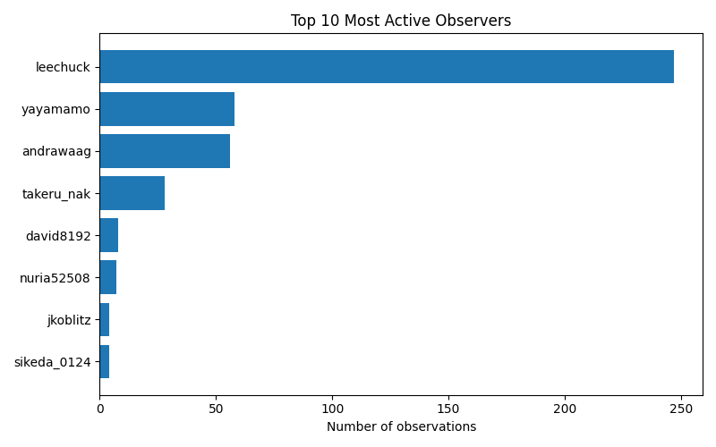

# iNaturalist Project Report: biohackathon-2025

- Total observations: 412
- Unique species observed: 253
- Unique observers: 8

## Wikipedia & Wikidata Coverage

- Species not on Wikidata: **108**
- Missing in en: **136**

- Missing in es: **174**

- Missing in ja: **184**

- Missing in ar: **191**

- Missing in nl: **168**

- Missing in pt: **192**

- Missing in fr: **167**

| Taxon | Wikidata | GBIF | iNaturalist | EN | ES | JA | AR | NL | PT | FR |
|---|---|---|---|---|---|---|---|---|---|---|
| Anatherum virginicum | [Q136395703](https://www.wikidata.org/entity/Q136395703) | — | [317340748](https://www.inaturalist.org/taxa/317340748) | &#10007; | &#10007; | &#10007; | &#10007; | &#10007; | &#10007; | &#10007; |
| Apterogyninae | [Q622243](https://www.wikidata.org/entity/Q622243) | — | — | &#10007; | &#10007; | &#10007; | &#10007; | &#10007; | &#10007; | &#10007; |
| Ardea ibis | [Q106447604](https://www.wikidata.org/entity/Q106447604) | [4408439](https://www.gbif.org/species/4408439) | — | &#10007; | &#10007; | &#10007; | &#10007; | &#10007; | &#10007; | &#10007; |
| Argiopinae | [Q3622438](https://www.wikidata.org/entity/Q3622438) | — | [1004912](https://www.inaturalist.org/taxa/1004912) | &#10007; | &#10007; | &#10007; | &#10007; | &#10007; | &#10007; | &#10007; |
| Baccharoides adoensis | [Q45011662](https://www.wikidata.org/entity/Q45011662) | [6064939](https://www.gbif.org/species/6064939) | [340393](https://www.inaturalist.org/taxa/340393) | &#10007; | &#10007; | &#10007; | &#10007; | &#10007; | &#10007; | &#10007; |
| Bufo formosus | [Q125201972](https://www.wikidata.org/entity/Q125201972) | [9017201](https://www.gbif.org/species/9017201) | — | &#10007; | &#10007; | &#10007; | &#10007; | &#10007; | &#10007; | &#10007; |
| Elasmolomus transversus | [Q118734020](https://www.wikidata.org/entity/Q118734020) | [8677670](https://www.gbif.org/species/8677670) | [633227](https://www.inaturalist.org/taxa/633227) | &#10007; | &#10007; | &#10007; | &#10007; | &#10007; | &#10007; | &#10007; |
| Fomitopsis dickinsii | [Q136389407](https://www.wikidata.org/entity/Q136389407) | — | [1536896](https://www.inaturalist.org/taxa/1536896) | &#10007; | &#10007; | &#10007; | &#10007; | &#10007; | &#10007; | &#10007; |
| Gymnopilus orientispectabilis | [Q107713678](https://www.wikidata.org/entity/Q107713678) | [12175076](https://www.gbif.org/species/12175076) | — | &#10007; | &#10007; | &#10007; | &#10007; | &#10007; | &#10007; | &#10007; |
| Laspeyria ruficeps | [Q105241380](https://www.wikidata.org/entity/Q105241380) | [10820762](https://www.gbif.org/species/10820762) | [480619](https://www.inaturalist.org/taxa/480619) | &#10007; | &#10007; | &#10007; | &#10007; | &#10007; | &#10007; | &#10007; |
| Nonarthra cyanea | [Q21305387](https://www.wikidata.org/entity/Q21305387) | — | [559764](https://www.inaturalist.org/taxa/559764) | &#10007; | &#10007; | &#10007; | &#10007; | &#10007; | &#10007; | &#10007; |
| Papilio agenor | [Q122510125](https://www.wikidata.org/entity/Q122510125) | [1937909](https://www.gbif.org/species/1937909) | — | &#10007; | &#10007; | &#10007; | &#10007; | &#10007; | &#10007; | &#10007; |
| Pelagodes antiquadraria | [Q106540425](https://www.wikidata.org/entity/Q106540425) | [6133562](https://www.gbif.org/species/6133562) | [154074](https://www.inaturalist.org/taxa/154074) | &#10007; | &#10007; | &#10007; | &#10007; | &#10007; | &#10007; | &#10007; |
| Rusicada privata | [Q127376752](https://www.wikidata.org/entity/Q127376752) | [9400545](https://www.gbif.org/species/9400545) | [554232](https://www.inaturalist.org/taxa/554232) | &#10007; | &#10007; | &#10007; | &#10007; | &#10007; | &#10007; | &#10007; |
| Arta epicoenalis | [Q4797302](https://www.wikidata.org/entity/Q4797302) | [10336328](https://www.gbif.org/species/10336328) | [321703](https://www.inaturalist.org/taxa/321703) | [&#10003;](https://en.wikipedia.org/wiki/Arta_epicoenalis) | &#10007; | &#10007; | &#10007; | &#10007; | &#10007; | &#10007; |
| Bistorta amplexicaulis | [Q10431446](https://www.wikidata.org/entity/Q10431446) | [7291264](https://www.gbif.org/species/7291264) | [752465](https://www.inaturalist.org/taxa/752465) | [&#10003;](https://en.wikipedia.org/wiki/Bistorta_amplexicaulis) | &#10007; | &#10007; | &#10007; | &#10007; | &#10007; | &#10007; |
| Chlaenius posticalis | [Q13464571](https://www.wikidata.org/entity/Q13464571) | [7969620](https://www.gbif.org/species/7969620) | [437731](https://www.inaturalist.org/taxa/437731) | &#10007; | &#10007; | &#10007; | &#10007; | [&#10003;](https://nl.wikipedia.org/wiki/Chlaenius_posticalis) | &#10007; | &#10007; |
| Chyphotes | [Q50378719](https://www.wikidata.org/entity/Q50378719) | [4673427](https://www.gbif.org/species/4673427) | [250725](https://www.inaturalist.org/taxa/250725) | [&#10003;](https://en.wikipedia.org/wiki/Chyphotes) | &#10007; | &#10007; | &#10007; | &#10007; | &#10007; | &#10007; |
| Glaucias subpunctatus | [Q124807810](https://www.wikidata.org/entity/Q124807810) | — | [545458](https://www.inaturalist.org/taxa/545458) | &#10007; | &#10007; | [&#10003;](https://ja.wikipedia.org/wiki/%E3%83%84%E3%83%A4%E3%82%A2%E3%82%AA%E3%82%AB%E3%83%A1%E3%83%A0%E3%82%B7) | &#10007; | &#10007; | &#10007; | &#10007; |
| Heliotropium arbainense | [Q12213632](https://www.wikidata.org/entity/Q12213632) | [4067672](https://www.gbif.org/species/4067672) | — | &#10007; | &#10007; | &#10007; | [&#10003;](https://ar.wikipedia.org/wiki/%D8%B1%D9%82%D9%8A%D8%A8_%D8%A7%D9%84%D8%B4%D9%85%D8%B3_%D8%A7%D9%84%D8%B9%D8%B1%D8%A8%D8%A7%D9%88%D9%8A) | &#10007; | &#10007; | &#10007; |
| Heliotropium bacciferum | [Q15490776](https://www.wikidata.org/entity/Q15490776) | [7295525](https://www.gbif.org/species/7295525) | [505820](https://www.inaturalist.org/taxa/505820) | &#10007; | &#10007; | &#10007; | [&#10003;](https://ar.wikipedia.org/wiki/%D8%B1%D9%85%D8%B1%D8%A7%D9%85) | &#10007; | &#10007; | &#10007; |
| Leptocorisa chinensis | [Q66686366](https://www.wikidata.org/entity/Q66686366) | [4391706](https://www.gbif.org/species/4391706) | [145559](https://www.inaturalist.org/taxa/145559) | &#10007; | &#10007; | [&#10003;](https://ja.wikipedia.org/wiki/%E3%82%AF%E3%83%A2%E3%83%98%E3%83%AA%E3%82%AB%E3%83%A1%E3%83%A0%E3%82%B7) | &#10007; | &#10007; | &#10007; | &#10007; |
| Orancistrocerus | [Q7099456](https://www.wikidata.org/entity/Q7099456) | [1329032](https://www.gbif.org/species/1329032) | [553299](https://www.inaturalist.org/taxa/553299) | [&#10003;](https://en.wikipedia.org/wiki/Orancistrocerus) | &#10007; | &#10007; | &#10007; | &#10007; | &#10007; | &#10007; |
| Physcia tribacioides | [Q10630980](https://www.wikidata.org/entity/Q10630980) | [2608909](https://www.gbif.org/species/2608909) | [404862](https://www.inaturalist.org/taxa/404862) | &#10007; | &#10007; | &#10007; | &#10007; | [&#10003;](https://nl.wikipedia.org/wiki/Witkopvingermos) | &#10007; | &#10007; |
| Physopelta gutta | [Q68940260](https://www.wikidata.org/entity/Q68940260) | [4783700](https://www.gbif.org/species/4783700) | [366807](https://www.inaturalist.org/taxa/366807) | &#10007; | &#10007; | [&#10003;](https://ja.wikipedia.org/wiki/%E3%82%AA%E3%82%AA%E3%83%9B%E3%82%B7%E3%82%AB%E3%83%A1%E3%83%A0%E3%82%B7) | &#10007; | &#10007; | &#10007; | &#10007; |
| Pochazia shantungensis | [Q96399602](https://www.wikidata.org/entity/Q96399602) | [5984080](https://www.gbif.org/species/5984080) | [565012](https://www.inaturalist.org/taxa/565012) | [&#10003;](https://en.wikipedia.org/wiki/Pochazia_shantungensis) | &#10007; | &#10007; | &#10007; | &#10007; | &#10007; | &#10007; |
| Spatalia doerriesi | [Q13480334](https://www.wikidata.org/entity/Q13480334) | [1827650](https://www.gbif.org/species/1827650) | [557682](https://www.inaturalist.org/taxa/557682) | &#10007; | &#10007; | &#10007; | &#10007; | [&#10003;](https://nl.wikipedia.org/wiki/Spatalia_doerriesi) | &#10007; | &#10007; |
| Thelypteridoideae | [Q30110521](https://www.wikidata.org/entity/Q30110521) | — | — | &#10007; | &#10007; | &#10007; | &#10007; | &#10007; | &#10007; | [&#10003;](https://fr.wikipedia.org/wiki/Thelypteridoideae) |
| Trametes cubensis | [Q10701194](https://www.wikidata.org/entity/Q10701194) | [2548276](https://www.gbif.org/species/2548276) | [352539](https://www.inaturalist.org/taxa/352539) | [&#10003;](https://en.wikipedia.org/wiki/Trametes_cubensis) | &#10007; | &#10007; | &#10007; | &#10007; | &#10007; | &#10007; |
| Acronicta pruinosa | [Q4676328](https://www.wikidata.org/entity/Q4676328) | [1782757](https://www.gbif.org/species/1782757) | [518305](https://www.inaturalist.org/taxa/518305) | [&#10003;](https://en.wikipedia.org/wiki/Acronicta_pruinosa) | &#10007; | &#10007; | &#10007; | [&#10003;](https://nl.wikipedia.org/wiki/Acronicta_pruinosa) | &#10007; | &#10007; |
| Boletellus emodensis | [Q4939316](https://www.wikidata.org/entity/Q4939316) | [2524863](https://www.gbif.org/species/2524863) | [355921](https://www.inaturalist.org/taxa/355921) | [&#10003;](https://en.wikipedia.org/wiki/Boletellus_emodensis) | &#10007; | &#10007; | &#10007; | &#10007; | &#10007; | [&#10003;](https://fr.wikipedia.org/wiki/Boletellus_emodensis) |
| Callicarpa dichotoma | [Q1038008](https://www.wikidata.org/entity/Q1038008) | [5341132](https://www.gbif.org/species/5341132) | [159658](https://www.inaturalist.org/taxa/159658) | [&#10003;](https://en.wikipedia.org/wiki/Callicarpa_dichotoma) | &#10007; | &#10007; | &#10007; | &#10007; | &#10007; | [&#10003;](https://fr.wikipedia.org/wiki/Callicarpa_dichotoma) |
| Caroxylon imbricatum | [Q17246081](https://www.wikidata.org/entity/Q17246081) | [3759522](https://www.gbif.org/species/3759522) | [967408](https://www.inaturalist.org/taxa/967408) | [&#10003;](https://en.wikipedia.org/wiki/Caroxylon_imbricatum) | &#10007; | &#10007; | [&#10003;](https://ar.wikipedia.org/wiki/%D8%B1%D9%88%D8%AB%D8%A7_%D9%82%D8%B1%D9%85%D9%8A%D8%AF%D9%8A%D8%A9) | &#10007; | &#10007; | &#10007; |
| Chilocorus circumdatus | [Q14930899](https://www.wikidata.org/entity/Q14930899) | [1043501](https://www.gbif.org/species/1043501) | [332215](https://www.inaturalist.org/taxa/332215) | [&#10003;](https://en.wikipedia.org/wiki/Chilocorus_circumdatus) | [&#10003;](https://es.wikipedia.org/wiki/Chilocorus_circumdatus) | &#10007; | &#10007; | &#10007; | &#10007; | &#10007; |
| Clematis terniflora | [Q3281716](https://www.wikidata.org/entity/Q3281716) | [3033546](https://www.gbif.org/species/3033546) | [62776](https://www.inaturalist.org/taxa/62776) | [&#10003;](https://en.wikipedia.org/wiki/Clematis_terniflora) | &#10007; | [&#10003;](https://ja.wikipedia.org/wiki/%E3%82%BB%E3%83%B3%E3%83%8B%E3%83%B3%E3%82%BD%E3%82%A6) | &#10007; | &#10007; | &#10007; | &#10007; |
| Cyperus conglomeratus | [Q12185265](https://www.wikidata.org/entity/Q12185265) | [2714301](https://www.gbif.org/species/2714301) | [332995](https://www.inaturalist.org/taxa/332995) | [&#10003;](https://en.wikipedia.org/wiki/Cyperus_conglomeratus) | &#10007; | &#10007; | [&#10003;](https://ar.wikipedia.org/wiki/%D8%A7%D9%84%D8%AB%D9%86%D8%AF%D9%8A) | &#10007; | &#10007; | &#10007; |
| Cyrtarachne nagasakiensis | [Q2404699](https://www.wikidata.org/entity/Q2404699) | [2160990](https://www.gbif.org/species/2160990) | [360562](https://www.inaturalist.org/taxa/360562) | [&#10003;](https://en.wikipedia.org/wiki/Cyrtarachne_nagasakiensis) | &#10007; | &#10007; | &#10007; | [&#10003;](https://nl.wikipedia.org/wiki/Cyrtarachne_nagasakiensis) | &#10007; | &#10007; |
| Delphacini | [Q20645660](https://www.wikidata.org/entity/Q20645660) | — | — | [&#10003;](https://en.wikipedia.org/wiki/Delphacini) | &#10007; | &#10007; | &#10007; | [&#10003;](https://nl.wikipedia.org/wiki/Delphacini) | &#10007; | &#10007; |
| Hemistola veneta | [Q13226062](https://www.wikidata.org/entity/Q13226062) | [1991195](https://www.gbif.org/species/1991195) | [910455](https://www.inaturalist.org/taxa/910455) | &#10007; | [&#10003;](https://es.wikipedia.org/wiki/Hemistola_veneta) | &#10007; | &#10007; | [&#10003;](https://nl.wikipedia.org/wiki/Hemistola_veneta) | &#10007; | &#10007; |
| Holochlora japonica | [Q10525416](https://www.wikidata.org/entity/Q10525416) | [1690051](https://www.gbif.org/species/1690051) | [48115](https://www.inaturalist.org/taxa/48115) | [&#10003;](https://en.wikipedia.org/wiki/Holochlora_japonica) | &#10007; | &#10007; | &#10007; | [&#10003;](https://nl.wikipedia.org/wiki/Holochlora_japonica) | &#10007; | &#10007; |
| Motacilla alba lugens | [Q2897097](https://www.wikidata.org/entity/Q2897097) | [6174991](https://www.gbif.org/species/6174991) | [339962](https://www.inaturalist.org/taxa/339962) | &#10007; | &#10007; | [&#10003;](https://ja.wikipedia.org/wiki/%E3%83%8F%E3%82%AF%E3%82%BB%E3%82%AD%E3%83%AC%E3%82%A4) | &#10007; | &#10007; | &#10007; | [&#10003;](https://fr.wikipedia.org/wiki/Bergeronnette_lugubre) |
| Oxyethira | [Q10613871](https://www.wikidata.org/entity/Q10613871) | [1432588](https://www.gbif.org/species/1432588) | [176204](https://www.inaturalist.org/taxa/176204) | [&#10003;](https://en.wikipedia.org/wiki/Oxyethira) | &#10007; | &#10007; | &#10007; | [&#10003;](https://nl.wikipedia.org/wiki/Oxyethira) | &#10007; | &#10007; |
| Parmotrema tinctorum | [Q7139222](https://www.wikidata.org/entity/Q7139222) | [2606268](https://www.gbif.org/species/2606268) | [227259](https://www.inaturalist.org/taxa/227259) | [&#10003;](https://en.wikipedia.org/wiki/Parmotrema_tinctorum) | &#10007; | [&#10003;](https://ja.wikipedia.org/wiki/%E3%82%A6%E3%83%A1%E3%83%8E%E3%82%AD%E3%82%B4%E3%82%B1) | &#10007; | &#10007; | &#10007; | &#10007; |
| Phelotrupes | [Q4046830](https://www.wikidata.org/entity/Q4046830) | [1071297](https://www.gbif.org/species/1071297) | [356002](https://www.inaturalist.org/taxa/356002) | [&#10003;](https://en.wikipedia.org/wiki/Phelotrupes) | [&#10003;](https://es.wikipedia.org/wiki/Phelotrupes) | &#10007; | &#10007; | &#10007; | &#10007; | &#10007; |
| Pseudozarba bipartita | [Q13516324](https://www.wikidata.org/entity/Q13516324) | [1764174](https://www.gbif.org/species/1764174) | [428937](https://www.inaturalist.org/taxa/428937) | &#10007; | &#10007; | &#10007; | &#10007; | [&#10003;](https://nl.wikipedia.org/wiki/Pseudozarba_bipartita) | [&#10003;](https://pt.wikipedia.org/wiki/Pseudozarba_bipartita) | &#10007; |
| Psychostrophia melanargia | [Q13856720](https://www.wikidata.org/entity/Q13856720) | [1952909](https://www.gbif.org/species/1952909) | [320545](https://www.inaturalist.org/taxa/320545) | [&#10003;](https://en.wikipedia.org/wiki/Psychostrophia_melanargia) | &#10007; | &#10007; | &#10007; | [&#10003;](https://nl.wikipedia.org/wiki/Psychostrophia_melanargia) | &#10007; | &#10007; |
| Scopula addictaria | [Q7434470](https://www.wikidata.org/entity/Q7434470) | [5145396](https://www.gbif.org/species/5145396) | [981191](https://www.inaturalist.org/taxa/981191) | [&#10003;](https://en.wikipedia.org/wiki/Scopula_addictaria) | &#10007; | &#10007; | &#10007; | [&#10003;](https://nl.wikipedia.org/wiki/Scopula_addictaria) | &#10007; | &#10007; |
| Solidago altissima | [Q7557949](https://www.wikidata.org/entity/Q7557949) | [5389058](https://www.gbif.org/species/5389058) | [79148](https://www.inaturalist.org/taxa/79148) | [&#10003;](https://en.wikipedia.org/wiki/Solidago_altissima) | &#10007; | &#10007; | &#10007; | &#10007; | &#10007; | [&#10003;](https://fr.wikipedia.org/wiki/Solidago_altissima) |
| Sutorius eximius | [Q20860495](https://www.wikidata.org/entity/Q20860495) | [7358611](https://www.gbif.org/species/7358611) | [518723](https://www.inaturalist.org/taxa/518723) | [&#10003;](https://en.wikipedia.org/wiki/Sutorius_eximius) | &#10007; | &#10007; | &#10007; | &#10007; | [&#10003;](https://pt.wikipedia.org/wiki/Sutorius_eximius) | &#10007; |
| Tabaninae | [Q14428216](https://www.wikidata.org/entity/Q14428216) | — | [332389](https://www.inaturalist.org/taxa/332389) | [&#10003;](https://en.wikipedia.org/wiki/Tabaninae) | &#10007; | &#10007; | [&#10003;](https://ar.wikipedia.org/wiki/%D9%86%D8%B9%D8%B1%D8%A7%D9%88%D8%A7%D8%AA) | &#10007; | &#10007; | &#10007; |
| Truljalia hibinonis | [Q7779629](https://www.wikidata.org/entity/Q7779629) | [1723292](https://www.gbif.org/species/1723292) | [358234](https://www.inaturalist.org/taxa/358234) | &#10007; | &#10007; | [&#10003;](https://ja.wikipedia.org/wiki/%E3%82%A2%E3%82%AA%E3%83%9E%E3%83%84%E3%83%A0%E3%82%B7) | &#10007; | [&#10003;](https://nl.wikipedia.org/wiki/Truljalia_hibinonis) | &#10007; | &#10007; |
| Abelia chinensis | [Q160081](https://www.wikidata.org/entity/Q160081) | [5599251](https://www.gbif.org/species/5599251) | [553157](https://www.inaturalist.org/taxa/553157) | [&#10003;](https://en.wikipedia.org/wiki/Abelia_chinensis) | [&#10003;](https://es.wikipedia.org/wiki/Abelia_chinensis) | &#10007; | &#10007; | &#10007; | &#10007; | [&#10003;](https://fr.wikipedia.org/wiki/Abelia_chinensis) |
| Anthomyzidae | [Q1617278](https://www.wikidata.org/entity/Q1617278) | [7272](https://www.gbif.org/species/7272) | [329767](https://www.inaturalist.org/taxa/329767) | [&#10003;](https://en.wikipedia.org/wiki/Anthomyzidae) | &#10007; | &#10007; | &#10007; | [&#10003;](https://nl.wikipedia.org/wiki/Anthomyzidae) | &#10007; | [&#10003;](https://fr.wikipedia.org/wiki/Anthomyzidae) |
| Argynnis hyperbius | [Q67573584](https://www.wikidata.org/entity/Q67573584) | [10656625](https://www.gbif.org/species/10656625) | [323769](https://www.inaturalist.org/taxa/323769) | [&#10003;](https://en.wikipedia.org/wiki/Argynnis_hyperbius) | &#10007; | [&#10003;](https://ja.wikipedia.org/wiki/%E3%83%84%E3%83%9E%E3%82%B0%E3%83%AD%E3%83%92%E3%83%A7%E3%82%A6%E3%83%A2%E3%83%B3) | &#10007; | [&#10003;](https://nl.wikipedia.org/wiki/Argynnis_hyperbius) | &#10007; | &#10007; |
| Asphodelus tenuifolius | [Q3695249](https://www.wikidata.org/entity/Q3695249) | [2778358](https://www.gbif.org/species/2778358) | [202554](https://www.inaturalist.org/taxa/202554) | [&#10003;](https://en.wikipedia.org/wiki/Asphodelus_tenuifolius) | [&#10003;](https://es.wikipedia.org/wiki/Asphodelus_tenuifolius) | &#10007; | [&#10003;](https://ar.wikipedia.org/wiki/%D8%A8%D8%B1%D9%88%D9%82_%D9%86%D8%AD%D9%8A%D9%81_%D8%A7%D9%84%D8%A3%D9%88%D8%B1%D8%A7%D9%82) | &#10007; | &#10007; | &#10007; |
| Desmodium paniculatum | [Q5264642](https://www.wikidata.org/entity/Q5264642) | [2967543](https://www.gbif.org/species/2967543) | [130993](https://www.inaturalist.org/taxa/130993) | [&#10003;](https://en.wikipedia.org/wiki/Desmodium_paniculatum) | &#10007; | [&#10003;](https://ja.wikipedia.org/wiki/%E3%82%A2%E3%83%AC%E3%83%81%E3%83%8C%E3%82%B9%E3%83%93%E3%83%88%E3%83%8F%E3%82%AE) | [&#10003;](https://ar.wikipedia.org/wiki/%D8%B9%D8%B1%D9%82%D9%8A%D8%B5_%D8%B9%D8%AB%D9%83%D9%88%D9%84%D9%8A) | &#10007; | &#10007; | &#10007; |
| Halothamnus bottae | [Q149868](https://www.wikidata.org/entity/Q149868) | [6035803](https://www.gbif.org/species/6035803) | [929407](https://www.inaturalist.org/taxa/929407) | [&#10003;](https://en.wikipedia.org/wiki/Halothamnus_bottae) | [&#10003;](https://es.wikipedia.org/wiki/Halothamnus_bottae) | &#10007; | [&#10003;](https://ar.wikipedia.org/wiki/%D9%82%D8%B6%D8%A9_%D8%A8%D9%88%D8%AA%D9%8A%D8%A9) | &#10007; | &#10007; | &#10007; |
| Haloxylon persicum | [Q1153935](https://www.wikidata.org/entity/Q1153935) | [3758981](https://www.gbif.org/species/3758981) | [464138](https://www.inaturalist.org/taxa/464138) | [&#10003;](https://en.wikipedia.org/wiki/Haloxylon_persicum) | &#10007; | &#10007; | [&#10003;](https://ar.wikipedia.org/wiki/%D8%B1%D9%85%D8%AB_%D9%81%D8%A7%D8%B1%D8%B3%D9%8A) | &#10007; | &#10007; | [&#10003;](https://fr.wikipedia.org/wiki/Haloxylon_persicum) |
| Leccinellum | [Q6511503](https://www.wikidata.org/entity/Q6511503) | [2524413](https://www.gbif.org/species/2524413) | [332503](https://www.inaturalist.org/taxa/332503) | [&#10003;](https://en.wikipedia.org/wiki/Leccinellum) | &#10007; | &#10007; | &#10007; | [&#10003;](https://nl.wikipedia.org/wiki/Leccinellum) | &#10007; | [&#10003;](https://fr.wikipedia.org/wiki/Leccinellum) |
| Lespedeza cuneata | [Q5364126](https://www.wikidata.org/entity/Q5364126) | [2955722](https://www.gbif.org/species/2955722) | [164566](https://www.inaturalist.org/taxa/164566) | [&#10003;](https://en.wikipedia.org/wiki/Lespedeza_cuneata) | [&#10003;](https://es.wikipedia.org/wiki/Lespedeza_cuneata) | &#10007; | &#10007; | &#10007; | &#10007; | [&#10003;](https://fr.wikipedia.org/wiki/Lespedeza_cuneata) |
| Luperini | [Q4043264](https://www.wikidata.org/entity/Q4043264) | — | [373841](https://www.inaturalist.org/taxa/373841) | [&#10003;](https://en.wikipedia.org/wiki/Luperini_(beetle)) | [&#10003;](https://es.wikipedia.org/wiki/Luperini) | &#10007; | &#10007; | &#10007; | &#10007; | [&#10003;](https://fr.wikipedia.org/wiki/Luperini) |
| Neptis pryeri | [Q1315997](https://www.wikidata.org/entity/Q1315997) | [5131293](https://www.gbif.org/species/5131293) | [357704](https://www.inaturalist.org/taxa/357704) | [&#10003;](https://en.wikipedia.org/wiki/Neptis_pryeri) | &#10007; | [&#10003;](https://ja.wikipedia.org/wiki/%E3%83%9B%E3%82%B7%E3%83%9F%E3%82%B9%E3%82%B8) | &#10007; | [&#10003;](https://nl.wikipedia.org/wiki/Neptis_pryeri) | &#10007; | &#10007; |
| Oncocera semirubella | [Q148587](https://www.wikidata.org/entity/Q148587) | [1875120](https://www.gbif.org/species/1875120) | [324401](https://www.inaturalist.org/taxa/324401) | [&#10003;](https://en.wikipedia.org/wiki/Oncocera_semirubella) | &#10007; | &#10007; | &#10007; | [&#10003;](https://nl.wikipedia.org/wiki/Prachtmot) | [&#10003;](https://pt.wikipedia.org/wiki/Oncocera_semirubella) | &#10007; |
| Parapediasia teterrellus | [Q7135628](https://www.wikidata.org/entity/Q7135628) | [4531624](https://www.gbif.org/species/4531624) | [553984](https://www.inaturalist.org/taxa/553984) | [&#10003;](https://en.wikipedia.org/wiki/Parapediasia_teterrellus) | &#10007; | [&#10003;](https://ja.wikipedia.org/wiki/%E3%82%B7%E3%83%90%E3%83%84%E3%83%88%E3%82%AC) | &#10007; | [&#10003;](https://nl.wikipedia.org/wiki/Parapediasia_teterrellus) | &#10007; | &#10007; |
| Plestiodon latiscutatus | [Q3392329](https://www.wikidata.org/entity/Q3392329) | [5960563](https://www.gbif.org/species/5960563) | [37785](https://www.inaturalist.org/taxa/37785) | [&#10003;](https://en.wikipedia.org/wiki/Plestiodon_latiscutatus) | &#10007; | [&#10003;](https://ja.wikipedia.org/wiki/%E3%82%AA%E3%82%AB%E3%83%80%E3%83%88%E3%82%AB%E3%82%B2) | &#10007; | &#10007; | &#10007; | [&#10003;](https://fr.wikipedia.org/wiki/Plestiodon_latiscutatus) |
| Rivetina | [Q3937933](https://www.wikidata.org/entity/Q3937933) | [1406307](https://www.gbif.org/species/1406307) | [537686](https://www.inaturalist.org/taxa/537686) | [&#10003;](https://en.wikipedia.org/wiki/Rivetina) | [&#10003;](https://es.wikipedia.org/wiki/Rivetina) | &#10007; | &#10007; | &#10007; | &#10007; | [&#10003;](https://fr.wikipedia.org/wiki/Rivetina) |
| Ruspolia lineosa | [Q7779750](https://www.wikidata.org/entity/Q7779750) | [5096577](https://www.gbif.org/species/5096577) | [499203](https://www.inaturalist.org/taxa/499203) | [&#10003;](https://en.wikipedia.org/wiki/Ruspolia_lineosa) | &#10007; | [&#10003;](https://ja.wikipedia.org/wiki/%E3%82%AF%E3%82%B5%E3%82%AD%E3%83%AA) | &#10007; | [&#10003;](https://nl.wikipedia.org/wiki/Ruspolia_lineosa) | &#10007; | &#10007; |
| Salvia guaranitica | [Q890993](https://www.wikidata.org/entity/Q890993) | [3900938](https://www.gbif.org/species/3900938) | [346173](https://www.inaturalist.org/taxa/346173) | [&#10003;](https://en.wikipedia.org/wiki/Salvia_guaranitica) | [&#10003;](https://es.wikipedia.org/wiki/Salvia_guaranitica) | [&#10003;](https://ja.wikipedia.org/wiki/%E3%82%B5%E3%83%AB%E3%83%93%E3%82%A2%E3%83%BB%E3%82%AC%E3%83%A9%E3%83%8B%E3%83%81%E3%82%AB) | &#10007; | &#10007; | &#10007; | &#10007; |
| Trichonephila clavata | [Q104386227](https://www.wikidata.org/entity/Q104386227) | [10670284](https://www.gbif.org/species/10670284) | [904334](https://www.inaturalist.org/taxa/904334) | [&#10003;](https://en.wikipedia.org/wiki/Trichonephila_clavata) | &#10007; | &#10007; | &#10007; | [&#10003;](https://nl.wikipedia.org/wiki/Trichonephila_clavata) | &#10007; | [&#10003;](https://fr.wikipedia.org/wiki/Trichonephila_clavata) |
| Yaginumia sia | [Q1303914](https://www.wikidata.org/entity/Q1303914) | [2159103](https://www.gbif.org/species/2159103) | [360568](https://www.inaturalist.org/taxa/360568) | &#10007; | &#10007; | [&#10003;](https://ja.wikipedia.org/wiki/%E3%82%BA%E3%82%B0%E3%83%AD%E3%82%AA%E3%83%8B%E3%82%B0%E3%83%A2) | &#10007; | [&#10003;](https://nl.wikipedia.org/wiki/Yaginumia_sia) | &#10007; | [&#10003;](https://fr.wikipedia.org/wiki/Yaginumia_sia) |
| Agyneta | [Q2827368](https://www.wikidata.org/entity/Q2827368) | [2135681](https://www.gbif.org/species/2135681) | [172395](https://www.inaturalist.org/taxa/172395) | [&#10003;](https://en.wikipedia.org/wiki/Agyneta) | [&#10003;](https://es.wikipedia.org/wiki/Agyneta) | &#10007; | &#10007; | [&#10003;](https://nl.wikipedia.org/wiki/Agyneta) | &#10007; | [&#10003;](https://fr.wikipedia.org/wiki/Agyneta) |
| Bactra furfurana | [Q11959963](https://www.wikidata.org/entity/Q11959963) | [1747738](https://www.gbif.org/species/1747738) | [173472](https://www.inaturalist.org/taxa/173472) | [&#10003;](https://en.wikipedia.org/wiki/Bactra_furfurana) | [&#10003;](https://es.wikipedia.org/wiki/Bactra_furfurana) | &#10007; | &#10007; | [&#10003;](https://nl.wikipedia.org/wiki/Getekende_biesbladroller) | [&#10003;](https://pt.wikipedia.org/wiki/Bactra_furfurana) | &#10007; |
| Camponotus obscuripes | [Q849895](https://www.wikidata.org/entity/Q849895) | [5034483](https://www.gbif.org/species/5034483) | [354345](https://www.inaturalist.org/taxa/354345) | [&#10003;](https://en.wikipedia.org/wiki/Camponotus_obscuripes) | &#10007; | [&#10003;](https://ja.wikipedia.org/wiki/%E3%83%A0%E3%83%8D%E3%82%A2%E3%82%AB%E3%82%AA%E3%82%AA%E3%82%A2%E3%83%AA) | &#10007; | [&#10003;](https://nl.wikipedia.org/wiki/Camponotus_obscuripes) | [&#10003;](https://pt.wikipedia.org/wiki/Camponotus_obscuripes) | &#10007; |
| Chrysoperla carnea | [Q264998](https://www.wikidata.org/entity/Q264998) | [2105360](https://www.gbif.org/species/2105360) | [311581](https://www.inaturalist.org/taxa/311581) | [&#10003;](https://en.wikipedia.org/wiki/Chrysoperla_carnea) | [&#10003;](https://es.wikipedia.org/wiki/Chrysoperla_carnea) | &#10007; | &#10007; | [&#10003;](https://nl.wikipedia.org/wiki/Groene_gaasvlieg) | &#10007; | [&#10003;](https://fr.wikipedia.org/wiki/Chrysope_verte) |
| Clerodendrum trichotomum | [Q764044](https://www.wikidata.org/entity/Q764044) | [2925366](https://www.gbif.org/species/2925366) | [67539](https://www.inaturalist.org/taxa/67539) | [&#10003;](https://en.wikipedia.org/wiki/Clerodendrum_trichotomum) | &#10007; | [&#10003;](https://ja.wikipedia.org/wiki/%E3%82%AF%E3%82%B5%E3%82%AE) | &#10007; | [&#10003;](https://nl.wikipedia.org/wiki/Clerodendrum_trichotomum) | &#10007; | [&#10003;](https://fr.wikipedia.org/wiki/Arbre_du_clerg%C3%A9) |
| Emoia atrocostata | [Q3053066](https://www.wikidata.org/entity/Q3053066) | [2463327](https://www.gbif.org/species/2463327) | [99876](https://www.inaturalist.org/taxa/99876) | [&#10003;](https://en.wikipedia.org/wiki/Emoia_atrocostata) | [&#10003;](https://es.wikipedia.org/wiki/Emoia_atrocostata) | [&#10003;](https://ja.wikipedia.org/wiki/%E3%83%9F%E3%83%A4%E3%82%B3%E3%83%88%E3%82%AB%E3%82%B2) | &#10007; | &#10007; | &#10007; | [&#10003;](https://fr.wikipedia.org/wiki/Emoia_atrocostata) |
| Hippobroma longiflora | [Q311092](https://www.wikidata.org/entity/Q311092) | [3168943](https://www.gbif.org/species/3168943) | [154827](https://www.inaturalist.org/taxa/154827) | [&#10003;](https://en.wikipedia.org/wiki/Hippobroma_longiflora) | [&#10003;](https://es.wikipedia.org/wiki/Hippobroma_longiflora) | [&#10003;](https://ja.wikipedia.org/wiki/%E3%83%9B%E3%82%B7%E3%82%A2%E3%82%B6%E3%83%9F) | &#10007; | &#10007; | &#10007; | [&#10003;](https://fr.wikipedia.org/wiki/Hippobroma_longiflora) |
| Oryctes rhinoceros | [Q1188841](https://www.wikidata.org/entity/Q1188841) | [4995642](https://www.gbif.org/species/4995642) | [320058](https://www.inaturalist.org/taxa/320058) | [&#10003;](https://en.wikipedia.org/wiki/Oryctes_rhinoceros) | [&#10003;](https://es.wikipedia.org/wiki/Oryctes_rhinoceros) | [&#10003;](https://ja.wikipedia.org/wiki/%E3%82%B5%E3%82%A4%E3%82%AB%E3%83%96%E3%83%88) | &#10007; | &#10007; | &#10007; | [&#10003;](https://fr.wikipedia.org/wiki/Oryctes_rhinoceros) |
| Phaneroptera falcata | [Q1064055](https://www.wikidata.org/entity/Q1064055) | [1686243](https://www.gbif.org/species/1686243) | [141737](https://www.inaturalist.org/taxa/141737) | [&#10003;](https://en.wikipedia.org/wiki/Phaneroptera_falcata) | &#10007; | [&#10003;](https://ja.wikipedia.org/wiki/%E3%83%84%E3%83%A6%E3%83%A0%E3%82%B7) | &#10007; | [&#10003;](https://nl.wikipedia.org/wiki/Sikkelsprinkhaan) | &#10007; | [&#10003;](https://fr.wikipedia.org/wiki/Phaneroptera_falcata) |
| Salsoloideae | [Q136782](https://www.wikidata.org/entity/Q136782) | — | — | [&#10003;](https://en.wikipedia.org/wiki/Salsoloideae) | [&#10003;](https://es.wikipedia.org/wiki/Salsoloideae) | &#10007; | [&#10003;](https://ar.wikipedia.org/wiki/%D8%B1%D9%88%D8%AB%D8%A7%D9%88%D8%A7%D8%AA) | &#10007; | [&#10003;](https://pt.wikipedia.org/wiki/Salsoloideae) | &#10007; |
| Takydromus tachydromoides | [Q615871](https://www.wikidata.org/entity/Q615871) | [2468588](https://www.gbif.org/species/2468588) | [68348](https://www.inaturalist.org/taxa/68348) | [&#10003;](https://en.wikipedia.org/wiki/Takydromus_tachydromoides) | &#10007; | [&#10003;](https://ja.wikipedia.org/wiki/%E3%83%8B%E3%83%9B%E3%83%B3%E3%82%AB%E3%83%8A%E3%83%98%E3%83%93) | &#10007; | [&#10003;](https://nl.wikipedia.org/wiki/Takydromus_tachydromoides) | &#10007; | [&#10003;](https://fr.wikipedia.org/wiki/Takydromus_tachydromoides) |
| Zephyranthes carinata | [Q911101](https://www.wikidata.org/entity/Q911101) | [2859952](https://www.gbif.org/species/2859952) | [277345](https://www.inaturalist.org/taxa/277345) | [&#10003;](https://en.wikipedia.org/wiki/Zephyranthes_carinata) | [&#10003;](https://es.wikipedia.org/wiki/Zephyranthes_carinata) | [&#10003;](https://ja.wikipedia.org/wiki/%E3%82%B5%E3%83%95%E3%83%A9%E3%83%B3%E3%83%A2%E3%83%89%E3%82%AD) | [&#10003;](https://ar.wikipedia.org/wiki/%D8%B2%D9%86%D8%A8%D9%82_%D9%86%D8%B3%D9%8A%D9%85%D9%8A) | &#10007; | &#10007; | &#10007; |
| Aplonis panayensis | [Q517230](https://www.wikidata.org/entity/Q517230) | [2489036](https://www.gbif.org/species/2489036) | [14965](https://www.inaturalist.org/taxa/14965) | [&#10003;](https://en.wikipedia.org/wiki/Asian_glossy_starling) | [&#10003;](https://es.wikipedia.org/wiki/Aplonis_panayensis) | [&#10003;](https://ja.wikipedia.org/wiki/%E3%83%9F%E3%83%89%E3%83%AA%E3%82%AB%E3%83%A9%E3%82%B9%E3%83%A2%E3%83%89%E3%82%AD) | &#10007; | [&#10003;](https://nl.wikipedia.org/wiki/Maleise_purperspreeuw) | &#10007; | [&#10003;](https://fr.wikipedia.org/wiki/Stourne_bronz%C3%A9) |
| Arnebia | [Q691702](https://www.wikidata.org/entity/Q691702) | [4062022](https://www.gbif.org/species/4062022) | [339547](https://www.inaturalist.org/taxa/339547) | [&#10003;](https://en.wikipedia.org/wiki/Arnebia) | [&#10003;](https://es.wikipedia.org/wiki/Arnebia) | &#10007; | [&#10003;](https://ar.wikipedia.org/wiki/%D8%A3%D8%B7%D9%86) | &#10007; | [&#10003;](https://pt.wikipedia.org/wiki/Arnebia) | [&#10003;](https://fr.wikipedia.org/wiki/Arnebia) |
| Boletellus | [Q1845830](https://www.wikidata.org/entity/Q1845830) | [2519877](https://www.gbif.org/species/2519877) | [126159](https://www.inaturalist.org/taxa/126159) | [&#10003;](https://en.wikipedia.org/wiki/Boletellus) | [&#10003;](https://es.wikipedia.org/wiki/Boletellus) | &#10007; | &#10007; | [&#10003;](https://nl.wikipedia.org/wiki/Boletellus) | [&#10003;](https://pt.wikipedia.org/wiki/Boletellus) | [&#10003;](https://fr.wikipedia.org/wiki/Boletellus) |
| Corvus ruficollis | [Q420818](https://www.wikidata.org/entity/Q420818) | [2482479](https://www.gbif.org/species/2482479) | [8034](https://www.inaturalist.org/taxa/8034) | [&#10003;](https://en.wikipedia.org/wiki/Brown-necked_raven) | [&#10003;](https://es.wikipedia.org/wiki/Corvus_ruficollis) | &#10007; | [&#10003;](https://ar.wikipedia.org/wiki/%D8%BA%D8%B1%D8%A7%D8%A8_%D8%A3%D8%AD%D9%8A%D9%85%D8%B1_%D8%A7%D9%84%D8%B9%D9%86%D9%82) | [&#10003;](https://nl.wikipedia.org/wiki/Bruinnekraaf) | &#10007; | [&#10003;](https://fr.wikipedia.org/wiki/Corbeau_brun) |
| Culicinae | [Q139664](https://www.wikidata.org/entity/Q139664) | — | [357355](https://www.inaturalist.org/taxa/357355) | [&#10003;](https://en.wikipedia.org/wiki/Culicinae) | [&#10003;](https://es.wikipedia.org/wiki/Culicinae) | &#10007; | [&#10003;](https://ar.wikipedia.org/wiki/%D8%A8%D8%B9%D9%88%D8%B6%D8%A7%D9%88%D8%A7%D8%AA) | &#10007; | [&#10003;](https://pt.wikipedia.org/wiki/Culic%C3%ADneos) | [&#10003;](https://fr.wikipedia.org/wiki/Culicinae) |
| Cupido argiades | [Q286921](https://www.wikidata.org/entity/Q286921) | [4535140](https://www.gbif.org/species/4535140) | [130784](https://www.inaturalist.org/taxa/130784) | [&#10003;](https://en.wikipedia.org/wiki/Short-tailed_blue) | [&#10003;](https://es.wikipedia.org/wiki/Cupido_argiades) | [&#10003;](https://ja.wikipedia.org/wiki/%E3%83%84%E3%83%90%E3%83%A1%E3%82%B7%E3%82%B8%E3%83%9F) | &#10007; | [&#10003;](https://nl.wikipedia.org/wiki/Staartblauwtje) | &#10007; | [&#10003;](https://fr.wikipedia.org/wiki/Azur%C3%A9_du_tr%C3%A8fle) |
| Dicranopteris | [Q2477127](https://www.wikidata.org/entity/Q2477127) | [2651555](https://www.gbif.org/species/2651555) | [52494](https://www.inaturalist.org/taxa/52494) | [&#10003;](https://en.wikipedia.org/wiki/Dicranopteris) | [&#10003;](https://es.wikipedia.org/wiki/Dicranopteris) | &#10007; | &#10007; | [&#10003;](https://nl.wikipedia.org/wiki/Dicranopteris) | [&#10003;](https://pt.wikipedia.org/wiki/Dicranopteris) | [&#10003;](https://fr.wikipedia.org/wiki/Dicranopteris) |
| Hippotion celerio | [Q1303104](https://www.wikidata.org/entity/Q1303104) | [1862293](https://www.gbif.org/species/1862293) | [199458](https://www.inaturalist.org/taxa/199458) | [&#10003;](https://en.wikipedia.org/wiki/Hippotion_celerio) | [&#10003;](https://es.wikipedia.org/wiki/Hippotion_celerio) | &#10007; | &#10007; | [&#10003;](https://nl.wikipedia.org/wiki/Wingerdpijlstaart) | [&#10003;](https://pt.wikipedia.org/wiki/Hippotion_celerio) | [&#10003;](https://fr.wikipedia.org/wiki/Hippotion_celerio) |
| Hypholoma | [Q371793](https://www.wikidata.org/entity/Q371793) | [2533397](https://www.gbif.org/species/2533397) | [48769](https://www.inaturalist.org/taxa/48769) | [&#10003;](https://en.wikipedia.org/wiki/Hypholoma) | [&#10003;](https://es.wikipedia.org/wiki/Hypholoma) | &#10007; | [&#10003;](https://ar.wikipedia.org/wiki/%D9%87%D9%8A%D9%81%D9%84%D9%88%D9%85) | [&#10003;](https://nl.wikipedia.org/wiki/Hypholoma) | &#10007; | [&#10003;](https://fr.wikipedia.org/wiki/Hypholoma) |
| Lariniaria argiopiformis | [Q1306938](https://www.wikidata.org/entity/Q1306938) | [2161132](https://www.gbif.org/species/2161132) | [741362](https://www.inaturalist.org/taxa/741362) | [&#10003;](https://en.wikipedia.org/wiki/Lariniaria_argiopiformis) | [&#10003;](https://es.wikipedia.org/wiki/Lariniaria) | [&#10003;](https://ja.wikipedia.org/wiki/%E3%82%B3%E3%82%AC%E3%83%8D%E3%82%B0%E3%83%A2%E3%83%80%E3%83%9E%E3%82%B7) | &#10007; | [&#10003;](https://nl.wikipedia.org/wiki/Lariniaria_argiopiformis) | &#10007; | [&#10003;](https://fr.wikipedia.org/wiki/Lariniaria_argiopiformis) |
| Lepidodactylus lugubris | [Q1235711](https://www.wikidata.org/entity/Q1235711) | [5221610](https://www.gbif.org/species/5221610) | [104226](https://www.inaturalist.org/taxa/104226) | [&#10003;](https://en.wikipedia.org/wiki/Lepidodactylus_lugubris) | [&#10003;](https://es.wikipedia.org/wiki/Lepidodactylus_lugubris) | &#10007; | &#10007; | [&#10003;](https://nl.wikipedia.org/wiki/Lepidodactylus_lugubris) | [&#10003;](https://pt.wikipedia.org/wiki/Lagartixa-de-luto) | [&#10003;](https://fr.wikipedia.org/wiki/Lepidodactylus_lugubris) |
| Linckia laevigata | [Q882716](https://www.wikidata.org/entity/Q882716) | [5187093](https://www.gbif.org/species/5187093) | [57745](https://www.inaturalist.org/taxa/57745) | [&#10003;](https://en.wikipedia.org/wiki/Linckia_laevigata) | [&#10003;](https://es.wikipedia.org/wiki/Linckia_laevigata) | &#10007; | &#10007; | [&#10003;](https://nl.wikipedia.org/wiki/Linckia_laevigata) | [&#10003;](https://pt.wikipedia.org/wiki/Linckia_laevigata) | [&#10003;](https://fr.wikipedia.org/wiki/Linckia_laevigata) |
| Magnoliopsida | [Q1307404](https://www.wikidata.org/entity/Q1307404) | [220](https://www.gbif.org/species/220) | [47124](https://www.inaturalist.org/taxa/47124) | [&#10003;](https://en.wikipedia.org/wiki/Magnoliopsida) | &#10007; | [&#10003;](https://ja.wikipedia.org/wiki/%E3%83%A2%E3%82%AF%E3%83%AC%E3%83%B3%E7%B6%B1) | [&#10003;](https://ar.wikipedia.org/wiki/%D9%85%D8%BA%D9%86%D9%88%D9%84%D8%A7%D9%86%D9%8A%D8%A9) | [&#10003;](https://nl.wikipedia.org/wiki/Magnoliopsida) | &#10007; | [&#10003;](https://fr.wikipedia.org/wiki/Magnoliopsida) |
| Nyctereutes viverrinus | [Q122835073](https://www.wikidata.org/entity/Q122835073) | — | [855310](https://www.inaturalist.org/taxa/855310) | [&#10003;](https://en.wikipedia.org/wiki/Japanese_raccoon_dog) | &#10007; | &#10007; | [&#10003;](https://ar.wikipedia.org/wiki/%D9%83%D9%84%D8%A8_%D8%B1%D8%A7%D9%83%D9%88%D9%86%D9%8A_%D9%8A%D8%A7%D8%A8%D8%A7%D9%86%D9%8A) | [&#10003;](https://nl.wikipedia.org/wiki/Japanse_wasbeerhond) | [&#10003;](https://pt.wikipedia.org/wiki/C%C3%A3o-guaxinim_japon%C3%AAs) | [&#10003;](https://fr.wikipedia.org/wiki/Nyctereutes_viverrinus) |
| Tenodera sinensis | [Q1149167](https://www.wikidata.org/entity/Q1149167) | [5887934](https://www.gbif.org/species/5887934) | [332217](https://www.inaturalist.org/taxa/332217) | [&#10003;](https://en.wikipedia.org/wiki/Chinese_mantis) | [&#10003;](https://es.wikipedia.org/wiki/Tenodera_sinensis) | &#10007; | &#10007; | [&#10003;](https://nl.wikipedia.org/wiki/Tenodera_sinensis) | [&#10003;](https://pt.wikipedia.org/wiki/Louva-a-deus-chin%C3%AAs) | [&#10003;](https://fr.wikipedia.org/wiki/Mante_chinoise) |
| Tringa brevipes | [Q11848755](https://www.wikidata.org/entity/Q11848755) | [2481722](https://www.gbif.org/species/2481722) | [144489](https://www.inaturalist.org/taxa/144489) | [&#10003;](https://en.wikipedia.org/wiki/Grey-tailed_tattler) | [&#10003;](https://es.wikipedia.org/wiki/Tringa_brevipes) | [&#10003;](https://ja.wikipedia.org/wiki/%E3%82%AD%E3%82%A2%E3%82%B7%E3%82%B7%E3%82%AE) | &#10007; | [&#10003;](https://nl.wikipedia.org/wiki/Siberische_grijze_ruiter) | &#10007; | [&#10003;](https://fr.wikipedia.org/wiki/Chevalier_de_Sib%C3%A9rie) |
| Araneus diadematus | [Q337509](https://www.wikidata.org/entity/Q337509) | [2160133](https://www.gbif.org/species/2160133) | [52628](https://www.inaturalist.org/taxa/52628) | [&#10003;](https://en.wikipedia.org/wiki/Araneus_diadematus) | [&#10003;](https://es.wikipedia.org/wiki/Araneus_diadematus) | [&#10003;](https://ja.wikipedia.org/wiki/%E3%83%8B%E3%83%AF%E3%82%AA%E3%83%8B%E3%82%B0%E3%83%A2) | [&#10003;](https://ar.wikipedia.org/wiki/%D8%B9%D9%86%D9%83%D8%A8%D9%88%D8%AA_%D8%A7%D9%84%D8%AD%D8%AF%D9%8A%D9%82%D8%A9_%D8%A7%D9%84%D8%A3%D9%88%D8%B1%D9%88%D8%A8%D9%8A) | [&#10003;](https://nl.wikipedia.org/wiki/Kruisspin) | &#10007; | [&#10003;](https://fr.wikipedia.org/wiki/%C3%89peire_diad%C3%A8me) |
| Commelina communis | [Q159111](https://www.wikidata.org/entity/Q159111) | [2764179](https://www.gbif.org/species/2764179) | [52927](https://www.inaturalist.org/taxa/52927) | [&#10003;](https://en.wikipedia.org/wiki/Commelina_communis) | [&#10003;](https://es.wikipedia.org/wiki/Commelina_communis) | [&#10003;](https://ja.wikipedia.org/wiki/%E3%83%84%E3%83%A6%E3%82%AF%E3%82%B5) | [&#10003;](https://ar.wikipedia.org/wiki/%D9%88%D8%B9%D9%84%D8%A7%D9%86_%D8%B4%D8%A7%D8%A6%D8%B9) | &#10007; | [&#10003;](https://pt.wikipedia.org/wiki/Commelina_communis) | [&#10003;](https://fr.wikipedia.org/wiki/Commelina_communis) |
| Cosmos sulphureus | [Q1209998](https://www.wikidata.org/entity/Q1209998) | [3098951](https://www.gbif.org/species/3098951) | [48651](https://www.inaturalist.org/taxa/48651) | [&#10003;](https://en.wikipedia.org/wiki/Cosmos_sulphureus) | [&#10003;](https://es.wikipedia.org/wiki/Cosmos_sulphureus) | [&#10003;](https://ja.wikipedia.org/wiki/%E3%82%AD%E3%83%90%E3%83%8A%E3%82%B3%E3%82%B9%E3%83%A2%E3%82%B9) | [&#10003;](https://ar.wikipedia.org/wiki/%D9%82%D8%B3%D9%85%D9%88%D8%B3_%D9%83%D8%A8%D8%B1%D9%8A%D8%AA%D9%8A) | &#10007; | [&#10003;](https://pt.wikipedia.org/wiki/Cosmos_sulphureus) | [&#10003;](https://fr.wikipedia.org/wiki/Cosmos_sulphureus) |
| Dryopteris | [Q1335106](https://www.wikidata.org/entity/Q1335106) | [2651126](https://www.gbif.org/species/2651126) | [52672](https://www.inaturalist.org/taxa/52672) | [&#10003;](https://en.wikipedia.org/wiki/Dryopteris) | [&#10003;](https://es.wikipedia.org/wiki/Dryopteris) | &#10007; | [&#10003;](https://ar.wikipedia.org/wiki/%D8%AE%D9%86%D8%B4%D8%A7%D8%B1_(%D8%AC%D9%86%D8%B3)) | [&#10003;](https://nl.wikipedia.org/wiki/Niervaren) | [&#10003;](https://pt.wikipedia.org/wiki/Dryopteris) | [&#10003;](https://fr.wikipedia.org/wiki/Dryopteris) |
| Gymnopilus | [Q1498027](https://www.wikidata.org/entity/Q1498027) | [2527854](https://www.gbif.org/species/2527854) | [83198](https://www.inaturalist.org/taxa/83198) | [&#10003;](https://en.wikipedia.org/wiki/Gymnopilus) | [&#10003;](https://es.wikipedia.org/wiki/Gymnopilus) | &#10007; | [&#10003;](https://ar.wikipedia.org/wiki/%D8%AE%D9%88%D9%86%D9%81) | [&#10003;](https://nl.wikipedia.org/wiki/Gymnopilus) | [&#10003;](https://pt.wikipedia.org/wiki/Gymnopilus) | [&#10003;](https://fr.wikipedia.org/wiki/Gymnopilus) |
| Harpalinae | [Q137373](https://www.wikidata.org/entity/Q137373) | [4720397](https://www.gbif.org/species/4720397) | [202104](https://www.inaturalist.org/taxa/202104) | [&#10003;](https://en.wikipedia.org/wiki/Harpalinae) | [&#10003;](https://es.wikipedia.org/wiki/Harpalinae) | &#10007; | [&#10003;](https://ar.wikipedia.org/wiki/%D9%87%D8%B1%D8%A8%D9%84%D9%88%D8%B3%D9%8A%D8%A9) | [&#10003;](https://nl.wikipedia.org/wiki/Harpalinae) | [&#10003;](https://pt.wikipedia.org/wiki/Harpal%C3%ADneos) | [&#10003;](https://fr.wikipedia.org/wiki/Harpalinae) |
| Lespedeza | [Q1017395](https://www.wikidata.org/entity/Q1017395) | [2955600](https://www.gbif.org/species/2955600) | [119139](https://www.inaturalist.org/taxa/119139) | [&#10003;](https://en.wikipedia.org/wiki/Lespedeza) | [&#10003;](https://es.wikipedia.org/wiki/Lespedeza) | [&#10003;](https://ja.wikipedia.org/wiki/%E3%83%8F%E3%82%AE%E5%B1%9E) | [&#10003;](https://ar.wikipedia.org/wiki/%D9%84%D9%8A%D8%B3%D8%A8%D9%8A%D8%AF%D9%8A%D8%B2%D8%A7) | &#10007; | [&#10003;](https://pt.wikipedia.org/wiki/Lespedeza) | [&#10003;](https://fr.wikipedia.org/wiki/Lespedeza) |
| Lycoris radiata | [Q161828](https://www.wikidata.org/entity/Q161828) | [5326188](https://www.gbif.org/species/5326188) | [164975](https://www.inaturalist.org/taxa/164975) | [&#10003;](https://en.wikipedia.org/wiki/Lycoris_radiata) | [&#10003;](https://es.wikipedia.org/wiki/Lycoris_radiata) | [&#10003;](https://ja.wikipedia.org/wiki/%E3%83%92%E3%82%AC%E3%83%B3%E3%83%90%E3%83%8A) | [&#10003;](https://ar.wikipedia.org/wiki/%D8%B2%D9%86%D8%A8%D9%82_%D8%A7%D9%84%D8%B9%D9%86%D9%83%D8%A8%D9%88%D8%AA_%D8%A7%D9%84%D8%A3%D8%AD%D9%85%D8%B1) | &#10007; | [&#10003;](https://pt.wikipedia.org/wiki/Lycoris_radiata) | [&#10003;](https://fr.wikipedia.org/wiki/Lycoris_radiata) |
| Mimosoideae | [Q504243](https://www.wikidata.org/entity/Q504243) | — | [373578](https://www.inaturalist.org/taxa/373578) | [&#10003;](https://en.wikipedia.org/wiki/Mimosoideae) | [&#10003;](https://es.wikipedia.org/wiki/Mimosoideae) | &#10007; | [&#10003;](https://ar.wikipedia.org/wiki/%D8%B3%D9%86%D8%B7%D8%A7%D9%88%D8%A7%D8%AA) | [&#10003;](https://nl.wikipedia.org/wiki/Mimosoideae) | [&#10003;](https://pt.wikipedia.org/wiki/Mimosoideae) | [&#10003;](https://fr.wikipedia.org/wiki/Mimosoideae) |
| Pholcus phalangioides | [Q1164137](https://www.wikidata.org/entity/Q1164137) | [2149937](https://www.gbif.org/species/2149937) | [67328](https://www.inaturalist.org/taxa/67328) | [&#10003;](https://en.wikipedia.org/wiki/Pholcus_phalangioides) | [&#10003;](https://es.wikipedia.org/wiki/Pholcus_phalangioides) | &#10007; | [&#10003;](https://ar.wikipedia.org/wiki/%D8%B9%D9%86%D9%83%D8%A8%D9%88%D8%AA_%D8%A7%D9%84%D8%A3%D9%82%D8%A8%D8%A7%D8%A1_%D8%B7%D9%88%D9%8A%D9%84_%D8%A7%D9%84%D8%AC%D8%B3%D8%AF) | [&#10003;](https://nl.wikipedia.org/wiki/Grote_trilspin) | [&#10003;](https://pt.wikipedia.org/wiki/Pholcus_phalangioides) | [&#10003;](https://fr.wikipedia.org/wiki/Pholcus_phalangioides) |
| Reynoutria japonica | [Q18421053](https://www.wikidata.org/entity/Q18421053) | [2889173](https://www.gbif.org/species/2889173) | [914922](https://www.inaturalist.org/taxa/914922) | [&#10003;](https://en.wikipedia.org/wiki/Reynoutria_japonica) | [&#10003;](https://es.wikipedia.org/wiki/Fallopia_japonica) | [&#10003;](https://ja.wikipedia.org/wiki/%E3%82%A4%E3%82%BF%E3%83%89%E3%83%AA) | &#10007; | [&#10003;](https://nl.wikipedia.org/wiki/Japanse_duizendknoop) | [&#10003;](https://pt.wikipedia.org/wiki/Reynoutria_japonica) | [&#10003;](https://fr.wikipedia.org/wiki/Renou%C3%A9e_du_Japon) |
| Rosoideae | [Q134655](https://www.wikidata.org/entity/Q134655) | — | [415343](https://www.inaturalist.org/taxa/415343) | [&#10003;](https://en.wikipedia.org/wiki/Rosoideae) | [&#10003;](https://es.wikipedia.org/wiki/Rosoideae) | [&#10003;](https://ja.wikipedia.org/wiki/%E3%83%90%E3%83%A9%E4%BA%9C%E7%A7%91) | [&#10003;](https://ar.wikipedia.org/wiki/%D9%88%D8%B1%D8%AF%D8%A7%D9%88%D8%A7%D8%AA) | &#10007; | [&#10003;](https://pt.wikipedia.org/wiki/Rosoideae) | [&#10003;](https://fr.wikipedia.org/wiki/Rosoideae) |
| Tipulomorpha | [Q2737223](https://www.wikidata.org/entity/Q2737223) | — | [179916](https://www.inaturalist.org/taxa/179916) | [&#10003;](https://en.wikipedia.org/wiki/Tipulomorpha) | [&#10003;](https://es.wikipedia.org/wiki/Tipulomorpha) | &#10007; | [&#10003;](https://ar.wikipedia.org/wiki/%D8%B7%D9%8A%D8%AB%D8%A7%D8%B1%D9%8A%D8%A7%D8%AA_%D8%A7%D9%84%D8%B4%D9%83%D9%84) | [&#10003;](https://nl.wikipedia.org/wiki/Tipulomorpha) | [&#10003;](https://pt.wikipedia.org/wiki/Tipulomorfos) | [&#10003;](https://fr.wikipedia.org/wiki/Tipulomorpha) |
| Todiramphus chloris | [Q31898](https://www.wikidata.org/entity/Q31898) | [2475742](https://www.gbif.org/species/2475742) | [472078](https://www.inaturalist.org/taxa/472078) | [&#10003;](https://en.wikipedia.org/wiki/Collared_kingfisher) | [&#10003;](https://es.wikipedia.org/wiki/Todiramphus_chloris) | [&#10003;](https://ja.wikipedia.org/wiki/%E3%83%8A%E3%83%B3%E3%83%A8%E3%82%A6%E3%82%B7%E3%83%A7%E3%82%A6%E3%83%93%E3%83%B3) | &#10007; | [&#10003;](https://nl.wikipedia.org/wiki/Witkraagijsvogel) | [&#10003;](https://pt.wikipedia.org/wiki/Martim-ca%C3%A7ador-de-colar) | [&#10003;](https://fr.wikipedia.org/wiki/Martin-chasseur_%C3%A0_collier_blanc) |
| Acridotheres tristis | [Q116667](https://www.wikidata.org/entity/Q116667) | [2489005](https://www.gbif.org/species/2489005) | [204454](https://www.inaturalist.org/taxa/204454) | [&#10003;](https://en.wikipedia.org/wiki/Common_myna) | [&#10003;](https://es.wikipedia.org/wiki/Acridotheres_tristis) | [&#10003;](https://ja.wikipedia.org/wiki/%E3%82%A4%E3%83%B3%E3%83%89%E3%83%8F%E3%83%83%E3%82%AB) | [&#10003;](https://ar.wikipedia.org/wiki/%D9%85%D9%8A%D9%86%D8%A9_%D8%B4%D8%A7%D8%A6%D8%B9%D8%A9) | [&#10003;](https://nl.wikipedia.org/wiki/Treurmaina) | [&#10003;](https://pt.wikipedia.org/wiki/Mainato-de-mascarilha-amarela) | [&#10003;](https://fr.wikipedia.org/wiki/Martin_triste) |
| Agaricales | [Q221448](https://www.wikidata.org/entity/Q221448) | [1499](https://www.gbif.org/species/1499) | [47167](https://www.inaturalist.org/taxa/47167) | [&#10003;](https://en.wikipedia.org/wiki/Agaricales) | [&#10003;](https://es.wikipedia.org/wiki/Agaricales) | [&#10003;](https://ja.wikipedia.org/wiki/%E3%83%8F%E3%83%A9%E3%82%BF%E3%82%B1%E7%9B%AE) | [&#10003;](https://ar.wikipedia.org/wiki/%D8%BA%D8%A7%D8%B1%D9%8A%D9%82%D9%88%D9%86%D9%8A%D8%A7%D8%AA) | [&#10003;](https://nl.wikipedia.org/wiki/Agaricales) | [&#10003;](https://pt.wikipedia.org/wiki/Agaricales) | [&#10003;](https://fr.wikipedia.org/wiki/Agaricales) |
| Agaricomycetes | [Q27720](https://www.wikidata.org/entity/Q27720) | [186](https://www.gbif.org/species/186) | [372833](https://www.inaturalist.org/taxa/372833) | [&#10003;](https://en.wikipedia.org/wiki/Agaricomycetes) | [&#10003;](https://es.wikipedia.org/wiki/Agaricomycetes) | [&#10003;](https://ja.wikipedia.org/wiki/%E7%9C%9F%E6%AD%A3%E6%8B%85%E5%AD%90%E8%8F%8C%E7%B6%B1) | [&#10003;](https://ar.wikipedia.org/wiki/%D8%BA%D8%A7%D8%B1%D9%8A%D9%82%D9%88%D9%86%D8%A7%D9%86%D9%8A%D8%A9) | [&#10003;](https://nl.wikipedia.org/wiki/Agaricomycetes) | [&#10003;](https://pt.wikipedia.org/wiki/Agaricomycetes) | [&#10003;](https://fr.wikipedia.org/wiki/Agaricomycetes) |
| Amaranthaceae | [Q155931](https://www.wikidata.org/entity/Q155931) | [3064](https://www.gbif.org/species/3064) | [52327](https://www.inaturalist.org/taxa/52327) | [&#10003;](https://en.wikipedia.org/wiki/Amaranthaceae) | [&#10003;](https://es.wikipedia.org/wiki/Amaranthaceae) | [&#10003;](https://ja.wikipedia.org/wiki/%E3%83%92%E3%83%A6%E7%A7%91) | [&#10003;](https://ar.wikipedia.org/wiki/%D9%82%D8%B7%D9%8A%D9%81%D9%8A%D8%A9) | [&#10003;](https://nl.wikipedia.org/wiki/Amarantenfamilie) | [&#10003;](https://pt.wikipedia.org/wiki/Amaranthaceae) | [&#10003;](https://fr.wikipedia.org/wiki/Amaranthaceae) |
| Armillaria | [Q952036](https://www.wikidata.org/entity/Q952036) | [2526021](https://www.gbif.org/species/2526021) | [55930](https://www.inaturalist.org/taxa/55930) | [&#10003;](https://en.wikipedia.org/wiki/Armillaria) | [&#10003;](https://es.wikipedia.org/wiki/Armillaria) | [&#10003;](https://ja.wikipedia.org/wiki/%E3%83%8A%E3%83%A9%E3%82%BF%E3%82%B1%E5%B1%9E) | [&#10003;](https://ar.wikipedia.org/wiki/%D9%81%D8%B7%D8%B1_%D8%B9%D8%B3%D9%84%D9%8A) | [&#10003;](https://nl.wikipedia.org/wiki/Honingzwam) | [&#10003;](https://pt.wikipedia.org/wiki/Armillaria) | [&#10003;](https://fr.wikipedia.org/wiki/Armillaria) |
| Boletaceae | [Q899266](https://www.wikidata.org/entity/Q899266) | [8789](https://www.gbif.org/species/8789) | [48702](https://www.inaturalist.org/taxa/48702) | [&#10003;](https://en.wikipedia.org/wiki/Boletaceae) | [&#10003;](https://es.wikipedia.org/wiki/Boletaceae) | [&#10003;](https://ja.wikipedia.org/wiki/%E3%82%A4%E3%82%B0%E3%83%81%E7%A7%91) | [&#10003;](https://ar.wikipedia.org/wiki/%D8%A8%D9%88%D9%84%D9%8A%D8%B7%D9%8A%D8%A9) | [&#10003;](https://nl.wikipedia.org/wiki/Boletaceae) | [&#10003;](https://pt.wikipedia.org/wiki/Boletaceae) | [&#10003;](https://fr.wikipedia.org/wiki/Boletaceae) |
| Brachycera | [Q27584](https://www.wikidata.org/entity/Q27584) | — | [48091](https://www.inaturalist.org/taxa/48091) | [&#10003;](https://en.wikipedia.org/wiki/Brachycera) | [&#10003;](https://es.wikipedia.org/wiki/Brachycera) | [&#10003;](https://ja.wikipedia.org/wiki/%E3%83%8F%E3%82%A8%E4%BA%9C%E7%9B%AE) | [&#10003;](https://ar.wikipedia.org/wiki/%D9%82%D8%B5%D9%8A%D8%B1%D8%A7%D8%AA_%D8%A7%D9%84%D9%82%D8%B1%D9%86) | [&#10003;](https://nl.wikipedia.org/wiki/Vliegen_(dieren)) | [&#10003;](https://pt.wikipedia.org/wiki/Braqu%C3%ADceros) | [&#10003;](https://fr.wikipedia.org/wiki/Brachycera) |
| Cydnidae | [Q616135](https://www.wikidata.org/entity/Q616135) | [6989](https://www.gbif.org/species/6989) | [57843](https://www.inaturalist.org/taxa/57843) | [&#10003;](https://en.wikipedia.org/wiki/Cydnidae) | [&#10003;](https://es.wikipedia.org/wiki/Cydnidae) | [&#10003;](https://ja.wikipedia.org/wiki/%E3%83%84%E3%83%81%E3%82%AB%E3%83%A1%E3%83%A0%E3%82%B7%E7%A7%91) | [&#10003;](https://ar.wikipedia.org/wiki/%D9%85%D8%B4%D9%87%D9%88%D8%B1%D8%A7%D8%AA_(%D9%81%D8%B5%D9%8A%D9%84%D8%A9)) | [&#10003;](https://nl.wikipedia.org/wiki/Graafwantsen) | [&#10003;](https://pt.wikipedia.org/wiki/Cidn%C3%ADdeos) | [&#10003;](https://fr.wikipedia.org/wiki/Cydnidae) |
| Cyperus | [Q161224](https://www.wikidata.org/entity/Q161224) | [2713455](https://www.gbif.org/species/2713455) | [52734](https://www.inaturalist.org/taxa/52734) | [&#10003;](https://en.wikipedia.org/wiki/Cyperus) | [&#10003;](https://es.wikipedia.org/wiki/Cyperus) | [&#10003;](https://ja.wikipedia.org/wiki/%E3%82%AB%E3%83%A4%E3%83%84%E3%83%AA%E3%82%B0%E3%82%B5%E5%B1%9E) | [&#10003;](https://ar.wikipedia.org/wiki/%D8%B3%D8%B9%D8%AF) | [&#10003;](https://nl.wikipedia.org/wiki/Cypergras) | [&#10003;](https://pt.wikipedia.org/wiki/Cyperus) | [&#10003;](https://fr.wikipedia.org/wiki/Cyperus) |
| Fungi | [Q764](https://www.wikidata.org/entity/Q764) | [5](https://www.gbif.org/species/5) | [47170](https://www.inaturalist.org/taxa/47170) | [&#10003;](https://en.wikipedia.org/wiki/Fungus) | [&#10003;](https://es.wikipedia.org/wiki/Fungi) | [&#10003;](https://ja.wikipedia.org/wiki/%E8%8F%8C%E9%A1%9E) | [&#10003;](https://ar.wikipedia.org/wiki/%D9%81%D8%B7%D8%B1) | [&#10003;](https://nl.wikipedia.org/wiki/Schimmels) | [&#10003;](https://pt.wikipedia.org/wiki/Fungi) | [&#10003;](https://fr.wikipedia.org/wiki/Fungi) |
| Hibiscus | [Q157124](https://www.wikidata.org/entity/Q157124) | [3152542](https://www.gbif.org/species/3152542) | [287078](https://www.inaturalist.org/taxa/287078) | [&#10003;](https://en.wikipedia.org/wiki/Hibiscus) | [&#10003;](https://es.wikipedia.org/wiki/Hibiscus) | [&#10003;](https://ja.wikipedia.org/wiki/%E3%83%95%E3%83%A8%E3%82%A6%E5%B1%9E) | [&#10003;](https://ar.wikipedia.org/wiki/%D8%AE%D8%B7%D9%85%D9%8A) | [&#10003;](https://nl.wikipedia.org/wiki/Hibiscus) | [&#10003;](https://pt.wikipedia.org/wiki/Hibiscus) | [&#10003;](https://fr.wikipedia.org/wiki/Hibiscus) |
| Hibiscus syriacus | [Q157756](https://www.wikidata.org/entity/Q157756) | [3152583](https://www.gbif.org/species/3152583) | [126585](https://www.inaturalist.org/taxa/126585) | [&#10003;](https://en.wikipedia.org/wiki/Hibiscus_syriacus) | [&#10003;](https://es.wikipedia.org/wiki/Hibiscus_syriacus) | [&#10003;](https://ja.wikipedia.org/wiki/%E3%83%A0%E3%82%AF%E3%82%B2) | [&#10003;](https://ar.wikipedia.org/wiki/%D8%AE%D8%B7%D9%85%D9%8A_%D8%B3%D9%88%D8%B1%D9%8A) | [&#10003;](https://nl.wikipedia.org/wiki/Althaeastruik) | [&#10003;](https://pt.wikipedia.org/wiki/Hibisco-da-s%C3%ADria) | [&#10003;](https://fr.wikipedia.org/wiki/Hibiscus_syriacus) |
| Hirundo rustica | [Q25429](https://www.wikidata.org/entity/Q25429) | [9515886](https://www.gbif.org/species/9515886) | [11901](https://www.inaturalist.org/taxa/11901) | [&#10003;](https://en.wikipedia.org/wiki/Barn_swallow) | [&#10003;](https://es.wikipedia.org/wiki/Hirundo_rustica) | [&#10003;](https://ja.wikipedia.org/wiki/%E3%83%84%E3%83%90%E3%83%A1) | [&#10003;](https://ar.wikipedia.org/wiki/%D8%AE%D8%B7%D8%A7%D9%81_%D8%A7%D9%84%D9%85%D8%AE%D8%A7%D8%B2%D9%86) | [&#10003;](https://nl.wikipedia.org/wiki/Boerenzwaluw) | [&#10003;](https://pt.wikipedia.org/wiki/Hirundo_rustica) | [&#10003;](https://fr.wikipedia.org/wiki/Hirondelle_rustique) |
| Lepidoptera | [Q28319](https://www.wikidata.org/entity/Q28319) | [797](https://www.gbif.org/species/797) | [47157](https://www.inaturalist.org/taxa/47157) | [&#10003;](https://en.wikipedia.org/wiki/Lepidoptera) | [&#10003;](https://es.wikipedia.org/wiki/Lepidoptera) | [&#10003;](https://ja.wikipedia.org/wiki/%E3%83%81%E3%83%A7%E3%82%A6%E7%9B%AE) | [&#10003;](https://ar.wikipedia.org/wiki/%D8%AD%D8%B1%D8%B4%D9%81%D9%8A%D8%A7%D8%AA_%D8%A7%D9%84%D8%A3%D8%AC%D9%86%D8%AD%D8%A9) | [&#10003;](https://nl.wikipedia.org/wiki/Vlinders) | [&#10003;](https://pt.wikipedia.org/wiki/Lepid%C3%B3pteros) | [&#10003;](https://fr.wikipedia.org/wiki/Lepidoptera) |
| Macrolepiota procera | [Q243381](https://www.wikidata.org/entity/Q243381) | [3339766](https://www.gbif.org/species/3339766) | [63394](https://www.inaturalist.org/taxa/63394) | [&#10003;](https://en.wikipedia.org/wiki/Macrolepiota_procera) | [&#10003;](https://es.wikipedia.org/wiki/Macrolepiota_procera) | [&#10003;](https://ja.wikipedia.org/wiki/%E3%82%AB%E3%83%A9%E3%82%AB%E3%82%B5%E3%82%BF%E3%82%B1) | [&#10003;](https://ar.wikipedia.org/wiki/%D9%81%D8%B7%D8%B1_%D8%A7%D9%84%D9%85%D8%B8%D9%84%D8%A9) | [&#10003;](https://nl.wikipedia.org/wiki/Grote_parasolzwam) | [&#10003;](https://pt.wikipedia.org/wiki/Macrolepiota_procera) | [&#10003;](https://fr.wikipedia.org/wiki/Macrolepiota_procera) |
| Myrmeleontidae | [Q231439](https://www.wikidata.org/entity/Q231439) | [5471](https://www.gbif.org/species/5471) | [49358](https://www.inaturalist.org/taxa/49358) | [&#10003;](https://en.wikipedia.org/wiki/Antlion) | [&#10003;](https://es.wikipedia.org/wiki/Myrmeleontidae) | [&#10003;](https://ja.wikipedia.org/wiki/%E3%82%A6%E3%82%B9%E3%83%90%E3%82%AB%E3%82%B2%E3%83%AD%E3%82%A6) | [&#10003;](https://ar.wikipedia.org/wiki/%D9%84%D9%8A%D9%88%D8%AB_%D8%B9%D9%81%D8%B1%D9%8A%D9%86) | [&#10003;](https://nl.wikipedia.org/wiki/Mierenleeuwen) | [&#10003;](https://pt.wikipedia.org/wiki/Formiga-le%C3%A3o) | [&#10003;](https://fr.wikipedia.org/wiki/Myrmeleontidae) |
| Noctuoidea | [Q133240](https://www.wikidata.org/entity/Q133240) | — | [47607](https://www.inaturalist.org/taxa/47607) | [&#10003;](https://en.wikipedia.org/wiki/Noctuoidea) | [&#10003;](https://es.wikipedia.org/wiki/Noctuoidea) | [&#10003;](https://ja.wikipedia.org/wiki/%E3%83%A4%E3%82%AC%E4%B8%8A%E7%A7%91) | [&#10003;](https://ar.wikipedia.org/wiki/%D9%81%D8%B1%D8%A7%D8%B4%D8%A7%D8%AA_%D9%84%D9%8A%D9%84%D9%8A%D8%A9) | [&#10003;](https://nl.wikipedia.org/wiki/Noctuoidea) | [&#10003;](https://pt.wikipedia.org/wiki/Noctuoidea) | [&#10003;](https://fr.wikipedia.org/wiki/Noctuoidea) |
| Notodontidae | [Q796463](https://www.wikidata.org/entity/Q796463) | [7016](https://www.gbif.org/species/7016) | [47718](https://www.inaturalist.org/taxa/47718) | [&#10003;](https://en.wikipedia.org/wiki/Notodontidae) | [&#10003;](https://es.wikipedia.org/wiki/Notodontidae) | [&#10003;](https://ja.wikipedia.org/wiki/%E3%82%B7%E3%83%A3%E3%83%81%E3%83%9B%E3%82%B3%E3%82%AC%E7%A7%91) | [&#10003;](https://ar.wikipedia.org/wiki/%D8%B3%D9%86%D9%8A%D8%A7%D8%AA_%D8%B8%D9%87%D8%B1%D9%8A%D8%A9) | [&#10003;](https://nl.wikipedia.org/wiki/Tandvlinders) | [&#10003;](https://pt.wikipedia.org/wiki/Notodont%C3%ADdeos) | [&#10003;](https://fr.wikipedia.org/wiki/Notodontidae) |
| Paguroidea | [Q273291](https://www.wikidata.org/entity/Q273291) | — | [47398](https://www.inaturalist.org/taxa/47398) | [&#10003;](https://en.wikipedia.org/wiki/Hermit_crab) | [&#10003;](https://es.wikipedia.org/wiki/Paguroidea) | [&#10003;](https://ja.wikipedia.org/wiki/%E3%83%A4%E3%83%89%E3%82%AB%E3%83%AA) | [&#10003;](https://ar.wikipedia.org/wiki/%D8%B3%D8%B1%D8%B7%D8%A7%D9%86_%D9%86%D8%A7%D8%B3%D9%83) | [&#10003;](https://nl.wikipedia.org/wiki/Heremietkreeften) | [&#10003;](https://pt.wikipedia.org/wiki/Paguroidea) | [&#10003;](https://fr.wikipedia.org/wiki/Paguroidea) |
| Periplaneta americana | [Q267996](https://www.wikidata.org/entity/Q267996) | [2000152](https://www.gbif.org/species/2000152) | [82231](https://www.inaturalist.org/taxa/82231) | [&#10003;](https://en.wikipedia.org/wiki/American_cockroach) | [&#10003;](https://es.wikipedia.org/wiki/Periplaneta_americana) | [&#10003;](https://ja.wikipedia.org/wiki/%E3%83%AF%E3%83%A2%E3%83%B3%E3%82%B4%E3%82%AD%E3%83%96%E3%83%AA) | [&#10003;](https://ar.wikipedia.org/wiki/%D8%B5%D8%B1%D8%B5%D9%88%D8%B1_%D8%A3%D9%85%D8%B1%D9%8A%D9%83%D9%8A) | [&#10003;](https://nl.wikipedia.org/wiki/Amerikaanse_kakkerlak) | [&#10003;](https://pt.wikipedia.org/wiki/Barata-americana) | [&#10003;](https://fr.wikipedia.org/wiki/Blatte_am%C3%A9ricaine) |
| Pholcidae | [Q10995](https://www.wikidata.org/entity/Q10995) | [5638](https://www.gbif.org/species/5638) | [47823](https://www.inaturalist.org/taxa/47823) | [&#10003;](https://en.wikipedia.org/wiki/Pholcidae) | [&#10003;](https://es.wikipedia.org/wiki/Pholcidae) | [&#10003;](https://ja.wikipedia.org/wiki/%E3%83%A6%E3%82%A6%E3%83%AC%E3%82%A4%E3%82%B0%E3%83%A2%E7%A7%91) | [&#10003;](https://ar.wikipedia.org/wiki/%D9%82%D9%88%D8%B3%D9%8A%D8%A7%D8%AA_%D8%A7%D9%84%D9%82%D9%88%D8%A7%D8%A6%D9%85) | [&#10003;](https://nl.wikipedia.org/wiki/Trilspinnen) | [&#10003;](https://pt.wikipedia.org/wiki/Pholcidae) | [&#10003;](https://fr.wikipedia.org/wiki/Pholcidae) |
| Pica pica | [Q25307](https://www.wikidata.org/entity/Q25307) | [5229490](https://www.gbif.org/species/5229490) | [891696](https://www.inaturalist.org/taxa/891696) | [&#10003;](https://en.wikipedia.org/wiki/Eurasian_magpie) | [&#10003;](https://es.wikipedia.org/wiki/Pica_pica) | [&#10003;](https://ja.wikipedia.org/wiki/%E3%82%AB%E3%82%B5%E3%82%B5%E3%82%AE) | [&#10003;](https://ar.wikipedia.org/wiki/%D8%B9%D9%82%D8%B9%D9%82_%D8%A3%D9%88%D8%B1%D8%A7%D8%B3%D9%8A) | [&#10003;](https://nl.wikipedia.org/wiki/Ekster) | [&#10003;](https://pt.wikipedia.org/wiki/Pega-rabuda) | [&#10003;](https://fr.wikipedia.org/wiki/Pie_bavarde) |
| Pinus | [Q12024](https://www.wikidata.org/entity/Q12024) | [2684241](https://www.gbif.org/species/2684241) | [47561](https://www.inaturalist.org/taxa/47561) | [&#10003;](https://en.wikipedia.org/wiki/Pine) | [&#10003;](https://es.wikipedia.org/wiki/Pinus) | [&#10003;](https://ja.wikipedia.org/wiki/%E3%83%9E%E3%83%84) | [&#10003;](https://ar.wikipedia.org/wiki/%D8%B5%D9%86%D9%88%D8%A8%D8%B1) | [&#10003;](https://nl.wikipedia.org/wiki/Den_(geslacht)) | [&#10003;](https://pt.wikipedia.org/wiki/Pinheiro) | [&#10003;](https://fr.wikipedia.org/wiki/Pin_(plante)) |
| Plantae | [Q756](https://www.wikidata.org/entity/Q756) | [6](https://www.gbif.org/species/6) | [47126](https://www.inaturalist.org/taxa/47126) | [&#10003;](https://en.wikipedia.org/wiki/Plant) | [&#10003;](https://es.wikipedia.org/wiki/Plantae) | [&#10003;](https://ja.wikipedia.org/wiki/%E6%A4%8D%E7%89%A9) | [&#10003;](https://ar.wikipedia.org/wiki/%D9%86%D8%A8%D8%A7%D8%AA) | [&#10003;](https://nl.wikipedia.org/wiki/Planten) | [&#10003;](https://pt.wikipedia.org/wiki/Plantae) | [&#10003;](https://fr.wikipedia.org/wiki/Plante) |
| Poaceae | [Q43238](https://www.wikidata.org/entity/Q43238) | [3073](https://www.gbif.org/species/3073) | [47434](https://www.inaturalist.org/taxa/47434) | [&#10003;](https://en.wikipedia.org/wiki/Poaceae) | [&#10003;](https://es.wikipedia.org/wiki/Poaceae) | [&#10003;](https://ja.wikipedia.org/wiki/%E3%82%A4%E3%83%8D%E7%A7%91) | [&#10003;](https://ar.wikipedia.org/wiki/%D9%86%D8%AC%D9%8A%D9%84%D9%8A%D8%A9) | [&#10003;](https://nl.wikipedia.org/wiki/Grassenfamilie) | [&#10003;](https://pt.wikipedia.org/wiki/Poaceae) | [&#10003;](https://fr.wikipedia.org/wiki/Poaceae) |
| Poales | [Q28502](https://www.wikidata.org/entity/Q28502) | [1369](https://www.gbif.org/species/1369) | [47162](https://www.inaturalist.org/taxa/47162) | [&#10003;](https://en.wikipedia.org/wiki/Poales) | [&#10003;](https://es.wikipedia.org/wiki/Poales) | [&#10003;](https://ja.wikipedia.org/wiki/%E3%82%A4%E3%83%8D%E7%9B%AE) | [&#10003;](https://ar.wikipedia.org/wiki/%D9%82%D8%A8%D8%A6%D9%8A%D8%A7%D8%AA) | [&#10003;](https://nl.wikipedia.org/wiki/Poales) | [&#10003;](https://pt.wikipedia.org/wiki/Poales) | [&#10003;](https://fr.wikipedia.org/wiki/Poales) |
| Polyporaceae | [Q658831](https://www.wikidata.org/entity/Q658831) | [3286](https://www.gbif.org/species/3286) | [47379](https://www.inaturalist.org/taxa/47379) | [&#10003;](https://en.wikipedia.org/wiki/Polyporaceae) | [&#10003;](https://es.wikipedia.org/wiki/Polyporaceae) | [&#10003;](https://ja.wikipedia.org/wiki/%E3%82%B5%E3%83%AB%E3%83%8E%E3%82%B3%E3%82%B7%E3%82%AB%E3%82%B1%E7%A7%91) | [&#10003;](https://ar.wikipedia.org/wiki/%D8%AF%D8%B9%D8%B1%D9%8A%D8%A7%D8%AA) | [&#10003;](https://nl.wikipedia.org/wiki/Polyporaceae) | [&#10003;](https://pt.wikipedia.org/wiki/Polyporaceae) | [&#10003;](https://fr.wikipedia.org/wiki/Polyporaceae) |
| Pterygota | [Q2743384](https://www.wikidata.org/entity/Q2743384) | [7161889](https://www.gbif.org/species/7161889) | [184884](https://www.inaturalist.org/taxa/184884) | [&#10003;](https://en.wikipedia.org/wiki/Pterygota_(plant)) | [&#10003;](https://es.wikipedia.org/wiki/Pterygota_(planta)) | [&#10003;](https://ja.wikipedia.org/wiki/%E6%9C%89%E7%BF%85%E4%BA%9C%E7%B6%B1) | [&#10003;](https://ar.wikipedia.org/wiki/%D8%AC%D9%86%D8%A7%D8%AD%D9%8A%D8%A7%D8%AA) | [&#10003;](https://nl.wikipedia.org/wiki/Pterygota_(plant)) | [&#10003;](https://pt.wikipedia.org/wiki/Pterygota_(g%C3%A9nero)) | [&#10003;](https://fr.wikipedia.org/wiki/Pterygota_(genre_v%C3%A9g%C3%A9tal)) |
| Rhodophyta | [Q103169](https://www.wikidata.org/entity/Q103169) | [106](https://www.gbif.org/species/106) | [57774](https://www.inaturalist.org/taxa/57774) | [&#10003;](https://en.wikipedia.org/wiki/Red_algae) | [&#10003;](https://es.wikipedia.org/wiki/Rhodophyta) | [&#10003;](https://ja.wikipedia.org/wiki/%E7%B4%85%E8%97%BB) | [&#10003;](https://ar.wikipedia.org/wiki/%D8%B7%D8%AD%D8%A7%D9%84%D8%A8_%D8%AD%D9%85%D8%B1%D8%A7%D8%A1) | [&#10003;](https://nl.wikipedia.org/wiki/Roodwieren) | [&#10003;](https://pt.wikipedia.org/wiki/Rhodophyta) | [&#10003;](https://fr.wikipedia.org/wiki/Rhodophyta) |
| Solidago | [Q212939](https://www.wikidata.org/entity/Q212939) | [5388868](https://www.gbif.org/species/5388868) | [48678](https://www.inaturalist.org/taxa/48678) | [&#10003;](https://en.wikipedia.org/wiki/Solidago) | [&#10003;](https://es.wikipedia.org/wiki/Solidago) | [&#10003;](https://ja.wikipedia.org/wiki/%E3%82%A2%E3%82%AD%E3%83%8E%E3%82%AD%E3%83%AA%E3%83%B3%E3%82%BD%E3%82%A6%E5%B1%9E) | [&#10003;](https://ar.wikipedia.org/wiki/%D8%B9%D8%B5%D8%A7_%D8%A7%D9%84%D8%B0%D9%87%D8%A8) | [&#10003;](https://nl.wikipedia.org/wiki/Guldenroede) | [&#10003;](https://pt.wikipedia.org/wiki/Solidago) | [&#10003;](https://fr.wikipedia.org/wiki/Solidago) |
| Trametes versicolor | [Q753833](https://www.wikidata.org/entity/Q753833) | [2548311](https://www.gbif.org/species/2548311) | [54134](https://www.inaturalist.org/taxa/54134) | [&#10003;](https://en.wikipedia.org/wiki/Trametes_versicolor) | [&#10003;](https://es.wikipedia.org/wiki/Trametes_versicolor) | [&#10003;](https://ja.wikipedia.org/wiki/%E3%82%AB%E3%83%AF%E3%83%A9%E3%82%BF%E3%82%B1) | [&#10003;](https://ar.wikipedia.org/wiki/%D9%81%D8%B7%D8%B1_%D9%85%D9%82%D9%88%D8%B3_%D9%85%D8%AA%D8%B9%D8%AF%D8%AF) | [&#10003;](https://nl.wikipedia.org/wiki/Gewoon_elfenbankje) | [&#10003;](https://pt.wikipedia.org/wiki/Trametes_versicolor) | [&#10003;](https://fr.wikipedia.org/wiki/Trametes_versicolor) |
| Trichoptera | [Q184616](https://www.wikidata.org/entity/Q184616) | [1003](https://www.gbif.org/species/1003) | [62164](https://www.inaturalist.org/taxa/62164) | [&#10003;](https://en.wikipedia.org/wiki/Caddisfly) | [&#10003;](https://es.wikipedia.org/wiki/Trichoptera) | [&#10003;](https://ja.wikipedia.org/wiki/%E3%83%88%E3%83%93%E3%82%B1%E3%83%A9) | [&#10003;](https://ar.wikipedia.org/wiki/%D8%B0%D8%A8%D8%A7%D8%A8_%D8%A7%D9%84%D9%82%D9%85%D8%B5) | [&#10003;](https://nl.wikipedia.org/wiki/Schietmotten) | [&#10003;](https://pt.wikipedia.org/wiki/Tric%C3%B3pteros) | [&#10003;](https://fr.wikipedia.org/wiki/Trichoptera) |
| Vespidae | [Q7037230](https://www.wikidata.org/entity/Q7037230) | [4490](https://www.gbif.org/species/4490) | [52747](https://www.inaturalist.org/taxa/52747) | [&#10003;](https://en.wikipedia.org/wiki/Vespidae) | [&#10003;](https://es.wikipedia.org/wiki/Vespidae) | [&#10003;](https://ja.wikipedia.org/wiki/%E3%82%B9%E3%82%BA%E3%83%A1%E3%83%90%E3%83%81%E7%A7%91) | [&#10003;](https://ar.wikipedia.org/wiki/%D8%B2%D9%86%D8%A8%D9%88%D8%B1%D9%8A%D8%A9_(%D9%81%D8%B5%D9%8A%D9%84%D8%A9)) | [&#10003;](https://nl.wikipedia.org/wiki/Plooivleugelwespen) | [&#10003;](https://pt.wikipedia.org/wiki/Vesp%C3%ADdeos) | [&#10003;](https://fr.wikipedia.org/wiki/Vespidae) |
| Acanthuridae | — | — | — | &#10007; | &#10007; | &#10007; | &#10007; | &#10007; | &#10007; | &#10007; |
| Acromegalomma | — | — | — | &#10007; | &#10007; | &#10007; | &#10007; | &#10007; | &#10007; | &#10007; |
| Agaricus | — | — | — | &#10007; | &#10007; | &#10007; | &#10007; | &#10007; | &#10007; | &#10007; |
| Aiolopus thalassinus tamulus | — | — | — | &#10007; | &#10007; | &#10007; | &#10007; | &#10007; | &#10007; | &#10007; |
| Amyna | — | — | — | &#10007; | &#10007; | &#10007; | &#10007; | &#10007; | &#10007; | &#10007; |
| Antheraea yamamai yamamai | — | — | — | &#10007; | &#10007; | &#10007; | &#10007; | &#10007; | &#10007; | &#10007; |
| Anumeta | — | — | — | &#10007; | &#10007; | &#10007; | &#10007; | &#10007; | &#10007; | &#10007; |
| Archispirostreptus syriacus | — | — | — | &#10007; | &#10007; | &#10007; | &#10007; | &#10007; | &#10007; | &#10007; |
| Argiope bruennichi | — | — | — | &#10007; | &#10007; | &#10007; | &#10007; | &#10007; | &#10007; | &#10007; |
| Arhopala japonica | — | — | — | &#10007; | &#10007; | &#10007; | &#10007; | &#10007; | &#10007; | &#10007; |
| Armillaria ostoyae | — | — | — | &#10007; | &#10007; | &#10007; | &#10007; | &#10007; | &#10007; | &#10007; |
| Aves | — | — | — | &#10007; | &#10007; | &#10007; | &#10007; | &#10007; | &#10007; | &#10007; |
| Boletales | — | — | — | &#10007; | &#10007; | &#10007; | &#10007; | &#10007; | &#10007; | &#10007; |
| Bryum argenteum | — | — | — | &#10007; | &#10007; | &#10007; | &#10007; | &#10007; | &#10007; | &#10007; |
| Canarium labiatum | — | — | — | &#10007; | &#10007; | &#10007; | &#10007; | &#10007; | &#10007; | &#10007; |
| Caroxylon | — | — | — | &#10007; | &#10007; | &#10007; | &#10007; | &#10007; | &#10007; | &#10007; |
| Chlorophyta | — | — | — | &#10007; | &#10007; | &#10007; | &#10007; | &#10007; | &#10007; | &#10007; |
| Chrysopa pallens-group | — | — | — | &#10007; | &#10007; | &#10007; | &#10007; | &#10007; | &#10007; | &#10007; |
| Circus | — | — | — | &#10007; | &#10007; | &#10007; | &#10007; | &#10007; | &#10007; | &#10007; |
| Conocephalus | — | — | — | &#10007; | &#10007; | &#10007; | &#10007; | &#10007; | &#10007; | &#10007; |
| Corvus macrorhynchos japonensis | — | — | — | &#10007; | &#10007; | &#10007; | &#10007; | &#10007; | &#10007; | &#10007; |
| Cosmos bipinnatus | — | — | — | &#10007; | &#10007; | &#10007; | &#10007; | &#10007; | &#10007; | &#10007; |
| Crambidae | — | — | — | &#10007; | &#10007; | &#10007; | &#10007; | &#10007; | &#10007; | &#10007; |
| Crocothemis servilia servilia | — | — | — | &#10007; | &#10007; | &#10007; | &#10007; | &#10007; | &#10007; | &#10007; |
| Ctenolepisma longicaudatum | — | — | — | &#10007; | &#10007; | &#10007; | &#10007; | &#10007; | &#10007; | &#10007; |
| Culicidae | — | — | — | &#10007; | &#10007; | &#10007; | &#10007; | &#10007; | &#10007; | &#10007; |
| Cyprinus rubrofuscus | — | — | — | &#10007; | &#10007; | &#10007; | &#10007; | &#10007; | &#10007; | &#10007; |
| Cyrtarachne | — | — | — | &#10007; | &#10007; | &#10007; | &#10007; | &#10007; | &#10007; | &#10007; |
| Cyrtarachne bufo | — | — | — | &#10007; | &#10007; | &#10007; | &#10007; | &#10007; | &#10007; | &#10007; |
| Cyrtarachne inaequalis | — | — | — | &#10007; | &#10007; | &#10007; | &#10007; | &#10007; | &#10007; | &#10007; |
| Danielithosia immaculata | — | — | — | &#10007; | &#10007; | &#10007; | &#10007; | &#10007; | &#10007; | &#10007; |
| Dipterygium glaucum | — | — | — | &#10007; | &#10007; | &#10007; | &#10007; | &#10007; | &#10007; | &#10007; |
| Dolichopodidae | — | — | — | &#10007; | &#10007; | &#10007; | &#10007; | &#10007; | &#10007; | &#10007; |
| Earias insulana | — | — | — | &#10007; | &#10007; | &#10007; | &#10007; | &#10007; | &#10007; | &#10007; |
| Egretta | — | — | — | &#10007; | &#10007; | &#10007; | &#10007; | &#10007; | &#10007; | &#10007; |
| Egretta garzetta | — | — | — | &#10007; | &#10007; | &#10007; | &#10007; | &#10007; | &#10007; | &#10007; |
| Epirrita dilutata | — | — | — | &#10007; | &#10007; | &#10007; | &#10007; | &#10007; | &#10007; | &#10007; |
| Eremobium | — | — | — | &#10007; | &#10007; | &#10007; | &#10007; | &#10007; | &#10007; | &#10007; |
| Eremobium aegyptiacum | — | — | — | &#10007; | &#10007; | &#10007; | &#10007; | &#10007; | &#10007; | &#10007; |
| Eurema mandarina | — | — | — | &#10007; | &#10007; | &#10007; | &#10007; | &#10007; | &#10007; | &#10007; |
| Ficus microcarpa latifolia | — | — | — | &#10007; | &#10007; | &#10007; | &#10007; | &#10007; | &#10007; | &#10007; |
| Graptopsaltria nigrofuscata | — | — | — | &#10007; | &#10007; | &#10007; | &#10007; | &#10007; | &#10007; | &#10007; |
| Gryllacrididae | — | — | — | &#10007; | &#10007; | &#10007; | &#10007; | &#10007; | &#10007; | &#10007; |
| Gryllini | — | — | — | &#10007; | &#10007; | &#10007; | &#10007; | &#10007; | &#10007; | &#10007; |
| Harpalus griseus | — | — | — | &#10007; | &#10007; | &#10007; | &#10007; | &#10007; | &#10007; | &#10007; |
| Hasarius adansoni | — | — | — | &#10007; | &#10007; | &#10007; | &#10007; | &#10007; | &#10007; | &#10007; |
| Hemidactylus | — | — | — | &#10007; | &#10007; | &#10007; | &#10007; | &#10007; | &#10007; | &#10007; |
| Heteropoda venatoria | — | — | — | &#10007; | &#10007; | &#10007; | &#10007; | &#10007; | &#10007; | &#10007; |
| Hospitalitermes | — | — | — | &#10007; | &#10007; | &#10007; | &#10007; | &#10007; | &#10007; | &#10007; |
| Idaea seriata | — | — | — | &#10007; | &#10007; | &#10007; | &#10007; | &#10007; | &#10007; | &#10007; |
| Illicium anisatum | — | — | — | &#10007; | &#10007; | &#10007; | &#10007; | &#10007; | &#10007; | &#10007; |
| Insecta | — | — | — | &#10007; | &#10007; | &#10007; | &#10007; | &#10007; | &#10007; | &#10007; |
| Kaloula pulchra | — | — | — | &#10007; | &#10007; | &#10007; | &#10007; | &#10007; | &#10007; | &#10007; |
| Lantana camara | — | — | — | &#10007; | &#10007; | &#10007; | &#10007; | &#10007; | &#10007; | &#10007; |
| Larus michahellis | — | — | — | &#10007; | &#10007; | &#10007; | &#10007; | &#10007; | &#10007; | &#10007; |
| Lepisorus thunbergianus | — | — | — | &#10007; | &#10007; | &#10007; | &#10007; | &#10007; | &#10007; | &#10007; |
| Locusta migratoria | — | — | — | &#10007; | &#10007; | &#10007; | &#10007; | &#10007; | &#10007; | &#10007; |
| Loxoblemmus arietulus | — | — | — | &#10007; | &#10007; | &#10007; | &#10007; | &#10007; | &#10007; | &#10007; |
| Lycoris × albiflora | — | — | — | &#10007; | &#10007; | &#10007; | &#10007; | &#10007; | &#10007; | &#10007; |
| Meimuna opalifera | — | — | — | &#10007; | &#10007; | &#10007; | &#10007; | &#10007; | &#10007; | &#10007; |
| Monticola solitarius philippensis | — | — | — | &#10007; | &#10007; | &#10007; | &#10007; | &#10007; | &#10007; | &#10007; |
| Musca | — | — | — | &#10007; | &#10007; | &#10007; | &#10007; | &#10007; | &#10007; | &#10007; |
| Muscicapa striata | — | — | — | &#10007; | &#10007; | &#10007; | &#10007; | &#10007; | &#10007; | &#10007; |
| Myrmecaelurini | — | — | — | &#10007; | &#10007; | &#10007; | &#10007; | &#10007; | &#10007; | &#10007; |
| Ornebius kanetataki | — | — | — | &#10007; | &#10007; | &#10007; | &#10007; | &#10007; | &#10007; | &#10007; |
| Osmanthus fragrans | — | — | — | &#10007; | &#10007; | &#10007; | &#10007; | &#10007; | &#10007; | &#10007; |
| Oxalis bowiei | — | — | — | &#10007; | &#10007; | &#10007; | &#10007; | &#10007; | &#10007; | &#10007; |
| Pantala flavescens | — | — | — | &#10007; | &#10007; | &#10007; | &#10007; | &#10007; | &#10007; | &#10007; |
| Papilio machaon | — | — | — | &#10007; | &#10007; | &#10007; | &#10007; | &#10007; | &#10007; | &#10007; |
| Passer montanus | — | — | — | &#10007; | &#10007; | &#10007; | &#10007; | &#10007; | &#10007; | &#10007; |
| Persicaria longiseta | — | — | — | &#10007; | &#10007; | &#10007; | &#10007; | &#10007; | &#10007; | &#10007; |
| Pezizomycotina | — | — | — | &#10007; | &#10007; | &#10007; | &#10007; | &#10007; | &#10007; | &#10007; |
| Phalacrocorax carbo | — | — | — | &#10007; | &#10007; | &#10007; | &#10007; | &#10007; | &#10007; | &#10007; |
| Phoenix dactylifera | — | — | — | &#10007; | &#10007; | &#10007; | &#10007; | &#10007; | &#10007; | &#10007; |
| Phragmites | — | — | — | &#10007; | &#10007; | &#10007; | &#10007; | &#10007; | &#10007; | &#10007; |
| Phragmites australis | — | — | — | &#10007; | &#10007; | &#10007; | &#10007; | &#10007; | &#10007; | &#10007; |
| Pompiloidea | — | — | — | &#10007; | &#10007; | &#10007; | &#10007; | &#10007; | &#10007; | &#10007; |
| Psathyrella piluliformis | — | — | — | &#10007; | &#10007; | &#10007; | &#10007; | &#10007; | &#10007; | &#10007; |
| Pseudagrion pilidorsum | — | — | — | &#10007; | &#10007; | &#10007; | &#10007; | &#10007; | &#10007; | &#10007; |
| Psychodidae | — | — | — | &#10007; | &#10007; | &#10007; | &#10007; | &#10007; | &#10007; | &#10007; |
| Pueraria montana lobata | — | — | — | &#10007; | &#10007; | &#10007; | &#10007; | &#10007; | &#10007; | &#10007; |
| Pyraloidea | — | — | — | &#10007; | &#10007; | &#10007; | &#10007; | &#10007; | &#10007; | &#10007; |
| Rhipidura nigritorquis | — | — | — | &#10007; | &#10007; | &#10007; | &#10007; | &#10007; | &#10007; | &#10007; |
| Salamandra salamandra | — | — | — | &#10007; | &#10007; | &#10007; | &#10007; | &#10007; | &#10007; | &#10007; |
| Scarabaeidae | — | — | — | &#10007; | &#10007; | &#10007; | &#10007; | &#10007; | &#10007; | &#10007; |
| Schizonycha | — | — | — | &#10007; | &#10007; | &#10007; | &#10007; | &#10007; | &#10007; | &#10007; |
| Scincus mitranus | — | — | — | &#10007; | &#10007; | &#10007; | &#10007; | &#10007; | &#10007; | &#10007; |
| Sicydiinae | — | — | — | &#10007; | &#10007; | &#10007; | &#10007; | &#10007; | &#10007; | &#10007; |
| Sipyloidea chlorotica | — | — | — | &#10007; | &#10007; | &#10007; | &#10007; | &#10007; | &#10007; | &#10007; |
| Spiralisigna subpumilata | — | — | — | &#10007; | &#10007; | &#10007; | &#10007; | &#10007; | &#10007; | &#10007; |
| Statilia maculata maculata | — | — | — | &#10007; | &#10007; | &#10007; | &#10007; | &#10007; | &#10007; | &#10007; |
| Steatoda cingulata | — | — | — | &#10007; | &#10007; | &#10007; | &#10007; | &#10007; | &#10007; | &#10007; |
| Sympetrum | — | — | — | &#10007; | &#10007; | &#10007; | &#10007; | &#10007; | &#10007; | &#10007; |
| Sympetrum eroticum | — | — | — | &#10007; | &#10007; | &#10007; | &#10007; | &#10007; | &#10007; | &#10007; |
| Talinum paniculatum | — | — | — | &#10007; | &#10007; | &#10007; | &#10007; | &#10007; | &#10007; | &#10007; |
| Tephritoidea | — | — | — | &#10007; | &#10007; | &#10007; | &#10007; | &#10007; | &#10007; | &#10007; |
| Theristria | — | — | — | &#10007; | &#10007; | &#10007; | &#10007; | &#10007; | &#10007; | &#10007; |
| Tracheophyta | — | — | — | &#10007; | &#10007; | &#10007; | &#10007; | &#10007; | &#10007; | &#10007; |
| Tribulus arabicus | — | — | — | &#10007; | &#10007; | &#10007; | &#10007; | &#10007; | &#10007; | &#10007; |
| Truljalia | — | — | — | &#10007; | &#10007; | &#10007; | &#10007; | &#10007; | &#10007; | &#10007; |
| Utetheisa pulchella | — | — | — | &#10007; | &#10007; | &#10007; | &#10007; | &#10007; | &#10007; | &#10007; |
| Vachellia tortilis | — | — | — | &#10007; | &#10007; | &#10007; | &#10007; | &#10007; | &#10007; | &#10007; |
| Validiblatta fuliginosa | — | — | — | &#10007; | &#10007; | &#10007; | &#10007; | &#10007; | &#10007; | &#10007; |
| Xanthodermatei | — | — | — | &#10007; | &#10007; | &#10007; | &#10007; | &#10007; | &#10007; | &#10007; |
| Zeuzera multistrigata | — | — | — | &#10007; | &#10007; | &#10007; | &#10007; | &#10007; | &#10007; | &#10007; |
| Ziziphus | — | — | — | &#10007; | &#10007; | &#10007; | &#10007; | &#10007; | &#10007; | &#10007; |
| Zygophyllum | — | — | — | &#10007; | &#10007; | &#10007; | &#10007; | &#10007; | &#10007; | &#10007; |
| Zygophyllum mandavillei | — | — | — | &#10007; | &#10007; | &#10007; | &#10007; | &#10007; | &#10007; | &#10007; |
| **Totals** |  | 136 | 174 | 184 | 191 | 168 | 192 | 167 |