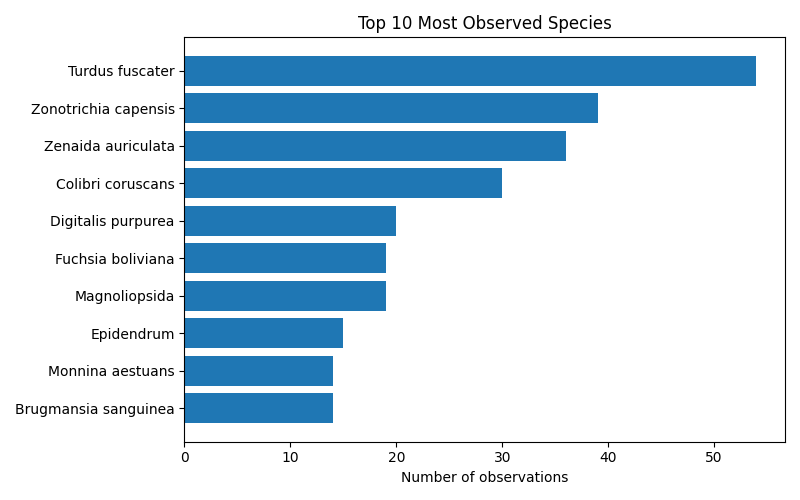
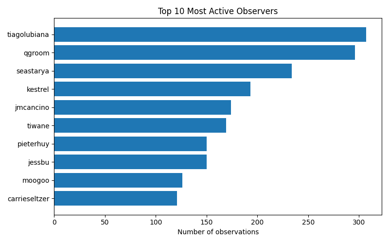

# iNaturalist Project Report: datos-vivos-gb32-bogota-2025

- Total observations: 2575
- Unique species observed: 1019
- Unique observers: 29

## Wikipedia & Wikidata Coverage

- Species not on Wikidata: **430**
- Missing in en: **547**

- Missing in es: **605**

- Missing in ja: **828**

- Missing in ar: **773**

- Missing in nl: **706**

- Missing in pt: **700**

- Missing in fr: **643**

| Taxon | Wikidata | GBIF | iNaturalist | EN | ES | JA | AR | NL | PT | FR |
|---|---|---|---|---|---|---|---|---|---|---|
| Alpinieae | [Q15548900](https://www.wikidata.org/entity/Q15548900) | — | — | &#10007; | &#10007; | &#10007; | &#10007; | &#10007; | &#10007; | &#10007; |
| Angiospermae | [Q14832431](https://www.wikidata.org/entity/Q14832431) | — | — | &#10007; | &#10007; | &#10007; | &#10007; | &#10007; | &#10007; | &#10007; |
| Araneinae | [Q3621281](https://www.wikidata.org/entity/Q3621281) | — | [417879](https://www.inaturalist.org/taxa/417879) | &#10007; | &#10007; | &#10007; | &#10007; | &#10007; | &#10007; | &#10007; |
| Ardea alba egretta | [Q27604524](https://www.wikidata.org/entity/Q27604524) | [6178104](https://www.gbif.org/species/6178104) | [236942](https://www.inaturalist.org/taxa/236942) | &#10007; | &#10007; | &#10007; | &#10007; | &#10007; | &#10007; | &#10007; |
| Aurantiporus croceus | [Q96677615](https://www.wikidata.org/entity/Q96677615) | [8992987](https://www.gbif.org/species/8992987) | [1008566](https://www.inaturalist.org/taxa/1008566) | &#10007; | &#10007; | &#10007; | &#10007; | &#10007; | &#10007; | &#10007; |
| Bidens rubifolia | [Q15591580](https://www.wikidata.org/entity/Q15591580) | [5392193](https://www.gbif.org/species/5392193) | [547409](https://www.inaturalist.org/taxa/547409) | &#10007; | &#10007; | &#10007; | &#10007; | &#10007; | &#10007; | &#10007; |
| Borogonalia | [Q10433296](https://www.wikidata.org/entity/Q10433296) | [2040492](https://www.gbif.org/species/2040492) | — | &#10007; | &#10007; | &#10007; | &#10007; | &#10007; | &#10007; | &#10007; |
| Calopterini | [Q21228567](https://www.wikidata.org/entity/Q21228567) | — | — | &#10007; | &#10007; | &#10007; | &#10007; | &#10007; | &#10007; | &#10007; |
| Castilleja integrifolia | [Q15349746](https://www.wikidata.org/entity/Q15349746) | [7332847](https://www.gbif.org/species/7332847) | [282883](https://www.inaturalist.org/taxa/282883) | &#10007; | &#10007; | &#10007; | &#10007; | &#10007; | &#10007; | &#10007; |
| Cecropia telenitida | [Q15609914](https://www.wikidata.org/entity/Q15609914) | [4013242](https://www.gbif.org/species/4013242) | [132453](https://www.inaturalist.org/taxa/132453) | &#10007; | &#10007; | &#10007; | &#10007; | &#10007; | &#10007; | &#10007; |
| Chrysalidocarpus lutescens | [Q11176489](https://www.wikidata.org/entity/Q11176489) | [2735936](https://www.gbif.org/species/2735936) | [276548](https://www.inaturalist.org/taxa/276548) | &#10007; | &#10007; | &#10007; | &#10007; | &#10007; | &#10007; | &#10007; |
| Cochylina | [Q21470287](https://www.wikidata.org/entity/Q21470287) | — | — | &#10007; | &#10007; | &#10007; | &#10007; | &#10007; | &#10007; | &#10007; |
| Cora glabrata | [Q107589635](https://www.wikidata.org/entity/Q107589635) | [5239365](https://www.gbif.org/species/5239365) | [127938](https://www.inaturalist.org/taxa/127938) | &#10007; | &#10007; | &#10007; | &#10007; | &#10007; | &#10007; | &#10007; |
| Croton hibiscifolius | [Q15362313](https://www.wikidata.org/entity/Q15362313) | [3059677](https://www.gbif.org/species/3059677) | [335658](https://www.inaturalist.org/taxa/335658) | &#10007; | &#10007; | &#10007; | &#10007; | &#10007; | &#10007; | &#10007; |
| Datura innoxia | [Q17464343](https://www.wikidata.org/entity/Q17464343) | [2928755](https://www.gbif.org/species/2928755) | [161639](https://www.inaturalist.org/taxa/161639) | &#10007; | &#10007; | &#10007; | &#10007; | &#10007; | &#10007; | &#10007; |
| Diphasium jussiaei | [Q84771050](https://www.wikidata.org/entity/Q84771050) | [8347205](https://www.gbif.org/species/8347205) | [781960](https://www.inaturalist.org/taxa/781960) | &#10007; | &#10007; | &#10007; | &#10007; | &#10007; | &#10007; | &#10007; |
| Disterigma empetrifolium | [Q13189384](https://www.wikidata.org/entity/Q13189384) | [4171081](https://www.gbif.org/species/4171081) | [336629](https://www.inaturalist.org/taxa/336629) | &#10007; | &#10007; | &#10007; | &#10007; | &#10007; | &#10007; | &#10007; |
| Elaphoglossum paleaceum | [Q15321321](https://www.wikidata.org/entity/Q15321321) | [4012551](https://www.gbif.org/species/4012551) | [275708](https://www.inaturalist.org/taxa/275708) | &#10007; | &#10007; | &#10007; | &#10007; | &#10007; | &#10007; | &#10007; |
| Empoascina | [Q123177148](https://www.wikidata.org/entity/Q123177148) | — | — | &#10007; | &#10007; | &#10007; | &#10007; | &#10007; | &#10007; | &#10007; |
| Erythranthe glabrata | [Q17746424](https://www.wikidata.org/entity/Q17746424) | [8419357](https://www.gbif.org/species/8419357) | [544345](https://www.inaturalist.org/taxa/544345) | &#10007; | &#10007; | &#10007; | &#10007; | &#10007; | &#10007; | &#10007; |
| Erythrina rubrinervia | [Q15491573](https://www.wikidata.org/entity/Q15491573) | [5349665](https://www.gbif.org/species/5349665) | [537904](https://www.inaturalist.org/taxa/537904) | &#10007; | &#10007; | &#10007; | &#10007; | &#10007; | &#10007; | &#10007; |
| Felis catus | [Q20980826](https://www.wikidata.org/entity/Q20980826) | [2435035](https://www.gbif.org/species/2435035) | [118552](https://www.inaturalist.org/taxa/118552) | &#10007; | &#10007; | &#10007; | &#10007; | &#10007; | &#10007; | &#10007; |
| Festuca bromoides | [Q21874254](https://www.wikidata.org/entity/Q21874254) | [2702740](https://www.gbif.org/species/2702740) | — | &#10007; | &#10007; | &#10007; | &#10007; | &#10007; | &#10007; | &#10007; |
| Fulica americana columbiana | [Q27607416](https://www.wikidata.org/entity/Q27607416) | [6176551](https://www.gbif.org/species/6176551) | [528429](https://www.inaturalist.org/taxa/528429) | &#10007; | &#10007; | &#10007; | &#10007; | &#10007; | &#10007; | &#10007; |
| Fusigonalia | [Q10500498](https://www.wikidata.org/entity/Q10500498) | [2035909](https://www.gbif.org/species/2035909) | [492312](https://www.inaturalist.org/taxa/492312) | &#10007; | &#10007; | &#10007; | &#10007; | &#10007; | &#10007; | &#10007; |
| Galianthe bogotensis | [Q15445586](https://www.wikidata.org/entity/Q15445586) | [2902194](https://www.gbif.org/species/2902194) | [548158](https://www.inaturalist.org/taxa/548158) | &#10007; | &#10007; | &#10007; | &#10007; | &#10007; | &#10007; | &#10007; |
| Gaultheria hapalotricha | [Q15384304](https://www.wikidata.org/entity/Q15384304) | [4171420](https://www.gbif.org/species/4171420) | [545499](https://www.inaturalist.org/taxa/545499) | &#10007; | &#10007; | &#10007; | &#10007; | &#10007; | &#10007; | &#10007; |
| Gaultheria myrsinoides | [Q15384363](https://www.wikidata.org/entity/Q15384363) | [4170522](https://www.gbif.org/species/4170522) | [342687](https://www.inaturalist.org/taxa/342687) | &#10007; | &#10007; | &#10007; | &#10007; | &#10007; | &#10007; | &#10007; |
| Heranice | [Q10522293](https://www.wikidata.org/entity/Q10522293) | [2022275](https://www.gbif.org/species/2022275) | [543807](https://www.inaturalist.org/taxa/543807) | &#10007; | &#10007; | &#10007; | &#10007; | &#10007; | &#10007; | &#10007; |
| Hypericum juniperinum | [Q1640952](https://www.wikidata.org/entity/Q1640952) | [3711397](https://www.gbif.org/species/3711397) | [336606](https://www.inaturalist.org/taxa/336606) | &#10007; | &#10007; | &#10007; | &#10007; | &#10007; | &#10007; | &#10007; |
| Kyboasca | [Q10551252](https://www.wikidata.org/entity/Q10551252) | [4307213](https://www.gbif.org/species/4307213) | [177595](https://www.inaturalist.org/taxa/177595) | &#10007; | &#10007; | &#10007; | &#10007; | &#10007; | &#10007; | &#10007; |
| Linochilus alveolatus | [Q93958898](https://www.wikidata.org/entity/Q93958898) | [10743531](https://www.gbif.org/species/10743531) | [1215180](https://www.inaturalist.org/taxa/1215180) | &#10007; | &#10007; | &#10007; | &#10007; | &#10007; | &#10007; | &#10007; |
| Linochilus phylicoides | [Q93960361](https://www.wikidata.org/entity/Q93960361) | [3090682](https://www.gbif.org/species/3090682) | [1225039](https://www.inaturalist.org/taxa/1225039) | &#10007; | &#10007; | &#10007; | &#10007; | &#10007; | &#10007; | &#10007; |
| Linochilus revolutus | [Q93960464](https://www.wikidata.org/entity/Q93960464) | [10747671](https://www.gbif.org/species/10747671) | [1225042](https://www.inaturalist.org/taxa/1225042) | &#10007; | &#10007; | &#10007; | &#10007; | &#10007; | &#10007; | &#10007; |
| Lobelia tenera | [Q15601409](https://www.wikidata.org/entity/Q15601409) | [5408985](https://www.gbif.org/species/5408985) | [547074](https://www.inaturalist.org/taxa/547074) | &#10007; | &#10007; | &#10007; | &#10007; | &#10007; | &#10007; | &#10007; |
| Lourteigia stoechadifolia | [Q15552927](https://www.wikidata.org/entity/Q15552927) | [3087497](https://www.gbif.org/species/3087497) | [706408](https://www.inaturalist.org/taxa/706408) | &#10007; | &#10007; | &#10007; | &#10007; | &#10007; | &#10007; | &#10007; |
| Meriania speciosa | [Q15392978](https://www.wikidata.org/entity/Q15392978) | [5599602](https://www.gbif.org/species/5599602) | [824574](https://www.inaturalist.org/taxa/824574) | &#10007; | &#10007; | &#10007; | &#10007; | &#10007; | &#10007; | &#10007; |
| Miconia cataractae | [Q15394238](https://www.wikidata.org/entity/Q15394238) | [3870934](https://www.gbif.org/species/3870934) | [547479](https://www.inaturalist.org/taxa/547479) | &#10007; | &#10007; | &#10007; | &#10007; | &#10007; | &#10007; | &#10007; |
| Miconia subseriata | [Q89175459](https://www.wikidata.org/entity/Q89175459) | [10782427](https://www.gbif.org/species/10782427) | [1362300](https://www.inaturalist.org/taxa/1362300) | &#10007; | &#10007; | &#10007; | &#10007; | &#10007; | &#10007; | &#10007; |
| Monnina aestuans | [Q15575823](https://www.wikidata.org/entity/Q15575823) | [7293678](https://www.gbif.org/species/7293678) | [273894](https://www.inaturalist.org/taxa/273894) | &#10007; | &#10007; | &#10007; | &#10007; | &#10007; | &#10007; | &#10007; |
| Neda norrisi | [Q49629368](https://www.wikidata.org/entity/Q49629368) | [6993432](https://www.gbif.org/species/6993432) | [481775](https://www.inaturalist.org/taxa/481775) | &#10007; | &#10007; | &#10007; | &#10007; | &#10007; | &#10007; | &#10007; |
| Orthrosanthus chimboracensis | [Q15579967](https://www.wikidata.org/entity/Q15579967) | [2746374](https://www.gbif.org/species/2746374) | [148013](https://www.inaturalist.org/taxa/148013) | &#10007; | &#10007; | &#10007; | &#10007; | &#10007; | &#10007; | &#10007; |
| Otholobium mexicanum | [Q15538830](https://www.wikidata.org/entity/Q15538830) | [3908225](https://www.gbif.org/species/3908225) | — | &#10007; | &#10007; | &#10007; | &#10007; | &#10007; | &#10007; | &#10007; |
| Parmelioideae | [Q50410096](https://www.wikidata.org/entity/Q50410096) | — | [1094690](https://www.inaturalist.org/taxa/1094690) | &#10007; | &#10007; | &#10007; | &#10007; | &#10007; | &#10007; | &#10007; |
| Pedaliodes fuscata | [Q15771813](https://www.wikidata.org/entity/Q15771813) | [1898745](https://www.gbif.org/species/1898745) | [563571](https://www.inaturalist.org/taxa/563571) | &#10007; | &#10007; | &#10007; | &#10007; | &#10007; | &#10007; | &#10007; |
| Phenax hirtus | [Q15610390](https://www.wikidata.org/entity/Q15610390) | [7300652](https://www.gbif.org/species/7300652) | [286488](https://www.inaturalist.org/taxa/286488) | &#10007; | &#10007; | &#10007; | &#10007; | &#10007; | &#10007; | &#10007; |
| Phyllanthus salviifolius | [Q15459297](https://www.wikidata.org/entity/Q15459297) | [5381107](https://www.gbif.org/species/5381107) | [540318](https://www.inaturalist.org/taxa/540318) | &#10007; | &#10007; | &#10007; | &#10007; | &#10007; | &#10007; | &#10007; |
| Piper barbatum | [Q15606269](https://www.wikidata.org/entity/Q15606269) | [7305835](https://www.gbif.org/species/7305835) | [548051](https://www.inaturalist.org/taxa/548051) | &#10007; | &#10007; | &#10007; | &#10007; | &#10007; | &#10007; | &#10007; |
| Pogonopus exsertus | [Q15489368](https://www.wikidata.org/entity/Q15489368) | [5340236](https://www.gbif.org/species/5340236) | [286245](https://www.inaturalist.org/taxa/286245) | &#10007; | &#10007; | &#10007; | &#10007; | &#10007; | &#10007; | &#10007; |
| Polystichum pungens | [Q15607711](https://www.wikidata.org/entity/Q15607711) | [4044859](https://www.gbif.org/species/4044859) | [437623](https://www.inaturalist.org/taxa/437623) | &#10007; | &#10007; | &#10007; | &#10007; | &#10007; | &#10007; | &#10007; |
| Polytrichum formosum | [Q38330570](https://www.wikidata.org/entity/Q38330570) | [4280088](https://www.gbif.org/species/4280088) | [68290](https://www.inaturalist.org/taxa/68290) | &#10007; | &#10007; | &#10007; | &#10007; | &#10007; | &#10007; | &#10007; |
| Puya boyacana | [Q15519787](https://www.wikidata.org/entity/Q15519787) | [2696056](https://www.gbif.org/species/2696056) | [847205](https://www.inaturalist.org/taxa/847205) | &#10007; | &#10007; | &#10007; | &#10007; | &#10007; | &#10007; | &#10007; |
| Puya trianae | [Q15523073](https://www.wikidata.org/entity/Q15523073) | [2696306](https://www.gbif.org/species/2696306) | [336531](https://www.inaturalist.org/taxa/336531) | &#10007; | &#10007; | &#10007; | &#10007; | &#10007; | &#10007; | &#10007; |
| Ramalina roesleri | [Q10495325](https://www.wikidata.org/entity/Q10495325) | [2608161](https://www.gbif.org/species/2608161) | [117895](https://www.inaturalist.org/taxa/117895) | &#10007; | &#10007; | &#10007; | &#10007; | &#10007; | &#10007; | &#10007; |
| Rhynchospora nervosa | [Q15555289](https://www.wikidata.org/entity/Q15555289) | [2721307](https://www.gbif.org/species/2721307) | [274117](https://www.inaturalist.org/taxa/274117) | &#10007; | &#10007; | &#10007; | &#10007; | &#10007; | &#10007; | &#10007; |
| Sarconesiopsis | [Q136527583](https://www.wikidata.org/entity/Q136527583) | [1504876](https://www.gbif.org/species/1504876) | [959801](https://www.inaturalist.org/taxa/959801) | &#10007; | &#10007; | &#10007; | &#10007; | &#10007; | &#10007; | &#10007; |
| Senecio formosus | [Q15595930](https://www.wikidata.org/entity/Q15595930) | [3107233](https://www.gbif.org/species/3107233) | [789781](https://www.inaturalist.org/taxa/789781) | &#10007; | &#10007; | &#10007; | &#10007; | &#10007; | &#10007; | &#10007; |
| Senecio niveoaureus | [Q15602613](https://www.wikidata.org/entity/Q15602613) | [3108482](https://www.gbif.org/species/3108482) | [509468](https://www.inaturalist.org/taxa/509468) | &#10007; | &#10007; | &#10007; | &#10007; | &#10007; | &#10007; | &#10007; |
| Serpocaulon levigatum | [Q15347047](https://www.wikidata.org/entity/Q15347047) | [4023945](https://www.gbif.org/species/4023945) | [623455](https://www.inaturalist.org/taxa/623455) | &#10007; | &#10007; | &#10007; | &#10007; | &#10007; | &#10007; | &#10007; |
| Sicyoeae | [Q19913397](https://www.wikidata.org/entity/Q19913397) | — | — | &#10007; | &#10007; | &#10007; | &#10007; | &#10007; | &#10007; | &#10007; |
| Smilax tomentosa | [Q15492046](https://www.wikidata.org/entity/Q15492046) | [5295675](https://www.gbif.org/species/5295675) | [284028](https://www.inaturalist.org/taxa/284028) | &#10007; | &#10007; | &#10007; | &#10007; | &#10007; | &#10007; | &#10007; |
| Solanum macrotonum | [Q17400847](https://www.wikidata.org/entity/Q17400847) | [2932050](https://www.gbif.org/species/2932050) | [947216](https://www.inaturalist.org/taxa/947216) | &#10007; | &#10007; | &#10007; | &#10007; | &#10007; | &#10007; | &#10007; |
| Stehlikiana crassa | [Q10678116](https://www.wikidata.org/entity/Q10678116) | [2036624](https://www.gbif.org/species/2036624) | [824354](https://www.inaturalist.org/taxa/824354) | &#10007; | &#10007; | &#10007; | &#10007; | &#10007; | &#10007; | &#10007; |
| Symplocos theiformis | [Q15315330](https://www.wikidata.org/entity/Q15315330) | [3643785](https://www.gbif.org/species/3643785) | [548159](https://www.inaturalist.org/taxa/548159) | &#10007; | &#10007; | &#10007; | &#10007; | &#10007; | &#10007; | &#10007; |
| Toxomerus virgulatus | [Q14515266](https://www.wikidata.org/entity/Q14515266) | [1534122](https://www.gbif.org/species/1534122) | [712163](https://www.inaturalist.org/taxa/712163) | &#10007; | &#10007; | &#10007; | &#10007; | &#10007; | &#10007; | &#10007; |
| Trachemys callirostris callirostris | [Q28834573](https://www.wikidata.org/entity/Q28834573) | [6157007](https://www.gbif.org/species/6157007) | [116223](https://www.inaturalist.org/taxa/116223) | &#10007; | &#10007; | &#10007; | &#10007; | &#10007; | &#10007; | &#10007; |
| Trema micranthum | [Q5694996](https://www.wikidata.org/entity/Q5694996) | [2984501](https://www.gbif.org/species/2984501) | — | &#10007; | &#10007; | &#10007; | &#10007; | &#10007; | &#10007; | &#10007; |
| Veronica javanica | [Q15249838](https://www.wikidata.org/entity/Q15249838) | [3730342](https://www.gbif.org/species/3730342) | [371708](https://www.inaturalist.org/taxa/371708) | &#10007; | &#10007; | &#10007; | &#10007; | &#10007; | &#10007; | &#10007; |
| Villanova oppositifolia | [Q109622626](https://www.wikidata.org/entity/Q109622626) | [5386982](https://www.gbif.org/species/5386982) | [548164](https://www.inaturalist.org/taxa/548164) | &#10007; | &#10007; | &#10007; | &#10007; | &#10007; | &#10007; | &#10007; |
| Weinmannia pubescens | [Q15602253](https://www.wikidata.org/entity/Q15602253) | [7333892](https://www.gbif.org/species/7333892) | [132457](https://www.inaturalist.org/taxa/132457) | &#10007; | &#10007; | &#10007; | &#10007; | &#10007; | &#10007; | &#10007; |
| Allograpta exotica | [Q10732128](https://www.wikidata.org/entity/Q10732128) | [1540979](https://www.gbif.org/species/1540979) | [338310](https://www.inaturalist.org/taxa/338310) | [&#10003;](https://en.wikipedia.org/wiki/Allograpta_exotica) | &#10007; | &#10007; | &#10007; | &#10007; | &#10007; | &#10007; |
| Andea | [Q134533575](https://www.wikidata.org/entity/Q134533575) | [12307278](https://www.gbif.org/species/12307278) | — | [&#10003;](https://en.wikipedia.org/wiki/Andea) | &#10007; | &#10007; | &#10007; | &#10007; | &#10007; | &#10007; |
| Anthurium veitchii | [Q12835882](https://www.wikidata.org/entity/Q12835882) | [2873417](https://www.gbif.org/species/2873417) | [430665](https://www.inaturalist.org/taxa/430665) | [&#10003;](https://en.wikipedia.org/wiki/Anthurium_veitchii) | &#10007; | &#10007; | &#10007; | &#10007; | &#10007; | &#10007; |
| Arcytophyllum nitidum | [Q15397589](https://www.wikidata.org/entity/Q15397589) | [2892716](https://www.gbif.org/species/2892716) | [537146](https://www.inaturalist.org/taxa/537146) | &#10007; | [&#10003;](https://es.wikipedia.org/wiki/Arcytophyllum_nitidum) | &#10007; | &#10007; | &#10007; | &#10007; | &#10007; |
| Astylus aulicus | [Q108619266](https://www.wikidata.org/entity/Q108619266) | — | [550170](https://www.inaturalist.org/taxa/550170) | [&#10003;](https://en.wikipedia.org/wiki/Astylus_aulicus) | &#10007; | &#10007; | &#10007; | &#10007; | &#10007; | &#10007; |
| Baccharis latifolia | [Q8239272](https://www.wikidata.org/entity/Q8239272) | [3129805](https://www.gbif.org/species/3129805) | [534316](https://www.inaturalist.org/taxa/534316) | &#10007; | [&#10003;](https://es.wikipedia.org/wiki/Baccharis_latifolia) | &#10007; | &#10007; | &#10007; | &#10007; | &#10007; |
| Bogotacris | [Q10432089](https://www.wikidata.org/entity/Q10432089) | [1707125](https://www.gbif.org/species/1707125) | [244500](https://www.inaturalist.org/taxa/244500) | &#10007; | &#10007; | &#10007; | &#10007; | [&#10003;](https://nl.wikipedia.org/wiki/Bogotacris) | &#10007; | &#10007; |
| Bucquetia glutinosa | [Q15388046](https://www.wikidata.org/entity/Q15388046) | [3861440](https://www.gbif.org/species/3861440) | [464618](https://www.inaturalist.org/taxa/464618) | &#10007; | [&#10003;](https://es.wikipedia.org/wiki/Bucquetia_glutinosa) | &#10007; | &#10007; | &#10007; | &#10007; | &#10007; |
| Calophya schini | [Q5023199](https://www.wikidata.org/entity/Q5023199) | [2014607](https://www.gbif.org/species/2014607) | [387008](https://www.inaturalist.org/taxa/387008) | [&#10003;](https://en.wikipedia.org/wiki/Calophya_schini) | &#10007; | &#10007; | &#10007; | &#10007; | &#10007; | &#10007; |
| Castilleja arvensis | [Q2371644](https://www.wikidata.org/entity/Q2371644) | [3170604](https://www.gbif.org/species/3170604) | [133740](https://www.inaturalist.org/taxa/133740) | &#10007; | &#10007; | &#10007; | &#10007; | &#10007; | &#10007; | [&#10003;](https://fr.wikipedia.org/wiki/Castilleja_arvensis) |
| Castilleja fissifolia | [Q15348622](https://www.wikidata.org/entity/Q15348622) | [7332917](https://www.gbif.org/species/7332917) | [339527](https://www.inaturalist.org/taxa/339527) | &#10007; | &#10007; | &#10007; | &#10007; | &#10007; | &#10007; | [&#10003;](https://fr.wikipedia.org/wiki/Castilleja_fissifolia) |
| Castratella piloselloides | [Q15388753](https://www.wikidata.org/entity/Q15388753) | [3858405](https://www.gbif.org/species/3858405) | [569696](https://www.inaturalist.org/taxa/569696) | &#10007; | [&#10003;](https://es.wikipedia.org/wiki/Castratella_piloselloides) | &#10007; | &#10007; | &#10007; | &#10007; | &#10007; |
| Catasticta philais | [Q3154885](https://www.wikidata.org/entity/Q3154885) | [1920027](https://www.gbif.org/species/1920027) | [602458](https://www.inaturalist.org/taxa/602458) | &#10007; | &#10007; | &#10007; | &#10007; | [&#10003;](https://nl.wikipedia.org/wiki/Catasticta_philais) | &#10007; | &#10007; |
| Chaetogastra mollis | [Q110012122](https://www.wikidata.org/entity/Q110012122) | [3870179](https://www.gbif.org/species/3870179) | — | [&#10003;](https://en.wikipedia.org/wiki/Chaetogastra_mollis) | &#10007; | &#10007; | &#10007; | &#10007; | &#10007; | &#10007; |
| Chromolaena bullata | [Q15592414](https://www.wikidata.org/entity/Q15592414) | [3087713](https://www.gbif.org/species/3087713) | [557200](https://www.inaturalist.org/taxa/557200) | &#10007; | [&#10003;](https://es.wikipedia.org/wiki/Chromolaena_bullata) | &#10007; | &#10007; | &#10007; | &#10007; | &#10007; |
| Chrysoperla externa | [Q2453310](https://www.wikidata.org/entity/Q2453310) | [2105515](https://www.gbif.org/species/2105515) | [196458](https://www.inaturalist.org/taxa/196458) | &#10007; | &#10007; | &#10007; | &#10007; | [&#10003;](https://nl.wikipedia.org/wiki/Chrysoperla_externa) | &#10007; | &#10007; |
| Chusquea scandens | [Q15514218](https://www.wikidata.org/entity/Q15514218) | [4130186](https://www.gbif.org/species/4130186) | [545653](https://www.inaturalist.org/taxa/545653) | &#10007; | [&#10003;](https://es.wikipedia.org/wiki/Chusquea_scandens) | &#10007; | &#10007; | &#10007; | &#10007; | &#10007; |
| Citharexylum subflavescens | [Q15494878](https://www.wikidata.org/entity/Q15494878) | [4085930](https://www.gbif.org/species/4085930) | [549205](https://www.inaturalist.org/taxa/549205) | &#10007; | [&#10003;](https://es.wikipedia.org/wiki/Citharexylum_subflavescens) | &#10007; | &#10007; | &#10007; | &#10007; | &#10007; |
| Clusia multiflora | [Q5775225](https://www.wikidata.org/entity/Q5775225) | [7330264](https://www.gbif.org/species/7330264) | [154532](https://www.inaturalist.org/taxa/154532) | &#10007; | [&#10003;](https://es.wikipedia.org/wiki/Clusia_multiflora) | &#10007; | &#10007; | &#10007; | &#10007; | &#10007; |
| Cortaderia nitida | [Q15514131](https://www.wikidata.org/entity/Q15514131) | [4148794](https://www.gbif.org/species/4148794) | [545648](https://www.inaturalist.org/taxa/545648) | &#10007; | [&#10003;](https://es.wikipedia.org/wiki/Cortaderia_nitida) | &#10007; | &#10007; | &#10007; | &#10007; | &#10007; |
| Croton mutisianus | [Q3004800](https://www.wikidata.org/entity/Q3004800) | [3059269](https://www.gbif.org/species/3059269) | [534699](https://www.inaturalist.org/taxa/534699) | &#10007; | &#10007; | &#10007; | &#10007; | &#10007; | &#10007; | [&#10003;](https://fr.wikipedia.org/wiki/Croton_mutisianus) |
| Culcitium canescens | [Q50240840](https://www.wikidata.org/entity/Q50240840) | [3108405](https://www.gbif.org/species/3108405) | [709202](https://www.inaturalist.org/taxa/709202) | &#10007; | [&#10003;](https://es.wikipedia.org/wiki/Culcitium_canescens) | &#10007; | &#10007; | &#10007; | &#10007; | &#10007; |
| Cyrtochilum revolutum | [Q15446054](https://www.wikidata.org/entity/Q15446054) | [2833015](https://www.gbif.org/species/2833015) | [531768](https://www.inaturalist.org/taxa/531768) | &#10007; | [&#10003;](https://es.wikipedia.org/wiki/Cyrtochilum_revolutum) | &#10007; | &#10007; | &#10007; | &#10007; | &#10007; |
| Epidendrum arachnoglossum | [Q15468529](https://www.wikidata.org/entity/Q15468529) | [5319877](https://www.gbif.org/species/5319877) | [460614](https://www.inaturalist.org/taxa/460614) | &#10007; | [&#10003;](https://es.wikipedia.org/wiki/Epidendrum_arachnoglossum) | &#10007; | &#10007; | &#10007; | &#10007; | &#10007; |
| Epidendrum zipaquiranum | [Q79674294](https://www.wikidata.org/entity/Q79674294) | [5321212](https://www.gbif.org/species/5321212) | [894333](https://www.inaturalist.org/taxa/894333) | &#10007; | [&#10003;](https://es.wikipedia.org/wiki/Epidendrum_zipaquiranum) | &#10007; | &#10007; | &#10007; | &#10007; | &#10007; |
| Eremotylus | [Q14519783](https://www.wikidata.org/entity/Q14519783) | [1296078](https://www.gbif.org/species/1296078) | [250662](https://www.inaturalist.org/taxa/250662) | &#10007; | &#10007; | &#10007; | &#10007; | [&#10003;](https://nl.wikipedia.org/wiki/Eremotylus) | &#10007; | &#10007; |
| Euophryini | [Q110208](https://www.wikidata.org/entity/Q110208) | — | [712073](https://www.inaturalist.org/taxa/712073) | [&#10003;](https://en.wikipedia.org/wiki/Euophryini) | &#10007; | &#10007; | &#10007; | &#10007; | &#10007; | &#10007; |
| Forficula dentata | [Q120400839](https://www.wikidata.org/entity/Q120400839) | [4393070](https://www.gbif.org/species/4393070) | [1470429](https://www.inaturalist.org/taxa/1470429) | [&#10003;](https://en.wikipedia.org/wiki/Forficula_dentata) | &#10007; | &#10007; | &#10007; | &#10007; | &#10007; | &#10007; |
| Fuchsia paniculata | [Q1472595](https://www.wikidata.org/entity/Q1472595) | [5938223](https://www.gbif.org/species/5938223) | [163113](https://www.inaturalist.org/taxa/163113) | [&#10003;](https://en.wikipedia.org/wiki/Fuchsia_paniculata) | &#10007; | &#10007; | &#10007; | &#10007; | &#10007; | &#10007; |
| Gaiadendron punctatum | [Q15382935](https://www.wikidata.org/entity/Q15382935) | [7288046](https://www.gbif.org/species/7288046) | [496333](https://www.inaturalist.org/taxa/496333) | &#10007; | [&#10003;](https://es.wikipedia.org/wiki/Gaiadendron_punctatum) | &#10007; | &#10007; | &#10007; | &#10007; | &#10007; |
| Gaultherieae | [Q18960304](https://www.wikidata.org/entity/Q18960304) | — | — | &#10007; | [&#10003;](https://es.wikipedia.org/wiki/Gaultherieae) | &#10007; | &#10007; | &#10007; | &#10007; | &#10007; |
| Hypericum laricifolium | [Q17566043](https://www.wikidata.org/entity/Q17566043) | [7329877](https://www.gbif.org/species/7329877) | [336610](https://www.inaturalist.org/taxa/336610) | [&#10003;](https://en.wikipedia.org/wiki/Hypericum_laricifolium) | &#10007; | &#10007; | &#10007; | &#10007; | &#10007; | &#10007; |
| Hypochaeris sessiliflora | [Q15587386](https://www.wikidata.org/entity/Q15587386) | [3093832](https://www.gbif.org/species/3093832) | [193656](https://www.inaturalist.org/taxa/193656) | [&#10003;](https://en.wikipedia.org/wiki/Hypochaeris_sessiliflora) | &#10007; | &#10007; | &#10007; | &#10007; | &#10007; | &#10007; |
| Hypotrachyna | [Q5961440](https://www.wikidata.org/entity/Q5961440) | [2605434](https://www.gbif.org/species/2605434) | [117980](https://www.inaturalist.org/taxa/117980) | [&#10003;](https://en.wikipedia.org/wiki/Hypotrachyna) | &#10007; | &#10007; | &#10007; | &#10007; | &#10007; | &#10007; |
| Limoniini | [Q33176852](https://www.wikidata.org/entity/Q33176852) | — | [489801](https://www.inaturalist.org/taxa/489801) | [&#10003;](https://en.wikipedia.org/wiki/Limoniini) | &#10007; | &#10007; | &#10007; | &#10007; | &#10007; | &#10007; |
| Linochilus rosmarinifolius | [Q96200630](https://www.wikidata.org/entity/Q96200630) | [3090609](https://www.gbif.org/species/3090609) | [1225047](https://www.inaturalist.org/taxa/1225047) | &#10007; | [&#10003;](https://es.wikipedia.org/wiki/Linochilus_rosmarinifolius) | &#10007; | &#10007; | &#10007; | &#10007; | &#10007; |
| Lomariocycas | [Q30110340](https://www.wikidata.org/entity/Q30110340) | [10856091](https://www.gbif.org/species/10856091) | [724135](https://www.inaturalist.org/taxa/724135) | [&#10003;](https://en.wikipedia.org/wiki/Lomariocycas) | &#10007; | &#10007; | &#10007; | &#10007; | &#10007; | &#10007; |
| Lycianthes lycioides | [Q3268402](https://www.wikidata.org/entity/Q3268402) | [7299577](https://www.gbif.org/species/7299577) | [526642](https://www.inaturalist.org/taxa/526642) | &#10007; | &#10007; | &#10007; | &#10007; | &#10007; | &#10007; | [&#10003;](https://fr.wikipedia.org/wiki/Lycianthes_lycioides) |
| Monochaetum myrtoideum | [Q15401133](https://www.wikidata.org/entity/Q15401133) | [3858290](https://www.gbif.org/species/3858290) | [538474](https://www.inaturalist.org/taxa/538474) | &#10007; | [&#10003;](https://es.wikipedia.org/wiki/Monochaetum_myrtoideum) | &#10007; | &#10007; | &#10007; | &#10007; | &#10007; |
| Morella pubescens | [Q15377003](https://www.wikidata.org/entity/Q15377003) | [3744993](https://www.gbif.org/species/3744993) | [496289](https://www.inaturalist.org/taxa/496289) | &#10007; | [&#10003;](https://es.wikipedia.org/wiki/Morella_pubescens) | &#10007; | &#10007; | &#10007; | &#10007; | &#10007; |
| Myrcianthes leucoxyla | [Q6035171](https://www.wikidata.org/entity/Q6035171) | [3188304](https://www.gbif.org/species/3188304) | [537580](https://www.inaturalist.org/taxa/537580) | &#10007; | [&#10003;](https://es.wikipedia.org/wiki/Myrcianthes_leucoxyla) | &#10007; | &#10007; | &#10007; | &#10007; | &#10007; |
| Netelia producta | [Q14527285](https://www.wikidata.org/entity/Q14527285) | [1282066](https://www.gbif.org/species/1282066) | [410054](https://www.inaturalist.org/taxa/410054) | [&#10003;](https://en.wikipedia.org/wiki/Netelia_producta) | &#10007; | &#10007; | &#10007; | &#10007; | &#10007; | &#10007; |
| Oenothera multicaulis | [Q13190361](https://www.wikidata.org/entity/Q13190361) | [3663746](https://www.gbif.org/species/3663746) | [556726](https://www.inaturalist.org/taxa/556726) | &#10007; | &#10007; | &#10007; | [&#10003;](https://ar.wikipedia.org/wiki/%D8%A3%D8%AE%D8%AF%D8%B1%D9%8A%D8%A9_%D9%85%D8%AA%D8%B9%D8%AF%D8%AF%D8%A9_%D8%A7%D9%84%D8%B3%D9%88%D9%82) | &#10007; | &#10007; | &#10007; |
| Paepalanthus alpinus | [Q15520199](https://www.wikidata.org/entity/Q15520199) | [5287136](https://www.gbif.org/species/5287136) | [533184](https://www.inaturalist.org/taxa/533184) | &#10007; | [&#10003;](https://es.wikipedia.org/wiki/Paepalanthus_alpinus) | &#10007; | &#10007; | &#10007; | &#10007; | &#10007; |
| Panyapedaliodes | [Q3362535](https://www.wikidata.org/entity/Q3362535) | [1892833](https://www.gbif.org/species/1892833) | [549353](https://www.inaturalist.org/taxa/549353) | &#10007; | &#10007; | &#10007; | &#10007; | &#10007; | &#10007; | [&#10003;](https://fr.wikipedia.org/wiki/Panyapedaliodes) |
| Panyapedaliodes drymaea | [Q13565531](https://www.wikidata.org/entity/Q13565531) | [1892837](https://www.gbif.org/species/1892837) | [635156](https://www.inaturalist.org/taxa/635156) | &#10007; | &#10007; | &#10007; | &#10007; | [&#10003;](https://nl.wikipedia.org/wiki/Panyapedaliodes_drymaea) | &#10007; | &#10007; |
| Phyllobaeis | [Q21224343](https://www.wikidata.org/entity/Q21224343) | [7249098](https://www.gbif.org/species/7249098) | [496617](https://www.inaturalist.org/taxa/496617) | [&#10003;](https://en.wikipedia.org/wiki/Phyllobaeis) | &#10007; | &#10007; | &#10007; | &#10007; | &#10007; | &#10007; |
| Pleroma urvilleanum | [Q89050367](https://www.wikidata.org/entity/Q89050367) | [10863132](https://www.gbif.org/species/10863132) | [1263850](https://www.inaturalist.org/taxa/1263850) | [&#10003;](https://en.wikipedia.org/wiki/Pleroma_urvilleanum) | &#10007; | &#10007; | &#10007; | &#10007; | &#10007; | &#10007; |
| Pseudococcus longispinus | [Q28354381](https://www.wikidata.org/entity/Q28354381) | [2095283](https://www.gbif.org/species/2095283) | [84805](https://www.inaturalist.org/taxa/84805) | [&#10003;](https://en.wikipedia.org/wiki/Pseudococcus_longispinus) | &#10007; | &#10007; | &#10007; | &#10007; | &#10007; | &#10007; |
| Puya goudotiana | [Q15519445](https://www.wikidata.org/entity/Q15519445) | [2696274](https://www.gbif.org/species/2696274) | [336535](https://www.inaturalist.org/taxa/336535) | &#10007; | [&#10003;](https://es.wikipedia.org/wiki/Puya_goudotiana) | &#10007; | &#10007; | &#10007; | &#10007; | &#10007; |
| Rusavskia sorediata | [Q21304636](https://www.wikidata.org/entity/Q21304636) | [6345640](https://www.gbif.org/species/6345640) | [532269](https://www.inaturalist.org/taxa/532269) | [&#10003;](https://en.wikipedia.org/wiki/Rusavskia_sorediata) | &#10007; | &#10007; | &#10007; | &#10007; | &#10007; | &#10007; |
| Salvia scutellarioides | [Q7406887](https://www.wikidata.org/entity/Q7406887) | [3887987](https://www.gbif.org/species/3887987) | [625308](https://www.inaturalist.org/taxa/625308) | [&#10003;](https://en.wikipedia.org/wiki/Salvia_scutellarioides) | &#10007; | &#10007; | &#10007; | &#10007; | &#10007; | &#10007; |
| Senna viarum | [Q15537652](https://www.wikidata.org/entity/Q15537652) | [2957859](https://www.gbif.org/species/2957859) | [509218](https://www.inaturalist.org/taxa/509218) | &#10007; | [&#10003;](https://es.wikipedia.org/wiki/Senna_viarum) | &#10007; | &#10007; | &#10007; | &#10007; | &#10007; |
| Smallanthus pyramidalis | [Q15565972](https://www.wikidata.org/entity/Q15565972) | [3145318](https://www.gbif.org/species/3145318) | [508085](https://www.inaturalist.org/taxa/508085) | &#10007; | [&#10003;](https://es.wikipedia.org/wiki/Smallanthus_pyramidalis) | &#10007; | &#10007; | &#10007; | &#10007; | &#10007; |
| Solanum caripense | [Q7555740](https://www.wikidata.org/entity/Q7555740) | [2932832](https://www.gbif.org/species/2932832) | [244614](https://www.inaturalist.org/taxa/244614) | [&#10003;](https://en.wikipedia.org/wiki/Solanum_caripense) | &#10007; | &#10007; | &#10007; | &#10007; | &#10007; | &#10007; |
| Solanum interandinum | [Q5464968](https://www.wikidata.org/entity/Q5464968) | [2932856](https://www.gbif.org/species/2932856) | [443798](https://www.inaturalist.org/taxa/443798) | [&#10003;](https://en.wikipedia.org/wiki/Solanum_interandinum) | &#10007; | &#10007; | &#10007; | &#10007; | &#10007; | &#10007; |
| Solanum oblongifolium | [Q15537243](https://www.wikidata.org/entity/Q15537243) | [2930683](https://www.gbif.org/species/2930683) | [553042](https://www.inaturalist.org/taxa/553042) | &#10007; | [&#10003;](https://es.wikipedia.org/wiki/Solanum_oblongifolium) | &#10007; | &#10007; | &#10007; | &#10007; | &#10007; |
| Syntrichia papillosa | [Q15316790](https://www.wikidata.org/entity/Q15316790) | [2671310](https://www.gbif.org/species/2671310) | [409319](https://www.inaturalist.org/taxa/409319) | &#10007; | &#10007; | &#10007; | &#10007; | [&#10003;](https://nl.wikipedia.org/wiki/Knikkersterretje) | &#10007; | &#10007; |
| Tachinini | [Q16992925](https://www.wikidata.org/entity/Q16992925) | — | [147946](https://www.inaturalist.org/taxa/147946) | [&#10003;](https://en.wikipedia.org/wiki/Tachinini) | &#10007; | &#10007; | &#10007; | &#10007; | &#10007; | &#10007; |
| Tillandsia fendleri | [Q10826865](https://www.wikidata.org/entity/Q10826865) | [2694600](https://www.gbif.org/species/2694600) | [505485](https://www.inaturalist.org/taxa/505485) | [&#10003;](https://en.wikipedia.org/wiki/Tillandsia_fendleri) | &#10007; | &#10007; | &#10007; | &#10007; | &#10007; | &#10007; |
| Toxotoma flavofasciata | [Q119158125](https://www.wikidata.org/entity/Q119158125) | [11601615](https://www.gbif.org/species/11601615) | — | [&#10003;](https://en.wikipedia.org/wiki/Toxotoma_flavofasciata) | &#10007; | &#10007; | &#10007; | &#10007; | &#10007; | &#10007; |
| Xanthoparmelia | [Q9397450](https://www.wikidata.org/entity/Q9397450) | [2603781](https://www.gbif.org/species/2603781) | [60724](https://www.inaturalist.org/taxa/60724) | [&#10003;](https://en.wikipedia.org/wiki/Xanthoparmelia) | &#10007; | &#10007; | &#10007; | &#10007; | &#10007; | &#10007; |
| Zamia huilensis | [Q48783379](https://www.wikidata.org/entity/Q48783379) | [7447872](https://www.gbif.org/species/7447872) | [564548](https://www.inaturalist.org/taxa/564548) | [&#10003;](https://en.wikipedia.org/wiki/Zamia_huilensis) | &#10007; | &#10007; | &#10007; | &#10007; | &#10007; | &#10007; |
| Zelus longipes | [Q8068843](https://www.wikidata.org/entity/Q8068843) | [2008843](https://www.gbif.org/species/2008843) | [133826](https://www.inaturalist.org/taxa/133826) | [&#10003;](https://en.wikipedia.org/wiki/Zelus_longipes) | &#10007; | &#10007; | &#10007; | &#10007; | &#10007; | &#10007; |
| Acaena cylindristachya | [Q9571604](https://www.wikidata.org/entity/Q9571604) | [5371112](https://www.gbif.org/species/5371112) | [278479](https://www.inaturalist.org/taxa/278479) | &#10007; | [&#10003;](https://es.wikipedia.org/wiki/Acaena_cylindristachya) | &#10007; | &#10007; | &#10007; | [&#10003;](https://pt.wikipedia.org/wiki/Acaena_cylindristachya) | &#10007; |
| Acaena elongata | [Q15288160](https://www.wikidata.org/entity/Q15288160) | [5370941](https://www.gbif.org/species/5370941) | [194689](https://www.inaturalist.org/taxa/194689) | &#10007; | [&#10003;](https://es.wikipedia.org/wiki/Acaena_elongata) | &#10007; | &#10007; | &#10007; | [&#10003;](https://pt.wikipedia.org/wiki/Acaena_elongata) | &#10007; |
| Agesander ruficornis | [Q11840762](https://www.wikidata.org/entity/Q11840762) | [1703199](https://www.gbif.org/species/1703199) | [759166](https://www.inaturalist.org/taxa/759166) | [&#10003;](https://en.wikipedia.org/wiki/Agesander_ruficornis) | &#10007; | &#10007; | &#10007; | [&#10003;](https://nl.wikipedia.org/wiki/Agesander_ruficornis) | &#10007; | &#10007; |
| Alchemilla orbiculata | [Q15288842](https://www.wikidata.org/entity/Q15288842) | [3027800](https://www.gbif.org/species/3027800) | [287289](https://www.inaturalist.org/taxa/287289) | &#10007; | [&#10003;](https://es.wikipedia.org/wiki/Alchemilla_orbiculata) | &#10007; | &#10007; | &#10007; | [&#10003;](https://pt.wikipedia.org/wiki/Alchemilla_orbiculata) | &#10007; |
| Alonsoa meridionalis | [Q4062836](https://www.wikidata.org/entity/Q4062836) | [7331539](https://www.gbif.org/species/7331539) | [282861](https://www.inaturalist.org/taxa/282861) | [&#10003;](https://en.wikipedia.org/wiki/Alonsoa_meridionalis) | &#10007; | &#10007; | [&#10003;](https://ar.wikipedia.org/wiki/%D8%A3%D9%84%D9%88%D9%86%D8%B3%D9%88%D8%A9_%D8%AC%D9%86%D9%88%D8%A8%D9%8A%D8%A9) | &#10007; | &#10007; | &#10007; |
| Andesanthus lepidotus | [Q93952511](https://www.wikidata.org/entity/Q93952511) | [10767444](https://www.gbif.org/species/10767444) | — | [&#10003;](https://en.wikipedia.org/wiki/Andesanthus_lepidotus) | [&#10003;](https://es.wikipedia.org/wiki/Andesanthus_lepidotus) | &#10007; | &#10007; | &#10007; | &#10007; | &#10007; |
| Arcytophyllum | [Q4787754](https://www.wikidata.org/entity/Q4787754) | [2892699](https://www.gbif.org/species/2892699) | [339513](https://www.inaturalist.org/taxa/339513) | [&#10003;](https://en.wikipedia.org/wiki/Arcytophyllum) | [&#10003;](https://es.wikipedia.org/wiki/Arcytophyllum) | &#10007; | &#10007; | &#10007; | &#10007; | &#10007; |
| Bicellaria | [Q14608367](https://www.wikidata.org/entity/Q14608367) | [1458522](https://www.gbif.org/species/1458522) | [481469](https://www.inaturalist.org/taxa/481469) | [&#10003;](https://en.wikipedia.org/wiki/Bicellaria) | &#10007; | &#10007; | &#10007; | [&#10003;](https://nl.wikipedia.org/wiki/Bicellaria) | &#10007; | &#10007; |
| Bomarea multiflora | [Q4035296](https://www.wikidata.org/entity/Q4035296) | [2754207](https://www.gbif.org/species/2754207) | [430005](https://www.inaturalist.org/taxa/430005) | [&#10003;](https://en.wikipedia.org/wiki/Bomarea_multiflora) | [&#10003;](https://es.wikipedia.org/wiki/Bomarea_multiflora) | &#10007; | &#10007; | &#10007; | &#10007; | &#10007; |
| Bombus rubicundus | [Q2755437](https://www.wikidata.org/entity/Q2755437) | [1340413](https://www.gbif.org/species/1340413) | [522588](https://www.inaturalist.org/taxa/522588) | &#10007; | &#10007; | &#10007; | &#10007; | [&#10003;](https://nl.wikipedia.org/wiki/Bombus_rubicundus) | &#10007; | [&#10003;](https://fr.wikipedia.org/wiki/Bombus_rubicundus) |
| Campyloneurum angustifolium | [Q5028756](https://www.wikidata.org/entity/Q5028756) | [2650512](https://www.gbif.org/species/2650512) | [159778](https://www.inaturalist.org/taxa/159778) | [&#10003;](https://en.wikipedia.org/wiki/Campyloneurum_angustifolium) | [&#10003;](https://es.wikipedia.org/wiki/Campyloneurum_angustifolium) | &#10007; | &#10007; | &#10007; | &#10007; | &#10007; |
| Candolleomyces candolleanus | [Q110745624](https://www.wikidata.org/entity/Q110745624) | [12008655](https://www.gbif.org/species/12008655) | [1179954](https://www.inaturalist.org/taxa/1179954) | [&#10003;](https://en.wikipedia.org/wiki/Candolleomyces_candolleanus) | &#10007; | &#10007; | &#10007; | [&#10003;](https://nl.wikipedia.org/wiki/Bleke_franjehoed) | &#10007; | &#10007; |
| Canis familiaris | [Q20717272](https://www.wikidata.org/entity/Q20717272) | [5219200](https://www.gbif.org/species/5219200) | [47144](https://www.inaturalist.org/taxa/47144) | [&#10003;](https://en.wikipedia.org/wiki/Canis_familiaris) | [&#10003;](https://es.wikipedia.org/wiki/Canis_familiaris) | &#10007; | &#10007; | &#10007; | &#10007; | &#10007; |
| Carex bonplandii | [Q2938351](https://www.wikidata.org/entity/Q2938351) | [2726565](https://www.gbif.org/species/2726565) | [159894](https://www.inaturalist.org/taxa/159894) | [&#10003;](https://en.wikipedia.org/wiki/Carex_bonplandii) | &#10007; | &#10007; | &#10007; | &#10007; | &#10007; | [&#10003;](https://fr.wikipedia.org/wiki/Carex_bonplandii) |
| Cargolia | [Q5039293](https://www.wikidata.org/entity/Q5039293) | [1967183](https://www.gbif.org/species/1967183) | [717937](https://www.inaturalist.org/taxa/717937) | [&#10003;](https://en.wikipedia.org/wiki/Cargolia) | &#10007; | &#10007; | &#10007; | [&#10003;](https://nl.wikipedia.org/wiki/Cargolia) | &#10007; | &#10007; |
| Crambus unistriatellus | [Q13500022](https://www.wikidata.org/entity/Q13500022) | [1879939](https://www.gbif.org/species/1879939) | [203132](https://www.inaturalist.org/taxa/203132) | [&#10003;](https://en.wikipedia.org/wiki/Crambus_unistriatellus) | &#10007; | &#10007; | &#10007; | [&#10003;](https://nl.wikipedia.org/wiki/Crambus_unistriatellus) | &#10007; | &#10007; |
| Croton draco | [Q3004263](https://www.wikidata.org/entity/Q3004263) | [3058297](https://www.gbif.org/species/3058297) | [209901](https://www.inaturalist.org/taxa/209901) | &#10007; | [&#10003;](https://es.wikipedia.org/wiki/Croton_draco) | &#10007; | &#10007; | &#10007; | &#10007; | [&#10003;](https://fr.wikipedia.org/wiki/Croton_draco) |
| Cullumanobombus | [Q4036757](https://www.wikidata.org/entity/Q4036757) | — | [538890](https://www.inaturalist.org/taxa/538890) | &#10007; | [&#10003;](https://es.wikipedia.org/wiki/Cullumanobombus) | &#10007; | &#10007; | &#10007; | &#10007; | [&#10003;](https://fr.wikipedia.org/wiki/Cullumanobombus) |
| Cyperoideae | [Q4448224](https://www.wikidata.org/entity/Q4448224) | — | [873509](https://www.inaturalist.org/taxa/873509) | &#10007; | [&#10003;](https://es.wikipedia.org/wiki/Cyperoideae) | &#10007; | &#10007; | &#10007; | [&#10003;](https://pt.wikipedia.org/wiki/Cyperoideae) | &#10007; |
| Deroceras invadens | [Q5262901](https://www.wikidata.org/entity/Q5262901) | [8745918](https://www.gbif.org/species/8745918) | [366887](https://www.inaturalist.org/taxa/366887) | [&#10003;](https://en.wikipedia.org/wiki/Deroceras_invadens) | &#10007; | &#10007; | &#10007; | [&#10003;](https://nl.wikipedia.org/wiki/Zwervende_akkerslak) | &#10007; | &#10007; |
| Drymoea | [Q5309734](https://www.wikidata.org/entity/Q5309734) | [1959956](https://www.gbif.org/species/1959956) | — | [&#10003;](https://en.wikipedia.org/wiki/Drymoea) | [&#10003;](https://es.wikipedia.org/wiki/Drymoea) | &#10007; | &#10007; | &#10007; | &#10007; | &#10007; |
| Drymoea veliterna | [Q18137628](https://www.wikidata.org/entity/Q18137628) | — | [876440](https://www.inaturalist.org/taxa/876440) | [&#10003;](https://en.wikipedia.org/wiki/Drymoea_veliterna) | [&#10003;](https://es.wikipedia.org/wiki/Drymoea_veliterna) | &#10007; | &#10007; | &#10007; | &#10007; | &#10007; |
| Dryopteris wallichiana | [Q5309785](https://www.wikidata.org/entity/Q5309785) | [5275137](https://www.gbif.org/species/5275137) | [162123](https://www.inaturalist.org/taxa/162123) | [&#10003;](https://en.wikipedia.org/wiki/Dryopteris_wallichiana) | [&#10003;](https://es.wikipedia.org/wiki/Dryopteris_wallichiana) | &#10007; | &#10007; | &#10007; | &#10007; | &#10007; |
| Escallonia rubra | [Q12334111](https://www.wikidata.org/entity/Q12334111) | [8405971](https://www.gbif.org/species/8405971) | [162726](https://www.inaturalist.org/taxa/162726) | [&#10003;](https://en.wikipedia.org/wiki/Escallonia_rubra) | [&#10003;](https://es.wikipedia.org/wiki/Escallonia_rubra) | &#10007; | &#10007; | &#10007; | &#10007; | &#10007; |
| Eudejeania | [Q13617905](https://www.wikidata.org/entity/Q13617905) | [1473977](https://www.gbif.org/species/1473977) | [956154](https://www.inaturalist.org/taxa/956154) | [&#10003;](https://en.wikipedia.org/wiki/Eudejeania) | &#10007; | &#10007; | &#10007; | [&#10003;](https://nl.wikipedia.org/wiki/Eudejeania) | &#10007; | &#10007; |
| Eupatorieae | [Q135371](https://www.wikidata.org/entity/Q135371) | [6301951](https://www.gbif.org/species/6301951) | [153419](https://www.inaturalist.org/taxa/153419) | [&#10003;](https://en.wikipedia.org/wiki/Eupatorieae) | [&#10003;](https://es.wikipedia.org/wiki/Eupatorieae) | &#10007; | &#10007; | &#10007; | &#10007; | &#10007; |
| Gamochaeta americana | [Q15597791](https://www.wikidata.org/entity/Q15597791) | [3103158](https://www.gbif.org/species/3103158) | [153366](https://www.inaturalist.org/taxa/153366) | [&#10003;](https://en.wikipedia.org/wiki/Gamochaeta_americana) | [&#10003;](https://es.wikipedia.org/wiki/Gamochaeta_americana) | &#10007; | &#10007; | &#10007; | &#10007; | &#10007; |
| Gladiolus dalenii | [Q2109825](https://www.wikidata.org/entity/Q2109825) | [2750406](https://www.gbif.org/species/2750406) | [357461](https://www.inaturalist.org/taxa/357461) | [&#10003;](https://en.wikipedia.org/wiki/Gladiolus_dalenii) | [&#10003;](https://es.wikipedia.org/wiki/Gladiolus_dalenii) | &#10007; | &#10007; | &#10007; | &#10007; | &#10007; |
| Helina evecta | [Q5705359](https://www.wikidata.org/entity/Q5705359) | [5069084](https://www.gbif.org/species/5069084) | [452795](https://www.inaturalist.org/taxa/452795) | [&#10003;](https://en.wikipedia.org/wiki/Helina_evecta) | &#10007; | &#10007; | &#10007; | [&#10003;](https://nl.wikipedia.org/wiki/Helina_evecta) | &#10007; | &#10007; |
| Hygrochroma | [Q10770158](https://www.wikidata.org/entity/Q10770158) | [1962881](https://www.gbif.org/species/1962881) | [521299](https://www.inaturalist.org/taxa/521299) | [&#10003;](https://en.wikipedia.org/wiki/Hygrochroma) | &#10007; | &#10007; | &#10007; | [&#10003;](https://nl.wikipedia.org/wiki/Hygrochroma) | &#10007; | &#10007; |
| Hygrocybe reidii | [Q3915209](https://www.wikidata.org/entity/Q3915209) | [8369786](https://www.gbif.org/species/8369786) | [363603](https://www.inaturalist.org/taxa/363603) | [&#10003;](https://en.wikipedia.org/wiki/Hygrocybe_reidii) | &#10007; | &#10007; | &#10007; | [&#10003;](https://nl.wikipedia.org/wiki/Honingwasplaat) | &#10007; | &#10007; |
| Limacoidei | [Q57262978](https://www.wikidata.org/entity/Q57262978) | — | [781353](https://www.inaturalist.org/taxa/781353) | [&#10003;](https://en.wikipedia.org/wiki/Limacoidei) | &#10007; | &#10007; | &#10007; | [&#10003;](https://nl.wikipedia.org/wiki/Limacoidei) | &#10007; | &#10007; |
| Malthodes | [Q11987954](https://www.wikidata.org/entity/Q11987954) | [4406155](https://www.gbif.org/species/4406155) | [177174](https://www.inaturalist.org/taxa/177174) | [&#10003;](https://en.wikipedia.org/wiki/Malthodes) | [&#10003;](https://es.wikipedia.org/wiki/Malthodes) | &#10007; | &#10007; | &#10007; | &#10007; | &#10007; |
| Masdevallia ignea | [Q6782925](https://www.wikidata.org/entity/Q6782925) | [2848054](https://www.gbif.org/species/2848054) | [905009](https://www.inaturalist.org/taxa/905009) | [&#10003;](https://en.wikipedia.org/wiki/Masdevallia_ignea) | [&#10003;](https://es.wikipedia.org/wiki/Masdevallia_ignea) | &#10007; | &#10007; | &#10007; | &#10007; | &#10007; |
| Membracinae | [Q16625467](https://www.wikidata.org/entity/Q16625467) | — | [362474](https://www.inaturalist.org/taxa/362474) | [&#10003;](https://en.wikipedia.org/wiki/Membracinae) | [&#10003;](https://es.wikipedia.org/wiki/Membracinae) | &#10007; | &#10007; | &#10007; | &#10007; | &#10007; |
| Miconia salicifolia | [Q1931419](https://www.wikidata.org/entity/Q1931419) | [3867922](https://www.gbif.org/species/3867922) | [624243](https://www.inaturalist.org/taxa/624243) | [&#10003;](https://en.wikipedia.org/wiki/Miconia_salicifolia) | [&#10003;](https://es.wikipedia.org/wiki/Miconia_salicifolia) | &#10007; | &#10007; | &#10007; | &#10007; | &#10007; |
| Munnozia senecionidis | [Q15567016](https://www.wikidata.org/entity/Q15567016) | [3099401](https://www.gbif.org/species/3099401) | [548066](https://www.inaturalist.org/taxa/548066) | &#10007; | [&#10003;](https://es.wikipedia.org/wiki/Munnozia_senecionidis) | &#10007; | &#10007; | &#10007; | &#10007; | [&#10003;](https://fr.wikipedia.org/wiki/Munnozia_senecionidis) |
| Neckera pennata | [Q310593](https://www.wikidata.org/entity/Q310593) | [2678586](https://www.gbif.org/species/2678586) | [132674](https://www.inaturalist.org/taxa/132674) | [&#10003;](https://en.wikipedia.org/wiki/Neckera_pennata) | &#10007; | &#10007; | &#10007; | [&#10003;](https://nl.wikipedia.org/wiki/Neckera_pennata) | &#10007; | &#10007; |
| Neoregelia carolinae | [Q3338220](https://www.wikidata.org/entity/Q3338220) | [2694159](https://www.gbif.org/species/2694159) | [327355](https://www.inaturalist.org/taxa/327355) | [&#10003;](https://en.wikipedia.org/wiki/Neoregelia_carolinae) | &#10007; | &#10007; | &#10007; | &#10007; | &#10007; | [&#10003;](https://fr.wikipedia.org/wiki/Neoregelia_carolinae) |
| Nertera granadensis | [Q11506992](https://www.wikidata.org/entity/Q11506992) | [2911624](https://www.gbif.org/species/2911624) | [165694](https://www.inaturalist.org/taxa/165694) | [&#10003;](https://en.wikipedia.org/wiki/Nertera_granadensis) | [&#10003;](https://es.wikipedia.org/wiki/Nertera_granadensis) | &#10007; | &#10007; | &#10007; | &#10007; | &#10007; |
| Niphidium crassifolium | [Q9050235](https://www.wikidata.org/entity/Q9050235) | [2650442](https://www.gbif.org/species/2650442) | [132176](https://www.inaturalist.org/taxa/132176) | [&#10003;](https://en.wikipedia.org/wiki/Niphidium_crassifolium) | [&#10003;](https://es.wikipedia.org/wiki/Niphidium_crassifolium) | &#10007; | &#10007; | &#10007; | &#10007; | &#10007; |
| Penthetria | [Q11995111](https://www.wikidata.org/entity/Q11995111) | [1590424](https://www.gbif.org/species/1590424) | [247484](https://www.inaturalist.org/taxa/247484) | [&#10003;](https://en.wikipedia.org/wiki/Penthetria) | &#10007; | &#10007; | &#10007; | &#10007; | &#10007; | [&#10003;](https://fr.wikipedia.org/wiki/Penthetria) |
| Penthetria heteroptera | [Q14189633](https://www.wikidata.org/entity/Q14189633) | [5080654](https://www.gbif.org/species/5080654) | [335553](https://www.inaturalist.org/taxa/335553) | [&#10003;](https://en.wikipedia.org/wiki/Penthetria_heteroptera) | &#10007; | &#10007; | &#10007; | [&#10003;](https://nl.wikipedia.org/wiki/Penthetria_heteroptera) | &#10007; | &#10007; |
| Peperomia magnoliifolia | [Q11815590](https://www.wikidata.org/entity/Q11815590) | [3086476](https://www.gbif.org/species/3086476) | [166488](https://www.inaturalist.org/taxa/166488) | [&#10003;](https://en.wikipedia.org/wiki/Peperomia_magnoliifolia) | &#10007; | &#10007; | &#10007; | &#10007; | &#10007; | [&#10003;](https://fr.wikipedia.org/wiki/Peperomia_magnoliifolia) |
| Persicaria punctata | [Q15597559](https://www.wikidata.org/entity/Q15597559) | [6390957](https://www.gbif.org/species/6390957) | [78456](https://www.inaturalist.org/taxa/78456) | [&#10003;](https://en.wikipedia.org/wiki/Persicaria_punctata) | [&#10003;](https://es.wikipedia.org/wiki/Polygonum_punctatum) | &#10007; | &#10007; | &#10007; | &#10007; | &#10007; |
| Phytocoris tiliae | [Q10631342](https://www.wikidata.org/entity/Q10631342) | [2011797](https://www.gbif.org/species/2011797) | [624545](https://www.inaturalist.org/taxa/624545) | [&#10003;](https://en.wikipedia.org/wiki/Phytocoris_tiliae) | &#10007; | &#10007; | &#10007; | [&#10003;](https://nl.wikipedia.org/wiki/Phytocoris_tiliae) | &#10007; | &#10007; |
| Phytolacca bogotensis | [Q6074768](https://www.wikidata.org/entity/Q6074768) | [3084020](https://www.gbif.org/species/3084020) | [48597](https://www.inaturalist.org/taxa/48597) | &#10007; | [&#10003;](https://es.wikipedia.org/wiki/Phytolacca_bogotensis) | &#10007; | &#10007; | &#10007; | &#10007; | [&#10003;](https://fr.wikipedia.org/wiki/Phytolacca_bogotensis) |
| Pleopeltis | [Q4566584](https://www.wikidata.org/entity/Q4566584) | [2650485](https://www.gbif.org/species/2650485) | [84021](https://www.inaturalist.org/taxa/84021) | [&#10003;](https://en.wikipedia.org/wiki/Pleopeltis) | [&#10003;](https://es.wikipedia.org/wiki/Pleopeltis) | &#10007; | &#10007; | &#10007; | &#10007; | &#10007; |
| Pleroma | [Q5494253](https://www.wikidata.org/entity/Q5494253) | [2252062](https://www.gbif.org/species/2252062) | — | [&#10003;](https://en.wikipedia.org/wiki/Pleroma_(plant)) | &#10007; | &#10007; | &#10007; | [&#10003;](https://nl.wikipedia.org/wiki/Pleroma_(geslacht)) | &#10007; | &#10007; |
| Podisus | [Q3393074](https://www.wikidata.org/entity/Q3393074) | [2079032](https://www.gbif.org/species/2079032) | [142278](https://www.inaturalist.org/taxa/142278) | [&#10003;](https://en.wikipedia.org/wiki/Podisus) | &#10007; | &#10007; | &#10007; | &#10007; | &#10007; | [&#10003;](https://fr.wikipedia.org/wiki/Podisus) |
| Porella | [Q2943924](https://www.wikidata.org/entity/Q2943924) | [2688728](https://www.gbif.org/species/2688728) | [55250](https://www.inaturalist.org/taxa/55250) | [&#10003;](https://en.wikipedia.org/wiki/Porella) | &#10007; | &#10007; | &#10007; | [&#10003;](https://nl.wikipedia.org/wiki/Porella_(mosdiertjes)) | &#10007; | &#10007; |
| Quindina | [Q2357380](https://www.wikidata.org/entity/Q2357380) | [4665450](https://www.gbif.org/species/4665450) | [535870](https://www.inaturalist.org/taxa/535870) | &#10007; | &#10007; | &#10007; | &#10007; | [&#10003;](https://nl.wikipedia.org/wiki/Quindina) | &#10007; | [&#10003;](https://fr.wikipedia.org/wiki/Quindina) |
| Saissetia coffeae | [Q10660209](https://www.wikidata.org/entity/Q10660209) | [5163470](https://www.gbif.org/species/5163470) | [330210](https://www.inaturalist.org/taxa/330210) | [&#10003;](https://en.wikipedia.org/wiki/Saissetia_coffeae) | [&#10003;](https://es.wikipedia.org/wiki/Saissetia_coffeae) | &#10007; | &#10007; | &#10007; | &#10007; | &#10007; |
| Sedum praealtum | [Q15486137](https://www.wikidata.org/entity/Q15486137) | [5362012](https://www.gbif.org/species/5362012) | [79032](https://www.inaturalist.org/taxa/79032) | [&#10003;](https://en.wikipedia.org/wiki/Sedum_praealtum) | &#10007; | &#10007; | &#10007; | &#10007; | [&#10003;](https://pt.wikipedia.org/wiki/Sedum_praealtum) | &#10007; |
| Senna multiglandulosa | [Q7450839](https://www.wikidata.org/entity/Q7450839) | [2957656](https://www.gbif.org/species/2957656) | [79062](https://www.inaturalist.org/taxa/79062) | [&#10003;](https://en.wikipedia.org/wiki/Senna_multiglandulosa) | [&#10003;](https://es.wikipedia.org/wiki/Senna_multiglandulosa) | &#10007; | &#10007; | &#10007; | &#10007; | &#10007; |
| Serpocaulon | [Q6125920](https://www.wikidata.org/entity/Q6125920) | [7126636](https://www.gbif.org/species/7126636) | [179918](https://www.inaturalist.org/taxa/179918) | [&#10003;](https://en.wikipedia.org/wiki/Serpocaulon) | [&#10003;](https://es.wikipedia.org/wiki/Serpocaulon) | &#10007; | &#10007; | &#10007; | &#10007; | &#10007; |
| Spartocera | [Q10674489](https://www.wikidata.org/entity/Q10674489) | [2049959](https://www.gbif.org/species/2049959) | [51775](https://www.inaturalist.org/taxa/51775) | [&#10003;](https://en.wikipedia.org/wiki/Spartocera) | &#10007; | &#10007; | &#10007; | &#10007; | [&#10003;](https://pt.wikipedia.org/wiki/Spartocera) | &#10007; |
| Tara spinosa | [Q21315230](https://www.wikidata.org/entity/Q21315230) | [5354727](https://www.gbif.org/species/5354727) | — | [&#10003;](https://en.wikipedia.org/wiki/Tara_spinosa) | &#10007; | &#10007; | &#10007; | &#10007; | &#10007; | [&#10003;](https://fr.wikipedia.org/wiki/Tara_spinosa) |
| Tillandsia incarnata | [Q7802572](https://www.wikidata.org/entity/Q7802572) | [2695661](https://www.gbif.org/species/2695661) | [532641](https://www.inaturalist.org/taxa/532641) | [&#10003;](https://en.wikipedia.org/wiki/Tillandsia_incarnata) | [&#10003;](https://es.wikipedia.org/wiki/Tillandsia_incarnata) | &#10007; | &#10007; | &#10007; | &#10007; | &#10007; |
| Trentepohlia aurea | [Q3538501](https://www.wikidata.org/entity/Q3538501) | [5273142](https://www.gbif.org/species/5273142) | [68608](https://www.inaturalist.org/taxa/68608) | [&#10003;](https://en.wikipedia.org/wiki/Trentepohlia_aurea) | &#10007; | &#10007; | &#10007; | &#10007; | &#10007; | [&#10003;](https://fr.wikipedia.org/wiki/Trentepohlia_aurea) |
| Tropaeolum smithii | [Q2128661](https://www.wikidata.org/entity/Q2128661) | [4162418](https://www.gbif.org/species/4162418) | — | &#10007; | &#10007; | &#10007; | [&#10003;](https://ar.wikipedia.org/wiki/%D9%83%D8%A8%D9%88%D8%B3%D9%8A%D9%86_%D8%B3%D9%85%D9%8A%D8%AB%D9%8A) | [&#10003;](https://nl.wikipedia.org/wiki/Tropaeolum_smithii) | &#10007; | &#10007; |
| Vachellia collinsii | [Q81749275](https://www.wikidata.org/entity/Q81749275) | [3795578](https://www.gbif.org/species/3795578) | — | [&#10003;](https://en.wikipedia.org/wiki/Vachellia_collinsii) | &#10007; | &#10007; | &#10007; | &#10007; | &#10007; | [&#10003;](https://fr.wikipedia.org/wiki/Vachellia_collinsii) |
| Vallea stipularis | [Q13191009](https://www.wikidata.org/entity/Q13191009) | [7290965](https://www.gbif.org/species/7290965) | [465262](https://www.inaturalist.org/taxa/465262) | [&#10003;](https://en.wikipedia.org/wiki/Vallea_stipularis) | [&#10003;](https://es.wikipedia.org/wiki/Vallea_stipularis) | &#10007; | &#10007; | &#10007; | &#10007; | &#10007; |
| Veronica speciosa | [Q17744711](https://www.wikidata.org/entity/Q17744711) | [3172028](https://www.gbif.org/species/3172028) | [738802](https://www.inaturalist.org/taxa/738802) | [&#10003;](https://en.wikipedia.org/wiki/Veronica_speciosa) | &#10007; | &#10007; | &#10007; | &#10007; | &#10007; | [&#10003;](https://fr.wikipedia.org/wiki/Veronica_speciosa) |
| Weinmannia tomentosa | [Q5405356](https://www.wikidata.org/entity/Q5405356) | [3613772](https://www.gbif.org/species/3613772) | [534976](https://www.inaturalist.org/taxa/534976) | [&#10003;](https://en.wikipedia.org/wiki/Weinmannia_tomentosa) | [&#10003;](https://es.wikipedia.org/wiki/Weinmannia_tomentosa) | &#10007; | &#10007; | &#10007; | &#10007; | &#10007; |
| Zamia montana | [Q5492193](https://www.wikidata.org/entity/Q5492193) | [5284130](https://www.gbif.org/species/5284130) | [135597](https://www.inaturalist.org/taxa/135597) | [&#10003;](https://en.wikipedia.org/wiki/Zamia_montana) | &#10007; | &#10007; | [&#10003;](https://ar.wikipedia.org/wiki/%D8%B2%D8%A7%D9%85%D9%8A%D8%A7_%D8%AC%D8%A8%D9%84%D9%8A%D8%A9) | &#10007; | &#10007; | &#10007; |
| Aeonium haworthii | [Q511569](https://www.wikidata.org/entity/Q511569) | [2985683](https://www.gbif.org/species/2985683) | [75293](https://www.inaturalist.org/taxa/75293) | [&#10003;](https://en.wikipedia.org/wiki/Aeonium_haworthii) | [&#10003;](https://es.wikipedia.org/wiki/Aeonium_haworthii) | &#10007; | &#10007; | &#10007; | &#10007; | [&#10003;](https://fr.wikipedia.org/wiki/Aeonium_haworthii) |
| Agave angustifolia | [Q134466](https://www.wikidata.org/entity/Q134466) | [2766846](https://www.gbif.org/species/2766846) | [50821](https://www.inaturalist.org/taxa/50821) | [&#10003;](https://en.wikipedia.org/wiki/Agave_angustifolia) | &#10007; | &#10007; | [&#10003;](https://ar.wikipedia.org/wiki/%D8%A3%D8%AC%D8%A7%D9%81_%D8%B1%D9%81%D9%8A%D8%B9_%D8%A7%D9%84%D8%A3%D9%88%D8%B1%D8%A7%D9%82) | &#10007; | &#10007; | [&#10003;](https://fr.wikipedia.org/wiki/Agave_angustifolia) |
| Aiphanes horrida | [Q4697596](https://www.wikidata.org/entity/Q4697596) | [2738639](https://www.gbif.org/species/2738639) | [287757](https://www.inaturalist.org/taxa/287757) | [&#10003;](https://en.wikipedia.org/wiki/Aiphanes_horrida) | [&#10003;](https://es.wikipedia.org/wiki/Aiphanes_horrida) | &#10007; | &#10007; | &#10007; | [&#10003;](https://pt.wikipedia.org/wiki/Aiphanes_horrida) | &#10007; |
| Alnus acuminata | [Q3926843](https://www.wikidata.org/entity/Q3926843) | [2876131](https://www.gbif.org/species/2876131) | [189148](https://www.inaturalist.org/taxa/189148) | [&#10003;](https://en.wikipedia.org/wiki/Alnus_acuminata) | [&#10003;](https://es.wikipedia.org/wiki/Alnus_acuminata) | &#10007; | &#10007; | &#10007; | [&#10003;](https://pt.wikipedia.org/wiki/Alnus_acuminata) | &#10007; |
| Aragoa | [Q4783723](https://www.wikidata.org/entity/Q4783723) | [3727983](https://www.gbif.org/species/3727983) | [531723](https://www.inaturalist.org/taxa/531723) | [&#10003;](https://en.wikipedia.org/wiki/Aragoa) | [&#10003;](https://es.wikipedia.org/wiki/Aragoa) | &#10007; | &#10007; | &#10007; | [&#10003;](https://pt.wikipedia.org/wiki/Aragoa) | &#10007; |
| Arremon assimilis | [Q5608066](https://www.wikidata.org/entity/Q5608066) | [7341896](https://www.gbif.org/species/7341896) | [145288](https://www.inaturalist.org/taxa/145288) | [&#10003;](https://en.wikipedia.org/wiki/Grey-browed_brushfinch) | [&#10003;](https://es.wikipedia.org/wiki/Arremon_assimilis) | &#10007; | &#10007; | [&#10003;](https://nl.wikipedia.org/wiki/Grijsbrauwstruikgors) | &#10007; | &#10007; |
| Atractus crassicaudatus | [Q2869663](https://www.wikidata.org/entity/Q2869663) | [5223945](https://www.gbif.org/species/5223945) | [27919](https://www.inaturalist.org/taxa/27919) | [&#10003;](https://en.wikipedia.org/wiki/Thickhead_ground_snake) | [&#10003;](https://es.wikipedia.org/wiki/Atractus_crassicaudatus) | &#10007; | &#10007; | &#10007; | &#10007; | [&#10003;](https://fr.wikipedia.org/wiki/Atractus_crassicaudatus) |
| Cardamine occulta | [Q50346863](https://www.wikidata.org/entity/Q50346863) | [3690997](https://www.gbif.org/species/3690997) | [545305](https://www.inaturalist.org/taxa/545305) | [&#10003;](https://en.wikipedia.org/wiki/Cardamine_occulta) | &#10007; | [&#10003;](https://ja.wikipedia.org/wiki/%E3%82%BF%E3%83%8D%E3%83%84%E3%82%B1%E3%83%90%E3%83%8A) | &#10007; | [&#10003;](https://nl.wikipedia.org/wiki/Aziatische_veldkers) | &#10007; | &#10007; |
| Chamaedorea tepejilote | [Q15296487](https://www.wikidata.org/entity/Q15296487) | [2734551](https://www.gbif.org/species/2734551) | [276546](https://www.inaturalist.org/taxa/276546) | [&#10003;](https://en.wikipedia.org/wiki/Chamaedorea_tepejilote) | [&#10003;](https://es.wikipedia.org/wiki/Chamaedorea_tepejilote) | &#10007; | &#10007; | &#10007; | &#10007; | [&#10003;](https://fr.wikipedia.org/wiki/Chamaedorea_tepejilote) |
| Coccinellinae | [Q687380](https://www.wikidata.org/entity/Q687380) | — | [333790](https://www.inaturalist.org/taxa/333790) | [&#10003;](https://en.wikipedia.org/wiki/Coccinellinae) | [&#10003;](https://es.wikipedia.org/wiki/Coccinellinae) | &#10007; | &#10007; | &#10007; | &#10007; | [&#10003;](https://fr.wikipedia.org/wiki/Coccinellinae) |
| Cora | [Q2629047](https://www.wikidata.org/entity/Q2629047) | [1427358](https://www.gbif.org/species/1427358) | [87619](https://www.inaturalist.org/taxa/87619) | [&#10003;](https://en.wikipedia.org/wiki/Cora_(fungus)) | &#10007; | &#10007; | &#10007; | [&#10003;](https://nl.wikipedia.org/wiki/Cora_(schimmelgeslacht)) | &#10007; | [&#10003;](https://fr.wikipedia.org/wiki/Cora_(insecte)) |
| Cupressoideae | [Q1851840](https://www.wikidata.org/entity/Q1851840) | — | [1150915](https://www.inaturalist.org/taxa/1150915) | [&#10003;](https://en.wikipedia.org/wiki/Cupressoideae) | &#10007; | &#10007; | &#10007; | [&#10003;](https://nl.wikipedia.org/wiki/Cupressoideae) | [&#10003;](https://pt.wikipedia.org/wiki/Cupressoideae) | &#10007; |
| Encephalartos ferox | [Q139237](https://www.wikidata.org/entity/Q139237) | [2683828](https://www.gbif.org/species/2683828) | [136025](https://www.inaturalist.org/taxa/136025) | [&#10003;](https://en.wikipedia.org/wiki/Encephalartos_ferox) | &#10007; | &#10007; | &#10007; | &#10007; | [&#10003;](https://pt.wikipedia.org/wiki/Encephalartos_ferox) | [&#10003;](https://fr.wikipedia.org/wiki/Encephalartos_ferox) |
| Equisetum bogotense | [Q4744883](https://www.wikidata.org/entity/Q4744883) | [7287803](https://www.gbif.org/species/7287803) | [327479](https://www.inaturalist.org/taxa/327479) | [&#10003;](https://en.wikipedia.org/wiki/Equisetum_bogotense) | [&#10003;](https://es.wikipedia.org/wiki/Equisetum_bogotense) | &#10007; | [&#10003;](https://ar.wikipedia.org/wiki/%D9%83%D9%86%D8%A8%D8%A7%D8%AB_%D8%A8%D9%88%D8%BA%D9%88%D8%AA%D9%8A) | &#10007; | &#10007; | &#10007; |
| Excremis | [Q5853081](https://www.wikidata.org/entity/Q5853081) | [4205795](https://www.gbif.org/species/4205795) | — | [&#10003;](https://en.wikipedia.org/wiki/Excremis) | [&#10003;](https://es.wikipedia.org/wiki/Excremis) | &#10007; | &#10007; | [&#10003;](https://nl.wikipedia.org/wiki/Excremis) | &#10007; | &#10007; |
| Gardinia | [Q5522560](https://www.wikidata.org/entity/Q5522560) | [1817944](https://www.gbif.org/species/1817944) | [178165](https://www.inaturalist.org/taxa/178165) | [&#10003;](https://en.wikipedia.org/wiki/Gardinia) | &#10007; | &#10007; | &#10007; | [&#10003;](https://nl.wikipedia.org/wiki/Gardinia) | [&#10003;](https://pt.wikipedia.org/wiki/Gardinia) | &#10007; |
| Hohenbuehelia | [Q1615737](https://www.wikidata.org/entity/Q1615737) | [2526255](https://www.gbif.org/species/2526255) | [154753](https://www.inaturalist.org/taxa/154753) | [&#10003;](https://en.wikipedia.org/wiki/Hohenbuehelia) | &#10007; | &#10007; | &#10007; | [&#10003;](https://nl.wikipedia.org/wiki/Hohenbuehelia) | &#10007; | [&#10003;](https://fr.wikipedia.org/wiki/Hohenbuehelia) |
| Jatropha multifida | [Q2859740](https://www.wikidata.org/entity/Q2859740) | [3072985](https://www.gbif.org/species/3072985) | [164242](https://www.inaturalist.org/taxa/164242) | [&#10003;](https://en.wikipedia.org/wiki/Jatropha_multifida) | &#10007; | &#10007; | [&#10003;](https://ar.wikipedia.org/wiki/%D8%AC%D8%AA%D8%B1%D9%88%D9%81%D8%A9_%D9%85%D8%B1%D8%AC%D8%A7%D9%86%D9%8A%D8%A9) | &#10007; | &#10007; | [&#10003;](https://fr.wikipedia.org/wiki/Arbre_corail) |
| Liliopsida | [Q1147601](https://www.wikidata.org/entity/Q1147601) | [196](https://www.gbif.org/species/196) | [47163](https://www.inaturalist.org/taxa/47163) | [&#10003;](https://en.wikipedia.org/wiki/Liliopsida) | &#10007; | &#10007; | [&#10003;](https://ar.wikipedia.org/wiki/%D8%B2%D9%86%D8%A8%D9%82%D8%A7%D9%86%D9%8A%D8%A9) | [&#10003;](https://nl.wikipedia.org/wiki/Liliopsida) | &#10007; | &#10007; |
| Limacus | [Q1599819](https://www.wikidata.org/entity/Q1599819) | [2295441](https://www.gbif.org/species/2295441) | [322420](https://www.inaturalist.org/taxa/322420) | [&#10003;](https://en.wikipedia.org/wiki/Limacus) | &#10007; | &#10007; | &#10007; | [&#10003;](https://nl.wikipedia.org/wiki/Limacus) | &#10007; | [&#10003;](https://fr.wikipedia.org/wiki/Limacus) |
| Lithosiini | [Q18627587](https://www.wikidata.org/entity/Q18627587) | [3258128](https://www.gbif.org/species/3258128) | [82092](https://www.inaturalist.org/taxa/82092) | [&#10003;](https://en.wikipedia.org/wiki/Lithosiini) | &#10007; | &#10007; | &#10007; | [&#10003;](https://nl.wikipedia.org/wiki/Lithosiini) | &#10007; | [&#10003;](https://fr.wikipedia.org/wiki/Lithosiini) |
| Lupinus pubescens | [Q11127985](https://www.wikidata.org/entity/Q11127985) | [2964465](https://www.gbif.org/species/2964465) | [138920](https://www.inaturalist.org/taxa/138920) | [&#10003;](https://en.wikipedia.org/wiki/Lupinus_pubescens) | [&#10003;](https://es.wikipedia.org/wiki/Lupinus_pubescens) | &#10007; | [&#10003;](https://ar.wikipedia.org/wiki/%D8%AA%D8%B1%D9%85%D8%B3_%D8%A3%D8%B2%D8%BA%D8%A8) | &#10007; | &#10007; | &#10007; |
| Lysipomia | [Q3752333](https://www.wikidata.org/entity/Q3752333) | [3166024](https://www.gbif.org/species/3166024) | [186055](https://www.inaturalist.org/taxa/186055) | [&#10003;](https://en.wikipedia.org/wiki/Lysipomia) | [&#10003;](https://es.wikipedia.org/wiki/Lysipomia) | &#10007; | &#10007; | &#10007; | [&#10003;](https://pt.wikipedia.org/wiki/Lysipomia) | &#10007; |
| Mirini | [Q6018209](https://www.wikidata.org/entity/Q6018209) | — | [366575](https://www.inaturalist.org/taxa/366575) | [&#10003;](https://en.wikipedia.org/wiki/Mirini) | [&#10003;](https://es.wikipedia.org/wiki/Mirini) | &#10007; | &#10007; | &#10007; | &#10007; | [&#10003;](https://fr.wikipedia.org/wiki/Mirini) |
| Munnozia | [Q6936806](https://www.wikidata.org/entity/Q6936806) | [3099326](https://www.gbif.org/species/3099326) | [132483](https://www.inaturalist.org/taxa/132483) | [&#10003;](https://en.wikipedia.org/wiki/Munnozia) | [&#10003;](https://es.wikipedia.org/wiki/Munnozia) | &#10007; | &#10007; | &#10007; | [&#10003;](https://pt.wikipedia.org/wiki/Munnozia) | &#10007; |
| Netelia | [Q3338513](https://www.wikidata.org/entity/Q3338513) | [1281873](https://www.gbif.org/species/1281873) | [250370](https://www.inaturalist.org/taxa/250370) | [&#10003;](https://en.wikipedia.org/wiki/Netelia) | &#10007; | &#10007; | &#10007; | [&#10003;](https://nl.wikipedia.org/wiki/Netelia) | &#10007; | [&#10003;](https://fr.wikipedia.org/wiki/Netelia) |
| Nothoscordum gracile | [Q15524066](https://www.wikidata.org/entity/Q15524066) | [2855519](https://www.gbif.org/species/2855519) | [78233](https://www.inaturalist.org/taxa/78233) | [&#10003;](https://en.wikipedia.org/wiki/Nothoscordum_gracile) | &#10007; | [&#10003;](https://ja.wikipedia.org/wiki/%E3%83%8F%E3%82%BF%E3%82%B1%E3%83%8B%E3%83%A9) | &#10007; | &#10007; | [&#10003;](https://pt.wikipedia.org/wiki/Nothoscordum_gracile) | &#10007; |
| Oncidiinae | [Q1596304](https://www.wikidata.org/entity/Q1596304) | — | [423895](https://www.inaturalist.org/taxa/423895) | [&#10003;](https://en.wikipedia.org/wiki/Oncidiinae) | [&#10003;](https://es.wikipedia.org/wiki/Oncidiinae) | &#10007; | &#10007; | &#10007; | &#10007; | [&#10003;](https://fr.wikipedia.org/wiki/Oncidiinae) |
| Parajubaea cocoides | [Q7134805](https://www.wikidata.org/entity/Q7134805) | [2732160](https://www.gbif.org/species/2732160) | [365724](https://www.inaturalist.org/taxa/365724) | [&#10003;](https://en.wikipedia.org/wiki/Parajubaea_cocoides) | [&#10003;](https://es.wikipedia.org/wiki/Parajubaea_cocoides) | &#10007; | &#10007; | &#10007; | &#10007; | [&#10003;](https://fr.wikipedia.org/wiki/Parajubaea_cocoides) |
| Paraserianthes lophantha | [Q7135903](https://www.wikidata.org/entity/Q7135903) | [2943719](https://www.gbif.org/species/2943719) | [139851](https://www.inaturalist.org/taxa/139851) | [&#10003;](https://en.wikipedia.org/wiki/Paraserianthes_lophantha) | [&#10003;](https://es.wikipedia.org/wiki/Paraserianthes_lophantha) | &#10007; | &#10007; | &#10007; | [&#10003;](https://pt.wikipedia.org/wiki/Paraserianthes_lophantha) | &#10007; |
| Passiflora tripartita | [Q3897284](https://www.wikidata.org/entity/Q3897284) | [7152132](https://www.gbif.org/species/7152132) | [133169](https://www.inaturalist.org/taxa/133169) | [&#10003;](https://en.wikipedia.org/wiki/Passiflora_tripartita) | [&#10003;](https://es.wikipedia.org/wiki/Passiflora_tripartita) | &#10007; | [&#10003;](https://ar.wikipedia.org/wiki/%D8%A2%D9%84%D8%A7%D9%85%D9%8A%D8%A9_%D8%AB%D9%84%D8%A7%D8%AB%D9%8A%D8%A9_%D8%A7%D9%84%D9%81%D8%B5%D9%88%D8%B5) | &#10007; | &#10007; | &#10007; |
| Pityrogramma | [Q2637071](https://www.wikidata.org/entity/Q2637071) | [2651789](https://www.gbif.org/species/2651789) | [68046](https://www.inaturalist.org/taxa/68046) | [&#10003;](https://en.wikipedia.org/wiki/Pityrogramma) | [&#10003;](https://es.wikipedia.org/wiki/Pityrogramma) | &#10007; | &#10007; | [&#10003;](https://nl.wikipedia.org/wiki/Pityrogramma) | &#10007; | &#10007; |
| Plecia | [Q11995850](https://www.wikidata.org/entity/Q11995850) | [1590132](https://www.gbif.org/species/1590132) | [127636](https://www.inaturalist.org/taxa/127636) | [&#10003;](https://en.wikipedia.org/wiki/Plecia) | [&#10003;](https://es.wikipedia.org/wiki/Plecia) | &#10007; | &#10007; | &#10007; | &#10007; | [&#10003;](https://fr.wikipedia.org/wiki/Plecia) |
| Punctelia | [Q5236470](https://www.wikidata.org/entity/Q5236470) | [2605197](https://www.gbif.org/species/2605197) | [69211](https://www.inaturalist.org/taxa/69211) | [&#10003;](https://en.wikipedia.org/wiki/Punctelia) | [&#10003;](https://es.wikipedia.org/wiki/Punctelia) | &#10007; | &#10007; | &#10007; | [&#10003;](https://pt.wikipedia.org/wiki/Punctelia) | &#10007; |
| Quercus humboldtii | [Q4112124](https://www.wikidata.org/entity/Q4112124) | [2880642](https://www.gbif.org/species/2880642) | [133176](https://www.inaturalist.org/taxa/133176) | [&#10003;](https://en.wikipedia.org/wiki/Quercus_humboldtii) | [&#10003;](https://es.wikipedia.org/wiki/Quercus_humboldtii) | &#10007; | &#10007; | &#10007; | &#10007; | [&#10003;](https://fr.wikipedia.org/wiki/Quercus_humboldtii) |
| Retrophyllum rospigliosii | [Q4251304](https://www.wikidata.org/entity/Q4251304) | [2687731](https://www.gbif.org/species/2687731) | [135511](https://www.inaturalist.org/taxa/135511) | [&#10003;](https://en.wikipedia.org/wiki/Retrophyllum_rospigliosii) | [&#10003;](https://es.wikipedia.org/wiki/Retrophyllum_rospigliosii) | &#10007; | &#10007; | &#10007; | [&#10003;](https://pt.wikipedia.org/wiki/Retrophyllum_rospigliosii) | &#10007; |
| Rhyparochromidae | [Q3429865](https://www.wikidata.org/entity/Q3429865) | [4326](https://www.gbif.org/species/4326) | [141732](https://www.inaturalist.org/taxa/141732) | [&#10003;](https://en.wikipedia.org/wiki/Rhyparochromidae) | [&#10003;](https://es.wikipedia.org/wiki/Rhyparochromidae) | &#10007; | &#10007; | &#10007; | &#10007; | [&#10003;](https://fr.wikipedia.org/wiki/Rhyparochromidae) |
| Scatopse notata | [Q14079445](https://www.wikidata.org/entity/Q14079445) | [5072268](https://www.gbif.org/species/5072268) | [230507](https://www.inaturalist.org/taxa/230507) | [&#10003;](https://en.wikipedia.org/wiki/Scatopse_notata) | &#10007; | &#10007; | &#10007; | [&#10003;](https://nl.wikipedia.org/wiki/Scatopse_notata) | &#10007; | [&#10003;](https://fr.wikipedia.org/wiki/Scatopse_notata) |
| Sciaroidea | [Q3952308](https://www.wikidata.org/entity/Q3952308) | — | [493389](https://www.inaturalist.org/taxa/493389) | [&#10003;](https://en.wikipedia.org/wiki/Sciaroidea) | [&#10003;](https://es.wikipedia.org/wiki/Sciaroidea) | &#10007; | &#10007; | [&#10003;](https://nl.wikipedia.org/wiki/Sciaroidea) | &#10007; | &#10007; |
| Staphylinini | [Q19793972](https://www.wikidata.org/entity/Q19793972) | — | [359910](https://www.inaturalist.org/taxa/359910) | [&#10003;](https://en.wikipedia.org/wiki/Staphylinini) | [&#10003;](https://es.wikipedia.org/wiki/Staphylinini) | &#10007; | &#10007; | [&#10003;](https://nl.wikipedia.org/wiki/Staphylinini) | &#10007; | &#10007; |
| Stereocaulon | [Q2345436](https://www.wikidata.org/entity/Q2345436) | [2608513](https://www.gbif.org/species/2608513) | [122660](https://www.inaturalist.org/taxa/122660) | [&#10003;](https://en.wikipedia.org/wiki/Stereocaulon) | &#10007; | &#10007; | &#10007; | [&#10003;](https://nl.wikipedia.org/wiki/Stereocaulon) | &#10007; | [&#10003;](https://fr.wikipedia.org/wiki/Stereocaulon) |
| Tephrosia vogelii | [Q3206576](https://www.wikidata.org/entity/Q3206576) | [5342354](https://www.gbif.org/species/5342354) | [280795](https://www.inaturalist.org/taxa/280795) | [&#10003;](https://en.wikipedia.org/wiki/Tephrosia_vogelii) | [&#10003;](https://es.wikipedia.org/wiki/Tephrosia_vogelii) | &#10007; | &#10007; | &#10007; | &#10007; | [&#10003;](https://fr.wikipedia.org/wiki/Tephrosia_vogelii) |
| Thevetia ahouai | [Q15225215](https://www.wikidata.org/entity/Q15225215) | [5536401](https://www.gbif.org/species/5536401) | [277562](https://www.inaturalist.org/taxa/277562) | [&#10003;](https://en.wikipedia.org/wiki/Thevetia_ahouai) | [&#10003;](https://es.wikipedia.org/wiki/Thevetia_ahouai) | &#10007; | &#10007; | &#10007; | [&#10003;](https://pt.wikipedia.org/wiki/Aga%C3%AD) | &#10007; |
| Trentepohliaceae | [Q922634](https://www.wikidata.org/entity/Q922634) | [7559](https://www.gbif.org/species/7559) | [68610](https://www.inaturalist.org/taxa/68610) | [&#10003;](https://en.wikipedia.org/wiki/Trentepohliaceae) | &#10007; | &#10007; | [&#10003;](https://ar.wikipedia.org/wiki/%D8%B7%D8%AD%D8%A7%D9%84%D8%A8_%D8%AA%D8%B1%D9%86%D8%AA%D8%A8%D9%88%D9%84) | &#10007; | &#10007; | [&#10003;](https://fr.wikipedia.org/wiki/Trentepohliaceae) |
| Trigonobalanus excelsa | [Q5466543](https://www.wikidata.org/entity/Q5466543) | [2876671](https://www.gbif.org/species/2876671) | [186823](https://www.inaturalist.org/taxa/186823) | [&#10003;](https://en.wikipedia.org/wiki/Trigonobalanus_excelsa) | [&#10003;](https://es.wikipedia.org/wiki/Trigonobalanus_excelsa) | &#10007; | &#10007; | &#10007; | &#10007; | [&#10003;](https://fr.wikipedia.org/wiki/Trigonobalanus_excelsa) |
| Viburnum triphyllum | [Q17434663](https://www.wikidata.org/entity/Q17434663) | [7272705](https://www.gbif.org/species/7272705) | [547408](https://www.inaturalist.org/taxa/547408) | [&#10003;](https://en.wikipedia.org/wiki/Viburnum_triphyllum) | [&#10003;](https://es.wikipedia.org/wiki/Viburnum_triphyllum) | &#10007; | &#10007; | &#10007; | &#10007; | [&#10003;](https://fr.wikipedia.org/wiki/Viburnum_triphyllum) |
| Achyrocline | [Q3310650](https://www.wikidata.org/entity/Q3310650) | [3139525](https://www.gbif.org/species/3139525) | [142080](https://www.inaturalist.org/taxa/142080) | [&#10003;](https://en.wikipedia.org/wiki/Achyrocline) | [&#10003;](https://es.wikipedia.org/wiki/Achyrocline) | &#10007; | &#10007; | [&#10003;](https://nl.wikipedia.org/wiki/Achyrocline) | [&#10003;](https://pt.wikipedia.org/wiki/Achyrocline) | &#10007; |
| Acraeini | [Q3354454](https://www.wikidata.org/entity/Q3354454) | — | [134176](https://www.inaturalist.org/taxa/134176) | [&#10003;](https://en.wikipedia.org/wiki/Acraeini) | [&#10003;](https://es.wikipedia.org/wiki/Acraeini) | &#10007; | &#10007; | [&#10003;](https://nl.wikipedia.org/wiki/Acraeini) | [&#10003;](https://pt.wikipedia.org/wiki/Acre%C3%ADnos) | &#10007; |
| Atlapetes pallidinucha | [Q204171](https://www.wikidata.org/entity/Q204171) | [2491445](https://www.gbif.org/species/2491445) | [10332](https://www.inaturalist.org/taxa/10332) | [&#10003;](https://en.wikipedia.org/wiki/Pale-naped_brushfinch) | [&#10003;](https://es.wikipedia.org/wiki/Atlapetes_pallidinucha) | &#10007; | &#10007; | [&#10003;](https://nl.wikipedia.org/wiki/Bleeknekstruikgors) | [&#10003;](https://pt.wikipedia.org/wiki/Atlapetes_pallidinucha) | &#10007; |
| Atlapetes schistaceus | [Q1134262](https://www.wikidata.org/entity/Q1134262) | [2491392](https://www.gbif.org/species/2491392) | [10333](https://www.inaturalist.org/taxa/10333) | [&#10003;](https://en.wikipedia.org/wiki/Slaty_brushfinch) | [&#10003;](https://es.wikipedia.org/wiki/Atlapetes_schistaceus) | &#10007; | &#10007; | [&#10003;](https://nl.wikipedia.org/wiki/Grijsborststruikgors) | [&#10003;](https://pt.wikipedia.org/wiki/Tico-tico-ard%C3%B3sia) | &#10007; |
| Bartramiaceae | [Q640977](https://www.wikidata.org/entity/Q640977) | [8737](https://www.gbif.org/species/8737) | [123641](https://www.inaturalist.org/taxa/123641) | [&#10003;](https://en.wikipedia.org/wiki/Bartramiaceae) | [&#10003;](https://es.wikipedia.org/wiki/Bartramiaceae) | [&#10003;](https://ja.wikipedia.org/wiki/%E3%82%BF%E3%83%9E%E3%82%B4%E3%82%B1%E7%A7%91) | &#10007; | &#10007; | &#10007; | [&#10003;](https://fr.wikipedia.org/wiki/Bartramiaceae) |
| Basella | [Q137750](https://www.wikidata.org/entity/Q137750) | [3083503](https://www.gbif.org/species/3083503) | [156205](https://www.inaturalist.org/taxa/156205) | [&#10003;](https://en.wikipedia.org/wiki/Basella) | [&#10003;](https://es.wikipedia.org/wiki/Basella_(g%C3%A9nero)) | &#10007; | &#10007; | &#10007; | [&#10003;](https://pt.wikipedia.org/wiki/Basella) | [&#10003;](https://fr.wikipedia.org/wiki/Basella) |
| Bombus funebris | [Q2615584](https://www.wikidata.org/entity/Q2615584) | [1340427](https://www.gbif.org/species/1340427) | [570750](https://www.inaturalist.org/taxa/570750) | [&#10003;](https://en.wikipedia.org/wiki/Bombus_funebris) | [&#10003;](https://es.wikipedia.org/wiki/Bombus_funebris) | &#10007; | &#10007; | [&#10003;](https://nl.wikipedia.org/wiki/Bombus_funebris) | &#10007; | [&#10003;](https://fr.wikipedia.org/wiki/Bombus_funebris) |
| Brachythecium | [Q150310](https://www.wikidata.org/entity/Q150310) | [2679851](https://www.gbif.org/species/2679851) | [67860](https://www.inaturalist.org/taxa/67860) | [&#10003;](https://en.wikipedia.org/wiki/Brachythecium) | [&#10003;](https://es.wikipedia.org/wiki/Brachythecium) | &#10007; | &#10007; | [&#10003;](https://nl.wikipedia.org/wiki/Dikkopmos) | &#10007; | [&#10003;](https://fr.wikipedia.org/wiki/Brachythecium) |
| Browallia americana | [Q991007](https://www.wikidata.org/entity/Q991007) | [2932934](https://www.gbif.org/species/2932934) | [159483](https://www.inaturalist.org/taxa/159483) | [&#10003;](https://en.wikipedia.org/wiki/Browallia_americana) | [&#10003;](https://es.wikipedia.org/wiki/Browallia_americana) | &#10007; | [&#10003;](https://ar.wikipedia.org/wiki/%D8%A8%D8%B1%D9%88%D8%A7%D9%84%D9%8A%D8%A7_%D8%A3%D9%85%D8%B1%D9%8A%D9%83%D9%8A%D8%A9) | &#10007; | &#10007; | [&#10003;](https://fr.wikipedia.org/wiki/Browallia_americana) |
| Calea | [Q2661782](https://www.wikidata.org/entity/Q2661782) | [3147446](https://www.gbif.org/species/3147446) | [184367](https://www.inaturalist.org/taxa/184367) | [&#10003;](https://en.wikipedia.org/wiki/Calea_(plant)) | [&#10003;](https://es.wikipedia.org/wiki/Calea) | &#10007; | &#10007; | &#10007; | [&#10003;](https://pt.wikipedia.org/wiki/Calea) | [&#10003;](https://fr.wikipedia.org/wiki/Calea) |
| Cantua buxifolia | [Q290394](https://www.wikidata.org/entity/Q290394) | [7294305](https://www.gbif.org/species/7294305) | [410874](https://www.inaturalist.org/taxa/410874) | [&#10003;](https://en.wikipedia.org/wiki/Cantua_buxifolia) | [&#10003;](https://es.wikipedia.org/wiki/Cantua_buxifolia) | &#10007; | &#10007; | &#10007; | [&#10003;](https://pt.wikipedia.org/wiki/Cantua_buxifolia) | [&#10003;](https://fr.wikipedia.org/wiki/Cantua_buxifolia) |
| Cavendishia | [Q2660276](https://www.wikidata.org/entity/Q2660276) | [3234119](https://www.gbif.org/species/3234119) | [132487](https://www.inaturalist.org/taxa/132487) | [&#10003;](https://en.wikipedia.org/wiki/Cavendishia) | [&#10003;](https://es.wikipedia.org/wiki/Cavendishia) | &#10007; | &#10007; | [&#10003;](https://nl.wikipedia.org/wiki/Cavendishia) | [&#10003;](https://pt.wikipedia.org/wiki/Cavendishia) | &#10007; |
| Chromolaena | [Q2711819](https://www.wikidata.org/entity/Q2711819) | [3087656](https://www.gbif.org/species/3087656) | [154029](https://www.inaturalist.org/taxa/154029) | [&#10003;](https://en.wikipedia.org/wiki/Chromolaena) | [&#10003;](https://es.wikipedia.org/wiki/Chromolaena) | &#10007; | &#10007; | &#10007; | [&#10003;](https://pt.wikipedia.org/wiki/Chromolaena) | [&#10003;](https://fr.wikipedia.org/wiki/Chromolaena) |
| Cicadellinae | [Q838465](https://www.wikidata.org/entity/Q838465) | — | [244341](https://www.inaturalist.org/taxa/244341) | [&#10003;](https://en.wikipedia.org/wiki/Cicadellinae) | [&#10003;](https://es.wikipedia.org/wiki/Cicadellinae) | &#10007; | &#10007; | &#10007; | [&#10003;](https://pt.wikipedia.org/wiki/Cicadel%C3%ADneos) | [&#10003;](https://fr.wikipedia.org/wiki/Cicadellinae) |
| Cyclorrhapha | [Q14857444](https://www.wikidata.org/entity/Q14857444) | — | [372853](https://www.inaturalist.org/taxa/372853) | [&#10003;](https://en.wikipedia.org/wiki/Cyclorrhapha) | &#10007; | &#10007; | [&#10003;](https://ar.wikipedia.org/wiki/%D8%AF%D8%A7%D8%A6%D8%B1%D9%8A%D8%A7%D8%AA_%D8%A7%D9%84%D8%AF%D8%B1%D9%88%D8%B2) | &#10007; | [&#10003;](https://pt.wikipedia.org/wiki/Cicl%C3%B3rrafos) | [&#10003;](https://fr.wikipedia.org/wiki/Cyclorrhapha) |
| Cyrtochilum | [Q8353041](https://www.wikidata.org/entity/Q8353041) | [2832647](https://www.gbif.org/species/2832647) | [117456](https://www.inaturalist.org/taxa/117456) | [&#10003;](https://en.wikipedia.org/wiki/Cyrtochilum) | [&#10003;](https://es.wikipedia.org/wiki/Cyrtochilum) | &#10007; | &#10007; | &#10007; | [&#10003;](https://pt.wikipedia.org/wiki/Cyrtochilum) | [&#10003;](https://fr.wikipedia.org/wiki/Cyrtochilum) |
| Dahlia imperialis | [Q5208908](https://www.wikidata.org/entity/Q5208908) | [5387165](https://www.gbif.org/species/5387165) | [288936](https://www.inaturalist.org/taxa/288936) | [&#10003;](https://en.wikipedia.org/wiki/Dahlia_imperialis) | [&#10003;](https://es.wikipedia.org/wiki/Dahlia_imperialis) | [&#10003;](https://ja.wikipedia.org/wiki/%E3%82%AD%E3%83%80%E3%83%81%E3%83%80%E3%83%AA%E3%82%A2) | &#10007; | &#10007; | &#10007; | [&#10003;](https://fr.wikipedia.org/wiki/Dahlia_imp%C3%A9rial) |
| Diapriidae | [Q2066889](https://www.wikidata.org/entity/Q2066889) | [2790](https://www.gbif.org/species/2790) | [203213](https://www.inaturalist.org/taxa/203213) | [&#10003;](https://en.wikipedia.org/wiki/Diapriidae) | &#10007; | &#10007; | &#10007; | [&#10003;](https://nl.wikipedia.org/wiki/Diapriidae) | [&#10003;](https://pt.wikipedia.org/wiki/Diapri%C3%ADdeos) | [&#10003;](https://fr.wikipedia.org/wiki/Diapriidae) |
| Dione glycera | [Q3028730](https://www.wikidata.org/entity/Q3028730) | [5129257](https://www.gbif.org/species/5129257) | [341450](https://www.inaturalist.org/taxa/341450) | [&#10003;](https://en.wikipedia.org/wiki/Dione_glycera) | &#10007; | &#10007; | &#10007; | [&#10003;](https://nl.wikipedia.org/wiki/Dione_glycera) | [&#10003;](https://pt.wikipedia.org/wiki/Dione_glycera) | [&#10003;](https://fr.wikipedia.org/wiki/Dione_glycera) |
| Ennominae | [Q135609](https://www.wikidata.org/entity/Q135609) | — | [123033](https://www.inaturalist.org/taxa/123033) | [&#10003;](https://en.wikipedia.org/wiki/Ennominae) | [&#10003;](https://es.wikipedia.org/wiki/Ennominae) | &#10007; | &#10007; | [&#10003;](https://nl.wikipedia.org/wiki/Ennominae) | &#10007; | [&#10003;](https://fr.wikipedia.org/wiki/Ennominae) |
| Entelegynae | [Q138259](https://www.wikidata.org/entity/Q138259) | — | [342614](https://www.inaturalist.org/taxa/342614) | [&#10003;](https://en.wikipedia.org/wiki/Entelegynae) | &#10007; | &#10007; | [&#10003;](https://ar.wikipedia.org/wiki/%D9%83%D8%A7%D9%85%D9%84%D8%A7%D8%AA_%D8%A7%D9%84%D9%85%D9%86%D8%A7%D8%B3%D9%84) | &#10007; | [&#10003;](https://pt.wikipedia.org/wiki/Entelegynae) | [&#10003;](https://fr.wikipedia.org/wiki/Entelegynae) |
| Entomobrya | [Q10484814](https://www.wikidata.org/entity/Q10484814) | [2120412](https://www.gbif.org/species/2120412) | [171448](https://www.inaturalist.org/taxa/171448) | [&#10003;](https://en.wikipedia.org/wiki/Entomobrya) | [&#10003;](https://es.wikipedia.org/wiki/Entomobrya) | &#10007; | [&#10003;](https://ar.wikipedia.org/wiki/%D8%A3%D8%B4%D9%8A%D9%86%D8%A9) | &#10007; | &#10007; | [&#10003;](https://fr.wikipedia.org/wiki/Entomobrya) |
| Erysiphe | [Q5396379](https://www.wikidata.org/entity/Q5396379) | [2578311](https://www.gbif.org/species/2578311) | [328021](https://www.inaturalist.org/taxa/328021) | [&#10003;](https://en.wikipedia.org/wiki/Erysiphe) | &#10007; | &#10007; | &#10007; | [&#10003;](https://nl.wikipedia.org/wiki/Erysiphe) | [&#10003;](https://pt.wikipedia.org/wiki/Erysiphe) | [&#10003;](https://fr.wikipedia.org/wiki/Erysiphe) |
| Eumorpha | [Q138271](https://www.wikidata.org/entity/Q138271) | [8095945](https://www.gbif.org/species/8095945) | [47915](https://www.inaturalist.org/taxa/47915) | [&#10003;](https://en.wikipedia.org/wiki/Eumorpha) | [&#10003;](https://es.wikipedia.org/wiki/Eumorpha) | &#10007; | &#10007; | [&#10003;](https://nl.wikipedia.org/wiki/Eumorpha) | &#10007; | [&#10003;](https://fr.wikipedia.org/wiki/Eumorpha) |
| Eumorpha fasciatus | [Q146068](https://www.wikidata.org/entity/Q146068) | [5123983](https://www.gbif.org/species/5123983) | [128012](https://www.inaturalist.org/taxa/128012) | [&#10003;](https://en.wikipedia.org/wiki/Eumorpha_fasciatus) | &#10007; | &#10007; | &#10007; | [&#10003;](https://nl.wikipedia.org/wiki/Eumorpha_fasciatus) | [&#10003;](https://pt.wikipedia.org/wiki/Eumorpha_fasciatus) | [&#10003;](https://fr.wikipedia.org/wiki/Eumorpha_fasciata) |
| Harmonia | [Q141575](https://www.wikidata.org/entity/Q141575) | [1043111](https://www.gbif.org/species/1043111) | [72161](https://www.inaturalist.org/taxa/72161) | [&#10003;](https://en.wikipedia.org/wiki/Harmonia_(plant)) | [&#10003;](https://es.wikipedia.org/wiki/Harmonia_(planta)) | &#10007; | &#10007; | [&#10003;](https://nl.wikipedia.org/wiki/Harmonia_(geslacht)) | &#10007; | [&#10003;](https://fr.wikipedia.org/wiki/Harmonia) |
| Hypnaceae | [Q146237](https://www.wikidata.org/entity/Q146237) | [8751](https://www.gbif.org/species/8751) | [123496](https://www.inaturalist.org/taxa/123496) | [&#10003;](https://en.wikipedia.org/wiki/Hypnaceae) | &#10007; | &#10007; | [&#10003;](https://ar.wikipedia.org/wiki/%D9%86%D8%A7%D8%A6%D9%85%D8%A7%D9%88%D8%A7%D8%AA) | [&#10003;](https://nl.wikipedia.org/wiki/Klauwtjesmosfamilie) | &#10007; | [&#10003;](https://fr.wikipedia.org/wiki/Hypnaceae) |
| Hypnum cupressiforme | [Q245867](https://www.wikidata.org/entity/Q245867) | [2681972](https://www.gbif.org/species/2681972) | [412672](https://www.inaturalist.org/taxa/412672) | [&#10003;](https://en.wikipedia.org/wiki/Hypnum_cupressiforme) | &#10007; | [&#10003;](https://ja.wikipedia.org/wiki/%E3%83%8F%E3%82%A4%E3%83%92%E3%83%90%E3%82%B4%E3%82%B1) | &#10007; | [&#10003;](https://nl.wikipedia.org/wiki/Gesnaveld_klauwtjesmos) | &#10007; | [&#10003;](https://fr.wikipedia.org/wiki/Hypne_cypr%C3%A8s) |
| Iberis umbellata | [Q160368](https://www.wikidata.org/entity/Q160368) | [5377303](https://www.gbif.org/species/5377303) | [77485](https://www.inaturalist.org/taxa/77485) | [&#10003;](https://en.wikipedia.org/wiki/Iberis_umbellata) | [&#10003;](https://es.wikipedia.org/wiki/Iberis_umbellata) | &#10007; | &#10007; | [&#10003;](https://nl.wikipedia.org/wiki/Schermscheefbloem) | &#10007; | [&#10003;](https://fr.wikipedia.org/wiki/Iberis_umbellata) |
| Ledenbergia | [Q9021153](https://www.wikidata.org/entity/Q9021153) | [7309607](https://www.gbif.org/species/7309607) | [272872](https://www.inaturalist.org/taxa/272872) | [&#10003;](https://en.wikipedia.org/wiki/Ledenbergia) | [&#10003;](https://es.wikipedia.org/wiki/Ledenbergia) | &#10007; | &#10007; | &#10007; | [&#10003;](https://pt.wikipedia.org/wiki/Ledenbergia) | [&#10003;](https://fr.wikipedia.org/wiki/Ledenbergia) |
| Leuenbergeria bleo | [Q23055617](https://www.wikidata.org/entity/Q23055617) | [10629177](https://www.gbif.org/species/10629177) | [905248](https://www.inaturalist.org/taxa/905248) | [&#10003;](https://en.wikipedia.org/wiki/Leuenbergeria_bleo) | [&#10003;](https://es.wikipedia.org/wiki/Pereskia_bleo) | [&#10003;](https://ja.wikipedia.org/wiki/%E3%83%AC%E3%82%A6%E3%82%A8%E3%83%B3%E3%83%99%E3%83%AB%E3%82%B2%E3%83%AA%E3%82%A2%E3%83%BB%E3%83%96%E3%83%AC%E3%82%AA) | &#10007; | &#10007; | &#10007; | [&#10003;](https://fr.wikipedia.org/wiki/Pereskia_bleo) |
| Morellia | [Q5604786](https://www.wikidata.org/entity/Q5604786) | [1529278](https://www.gbif.org/species/1529278) | [329903](https://www.inaturalist.org/taxa/329903) | [&#10003;](https://en.wikipedia.org/wiki/Morellia) | [&#10003;](https://es.wikipedia.org/wiki/Morellia) | &#10007; | &#10007; | [&#10003;](https://nl.wikipedia.org/wiki/Morellia) | &#10007; | [&#10003;](https://fr.wikipedia.org/wiki/Morellia) |
| Myrcianthes | [Q9047580](https://www.wikidata.org/entity/Q9047580) | [3188150](https://www.gbif.org/species/3188150) | [156732](https://www.inaturalist.org/taxa/156732) | [&#10003;](https://en.wikipedia.org/wiki/Myrcianthes) | [&#10003;](https://es.wikipedia.org/wiki/Myrcianthes) | &#10007; | &#10007; | &#10007; | [&#10003;](https://pt.wikipedia.org/wiki/Myrcianthes) | [&#10003;](https://fr.wikipedia.org/wiki/Myrcianthes) |
| Nymphaea mexicana | [Q748322](https://www.wikidata.org/entity/Q748322) | [2882420](https://www.gbif.org/species/2882420) | [78236](https://www.inaturalist.org/taxa/78236) | [&#10003;](https://en.wikipedia.org/wiki/Nymphaea_mexicana) | [&#10003;](https://es.wikipedia.org/wiki/Nymphaea_mexicana) | &#10007; | &#10007; | &#10007; | [&#10003;](https://pt.wikipedia.org/wiki/Nymphaea_mexicana) | [&#10003;](https://fr.wikipedia.org/wiki/Nymphaea_mexicana) |
| Oestroidea | [Q1617275](https://www.wikidata.org/entity/Q1617275) | [4797862](https://www.gbif.org/species/4797862) | [356157](https://www.inaturalist.org/taxa/356157) | [&#10003;](https://en.wikipedia.org/wiki/Oestroidea) | [&#10003;](https://es.wikipedia.org/wiki/Oestroidea) | [&#10003;](https://ja.wikipedia.org/wiki/%E3%83%92%E3%83%84%E3%82%B8%E3%83%90%E3%82%A8%E4%B8%8A%E7%A7%91) | [&#10003;](https://ar.wikipedia.org/wiki/%D9%86%D8%A8%D8%B1%D8%A7%D9%88%D8%A7%D8%AA) | &#10007; | &#10007; | &#10007; |
| Oreopanax | [Q3776133](https://www.wikidata.org/entity/Q3776133) | [3036520](https://www.gbif.org/species/3036520) | [132513](https://www.inaturalist.org/taxa/132513) | [&#10003;](https://en.wikipedia.org/wiki/Oreopanax) | [&#10003;](https://es.wikipedia.org/wiki/Oreopanax) | &#10007; | &#10007; | &#10007; | [&#10003;](https://pt.wikipedia.org/wiki/Oreopanax) | [&#10003;](https://fr.wikipedia.org/wiki/Oreopanax) |
| Oxalis latifolia | [Q7115068](https://www.wikidata.org/entity/Q7115068) | [2891755](https://www.gbif.org/species/2891755) | [61839](https://www.inaturalist.org/taxa/61839) | [&#10003;](https://en.wikipedia.org/wiki/Oxalis_latifolia) | [&#10003;](https://es.wikipedia.org/wiki/Oxalis_latifolia) | &#10007; | &#10007; | &#10007; | [&#10003;](https://pt.wikipedia.org/wiki/Oxalis_latifolia) | [&#10003;](https://fr.wikipedia.org/wiki/Oxalis_latifolia) |
| Oxyura ferruginea | [Q3591452](https://www.wikidata.org/entity/Q3591452) | [5232468](https://www.gbif.org/species/5232468) | [827374](https://www.inaturalist.org/taxa/827374) | [&#10003;](https://en.wikipedia.org/wiki/Andean_duck) | [&#10003;](https://es.wikipedia.org/wiki/Oxyura_ferruginea) | &#10007; | &#10007; | [&#10003;](https://nl.wikipedia.org/wiki/Andesstekelstaart) | &#10007; | [&#10003;](https://fr.wikipedia.org/wiki/%C3%89rismature_des_Andes) |
| Paepalanthus | [Q2539207](https://www.wikidata.org/entity/Q2539207) | [5286654](https://www.gbif.org/species/5286654) | [82151](https://www.inaturalist.org/taxa/82151) | [&#10003;](https://en.wikipedia.org/wiki/Paepalanthus) | [&#10003;](https://es.wikipedia.org/wiki/Paepalanthus) | &#10007; | &#10007; | &#10007; | [&#10003;](https://pt.wikipedia.org/wiki/Paepalanthus) | [&#10003;](https://fr.wikipedia.org/wiki/Paepalanthus) |
| Palicourea | [Q3292003](https://www.wikidata.org/entity/Q3292003) | [2898662](https://www.gbif.org/species/2898662) | [144046](https://www.inaturalist.org/taxa/144046) | [&#10003;](https://en.wikipedia.org/wiki/Palicourea) | [&#10003;](https://es.wikipedia.org/wiki/Palicourea) | &#10007; | &#10007; | &#10007; | [&#10003;](https://pt.wikipedia.org/wiki/Palicourea) | [&#10003;](https://fr.wikipedia.org/wiki/Palicourea) |
| Pardosa | [Q1755072](https://www.wikidata.org/entity/Q1755072) | [2145927](https://www.gbif.org/species/2145927) | [47415](https://www.inaturalist.org/taxa/47415) | [&#10003;](https://en.wikipedia.org/wiki/Pardosa) | [&#10003;](https://es.wikipedia.org/wiki/Pardosa) | &#10007; | &#10007; | [&#10003;](https://nl.wikipedia.org/wiki/Pardosa) | &#10007; | [&#10003;](https://fr.wikipedia.org/wiki/Pardosa) |
| Parmeliaceae | [Q2573345](https://www.wikidata.org/entity/Q2573345) | [8305](https://www.gbif.org/species/8305) | [54321](https://www.inaturalist.org/taxa/54321) | [&#10003;](https://en.wikipedia.org/wiki/Parmeliaceae) | [&#10003;](https://es.wikipedia.org/wiki/Parmeliaceae) | &#10007; | &#10007; | [&#10003;](https://nl.wikipedia.org/wiki/Parmeliaceae) | &#10007; | [&#10003;](https://fr.wikipedia.org/wiki/Parmeliaceae) |
| Phytolacca dioica | [Q937654](https://www.wikidata.org/entity/Q937654) | [7309625](https://www.gbif.org/species/7309625) | [129582](https://www.inaturalist.org/taxa/129582) | [&#10003;](https://en.wikipedia.org/wiki/Phytolacca_dioica) | [&#10003;](https://es.wikipedia.org/wiki/Phytolacca_dioica) | &#10007; | &#10007; | &#10007; | [&#10003;](https://pt.wikipedia.org/wiki/Phytolacca_dioica) | [&#10003;](https://fr.wikipedia.org/wiki/Phytolacca_dioica) |
| Piranga | [Q225353](https://www.wikidata.org/entity/Q225353) | [2488483](https://www.gbif.org/species/2488483) | [9913](https://www.inaturalist.org/taxa/9913) | [&#10003;](https://en.wikipedia.org/wiki/Piranga) | [&#10003;](https://es.wikipedia.org/wiki/Piranga) | &#10007; | &#10007; | [&#10003;](https://nl.wikipedia.org/wiki/Piranga_(geslacht)) | &#10007; | [&#10003;](https://fr.wikipedia.org/wiki/Piranga) |
| Pittosporum undulatum | [Q7199152](https://www.wikidata.org/entity/Q7199152) | [2986239](https://www.gbif.org/species/2986239) | [51594](https://www.inaturalist.org/taxa/51594) | [&#10003;](https://en.wikipedia.org/wiki/Pittosporum_undulatum) | [&#10003;](https://es.wikipedia.org/wiki/Pittosporum_undulatum) | &#10007; | &#10007; | &#10007; | [&#10003;](https://pt.wikipedia.org/wiki/Pittosporum_undulatum) | [&#10003;](https://fr.wikipedia.org/wiki/Pittosporum_undulatum) |
| Pronophilina | [Q3073107](https://www.wikidata.org/entity/Q3073107) | — | [202077](https://www.inaturalist.org/taxa/202077) | [&#10003;](https://en.wikipedia.org/wiki/Pronophilina) | [&#10003;](https://es.wikipedia.org/wiki/Pronophilina) | &#10007; | &#10007; | [&#10003;](https://nl.wikipedia.org/wiki/Pronophilina) | &#10007; | [&#10003;](https://fr.wikipedia.org/wiki/Pronophilina) |
| Psyllobora | [Q1096104](https://www.wikidata.org/entity/Q1096104) | [1043577](https://www.gbif.org/species/1043577) | [54467](https://www.inaturalist.org/taxa/54467) | [&#10003;](https://en.wikipedia.org/wiki/Psyllobora) | [&#10003;](https://es.wikipedia.org/wiki/Psyllobora) | &#10007; | [&#10003;](https://ar.wikipedia.org/wiki/%D8%AF%D8%B9%D8%B3%D9%88%D9%82%D9%8A%D8%A7%D8%AA_%D8%A8%D8%B1%D8%BA%D9%88%D8%AB%D9%8A%D8%A9) | &#10007; | &#10007; | [&#10003;](https://fr.wikipedia.org/wiki/Psyllobora) |
| Rivina humilis | [Q886492](https://www.wikidata.org/entity/Q886492) | [3084027](https://www.gbif.org/species/3084027) | [133291](https://www.inaturalist.org/taxa/133291) | [&#10003;](https://en.wikipedia.org/wiki/Rivina_humilis) | &#10007; | [&#10003;](https://ja.wikipedia.org/wiki/%E3%82%B8%E3%83%A5%E3%82%BA%E3%82%B5%E3%83%B3%E3%82%B4) | &#10007; | &#10007; | [&#10003;](https://pt.wikipedia.org/wiki/Rivina_humilis) | [&#10003;](https://fr.wikipedia.org/wiki/Rivina_humilis) |
| Salix humboldtiana | [Q2889020](https://www.wikidata.org/entity/Q2889020) | [5372914](https://www.gbif.org/species/5372914) | [209991](https://www.inaturalist.org/taxa/209991) | [&#10003;](https://en.wikipedia.org/wiki/Salix_humboldtiana) | [&#10003;](https://es.wikipedia.org/wiki/Salix_humboldtiana) | &#10007; | &#10007; | &#10007; | [&#10003;](https://pt.wikipedia.org/wiki/Salix_humboldtiana) | [&#10003;](https://fr.wikipedia.org/wiki/Salix_humboldtiana) |
| Salticinae | [Q101234](https://www.wikidata.org/entity/Q101234) | — | [606933](https://www.inaturalist.org/taxa/606933) | [&#10003;](https://en.wikipedia.org/wiki/Salticinae) | [&#10003;](https://es.wikipedia.org/wiki/Salticinae) | &#10007; | [&#10003;](https://ar.wikipedia.org/wiki/%D9%82%D8%A7%D9%81%D8%B2%D8%A7%D9%88%D8%A7%D8%AA) | &#10007; | [&#10003;](https://pt.wikipedia.org/wiki/Salticinae) | &#10007; |
| Soleirolia soleirolii | [Q997566](https://www.wikidata.org/entity/Q997566) | [2984366](https://www.gbif.org/species/2984366) | [79147](https://www.inaturalist.org/taxa/79147) | [&#10003;](https://en.wikipedia.org/wiki/Soleirolia) | &#10007; | &#10007; | &#10007; | [&#10003;](https://nl.wikipedia.org/wiki/Slaapkamergeluk) | [&#10003;](https://pt.wikipedia.org/wiki/Soleirolia_soleirolii) | [&#10003;](https://fr.wikipedia.org/wiki/Soleirolia_soleirolii) |
| Syrphini | [Q7663512](https://www.wikidata.org/entity/Q7663512) | — | [121991](https://www.inaturalist.org/taxa/121991) | [&#10003;](https://en.wikipedia.org/wiki/Syrphini) | [&#10003;](https://es.wikipedia.org/wiki/Syrphini) | &#10007; | [&#10003;](https://ar.wikipedia.org/wiki/%D8%B3%D8%B1%D9%81%D8%A7%D9%88%D9%8A%D8%A9) | &#10007; | &#10007; | [&#10003;](https://fr.wikipedia.org/wiki/Syrphini) |
| Syzygium paniculatum | [Q159398](https://www.wikidata.org/entity/Q159398) | [3184108](https://www.gbif.org/species/3184108) | [181899](https://www.inaturalist.org/taxa/181899) | [&#10003;](https://en.wikipedia.org/wiki/Syzygium_paniculatum) | [&#10003;](https://es.wikipedia.org/wiki/Syzygium_paniculatum) | &#10007; | &#10007; | &#10007; | [&#10003;](https://pt.wikipedia.org/wiki/Syzygium_paniculatum) | [&#10003;](https://fr.wikipedia.org/wiki/Syzygium_paniculatum) |
| Tecomeae | [Q1317457](https://www.wikidata.org/entity/Q1317457) | — | [604091](https://www.inaturalist.org/taxa/604091) | [&#10003;](https://en.wikipedia.org/wiki/Tecomeae) | [&#10003;](https://es.wikipedia.org/wiki/Tecomeae) | &#10007; | [&#10003;](https://ar.wikipedia.org/wiki/%D8%AA%D9%8A%D9%83%D9%88%D9%85%D8%A7%D9%88%D9%8A%D8%A9) | &#10007; | &#10007; | [&#10003;](https://fr.wikipedia.org/wiki/Tecomeae) |
| Turdus fuscater | [Q1067396](https://www.wikidata.org/entity/Q1067396) | [2490717](https://www.gbif.org/species/2490717) | [12781](https://www.inaturalist.org/taxa/12781) | [&#10003;](https://en.wikipedia.org/wiki/Great_thrush) | [&#10003;](https://es.wikipedia.org/wiki/Turdus_fuscater) | &#10007; | &#10007; | [&#10003;](https://nl.wikipedia.org/wiki/Reuzenlijster) | &#10007; | [&#10003;](https://fr.wikipedia.org/wiki/Merle_g%C3%A9ant) |
| Turdus ignobilis | [Q1591704](https://www.wikidata.org/entity/Q1591704) | [2490722](https://www.gbif.org/species/2490722) | [12722](https://www.inaturalist.org/taxa/12722) | [&#10003;](https://en.wikipedia.org/wiki/Black-billed_thrush) | [&#10003;](https://es.wikipedia.org/wiki/Turdus_ignobilis) | &#10007; | &#10007; | [&#10003;](https://nl.wikipedia.org/wiki/Zwartsnavellijster) | &#10007; | [&#10003;](https://fr.wikipedia.org/wiki/Merle_%C3%A0_bec_noir) |
| Turnera ulmifolia | [Q6121509](https://www.wikidata.org/entity/Q6121509) | [2874852](https://www.gbif.org/species/2874852) | [170055](https://www.inaturalist.org/taxa/170055) | [&#10003;](https://en.wikipedia.org/wiki/Turnera_ulmifolia) | &#10007; | [&#10003;](https://ja.wikipedia.org/wiki/%E3%82%BF%E3%83%BC%E3%83%8D%E3%83%A9%E3%83%BB%E3%82%A6%E3%83%AB%E3%83%9F%E3%83%95%E3%82%A9%E3%83%AA%E3%82%A2) | &#10007; | &#10007; | [&#10003;](https://pt.wikipedia.org/wiki/Turnera_ulmifolia) | [&#10003;](https://fr.wikipedia.org/wiki/Turnera_ulmifolia) |
| Typhlocybinae | [Q882279](https://www.wikidata.org/entity/Q882279) | — | [373577](https://www.inaturalist.org/taxa/373577) | [&#10003;](https://en.wikipedia.org/wiki/Typhlocybinae) | &#10007; | &#10007; | [&#10003;](https://ar.wikipedia.org/wiki/%D8%AA%D9%8A%D9%81%D9%84%D8%A7%D9%88%D8%A7%D8%AA) | [&#10003;](https://nl.wikipedia.org/wiki/Typhlocybinae) | &#10007; | [&#10003;](https://fr.wikipedia.org/wiki/Typhlocybinae) |
| Vaccinieae | [Q15838808](https://www.wikidata.org/entity/Q15838808) | — | [919967](https://www.inaturalist.org/taxa/919967) | [&#10003;](https://en.wikipedia.org/wiki/Vaccinieae) | [&#10003;](https://es.wikipedia.org/wiki/Vaccinieae) | &#10007; | [&#10003;](https://ar.wikipedia.org/wiki/%D8%B9%D9%86%D8%A8%D9%8A%D8%A7%D9%88%D9%8A%D8%A9) | &#10007; | &#10007; | [&#10003;](https://fr.wikipedia.org/wiki/Vaccinieae) |
| Vicia benghalensis | [Q2834475](https://www.wikidata.org/entity/Q2834475) | [2975384](https://www.gbif.org/species/2975384) | [53333](https://www.inaturalist.org/taxa/53333) | [&#10003;](https://en.wikipedia.org/wiki/Vicia_benghalensis) | [&#10003;](https://es.wikipedia.org/wiki/Vicia_benghalensis) | &#10007; | [&#10003;](https://ar.wikipedia.org/wiki/%D8%A8%D9%8A%D9%82%D9%8A%D8%A9_%D8%A8%D9%86%D8%BA%D8%A7%D9%84%D9%8A%D8%A9) | &#10007; | [&#10003;](https://pt.wikipedia.org/wiki/Vicia_benghalensis) | &#10007; |
| Zamia roezlii | [Q1315545](https://www.wikidata.org/entity/Q1315545) | [5284178](https://www.gbif.org/species/5284178) | [135581](https://www.inaturalist.org/taxa/135581) | [&#10003;](https://en.wikipedia.org/wiki/Zamia_roezlii) | [&#10003;](https://es.wikipedia.org/wiki/Zamia_roezlii) | &#10007; | [&#10003;](https://ar.wikipedia.org/wiki/%D8%B2%D8%A7%D9%85%D9%8A%D8%A7_%D8%B1%D9%88%D8%B2%D9%84%D9%8A%D8%A9) | &#10007; | &#10007; | [&#10003;](https://fr.wikipedia.org/wiki/Zamia_roezlii) |
| Acacia melanoxylon | [Q386585](https://www.wikidata.org/entity/Q386585) | [2979000](https://www.gbif.org/species/2979000) | [53344](https://www.inaturalist.org/taxa/53344) | [&#10003;](https://en.wikipedia.org/wiki/Acacia_melanoxylon) | [&#10003;](https://es.wikipedia.org/wiki/Acacia_melanoxylon) | &#10007; | [&#10003;](https://ar.wikipedia.org/wiki/%D8%B3%D9%86%D8%B7_%D8%A3%D8%B3%D9%88%D8%AF_%D8%A7%D9%84%D8%AE%D8%B4%D8%A8) | &#10007; | [&#10003;](https://pt.wikipedia.org/wiki/Acacia_melanoxylon) | [&#10003;](https://fr.wikipedia.org/wiki/Mimosa_%C3%A0_bois_noir) |
| Acaena | [Q1327017](https://www.wikidata.org/entity/Q1327017) | [3031147](https://www.gbif.org/species/3031147) | [61229](https://www.inaturalist.org/taxa/61229) | [&#10003;](https://en.wikipedia.org/wiki/Acaena) | [&#10003;](https://es.wikipedia.org/wiki/Acaena) | &#10007; | &#10007; | [&#10003;](https://nl.wikipedia.org/wiki/Stekelnootje) | [&#10003;](https://pt.wikipedia.org/wiki/Acaena) | [&#10003;](https://fr.wikipedia.org/wiki/Acaena) |
| Actinote | [Q1755938](https://www.wikidata.org/entity/Q1755938) | [1900982](https://www.gbif.org/species/1900982) | [134174](https://www.inaturalist.org/taxa/134174) | [&#10003;](https://en.wikipedia.org/wiki/Actinote) | [&#10003;](https://es.wikipedia.org/wiki/Actinote) | &#10007; | &#10007; | [&#10003;](https://nl.wikipedia.org/wiki/Actinote) | [&#10003;](https://pt.wikipedia.org/wiki/Actinote) | [&#10003;](https://fr.wikipedia.org/wiki/Actinote_(genre)) |
| Aglaeactis cupripennis | [Q1271890](https://www.wikidata.org/entity/Q1271890) | [2476308](https://www.gbif.org/species/2476308) | [6210](https://www.inaturalist.org/taxa/6210) | [&#10003;](https://en.wikipedia.org/wiki/Shining_sunbeam) | [&#10003;](https://es.wikipedia.org/wiki/Aglaeactis_cupripennis) | &#10007; | &#10007; | [&#10003;](https://nl.wikipedia.org/wiki/Koperglanskolibrie) | [&#10003;](https://pt.wikipedia.org/wiki/Aglaeactis_cupripennis) | [&#10003;](https://fr.wikipedia.org/wiki/Colibri_%C3%A9tincelant) |
| Anisognathus igniventris | [Q602759](https://www.wikidata.org/entity/Q602759) | [5230541](https://www.gbif.org/species/5230541) | [10188](https://www.inaturalist.org/taxa/10188) | [&#10003;](https://en.wikipedia.org/wiki/Scarlet-bellied_mountain_tanager) | [&#10003;](https://es.wikipedia.org/wiki/Anisognathus_igniventris) | &#10007; | &#10007; | [&#10003;](https://nl.wikipedia.org/wiki/Roodoorbergtangare) | [&#10003;](https://pt.wikipedia.org/wiki/Anisognathus_igniventris) | [&#10003;](https://fr.wikipedia.org/wiki/Tangara_%C3%A0_ventre_rouge) |
| Brugmansia arborea | [Q134360](https://www.wikidata.org/entity/Q134360) | [5341759](https://www.gbif.org/species/5341759) | [126914](https://www.inaturalist.org/taxa/126914) | [&#10003;](https://en.wikipedia.org/wiki/Brugmansia_arborea) | [&#10003;](https://es.wikipedia.org/wiki/Brugmansia_arborea) | &#10007; | [&#10003;](https://ar.wikipedia.org/wiki/%D9%83%D9%88%D9%84%D9%88%D9%86%D9%8A%D8%A7_%D8%B4%D8%AC%D8%B1%D9%8A%D8%A9) | &#10007; | [&#10003;](https://pt.wikipedia.org/wiki/An%C3%A1gua-de-v%C3%A9nus) | [&#10003;](https://fr.wikipedia.org/wiki/Brugmansia_arborea) |
| Buteo platypterus | [Q1075004](https://www.wikidata.org/entity/Q1075004) | [2480538](https://www.gbif.org/species/2480538) | [5227](https://www.inaturalist.org/taxa/5227) | [&#10003;](https://en.wikipedia.org/wiki/Broad-winged_hawk) | [&#10003;](https://es.wikipedia.org/wiki/Buteo_platypterus) | &#10007; | &#10007; | [&#10003;](https://nl.wikipedia.org/wiki/Breedvleugelbuizerd) | [&#10003;](https://pt.wikipedia.org/wiki/Gavi%C3%A3o-de-asa-larga) | [&#10003;](https://fr.wikipedia.org/wiki/Petite_Buse) |
| Caladium bicolor | [Q10296092](https://www.wikidata.org/entity/Q10296092) | [2868390](https://www.gbif.org/species/2868390) | [283377](https://www.inaturalist.org/taxa/283377) | [&#10003;](https://en.wikipedia.org/wiki/Caladium_bicolor) | [&#10003;](https://es.wikipedia.org/wiki/Caladium_bicolor) | &#10007; | [&#10003;](https://ar.wikipedia.org/wiki/%D9%83%D9%84%D8%A7%D8%AF%D9%8A%D9%88%D9%86_%D8%AB%D9%86%D8%A7%D8%A6%D9%8A_%D8%A7%D9%84%D9%84%D9%88%D9%86) | &#10007; | [&#10003;](https://pt.wikipedia.org/wiki/Tinhor%C3%A3o) | [&#10003;](https://fr.wikipedia.org/wiki/Caladium_bicolor) |
| Calyptratae | [Q3651081](https://www.wikidata.org/entity/Q3651081) | — | [342767](https://www.inaturalist.org/taxa/342767) | [&#10003;](https://en.wikipedia.org/wiki/Calyptratae) | [&#10003;](https://es.wikipedia.org/wiki/Calyptratae) | &#10007; | [&#10003;](https://ar.wikipedia.org/wiki/%D8%B0%D9%88%D8%A7%D8%AA_%D8%A7%D9%84%D9%82%D9%84%D9%86%D8%B3%D9%88%D8%A9) | &#10007; | [&#10003;](https://pt.wikipedia.org/wiki/Calyptratae) | [&#10003;](https://fr.wikipedia.org/wiki/Calyptratae) |
| Calyptrogyne | [Q144330](https://www.wikidata.org/entity/Q144330) | [2732316](https://www.gbif.org/species/2732316) | [206273](https://www.inaturalist.org/taxa/206273) | [&#10003;](https://en.wikipedia.org/wiki/Calyptrogyne) | [&#10003;](https://es.wikipedia.org/wiki/Calyptrogyne) | &#10007; | &#10007; | [&#10003;](https://nl.wikipedia.org/wiki/Calyptrogyne) | [&#10003;](https://pt.wikipedia.org/wiki/Calyptrogyne) | [&#10003;](https://fr.wikipedia.org/wiki/Calyptrogyne) |
| Catharus | [Q859048](https://www.wikidata.org/entity/Q859048) | [2490799](https://www.gbif.org/species/2490799) | [12875](https://www.inaturalist.org/taxa/12875) | [&#10003;](https://en.wikipedia.org/wiki/Catharus) | [&#10003;](https://es.wikipedia.org/wiki/Catharus) | &#10007; | &#10007; | [&#10003;](https://nl.wikipedia.org/wiki/Catharus) | [&#10003;](https://pt.wikipedia.org/wiki/Catharus) | [&#10003;](https://fr.wikipedia.org/wiki/Catharus) |
| Cerastium fontanum | [Q9311819](https://www.wikidata.org/entity/Q9311819) | [3085458](https://www.gbif.org/species/3085458) | [53307](https://www.inaturalist.org/taxa/53307) | [&#10003;](https://en.wikipedia.org/wiki/Cerastium_fontanum) | [&#10003;](https://es.wikipedia.org/wiki/Cerastium_fontanum) | &#10007; | &#10007; | [&#10003;](https://nl.wikipedia.org/wiki/Cerastium_fontanum) | [&#10003;](https://pt.wikipedia.org/wiki/Cerastium_fontanum) | [&#10003;](https://fr.wikipedia.org/wiki/C%C3%A9raiste_commun) |
| Chaetocercus mulsant | [Q1265206](https://www.wikidata.org/entity/Q1265206) | [5788533](https://www.gbif.org/species/5788533) | [6181](https://www.inaturalist.org/taxa/6181) | [&#10003;](https://en.wikipedia.org/wiki/White-bellied_woodstar) | [&#10003;](https://es.wikipedia.org/wiki/Chaetocercus_mulsant) | &#10007; | &#10007; | [&#10003;](https://nl.wikipedia.org/wiki/Witbuikboself) | [&#10003;](https://pt.wikipedia.org/wiki/Estrelinha-de-barriga-branca) | [&#10003;](https://fr.wikipedia.org/wiki/Colibri_de_Mulsant) |
| Citharexylum | [Q2719913](https://www.wikidata.org/entity/Q2719913) | [2925389](https://www.gbif.org/species/2925389) | [157150](https://www.inaturalist.org/taxa/157150) | [&#10003;](https://en.wikipedia.org/wiki/Citharexylum) | [&#10003;](https://es.wikipedia.org/wiki/Citharexylum) | &#10007; | [&#10003;](https://ar.wikipedia.org/wiki/%D9%82%D9%8A%D8%AB%D8%A7%D8%B1%D9%8A%D8%A9) | &#10007; | [&#10003;](https://pt.wikipedia.org/wiki/Citharexylum) | [&#10003;](https://fr.wikipedia.org/wiki/Citharexylum) |
| Clusia | [Q765930](https://www.wikidata.org/entity/Q765930) | [3189424](https://www.gbif.org/species/3189424) | [157138](https://www.inaturalist.org/taxa/157138) | [&#10003;](https://en.wikipedia.org/wiki/Clusia) | [&#10003;](https://es.wikipedia.org/wiki/Clusia) | &#10007; | [&#10003;](https://ar.wikipedia.org/wiki/%D9%83%D9%84%D9%88%D8%B2%D9%8A%D8%A9) | &#10007; | [&#10003;](https://pt.wikipedia.org/wiki/Clusia) | [&#10003;](https://fr.wikipedia.org/wiki/Clusia) |
| Colibri | [Q221209](https://www.wikidata.org/entity/Q221209) | [5228473](https://www.gbif.org/species/5228473) | [6071](https://www.inaturalist.org/taxa/6071) | [&#10003;](https://en.wikipedia.org/wiki/Violetear) | [&#10003;](https://es.wikipedia.org/wiki/Colibri) | &#10007; | &#10007; | [&#10003;](https://nl.wikipedia.org/wiki/Colibri_(geslacht)) | [&#10003;](https://pt.wikipedia.org/wiki/Colibri_(g%C3%A9nero)) | [&#10003;](https://fr.wikipedia.org/wiki/Colibri_(genre)) |
| Colibri cyanotus | [Q27074775](https://www.wikidata.org/entity/Q27074775) | [9053125](https://www.gbif.org/species/9053125) | [508367](https://www.inaturalist.org/taxa/508367) | [&#10003;](https://en.wikipedia.org/wiki/Lesser_violetear) | [&#10003;](https://es.wikipedia.org/wiki/Colibri_cyanotus) | &#10007; | &#10007; | [&#10003;](https://nl.wikipedia.org/wiki/Kleine_violetoorkolibrie) | [&#10003;](https://pt.wikipedia.org/wiki/Beija-flor-de-orelha-azul) | [&#10003;](https://fr.wikipedia.org/wiki/Colibri_cyanote) |
| Contopus | [Q868932](https://www.wikidata.org/entity/Q868932) | [2483729](https://www.gbif.org/species/2483729) | [16074](https://www.inaturalist.org/taxa/16074) | [&#10003;](https://en.wikipedia.org/wiki/Pewee) | [&#10003;](https://es.wikipedia.org/wiki/Contopus) | &#10007; | [&#10003;](https://ar.wikipedia.org/wiki/%D8%A8%D9%8A%D9%88%D9%8A_(%D8%B7%D8%A7%D8%A6%D8%B1)) | [&#10003;](https://nl.wikipedia.org/wiki/Contopus) | &#10007; | [&#10003;](https://fr.wikipedia.org/wiki/Contopus) |
| Coprinopsis | [Q2253036](https://www.wikidata.org/entity/Q2253036) | [2534316](https://www.gbif.org/species/2534316) | [48522](https://www.inaturalist.org/taxa/48522) | [&#10003;](https://en.wikipedia.org/wiki/Coprinopsis) | [&#10003;](https://es.wikipedia.org/wiki/Coprinopsis) | [&#10003;](https://ja.wikipedia.org/wiki/%E3%83%92%E3%83%A1%E3%83%92%E3%83%88%E3%83%A8%E3%82%BF%E3%82%B1%E5%B1%9E) | &#10007; | [&#10003;](https://nl.wikipedia.org/wiki/Coprinopsis) | &#10007; | [&#10003;](https://fr.wikipedia.org/wiki/Coprinopsis) |
| Cortaderia | [Q941632](https://www.wikidata.org/entity/Q941632) | [2704519](https://www.gbif.org/species/2704519) | [52715](https://www.inaturalist.org/taxa/52715) | [&#10003;](https://en.wikipedia.org/wiki/Cortaderia) | [&#10003;](https://es.wikipedia.org/wiki/Cortaderia) | &#10007; | [&#10003;](https://ar.wikipedia.org/wiki/%D8%A3%D8%B4%D9%8A%D8%B1%D9%8A%D8%A9) | &#10007; | [&#10003;](https://pt.wikipedia.org/wiki/Cortaderia) | [&#10003;](https://fr.wikipedia.org/wiki/Cortaderia) |
| Cotula | [Q1807600](https://www.wikidata.org/entity/Q1807600) | [3112068](https://www.gbif.org/species/3112068) | [53026](https://www.inaturalist.org/taxa/53026) | [&#10003;](https://en.wikipedia.org/wiki/Cotula) | [&#10003;](https://es.wikipedia.org/wiki/Cotula) | &#10007; | [&#10003;](https://ar.wikipedia.org/wiki/%D9%82%D8%B7%D9%88%D8%B1%D8%A7%D8%A1) | &#10007; | [&#10003;](https://pt.wikipedia.org/wiki/Cotula) | [&#10003;](https://fr.wikipedia.org/wiki/Cotula) |
| Culicinae | [Q139664](https://www.wikidata.org/entity/Q139664) | — | [357355](https://www.inaturalist.org/taxa/357355) | [&#10003;](https://en.wikipedia.org/wiki/Culicinae) | [&#10003;](https://es.wikipedia.org/wiki/Culicinae) | &#10007; | [&#10003;](https://ar.wikipedia.org/wiki/%D8%A8%D8%B9%D9%88%D8%B6%D8%A7%D9%88%D8%A7%D8%AA) | &#10007; | [&#10003;](https://pt.wikipedia.org/wiki/Culic%C3%ADneos) | [&#10003;](https://fr.wikipedia.org/wiki/Culicinae) |
| Cyclosa | [Q1303937](https://www.wikidata.org/entity/Q1303937) | [2158126](https://www.gbif.org/species/2158126) | [127360](https://www.inaturalist.org/taxa/127360) | [&#10003;](https://en.wikipedia.org/wiki/Cyclosa) | [&#10003;](https://es.wikipedia.org/wiki/Cyclosa) | [&#10003;](https://ja.wikipedia.org/wiki/%E3%82%B4%E3%83%9F%E3%82%B0%E3%83%A2%E5%B1%9E) | &#10007; | [&#10003;](https://nl.wikipedia.org/wiki/Cyclosa) | &#10007; | [&#10003;](https://fr.wikipedia.org/wiki/Cyclosa) |
| Cystopteris | [Q881825](https://www.wikidata.org/entity/Q881825) | [2650798](https://www.gbif.org/species/2650798) | [58756](https://www.inaturalist.org/taxa/58756) | [&#10003;](https://en.wikipedia.org/wiki/Cystopteris) | [&#10003;](https://es.wikipedia.org/wiki/Cystopteris) | &#10007; | [&#10003;](https://ar.wikipedia.org/wiki/%D8%B4%D9%88%D8%B1%D8%AF) | [&#10003;](https://nl.wikipedia.org/wiki/Cystopteris) | &#10007; | [&#10003;](https://fr.wikipedia.org/wiki/Cystopteris) |
| Diglossa cyanea | [Q1301708](https://www.wikidata.org/entity/Q1301708) | [7342077](https://www.gbif.org/species/7342077) | [72811](https://www.inaturalist.org/taxa/72811) | [&#10003;](https://en.wikipedia.org/wiki/Masked_flowerpiercer) | [&#10003;](https://es.wikipedia.org/wiki/Diglossa_cyanea) | &#10007; | &#10007; | [&#10003;](https://nl.wikipedia.org/wiki/Maskerberghoningkruiper) | [&#10003;](https://pt.wikipedia.org/wiki/Diglossa_cyanea) | [&#10003;](https://fr.wikipedia.org/wiki/Percefleur_masqu%C3%A9) |
| Diglossa humeralis | [Q1586820](https://www.wikidata.org/entity/Q1586820) | [5230680](https://www.gbif.org/species/5230680) | [9836](https://www.inaturalist.org/taxa/9836) | [&#10003;](https://en.wikipedia.org/wiki/Black_flowerpiercer) | [&#10003;](https://es.wikipedia.org/wiki/Diglossa_humeralis) | &#10007; | &#10007; | [&#10003;](https://nl.wikipedia.org/wiki/Zwarte_berghoningkruiper) | [&#10003;](https://pt.wikipedia.org/wiki/Diglossa_humeralis) | [&#10003;](https://fr.wikipedia.org/wiki/Percefleur_noir) |
| Dimorphotheca | [Q2698290](https://www.wikidata.org/entity/Q2698290) | [3140763](https://www.gbif.org/species/3140763) | [72095](https://www.inaturalist.org/taxa/72095) | [&#10003;](https://en.wikipedia.org/wiki/Dimorphotheca) | [&#10003;](https://es.wikipedia.org/wiki/Dimorphotheca) | [&#10003;](https://ja.wikipedia.org/wiki/%E3%82%A2%E3%83%95%E3%83%AA%E3%82%AB%E3%82%AD%E3%83%B3%E3%82%BB%E3%83%B3%E3%82%AB%E5%B1%9E) | &#10007; | &#10007; | [&#10003;](https://pt.wikipedia.org/wiki/Dimorphotheca) | [&#10003;](https://fr.wikipedia.org/wiki/Dimorphotheca) |
| Dione | [Q1757756](https://www.wikidata.org/entity/Q1757756) | [1897643](https://www.gbif.org/species/1897643) | [130349](https://www.inaturalist.org/taxa/130349) | [&#10003;](https://en.wikipedia.org/wiki/Dione_(butterfly)) | [&#10003;](https://es.wikipedia.org/wiki/Dione_(alga)) | &#10007; | &#10007; | [&#10003;](https://nl.wikipedia.org/wiki/Dione_(geslacht)) | [&#10003;](https://pt.wikipedia.org/wiki/Dione_(alga)) | [&#10003;](https://fr.wikipedia.org/wiki/Dione_(algue)) |
| Diplazium | [Q1802740](https://www.wikidata.org/entity/Q1802740) | [2650853](https://www.gbif.org/species/2650853) | [82551](https://www.inaturalist.org/taxa/82551) | [&#10003;](https://en.wikipedia.org/wiki/Diplazium) | [&#10003;](https://es.wikipedia.org/wiki/Diplazium) | &#10007; | &#10007; | [&#10003;](https://nl.wikipedia.org/wiki/Diplazium) | [&#10003;](https://pt.wikipedia.org/wiki/Diplazium) | [&#10003;](https://fr.wikipedia.org/wiki/Diplazium) |
| Dubiaranea | [Q3004369](https://www.wikidata.org/entity/Q3004369) | [2138106](https://www.gbif.org/species/2138106) | [419135](https://www.inaturalist.org/taxa/419135) | [&#10003;](https://en.wikipedia.org/wiki/Dubiaranea) | [&#10003;](https://es.wikipedia.org/wiki/Dubiaranea) | &#10007; | &#10007; | [&#10003;](https://nl.wikipedia.org/wiki/Dubiaranea) | [&#10003;](https://pt.wikipedia.org/wiki/Dubiaranea) | [&#10003;](https://fr.wikipedia.org/wiki/Dubiaranea) |
| Duranta | [Q2086154](https://www.wikidata.org/entity/Q2086154) | [2925654](https://www.gbif.org/species/2925654) | [157164](https://www.inaturalist.org/taxa/157164) | [&#10003;](https://en.wikipedia.org/wiki/Duranta) | [&#10003;](https://es.wikipedia.org/wiki/Duranta) | &#10007; | [&#10003;](https://ar.wikipedia.org/wiki/%D8%AF%D9%88%D8%B1%D9%86%D8%AB%D8%A9) | &#10007; | [&#10003;](https://pt.wikipedia.org/wiki/Duranta) | [&#10003;](https://fr.wikipedia.org/wiki/Duranta) |
| Ensifera ensifera | [Q385548](https://www.wikidata.org/entity/Q385548) | [2476884](https://www.gbif.org/species/2476884) | [6458](https://www.inaturalist.org/taxa/6458) | [&#10003;](https://en.wikipedia.org/wiki/Sword-billed_hummingbird) | [&#10003;](https://es.wikipedia.org/wiki/Ensifera_ensifera) | &#10007; | &#10007; | [&#10003;](https://nl.wikipedia.org/wiki/Zwaardkolibrie) | [&#10003;](https://pt.wikipedia.org/wiki/Beija-flor-bico-de-espada) | [&#10003;](https://fr.wikipedia.org/wiki/Colibri_porte-%C3%A9p%C3%A9e) |
| Eriocnemis | [Q990759](https://www.wikidata.org/entity/Q990759) | [2476643](https://www.gbif.org/species/2476643) | [6268](https://www.inaturalist.org/taxa/6268) | [&#10003;](https://en.wikipedia.org/wiki/Eriocnemis) | [&#10003;](https://es.wikipedia.org/wiki/Eriocnemis) | &#10007; | &#10007; | [&#10003;](https://nl.wikipedia.org/wiki/Eriocnemis) | [&#10003;](https://pt.wikipedia.org/wiki/Eriocnemis) | [&#10003;](https://fr.wikipedia.org/wiki/Eriocnemis) |
| Espeletia | [Q290488](https://www.wikidata.org/entity/Q290488) | [3105048](https://www.gbif.org/species/3105048) | [336631](https://www.inaturalist.org/taxa/336631) | [&#10003;](https://en.wikipedia.org/wiki/Espeletia) | [&#10003;](https://es.wikipedia.org/wiki/Espeletia) | &#10007; | &#10007; | [&#10003;](https://nl.wikipedia.org/wiki/Espeletia) | [&#10003;](https://pt.wikipedia.org/wiki/Espeletia) | [&#10003;](https://fr.wikipedia.org/wiki/Espeletia) |
| Fuchsia magellanica | [Q164101](https://www.wikidata.org/entity/Q164101) | [5938224](https://www.gbif.org/species/5938224) | [163112](https://www.inaturalist.org/taxa/163112) | [&#10003;](https://en.wikipedia.org/wiki/Fuchsia_magellanica) | [&#10003;](https://es.wikipedia.org/wiki/Fuchsia_magellanica) | &#10007; | &#10007; | [&#10003;](https://nl.wikipedia.org/wiki/Fuchsia_magellanica) | [&#10003;](https://pt.wikipedia.org/wiki/Fuchsia_magellanica) | [&#10003;](https://fr.wikipedia.org/wiki/Fuchsia_de_Magellan) |
| Genista monspessulana | [Q151046](https://www.wikidata.org/entity/Q151046) | [5347796](https://www.gbif.org/species/5347796) | [53403](https://www.inaturalist.org/taxa/53403) | [&#10003;](https://en.wikipedia.org/wiki/Genista_monspessulana) | [&#10003;](https://es.wikipedia.org/wiki/Genista_monspessulana) | &#10007; | [&#10003;](https://ar.wikipedia.org/wiki/%D8%AC%D9%8A%D9%86%D9%8A%D8%B3%D8%AA%D8%A7_%D9%85%D9%88%D9%86%D8%A8%D9%84%D9%8A%D9%8A%D9%87) | &#10007; | [&#10003;](https://pt.wikipedia.org/wiki/Teline_monspessulana) | [&#10003;](https://fr.wikipedia.org/wiki/Genista_monspessulana) |
| Gentianella | [Q162809](https://www.wikidata.org/entity/Q162809) | [3169845](https://www.gbif.org/species/3169845) | [60385](https://www.inaturalist.org/taxa/60385) | [&#10003;](https://en.wikipedia.org/wiki/Gentianella) | [&#10003;](https://es.wikipedia.org/wiki/Gentianella) | &#10007; | &#10007; | [&#10003;](https://nl.wikipedia.org/wiki/Baardgentiaan) | [&#10003;](https://pt.wikipedia.org/wiki/Gentianella) | [&#10003;](https://fr.wikipedia.org/wiki/Gentianella) |
| Geranoaetus melanoleucus | [Q633877](https://www.wikidata.org/entity/Q633877) | [2480668](https://www.gbif.org/species/2480668) | [5422](https://www.inaturalist.org/taxa/5422) | [&#10003;](https://en.wikipedia.org/wiki/Black-chested_buzzard-eagle) | [&#10003;](https://es.wikipedia.org/wiki/Geranoaetus_melanoleucus) | &#10007; | &#10007; | [&#10003;](https://nl.wikipedia.org/wiki/Grijze_arendbuizerd) | [&#10003;](https://pt.wikipedia.org/wiki/%C3%81guia-serrana) | [&#10003;](https://fr.wikipedia.org/wiki/Buse_aguia) |
| Guzmania | [Q132933](https://www.wikidata.org/entity/Q132933) | [2698853](https://www.gbif.org/species/2698853) | [141303](https://www.inaturalist.org/taxa/141303) | [&#10003;](https://en.wikipedia.org/wiki/Guzmania) | [&#10003;](https://es.wikipedia.org/wiki/Guzmania) | &#10007; | &#10007; | [&#10003;](https://nl.wikipedia.org/wiki/Guzmania) | [&#10003;](https://pt.wikipedia.org/wiki/Guzmania) | [&#10003;](https://fr.wikipedia.org/wiki/Guzmania) |
| Harmonia axyridis | [Q499627](https://www.wikidata.org/entity/Q499627) | [4989904](https://www.gbif.org/species/4989904) | [48484](https://www.inaturalist.org/taxa/48484) | [&#10003;](https://en.wikipedia.org/wiki/Harmonia_axyridis) | [&#10003;](https://es.wikipedia.org/wiki/Harmonia_axyridis) | [&#10003;](https://ja.wikipedia.org/wiki/%E3%83%8A%E3%83%9F%E3%83%86%E3%83%B3%E3%83%88%E3%82%A6) | &#10007; | [&#10003;](https://nl.wikipedia.org/wiki/Aziatisch_lieveheersbeestje) | &#10007; | [&#10003;](https://fr.wikipedia.org/wiki/Coccinelle_asiatique) |
| Heliangelus exortis | [Q1263086](https://www.wikidata.org/entity/Q1263086) | [2476708](https://www.gbif.org/species/2476708) | [6199](https://www.inaturalist.org/taxa/6199) | [&#10003;](https://en.wikipedia.org/wiki/Tourmaline_sunangel) | [&#10003;](https://es.wikipedia.org/wiki/Heliangelus_exortis) | &#10007; | &#10007; | [&#10003;](https://nl.wikipedia.org/wiki/Toermalijnzonnekolibrie) | [&#10003;](https://pt.wikipedia.org/wiki/Heliangelus_exortis) | [&#10003;](https://fr.wikipedia.org/wiki/H%C3%A9liange_tourmaline) |
| Heliantheini | [Q105081530](https://www.wikidata.org/entity/Q105081530) | — | — | [&#10003;](https://en.wikipedia.org/wiki/Heliantheini) | [&#10003;](https://es.wikipedia.org/wiki/Heliantheini) | &#10007; | &#10007; | [&#10003;](https://nl.wikipedia.org/wiki/Heliantheini) | [&#10003;](https://pt.wikipedia.org/wiki/Heliantheini) | [&#10003;](https://fr.wikipedia.org/wiki/Heliantheini) |
| Icterus chrysater | [Q1300815](https://www.wikidata.org/entity/Q1300815) | [5229924](https://www.gbif.org/species/5229924) | [9351](https://www.inaturalist.org/taxa/9351) | [&#10003;](https://en.wikipedia.org/wiki/Yellow-backed_oriole) | [&#10003;](https://es.wikipedia.org/wiki/Icterus_chrysater) | &#10007; | &#10007; | [&#10003;](https://nl.wikipedia.org/wiki/Geelrugtroepiaal) | [&#10003;](https://pt.wikipedia.org/wiki/Corrupi%C3%A3o-de-dorso-amarelo) | [&#10003;](https://fr.wikipedia.org/wiki/Oriole_noir_et_or) |
| Ingeae | [Q3826824](https://www.wikidata.org/entity/Q3826824) | — | [521661](https://www.inaturalist.org/taxa/521661) | [&#10003;](https://en.wikipedia.org/wiki/Ingeae) | [&#10003;](https://es.wikipedia.org/wiki/Ingeae) | &#10007; | [&#10003;](https://ar.wikipedia.org/wiki/%D8%A5%D9%86%D8%AC%D8%A7%D9%88%D9%8A%D8%A9) | &#10007; | [&#10003;](https://pt.wikipedia.org/wiki/Ingeae) | [&#10003;](https://fr.wikipedia.org/wiki/Ingeae) |
| Lecanoromycetidae | [Q144489](https://www.wikidata.org/entity/Q144489) | — | [952186](https://www.inaturalist.org/taxa/952186) | [&#10003;](https://en.wikipedia.org/wiki/Lecanoromycetidae) | &#10007; | &#10007; | [&#10003;](https://ar.wikipedia.org/wiki/%D9%84%D9%82%D9%86%D9%88%D8%B1%D8%A7%D9%86%D9%8A%D8%A7%D8%AA) | [&#10003;](https://nl.wikipedia.org/wiki/Lecanoromycetidae) | [&#10003;](https://pt.wikipedia.org/wiki/Lecanoromycetidae) | [&#10003;](https://fr.wikipedia.org/wiki/Lecanoromycetidae) |
| Lesbia | [Q1039385](https://www.wikidata.org/entity/Q1039385) | [2476292](https://www.gbif.org/species/2476292) | [6016](https://www.inaturalist.org/taxa/6016) | [&#10003;](https://en.wikipedia.org/wiki/Trainbearer) | [&#10003;](https://es.wikipedia.org/wiki/Lesbia_(ave)) | &#10007; | &#10007; | [&#10003;](https://nl.wikipedia.org/wiki/Lesbia_(geslacht)) | [&#10003;](https://pt.wikipedia.org/wiki/Lesbia) | [&#10003;](https://fr.wikipedia.org/wiki/Lesbia_(genre)) |
| Lesbia victoriae | [Q931643](https://www.wikidata.org/entity/Q931643) | [5228496](https://www.gbif.org/species/5228496) | [6023](https://www.inaturalist.org/taxa/6023) | [&#10003;](https://en.wikipedia.org/wiki/Black-tailed_trainbearer) | [&#10003;](https://es.wikipedia.org/wiki/Lesbia_victoriae) | &#10007; | &#10007; | [&#10003;](https://nl.wikipedia.org/wiki/Zwartstaartkomeetkolibrie) | [&#10003;](https://pt.wikipedia.org/wiki/Lesbia_victoriae) | [&#10003;](https://fr.wikipedia.org/wiki/Porte-tra%C3%AEne_lesbie) |
| Limoniidae | [Q1931024](https://www.wikidata.org/entity/Q1931024) | [5580](https://www.gbif.org/species/5580) | [47992](https://www.inaturalist.org/taxa/47992) | [&#10003;](https://en.wikipedia.org/wiki/Limoniidae) | [&#10003;](https://es.wikipedia.org/wiki/Limoniidae) | &#10007; | &#10007; | [&#10003;](https://nl.wikipedia.org/wiki/Steltmuggen) | [&#10003;](https://pt.wikipedia.org/wiki/Limoni%C3%ADdeos) | [&#10003;](https://fr.wikipedia.org/wiki/Limoniidae) |
| Lupinus mutabilis | [Q490224](https://www.wikidata.org/entity/Q490224) | [2964711](https://www.gbif.org/species/2964711) | [447603](https://www.inaturalist.org/taxa/447603) | [&#10003;](https://en.wikipedia.org/wiki/Lupinus_mutabilis) | [&#10003;](https://es.wikipedia.org/wiki/Lupinus_mutabilis) | [&#10003;](https://ja.wikipedia.org/wiki/%E3%82%B6%E3%83%83%E3%82%B7%E3%83%A7%E3%82%AF%E3%83%8E%E3%83%9C%E3%83%AA%E3%83%95%E3%82%B8) | [&#10003;](https://ar.wikipedia.org/wiki/%D8%AA%D8%B1%D9%85%D8%B3_%D8%B7%D9%81%D8%B1%D9%8A) | &#10007; | &#10007; | [&#10003;](https://fr.wikipedia.org/wiki/Lupinus_mutabilis) |
| Lycopodium clavatum | [Q466426](https://www.wikidata.org/entity/Q466426) | [2688393](https://www.gbif.org/species/2688393) | [77914](https://www.inaturalist.org/taxa/77914) | [&#10003;](https://en.wikipedia.org/wiki/Lycopodium_clavatum) | [&#10003;](https://es.wikipedia.org/wiki/Lycopodium_clavatum) | [&#10003;](https://ja.wikipedia.org/wiki/%E3%83%92%E3%82%AB%E3%82%B2%E3%83%8E%E3%82%AB%E3%82%BA%E3%83%A9) | &#10007; | [&#10003;](https://nl.wikipedia.org/wiki/Grote_wolfsklauw) | &#10007; | [&#10003;](https://fr.wikipedia.org/wiki/Lycopodium_clavatum) |
| Magnoliopsida | [Q1307404](https://www.wikidata.org/entity/Q1307404) | [220](https://www.gbif.org/species/220) | [47124](https://www.inaturalist.org/taxa/47124) | [&#10003;](https://en.wikipedia.org/wiki/Magnoliopsida) | &#10007; | [&#10003;](https://ja.wikipedia.org/wiki/%E3%83%A2%E3%82%AF%E3%83%AC%E3%83%B3%E7%B6%B1) | [&#10003;](https://ar.wikipedia.org/wiki/%D9%85%D8%BA%D9%86%D9%88%D9%84%D8%A7%D9%86%D9%8A%D8%A9) | [&#10003;](https://nl.wikipedia.org/wiki/Magnoliopsida) | &#10007; | [&#10003;](https://fr.wikipedia.org/wiki/Magnoliopsida) |
| Malva arborea | [Q12210226](https://www.wikidata.org/entity/Q12210226) | [3935079](https://www.gbif.org/species/3935079) | [77950](https://www.inaturalist.org/taxa/77950) | [&#10003;](https://en.wikipedia.org/wiki/Malva_arborea) | [&#10003;](https://es.wikipedia.org/wiki/Malva_arborea) | &#10007; | [&#10003;](https://ar.wikipedia.org/wiki/%D8%AE%D8%A8%D8%A7%D8%B2%D8%A9_%D8%B4%D8%AC%D8%B1%D9%8A%D8%A9) | [&#10003;](https://nl.wikipedia.org/wiki/Malva_arborea) | &#10007; | [&#10003;](https://fr.wikipedia.org/wiki/Mauve_royale) |
| Marchantia | [Q1152975](https://www.wikidata.org/entity/Q1152975) | [2688569](https://www.gbif.org/species/2688569) | [403724](https://www.inaturalist.org/taxa/403724) | [&#10003;](https://en.wikipedia.org/wiki/Marchantia) | [&#10003;](https://es.wikipedia.org/wiki/Marchantia) | &#10007; | [&#10003;](https://ar.wikipedia.org/wiki/%D8%AD%D8%B4%D9%8A%D8%B4%D8%A9_%D8%A7%D9%84%D9%83%D8%A8%D8%AF) | [&#10003;](https://nl.wikipedia.org/wiki/Marchantia) | [&#10003;](https://pt.wikipedia.org/wiki/Marchantia) | &#10007; |
| Mecocerculus leucophrys | [Q1269225](https://www.wikidata.org/entity/Q1269225) | [2483822](https://www.gbif.org/species/2483822) | [16407](https://www.inaturalist.org/taxa/16407) | [&#10003;](https://en.wikipedia.org/wiki/White-throated_tyrannulet) | [&#10003;](https://es.wikipedia.org/wiki/Mecocerculus_leucophrys) | &#10007; | &#10007; | [&#10003;](https://nl.wikipedia.org/wiki/Witkeeltachuri) | [&#10003;](https://pt.wikipedia.org/wiki/Alegrinho-de-garganta-branca) | [&#10003;](https://fr.wikipedia.org/wiki/Tyranneau_%C3%A0_gorge_blanche) |
| Melaleuca | [Q606617](https://www.wikidata.org/entity/Q606617) | [3175449](https://www.gbif.org/species/3175449) | [72232](https://www.inaturalist.org/taxa/72232) | [&#10003;](https://en.wikipedia.org/wiki/Melaleuca) | [&#10003;](https://es.wikipedia.org/wiki/Melaleuca) | &#10007; | [&#10003;](https://ar.wikipedia.org/wiki/%D8%A8%D9%84%D9%82%D8%A7%D8%A1_(%D9%86%D8%A8%D8%A7%D8%AA)) | &#10007; | [&#10003;](https://pt.wikipedia.org/wiki/Melaleuca) | [&#10003;](https://fr.wikipedia.org/wiki/Melaleuca) |
| Membracoidea | [Q1934003](https://www.wikidata.org/entity/Q1934003) | [1770](https://www.gbif.org/species/1770) | [49025](https://www.inaturalist.org/taxa/49025) | [&#10003;](https://en.wikipedia.org/wiki/Membracoidea) | [&#10003;](https://es.wikipedia.org/wiki/Membracoidea) | &#10007; | &#10007; | [&#10003;](https://nl.wikipedia.org/wiki/Membracoidea) | [&#10003;](https://pt.wikipedia.org/wiki/Membracoidea) | [&#10003;](https://fr.wikipedia.org/wiki/Membracoidea) |
| Myiothlypis nigrocristata | [Q27075951](https://www.wikidata.org/entity/Q27075951) | [6092185](https://www.gbif.org/species/6092185) | [201226](https://www.inaturalist.org/taxa/201226) | [&#10003;](https://en.wikipedia.org/wiki/Black-crested_warbler) | [&#10003;](https://es.wikipedia.org/wiki/Myiothlypis_nigrocristata) | &#10007; | &#10007; | [&#10003;](https://nl.wikipedia.org/wiki/Zwartkuifzanger) | [&#10003;](https://pt.wikipedia.org/wiki/Myiothlypis_nigrocristata) | [&#10003;](https://fr.wikipedia.org/wiki/Paruline_%C3%A0_cimier_noir) |
| Nostoc commune | [Q11286530](https://www.wikidata.org/entity/Q11286530) | [3219423](https://www.gbif.org/species/3219423) | [319815](https://www.inaturalist.org/taxa/319815) | [&#10003;](https://en.wikipedia.org/wiki/Nostoc_commune) | [&#10003;](https://es.wikipedia.org/wiki/Nostoc_commune) | [&#10003;](https://ja.wikipedia.org/wiki/%E3%82%A4%E3%82%B7%E3%82%AF%E3%83%A9%E3%82%B2) | [&#10003;](https://ar.wikipedia.org/wiki/%D9%86%D9%88%D8%B3%D8%AA%D9%83_%D9%83%D9%88%D9%85%D9%8A%D9%88%D9%86) | [&#10003;](https://nl.wikipedia.org/wiki/Nostoc_commune) | &#10007; | &#10007; |
| Pentatomomorpha | [Q262297](https://www.wikidata.org/entity/Q262297) | — | [372868](https://www.inaturalist.org/taxa/372868) | [&#10003;](https://en.wikipedia.org/wiki/Pentatomomorpha) | [&#10003;](https://es.wikipedia.org/wiki/Pentatomomorpha) | &#10007; | [&#10003;](https://ar.wikipedia.org/wiki/%D8%A3%D8%B4%D9%83%D8%A7%D9%84_%D8%AE%D9%85%D8%A7%D8%B3%D9%8A%D8%A7%D8%AA_%D8%A7%D9%84%D8%A3%D8%AC%D8%B2%D8%A7%D8%A1) | &#10007; | [&#10003;](https://pt.wikipedia.org/wiki/Pentatomomorfos) | [&#10003;](https://fr.wikipedia.org/wiki/Pentatomomorpha) |
| Pilea | [Q7222652](https://www.wikidata.org/entity/Q7222652) | [2984417](https://www.gbif.org/species/2984417) | [69177](https://www.inaturalist.org/taxa/69177) | [&#10003;](https://en.wikipedia.org/wiki/Pilea) | [&#10003;](https://es.wikipedia.org/wiki/Pilea) | &#10007; | &#10007; | [&#10003;](https://nl.wikipedia.org/wiki/Pilea) | [&#10003;](https://pt.wikipedia.org/wiki/Pilea) | [&#10003;](https://fr.wikipedia.org/wiki/Pilea) |
| Podilymbus podiceps | [Q579718](https://www.wikidata.org/entity/Q579718) | [2482077](https://www.gbif.org/species/2482077) | [4246](https://www.inaturalist.org/taxa/4246) | [&#10003;](https://en.wikipedia.org/wiki/Pied-billed_grebe) | [&#10003;](https://es.wikipedia.org/wiki/Podilymbus_podiceps) | &#10007; | &#10007; | [&#10003;](https://nl.wikipedia.org/wiki/Dikbekfuut) | [&#10003;](https://pt.wikipedia.org/wiki/Mergulh%C3%A3o-ca%C3%A7ador) | [&#10003;](https://fr.wikipedia.org/wiki/Gr%C3%A8be_%C3%A0_bec_bigarr%C3%A9) |
| Porcellio scaber | [Q21171](https://www.wikidata.org/entity/Q21171) | [6284337](https://www.gbif.org/species/6284337) | [122238](https://www.inaturalist.org/taxa/122238) | [&#10003;](https://en.wikipedia.org/wiki/Porcellio_scaber) | [&#10003;](https://es.wikipedia.org/wiki/Porcellio_scaber) | [&#10003;](https://ja.wikipedia.org/wiki/%E3%83%AF%E3%83%A9%E3%82%B8%E3%83%A0%E3%82%B7) | &#10007; | [&#10003;](https://nl.wikipedia.org/wiki/Ruwe_pissebed) | &#10007; | [&#10003;](https://fr.wikipedia.org/wiki/Cloporte_rugueux) |
| Pottiaceae | [Q150302](https://www.wikidata.org/entity/Q150302) | [4671](https://www.gbif.org/species/4671) | [67833](https://www.inaturalist.org/taxa/67833) | [&#10003;](https://en.wikipedia.org/wiki/Pottiaceae) | &#10007; | &#10007; | [&#10003;](https://ar.wikipedia.org/wiki/%D8%A3%D8%B4%D9%86%D8%A7%D8%AA_%D8%A8%D9%88%D8%AA) | [&#10003;](https://nl.wikipedia.org/wiki/Kleimosfamilie) | [&#10003;](https://pt.wikipedia.org/wiki/Pottiaceae) | [&#10003;](https://fr.wikipedia.org/wiki/Pottiaceae) |
| Prunus serotina | [Q158987](https://www.wikidata.org/entity/Q158987) | [3021850](https://www.gbif.org/species/3021850) | [54834](https://www.inaturalist.org/taxa/54834) | [&#10003;](https://en.wikipedia.org/wiki/Prunus_serotina) | [&#10003;](https://es.wikipedia.org/wiki/Prunus_serotina) | &#10007; | &#10007; | [&#10003;](https://nl.wikipedia.org/wiki/Amerikaanse_vogelkers) | [&#10003;](https://pt.wikipedia.org/wiki/Cerejeira-negra) | [&#10003;](https://fr.wikipedia.org/wiki/Prunus_serotina) |
| Psychodinae | [Q728148](https://www.wikidata.org/entity/Q728148) | — | [326684](https://www.inaturalist.org/taxa/326684) | [&#10003;](https://en.wikipedia.org/wiki/Psychodinae) | [&#10003;](https://es.wikipedia.org/wiki/Psychodinae) | &#10007; | [&#10003;](https://ar.wikipedia.org/wiki/%D9%81%D8%B1%D8%A7%D8%B4%D9%8A%D8%A7%D8%AA_%D8%A7%D9%84%D9%85%D8%B8%D9%87%D8%B1_(%D9%81%D8%B5%D9%8A%D9%84%D8%A9_%D9%81%D8%B1%D8%B9%D9%8A%D8%A9)) | &#10007; | [&#10003;](https://pt.wikipedia.org/wiki/Psicod%C3%ADneos) | [&#10003;](https://fr.wikipedia.org/wiki/Psychodinae) |
| Pterophanes cyanopterus | [Q649173](https://www.wikidata.org/entity/Q649173) | [2476159](https://www.gbif.org/species/2476159) | [6150](https://www.inaturalist.org/taxa/6150) | [&#10003;](https://en.wikipedia.org/wiki/Great_sapphirewing) | [&#10003;](https://es.wikipedia.org/wiki/Pterophanes_cyanopterus) | &#10007; | &#10007; | [&#10003;](https://nl.wikipedia.org/wiki/Saffiervleugelkolibrie) | [&#10003;](https://pt.wikipedia.org/wiki/Pterophanes_cyanopterus) | [&#10003;](https://fr.wikipedia.org/wiki/Colibri_%C3%A0_ailes_saphir) |
| Sagina procumbens | [Q158209](https://www.wikidata.org/entity/Q158209) | [3085402](https://www.gbif.org/species/3085402) | [55667](https://www.inaturalist.org/taxa/55667) | [&#10003;](https://en.wikipedia.org/wiki/Sagina_procumbens) | &#10007; | &#10007; | [&#10003;](https://ar.wikipedia.org/wiki/%D8%B3%D8%A7%D8%AC%D9%8A%D9%86%D8%A9_%D9%85%D9%86%D8%A8%D8%B3%D8%B7%D8%A9) | [&#10003;](https://nl.wikipedia.org/wiki/Liggende_vetmuur) | [&#10003;](https://pt.wikipedia.org/wiki/Sagina_procumbens) | [&#10003;](https://fr.wikipedia.org/wiki/Sagina_procumbens) |
| Solanoideae | [Q2560968](https://www.wikidata.org/entity/Q2560968) | — | [634936](https://www.inaturalist.org/taxa/634936) | [&#10003;](https://en.wikipedia.org/wiki/Solanoideae) | [&#10003;](https://es.wikipedia.org/wiki/Solanoideae) | &#10007; | [&#10003;](https://ar.wikipedia.org/wiki/%D8%A8%D8%A7%D8%B0%D9%86%D8%AC%D8%A7%D9%86%D8%A7%D9%88%D8%A7%D8%AA) | &#10007; | [&#10003;](https://pt.wikipedia.org/wiki/Solanoideae) | [&#10003;](https://fr.wikipedia.org/wiki/Solanoideae) |
| Stapelia gigantea | [Q287520](https://www.wikidata.org/entity/Q287520) | [3170422](https://www.gbif.org/species/3170422) | [54990](https://www.inaturalist.org/taxa/54990) | [&#10003;](https://en.wikipedia.org/wiki/Stapelia_gigantea) | [&#10003;](https://es.wikipedia.org/wiki/Stapelia_gigantea) | &#10007; | [&#10003;](https://ar.wikipedia.org/wiki/%D8%B5%D8%A8%D8%A7%D8%B1_%D8%B5%D8%A8%D8%A7%D8%B9_%D8%A7%D9%84%D9%83%D8%A7%D9%81%D8%B1) | &#10007; | [&#10003;](https://pt.wikipedia.org/wiki/Stapelia_gigantea) | [&#10003;](https://fr.wikipedia.org/wiki/Stapelia_gigantea) |
| Stromanthe | [Q1313285](https://www.wikidata.org/entity/Q1313285) | [2761248](https://www.gbif.org/species/2761248) | [180080](https://www.inaturalist.org/taxa/180080) | [&#10003;](https://en.wikipedia.org/wiki/Stromanthe) | [&#10003;](https://es.wikipedia.org/wiki/Stromanthe) | [&#10003;](https://ja.wikipedia.org/wiki/%E3%82%B9%E3%83%88%E3%83%AD%E3%83%9E%E3%83%B3%E3%83%86) | &#10007; | &#10007; | [&#10003;](https://pt.wikipedia.org/wiki/Stromanthe) | [&#10003;](https://fr.wikipedia.org/wiki/Stromanthe) |
| Tegenaria domestica | [Q1137615](https://www.wikidata.org/entity/Q1137615) | [2139961](https://www.gbif.org/species/2139961) | [153507](https://www.inaturalist.org/taxa/153507) | [&#10003;](https://en.wikipedia.org/wiki/Tegenaria_domestica) | [&#10003;](https://es.wikipedia.org/wiki/Tegenaria_domestica) | &#10007; | [&#10003;](https://ar.wikipedia.org/wiki/%D9%81%D8%AF%D8%B3_%D8%A7%D9%84%D9%85%D8%B3%D8%A7%D9%83%D9%86) | [&#10003;](https://nl.wikipedia.org/wiki/Grijze_huisspin) | &#10007; | [&#10003;](https://fr.wikipedia.org/wiki/Tegenaria_domestica) |
| Tigridia pavonia | [Q3336594](https://www.wikidata.org/entity/Q3336594) | [5297439](https://www.gbif.org/species/5297439) | [146593](https://www.inaturalist.org/taxa/146593) | [&#10003;](https://en.wikipedia.org/wiki/Tigridia_pavonia) | [&#10003;](https://es.wikipedia.org/wiki/Tigridia_pavonia) | &#10007; | &#10007; | [&#10003;](https://nl.wikipedia.org/wiki/Tigridia_pavonia) | [&#10003;](https://pt.wikipedia.org/wiki/Flor-tigre) | [&#10003;](https://fr.wikipedia.org/wiki/Tigridia_pavonia) |
| Trochilini | [Q16611446](https://www.wikidata.org/entity/Q16611446) | — | [1542295](https://www.inaturalist.org/taxa/1542295) | [&#10003;](https://en.wikipedia.org/wiki/Trochilini) | [&#10003;](https://es.wikipedia.org/wiki/Trochilini) | &#10007; | &#10007; | [&#10003;](https://nl.wikipedia.org/wiki/Trochilini) | [&#10003;](https://pt.wikipedia.org/wiki/Trochilini) | [&#10003;](https://fr.wikipedia.org/wiki/Trochilini) |
| Ulex | [Q393278](https://www.wikidata.org/entity/Q393278) | [2951953](https://www.gbif.org/species/2951953) | [51750](https://www.inaturalist.org/taxa/51750) | [&#10003;](https://en.wikipedia.org/wiki/Ulex) | [&#10003;](https://es.wikipedia.org/wiki/Ulex) | &#10007; | [&#10003;](https://ar.wikipedia.org/wiki/%D8%AC%D9%88%D9%84%D9%82) | &#10007; | [&#10003;](https://pt.wikipedia.org/wiki/Tojo) | [&#10003;](https://fr.wikipedia.org/wiki/Ulex) |
| Zantedeschia aethiopica | [Q1945905](https://www.wikidata.org/entity/Q1945905) | [2868827](https://www.gbif.org/species/2868827) | [414930](https://www.inaturalist.org/taxa/414930) | [&#10003;](https://en.wikipedia.org/wiki/Zantedeschia_aethiopica) | [&#10003;](https://es.wikipedia.org/wiki/Zantedeschia_aethiopica) | &#10007; | &#10007; | [&#10003;](https://nl.wikipedia.org/wiki/Witte_aronskelk) | [&#10003;](https://pt.wikipedia.org/wiki/Zantedeschia_aethiopica) | [&#10003;](https://fr.wikipedia.org/wiki/Zantedeschia_aethiopica) |
| Zenaida auriculata | [Q1006452](https://www.wikidata.org/entity/Q1006452) | [2495358](https://www.gbif.org/species/2495358) | [3439](https://www.inaturalist.org/taxa/3439) | [&#10003;](https://en.wikipedia.org/wiki/Eared_dove) | [&#10003;](https://es.wikipedia.org/wiki/Zenaida_auriculata) | &#10007; | &#10007; | [&#10003;](https://nl.wikipedia.org/wiki/Geoorde_treurduif) | [&#10003;](https://pt.wikipedia.org/wiki/Avoante) | [&#10003;](https://fr.wikipedia.org/wiki/Tourterelle_oreillarde) |
| Acacia dealbata | [Q757123](https://www.wikidata.org/entity/Q757123) | [2979474](https://www.gbif.org/species/2979474) | [53343](https://www.inaturalist.org/taxa/53343) | [&#10003;](https://en.wikipedia.org/wiki/Acacia_dealbata) | [&#10003;](https://es.wikipedia.org/wiki/Acacia_dealbata) | [&#10003;](https://ja.wikipedia.org/wiki/%E3%83%95%E3%82%B5%E3%82%A2%E3%82%AB%E3%82%B7%E3%82%A2) | [&#10003;](https://ar.wikipedia.org/wiki/%D8%B3%D9%86%D8%B7_%D8%A3%D8%B7%D8%AD%D9%84) | &#10007; | [&#10003;](https://pt.wikipedia.org/wiki/Acacia_dealbata) | [&#10003;](https://fr.wikipedia.org/wiki/Acacia_dealbata) |
| Agaricomycotina | [Q584822](https://www.wikidata.org/entity/Q584822) | — | [492000](https://www.inaturalist.org/taxa/492000) | [&#10003;](https://en.wikipedia.org/wiki/Agaricomycotina) | [&#10003;](https://es.wikipedia.org/wiki/Agaricomycotina) | [&#10003;](https://ja.wikipedia.org/wiki/%E3%83%8F%E3%83%A9%E3%82%BF%E3%82%B1%E4%BA%9C%E9%96%80) | [&#10003;](https://ar.wikipedia.org/wiki/%D8%BA%D8%A7%D8%B1%D9%8A%D9%82%D9%88%D9%86%D9%8A%D9%86%D9%8A%D8%A7%D8%AA) | &#10007; | [&#10003;](https://pt.wikipedia.org/wiki/Agaricomycotina) | [&#10003;](https://fr.wikipedia.org/wiki/Agaricomycotina) |
| Agromyzidae | [Q1422663](https://www.wikidata.org/entity/Q1422663) | [3329](https://www.gbif.org/species/3329) | [48086](https://www.inaturalist.org/taxa/48086) | [&#10003;](https://en.wikipedia.org/wiki/Agromyzidae) | [&#10003;](https://es.wikipedia.org/wiki/Agromyzidae) | [&#10003;](https://ja.wikipedia.org/wiki/%E3%83%8F%E3%83%A2%E3%82%B0%E3%83%AA%E3%83%90%E3%82%A8) | [&#10003;](https://ar.wikipedia.org/wiki/%D8%AD%D9%81%D8%A7%D8%B1%D8%A7%D8%AA_%D8%A7%D9%84%D8%A3%D9%88%D8%B1%D8%A7%D9%82) | [&#10003;](https://nl.wikipedia.org/wiki/Mineervliegen) | &#10007; | [&#10003;](https://fr.wikipedia.org/wiki/Agromyzidae) |
| Anthoxanthum | [Q158294](https://www.wikidata.org/entity/Q158294) | [2705971](https://www.gbif.org/species/2705971) | [71973](https://www.inaturalist.org/taxa/71973) | [&#10003;](https://en.wikipedia.org/wiki/Anthoxanthum) | [&#10003;](https://es.wikipedia.org/wiki/Anthoxanthum) | &#10007; | [&#10003;](https://ar.wikipedia.org/wiki/%D8%B9%D8%B4%D8%A8_%D8%A7%D9%84%D8%B1%D8%A8%D9%8A%D8%B9) | [&#10003;](https://nl.wikipedia.org/wiki/Reukgras) | [&#10003;](https://pt.wikipedia.org/wiki/Anthoxanthum) | [&#10003;](https://fr.wikipedia.org/wiki/Anthoxanthum) |
| Aphelandra | [Q133104](https://www.wikidata.org/entity/Q133104) | [3173228](https://www.gbif.org/species/3173228) | [184152](https://www.inaturalist.org/taxa/184152) | [&#10003;](https://en.wikipedia.org/wiki/Aphelandra) | [&#10003;](https://es.wikipedia.org/wiki/Aphelandra) | [&#10003;](https://ja.wikipedia.org/wiki/%E3%82%A2%E3%83%95%E3%82%A7%E3%83%A9%E3%83%B3%E3%83%89%E3%83%A9) | &#10007; | [&#10003;](https://nl.wikipedia.org/wiki/Aphelandra) | [&#10003;](https://pt.wikipedia.org/wiki/Aphelandra) | [&#10003;](https://fr.wikipedia.org/wiki/Aphelandra) |
| Aphis | [Q2717643](https://www.wikidata.org/entity/Q2717643) | [2049562](https://www.gbif.org/species/2049562) | [55215](https://www.inaturalist.org/taxa/55215) | [&#10003;](https://en.wikipedia.org/wiki/Aphis) | [&#10003;](https://es.wikipedia.org/wiki/Aphis) | &#10007; | [&#10003;](https://ar.wikipedia.org/wiki/%D8%A3%D8%B1%D9%82%D8%A9) | [&#10003;](https://nl.wikipedia.org/wiki/Aphis) | [&#10003;](https://pt.wikipedia.org/wiki/Aphis) | [&#10003;](https://fr.wikipedia.org/wiki/Aphis) |
| Araucaria columnaris | [Q134045](https://www.wikidata.org/entity/Q134045) | [2684921](https://www.gbif.org/species/2684921) | [53717](https://www.inaturalist.org/taxa/53717) | [&#10003;](https://en.wikipedia.org/wiki/Araucaria_columnaris) | [&#10003;](https://es.wikipedia.org/wiki/Araucaria_columnaris) | &#10007; | [&#10003;](https://ar.wikipedia.org/wiki/%D8%A3%D8%B1%D9%88%D9%83%D8%A7%D8%B1%D9%8A%D8%A7_%D8%B9%D9%85%D9%88%D8%AF%D9%8A%D8%A9) | [&#10003;](https://nl.wikipedia.org/wiki/Araucaria_columnaris) | [&#10003;](https://pt.wikipedia.org/wiki/Araucaria_columnaris) | [&#10003;](https://fr.wikipedia.org/wiki/Araucaria_columnaris) |
| Basella alba | [Q1130368](https://www.wikidata.org/entity/Q1130368) | [3083504](https://www.gbif.org/species/3083504) | [159191](https://www.inaturalist.org/taxa/159191) | [&#10003;](https://en.wikipedia.org/wiki/Basella_alba) | [&#10003;](https://es.wikipedia.org/wiki/Basella_alba) | [&#10003;](https://ja.wikipedia.org/wiki/%E3%83%84%E3%83%AB%E3%83%A0%E3%83%A9%E3%82%B5%E3%82%AD) | [&#10003;](https://ar.wikipedia.org/wiki/%D8%A8%D8%A7%D8%B2%D9%8A%D9%84%D8%A7%D8%A1_%D8%A8%D9%8A%D8%B6%D8%A7%D8%A1) | &#10007; | [&#10003;](https://pt.wikipedia.org/wiki/Basella_alba) | [&#10003;](https://fr.wikipedia.org/wiki/Basella_alba) |
| Bomarea | [Q891753](https://www.wikidata.org/entity/Q891753) | [2753928](https://www.gbif.org/species/2753928) | [122407](https://www.inaturalist.org/taxa/122407) | [&#10003;](https://en.wikipedia.org/wiki/Bomarea) | [&#10003;](https://es.wikipedia.org/wiki/Bomarea) | &#10007; | [&#10003;](https://ar.wikipedia.org/wiki/%D8%AE%D9%84%D8%A8%D9%88%D8%A8) | [&#10003;](https://nl.wikipedia.org/wiki/Bomarea) | [&#10003;](https://pt.wikipedia.org/wiki/Bomarea) | [&#10003;](https://fr.wikipedia.org/wiki/Bomarea) |
| Callianthe picta | [Q17579576](https://www.wikidata.org/entity/Q17579576) | [7900084](https://www.gbif.org/species/7900084) | [570676](https://www.inaturalist.org/taxa/570676) | [&#10003;](https://en.wikipedia.org/wiki/Abutilon_pictum) | [&#10003;](https://es.wikipedia.org/wiki/Abutilon_pictum) | [&#10003;](https://ja.wikipedia.org/wiki/%E3%82%B7%E3%83%A7%E3%82%A6%E3%82%B8%E3%83%A7%E3%82%A6%E3%82%AB) | [&#10003;](https://ar.wikipedia.org/wiki/%D8%A3%D8%A8%D9%88_%D8%B7%D9%8A%D9%84%D9%88%D9%86_%D9%85%D8%B5%D8%A8%D9%88%D8%BA) | &#10007; | [&#10003;](https://pt.wikipedia.org/wiki/Abutilon_pictum) | [&#10003;](https://fr.wikipedia.org/wiki/Abutilon_pictum) |
| Canna indica | [Q163559](https://www.wikidata.org/entity/Q163559) | [8034409](https://www.gbif.org/species/8034409) | [146643](https://www.inaturalist.org/taxa/146643) | [&#10003;](https://en.wikipedia.org/wiki/Canna_indica) | [&#10003;](https://es.wikipedia.org/wiki/Canna_indica) | [&#10003;](https://ja.wikipedia.org/wiki/%E3%83%80%E3%83%B3%E3%83%89%E3%82%AF) | [&#10003;](https://ar.wikipedia.org/wiki/%D9%82%D9%86%D8%A7_%D9%87%D9%86%D8%AF%D9%8A) | &#10007; | [&#10003;](https://pt.wikipedia.org/wiki/Cana-da-%C3%8Dndia) | [&#10003;](https://fr.wikipedia.org/wiki/Canna_indica) |
| Cannabis sativa | [Q26726](https://www.wikidata.org/entity/Q26726) | [5361880](https://www.gbif.org/species/5361880) | [128773](https://www.inaturalist.org/taxa/128773) | [&#10003;](https://en.wikipedia.org/wiki/Cannabis_sativa) | [&#10003;](https://es.wikipedia.org/wiki/Cannabis_sativa) | &#10007; | [&#10003;](https://ar.wikipedia.org/wiki/%D9%82%D9%86%D8%A8_%D9%85%D8%B2%D8%B1%D9%88%D8%B9) | [&#10003;](https://nl.wikipedia.org/wiki/Cannabis_sativa) | [&#10003;](https://pt.wikipedia.org/wiki/Cannabis_sativa) | [&#10003;](https://fr.wikipedia.org/wiki/Cannabis_sativa) |
| Cereus | [Q5064220](https://www.wikidata.org/entity/Q5064220) | [2256312](https://www.gbif.org/species/2256312) | [347995](https://www.inaturalist.org/taxa/347995) | [&#10003;](https://en.wikipedia.org/wiki/Cereus_(cnidarian)) | [&#10003;](https://es.wikipedia.org/wiki/Cereus) | &#10007; | [&#10003;](https://ar.wikipedia.org/wiki/%D8%B4%D9%85%D8%B9%D9%8A%D8%A9_(%D9%86%D8%A8%D8%A7%D8%AA)) | [&#10003;](https://nl.wikipedia.org/wiki/Cereus_(dierengeslacht)) | [&#10003;](https://pt.wikipedia.org/wiki/Cereus) | [&#10003;](https://fr.wikipedia.org/wiki/Cereus_(Actiniaria)) |
| Ceroxylon | [Q137815](https://www.wikidata.org/entity/Q137815) | [2731821](https://www.gbif.org/species/2731821) | [126851](https://www.inaturalist.org/taxa/126851) | [&#10003;](https://en.wikipedia.org/wiki/Ceroxylon) | [&#10003;](https://es.wikipedia.org/wiki/Ceroxylon) | &#10007; | [&#10003;](https://ar.wikipedia.org/wiki/%D9%86%D8%AE%D9%84_%D8%B4%D9%85%D8%B9%D9%8A_(%D8%AC%D9%86%D8%B3)) | [&#10003;](https://nl.wikipedia.org/wiki/Ceroxylon) | [&#10003;](https://pt.wikipedia.org/wiki/Ceroxylon) | [&#10003;](https://fr.wikipedia.org/wiki/Ceroxylon) |
| Cestrum | [Q1364444](https://www.wikidata.org/entity/Q1364444) | [2928784](https://www.gbif.org/species/2928784) | [72040](https://www.inaturalist.org/taxa/72040) | [&#10003;](https://en.wikipedia.org/wiki/Cestrum) | [&#10003;](https://es.wikipedia.org/wiki/Cestrum) | &#10007; | [&#10003;](https://ar.wikipedia.org/wiki/%D9%85%D9%84%D9%83%D8%A9_%D8%A7%D9%84%D9%84%D9%8A%D9%84) | [&#10003;](https://nl.wikipedia.org/wiki/Cestrum) | [&#10003;](https://pt.wikipedia.org/wiki/Cestrum) | [&#10003;](https://fr.wikipedia.org/wiki/Cestrum) |
| Contopus virens | [Q606809](https://www.wikidata.org/entity/Q606809) | [5229734](https://www.gbif.org/species/5229734) | [16100](https://www.inaturalist.org/taxa/16100) | [&#10003;](https://en.wikipedia.org/wiki/Eastern_wood_pewee) | [&#10003;](https://es.wikipedia.org/wiki/Contopus_virens) | &#10007; | [&#10003;](https://ar.wikipedia.org/wiki/%D8%A8%D9%8A%D9%88%D9%8A_%D8%A3%D8%AE%D8%B6%D8%B1) | [&#10003;](https://nl.wikipedia.org/wiki/Oostelijke_bospiewie) | [&#10003;](https://pt.wikipedia.org/wiki/Piui-verdadeiro) | [&#10003;](https://fr.wikipedia.org/wiki/Pioui_de_l%27Est) |
| Costus | [Q133082](https://www.wikidata.org/entity/Q133082) | [2756771](https://www.gbif.org/species/2756771) | [132202](https://www.inaturalist.org/taxa/132202) | [&#10003;](https://en.wikipedia.org/wiki/Costus) | [&#10003;](https://es.wikipedia.org/wiki/Costus_(planta)) | &#10007; | [&#10003;](https://ar.wikipedia.org/wiki/%D9%82%D8%B3%D8%B7_(%D9%86%D8%A8%D8%A7%D8%AA)) | [&#10003;](https://nl.wikipedia.org/wiki/Costus) | [&#10003;](https://pt.wikipedia.org/wiki/Costus) | [&#10003;](https://fr.wikipedia.org/wiki/Costus) |
| Cucurbita ficifolia | [Q431138](https://www.wikidata.org/entity/Q431138) | [2874512](https://www.gbif.org/species/2874512) | [181590](https://www.inaturalist.org/taxa/181590) | [&#10003;](https://en.wikipedia.org/wiki/Cucurbita_ficifolia) | [&#10003;](https://es.wikipedia.org/wiki/Cucurbita_ficifolia) | [&#10003;](https://ja.wikipedia.org/wiki/%E3%82%AF%E3%83%AD%E3%83%80%E3%83%8D%E3%82%AB%E3%83%9C%E3%83%81%E3%83%A3) | &#10007; | [&#10003;](https://nl.wikipedia.org/wiki/Vijgenbladpompoen) | [&#10003;](https://pt.wikipedia.org/wiki/Chila-caiota) | [&#10003;](https://fr.wikipedia.org/wiki/Courge_de_Siam) |
| Cymbalaria muralis | [Q164270](https://www.wikidata.org/entity/Q164270) | [8200663](https://www.gbif.org/species/8200663) | [55727](https://www.inaturalist.org/taxa/55727) | [&#10003;](https://en.wikipedia.org/wiki/Cymbalaria_muralis) | [&#10003;](https://es.wikipedia.org/wiki/Cymbalaria_muralis) | [&#10003;](https://ja.wikipedia.org/wiki/%E3%83%84%E3%82%BF%E3%83%90%E3%82%A6%E3%83%B3%E3%83%A9%E3%83%B3) | &#10007; | [&#10003;](https://nl.wikipedia.org/wiki/Muurleeuwenbek) | [&#10003;](https://pt.wikipedia.org/wiki/Cymbalaria_muralis) | [&#10003;](https://fr.wikipedia.org/wiki/Cymbalaire_des_murs) |
| Datura metel | [Q715019](https://www.wikidata.org/entity/Q715019) | [2928747](https://www.gbif.org/species/2928747) | [48602](https://www.inaturalist.org/taxa/48602) | [&#10003;](https://en.wikipedia.org/wiki/Datura_metel) | [&#10003;](https://es.wikipedia.org/wiki/Datura_metel) | [&#10003;](https://ja.wikipedia.org/wiki/%E3%83%81%E3%83%A7%E3%82%A6%E3%82%BB%E3%83%B3%E3%82%A2%E3%82%B5%E3%82%AC%E3%82%AA) | [&#10003;](https://ar.wikipedia.org/wiki/%D8%AF%D8%A7%D8%AA%D9%88%D8%B1%D8%A9_%D9%85%D8%A7%D8%AB%D9%84%D8%A9) | &#10007; | [&#10003;](https://pt.wikipedia.org/wiki/Datura_metel) | [&#10003;](https://fr.wikipedia.org/wiki/Datura_metel) |
| Deroceras reticulatum | [Q1502135](https://www.wikidata.org/entity/Q1502135) | [5781277](https://www.gbif.org/species/5781277) | [124432](https://www.inaturalist.org/taxa/124432) | [&#10003;](https://en.wikipedia.org/wiki/Deroceras_reticulatum) | [&#10003;](https://es.wikipedia.org/wiki/Deroceras_reticulatum) | [&#10003;](https://ja.wikipedia.org/wiki/%E3%83%8E%E3%83%8F%E3%83%A9%E3%83%8A%E3%83%A1%E3%82%AF%E3%82%B8) | &#10007; | [&#10003;](https://nl.wikipedia.org/wiki/Gevlekte_akkerslak) | [&#10003;](https://pt.wikipedia.org/wiki/Deroceras_reticulatum) | [&#10003;](https://fr.wikipedia.org/wiki/Deroceras_reticulatum) |
| Diphasiastrum | [Q144716](https://www.wikidata.org/entity/Q144716) | [6385542](https://www.gbif.org/species/6385542) | [82392](https://www.inaturalist.org/taxa/82392) | [&#10003;](https://en.wikipedia.org/wiki/Diphasiastrum) | [&#10003;](https://es.wikipedia.org/wiki/Diphasiastrum) | [&#10003;](https://ja.wikipedia.org/wiki/%E3%82%A2%E3%82%B9%E3%83%92%E3%82%AB%E3%82%BA%E3%83%A9%E5%B1%9E) | &#10007; | [&#10003;](https://nl.wikipedia.org/wiki/Diphasiastrum) | [&#10003;](https://pt.wikipedia.org/wiki/Diphasiastrum) | [&#10003;](https://fr.wikipedia.org/wiki/Diphasiastrum) |
| Dodonaea viscosa | [Q58393](https://www.wikidata.org/entity/Q58393) | [5421144](https://www.gbif.org/species/5421144) | [122711](https://www.inaturalist.org/taxa/122711) | [&#10003;](https://en.wikipedia.org/wiki/Dodonaea_viscosa) | [&#10003;](https://es.wikipedia.org/wiki/Dodonaea_viscosa) | [&#10003;](https://ja.wikipedia.org/wiki/%E3%83%8F%E3%82%A6%E3%83%81%E3%83%AF%E3%83%8E%E3%82%AD) | [&#10003;](https://ar.wikipedia.org/wiki/%D8%B4%D8%AB_%D8%AF%D8%A7%D8%A8%D9%82) | &#10007; | [&#10003;](https://pt.wikipedia.org/wiki/Dodonaea_viscosa) | [&#10003;](https://fr.wikipedia.org/wiki/Bois_de_reinette) |
| Dryopteris | [Q1335106](https://www.wikidata.org/entity/Q1335106) | [2651126](https://www.gbif.org/species/2651126) | [52672](https://www.inaturalist.org/taxa/52672) | [&#10003;](https://en.wikipedia.org/wiki/Dryopteris) | [&#10003;](https://es.wikipedia.org/wiki/Dryopteris) | &#10007; | [&#10003;](https://ar.wikipedia.org/wiki/%D8%AE%D9%86%D8%B4%D8%A7%D8%B1_(%D8%AC%D9%86%D8%B3)) | [&#10003;](https://nl.wikipedia.org/wiki/Niervaren) | [&#10003;](https://pt.wikipedia.org/wiki/Dryopteris) | [&#10003;](https://fr.wikipedia.org/wiki/Dryopteris) |
| Epidendrum | [Q133728](https://www.wikidata.org/entity/Q133728) | [5297341](https://www.gbif.org/species/5297341) | [54884](https://www.inaturalist.org/taxa/54884) | [&#10003;](https://en.wikipedia.org/wiki/Epidendrum) | [&#10003;](https://es.wikipedia.org/wiki/Epidendrum) | [&#10003;](https://ja.wikipedia.org/wiki/%E3%82%A8%E3%83%94%E3%83%87%E3%83%B3%E3%83%89%E3%83%A9%E3%83%A0%E5%B1%9E) | [&#10003;](https://ar.wikipedia.org/wiki/%D9%85%D8%B9%D8%AA%D9%84%D9%8A_%D8%A7%D9%84%D8%B4%D8%AC%D8%B1) | &#10007; | [&#10003;](https://pt.wikipedia.org/wiki/Epidendrum) | [&#10003;](https://fr.wikipedia.org/wiki/Epidendrum) |
| Equisetum giganteum | [Q2716544](https://www.wikidata.org/entity/Q2716544) | [7287808](https://www.gbif.org/species/7287808) | [332476](https://www.inaturalist.org/taxa/332476) | [&#10003;](https://en.wikipedia.org/wiki/Equisetum_giganteum) | [&#10003;](https://es.wikipedia.org/wiki/Equisetum_giganteum) | &#10007; | [&#10003;](https://ar.wikipedia.org/wiki/%D9%83%D9%86%D8%A8%D8%A7%D8%AB_%D8%B9%D9%85%D9%84%D8%A7%D9%82) | [&#10003;](https://nl.wikipedia.org/wiki/Equisetum_giganteum) | [&#10003;](https://pt.wikipedia.org/wiki/Equisetum_giganteum) | [&#10003;](https://fr.wikipedia.org/wiki/Equisetum_giganteum) |
| Eriophyidae | [Q841786](https://www.wikidata.org/entity/Q841786) | [2816](https://www.gbif.org/species/2816) | [55584](https://www.inaturalist.org/taxa/55584) | [&#10003;](https://en.wikipedia.org/wiki/Eriophyidae) | [&#10003;](https://es.wikipedia.org/wiki/Eriophyidae) | &#10007; | [&#10003;](https://ar.wikipedia.org/wiki/%D9%83%D9%87%D8%B1%D8%A8%D9%8A%D8%A7%D8%AA_(%D9%81%D8%B5%D9%8A%D9%84%D8%A9)) | [&#10003;](https://nl.wikipedia.org/wiki/Eriophyidae) | [&#10003;](https://pt.wikipedia.org/wiki/Eriophyidae) | [&#10003;](https://fr.wikipedia.org/wiki/Eriophyidae) |
| Eucalyptus globulus | [Q159528](https://www.wikidata.org/entity/Q159528) | [3176787](https://www.gbif.org/species/3176787) | [53398](https://www.inaturalist.org/taxa/53398) | [&#10003;](https://en.wikipedia.org/wiki/Eucalyptus_globulus) | [&#10003;](https://es.wikipedia.org/wiki/Eucalyptus_globulus) | &#10007; | [&#10003;](https://ar.wikipedia.org/wiki/%D8%A3%D9%88%D9%83%D8%A7%D9%84%D8%A8%D8%AA%D9%88%D8%B3_%D8%B9%D8%B1%D9%8A%D8%B6_%D8%A7%D9%84%D9%88%D8%B1%D9%82) | [&#10003;](https://nl.wikipedia.org/wiki/Blauwe_gomboom) | [&#10003;](https://pt.wikipedia.org/wiki/Eucalyptus_globulus) | [&#10003;](https://fr.wikipedia.org/wiki/Eucalyptus_globulus) |
| Fragaria vesca | [Q146684](https://www.wikidata.org/entity/Q146684) | [3029817](https://www.gbif.org/species/3029817) | [50298](https://www.inaturalist.org/taxa/50298) | [&#10003;](https://en.wikipedia.org/wiki/Fragaria_vesca) | [&#10003;](https://es.wikipedia.org/wiki/Fragaria_vesca) | &#10007; | [&#10003;](https://ar.wikipedia.org/wiki/%D8%AA%D9%88%D8%AA_%D8%A7%D9%84%D8%A3%D8%B1%D8%B6_%D8%A7%D9%84%D9%85%D8%B2%D8%B1%D9%88%D8%B9) | [&#10003;](https://nl.wikipedia.org/wiki/Bosaardbei) | [&#10003;](https://pt.wikipedia.org/wiki/Morango-silvestre) | [&#10003;](https://fr.wikipedia.org/wiki/Fraisier_des_bois) |
| Gelechioidea | [Q135051](https://www.wikidata.org/entity/Q135051) | [1676](https://www.gbif.org/species/1676) | [55518](https://www.inaturalist.org/taxa/55518) | [&#10003;](https://en.wikipedia.org/wiki/Gelechioidea) | [&#10003;](https://es.wikipedia.org/wiki/Gelechioidea) | &#10007; | [&#10003;](https://ar.wikipedia.org/wiki/%D8%B9%D8%AB%D8%AB_%D9%85%D9%86%D8%AD%D9%86%D9%8A%D8%A9_%D8%A7%D9%84%D9%82%D8%B1%D9%88%D9%86) | [&#10003;](https://nl.wikipedia.org/wiki/Gelechioidea) | [&#10003;](https://pt.wikipedia.org/wiki/Gelechioidea) | [&#10003;](https://fr.wikipedia.org/wiki/Gelechioidea) |
| Genista | [Q156696](https://www.wikidata.org/entity/Q156696) | [2940025](https://www.gbif.org/species/2940025) | [47407](https://www.inaturalist.org/taxa/47407) | [&#10003;](https://en.wikipedia.org/wiki/Genista) | [&#10003;](https://es.wikipedia.org/wiki/Genista) | &#10007; | [&#10003;](https://ar.wikipedia.org/wiki/%D8%AC%D9%8A%D9%86%D9%8A%D8%B3%D8%AA%D8%A7) | [&#10003;](https://nl.wikipedia.org/wiki/Heidebrem) | [&#10003;](https://pt.wikipedia.org/wiki/Genista) | [&#10003;](https://fr.wikipedia.org/wiki/Genista) |
| Hemerocallis fulva | [Q1424440](https://www.wikidata.org/entity/Q1424440) | [2781074](https://www.gbif.org/species/2781074) | [126583](https://www.inaturalist.org/taxa/126583) | [&#10003;](https://en.wikipedia.org/wiki/Hemerocallis_fulva) | [&#10003;](https://es.wikipedia.org/wiki/Hemerocallis_fulva) | [&#10003;](https://ja.wikipedia.org/wiki/%E3%83%AF%E3%82%B9%E3%83%AC%E3%82%B0%E3%82%B5) | [&#10003;](https://ar.wikipedia.org/wiki/%D8%B2%D9%86%D8%A8%D9%82_%D8%A7%D9%84%D9%86%D9%87%D8%A7%D8%B1_%D8%A7%D9%84%D9%83%D9%87%D8%B1%D9%85%D8%A7%D9%86%D9%8A) | &#10007; | [&#10003;](https://pt.wikipedia.org/wiki/Hemerocallis_fulva) | [&#10003;](https://fr.wikipedia.org/wiki/H%C3%A9m%C3%A9rocalle_fauve) |
| Hydrangea macrophylla | [Q159219](https://www.wikidata.org/entity/Q159219) | [2985994](https://www.gbif.org/species/2985994) | [122034](https://www.inaturalist.org/taxa/122034) | [&#10003;](https://en.wikipedia.org/wiki/Hydrangea_macrophylla) | [&#10003;](https://es.wikipedia.org/wiki/Hydrangea_macrophylla) | [&#10003;](https://ja.wikipedia.org/wiki/%E3%82%A2%E3%82%B8%E3%82%B5%E3%82%A4) | &#10007; | [&#10003;](https://nl.wikipedia.org/wiki/Grote_hortensia) | [&#10003;](https://pt.wikipedia.org/wiki/Hydrangea_macrophylla) | [&#10003;](https://fr.wikipedia.org/wiki/Hydrangea_macrophylla) |
| Justicia brandegeeana | [Q3303690](https://www.wikidata.org/entity/Q3303690) | [3173122](https://www.gbif.org/species/3173122) | [84531](https://www.inaturalist.org/taxa/84531) | [&#10003;](https://en.wikipedia.org/wiki/Justicia_brandegeeana) | [&#10003;](https://es.wikipedia.org/wiki/Justicia_brandegeeana) | [&#10003;](https://ja.wikipedia.org/wiki/%E3%82%B3%E3%82%A8%E3%83%93%E3%82%BD%E3%82%A6) | [&#10003;](https://ar.wikipedia.org/wiki/%D9%86%D8%A8%D8%A7%D8%AA_%D8%A7%D9%84%D8%AC%D9%85%D8%A8%D8%B1%D9%8A) | [&#10003;](https://nl.wikipedia.org/wiki/Garnalenplant) | [&#10003;](https://pt.wikipedia.org/wiki/Flor-camar%C3%A3o) | &#10007; |
| Lecanorales | [Q133589](https://www.wikidata.org/entity/Q133589) | [1048](https://www.gbif.org/species/1048) | [48327](https://www.inaturalist.org/taxa/48327) | [&#10003;](https://en.wikipedia.org/wiki/Lecanorales) | [&#10003;](https://es.wikipedia.org/wiki/Lecanorales) | &#10007; | [&#10003;](https://ar.wikipedia.org/wiki/%D9%84%D9%82%D9%86%D9%88%D8%B1%D9%8A%D8%A7%D8%AA) | [&#10003;](https://nl.wikipedia.org/wiki/Lecanorales) | [&#10003;](https://pt.wikipedia.org/wiki/Lecanorales) | [&#10003;](https://fr.wikipedia.org/wiki/Lecanorales) |
| Ligustrum lucidum | [Q732933](https://www.wikidata.org/entity/Q732933) | [3172297](https://www.gbif.org/species/3172297) | [77740](https://www.inaturalist.org/taxa/77740) | [&#10003;](https://en.wikipedia.org/wiki/Ligustrum_lucidum) | [&#10003;](https://es.wikipedia.org/wiki/Ligustrum_lucidum) | [&#10003;](https://ja.wikipedia.org/wiki/%E3%83%88%E3%82%A6%E3%83%8D%E3%82%BA%E3%83%9F%E3%83%A2%E3%83%81) | [&#10003;](https://ar.wikipedia.org/wiki/%D9%84%D9%8A%D8%BA%D9%88%D8%B3%D8%AA%D8%B1%D9%88%D9%85_%D9%84%D9%88%D8%B3%D9%8A%D8%AF%D9%88%D9%85) | &#10007; | [&#10003;](https://pt.wikipedia.org/wiki/Ligustro) | [&#10003;](https://fr.wikipedia.org/wiki/Ligustrum_lucidum) |
| Lucilia | [Q9024696](https://www.wikidata.org/entity/Q9024696) | [3092724](https://www.gbif.org/species/3092724) | [61859](https://www.inaturalist.org/taxa/61859) | [&#10003;](https://en.wikipedia.org/wiki/Lucilia_(plant)) | [&#10003;](https://es.wikipedia.org/wiki/Lucilia_(insecto)) | &#10007; | [&#10003;](https://ar.wikipedia.org/wiki/%D8%AE%D8%B4%D9%81) | [&#10003;](https://nl.wikipedia.org/wiki/Lucilia) | [&#10003;](https://pt.wikipedia.org/wiki/Lucilia_(mosca)) | [&#10003;](https://fr.wikipedia.org/wiki/Lucilia) |
| Luffa aegyptiaca | [Q2308434](https://www.wikidata.org/entity/Q2308434) | [2874599](https://www.gbif.org/species/2874599) | — | [&#10003;](https://en.wikipedia.org/wiki/Luffa_aegyptiaca) | [&#10003;](https://es.wikipedia.org/wiki/Luffa_aegyptiaca) | [&#10003;](https://ja.wikipedia.org/wiki/%E3%83%98%E3%83%81%E3%83%9E) | &#10007; | [&#10003;](https://nl.wikipedia.org/wiki/Sponskomkommer) | [&#10003;](https://pt.wikipedia.org/wiki/Bucha_(planta)) | [&#10003;](https://fr.wikipedia.org/wiki/Courge_%C3%A9ponge) |
| Lunularia cruciata | [Q1474234](https://www.wikidata.org/entity/Q1474234) | [5286308](https://www.gbif.org/species/5286308) | [55703](https://www.inaturalist.org/taxa/55703) | [&#10003;](https://en.wikipedia.org/wiki/Lunularia) | [&#10003;](https://es.wikipedia.org/wiki/Lunularia_cruciata) | [&#10003;](https://ja.wikipedia.org/wiki/%E3%83%9F%E3%82%AB%E3%83%85%E3%82%AD%E3%82%BC%E3%83%8B%E3%82%B4%E3%82%B1) | &#10007; | [&#10003;](https://nl.wikipedia.org/wiki/Halvemaantjesmos) | [&#10003;](https://pt.wikipedia.org/wiki/Lunularia_cruciata) | [&#10003;](https://fr.wikipedia.org/wiki/Lunulaire) |
| Mesembryanthemum cordifolium | [Q17251563](https://www.wikidata.org/entity/Q17251563) | [5384309](https://www.gbif.org/species/5384309) | [589815](https://www.inaturalist.org/taxa/589815) | [&#10003;](https://en.wikipedia.org/wiki/Mesembryanthemum_cordifolium) | [&#10003;](https://es.wikipedia.org/wiki/Aptenia_cordifolia) | [&#10003;](https://ja.wikipedia.org/wiki/%E3%83%99%E3%83%93%E3%83%BC%E3%82%B5%E3%83%B3%E3%83%AD%E3%83%BC%E3%82%BA) | [&#10003;](https://ar.wikipedia.org/wiki/%D8%AD%D9%8A_%D8%B9%D9%84%D9%85) | &#10007; | [&#10003;](https://pt.wikipedia.org/wiki/Aptenia_cordifolia) | [&#10003;](https://fr.wikipedia.org/wiki/Fico%C3%AFde_%C3%A0_feuilles_en_c%C5%93ur) |
| Metrosideros | [Q1313015](https://www.wikidata.org/entity/Q1313015) | [3185258](https://www.gbif.org/species/3185258) | [60448](https://www.inaturalist.org/taxa/60448) | [&#10003;](https://en.wikipedia.org/wiki/Metrosideros) | [&#10003;](https://es.wikipedia.org/wiki/Metrosideros) | &#10007; | [&#10003;](https://ar.wikipedia.org/wiki/%D9%85%D8%AA%D8%B1%D9%88%D8%B3%D8%AF%D8%B1%D8%B3) | [&#10003;](https://nl.wikipedia.org/wiki/Metrosideros) | [&#10003;](https://pt.wikipedia.org/wiki/Metrosideros) | [&#10003;](https://fr.wikipedia.org/wiki/Metrosideros) |
| Mimosoideae | [Q504243](https://www.wikidata.org/entity/Q504243) | — | [373578](https://www.inaturalist.org/taxa/373578) | [&#10003;](https://en.wikipedia.org/wiki/Mimosoideae) | [&#10003;](https://es.wikipedia.org/wiki/Mimosoideae) | &#10007; | [&#10003;](https://ar.wikipedia.org/wiki/%D8%B3%D9%86%D8%B7%D8%A7%D9%88%D8%A7%D8%AA) | [&#10003;](https://nl.wikipedia.org/wiki/Mimosoideae) | [&#10003;](https://pt.wikipedia.org/wiki/Mimosoideae) | [&#10003;](https://fr.wikipedia.org/wiki/Mimosoideae) |
| Miridae | [Q864705](https://www.wikidata.org/entity/Q864705) | [4319](https://www.gbif.org/species/4319) | [53505](https://www.inaturalist.org/taxa/53505) | [&#10003;](https://en.wikipedia.org/wiki/Miridae) | [&#10003;](https://es.wikipedia.org/wiki/Miridae) | &#10007; | [&#10003;](https://ar.wikipedia.org/wiki/%D8%B6%D9%85%D8%AC%D9%8A%D8%A7%D8%AA) | [&#10003;](https://nl.wikipedia.org/wiki/Blindwantsen) | [&#10003;](https://pt.wikipedia.org/wiki/Mir%C3%ADdeos) | [&#10003;](https://fr.wikipedia.org/wiki/Miridae) |
| Molothrus bonariensis | [Q1586890](https://www.wikidata.org/entity/Q1586890) | [2484396](https://www.gbif.org/species/2484396) | [10371](https://www.inaturalist.org/taxa/10371) | [&#10003;](https://en.wikipedia.org/wiki/Shiny_cowbird) | [&#10003;](https://es.wikipedia.org/wiki/Molothrus_bonariensis) | &#10007; | [&#10003;](https://ar.wikipedia.org/wiki/%D8%B4%D8%AD%D8%B1%D9%88%D8%B1_%D8%A7%D9%84%D8%A8%D9%82%D8%B1_%D8%A7%D9%84%D9%84%D9%85%D8%A7%D8%B9) | [&#10003;](https://nl.wikipedia.org/wiki/Glanskoevogel) | [&#10003;](https://pt.wikipedia.org/wiki/Chupim) | [&#10003;](https://fr.wikipedia.org/wiki/Vacher_luisant) |
| Myriophyllum | [Q157868](https://www.wikidata.org/entity/Q157868) | [2984253](https://www.gbif.org/species/2984253) | [60207](https://www.inaturalist.org/taxa/60207) | [&#10003;](https://en.wikipedia.org/wiki/Myriophyllum) | [&#10003;](https://es.wikipedia.org/wiki/Myriophyllum) | [&#10003;](https://ja.wikipedia.org/wiki/%E3%83%95%E3%82%B5%E3%83%A2%E5%B1%9E) | [&#10003;](https://ar.wikipedia.org/wiki/%D8%B9%D8%AF%D9%8A%D8%AF_%D8%A7%D9%84%D9%88%D8%B1%D9%82) | &#10007; | [&#10003;](https://pt.wikipedia.org/wiki/Pinheirinha-d%27%C3%A1gua) | [&#10003;](https://fr.wikipedia.org/wiki/Myriophyllum) |
| Nephrolepis | [Q1972619](https://www.wikidata.org/entity/Q1972619) | [2650926](https://www.gbif.org/species/2650926) | [48234](https://www.inaturalist.org/taxa/48234) | [&#10003;](https://en.wikipedia.org/wiki/Nephrolepis) | [&#10003;](https://es.wikipedia.org/wiki/Nephrolepis) | [&#10003;](https://ja.wikipedia.org/wiki/%E3%82%BF%E3%83%9E%E3%82%B7%E3%83%80%E5%B1%9E) | [&#10003;](https://ar.wikipedia.org/wiki/%D8%B3%D9%8A%D9%81%D8%A7%D9%88%D9%8A) | [&#10003;](https://nl.wikipedia.org/wiki/Nephrolepis) | &#10007; | [&#10003;](https://fr.wikipedia.org/wiki/Nephrolepis) |
| Passiflora | [Q161185](https://www.wikidata.org/entity/Q161185) | [2874172](https://www.gbif.org/species/2874172) | [502611](https://www.inaturalist.org/taxa/502611) | [&#10003;](https://en.wikipedia.org/wiki/Passiflora) | [&#10003;](https://es.wikipedia.org/wiki/Passiflora) | &#10007; | [&#10003;](https://ar.wikipedia.org/wiki/%D8%B2%D9%87%D8%B1%D8%A9_%D8%A7%D9%84%D8%A2%D9%84%D8%A7%D9%85) | [&#10003;](https://nl.wikipedia.org/wiki/Passiebloem) | [&#10003;](https://pt.wikipedia.org/wiki/Passiflora) | [&#10003;](https://fr.wikipedia.org/wiki/Passiflore) |
| Passiflora ligularis | [Q917921](https://www.wikidata.org/entity/Q917921) | [2874198](https://www.gbif.org/species/2874198) | [166208](https://www.inaturalist.org/taxa/166208) | [&#10003;](https://en.wikipedia.org/wiki/Passiflora_ligularis) | [&#10003;](https://es.wikipedia.org/wiki/Passiflora_ligularis) | &#10007; | [&#10003;](https://ar.wikipedia.org/wiki/%D8%A2%D9%84%D8%A7%D9%85%D9%8A%D8%A9_%D9%84%D8%B3%D9%8A%D9%86%D9%8A%D8%A9) | [&#10003;](https://nl.wikipedia.org/wiki/Passiflora_ligularis) | [&#10003;](https://pt.wikipedia.org/wiki/Passiflora_ligularis) | [&#10003;](https://fr.wikipedia.org/wiki/Grenadelle) |
| Penelope montagnii | [Q1079723](https://www.wikidata.org/entity/Q1079723) | [2482198](https://www.gbif.org/species/2482198) | [2071](https://www.inaturalist.org/taxa/2071) | [&#10003;](https://en.wikipedia.org/wiki/Andean_guan) | [&#10003;](https://es.wikipedia.org/wiki/Penelope_montagnii) | &#10007; | [&#10003;](https://ar.wikipedia.org/wiki/%D8%BA%D9%88%D8%A7%D9%86_%D8%A7%D9%84%D8%A3%D9%86%D8%AF%D9%8A%D8%B2) | [&#10003;](https://nl.wikipedia.org/wiki/Andessjakohoen) | [&#10003;](https://pt.wikipedia.org/wiki/Penelope_montagnii) | [&#10003;](https://fr.wikipedia.org/wiki/P%C3%A9n%C3%A9lope_des_Andes) |
| Peperomia | [Q1354632](https://www.wikidata.org/entity/Q1354632) | [3086367](https://www.gbif.org/species/3086367) | [123622](https://www.inaturalist.org/taxa/123622) | [&#10003;](https://en.wikipedia.org/wiki/Peperomia) | [&#10003;](https://es.wikipedia.org/wiki/Peperomia) | [&#10003;](https://ja.wikipedia.org/wiki/%E3%82%B5%E3%83%80%E3%82%BD%E3%82%A6%E5%B1%9E) | [&#10003;](https://ar.wikipedia.org/wiki/%D8%B4%D8%A8%D9%8A%D9%87_%D8%A7%D9%84%D9%81%D9%84%D9%81%D9%84) | &#10007; | [&#10003;](https://pt.wikipedia.org/wiki/Peper%C3%B4mia) | [&#10003;](https://fr.wikipedia.org/wiki/Peperomia) |
| Phytolacca | [Q162075](https://www.wikidata.org/entity/Q162075) | [3084013](https://www.gbif.org/species/3084013) | [48601](https://www.inaturalist.org/taxa/48601) | [&#10003;](https://en.wikipedia.org/wiki/Phytolacca) | [&#10003;](https://es.wikipedia.org/wiki/Phytolacca) | [&#10003;](https://ja.wikipedia.org/wiki/%E3%83%A4%E3%83%9E%E3%82%B4%E3%83%9C%E3%82%A6%E5%B1%9E) | [&#10003;](https://ar.wikipedia.org/wiki/%D8%B5%D8%A8%D8%BA%D8%A9_(%D9%86%D8%A8%D8%A7%D8%AA)) | &#10007; | [&#10003;](https://pt.wikipedia.org/wiki/Phytolacca) | [&#10003;](https://fr.wikipedia.org/wiki/Phytolacca) |
| Piranga olivacea | [Q1193366](https://www.wikidata.org/entity/Q1193366) | [2488517](https://www.gbif.org/species/2488517) | [9921](https://www.inaturalist.org/taxa/9921) | [&#10003;](https://en.wikipedia.org/wiki/Scarlet_tanager) | [&#10003;](https://es.wikipedia.org/wiki/Piranga_olivacea) | &#10007; | [&#10003;](https://ar.wikipedia.org/wiki/%D8%AA%D9%86%D8%A7%D8%AC%D8%B1_%D9%82%D8%B1%D9%85%D8%B2%D9%8A) | [&#10003;](https://nl.wikipedia.org/wiki/Zwartvleugeltangare) | [&#10003;](https://pt.wikipedia.org/wiki/Sanha%C3%A7u-escarlate) | [&#10003;](https://fr.wikipedia.org/wiki/Piranga_%C3%A9carlate) |
| Piranga rubra | [Q1078246](https://www.wikidata.org/entity/Q1078246) | [2488485](https://www.gbif.org/species/2488485) | [9915](https://www.inaturalist.org/taxa/9915) | [&#10003;](https://en.wikipedia.org/wiki/Summer_tanager) | [&#10003;](https://es.wikipedia.org/wiki/Piranga_rubra) | &#10007; | [&#10003;](https://ar.wikipedia.org/wiki/%D8%AA%D9%86%D8%A7%D8%AC%D8%B1_%D8%A7%D9%84%D8%B5%D9%8A%D9%81) | [&#10003;](https://nl.wikipedia.org/wiki/Zomertangare) | [&#10003;](https://pt.wikipedia.org/wiki/Sanha%C3%A7u-vermelho) | [&#10003;](https://fr.wikipedia.org/wiki/Piranga_vermillon) |
| Polypodiopsida | [Q373615](https://www.wikidata.org/entity/Q373615) | [7228684](https://www.gbif.org/species/7228684) | [121943](https://www.inaturalist.org/taxa/121943) | [&#10003;](https://en.wikipedia.org/wiki/Polypodiopsida) | &#10007; | [&#10003;](https://ja.wikipedia.org/wiki/%E5%A4%A7%E8%91%89%E3%82%B7%E3%83%80%E6%A4%8D%E7%89%A9) | [&#10003;](https://ar.wikipedia.org/wiki/%D8%B3%D8%B1%D8%AE%D8%B3%D8%A7%D9%86%D9%8A%D8%A9) | [&#10003;](https://nl.wikipedia.org/wiki/Polypodiopsida) | [&#10003;](https://pt.wikipedia.org/wiki/Polypodiopsida) | [&#10003;](https://fr.wikipedia.org/wiki/Filicopsida) |
| Psidium | [Q320179](https://www.wikidata.org/entity/Q320179) | [3187232](https://www.gbif.org/species/3187232) | [62867](https://www.inaturalist.org/taxa/62867) | [&#10003;](https://en.wikipedia.org/wiki/Psidium) | [&#10003;](https://es.wikipedia.org/wiki/Psidium) | &#10007; | [&#10003;](https://ar.wikipedia.org/wiki/%D8%AC%D9%88%D8%A7%D9%81%D8%A9_(%D8%AC%D9%86%D8%B3)) | [&#10003;](https://nl.wikipedia.org/wiki/Psidium) | [&#10003;](https://pt.wikipedia.org/wiki/Psidium) | [&#10003;](https://fr.wikipedia.org/wiki/Psidium) |
| Pteris | [Q2451124](https://www.wikidata.org/entity/Q2451124) | [2651676](https://www.gbif.org/species/2651676) | [51827](https://www.inaturalist.org/taxa/51827) | [&#10003;](https://en.wikipedia.org/wiki/Pteris) | [&#10003;](https://es.wikipedia.org/wiki/Pteris) | [&#10003;](https://ja.wikipedia.org/wiki/%E3%82%A4%E3%83%8E%E3%83%A2%E3%83%88%E3%82%BD%E3%82%A6%E5%B1%9E) | [&#10003;](https://ar.wikipedia.org/wiki/%D8%AF%D9%8A%D8%B4%D8%A7%D8%B1) | [&#10003;](https://nl.wikipedia.org/wiki/Pteris) | &#10007; | [&#10003;](https://fr.wikipedia.org/wiki/Pteris) |
| Raphanus | [Q165507](https://www.wikidata.org/entity/Q165507) | [3040962](https://www.gbif.org/species/3040962) | [55412](https://www.inaturalist.org/taxa/55412) | [&#10003;](https://en.wikipedia.org/wiki/Raphanus) | [&#10003;](https://es.wikipedia.org/wiki/Raphanus) | [&#10003;](https://ja.wikipedia.org/wiki/%E3%83%80%E3%82%A4%E3%82%B3%E3%83%B3%E5%B1%9E) | [&#10003;](https://ar.wikipedia.org/wiki/%D9%81%D8%AC%D9%84_(%D8%AC%D9%86%D8%B3)) | &#10007; | [&#10003;](https://pt.wikipedia.org/wiki/Raphanus) | [&#10003;](https://fr.wikipedia.org/wiki/Raphanus) |
| Rupornis magnirostris | [Q426708](https://www.wikidata.org/entity/Q426708) | [5844398](https://www.gbif.org/species/5844398) | [201041](https://www.inaturalist.org/taxa/201041) | [&#10003;](https://en.wikipedia.org/wiki/Roadside_hawk) | [&#10003;](https://es.wikipedia.org/wiki/Rupornis_magnirostris) | &#10007; | [&#10003;](https://ar.wikipedia.org/wiki/%D8%A8%D8%A7%D8%B2_%D8%BA%D9%84%D9%8A%D8%B8_%D8%A7%D9%84%D9%85%D9%86%D9%82%D8%A7%D8%B1) | [&#10003;](https://nl.wikipedia.org/wiki/Wegbuizerd) | [&#10003;](https://pt.wikipedia.org/wiki/Gavi%C3%A3o-carij%C3%B3) | [&#10003;](https://fr.wikipedia.org/wiki/Buse_%C3%A0_gros_bec) |
| Senna | [Q311117](https://www.wikidata.org/entity/Q311117) | [2956904](https://www.gbif.org/species/2956904) | [52348](https://www.inaturalist.org/taxa/52348) | [&#10003;](https://en.wikipedia.org/wiki/Senna_(plant)) | [&#10003;](https://es.wikipedia.org/wiki/Senna_(planta)) | &#10007; | [&#10003;](https://ar.wikipedia.org/wiki/%D8%B3%D9%86%D8%A7) | [&#10003;](https://nl.wikipedia.org/wiki/Senna_(geslacht)) | [&#10003;](https://pt.wikipedia.org/wiki/Senna_(planta)) | [&#10003;](https://fr.wikipedia.org/wiki/Senna_(genre)) |
| Tangara vassorii | [Q768646](https://www.wikidata.org/entity/Q768646) | [2488175](https://www.gbif.org/species/2488175) | [9555](https://www.inaturalist.org/taxa/9555) | [&#10003;](https://en.wikipedia.org/wiki/Blue-and-black_tanager) | [&#10003;](https://es.wikipedia.org/wiki/Tangara_vassorii) | &#10007; | [&#10003;](https://ar.wikipedia.org/wiki/%D8%AA%D9%86%D8%A7%D8%AC%D8%B1_%D8%A3%D8%B3%D9%88%D8%AF_%D9%85%D8%B2%D8%B1%D9%82) | [&#10003;](https://nl.wikipedia.org/wiki/Blauw-zwarte_tangare) | [&#10003;](https://pt.wikipedia.org/wiki/Tangara_vassorii) | [&#10003;](https://fr.wikipedia.org/wiki/Calliste_bleu_et_noir) |
| Theobroma grandiflorum | [Q1144414](https://www.wikidata.org/entity/Q1144414) | [3152208](https://www.gbif.org/species/3152208) | [332439](https://www.inaturalist.org/taxa/332439) | [&#10003;](https://en.wikipedia.org/wiki/Theobroma_grandiflorum) | [&#10003;](https://es.wikipedia.org/wiki/Theobroma_grandiflorum) | &#10007; | [&#10003;](https://ar.wikipedia.org/wiki/%D9%83%D9%88%D8%A8%D9%88%D8%A7%D8%B3%D9%88) | [&#10003;](https://nl.wikipedia.org/wiki/Cupuaz%C3%BA) | [&#10003;](https://pt.wikipedia.org/wiki/Cupua%C3%A7u) | [&#10003;](https://fr.wikipedia.org/wiki/Theobroma_grandiflorum) |
| Thraupis episcopus | [Q883102](https://www.wikidata.org/entity/Q883102) | [2488602](https://www.gbif.org/species/2488602) | [10295](https://www.inaturalist.org/taxa/10295) | [&#10003;](https://en.wikipedia.org/wiki/Blue-gray_tanager) | [&#10003;](https://es.wikipedia.org/wiki/Thraupis_episcopus) | [&#10003;](https://ja.wikipedia.org/wiki/%E3%82%BD%E3%83%A9%E3%82%A4%E3%83%AD%E3%83%95%E3%82%A6%E3%82%AD%E3%83%B3%E3%83%81%E3%83%A7%E3%82%A6) | &#10007; | [&#10003;](https://nl.wikipedia.org/wiki/Bisschopstangare) | [&#10003;](https://pt.wikipedia.org/wiki/Thraupis_episcopus) | [&#10003;](https://fr.wikipedia.org/wiki/Tangara_%C3%A9v%C3%AAque) |
| Tillandsia | [Q157270](https://www.wikidata.org/entity/Q157270) | [2694484](https://www.gbif.org/species/2694484) | [49571](https://www.inaturalist.org/taxa/49571) | [&#10003;](https://en.wikipedia.org/wiki/Tillandsia) | [&#10003;](https://es.wikipedia.org/wiki/Tillandsia) | [&#10003;](https://ja.wikipedia.org/wiki/%E3%83%8F%E3%83%8A%E3%82%A2%E3%83%8A%E3%83%8A%E3%82%B9%E5%B1%9E) | &#10007; | [&#10003;](https://nl.wikipedia.org/wiki/Tillandsia) | [&#10003;](https://pt.wikipedia.org/wiki/Tillandsia) | [&#10003;](https://fr.wikipedia.org/wiki/Tillandsia) |
| Tyrannus melancholicus | [Q1273578](https://www.wikidata.org/entity/Q1273578) | [5229662](https://www.gbif.org/species/5229662) | [16787](https://www.inaturalist.org/taxa/16787) | [&#10003;](https://en.wikipedia.org/wiki/Tropical_kingbird) | [&#10003;](https://es.wikipedia.org/wiki/Tyrannus_melancholicus) | &#10007; | [&#10003;](https://ar.wikipedia.org/wiki/%D8%B9%D8%B5%D9%81%D9%88%D8%B1_%D8%A7%D9%84%D9%85%D9%84%D9%83_%D8%A7%D9%84%D9%85%D8%AF%D8%A7%D8%B1%D9%8A) | [&#10003;](https://nl.wikipedia.org/wiki/Tropische_koningstiran) | [&#10003;](https://pt.wikipedia.org/wiki/Suiriri-tropical) | [&#10003;](https://fr.wikipedia.org/wiki/Tyran_m%C3%A9lancolique) |
| Veronica arvensis | [Q157903](https://www.wikidata.org/entity/Q157903) | [3172048](https://www.gbif.org/species/3172048) | [55748](https://www.inaturalist.org/taxa/55748) | [&#10003;](https://en.wikipedia.org/wiki/Veronica_arvensis) | [&#10003;](https://es.wikipedia.org/wiki/Veronica_arvensis) | [&#10003;](https://ja.wikipedia.org/wiki/%E3%82%BF%E3%83%81%E3%82%A4%E3%83%8C%E3%83%8E%E3%83%95%E3%82%B0%E3%83%AA) | &#10007; | [&#10003;](https://nl.wikipedia.org/wiki/Veldereprijs) | [&#10003;](https://pt.wikipedia.org/wiki/Veronica_arvensis) | [&#10003;](https://fr.wikipedia.org/wiki/V%C3%A9ronique_des_champs) |
| Veronica serpyllifolia | [Q159724](https://www.wikidata.org/entity/Q159724) | [3172057](https://www.gbif.org/species/3172057) | [55749](https://www.inaturalist.org/taxa/55749) | [&#10003;](https://en.wikipedia.org/wiki/Veronica_serpyllifolia) | [&#10003;](https://es.wikipedia.org/wiki/Veronica_serpyllifolia) | [&#10003;](https://ja.wikipedia.org/wiki/%E3%82%B3%E3%83%86%E3%83%B3%E3%82%B0%E3%82%AF%E3%83%AF%E3%82%AC%E3%82%BF) | &#10007; | [&#10003;](https://nl.wikipedia.org/wiki/Tijmereprijs) | [&#10003;](https://pt.wikipedia.org/wiki/Veronica_serpyllifolia) | [&#10003;](https://fr.wikipedia.org/wiki/V%C3%A9ronique_%C3%A0_feuilles_de_serpolet) |
| Vinca major | [Q161746](https://www.wikidata.org/entity/Q161746) | [3169708](https://www.gbif.org/species/3169708) | [53326](https://www.inaturalist.org/taxa/53326) | [&#10003;](https://en.wikipedia.org/wiki/Vinca_major) | [&#10003;](https://es.wikipedia.org/wiki/Vinca_major) | [&#10003;](https://ja.wikipedia.org/wiki/%E3%83%84%E3%83%AB%E3%83%8B%E3%83%81%E3%83%8B%E3%83%81%E3%82%BD%E3%82%A6) | &#10007; | [&#10003;](https://nl.wikipedia.org/wiki/Grote_maagdenpalm) | [&#10003;](https://pt.wikipedia.org/wiki/Vinca_major) | [&#10003;](https://fr.wikipedia.org/wiki/Vinca_major) |
| Zantedeschia | [Q147043](https://www.wikidata.org/entity/Q147043) | [2868790](https://www.gbif.org/species/2868790) | [56009](https://www.inaturalist.org/taxa/56009) | [&#10003;](https://en.wikipedia.org/wiki/Zantedeschia) | [&#10003;](https://es.wikipedia.org/wiki/Zantedeschia) | [&#10003;](https://ja.wikipedia.org/wiki/%E3%82%AA%E3%83%A9%E3%83%B3%E3%83%80%E3%82%AB%E3%82%A4%E3%82%A6%E5%B1%9E) | [&#10003;](https://ar.wikipedia.org/wiki/%D8%A7%D9%84%D9%83%D8%A7%D9%84%D8%A7) | &#10007; | [&#10003;](https://pt.wikipedia.org/wiki/Zantedeschia) | [&#10003;](https://fr.wikipedia.org/wiki/Zantedeschia) |
| Zonotrichia capensis | [Q587505](https://www.wikidata.org/entity/Q587505) | [5231103](https://www.gbif.org/species/5231103) | [9183](https://www.inaturalist.org/taxa/9183) | [&#10003;](https://en.wikipedia.org/wiki/Rufous-collared_sparrow) | [&#10003;](https://es.wikipedia.org/wiki/Zonotrichia_capensis) | [&#10003;](https://ja.wikipedia.org/wiki/%E3%82%A2%E3%82%AB%E3%82%A8%E3%83%AA%E3%82%B7%E3%83%88%E3%83%89) | &#10007; | [&#10003;](https://nl.wikipedia.org/wiki/Roodkraaggors) | [&#10003;](https://pt.wikipedia.org/wiki/Tico-tico) | [&#10003;](https://fr.wikipedia.org/wiki/Bruant_chingolo) |
| Adiantum | [Q673823](https://www.wikidata.org/entity/Q673823) | [2650796](https://www.gbif.org/species/2650796) | [48436](https://www.inaturalist.org/taxa/48436) | [&#10003;](https://en.wikipedia.org/wiki/Adiantum) | [&#10003;](https://es.wikipedia.org/wiki/Adiantum) | [&#10003;](https://ja.wikipedia.org/wiki/%E3%83%9B%E3%82%A6%E3%83%A9%E3%82%A4%E3%82%B7%E3%83%80%E5%B1%9E) | [&#10003;](https://ar.wikipedia.org/wiki/%D8%A8%D8%B1%D8%B4%D8%A7%D9%88%D8%B4%D8%A7%D9%86) | [&#10003;](https://nl.wikipedia.org/wiki/Adiantum) | [&#10003;](https://pt.wikipedia.org/wiki/Adiantum) | [&#10003;](https://fr.wikipedia.org/wiki/Adiantum) |
| Aedes | [Q21440470](https://www.wikidata.org/entity/Q21440470) | [7924646](https://www.gbif.org/species/7924646) | [62989](https://www.inaturalist.org/taxa/62989) | [&#10003;](https://en.wikipedia.org/wiki/Aedes) | [&#10003;](https://es.wikipedia.org/wiki/Aedes) | [&#10003;](https://ja.wikipedia.org/wiki/%E3%83%A4%E3%83%96%E3%82%AB) | [&#10003;](https://ar.wikipedia.org/wiki/%D8%B2%D8%A7%D8%B9%D8%AC%D8%A9) | [&#10003;](https://nl.wikipedia.org/wiki/Aedes_(geslacht)) | [&#10003;](https://pt.wikipedia.org/wiki/Aedes) | [&#10003;](https://fr.wikipedia.org/wiki/Aedes) |
| Aeonium | [Q152874](https://www.wikidata.org/entity/Q152874) | [2985681](https://www.gbif.org/species/2985681) | [67718](https://www.inaturalist.org/taxa/67718) | [&#10003;](https://en.wikipedia.org/wiki/Aeonium) | [&#10003;](https://es.wikipedia.org/wiki/Aeonium) | [&#10003;](https://ja.wikipedia.org/wiki/%E3%82%A2%E3%82%A8%E3%82%AA%E3%83%8B%E3%82%A6%E3%83%A0%E5%B1%9E) | [&#10003;](https://ar.wikipedia.org/wiki/%D8%AD%D8%AC%D9%86%D8%A8%D8%A7%D8%B1) | [&#10003;](https://nl.wikipedia.org/wiki/Aeonium) | [&#10003;](https://pt.wikipedia.org/wiki/Aeonium) | [&#10003;](https://fr.wikipedia.org/wiki/Aeonium) |
| Agaricales | [Q221448](https://www.wikidata.org/entity/Q221448) | [1499](https://www.gbif.org/species/1499) | [47167](https://www.inaturalist.org/taxa/47167) | [&#10003;](https://en.wikipedia.org/wiki/Agaricales) | [&#10003;](https://es.wikipedia.org/wiki/Agaricales) | [&#10003;](https://ja.wikipedia.org/wiki/%E3%83%8F%E3%83%A9%E3%82%BF%E3%82%B1%E7%9B%AE) | [&#10003;](https://ar.wikipedia.org/wiki/%D8%BA%D8%A7%D8%B1%D9%8A%D9%82%D9%88%D9%86%D9%8A%D8%A7%D8%AA) | [&#10003;](https://nl.wikipedia.org/wiki/Agaricales) | [&#10003;](https://pt.wikipedia.org/wiki/Agaricales) | [&#10003;](https://fr.wikipedia.org/wiki/Agaricales) |
| Amanita muscaria | [Q131227](https://www.wikidata.org/entity/Q131227) | [8168319](https://www.gbif.org/species/8168319) | [48715](https://www.inaturalist.org/taxa/48715) | [&#10003;](https://en.wikipedia.org/wiki/Amanita_muscaria) | [&#10003;](https://es.wikipedia.org/wiki/Amanita_muscaria) | [&#10003;](https://ja.wikipedia.org/wiki/%E3%83%99%E3%83%8B%E3%83%86%E3%83%B3%E3%82%B0%E3%82%BF%E3%82%B1) | [&#10003;](https://ar.wikipedia.org/wiki/%D8%BA%D8%A7%D8%B1%D9%8A%D9%82%D9%88%D9%86_%D8%A7%D9%84%D8%B0%D8%A8%D8%A7%D8%A8) | [&#10003;](https://nl.wikipedia.org/wiki/Vliegenzwam) | [&#10003;](https://pt.wikipedia.org/wiki/Amanita_muscaria) | [&#10003;](https://fr.wikipedia.org/wiki/Amanite_tue-mouches) |
| Amphibia | [Q119788844](https://www.wikidata.org/entity/Q119788844) | [131](https://www.gbif.org/species/131) | [20978](https://www.inaturalist.org/taxa/20978) | [&#10003;](https://en.wikipedia.org/wiki/Amphibian) | [&#10003;](https://es.wikipedia.org/wiki/Amphibia) | [&#10003;](https://ja.wikipedia.org/wiki/%E4%B8%A1%E7%94%9F%E9%A1%9E) | [&#10003;](https://ar.wikipedia.org/wiki/%D8%A8%D8%B1%D9%85%D8%A7%D8%A6%D9%8A%D8%A7%D8%AA) | [&#10003;](https://nl.wikipedia.org/wiki/Amfibie%C3%ABn) | [&#10003;](https://pt.wikipedia.org/wiki/Anf%C3%ADbios) | [&#10003;](https://fr.wikipedia.org/wiki/Amphibia) |
| Anatidae | [Q7556](https://www.wikidata.org/entity/Q7556) | [2986](https://www.gbif.org/species/2986) | [6912](https://www.inaturalist.org/taxa/6912) | [&#10003;](https://en.wikipedia.org/wiki/Anatidae) | [&#10003;](https://es.wikipedia.org/wiki/Anatidae) | [&#10003;](https://ja.wikipedia.org/wiki/%E3%82%AB%E3%83%A2%E7%A7%91) | [&#10003;](https://ar.wikipedia.org/wiki/%D8%A8%D8%B7%D9%8A%D8%A9) | [&#10003;](https://nl.wikipedia.org/wiki/Anatidae) | [&#10003;](https://pt.wikipedia.org/wiki/Anatidae) | [&#10003;](https://fr.wikipedia.org/wiki/Anatidae) |
| Annona squamosa | [Q275620](https://www.wikidata.org/entity/Q275620) | [5407099](https://www.gbif.org/species/5407099) | [69973](https://www.inaturalist.org/taxa/69973) | [&#10003;](https://en.wikipedia.org/wiki/Annona_squamosa) | [&#10003;](https://es.wikipedia.org/wiki/Annona_squamosa) | [&#10003;](https://ja.wikipedia.org/wiki/%E3%83%90%E3%83%B3%E3%83%AC%E3%82%A4%E3%82%B7) | [&#10003;](https://ar.wikipedia.org/wiki/%D9%82%D8%B4%D8%AF%D8%A9_%D8%B5%D8%AF%D9%81%D9%8A%D8%A9) | [&#10003;](https://nl.wikipedia.org/wiki/Zoetzak) | [&#10003;](https://pt.wikipedia.org/wiki/Fruta-pinha) | [&#10003;](https://fr.wikipedia.org/wiki/Attier) |
| Anthophila | [Q4773790](https://www.wikidata.org/entity/Q4773790) | [5123443](https://www.gbif.org/species/5123443) | [67430](https://www.inaturalist.org/taxa/67430) | [&#10003;](https://en.wikipedia.org/wiki/Anthophila_(moth)) | [&#10003;](https://es.wikipedia.org/wiki/Anthophila) | [&#10003;](https://ja.wikipedia.org/wiki/%E3%83%8F%E3%83%8A%E3%83%90%E3%83%81) | [&#10003;](https://ar.wikipedia.org/wiki/%D9%86%D8%AD%D9%84) | [&#10003;](https://nl.wikipedia.org/wiki/Anthophila) | [&#10003;](https://pt.wikipedia.org/wiki/Abelha) | [&#10003;](https://fr.wikipedia.org/wiki/Anthophila_(genre)) |
| Anthoxanthum odoratum | [Q157751](https://www.wikidata.org/entity/Q157751) | [2705975](https://www.gbif.org/species/2705975) | [75475](https://www.inaturalist.org/taxa/75475) | [&#10003;](https://en.wikipedia.org/wiki/Anthoxanthum_odoratum) | [&#10003;](https://es.wikipedia.org/wiki/Anthoxanthum_odoratum) | [&#10003;](https://ja.wikipedia.org/wiki/%E3%83%8F%E3%83%AB%E3%82%AC%E3%83%A4) | [&#10003;](https://ar.wikipedia.org/wiki/%D8%B9%D8%B4%D8%A8_%D8%A7%D9%84%D8%B1%D8%A8%D9%8A%D8%B9_%D8%A7%D9%84%D8%B9%D8%B7%D8%B1%D9%8A) | [&#10003;](https://nl.wikipedia.org/wiki/Gewoon_reukgras) | [&#10003;](https://pt.wikipedia.org/wiki/Anthoxanthum_odoratum) | [&#10003;](https://fr.wikipedia.org/wiki/Flouve_odorante) |
| Anthurium | [Q239835](https://www.wikidata.org/entity/Q239835) | [2872218](https://www.gbif.org/species/2872218) | [49181](https://www.inaturalist.org/taxa/49181) | [&#10003;](https://en.wikipedia.org/wiki/Anthurium) | [&#10003;](https://es.wikipedia.org/wiki/Anthurium) | [&#10003;](https://ja.wikipedia.org/wiki/%E3%82%A2%E3%83%B3%E3%82%B9%E3%83%AA%E3%82%A6%E3%83%A0%E5%B1%9E) | [&#10003;](https://ar.wikipedia.org/wiki/%D8%A3%D9%86%D8%B7%D9%88%D8%B1) | [&#10003;](https://nl.wikipedia.org/wiki/Anthurium) | [&#10003;](https://pt.wikipedia.org/wiki/Anthurium) | [&#10003;](https://fr.wikipedia.org/wiki/Anthurium) |
| Apidae | [Q756082](https://www.wikidata.org/entity/Q756082) | [4334](https://www.gbif.org/species/4334) | [47221](https://www.inaturalist.org/taxa/47221) | [&#10003;](https://en.wikipedia.org/wiki/Apidae) | [&#10003;](https://es.wikipedia.org/wiki/Apidae) | [&#10003;](https://ja.wikipedia.org/wiki/%E3%83%9F%E3%83%84%E3%83%90%E3%83%81%E7%A7%91) | [&#10003;](https://ar.wikipedia.org/wiki/%D9%86%D8%AD%D9%84%D9%8A%D8%A9_(%D9%81%D8%B5%D9%8A%D9%84%D8%A9)) | [&#10003;](https://nl.wikipedia.org/wiki/Langtongbijen) | [&#10003;](https://pt.wikipedia.org/wiki/Ap%C3%ADdeos) | [&#10003;](https://fr.wikipedia.org/wiki/Apidae) |
| Apis mellifera | [Q30034](https://www.wikidata.org/entity/Q30034) | [1341976](https://www.gbif.org/species/1341976) | [483747](https://www.inaturalist.org/taxa/483747) | [&#10003;](https://en.wikipedia.org/wiki/Western_honey_bee) | [&#10003;](https://es.wikipedia.org/wiki/Apis_mellifera) | [&#10003;](https://ja.wikipedia.org/wiki/%E3%82%BB%E3%82%A4%E3%83%A8%E3%82%A6%E3%83%9F%E3%83%84%E3%83%90%E3%83%81) | [&#10003;](https://ar.wikipedia.org/wiki/%D9%86%D8%AD%D9%84_%D8%A7%D9%84%D8%B9%D8%B3%D9%84_%D8%A7%D9%84%D8%BA%D8%B1%D8%A8%D9%8A) | [&#10003;](https://nl.wikipedia.org/wiki/Honingbij) | [&#10003;](https://pt.wikipedia.org/wiki/Abelha-europeia) | [&#10003;](https://fr.wikipedia.org/wiki/Apis_mellifera) |
| Aquilegia | [Q147641](https://www.wikidata.org/entity/Q147641) | [3033167](https://www.gbif.org/species/3033167) | [48245](https://www.inaturalist.org/taxa/48245) | [&#10003;](https://en.wikipedia.org/wiki/Aquilegia) | [&#10003;](https://es.wikipedia.org/wiki/Aquilegia) | [&#10003;](https://ja.wikipedia.org/wiki/%E3%82%AA%E3%83%80%E3%83%9E%E3%82%AD%E5%B1%9E) | [&#10003;](https://ar.wikipedia.org/wiki/%D8%A3%D9%86%D9%82%D9%88%D9%84%D9%8A%D8%A9) | [&#10003;](https://nl.wikipedia.org/wiki/Akelei) | [&#10003;](https://pt.wikipedia.org/wiki/Aquilegia) | [&#10003;](https://fr.wikipedia.org/wiki/Ancolie) |
| Araneae | [Q1357](https://www.wikidata.org/entity/Q1357) | [1496](https://www.gbif.org/species/1496) | [47118](https://www.inaturalist.org/taxa/47118) | [&#10003;](https://en.wikipedia.org/wiki/Spider) | [&#10003;](https://es.wikipedia.org/wiki/Araneae) | [&#10003;](https://ja.wikipedia.org/wiki/%E3%82%AF%E3%83%A2) | [&#10003;](https://ar.wikipedia.org/wiki/%D8%B9%D9%86%D9%83%D8%A8%D9%88%D8%AA) | [&#10003;](https://nl.wikipedia.org/wiki/Spinnen_(dieren)) | [&#10003;](https://pt.wikipedia.org/wiki/Aranha) | [&#10003;](https://fr.wikipedia.org/wiki/Araneae) |
| Araucaria | [Q157214](https://www.wikidata.org/entity/Q157214) | [2684910](https://www.gbif.org/species/2684910) | [53718](https://www.inaturalist.org/taxa/53718) | [&#10003;](https://en.wikipedia.org/wiki/Araucaria) | [&#10003;](https://es.wikipedia.org/wiki/Araucaria) | [&#10003;](https://ja.wikipedia.org/wiki/%E3%83%8A%E3%83%B3%E3%83%A8%E3%82%A6%E3%82%B9%E3%82%AE%E5%B1%9E) | [&#10003;](https://ar.wikipedia.org/wiki/%D8%A3%D8%B1%D9%88%D9%83%D8%A7%D8%B1%D9%8A%D8%A7) | [&#10003;](https://nl.wikipedia.org/wiki/Araucaria) | [&#10003;](https://pt.wikipedia.org/wiki/Araucaria) | [&#10003;](https://fr.wikipedia.org/wiki/Araucaria) |
| Arthropoda | [Q1360](https://www.wikidata.org/entity/Q1360) | [54](https://www.gbif.org/species/54) | [47120](https://www.inaturalist.org/taxa/47120) | [&#10003;](https://en.wikipedia.org/wiki/Arthropod) | [&#10003;](https://es.wikipedia.org/wiki/Arthropoda) | [&#10003;](https://ja.wikipedia.org/wiki/%E7%AF%80%E8%B6%B3%E5%8B%95%E7%89%A9) | [&#10003;](https://ar.wikipedia.org/wiki/%D9%85%D9%81%D8%B5%D9%84%D9%8A%D8%A7%D8%AA_%D8%A7%D9%84%D8%A3%D8%B1%D8%AC%D9%84) | [&#10003;](https://nl.wikipedia.org/wiki/Geleedpotigen) | [&#10003;](https://pt.wikipedia.org/wiki/Artr%C3%B3pode) | [&#10003;](https://fr.wikipedia.org/wiki/Arthropodes) |
| Asteraceae | [Q25400](https://www.wikidata.org/entity/Q25400) | [3065](https://www.gbif.org/species/3065) | [47604](https://www.inaturalist.org/taxa/47604) | [&#10003;](https://en.wikipedia.org/wiki/Asteraceae) | [&#10003;](https://es.wikipedia.org/wiki/Asteraceae) | [&#10003;](https://ja.wikipedia.org/wiki/%E3%82%AD%E3%82%AF%E7%A7%91) | [&#10003;](https://ar.wikipedia.org/wiki/%D9%86%D8%AC%D9%85%D9%8A%D8%A9) | [&#10003;](https://nl.wikipedia.org/wiki/Composietenfamilie) | [&#10003;](https://pt.wikipedia.org/wiki/Asteraceae) | [&#10003;](https://fr.wikipedia.org/wiki/Asteraceae) |
| Asteroideae | [Q21004](https://www.wikidata.org/entity/Q21004) | — | [632790](https://www.inaturalist.org/taxa/632790) | [&#10003;](https://en.wikipedia.org/wiki/Asteroideae) | [&#10003;](https://es.wikipedia.org/wiki/Asteroideae) | [&#10003;](https://ja.wikipedia.org/wiki/%E9%87%8E%E8%8F%8A) | [&#10003;](https://ar.wikipedia.org/wiki/%D9%86%D8%AC%D9%85%D8%A7%D9%88%D8%A7%D8%AA) | [&#10003;](https://nl.wikipedia.org/wiki/Asteroideae) | [&#10003;](https://pt.wikipedia.org/wiki/Asteroideae) | [&#10003;](https://fr.wikipedia.org/wiki/Asteroideae) |
| Aves | [Q5113](https://www.wikidata.org/entity/Q5113) | [212](https://www.gbif.org/species/212) | [3](https://www.inaturalist.org/taxa/3) | [&#10003;](https://en.wikipedia.org/wiki/Bird) | [&#10003;](https://es.wikipedia.org/wiki/Aves) | [&#10003;](https://ja.wikipedia.org/wiki/%E9%B3%A5%E9%A1%9E) | [&#10003;](https://ar.wikipedia.org/wiki/%D8%B7%D8%A7%D8%A6%D8%B1) | [&#10003;](https://nl.wikipedia.org/wiki/Vogels) | [&#10003;](https://pt.wikipedia.org/wiki/Aves) | [&#10003;](https://fr.wikipedia.org/wiki/Oiseau) |
| Bibionidae | [Q1431774](https://www.wikidata.org/entity/Q1431774) | [7281](https://www.gbif.org/species/7281) | [56097](https://www.inaturalist.org/taxa/56097) | [&#10003;](https://en.wikipedia.org/wiki/Bibionidae) | [&#10003;](https://es.wikipedia.org/wiki/Bibionidae) | [&#10003;](https://ja.wikipedia.org/wiki/%E3%82%B1%E3%83%90%E3%82%A8) | [&#10003;](https://ar.wikipedia.org/wiki/%D9%86%D8%A8%D9%8A%D8%B0%D9%8A%D8%A7%D8%AA) | [&#10003;](https://nl.wikipedia.org/wiki/Zwarte_vliegen) | [&#10003;](https://pt.wikipedia.org/wiki/Bibion%C3%ADdeos) | [&#10003;](https://fr.wikipedia.org/wiki/Bibionidae) |
| Bidens | [Q157173](https://www.wikidata.org/entity/Q157173) | [3105856](https://www.gbif.org/species/3105856) | [50204](https://www.inaturalist.org/taxa/50204) | [&#10003;](https://en.wikipedia.org/wiki/Bidens) | [&#10003;](https://es.wikipedia.org/wiki/Bidens) | [&#10003;](https://ja.wikipedia.org/wiki/%E3%82%BB%E3%83%B3%E3%83%80%E3%83%B3%E3%82%B0%E3%82%B5%E5%B1%9E) | [&#10003;](https://ar.wikipedia.org/wiki/%D8%AD%D8%B3%D9%8A%D9%83%D8%A9_(%D9%86%D8%A8%D8%A7%D8%AA)) | [&#10003;](https://nl.wikipedia.org/wiki/Tandzaad) | [&#10003;](https://pt.wikipedia.org/wiki/Bidens) | [&#10003;](https://fr.wikipedia.org/wiki/Bidens) |
| Blechnaceae | [Q932153](https://www.wikidata.org/entity/Q932153) | [2374](https://www.gbif.org/species/2374) | [48434](https://www.inaturalist.org/taxa/48434) | [&#10003;](https://en.wikipedia.org/wiki/Blechnaceae) | [&#10003;](https://es.wikipedia.org/wiki/Blechnaceae) | [&#10003;](https://ja.wikipedia.org/wiki/%E3%82%B7%E3%82%B7%E3%82%AC%E3%82%B7%E3%83%A9%E7%A7%91) | [&#10003;](https://ar.wikipedia.org/wiki/%D8%A8%D9%84%D8%AE%D9%86%D9%88%D9%86%D9%8A%D8%A9) | [&#10003;](https://nl.wikipedia.org/wiki/Dubbellooffamilie) | [&#10003;](https://pt.wikipedia.org/wiki/Blechnaceae) | [&#10003;](https://fr.wikipedia.org/wiki/Blechnaceae) |
| Blechnum | [Q2049575](https://www.wikidata.org/entity/Q2049575) | [2651523](https://www.gbif.org/species/2651523) | [48433](https://www.inaturalist.org/taxa/48433) | [&#10003;](https://en.wikipedia.org/wiki/Blechnum) | [&#10003;](https://es.wikipedia.org/wiki/Blechnum) | [&#10003;](https://ja.wikipedia.org/wiki/%E3%83%92%E3%83%AA%E3%83%A5%E3%82%A6%E3%82%B7%E3%83%80%E5%B1%9E) | [&#10003;](https://ar.wikipedia.org/wiki/%D8%A8%D9%84%D8%AE%D9%86%D9%88%D9%86) | [&#10003;](https://nl.wikipedia.org/wiki/Blechnum) | [&#10003;](https://pt.wikipedia.org/wiki/Blechnum) | [&#10003;](https://fr.wikipedia.org/wiki/Blechnum) |
| Brachycera | [Q27584](https://www.wikidata.org/entity/Q27584) | — | [48091](https://www.inaturalist.org/taxa/48091) | [&#10003;](https://en.wikipedia.org/wiki/Brachycera) | [&#10003;](https://es.wikipedia.org/wiki/Brachycera) | [&#10003;](https://ja.wikipedia.org/wiki/%E3%83%8F%E3%82%A8%E4%BA%9C%E7%9B%AE) | [&#10003;](https://ar.wikipedia.org/wiki/%D9%82%D8%B5%D9%8A%D8%B1%D8%A7%D8%AA_%D8%A7%D9%84%D9%82%D8%B1%D9%86) | [&#10003;](https://nl.wikipedia.org/wiki/Vliegen_(dieren)) | [&#10003;](https://pt.wikipedia.org/wiki/Braqu%C3%ADceros) | [&#10003;](https://fr.wikipedia.org/wiki/Brachycera) |
| Braconidae | [Q896734](https://www.wikidata.org/entity/Q896734) | [6910](https://www.gbif.org/species/6910) | [63187](https://www.inaturalist.org/taxa/63187) | [&#10003;](https://en.wikipedia.org/wiki/Braconidae) | [&#10003;](https://es.wikipedia.org/wiki/Braconidae) | [&#10003;](https://ja.wikipedia.org/wiki/%E3%82%B3%E3%83%9E%E3%83%A6%E3%83%90%E3%83%81) | [&#10003;](https://ar.wikipedia.org/wiki/%D8%AF%D8%AD%D9%85%D9%88%D8%B1%D9%8A%D8%A7%D8%AA) | [&#10003;](https://nl.wikipedia.org/wiki/Schildwespen) | [&#10003;](https://pt.wikipedia.org/wiki/Bracon%C3%ADdeos) | [&#10003;](https://fr.wikipedia.org/wiki/Braconidae) |
| Brugmansia | [Q757262](https://www.wikidata.org/entity/Q757262) | [2928883](https://www.gbif.org/species/2928883) | [62900](https://www.inaturalist.org/taxa/62900) | [&#10003;](https://en.wikipedia.org/wiki/Brugmansia) | [&#10003;](https://es.wikipedia.org/wiki/Brugmansia) | [&#10003;](https://ja.wikipedia.org/wiki/%E3%82%AD%E3%83%80%E3%83%81%E3%83%81%E3%83%A7%E3%82%A6%E3%82%BB%E3%83%B3%E3%82%A2%E3%82%B5%E3%82%AC%E3%82%AA%E5%B1%9E) | [&#10003;](https://ar.wikipedia.org/wiki/%D9%83%D9%88%D9%84%D9%88%D9%86%D9%8A%D8%A7_(%D9%86%D8%A8%D8%A7%D8%AA)) | [&#10003;](https://nl.wikipedia.org/wiki/Brugmansia) | [&#10003;](https://pt.wikipedia.org/wiki/Brugmansia) | [&#10003;](https://fr.wikipedia.org/wiki/Brugmansia) |
| Bryophyta | [Q25347](https://www.wikidata.org/entity/Q25347) | [35](https://www.gbif.org/species/35) | [311249](https://www.inaturalist.org/taxa/311249) | [&#10003;](https://en.wikipedia.org/wiki/Moss) | [&#10003;](https://es.wikipedia.org/wiki/Bryophyta_sensu_stricto) | [&#10003;](https://ja.wikipedia.org/wiki/%E8%98%9A%E9%A1%9E) | [&#10003;](https://ar.wikipedia.org/wiki/%D9%86%D8%A8%D8%A7%D8%AA%D8%A7%D8%AA_%D8%AD%D8%B2%D8%A7%D8%B2%D9%8A%D8%A9) | [&#10003;](https://nl.wikipedia.org/wiki/Mossen) | [&#10003;](https://pt.wikipedia.org/wiki/Musgo) | [&#10003;](https://fr.wikipedia.org/wiki/Bryophyta) |
| Bryopsida | [Q831482](https://www.wikidata.org/entity/Q831482) | [327](https://www.gbif.org/species/327) | [48372](https://www.inaturalist.org/taxa/48372) | [&#10003;](https://en.wikipedia.org/wiki/Bryopsida) | [&#10003;](https://es.wikipedia.org/wiki/Bryopsida) | [&#10003;](https://ja.wikipedia.org/wiki/%E3%83%9E%E3%82%B4%E3%82%B1%E7%B6%B1) | [&#10003;](https://ar.wikipedia.org/wiki/%D8%AD%D8%B2%D8%A7%D8%B2%D9%8A%D8%A7%D8%AA_%D8%AD%D9%82%D9%8A%D9%82%D9%8A%D8%A9) | [&#10003;](https://nl.wikipedia.org/wiki/Bladmossen) | [&#10003;](https://pt.wikipedia.org/wiki/Bryopsida) | [&#10003;](https://fr.wikipedia.org/wiki/Bryopsida) |
| Caesalpinioideae | [Q157156](https://www.wikidata.org/entity/Q157156) | [7301841](https://www.gbif.org/species/7301841) | [324170](https://www.inaturalist.org/taxa/324170) | [&#10003;](https://en.wikipedia.org/wiki/Caesalpinioideae) | [&#10003;](https://es.wikipedia.org/wiki/Caesalpinioideae) | [&#10003;](https://ja.wikipedia.org/wiki/%E3%82%B8%E3%83%A3%E3%82%B1%E3%83%84%E3%82%A4%E3%83%90%E3%83%A9%E4%BA%9C%E7%A7%91) | [&#10003;](https://ar.wikipedia.org/wiki/%D8%A8%D9%82%D9%85%D8%A7%D9%88%D8%A7%D8%AA) | [&#10003;](https://nl.wikipedia.org/wiki/Caesalpinioideae) | [&#10003;](https://pt.wikipedia.org/wiki/Caesalpinioideae) | [&#10003;](https://fr.wikipedia.org/wiki/Caesalpinioideae) |
| Cairina moschata | [Q242851](https://www.wikidata.org/entity/Q242851) | [2498283](https://www.gbif.org/species/2498283) | [7120](https://www.inaturalist.org/taxa/7120) | [&#10003;](https://en.wikipedia.org/wiki/Muscovy_duck) | [&#10003;](https://es.wikipedia.org/wiki/Cairina_moschata) | [&#10003;](https://ja.wikipedia.org/wiki/%E3%83%8E%E3%83%90%E3%83%AA%E3%82%B1%E3%83%B3) | [&#10003;](https://ar.wikipedia.org/wiki/%D8%A8%D8%B7%D8%A9_%D9%85%D9%88%D8%B3%D9%83%D9%88%D9%81%D9%8A%D8%A9) | [&#10003;](https://nl.wikipedia.org/wiki/Muskuseend) | [&#10003;](https://pt.wikipedia.org/wiki/Cairina_moschata) | [&#10003;](https://fr.wikipedia.org/wiki/Canard_musqu%C3%A9) |
| Cenchrus | [Q430325](https://www.wikidata.org/entity/Q430325) | [2703201](https://www.gbif.org/species/2703201) | [72039](https://www.inaturalist.org/taxa/72039) | [&#10003;](https://en.wikipedia.org/wiki/Cenchrus) | [&#10003;](https://es.wikipedia.org/wiki/Cenchrus) | [&#10003;](https://ja.wikipedia.org/wiki/%E3%82%AF%E3%83%AA%E3%83%8E%E3%82%A4%E3%82%AC%E5%B1%9E) | [&#10003;](https://ar.wikipedia.org/wiki/%D8%B3%D8%A8%D8%B7_(%D8%AC%D9%86%D8%B3_%D9%86%D8%A8%D8%A7%D8%AA%D9%8A)) | [&#10003;](https://nl.wikipedia.org/wiki/Lampenpoetsergras) | [&#10003;](https://pt.wikipedia.org/wiki/Cenchrus) | [&#10003;](https://fr.wikipedia.org/wiki/Cenchrus) |
| Chordeiles minor | [Q943329](https://www.wikidata.org/entity/Q943329) | [2497035](https://www.gbif.org/species/2497035) | [19577](https://www.inaturalist.org/taxa/19577) | [&#10003;](https://en.wikipedia.org/wiki/Common_nighthawk) | [&#10003;](https://es.wikipedia.org/wiki/Chordeiles_minor) | [&#10003;](https://ja.wikipedia.org/wiki/%E3%82%A2%E3%83%A1%E3%83%AA%E3%82%AB%E3%83%A8%E3%82%BF%E3%82%AB) | [&#10003;](https://ar.wikipedia.org/wiki/%D8%AE%D8%B1%D8%AF%D9%8A%D9%84_%D9%85%D8%A8%D8%B0%D9%88%D9%84) | [&#10003;](https://nl.wikipedia.org/wiki/Amerikaanse_nachtzwaluw) | [&#10003;](https://pt.wikipedia.org/wiki/Bacurau-norte-americano) | [&#10003;](https://fr.wikipedia.org/wiki/Engoulevent_d%27Am%C3%A9rique) |
| Chrysomelidae | [Q193407](https://www.wikidata.org/entity/Q193407) | [7780](https://www.gbif.org/species/7780) | [51146](https://www.inaturalist.org/taxa/51146) | [&#10003;](https://en.wikipedia.org/wiki/Leaf_beetle) | [&#10003;](https://es.wikipedia.org/wiki/Chrysomelidae) | [&#10003;](https://ja.wikipedia.org/wiki/%E3%83%8F%E3%83%A0%E3%82%B7) | [&#10003;](https://ar.wikipedia.org/wiki/%D8%AE%D9%86%D9%81%D8%B3%D8%A7%D8%A1_%D8%A7%D9%84%D8%A3%D9%88%D8%B1%D8%A7%D9%82) | [&#10003;](https://nl.wikipedia.org/wiki/Bladkevers) | [&#10003;](https://pt.wikipedia.org/wiki/Crisomel%C3%ADdeos) | [&#10003;](https://fr.wikipedia.org/wiki/Chrysomelidae) |
| Cicadellidae | [Q244452](https://www.wikidata.org/entity/Q244452) | [9647](https://www.gbif.org/species/9647) | [53237](https://www.inaturalist.org/taxa/53237) | [&#10003;](https://en.wikipedia.org/wiki/Leafhopper) | [&#10003;](https://es.wikipedia.org/wiki/Cicadellidae) | [&#10003;](https://ja.wikipedia.org/wiki/%E3%83%A8%E3%82%B3%E3%83%90%E3%82%A4) | [&#10003;](https://ar.wikipedia.org/wiki/%D9%82%D8%A7%D9%81%D8%B2%D8%A7%D8%AA_%D8%A7%D9%84%D8%A3%D9%88%D8%B1%D8%A7%D9%82) | [&#10003;](https://nl.wikipedia.org/wiki/Dwergcicaden) | [&#10003;](https://pt.wikipedia.org/wiki/Cicadel%C3%ADdeos) | [&#10003;](https://fr.wikipedia.org/wiki/Cicadellidae) |
| Cirsium vulgare | [Q21177](https://www.wikidata.org/entity/Q21177) | [3112801](https://www.gbif.org/species/3112801) | [52989](https://www.inaturalist.org/taxa/52989) | [&#10003;](https://en.wikipedia.org/wiki/Cirsium_vulgare) | [&#10003;](https://es.wikipedia.org/wiki/Cirsium_vulgare) | [&#10003;](https://ja.wikipedia.org/wiki/%E3%82%A2%E3%83%A1%E3%83%AA%E3%82%AB%E3%82%AA%E3%83%8B%E3%82%A2%E3%82%B6%E3%83%9F) | [&#10003;](https://ar.wikipedia.org/wiki/%D9%82%D8%B5%D9%88%D8%A7%D9%86_%D8%B4%D8%A7%D8%A6%D8%B9) | [&#10003;](https://nl.wikipedia.org/wiki/Speerdistel) | [&#10003;](https://pt.wikipedia.org/wiki/Cirsium_vulgare) | [&#10003;](https://fr.wikipedia.org/wiki/Cirse_commun) |
| Coccinellidae | [Q25327](https://www.wikidata.org/entity/Q25327) | [7782](https://www.gbif.org/species/7782) | [48486](https://www.inaturalist.org/taxa/48486) | [&#10003;](https://en.wikipedia.org/wiki/Coccinellidae) | [&#10003;](https://es.wikipedia.org/wiki/Coccinellidae) | [&#10003;](https://ja.wikipedia.org/wiki/%E3%83%86%E3%83%B3%E3%83%88%E3%82%A6%E3%83%A0%E3%82%B7) | [&#10003;](https://ar.wikipedia.org/wiki/%D8%AF%D8%B9%D8%B3%D9%88%D9%82%D9%8A%D8%A7%D8%AA) | [&#10003;](https://nl.wikipedia.org/wiki/Lieveheersbeestjes) | [&#10003;](https://pt.wikipedia.org/wiki/Joaninha) | [&#10003;](https://fr.wikipedia.org/wiki/Coccinellidae) |
| Coleoptera | [Q22671](https://www.wikidata.org/entity/Q22671) | [1470](https://www.gbif.org/species/1470) | [47208](https://www.inaturalist.org/taxa/47208) | [&#10003;](https://en.wikipedia.org/wiki/Beetle) | [&#10003;](https://es.wikipedia.org/wiki/Coleoptera) | [&#10003;](https://ja.wikipedia.org/wiki/%E7%94%B2%E8%99%AB%E9%A1%9E) | [&#10003;](https://ar.wikipedia.org/wiki/%D8%AE%D9%86%D9%81%D8%B3%D8%A7%D8%A1) | [&#10003;](https://nl.wikipedia.org/wiki/Kevers) | [&#10003;](https://pt.wikipedia.org/wiki/Besouro) | [&#10003;](https://fr.wikipedia.org/wiki/Coleoptera) |
| Columba livia | [Q42326](https://www.wikidata.org/entity/Q42326) | [2495414](https://www.gbif.org/species/2495414) | [3017](https://www.inaturalist.org/taxa/3017) | [&#10003;](https://en.wikipedia.org/wiki/Rock_dove) | [&#10003;](https://es.wikipedia.org/wiki/Columba_livia) | [&#10003;](https://ja.wikipedia.org/wiki/%E3%82%AB%E3%83%AF%E3%83%A9%E3%83%90%E3%83%88) | [&#10003;](https://ar.wikipedia.org/wiki/%D8%AD%D9%85%D8%A7%D9%85_%D8%B7%D9%88%D8%B1%D8%A7%D9%86%D9%8A) | [&#10003;](https://nl.wikipedia.org/wiki/Rotsduif) | [&#10003;](https://pt.wikipedia.org/wiki/Columba_livia) | [&#10003;](https://fr.wikipedia.org/wiki/Pigeon_biset) |
| Coragyps atratus | [Q213366](https://www.wikidata.org/entity/Q213366) | [2481942](https://www.gbif.org/species/2481942) | [4765](https://www.inaturalist.org/taxa/4765) | [&#10003;](https://en.wikipedia.org/wiki/Black_vulture) | [&#10003;](https://es.wikipedia.org/wiki/Coragyps_atratus) | [&#10003;](https://ja.wikipedia.org/wiki/%E3%82%AF%E3%83%AD%E3%82%B3%E3%83%B3%E3%83%89%E3%83%AB) | [&#10003;](https://ar.wikipedia.org/wiki/%D9%86%D8%B3%D8%B1_%D8%A3%D8%B3%D9%88%D8%AF) | [&#10003;](https://nl.wikipedia.org/wiki/Zwarte_gier) | [&#10003;](https://pt.wikipedia.org/wiki/Urubu-de-cabe%C3%A7a-preta) | [&#10003;](https://fr.wikipedia.org/wiki/Urubu_noir) |
| Cotoneaster | [Q5538](https://www.wikidata.org/entity/Q5538) | [3025563](https://www.gbif.org/species/3025563) | [53376](https://www.inaturalist.org/taxa/53376) | [&#10003;](https://en.wikipedia.org/wiki/Cotoneaster) | [&#10003;](https://es.wikipedia.org/wiki/Cotoneaster) | [&#10003;](https://ja.wikipedia.org/wiki/%E3%82%B3%E3%83%88%E3%83%8D%E3%82%A2%E3%82%B9%E3%82%BF%E3%83%BC) | [&#10003;](https://ar.wikipedia.org/wiki/%D9%82%D8%B7%D9%86%D9%8A%D8%A9) | [&#10003;](https://nl.wikipedia.org/wiki/Dwergmispel) | [&#10003;](https://pt.wikipedia.org/wiki/Cotoneaster) | [&#10003;](https://fr.wikipedia.org/wiki/Coton%C3%A9aster) |
| Croton | [Q519802](https://www.wikidata.org/entity/Q519802) | [3057454](https://www.gbif.org/species/3057454) | [53165](https://www.inaturalist.org/taxa/53165) | [&#10003;](https://en.wikipedia.org/wiki/Croton_(plant)) | [&#10003;](https://es.wikipedia.org/wiki/Croton) | [&#10003;](https://ja.wikipedia.org/wiki/%E3%83%8F%E3%82%BA%E5%B1%9E) | [&#10003;](https://ar.wikipedia.org/wiki/%D8%AD%D8%A8_%D8%A7%D9%84%D9%85%D9%84%D9%88%D9%83_(%D8%AC%D9%86%D8%B3)) | [&#10003;](https://nl.wikipedia.org/wiki/Croton) | [&#10003;](https://pt.wikipedia.org/wiki/Croton) | [&#10003;](https://fr.wikipedia.org/wiki/Croton_(genre)) |
| Cyathea | [Q121608](https://www.wikidata.org/entity/Q121608) | [2650273](https://www.gbif.org/species/2650273) | [132631](https://www.inaturalist.org/taxa/132631) | [&#10003;](https://en.wikipedia.org/wiki/Cyathea) | [&#10003;](https://es.wikipedia.org/wiki/Cyathea) | [&#10003;](https://ja.wikipedia.org/wiki/%E3%83%98%E3%82%B4%E5%B1%9E) | [&#10003;](https://ar.wikipedia.org/wiki/%D9%83%D9%8A%D8%A7%D8%AB%D9%88%D9%86) | [&#10003;](https://nl.wikipedia.org/wiki/Cyathea) | [&#10003;](https://pt.wikipedia.org/wiki/Cyathea) | [&#10003;](https://fr.wikipedia.org/wiki/Cyathea) |
| Cyperaceae | [Q155843](https://www.wikidata.org/entity/Q155843) | [7708](https://www.gbif.org/species/7708) | [47161](https://www.inaturalist.org/taxa/47161) | [&#10003;](https://en.wikipedia.org/wiki/Cyperaceae) | [&#10003;](https://es.wikipedia.org/wiki/Cyperaceae) | [&#10003;](https://ja.wikipedia.org/wiki/%E3%82%AB%E3%83%A4%E3%83%84%E3%83%AA%E3%82%B0%E3%82%B5%E7%A7%91) | [&#10003;](https://ar.wikipedia.org/wiki/%D8%B3%D8%B9%D8%AF%D9%8A%D8%A9_(%D9%81%D8%B5%D9%8A%D9%84%D8%A9_%D9%86%D8%A8%D8%A7%D8%AA%D9%8A%D8%A9)) | [&#10003;](https://nl.wikipedia.org/wiki/Cypergrassenfamilie) | [&#10003;](https://pt.wikipedia.org/wiki/Cyperaceae) | [&#10003;](https://fr.wikipedia.org/wiki/Cyperaceae) |
| Cyperus | [Q161224](https://www.wikidata.org/entity/Q161224) | [2713455](https://www.gbif.org/species/2713455) | [52734](https://www.inaturalist.org/taxa/52734) | [&#10003;](https://en.wikipedia.org/wiki/Cyperus) | [&#10003;](https://es.wikipedia.org/wiki/Cyperus) | [&#10003;](https://ja.wikipedia.org/wiki/%E3%82%AB%E3%83%A4%E3%83%84%E3%83%AA%E3%82%B0%E3%82%B5%E5%B1%9E) | [&#10003;](https://ar.wikipedia.org/wiki/%D8%B3%D8%B9%D8%AF) | [&#10003;](https://nl.wikipedia.org/wiki/Cypergras) | [&#10003;](https://pt.wikipedia.org/wiki/Cyperus) | [&#10003;](https://fr.wikipedia.org/wiki/Cyperus) |
| Digitalis purpurea | [Q157555](https://www.wikidata.org/entity/Q157555) | [5414995](https://www.gbif.org/species/5414995) | [53983](https://www.inaturalist.org/taxa/53983) | [&#10003;](https://en.wikipedia.org/wiki/Digitalis_purpurea) | [&#10003;](https://es.wikipedia.org/wiki/Digitalis_purpurea) | [&#10003;](https://ja.wikipedia.org/wiki/%E3%82%AD%E3%83%84%E3%83%8D%E3%83%8E%E3%83%86%E3%83%96%E3%82%AF%E3%83%AD) | [&#10003;](https://ar.wikipedia.org/wiki/%D9%82%D9%85%D8%B9%D9%8A%D8%A9_%D8%A3%D8%B1%D8%AC%D9%88%D8%A7%D9%86%D9%8A%D8%A9) | [&#10003;](https://nl.wikipedia.org/wiki/Vingerhoedskruid) | [&#10003;](https://pt.wikipedia.org/wiki/Digitalis_purpurea) | [&#10003;](https://fr.wikipedia.org/wiki/Digitalis_purpurea) |
| Diptera | [Q25312](https://www.wikidata.org/entity/Q25312) | [811](https://www.gbif.org/species/811) | [373080](https://www.inaturalist.org/taxa/373080) | [&#10003;](https://en.wikipedia.org/wiki/Fly) | [&#10003;](https://es.wikipedia.org/wiki/Diptera) | [&#10003;](https://ja.wikipedia.org/wiki/%E3%83%8F%E3%82%A8%E7%9B%AE) | [&#10003;](https://ar.wikipedia.org/wiki/%D8%B0%D9%88%D8%A7%D8%AA_%D8%A7%D9%84%D8%AC%D9%86%D8%A7%D8%AD%D9%8A%D9%86) | [&#10003;](https://nl.wikipedia.org/wiki/Tweevleugeligen) | [&#10003;](https://pt.wikipedia.org/wiki/D%C3%ADpteros) | [&#10003;](https://fr.wikipedia.org/wiki/Diptera) |
| Dysphania ambrosioides | [Q640032](https://www.wikidata.org/entity/Q640032) | [5568446](https://www.gbif.org/species/5568446) | [76746](https://www.inaturalist.org/taxa/76746) | [&#10003;](https://en.wikipedia.org/wiki/Dysphania_ambrosioides) | [&#10003;](https://es.wikipedia.org/wiki/Dysphania_ambrosioides) | [&#10003;](https://ja.wikipedia.org/wiki/%E3%82%A2%E3%83%AA%E3%82%BF%E3%82%BD%E3%82%A6) | [&#10003;](https://ar.wikipedia.org/wiki/%D8%A3%D8%AB%D9%8A%D9%86%D8%A9_%D8%B9%D8%B7%D8%B1%D9%8A%D8%A9) | [&#10003;](https://nl.wikipedia.org/wiki/Welriekende_ganzenvoet) | [&#10003;](https://pt.wikipedia.org/wiki/Dysphania_ambrosioides) | [&#10003;](https://fr.wikipedia.org/wiki/Dysphania_ambrosioides) |
| Echinodorus | [Q596454](https://www.wikidata.org/entity/Q596454) | [2864620](https://www.gbif.org/species/2864620) | [72108](https://www.inaturalist.org/taxa/72108) | [&#10003;](https://en.wikipedia.org/wiki/Echinodorus) | [&#10003;](https://es.wikipedia.org/wiki/Echinodorus) | [&#10003;](https://ja.wikipedia.org/wiki/%E3%82%A8%E3%82%AD%E3%83%8E%E3%83%89%E3%83%AB%E3%82%B9) | [&#10003;](https://ar.wikipedia.org/wiki/%D8%B3%D9%8A%D9%81_%D8%A7%D9%84%D8%A3%D9%85%D8%A7%D8%B2%D9%88%D9%86) | [&#10003;](https://nl.wikipedia.org/wiki/Echinodorus) | [&#10003;](https://pt.wikipedia.org/wiki/Echinodorus) | [&#10003;](https://fr.wikipedia.org/wiki/Echinodorus) |
| Epilobium | [Q157637](https://www.wikidata.org/entity/Q157637) | [3189067](https://www.gbif.org/species/3189067) | [52972](https://www.inaturalist.org/taxa/52972) | [&#10003;](https://en.wikipedia.org/wiki/Epilobium) | [&#10003;](https://es.wikipedia.org/wiki/Epilobium) | [&#10003;](https://ja.wikipedia.org/wiki/%E3%82%A2%E3%82%AB%E3%83%90%E3%83%8A%E5%B1%9E) | [&#10003;](https://ar.wikipedia.org/wiki/%D8%B3%D9%86%D9%81%D9%8A%D8%A9) | [&#10003;](https://nl.wikipedia.org/wiki/Basterdwederik) | [&#10003;](https://pt.wikipedia.org/wiki/Epilobium) | [&#10003;](https://fr.wikipedia.org/wiki/%C3%89pilobe) |
| Erigeron sumatrensis | [Q24850608](https://www.wikidata.org/entity/Q24850608) | [3146683](https://www.gbif.org/species/3146683) | [76943](https://www.inaturalist.org/taxa/76943) | [&#10003;](https://en.wikipedia.org/wiki/Erigeron_sumatrensis) | [&#10003;](https://es.wikipedia.org/wiki/Conyza_sumatrensis) | [&#10003;](https://ja.wikipedia.org/wiki/%E3%82%AA%E3%82%AA%E3%82%A2%E3%83%AC%E3%83%81%E3%83%8E%E3%82%AE%E3%82%AF) | [&#10003;](https://ar.wikipedia.org/wiki/%D9%83%D9%88%D9%86%D9%8A%D8%B2%D8%A9_%D8%B3%D9%88%D9%85%D8%B7%D8%B1%D9%8A%D8%A9) | [&#10003;](https://nl.wikipedia.org/wiki/Hoge_fijnstraal) | [&#10003;](https://pt.wikipedia.org/wiki/Conyza_sumatrensis) | [&#10003;](https://fr.wikipedia.org/wiki/Conyza_sumatrensis) |
| Erythroxylum coca | [Q158018](https://www.wikidata.org/entity/Q158018) | [2873939](https://www.gbif.org/species/2873939) | [64337](https://www.inaturalist.org/taxa/64337) | [&#10003;](https://en.wikipedia.org/wiki/Erythroxylum_coca) | [&#10003;](https://es.wikipedia.org/wiki/Erythroxylum_coca) | [&#10003;](https://ja.wikipedia.org/wiki/%E3%82%B3%E3%82%AB) | [&#10003;](https://ar.wikipedia.org/wiki/%D9%83%D9%88%D9%83%D8%A7) | [&#10003;](https://nl.wikipedia.org/wiki/Coca_(plant)) | [&#10003;](https://pt.wikipedia.org/wiki/Erythroxylum_coca) | [&#10003;](https://fr.wikipedia.org/wiki/Coca) |
| Eucalyptus | [Q45669](https://www.wikidata.org/entity/Q45669) | [3176176](https://www.gbif.org/species/3176176) | [51815](https://www.inaturalist.org/taxa/51815) | [&#10003;](https://en.wikipedia.org/wiki/Eucalyptus) | [&#10003;](https://es.wikipedia.org/wiki/Eucalyptus) | [&#10003;](https://ja.wikipedia.org/wiki/%E3%83%A6%E3%83%BC%E3%82%AB%E3%83%AA) | [&#10003;](https://ar.wikipedia.org/wiki/%D8%A3%D9%88%D9%83%D8%A7%D9%84%D8%A8%D8%AA%D9%88%D8%B3) | [&#10003;](https://nl.wikipedia.org/wiki/Eucalyptus) | [&#10003;](https://pt.wikipedia.org/wiki/Eucalyptus) | [&#10003;](https://fr.wikipedia.org/wiki/Eucalyptus) |
| Euphorbia pulcherrima | [Q208253](https://www.wikidata.org/entity/Q208253) | [3066465](https://www.gbif.org/species/3066465) | [162845](https://www.inaturalist.org/taxa/162845) | [&#10003;](https://en.wikipedia.org/wiki/Poinsettia) | [&#10003;](https://es.wikipedia.org/wiki/Euphorbia_pulcherrima) | [&#10003;](https://ja.wikipedia.org/wiki/%E3%83%9D%E3%82%A4%E3%83%B3%E3%82%BB%E3%83%81%E3%82%A2) | [&#10003;](https://ar.wikipedia.org/wiki/%D8%A8%D9%86%D8%AA_%D8%A7%D9%84%D9%82%D9%86%D8%B5%D9%84) | [&#10003;](https://nl.wikipedia.org/wiki/Kerstster_(Euphorbia)) | [&#10003;](https://pt.wikipedia.org/wiki/Poins%C3%A9tia) | [&#10003;](https://fr.wikipedia.org/wiki/Euphorbia_pulcherrima) |
| Feijoa sellowiana | [Q59420273](https://www.wikidata.org/entity/Q59420273) | [3181977](https://www.gbif.org/species/3181977) | [1341071](https://www.inaturalist.org/taxa/1341071) | [&#10003;](https://en.wikipedia.org/wiki/Feijoa_sellowiana) | [&#10003;](https://es.wikipedia.org/wiki/Acca_sellowiana) | [&#10003;](https://ja.wikipedia.org/wiki/%E3%83%95%E3%82%A7%E3%82%A4%E3%82%B8%E3%83%A7%E3%82%A2) | [&#10003;](https://ar.wikipedia.org/wiki/%D9%81%D9%8A%D8%AC%D9%88%D8%A9_%D8%B4%D8%A7%D8%A6%D8%B9%D8%A9) | [&#10003;](https://nl.wikipedia.org/wiki/Feijoa) | [&#10003;](https://pt.wikipedia.org/wiki/Feijoa) | [&#10003;](https://fr.wikipedia.org/wiki/Feijoa_sellowiana) |
| Ficus | [Q1938846](https://www.wikidata.org/entity/Q1938846) | [2301388](https://www.gbif.org/species/2301388) | [208863](https://www.inaturalist.org/taxa/208863) | [&#10003;](https://en.wikipedia.org/wiki/Ficus) | [&#10003;](https://es.wikipedia.org/wiki/Ficus) | [&#10003;](https://ja.wikipedia.org/wiki/%E3%82%A4%E3%83%81%E3%82%B8%E3%82%AF%E5%B1%9E) | [&#10003;](https://ar.wikipedia.org/wiki/%D8%AA%D9%8A%D9%86_(%D8%AC%D9%86%D8%B3)) | [&#10003;](https://nl.wikipedia.org/wiki/Ficus) | [&#10003;](https://pt.wikipedia.org/wiki/Figueira) | [&#10003;](https://fr.wikipedia.org/wiki/Ficus) |
| Formicidae | [Q7386](https://www.wikidata.org/entity/Q7386) | [4342](https://www.gbif.org/species/4342) | [474061](https://www.inaturalist.org/taxa/474061) | [&#10003;](https://en.wikipedia.org/wiki/Ant) | [&#10003;](https://es.wikipedia.org/wiki/Formicidae) | [&#10003;](https://ja.wikipedia.org/wiki/%E3%82%A2%E3%83%AA) | [&#10003;](https://ar.wikipedia.org/wiki/%D9%86%D9%85%D9%84) | [&#10003;](https://nl.wikipedia.org/wiki/Mieren) | [&#10003;](https://pt.wikipedia.org/wiki/Formiga) | [&#10003;](https://fr.wikipedia.org/wiki/Fourmi) |
| Fraxinus | [Q128887](https://www.wikidata.org/entity/Q128887) | [3172323](https://www.gbif.org/species/3172323) | [54806](https://www.inaturalist.org/taxa/54806) | [&#10003;](https://en.wikipedia.org/wiki/Fraxinus) | [&#10003;](https://es.wikipedia.org/wiki/Fraxinus) | [&#10003;](https://ja.wikipedia.org/wiki/%E3%83%88%E3%83%8D%E3%83%AA%E3%82%B3%E5%B1%9E) | [&#10003;](https://ar.wikipedia.org/wiki/%D9%85%D8%B1%D8%A7%D9%86) | [&#10003;](https://nl.wikipedia.org/wiki/Fraxinus) | [&#10003;](https://pt.wikipedia.org/wiki/Fraxinus) | [&#10003;](https://fr.wikipedia.org/wiki/Fr%C3%AAne) |
| Fungi | [Q764](https://www.wikidata.org/entity/Q764) | [5](https://www.gbif.org/species/5) | [47170](https://www.inaturalist.org/taxa/47170) | [&#10003;](https://en.wikipedia.org/wiki/Fungus) | [&#10003;](https://es.wikipedia.org/wiki/Fungi) | [&#10003;](https://ja.wikipedia.org/wiki/%E8%8F%8C%E9%A1%9E) | [&#10003;](https://ar.wikipedia.org/wiki/%D9%81%D8%B7%D8%B1) | [&#10003;](https://nl.wikipedia.org/wiki/Schimmels) | [&#10003;](https://pt.wikipedia.org/wiki/Fungi) | [&#10003;](https://fr.wikipedia.org/wiki/Fungi) |
| Gastropoda | [Q4867740](https://www.wikidata.org/entity/Q4867740) | [225](https://www.gbif.org/species/225) | [47114](https://www.inaturalist.org/taxa/47114) | [&#10003;](https://en.wikipedia.org/wiki/Gastropoda) | [&#10003;](https://es.wikipedia.org/wiki/Gastropoda) | [&#10003;](https://ja.wikipedia.org/wiki/%E8%85%B9%E8%B6%B3%E7%B6%B1) | [&#10003;](https://ar.wikipedia.org/wiki/%D8%A8%D8%B7%D9%86%D9%8A%D8%A7%D8%AA_%D8%A7%D9%84%D9%82%D8%AF%D9%85) | [&#10003;](https://nl.wikipedia.org/wiki/Slakken) | [&#10003;](https://pt.wikipedia.org/wiki/Gastropoda) | [&#10003;](https://fr.wikipedia.org/wiki/Gastropoda) |
| Gentiana | [Q144682](https://www.wikidata.org/entity/Q144682) | [3170037](https://www.gbif.org/species/3170037) | [56348](https://www.inaturalist.org/taxa/56348) | [&#10003;](https://en.wikipedia.org/wiki/Gentiana) | [&#10003;](https://es.wikipedia.org/wiki/Gentiana) | [&#10003;](https://ja.wikipedia.org/wiki/%E3%83%AA%E3%83%B3%E3%83%89%E3%82%A6%E5%B1%9E) | [&#10003;](https://ar.wikipedia.org/wiki/%D9%83%D9%88%D8%B4%D8%A7%D8%AF) | [&#10003;](https://nl.wikipedia.org/wiki/Gentiaan) | [&#10003;](https://pt.wikipedia.org/wiki/Gentiana) | [&#10003;](https://fr.wikipedia.org/wiki/Gentiana) |
| Geometridae | [Q45559](https://www.wikidata.org/entity/Q45559) | [6950](https://www.gbif.org/species/6950) | [338847](https://www.inaturalist.org/taxa/338847) | [&#10003;](https://en.wikipedia.org/wiki/Geometer_moth) | [&#10003;](https://es.wikipedia.org/wiki/Geometridae) | [&#10003;](https://ja.wikipedia.org/wiki/%E3%82%B7%E3%83%A3%E3%82%AF%E3%82%AC%E7%A7%91) | [&#10003;](https://ar.wikipedia.org/wiki/%D8%A3%D8%B1%D9%81%D9%8A%D8%A9) | [&#10003;](https://nl.wikipedia.org/wiki/Spanners) | [&#10003;](https://pt.wikipedia.org/wiki/Geometr%C3%ADdeos) | [&#10003;](https://fr.wikipedia.org/wiki/Geometridae) |
| Geranium | [Q157211](https://www.wikidata.org/entity/Q157211) | [2889949](https://www.gbif.org/species/2889949) | [47701](https://www.inaturalist.org/taxa/47701) | [&#10003;](https://en.wikipedia.org/wiki/Geranium) | [&#10003;](https://es.wikipedia.org/wiki/Geranium) | [&#10003;](https://ja.wikipedia.org/wiki/%E3%83%95%E3%82%A6%E3%83%AD%E3%82%BD%E3%82%A6%E5%B1%9E) | [&#10003;](https://ar.wikipedia.org/wiki/%D8%BA%D8%B1%D9%86%D9%88%D9%82%D9%8A) | [&#10003;](https://nl.wikipedia.org/wiki/Ooievaarsbek_(geslacht)) | [&#10003;](https://pt.wikipedia.org/wiki/Geranium) | [&#10003;](https://fr.wikipedia.org/wiki/Geranium) |
| Heteroptera | [Q27191](https://www.wikidata.org/entity/Q27191) | [3248454](https://www.gbif.org/species/3248454) | [61267](https://www.inaturalist.org/taxa/61267) | [&#10003;](https://en.wikipedia.org/wiki/Heteroptera) | [&#10003;](https://es.wikipedia.org/wiki/Heteroptera) | [&#10003;](https://ja.wikipedia.org/wiki/%E3%82%AB%E3%83%A1%E3%83%A0%E3%82%B7%E4%BA%9C%E7%9B%AE) | [&#10003;](https://ar.wikipedia.org/wiki/%D9%85%D8%AA%D8%A8%D8%A7%D9%8A%D9%86%D8%A7%D8%AA_%D8%A7%D9%84%D8%A3%D8%AC%D9%86%D8%AD%D8%A9) | [&#10003;](https://nl.wikipedia.org/wiki/Wantsen) | [&#10003;](https://pt.wikipedia.org/wiki/Heter%C3%B3pteros) | [&#10003;](https://fr.wikipedia.org/wiki/Heteroptera) |
| Hydrocotyle | [Q158200](https://www.wikidata.org/entity/Q158200) | [3034601](https://www.gbif.org/species/3034601) | [56917](https://www.inaturalist.org/taxa/56917) | [&#10003;](https://en.wikipedia.org/wiki/Hydrocotyle) | [&#10003;](https://es.wikipedia.org/wiki/Hydrocotyle) | [&#10003;](https://ja.wikipedia.org/wiki/%E3%83%81%E3%83%89%E3%83%A1%E3%82%B0%E3%82%B5%E5%B1%9E) | [&#10003;](https://ar.wikipedia.org/wiki/%D8%B7%D8%A7%D8%B3%D9%8A%D8%A9) | [&#10003;](https://nl.wikipedia.org/wiki/Waternavel) | [&#10003;](https://pt.wikipedia.org/wiki/Hydrocotyle) | [&#10003;](https://fr.wikipedia.org/wiki/Hydrocotyle) |
| Hymenoptera | [Q22651](https://www.wikidata.org/entity/Q22651) | [1457](https://www.gbif.org/species/1457) | [47201](https://www.inaturalist.org/taxa/47201) | [&#10003;](https://en.wikipedia.org/wiki/Hymenoptera) | [&#10003;](https://es.wikipedia.org/wiki/Hymenoptera) | [&#10003;](https://ja.wikipedia.org/wiki/%E3%83%8F%E3%83%81%E7%9B%AE) | [&#10003;](https://ar.wikipedia.org/wiki/%D8%BA%D8%B4%D8%A7%D8%A6%D9%8A%D8%A7%D8%AA_%D8%A7%D9%84%D8%A3%D8%AC%D9%86%D8%AD%D8%A9) | [&#10003;](https://nl.wikipedia.org/wiki/Vliesvleugeligen) | [&#10003;](https://pt.wikipedia.org/wiki/Himen%C3%B3pteros) | [&#10003;](https://fr.wikipedia.org/wiki/Hymenoptera) |
| Hypnales | [Q135185](https://www.wikidata.org/entity/Q135185) | [617](https://www.gbif.org/species/617) | [67858](https://www.inaturalist.org/taxa/67858) | [&#10003;](https://en.wikipedia.org/wiki/Hypnales) | [&#10003;](https://es.wikipedia.org/wiki/Hypnales) | [&#10003;](https://ja.wikipedia.org/wiki/%E3%83%8F%E3%82%A4%E3%82%B4%E3%82%B1%E7%9B%AE) | [&#10003;](https://ar.wikipedia.org/wiki/%D9%86%D8%A7%D8%A6%D9%85%D8%A7%D8%AA) | [&#10003;](https://nl.wikipedia.org/wiki/Hypnales) | [&#10003;](https://pt.wikipedia.org/wiki/Hypnales) | [&#10003;](https://fr.wikipedia.org/wiki/Hypnales) |
| Icteridae | [Q748159](https://www.wikidata.org/entity/Q748159) | [6176](https://www.gbif.org/species/6176) | [11989](https://www.inaturalist.org/taxa/11989) | [&#10003;](https://en.wikipedia.org/wiki/Icterid) | [&#10003;](https://es.wikipedia.org/wiki/Icteridae) | [&#10003;](https://ja.wikipedia.org/wiki/%E3%83%A0%E3%82%AF%E3%83%89%E3%83%AA%E3%83%A2%E3%83%89%E3%82%AD%E7%A7%91) | [&#10003;](https://ar.wikipedia.org/wiki/%D8%B5%D9%81%D8%B1%D8%A7%D9%88%D9%8A%D8%A7%D8%AA) | [&#10003;](https://nl.wikipedia.org/wiki/Troepialen) | [&#10003;](https://pt.wikipedia.org/wiki/Icter%C3%ADdeos) | [&#10003;](https://fr.wikipedia.org/wiki/Icteridae) |
| Iridaceae | [Q155941](https://www.wikidata.org/entity/Q155941) | [7698](https://www.gbif.org/species/7698) | [47781](https://www.inaturalist.org/taxa/47781) | [&#10003;](https://en.wikipedia.org/wiki/Iridaceae) | [&#10003;](https://es.wikipedia.org/wiki/Iridaceae) | [&#10003;](https://ja.wikipedia.org/wiki/%E3%82%A2%E3%83%A4%E3%83%A1%E7%A7%91) | [&#10003;](https://ar.wikipedia.org/wiki/%D8%B3%D9%88%D8%B3%D9%86%D9%8A%D8%A9) | [&#10003;](https://nl.wikipedia.org/wiki/Lissenfamilie) | [&#10003;](https://pt.wikipedia.org/wiki/Iridaceae) | [&#10003;](https://fr.wikipedia.org/wiki/Iridaceae) |
| Jasminum | [Q82014](https://www.wikidata.org/entity/Q82014) | [3172260](https://www.gbif.org/species/3172260) | [82888](https://www.inaturalist.org/taxa/82888) | [&#10003;](https://en.wikipedia.org/wiki/Jasmine) | [&#10003;](https://es.wikipedia.org/wiki/Jasminum) | [&#10003;](https://ja.wikipedia.org/wiki/%E3%82%B8%E3%83%A3%E3%82%B9%E3%83%9F%E3%83%B3) | [&#10003;](https://ar.wikipedia.org/wiki/%D9%8A%D8%A7%D8%B3%D9%85%D9%8A%D9%86) | [&#10003;](https://nl.wikipedia.org/wiki/Jasminum) | [&#10003;](https://pt.wikipedia.org/wiki/Jasminum) | [&#10003;](https://fr.wikipedia.org/wiki/Jasmin) |
| Juncaceae | [Q156169](https://www.wikidata.org/entity/Q156169) | [5353](https://www.gbif.org/species/5353) | [52642](https://www.inaturalist.org/taxa/52642) | [&#10003;](https://en.wikipedia.org/wiki/Juncaceae) | [&#10003;](https://es.wikipedia.org/wiki/Juncaceae) | [&#10003;](https://ja.wikipedia.org/wiki/%E3%82%A4%E3%82%B0%E3%82%B5%E7%A7%91) | [&#10003;](https://ar.wikipedia.org/wiki/%D8%A3%D8%B3%D9%84%D9%8A%D8%A9) | [&#10003;](https://nl.wikipedia.org/wiki/Russenfamilie) | [&#10003;](https://pt.wikipedia.org/wiki/Juncaceae) | [&#10003;](https://fr.wikipedia.org/wiki/Juncaceae) |
| Kalanchoe | [Q312063](https://www.wikidata.org/entity/Q312063) | [2985928](https://www.gbif.org/species/2985928) | [59379](https://www.inaturalist.org/taxa/59379) | [&#10003;](https://en.wikipedia.org/wiki/Kalanchoe) | [&#10003;](https://es.wikipedia.org/wiki/Kalanchoe) | [&#10003;](https://ja.wikipedia.org/wiki/%E3%82%AB%E3%83%A9%E3%83%B3%E3%82%B3%E3%82%A8) | [&#10003;](https://ar.wikipedia.org/wiki/%D9%83%D9%84%D9%86%D9%83%D9%88%D8%A9) | [&#10003;](https://nl.wikipedia.org/wiki/Kalancho%C3%AB) | [&#10003;](https://pt.wikipedia.org/wiki/Kalanchoe) | [&#10003;](https://fr.wikipedia.org/wiki/Kalanchoe) |
| Lepidoptera | [Q28319](https://www.wikidata.org/entity/Q28319) | [797](https://www.gbif.org/species/797) | [47157](https://www.inaturalist.org/taxa/47157) | [&#10003;](https://en.wikipedia.org/wiki/Lepidoptera) | [&#10003;](https://es.wikipedia.org/wiki/Lepidoptera) | [&#10003;](https://ja.wikipedia.org/wiki/%E3%83%81%E3%83%A7%E3%82%A6%E7%9B%AE) | [&#10003;](https://ar.wikipedia.org/wiki/%D8%AD%D8%B1%D8%B4%D9%81%D9%8A%D8%A7%D8%AA_%D8%A7%D9%84%D8%A3%D8%AC%D9%86%D8%AD%D8%A9) | [&#10003;](https://nl.wikipedia.org/wiki/Vlinders) | [&#10003;](https://pt.wikipedia.org/wiki/Lepid%C3%B3pteros) | [&#10003;](https://fr.wikipedia.org/wiki/Lepidoptera) |
| Linum | [Q161100](https://www.wikidata.org/entity/Q161100) | [2873855](https://www.gbif.org/species/2873855) | [51309](https://www.inaturalist.org/taxa/51309) | [&#10003;](https://en.wikipedia.org/wiki/Linum) | [&#10003;](https://es.wikipedia.org/wiki/Linum) | [&#10003;](https://ja.wikipedia.org/wiki/%E3%82%A2%E3%83%9E%E5%B1%9E) | [&#10003;](https://ar.wikipedia.org/wiki/%D9%83%D8%AA%D8%A7%D9%86_(%D8%AC%D9%86%D8%B3)) | [&#10003;](https://nl.wikipedia.org/wiki/Linum) | [&#10003;](https://pt.wikipedia.org/wiki/Linum) | [&#10003;](https://fr.wikipedia.org/wiki/Linum) |
| Liquidambar styraciflua | [Q469652](https://www.wikidata.org/entity/Q469652) | [3152824](https://www.gbif.org/species/3152824) | [49658](https://www.inaturalist.org/taxa/49658) | [&#10003;](https://en.wikipedia.org/wiki/Liquidambar_styraciflua) | [&#10003;](https://es.wikipedia.org/wiki/Liquidambar_styraciflua) | [&#10003;](https://ja.wikipedia.org/wiki/%E3%83%A2%E3%83%9F%E3%82%B8%E3%83%90%E3%83%95%E3%82%A6) | [&#10003;](https://ar.wikipedia.org/wiki/%D8%B9%D9%86%D8%A8%D8%B1_%D8%AF%D9%85%D8%A7%D8%B9_%D8%A3%D9%85%D8%B1%D9%8A%D9%83%D9%8A) | [&#10003;](https://nl.wikipedia.org/wiki/Amerikaanse_amberboom) | [&#10003;](https://pt.wikipedia.org/wiki/Liquidambar_styraciflua) | [&#10003;](https://fr.wikipedia.org/wiki/Liquidambar_styraciflua) |
| Lolium | [Q158509](https://www.wikidata.org/entity/Q158509) | [2706217](https://www.gbif.org/species/2706217) | [52800](https://www.inaturalist.org/taxa/52800) | [&#10003;](https://en.wikipedia.org/wiki/Lolium) | [&#10003;](https://es.wikipedia.org/wiki/Lolium) | [&#10003;](https://ja.wikipedia.org/wiki/%E3%83%89%E3%82%AF%E3%83%A0%E3%82%AE%E5%B1%9E) | [&#10003;](https://ar.wikipedia.org/wiki/%D8%B2%D9%88%D8%A7%D9%86_(%D9%86%D8%A8%D8%A7%D8%AA)) | [&#10003;](https://nl.wikipedia.org/wiki/Raaigras) | [&#10003;](https://pt.wikipedia.org/wiki/Lolium) | [&#10003;](https://fr.wikipedia.org/wiki/Ivraie) |
| Luzula | [Q157588](https://www.wikidata.org/entity/Q157588) | [2700604](https://www.gbif.org/species/2700604) | [55796](https://www.inaturalist.org/taxa/55796) | [&#10003;](https://en.wikipedia.org/wiki/Luzula) | [&#10003;](https://es.wikipedia.org/wiki/Luzula) | [&#10003;](https://ja.wikipedia.org/wiki/%E3%82%B9%E3%82%BA%E3%83%A1%E3%83%8E%E3%83%A4%E3%83%AA) | [&#10003;](https://ar.wikipedia.org/wiki/%D9%85%D8%AA%D9%84%D8%A3%D9%84%D8%A6%D8%A9_(%D9%86%D8%A8%D8%A7%D8%AA)) | [&#10003;](https://nl.wikipedia.org/wiki/Veldbies) | [&#10003;](https://pt.wikipedia.org/wiki/Luzula) | [&#10003;](https://fr.wikipedia.org/wiki/Luzula) |
| Lycopodiopsida | [Q1149748](https://www.wikidata.org/entity/Q1149748) | [245](https://www.gbif.org/species/245) | [47623](https://www.inaturalist.org/taxa/47623) | [&#10003;](https://en.wikipedia.org/wiki/Lycopodiopsida) | [&#10003;](https://es.wikipedia.org/wiki/Lycopsida) | [&#10003;](https://ja.wikipedia.org/wiki/%E3%83%92%E3%82%AB%E3%82%B2%E3%83%8E%E3%82%AB%E3%82%BA%E3%83%A9%E7%B6%B1) | [&#10003;](https://ar.wikipedia.org/wiki/%D8%AD%D8%B2%D8%A7%D8%B2%D9%8A%D8%A7%D8%AA_%D8%B0%D8%A6%D8%A8%D9%8A%D8%A9) | [&#10003;](https://nl.wikipedia.org/wiki/Lycopsida) | [&#10003;](https://pt.wikipedia.org/wiki/Lycopodiopsida) | [&#10003;](https://fr.wikipedia.org/wiki/Lycopodiopsida) |
| Malva | [Q147325](https://www.wikidata.org/entity/Q147325) | [3152364](https://www.gbif.org/species/3152364) | [55978](https://www.inaturalist.org/taxa/55978) | [&#10003;](https://en.wikipedia.org/wiki/Malva) | [&#10003;](https://es.wikipedia.org/wiki/Malva_(planta)) | [&#10003;](https://ja.wikipedia.org/wiki/%E3%82%BC%E3%83%8B%E3%82%A2%E3%82%AA%E3%82%A4%E5%B1%9E) | [&#10003;](https://ar.wikipedia.org/wiki/%D8%AE%D8%A8%D8%A7%D8%B2%D8%A9) | [&#10003;](https://nl.wikipedia.org/wiki/Kaasjeskruid) | [&#10003;](https://pt.wikipedia.org/wiki/Malva) | [&#10003;](https://fr.wikipedia.org/wiki/Malva) |
| Marantaceae | [Q503296](https://www.wikidata.org/entity/Q503296) | [8784](https://www.gbif.org/species/8784) | [68038](https://www.inaturalist.org/taxa/68038) | [&#10003;](https://en.wikipedia.org/wiki/Marantaceae) | [&#10003;](https://es.wikipedia.org/wiki/Marantaceae) | [&#10003;](https://ja.wikipedia.org/wiki/%E3%82%AF%E3%82%BA%E3%82%A6%E3%82%B3%E3%83%B3%E7%A7%91) | [&#10003;](https://ar.wikipedia.org/wiki/%D9%85%D8%B1%D8%AA%D9%8A%D9%86%D9%8A%D8%A7%D8%AA) | [&#10003;](https://nl.wikipedia.org/wiki/Marantaceae) | [&#10003;](https://pt.wikipedia.org/wiki/Marantaceae) | [&#10003;](https://fr.wikipedia.org/wiki/Marantaceae) |
| Marchantiophyta | [Q189808](https://www.wikidata.org/entity/Q189808) | [9](https://www.gbif.org/species/9) | [64615](https://www.inaturalist.org/taxa/64615) | [&#10003;](https://en.wikipedia.org/wiki/Liverwort) | [&#10003;](https://es.wikipedia.org/wiki/Hepaticophyta) | [&#10003;](https://ja.wikipedia.org/wiki/%E8%8B%94%E9%A1%9E) | [&#10003;](https://ar.wikipedia.org/wiki/%D9%86%D8%A8%D8%A7%D8%AA%D8%A7%D8%AA_%D9%83%D8%A8%D8%AF%D9%8A%D8%A9) | [&#10003;](https://nl.wikipedia.org/wiki/Levermossen) | [&#10003;](https://pt.wikipedia.org/wiki/Marchantiophyta) | [&#10003;](https://fr.wikipedia.org/wiki/Marchantiophyta) |
| Melastomataceae | [Q648380](https://www.wikidata.org/entity/Q648380) | [6683](https://www.gbif.org/species/6683) | [48889](https://www.inaturalist.org/taxa/48889) | [&#10003;](https://en.wikipedia.org/wiki/Melastomataceae) | [&#10003;](https://es.wikipedia.org/wiki/Melastomataceae) | [&#10003;](https://ja.wikipedia.org/wiki/%E3%83%8E%E3%83%9C%E3%82%BF%E3%83%B3%E7%A7%91) | [&#10003;](https://ar.wikipedia.org/wiki/%D8%AB%D8%BA%D8%B1%D9%8A%D8%A7%D8%AA_%D8%B3%D9%88%D8%AF%D8%A7%D8%A1) | [&#10003;](https://nl.wikipedia.org/wiki/Melastomataceae) | [&#10003;](https://pt.wikipedia.org/wiki/Melastomataceae) | [&#10003;](https://fr.wikipedia.org/wiki/Melastomataceae) |
| Muscidae | [Q527224](https://www.wikidata.org/entity/Q527224) | [5564](https://www.gbif.org/species/5564) | [467770](https://www.inaturalist.org/taxa/467770) | [&#10003;](https://en.wikipedia.org/wiki/Muscidae) | [&#10003;](https://es.wikipedia.org/wiki/Muscidae) | [&#10003;](https://ja.wikipedia.org/wiki/%E3%82%A4%E3%82%A8%E3%83%90%E3%82%A8%E7%A7%91) | [&#10003;](https://ar.wikipedia.org/wiki/%D8%B0%D8%A8%D8%A7%D8%A8%D9%8A%D8%A9_%D9%85%D9%86%D8%B2%D9%84%D9%8A%D8%A9) | [&#10003;](https://nl.wikipedia.org/wiki/Echte_vliegen) | [&#10003;](https://pt.wikipedia.org/wiki/Musc%C3%ADdeos) | [&#10003;](https://fr.wikipedia.org/wiki/Muscidae) |
| Nannopterum brasilianum | [Q117254632](https://www.wikidata.org/entity/Q117254632) | — | [1289601](https://www.inaturalist.org/taxa/1289601) | [&#10003;](https://en.wikipedia.org/wiki/Neotropic_cormorant) | [&#10003;](https://es.wikipedia.org/wiki/Phalacrocorax_brasilianus) | [&#10003;](https://ja.wikipedia.org/wiki/%E3%83%8A%E3%83%B3%E3%83%99%E3%82%A4%E3%83%92%E3%83%A1%E3%82%A6) | [&#10003;](https://ar.wikipedia.org/wiki/%D8%BA%D8%A7%D9%82_%D8%A8%D8%B1%D8%A7%D8%B2%D9%8A%D9%84%D9%8A) | [&#10003;](https://nl.wikipedia.org/wiki/Bigua-aalscholver) | [&#10003;](https://pt.wikipedia.org/wiki/Bigu%C3%A1) | [&#10003;](https://fr.wikipedia.org/wiki/Cormoran_vigua) |
| Nephrolepis cordifolia | [Q1040814](https://www.wikidata.org/entity/Q1040814) | [2650930](https://www.gbif.org/species/2650930) | [48233](https://www.inaturalist.org/taxa/48233) | [&#10003;](https://en.wikipedia.org/wiki/Nephrolepis_cordifolia) | [&#10003;](https://es.wikipedia.org/wiki/Nephrolepis_cordifolia) | [&#10003;](https://ja.wikipedia.org/wiki/%E3%82%BF%E3%83%9E%E3%82%B7%E3%83%80) | [&#10003;](https://ar.wikipedia.org/wiki/%D8%B3%D9%8A%D9%81%D8%A7%D9%88%D9%8A_%D9%82%D9%84%D8%A8%D9%8A_%D8%A7%D9%84%D8%A3%D9%88%D8%B1%D8%A7%D9%82) | [&#10003;](https://nl.wikipedia.org/wiki/Nephrolepis_cordifolia) | [&#10003;](https://pt.wikipedia.org/wiki/Nephrolepis_cordifolia) | [&#10003;](https://fr.wikipedia.org/wiki/Nephrolepis_cordifolia) |
| Noctuoidea | [Q133240](https://www.wikidata.org/entity/Q133240) | — | [47607](https://www.inaturalist.org/taxa/47607) | [&#10003;](https://en.wikipedia.org/wiki/Noctuoidea) | [&#10003;](https://es.wikipedia.org/wiki/Noctuoidea) | [&#10003;](https://ja.wikipedia.org/wiki/%E3%83%A4%E3%82%AC%E4%B8%8A%E7%A7%91) | [&#10003;](https://ar.wikipedia.org/wiki/%D9%81%D8%B1%D8%A7%D8%B4%D8%A7%D8%AA_%D9%84%D9%8A%D9%84%D9%8A%D8%A9) | [&#10003;](https://nl.wikipedia.org/wiki/Noctuoidea) | [&#10003;](https://pt.wikipedia.org/wiki/Noctuoidea) | [&#10003;](https://fr.wikipedia.org/wiki/Noctuoidea) |
| Orchidaceae | [Q25308](https://www.wikidata.org/entity/Q25308) | [7689](https://www.gbif.org/species/7689) | [47217](https://www.inaturalist.org/taxa/47217) | [&#10003;](https://en.wikipedia.org/wiki/Orchid) | [&#10003;](https://es.wikipedia.org/wiki/Orchidaceae) | [&#10003;](https://ja.wikipedia.org/wiki/%E3%83%A9%E3%83%B3%E7%A7%91) | [&#10003;](https://ar.wikipedia.org/wiki/%D8%B3%D8%AD%D9%84%D8%A8%D9%8A%D8%A9) | [&#10003;](https://nl.wikipedia.org/wiki/Orchidee%C3%ABnfamilie) | [&#10003;](https://pt.wikipedia.org/wiki/Orqu%C3%ADdea) | [&#10003;](https://fr.wikipedia.org/wiki/Orchidaceae) |
| Orobanche minor | [Q159326](https://www.wikidata.org/entity/Q159326) | [3173271](https://www.gbif.org/species/3173271) | [60029](https://www.inaturalist.org/taxa/60029) | [&#10003;](https://en.wikipedia.org/wiki/Orobanche_minor) | [&#10003;](https://es.wikipedia.org/wiki/Orobanche_minor) | [&#10003;](https://ja.wikipedia.org/wiki/%E3%83%A4%E3%82%BB%E3%82%A6%E3%83%84%E3%83%9C) | [&#10003;](https://ar.wikipedia.org/wiki/%D9%87%D8%A7%D9%84%D9%88%D9%83_%D8%B5%D8%BA%D9%8A%D8%B1) | [&#10003;](https://nl.wikipedia.org/wiki/Klavervreter) | [&#10003;](https://pt.wikipedia.org/wiki/Orobanche_minor) | [&#10003;](https://fr.wikipedia.org/wiki/Orobanche_minor) |
| Oxalis | [Q157378](https://www.wikidata.org/entity/Q157378) | [2891642](https://www.gbif.org/species/2891642) | [47758](https://www.inaturalist.org/taxa/47758) | [&#10003;](https://en.wikipedia.org/wiki/Oxalis) | [&#10003;](https://es.wikipedia.org/wiki/Oxalis) | [&#10003;](https://ja.wikipedia.org/wiki/%E3%82%AB%E3%82%BF%E3%83%90%E3%83%9F%E5%B1%9E) | [&#10003;](https://ar.wikipedia.org/wiki/%D8%A3%D9%82%D8%B5%D9%84%D9%8A%D8%B3) | [&#10003;](https://nl.wikipedia.org/wiki/Klaverzuring) | [&#10003;](https://pt.wikipedia.org/wiki/Oxalis) | [&#10003;](https://fr.wikipedia.org/wiki/Oxalis) |
| Oxalis corniculata | [Q162795](https://www.wikidata.org/entity/Q162795) | [2891729](https://www.gbif.org/species/2891729) | [53168](https://www.inaturalist.org/taxa/53168) | [&#10003;](https://en.wikipedia.org/wiki/Oxalis_corniculata) | [&#10003;](https://es.wikipedia.org/wiki/Oxalis_corniculata) | [&#10003;](https://ja.wikipedia.org/wiki/%E3%82%AB%E3%82%BF%E3%83%90%E3%83%9F) | [&#10003;](https://ar.wikipedia.org/wiki/%D8%A3%D9%82%D8%B5%D9%84%D9%8A%D8%B3_%D9%82%D8%B1%D9%8A%D9%86%D9%8A) | [&#10003;](https://nl.wikipedia.org/wiki/Gehoornde_klaverzuring) | [&#10003;](https://pt.wikipedia.org/wiki/Oxalis_corniculata) | [&#10003;](https://fr.wikipedia.org/wiki/Oxalis_corniculata) |
| Passeriformes | [Q25341](https://www.wikidata.org/entity/Q25341) | [729](https://www.gbif.org/species/729) | [7251](https://www.inaturalist.org/taxa/7251) | [&#10003;](https://en.wikipedia.org/wiki/Passerine) | [&#10003;](https://es.wikipedia.org/wiki/Passeriformes) | [&#10003;](https://ja.wikipedia.org/wiki/%E3%82%B9%E3%82%BA%E3%83%A1%E7%9B%AE) | [&#10003;](https://ar.wikipedia.org/wiki/%D8%AC%D9%88%D8%A7%D8%AB%D9%85) | [&#10003;](https://nl.wikipedia.org/wiki/Zangvogels) | [&#10003;](https://pt.wikipedia.org/wiki/Passeriformes) | [&#10003;](https://fr.wikipedia.org/wiki/Passeriformes) |
| Pentatomidae | [Q652142](https://www.wikidata.org/entity/Q652142) | [9650](https://www.gbif.org/species/9650) | [47742](https://www.inaturalist.org/taxa/47742) | [&#10003;](https://en.wikipedia.org/wiki/Pentatomidae) | [&#10003;](https://es.wikipedia.org/wiki/Pentatomidae) | [&#10003;](https://ja.wikipedia.org/wiki/%E3%82%AB%E3%83%A1%E3%83%A0%E3%82%B7%E7%A7%91) | [&#10003;](https://ar.wikipedia.org/wiki/%D8%AE%D9%85%D8%A7%D8%B3%D9%8A%D8%A7%D8%AA_%D8%A7%D9%84%D8%A3%D8%AC%D8%B2%D8%A7%D8%A1) | [&#10003;](https://nl.wikipedia.org/wiki/Schildwantsen) | [&#10003;](https://pt.wikipedia.org/wiki/Pentatom%C3%ADdeos) | [&#10003;](https://fr.wikipedia.org/wiki/Pentatomidae) |
| Pezizomycotina | [Q387893](https://www.wikidata.org/entity/Q387893) | — | [372740](https://www.inaturalist.org/taxa/372740) | [&#10003;](https://en.wikipedia.org/wiki/Pezizomycotina) | [&#10003;](https://es.wikipedia.org/wiki/Pezizomycotina) | [&#10003;](https://ja.wikipedia.org/wiki/%E3%83%81%E3%83%A3%E3%83%AF%E3%83%B3%E3%82%BF%E3%82%B1%E4%BA%9C%E9%96%80) | [&#10003;](https://ar.wikipedia.org/wiki/%D9%81%D9%86%D8%AC%D8%A7%D9%86%D9%8A%D9%86%D9%8A%D8%A7%D8%AA) | [&#10003;](https://nl.wikipedia.org/wiki/Pezizomycotina) | [&#10003;](https://pt.wikipedia.org/wiki/Pezizomycotina) | [&#10003;](https://fr.wikipedia.org/wiki/Pezizomycotina) |
| Phalaris arundinacea | [Q157419](https://www.wikidata.org/entity/Q157419) | [5289756](https://www.gbif.org/species/5289756) | [63337](https://www.inaturalist.org/taxa/63337) | [&#10003;](https://en.wikipedia.org/wiki/Phalaris_arundinacea) | [&#10003;](https://es.wikipedia.org/wiki/Phalaris_arundinacea) | [&#10003;](https://ja.wikipedia.org/wiki/%E3%82%AF%E3%82%B5%E3%83%A8%E3%82%B7) | [&#10003;](https://ar.wikipedia.org/wiki/%D8%AE%D8%B1%D9%81%D8%A7%D8%B1_%D9%82%D8%B5%D8%A8%D9%8A) | [&#10003;](https://nl.wikipedia.org/wiki/Rietgras) | [&#10003;](https://pt.wikipedia.org/wiki/Capim-amarelo) | [&#10003;](https://fr.wikipedia.org/wiki/Phalaris_arundinacea) |
| Philodendron | [Q131880](https://www.wikidata.org/entity/Q131880) | [2861312](https://www.gbif.org/species/2861312) | [346185](https://www.inaturalist.org/taxa/346185) | [&#10003;](https://en.wikipedia.org/wiki/Philodendron) | [&#10003;](https://es.wikipedia.org/wiki/Philodendron) | [&#10003;](https://ja.wikipedia.org/wiki/%E3%83%95%E3%82%A3%E3%83%AD%E3%83%87%E3%83%B3%E3%83%89%E3%83%AD%E3%83%B3) | [&#10003;](https://ar.wikipedia.org/wiki/%D8%B4%D8%AC%D8%B1%D8%A9_%D8%A7%D9%84%D8%AD%D8%A8) | [&#10003;](https://nl.wikipedia.org/wiki/Philodendron) | [&#10003;](https://pt.wikipedia.org/wiki/Philodendron) | [&#10003;](https://fr.wikipedia.org/wiki/Philodendron) |
| Pinus | [Q12024](https://www.wikidata.org/entity/Q12024) | [2684241](https://www.gbif.org/species/2684241) | [47561](https://www.inaturalist.org/taxa/47561) | [&#10003;](https://en.wikipedia.org/wiki/Pine) | [&#10003;](https://es.wikipedia.org/wiki/Pinus) | [&#10003;](https://ja.wikipedia.org/wiki/%E3%83%9E%E3%83%84) | [&#10003;](https://ar.wikipedia.org/wiki/%D8%B5%D9%86%D9%88%D8%A8%D8%B1) | [&#10003;](https://nl.wikipedia.org/wiki/Den_(geslacht)) | [&#10003;](https://pt.wikipedia.org/wiki/Pinheiro) | [&#10003;](https://fr.wikipedia.org/wiki/Pin_(plante)) |
| Pittosporum | [Q158896](https://www.wikidata.org/entity/Q158896) | [2986233](https://www.gbif.org/species/2986233) | [51597](https://www.inaturalist.org/taxa/51597) | [&#10003;](https://en.wikipedia.org/wiki/Pittosporum) | [&#10003;](https://es.wikipedia.org/wiki/Pittosporum) | [&#10003;](https://ja.wikipedia.org/wiki/%E3%83%88%E3%83%99%E3%83%A9%E5%B1%9E) | [&#10003;](https://ar.wikipedia.org/wiki/%D8%AD%D8%A8%D8%B6) | [&#10003;](https://nl.wikipedia.org/wiki/Pittosporum) | [&#10003;](https://pt.wikipedia.org/wiki/Pittosporum) | [&#10003;](https://fr.wikipedia.org/wiki/Pittosporum) |
| Plantago | [Q164686](https://www.wikidata.org/entity/Q164686) | [3189695](https://www.gbif.org/species/3189695) | [50636](https://www.inaturalist.org/taxa/50636) | [&#10003;](https://en.wikipedia.org/wiki/Plantago) | [&#10003;](https://es.wikipedia.org/wiki/Plantago) | [&#10003;](https://ja.wikipedia.org/wiki/%E3%82%AA%E3%82%AA%E3%83%90%E3%82%B3%E5%B1%9E) | [&#10003;](https://ar.wikipedia.org/wiki/%D9%84%D8%B3%D8%A7%D9%86_%D8%A7%D9%84%D8%AD%D9%85%D9%84) | [&#10003;](https://nl.wikipedia.org/wiki/Weegbree) | [&#10003;](https://pt.wikipedia.org/wiki/Plantago) | [&#10003;](https://fr.wikipedia.org/wiki/Plantago) |
| Poa annua | [Q157571](https://www.wikidata.org/entity/Q157571) | [2704179](https://www.gbif.org/species/2704179) | [52808](https://www.inaturalist.org/taxa/52808) | [&#10003;](https://en.wikipedia.org/wiki/Poa_annua) | [&#10003;](https://es.wikipedia.org/wiki/Poa_annua) | [&#10003;](https://ja.wikipedia.org/wiki/%E3%82%B9%E3%82%BA%E3%83%A1%E3%83%8E%E3%82%AB%E3%82%BF%E3%83%93%E3%83%A9) | [&#10003;](https://ar.wikipedia.org/wiki/%D9%82%D8%A8%D8%A3_%D8%AD%D9%88%D9%84%D9%8A) | [&#10003;](https://nl.wikipedia.org/wiki/Straatgras) | [&#10003;](https://pt.wikipedia.org/wiki/Poa_annua) | [&#10003;](https://fr.wikipedia.org/wiki/P%C3%A2turin_annuel) |
| Poales | [Q28502](https://www.wikidata.org/entity/Q28502) | [1369](https://www.gbif.org/species/1369) | [47162](https://www.inaturalist.org/taxa/47162) | [&#10003;](https://en.wikipedia.org/wiki/Poales) | [&#10003;](https://es.wikipedia.org/wiki/Poales) | [&#10003;](https://ja.wikipedia.org/wiki/%E3%82%A4%E3%83%8D%E7%9B%AE) | [&#10003;](https://ar.wikipedia.org/wiki/%D9%82%D8%A8%D8%A6%D9%8A%D8%A7%D8%AA) | [&#10003;](https://nl.wikipedia.org/wiki/Poales) | [&#10003;](https://pt.wikipedia.org/wiki/Poales) | [&#10003;](https://fr.wikipedia.org/wiki/Poales) |
| Polypodiaceae | [Q849350](https://www.wikidata.org/entity/Q849350) | [2368](https://www.gbif.org/species/2368) | [52679](https://www.inaturalist.org/taxa/52679) | [&#10003;](https://en.wikipedia.org/wiki/Polypodiaceae) | [&#10003;](https://es.wikipedia.org/wiki/Polypodiaceae) | [&#10003;](https://ja.wikipedia.org/wiki/%E3%82%A6%E3%83%A9%E3%83%9C%E3%82%B7%E7%A7%91) | [&#10003;](https://ar.wikipedia.org/wiki/%D8%B3%D8%B1%D8%AE%D8%B3%D9%8A%D8%A9) | [&#10003;](https://nl.wikipedia.org/wiki/Eikvarenfamilie) | [&#10003;](https://pt.wikipedia.org/wiki/Polypodiaceae) | [&#10003;](https://fr.wikipedia.org/wiki/Polypodiaceae) |
| Potentilla indica | [Q162878](https://www.wikidata.org/entity/Q162878) | [5365717](https://www.gbif.org/species/5365717) | [243824](https://www.inaturalist.org/taxa/243824) | [&#10003;](https://en.wikipedia.org/wiki/Potentilla_indica) | [&#10003;](https://es.wikipedia.org/wiki/Potentilla_indica) | [&#10003;](https://ja.wikipedia.org/wiki/%E3%83%A4%E3%83%96%E3%83%98%E3%83%93%E3%82%A4%E3%83%81%E3%82%B4) | [&#10003;](https://ar.wikipedia.org/wiki/%D9%81%D8%B1%D8%A7%D9%88%D9%84%D8%A9_%D9%87%D9%86%D8%AF%D9%8A%D8%A9) | [&#10003;](https://nl.wikipedia.org/wiki/Schijnaardbei) | [&#10003;](https://pt.wikipedia.org/wiki/Potentilla_indica) | [&#10003;](https://fr.wikipedia.org/wiki/Potentilla_indica) |
| Psidium guajava | [Q166843](https://www.wikidata.org/entity/Q166843) | [5420380](https://www.gbif.org/species/5420380) | [62859](https://www.inaturalist.org/taxa/62859) | [&#10003;](https://en.wikipedia.org/wiki/Psidium_guajava) | [&#10003;](https://es.wikipedia.org/wiki/Psidium_guajava) | [&#10003;](https://ja.wikipedia.org/wiki/%E3%82%B0%E3%82%A2%E3%83%90) | [&#10003;](https://ar.wikipedia.org/wiki/%D8%AC%D9%88%D8%A7%D9%81%D8%A9_(%D9%86%D9%88%D8%B9)) | [&#10003;](https://nl.wikipedia.org/wiki/Guave) | [&#10003;](https://pt.wikipedia.org/wiki/Goiabeira) | [&#10003;](https://fr.wikipedia.org/wiki/Goyavier) |
| Pterygota | [Q2743384](https://www.wikidata.org/entity/Q2743384) | [7161889](https://www.gbif.org/species/7161889) | [184884](https://www.inaturalist.org/taxa/184884) | [&#10003;](https://en.wikipedia.org/wiki/Pterygota_(plant)) | [&#10003;](https://es.wikipedia.org/wiki/Pterygota_(planta)) | [&#10003;](https://ja.wikipedia.org/wiki/%E6%9C%89%E7%BF%85%E4%BA%9C%E7%B6%B1) | [&#10003;](https://ar.wikipedia.org/wiki/%D8%AC%D9%86%D8%A7%D8%AD%D9%8A%D8%A7%D8%AA) | [&#10003;](https://nl.wikipedia.org/wiki/Pterygota_(plant)) | [&#10003;](https://pt.wikipedia.org/wiki/Pterygota_(g%C3%A9nero)) | [&#10003;](https://fr.wikipedia.org/wiki/Pterygota_(genre_v%C3%A9g%C3%A9tal)) |
| Pucciniales | [Q1130524](https://www.wikidata.org/entity/Q1130524) | [1126](https://www.gbif.org/species/1126) | [69968](https://www.inaturalist.org/taxa/69968) | [&#10003;](https://en.wikipedia.org/wiki/Rust_(fungus)) | [&#10003;](https://es.wikipedia.org/wiki/Pucciniales) | [&#10003;](https://ja.wikipedia.org/wiki/%E3%82%B5%E3%83%93%E3%82%AD%E3%83%B3%E7%9B%AE) | [&#10003;](https://ar.wikipedia.org/wiki/%D8%B4%D9%82%D8%B1%D8%A7%D9%86%D9%8A%D8%A7%D8%AA) | [&#10003;](https://nl.wikipedia.org/wiki/Pucciniales) | [&#10003;](https://pt.wikipedia.org/wiki/Pucciniales) | [&#10003;](https://fr.wikipedia.org/wiki/Pucciniales) |
| Puya | [Q133814](https://www.wikidata.org/entity/Q133814) | [2696046](https://www.gbif.org/species/2696046) | [85403](https://www.inaturalist.org/taxa/85403) | [&#10003;](https://en.wikipedia.org/wiki/Puya_(plant)) | [&#10003;](https://es.wikipedia.org/wiki/Puya_(planta)) | [&#10003;](https://ja.wikipedia.org/wiki/%E3%83%97%E3%83%A4) | [&#10003;](https://ar.wikipedia.org/wiki/%D8%A7%D9%84%D8%A8%D9%88%D9%8A%D8%A7_(%D8%AC%D9%86%D8%B3)) | [&#10003;](https://nl.wikipedia.org/wiki/Puya) | [&#10003;](https://pt.wikipedia.org/wiki/Puya) | [&#10003;](https://fr.wikipedia.org/wiki/Puya_(genre)) |
| Quercus | [Q12004](https://www.wikidata.org/entity/Q12004) | [2877951](https://www.gbif.org/species/2877951) | [47851](https://www.inaturalist.org/taxa/47851) | [&#10003;](https://en.wikipedia.org/wiki/Oak) | [&#10003;](https://es.wikipedia.org/wiki/Quercus) | [&#10003;](https://ja.wikipedia.org/wiki/%E3%82%AA%E3%83%BC%E3%82%AF) | [&#10003;](https://ar.wikipedia.org/wiki/%D8%B3%D9%86%D8%AF%D9%8A%D8%A7%D9%86) | [&#10003;](https://nl.wikipedia.org/wiki/Eik) | [&#10003;](https://pt.wikipedia.org/wiki/Carvalho) | [&#10003;](https://fr.wikipedia.org/wiki/Ch%C3%AAne) |
| Ranidae | [Q6408](https://www.wikidata.org/entity/Q6408) | [6746](https://www.gbif.org/species/6746) | [25473](https://www.inaturalist.org/taxa/25473) | [&#10003;](https://en.wikipedia.org/wiki/True_frog) | [&#10003;](https://es.wikipedia.org/wiki/Ranidae) | [&#10003;](https://ja.wikipedia.org/wiki/%E3%82%A2%E3%82%AB%E3%82%AC%E3%82%A8%E3%83%AB%E7%A7%91) | [&#10003;](https://ar.wikipedia.org/wiki/%D8%B6%D9%81%D8%A7%D8%AF%D8%B9_%D8%AD%D9%82%D9%8A%D9%82%D9%8A%D8%A9) | [&#10003;](https://nl.wikipedia.org/wiki/Echte_kikkers) | [&#10003;](https://pt.wikipedia.org/wiki/Ranidae) | [&#10003;](https://fr.wikipedia.org/wiki/Ranidae) |
| Raphanus raphanistrum | [Q28017](https://www.wikidata.org/entity/Q28017) | [3040983](https://www.gbif.org/species/3040983) | [55411](https://www.inaturalist.org/taxa/55411) | [&#10003;](https://en.wikipedia.org/wiki/Raphanus_raphanistrum) | [&#10003;](https://es.wikipedia.org/wiki/Raphanus_raphanistrum) | [&#10003;](https://ja.wikipedia.org/wiki/%E3%82%BB%E3%82%A4%E3%83%A8%E3%82%A6%E3%83%8E%E3%83%80%E3%82%A4%E3%82%B3%E3%83%B3) | [&#10003;](https://ar.wikipedia.org/wiki/%D9%81%D8%AC%D9%84_%D8%A8%D8%B1%D9%8A) | [&#10003;](https://nl.wikipedia.org/wiki/Knopherik) | [&#10003;](https://pt.wikipedia.org/wiki/Raphanus_raphanistrum) | [&#10003;](https://fr.wikipedia.org/wiki/Raphanus_raphanistrum) |
| Rhododendron | [Q189393](https://www.wikidata.org/entity/Q189393) | [2883026](https://www.gbif.org/species/2883026) | [49487](https://www.inaturalist.org/taxa/49487) | [&#10003;](https://en.wikipedia.org/wiki/Rhododendron) | [&#10003;](https://es.wikipedia.org/wiki/Rhododendron) | [&#10003;](https://ja.wikipedia.org/wiki/%E3%83%84%E3%83%84%E3%82%B8) | [&#10003;](https://ar.wikipedia.org/wiki/%D8%B4%D8%AC%D8%B1_%D8%A7%D9%84%D9%88%D8%B1%D8%AF) | [&#10003;](https://nl.wikipedia.org/wiki/Rododendron) | [&#10003;](https://pt.wikipedia.org/wiki/Rododendro) | [&#10003;](https://fr.wikipedia.org/wiki/Rhododendron) |
| Rosaceae | [Q46299](https://www.wikidata.org/entity/Q46299) | [5015](https://www.gbif.org/species/5015) | [47148](https://www.inaturalist.org/taxa/47148) | [&#10003;](https://en.wikipedia.org/wiki/Rosaceae) | [&#10003;](https://es.wikipedia.org/wiki/Rosaceae) | [&#10003;](https://ja.wikipedia.org/wiki/%E3%83%90%E3%83%A9%E7%A7%91) | [&#10003;](https://ar.wikipedia.org/wiki/%D9%88%D8%B1%D8%AF%D9%8A%D8%A9) | [&#10003;](https://nl.wikipedia.org/wiki/Rozenfamilie) | [&#10003;](https://pt.wikipedia.org/wiki/Rosaceae) | [&#10003;](https://fr.wikipedia.org/wiki/Rosaceae) |
| Rosales | [Q21895](https://www.wikidata.org/entity/Q21895) | [691](https://www.gbif.org/species/691) | [47132](https://www.inaturalist.org/taxa/47132) | [&#10003;](https://en.wikipedia.org/wiki/Rosales) | [&#10003;](https://es.wikipedia.org/wiki/Rosales) | [&#10003;](https://ja.wikipedia.org/wiki/%E3%83%90%E3%83%A9%E7%9B%AE) | [&#10003;](https://ar.wikipedia.org/wiki/%D9%88%D8%B1%D8%AF%D9%8A%D8%A7%D8%AA) | [&#10003;](https://nl.wikipedia.org/wiki/Rosales_(orde)) | [&#10003;](https://pt.wikipedia.org/wiki/Rosales) | [&#10003;](https://fr.wikipedia.org/wiki/Rosales) |
| Rubiaceae | [Q156569](https://www.wikidata.org/entity/Q156569) | [8798](https://www.gbif.org/species/8798) | [47693](https://www.inaturalist.org/taxa/47693) | [&#10003;](https://en.wikipedia.org/wiki/Rubiaceae) | [&#10003;](https://es.wikipedia.org/wiki/Rubiaceae) | [&#10003;](https://ja.wikipedia.org/wiki/%E3%82%A2%E3%82%AB%E3%83%8D%E7%A7%91) | [&#10003;](https://ar.wikipedia.org/wiki/%D9%81%D9%88%D9%8A%D8%A9) | [&#10003;](https://nl.wikipedia.org/wiki/Sterbladigenfamilie) | [&#10003;](https://pt.wikipedia.org/wiki/Rubi%C3%A1ceas) | [&#10003;](https://fr.wikipedia.org/wiki/Rubiaceae) |
| Rubus | [Q602740](https://www.wikidata.org/entity/Q602740) | [2988638](https://www.gbif.org/species/2988638) | [47544](https://www.inaturalist.org/taxa/47544) | [&#10003;](https://en.wikipedia.org/wiki/Rubus) | [&#10003;](https://es.wikipedia.org/wiki/Rubus) | [&#10003;](https://ja.wikipedia.org/wiki/%E3%82%AD%E3%82%A4%E3%83%81%E3%82%B4%E5%B1%9E) | [&#10003;](https://ar.wikipedia.org/wiki/%D8%B9%D9%84%D9%8A%D9%82_(%D8%AC%D9%86%D8%B3)) | [&#10003;](https://nl.wikipedia.org/wiki/Braam_(geslacht)) | [&#10003;](https://pt.wikipedia.org/wiki/Rubus) | [&#10003;](https://fr.wikipedia.org/wiki/Rubus) |
| Rumex acetosella | [Q29951](https://www.wikidata.org/entity/Q29951) | [2888995](https://www.gbif.org/species/2888995) | [53195](https://www.inaturalist.org/taxa/53195) | [&#10003;](https://en.wikipedia.org/wiki/Rumex_acetosella) | [&#10003;](https://es.wikipedia.org/wiki/Rumex_acetosella) | [&#10003;](https://ja.wikipedia.org/wiki/%E3%83%92%E3%83%A1%E3%82%B9%E3%82%A4%E3%83%90) | [&#10003;](https://ar.wikipedia.org/wiki/%D8%AD%D9%85%D8%A7%D8%B6_%D8%A7%D9%84%D8%BA%D9%86%D9%85) | [&#10003;](https://nl.wikipedia.org/wiki/Schapenzuring) | [&#10003;](https://pt.wikipedia.org/wiki/Rumex_acetosella) | [&#10003;](https://fr.wikipedia.org/wiki/Rumex_acetosella) |
| Rumex obtusifolius | [Q162800](https://www.wikidata.org/entity/Q162800) | [2889011](https://www.gbif.org/species/2889011) | [63371](https://www.inaturalist.org/taxa/63371) | [&#10003;](https://en.wikipedia.org/wiki/Rumex_obtusifolius) | [&#10003;](https://es.wikipedia.org/wiki/Rumex_obtusifolius) | [&#10003;](https://ja.wikipedia.org/wiki/%E3%82%A8%E3%82%BE%E3%83%8E%E3%82%AE%E3%82%B7%E3%82%AE%E3%82%B7) | [&#10003;](https://ar.wikipedia.org/wiki/%D8%AD%D9%85%D8%A7%D8%B6_%D8%A8%D8%B1%D9%8A) | [&#10003;](https://nl.wikipedia.org/wiki/Ridderzuring) | [&#10003;](https://pt.wikipedia.org/wiki/Rumex_obtusifolius) | [&#10003;](https://fr.wikipedia.org/wiki/Patience_%C3%A0_feuilles_obtuses) |
| Salvia | [Q157151](https://www.wikidata.org/entity/Q157151) | [2926981](https://www.gbif.org/species/2926981) | [50644](https://www.inaturalist.org/taxa/50644) | [&#10003;](https://en.wikipedia.org/wiki/Salvia) | [&#10003;](https://es.wikipedia.org/wiki/Salvia) | [&#10003;](https://ja.wikipedia.org/wiki/%E3%82%A2%E3%82%AD%E3%82%AE%E3%83%AA%E5%B1%9E) | [&#10003;](https://ar.wikipedia.org/wiki/%D9%82%D8%B5%D8%B9%D9%8A%D9%86) | [&#10003;](https://nl.wikipedia.org/wiki/Salie_(geslacht)) | [&#10003;](https://pt.wikipedia.org/wiki/Salvia) | [&#10003;](https://fr.wikipedia.org/wiki/Sauge) |
| Sambucus | [Q131448](https://www.wikidata.org/entity/Q131448) | [2888721](https://www.gbif.org/species/2888721) | [52689](https://www.inaturalist.org/taxa/52689) | [&#10003;](https://en.wikipedia.org/wiki/Sambucus) | [&#10003;](https://es.wikipedia.org/wiki/Sambucus) | [&#10003;](https://ja.wikipedia.org/wiki/%E3%83%8B%E3%83%AF%E3%83%88%E3%82%B3%E5%B1%9E) | [&#10003;](https://ar.wikipedia.org/wiki/%D8%AE%D9%85%D8%A7%D9%86) | [&#10003;](https://nl.wikipedia.org/wiki/Vlier_(geslacht)) | [&#10003;](https://pt.wikipedia.org/wiki/Sambucus) | [&#10003;](https://fr.wikipedia.org/wiki/Sureau) |
| Sciurus | [Q18215502](https://www.wikidata.org/entity/Q18215502) | [2437489](https://www.gbif.org/species/2437489) | [45994](https://www.inaturalist.org/taxa/45994) | [&#10003;](https://en.wikipedia.org/wiki/Sciurus) | [&#10003;](https://es.wikipedia.org/wiki/Sciurus) | [&#10003;](https://ja.wikipedia.org/wiki/%E3%83%AA%E3%82%B9%E5%B1%9E) | [&#10003;](https://ar.wikipedia.org/wiki/%D8%B3%D9%86%D8%AC%D8%A7%D8%A8_(%D8%AC%D9%86%D8%B3)) | [&#10003;](https://nl.wikipedia.org/wiki/Boomeekhoorns) | [&#10003;](https://pt.wikipedia.org/wiki/Sciurus) | [&#10003;](https://fr.wikipedia.org/wiki/Sciurus) |
| Solanaceae | [Q134172](https://www.wikidata.org/entity/Q134172) | [7717](https://www.gbif.org/species/7717) | [48516](https://www.inaturalist.org/taxa/48516) | [&#10003;](https://en.wikipedia.org/wiki/Solanaceae) | [&#10003;](https://es.wikipedia.org/wiki/Solanaceae) | [&#10003;](https://ja.wikipedia.org/wiki/%E3%83%8A%E3%82%B9%E7%A7%91) | [&#10003;](https://ar.wikipedia.org/wiki/%D8%A8%D8%A7%D8%B0%D9%86%D8%AC%D8%A7%D9%86%D9%8A%D8%A9) | [&#10003;](https://nl.wikipedia.org/wiki/Nachtschadefamilie) | [&#10003;](https://pt.wikipedia.org/wiki/Solan%C3%A1ceas) | [&#10003;](https://fr.wikipedia.org/wiki/Solanaceae) |
| Solanum | [Q146555](https://www.wikidata.org/entity/Q146555) | [2928997](https://www.gbif.org/species/2928997) | [50641](https://www.inaturalist.org/taxa/50641) | [&#10003;](https://en.wikipedia.org/wiki/Solanum) | [&#10003;](https://es.wikipedia.org/wiki/Solanum) | [&#10003;](https://ja.wikipedia.org/wiki/%E3%83%8A%E3%82%B9%E5%B1%9E) | [&#10003;](https://ar.wikipedia.org/wiki/%D9%85%D8%BA%D8%AF) | [&#10003;](https://nl.wikipedia.org/wiki/Nachtschade) | [&#10003;](https://pt.wikipedia.org/wiki/Solanum) | [&#10003;](https://fr.wikipedia.org/wiki/Solanum) |
| Solanum betaceum | [Q379747](https://www.wikidata.org/entity/Q379747) | [2930216](https://www.gbif.org/species/2930216) | [280909](https://www.inaturalist.org/taxa/280909) | [&#10003;](https://en.wikipedia.org/wiki/Tamarillo) | [&#10003;](https://es.wikipedia.org/wiki/Solanum_betaceum) | [&#10003;](https://ja.wikipedia.org/wiki/%E3%82%BF%E3%83%9E%E3%83%AA%E3%83%AD) | [&#10003;](https://ar.wikipedia.org/wiki/%D8%B7%D9%85%D8%A7%D8%B7%D9%85_%D8%B4%D8%AC%D8%B1%D9%8A) | [&#10003;](https://nl.wikipedia.org/wiki/Tamarillo) | [&#10003;](https://pt.wikipedia.org/wiki/Solanum_betaceum) | [&#10003;](https://fr.wikipedia.org/wiki/Tamarillo) |
| Sonchus asper | [Q1065570](https://www.wikidata.org/entity/Q1065570) | [3105782](https://www.gbif.org/species/3105782) | [53269](https://www.inaturalist.org/taxa/53269) | [&#10003;](https://en.wikipedia.org/wiki/Sonchus_asper) | [&#10003;](https://es.wikipedia.org/wiki/Sonchus_asper) | [&#10003;](https://ja.wikipedia.org/wiki/%E3%82%AA%E3%83%8B%E3%83%8E%E3%82%B2%E3%82%B7) | [&#10003;](https://ar.wikipedia.org/wiki/%D8%AA%D9%81%D8%A7%D9%81_%D8%AC%D8%A7%D8%B3%D8%A6) | [&#10003;](https://nl.wikipedia.org/wiki/Gekroesde_melkdistel) | [&#10003;](https://pt.wikipedia.org/wiki/Sonchus_asper) | [&#10003;](https://fr.wikipedia.org/wiki/Sonchus_asper) |
| Sonchus oleraceus | [Q331676](https://www.wikidata.org/entity/Q331676) | [8228544](https://www.gbif.org/species/8228544) | [53294](https://www.inaturalist.org/taxa/53294) | [&#10003;](https://en.wikipedia.org/wiki/Sonchus_oleraceus) | [&#10003;](https://es.wikipedia.org/wiki/Sonchus_oleraceus) | [&#10003;](https://ja.wikipedia.org/wiki/%E3%83%8E%E3%82%B2%E3%82%B7) | [&#10003;](https://ar.wikipedia.org/wiki/%D8%AA%D9%81%D8%A7%D9%81_%D8%B2%D9%8A%D8%AA%D9%8A) | [&#10003;](https://nl.wikipedia.org/wiki/Gewone_melkdistel) | [&#10003;](https://pt.wikipedia.org/wiki/Sonchus_oleraceus) | [&#10003;](https://fr.wikipedia.org/wiki/Sonchus_oleraceus) |
| Streptosolen jamesonii | [Q136702](https://www.wikidata.org/entity/Q136702) | [5341821](https://www.gbif.org/species/5341821) | [244676](https://www.inaturalist.org/taxa/244676) | [&#10003;](https://en.wikipedia.org/wiki/Streptosolen) | [&#10003;](https://es.wikipedia.org/wiki/Streptosolen_jamesonii) | [&#10003;](https://ja.wikipedia.org/wiki/%E3%83%9E%E3%83%BC%E3%83%9E%E3%83%AC%E3%83%BC%E3%83%89%E3%81%AE%E6%9C%A8) | [&#10003;](https://ar.wikipedia.org/wiki/%D8%A8%D8%B1%D9%88%D8%A7%D9%84%D9%8A%D8%A7_%D8%AC%D9%8A%D9%85%D8%B3%D9%88%D9%86%D9%8A%D8%A9) | [&#10003;](https://nl.wikipedia.org/wiki/Marmeladestruik) | [&#10003;](https://pt.wikipedia.org/wiki/Streptosolen) | [&#10003;](https://fr.wikipedia.org/wiki/Streptosolen_jamesonii) |
| Syrphidae | [Q217905](https://www.wikidata.org/entity/Q217905) | [6920](https://www.gbif.org/species/6920) | [49995](https://www.inaturalist.org/taxa/49995) | [&#10003;](https://en.wikipedia.org/wiki/Hoverfly) | [&#10003;](https://es.wikipedia.org/wiki/Syrphidae) | [&#10003;](https://ja.wikipedia.org/wiki/%E3%83%8F%E3%83%8A%E3%82%A2%E3%83%96) | [&#10003;](https://ar.wikipedia.org/wiki/%D8%B3%D8%B1%D9%81%D8%A7%D8%AA) | [&#10003;](https://nl.wikipedia.org/wiki/Zweefvliegen_(dieren)) | [&#10003;](https://pt.wikipedia.org/wiki/Sirf%C3%ADdeos) | [&#10003;](https://fr.wikipedia.org/wiki/Syrphidae) |
| Taraxacum officinale | [Q131219](https://www.wikidata.org/entity/Q131219) | [5394163](https://www.gbif.org/species/5394163) | [47602](https://www.inaturalist.org/taxa/47602) | [&#10003;](https://en.wikipedia.org/wiki/Taraxacum_officinale) | [&#10003;](https://es.wikipedia.org/wiki/Taraxacum_officinale) | [&#10003;](https://ja.wikipedia.org/wiki/%E3%82%BB%E3%82%A4%E3%83%A8%E3%82%A6%E3%82%BF%E3%83%B3%E3%83%9D%E3%83%9D) | [&#10003;](https://ar.wikipedia.org/wiki/%D8%B7%D8%B1%D8%AE%D8%B4%D9%82%D9%88%D9%86_%D9%85%D8%AE%D8%B2%D9%86%D9%8A) | [&#10003;](https://nl.wikipedia.org/wiki/Paardenbloem) | [&#10003;](https://pt.wikipedia.org/wiki/Taraxacum_officinale) | [&#10003;](https://fr.wikipedia.org/wiki/Taraxacum_officinale) |
| Tecoma | [Q2307801](https://www.wikidata.org/entity/Q2307801) | [3172488](https://www.gbif.org/species/3172488) | [48376](https://www.inaturalist.org/taxa/48376) | [&#10003;](https://en.wikipedia.org/wiki/Tecoma) | [&#10003;](https://es.wikipedia.org/wiki/Tecoma) | [&#10003;](https://ja.wikipedia.org/wiki/%E3%83%86%E3%82%B3%E3%83%9E%E5%B1%9E) | [&#10003;](https://ar.wikipedia.org/wiki/%D8%AA%D9%8A%D9%83%D9%88%D9%85%D8%A9) | [&#10003;](https://nl.wikipedia.org/wiki/Tecoma) | [&#10003;](https://pt.wikipedia.org/wiki/Tecoma) | [&#10003;](https://fr.wikipedia.org/wiki/Tecoma) |
| Tillandsia usneoides | [Q311524](https://www.wikidata.org/entity/Q311524) | [2695149](https://www.gbif.org/species/2695149) | [49569](https://www.inaturalist.org/taxa/49569) | [&#10003;](https://en.wikipedia.org/wiki/Spanish_moss) | [&#10003;](https://es.wikipedia.org/wiki/Tillandsia_usneoides) | [&#10003;](https://ja.wikipedia.org/wiki/%E3%82%B5%E3%83%AB%E3%82%AA%E3%82%AC%E3%82%BB%E3%83%A2%E3%83%89%E3%82%AD) | [&#10003;](https://ar.wikipedia.org/wiki/%D8%A7%D9%84%D8%B7%D8%AD%D9%84%D8%A8_%D8%A7%D9%84%D8%A5%D8%B3%D8%A8%D8%A7%D9%86%D9%8A) | [&#10003;](https://nl.wikipedia.org/wiki/Spaans_mos) | [&#10003;](https://pt.wikipedia.org/wiki/Tillandsia_usneoides) | [&#10003;](https://fr.wikipedia.org/wiki/Tillandsia_usneoides) |
| Trifolium | [Q101538](https://www.wikidata.org/entity/Q101538) | [2973363](https://www.gbif.org/species/2973363) | [51876](https://www.inaturalist.org/taxa/51876) | [&#10003;](https://en.wikipedia.org/wiki/Clover) | [&#10003;](https://es.wikipedia.org/wiki/Trifolium) | [&#10003;](https://ja.wikipedia.org/wiki/%E3%82%B7%E3%83%A3%E3%82%B8%E3%82%AF%E3%82%BD%E3%82%A6%E5%B1%9E) | [&#10003;](https://ar.wikipedia.org/wiki/%D9%86%D9%81%D9%84) | [&#10003;](https://nl.wikipedia.org/wiki/Klaver_(geslacht)) | [&#10003;](https://pt.wikipedia.org/wiki/Trifolium) | [&#10003;](https://fr.wikipedia.org/wiki/Tr%C3%A8fle) |
| Trifolium pratense | [Q156635](https://www.wikidata.org/entity/Q156635) | [8324121](https://www.gbif.org/species/8324121) | [51875](https://www.inaturalist.org/taxa/51875) | [&#10003;](https://en.wikipedia.org/wiki/Trifolium_pratense) | [&#10003;](https://es.wikipedia.org/wiki/Trifolium_pratense) | [&#10003;](https://ja.wikipedia.org/wiki/%E3%83%A0%E3%83%A9%E3%82%B5%E3%82%AD%E3%83%84%E3%83%A1%E3%82%AF%E3%82%B5) | [&#10003;](https://ar.wikipedia.org/wiki/%D9%86%D9%81%D9%84_%D8%A7%D9%84%D9%85%D8%B1%D9%88%D8%AC) | [&#10003;](https://nl.wikipedia.org/wiki/Rode_klaver) | [&#10003;](https://pt.wikipedia.org/wiki/Trifolium_pratense) | [&#10003;](https://fr.wikipedia.org/wiki/Tr%C3%A8fle_des_pr%C3%A9s) |
| Tropaeolum majus | [Q156288](https://www.wikidata.org/entity/Q156288) | [2889934](https://www.gbif.org/species/2889934) | [54329](https://www.inaturalist.org/taxa/54329) | [&#10003;](https://en.wikipedia.org/wiki/Tropaeolum_majus) | [&#10003;](https://es.wikipedia.org/wiki/Tropaeolum_majus) | [&#10003;](https://ja.wikipedia.org/wiki/%E3%82%AD%E3%83%B3%E3%83%AC%E3%83%B3%E3%82%AB) | [&#10003;](https://ar.wikipedia.org/wiki/%D9%83%D8%A8%D9%88%D8%B3%D9%8A%D9%86_%D9%83%D8%A8%D9%8A%D8%B1) | [&#10003;](https://nl.wikipedia.org/wiki/Oost-Indische_kers) | [&#10003;](https://pt.wikipedia.org/wiki/Tropaeolum_majus) | [&#10003;](https://fr.wikipedia.org/wiki/Grande_capucine) |
| Urtica | [Q106398279](https://www.wikidata.org/entity/Q106398279) | [3250959](https://www.gbif.org/species/3250959) | [51886](https://www.inaturalist.org/taxa/51886) | [&#10003;](https://en.wikipedia.org/wiki/Urtica) | [&#10003;](https://es.wikipedia.org/wiki/Urtica) | [&#10003;](https://ja.wikipedia.org/wiki/%E3%82%A4%E3%83%A9%E3%82%AF%E3%82%B5%E5%B1%9E) | [&#10003;](https://ar.wikipedia.org/wiki/%D9%82%D8%B1%D8%A7%D8%B5) | [&#10003;](https://nl.wikipedia.org/wiki/Brandnetel) | [&#10003;](https://pt.wikipedia.org/wiki/Urtica) | [&#10003;](https://fr.wikipedia.org/wiki/Ortie) |
| Vasconcellea pubescens | [Q15588942](https://www.wikidata.org/entity/Q15588942) | [3838768](https://www.gbif.org/species/3838768) | [508242](https://www.inaturalist.org/taxa/508242) | [&#10003;](https://en.wikipedia.org/wiki/Mountain_papaya) | [&#10003;](https://es.wikipedia.org/wiki/Vasconcellea_pubescens) | [&#10003;](https://ja.wikipedia.org/wiki/%E3%82%AB%E3%83%AA%E3%82%AB_(%E3%83%95%E3%83%AB%E3%83%BC%E3%83%84)) | [&#10003;](https://ar.wikipedia.org/wiki/%D9%81%D8%A7%D8%B3%D9%83%D9%88%D9%86%D8%B3%D9%8A%D9%84%D9%8A%D8%A7_%D8%B2%D8%BA%D8%A8%D9%8A%D8%A9) | [&#10003;](https://nl.wikipedia.org/wiki/Bergpapaja) | [&#10003;](https://pt.wikipedia.org/wiki/Vasconcellea_pubescens) | [&#10003;](https://fr.wikipedia.org/wiki/Vasconcellea_pubescens) |
| Verbena | [Q165290](https://www.wikidata.org/entity/Q165290) | [2925470](https://www.gbif.org/species/2925470) | [53317](https://www.inaturalist.org/taxa/53317) | [&#10003;](https://en.wikipedia.org/wiki/Verbena) | [&#10003;](https://es.wikipedia.org/wiki/Verbena_(g%C3%A9nero)) | [&#10003;](https://ja.wikipedia.org/wiki/%E3%83%90%E3%83%BC%E3%83%99%E3%83%8A) | [&#10003;](https://ar.wikipedia.org/wiki/%D8%B1%D8%B9%D9%8A_%D8%A7%D9%84%D8%AD%D9%85%D8%A7%D9%85) | [&#10003;](https://nl.wikipedia.org/wiki/Verbena) | [&#10003;](https://pt.wikipedia.org/wiki/Verbena) | [&#10003;](https://fr.wikipedia.org/wiki/Verbena) |
| Verbenaceae | [Q156960](https://www.wikidata.org/entity/Q156960) | [6689](https://www.gbif.org/species/6689) | [49194](https://www.inaturalist.org/taxa/49194) | [&#10003;](https://en.wikipedia.org/wiki/Verbenaceae) | [&#10003;](https://es.wikipedia.org/wiki/Verbenaceae) | [&#10003;](https://ja.wikipedia.org/wiki/%E3%82%AF%E3%83%9E%E3%83%84%E3%83%85%E3%83%A9%E7%A7%91) | [&#10003;](https://ar.wikipedia.org/wiki/%D9%84%D9%88%D9%8A%D8%B2%D9%8A%D8%A9) | [&#10003;](https://nl.wikipedia.org/wiki/IJzerhardfamilie) | [&#10003;](https://pt.wikipedia.org/wiki/Verbenaceae) | [&#10003;](https://fr.wikipedia.org/wiki/Verbenaceae) |
| Vespoidea | [Q425636](https://www.wikidata.org/entity/Q425636) | [1629](https://www.gbif.org/species/1629) | [48740](https://www.inaturalist.org/taxa/48740) | [&#10003;](https://en.wikipedia.org/wiki/Vespoidea) | [&#10003;](https://es.wikipedia.org/wiki/Vespoidea) | [&#10003;](https://ja.wikipedia.org/wiki/%E3%82%B9%E3%82%BA%E3%83%A1%E3%83%90%E3%83%81%E4%B8%8A%E7%A7%91) | [&#10003;](https://ar.wikipedia.org/wiki/%D8%B2%D9%86%D8%A8%D9%88%D8%B1%D9%8A%D8%A7%D8%AA_%D9%88%D8%A3%D8%B4%D8%A8%D8%A7%D9%87%D9%87%D8%A7) | [&#10003;](https://nl.wikipedia.org/wiki/Wespachtigen) | [&#10003;](https://pt.wikipedia.org/wiki/Vespoidea) | [&#10003;](https://fr.wikipedia.org/wiki/Vespoidea) |
| Abatia | — | — | — | &#10007; | &#10007; | &#10007; | &#10007; | &#10007; | &#10007; | &#10007; |
| Abatia parviflora | — | — | — | &#10007; | &#10007; | &#10007; | &#10007; | &#10007; | &#10007; | &#10007; |
| Acacia | — | — | — | &#10007; | &#10007; | &#10007; | &#10007; | &#10007; | &#10007; | &#10007; |
| Acanthus mollis | — | — | — | &#10007; | &#10007; | &#10007; | &#10007; | &#10007; | &#10007; | &#10007; |
| Accipitriformes | — | — | — | &#10007; | &#10007; | &#10007; | &#10007; | &#10007; | &#10007; | &#10007; |
| Achyrocline saturejoides | — | — | — | &#10007; | &#10007; | &#10007; | &#10007; | &#10007; | &#10007; | &#10007; |
| Aconophora | — | — | — | &#10007; | &#10007; | &#10007; | &#10007; | &#10007; | &#10007; | &#10007; |
| Aconophora compressa | — | — | — | &#10007; | &#10007; | &#10007; | &#10007; | &#10007; | &#10007; | &#10007; |
| Adiantum raddianum | — | — | — | &#10007; | &#10007; | &#10007; | &#10007; | &#10007; | &#10007; | &#10007; |
| Aechmea gamosepala | — | — | — | &#10007; | &#10007; | &#10007; | &#10007; | &#10007; | &#10007; | &#10007; |
| Aeonieae | — | — | — | &#10007; | &#10007; | &#10007; | &#10007; | &#10007; | &#10007; | &#10007; |
| Aeonium arboreum | — | — | — | &#10007; | &#10007; | &#10007; | &#10007; | &#10007; | &#10007; | &#10007; |
| Aetalion reticulatum | — | — | — | &#10007; | &#10007; | &#10007; | &#10007; | &#10007; | &#10007; | &#10007; |
| Agapanthus | — | — | — | &#10007; | &#10007; | &#10007; | &#10007; | &#10007; | &#10007; | &#10007; |
| Agapanthus praecox | — | — | — | &#10007; | &#10007; | &#10007; | &#10007; | &#10007; | &#10007; | &#10007; |
| Ageratina | — | — | — | &#10007; | &#10007; | &#10007; | &#10007; | &#10007; | &#10007; | &#10007; |
| Ageratina asclepiadea | — | — | — | &#10007; | &#10007; | &#10007; | &#10007; | &#10007; | &#10007; | &#10007; |
| Agesander | — | — | — | &#10007; | &#10007; | &#10007; | &#10007; | &#10007; | &#10007; | &#10007; |
| Alchisme | — | — | — | &#10007; | &#10007; | &#10007; | &#10007; | &#10007; | &#10007; | &#10007; |
| Alloispermum caracasanum | — | — | — | &#10007; | &#10007; | &#10007; | &#10007; | &#10007; | &#10007; | &#10007; |
| Alsophila cuspidata | — | — | — | &#10007; | &#10007; | &#10007; | &#10007; | &#10007; | &#10007; | &#10007; |
| Amaranthaceae | — | — | — | &#10007; | &#10007; | &#10007; | &#10007; | &#10007; | &#10007; | &#10007; |
| Amycus | — | — | — | &#10007; | &#10007; | &#10007; | &#10007; | &#10007; | &#10007; | &#10007; |
| Anas andium | — | — | — | &#10007; | &#10007; | &#10007; | &#10007; | &#10007; | &#10007; | &#10007; |
| Anas platyrhynchos domesticus | — | — | — | &#10007; | &#10007; | &#10007; | &#10007; | &#10007; | &#10007; | &#10007; |
| Ancognatha scarabaeoides | — | — | — | &#10007; | &#10007; | &#10007; | &#10007; | &#10007; | &#10007; | &#10007; |
| Andesanthus | — | — | — | &#10007; | &#10007; | &#10007; | &#10007; | &#10007; | &#10007; | &#10007; |
| Animalia | — | — | — | &#10007; | &#10007; | &#10007; | &#10007; | &#10007; | &#10007; | &#10007; |
| Anser anser domesticus | — | — | — | &#10007; | &#10007; | &#10007; | &#10007; | &#10007; | &#10007; | &#10007; |
| Aphelandra sinclairiana | — | — | — | &#10007; | &#10007; | &#10007; | &#10007; | &#10007; | &#10007; | &#10007; |
| Aphididae | — | — | — | &#10007; | &#10007; | &#10007; | &#10007; | &#10007; | &#10007; | &#10007; |
| Aphrophorinae | — | — | — | &#10007; | &#10007; | &#10007; | &#10007; | &#10007; | &#10007; | &#10007; |
| Apiaceae | — | — | — | &#10007; | &#10007; | &#10007; | &#10007; | &#10007; | &#10007; | &#10007; |
| Arachnocephalina | — | — | — | &#10007; | &#10007; | &#10007; | &#10007; | &#10007; | &#10007; | &#10007; |
| Araneoidea | — | — | — | &#10007; | &#10007; | &#10007; | &#10007; | &#10007; | &#10007; | &#10007; |
| Araneomorphae | — | — | — | &#10007; | &#10007; | &#10007; | &#10007; | &#10007; | &#10007; | &#10007; |
| Araneus granadensis | — | — | — | &#10007; | &#10007; | &#10007; | &#10007; | &#10007; | &#10007; | &#10007; |
| Araucaria angustifolia | — | — | — | &#10007; | &#10007; | &#10007; | &#10007; | &#10007; | &#10007; | &#10007; |
| Ardea alba | — | — | — | &#10007; | &#10007; | &#10007; | &#10007; | &#10007; | &#10007; | &#10007; |
| Arhyssus | — | — | — | &#10007; | &#10007; | &#10007; | &#10007; | &#10007; | &#10007; | &#10007; |
| Ascomycota | — | — | — | &#10007; | &#10007; | &#10007; | &#10007; | &#10007; | &#10007; | &#10007; |
| Asemosyrphus mexicanus | — | — | — | &#10007; | &#10007; | &#10007; | &#10007; | &#10007; | &#10007; | &#10007; |
| Asplenium praemorsum | — | — | — | &#10007; | &#10007; | &#10007; | &#10007; | &#10007; | &#10007; | &#10007; |
| Asplenium trichomanes | — | — | — | &#10007; | &#10007; | &#10007; | &#10007; | &#10007; | &#10007; | &#10007; |
| Atrichum | — | — | — | &#10007; | &#10007; | &#10007; | &#10007; | &#10007; | &#10007; | &#10007; |
| Auchenorrhyncha | — | — | — | &#10007; | &#10007; | &#10007; | &#10007; | &#10007; | &#10007; | &#10007; |
| Austrocylindropuntia subulata | — | — | — | &#10007; | &#10007; | &#10007; | &#10007; | &#10007; | &#10007; | &#10007; |
| Baccharis | — | — | — | &#10007; | &#10007; | &#10007; | &#10007; | &#10007; | &#10007; | &#10007; |
| Baccharis tricuneata | — | — | — | &#10007; | &#10007; | &#10007; | &#10007; | &#10007; | &#10007; | &#10007; |
| Bassania | — | — | — | &#10007; | &#10007; | &#10007; | &#10007; | &#10007; | &#10007; | &#10007; |
| Bejaria resinosa | — | — | — | &#10007; | &#10007; | &#10007; | &#10007; | &#10007; | &#10007; | &#10007; |
| Bellardina | — | — | — | &#10007; | &#10007; | &#10007; | &#10007; | &#10007; | &#10007; | &#10007; |
| Berberis goudotii | — | — | — | &#10007; | &#10007; | &#10007; | &#10007; | &#10007; | &#10007; | &#10007; |
| Bergenia crassifolia | — | — | — | &#10007; | &#10007; | &#10007; | &#10007; | &#10007; | &#10007; | &#10007; |
| Bibioninae | — | — | — | &#10007; | &#10007; | &#10007; | &#10007; | &#10007; | &#10007; | &#10007; |
| Bidens pilosa | — | — | — | &#10007; | &#10007; | &#10007; | &#10007; | &#10007; | &#10007; | &#10007; |
| Bidens triplinervia | — | — | — | &#10007; | &#10007; | &#10007; | &#10007; | &#10007; | &#10007; | &#10007; |
| Blechnum cordatum | — | — | — | &#10007; | &#10007; | &#10007; | &#10007; | &#10007; | &#10007; | &#10007; |
| Blechnum loxense | — | — | — | &#10007; | &#10007; | &#10007; | &#10007; | &#10007; | &#10007; | &#10007; |
| Bocconia frutescens | — | — | — | &#10007; | &#10007; | &#10007; | &#10007; | &#10007; | &#10007; | &#10007; |
| Boletaceae | — | — | — | &#10007; | &#10007; | &#10007; | &#10007; | &#10007; | &#10007; | &#10007; |
| Brachyotum strigosum | — | — | — | &#10007; | &#10007; | &#10007; | &#10007; | &#10007; | &#10007; | &#10007; |
| Brevicoryne brassicae | — | — | — | &#10007; | &#10007; | &#10007; | &#10007; | &#10007; | &#10007; | &#10007; |
| Bromeliaceae | — | — | — | &#10007; | &#10007; | &#10007; | &#10007; | &#10007; | &#10007; | &#10007; |
| Bromus catharticus | — | — | — | &#10007; | &#10007; | &#10007; | &#10007; | &#10007; | &#10007; | &#10007; |
| Brugmansia sanguinea | — | — | — | &#10007; | &#10007; | &#10007; | &#10007; | &#10007; | &#10007; | &#10007; |
| Brunellia comocladiifolia | — | — | — | &#10007; | &#10007; | &#10007; | &#10007; | &#10007; | &#10007; | &#10007; |
| Brunfelsia pauciflora | — | — | — | &#10007; | &#10007; | &#10007; | &#10007; | &#10007; | &#10007; | &#10007; |
| Buteo | — | — | — | &#10007; | &#10007; | &#10007; | &#10007; | &#10007; | &#10007; | &#10007; |
| Calathea lutea | — | — | — | &#10007; | &#10007; | &#10007; | &#10007; | &#10007; | &#10007; | &#10007; |
| Calliandra | — | — | — | &#10007; | &#10007; | &#10007; | &#10007; | &#10007; | &#10007; | &#10007; |
| Calliandra trinervia | — | — | — | &#10007; | &#10007; | &#10007; | &#10007; | &#10007; | &#10007; | &#10007; |
| Callianthe | — | — | — | &#10007; | &#10007; | &#10007; | &#10007; | &#10007; | &#10007; | &#10007; |
| Callianthe megapotamica | — | — | — | &#10007; | &#10007; | &#10007; | &#10007; | &#10007; | &#10007; | &#10007; |
| Campyloneurum | — | — | — | &#10007; | &#10007; | &#10007; | &#10007; | &#10007; | &#10007; | &#10007; |
| Candolleomyces | — | — | — | &#10007; | &#10007; | &#10007; | &#10007; | &#10007; | &#10007; | &#10007; |
| Capsella bursa-pastoris | — | — | — | &#10007; | &#10007; | &#10007; | &#10007; | &#10007; | &#10007; | &#10007; |
| Cardellina canadensis | — | — | — | &#10007; | &#10007; | &#10007; | &#10007; | &#10007; | &#10007; | &#10007; |
| Carex jamesonii | — | — | — | &#10007; | &#10007; | &#10007; | &#10007; | &#10007; | &#10007; | &#10007; |
| Castilleja | — | — | — | &#10007; | &#10007; | &#10007; | &#10007; | &#10007; | &#10007; | &#10007; |
| Castilleja arvensis arvensis | — | — | — | &#10007; | &#10007; | &#10007; | &#10007; | &#10007; | &#10007; | &#10007; |
| Catharus ustulatus | — | — | — | &#10007; | &#10007; | &#10007; | &#10007; | &#10007; | &#10007; | &#10007; |
| Cavendishia bracteata | — | — | — | &#10007; | &#10007; | &#10007; | &#10007; | &#10007; | &#10007; | &#10007; |
| Cavendishia pubescens | — | — | — | &#10007; | &#10007; | &#10007; | &#10007; | &#10007; | &#10007; | &#10007; |
| Cecropia | — | — | — | &#10007; | &#10007; | &#10007; | &#10007; | &#10007; | &#10007; | &#10007; |
| Cecropia insignis | — | — | — | &#10007; | &#10007; | &#10007; | &#10007; | &#10007; | &#10007; | &#10007; |
| Ceiba pentandra | — | — | — | &#10007; | &#10007; | &#10007; | &#10007; | &#10007; | &#10007; | &#10007; |
| Cenchrus clandestinus | — | — | — | &#10007; | &#10007; | &#10007; | &#10007; | &#10007; | &#10007; | &#10007; |
| Cerastium glomeratum | — | — | — | &#10007; | &#10007; | &#10007; | &#10007; | &#10007; | &#10007; | &#10007; |
| Ceroxylon parvifrons | — | — | — | &#10007; | &#10007; | &#10007; | &#10007; | &#10007; | &#10007; | &#10007; |
| Ceroxylon quindiuense | — | — | — | &#10007; | &#10007; | &#10007; | &#10007; | &#10007; | &#10007; | &#10007; |
| Chaetolepis microphylla | — | — | — | &#10007; | &#10007; | &#10007; | &#10007; | &#10007; | &#10007; | &#10007; |
| Chironomidae | — | — | — | &#10007; | &#10007; | &#10007; | &#10007; | &#10007; | &#10007; | &#10007; |
| Chrysocale ignita | — | — | — | &#10007; | &#10007; | &#10007; | &#10007; | &#10007; | &#10007; | &#10007; |
| Chusquea | — | — | — | &#10007; | &#10007; | &#10007; | &#10007; | &#10007; | &#10007; | &#10007; |
| Cicadellini | — | — | — | &#10007; | &#10007; | &#10007; | &#10007; | &#10007; | &#10007; | &#10007; |
| Cichorieae | — | — | — | &#10007; | &#10007; | &#10007; | &#10007; | &#10007; | &#10007; | &#10007; |
| Cladia aggregata | — | — | — | &#10007; | &#10007; | &#10007; | &#10007; | &#10007; | &#10007; | &#10007; |
| Cladonia | — | — | — | &#10007; | &#10007; | &#10007; | &#10007; | &#10007; | &#10007; | &#10007; |
| Clethra | — | — | — | &#10007; | &#10007; | &#10007; | &#10007; | &#10007; | &#10007; | &#10007; |
| Clusia ellipticifolia | — | — | — | &#10007; | &#10007; | &#10007; | &#10007; | &#10007; | &#10007; | &#10007; |
| Clusia orthoneura | — | — | — | &#10007; | &#10007; | &#10007; | &#10007; | &#10007; | &#10007; | &#10007; |
| Cobaea scandens | — | — | — | &#10007; | &#10007; | &#10007; | &#10007; | &#10007; | &#10007; | &#10007; |
| Coccinellini | — | — | — | &#10007; | &#10007; | &#10007; | &#10007; | &#10007; | &#10007; | &#10007; |
| Coccoidea | — | — | — | &#10007; | &#10007; | &#10007; | &#10007; | &#10007; | &#10007; | &#10007; |
| Coeligena helianthea | — | — | — | &#10007; | &#10007; | &#10007; | &#10007; | &#10007; | &#10007; | &#10007; |
| Colibri coruscans | — | — | — | &#10007; | &#10007; | &#10007; | &#10007; | &#10007; | &#10007; | &#10007; |
| Columba livia domestica | — | — | — | &#10007; | &#10007; | &#10007; | &#10007; | &#10007; | &#10007; | &#10007; |
| Compsus | — | — | — | &#10007; | &#10007; | &#10007; | &#10007; | &#10007; | &#10007; | &#10007; |
| Compsus canescens | — | — | — | &#10007; | &#10007; | &#10007; | &#10007; | &#10007; | &#10007; | &#10007; |
| Conium maculatum | — | — | — | &#10007; | &#10007; | &#10007; | &#10007; | &#10007; | &#10007; | &#10007; |
| Coriaria ruscifolia | — | — | — | &#10007; | &#10007; | &#10007; | &#10007; | &#10007; | &#10007; | &#10007; |
| Cotoneaster pannosus | — | — | — | &#10007; | &#10007; | &#10007; | &#10007; | &#10007; | &#10007; | &#10007; |
| Cotula australis | — | — | — | &#10007; | &#10007; | &#10007; | &#10007; | &#10007; | &#10007; | &#10007; |
| Cranichidinae | — | — | — | &#10007; | &#10007; | &#10007; | &#10007; | &#10007; | &#10007; | &#10007; |
| Crassiclitellata | — | — | — | &#10007; | &#10007; | &#10007; | &#10007; | &#10007; | &#10007; | &#10007; |
| Crespoa crozalsiana | — | — | — | &#10007; | &#10007; | &#10007; | &#10007; | &#10007; | &#10007; | &#10007; |
| Crocosmia | — | — | — | &#10007; | &#10007; | &#10007; | &#10007; | &#10007; | &#10007; | &#10007; |
| Crocosmia × crocosmiiflora | — | — | — | &#10007; | &#10007; | &#10007; | &#10007; | &#10007; | &#10007; | &#10007; |
| Croton magdalenensis | — | — | — | &#10007; | &#10007; | &#10007; | &#10007; | &#10007; | &#10007; | &#10007; |
| Cuphea dipetala | — | — | — | &#10007; | &#10007; | &#10007; | &#10007; | &#10007; | &#10007; | &#10007; |
| Curculionidae | — | — | — | &#10007; | &#10007; | &#10007; | &#10007; | &#10007; | &#10007; | &#10007; |
| Curculionoidea | — | — | — | &#10007; | &#10007; | &#10007; | &#10007; | &#10007; | &#10007; | &#10007; |
| Cyclanthera pedata | — | — | — | &#10007; | &#10007; | &#10007; | &#10007; | &#10007; | &#10007; | &#10007; |
| Cyclopogon elatus | — | — | — | &#10007; | &#10007; | &#10007; | &#10007; | &#10007; | &#10007; | &#10007; |
| Cyprinus | — | — | — | &#10007; | &#10007; | &#10007; | &#10007; | &#10007; | &#10007; | &#10007; |
| Cystopteris fragilis | — | — | — | &#10007; | &#10007; | &#10007; | &#10007; | &#10007; | &#10007; | &#10007; |
| Dahlia | — | — | — | &#10007; | &#10007; | &#10007; | &#10007; | &#10007; | &#10007; | &#10007; |
| Dendrophthora clavata | — | — | — | &#10007; | &#10007; | &#10007; | &#10007; | &#10007; | &#10007; | &#10007; |
| Deroceras | — | — | — | &#10007; | &#10007; | &#10007; | &#10007; | &#10007; | &#10007; | &#10007; |
| Desmodium | — | — | — | &#10007; | &#10007; | &#10007; | &#10007; | &#10007; | &#10007; | &#10007; |
| Dietes | — | — | — | &#10007; | &#10007; | &#10007; | &#10007; | &#10007; | &#10007; | &#10007; |
| Dietes bicolor | — | — | — | &#10007; | &#10007; | &#10007; | &#10007; | &#10007; | &#10007; | &#10007; |
| Diglossa | — | — | — | &#10007; | &#10007; | &#10007; | &#10007; | &#10007; | &#10007; | &#10007; |
| Diglossa albilatera | — | — | — | &#10007; | &#10007; | &#10007; | &#10007; | &#10007; | &#10007; | &#10007; |
| Dilophus | — | — | — | &#10007; | &#10007; | &#10007; | &#10007; | &#10007; | &#10007; | &#10007; |
| Dioon spinulosum | — | — | — | &#10007; | &#10007; | &#10007; | &#10007; | &#10007; | &#10007; | &#10007; |
| Duranta mutisii | — | — | — | &#10007; | &#10007; | &#10007; | &#10007; | &#10007; | &#10007; | &#10007; |
| Dusona | — | — | — | &#10007; | &#10007; | &#10007; | &#10007; | &#10007; | &#10007; | &#10007; |
| Elanus leucurus | — | — | — | &#10007; | &#10007; | &#10007; | &#10007; | &#10007; | &#10007; | &#10007; |
| Elaphoglossum | — | — | — | &#10007; | &#10007; | &#10007; | &#10007; | &#10007; | &#10007; | &#10007; |
| Elkea | — | — | — | &#10007; | &#10007; | &#10007; | &#10007; | &#10007; | &#10007; | &#10007; |
| Elodea densa | — | — | — | &#10007; | &#10007; | &#10007; | &#10007; | &#10007; | &#10007; | &#10007; |
| Ennya | — | — | — | &#10007; | &#10007; | &#10007; | &#10007; | &#10007; | &#10007; | &#10007; |
| Ennya sobria | — | — | — | &#10007; | &#10007; | &#10007; | &#10007; | &#10007; | &#10007; | &#10007; |
| Epidendrum secundum | — | — | — | &#10007; | &#10007; | &#10007; | &#10007; | &#10007; | &#10007; | &#10007; |
| Ericaceae | — | — | — | &#10007; | &#10007; | &#10007; | &#10007; | &#10007; | &#10007; | &#10007; |
| Erigeron | — | — | — | &#10007; | &#10007; | &#10007; | &#10007; | &#10007; | &#10007; | &#10007; |
| Erigeron karvinskianus | — | — | — | &#10007; | &#10007; | &#10007; | &#10007; | &#10007; | &#10007; | &#10007; |
| Eriocnemis vestita | — | — | — | &#10007; | &#10007; | &#10007; | &#10007; | &#10007; | &#10007; | &#10007; |
| Eryngium humboldtii | — | — | — | &#10007; | &#10007; | &#10007; | &#10007; | &#10007; | &#10007; | &#10007; |
| Erysiphe trifoliorum | — | — | — | &#10007; | &#10007; | &#10007; | &#10007; | &#10007; | &#10007; | &#10007; |
| Escallonia pendula | — | — | — | &#10007; | &#10007; | &#10007; | &#10007; | &#10007; | &#10007; | &#10007; |
| Espeletia corymbosa | — | — | — | &#10007; | &#10007; | &#10007; | &#10007; | &#10007; | &#10007; | &#10007; |
| Espeletia grandiflora | — | — | — | &#10007; | &#10007; | &#10007; | &#10007; | &#10007; | &#10007; | &#10007; |
| Eucalyptus cinerea | — | — | — | &#10007; | &#10007; | &#10007; | &#10007; | &#10007; | &#10007; | &#10007; |
| Euphorbia | — | — | — | &#10007; | &#10007; | &#10007; | &#10007; | &#10007; | &#10007; | &#10007; |
| Euphorbia peplus | — | — | — | &#10007; | &#10007; | &#10007; | &#10007; | &#10007; | &#10007; | &#10007; |
| Fecundae | — | — | — | &#10007; | &#10007; | &#10007; | &#10007; | &#10007; | &#10007; | &#10007; |
| Fuchsia | — | — | — | &#10007; | &#10007; | &#10007; | &#10007; | &#10007; | &#10007; | &#10007; |
| Fuchsia arborescens | — | — | — | &#10007; | &#10007; | &#10007; | &#10007; | &#10007; | &#10007; | &#10007; |
| Fuchsia boliviana | — | — | — | &#10007; | &#10007; | &#10007; | &#10007; | &#10007; | &#10007; | &#10007; |
| Fulica americana | — | — | — | &#10007; | &#10007; | &#10007; | &#10007; | &#10007; | &#10007; | &#10007; |
| Furcraea | — | — | — | &#10007; | &#10007; | &#10007; | &#10007; | &#10007; | &#10007; | &#10007; |
| Galinsoga quadriradiata | — | — | — | &#10007; | &#10007; | &#10007; | &#10007; | &#10007; | &#10007; | &#10007; |
| Galium | — | — | — | &#10007; | &#10007; | &#10007; | &#10007; | &#10007; | &#10007; | &#10007; |
| Galium aparine | — | — | — | &#10007; | &#10007; | &#10007; | &#10007; | &#10007; | &#10007; | &#10007; |
| Galium hypocarpium | — | — | — | &#10007; | &#10007; | &#10007; | &#10007; | &#10007; | &#10007; | &#10007; |
| Ganoderma | — | — | — | &#10007; | &#10007; | &#10007; | &#10007; | &#10007; | &#10007; | &#10007; |
| Gaultheria | — | — | — | &#10007; | &#10007; | &#10007; | &#10007; | &#10007; | &#10007; | &#10007; |
| Gaultheria erecta | — | — | — | &#10007; | &#10007; | &#10007; | &#10007; | &#10007; | &#10007; | &#10007; |
| Gentiana sedifolia | — | — | — | &#10007; | &#10007; | &#10007; | &#10007; | &#10007; | &#10007; | &#10007; |
| Gentianella corymbosa | — | — | — | &#10007; | &#10007; | &#10007; | &#10007; | &#10007; | &#10007; | &#10007; |
| Geonoma undata | — | — | — | &#10007; | &#10007; | &#10007; | &#10007; | &#10007; | &#10007; | &#10007; |
| Geranium seemannii | — | — | — | &#10007; | &#10007; | &#10007; | &#10007; | &#10007; | &#10007; | &#10007; |
| Geranium sibbaldioides | — | — | — | &#10007; | &#10007; | &#10007; | &#10007; | &#10007; | &#10007; | &#10007; |
| Goeppertia crocata | — | — | — | &#10007; | &#10007; | &#10007; | &#10007; | &#10007; | &#10007; | &#10007; |
| Gomphichis | — | — | — | &#10007; | &#10007; | &#10007; | &#10007; | &#10007; | &#10007; | &#10007; |
| Gossypium hirsutum | — | — | — | &#10007; | &#10007; | &#10007; | &#10007; | &#10007; | &#10007; | &#10007; |
| Grallaria ruficapilla | — | — | — | &#10007; | &#10007; | &#10007; | &#10007; | &#10007; | &#10007; | &#10007; |
| Gunnera diazii | — | — | — | &#10007; | &#10007; | &#10007; | &#10007; | &#10007; | &#10007; | &#10007; |
| Halenia weddelliana | — | — | — | &#10007; | &#10007; | &#10007; | &#10007; | &#10007; | &#10007; | &#10007; |
| Halictinae | — | — | — | &#10007; | &#10007; | &#10007; | &#10007; | &#10007; | &#10007; | &#10007; |
| Hampea thespesioides | — | — | — | &#10007; | &#10007; | &#10007; | &#10007; | &#10007; | &#10007; | &#10007; |
| Hasseltia | — | — | — | &#10007; | &#10007; | &#10007; | &#10007; | &#10007; | &#10007; | &#10007; |
| Hedera helix | — | — | — | &#10007; | &#10007; | &#10007; | &#10007; | &#10007; | &#10007; | &#10007; |
| Heimiomyces tenuipes | — | — | — | &#10007; | &#10007; | &#10007; | &#10007; | &#10007; | &#10007; | &#10007; |
| Heliconia | — | — | — | &#10007; | &#10007; | &#10007; | &#10007; | &#10007; | &#10007; | &#10007; |
| Heliodoxa rubinoides | — | — | — | &#10007; | &#10007; | &#10007; | &#10007; | &#10007; | &#10007; | &#10007; |
| Hemerobius | — | — | — | &#10007; | &#10007; | &#10007; | &#10007; | &#10007; | &#10007; | &#10007; |
| Hemiptera | — | — | — | &#10007; | &#10007; | &#10007; | &#10007; | &#10007; | &#10007; | &#10007; |
| Herrerae | — | — | — | &#10007; | &#10007; | &#10007; | &#10007; | &#10007; | &#10007; | &#10007; |
| Hesperocyparis lusitanica | — | — | — | &#10007; | &#10007; | &#10007; | &#10007; | &#10007; | &#10007; | &#10007; |
| Hesperomeles goudotiana | — | — | — | &#10007; | &#10007; | &#10007; | &#10007; | &#10007; | &#10007; | &#10007; |
| Hexagonae | — | — | — | &#10007; | &#10007; | &#10007; | &#10007; | &#10007; | &#10007; | &#10007; |
| Hieronyma macrocarpa | — | — | — | &#10007; | &#10007; | &#10007; | &#10007; | &#10007; | &#10007; | &#10007; |
| Hirundinidae | — | — | — | &#10007; | &#10007; | &#10007; | &#10007; | &#10007; | &#10007; | &#10007; |
| Holcus lanatus | — | — | — | &#10007; | &#10007; | &#10007; | &#10007; | &#10007; | &#10007; | &#10007; |
| Hortensia similis | — | — | — | &#10007; | &#10007; | &#10007; | &#10007; | &#10007; | &#10007; | &#10007; |
| Hydrocotyle bonplandii | — | — | — | &#10007; | &#10007; | &#10007; | &#10007; | &#10007; | &#10007; | &#10007; |
| Hymenocallis | — | — | — | &#10007; | &#10007; | &#10007; | &#10007; | &#10007; | &#10007; | &#10007; |
| Hypericum | — | — | — | &#10007; | &#10007; | &#10007; | &#10007; | &#10007; | &#10007; | &#10007; |
| Hypericum goyanesii | — | — | — | &#10007; | &#10007; | &#10007; | &#10007; | &#10007; | &#10007; | &#10007; |
| Hypochaeris radicata | — | — | — | &#10007; | &#10007; | &#10007; | &#10007; | &#10007; | &#10007; | &#10007; |
| Hypoestes phyllostachya | — | — | — | &#10007; | &#10007; | &#10007; | &#10007; | &#10007; | &#10007; | &#10007; |
| Ichneumonidae | — | — | — | &#10007; | &#10007; | &#10007; | &#10007; | &#10007; | &#10007; | &#10007; |
| Ichneumonoidea | — | — | — | &#10007; | &#10007; | &#10007; | &#10007; | &#10007; | &#10007; | &#10007; |
| Ilex microphylla | — | — | — | &#10007; | &#10007; | &#10007; | &#10007; | &#10007; | &#10007; | &#10007; |
| Impatiens sodenii | — | — | — | &#10007; | &#10007; | &#10007; | &#10007; | &#10007; | &#10007; | &#10007; |
| Insecta | — | — | — | &#10007; | &#10007; | &#10007; | &#10007; | &#10007; | &#10007; | &#10007; |
| Ipomoea purpurea | — | — | — | &#10007; | &#10007; | &#10007; | &#10007; | &#10007; | &#10007; | &#10007; |
| Jaegeria hirta | — | — | — | &#10007; | &#10007; | &#10007; | &#10007; | &#10007; | &#10007; | &#10007; |
| Jamesonia | — | — | — | &#10007; | &#10007; | &#10007; | &#10007; | &#10007; | &#10007; | &#10007; |
| Juglans neotropica | — | — | — | &#10007; | &#10007; | &#10007; | &#10007; | &#10007; | &#10007; | &#10007; |
| Juncus effusus | — | — | — | &#10007; | &#10007; | &#10007; | &#10007; | &#10007; | &#10007; | &#10007; |
| Kalanchoe densiflora | — | — | — | &#10007; | &#10007; | &#10007; | &#10007; | &#10007; | &#10007; | &#10007; |
| Kniphofia uvaria | — | — | — | &#10007; | &#10007; | &#10007; | &#10007; | &#10007; | &#10007; | &#10007; |
| Kohleria | — | — | — | &#10007; | &#10007; | &#10007; | &#10007; | &#10007; | &#10007; | &#10007; |
| Laeliinae | — | — | — | &#10007; | &#10007; | &#10007; | &#10007; | &#10007; | &#10007; | &#10007; |
| Lafoensia acuminata | — | — | — | &#10007; | &#10007; | &#10007; | &#10007; | &#10007; | &#10007; | &#10007; |
| Lafresnaya lafresnayi | — | — | — | &#10007; | &#10007; | &#10007; | &#10007; | &#10007; | &#10007; | &#10007; |
| Lamioideae | — | — | — | &#10007; | &#10007; | &#10007; | &#10007; | &#10007; | &#10007; | &#10007; |
| Lampyridae | — | — | — | &#10007; | &#10007; | &#10007; | &#10007; | &#10007; | &#10007; | &#10007; |
| Lantana | — | — | — | &#10007; | &#10007; | &#10007; | &#10007; | &#10007; | &#10007; | &#10007; |
| Lecanoromycetes | — | — | — | &#10007; | &#10007; | &#10007; | &#10007; | &#10007; | &#10007; | &#10007; |
| Leptogium phyllocarpum | — | — | — | &#10007; | &#10007; | &#10007; | &#10007; | &#10007; | &#10007; | &#10007; |
| Leptophobia | — | — | — | &#10007; | &#10007; | &#10007; | &#10007; | &#10007; | &#10007; | &#10007; |
| Leptophobia eleone | — | — | — | &#10007; | &#10007; | &#10007; | &#10007; | &#10007; | &#10007; | &#10007; |
| Lesbiinae | — | — | — | &#10007; | &#10007; | &#10007; | &#10007; | &#10007; | &#10007; | &#10007; |
| Leucanthemum vulgare | — | — | — | &#10007; | &#10007; | &#10007; | &#10007; | &#10007; | &#10007; | &#10007; |
| Ligustrum | — | — | — | &#10007; | &#10007; | &#10007; | &#10007; | &#10007; | &#10007; | &#10007; |
| Limacoidea | — | — | — | &#10007; | &#10007; | &#10007; | &#10007; | &#10007; | &#10007; | &#10007; |
| Liquidambar | — | — | — | &#10007; | &#10007; | &#10007; | &#10007; | &#10007; | &#10007; | &#10007; |
| Lobesia botrana | — | — | — | &#10007; | &#10007; | &#10007; | &#10007; | &#10007; | &#10007; | &#10007; |
| Lonicera japonica | — | — | — | &#10007; | &#10007; | &#10007; | &#10007; | &#10007; | &#10007; | &#10007; |
| Lophosoria quadripinnata | — | — | — | &#10007; | &#10007; | &#10007; | &#10007; | &#10007; | &#10007; | &#10007; |
| Lupinus | — | — | — | &#10007; | &#10007; | &#10007; | &#10007; | &#10007; | &#10007; | &#10007; |
| Lycogala | — | — | — | &#10007; | &#10007; | &#10007; | &#10007; | &#10007; | &#10007; | &#10007; |
| Lycopodiaceae | — | — | — | &#10007; | &#10007; | &#10007; | &#10007; | &#10007; | &#10007; | &#10007; |
| Lycopodioideae | — | — | — | &#10007; | &#10007; | &#10007; | &#10007; | &#10007; | &#10007; | &#10007; |
| Macleania rupestris | — | — | — | &#10007; | &#10007; | &#10007; | &#10007; | &#10007; | &#10007; | &#10007; |
| Magnolia | — | — | — | &#10007; | &#10007; | &#10007; | &#10007; | &#10007; | &#10007; | &#10007; |
| Malvoideae | — | — | — | &#10007; | &#10007; | &#10007; | &#10007; | &#10007; | &#10007; | &#10007; |
| Melanchroia chephise | — | — | — | &#10007; | &#10007; | &#10007; | &#10007; | &#10007; | &#10007; | &#10007; |
| Melocactus schatzlii chicamochae | — | — | — | &#10007; | &#10007; | &#10007; | &#10007; | &#10007; | &#10007; | &#10007; |
| Meriania | — | — | — | &#10007; | &#10007; | &#10007; | &#10007; | &#10007; | &#10007; | &#10007; |
| Meriania nobilis | — | — | — | &#10007; | &#10007; | &#10007; | &#10007; | &#10007; | &#10007; | &#10007; |
| Metallura tyrianthina | — | — | — | &#10007; | &#10007; | &#10007; | &#10007; | &#10007; | &#10007; | &#10007; |
| Metastelmatinae | — | — | — | &#10007; | &#10007; | &#10007; | &#10007; | &#10007; | &#10007; | &#10007; |
| Mexigonus | — | — | — | &#10007; | &#10007; | &#10007; | &#10007; | &#10007; | &#10007; | &#10007; |
| Miconia | — | — | — | &#10007; | &#10007; | &#10007; | &#10007; | &#10007; | &#10007; | &#10007; |
| Miconia squamulosa | — | — | — | &#10007; | &#10007; | &#10007; | &#10007; | &#10007; | &#10007; | &#10007; |
| Mimographus | — | — | — | &#10007; | &#10007; | &#10007; | &#10007; | &#10007; | &#10007; | &#10007; |
| Monochaetum | — | — | — | &#10007; | &#10007; | &#10007; | &#10007; | &#10007; | &#10007; | &#10007; |
| Monstera deliciosa | — | — | — | &#10007; | &#10007; | &#10007; | &#10007; | &#10007; | &#10007; | &#10007; |
| Monticalia andicola | — | — | — | &#10007; | &#10007; | &#10007; | &#10007; | &#10007; | &#10007; | &#10007; |
| Monticalia vaccinioides | — | — | — | &#10007; | &#10007; | &#10007; | &#10007; | &#10007; | &#10007; | &#10007; |
| Morella | — | — | — | &#10007; | &#10007; | &#10007; | &#10007; | &#10007; | &#10007; | &#10007; |
| Morella parvifolia | — | — | — | &#10007; | &#10007; | &#10007; | &#10007; | &#10007; | &#10007; | &#10007; |
| Muscoidea | — | — | — | &#10007; | &#10007; | &#10007; | &#10007; | &#10007; | &#10007; | &#10007; |
| Myiotheretes striaticollis | — | — | — | &#10007; | &#10007; | &#10007; | &#10007; | &#10007; | &#10007; | &#10007; |
| Myosotis | — | — | — | &#10007; | &#10007; | &#10007; | &#10007; | &#10007; | &#10007; | &#10007; |
| Myrtillocactus geometrizans | — | — | — | &#10007; | &#10007; | &#10007; | &#10007; | &#10007; | &#10007; | &#10007; |
| Neobartsia | — | — | — | &#10007; | &#10007; | &#10007; | &#10007; | &#10007; | &#10007; | &#10007; |
| Nephrotoma | — | — | — | &#10007; | &#10007; | &#10007; | &#10007; | &#10007; | &#10007; | &#10007; |
| Nicotiana tabacum | — | — | — | &#10007; | &#10007; | &#10007; | &#10007; | &#10007; | &#10007; | &#10007; |
| Niphidium | — | — | — | &#10007; | &#10007; | &#10007; | &#10007; | &#10007; | &#10007; | &#10007; |
| Nymphaea | — | — | — | &#10007; | &#10007; | &#10007; | &#10007; | &#10007; | &#10007; | &#10007; |
| Nymphalidae | — | — | — | &#10007; | &#10007; | &#10007; | &#10007; | &#10007; | &#10007; | &#10007; |
| Oncidium ornithorhynchum | — | — | — | &#10007; | &#10007; | &#10007; | &#10007; | &#10007; | &#10007; | &#10007; |
| Oreopanax incisus | — | — | — | &#10007; | &#10007; | &#10007; | &#10007; | &#10007; | &#10007; | &#10007; |
| Orobanche | — | — | — | &#10007; | &#10007; | &#10007; | &#10007; | &#10007; | &#10007; | &#10007; |
| Orochelidon | — | — | — | &#10007; | &#10007; | &#10007; | &#10007; | &#10007; | &#10007; | &#10007; |
| Orthocarpiflorae | — | — | — | &#10007; | &#10007; | &#10007; | &#10007; | &#10007; | &#10007; | &#10007; |
| Orthonevra | — | — | — | &#10007; | &#10007; | &#10007; | &#10007; | &#10007; | &#10007; | &#10007; |
| Orthotylinae | — | — | — | &#10007; | &#10007; | &#10007; | &#10007; | &#10007; | &#10007; | &#10007; |
| Orthrosanthus | — | — | — | &#10007; | &#10007; | &#10007; | &#10007; | &#10007; | &#10007; | &#10007; |
| Oxalis spiralis | — | — | — | &#10007; | &#10007; | &#10007; | &#10007; | &#10007; | &#10007; | &#10007; |
| Oxychilus alliarius | — | — | — | &#10007; | &#10007; | &#10007; | &#10007; | &#10007; | &#10007; | &#10007; |
| Ozognathus cornutus | — | — | — | &#10007; | &#10007; | &#10007; | &#10007; | &#10007; | &#10007; | &#10007; |
| Pachyneurium | — | — | — | &#10007; | &#10007; | &#10007; | &#10007; | &#10007; | &#10007; | &#10007; |
| Palicourea boqueronensis | — | — | — | &#10007; | &#10007; | &#10007; | &#10007; | &#10007; | &#10007; | &#10007; |
| Palicourea paniculata | — | — | — | &#10007; | &#10007; | &#10007; | &#10007; | &#10007; | &#10007; | &#10007; |
| Panaeolus foenisecii | — | — | — | &#10007; | &#10007; | &#10007; | &#10007; | &#10007; | &#10007; | &#10007; |
| Pandion | — | — | — | &#10007; | &#10007; | &#10007; | &#10007; | &#10007; | &#10007; | &#10007; |
| Parmotrema | — | — | — | &#10007; | &#10007; | &#10007; | &#10007; | &#10007; | &#10007; | &#10007; |
| Parmotrema crinitum | — | — | — | &#10007; | &#10007; | &#10007; | &#10007; | &#10007; | &#10007; | &#10007; |
| Passiflora adulterina | — | — | — | &#10007; | &#10007; | &#10007; | &#10007; | &#10007; | &#10007; | &#10007; |
| Passiflora bogotensis | — | — | — | &#10007; | &#10007; | &#10007; | &#10007; | &#10007; | &#10007; | &#10007; |
| Passiflora manicata | — | — | — | &#10007; | &#10007; | &#10007; | &#10007; | &#10007; | &#10007; | &#10007; |
| Passiflora mixta | — | — | — | &#10007; | &#10007; | &#10007; | &#10007; | &#10007; | &#10007; | &#10007; |
| Passiflora tarminiana | — | — | — | &#10007; | &#10007; | &#10007; | &#10007; | &#10007; | &#10007; | &#10007; |
| Persicaria | — | — | — | &#10007; | &#10007; | &#10007; | &#10007; | &#10007; | &#10007; | &#10007; |
| Persicaria capitata | — | — | — | &#10007; | &#10007; | &#10007; | &#10007; | &#10007; | &#10007; | &#10007; |
| Persicaria nepalensis | — | — | — | &#10007; | &#10007; | &#10007; | &#10007; | &#10007; | &#10007; | &#10007; |
| Phaseolus | — | — | — | &#10007; | &#10007; | &#10007; | &#10007; | &#10007; | &#10007; | &#10007; |
| Phasmida | — | — | — | &#10007; | &#10007; | &#10007; | &#10007; | &#10007; | &#10007; | &#10007; |
| Phenax | — | — | — | &#10007; | &#10007; | &#10007; | &#10007; | &#10007; | &#10007; | &#10007; |
| Phimosus infuscatus | — | — | — | &#10007; | &#10007; | &#10007; | &#10007; | &#10007; | &#10007; | &#10007; |
| Phoenix canariensis | — | — | — | &#10007; | &#10007; | &#10007; | &#10007; | &#10007; | &#10007; | &#10007; |
| Phormium tenax | — | — | — | &#10007; | &#10007; | &#10007; | &#10007; | &#10007; | &#10007; | &#10007; |
| Physalis peruviana | — | — | — | &#10007; | &#10007; | &#10007; | &#10007; | &#10007; | &#10007; | &#10007; |
| Pinus patula | — | — | — | &#10007; | &#10007; | &#10007; | &#10007; | &#10007; | &#10007; | &#10007; |
| Piper | — | — | — | &#10007; | &#10007; | &#10007; | &#10007; | &#10007; | &#10007; | &#10007; |
| Plantae | — | — | — | &#10007; | &#10007; | &#10007; | &#10007; | &#10007; | &#10007; | &#10007; |
| Plantago australis | — | — | — | &#10007; | &#10007; | &#10007; | &#10007; | &#10007; | &#10007; | &#10007; |
| Plantago major | — | — | — | &#10007; | &#10007; | &#10007; | &#10007; | &#10007; | &#10007; | &#10007; |
| Pleopeltis macrocarpa | — | — | — | &#10007; | &#10007; | &#10007; | &#10007; | &#10007; | &#10007; | &#10007; |
| Pleopeltis murorum | — | — | — | &#10007; | &#10007; | &#10007; | &#10007; | &#10007; | &#10007; | &#10007; |
| Pleopeltis × leucospora | — | — | — | &#10007; | &#10007; | &#10007; | &#10007; | &#10007; | &#10007; | &#10007; |
| Pleurothallidinae | — | — | — | &#10007; | &#10007; | &#10007; | &#10007; | &#10007; | &#10007; | &#10007; |
| Pleurozium schreberi | — | — | — | &#10007; | &#10007; | &#10007; | &#10007; | &#10007; | &#10007; | &#10007; |
| Poaceae | — | — | — | &#10007; | &#10007; | &#10007; | &#10007; | &#10007; | &#10007; | &#10007; |
| Poeae | — | — | — | &#10007; | &#10007; | &#10007; | &#10007; | &#10007; | &#10007; | &#10007; |
| Polypodiales | — | — | — | &#10007; | &#10007; | &#10007; | &#10007; | &#10007; | &#10007; | &#10007; |
| Polyporales | — | — | — | &#10007; | &#10007; | &#10007; | &#10007; | &#10007; | &#10007; | &#10007; |
| Polystichum | — | — | — | &#10007; | &#10007; | &#10007; | &#10007; | &#10007; | &#10007; | &#10007; |
| Polytrichaceae | — | — | — | &#10007; | &#10007; | &#10007; | &#10007; | &#10007; | &#10007; | &#10007; |
| Polytrichum | — | — | — | &#10007; | &#10007; | &#10007; | &#10007; | &#10007; | &#10007; | &#10007; |
| Pooideae | — | — | — | &#10007; | &#10007; | &#10007; | &#10007; | &#10007; | &#10007; | &#10007; |
| Porellales | — | — | — | &#10007; | &#10007; | &#10007; | &#10007; | &#10007; | &#10007; | &#10007; |
| Porphyrochroa | — | — | — | &#10007; | &#10007; | &#10007; | &#10007; | &#10007; | &#10007; | &#10007; |
| Psathyrellaceae | — | — | — | &#10007; | &#10007; | &#10007; | &#10007; | &#10007; | &#10007; | &#10007; |
| Pseudognaphalium luteoalbum | — | — | — | &#10007; | &#10007; | &#10007; | &#10007; | &#10007; | &#10007; | &#10007; |
| Psilocybe zapotecorum | — | — | — | &#10007; | &#10007; | &#10007; | &#10007; | &#10007; | &#10007; | &#10007; |
| Pteridium | — | — | — | &#10007; | &#10007; | &#10007; | &#10007; | &#10007; | &#10007; | &#10007; |
| Pteridium arachnoideum | — | — | — | &#10007; | &#10007; | &#10007; | &#10007; | &#10007; | &#10007; | &#10007; |
| Ramalina | — | — | — | &#10007; | &#10007; | &#10007; | &#10007; | &#10007; | &#10007; | &#10007; |
| Ramalina celastri | — | — | — | &#10007; | &#10007; | &#10007; | &#10007; | &#10007; | &#10007; | &#10007; |
| Rapistrum rugosum | — | — | — | &#10007; | &#10007; | &#10007; | &#10007; | &#10007; | &#10007; | &#10007; |
| Rattus norvegicus | — | — | — | &#10007; | &#10007; | &#10007; | &#10007; | &#10007; | &#10007; | &#10007; |
| Reinhardtia koschnyana | — | — | — | &#10007; | &#10007; | &#10007; | &#10007; | &#10007; | &#10007; | &#10007; |
| Retrophyllum | — | — | — | &#10007; | &#10007; | &#10007; | &#10007; | &#10007; | &#10007; | &#10007; |
| Rhamma comstocki | — | — | — | &#10007; | &#10007; | &#10007; | &#10007; | &#10007; | &#10007; | &#10007; |
| Rhynchospora | — | — | — | &#10007; | &#10007; | &#10007; | &#10007; | &#10007; | &#10007; | &#10007; |
| Rubus glaucus | — | — | — | &#10007; | &#10007; | &#10007; | &#10007; | &#10007; | &#10007; | &#10007; |
| Rumex | — | — | — | &#10007; | &#10007; | &#10007; | &#10007; | &#10007; | &#10007; | &#10007; |
| Sagina | — | — | — | &#10007; | &#10007; | &#10007; | &#10007; | &#10007; | &#10007; | &#10007; |
| Salvia leucantha | — | — | — | &#10007; | &#10007; | &#10007; | &#10007; | &#10007; | &#10007; | &#10007; |
| Sarcophagidae | — | — | — | &#10007; | &#10007; | &#10007; | &#10007; | &#10007; | &#10007; | &#10007; |
| Scea | — | — | — | &#10007; | &#10007; | &#10007; | &#10007; | &#10007; | &#10007; | &#10007; |
| Schinus molle | — | — | — | &#10007; | &#10007; | &#10007; | &#10007; | &#10007; | &#10007; | &#10007; |
| Schizophora | — | — | — | &#10007; | &#10007; | &#10007; | &#10007; | &#10007; | &#10007; | &#10007; |
| Sciurus granatensis | — | — | — | &#10007; | &#10007; | &#10007; | &#10007; | &#10007; | &#10007; | &#10007; |
| Scolopacidae | — | — | — | &#10007; | &#10007; | &#10007; | &#10007; | &#10007; | &#10007; | &#10007; |
| Sedum | — | — | — | &#10007; | &#10007; | &#10007; | &#10007; | &#10007; | &#10007; | &#10007; |
| Senecio | — | — | — | &#10007; | &#10007; | &#10007; | &#10007; | &#10007; | &#10007; | &#10007; |
| Senecio madagascariensis | — | — | — | &#10007; | &#10007; | &#10007; | &#10007; | &#10007; | &#10007; | &#10007; |
| Senecio vulgaris | — | — | — | &#10007; | &#10007; | &#10007; | &#10007; | &#10007; | &#10007; | &#10007; |
| Sericoptera mahometaria | — | — | — | &#10007; | &#10007; | &#10007; | &#10007; | &#10007; | &#10007; | &#10007; |
| Setophaga fusca | — | — | — | &#10007; | &#10007; | &#10007; | &#10007; | &#10007; | &#10007; | &#10007; |
| Sidymella | — | — | — | &#10007; | &#10007; | &#10007; | &#10007; | &#10007; | &#10007; | &#10007; |
| Silene | — | — | — | &#10007; | &#10007; | &#10007; | &#10007; | &#10007; | &#10007; | &#10007; |
| Siphocampylus columnae | — | — | — | &#10007; | &#10007; | &#10007; | &#10007; | &#10007; | &#10007; | &#10007; |
| Sisyrinchium micranthum | — | — | — | &#10007; | &#10007; | &#10007; | &#10007; | &#10007; | &#10007; | &#10007; |
| Smallanthus | — | — | — | &#10007; | &#10007; | &#10007; | &#10007; | &#10007; | &#10007; | &#10007; |
| Smilax | — | — | — | &#10007; | &#10007; | &#10007; | &#10007; | &#10007; | &#10007; | &#10007; |
| Solanum laxum | — | — | — | &#10007; | &#10007; | &#10007; | &#10007; | &#10007; | &#10007; | &#10007; |
| Sonchus | — | — | — | &#10007; | &#10007; | &#10007; | &#10007; | &#10007; | &#10007; | &#10007; |
| Spinus | — | — | — | &#10007; | &#10007; | &#10007; | &#10007; | &#10007; | &#10007; | &#10007; |
| Spinus spinescens | — | — | — | &#10007; | &#10007; | &#10007; | &#10007; | &#10007; | &#10007; | &#10007; |
| Spondias mombin | — | — | — | &#10007; | &#10007; | &#10007; | &#10007; | &#10007; | &#10007; | &#10007; |
| Stenocercus trachycephalus | — | — | — | &#10007; | &#10007; | &#10007; | &#10007; | &#10007; | &#10007; | &#10007; |
| Stenorrhynchos albidomaculatum | — | — | — | &#10007; | &#10007; | &#10007; | &#10007; | &#10007; | &#10007; | &#10007; |
| Stevia lucida | — | — | — | &#10007; | &#10007; | &#10007; | &#10007; | &#10007; | &#10007; | &#10007; |
| Swietenia | — | — | — | &#10007; | &#10007; | &#10007; | &#10007; | &#10007; | &#10007; | &#10007; |
| Swietenia macrophylla | — | — | — | &#10007; | &#10007; | &#10007; | &#10007; | &#10007; | &#10007; | &#10007; |
| Syntrichia | — | — | — | &#10007; | &#10007; | &#10007; | &#10007; | &#10007; | &#10007; | &#10007; |
| Syrphinae | — | — | — | &#10007; | &#10007; | &#10007; | &#10007; | &#10007; | &#10007; | &#10007; |
| Syzygium australe | — | — | — | &#10007; | &#10007; | &#10007; | &#10007; | &#10007; | &#10007; | &#10007; |
| Taraxacum | — | — | — | &#10007; | &#10007; | &#10007; | &#10007; | &#10007; | &#10007; | &#10007; |
| Tecoma stans | — | — | — | &#10007; | &#10007; | &#10007; | &#10007; | &#10007; | &#10007; | &#10007; |
| Tecomaria capensis | — | — | — | &#10007; | &#10007; | &#10007; | &#10007; | &#10007; | &#10007; | &#10007; |
| Teloschistes | — | — | — | &#10007; | &#10007; | &#10007; | &#10007; | &#10007; | &#10007; | &#10007; |
| Thelypteridoideae | — | — | — | &#10007; | &#10007; | &#10007; | &#10007; | &#10007; | &#10007; | &#10007; |
| Theridiidae | — | — | — | &#10007; | &#10007; | &#10007; | &#10007; | &#10007; | &#10007; | &#10007; |
| Thlypopsis | — | — | — | &#10007; | &#10007; | &#10007; | &#10007; | &#10007; | &#10007; | &#10007; |
| Thlypopsis superciliaris | — | — | — | &#10007; | &#10007; | &#10007; | &#10007; | &#10007; | &#10007; | &#10007; |
| Thunbergia | — | — | — | &#10007; | &#10007; | &#10007; | &#10007; | &#10007; | &#10007; | &#10007; |
| Thunbergia alata | — | — | — | &#10007; | &#10007; | &#10007; | &#10007; | &#10007; | &#10007; | &#10007; |
| Thygater | — | — | — | &#10007; | &#10007; | &#10007; | &#10007; | &#10007; | &#10007; | &#10007; |
| Tillandsia biflora | — | — | — | &#10007; | &#10007; | &#10007; | &#10007; | &#10007; | &#10007; | &#10007; |
| Tillandsia complanata | — | — | — | &#10007; | &#10007; | &#10007; | &#10007; | &#10007; | &#10007; | &#10007; |
| Tillandsia denudata | — | — | — | &#10007; | &#10007; | &#10007; | &#10007; | &#10007; | &#10007; | &#10007; |
| Tillandsia pastensis | — | — | — | &#10007; | &#10007; | &#10007; | &#10007; | &#10007; | &#10007; | &#10007; |
| Tillandsia recurvata | — | — | — | &#10007; | &#10007; | &#10007; | &#10007; | &#10007; | &#10007; | &#10007; |
| Tillandsioideae | — | — | — | &#10007; | &#10007; | &#10007; | &#10007; | &#10007; | &#10007; | &#10007; |
| Tinocallis | — | — | — | &#10007; | &#10007; | &#10007; | &#10007; | &#10007; | &#10007; | &#10007; |
| Tipula oleracea | — | — | — | &#10007; | &#10007; | &#10007; | &#10007; | &#10007; | &#10007; | &#10007; |
| Tipulinae | — | — | — | &#10007; | &#10007; | &#10007; | &#10007; | &#10007; | &#10007; | &#10007; |
| Toxomerus | — | — | — | &#10007; | &#10007; | &#10007; | &#10007; | &#10007; | &#10007; | &#10007; |
| Toxomerus mutuus | — | — | — | &#10007; | &#10007; | &#10007; | &#10007; | &#10007; | &#10007; | &#10007; |
| Tracheophyta | — | — | — | &#10007; | &#10007; | &#10007; | &#10007; | &#10007; | &#10007; | &#10007; |
| Trachycarpus fortunei | — | — | — | &#10007; | &#10007; | &#10007; | &#10007; | &#10007; | &#10007; | &#10007; |
| Tradescantia | — | — | — | &#10007; | &#10007; | &#10007; | &#10007; | &#10007; | &#10007; | &#10007; |
| Tradescantia fluminensis | — | — | — | &#10007; | &#10007; | &#10007; | &#10007; | &#10007; | &#10007; | &#10007; |
| Trifolium repens | — | — | — | &#10007; | &#10007; | &#10007; | &#10007; | &#10007; | &#10007; | &#10007; |
| Triumfetta procumbens | — | — | — | &#10007; | &#10007; | &#10007; | &#10007; | &#10007; | &#10007; | &#10007; |
| Trochilidae | — | — | — | &#10007; | &#10007; | &#10007; | &#10007; | &#10007; | &#10007; | &#10007; |
| Trochilinae | — | — | — | &#10007; | &#10007; | &#10007; | &#10007; | &#10007; | &#10007; | &#10007; |
| Troglodytes musculus | — | — | — | &#10007; | &#10007; | &#10007; | &#10007; | &#10007; | &#10007; | &#10007; |
| Tulbaghia violacea | — | — | — | &#10007; | &#10007; | &#10007; | &#10007; | &#10007; | &#10007; | &#10007; |
| Tyrannidae | — | — | — | &#10007; | &#10007; | &#10007; | &#10007; | &#10007; | &#10007; | &#10007; |
| Tyrannus melancholicus melancholicus | — | — | — | &#10007; | &#10007; | &#10007; | &#10007; | &#10007; | &#10007; | &#10007; |
| Tyrannus tyrannus | — | — | — | &#10007; | &#10007; | &#10007; | &#10007; | &#10007; | &#10007; | &#10007; |
| Ulex europaeus | — | — | — | &#10007; | &#10007; | &#10007; | &#10007; | &#10007; | &#10007; | &#10007; |
| Uroleucon sonchi | — | — | — | &#10007; | &#10007; | &#10007; | &#10007; | &#10007; | &#10007; | &#10007; |
| Urtica dioica | — | — | — | &#10007; | &#10007; | &#10007; | &#10007; | &#10007; | &#10007; | &#10007; |
| Urticaceae | — | — | — | &#10007; | &#10007; | &#10007; | &#10007; | &#10007; | &#10007; | &#10007; |
| Usnea | — | — | — | &#10007; | &#10007; | &#10007; | &#10007; | &#10007; | &#10007; | &#10007; |
| Vaccinioideae | — | — | — | &#10007; | &#10007; | &#10007; | &#10007; | &#10007; | &#10007; | &#10007; |
| Vaccinium | — | — | — | &#10007; | &#10007; | &#10007; | &#10007; | &#10007; | &#10007; | &#10007; |
| Vaccinium floribundum | — | — | — | &#10007; | &#10007; | &#10007; | &#10007; | &#10007; | &#10007; | &#10007; |
| Valeriana | — | — | — | &#10007; | &#10007; | &#10007; | &#10007; | &#10007; | &#10007; | &#10007; |
| Valeriana pilosa | — | — | — | &#10007; | &#10007; | &#10007; | &#10007; | &#10007; | &#10007; | &#10007; |
| Vallea | — | — | — | &#10007; | &#10007; | &#10007; | &#10007; | &#10007; | &#10007; | &#10007; |
| Vanellus chilensis | — | — | — | &#10007; | &#10007; | &#10007; | &#10007; | &#10007; | &#10007; | &#10007; |
| Varronia cylindristachya | — | — | — | &#10007; | &#10007; | &#10007; | &#10007; | &#10007; | &#10007; | &#10007; |
| Veronica | — | — | — | &#10007; | &#10007; | &#10007; | &#10007; | &#10007; | &#10007; | &#10007; |
| Veronica persica | — | — | — | &#10007; | &#10007; | &#10007; | &#10007; | &#10007; | &#10007; | &#10007; |
| Vertebrata | — | — | — | &#10007; | &#10007; | &#10007; | &#10007; | &#10007; | &#10007; | &#10007; |
| Viburnum | — | — | — | &#10007; | &#10007; | &#10007; | &#10007; | &#10007; | &#10007; | &#10007; |
| Vicia | — | — | — | &#10007; | &#10007; | &#10007; | &#10007; | &#10007; | &#10007; | &#10007; |
| Victoria amazonica | — | — | — | &#10007; | &#10007; | &#10007; | &#10007; | &#10007; | &#10007; | &#10007; |
| Vinca | — | — | — | &#10007; | &#10007; | &#10007; | &#10007; | &#10007; | &#10007; | &#10007; |
| Vireo olivaceus | — | — | — | &#10007; | &#10007; | &#10007; | &#10007; | &#10007; | &#10007; | &#10007; |
| Weinmannia | — | — | — | &#10007; | &#10007; | &#10007; | &#10007; | &#10007; | &#10007; | &#10007; |
| Zamia incognita | — | — | — | &#10007; | &#10007; | &#10007; | &#10007; | &#10007; | &#10007; | &#10007; |
| Zamiaceae | — | — | — | &#10007; | &#10007; | &#10007; | &#10007; | &#10007; | &#10007; | &#10007; |
| Zygentoma | — | — | — | &#10007; | &#10007; | &#10007; | &#10007; | &#10007; | &#10007; | &#10007; |
| **Totals** |  | 547 | 605 | 828 | 773 | 706 | 700 | 643 |